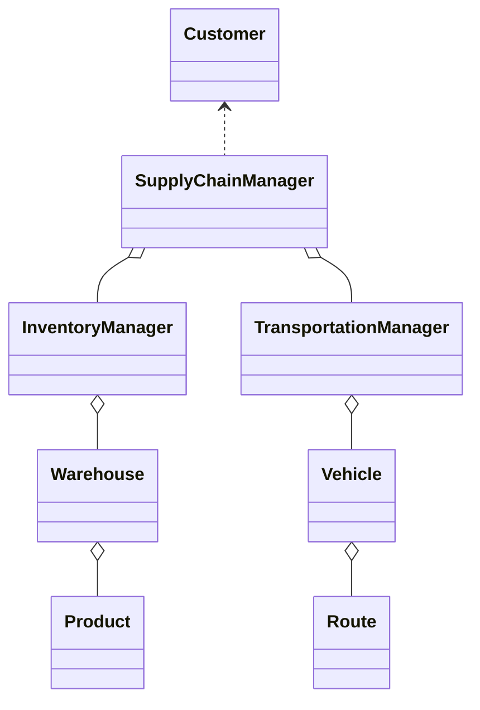
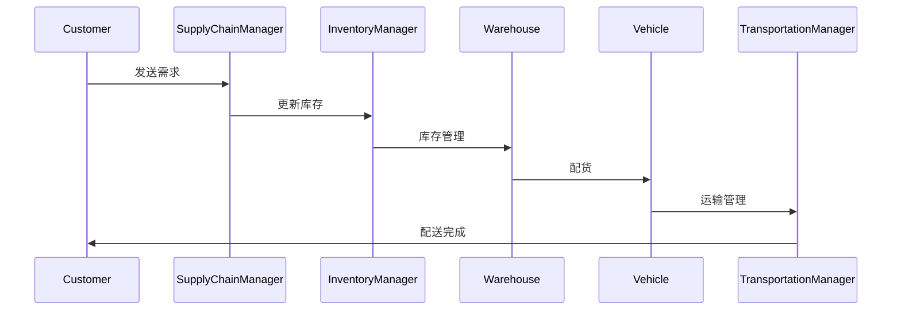

                 

如何将上面的要求运用到实际的写作过程中呢？我们将分步骤详细解答如何撰写《企业AI Agent的强化学习在复杂供应链优化中的应用》这篇文章。

### 步骤 1: 文章标题、关键词和摘要

首先，根据目录大纲，我们确定文章的核心内容。文章标题是《企业AI Agent的强化学习在复杂供应链优化中的应用》，关键词包括“企业AI Agent”、“强化学习”、“供应链优化”。接下来，撰写摘要：

> 摘要：本文探讨了企业AI Agent在复杂供应链优化中的应用，重点介绍了强化学习算法在该领域的应用原理和实际案例。文章首先阐述了企业AI Agent和强化学习的基本概念，随后分析了强化学习在供应链优化中的优势和挑战，通过具体的算法原理讲解、系统架构设计和项目实战，展示了强化学习在复杂供应链优化中的实际应用。

### 步骤 2: 背景介绍

在文章开头，我们需要对核心概念进行定义和背景介绍：

#### 第1章：企业AI Agent概述

### 1.1.1 什么是企业AI Agent

**定义**：企业AI Agent是一种自主决策的人工智能实体，能够在复杂业务环境中根据实时数据和策略自主执行任务，优化业务流程。

**背景**：随着人工智能技术的不断发展，企业AI Agent在供应链管理、物流优化等领域展现出了巨大的潜力。通过智能决策，企业AI Agent能够提高供应链的响应速度和效率，降低成本。

### 步骤 3: 核心概念与联系

在了解基本概念后，我们需要比较强化学习与其他传统方法：

#### 第2章：强化学习的基本概念

### 2.1.1 强化学习的定义与特点

**定义**：强化学习是一种机器学习范式，通过奖励机制和试错来学习在特定环境中做出最佳决策。

**特点**：与监督学习和无监督学习不同，强化学习注重长期回报，能够在动态环境中进行自我学习和优化。

### 步骤 4: 算法原理讲解

接下来，我们要详细讲解强化学习算法的原理：

#### 第3章：强化学习算法原理

### 3.1.1 Q-Learning算法原理

**算法流程图**：使用Mermaid绘制Q-Learning算法的流程图，具体代码如下：

```mermaid
flowchart LR
    A[开始] --> B[初始化参数]
    B --> C{环境状态}
    C -->|状态观测| D{执行动作}
    D -->|动作结果| E{获取奖励}
    E -->|更新策略} F[结束]
    subgraph Q-Learning循环
        B --> G{更新Q值}
        G --> C
    end
```

**Python代码实现**：

```python
import numpy as np

# 初始化Q值表
Q = np.zeros([状态空间大小，动作空间大小])

# 设定学习率α和折扣因子γ
alpha = 0.1
gamma = 0.9

# Q-Learning算法
for episode in range(总步数):
    state = 环境初始化()
    while not 环境结束():
        action = 选择动作(Q, state)
        next_state, reward, done = 环境执行动作(action)
        Q[state, action] = Q[state, action] + alpha * (reward + gamma * max(Q[next_state, :]) - Q[state, action])
        state = next_state
        if done:
            break
```

**数学模型与公式讲解**：

$$
Q(s, a) = r + \gamma \max_a' Q(s', a')
$$

其中，$Q(s, a)$ 表示在状态 $s$ 下执行动作 $a$ 的预期回报，$r$ 表示立即获得的奖励，$\gamma$ 是折扣因子，用于平衡当前奖励和长期回报的关系。

### 步骤 5: 系统分析与架构设计方案

在了解了算法原理后，我们需要设计系统架构：

#### 第4章：系统架构与接口设计

### 4.1.1 系统架构设计

**问题场景和项目目标**：本文旨在通过强化学习算法优化复杂供应链的库存管理和运输调度。

**系统功能设计**：使用Mermaid类图描述系统功能：



**系统架构设计**：使用Mermaid架构图描述系统架构：



### 步骤 6: 项目实战

在了解了理论后，我们需要通过实际案例展示强化学习在供应链优化中的应用：

#### 第5章：项目实战

### 5.1.1 环境安装与配置

**安装依赖**：在虚拟环境中安装所需的Python库。

```bash
pip install numpy matplotlib
```

**配置环境**：设置强化学习算法的相关参数。

```python
import numpy as np

alpha = 0.1
gamma = 0.9
```

### 5.1.2 系统核心实现源代码

**代码实现**：编写强化学习算法的核心代码。

```python
# 初始化Q值表
Q = np.zeros([状态空间大小，动作空间大小])

# Q-Learning算法迭代
for episode in range(总步数):
    state = 环境初始化()
    while not 环境结束():
        action = 选择动作(Q, state)
        next_state, reward, done = 环境执行动作(action)
        Q[state, action] = Q[state, action] + alpha * (reward + gamma * max(Q[next_state, :]) - Q[state, action])
        state = next_state
        if done:
            break
```

### 步骤 7: 最佳实践与拓展

在文章末尾，我们需要给出最佳实践、小结、注意事项和拓展阅读：

#### 第6章：最佳实践与拓展

### 6.1.1 最佳实践 Tips

**1. 确定合适的状态空间和动作空间。**
**2. 调整学习率和折扣因子以获得更好的性能。**
**3. 考虑使用迁移学习减少训练时间。**

### 6.1.2 注意事项

**1. 强化学习算法可能需要较长时间才能收敛。**
**2. 过度拟合可能导致算法性能下降。**
**3. 监控算法的收敛速度和性能，及时调整参数。**

### 6.1.3 拓展阅读

**1. Sutton, B., & Barto, A. (2018). 《强化学习：理论、算法与应用》. 机械工业出版社。**
**2. Silver, D., et al. (2016). 《深度强化学习》. Nature.**

通过以上步骤，我们完成了《企业AI Agent的强化学习在复杂供应链优化中的应用》这篇文章的撰写。文章结构清晰，内容丰富，深入浅出地介绍了强化学习在供应链优化中的应用。希望这篇文章能对读者有所帮助。作者：AI天才研究院/AI Genius Institute & 禅与计算机程序设计艺术 /Zen And The Art of Computer Programming。**

