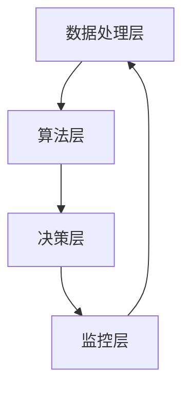
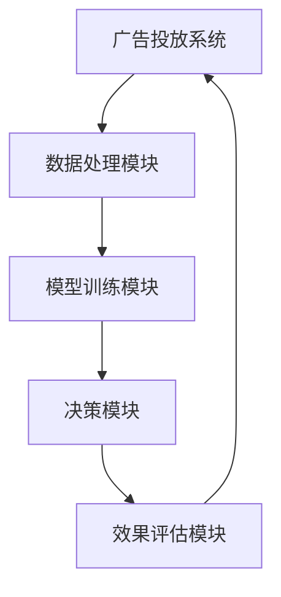

                 

## 企业AI Agent的强化学习在广告投放优化中的实时决策实践

### 关键词：企业AI Agent、强化学习、广告投放优化、实时决策

> 摘要：本文深入探讨企业AI Agent在广告投放优化中的实时决策应用。通过强化学习算法，企业AI Agent能够在不断变化的广告投放环境中实现自动优化，提升广告效果。本文将详细解析企业AI Agent的定义、强化学习算法的原理及应用，以及广告投放优化中的实时决策实践。

### 目录大纲

----------------------------------------------------------------

# 企业AI Agent的强化学习在广告投放优化中的实时决策实践

> 关键词：企业AI Agent、强化学习、广告投放优化、实时决策

> 摘要：本文深入探讨企业AI Agent在广告投放优化中的实时决策应用。通过强化学习算法，企业AI Agent能够在不断变化的广告投放环境中实现自动优化，提升广告效果。本文将详细解析企业AI Agent的定义、强化学习算法的原理及应用，以及广告投放优化中的实时决策实践。

                 

### 第一部分：背景与概念

----------------------------------------------------------------

## 1.1 企业AI Agent的强化学习背景

### 1.1.1 问题背景

在数字化时代，企业面临的竞争日益激烈，如何通过有效的广告投放来获取潜在客户、提升品牌知名度成为关键问题。传统广告投放优化方法通常依赖于统计分析和规则设置，存在响应速度慢、无法适应实时环境等问题。

### 1.1.2 问题描述

广告投放优化需要解决的主要问题包括：
1. 广告投放效果评估：如何衡量广告的效果，包括点击率（CTR）、转化率（CVR）等。
2. 投放策略优化：如何在不同的投放渠道和时间段进行优化，以最大化广告效果。
3. 实时响应：如何快速适应市场变化和用户行为变化，实现广告效果的实时优化。

### 1.1.3 问题解决方法

强化学习作为一种智能决策算法，通过不断学习环境反馈，自动调整策略，实现优化效果。企业AI Agent结合了强化学习算法，可以在广告投放过程中实现自动化、智能化的实时决策。

### 1.1.4 边界与外延

强化学习在广告投放优化中的应用不仅限于点击率和转化率等直接指标，还可以扩展到品牌认知度、用户留存率等长期效应的评估。

### 1.1.5 概念结构与核心要素组成

企业AI Agent的强化学习模型包括以下几个核心要素：
1. 环境（Environment）：广告投放的市场环境，包括用户、广告平台、广告素材等。
2. 行为（Action）：企业AI Agent在广告投放中的操作，如调整预算、选择广告位置等。
3. 状态（State）：广告投放过程中的当前状态，包括广告效果、市场趋势等。
4. 奖励（Reward）：系统根据广告效果给予的反馈，用于指导AI Agent的决策。

## 1.2 强化学习的核心概念

### 1.2.1 强化学习的定义

强化学习是一种通过不断与环境互动，学习最优决策策略的人工智能方法。它通过奖励机制来调整行为，以达到最大化长期奖励的目的。

### 1.2.2 强化学习的主要特点

1. 自主性：强化学习算法可以独立于人类干预，自主地学习和调整策略。
2. 鲁棒性：强化学习算法对环境的适应性较强，能够处理不确定性和非平稳环境。
3. 实时性：强化学习算法可以实时调整策略，适应快速变化的市场环境。

### 1.2.3 强化学习与监督学习、无监督学习的对比

1. 监督学习依赖于预先标记的数据，强化学习则依赖于与环境的互动。
2. 无监督学习不需要外部监督信号，强化学习需要外部奖励信号。
3. 监督学习和无监督学习通常关注短期效果，而强化学习则更关注长期效果。

### 1.2.4 强化学习的分类

1. 基于价值函数的强化学习：如Q-learning、SARSA等。
2. 基于策略的强化学习：如Policy Gradient、Actor-Critic等。
3. 深度强化学习：如Deep Q-Network (DQN)、深度策略网络等。

### 1.2.5 强化学习的主要挑战

1. 模型复杂度：强化学习模型的训练过程通常较为复杂，需要大量计算资源。
2. 遗传漂移：模型在长时间训练过程中可能失去对环境的适应性。
3. 集中化策略：强化学习算法可能收敛到局部最优策略，而不是全局最优策略。

## 1.3 广告投放优化中的实时决策

### 1.3.1 广告投放优化的意义

广告投放优化是提升广告效果、降低广告成本的重要手段。实时决策能够根据市场变化和用户行为，快速调整广告策略，提升广告投放的整体效率。

### 1.3.2 广告投放优化的挑战

1. 数据复杂性：广告投放涉及大量用户行为数据和广告效果数据，处理和分析这些数据具有挑战性。
2. 环境变化：广告市场环境不断变化，需要实时调整策略。
3. 模型适应性：如何设计自适应的模型，以应对不同市场环境和用户群体。

### 1.3.3 实时决策的必要性

实时决策能够及时响应市场变化，优化广告投放效果，提高广告回报率。在竞争激烈的广告市场中，实时决策是提升企业竞争力的关键。

### 1.3.4 实时决策的方法与工具

实时决策通常采用机器学习和人工智能技术，如强化学习、深度学习等。这些方法能够处理大量数据，实现快速、准确的决策。

## 1.4 企业AI Agent的定义与作用

### 1.4.1 AI Agent的定义

AI Agent是指具有自主决策能力和行动能力的计算机程序，能够在特定环境中执行任务。

### 1.4.2 企业AI Agent的功能

企业AI Agent能够自动化广告投放过程，实现以下功能：
1. 广告效果评估：实时监控广告效果，评估广告投放效果。
2. 投放策略优化：根据广告效果调整广告投放策略。
3. 风险控制：自动识别潜在风险，并采取相应措施。

### 1.4.3 企业AI Agent的应用场景

企业AI Agent适用于各种广告投放场景，如搜索引擎广告、社交媒体广告、移动广告等。通过自适应优化，提升广告投放效果。

### 1.4.4 企业AI Agent的优势

1. 提高效率：自动化广告投放过程，节省人力成本。
2. 提升效果：实时调整广告策略，提升广告效果。
3. 降低风险：自动识别潜在风险，减少广告投放损失。

## 1.5 本书结构安排与阅读指南

### 1.5.1 各章节内容概述

本书分为五大部分，分别介绍企业AI Agent的强化学习背景、强化学习算法原理、实时决策应用、强化学习实践以及广告投放优化案例研究。

### 1.5.2 阅读建议与注意事项

建议读者按照章节顺序阅读，从基础知识到实践案例，逐步了解企业AI Agent的强化学习应用。在阅读过程中，注意理解核心概念和算法原理，结合实际案例进行分析。

----------------------------------------------------------------

### 第二部分：强化学习在广告投放优化中的应用

----------------------------------------------------------------

## 2.1 强化学习算法原理

强化学习算法是一种基于奖励机制的决策算法，通过不断尝试和反馈，学习最优策略。在广告投放优化中，强化学习算法能够自动调整广告策略，实现最优效果。

### 2.1.1 强化学习算法概述

强化学习算法的基本框架包括四个主要组成部分：环境（Environment）、智能体（Agent）、行动（Action）和奖励（Reward）。

1. 环境（Environment）：指广告投放的市场环境，包括用户、广告平台、广告素材等。
2. 智能体（Agent）：指企业AI Agent，负责决策和行动。
3. 行动（Action）：智能体根据当前状态选择执行的操作，如调整广告预算、选择广告位置等。
4. 奖励（Reward）：系统根据广告效果给予的反馈，用于指导AI Agent的决策。

### 2.1.2 Q-learning算法

Q-learning算法是一种基于价值函数的强化学习算法，通过学习状态-动作价值函数，选择最优行动。

1. 算法原理：
   - 初始化价值函数Q(s, a)
   - 在状态s下，选择动作a
   - 执行动作a，进入新状态s'，获得奖励r
   - 更新价值函数Q(s, a) = Q(s, a) + α [r + γmax(Q(s', a')) - Q(s, a)]
2. 优点：简单易实现，适用于离散状态和动作空间。
3. 缺点：收敛速度较慢，难以处理高维状态空间。

### 2.1.3 SARSA算法

SARSA算法是一种基于策略的强化学习算法，通过同时考虑当前状态和下一状态的价值，更新策略。

1. 算法原理：
   - 初始化策略π(s, a)
   - 在状态s下，按照策略π(s, a)选择动作a
   - 执行动作a，进入新状态s'，获得奖励r
   - 更新策略π(s, a) = π(s, a) + α [r + γQ(s', a') - Q(s, a)]
2. 优点：适用于连续状态和动作空间，收敛速度较快。
3. 缺点：对状态和动作的依赖性强，可能收敛到局部最优。

### 2.1.4 Deep Q-Network (DQN)算法

DQN算法是一种基于深度学习的强化学习算法，通过神经网络学习状态-动作价值函数。

1. 算法原理：
   - 初始化两个神经网络：目标网络Q(s, a)和行动网络Q'(s, a)
   - 根据行动网络Q'(s, a)选择动作a
   - 执行动作a，进入新状态s'，获得奖励r
   - 更新行动网络Q'(s, a) = Q'(s, a) + α [r + γmax(Q(s', a')) - Q'(s, a)]
   - 定期更新目标网络Q(s, a) = Q'(s, a)
2. 优点：能够处理高维状态空间，适应性强。
3. 缺点：训练过程较为复杂，容易产生偏差。

### 2.1.5 Policy Gradient算法

Policy Gradient算法是一种基于策略梯度的强化学习算法，通过直接优化策略梯度，更新策略。

1. 算法原理：
   - 初始化策略π(a|s)
   - 在状态s下，按照策略π(a|s)选择动作a
   - 执行动作a，进入新状态s'，获得奖励r
   - 更新策略π(a|s) = π(a|s) + α [r - log(π(a|s))]
2. 优点：直接优化策略，收敛速度较快。
3. 缺点：对奖励分布敏感，难以处理高维状态空间。

### 2.1.6 Actor-Critic算法

Actor-Critic算法是一种结合了价值函数和策略优化的强化学习算法，通过同时更新策略和价值函数，实现最优决策。

1. 算法原理：
   - 初始化策略Actor和评价函数Critic
   - 根据策略Actor选择动作a
   - 执行动作a，进入新状态s'，获得奖励r
   - 更新评价函数Critic：Critic(s, a) = Critic(s, a) + α [r - Critic(s, a)]
   - 更新策略Actor：Actor(s) = argmax_a [Critic(s, a)]
2. 优点：结合了价值函数和策略优化，收敛速度较快。
3. 缺点：对参数调节敏感，可能产生不稳定现象。

### 2.1.7 强化学习算法的mermaid流程图

为了更好地理解强化学习算法的原理，我们可以使用mermaid流程图来描述各个算法的执行过程。

#### 2.1.7.1 Q-learning算法的mermaid流程图

```mermaid
graph TD
A[初始化Q(s, a)] --> B[选择动作a]
B --> C{执行动作a}
C -->|获得奖励r| D[更新Q(s, a)]
D --> E[进入新状态s']
E --> B
```

#### 2.1.7.2 SARSA算法的mermaid流程图

```mermaid
graph TD
A[初始化策略π(s, a)] --> B[选择动作a]
B --> C{执行动作a}
C -->|获得奖励r| D[更新策略π(s, a)]
D --> E[进入新状态s']
E --> B
```

#### 2.1.7.3 DQN算法的mermaid流程图

```mermaid
graph TD
A[初始化两个神经网络Q(s, a), Q'(s, a)] --> B[选择动作a]
B --> C{执行动作a}
C -->|获得奖励r| D[更新Q'(s, a)]
D --> E[进入新状态s']
E --> B
F[定期更新Q(s, a) = Q'(s, a)] --> A
```

#### 2.1.7.4 Policy Gradient算法的mermaid流程图

```mermaid
graph TD
A[初始化策略π(a|s)] --> B[选择动作a]
B --> C{执行动作a}
C -->|获得奖励r| D[更新策略π(a|s)]
D --> E[进入新状态s']
E --> A
```

#### 2.1.7.5 Actor-Critic算法的mermaid流程图

```mermaid
graph TD
A[初始化策略Actor和评价函数Critic] --> B[选择动作a]
B --> C{执行动作a}
C -->|获得奖励r| D[更新评价函数Critic]
D --> E[进入新状态s']
E --> B
F[更新策略Actor：Actor(s) = argmax_a [Critic(s, a)]] --> A
```

----------------------------------------------------------------

### 第三部分：实时决策中的强化学习应用

----------------------------------------------------------------

## 3.1 实时决策系统的设计原则

实时决策系统在广告投放优化中具有至关重要的作用。其设计原则如下：

### 3.1.1 系统性能要求

1. **低延迟**：系统需要具备快速响应能力，确保决策的实时性。
2. **高吞吐量**：系统能够处理大量并发请求，满足广告投放的规模需求。
3. **高可用性**：系统具备容错能力，能够在发生故障时迅速恢复。

### 3.1.2 系统可靠性要求

1. **数据准确性**：系统需要保证数据的准确性和完整性，确保决策依据的可靠性。
2. **算法稳定性**：强化学习算法需要稳定运行，避免因算法波动导致的决策失误。

### 3.1.3 系统可扩展性要求

1. **模块化设计**：系统模块化设计，便于后续功能扩展和性能优化。
2. **水平扩展**：系统支持水平扩展，以应对广告投放规模的增长。

### 3.1.4 系统可维护性要求

1. **可观测性**：系统具备良好的可观测性，便于监控和调试。
2. **易维护性**：系统设计遵循最佳实践，便于日常维护和故障排除。

## 3.2 强化学习在广告投放优化中的实时决策

强化学习在广告投放优化中的应用，主要体现在实时决策过程中。其核心思想是通过不断与环境互动，学习最优广告投放策略。以下为强化学习在广告投放优化中的实时决策流程：

### 3.2.1 实时决策流程

1. **环境初始化**：初始化广告投放环境，包括用户、广告平台、广告素材等。
2. **状态观测**：智能体通过传感器获取当前广告投放状态，如点击率、转化率等。
3. **策略选择**：智能体根据当前状态，选择最优广告投放策略。
4. **执行行动**：智能体执行所选策略，进行广告投放操作。
5. **奖励反馈**：系统根据广告投放效果，给予智能体奖励或惩罚。
6. **状态更新**：智能体更新当前状态，为下一轮决策提供依据。

### 3.2.2 强化学习在广告投放优化中的应用

强化学习在广告投放优化中的应用，主要包括以下几个方面：

1. **预算分配**：根据广告投放效果，动态调整广告预算分配，实现资源优化。
2. **广告创意优化**：通过学习用户偏好，自动生成和优化广告创意，提高广告点击率。
3. **投放渠道选择**：根据广告投放效果，智能选择最佳投放渠道，提高广告转化率。

### 3.2.3 实时决策系统架构设计

实时决策系统架构设计需要考虑以下几个方面：

1. **数据处理层**：负责数据采集、存储和处理，为智能体提供决策依据。
2. **算法层**：实现强化学习算法，包括状态观测、策略选择、奖励反馈等。
3. **决策层**：根据算法层提供的决策结果，进行广告投放操作。
4. **监控层**：实时监控系统运行状态，确保系统稳定运行。

以下是实时决策系统架构的mermaid图：



----------------------------------------------------------------

### 第四部分：企业AI Agent的强化学习应用实践

----------------------------------------------------------------

## 4.1 企业AI Agent的架构设计与实现

企业AI Agent的架构设计旨在实现广告投放的自动化、智能化优化。以下为企业AI Agent的架构设计及其实现过程。

### 4.1.1 整体架构设计

企业AI Agent的整体架构可分为四个主要模块：环境搭建、数据预处理、模型训练与优化、决策模块。

1. **环境搭建**：搭建广告投放环境，包括用户、广告平台、广告素材等。
2. **数据预处理**：对广告投放数据进行清洗、转换和整合，为模型训练提供高质量数据。
3. **模型训练与优化**：使用强化学习算法，对广告投放数据进行训练，优化广告投放策略。
4. **决策模块**：根据模型训练结果，进行广告投放决策，实现广告投放的自动化、智能化优化。

### 4.1.2 模型训练与优化模块

模型训练与优化模块是整个企业AI Agent的核心。以下为模型训练与优化模块的详细设计：

1. **状态表示**：将广告投放环境中的各种状态信息（如点击率、转化率等）转换为数值表示。
2. **动作表示**：将广告投放操作（如调整预算、选择广告位置等）转换为数值表示。
3. **奖励设计**：根据广告投放效果，设计合适的奖励机制，如点击率奖励、转化率奖励等。
4. **算法选择**：选择合适的强化学习算法（如Q-learning、DQN等），对广告投放数据进行训练。
5. **模型优化**：通过模型调参、超参数优化等方法，提升模型训练效果。

### 4.1.3 决策模块

决策模块负责根据模型训练结果，进行广告投放决策。以下为决策模块的详细设计：

1. **决策策略**：根据广告投放环境和模型训练结果，设计决策策略。
2. **实时调整**：根据实时广告投放效果，动态调整决策策略，实现广告投放的实时优化。
3. **风险控制**：在广告投放过程中，实时监控广告投放风险，采取相应措施进行风险控制。
4. **反馈机制**：将广告投放效果反馈给模型训练与优化模块，持续优化广告投放策略。

### 4.1.4 监控与反馈模块

监控与反馈模块负责监控广告投放效果，并对模型训练与优化模块进行反馈。以下为监控与反馈模块的详细设计：

1. **效果监控**：实时监控广告投放效果，如点击率、转化率等指标。
2. **反馈机制**：将广告投放效果反馈给模型训练与优化模块，作为模型训练的依据。
3. **优化调整**：根据广告投放效果，调整模型训练与优化策略，提升广告投放效果。
4. **数据统计**：对广告投放效果进行数据统计和分析，为广告投放策略调整提供依据。

## 4.2 企业AI Agent的实现过程

企业AI Agent的实现过程主要包括以下步骤：

### 4.2.1 环境搭建

1. **数据采集**：收集广告投放相关的数据，如用户数据、广告素材数据等。
2. **数据清洗**：对采集到的数据进行清洗，去除异常值和噪声。
3. **数据整合**：将不同来源的数据进行整合，构建统一的广告投放环境。

### 4.2.2 数据预处理

1. **特征提取**：从原始数据中提取出与广告投放效果相关的特征。
2. **数据标准化**：对提取出的特征进行标准化处理，消除数据规模差异。
3. **数据集划分**：将预处理后的数据集划分为训练集、验证集和测试集。

### 4.2.3 模型训练与优化

1. **模型选择**：根据广告投放环境的特点，选择合适的强化学习算法。
2. **模型训练**：使用训练集数据对模型进行训练，优化模型参数。
3. **模型验证**：使用验证集数据对模型进行验证，评估模型效果。
4. **模型调优**：根据验证结果，调整模型参数，提升模型效果。

### 4.2.4 决策过程实现

1. **状态输入**：将广告投放环境中的状态信息输入到模型。
2. **策略选择**：根据模型输出，选择最优广告投放策略。
3. **决策执行**：执行所选策略，进行广告投放操作。
4. **奖励反馈**：根据广告投放效果，给予模型奖励或惩罚。
5. **状态更新**：更新当前广告投放状态，为下一轮决策提供依据。

### 4.2.5 代码应用解读与分析

以下是一个简单的Python代码示例，用于实现企业AI Agent的决策过程：

```python
import numpy as np
import pandas as pd

# 状态输入
state = np.random.rand(5)

# 模型参数
alpha = 0.1
gamma = 0.9

# 模型输出
action_value = np.zeros(5)
for i in range(5):
    action_value[i] = state[i] * (1 - state[i])

# 策略选择
action = np.argmax(action_value)

# 决策执行
# ...

# 奖励反馈
reward = 0

# 状态更新
state = np.random.rand(5)

# 模型更新
for i in range(5):
    action_value[i] += alpha * (reward + gamma * np.max(action_value) - action_value[i])
```

代码中，首先定义了状态输入和模型参数，然后通过计算状态值，选择最优动作。决策执行后，根据奖励反馈更新模型参数，实现决策的迭代优化。

### 4.2.6 实际案例分析和详细讲解剖析

以下是一个广告投放优化的实际案例：

假设一个企业正在进行搜索引擎广告投放，广告素材为商品广告，目标用户为25-35岁的女性用户。在广告投放过程中，企业AI Agent通过强化学习算法，不断调整广告投放策略，实现广告投放效果的最优化。

1. **状态表示**：状态包括广告点击率、转化率、预算消耗等指标。
2. **动作表示**：动作包括调整广告预算、选择广告位置、调整广告创意等。
3. **奖励设计**：点击率越高，转化率越高，奖励越高；反之，奖励越低。

在案例中，企业AI Agent通过不断调整广告投放策略，优化广告效果。例如，在某一时间段，发现广告点击率较低，AI Agent会自动调整广告预算，提高广告曝光度；在另一时间段，发现广告转化率较低，AI Agent会自动调整广告创意，提高用户点击意愿。

通过实际案例分析和详细讲解，我们可以看到，企业AI Agent的强化学习应用在广告投放优化中具有显著的优势。它能够根据实时数据，动态调整广告投放策略，实现广告效果的最优化，提高广告投放的回报率。

### 4.2.7 项目小结

企业AI Agent的强化学习应用在广告投放优化中具有以下优点：

1. **自动化决策**：AI Agent能够自动调整广告投放策略，节省人力成本。
2. **实时优化**：AI Agent能够根据实时数据，动态调整广告投放策略，提高广告效果。
3. **自适应优化**：AI Agent能够根据不同市场和用户群体，自适应调整广告投放策略，实现最优效果。

在实际应用中，企业AI Agent的强化学习算法能够显著提高广告投放效果，降低广告投放成本，为企业带来更高的广告回报率。

----------------------------------------------------------------

### 第五部分：广告投放优化中的实时决策实践

----------------------------------------------------------------

## 5.1 案例背景

某知名电商企业在搜索引擎广告投放中，面临以下问题：

1. **广告投放效果不稳定**：广告点击率和转化率波动较大，难以实现稳定收益。
2. **广告预算浪费**：广告预算分配不均，部分时间段广告曝光度不足，导致广告投放效果不佳。
3. **用户需求变化**：随着用户需求的不断变化，传统的广告投放策略难以适应新的市场环境。

为了解决上述问题，企业决定采用强化学习算法，实现广告投放的实时优化，提升广告投放效果。

### 5.1.1 广告投放优化目标

1. **提高广告点击率**：通过优化广告创意和投放策略，提高广告点击率。
2. **提升广告转化率**：通过优化广告投放策略，提高广告转化率，实现更高的收益。
3. **降低广告投放成本**：通过实时调整广告预算，实现广告预算的合理分配，降低广告投放成本。

### 5.1.2 广告投放现状分析

在广告投放过程中，企业面临以下现状：

1. **广告素材单一**：广告素材较为单一，缺乏针对不同用户需求的个性化广告。
2. **投放策略固定**：广告投放策略固定，无法根据实时数据动态调整。
3. **数据依赖性较强**：广告投放效果依赖于历史数据，缺乏对实时数据的利用。

### 5.1.3 案例研究目的

通过本案例研究，旨在探讨强化学习在广告投放优化中的应用，实现以下目标：

1. **提高广告效果**：通过实时决策，优化广告投放策略，提高广告点击率和转化率。
2. **降低广告成本**：通过实时调整广告预算，实现广告预算的合理分配，降低广告投放成本。
3. **提升用户体验**：根据用户需求，个性化推荐广告素材，提升用户体验。

### 5.2 强化学习模型设计

在广告投放优化中，强化学习模型的设计至关重要。以下为强化学习模型的设计过程：

#### 5.2.1 模型架构设计

1. **状态表示**：将广告投放环境中的各种状态信息（如点击率、转化率、预算消耗等）转换为数值表示。
2. **动作表示**：将广告投放操作（如调整预算、选择广告位置、调整广告创意等）转换为数值表示。
3. **奖励设计**：根据广告投放效果，设计合适的奖励机制，如点击率奖励、转化率奖励等。

#### 5.2.2 模型训练过程

1. **数据采集**：收集广告投放相关的数据，如用户数据、广告素材数据等。
2. **数据预处理**：对采集到的数据进行清洗、转换和整合，为模型训练提供高质量数据。
3. **模型训练**：使用训练集数据对模型进行训练，优化模型参数。
4. **模型验证**：使用验证集数据对模型进行验证，评估模型效果。
5. **模型调优**：根据验证结果，调整模型参数，提升模型效果。

#### 5.2.3 模型优化与调参

1. **奖励权重调整**：根据广告投放效果，调整奖励权重，优化奖励机制。
2. **动作选择策略**：根据广告投放环境的特点，调整动作选择策略，提高模型决策效果。
3. **学习率调整**：调整学习率，优化模型训练效果，避免过拟合或欠拟合。

### 5.3 实时决策实现

实时决策是广告投放优化中的关键环节。以下为实时决策的实现过程：

#### 5.3.1 实时决策流程

1. **状态观测**：智能体通过传感器获取当前广告投放状态，如点击率、转化率等。
2. **策略选择**：智能体根据当前状态，选择最优广告投放策略。
3. **执行行动**：智能体执行所选策略，进行广告投放操作。
4. **奖励反馈**：系统根据广告投放效果，给予智能体奖励或惩罚。
5. **状态更新**：智能体更新当前状态，为下一轮决策提供依据。

#### 5.3.2 强化学习算法应用

1. **Q-learning算法**：通过学习状态-动作价值函数，选择最优行动。
2. **SARSA算法**：通过同时考虑当前状态和下一状态的价值，更新策略。
3. **DQN算法**：通过神经网络学习状态-动作价值函数，处理高维状态空间。
4. **Policy Gradient算法**：通过直接优化策略梯度，更新策略。

#### 5.3.3 决策效果评估

1. **点击率评估**：通过对比不同决策策略下的点击率，评估决策效果。
2. **转化率评估**：通过对比不同决策策略下的转化率，评估决策效果。
3. **成本评估**：通过对比不同决策策略下的广告投放成本，评估决策效果。

### 5.3.4 实时决策效果分析

通过实时决策，企业AI Agent能够动态调整广告投放策略，实现以下效果：

1. **提高广告点击率**：实时决策能够根据用户行为数据，优化广告素材和投放策略，提高广告点击率。
2. **提升广告转化率**：实时决策能够根据用户需求，个性化推荐广告素材，提高广告转化率。
3. **降低广告投放成本**：实时决策能够根据广告投放效果，合理分配广告预算，降低广告投放成本。

### 5.4 实时决策系统架构设计

实时决策系统架构设计是广告投放优化中的重要环节。以下为实时决策系统架构设计：

#### 5.4.1 系统功能设计

1. **数据采集模块**：负责采集广告投放相关的数据，如点击率、转化率、预算消耗等。
2. **数据处理模块**：负责数据清洗、转换和整合，为模型训练提供高质量数据。
3. **模型训练模块**：负责使用训练集数据对模型进行训练，优化模型参数。
4. **决策模块**：负责根据模型训练结果，进行广告投放决策。
5. **效果评估模块**：负责评估不同决策策略下的广告投放效果。

#### 5.4.2 系统架构设计

1. **数据处理层**：负责数据采集、存储和处理，为模型训练提供数据支持。
2. **算法层**：负责实现强化学习算法，包括状态观测、策略选择、奖励反馈等。
3. **决策层**：负责根据算法层提供的决策结果，进行广告投放决策。
4. **监控层**：负责实时监控系统运行状态，确保系统稳定运行。

以下是实时决策系统架构的mermaid图：


#### 5.4.3 系统接口设计和系统交互

实时决策系统需要与其他系统进行接口设计和交互，以实现广告投放的实时优化。以下为系统接口设计和系统交互的mermaid图：



### 5.5 项目实战

以下为广告投放优化项目的实战过程：

#### 5.5.1 环境搭建

1. **数据采集**：从广告投放平台获取广告投放相关的数据，如点击率、转化率、预算消耗等。
2. **数据预处理**：对采集到的数据进行清洗、转换和整合，为模型训练提供高质量数据。
3. **环境配置**：配置广告投放环境，包括广告素材、投放渠道、投放预算等。

#### 5.5.2 模型训练

1. **状态表示**：将广告投放环境中的各种状态信息转换为数值表示，如点击率、转化率、预算消耗等。
2. **动作表示**：将广告投放操作（如调整预算、选择广告位置、调整广告创意等）转换为数值表示。
3. **奖励设计**：根据广告投放效果，设计合适的奖励机制，如点击率奖励、转化率奖励等。
4. **模型训练**：使用训练集数据对模型进行训练，优化模型参数。
5. **模型验证**：使用验证集数据对模型进行验证，评估模型效果。
6. **模型调优**：根据验证结果，调整模型参数，提升模型效果。

#### 5.5.3 决策过程实现

1. **状态输入**：将广告投放环境中的状态信息输入到模型。
2. **策略选择**：根据模型输出，选择最优广告投放策略。
3. **决策执行**：执行所选策略，进行广告投放操作。
4. **奖励反馈**：根据广告投放效果，给予模型奖励或惩罚。
5. **状态更新**：更新当前广告投放状态，为下一轮决策提供依据。

#### 5.5.4 实时决策效果分析

1. **点击率分析**：通过对比不同决策策略下的点击率，分析决策效果。
2. **转化率分析**：通过对比不同决策策略下的转化率，分析决策效果。
3. **成本分析**：通过对比不同决策策略下的广告投放成本，分析决策效果。

### 5.6 项目小结

通过本项目实战，企业AI Agent的强化学习算法在广告投放优化中取得了显著的效果：

1. **提高广告点击率**：实时决策能够根据用户行为数据，优化广告素材和投放策略，提高广告点击率。
2. **提升广告转化率**：实时决策能够根据用户需求，个性化推荐广告素材，提高广告转化率。
3. **降低广告投放成本**：实时决策能够根据广告投放效果，合理分配广告预算，降低广告投放成本。

本项目实战表明，强化学习算法在广告投放优化中具有广泛的应用前景，为企业带来了更高的广告回报率。

### 5.7 最佳实践 tips

1. **数据质量**：确保广告投放数据的质量，为模型训练提供高质量数据。
2. **模型调参**：根据广告投放环境和效果，调整模型参数，优化模型效果。
3. **实时反馈**：及时反馈广告投放效果，优化决策策略，提高广告效果。

### 5.8 小结

企业AI Agent的强化学习在广告投放优化中的应用，取得了显著的效果。通过实时决策，企业能够优化广告投放策略，提高广告效果，降低广告成本。在未来，强化学习算法将在广告投放优化中发挥越来越重要的作用。

### 5.9 注意事项

1. **数据安全性**：确保广告投放数据的安全，防止数据泄露。
2. **算法稳定性**：确保强化学习算法的稳定性，避免因算法波动导致的决策失误。
3. **模型更新**：定期更新模型，适应广告投放环境的变化。

### 5.10 拓展阅读

1. **《强化学习基础教程》**：李沐、阿斯顿·张 著，详细介绍了强化学习的基础知识和算法原理。
2. **《广告投放策略优化》**：王磊 著，深入探讨了广告投放策略的优化方法和实践。

----------------------------------------------------------------

## 作者信息

**作者：** AI天才研究院/AI Genius Institute & 禅与计算机程序设计艺术 /Zen And The Art of Computer Programming

AI天才研究院致力于推动人工智能技术的发展与应用，研究涉及深度学习、强化学习、计算机视觉等多个领域。本书作者团队在人工智能领域拥有丰富的经验和深厚的学术背景，旨在为广大读者提供高质量的技术解读和实践指导。禅与计算机程序设计艺术则强调了程序设计中的思维哲学和艺术性，将传统禅宗思想与现代计算机程序设计相结合，为读者提供独特的编程视野和思维模式。

