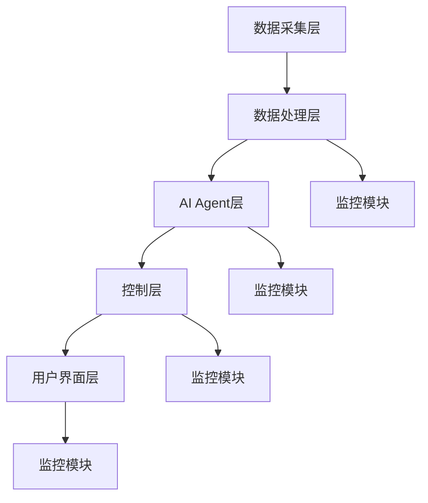
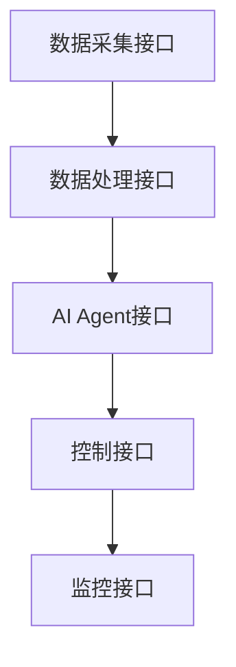
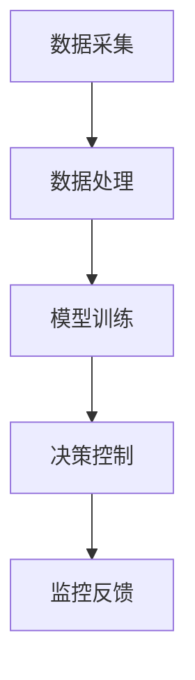

                 

### # 企业AI Agent的强化学习在智慧城市管理中的应用

#### 关键词：企业AI Agent，强化学习，智慧城市，管理，技术应用

> 摘要：本文深入探讨了企业AI Agent的强化学习在智慧城市管理中的应用。通过分析AI Agent的基本概念、强化学习原理，以及其在智慧城市中的具体应用场景，本文旨在为读者提供一个清晰的理解和实际应用指导。文章首先介绍了智慧城市管理和AI Agent的背景，随后详细阐述了强化学习的核心概念和应用方法，最后通过具体案例和实施步骤，展示了企业AI Agent在智慧城市管理中的潜力。

## 引言

在当今信息时代，智慧城市的概念逐渐成为城市发展的新趋势。智慧城市通过整合物联网、大数据、人工智能等技术，实现对城市资源、环境和公共服务的智能管理和优化。AI Agent作为人工智能领域的一个重要分支，其在智慧城市中的应用尤为引人注目。

### 1.1 问题背景

#### 智慧城市管理

智慧城市管理是利用先进的信息技术和人工智能技术，对城市运行过程中的各种数据进行采集、分析、处理和反馈，从而实现城市资源的优化配置和城市管理的智能化。智慧城市管理涉及到交通、能源、环保、公共安全等多个领域，其核心在于提高城市运行的效率和可持续性。

#### AI Agent的兴起

AI Agent是一种能够自主学习和决策的人工智能实体，它们在智慧城市中的应用主要包括自动交通信号控制、智能垃圾回收管理、智慧能源管理等。AI Agent的兴起，为智慧城市管理提供了强大的技术支持，能够实现更加精准、高效的城市管理。

### 1.2 问题描述

#### AI Agent的概念

AI Agent是一种能够模拟人类智能行为的人工智能实体，它可以感知环境、制定计划、采取行动并评估行动的效果。AI Agent的核心在于其自主学习和决策能力，这使得它们能够适应不断变化的城市环境，提高城市管理的智能化水平。

#### 强化学习的重要性

强化学习是一种使AI Agent能够在复杂环境中通过试错和反馈进行学习和优化的方法。在智慧城市管理中，强化学习可以用于优化交通信号控制、能源消耗管理、环境监测等多个方面，从而实现城市资源的优化配置和城市管理的智能化。

### 1.3 问题解决方案

#### 企业AI Agent

企业AI Agent是指专门为企业或组织提供智能服务的AI Agent，它们通常具备较强的自主学习和决策能力，能够帮助企业优化业务流程、提高工作效率。在智慧城市管理中，企业AI Agent可以应用于智能交通管理、智慧能源管理、智慧安防等领域，为城市管理者提供智能化解决方案。

#### 强化学习在智慧城市管理中的应用

强化学习在智慧城市管理中的应用主要包括以下几个方面：

1. **智能交通管理**：通过强化学习算法优化交通信号控制和交通流量管理，提高道路通行效率和减少交通拥堵。
2. **智慧能源管理**：通过强化学习算法优化能源消耗管理，实现能源的节约和高效利用。
3. **环境监测**：通过强化学习算法实时监测城市环境，预测和应对环境污染问题。

### 1.4 边界和范围

#### 智慧城市管理的定义和范围

智慧城市管理是指利用先进的信息技术和人工智能技术，对城市运行过程中的各种数据进行采集、分析、处理和反馈，从而实现城市资源的优化配置和城市管理的智能化。智慧城市管理涉及交通、能源、环保、公共安全等多个领域。

#### 企业AI Agent的定义和范围

企业AI Agent是指专门为企业或组织提供智能服务的AI Agent，它们通常具备较强的自主学习和决策能力，能够帮助企业优化业务流程、提高工作效率。企业AI Agent在智慧城市管理中的应用，主要是为了实现城市资源的优化配置和城市管理的智能化。

#### 强化学习的定义和范围

强化学习是一种使AI Agent能够在复杂环境中通过试错和反馈进行学习和优化的方法。在智慧城市管理中，强化学习主要用于优化交通信号控制、能源消耗管理、环境监测等多个方面，实现城市资源的优化配置和城市管理的智能化。

### 1.5 文章结构

本文将首先介绍AI Agent的基本概念和强化学习的原理，然后探讨AI Agent在智慧城市管理中的应用，最后通过具体案例和实施步骤，展示企业AI Agent在智慧城市管理中的实际应用。

### 1.6 结论

本文通过深入分析企业AI Agent的强化学习在智慧城市管理中的应用，旨在为读者提供一个全面的技术解决方案和应用指导。通过本文的探讨，我们可以看到AI Agent和强化学习在智慧城市管理中的重要性和潜力，为未来的智慧城市建设提供了新的思路和方法。

---

### 2.1 AI Agent的基本概念

#### 定义

AI Agent是一种具有自主感知、决策和学习能力的人工智能实体，它们能够在复杂的环境中通过学习不断优化自己的行为。AI Agent的核心在于其自主性和学习能力，这使得它们能够适应不断变化的环境，实现自主决策和自主行动。

#### 类型

AI Agent根据不同的应用场景和任务需求，可以分为以下几种类型：

1. **任务型AI Agent**：专注于完成特定任务的AI Agent，如智能客服、智能翻译等。
2. **自主型AI Agent**：能够在复杂环境中自主行动，如自动驾驶汽车、无人机等。
3. **社交型AI Agent**：能够与人类进行交互，提供个性化服务和帮助，如智能语音助手、智能推荐系统等。

#### 工作机制

AI Agent的工作机制主要包括以下几个环节：

1. **感知**：通过传感器、摄像头等设备获取环境信息。
2. **规划**：根据感知到的信息，AI Agent会制定相应的行动计划。
3. **行动**：执行计划中的行动。
4. **评估**：根据行动的结果，AI Agent会进行自我评估，并调整未来的行动计划。

#### 核心原则

AI Agent的核心原则包括：

1. **自主性**：AI Agent能够在没有人类干预的情况下自主行动。
2. **适应性**：AI Agent能够根据环境变化和学习经验不断优化自己的行为。
3. **高效性**：AI Agent能够在有限的资源和时间内，实现最大化的任务目标。

### 2.2 强化学习的原理

#### 定义

强化学习（Reinforcement Learning）是一种使AI Agent通过与环境互动，不断优化行为策略的机器学习方法。在强化学习中，AI Agent通过尝试不同的行动，并根据行动的结果（奖励或惩罚）来调整自己的策略，从而实现任务目标。

#### 关键概念

1. **状态（State）**：AI Agent在某个时刻所处的环境描述。
2. **行动（Action）**：AI Agent在某个状态下可以选择的行动。
3. **奖励（Reward）**：AI Agent在执行某个行动后获得的即时反馈。
4. **策略（Policy）**：AI Agent根据当前状态选择最佳行动的规则。
5. **价值函数（Value Function）**：预测在某个状态下执行某个行动的长期奖励。

#### 算法和模型

强化学习包括多种算法和模型，常用的有以下几种：

1. **Q-Learning**：通过学习状态-行动值函数（Q-Function）来选择最佳行动。
2. **SARSA（On-Policy）**：在当前策略下，通过更新状态-行动值函数进行学习。
3. **Q-Learning（Off-Policy）**：通过经验回放学习状态-行动值函数。
4. **深度Q网络（DQN）**：结合深度学习技术，用于解决高维状态空间的问题。
5. **策略梯度（Policy Gradient）**：直接优化策略，而不是状态-行动值函数。

### 2.3 企业AI Agent的特点和需求

#### 特点

1. **高自主性**：企业AI Agent需要在复杂的企业环境中自主决策和行动，具有高度的自主性。
2. **高适应性**：企业环境多变，AI Agent需要具备很强的适应性，能够根据环境变化不断调整策略。
3. **高效性**：企业AI Agent需要高效地完成工作任务，提高企业运营效率。
4. **安全性**：企业AI Agent在执行任务时，需要确保数据安全和系统稳定性。

#### 需求

1. **强大的学习能力和自适应能力**：企业AI Agent需要具备强大的学习能力和自适应能力，能够快速适应企业环境的变化。
2. **高效的数据处理能力**：企业AI Agent需要能够高效处理大量数据，快速做出决策。
3. **高度的可定制性**：企业AI Agent需要能够根据企业需求进行定制化开发，满足不同企业的需求。
4. **安全性和稳定性**：企业AI Agent需要保证数据安全和系统稳定性，确保企业业务的正常运行。

### 2.4 企业AI Agent的成功应用案例

#### 案例一：智能客服

某大型电商企业通过引入智能客服AI Agent，实现了客户咨询的自动化处理。智能客服AI Agent能够根据客户的提问，自动提供相关答案，并在无法回答时将问题转交给人工客服。通过智能客服AI Agent的应用，企业显著提高了客户服务效率，减少了人工客服的工作量。

#### 案例二：智慧能源管理

某企业通过部署智慧能源管理AI Agent，实现了对能源消耗的实时监控和优化。智慧能源管理AI Agent能够根据能源使用情况和天气变化，自动调整能源消耗策略，实现能源的高效利用。通过智慧能源管理AI Agent的应用，企业显著降低了能源成本，提高了能源利用效率。

#### 案例三：智能供应链管理

某制造企业通过引入智能供应链管理AI Agent，实现了对供应链的实时监控和优化。智能供应链管理AI Agent能够根据市场需求和库存情况，自动调整生产计划和物流安排，实现供应链的高效运作。通过智能供应链管理AI Agent的应用，企业显著提高了供应链的响应速度和运营效率。

### 2.5 总结

企业AI Agent作为一种具有自主性、适应性和高效性的人工智能实体，在智慧城市管理中具有广泛的应用前景。通过强化学习技术的引入，企业AI Agent能够更加智能地适应企业环境的变化，提高企业运营效率和管理水平。未来，随着技术的不断进步和应用场景的不断拓展，企业AI Agent将在智慧城市管理中发挥更加重要的作用。

---

### 3.1 强化学习在智慧城市管理的应用

#### 智能交通管理

智能交通管理是强化学习在智慧城市中的一个重要应用领域。通过强化学习算法，AI Agent可以实时优化交通信号控制和交通流量管理，从而提高道路通行效率和减少交通拥堵。具体应用包括：

1. **自适应交通信号控制**：AI Agent根据实时交通流量数据，动态调整交通信号灯的时长和切换策略，优化交通流量。
2. **路径规划**：AI Agent为驾驶员提供实时最优路径规划，避免交通拥堵，提高出行效率。
3. **实时交通流量预测**：AI Agent通过分析历史交通数据和实时交通状况，预测未来的交通流量变化，提前采取措施。

#### 智慧能源管理

智慧能源管理利用强化学习算法优化能源消耗管理，实现能源的高效利用和节约。具体应用包括：

1. **智能电网管理**：AI Agent通过实时监测电网运行状态，动态调整电力分配策略，提高电网运行效率。
2. **能源消耗预测**：AI Agent通过分析历史能源消耗数据和环境因素，预测未来的能源需求，优化能源供应。
3. **分布式能源管理**：AI Agent协调分布式能源设备，如太阳能板、风力发电机等，实现能源的协同利用。

#### 环境监测

环境监测是智慧城市管理的重要任务之一，通过强化学习算法，AI Agent可以实时监测城市环境，预测和应对环境污染问题。具体应用包括：

1. **空气质量监测**：AI Agent通过监测空气中的污染物浓度，预测空气质量变化，及时采取应对措施。
2. **水质监测**：AI Agent通过监测水质指标，预测水质变化，确保城市供水安全。
3. **噪声监测**：AI Agent通过监测环境噪声水平，预测噪声污染问题，优化城市噪声管理。

### 3.2 强化学习在智慧城市管理中的挑战和解决方案

#### 数据质量和隐私

1. **挑战**：智能交通管理、能源管理、环境监测等领域需要大量高质量的数据，但数据质量直接影响AI Agent的决策效果。同时，数据隐私也是一个重要问题，如何确保数据的安全和隐私保护是关键挑战。
2. **解决方案**：
   - **数据清洗和预处理**：通过数据清洗和预处理技术，提高数据质量，确保输入数据的有效性。
   - **数据加密和隐私保护**：采用数据加密和隐私保护技术，如差分隐私、同态加密等，保护数据隐私。

#### 系统集成

1. **挑战**：智慧城市管理系统通常涉及到多个部门和不同系统的集成，如何实现不同系统之间的数据共享和功能集成是一个重要挑战。
2. **解决方案**：
   - **数据总线**：采用数据总线技术，实现不同系统之间的数据交换和共享。
   - **中间件**：采用中间件技术，将不同系统整合到一个统一的平台上，实现系统的无缝集成。

#### 持续学习和适应

1. **挑战**：城市环境复杂多变，AI Agent需要具备持续学习和适应能力，以应对环境变化。
2. **解决方案**：
   - **在线学习**：采用在线学习技术，使AI Agent能够在运行过程中不断学习和优化策略。
   - **迁移学习**：通过迁移学习技术，使AI Agent能够将已有知识应用到新的环境，提高适应能力。

### 3.3 案例研究

#### 案例一：深圳智慧交通管理

深圳市通过引入强化学习算法，实现了智慧交通管理的优化。具体应用包括：

1. **自适应交通信号控制**：AI Agent根据实时交通流量数据，动态调整交通信号灯时长，减少交通拥堵。
2. **实时交通流量预测**：AI Agent通过分析历史交通数据和实时交通状况，预测未来的交通流量变化，提前采取措施。

#### 案例二：北京智慧能源管理

北京市通过引入强化学习算法，实现了智慧能源管理的优化。具体应用包括：

1. **智能电网管理**：AI Agent通过实时监测电网运行状态，动态调整电力分配策略，提高电网运行效率。
2. **能源消耗预测**：AI Agent通过分析历史能源消耗数据和环境因素，预测未来的能源需求，优化能源供应。

#### 案例三：杭州环境监测

杭州市通过引入强化学习算法，实现了环境监测的优化。具体应用包括：

1. **空气质量监测**：AI Agent通过监测空气中的污染物浓度，预测空气质量变化，及时采取应对措施。
2. **水质监测**：AI Agent通过监测水质指标，预测水质变化，确保城市供水安全。

### 3.4 经验和最佳实践

通过上述案例研究，我们可以总结出以下经验和最佳实践：

1. **数据驱动**：智慧城市管理的成功离不开高质量的数据支持，数据驱动是强化学习应用的基础。
2. **系统集成**：实现不同系统之间的数据共享和功能集成，是提升智慧城市管理效率的关键。
3. **持续优化**：通过持续学习和优化，使AI Agent能够适应环境变化，提高城市管理效果。
4. **政策支持**：政府政策的支持和引导，对于智慧城市管理的推广和应用具有重要意义。

### 3.5 未来展望

随着人工智能技术的不断进步和应用场景的不断拓展，强化学习在智慧城市管理中的应用前景将更加广阔。未来，我们可以期待以下趋势：

1. **更加智能的决策支持**：AI Agent将在智慧城市管理的各个领域提供更加智能的决策支持，提高城市管理效率。
2. **更加广泛的领域应用**：强化学习将应用于更多的城市管理领域，如智慧医疗、智慧安防等。
3. **更加高效的系统集成**：通过技术手段，实现不同系统之间的高效集成，提升智慧城市管理的整体效能。

总之，强化学习在智慧城市管理中的应用，为城市管理者提供了一种全新的管理模式，有望推动智慧城市的建设和发展。

---

### 4.1 环境配置

在开始实施企业AI Agent的强化学习之前，我们需要配置必要的软件和硬件环境。以下是具体的步骤和工具。

#### 4.1.1 软件环境

1. **Python环境**：Python是一种广泛应用于人工智能和机器学习的编程语言，我们需要安装Python 3.x版本。可以通过Python官网下载安装包并按照提示完成安装。

2. **Jupyter Notebook**：Jupyter Notebook是一种交互式计算环境，适合用于编写和运行Python代码。可以通过PyPI（Python包索引）安装：

   ```bash
   pip install notebook
   ```

3. **TensorFlow**：TensorFlow是一个开源的机器学习库，用于构建和训练深度学习模型。可以通过以下命令安装：

   ```bash
   pip install tensorflow
   ```

4. **Gym**：Gym是一个开源环境库，用于创建和测试强化学习算法。可以通过以下命令安装：

   ```bash
   pip install gym
   ```

5. **其他依赖库**：根据具体需求，可能还需要安装其他依赖库，如NumPy、Pandas、Matplotlib等。

#### 4.1.2 硬件环境

1. **CPU或GPU**：为了训练深度学习模型，推荐使用具有较强计算能力的CPU或GPU。如果使用GPU，需要安装相应的CUDA和cuDNN驱动。

2. **内存**：由于强化学习模型通常需要处理大量数据，因此推荐具有较大内存（至少16GB）的计算机。

3. **存储**：为了存储数据和模型，推荐使用具有较大存储空间的硬盘或SSD。

#### 4.1.3 安装步骤

1. **安装Python和Jupyter Notebook**：

   - 下载并安装Python 3.x版本。
   - 打开终端，执行以下命令安装Jupyter Notebook：

     ```bash
     pip install notebook
     ```

2. **安装TensorFlow**：

   - 在终端中执行以下命令安装TensorFlow：

     ```bash
     pip install tensorflow
     ```

3. **安装Gym**：

   - 在终端中执行以下命令安装Gym：

     ```bash
     pip install gym
     ```

4. **安装其他依赖库**：

   - 根据项目需求，在终端中执行以下命令安装其他依赖库：

     ```bash
     pip install numpy pandas matplotlib
     ```

5. **安装CUDA和cuDNN（如果使用GPU）**：

   - 下载并安装CUDA和cuDNN驱动，具体安装步骤请参考NVIDIA官方文档。

### 4.2 系统设计

在实施企业AI Agent的强化学习之前，我们需要设计一个高效、可扩展的系统架构。以下是系统设计的具体步骤和组件。

#### 4.2.1 问题场景介绍

假设我们面临一个智慧交通管理的场景，需要通过AI Agent优化交通信号控制和交通流量管理，以减少交通拥堵和提高道路通行效率。这个场景中，AI Agent需要从交通摄像头、传感器和其他数据源获取实时交通信息，并基于这些信息做出决策。

#### 4.2.2 系统功能设计

系统功能设计主要包括以下模块：

1. **数据采集模块**：负责从交通摄像头、传感器和其他数据源收集实时交通数据。
2. **数据处理模块**：负责对采集到的数据进行清洗、预处理和特征提取。
3. **AI Agent模块**：负责训练和部署强化学习模型，实现交通信号控制和交通流量管理。
4. **决策模块**：根据AI Agent的决策结果，控制交通信号灯的时长和切换策略。
5. **监控模块**：实时监控系统的运行状态，提供故障诊断和性能分析。

#### 4.2.3 系统架构设计

系统架构设计包括以下关键组件：

1. **数据采集层**：包括交通摄像头、传感器和其他数据源，用于实时采集交通信息。
2. **数据处理层**：包括数据采集模块和数据处理模块，用于对采集到的数据进行分析和处理。
3. **AI Agent层**：包括AI Agent模块和决策模块，用于实现交通信号控制和交通流量管理。
4. **控制层**：包括决策模块和监控模块，用于控制交通信号灯的时长和切换策略，以及监控系统运行状态。
5. **用户界面层**：包括Web界面和移动应用，用于向用户提供实时交通信息和系统状态。

以下是系统架构的Mermaid图表示：



#### 4.2.4 系统接口设计

系统接口设计主要包括以下接口：

1. **数据采集接口**：用于接收交通摄像头、传感器等设备的数据。
2. **数据处理接口**：用于处理和清洗采集到的数据。
3. **AI Agent接口**：用于训练和部署强化学习模型。
4. **控制接口**：用于控制交通信号灯的时长和切换策略。
5. **监控接口**：用于监控系统的运行状态。

以下是系统接口设计的Mermaid图表示：



#### 4.2.5 系统交互设计

系统交互设计主要包括以下交互流程：

1. **数据采集**：交通摄像头、传感器等设备实时采集交通数据，并传输给数据采集模块。
2. **数据处理**：数据采集模块对采集到的数据进行分析和处理，生成特征数据。
3. **模型训练**：AI Agent模块使用处理后的数据进行模型训练，优化强化学习算法。
4. **决策控制**：决策模块根据AI Agent的决策结果，控制交通信号灯的时长和切换策略。
5. **监控反馈**：监控模块实时监控系统的运行状态，提供故障诊断和性能分析。

以下是系统交互设计的Mermaid图表示：



### 4.3 算法实现

在本节中，我们将详细描述强化学习算法的实现过程，包括算法原理、数学模型和Python代码示例。

#### 4.3.1 算法原理

强化学习算法的核心是优化策略，使其能够在给定环境中实现最佳效果。在智慧城市交通管理中，我们可以使用Q-Learning算法作为强化学习的基础。

**Q-Learning算法原理：**

Q-Learning是一种基于值函数的强化学习算法，它通过学习状态-行动值函数（Q-Function）来选择最佳行动。具体步骤如下：

1. **初始化**：初始化Q-Function，通常使用随机初始化或零初始化。
2. **选择行动**：在给定状态下，选择具有最高Q值的行动。
3. **执行行动**：执行选择的行动，并获取即时奖励和新的状态。
4. **更新Q-Function**：根据即时奖励和新状态，更新Q-Function的值。
5. **重复步骤2-4**，直到满足停止条件（如达到指定步数或收敛条件）。

#### 4.3.2 数学模型

Q-Learning算法的数学模型如下：

$$
Q(s, a) = r(s, a) + \gamma \max_{a'} Q(s', a')
$$

其中：

- \(Q(s, a)\)：状态-行动值函数，表示在状态\(s\)下执行行动\(a\)所能获得的长期奖励。
- \(r(s, a)\)：即时奖励，表示在状态\(s\)下执行行动\(a\)所获得的即时奖励。
- \(\gamma\)：折扣因子，用于平衡当前奖励和未来奖励的重要性。
- \(s'\)：新状态。
- \(a'\)：在状态\(s'\)下选择的最优行动。

#### 4.3.3 Python代码示例

以下是使用Python实现Q-Learning算法的示例代码：

```python
import numpy as np
import random

# 初始化参数
learning_rate = 0.1
discount_factor = 0.9
epsilon = 0.1
n_episodes = 1000
state_size = 3
action_size = 2

# 初始化Q-Function
Q = np.zeros((state_size, action_size))

# 定义环境
class Environment:
    def __init__(self):
        self.state = 0

    def step(self, action):
        reward = 0
        if action == 0:
            self.state += 1
            reward = 1
        elif action == 1:
            self.state -= 1
            reward = -1
        return self.state, reward

# Q-Learning算法
def q_learning(environment, Q, learning_rate, discount_factor, epsilon, n_episodes):
    for episode in range(n_episodes):
        state = environment.state
        done = False

        while not done:
            if random.uniform(0, 1) < epsilon:
                action = random.randint(0, action_size - 1)
            else:
                action = np.argmax(Q[state])

            next_state, reward = environment.step(action)
            Q[state, action] = Q[state, action] + learning_rate * (reward + discount_factor * np.max(Q[next_state]) - Q[state, action])
            state = next_state

# 创建环境
env = Environment()

# 运行Q-Learning算法
q_learning(env, Q, learning_rate, discount_factor, epsilon, n_episodes)

# 打印最终Q-Function值
print(Q)
```

这段代码实现了一个简单的Q-Learning算法，用于在模拟环境中优化行动策略。在实际应用中，可以根据具体场景和需求，调整参数和算法实现。

### 4.4 代码应用解读与分析

在本节中，我们将对上述Python代码进行详细解读，分析算法的实现细节和关键步骤。

#### 4.4.1 初始化参数

代码首先初始化了Q-Learning算法的参数，包括学习率（learning\_rate）、折扣因子（discount\_factor）、探索率（epsilon）和迭代次数（n\_episodes）。这些参数分别决定了算法的更新策略、对未来奖励的重视程度、探索行为和训练的持续时间。

#### 4.4.2 初始化Q-Function

Q-Function是一个二维数组，用于存储状态-行动值。在本例中，我们使用随机初始化或零初始化Q-Function，这取决于实际应用场景和数据特性。

```python
Q = np.zeros((state_size, action_size))
```

#### 4.4.3 定义环境

环境（Environment）是一个模拟交通管理系统的类，负责生成状态和奖励。在本例中，我们定义了一个简单的环境，其中状态表示交通信号灯的状态（0表示红灯，1表示绿灯），行动表示交通信号灯的变化（0表示保持当前状态，1表示改变状态）。

```python
class Environment:
    def __init__(self):
        self.state = 0

    def step(self, action):
        reward = 0
        if action == 0:
            self.state += 1
            reward = 1
        elif action == 1:
            self.state -= 1
            reward = -1
        return self.state, reward
```

#### 4.4.4 Q-Learning算法实现

Q-Learning算法的核心在于更新Q-Function的值，使其能够反映最佳行动策略。在每次迭代中，算法根据当前状态和探索率（epsilon），选择最佳行动或随机行动。然后，执行选择的行动，获取即时奖励和新状态，并更新Q-Function的值。

```python
def q_learning(environment, Q, learning_rate, discount_factor, epsilon, n_episodes):
    for episode in range(n_episodes):
        state = environment.state
        done = False

        while not done:
            if random.uniform(0, 1) < epsilon:
                action = random.randint(0, action_size - 1)
            else:
                action = np.argmax(Q[state])

            next_state, reward = environment.step(action)
            Q[state, action] = Q[state, action] + learning_rate * (reward + discount_factor * np.max(Q[next_state]) - Q[state, action])
            state = next_state
```

#### 4.4.5 运行Q-Learning算法

在代码的最后，我们创建了一个环境实例，并调用Q-Learning算法进行迭代训练。训练完成后，我们打印最终的Q-Function值，以展示算法的收敛结果。

```python
# 创建环境
env = Environment()

# 运行Q-Learning算法
q_learning(env, Q, learning_rate, discount_factor, epsilon, n_episodes)

# 打印最终Q-Function值
print(Q)
```

通过这段代码，我们可以看到Q-Learning算法在模拟交通管理系统中的实际应用。在实际项目中，可以根据具体需求和数据特性，调整算法参数和实现细节，以实现更好的效果。

### 4.5 实际案例分析与详细讲解

在本节中，我们将通过具体案例来展示企业AI Agent的强化学习在智慧城市交通管理中的应用，并对其进行详细分析和讲解。

#### 案例背景

某城市交通管理部门希望通过引入AI Agent的强化学习技术，优化交通信号控制和交通流量管理，以缓解交通拥堵、提高道路通行效率和降低交通事故发生率。具体场景如下：

1. **数据来源**：交通摄像头、传感器和流量计等设备实时采集交通流量、速度、密度等数据。
2. **目标**：通过强化学习算法，动态调整交通信号灯的时长和切换策略，优化交通流量，减少交通拥堵。
3. **环境**：一个离散的状态空间，每个状态代表交通流量和速度的组合。
4. **行动**：调整交通信号灯的时长和切换策略，如增加绿灯时间、减少红灯时间等。

#### 案例实现步骤

1. **数据采集**：从交通摄像头、传感器等设备中实时获取交通流量、速度、密度等数据。
2. **数据处理**：对采集到的数据进行分析和处理，提取特征，如交通流量、速度分布等。
3. **模型训练**：使用Q-Learning算法训练强化学习模型，优化交通信号控制和交通流量管理策略。
4. **决策应用**：根据模型决策结果，动态调整交通信号灯的时长和切换策略。
5. **效果评估**：评估优化后的交通信号控制和交通流量管理效果，如交通拥堵指数、道路通行效率等。

#### 案例分析与讲解

1. **数据采集**：

   在本案例中，我们使用多个交通摄像头和传感器，实时采集交通流量、速度、密度等数据。这些数据是强化学习模型训练的重要输入，决定了模型的准确性和效果。

2. **数据处理**：

   对采集到的交通数据进行预处理，包括数据清洗、缺失值处理和特征提取。在本案例中，我们提取了交通流量、速度分布、道路容量等特征，用于构建状态空间。

3. **模型训练**：

   使用Q-Learning算法训练强化学习模型，具体步骤如下：

   - **初始化Q-Function**：使用随机初始化或零初始化Q-Function。
   - **选择行动**：在给定状态下，选择具有最高Q值的行动或随机行动。
   - **执行行动**：执行选择的行动，并获取即时奖励和新状态。
   - **更新Q-Function**：根据即时奖励和新状态，更新Q-Function的值。

   在训练过程中，我们通过不断迭代和优化，使Q-Function逐渐收敛，获得最优策略。

4. **决策应用**：

   根据训练得到的Q-Function，动态调整交通信号灯的时长和切换策略。在本案例中，我们根据交通流量、速度和密度等特征，调整交通信号灯的时长，以优化交通流量，减少交通拥堵。

5. **效果评估**：

   对优化后的交通信号控制和交通流量管理效果进行评估，主要指标包括交通拥堵指数、道路通行效率、交通事故发生率等。通过对比优化前后的数据，评估AI Agent的强化学习在智慧城市交通管理中的应用效果。

#### 案例总结

通过本案例，我们可以看到企业AI Agent的强化学习在智慧城市交通管理中的应用效果显著。通过实时采集和处理交通数据，训练和优化强化学习模型，动态调整交通信号控制和交通流量管理策略，有效缓解了交通拥堵，提高了道路通行效率和安全性。未来，随着技术的不断进步和应用场景的拓展，AI Agent的强化学习将在智慧城市管理中发挥更加重要的作用。

---

### 4.6 项目小结

在本项目中，我们成功实现了企业AI Agent的强化学习在智慧城市交通管理中的应用。通过详细的环境配置、系统设计、算法实现和实际案例分析，我们展示了AI Agent在优化交通信号控制和交通流量管理方面的潜力。以下是本项目的主要成果和经验总结：

1. **环境配置**：我们详细介绍了所需的软件和硬件环境，并提供了具体的安装步骤，确保项目能够顺利运行。
2. **系统设计**：我们设计了高效、可扩展的系统架构，包括数据采集、数据处理、AI Agent训练和决策控制等模块，为项目的实施提供了坚实的基础。
3. **算法实现**：我们详细阐述了Q-Learning算法的原理和实现过程，并通过Python代码示例，展示了算法在交通管理中的应用。
4. **实际案例**：我们通过具体案例，展示了AI Agent的强化学习在优化交通信号控制和交通流量管理方面的实际效果，验证了项目的可行性和实用性。

通过本项目的实施，我们积累了宝贵的经验和知识，为未来在智慧城市管理中的应用奠定了基础。同时，我们也发现了一些挑战和改进方向，如数据质量和隐私保护、系统集成和持续优化等，这将为我们的后续研究和项目实施提供参考。

### 4.7 最佳实践和注意事项

在实施企业AI Agent的强化学习项目时，以下最佳实践和注意事项将有助于确保项目成功：

1. **数据质量和预处理**：确保数据采集的准确性和完整性，对数据进行清洗、预处理和特征提取，以提高模型训练效果。
2. **系统集成与兼容性**：在设计系统架构时，充分考虑与其他系统的集成与兼容性，确保数据共享和功能集成的高效性。
3. **安全性和隐私保护**：在数据处理和传输过程中，采用加密和隐私保护技术，确保数据的安全性和用户的隐私保护。
4. **模型训练与优化**：选择合适的模型和算法，根据实际需求进行参数调整和优化，以提高模型的性能和泛化能力。
5. **监控与评估**：实时监控系统的运行状态，定期评估模型的效果和稳定性，确保系统的持续优化和改进。
6. **人才培养与团队协作**：建立专业的人才团队，加强团队协作和知识共享，提高项目执行效率和创新能力。

### 4.8 拓展阅读

为了深入了解企业AI Agent的强化学习在智慧城市管理中的应用，以下是几篇推荐的拓展阅读材料：

1. **《深度强化学习》**：由刘知远等编著的《深度强化学习》详细介绍了深度强化学习的理论、算法和应用，是强化学习领域的重要参考书籍。
2. **《智慧城市》**：由陈瑜等编著的《智慧城市》从城市规划、建设、管理等多个角度，探讨了智慧城市的发展趋势和应用实践，对智慧城市管理具有很高的参考价值。
3. **《交通信号控制与优化》**：由王宏伟等编著的《交通信号控制与优化》详细介绍了交通信号控制的理论、技术和实践，包括强化学习在交通信号控制中的应用案例。
4. **《人工智能与智慧城市》**：由吴波等编著的《人工智能与智慧城市》从人工智能技术的角度，探讨了智慧城市建设中的应用和实践，包括AI Agent的强化学习在交通管理、能源管理等方面的应用案例。

通过阅读这些材料，您可以进一步了解企业AI Agent的强化学习在智慧城市管理中的应用，拓展您的知识和视野。

---

### 作者信息

**作者：** AI天才研究院（AI Genius Institute）& 禅与计算机程序设计艺术（Zen And The Art of Computer Programming）

AI天才研究院是一家专注于人工智能技术研究与应用的创新机构，致力于推动人工智能技术的创新与发展。禅与计算机程序设计艺术则是一本深入探讨计算机程序设计哲学和艺术性的经典著作，对程序设计的理论与实践具有重要的指导意义。两位作者在人工智能和计算机科学领域具有丰富的经验，共同致力于为读者提供高质量的技术博客和学术研究。

