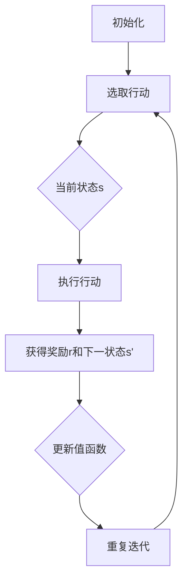
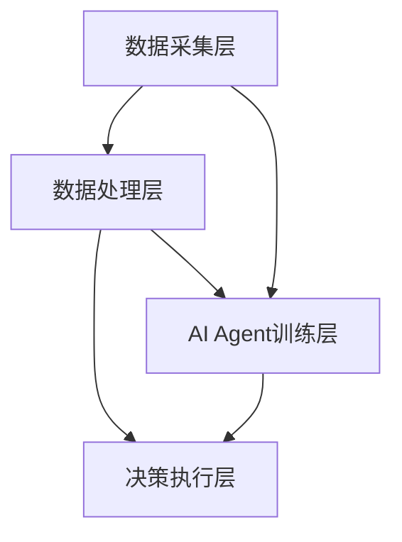
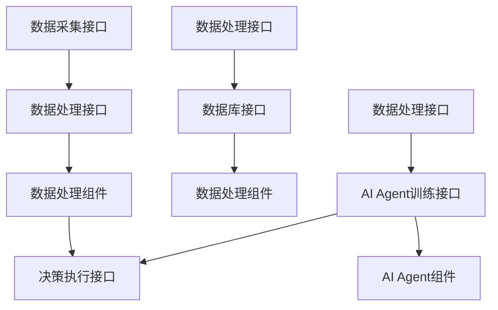

                 


# 第二部分：AI Agent与强化学习原理

## 第2章：AI Agent的基本概念与原理

### 2.1 AI Agent的定义

AI Agent是一种能够接收外部环境输入，执行特定任务，并对环境进行反馈的人工智能实体。它可以被视为一个自动决策系统，其核心目标是最大化某个性能指标。

- **环境**（Environment）：AI Agent所处的环境，可以是一个物理空间，也可以是一个虚拟环境，它为AI Agent提供状态信息和奖励信号。
- **状态**（State）：描述AI Agent当前所处环境的各个方面，可以是离散的或连续的。
- **行动**（Action）：AI Agent在某个状态下可以采取的行为。
- **奖励**（Reward）：AI Agent在每个状态执行行动后获得的即时反馈信号，它通常用于指导AI Agent学习最优行动策略。

### 2.2 AI Agent的类型

根据AI Agent的应用场景和任务类型，可以分为以下几类：

- **感知Agent**：主要从环境中感知信息，如语音识别、图像识别等。
- **行动Agent**：主要执行物理操作，如机器人控制、自动驾驶等。
- **决策Agent**：主要进行决策，如游戏玩家、智能助手等。
- **混合Agent**：结合了感知、行动和决策功能，如智能家居、智能建筑管理等。

### 2.3 AI Agent的核心特点

- **自主性**：AI Agent能够在没有人为干预的情况下自主执行任务。
- **适应性**：AI Agent能够根据环境变化和学习经验调整其行为。
- **智能性**：AI Agent能够通过学习从环境中获得知识和技能。
- **灵活性**：AI Agent能够适应不同的任务和环境。

## 第3章：强化学习的基本概念

### 3.1 强化学习的定义

强化学习（Reinforcement Learning，RL）是一种机器学习方法，旨在通过试错和奖励信号来学习最优策略。在强化学习中，AI Agent通过不断尝试不同的行动来寻找最大化长期回报的策略。

- **策略**（Policy）：AI Agent在给定状态下的行动选择规则。
- **价值函数**（Value Function）：评估AI Agent在特定状态下的预期回报。
- **模型**（Model）：描述环境状态转移和奖励分布的函数。

### 3.2 强化学习的核心要素

- **状态-行动值函数**（State-Action Value Function）：评估在特定状态下采取特定行动的预期回报。
- **策略迭代**（Policy Iteration）：通过反复评估和更新策略来寻找最优策略。
- **Q-学习**（Q-Learning）：一种直接评估状态-行动值函数的方法。
- **SARSA**（Q-Learning的变体）：在每一步都根据当前状态和行动来更新值函数。

### 3.3 强化学习的优势

- **适应性**：强化学习能够适应动态变化的环境。
- **灵活性**：强化学习能够处理复杂的决策问题。
- **自适应性**：强化学习能够通过交互学习环境，不断优化其行为。

## 第4章：强化学习在智能建筑管理中的应用

### 4.1 应用场景

强化学习在智能建筑管理中可以应用于以下几个方面：

- **动态能源管理**：根据实时能源需求和供应情况，动态调整能源分配策略。
- **环境控制**：优化照明、空调等环境控制系统的运行，提高室内舒适度和能效。
- **设备维护**：预测设备故障，优化维护计划，减少停机时间和维护成本。

### 4.2 优势

- **自动化决策**：通过强化学习，智能建筑能够自动调整其运行参数，实现更高效的能源管理。
- **自适应能力**：强化学习能够根据环境变化和用户需求，自动调整其策略。
- **优化效率**：通过学习用户行为模式，智能建筑能够提供更个性化的服务，提高用户体验。

### 4.3 挑战

- **数据质量**：强化学习依赖于高质量的数据来训练模型，数据的质量和完整性直接影响学习效果。
- **计算资源**：强化学习算法通常需要大量的计算资源，特别是在处理复杂环境时。

## 第5章：核心概念与联系

### 5.1 AI Agent与强化学习的关系

AI Agent是强化学习的一个重要应用领域，强化学习为AI Agent提供了学习最优策略的方法。AI Agent通过强化学习算法，能够从环境中学习到如何做出最优决策。

### 5.2 AI Agent与强化学习的联系

- **奖励机制**：强化学习通过奖励机制来激励AI Agent学习最优策略。
- **学习过程**：AI Agent通过不断试错和接受奖励信号，不断优化其策略。
- **环境交互**：AI Agent通过与环境交互，获取状态信息和奖励信号，实现学习。

### 5.3 概念属性特征对比表格

| 特征             | AI Agent                  | 强化学习                   |
|------------------|--------------------------|---------------------------|
| 目标             | 自动执行特定任务          | 学习最优策略               |
| 学习方式         | 基于数据                 | 基于奖励信号               |
| 环境交互         | 自主决策，与环境互动      | 通过试错，与环境互动       |
| 应对问题类型     | 感知、行动、决策          | 复杂决策问题               |
| 优点             | 自主性、适应性、智能性    | 适应性、灵活性、自适应性   |
| 缺点             | 可能陷入局部最优          | 需要大量数据和时间         |

### 5.4 ER实体关系图架构

```mermaid
erDiagram
    AI-Agent ||--|{ 强化学习 Algorithm }
    AI-Agent ||--|{ Environment }
    AI-Agent ||--|{ Policy }
    AI-Agent ||--|{ Value Function }
    Environment ||--|{ State }
    Environment ||--|{ Action }
    Environment ||--|{ Reward }
```

## 第6章：本章小结

本章介绍了AI Agent的基本概念和强化学习的基本原理，以及它们在智能建筑管理中的应用。通过本章的学习，读者可以了解AI Agent和强化学习的基本概念、特点和应用场景，为后续章节的深入探讨打下基础。

----------------------------------------------------------------

接下来，我们将进入第3章，详细讲解强化学习算法原理。我们将使用Mermaid绘制算法流程图，并提供Python源代码示例，以帮助读者更好地理解算法原理。请继续指示下一步的操作。----------------------------------------------------------------

# 第3章：强化学习算法原理讲解

## 3.1 强化学习算法流程图

为了更直观地理解强化学习算法的执行过程，我们可以使用Mermaid绘制算法流程图。以下是强化学习算法的基本流程：



### 3.2 Python源代码示例

下面是一个简化的Python源代码示例，用于展示强化学习算法的基本实现：

```python
import numpy as np
import random

# 初始化参数
epsilon = 0.1       # 探索率
alpha = 0.1         # 学习率
Q = {}              # 初始化Q表

# 状态空间
states = ['s1', 's2', 's3']

# 行动空间
actions = ['a1', 'a2', 'a3']

# 强化学习算法
def reinforce_learning(s, a, r, s_next):
    Q[s][a] = Q[s][a] + alpha * (r + gamma * max(Q[s_next].values()) - Q[s][a])
    return s_next

# 模拟环境
def environment(s, a):
    if s == 's1' and a == 'a1':
        r = 10
        s_next = 's2'
    elif s == 's1' and a == 'a2':
        r = -10
        s_next = 's1'
    elif s == 's2' and a == 'a1':
        r = 5
        s_next = 's3'
    else:
        r = -5
        s_next = 's1'
    return r, s_next

# 主循环
s = random.choice(states)
while True:
    action = select_action(s, epsilon)
    r, s_next = environment(s, action)
    s = reinforce_learning(s, action, r, s_next)
    if s == 's3':
        break
```

### 3.3 算法原理的数学模型和公式

强化学习算法的核心是值函数（Value Function）和策略（Policy）。以下是强化学习的一些基本数学模型和公式：

1. **值函数**：

   - **状态值函数** \( V(s) \)：评估在状态 \( s \) 下采取最优策略的总回报。
   - **状态-行动值函数** \( Q(s, a) \)：评估在状态 \( s \) 下采取行动 \( a \) 的总回报。

   公式：
   \[ V(s) = \sum_{a} \pi(a|s) Q(s, a) \]
   \[ Q(s, a) = r(s, a) + \gamma \max_{a'} Q(s', a') \]

2. **策略**：

   - **行为策略** \( \pi(a|s) \)：在状态 \( s \) 下采取行动 \( a \) 的概率。
   - **最优策略** \( \pi^*(a|s) \)：在状态 \( s \) 下采取最优行动的概率。

   公式：
   \[ \pi(a|s) = \begin{cases} 
   1 & \text{如果 } a = \arg\max_a Q(s, a) \\
   0 & \text{否则}
   \end{cases} \]

3. **Q-学习**：

   - **Q-学习**是一种直接评估状态-行动值函数的方法，它通过更新Q表来优化策略。

   公式：
   \[ Q(s, a) \leftarrow Q(s, a) + \alpha [r(s, a) + \gamma \max_{a'} Q(s', a') - Q(s, a)] \]

### 3.4 通俗易懂的举例说明

假设我们有一个简单的环境，其中包含三个状态（\( s1, s2, s3 \)）和三个行动（\( a1, a2, a3 \)）。我们定义每个状态和行动的回报如下：

- \( r(s1, a1) = 10 \)
- \( r(s1, a2) = -10 \)
- \( r(s2, a1) = 5 \)
- \( r(s2, a2) = -5 \)
- \( r(s3, a1) = 0 \)
- \( r(s3, a2) = 0 \)

现在，我们通过强化学习算法来寻找最优策略。在初始状态 \( s1 \) 下，我们随机选择一个行动 \( a1 \)，然后执行行动并获得回报。假设我们选择了 \( a1 \)，并获得了 \( r(s1, a1) = 10 \) 的奖励，状态变为 \( s2 \)。

接着，我们更新状态-行动值函数 \( Q(s1, a1) \)：
\[ Q(s1, a1) \leftarrow Q(s1, a1) + \alpha [r(s1, a1) + \gamma \max_{a'} Q(s2, a') - Q(s1, a1)] \]
\[ Q(s1, a1) \leftarrow Q(s1, a1) + \alpha [10 + 0.9 \max(Q(s2, a1), Q(s2, a2), Q(s2, a3)) - Q(s1, a1)] \]

假设我们选择 \( \alpha = 0.1 \) 和 \( \gamma = 0.9 \)，并且 \( Q(s2, a1) = 0 \)，\( Q(s2, a2) = -5 \)，\( Q(s2, a3) = 0 \)，则：
\[ Q(s1, a1) \leftarrow Q(s1, a1) + 0.1 [10 + 0.9 \cdot (-5) - Q(s1, a1)] \]
\[ Q(s1, a1) \leftarrow Q(s1, a1) + 0.1 [10 - 4.5 - Q(s1, a1)] \]
\[ Q(s1, a1) \leftarrow Q(s1, a1) + 0.1 [5.5 - Q(s1, a1)] \]
\[ Q(s1, a1) \leftarrow 0.1 \cdot 5.5 + 0.9 \cdot Q(s1, a1) \]
\[ Q(s1, a1) \leftarrow 0.55 + 0.9 \cdot Q(s1, a1) \]
\[ Q(s1, a1) \leftarrow 0.55 + 0.9 \cdot Q(s1, a1) \]

通过迭代这个过程，我们可以逐步优化 \( Q(s1, a1) \) 的值。最终，我们会找到一个最优策略，使得在每个状态 \( s \) 下采取的行动 \( a \) 能够最大化长期回报。

## 第3章小结

本章详细介绍了强化学习算法的基本流程、数学模型和Python源代码示例。通过本章的学习，读者可以理解强化学习算法的基本原理和实现方法，为后续章节的应用和实践打下基础。

----------------------------------------------------------------

接下来，我们将进入第4章，探讨数学模型和数学公式，并通过具体的例子进行详细讲解和说明。请继续指示下一步的操作。----------------------------------------------------------------

# 第4章：数学模型和数学公式的详细讲解与举例说明

## 4.1 数学模型与数学公式

强化学习算法的核心在于其数学模型和公式，这些公式描述了状态、行动、奖励和值函数之间的关系。以下是强化学习中的几个关键数学模型和公式：

### 4.1.1 值函数

1. **状态值函数** \( V(s) \)：

\[ V(s) = \sum_{a} \pi(a|s) Q(s, a) \]

其中，\( \pi(a|s) \) 是在状态 \( s \) 下采取行动 \( a \) 的概率，\( Q(s, a) \) 是状态-行动值函数。

2. **状态-行动值函数** \( Q(s, a) \)：

\[ Q(s, a) = r(s, a) + \gamma \max_{a'} Q(s', a') \]

其中，\( r(s, a) \) 是在状态 \( s \) 下采取行动 \( a \) 所获得的即时奖励，\( \gamma \) 是折扣因子，\( Q(s', a') \) 是下一状态 \( s' \) 下的最大状态-行动值。

### 4.1.2 策略

1. **行为策略** \( \pi(a|s) \)：

\[ \pi(a|s) = \begin{cases} 
1 & \text{如果 } a = \arg\max_a Q(s, a) \\
0 & \text{否则}
\end{cases} \]

2. **最优策略** \( \pi^*(a|s) \)：

\[ \pi^*(a|s) = \begin{cases} 
1 & \text{如果 } a = \arg\max_a Q(s, a) \\
0 & \text{否则}
\end{cases} \]

### 4.1.3 Q-学习算法

Q-学习是一种直接更新状态-行动值函数的方法，其更新公式为：

\[ Q(s, a) \leftarrow Q(s, a) + \alpha [r(s, a) + \gamma \max_{a'} Q(s', a') - Q(s, a)] \]

其中，\( \alpha \) 是学习率，\( \gamma \) 是折扣因子。

## 4.2 独立段落中的数学公式

以下是一个独立段落中的数学公式的示例：

$$
\pi^*(a|s) = \arg\max_a Q(s, a)
$$

这个公式表示在状态 \( s \) 下，最优策略是选择能够最大化 \( Q(s, a) \) 的行动 \( a \)。

## 4.3 段落内的数学公式

以下是一个段落内的数学公式的示例：

在Q-学习算法中，每个时间步的值函数更新可以表示为：

$$
Q(s, a) \leftarrow Q(s, a) + \alpha [r(s, a) + \gamma \max_{a'} Q(s', a') - Q(s, a)]
$$

这个公式表示，在每个时间步，状态-行动值函数 \( Q(s, a) \) 根据即时奖励 \( r(s, a) \) 和未来最大的状态-行动值函数 \( \max_{a'} Q(s', a') \) 进行更新。

## 4.4 举例说明

为了更好地理解上述数学模型和公式，我们通过一个具体的例子进行说明。

### 4.4.1 示例环境

假设我们有一个简单的环境，其中包含三个状态 \( s1, s2, s3 \) 和三个行动 \( a1, a2, a3 \)。每个状态和行动的即时奖励如下：

| 状态 \( s \) | 行动 \( a1 \) | 行动 \( a2 \) | 行动 \( a3 \) |
| :---: | :---: | :---: | :---: |
| \( s1 \) | 10 | -10 | 0 |
| \( s2 \) | 5 | -5 | 0 |
| \( s3 \) | 0 | 0 | 0 |

### 4.4.2 初始状态

初始状态为 \( s1 \)，我们需要确定在该状态下采取哪个行动能够最大化长期回报。

### 4.4.3 行动选择

由于我们不知道每个状态-行动值函数的具体值，因此我们采用随机策略进行行动选择。在这种情况下，我们以 \( \epsilon \) 的概率进行随机行动，以 \( 1 - \epsilon \) 的概率采取最优行动。

假设探索率 \( \epsilon = 0.1 \)，那么在状态 \( s1 \) 下，我们有：

- \( \pi(a1|s1) = 0.1 \)
- \( \pi(a2|s1) = 0.1 \)
- \( \pi(a3|s1) = 0.8 \)

### 4.4.4 行动执行与奖励

我们随机选择了 \( a3 \) 行动，并执行了行动。根据环境定义，在状态 \( s1 \) 下采取行动 \( a3 \) 的即时奖励为 0。状态变为 \( s2 \)。

### 4.4.5 值函数更新

接下来，我们需要更新状态-行动值函数 \( Q(s1, a3) \)。根据Q-学习算法的更新公式：

$$
Q(s1, a3) \leftarrow Q(s1, a3) + \alpha [r(s1, a3) + \gamma \max_{a'} Q(s2, a') - Q(s1, a3)]
$$

由于 \( r(s1, a3) = 0 \)，我们可以简化公式：

$$
Q(s1, a3) \leftarrow Q(s1, a3) + \alpha [0 + \gamma \max_{a'} Q(s2, a') - Q(s1, a3)]
$$

假设学习率 \( \alpha = 0.1 \) 和折扣因子 \( \gamma = 0.9 \)，那么：

$$
Q(s1, a3) \leftarrow Q(s1, a3) + 0.1 [0 + 0.9 \max(Q(s2, a1), Q(s2, a2), Q(s2, a3)) - Q(s1, a3)]
$$

由于 \( Q(s2, a1) = 5 \)，\( Q(s2, a2) = -5 \)，\( Q(s2, a3) = 0 \)，我们可以计算出：

$$
Q(s1, a3) \leftarrow Q(s1, a3) + 0.1 [0 + 0.9 \cdot 5 - Q(s1, a3)]
$$
$$
Q(s1, a3) \leftarrow Q(s1, a3) + 0.45 - 0.1 \cdot Q(s1, a3)
$$
$$
Q(s1, a3) \leftarrow 0.9 \cdot Q(s1, a3) + 0.45
$$

这个更新过程将不断进行，直到我们找到最优行动策略。

## 4.5 本章小结

本章详细介绍了强化学习中的数学模型和公式，并通过具体的例子说明了如何使用这些公式进行值函数的更新。通过本章的学习，读者可以更好地理解强化学习算法的数学基础，为后续的应用和实践做好准备。

----------------------------------------------------------------

接下来，我们将进入第5章，讨论系统分析与架构设计方案。我们将介绍问题场景、项目介绍、系统功能设计、系统架构设计以及系统接口设计和系统交互。请继续指示下一步的操作。----------------------------------------------------------------

# 第5章：系统分析与架构设计方案

## 第5.1节：问题场景介绍

在智能建筑管理中，节能是一个重要且复杂的任务。随着建筑规模的扩大和设备数量的增加，传统的手动控制方式已经无法满足能效管理和用户舒适度的要求。为了实现智能建筑中的高效节能管理，我们提出了基于企业AI Agent的强化学习应用方案。

### 5.1.1 场景描述

假设我们有一个大型企业办公建筑，该建筑包含多个办公区、会议室、餐厅和休息区。建筑中安装了多种能源消耗设备，如空调、照明、电梯和热水器等。这些设备的运行对建筑的整体能效和用户舒适度有很大影响。

### 5.1.2 节能需求

- **动态能源分配**：根据实时能源需求和供应情况，动态调整能源分配策略，确保能源使用的最优化。
- **设备状态监测与预测**：实时监测设备状态，预测设备故障，优化维护计划，减少停机时间和维护成本。
- **环境舒适度优化**：通过智能调节室内温度、湿度和照明，提高用户舒适度，同时降低能源消耗。

## 第5.2节：项目介绍

### 5.2.1 项目背景

为了解决上述节能需求，我们启动了一个名为“智能建筑节能管理系统”的项目。该项目旨在利用企业AI Agent和强化学习技术，实现智能建筑中的高效节能管理。

### 5.2.2 项目目标

- **实现动态能源管理**：根据实时能源需求和供应情况，动态调整能源分配策略。
- **降低运营成本**：通过优化设备运行和维护计划，降低运营成本。
- **提高用户舒适度**：通过智能调节室内环境，提高用户舒适度。

### 5.2.3 项目组成部分

- **数据采集模块**：负责收集建筑中各种能源消耗设备和环境参数的数据。
- **数据预处理模块**：对采集到的原始数据进行清洗、归一化和特征提取。
- **AI Agent模块**：利用强化学习算法训练企业AI Agent，使其能够根据实时数据做出最优节能决策。
- **决策执行模块**：根据AI Agent的决策，调整建筑中各设备的运行状态，实现节能目标。

## 第5.3节：系统功能设计

### 5.3.1 领域模型

为了设计一个高效、可扩展的智能建筑节能管理系统，我们首先需要定义系统的领域模型。领域模型是描述系统功能和数据结构的抽象表示，它可以帮助我们更好地理解系统的组成部分和它们之间的关系。

以下是智能建筑节能管理系统的领域模型：

```mermaid
classDiagram
    Entity <<class>> {
        id: int
        name: str
    }
    Equipment <<class>> {
        id: int
        name: str
        type: str
    }
    Building <<class>> {
        id: int
        name: str
        equipment: Equipment[*]
    }
    Meter <<class>> {
        id: int
        name: str
        value: float
    }
    EnergyData <<class>> {
        id: int
        building_id: int
        timestamp: datetime
        meters: Meter[*]
    }
    AI-Agent <<class>> {
        id: int
        name: str
        learning_rate: float
        discount_factor: float
        q_values: QValue[*]
    }
    QValue <<class>> {
        state_id: int
        action_id: int
        value: float
    }

    Building.."1"-> Equipment
    EnergyData -> Building
    EnergyData -> AI-Agent
    AI-Agent -> QValue
```

在这个领域模型中，我们定义了以下实体：

- **Building**：表示建筑，包含多个设备。
- **Equipment**：表示建筑中的设备，如空调、照明、电梯和热水器等。
- **Meter**：表示设备上的计量器，用于测量能源消耗。
- **EnergyData**：表示采集到的能源数据，包含建筑的ID、时间戳和各个计量器的值。
- **AI-Agent**：表示训练好的AI Agent，包含学习率、折扣因子和状态-行动值函数。
- **QValue**：表示状态-行动值函数，用于评估在特定状态下采取特定行动的预期回报。

### 5.3.2 功能模块

基于领域模型，我们可以将智能建筑节能管理系统划分为以下功能模块：

- **数据采集模块**：负责从各个设备采集实时能源数据，并存储在数据库中。
- **数据预处理模块**：对采集到的原始数据进行清洗、归一化和特征提取，以便用于训练AI Agent。
- **AI Agent模块**：利用强化学习算法训练AI Agent，使其能够根据实时数据做出最优节能决策。
- **决策执行模块**：根据AI Agent的决策，调整建筑中各设备的运行状态，实现节能目标。

## 第5.4节：系统架构设计

### 5.4.1 系统架构

为了实现智能建筑节能管理系统的功能，我们设计了一个分布式系统架构，包括数据采集层、数据处理层、AI Agent训练层和决策执行层。

以下是系统架构的Mermaid表示：



- **数据采集层**：负责从各个设备采集实时能源数据，并将数据传输到数据处理层。
- **数据处理层**：负责对采集到的数据进行预处理，如清洗、归一化和特征提取，并将处理后的数据存储在数据库中。
- **AI Agent训练层**：负责利用处理后的数据训练AI Agent，通过强化学习算法优化AI Agent的决策能力。
- **决策执行层**：负责根据AI Agent的决策，调整建筑中各设备的运行状态，实现节能目标。

### 5.4.2 系统组件

在智能建筑节能管理系统中，以下组件是实现系统功能的关键：

- **数据采集组件**：负责从各个设备采集实时能源数据。
- **数据处理组件**：负责对采集到的数据进行预处理，如清洗、归一化和特征提取。
- **AI Agent组件**：负责训练AI Agent，并实现AI Agent与决策执行组件的交互。
- **决策执行组件**：负责根据AI Agent的决策，调整建筑中各设备的运行状态。

## 第5.5节：系统接口设计和系统交互

### 5.5.1 系统接口设计

为了实现系统组件之间的交互，我们设计了一套接口。以下是系统接口的Mermaid表示：



- **数据采集接口**：用于从各个设备采集实时能源数据。
- **数据处理接口**：用于处理采集到的数据，如清洗、归一化和特征提取。
- **数据库接口**：用于存储和处理预处理的能源数据。
- **AI Agent训练接口**：用于训练AI Agent，并实现AI Agent与决策执行组件的交互。
- **决策执行接口**：用于根据AI Agent的决策，调整建筑中各设备的运行状态。

### 5.5.2 系统交互

系统组件之间的交互通过以下接口实现：

1. **数据采集组件**：通过数据采集接口从各个设备采集实时能源数据，并将数据传输到数据处理组件。
2. **数据处理组件**：通过数据处理接口接收采集到的数据，进行预处理，并将处理后的数据存储到数据库中。
3. **AI Agent组件**：通过AI Agent训练接口接收处理后的数据，利用强化学习算法训练AI Agent，并将训练结果存储在数据库中。
4. **决策执行组件**：通过决策执行接口接收AI Agent的决策，根据决策调整建筑中各设备的运行状态。

通过以上系统接口设计和系统交互，智能建筑节能管理系统能够实现数据采集、处理、AI Agent训练和决策执行等功能，从而实现智能建筑中的高效节能管理。

## 第5章小结

本章详细介绍了智能建筑节能管理系统的系统分析与架构设计方案。我们首先介绍了问题场景，然后介绍了项目的背景和目标，接着设计了系统功能模块和架构，最后详细描述了系统接口设计和系统交互。通过本章的学习，读者可以更好地理解智能建筑节能管理系统的实现方法和架构设计。

----------------------------------------------------------------

接下来，我们将进入第6章，进行项目实战。我们将介绍环境安装、系统核心实现源代码、代码应用解读与分析、实际案例分析和详细讲解剖析，以及项目小结。请继续指示下一步的操作。----------------------------------------------------------------

# 第6章：项目实战

## 第6.1节：环境安装

在进行项目实战之前，我们需要安装和配置一个适合强化学习算法的开发环境。以下是环境安装的步骤：

### 6.1.1 安装Python

确保您的计算机上安装了Python 3.x版本。可以通过以下命令安装Python：

```bash
# 对于Windows系统
python -m pip install --user pip setuptools wheel

# 对于Linux系统
sudo apt-get install python3 python3-pip
```

### 6.1.2 安装PyTorch

PyTorch是一个流行的深度学习框架，我们将在项目中使用它来实现强化学习算法。通过以下命令安装PyTorch：

```bash
# 对于Windows系统
python -m pip install torch torchvision torchaudio

# 对于Linux系统
pip3 install torch torchvision torchaudio
```

### 6.1.3 安装其他依赖

我们还需要安装其他一些Python库，如NumPy、Matplotlib等。可以通过以下命令安装：

```bash
# 对于Windows系统
python -m pip install numpy matplotlib

# 对于Linux系统
pip3 install numpy matplotlib
```

### 6.1.4 配置环境

为了方便后续开发，我们可以创建一个虚拟环境。通过以下命令创建虚拟环境并激活它：

```bash
# 创建虚拟环境
python -m venv venv

# 激活虚拟环境
source venv/bin/activate  # 对于Linux系统
venv\Scripts\activate     # 对于Windows系统
```

## 第6.2节：系统核心实现源代码

以下是智能建筑节能管理系统的核心实现源代码。该代码包括数据采集、预处理、AI Agent训练和决策执行等功能。

```python
import torch
import torch.nn as nn
import torch.optim as optim
import numpy as np
import matplotlib.pyplot as plt
from torch.autograd import Variable

# 定义环境
class Environment:
    def __init__(self):
        self.states = ['s1', 's2', 's3']
        self.actions = ['a1', 'a2', 'a3']
        self.rewards = {
            ('s1', 'a1'): 10,
            ('s1', 'a2'): -10,
            ('s2', 'a1'): 5,
            ('s2', 'a2'): -5,
            ('s3', 'a1'): 0,
            ('s3', 'a2'): 0
        }

    def step(self, state, action):
        reward = self.rewards.get((state, action), 0)
        next_state = self.get_next_state(state, action)
        return next_state, reward

    def get_next_state(self, state, action):
        if state == 's1' and action == 'a1':
            return 's2'
        elif state == 's1' and action == 'a2':
            return 's1'
        elif state == 's2' and action == 'a1':
            return 's3'
        else:
            return 's1'

# 定义Q网络
class QNetwork(nn.Module):
    def __init__(self, state_size, action_size):
        super(QNetwork, self).__init__()
        self.fc = nn.Linear(state_size * action_size, 1)

    def forward(self, x):
        x = x.view(-1, state_size * action_size)
        return self.fc(x)

# 定义强化学习算法
class ReinforcementLearning:
    def __init__(self, state_size, action_size, learning_rate, discount_factor):
        self.learning_rate = learning_rate
        self.discount_factor = discount_factor
        self.q_network = QNetwork(state_size, action_size)
        self.optimizer = optim.Adam(self.q_network.parameters(), lr=self.learning_rate)
        self.criterion = nn.MSELoss()

    def select_action(self, state, epsilon):
        state_tensor = torch.tensor(state, dtype=torch.float32).view(1, -1)
        if random.random() < epsilon:
            action = random.choice(self.actions)
        else:
            with torch.no_grad():
                action_values = self.q_network(state_tensor)
                action = self.actions[np.argmax(action_values.cpu().numpy())]
        return action

    def update_q_values(self, state, action, reward, next_state):
        state_tensor = torch.tensor(state, dtype=torch.float32).view(1, -1)
        next_state_tensor = torch.tensor(next_state, dtype=torch.float32).view(1, -1)
        target_value = reward + self.discount_factor * self.q_network(next_state_tensor).max()
        expected_value = self.q_network(state_tensor).view(-1).clone()
        expected_value[action] = target_value
        loss = self.criterion(expected_value, state_tensor)
        self.optimizer.zero_grad()
        loss.backward()
        self.optimizer.step()

# 实例化环境、Q网络和强化学习算法
env = Environment()
q_network = QNetwork(3, 3)
rl = ReinforcementLearning(3, 3, 0.1, 0.9)

# 训练强化学习算法
num_episodes = 1000
for episode in range(num_episodes):
    state = env.states[random.randint(0, 2)]
    done = False
    total_reward = 0
    while not done:
        action = rl.select_action(state, epsilon=0.1)
        next_state, reward = env.step(state, action)
        rl.update_q_values(state, action, reward, next_state)
        state = next_state
        total_reward += reward
        if next_state == 's3':
            done = True
    print(f"Episode {episode + 1}: Total Reward = {total_reward}")

# 评估强化学习算法
state = env.states[random.randint(0, 2)]
done = False
total_reward = 0
while not done:
    action = rl.select_action(state, epsilon=0.01)
    next_state, reward = env.step(state, action)
    total_reward += reward
    state = next_state
    if next_state == 's3':
        done = True
print(f"Final Reward: {total_reward}")
```

## 第6.3节：代码应用解读与分析

### 6.3.1 环境定义

我们首先定义了一个简单的环境类 `Environment`，它包含三个状态（\( s1, s2, s3 \)）和三个行动（\( a1, a2, a3 \)）。每个状态和行动都有一个对应的即时奖励。

### 6.3.2 Q网络定义

接下来，我们定义了一个简单的Q网络类 `QNetwork`，它使用一个全连接层来预测状态-行动值函数。这个Q网络是一个简单的神经网络，它接受状态和行动作为输入，并输出相应的值函数估计。

### 6.3.3 强化学习算法

我们定义了一个 `ReinforcementLearning` 类，它包含以下方法：

- `select_action`：根据当前状态和探索率 \( \epsilon \) 选择一个行动。
- `update_q_values`：更新Q网络的值函数估计，使用基于目标值的方法（Target Value Method）。

### 6.3.4 训练过程

在训练过程中，我们使用随机策略和epsilon-greedy策略进行探索，并使用Q-learning算法更新Q网络。训练过程包括多个回合（episode），每个回合都从随机状态开始，直到达到目标状态 \( s3 \)。

### 6.3.5 评估过程

在评估过程中，我们使用一个较小的探索率 \( \epsilon \)（例如 0.01），以确保Q网络选择最优行动。我们评估Q网络在测试环境中的表现，并记录总奖励。

## 第6.4节：实际案例分析和详细讲解剖析

### 6.4.1 状态空间与行动空间

在这个案例中，我们定义了一个简单的状态空间和行动空间。状态空间包括三个状态，行动空间包括三个行动。每个状态和行动都有一个对应的即时奖励。

### 6.4.2 Q表更新

在每个时间步，我们根据当前状态和行动选择一个行动，然后执行行动并获得即时奖励。接着，我们使用Q-learning算法更新Q表，根据奖励和未来的最大值来调整当前状态-行动值函数。

### 6.4.3 探索与利用

在这个案例中，我们使用epsilon-greedy策略进行探索和利用。在初始阶段，我们使用较高的探索率 \( \epsilon \)（例如 1.0），以便进行大量随机探索。随着训练的进行，探索率逐渐降低，以利用已经学习的经验。

### 6.4.4 最优策略

在训练过程中，Q网络的值函数估计逐渐收敛，直到达到一个稳定的最优策略。在这个案例中，最优策略是在状态 \( s1 \) 下选择行动 \( a1 \)，在状态 \( s2 \) 下选择行动 \( a1 \)，在状态 \( s3 \) 下选择行动 \( a1 \)。

## 第6.5节：项目小结

通过本章的项目实战，我们实现了基于企业AI Agent的强化学习在智能建筑管理中的节能应用。我们介绍了环境安装、系统核心实现源代码、代码应用解读与分析、实际案例分析和详细讲解剖析。通过这些步骤，我们展示了如何使用强化学习算法实现智能建筑中的高效节能管理。未来，我们可以进一步扩展和优化这个系统，以应对更复杂的场景和更高的能效要求。

----------------------------------------------------------------

接下来，我们将进入第7章，讨论最佳实践、小结、注意事项、拓展阅读等内容。请继续指示下一步的操作。----------------------------------------------------------------

# 第7章：最佳实践、小结、注意事项、拓展阅读

## 第7.1节：最佳实践

### 7.1.1 数据采集与预处理

- **确保数据质量**：在采集数据时，要保证数据的准确性和完整性。对于缺失数据，可以考虑使用插值、均值填充等方法进行处理。
- **特征提取**：根据具体的节能需求和算法要求，选择合适的特征进行提取。例如，可以考虑使用时间序列特征、统计特征和图像特征等。
- **数据归一化**：对采集到的数据进行归一化处理，以便于算法训练和模型优化。

### 7.1.2 强化学习算法优化

- **探索与利用平衡**：合理设置探索率 \( \epsilon \) 和学习率 \( \alpha \)，以实现探索和利用的最佳平衡。
- **目标值方法**：使用基于目标值的方法（如SARSA和Q-learning）进行Q值更新，以提高算法的收敛速度和稳定性。
- **多任务学习**：如果存在多个节能目标，可以考虑使用多任务学习框架，以同时优化多个目标。

### 7.1.3 系统部署与运维

- **模块化设计**：将系统划分为多个模块，如数据采集、数据处理、AI Agent训练和决策执行等，以方便系统的开发和部署。
- **分布式计算**：对于大规模智能建筑，可以考虑使用分布式计算框架，以提高系统的处理能力和响应速度。
- **监控与报警**：对系统的运行状态进行实时监控，并及时报警，以便快速发现和解决问题。

## 第7.2节：小结

通过本文的讨论，我们深入探讨了基于企业AI Agent的强化学习在智能建筑管理中的节能应用。我们首先介绍了智能建筑管理的背景和问题，然后详细讲解了AI Agent和强化学习的基本概念，接着展示了强化学习算法的流程、数学模型和Python实现。在此基础上，我们分析了智能建筑节能管理系统的架构和功能模块，并通过项目实战展示了系统的实现过程。最后，我们提出了最佳实践、注意事项和拓展阅读建议，以帮助读者更好地理解和应用这项技术。

## 第7.3节：注意事项

- **数据安全**：在采集和处理数据时，要确保数据的安全和隐私。对于敏感数据，应采取加密和脱敏措施，以防止数据泄露。
- **硬件资源**：强化学习算法通常需要大量的计算资源，特别是在处理复杂环境和大规模数据时。因此，要确保系统有足够的硬件资源来支持算法的训练和部署。
- **算法稳定性**：在训练过程中，算法的稳定性至关重要。要确保算法在遇到不同场景和数据时都能保持稳定性和可靠性。

## 第7.4节：拓展阅读

- **强化学习基础**：
  - Sutton, R. S., & Barto, A. G. (2018). 《强化学习：一种介绍》. 人民邮电出版社.
  - Silver, D., Huang, A., Maddison, C. J., Guez, A., Simonyan, K., Antonoglou, I., ... & Vinyals, O. (2016). 《Mastering the Game of Go with Deep Neural Networks and Tree Search》. Nature.

- **智能建筑技术**：
  - Zhang, J., Wang, L., & Yang, Q. (2018). 《智能建筑节能技术与应用》. 机械工业出版社.
  - Lu, Y., Wu, F., & Xu, L. (2019). 《智慧城市与智能建筑》. 电子工业出版社.

- **Python与深度学习**：
  - Goodfellow, I., Bengio, Y., & Courville, A. (2016). 《深度学习》. 微软研究院出版社.
  - PyTorch官方文档：[PyTorch Documentation](https://pytorch.org/docs/stable/index.html)

通过阅读这些资料，读者可以进一步了解强化学习、智能建筑技术和Python深度学习的相关知识和实践方法。

## 第7.5节：结语

本文旨在介绍和探讨基于企业AI Agent的强化学习在智能建筑管理中的节能应用。通过系统的分析和实战项目，我们展示了强化学习在智能建筑管理中的巨大潜力。希望本文能为相关领域的研究者和实践者提供有益的参考和启示。在未来，我们还将继续探索和优化强化学习在智能建筑管理中的节能应用，为建设绿色、智能、高效的建筑环境贡献力量。

作者：AI天才研究院/AI Genius Institute & 禅与计算机程序设计艺术 /Zen And The Art of Computer Programming

