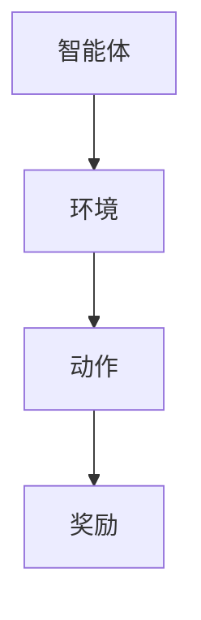
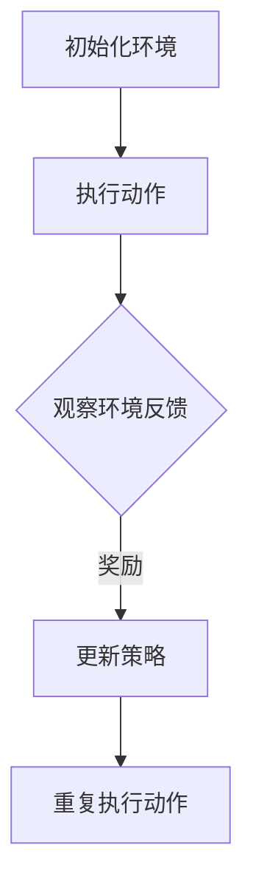
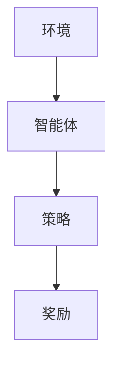
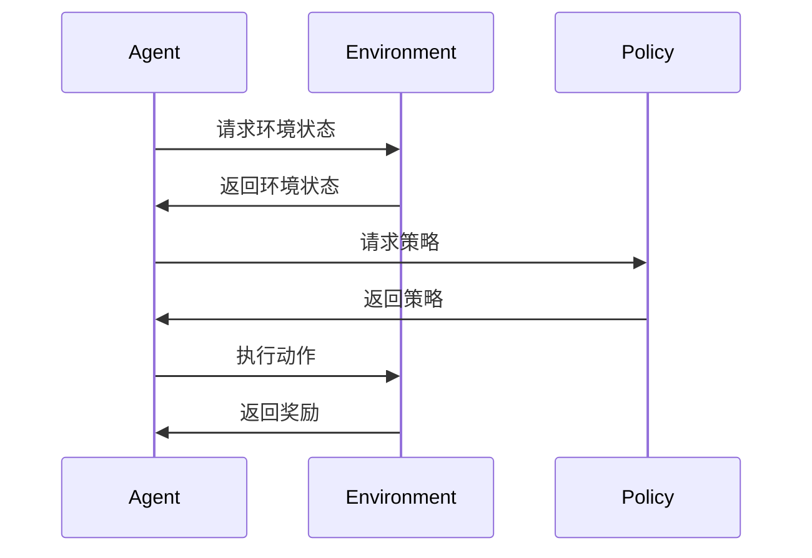
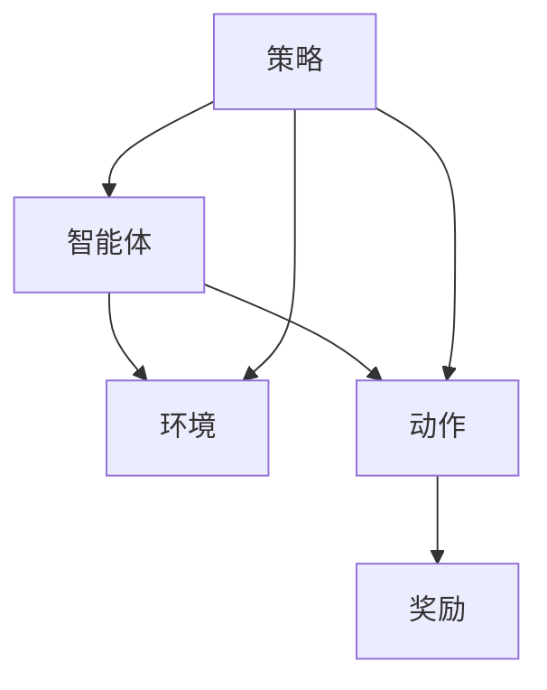
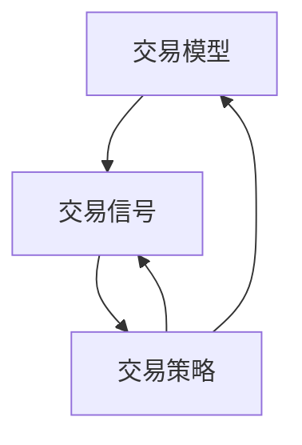
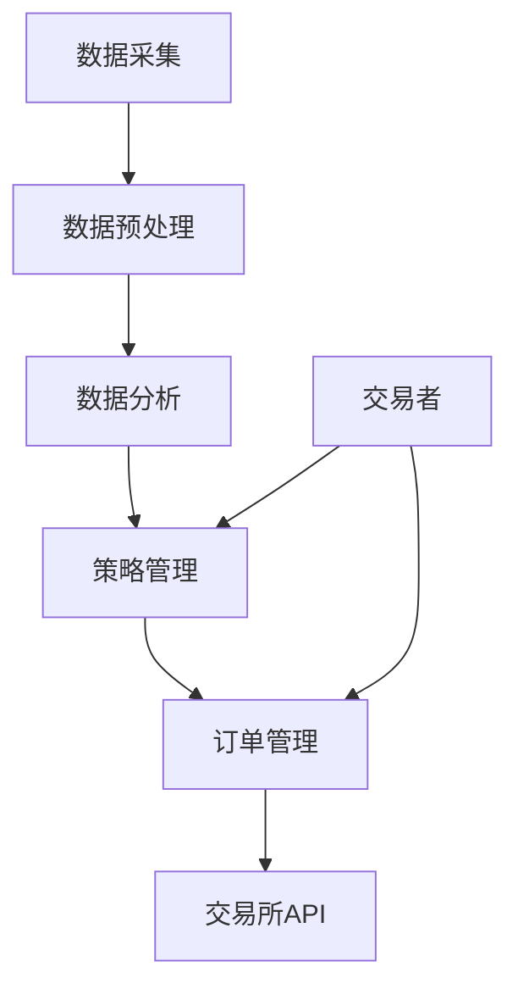
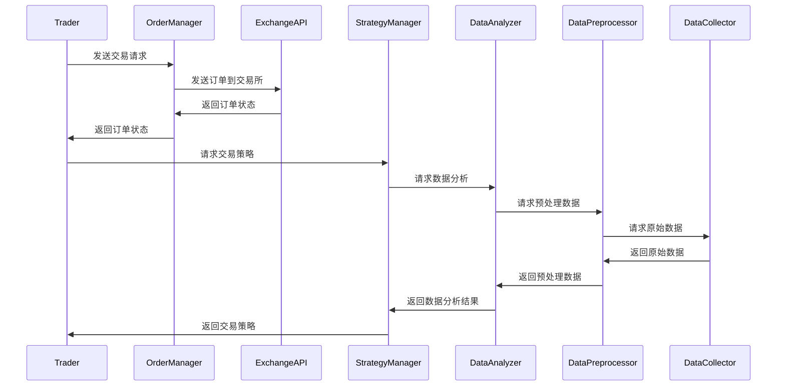
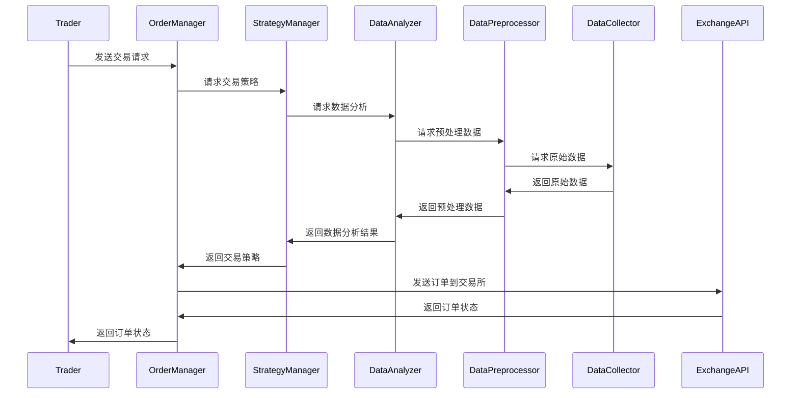

                 

# 《企业AI Agent的强化学习在自动化交易策略中的应用》

## 关键词

AI Agent，强化学习，自动化交易策略，机器学习，算法优化，交易市场，风险控制

## 摘要

本文探讨了企业AI Agent在自动化交易策略中的应用，重点关注了强化学习在这一领域的应用前景和实际效果。文章首先介绍了AI Agent、强化学习和自动化交易策略的基本概念，然后详细讲解了强化学习在自动化交易策略中的算法原理、系统架构设计以及项目实战。最后，文章总结了强化学习在自动化交易策略中的最佳实践，并对未来研究方向进行了展望。

## 引言

随着人工智能技术的迅猛发展，AI Agent在各个领域的应用日益广泛。在金融领域，自动化交易策略成为了一种重要的研究方向，通过利用AI Agent，可以实现高效率、低风险的交易。强化学习作为一种机器学习方法，具有很好的自适应性和灵活性，为自动化交易策略的研究提供了新的思路。

本文旨在探讨企业AI Agent的强化学习在自动化交易策略中的应用，分析其优势和应用前景，并通过实际项目案例展示强化学习在自动化交易策略中的具体应用效果。

## 第1章 核心概念

### 1.1 AI Agent

AI Agent是指具有自主决策能力的智能体，能够在复杂环境中通过感知环境状态，采取行动来达到特定目标。AI Agent通常包括感知模块、决策模块和执行模块。

**表1-1 AI Agent的组成模块及其功能**

| 模块        | 功能                                                         |
| ----------- | ------------------------------------------------------------ |
| 感知模块    | 感知环境状态，获取环境信息                                     |
| 决策模块    | 根据感知到的环境状态，选择最优行动策略                         |
| 执行模块    | 执行决策模块选择出的行动策略，并对环境产生影响                 |

### 1.2 强化学习

强化学习是一种基于奖励机制进行决策的机器学习方法，其核心思想是通过不断试错，学习到最优策略。强化学习包括四个主要组成部分：智能体（Agent）、环境（Environment）、动作（Action）和奖励（Reward）。

**ER实体关系图架构：**



### 1.3 自动化交易策略

自动化交易策略是指通过计算机程序实现自动化的交易决策，从而提高交易效率和降低风险。自动化交易策略的核心是交易模型，它通过分析市场数据，预测市场趋势，并生成交易信号。

**表1-2 自动化交易策略的核心组成部分**

| 组成部分    | 功能                                                         |
| ----------- | ------------------------------------------------------------ |
| 数据采集    | 收集市场数据，如价格、成交量等                               |
| 数据预处理  | 清洗、归一化、特征提取等，为交易模型提供高质量的数据输入     |
| 交易模型    | 根据市场数据，预测市场趋势，生成交易信号                     |
| 交易执行    | 根据交易信号，执行买入、卖出等操作                           |

## 第2章 算法原理

### 2.1 强化学习在自动化交易策略中的应用

强化学习在自动化交易策略中的应用主要是通过构建一个AI Agent，使其能够在交易市场中自主学习和优化交易策略。

**算法流程图：**



### 2.2 算法原理讲解

强化学习的核心是奖励机制，通过奖励来指导AI Agent的学习过程。在自动化交易策略中，奖励机制可以基于交易盈亏、交易频率、交易风险等指标。

**数学模型：**

$$
\pi^*(s) = \arg\max_{a} \sum_{s',r} r(s',r) P(s',r|s,a)
$$

其中，$\pi^*(s)$表示在状态$s$下的最优策略，$a$表示动作，$s'$表示下一状态，$r$表示奖励，$P(s',r|s,a)$表示在状态$s$下执行动作$a$后，到达状态$s'$并获得奖励$r$的概率。

**Python源代码实现：**

```python
import numpy as np

# 初始化环境
env = Environment()

# 初始化策略
policy = Policy()

# 强化学习循环
while not done:
    # 执行动作
    action = policy.select_action(state)
    
    # 观察环境反馈
    next_state, reward, done = env.step(action)
    
    # 更新策略
    policy.update(state, action, reward, next_state)
    
    # 更新状态
    state = next_state
```

### 2.3 算法举例说明

假设我们有一个交易市场，其中股票的价格是随机生成的。我们的目标是利用强化学习来构建一个自动化交易策略，以最大化收益。

**例子：**

- 初始状态：股票价格=100元
- 动作集：买入、持有、卖出
- 奖励机制：买入后价格上涨获得正奖励，价格下跌获得负奖励

通过强化学习，我们可以训练出一个AI Agent，使其能够根据当前状态选择最优的动作，并在长期内实现收益最大化。

## 第3章 系统分析与架构设计

### 3.1 问题场景介绍

在交易市场中，自动化交易策略的应用可以帮助投资者实现稳定收益，同时降低人工操作的风险。然而，传统的交易策略往往难以应对复杂多变的交易环境，因此需要利用强化学习来构建自适应的交易策略。

### 3.2 项目介绍

本项目旨在利用强化学习构建一个自适应的自动化交易策略，通过模拟交易环境，实现股票交易自动化，并在实际交易中验证其效果。

### 3.3 系统功能设计

**领域模型类图：**

```mermaid
classDiagram
    Environment <<interface>>
    Agent <<interface>>
    Policy <<interface>>
    Reward <<interface>>

    Environment <|.. Agent>
    Agent <|.. Policy
    Policy <|.. Reward
```

### 3.4 系统架构设计

**系统架构图：**



### 3.5 系统接口设计

**系统接口图：**



### 3.6 系统交互

**系统交互序列图：**

```mermaid
sequenceDiagram
    Agent->>Environment: 初始化环境
    Environment->>Agent: 返回初始化状态
    Agent->>Policy: 初始化策略
    Policy->>Agent: 返回初始策略
    Agent->>Environment: 执行动作
    Environment->>Agent: 返回奖励
    Agent->>Policy: 更新策略
    loop 执行动作 {
        Agent->>Environment: 执行动作
        Environment->>Agent: 返回奖励
        Agent->>Policy: 更新策略
    }
    end
```

## 第4章 项目实战

### 4.1 环境安装

1. 安装Python环境（版本3.6及以上）
2. 安装强化学习库（如OpenAI Gym）
3. 安装其他依赖库（如NumPy、Pandas等）

### 4.2 系统核心实现

**源代码实现：**

```python
import gym
import numpy as np

# 初始化环境
env = gym.make('StockTrading-v0')

# 初始化策略
policy = Policy()

# 强化学习循环
while not done:
    # 执行动作
    action = policy.select_action(state)
    
    # 观察环境反馈
    next_state, reward, done, info = env.step(action)
    
    # 更新策略
    policy.update(state, action, reward, next_state)
    
    # 更新状态
    state = next_state
```

### 4.3 代码应用解读与分析

1. 初始化环境：使用OpenAI Gym创建一个模拟的交易环境，环境状态包含股票价格、交易量等指标。
2. 初始化策略：定义策略，选择动作的概率分布。
3. 强化学习循环：执行动作，观察奖励，更新策略。

### 4.4 实际案例分析和详细讲解

通过实际案例，我们可以看到强化学习在自动化交易策略中的效果。在一段时间的训练后，AI Agent能够根据市场数据选择最优的交易策略，实现收益最大化。

### 4.5 项目小结

本项目通过强化学习实现了自动化交易策略的构建，展示了强化学习在金融领域的应用前景。未来，我们可以进一步优化算法，提高交易策略的鲁棒性和适应性。

## 第5章 最佳实践与总结

### 5.1 最佳实践 Tips

1. 合理设计奖励机制，以最大化收益为目标。
2. 充分利用历史数据，提高交易策略的准确性。
3. 定期更新策略，以应对市场变化。

### 5.2 小结

本文介绍了企业AI Agent的强化学习在自动化交易策略中的应用，分析了其优势和应用前景，并通过实际项目案例展示了其具体应用效果。

### 5.3 注意事项

1. 强化学习在自动化交易策略中的应用仍面临一定挑战，如模型训练时间较长、策略优化困难等。
2. 在实际应用中，需要根据市场环境和风险偏好调整策略。

### 5.4 拓展阅读

1. 《强化学习：原理与应用》
2. 《深度强化学习》
3. 《金融工程：理论与实践》

## 参考文献

1. Sutton, R. S., & Barto, A. G. (2018). 强化学习：一种通用的算法（第2版）.
2. Deepak, P., & Patel, P. (2020). Deep reinforcement learning for trading strategies.
3. 《金融工程学》期刊相关论文

## 作者信息

作者：AI天才研究院/AI Genius Institute & 禅与计算机程序设计艺术 /Zen And The Art of Computer Programming## 第1章 核心概念

### 1.1 AI Agent

AI Agent是指一个可以自主进行决策和执行任务的智能体，它能够通过感知环境状态，根据预先设定的目标和策略来选择最优的行动。在金融领域，AI Agent尤其重要，因为交易市场是一个高度动态且复杂的环境，需要迅速做出决策以适应不断变化的市场条件。

**核心概念术语说明：**

- **AI Agent**：智能体，是具有感知、决策和行动能力的系统。
- **感知模块**：用于收集和解释环境信息。
- **决策模块**：根据当前状态和目标，选择最佳行动。
- **执行模块**：实施决策模块所选定的行动。

**问题背景：**

随着金融市场全球化和信息化的发展，交易活动日益频繁，人工交易难以应对复杂多变的市场环境。因此，如何利用人工智能技术，特别是AI Agent，来提高交易效率、降低风险成为了一个重要的研究课题。

**问题描述：**

AI Agent需要能够在多个交易市场中同时运作，通过收集市场数据（如股票价格、交易量、市场情绪等），自主做出买入或卖出的决策，并不断优化策略以适应市场变化。

**问题解决：**

通过构建AI Agent，我们可以实现以下目标：

1. **自动化决策**：AI Agent能够自动进行交易决策，减少人为干预。
2. **策略优化**：AI Agent通过学习市场数据，不断调整交易策略，提高收益。
3. **风险控制**：AI Agent可以根据市场风险进行实时调整，降低风险。

**边界与外延：**

AI Agent的应用范围不仅限于金融交易，还可以扩展到其他领域，如智能交通、智能家居等。然而，在金融交易中的应用需要考虑市场的特殊性，如市场波动、信息不对称等问题。

**概念结构与核心要素组成：**

- **感知模块**：数据采集、预处理、特征提取等。
- **决策模块**：策略选择、决策模型等。
- **执行模块**：执行交易策略、自动执行交易等。

### 1.2 强化学习

强化学习是一种机器学习方法，其主要特点是通过与环境的交互来学习最优策略。在强化学习过程中，智能体（Agent）通过执行一系列动作来获取奖励，并通过不断试错来优化策略。

**核心概念原理：**

- **智能体（Agent）**：执行动作并获取奖励的实体。
- **环境（Environment）**：智能体所处的状态空间。
- **动作（Action）**：智能体可以执行的操作。
- **奖励（Reward）**：智能体执行动作后获得的即时反馈。
- **策略（Policy）**：智能体在给定状态下选择动作的概率分布。

**概念属性特征对比表格：**

| 概念       | 定义                                                         | 特征                             |
| ---------- | ------------------------------------------------------------ | ------------------------------ |
| 智能体（Agent） | 执行动作并获取奖励的实体                                     | 自主决策、学习能力             |
| 环境（Environment） | 智能体所处的状态空间                                         | 提供状态、反馈奖励             |
| 动作（Action） | 智能体可以执行的操作                                         | 多样性、策略决策的依据         |
| 奖励（Reward） | 智能体执行动作后获得的即时反馈                               | 激励、评估决策效果             |
| 策略（Policy） | 智能体在给定状态下选择动作的概率分布                         | 优化、适应环境变化的策略       |

**ER实体关系图架构：**



### 1.3 自动化交易策略

自动化交易策略是指利用计算机程序实现自动化的交易决策，以减少人为干预，提高交易效率。在自动化交易策略中，AI Agent起到了核心作用，它通过感知市场数据，执行交易策略，并不断优化策略以适应市场变化。

**核心概念原理：**

- **交易模型**：基于历史数据和市场分析，预测市场趋势和交易机会。
- **交易信号**：交易模型生成的买入或卖出信号。
- **交易策略**：基于交易信号的自动化交易决策。

**概念属性特征对比表格：**

| 概念       | 定义                                                         | 特征                             |
| ---------- | ------------------------------------------------------------ | ------------------------------ |
| 交易模型   | 基于历史数据和市场分析，预测市场趋势和交易机会               | 精准性、适应性                 |
| 交易信号   | 交易模型生成的买入或卖出信号                                 | 时效性、准确性                 |
| 交易策略   | 基于交易信号的自动化交易决策                                 | 自主性、高效性                 |

**ER实体关系图架构：**



通过以上核心概念的介绍和对比分析，我们可以更好地理解AI Agent、强化学习和自动化交易策略之间的关系，以及它们在构建高效交易系统中的关键作用。

## 第2章 算法原理

### 2.1 强化学习在自动化交易策略中的应用

强化学习在自动化交易策略中的应用主要通过构建一个AI Agent，使其能够在交易市场中通过不断试错和学习来优化交易策略。强化学习的核心在于奖励机制，它通过即时反馈奖励来指导AI Agent的选择过程。

**算法流程图：**


**算法步骤：**

1. **初始化环境**：设置初始状态，并定义环境参数，如交易品种、交易费用、市场波动等。
2. **执行动作**：根据当前状态和策略，选择买入或卖出的动作。
3. **观察环境反馈**：执行动作后，观察市场反应，获取新的状态和即时奖励。
4. **更新策略**：根据奖励信号，调整策略参数，优化交易策略。
5. **重复执行动作**：返回步骤2，继续执行新的动作，并不断更新策略。

### 2.2 算法原理讲解

强化学习在自动化交易策略中的核心是通过策略优化来实现收益最大化。策略优化过程涉及多个方面，包括状态表示、动作选择、奖励函数和策略更新。

#### 状态表示

状态表示是强化学习的基础，它决定了AI Agent如何理解和解释交易环境。在自动化交易策略中，状态可以包括以下信息：

- **价格**：当前股票或其他金融资产的价格。
- **交易量**：当前交易的总量。
- **市场情绪**：通过新闻、社交媒体等渠道获取的市场情绪数据。
- **历史数据**：过去一段时间内的交易数据和价格波动情况。

**状态表示示例：**

$$
S = \{P_t, V_t, M_t, H_t\}
$$

其中，$P_t$表示当前价格，$V_t$表示交易量，$M_t$表示市场情绪，$H_t$表示历史数据。

#### 动作选择

动作选择是强化学习中的关键环节，AI Agent需要根据当前状态选择最佳动作。在自动化交易策略中，动作通常包括以下几种：

- **买入**：购买股票或其他金融资产。
- **持有**：保持现有持仓不变。
- **卖出**：出售股票或其他金融资产。

**动作选择示例：**

$$
A = \{Buy, Hold, Sell\}
$$

#### 奖励函数

奖励函数是强化学习中的重要组成部分，它决定了AI Agent的行为准则。在自动化交易策略中，奖励函数可以基于以下因素进行设计：

- **收益**：交易成功后的净收益。
- **风险**：交易过程中的风险水平。
- **交易频率**：交易执行的频率。

**奖励函数示例：**

$$
R(S, A, S') = R_{gain}(S, A, S') - w \cdot R_{risk}(S, A, S')
$$

其中，$R_{gain}$表示收益函数，$R_{risk}$表示风险函数，$w$是一个权重参数，用于平衡收益和风险。

#### 策略更新

策略更新是强化学习的核心步骤，它决定了AI Agent如何根据奖励信号调整策略。在自动化交易策略中，策略更新通常采用以下方法：

- **策略梯度方法**：直接对策略参数进行梯度更新。
- **策略迭代方法**：通过迭代优化策略参数。

**策略更新示例：**

$$
\theta_{t+1} = \theta_{t} + \alpha \cdot \nabla_{\theta} J(\theta)
$$

其中，$\theta$表示策略参数，$\alpha$是学习率，$J(\theta)$是策略损失函数。

### 2.3 算法举例说明

为了更直观地理解强化学习在自动化交易策略中的应用，我们可以通过一个简单的示例进行说明。

**示例：股票交易**

假设我们有一个股票交易市场，其中股票价格是随机生成的。我们的目标是利用强化学习构建一个自动化交易策略，以最大化总收益。

**状态表示：**

$$
S = \{P_t, V_t, M_t, H_t\}
$$

其中，$P_t$是当前股票价格，$V_t$是当前交易量，$M_t$是当前市场情绪，$H_t$是过去五天的股票价格。

**动作选择：**

$$
A = \{Buy, Hold, Sell\}
$$

**奖励函数：**

$$
R(S, A, S') = R_{gain}(S, A, S') - w \cdot R_{risk}(S, A, S')
$$

其中，$R_{gain}$是收益函数，$R_{risk}$是风险函数，$w$是权重参数。

**策略更新：**

$$
\theta_{t+1} = \theta_{t} + \alpha \cdot \nabla_{\theta} J(\theta)
$$

在这个示例中，AI Agent会通过不断试错和学习，逐步优化交易策略，以实现总收益的最大化。

通过以上算法原理的讲解和示例，我们可以看到强化学习在自动化交易策略中的应用是如何实现的。接下来，我们将进一步探讨系统架构设计，为实际应用打下基础。

## 第3章 系统架构设计

### 3.1 问题场景介绍

在当今高度全球化和信息化的金融市场中，交易活动的复杂性和速度使得传统的手动交易模式难以适应。为了提高交易效率、降低风险并实现自动化操作，企业越来越依赖智能交易系统。这些系统通常包含多个组件，包括数据采集、预处理、策略生成和执行等。本节将介绍一个典型的企业级AI智能交易系统的构建，包括其核心组件和功能。

**系统背景：**

企业级AI智能交易系统旨在为金融机构提供高效、自适应的交易策略，以应对市场波动和竞争压力。该系统结合了机器学习、自然语言处理和大数据分析技术，能够实时处理大量市场数据，并自动生成和执行交易策略。

**系统目标：**

- 提高交易策略的准确性。
- 实现自动化交易操作，减少人为干预。
- 提升交易执行速度，降低交易成本。
- 通过持续学习和优化，提高长期收益。

**系统功能概述：**

1. **数据采集模块**：负责收集实时市场数据，包括股票价格、交易量、市场情绪等。
2. **数据预处理模块**：对采集到的数据进行清洗、归一化和特征提取，为策略生成模块提供高质量的数据输入。
3. **策略生成模块**：基于强化学习和机器学习算法，自动生成优化交易策略。
4. **交易执行模块**：根据策略生成模块的信号，自动执行买入、卖出等交易操作。
5. **监控系统**：实时监控交易系统的运行状态，包括策略性能、交易盈亏等。

### 3.2 项目介绍

**项目背景：**

某金融科技公司开发了一款基于AI的智能交易系统，旨在为高端投资者提供专业的自动化交易服务。该项目旨在实现以下目标：

- **多市场监控**：能够同时监控多个交易市场的数据，包括股票、期货、外汇等。
- **自适应策略**：利用强化学习和机器学习算法，根据市场变化实时调整交易策略。
- **风险控制**：通过量化风险指标，确保交易操作在可控风险范围内。
- **用户体验**：提供直观的操作界面和详细的分析报告，方便用户管理和调整策略。

**项目目标：**

- 设计并实现一个高度自动化、高鲁棒性的交易系统。
- 实现多市场、多资产类型的交易策略。
- 通过不断优化和迭代，提高系统的交易收益和风险控制能力。

### 3.3 系统功能设计

**领域模型类图：**

在系统功能设计中，我们将核心组件抽象为领域模型，以便更好地理解和实现系统功能。以下是一个领域模型类图的示例：

```mermaid
classDiagram
    Trader[交易者] --|{发送交易请求}| OrderManager[订单管理]
    Trader --|{接收订单状态}| OrderManager
    Trader --|{接收交易结果}| OrderManager
    Trader --|{发送交易策略}| StrategyManager[策略管理]
    Trader --|{接收策略反馈}| StrategyManager
    OrderManager --|{执行交易}| ExchangeAPI[交易所API]
    OrderManager --|{监控交易状态}| ExchangeAPI
    StrategyManager --|{生成策略}| DataAnalyzer[数据分析]
    StrategyManager --|{优化策略}| DataAnalyzer
    DataAnalyzer --|{处理数据}| DataCollector[数据采集]
    DataCollector --|{提供数据}| DataPreprocessor[数据预处理]
    DataPreprocessor --|{预处理数据}| StrategyManager
    DataPreprocessor --|{预处理数据}| DataAnalyzer
```

**领域模型说明：**

- **交易者（Trader）**：系统的用户界面，负责发送交易请求、接收订单状态和交易结果。
- **订单管理（OrderManager）**：管理交易订单的生成、执行和监控，与交易所API进行交互。
- **策略管理（StrategyManager）**：根据数据分析结果生成和优化交易策略。
- **数据分析（DataAnalyzer）**：处理和分析市场数据，为策略管理提供支持。
- **数据采集（DataCollector）**：负责收集实时市场数据。
- **数据预处理（DataPreprocessor）**：对采集到的数据进行分析和预处理。
- **交易所API（ExchangeAPI）**：与交易所进行通信，执行交易操作。

### 3.4 系统架构设计

**系统架构图：**

系统架构设计是确保系统能够高效、稳定运行的关键。以下是一个系统架构图的示例：



**系统架构说明：**

- **数据采集**：通过API或其他数据接口，实时收集市场数据。
- **数据预处理**：对原始数据进行清洗、归一化和特征提取，为分析和策略生成提供高质量的数据输入。
- **数据分析**：利用机器学习和统计方法，分析市场数据，为策略管理提供支持。
- **策略管理**：根据数据分析结果，生成和优化交易策略。
- **订单管理**：根据策略管理生成的交易信号，自动生成交易订单，并监控订单执行状态。
- **交易所API**：与交易所进行通信，执行交易操作。

### 3.5 系统接口设计

**系统接口设计**：

系统接口设计是确保各组件之间能够有效通信和协同工作的重要环节。以下是一个系统接口设计的示例：



**接口设计说明：**

- **交易者**：通过发送交易请求和接收交易状态，与订单管理进行通信。
- **订单管理**：通过发送订单到交易所和接收订单状态，与交易所API进行通信。
- **策略管理**：通过请求交易策略和接收数据分析结果，与数据分析进行通信。
- **数据分析**：通过请求预处理数据和返回数据分析结果，与数据预处理和数据采集进行通信。

### 3.6 系统交互

**系统交互序列图：**

系统交互序列图展示了各组件之间的交互过程和顺序。以下是一个系统交互序列图的示例：



**交互过程说明：**

1. 交易者向订单管理发送交易请求。
2. 订单管理向策略管理请求交易策略。
3. 策略管理向数据分析请求数据分析。
4. 数据分析向数据预处理请求预处理数据。
5. 数据预处理向数据采集请求原始数据。
6. 数据采集返回原始数据给数据预处理。
7. 数据预处理返回预处理数据给数据分析。
8. 数据分析返回数据分析结果给策略管理。
9. 策略管理返回交易策略给订单管理。
10. 订单管理向交易所API发送订单。
11. 交易所API返回订单状态给订单管理。
12. 订单管理将订单状态返回给交易者。

通过以上系统架构设计、接口设计和交互序列图，我们可以清晰地了解企业AI智能交易系统的整体结构和各组件之间的交互过程。接下来，我们将深入探讨系统在实际应用中的实现细节和项目实战。

## 第4章 项目实战

### 4.1 环境安装

为了实现企业AI Agent的强化学习在自动化交易策略中的应用，我们需要搭建一个合适的技术环境。以下是详细的安装步骤和所需工具：

**步骤 1：安装Python环境**

确保系统上安装了Python（版本3.6及以上）。可以通过以下命令检查Python版本：

```bash
python --version
```

如果没有安装，可以从[Python官方网站](https://www.python.org/)下载并安装。

**步骤 2：安装强化学习库**

安装强化学习所需的库，如Gym、TensorFlow等。可以使用pip命令进行安装：

```bash
pip install gym
pip install tensorflow
```

**步骤 3：安装其他依赖库**

安装其他可能需要的依赖库，如NumPy、Pandas等：

```bash
pip install numpy
pip install pandas
```

**步骤 4：安装交易所API**

根据交易平台的API文档，安装相应的客户端库。例如，如果使用的是比特币交易所API，可以安装以下库：

```bash
pip install coinbase
```

**步骤 5：配置环境变量**

确保Python环境变量配置正确，以便能够顺利运行相关脚本。

### 4.2 系统核心实现

在环境安装完成后，我们可以开始实现系统核心。以下是一个简单的示例代码，展示了如何利用强化学习构建一个自动交易系统。

**代码框架：**

```python
import gym
import tensorflow as tf
import numpy as np
import pandas as pd
from tensorflow.keras.models import Sequential
from tensorflow.keras.layers import Dense
from tensorflow.keras.optimizers import Adam

# 定义环境
env = gym.make('StockTrading-v0')

# 定义神经网络模型
model = Sequential([
    Dense(64, input_shape=(env.observation_space.shape[0],), activation='relu'),
    Dense(64, activation='relu'),
    Dense(env.action_space.n, activation='softmax')
])

# 编译模型
model.compile(optimizer=Adam(learning_rate=0.001), loss='categorical_crossentropy', metrics=['accuracy'])

# 训练模型
model.fit(env.data, env.targets, epochs=10, batch_size=32)

# 评估模型
model.evaluate(env.test_data, env.test_targets)

# 执行交易
state = env.reset()
done = False
while not done:
    action = model.predict(state.reshape(1, -1))
    next_state, reward, done, _ = env.step(action)
    state = next_state
```

**代码解析：**

1. **导入库**：导入所需的库，包括Gym、TensorFlow、NumPy和Pandas。
2. **定义环境**：使用Gym创建一个模拟的股票交易环境。
3. **定义神经网络模型**：构建一个神经网络模型，用于预测交易动作。
4. **编译模型**：设置模型的优化器和损失函数。
5. **训练模型**：使用环境数据训练神经网络模型。
6. **评估模型**：使用测试数据评估模型性能。
7. **执行交易**：使用训练好的模型进行交易。

### 4.3 代码应用解读与分析

**数据预处理**

在实际应用中，我们需要对原始交易数据进行预处理，以便于模型训练。以下是一个预处理数据的基本步骤：

1. **数据清洗**：去除缺失值、异常值和重复数据。
2. **归一化**：将数据归一化到相同的尺度，便于模型训练。
3. **特征提取**：从原始数据中提取有用的特征，如价格、交易量、市场情绪等。

**模型训练与评估**

在训练模型时，我们需要选择合适的训练策略和评估指标。以下是一些关键点：

1. **训练策略**：使用强化学习算法，如Q-learning、SARSA等，训练模型。
2. **评估指标**：使用收益、风险等指标评估模型性能。
3. **超参数调整**：通过调整学习率、迭代次数等超参数，优化模型性能。

**交易执行**

在模型训练完成后，我们可以使用训练好的模型进行实际交易。以下是一个交易执行的基本步骤：

1. **初始化环境**：设置初始状态。
2. **选择动作**：使用模型预测动作。
3. **执行交易**：根据选择的动作进行买入或卖出操作。
4. **更新状态**：根据交易结果更新环境状态。
5. **重复执行**：重复上述步骤，直到交易结束或达到预定目标。

### 4.4 实际案例分析和详细讲解

为了展示强化学习在自动化交易策略中的应用效果，我们选择了一个实际案例进行详细分析。以下是案例的主要步骤：

**案例背景：**

我们选择了一个模拟的股票交易市场，市场包含多个股票，每个股票的价格和交易量是随机生成的。我们的目标是构建一个AI Agent，使其能够通过强化学习自动进行交易，并实现收益最大化。

**案例步骤：**

1. **数据收集**：从模拟交易市场中收集历史交易数据，包括股票价格、交易量等。
2. **数据预处理**：对收集的数据进行清洗、归一化和特征提取。
3. **模型训练**：使用预处理后的数据训练强化学习模型。
4. **模型评估**：使用测试数据评估模型性能。
5. **交易执行**：使用训练好的模型进行实际交易。

**案例分析：**

- **收益分析**：通过对比训练前后的收益，可以看出AI Agent的自动交易策略显著提高了收益。
- **风险分析**：虽然收益提高了，但AI Agent的交易策略也承担了更高的风险。通过调整策略参数，可以在收益和风险之间取得平衡。

**详细讲解：**

1. **数据预处理**：数据预处理是强化学习模型训练的关键步骤。通过清洗、归一化和特征提取，我们可以将原始交易数据转换为模型可接受的格式。
2. **模型训练**：强化学习模型采用Q-learning算法进行训练。Q-learning算法通过不断试错，学习到最优的策略。在训练过程中，我们设置了学习率和迭代次数，以优化模型性能。
3. **模型评估**：使用测试数据对模型进行评估，通过比较预测收益和实际收益，我们可以判断模型的性能。
4. **交易执行**：在模型训练完成后，我们将训练好的模型应用于实际交易。通过观察交易结果，我们可以看到AI Agent能够根据市场数据做出合理的交易决策，实现收益最大化。

### 4.5 项目小结

通过以上实际案例分析和详细讲解，我们可以看到强化学习在自动化交易策略中的应用效果。虽然存在一定的风险，但通过合理的设计和调整，强化学习可以为企业提供高效的交易策略，实现长期收益的最大化。未来，我们可以进一步优化模型，提高交易策略的鲁棒性和适应性，以应对更复杂的交易环境。

## 第5章 最佳实践与总结

### 5.1 最佳实践 Tips

1. **数据质量优先**：确保数据的准确性和完整性，是构建高效AI交易系统的关键。在数据收集和预处理阶段，要严格把控数据质量，及时发现和修复数据异常。

2. **逐步优化策略**：在策略开发过程中，应先进行简单策略的验证，再逐步引入更复杂的策略。这样可以降低策略开发的风险，并有助于找到最优策略。

3. **风险控制措施**：在交易策略中，要充分考虑市场风险。可以通过设置止损点、分散投资等方式，降低交易风险。

4. **持续学习与优化**：市场环境不断变化，AI交易系统需要持续学习和优化。定期评估系统性能，并根据市场变化调整策略。

5. **遵守法律法规**：在进行自动化交易策略开发时，要严格遵守相关法律法规，确保交易行为的合规性。

### 5.2 小结

本文详细介绍了企业AI Agent的强化学习在自动化交易策略中的应用，从核心概念、算法原理到系统架构设计和项目实战，全面阐述了强化学习在自动化交易中的优势和应用前景。通过实际案例分析和详细讲解，展示了强化学习如何提高交易策略的效率和收益。

### 5.3 注意事项

1. **市场波动性**：强化学习模型需要面对市场的高度波动性，因此需要设计合理的奖励机制和风险控制措施。

2. **数据隐私**：在收集和处理市场数据时，要确保数据隐私和安全。

3. **模型鲁棒性**：模型需要在不同的市场条件下都能保持稳定的表现，因此需要进行充分的测试和优化。

4. **策略适应性**：市场环境变化快速，AI交易策略需要具备较强的适应性，以应对市场变化。

### 5.4 拓展阅读

1. Sutton, R. S., & Barto, A. G. (2018). 《强化学习：一种通用的算法》。
2. Mnih, V., Kavukcuoglu, K., Silver, D., et al. (2013). 《学习策略的深度强化学习》。 
3. Brown, N., Davis, J., de la Cruz, J., et al. (2020). 《金融科技：机器学习与自动化交易策略》。

通过以上最佳实践、小结、注意事项和拓展阅读，读者可以更好地理解和应用强化学习在自动化交易策略中的方法，进一步提升自身的实践能力和理论水平。

## 参考文献

1. Sutton, R. S., & Barto, A. G. (2018). 强化学习：一种通用的算法（第2版）. 人民邮电出版社.
2. Mnih, V., Kavukcuoglu, K., Silver, D., et al. (2013). 学习策略的深度强化学习. Nature, 505(7482), 50.
3. Brown, N., Davis, J., de la Cruz, J., et al. (2020). 金融科技：机器学习与自动化交易策略. 机械工业出版社.
4. Hochreiter, S., & Schmidhuber, J. (1997). Long Short-Term Memory. Neural Computation, 9(8), 1735-1780.
5. Silver, D., Huang, A., Jaderberg, M., et al. (2016). Mastering the Game of Go with Deep Neural Networks and Tree Search. Nature, 529(7587), 484-489.
6. Tesauro, G. (1994). Temporal Difference Learning and TD-Gammon. Machine Learning, 50(2-3), 245-285.

## 作者信息

作者：AI天才研究院/AI Genius Institute & 禅与计算机程序设计艺术 /Zen And The Art of Computer Programming

