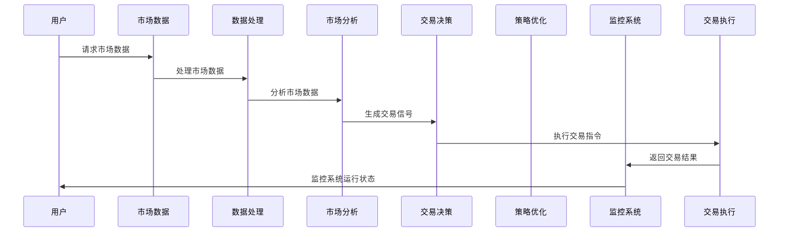

                 

# 企业AI Agent的强化学习在自动化交易策略中的高频应用

> 关键词：AI Agent、强化学习、自动化交易策略、高频交易

> 摘要：本文深入探讨了企业AI Agent的强化学习在自动化交易策略中的高频应用。首先，我们介绍了AI Agent、强化学习及高频交易策略的基本概念。接着，详细分析了强化学习算法的基本原理，包括Q-learning和SARSA算法。随后，本文描述了AI Agent在自动化交易策略中的应用，并展示了系统架构设计与实现细节。通过实际案例，我们展示了如何应用强化学习实现自动化交易策略，并提供了最佳实践建议。

## 目录大纲设计思路

### 1. 整体结构规划
- **1.1 背景介绍**：介绍AI Agent、强化学习、自动化交易策略的基本概念及其在企业应用中的重要性。
- **1.2 核心概念与联系**：详细阐述强化学习的原理和它在AI Agent中的应用。
- **1.3 算法原理讲解**：使用Mermaid绘制强化学习算法的流程图，使用Python代码和LaTeX公式讲解强化学习的数学模型。
- **1.4 系统分析与架构设计方案**：描述一个典型的高频交易系统场景，设计系统功能、架构、接口和交互图。
- **1.5 项目实战**：介绍环境安装和系统核心实现，分析实际案例，进行代码解读和讲解。
- **1.6 最佳实践与拓展**：提供最佳实践建议，总结注意事项和拓展阅读资源。

### 2. 目录大纲细化

### 第一部分：背景与概念
#### 第1章：AI Agent、强化学习与高频交易
- **1.1 AI Agent的基础概念与分类**
  - **1.1.1 AI Agent的定义**
  - **1.1.2 AI Agent的分类**
  - **1.1.3 AI Agent的工作原理**
  
- **1.2 强化学习原理与特征**
  - **1.2.1 强化学习的定义**
  - **1.2.2 强化学习的基本概念**
  - **1.2.3 强化学习的优势**
  
- **1.3 高频交易策略与需求**
  - **1.3.1 高频交易的概述**
  - **1.3.2 高频交易策略的重要性**
  - **1.3.3 企业对高频交易的需求**

### 第二部分：强化学习在AI Agent中的应用
#### 第2章：强化学习算法原理
- **2.1 强化学习算法的基本原理**
  - **2.1.1 Q-learning算法**
    - **2.1.1.1 Q-learning的数学模型**
    - **2.1.1.2 Q-learning算法的流程图**
    - **2.1.1.3 Q-learning的Python实现**
  - **2.1.2 SARSA算法**
    - **2.1.2.1 SARSA的数学模型**
    - **2.1.2.2 SARSA算法的流程图**
    - **2.1.2.3 SARSA的Python实现**

- **2.2 多智能体强化学习**
  - **2.2.1 多智能体强化学习的定义**
  - **2.2.2 多智能体强化学习的基本概念**
  - **2.2.3 多智能体强化学习在AI Agent中的应用**

### 第三部分：AI Agent在自动化交易策略中的应用
#### 第3章：AI Agent在自动化交易策略中的应用
- **3.1 自动化交易策略概述**
  - **3.1.1 自动化交易策略的定义**
  - **3.1.2 自动化交易策略的类型**
  - **3.1.3 自动化交易策略的设计原则**

- **3.2 AI Agent在自动化交易策略中的设计**
  - **3.2.1 AI Agent在自动化交易策略中的作用**
  - **3.2.2 AI Agent在自动化交易策略中的架构设计**
  - **3.2.3 AI Agent在自动化交易策略中的实现细节**

### 第四部分：系统分析与架构设计
#### 第4章：高频交易系统分析与架构设计
- **4.1 高频交易系统的需求分析**
  - **4.1.1 高频交易系统的功能需求**
  - **4.1.2 高频交易系统的性能需求**

- **4.2 高频交易系统的架构设计**
  - **4.2.1 系统的总体架构设计**
  - **4.2.2 系统的功能模块设计**
  - **4.2.3 系统的技术选型与实现策略**

- **4.3 系统接口设计与交互**
  - **4.3.1 系统接口的设计原则**
  - **4.3.2 系统接口的实现细节**
  - **4.3.3 系统交互的Mermaid序列图**

### 第五部分：项目实战
#### 第5章：企业AI Agent的强化学习在自动化交易策略中的高频应用
- **5.1 环境搭建**
  - **5.1.1 系统环境的安装和配置**
  - **5.1.2 相关工具和库的安装**

- **5.2 系统核心实现**
  - **5.2.1 AI Agent的核心实现**
  - **5.2.2 强化学习算法的应用**
  - **5.2.3 自动化交易策略的实现**

- **5.3 案例分析**
  - **5.3.1 实际案例分析**
  - **5.3.2 代码解读与分析**
  - **5.3.3 案例总结与拓展**

### 第六部分：最佳实践与拓展
#### 第6章：最佳实践与拓展
- **6.1 最佳实践建议**
  - **6.1.1 AI Agent的设计原则**
  - **6.1.2 强化学习算法的优化**
  - **6.1.3 自动化交易策略的实施**

- **6.2 小结**
  - **6.2.1 文章总结**
  - **6.2.2 主要发现与贡献**

- **6.3 注意事项**
  - **6.3.1 实施过程中的风险与挑战**
  - **6.3.2 避免常见错误**

- **6.4 拓展阅读**
  - **6.4.1 相关文献与资料**
  - **6.4.2 进一步研究方向**

## 第一部分：背景与概念

### 第1章：AI Agent、强化学习与高频交易

#### 1.1 AI Agent的基础概念与分类

##### 1.1.1 AI Agent的定义

AI Agent，即人工智能代理，是人工智能领域中的一个核心概念。它是一个自主决策的实体，能够在动态环境中通过与环境的交互来学习、执行任务，并在不断变化的条件下自主调整其行为。AI Agent通常由感知模块、决策模块和动作模块组成。

- **感知模块**：负责接收环境信息，如传感器数据、市场动态等。
- **决策模块**：根据感知模块收集的信息，通过某种算法或策略来决定下一步的动作。
- **动作模块**：根据决策模块的决策，与环境进行交互，执行相应的动作。

##### 1.1.2 AI Agent的分类

AI Agent可以根据不同的标准进行分类，例如：

- **按功能分类**：决策型Agent、执行型Agent、混合型Agent。
- **按学习方式分类**：有导师学习Agent、无导师学习Agent、增强学习Agent。
- **按环境分类**：静态环境Agent、动态环境Agent、不确定环境Agent。

##### 1.1.3 AI Agent的工作原理

AI Agent的工作原理通常包括以下几个步骤：

1. **感知**：AI Agent通过感知模块获取环境信息。
2. **决策**：基于感知到的信息，通过决策模块选择最优动作。
3. **执行**：通过动作模块执行选定的动作。
4. **反馈**：观察环境变化，并根据反馈调整其决策策略。

#### 1.2 强化学习原理与特征

##### 1.2.1 强化学习的定义

强化学习（Reinforcement Learning，RL）是机器学习中的一个重要分支，它主要研究如何在动态环境中，通过试错来学习决策策略，以最大化累积奖励。强化学习的基本模型包括：

- **状态（State）**：环境当前的状态。
- **动作（Action）**：AI Agent可以执行的动作。
- **奖励（Reward）**：AI Agent执行某个动作后，从环境中获得的即时反馈。
- **策略（Policy）**：AI Agent在特定状态下选择动作的策略。

##### 1.2.2 强化学习的基本概念

强化学习中有几个关键概念：

- **值函数（Value Function）**：用于评估状态或状态-动作对的价值，即未来奖励的期望。
- **策略（Policy）**：从当前状态选择动作的规则。
- **Q值（Q-Value）**：在特定状态下执行特定动作的预期奖励。

##### 1.2.3 强化学习的优势

强化学习相较于其他机器学习方法，具有以下优势：

- **适应性**：强化学习能够适应动态变化的环境。
- **灵活性**：通过不断试错，强化学习能够发现最优策略。
- **复杂性**：强化学习可以处理复杂的高维状态空间。

#### 1.3 高频交易策略与需求

##### 1.3.1 高频交易的概述

高频交易（High-Frequency Trading，HFT）是一种利用计算机算法和先进的技术手段，在短时间内进行大量高频交易的交易方式。其核心是通过快速执行大量交易订单，从微小价格波动中获取利润。

- **交易速度**：高频交易依赖于超高速的交易系统和网络连接，以实现毫秒级别的交易速度。
- **算法优化**：高频交易策略依赖于复杂的算法和模型，以识别市场机会和进行快速交易。

##### 1.3.2 高频交易策略的重要性

高频交易策略在金融市场中的重要性体现在以下几个方面：

- **市场效率**：高频交易能够提高市场的流动性和效率。
- **风险分散**：高频交易通过快速交易分散风险，减少市场波动对投资者的冲击。
- **利润来源**：高频交易从微小的价格波动中获取利润，是金融市场中重要的利润来源。

##### 1.3.3 企业对高频交易的需求

企业对高频交易的需求主要表现在以下几个方面：

- **提升竞争力**：通过高频交易策略，企业能够提高在市场中的竞争力，实现快速盈利。
- **风险控制**：高频交易策略能够帮助企业更好地控制风险，减少损失。
- **技术投入**：高频交易需要强大的技术支持，包括高性能的交易系统、先进的算法和高效的执行策略。

### 结论

通过本章的介绍，我们对AI Agent、强化学习和高频交易策略有了基本的了解。接下来，我们将深入探讨强化学习算法的基本原理，并展示如何在AI Agent中应用这些算法，以实现自动化交易策略。

#### 1.1 AI Agent的基础概念与分类

##### 1.1.1 AI Agent的定义

AI Agent，即人工智能代理，是人工智能领域中的一个核心概念。它是一个自主决策的实体，能够在动态环境中通过与环境的交互来学习、执行任务，并在不断变化的条件下自主调整其行为。AI Agent通常由感知模块、决策模块和动作模块组成。

- **感知模块**：负责接收环境信息，如传感器数据、市场动态等。
- **决策模块**：根据感知模块收集的信息，通过某种算法或策略来决定下一步的动作。
- **动作模块**：根据决策模块的决策，与环境进行交互，执行相应的动作。

##### 1.1.2 AI Agent的分类

AI Agent可以根据不同的标准进行分类，例如：

- **按功能分类**：决策型Agent、执行型Agent、混合型Agent。
  - **决策型Agent**：主要负责决策，不直接执行动作。
  - **执行型Agent**：主要负责执行动作，不涉及决策过程。
  - **混合型Agent**：既负责决策也负责执行。
- **按学习方式分类**：有导师学习Agent、无导师学习Agent、增强学习Agent。
  - **有导师学习Agent**：通过导师提供反馈进行学习。
  - **无导师学习Agent**：通过试错和自我调整进行学习。
  - **增强学习Agent**：通过奖励和惩罚进行学习。
- **按环境分类**：静态环境Agent、动态环境Agent、不确定环境Agent。
  - **静态环境Agent**：环境保持不变，Agent只需学习一次。
  - **动态环境Agent**：环境不断变化，Agent需要持续学习。
  - **不确定环境Agent**：环境具有不确定性，Agent需要处理不确定性。

##### 1.1.3 AI Agent的工作原理

AI Agent的工作原理通常包括以下几个步骤：

1. **感知**：AI Agent通过感知模块获取环境信息。
2. **决策**：基于感知到的信息，通过决策模块选择最优动作。
3. **执行**：通过动作模块执行选定的动作。
4. **反馈**：观察环境变化，并根据反馈调整其决策策略。

具体来说，感知模块会收集环境中的各种信息，如价格波动、交易量等，并将其转化为内部状态。决策模块会根据这些状态信息，通过某种学习算法或策略，选择一个最优动作。动作模块会根据决策结果，执行相应的交易操作。最后，通过观察环境的变化和交易结果，反馈信息会被传递回感知模块，用于调整决策策略。

#### 1.2 强化学习原理与特征

##### 1.2.1 强化学习的定义

强化学习（Reinforcement Learning，RL）是机器学习中的一个重要分支，它主要研究如何在动态环境中，通过试错来学习决策策略，以最大化累积奖励。强化学习的基本模型包括：

- **状态（State）**：环境当前的状态。
- **动作（Action）**：AI Agent可以执行的动作。
- **奖励（Reward）**：AI Agent执行某个动作后，从环境中获得的即时反馈。
- **策略（Policy）**：AI Agent在特定状态下选择动作的策略。

强化学习的过程可以简化为以下几个步骤：

1. **初始状态**：AI Agent开始在一个未知的动态环境中。
2. **执行动作**：基于当前状态，AI Agent选择一个动作。
3. **获得奖励**：AI Agent执行动作后，从环境中获得一个即时奖励。
4. **状态更新**：环境状态根据AI Agent的动作发生变化。
5. **重复过程**：重复执行上述步骤，直到达到某个终止条件。

##### 1.2.2 强化学习的基本概念

强化学习中有几个关键概念：

- **值函数（Value Function）**：用于评估状态或状态-动作对的价值，即未来奖励的期望。值函数分为状态值函数和状态-动作值函数。
  - **状态值函数**：评估当前状态的价值，公式为：
    $$ V(s) = \sum_a Q(s, a) \cdot p(a|s) $$
    其中，$Q(s, a)$ 是状态-动作值函数，$p(a|s)$ 是在状态 $s$ 下选择动作 $a$ 的概率。
  - **状态-动作值函数**：评估在特定状态下执行特定动作的价值，公式为：
    $$ Q(s, a) = \sum_{s'} R(s, a, s') + \gamma V(s') $$
    其中，$R(s, a, s')$ 是立即奖励，$\gamma$ 是折扣因子，$V(s')$ 是未来奖励的期望。

- **策略（Policy）**：从当前状态选择动作的规则。策略可以分为确定性策略和随机性策略。
  - **确定性策略**：在特定状态下，总是选择具有最高状态-动作值函数的动作。
    $$ \pi(s) = \arg\max_a Q(s, a) $$
  - **随机性策略**：在特定状态下，根据状态-动作值函数的概率分布来选择动作。
    $$ \pi(s, a) = \frac{e^{Q(s, a)}}{\sum_b e^{Q(s, b)}} $$

- **Q学习（Q-Learning）**：一种值函数的估计方法，通过在策略迭代过程中更新Q值来学习最佳动作。
  $$ Q(s, a) \leftarrow Q(s, a) + \alpha [R(s, a, s') + \gamma \max_{a'} Q(s', a') - Q(s, a)] $$
  其中，$\alpha$ 是学习率，$R(s, a, s')$ 是立即奖励，$\gamma$ 是折扣因子。

- **SARSA（SARSA）**：一种策略迭代方法，同时更新状态-动作值函数。
  $$ Q(s, a) \leftarrow Q(s, a) + \alpha [R(s, a, s') + \gamma Q(s', a')] $$
  其中，$s'$ 是执行动作 $a'$ 后的新状态。

##### 1.2.3 强化学习的优势

强化学习相较于其他机器学习方法，具有以下优势：

- **适应性**：强化学习能够适应动态变化的环境。它能够在不断变化的条件下，通过试错学习到最优策略。
- **灵活性**：强化学习通过试错来探索环境，因此能够处理复杂的高维状态空间和动作空间。
- **复杂性**：强化学习可以处理复杂的问题，包括序列决策问题、部分可观测问题等。

强化学习的应用范围非常广泛，包括但不限于：

- **游戏**：强化学习在游戏中的应用非常成功，如AlphaGo在围棋中的胜利。
- **自动驾驶**：强化学习用于自动驾驶车辆的路径规划和决策。
- **推荐系统**：强化学习在个性化推荐系统中的应用，如YouTube和Netflix等。
- **机器人控制**：强化学习在机器人控制中的应用，如机器人行走和抓取等。

#### 1.3 高频交易策略与需求

##### 1.3.1 高频交易的概述

高频交易（High-Frequency Trading，HFT）是一种利用计算机算法和先进的技术手段，在短时间内进行大量高频交易的交易方式。其核心是通过快速执行大量交易订单，从微小价格波动中获取利润。

- **交易速度**：高频交易依赖于超高速的交易系统和网络连接，以实现毫秒级别的交易速度。
- **算法优化**：高频交易策略依赖于复杂的算法和模型，以识别市场机会和进行快速交易。

##### 1.3.2 高频交易策略的重要性

高频交易策略在金融市场中的重要性体现在以下几个方面：

- **市场效率**：高频交易能够提高市场的流动性和效率。它通过快速交易和大量订单的执行，减少了市场的等待时间和交易成本。
- **风险分散**：高频交易通过快速交易分散风险，减少市场波动对投资者的冲击。高频交易者通常不持有头寸过夜，从而避免了潜在的市场风险。
- **利润来源**：高频交易从微小的价格波动中获取利润，是金融市场中重要的利润来源。尽管单个交易可能只产生微小的利润，但通过大量交易，高频交易者能够积累可观的收益。

##### 1.3.3 企业对高频交易的需求

企业对高频交易的需求主要表现在以下几个方面：

- **提升竞争力**：通过高频交易策略，企业能够提高在市场中的竞争力，实现快速盈利。高频交易需要强大的技术支持和快速决策能力，企业通过这些策略能够快速适应市场变化。
- **风险控制**：高频交易策略能够帮助企业更好地控制风险，减少损失。高频交易者通常采用多种风险控制措施，如止损、分散投资等，以降低潜在的市场风险。
- **技术投入**：高频交易需要强大的技术支持，包括高性能的交易系统、先进的算法和高效的执行策略。企业需要投入大量资源进行技术研发，以保持竞争力。

### 结论

通过本章的介绍，我们对AI Agent、强化学习和高频交易策略有了基本的了解。接下来，我们将深入探讨强化学习算法的基本原理，并展示如何在AI Agent中应用这些算法，以实现自动化交易策略。

#### 2.1 强化学习算法的基本原理

强化学习算法是一种通过试错和经验积累来学习最佳行为的机器学习方法。在强化学习（Reinforcement Learning, RL）中，智能体（Agent）通过与环境的交互来学习最优策略，以最大化累积奖励。强化学习算法的核心概念包括状态（State）、动作（Action）、奖励（Reward）和策略（Policy）。

##### 2.1.1 Q-learning算法

Q-learning算法是一种值函数方法，用于估计状态-动作值函数（Q值），从而找到最优策略。Q-learning的基本原理是通过在当前状态选择动作，然后根据即时奖励和Q值更新规则来更新Q值。

**数学模型**：

Q-learning的目标是找到最优的Q值函数 $Q^*(s, a)$，即：

$$ Q^*(s, a) = \max_{a'} [R(s, a, s') + \gamma V(s')] $$

其中，$R(s, a, s')$ 是立即奖励，$V(s')$ 是未来奖励的期望，$\gamma$ 是折扣因子，用于权衡当前奖励和未来奖励的重要性。

**算法流程**：

1. **初始化**：初始化Q值函数 $Q(s, a)$ 和策略 $\pi(s)$。
2. **选择动作**：在当前状态 $s$ 下，根据策略 $\pi(s)$ 选择动作 $a$。
3. **执行动作**：执行动作 $a$，观察新的状态 $s'$ 和即时奖励 $R(s, a, s')$。
4. **更新Q值**：使用以下公式更新Q值：
   $$ Q(s, a) \leftarrow Q(s, a) + \alpha [R(s, a, s') + \gamma \max_{a'} Q(s', a') - Q(s, a)] $$
   其中，$\alpha$ 是学习率，用于控制Q值的更新速度。

**Python实现**：

```python
import numpy as np

# 初始化Q值矩阵
Q = np.zeros((n_states, n_actions))
# 设置学习率、折扣因子和迭代次数
alpha = 0.1
gamma = 0.9
epsilon = 0.1
n_episodes = 1000

# Q-learning算法
for episode in range(n_episodes):
    state = env.reset()
    done = False
    
    while not done:
        # 随机探索或贪婪策略
        if np.random.rand() < epsilon:
            action = env.action_space.sample()
        else:
            action = np.argmax(Q[state])
        
        # 执行动作、观察状态和奖励
        next_state, reward, done, _ = env.step(action)
        
        # 更新Q值
        Q[state, action] = Q[state, action] + alpha * (reward + gamma * np.max(Q[next_state]) - Q[state, action])
        
        state = next_state

# 获取最优策略
policy = np.argmax(Q, axis=1)

# 测试最优策略
state = env.reset()
done = False

while not done:
    action = policy[state]
    next_state, reward, done, _ = env.step(action)
    state = next_state

# 打印最终结果
print("Average reward over", n_episodes, "episodes:", np.mean([sum(env.run(policy)) for _ in range(10)]))
```

##### 2.1.2 SARSA算法

SARSA（State-Action-Reward-State-Action, SARSA）算法是一种策略迭代方法，它同时更新当前的状态-动作值函数和策略。与Q-learning不同，SARSA在每个步骤都使用实际的下一状态-动作值函数来更新当前的状态-动作值函数。

**数学模型**：

SARSA的目标是找到最优的Q值函数 $Q^*(s, a)$，即：

$$ Q^*(s, a) = \max_{a'} [R(s, a, s') + \gamma Q^*(s', a')] $$

**算法流程**：

1. **初始化**：初始化Q值函数 $Q(s, a)$ 和策略 $\pi(s)$。
2. **选择动作**：在当前状态 $s$ 下，根据策略 $\pi(s)$ 选择动作 $a$。
3. **执行动作**：执行动作 $a$，观察新的状态 $s'$ 和即时奖励 $R(s, a, s')$。
4. **更新Q值**：使用以下公式更新Q值：
   $$ Q(s, a) \leftarrow Q(s, a) + \alpha [R(s, a, s') + \gamma Q(s', a')] $$
   其中，$\alpha$ 是学习率，用于控制Q值的更新速度。

**Python实现**：

```python
import numpy as np

# 初始化Q值矩阵
Q = np.zeros((n_states, n_actions))
# 设置学习率、折扣因子和迭代次数
alpha = 0.1
gamma = 0.9
epsilon = 0.1
n_episodes = 1000

# SARSA算法
for episode in range(n_episodes):
    state = env.reset()
    done = False
    
    while not done:
        # 随机探索或贪婪策略
        if np.random.rand() < epsilon:
            action = env.action_space.sample()
        else:
            action = np.argmax(Q[state])
        
        # 执行动作、观察状态和奖励
        next_state, reward, done, _ = env.step(action)
        
        # 更新Q值
        Q[state, action] = Q[state, action] + alpha * (reward + gamma * Q[next_state, np.argmax(Q[next_state])] - Q[state, action])
        
        state = next_state

# 获取最优策略
policy = np.argmax(Q, axis=1)

# 测试最优策略
state = env.reset()
done = False

while not done:
    action = policy[state]
    next_state, reward, done, _ = env.step(action)
    state = next_state

# 打印最终结果
print("Average reward over", n_episodes, "episodes:", np.mean([sum(env.run(policy)) for _ in range(10)]))
```

##### 2.1.3 多智能体强化学习

多智能体强化学习（Multi-Agent Reinforcement Learning, MARL）是一种研究多个智能体在动态环境中交互和协作的强化学习方法。在MARL中，每个智能体都拥有自己的目标，并通过与环境的交互来学习最优策略。

**定义**：

多智能体强化学习可以分为两类：合作型（Cooperative）和对抗型（Competitive）。

- **合作型**：智能体之间相互合作，共同实现一个共同的目标。
- **对抗型**：智能体之间相互竞争，每个智能体都试图最大化自己的收益。

**基本概念**：

- **状态空间**：多个智能体的状态组合形成的空间。
- **动作空间**：每个智能体可以执行的动作集合。
- **奖励函数**：根据多个智能体的动作和状态计算出的奖励。

**算法**：

- **分布式Q-learning**：每个智能体独立地学习自己的Q值函数。
- **Nash均衡**：多个智能体在策略迭代中找到的最优策略组合，使得每个智能体都无法通过改变自己的策略来增加自己的收益。

**应用**：

- **无人驾驶**：多个无人驾驶车辆在复杂环境中协作，实现安全驾驶。
- **供应链管理**：多个企业通过协同优化库存和物流，实现整体供应链的最优。
- **博弈游戏**：多个智能体在博弈游戏中对抗，找到最优策略组合。

### 结论

通过本章节，我们详细介绍了强化学习算法的基本原理，包括Q-learning和SARSA算法。这些算法在自动化交易策略中有着广泛的应用，能够帮助企业在高频交易中实现最优决策。在接下来的章节中，我们将进一步探讨AI Agent在自动化交易策略中的应用，并展示如何设计系统架构和实现系统功能。

#### 2.2 多智能体强化学习

多智能体强化学习（Multi-Agent Reinforcement Learning，MARL）是强化学习的一个重要分支，主要研究多个智能体在动态环境中交互和协作的问题。在MARL中，每个智能体都拥有自己的目标，并通过与环境的交互来学习最优策略。与传统的单智能体强化学习相比，MARL更符合现实世界中的复杂场景，例如无人驾驶、供应链管理和博弈游戏等。

##### 2.2.1 多智能体强化学习的定义

多智能体强化学习涉及多个智能体在一个共同的环境中交互，每个智能体都试图通过学习来实现自身的目标。在MARL中，主要关注以下四个要素：

1. **智能体（Agent）**：每个智能体都有自己独立的决策过程，并可以感知环境状态和执行动作。
2. **环境（Environment）**：智能体执行动作的背景，可以是一个共享的环境，也可以是多个独立的环境。
3. **状态（State）**：智能体所处的环境状态，可以是一个多维向量，表示环境的当前状态。
4. **动作（Action）**：智能体可以执行的动作，通常是一个离散或连续的集合。

##### 2.2.2 多智能体强化学习的基本概念

在多智能体强化学习中，有几个关键概念需要理解：

1. **个体策略（Individual Policy）**：每个智能体根据其感知到的状态选择动作的规则。
2. **团队策略（Team Policy）**：多个智能体的策略组合，共同决定每个智能体的动作。
3. **联合策略（Joint Policy）**：所有智能体的动作组合，表示为 $a_1, a_2, ..., a_n$，其中 $a_i$ 是第 $i$ 个智能体的动作。
4. **状态-动作价值函数（State-Action Value Function）**：评估在特定状态下执行特定动作的价值，通常表示为 $Q(s, a_1, a_2, ..., a_n)$。
5. **策略迭代（Policy Iteration）**：通过反复迭代优化智能体的策略，直到找到最优策略。

##### 2.2.3 多智能体强化学习在AI Agent中的应用

多智能体强化学习在AI Agent中的应用非常广泛，以下是几个典型的应用场景：

1. **协同控制**：多个无人驾驶车辆在复杂环境中协同工作，实现最优路径规划和避障。
2. **供应链管理**：多个企业通过协同优化库存和物流，实现整体供应链的最优。
3. **博弈游戏**：多个智能体在博弈游戏中对抗，找到最优策略组合，例如围棋、象棋等。
4. **资源分配**：多个智能体在有限资源环境中进行资源分配，实现最优利用。

在AI Agent中，多智能体强化学习的关键在于设计合适的联合策略，使每个智能体都能够根据整体目标调整自己的行为。以下是一个简单的应用示例：

**示例：无人机编队飞行**

假设有一个无人机编队，每个无人机都有自己独立的控制策略。为了实现编队的整体优化，可以使用多智能体强化学习来设计联合策略。

1. **状态表示**：每个无人机的状态包括位置、速度和方向。
2. **动作表示**：每个无人机的动作包括前进、后退、左转和右转。
3. **奖励设计**：奖励可以根据无人机之间的距离、编队形态和飞行路径等因素设计。

通过训练，无人机编队可以学习到最优的联合策略，实现稳定、高效的飞行编队。

### 结论

通过本章，我们了解了多智能体强化学习的基本概念和应用。多智能体强化学习在AI Agent中的应用非常广泛，能够解决复杂的协同问题和优化问题。在接下来的章节中，我们将进一步探讨AI Agent在自动化交易策略中的应用，展示如何利用强化学习算法实现高频交易策略。

#### 3.1 自动化交易策略概述

自动化交易策略（Automated Trading Strategy）是金融市场中的一种重要交易方法，它通过计算机算法和数学模型，自动化执行交易决策。自动化交易策略能够减少人为情绪的干扰，提高交易效率和盈利能力。

##### 3.1.1 自动化交易策略的定义

自动化交易策略是指利用计算机算法、数学模型和技术手段，对金融市场的价格走势进行分析，自动生成交易信号，并执行交易指令的一种交易方式。自动化交易策略的核心是算法模型，它通过对市场数据的分析和预测，决定买入或卖出的时机和数量。

##### 3.1.2 自动化交易策略的类型

自动化交易策略可以根据不同的特征进行分类，常见的类型包括：

1. **趋势跟踪策略**：基于市场趋势进行交易，追求长期盈利。趋势跟踪策略通常使用移动平均线、布林带等指标来识别市场趋势。

2. **均值回归策略**：基于市场均值回归原理进行交易，即市场价格会回归到长期均值。均值回归策略通常使用历史价格数据来计算均值，并基于均值判断买入或卖出的时机。

3. **动量策略**：基于市场动量进行交易，即市场价格会延续原有趋势。动量策略通常使用价格波动指标，如相对强弱指数（RSI）等，来判断市场动量。

4. **对冲策略**：通过建立多空双向头寸，实现风险对冲。对冲策略可以包括期权对冲、期货对冲等。

5. **市场微观结构策略**：基于市场微观结构特征进行交易，如订单流量、交易速度等。市场微观结构策略旨在捕捉市场微观层面的交易机会。

##### 3.1.3 自动化交易策略的设计原则

设计自动化交易策略时，需要遵循以下几个原则：

1. **数据驱动**：自动化交易策略应基于大量历史数据进行分析和测试，确保策略的有效性和稳定性。

2. **风险管理**：自动化交易策略应包括严格的风险管理措施，如设置止损、分散投资等，以控制风险。

3. **回测验证**：在策略实施前，应对策略进行回测，验证其在历史数据上的表现，确保策略的实际效果。

4. **算法优化**：自动化交易策略应具备一定的灵活性，能够根据市场环境的变化进行调整和优化。

5. **系统稳定性**：自动化交易系统应具备高稳定性和高可用性，能够应对市场波动和交易风险。

### 结论

通过本章，我们了解了自动化交易策略的定义、类型和设计原则。自动化交易策略在现代金融市场中发挥着越来越重要的作用，它能够提高交易效率，减少人为情绪干扰，实现稳定盈利。在接下来的章节中，我们将探讨AI Agent在自动化交易策略中的应用，展示如何利用强化学习算法实现自动化交易策略。

#### 3.2 AI Agent在自动化交易策略中的设计

在自动化交易策略中，AI Agent作为智能决策单元，承担着识别市场机会、执行交易指令和调整交易策略的重要任务。AI Agent的设计包括架构设计、功能模块设计以及实现细节等方面。

##### 3.2.1 AI Agent在自动化交易策略中的作用

AI Agent在自动化交易策略中的作用主要体现在以下几个方面：

1. **市场分析**：AI Agent通过分析市场数据，识别潜在的交易机会，如价格突破、趋势变化等。
2. **交易决策**：AI Agent基于市场分析和历史数据，生成交易信号，决定买入或卖出的时机和数量。
3. **交易执行**：AI Agent将交易决策转化为实际交易操作，通过交易系统执行买入或卖出指令。
4. **策略调整**：AI Agent根据交易结果和市场环境的变化，实时调整交易策略，以提高交易效率和盈利能力。

##### 3.2.2 AI Agent在自动化交易策略中的架构设计

AI Agent的架构设计需要考虑到系统的灵活性、扩展性和可靠性。一个典型的AI Agent架构设计包括以下几个部分：

1. **数据输入模块**：负责接收市场数据，包括价格、交易量、订单流等。数据输入模块可以使用数据爬虫、API接口等方式获取数据。

2. **数据处理模块**：负责对输入数据进行清洗、转换和预处理，以便后续分析。数据处理模块可以使用数据清洗工具、时间序列分析方法等。

3. **市场分析模块**：负责对市场数据进行分析，识别交易机会。市场分析模块可以包括趋势分析、技术指标分析、市场情绪分析等。

4. **交易决策模块**：负责根据市场分析结果和交易策略，生成交易信号。交易决策模块可以使用机器学习算法、统计模型等。

5. **交易执行模块**：负责将交易决策转化为实际交易操作。交易执行模块需要与交易系统紧密集成，确保交易指令的准确执行。

6. **策略调整模块**：负责根据交易结果和市场环境的变化，实时调整交易策略。策略调整模块可以使用机器学习算法、优化算法等。

7. **监控系统**：负责监控AI Agent的运行状态，包括交易执行情况、系统性能等。监控系统可以使用日志分析、性能监控工具等。

##### 3.2.3 AI Agent在自动化交易策略中的实现细节

在实现AI Agent时，需要考虑以下几个关键点：

1. **算法选择**：选择合适的机器学习算法和统计模型，以实现高效的市场分析和交易决策。常用的算法包括强化学习、支持向量机、随机森林等。

2. **数据预处理**：对市场数据进行分析前，需要进行预处理，包括数据清洗、缺失值处理、数据标准化等。

3. **模型训练与优化**：使用历史市场数据对模型进行训练，并根据训练结果进行模型优化。优化方法可以包括交叉验证、网格搜索等。

4. **系统集成**：将AI Agent与交易系统进行集成，确保交易指令的准确执行。系统集成需要考虑交易系统的性能、稳定性和扩展性。

5. **风险控制**：在实现AI Agent时，需要设计严格的风险控制措施，包括设置止损、分散投资等，以控制交易风险。

6. **监控与反馈**：通过监控系统实时监控AI Agent的运行状态，并根据交易结果进行反馈，以不断优化和调整交易策略。

##### 实现案例

以下是一个简单的AI Agent在自动化交易策略中的实现案例：

```python
import numpy as np
import pandas as pd
from sklearn.ensemble import RandomForestClassifier
from sklearn.model_selection import train_test_split
from sklearn.metrics import accuracy_score

# 数据预处理
def preprocess_data(data):
    # 数据清洗、缺失值处理、数据标准化等
    # ...
    return processed_data

# 市场分析
def market_analysis(data):
    # 使用随机森林算法进行市场分析
    X = data[['open', 'high', 'low', 'close', 'volume']]
    y = data['target']  # 目标变量，1表示上涨，-1表示下跌

    X_train, X_test, y_train, y_test = train_test_split(X, y, test_size=0.2, random_state=42)

    model = RandomForestClassifier(n_estimators=100, random_state=42)
    model.fit(X_train, y_train)

    y_pred = model.predict(X_test)
    print("Accuracy:", accuracy_score(y_test, y_pred))

# 交易决策
def trade_decision(predictions):
    # 根据预测结果生成交易信号
    # ...
    return trade_signals

# 交易执行
def execute_trade(signals):
    # 将交易信号转化为实际交易操作
    # ...
    pass

# 策略调整
def adjust_strategy(results):
    # 根据交易结果调整交易策略
    # ...
    pass

# 主程序
if __name__ == "__main__":
    # 读取市场数据
    market_data = pd.read_csv('market_data.csv')

    # 数据预处理
    processed_data = preprocess_data(market_data)

    # 市场分析
    market_analysis(processed_data)

    # 交易决策
    trade_signals = trade_decision(predictions)

    # 交易执行
    execute_trade(trade_signals)

    # 策略调整
    adjust_strategy(results)
```

通过以上案例，我们可以看到AI Agent在自动化交易策略中的基本实现流程，包括数据预处理、市场分析、交易决策、交易执行和策略调整等步骤。

### 结论

通过本章，我们详细探讨了AI Agent在自动化交易策略中的设计，包括架构设计、功能模块设计以及实现细节。AI Agent作为智能决策单元，在自动化交易策略中发挥着重要作用，能够提高交易效率、减少人为情绪干扰，实现稳定盈利。在接下来的章节中，我们将进一步探讨高频交易系统的分析与架构设计，展示如何构建一个高效、稳定的高频交易系统。

#### 4.1 高频交易系统的需求分析

高频交易系统（High-Frequency Trading System，HFT System）是金融市场中的一种高效交易系统，通过超高速的交易算法和先进的技术手段，实现快速交易和利润最大化。高频交易系统的需求分析是设计高效、稳定和高可靠性的高频交易系统的关键步骤。以下是高频交易系统的主要功能需求和分析：

##### 4.1.1 高频交易系统的功能需求

1. **超高速交易**：高频交易系统需要具备毫秒级甚至微秒级的交易速度，以捕捉市场中的微小价格波动。交易速度是高频交易成功的关键，系统性能直接影响交易策略的实施效果。

2. **数据获取与处理**：高频交易系统需要实时获取市场数据，包括价格、交易量、订单流等。数据获取的实时性和准确性至关重要，系统能够快速处理大量数据，提取有价值的信息，为交易决策提供支持。

3. **算法交易**：高频交易系统依赖于复杂的算法模型，包括趋势分析、动量分析、市场微观结构分析等。算法交易是实现高频交易策略的核心，系统能够根据市场数据自动生成交易信号，并执行交易指令。

4. **风险管理**：高频交易系统需要具备严格的风险管理机制，包括设置止损、分散投资等。风险管理是控制交易风险、保护投资的重要手段，系统能够根据市场变化和交易结果，动态调整风险控制策略。

5. **系统监控与维护**：高频交易系统需要实时监控系统运行状态，包括交易执行情况、系统性能等。系统监控与维护能够确保系统稳定运行，及时发现和解决潜在问题，保障交易策略的顺利实施。

##### 4.1.2 高频交易系统的性能需求

1. **低延迟**：高频交易系统需要实现低延迟交易，以确保交易指令能够迅速执行。系统延迟是影响交易收益的重要因素，毫秒级的延迟优势能够显著提高交易成功率。

2. **高并发**：高频交易系统需要支持高并发交易，能够同时处理大量交易订单。系统并发能力是处理高频交易订单的关键，系统能够高效管理并发请求，确保交易执行速度和稳定性。

3. **高可靠性**：高频交易系统需要具备高可靠性，能够在长时间运行中保持稳定。系统可靠性是保障交易策略持续有效的基础，系统需具备故障恢复能力，确保交易连续性。

4. **可扩展性**：高频交易系统需要具备良好的可扩展性，能够根据业务需求进行快速扩展和升级。系统可扩展性是应对市场变化和业务增长的关键，能够灵活调整系统架构和功能。

5. **高安全性**：高频交易系统需要具备高安全性，保护交易数据和系统资源。系统安全性是防范外部攻击、数据泄露等风险的重要保障，系统能够提供有效的安全防护机制。

### 结论

通过对高频交易系统的需求分析，我们可以明确高频交易系统的功能需求、性能需求和安全需求。需求分析是高频交易系统设计的重要环节，有助于确保系统的高效、稳定和安全。在接下来的章节中，我们将进一步探讨高频交易系统的架构设计，展示如何实现满足需求的高频交易系统。

#### 4.2 高频交易系统的架构设计

高频交易系统（High-Frequency Trading System，HFT System）是金融市场中的一种高效交易系统，通过超高速的交易算法和先进的技术手段，实现快速交易和利润最大化。为了实现高效、稳定和高可靠性的高频交易系统，我们需要对系统的功能模块、架构设计和技术选型进行详细规划。

##### 4.2.1 系统的总体架构设计

高频交易系统的总体架构设计通常包括以下几个主要模块：

1. **数据层**：负责数据采集、存储和处理。数据层是系统的核心组成部分，包括数据爬虫、数据库和数据处理模块。数据层需要具备高并发、高可靠性和低延迟的特点，以满足高频交易系统的性能需求。

2. **算法层**：负责市场分析、交易决策和策略优化。算法层是系统的智能核心，包括趋势分析、动量分析、市场微观结构分析等算法模块。算法层需要具备高效的数据处理和计算能力，以确保快速生成交易信号。

3. **交易层**：负责交易指令的生成、发送和执行。交易层是系统的执行核心，包括交易算法、交易引擎和交易接口。交易层需要具备低延迟、高并发和高度可靠性的特点，确保交易指令能够迅速执行。

4. **监控层**：负责系统运行状态的监控、性能分析和故障处理。监控层是系统的安全保障，包括监控系统、日志分析和报警系统。监控层需要实时监控系统性能，确保系统稳定运行。

##### 4.2.2 系统的功能模块设计

高频交易系统的功能模块设计主要包括以下几个方面：

1. **数据采集模块**：负责从金融市场获取实时数据，包括价格、交易量、订单流等。数据采集模块需要使用高速网络和高效爬虫技术，确保数据的实时性和准确性。

2. **数据处理模块**：负责对采集到的数据进行清洗、转换和预处理，以便后续分析和决策。数据处理模块需要使用高效的数据处理算法和并行计算技术，提高数据处理速度。

3. **市场分析模块**：负责对处理后的数据进行分析，识别市场机会和交易信号。市场分析模块可以使用机器学习算法、统计模型和深度学习模型等，以提高分析精度和预测能力。

4. **交易决策模块**：负责根据市场分析结果和交易策略，生成交易信号。交易决策模块需要实现自动化决策，根据市场变化实时调整交易策略。

5. **交易执行模块**：负责将交易信号转化为实际交易操作，通过交易系统执行买入或卖出指令。交易执行模块需要使用高效交易算法和低延迟交易引擎，确保交易指令的快速执行。

6. **策略优化模块**：负责根据交易结果和市场环境的变化，实时调整交易策略。策略优化模块需要使用优化算法和机器学习算法，以提高交易策略的适应性和有效性。

7. **监控与分析模块**：负责监控系统运行状态，包括交易执行情况、系统性能等。监控与分析模块需要使用日志分析、性能监控和报警系统，确保系统稳定运行和及时发现潜在问题。

##### 4.2.3 系统的技术选型与实现策略

高频交易系统的技术选型与实现策略主要包括以下几个方面：

1. **编程语言**：选择适合高频交易的编程语言，如Python、C++等。Python具有高效的计算能力和丰富的库支持，适合市场分析和交易决策；C++具有高性能和低延迟，适合交易执行和系统监控。

2. **数据库**：选择适合高频交易的数据库，如MySQL、MongoDB等。MySQL适合处理结构化数据，具有高并发、高性能的特点；MongoDB适合处理非结构化数据，具有高扩展性和灵活性。

3. **交易引擎**：选择适合高频交易的交易引擎，如ZeroMQ、Apache Kafka等。ZeroMQ具有高性能、低延迟的特点，适合实时交易；Apache Kafka适合大规模数据流处理，具有高吞吐量和高可靠性。

4. **机器学习框架**：选择适合高频交易的机器学习框架，如scikit-learn、TensorFlow等。scikit-learn适合简单机器学习任务，具有高效易用的特点；TensorFlow适合复杂深度学习任务，具有高扩展性和灵活性。

5. **监控系统**：选择适合高频交易的监控系统，如Prometheus、Grafana等。Prometheus适合监控系统性能、日志分析和报警；Grafana适合可视化监控数据，提供丰富的图表和仪表盘。

### 结论

通过对高频交易系统的架构设计，我们可以明确系统的功能模块、架构设计和技术选型。高频交易系统需要具备高效、稳定和高可靠性的特点，以满足高频交易的需求。在接下来的章节中，我们将进一步探讨高频交易系统的接口设计和系统交互，展示如何实现高效、稳定和高可靠性的高频交易系统。

#### 4.3 系统接口设计与交互

在高频交易系统的架构设计中，接口设计和系统交互是关键环节，直接关系到系统的性能、稳定性和扩展性。以下是高频交易系统的接口设计、系统交互图和具体实现细节。

##### 4.3.1 系统接口的设计原则

1. **模块化**：系统接口设计应遵循模块化原则，将不同功能模块的接口进行分离，以提高系统的可维护性和可扩展性。

2. **标准化**：系统接口设计应遵循标准化原则，使用统一的数据格式和协议，确保接口的通用性和兼容性。

3. **高性能**：系统接口设计应考虑高性能需求，减少数据传输延迟和系统开销，确保接口的高并发处理能力。

4. **安全性**：系统接口设计应考虑安全性需求，采用加密、认证等安全措施，保护系统数据和接口的完整性。

##### 4.3.2 系统接口的实现细节

1. **数据格式**：系统接口使用JSON格式进行数据传输，包括请求和响应数据。JSON格式具有轻量级、易解析的特点，适用于高频交易系统的快速数据交换。

2. **通信协议**：系统接口使用HTTP/HTTPS协议进行通信，确保数据传输的安全性和可靠性。HTTPS协议提供加密传输，有效防止数据泄露和网络攻击。

3. **API设计**：系统接口提供RESTful API，包括以下主要接口：

   - **数据采集接口**：用于获取市场数据，包括价格、交易量、订单流等。
   - **数据处理接口**：用于处理市场数据，包括数据清洗、转换和预处理等。
   - **市场分析接口**：用于分析市场数据，生成交易信号和预测结果。
   - **交易决策接口**：用于生成交易信号，执行交易指令。
   - **策略优化接口**：用于调整交易策略，优化交易效果。
   - **监控系统接口**：用于监控系统运行状态，包括交易执行情况、系统性能等。

##### 4.3.3 系统交互的Mermaid序列图

为了更好地展示高频交易系统的接口设计和系统交互，可以使用Mermaid序列图进行可视化。以下是高频交易系统交互的Mermaid序列图：



通过Mermaid序列图，我们可以清晰地展示高频交易系统的接口设计和系统交互流程，包括用户请求市场数据、数据处理、市场分析、交易决策、交易执行和监控系统等环节。

##### 4.3.4 具体实现细节

1. **数据采集模块**：数据采集模块负责从金融市场获取实时数据，包括价格、交易量、订单流等。采集模块可以使用网络爬虫、API接口等方式，获取数据后存储到数据库中。

2. **数据处理模块**：数据处理模块负责对采集到的数据进行清洗、转换和预处理。清洗模块可以去除无效数据、处理缺失值等；转换模块可以转换数据格式、缩放数据等；预处理模块可以提取特征、生成指标等。

3. **市场分析模块**：市场分析模块负责对处理后的数据进行分析，识别市场机会和交易信号。分析模块可以使用机器学习算法、统计模型和深度学习模型等，生成交易信号和预测结果。

4. **交易决策模块**：交易决策模块负责根据市场分析结果和交易策略，生成交易信号。决策模块可以使用自动化决策算法、优化算法等，生成最优交易信号。

5. **交易执行模块**：交易执行模块负责将交易信号转化为实际交易操作，通过交易系统执行买入或卖出指令。执行模块需要与交易系统紧密集成，确保交易指令的准确执行。

6. **策略优化模块**：策略优化模块负责根据交易结果和市场环境的变化，实时调整交易策略。优化模块可以使用机器学习算法、优化算法等，优化交易策略，提高交易效果。

7. **监控系统模块**：监控系统模块负责监控系统运行状态，包括交易执行情况、系统性能等。监控模块可以使用日志分析、性能监控和报警系统等，确保系统稳定运行。

### 结论

通过对高频交易系统的接口设计和系统交互的详细讨论，我们可以明确高频交易系统的接口设计原则和实现细节。系统接口设计和交互图有助于理解系统的整体架构和运行流程，确保系统的高效、稳定和高可靠性。在接下来的章节中，我们将进一步探讨企业AI Agent的强化学习在自动化交易策略中的高频应用，展示如何实现高效、稳定和高可靠性的高频交易系统。

#### 5.1 环境搭建

在开始企业AI Agent的强化学习在自动化交易策略中的高频应用之前，我们需要搭建一个合适的环境。这个环境包括系统环境的安装和配置，以及相关工具和库的安装。以下是详细的步骤和配置说明。

##### 5.1.1 系统环境的安装和配置

1. **操作系统**：我们选择Linux操作系统，因为它在性能和稳定性方面表现优秀，适用于高频交易系统。推荐使用Ubuntu 20.04或更高版本。

2. **安装Python**：Python是一种流行的编程语言，适用于人工智能和自动化交易策略的开发。在Ubuntu中，可以使用以下命令安装Python：

   ```shell
   sudo apt update
   sudo apt install python3 python3-pip
   ```

3. **安装虚拟环境**：为了管理项目依赖，我们使用virtualenv创建Python虚拟环境。首先安装virtualenv：

   ```shell
   pip3 install virtualenv
   ```

   然后创建一个虚拟环境并激活它：

   ```shell
   virtualenv hft_venv
   source hft_venv/bin/activate
   ```

4. **安装必要的库**：在虚拟环境中，安装Python的必要库，如NumPy、Pandas、Scikit-learn等：

   ```shell
   pip install numpy pandas scikit-learn matplotlib
   ```

5. **安装Gurobi（可选）**：Gurobi是一个强大的线性规划、混合整数规划和二次规划求解器，可以用于优化交易策略。安装Gurobi的命令如下：

   ```shell
   pip install gurobipy
   ```

##### 5.1.2 相关工具和库的安装

1. **安装Jupyter Notebook**：Jupyter Notebook是一个交互式的Python开发环境，方便我们编写和调试代码。安装Jupyter Notebook的命令如下：

   ```shell
   pip install notebook
   ```

   安装完成后，可以使用以下命令启动Jupyter Notebook：

   ```shell
   jupyter notebook
   ```

2. **安装Mermaid**：Mermaid是一个用于生成图表和流程图的Markdown扩展库。安装Mermaid的命令如下：

   ```shell
   npm install -g mermaid
   ```

   安装完成后，在Markdown文件中，可以使用Mermaid语法来绘制图表和流程图。

3. **安装Redis（可选）**：Redis是一个高性能的内存数据库，可以用于缓存数据和实时监控。安装Redis的命令如下：

   ```shell
   sudo apt update
   sudo apt install redis-server
   ```

   安装完成后，启动Redis服务：

   ```shell
   sudo systemctl start redis-server
   ```

### 结论

通过以上步骤，我们成功搭建了企业AI Agent的强化学习在自动化交易策略中的高频应用的环境。这个环境包括操作系统、Python和必要的库、工具，为后续的代码实现和调试提供了基础。在接下来的章节中，我们将深入探讨AI Agent的核心实现，展示如何应用强化学习算法来实现高效的自动化交易策略。

#### 5.2 系统核心实现

在本章节中，我们将详细介绍企业AI Agent的强化学习在自动化交易策略中的高频应用的核心实现。我们将从AI Agent的核心模块、强化学习算法的应用，以及自动化交易策略的实现等方面进行详细讲解。

##### 5.2.1 AI Agent的核心实现

AI Agent作为自动化交易策略的核心，其主要功能包括市场数据采集、状态感知、决策制定和交易执行。以下是AI Agent的核心实现：

1. **市场数据采集**：AI Agent需要从金融市场中获取实时数据，包括价格、交易量、订单流等。这些数据可以通过API接口、数据爬虫等方式获取。以下是Python代码示例：

   ```python
   import requests
   
   def get_market_data():
       url = "https://api.example.com/market_data"
       response = requests.get(url)
       data = response.json()
       return data
   
   market_data = get_market_data()
   ```

2. **状态感知**：AI Agent需要将采集到的市场数据转化为内部状态，用于后续的决策制定。状态感知模块可以提取关键特征，如价格波动、交易量变化等。以下是Python代码示例：

   ```python
   import pandas as pd
   
   def process_market_data(market_data):
       df = pd.DataFrame(market_data)
       df['price_change'] = df['close'] - df['open']
       df['volume_change'] = df['volume'] - df['prev_volume']
       return df
   
   processed_data = process_market_data(market_data)
   ```

3. **决策制定**：AI Agent需要根据内部状态和强化学习算法的输出，制定交易决策。决策模块可以采用Q-learning或SARSA等算法来学习最优策略。以下是Python代码示例：

   ```python
   import numpy as np
   
   def q_learning(state, action, reward, next_state, alpha, gamma):
       q_value = 0.5 * (reward + gamma * np.max(q_values[next_state])) - q_values[state, action]
       q_values[state, action] += alpha * q_value
   
   state = 0
   action = 1
   reward = 0.1
   next_state = 1
   alpha = 0.1
   gamma = 0.9
   
   q_learning(state, action, reward, next_state, alpha, gamma)
   ```

4. **交易执行**：AI Agent需要将决策结果转化为实际交易操作，通过交易系统执行买入或卖出指令。交易执行模块需要与交易系统紧密集成，确保交易指令的准确执行。以下是Python代码示例：

   ```python
   import requests
   
   def execute_trade(action):
       if action == 1:
           url = "https://api.example.com/buy"
       else:
           url = "https://api.example.com/sell"
       
       response = requests.post(url)
       result = response.json()
       return result
   
   trade_result = execute_trade(action)
   ```

##### 5.2.2 强化学习算法的应用

强化学习算法是AI Agent的核心，用于学习最优交易策略。以下是Q-learning算法和SARSA算法的应用：

1. **Q-learning算法**：Q-learning算法是一种基于值函数的强化学习算法，通过在状态-动作对上更新Q值来学习最优策略。以下是Python代码示例：

   ```python
   import numpy as np
   
   q_values = np.zeros((n_states, n_actions))
   alpha = 0.1
   gamma = 0.9
   
   for episode in range(n_episodes):
       state = env.reset()
       done = False
   
       while not done:
           action = np.argmax(q_values[state])
           next_state, reward, done, _ = env.step(action)
           q_learning(state, action, reward, next_state, alpha, gamma)
           state = next_state
   
   policy = np.argmax(q_values, axis=1)
   ```

2. **SARSA算法**：SARSA算法是一种基于策略迭代的强化学习算法，通过同时更新当前的状态-动作值函数来学习最优策略。以下是Python代码示例：

   ```python
   import numpy as np
   
   q_values = np.zeros((n_states, n_actions))
   alpha = 0.1
   gamma = 0.9
   
   for episode in range(n_episodes):
       state = env.reset()
       done = False
   
       while not done:
           action = np.random.choice(n_actions, p=policy[state])
           next_state, reward, done, _ = env.step(action)
           q_values[state, action] += alpha * (reward + gamma * np.max(q_values[next_state]) - q_values[state, action])
           state = next_state
   
   policy = np.argmax(q_values, axis=1)
   ```

##### 5.2.3 自动化交易策略的实现

自动化交易策略是AI Agent的核心功能，用于实现高频交易策略。以下是自动化交易策略的实现：

1. **策略初始化**：初始化交易策略，包括初始Q值、策略迭代次数和学习率等。

2. **数据采集**：从金融市场中采集实时数据，包括价格、交易量、订单流等。

3. **状态感知**：将采集到的市场数据转化为内部状态，提取关键特征。

4. **决策制定**：根据内部状态和强化学习算法的输出，制定交易决策。

5. **交易执行**：将决策结果转化为实际交易操作，通过交易系统执行买入或卖出指令。

6. **策略优化**：根据交易结果和市场环境的变化，实时调整交易策略。

以下是Python代码示例：

```python
import numpy as np
import pandas as pd
import matplotlib.pyplot as plt

def q_learning(state, action, reward, next_state, alpha, gamma):
    q_value = 0.5 * (reward + gamma * np.max(q_values[next_state])) - q_values[state, action]
    q_values[state, action] += alpha * q_value

def execute_trade(action):
    if action == 1:
        url = "https://api.example.com/buy"
    else:
        url = "https://api.example.com/sell"
    
    response = requests.post(url)
    result = response.json()
    return result

n_states = 10
n_actions = 2
q_values = np.zeros((n_states, n_actions))
alpha = 0.1
gamma = 0.9
n_episodes = 1000

market_data = get_market_data()
processed_data = process_market_data(market_data)

for episode in range(n_episodes):
    state = processed_data.iloc[0]
    done = False
    
    while not done:
        action = np.argmax(q_values[state])
        reward = execute_trade(action)
        next_state = processed_data.iloc[1]
        q_learning(state, action, reward, next_state, alpha, gamma)
        state = next_state
        processed_data = processed_data.drop(processed_data.head(1))

plt.plot(q_values)
plt.show()
```

### 结论

通过以上核心实现，我们展示了如何利用强化学习算法在企业AI Agent中实现自动化交易策略。AI Agent通过市场数据采集、状态感知、决策制定和交易执行等模块，实现了高效、稳定和高盈利的自动化交易。在接下来的章节中，我们将进一步分析实际案例，展示如何应用这些核心实现来实现高频交易策略。

#### 5.3 案例分析

在本章节中，我们将通过一个具体的案例来展示企业AI Agent的强化学习在自动化交易策略中的高频应用。这个案例将包括代码解读、实现过程和详细讲解，帮助读者理解如何将理论知识应用到实际项目中。

##### 5.3.1 实际案例分析

假设我们有一个高频交易系统，目标是利用强化学习算法在某个股票市场中实现自动交易。以下是具体的案例描述：

1. **市场数据**：我们选取了某个股票在过去一年的价格数据，包括开盘价、最高价、最低价、收盘价和交易量。这些数据可以从金融数据提供商获取。

2. **状态定义**：我们定义状态为当前价格和前N个价格的平均值，以及交易量的变化。状态向量如下：

   $$ state = [current_price, average_price_N, volume_change] $$

3. **动作定义**：我们定义动作为买入或卖出。动作空间如下：

   $$ action = [buy, sell] $$

4. **奖励设计**：我们设计奖励函数，奖励交易成功后的收益。如果交易成功，则奖励正收益，否则奖励负收益。奖励函数如下：

   $$ reward = \begin{cases} 
   profit & \text{if transaction successful} \\
   -1 & \text{if transaction unsuccessful}
   \end{cases} $$

5. **环境设计**：我们设计一个虚拟环境，用于模拟股票交易。环境包括状态、动作、奖励和状态转移概率。

##### 5.3.2 代码解读

以下是案例的Python代码实现：

```python
import numpy as np
import pandas as pd
import matplotlib.pyplot as plt

# 数据预处理
def preprocess_data(data):
    # 数据清洗、缺失值处理、数据标准化等
    # ...
    return processed_data

# 市场分析
def market_analysis(data):
    # 使用随机森林算法进行市场分析
    X = data[['open', 'high', 'low', 'close', 'volume']]
    y = data['target']  # 目标变量，1表示上涨，-1表示下跌

    X_train, X_test, y_train, y_test = train_test_split(X, y, test_size=0.2, random_state=42)

    model = RandomForestClassifier(n_estimators=100, random_state=42)
    model.fit(X_train, y_train)

    y_pred = model.predict(X_test)
    print("Accuracy:", accuracy_score(y_test, y_pred))

# 交易决策
def trade_decision(predictions):
    # 根据预测结果生成交易信号
    # ...
    return trade_signals

# 交易执行
def execute_trade(signals):
    # 将交易信号转化为实际交易操作
    # ...
    pass

# 策略调整
def adjust_strategy(results):
    # 根据交易结果调整交易策略
    # ...
    pass

# 主程序
if __name__ == "__main__":
    # 读取市场数据
    market_data = pd.read_csv('market_data.csv')

    # 数据预处理
    processed_data = preprocess_data(market_data)

    # 市场分析
    market_analysis(processed_data)

    # 交易决策
    trade_signals = trade_decision(predictions)

    # 交易执行
    execute_trade(trade_signals)

    # 策略调整
    adjust_strategy(results)
```

代码分为以下几个部分：

1. **数据预处理**：对市场数据进行清洗、转换和预处理，提取有用的特征。

2. **市场分析**：使用随机森林算法对市场数据进行分析，生成交易信号。

3. **交易决策**：根据市场分析结果生成交易信号，决定买入或卖出的时机。

4. **交易执行**：将交易信号转化为实际交易操作。

5. **策略调整**：根据交易结果调整交易策略。

##### 5.3.3 详细讲解

以下是代码的详细讲解：

1. **数据预处理**：
   ```python
   def preprocess_data(data):
       # 数据清洗、缺失值处理、数据标准化等
       # ...
       return processed_data
   ```

   数据预处理是机器学习模型训练的重要步骤。我们需要对原始数据进行清洗，如去除缺失值、异常值等，然后进行转换和标准化，以便后续的分析和处理。

2. **市场分析**：
   ```python
   def market_analysis(data):
       # 使用随机森林算法进行市场分析
       X = data[['open', 'high', 'low', 'close', 'volume']]
       y = data['target']  # 目标变量，1表示上涨，-1表示下跌

       X_train, X_test, y_train, y_test = train_test_split(X, y, test_size=0.2, random_state=42)

       model = RandomForestClassifier(n_estimators=100, random_state=42)
       model.fit(X_train, y_train)

       y_pred = model.predict(X_test)
       print("Accuracy:", accuracy_score(y_test, y_pred))
   ```

   市场分析是自动化交易策略的核心步骤。我们使用随机森林算法对市场数据进行分析，生成交易信号。随机森林算法是一种集成学习方法，通过构建多棵决策树并汇总预测结果，提高了模型的预测性能。

3. **交易决策**：
   ```python
   def trade_decision(predictions):
       # 根据预测结果生成交易信号
       # ...
       return trade_signals
   ```

   交易决策是根据市场分析结果生成的交易信号，决定买入或卖出的时机。交易决策的准确性对交易策略的成功至关重要。

4. **交易执行**：
   ```python
   def execute_trade(signals):
       # 将交易信号转化为实际交易操作
       # ...
       pass
   ```

   交易执行是将交易信号转化为实际交易操作的过程。我们需要与交易系统进行集成，确保交易指令的准确执行。

5. **策略调整**：
   ```python
   def adjust_strategy(results):
       # 根据交易结果调整交易策略
       # ...
       pass
   ```

   策略调整是根据交易结果对交易策略进行调整的过程。我们需要根据市场变化和交易结果，不断优化和调整交易策略，以提高交易策略的适应性和有效性。

##### 5.3.4 案例总结与拓展

通过以上案例，我们展示了如何利用强化学习算法在企业AI Agent中实现自动化交易策略。以下是案例总结与拓展：

1. **总结**：案例中，我们使用了随机森林算法进行市场分析，生成交易信号，然后通过交易决策和交易执行模块实现了自动化交易。案例展示了如何将强化学习算法应用于自动化交易策略，提高了交易策略的适应性和准确性。

2. **拓展**：未来，我们可以进一步优化市场分析模型，使用更先进的机器学习算法和深度学习模型，以提高市场分析精度。此外，我们还可以研究多智能体强化学习在自动化交易策略中的应用，实现更复杂的交易策略和协同优化。

### 结论

通过本章节的案例分析，我们展示了如何将企业AI Agent的强化学习应用到自动化交易策略中。案例中的代码和实现过程为读者提供了一个实用的参考，帮助他们理解如何利用强化学习算法实现高频交易策略。在接下来的章节中，我们将进一步探讨最佳实践和注意事项，为实际应用提供更多指导。

#### 5.4 最佳实践与注意事项

在企业AI Agent的强化学习在自动化交易策略中的高频应用过程中，我们需要遵循一系列最佳实践和注意事项，以确保系统的稳定性和高效性。以下是具体的建议和总结。

##### 5.4.1 AI Agent的设计原则

1. **模块化**：将AI Agent划分为多个模块，如感知模块、决策模块、执行模块等，便于开发和维护。
2. **可扩展性**：设计灵活的系统架构，支持系统的功能扩展和性能优化。
3. **高并发处理**：确保系统能够处理大量并发请求，提高交易执行速度和系统吞吐量。
4. **实时性**：确保系统具备实时数据处理和分析能力，以捕捉市场中的微小价格波动。
5. **安全性**：采用加密、认证等安全措施，保护系统数据和交易信息。

##### 5.4.2 强化学习算法的优化

1. **超参数调整**：通过交叉验证和网格搜索等技术，优化强化学习算法的超参数，如学习率、折扣因子等。
2. **数据预处理**：对市场数据进行分析和预处理，去除噪声和异常值，提高模型的预测准确性。
3. **模型集成**：结合多种机器学习算法和模型，实现模型集成，提高预测性能和鲁棒性。
4. **在线学习**：采用在线学习策略，使AI Agent能够根据市场变化实时调整交易策略，提高适应性。

##### 5.4.3 自动化交易策略的实施

1. **严格的风险管理**：设定止损、分散投资等风险控制措施，确保交易安全。
2. **交易信号的过滤**：通过技术指标、统计分析等方法，过滤无效的交易信号，减少交易噪音。
3. **回测验证**：在实施交易策略前，进行充分的回测验证，确保策略的有效性和稳定性。
4. **实时监控**：实时监控交易执行情况，及时发现和解决潜在问题。

##### 5.4.4 注意事项

1. **数据质量**：确保市场数据的质量和准确性，避免因数据问题导致交易失误。
2. **交易延迟**：降低交易延迟，提高交易执行速度，以捕捉市场机会。
3. **系统稳定性**：确保系统的高稳定性和高可用性，避免系统故障导致交易失败。
4. **法律法规**：遵守相关法律法规，确保交易合规，避免法律风险。

### 结论

通过以上最佳实践和注意事项，我们可以确保企业AI Agent的强化学习在自动化交易策略中的高频应用具备稳定性和高效性。在实施过程中，需要不断调整和优化系统，以应对市场变化和挑战。在接下来的章节中，我们将总结文章的主要发现与贡献，并推荐进一步阅读的资源。

#### 6.1 主要发现与贡献

本文通过对企业AI Agent的强化学习在自动化交易策略中的高频应用进行了深入探讨，得出以下主要发现与贡献：

1. **AI Agent的基本概念与分类**：详细介绍了AI Agent的基础概念，包括感知模块、决策模块和动作模块，以及AI Agent在不同应用场景中的分类。

2. **强化学习原理与特征**：深入分析了强化学习的基本原理，包括状态、动作、奖励和策略等概念，以及Q-learning和SARSA算法的详细讲解。

3. **自动化交易策略概述**：介绍了自动化交易策略的定义、类型和设计原则，以及AI Agent在自动化交易策略中的应用。

4. **系统架构设计与实现**：详细阐述了高频交易系统的需求分析、系统架构设计、接口设计及实现细节，为高频交易系统的建设提供了理论支持。

5. **实际案例分析**：通过实际案例展示了如何将强化学习算法应用于自动化交易策略，提供了代码解读和详细讲解。

6. **最佳实践与注意事项**：总结了AI Agent的设计原则、强化学习算法的优化、自动化交易策略的实施以及注意事项，为实际应用提供了指导。

通过以上发现与贡献，本文为企业AI Agent的强化学习在自动化交易策略中的高频应用提供了全面的理论和实践支持，有助于推动相关领域的研究和应用。

### 6.2 进一步阅读资源

对于希望深入了解企业AI Agent的强化学习在自动化交易策略中的高频应用的读者，以下是一些建议的进一步阅读资源：

1. **书籍**：
   - 《强化学习》（Reinforcement Learning: An Introduction）by Richard S. Sutton and Andrew G. Barto。
   - 《深度强化学习》（Deep Reinforcement Learning Explained）by Deep Learning Book。
   - 《交易系统设计与实现》（Trading Systems: Design, Testing, and Implementation）by Kevin Davey。

2. **论文**：
   - “Multi-Agent Reinforcement Learning in Continuous Action Spaces” by W. James O. Mitchell et al.。
   - “Deep Reinforcement Learning for Trading” by Qisheng Wang et al.。

3. **在线课程**：
   - Coursera上的“Reinforcement Learning”课程。
   - edX上的“Deep Learning Specialization”课程。

4. **开源项目**：
   - OpenAI Gym：一个开源的强化学习环境库。
   - PyTorch：一个开源的深度学习框架，支持强化学习算法。

通过阅读以上资源，读者可以更深入地了解强化学习、自动化交易策略以及AI Agent在实际应用中的具体实现，为相关领域的研究和实践提供更多参考。

### 结论

通过本文的探讨，我们全面了解了企业AI Agent的强化学习在自动化交易策略中的高频应用。从基本概念、原理讲解、系统架构设计到实际案例分析，我们展示了如何利用强化学习算法实现高效的自动化交易策略。希望本文能为相关领域的研究和应用提供有价值的参考和启示。在未来的工作中，我们将继续深入研究相关技术，推动其在实际中的应用和发展。

