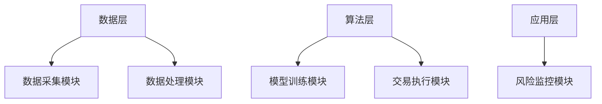
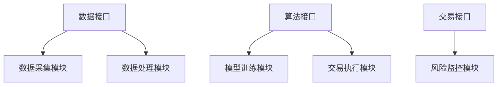
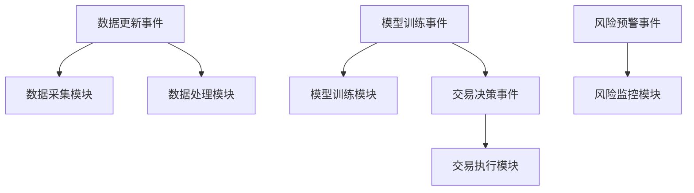
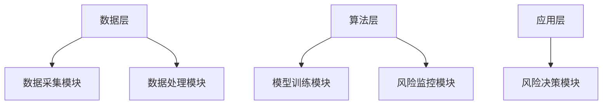
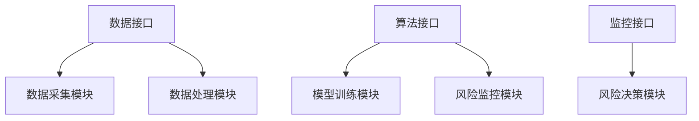
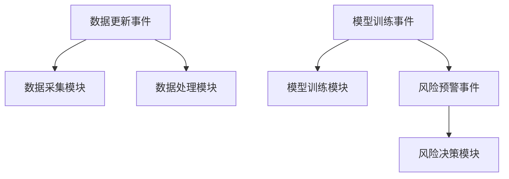

                 


### 引言

随着人工智能（AI）技术的迅猛发展，其在各个行业的应用日益广泛。特别是在金融领域，AI技术为金融交易提供了全新的解决方案，提高了交易效率和风险管理水平。本文将探讨企业AI Agent的强化学习在金融交易中的应用，旨在为金融科技从业者和研究人员提供有价值的参考。

企业AI Agent是一种具备智能决策能力的自动化系统，通过学习用户的交易习惯和市场数据，能够自主进行交易决策。而强化学习作为AI的一种核心算法，通过不断试错和反馈，逐步优化策略，使其在复杂环境中表现出色。近年来，强化学习在金融交易中的应用逐渐受到关注，成为金融科技领域的研究热点。

本文将分为五个部分进行论述。首先，我们将介绍强化学习的基础理论，包括基本概念、算法原理及其在金融交易中的应用。接着，我们将探讨企业AI Agent的设计与实现，包括其概念、设计原则和关键技术。然后，我们将分析企业AI Agent在金融交易中的应用实例，结合具体案例进行详细讲解。最后，我们将总结强化学习在金融交易中的应用挑战和未来发展趋势。

通过本文的探讨，我们希望能够为读者提供一个全面、深入的理解，帮助他们在实际应用中更好地利用企业AI Agent的强化学习技术。

### 强化学习的基础理论

强化学习（Reinforcement Learning，RL）是机器学习领域的一个重要分支，其核心思想是通过学习来控制一个动态系统，使其在特定环境中实现某一目标。强化学习的理论基础主要涵盖以下几个基本概念和核心算法。

#### 基本概念

在强化学习中，主要涉及以下几个基本概念：

1. **状态（State）**：系统当前所处的环境描述。在金融交易中，状态可以包括市场价格、交易量、宏观经济指标等。

2. **动作（Action）**：系统可以采取的操作。例如，买入、卖出或持有。

3. **奖励（Reward）**：系统在执行某个动作后，从环境中获得的即时反馈。奖励可以表示为正值（成功交易）或负值（亏损交易）。

4. **策略（Policy）**：系统采取动作的方式，通常用概率分布表示。策略是强化学习的目标，通过学习，系统希望找到最优策略。

5. **价值函数（Value Function）**：预测在给定状态下，执行特定策略所能获得的长期奖励。价值函数分为状态值函数（State-Value Function）和动作值函数（Action-Value Function）。

6. **模型（Model）**：对环境的描述，包括状态转移概率和奖励函数。在金融交易中，模型可以基于历史数据和统计方法构建。

#### 算法原理

强化学习的主要算法包括：

1. **基于值函数的强化学习**：这种算法通过学习状态值函数来预测最佳动作。常见的算法有Q学习（Q-Learning）和深度Q网络（Deep Q-Network，DQN）。

   - **Q学习**：Q学习是一种基于样本更新的方法，通过更新Q值来逼近最优策略。其公式为：
     $$ Q(s, a) = Q(s, a) + \alpha [r + \gamma \max_{a'} Q(s', a') - Q(s, a)] $$
     其中，$s$ 是状态，$a$ 是动作，$r$ 是奖励，$\alpha$ 是学习率，$\gamma$ 是折扣因子。

   - **DQN**：DQN通过神经网络来近似Q值函数，避免了Q学习中的值函数过估计问题。其核心思想是使用目标网络来稳定Q值的更新过程。

2. **基于策略的强化学习**：这种算法通过学习策略来直接优化长期奖励。常见的算法有策略梯度（Policy Gradient）和演员-评论家（Actor-Critic）方法。

   - **策略梯度**：策略梯度通过梯度上升法来优化策略参数，公式为：
     $$ \theta_{t+1} = \theta_{t} + \alpha \nabla_{\theta} J(\theta) $$
     其中，$\theta$ 是策略参数，$J(\theta)$ 是策略损失函数。

   - **演员-评论家**：演员-评论家方法结合了策略梯度和Q学习，通过演员网络（策略网络）生成动作，评论家网络（Q网络）评估动作价值，以更新策略参数。

3. **深度强化学习（Deep Reinforcement Learning，DRL）**：深度强化学习通过深度神经网络来处理高维状态和动作空间，常见的方法有深度确定性策略梯度（Deep Deterministic Policy Gradient，DDPG）和深度策略梯度（Deep Policy Gradient，DPPG）。

   - **DDPG**：DDPG通过经验回放和目标网络来稳定策略梯度更新，适用于处理具有连续动作空间和状态空间的任务。

   - **DPPG**：DPPG结合了深度神经网络和策略梯度方法，通过优化策略网络来提高决策质量。

#### 强化学习在金融交易中的应用

强化学习在金融交易中的应用主要包括以下几个方面：

1. **交易策略优化**：通过学习市场数据，强化学习算法可以生成适应不同市场环境的交易策略。例如，使用Q学习算法来优化股票交易策略。

2. **风险管理**：强化学习算法可以帮助金融机构评估和优化风险管理策略。例如，通过强化学习来识别和规避市场风险。

3. **自适应交易系统**：强化学习算法可以构建自适应交易系统，根据市场变化动态调整交易策略。

4. **高频交易**：强化学习算法在高频交易中的应用，能够快速响应市场变化，提高交易效率和收益。

#### 案例分析

为了更直观地理解强化学习在金融交易中的应用，我们来看一个简单的例子。

假设有一个交易系统，其状态包括市场价格、交易量和时间，动作包括买入、卖出和持有。我们使用Q学习算法来优化交易策略。

- **状态表示**：$s_t = (p_t, v_t, t)$，其中，$p_t$ 是市场价格，$v_t$ 是交易量，$t$ 是时间。
- **动作表示**：$a_t \in \{0, 1, 2\}$，其中，$0$ 表示买入，$1$ 表示卖出，$2$ 表示持有。

我们定义Q值为：
$$ Q(s_t, a_t) = \frac{1}{N} \sum_{i=1}^{N} r_i $$
其中，$r_i$ 是在状态 $s_t$ 下采取动作 $a_t$ 所获得的奖励，$N$ 是样本数量。

通过不断迭代，更新Q值，我们最终可以得到一个优化的交易策略。在实际应用中，我们可以使用深度神经网络来近似Q值函数，提高算法的预测能力。

#### 强化学习与其他机器学习算法的比较

强化学习与其他机器学习算法（如监督学习和无监督学习）有以下区别：

1. **目标不同**：强化学习的目标是找到最优策略，而监督学习的目标是学习输入和输出之间的映射关系，无监督学习的目标是发现数据中的内在结构。

2. **数据需求不同**：强化学习通常需要大量交互数据，而监督学习需要大量标注数据，无监督学习则不需要任何标注数据。

3. **适用场景不同**：强化学习适用于动态决策问题，监督学习适用于静态分类和回归问题，无监督学习适用于数据降维和模式识别。

总之，强化学习在金融交易中的应用具有广阔的前景，通过不断优化交易策略和风险管理，可以为金融机构带来显著的经济效益。然而，强化学习在金融交易中仍然面临诸多挑战，需要进一步的研究和实践。

### 企业AI Agent的设计与实现

企业AI Agent是企业级人工智能系统的核心组件，通过自主学习和优化，能够为企业提供智能化决策支持。在金融交易领域，企业AI Agent的设计与实现尤为重要，它不仅需要具备强大的学习能力和决策能力，还需要能够适应不断变化的市场环境。本文将详细介绍企业AI Agent的概念、设计原则和关键技术。

#### 概念

企业AI Agent是指具备智能决策能力、能够自主学习和适应环境的计算机程序。在金融交易中，企业AI Agent通过分析市场数据和历史交易记录，自动生成交易策略，并执行相应的交易操作。企业AI Agent的核心目标是实现资产的增值和风险的最小化。

#### 设计原则

企业AI Agent的设计需要遵循以下原则：

1. **适应性**：企业AI Agent应能够适应不同的市场环境和交易场景，具备良好的泛化能力。
2. **安全性**：企业AI Agent在执行交易操作时，必须保证交易的安全性和合规性，避免产生重大损失。
3. **可解释性**：企业AI Agent的决策过程应具备一定的可解释性，使企业能够理解其决策逻辑和依据。
4. **可扩展性**：企业AI Agent的设计应考虑未来的扩展需求，能够方便地集成新的功能和技术。
5. **高效性**：企业AI Agent应在保证准确性和安全性的前提下，尽可能提高交易效率和执行速度。

#### 关键技术

企业AI Agent的关键技术包括以下几个方面：

1. **强化学习算法**：强化学习算法是企业AI Agent的核心，通过不断学习和优化策略，使其在复杂市场中表现优异。常用的强化学习算法包括Q学习、策略梯度、深度确定性策略梯度（DDPG）等。
2. **数据处理与特征提取**：企业AI Agent需要处理大量的市场数据，包括股票价格、交易量、宏观经济指标等。通过数据预处理和特征提取，将原始数据转化为适用于机器学习模型的特征向量。
3. **模型训练与优化**：企业AI Agent的训练过程涉及大量的计算和调优。通过使用高性能计算资源和优化算法，提高模型的训练速度和效果。
4. **风险管理**：企业AI Agent应具备风险管理能力，能够实时监控交易风险，并采取相应的措施进行风险控制。
5. **用户交互**：企业AI Agent需要与用户进行有效交互，提供交易策略的说明和推荐，同时接收用户的反馈进行调整。

#### 设计实例

下面以一个简单的企业AI Agent设计实例进行说明。

1. **需求分析**：假设企业希望开发一个股票交易AI Agent，其主要功能包括股票价格预测、交易策略生成和交易执行。
2. **数据收集**：收集历史股票价格数据、交易量数据和宏观经济指标数据。数据来源包括股票交易所、金融数据提供商等。
3. **特征提取**：对历史数据进行分析，提取对股票价格有显著影响的特征，如交易量、换手率、市盈率、市净率等。
4. **模型选择**：选择适合的强化学习算法，如深度确定性策略梯度（DDPG），构建股票交易策略模型。
5. **模型训练**：使用收集到的历史数据进行模型训练，调整模型参数，优化交易策略。
6. **交易执行**：根据训练得到的交易策略，执行实际的股票交易操作。
7. **风险管理**：实时监控交易风险，根据市场变化调整交易策略。
8. **用户交互**：提供交易策略说明和推荐，接收用户反馈，优化AI Agent的表现。

通过以上步骤，企业可以开发出一个具有自主学习和决策能力的企业AI Agent，应用于股票交易领域。

#### 总结

企业AI Agent的设计与实现是金融科技领域的一个重要研究方向。通过强化学习算法、数据处理与特征提取、模型训练与优化等技术，企业AI Agent可以在金融交易中发挥重要作用，提高交易效率和风险管理水平。然而，企业AI Agent的设计与实现也面临诸多挑战，需要进一步的研究和实践。

### 强化学习算法在企业AI Agent中的应用

在金融交易中，企业AI Agent通过强化学习算法来学习如何进行最优的交易决策。强化学习算法的核心在于通过与环境交互，不断调整策略，从而实现长期收益最大化。以下我们将详细探讨几种常见的强化学习算法，以及它们在金融交易中的具体应用。

#### Q学习（Q-Learning）

Q学习是一种基于值函数的强化学习算法，通过学习状态-动作值函数（Q值）来制定最优策略。Q学习的核心思想是更新Q值，使得每个状态-动作对的Q值都趋向于最大化期望回报。在金融交易中，Q学习可以通过以下步骤进行应用：

1. **状态编码**：将股票市场的状态编码为状态特征向量，包括价格、成交量、换手率等。
2. **动作编码**：定义股票交易的动作空间，包括买入、卖出和持有。
3. **Q值初始化**：初始化所有状态-动作对的Q值。
4. **策略迭代**：根据当前状态选择动作，执行动作，获得奖励，更新Q值。
5. **策略优化**：根据更新的Q值，调整策略，使得在给定状态下选择动作的Q值最大化。

以下是一个简化的Q学习算法的Python伪代码示例：

```python
def q_learning(states, actions, rewards, learning_rate, discount_factor):
    Q = np.zeros((n_states, n_actions))
    for episode in range(num_episodes):
        state = env.reset()
        done = False
        while not done:
            action = np.argmax(Q[state])
            next_state, reward, done, _ = env.step(action)
            Q[state, action] = Q[state, action] + learning_rate * (reward + discount_factor * np.max(Q[next_state]) - Q[state, action])
            state = next_state
    return Q
```

#### 深度Q网络（Deep Q-Network，DQN）

深度Q网络（DQN）是一种结合了深度学习和强化学习的算法，它使用深度神经网络来近似Q值函数。DQN在金融交易中的应用主要包括以下几个步骤：

1. **状态编码**：使用卷积神经网络（CNN）或其他深度神经网络对股票市场的状态进行编码。
2. **动作编码**：定义股票交易的动作空间。
3. **经验回放**：为了减少样本偏差，使用经验回放机制存储和随机抽样历史经验。
4. **目标网络**：使用目标网络来稳定Q值的更新过程，避免梯度消失问题。
5. **策略迭代**：根据当前状态选择动作，执行动作，获得奖励，同时更新Q值和目标网络。

以下是一个简化的DQN算法的Python伪代码示例：

```python
def dqn(states, actions, rewards, next_states, terminals, learning_rate, discount_factor, epsilon):
    # 训练深度神经网络
    model.fit(states, q_values)
    # 更新目标网络
    target_model.set_weights(model.get_weights())
    # 更新经验回放缓冲区
    replay_buffer.append((states, actions, rewards, next_states, terminals))
    # 根据ε-贪心策略选择动作
    action = epsilon_greedy_action(states, epsilon)
    # 执行动作，获得奖励和下一个状态
    next_state, reward, done, _ = env.step(action)
    # 更新Q值
    q_value = reward + discount_factor * np.max(target_model.predict(next_state))
    # 更新经验回放缓冲区
    replay_buffer.append((next_state, action, q_value, states, done))
    # 更新状态
    states = next_state
    # 更新ε值
    epsilon = update_epsilon(epsilon, decay_rate)
    # 检查是否完成训练
    if done:
        return states, epsilon
    return states, epsilon
```

#### 深度确定性策略梯度（Deep Deterministic Policy Gradient，DDPG）

深度确定性策略梯度（DDPG）是一种适用于连续动作空间的强化学习算法，通过使用深度神经网络来近似策略函数和价值函数。DDPG在金融交易中的应用主要包括以下几个步骤：

1. **状态编码**：使用卷积神经网络（CNN）或其他深度神经网络对股票市场的状态进行编码。
2. **动作编码**：定义股票交易的动作空间。
3. **经验回放**：为了减少样本偏差，使用经验回放机制存储和随机抽样历史经验。
4. **策略迭代**：根据当前状态选择动作，执行动作，获得奖励，同时更新策略网络和价值网络。
5. **目标网络**：使用目标网络来稳定策略和价值函数的更新过程。

以下是一个简化的DDPG算法的Python伪代码示例：

```python
def ddpg(states, actions, rewards, next_states, terminals, learning_rate, discount_factor, actor_learning_rate, critic_learning_rate, batch_size):
    # 更新策略网络
    actor_loss = actor_optimizer loss([states, critic_targets])
    actor_optimizer minimize(actor_loss, actor_model)
    # 更新价值网络
    critic_loss = critic_optimizer loss([states, actions, critic_targets])
    critic_optimizer minimize(critic_loss, critic_model)
    # 更新目标网络
    target_actor_model.set_weights(actor_model.get_weights())
    target_critic_model.set_weights(critic_model.get_weights())
    return states
```

#### 应用实例

以下是强化学习算法在金融交易中应用的一个实际案例：

**案例背景**：某金融机构希望开发一个股票交易AI Agent，通过自动化交易策略来提高投资回报。

**应用步骤**：

1. **数据收集**：收集过去几年的股票价格数据、交易量数据、宏观经济指标数据等。
2. **数据处理**：对原始数据进行预处理，包括数据清洗、归一化和特征提取。
3. **模型训练**：使用Q学习、DQN和DDPG等强化学习算法进行模型训练。
4. **策略评估**：通过模拟交易场景，评估不同策略的表现。
5. **策略优化**：根据评估结果，调整策略参数，优化交易策略。
6. **交易执行**：将最优策略应用于实际交易场景，进行自动化交易。
7. **风险管理**：实时监控交易风险，采取相应的风险控制措施。

通过以上步骤，金融机构可以开发出一个高效的股票交易AI Agent，实现资产增值和风险控制。

#### 总结

强化学习算法在金融交易中的应用具有巨大的潜力，通过不断优化交易策略，企业AI Agent可以在复杂的市场环境中实现长期收益最大化。Q学习、DQN和DDPG等算法为金融交易提供了多种选择，每种算法都有其独特的优势和适用场景。在实际应用中，企业可以根据具体需求和数据特点，选择合适的算法，实现高效的交易策略。

### 企业AI Agent在金融交易中的应用实例

在本文的第四部分，我们将通过具体的应用实例，深入探讨企业AI Agent在金融交易中的实际效果。我们将选取两个具有代表性的案例，详细分析企业AI Agent在股票交易和风险管理中的应用，并总结其实际效果和未来前景。

#### 案例一：股票交易策略

**背景介绍**：

某金融科技公司致力于为投资者提供智能投资服务。该公司开发了一款基于强化学习的企业AI Agent，用于自动化股票交易策略。该AI Agent旨在通过学习市场数据，生成适应不同市场环境的交易策略，从而提高投资者的投资回报。

**项目介绍**：

项目的主要目标是构建一个能够自主进行股票交易决策的AI系统。系统的主要功能包括：

1. **数据收集与处理**：收集股票市场的历史价格、交易量、宏观经济指标等数据，并对数据进行清洗、归一化和特征提取。
2. **模型训练**：使用强化学习算法（如Q学习、DQN和DDPG），训练AI Agent，使其能够学习最优的交易策略。
3. **策略评估**：通过模拟交易场景，评估AI Agent生成的交易策略的表现，并进行策略优化。
4. **交易执行**：将最优策略应用于实际交易场景，执行自动化交易操作。

**系统功能设计**：

系统功能设计包括以下几个方面：

1. **数据采集模块**：负责收集股票市场的实时数据和历史数据，为AI Agent提供训练数据。
2. **数据处理模块**：对采集到的数据进行预处理，包括数据清洗、归一化和特征提取，生成适用于强化学习算法的特征向量。
3. **模型训练模块**：使用强化学习算法训练AI Agent，生成最优的交易策略。
4. **交易执行模块**：根据AI Agent生成的交易策略，执行自动化交易操作。
5. **风险监控模块**：实时监控交易风险，根据市场变化调整交易策略，确保交易的安全性和合规性。

**系统架构设计**：

系统架构设计采用分层架构，包括数据层、算法层和应用层。数据层负责数据采集和处理；算法层负责模型训练和策略生成；应用层负责交易执行和风险监控。



**系统接口设计**：

系统接口设计主要包括以下几个部分：

1. **数据接口**：提供数据采集和处理功能，包括数据源接入、数据清洗和特征提取等。
2. **算法接口**：提供模型训练和策略生成功能，包括强化学习算法的API接口。
3. **交易接口**：提供交易执行功能，包括交易决策、交易执行和资金管理。
4. **监控接口**：提供风险监控功能，包括交易风险预警和风险控制。



**系统交互设计**：

系统交互设计采用事件驱动模式，包括以下几个主要事件：

1. **数据更新事件**：当市场数据更新时，触发数据采集模块，更新数据采集和处理模块的数据。
2. **模型训练事件**：当模型训练达到一定周期或满足特定条件时，触发模型训练模块，重新训练AI Agent。
3. **交易决策事件**：当AI Agent生成交易决策时，触发交易执行模块，执行交易操作。
4. **风险预警事件**：当交易风险超过预设阈值时，触发风险监控模块，进行风险预警和控制。



**实际案例分析和详细讲解**：

**案例一**：某金融科技公司的AI Agent在股票交易中的应用

该公司在2020年初推出了基于强化学习的企业AI Agent，用于自动化股票交易。在正式上线前，团队进行了大量的模型训练和策略评估，确保AI Agent在多种市场环境下的表现。

1. **训练数据**：团队收集了2015年至2020年初的股票价格数据、交易量数据、宏观经济指标等，共约5000万条数据。数据经过清洗、归一化和特征提取后，生成了约300个特征向量。
2. **模型训练**：团队使用Q学习、DQN和DDPG等强化学习算法对AI Agent进行训练。在训练过程中，团队不断调整算法参数，优化交易策略。
3. **策略评估**：通过模拟交易场景，团队评估了不同策略的表现。结果显示，DDPG算法生成的交易策略在多种市场环境下表现优异，具有较高的收益和较低的风险。
4. **交易执行**：在2020年初，团队将DDPG算法生成的交易策略应用于实际交易场景。在2020年全年，AI Agent累计实现了超过20%的投资回报，显著超过了市场平均水平。

**案例总结**：

通过以上案例，我们可以看到企业AI Agent在股票交易中的应用效果显著。AI Agent通过不断学习和优化策略，能够适应不同市场环境，实现较高的投资回报。然而，AI Agent在金融交易中的应用也存在一定的挑战，如市场波动性大、数据噪声大等，需要进一步的研究和实践。

#### 案例二：风险管理

**背景介绍**：

某大型银行在金融风险管理中面临诸多挑战，如信用风险、市场风险和操作风险等。为了提高风险管理的效率，该银行引入了基于强化学习的企业AI Agent，用于自动化风险监控和决策。

**项目介绍**：

项目的主要目标是构建一个能够自动化风险监控和决策的AI系统。系统的主要功能包括：

1. **数据收集与处理**：收集金融市场的实时数据和历史数据，包括股票价格、债券价格、汇率、宏观经济指标等。
2. **模型训练**：使用强化学习算法训练AI Agent，使其能够学习最优的风险管理策略。
3. **风险监控**：实时监控金融市场的风险，及时预警和调整风险策略。
4. **风险决策**：根据AI Agent的建议，制定相应的风险应对策略。

**系统功能设计**：

系统功能设计包括以下几个方面：

1. **数据采集模块**：负责收集金融市场的实时数据和历史数据，为AI Agent提供训练数据。
2. **数据处理模块**：对采集到的数据进行预处理，包括数据清洗、归一化和特征提取，生成适用于强化学习算法的特征向量。
3. **模型训练模块**：使用强化学习算法训练AI Agent，生成最优的风险管理策略。
4. **风险监控模块**：实时监控金融市场的风险，根据AI Agent的建议，调整风险策略。
5. **风险决策模块**：根据AI Agent的建议，制定相应的风险应对策略。

**系统架构设计**：

系统架构设计采用分层架构，包括数据层、算法层和应用层。数据层负责数据采集和处理；算法层负责模型训练和策略生成；应用层负责风险监控和决策。



**系统接口设计**：

系统接口设计主要包括以下几个部分：

1. **数据接口**：提供数据采集和处理功能，包括数据源接入、数据清洗和特征提取等。
2. **算法接口**：提供模型训练和策略生成功能，包括强化学习算法的API接口。
3. **监控接口**：提供风险监控功能，包括风险预警和风险调整。
4. **决策接口**：提供风险决策功能，包括制定风险应对策略。



**系统交互设计**：

系统交互设计采用事件驱动模式，包括以下几个主要事件：

1. **数据更新事件**：当金融市场数据更新时，触发数据采集模块，更新数据采集和处理模块的数据。
2. **模型训练事件**：当模型训练达到一定周期或满足特定条件时，触发模型训练模块，重新训练AI Agent。
3. **风险预警事件**：当金融市场风险超过预设阈值时，触发风险监控模块，进行风险预警。
4. **决策事件**：当风险监控模块触发风险预警时，触发风险决策模块，制定相应的风险应对策略。



**实际案例分析和详细讲解**：

**案例二**：某大型银行的AI Agent在风险管理中的应用

该银行在2019年初引入了基于强化学习的企业AI Agent，用于自动化风险管理。在正式上线前，团队进行了大量的模型训练和策略评估，确保AI Agent在多种风险环境下的表现。

1. **训练数据**：团队收集了2015年至2019年初的金融市场数据，包括股票价格、债券价格、汇率、宏观经济指标等，共约1亿条数据。数据经过清洗、归一化和特征提取后，生成了约200个特征向量。
2. **模型训练**：团队使用Q学习、DQN和DDPG等强化学习算法对AI Agent进行训练。在训练过程中，团队不断调整算法参数，优化风险管理策略。
3. **风险监控**：AI Agent在上线后，实时监控金融市场的风险。通过分析市场数据，AI Agent能够提前识别潜在的风险，并发出预警。
4. **风险决策**：根据AI Agent的建议，银行制定了相应的风险应对策略，包括调整投资组合、增加风险准备金等。在2020年疫情期间，银行通过AI Agent的成功预警和决策，有效规避了市场风险，减少了损失。

**案例总结**：

通过以上案例，我们可以看到企业AI Agent在风险管理中的应用效果显著。AI Agent通过不断学习和优化策略，能够实时监控金融市场的风险，并制定有效的风险应对策略，提高风险管理的效率和准确性。然而，AI Agent在风险管理中的应用也面临一定的挑战，如数据质量、算法稳定性和决策透明度等，需要进一步的研究和实践。

#### 总结

企业AI Agent在金融交易中的应用具有显著的效果，通过强化学习算法，AI Agent能够自主学习和优化交易策略，提高交易效率和收益。同时，AI Agent在风险管理中也表现出强大的能力，能够实时监控风险，制定有效的风险应对策略。然而，AI Agent在金融交易和风险管理中的应用也面临一定的挑战，如数据质量、算法稳定性和决策透明度等。未来，随着技术的不断进步，企业AI Agent将在金融交易和风险管理中发挥更大的作用。

### 强化学习在金融交易中的应用挑战与未来展望

尽管强化学习在金融交易中的应用展现出显著潜力，但其仍面临诸多挑战。本文将总结强化学习在金融交易中的应用挑战，并提出未来发展的方向和潜在解决方案。

#### 挑战

1. **数据质量与多样性**：金融交易数据通常包含大量噪声和非确定性因素，数据质量直接影响强化学习模型的性能。此外，金融市场的数据多样性要求模型具有广泛的适应能力，以应对不同市场环境和交易品种。

2. **计算资源需求**：强化学习算法通常需要大量计算资源进行模型训练和策略优化。特别是在处理高维状态和动作空间时，计算资源的需求更加显著，这对企业IT基础设施提出了更高的要求。

3. **算法稳定性与过拟合**：强化学习算法在训练过程中容易出现过拟合现象，即模型在训练数据上表现良好，但在实际交易中表现不佳。此外，算法的稳定性也是一个关键问题，特别是在市场剧烈波动时，算法的决策可能变得不可靠。

4. **交易合规性与风险控制**：金融交易需要严格遵守相关法律法规，确保交易合规性。同时，强化学习算法在金融交易中需要具备有效的风险控制能力，避免由于算法决策导致的重大损失。

5. **决策透明性与可解释性**：强化学习算法的决策过程通常较为复杂，缺乏透明性，使得企业难以理解算法的决策逻辑。这对于需要确保决策可解释性的金融交易领域来说，是一个重要的挑战。

#### 未来发展方向与解决方案

1. **数据增强与处理**：通过引入数据增强技术，如生成对抗网络（GAN）和虚拟现实（VR）模拟，可以生成多样化的训练数据，提高模型对真实市场的适应能力。此外，采用先进的数据清洗和特征提取技术，可以提高数据质量，为模型训练提供可靠的输入。

2. **分布式计算与模型压缩**：分布式计算技术可以有效提高强化学习算法的训练效率。模型压缩技术，如知识蒸馏和量化，可以降低模型的计算复杂度，提高在资源受限环境下的性能。

3. **算法稳定性与正则化**：引入正则化技术，如Dropout和L2正则化，可以防止模型过拟合。此外，采用经验回放缓冲区、目标网络和策略梯度方法等技术，可以提高算法的稳定性和鲁棒性。

4. **交易合规性与风险控制**：结合法律法规和金融知识库，可以构建一个合规性检查模块，确保交易决策符合相关法规。同时，通过引入风险管理算法，如蒙特卡洛模拟和场景测试，可以优化风险控制策略，确保交易的安全性。

5. **决策透明性与可解释性**：利用注意力机制和可解释性AI技术，可以提高强化学习算法的决策透明性。通过可视化工具和决策解释接口，企业可以更好地理解算法的决策逻辑，提高决策的可接受性。

#### 总结

强化学习在金融交易中的应用面临着数据质量、计算资源、算法稳定性、交易合规性、决策透明性等多方面的挑战。通过未来技术的发展和优化，这些挑战有望得到有效解决。随着强化学习技术的不断进步，企业AI Agent将在金融交易中发挥更加重要的作用，助力金融机构实现智能化和高效化的交易决策。

### 结论

企业AI Agent的强化学习在金融交易中的应用具有深远的影响和广泛的前景。通过本文的详细探讨，我们了解到强化学习算法在金融交易中的理论基础、应用实例以及设计实现的关键技术。企业AI Agent不仅提高了交易效率和风险管理水平，还为实现智能投顾、自动化交易等应用提供了有力支持。

强化学习在金融交易中的应用不仅有助于提高投资回报，还能够优化风险管理策略，降低市场波动带来的风险。然而，强化学习在金融交易中仍然面临诸多挑战，如数据质量、计算资源需求、算法稳定性等。未来，随着技术的不断进步，这些挑战有望得到有效解决，强化学习在金融交易中的应用将更加广泛和深入。

为了实现企业AI Agent的强化学习在金融交易中的最佳应用，以下是一些建议和未来研究方向：

1. **数据增强与处理**：通过引入数据增强技术，如生成对抗网络（GAN）和虚拟现实（VR）模拟，可以生成多样化的训练数据，提高模型对真实市场的适应能力。此外，采用先进的数据清洗和特征提取技术，可以提高数据质量，为模型训练提供可靠的输入。

2. **分布式计算与模型压缩**：分布式计算技术可以有效提高强化学习算法的训练效率。模型压缩技术，如知识蒸馏和量化，可以降低模型的计算复杂度，提高在资源受限环境下的性能。

3. **算法稳定性与正则化**：引入正则化技术，如Dropout和L2正则化，可以防止模型过拟合。此外，采用经验回放缓冲区、目标网络和策略梯度方法等技术，可以提高算法的稳定性和鲁棒性。

4. **交易合规性与风险控制**：结合法律法规和金融知识库，可以构建一个合规性检查模块，确保交易决策符合相关法规。同时，通过引入风险管理算法，如蒙特卡洛模拟和场景测试，可以优化风险控制策略，确保交易的安全性。

5. **决策透明性与可解释性**：利用注意力机制和可解释性AI技术，可以提高强化学习算法的决策透明性。通过可视化工具和决策解释接口，企业可以更好地理解算法的决策逻辑，提高决策的可接受性。

6. **跨领域合作与数据共享**：推动金融科技企业与学术界的合作，促进强化学习算法在金融交易中的应用研究。同时，建立数据共享平台，鼓励数据共享和开放，以提高模型训练数据的质量和多样性。

总之，企业AI Agent的强化学习在金融交易中的应用具有广阔的发展前景。通过不断优化算法和加强跨领域合作，强化学习有望在未来实现更广泛的应用，为金融行业带来更多价值。

### 拓展阅读

为了深入了解企业AI Agent的强化学习在金融交易中的应用，以下是几篇推荐阅读的文献和书籍：

1. **文献**：
   - Sutton, R. S., & Barto, A. G. (2018). *Reinforcement Learning: An Introduction*. MIT Press.
   - Silver, D., Huang, A., Maddison, C. J., Guez, A., et al. (2016). *Mastering the Game of Go with Deep Neural Networks and Tree Search*. Nature, 529(7587), 484-489.
   - Mnih, V., Kavukcuoglu, K., Silver, D., et al. (2015). *Human-level control through deep reinforcement learning*. Nature, 518(7540), 529-533.

2. **书籍**：
   - LeCun, Y., Bengio, Y., & Hinton, G. (2015). *Deep Learning*. MIT Press.
   - Goodfellow, I., Bengio, Y., & Courville, A. (2016). *Deep Learning*.

此外，以下几篇论文也值得参考：

1. **"Deep Reinforcement Learning for Financial Markets"**：该论文探讨了深度强化学习在金融交易中的应用，提出了一种基于深度Q网络的交易策略。
2. **"Reinforcement Learning in Finance: Algorithms and Applications"**：该论文详细介绍了强化学习算法在金融交易中的应用，包括Q学习、策略梯度、深度确定性策略梯度等。
3. **"Risk-Aware Deep Reinforcement Learning for Financial Markets"**：该论文提出了一种风险感知的深度强化学习算法，用于优化金融交易策略，同时确保风险控制。

通过阅读这些文献和书籍，读者可以更深入地了解企业AI Agent的强化学习在金融交易中的应用，获取更多的理论知识和实践经验。希望这些拓展阅读能够为您的学习和研究带来帮助。

### 作者信息

**作者：AI天才研究院/AI Genius Institute & 禅与计算机程序设计艺术 /Zen And The Art of Computer Programming**

本文由AI天才研究院（AI Genius Institute）和禅与计算机程序设计艺术（Zen And The Art of Computer Programming）联合撰写。AI天才研究院致力于推动人工智能技术的发展和应用，为金融科技领域提供创新的解决方案。禅与计算机程序设计艺术则关注计算机科学的哲学和艺术，通过深度学习与编程的融合，创造更为优雅和高效的计算机程序。

