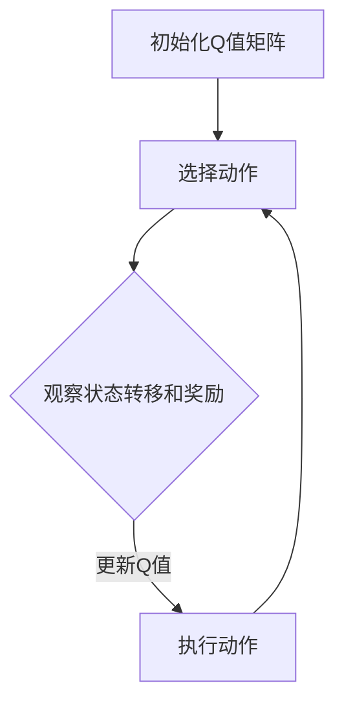
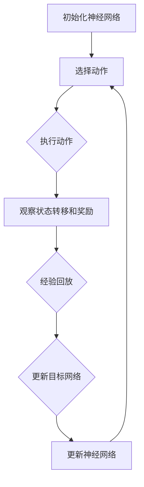
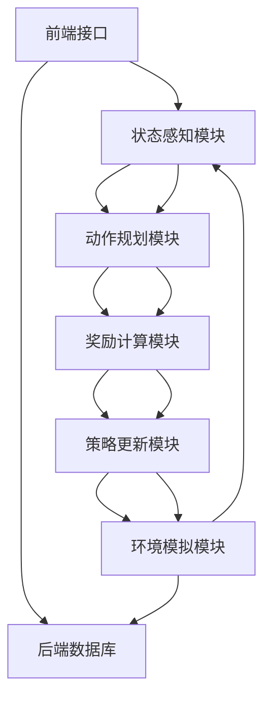
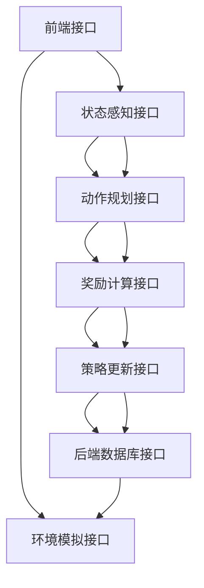

                 

### 文章标题

强化学习在当今人工智能（AI）领域中占据着重要地位，尤其在优化决策过程方面表现出显著的优势。本文以《企业AI Agent的强化学习应用：优化决策过程》为题，深入探讨强化学习在企业管理中的应用，通过一系列步骤详细解析其原理、数学模型、系统设计与实际应用。文章不仅涵盖了强化学习的基本概念和算法原理，还包括系统分析与架构设计，以及具体的实战案例。通过这样的结构，我们将帮助读者逐步理解强化学习如何帮助企业优化决策过程，提升企业运营效率。

### 文章关键词

强化学习，企业AI，决策优化，算法原理，数学模型，系统设计，项目实战，最佳实践。

### 摘要

本文旨在探讨强化学习在企业管理中的应用，通过详细解析强化学习的基本概念、算法原理、数学模型，以及系统设计与实际应用，探讨其如何帮助企业优化决策过程。文章首先介绍了强化学习的基本概念和传统机器学习的区别，随后深入讲解了Q-learning、SARSA和Deep Q-Networks等核心算法。接着，通过数学模型和公式的详细解析，帮助读者理解强化学习背后的数学逻辑。随后，文章转向系统分析与架构设计，介绍强化学习系统的构建方法。最后，通过具体的实战案例和最佳实践，展示强化学习在实际企业中的应用效果和注意事项。

## 第1章: 强化学习概述

### 1.1 强化学习的基本概念

强化学习（Reinforcement Learning，简称RL）是一种机器学习方法，它通过智能体（agent）与环境（environment）的交互来学习决策策略。与监督学习和无监督学习不同，强化学习关注的是智能体如何在不确定的环境中通过试错来学习最优行为策略。

在强化学习的框架中，智能体是执行动作的实体，环境是智能体行动的场所，状态（state）是环境在某一时刻的特征描述，动作（action）是智能体在状态中执行的操作，奖励（reward）是环境对智能体动作的即时反馈。

强化学习的目标是让智能体通过不断学习，最大化累积奖励。与监督学习相比，强化学习的难点在于其试错过程和不确定环境的处理。在监督学习中，智能体可以通过已知的数据直接学习，而在强化学习中，智能体需要通过与环境交互来获取反馈，从而不断调整其行为策略。

### 1.2 强化学习与传统机器学习的区别

强化学习与传统的监督学习和无监督学习有显著的区别：

- **数据依赖性**：监督学习依赖于大量标记数据，而无监督学习则不需要标签信息。强化学习介于两者之间，它既不需要完整标记的数据集，也不完全依赖于无监督学习中的隐含信息。智能体需要通过与环境的交互来获取反馈，从而学习最优策略。

- **目标导向性**：监督学习的目标是最大化预测准确率，无监督学习的目标是发现数据中的内在结构。强化学习的目标则是最大化长期累积奖励，这一目标需要智能体在长时间的学习过程中不断调整策略。

- **策略学习**：监督学习和无监督学习主要关注模型参数的优化，而强化学习更关注策略的优化。智能体需要通过学习如何在不同的状态下选择最优动作，以实现长期累积奖励的最大化。

### 1.3 强化学习在企业的应用场景

强化学习在企业管理中的应用场景非常广泛，以下是几个典型的应用实例：

- **供应链优化**：企业可以利用强化学习来优化供应链管理，通过预测市场需求和库存水平，动态调整生产和配送计划，降低库存成本和缺货风险。

- **库存管理**：强化学习可以帮助企业更有效地管理库存，根据历史销售数据和市场趋势，动态调整库存水平，避免库存积压或短缺。

- **人员调度**：企业可以利用强化学习来优化人员调度，根据员工的技能和工作时间，自动分配最合适的工作任务，提高工作效率和员工满意度。

- **营销策略优化**：企业可以通过强化学习优化营销策略，例如在广告投放、促销活动和客户关系管理中，根据用户的反馈和行为数据，动态调整营销策略，提高转化率和客户满意度。

- **风险管理**：强化学习可以帮助企业更好地管理风险，例如在金融市场中，通过分析历史数据和市场动态，智能调整投资组合，降低投资风险。

通过这些应用场景，强化学习不仅可以帮助企业优化决策过程，还可以提高运营效率，降低成本，提升竞争力。

## 第2章: 强化学习中的核心概念与联系

### 2.1 强化学习中的主要算法

强化学习中有多种算法，以下介绍其中几种主要算法及其特点：

#### Q-learning算法

Q-learning算法是最早提出的强化学习算法之一，它通过学习状态-动作值函数（Q-function）来优化智能体的策略。Q-learning算法的基本思想是：在给定状态 \(s\) 下，选择能够带来最大预期奖励的动作 \(a\)。具体来说，Q-learning算法通过迭代更新Q值，直到达到某一阈值或达到预设的迭代次数。

**Q-learning算法流程**：

1. 初始化Q值矩阵 \( Q(s, a) \)。
2. 选择动作 \( a \)。
3. 执行动作 \( a \)，观察状态转移 \( (s, a) \rightarrow (s', a') \) 和奖励 \( r \)。
4. 根据经验更新Q值：\( Q(s, a) \leftarrow Q(s, a) + \alpha [r + \gamma \max_{a'} Q(s', a') - Q(s, a)] \)，其中 \(\alpha\) 是学习率，\(\gamma\) 是折扣因子。

#### SARSA算法

SARSA（同步优势估计）算法是Q-learning的变体，它不需要预先定义目标策略，而是在同一时间步内同时选择动作和更新Q值。SARSA算法的基本思想是：在当前状态 \(s\) 下，选择当前动作 \(a\)，并更新Q值，以便在下一次选择动作时能够更加优化。

**SARSA算法流程**：

1. 初始化Q值矩阵 \( Q(s, a) \)。
2. 选择动作 \( a \)。
3. 执行动作 \( a \)，观察状态转移 \( (s, a) \rightarrow (s', a') \) 和奖励 \( r \)。
4. 根据经验更新Q值：\( Q(s, a) \leftarrow Q(s, a) + \alpha [r + \gamma Q(s', a') - Q(s, a)] \)。

#### Deep Q-Networks (DQN)

DQN（Deep Q-Networks）算法是利用深度神经网络来近似Q值函数的一种强化学习算法。DQN通过引入经验回放机制（Experience Replay）和目标网络（Target Network）来缓解Q值估计的偏差和稳定训练过程。

**DQN算法流程**：

1. 初始化深度神经网络 \( Q \) 和目标网络 \( Q^{\text{target}} \)。
2. 从初始状态 \( s \) 开始，选择动作 \( a \)。
3. 执行动作 \( a \)，观察状态转移 \( (s, a) \rightarrow (s', a') \) 和奖励 \( r \)。
4. 将经验 \( (s, a, r, s') \) 存入经验回放池。
5. 从经验回放池中随机抽取一小批经验，用于更新深度神经网络。
6. 更新目标网络：\( Q^{\text{target}} \leftarrow \gamma \max_a Q \)。
7. 使用梯度下降法更新深度神经网络：\( \theta \leftarrow \theta - \alpha \nabla_{\theta} J(\theta) \)。

### 2.2 算法对比与联系

**Q-learning与SARSA对比**：

- **目标策略**：Q-learning使用固定的目标策略，而SARSA则在每次迭代中更新策略。
- **更新方式**：Q-learning在每次更新后使用固定的目标Q值，而SARSA使用当前Q值。
- **适用场景**：Q-learning适用于稳定环境，而SARSA适用于动态环境。

**DQN与Q-learning对比**：

- **模型结构**：DQN使用深度神经网络来近似Q值函数，而Q-learning使用表格来存储Q值。
- **稳定性和效率**：DQN通过引入经验回放和目标网络，提高了训练稳定性，但计算成本较高。
- **适用场景**：DQN适用于高维状态空间，而Q-learning适用于低维状态空间。

### 2.3 强化学习中的其他重要概念

除了上述算法外，强化学习还有其他一些重要概念，如下所述：

#### 扩展Q网络（Dueling Q-Networks）

Dueling Q-Networks（DQN）是对DQN的改进，它通过将Q值分解为状态价值和优势值，提高了Q值函数的稳定性。

**Dueling Q-Networks结构**：

- **价值网络**（Value Function）：计算状态价值 \( V(s) \)。
- **优势网络**（Advantage Function）：计算动作优势 \( A(s, a) \)。

**Dueling Q-Networks算法流程**：

1. 初始化深度神经网络 \( Q \) 和目标网络 \( Q^{\text{target}} \)。
2. 从初始状态 \( s \) 开始，选择动作 \( a \)。
3. 执行动作 \( a \)，观察状态转移 \( (s, a) \rightarrow (s', a') \) 和奖励 \( r \)。
4. 将经验 \( (s, a, r, s') \) 存入经验回放池。
5. 从经验回放池中随机抽取一小批经验，用于更新深度神经网络。
6. 更新目标网络：\( Q^{\text{target}} \leftarrow \gamma \max_a Q \)。
7. 使用梯度下降法更新深度神经网络：\( \theta \leftarrow \theta - \alpha \nabla_{\theta} J(\theta) \)。

#### 模型融合（Model Ensemble）

模型融合是一种通过结合多个模型来提高预测准确性的方法。在强化学习中，模型融合可以结合多个Q值函数或策略，从而提高智能体的决策能力。

**模型融合方法**：

1. **加权平均**：将多个模型的预测结果加权平均。
2. **投票机制**：选择预测结果最高的模型。
3. **集成学习**：结合多个模型的优势，构建一个新的模型。

通过上述核心概念和算法的介绍，我们可以看到强化学习在企业管理中的应用前景。接下来，我们将深入探讨强化学习的算法原理，以便更好地理解其数学模型和计算过程。

### 第3章: 强化学习算法原理讲解

#### 3.1 Q-learning算法原理

Q-learning算法是强化学习中最基本的算法之一，其核心思想是利用状态-动作值函数（Q-function）来评估状态-动作对的优劣。Q-learning算法通过不断更新Q值，使智能体在给定状态下选择能够带来最大预期奖励的动作。

**Q-learning算法流程**：

1. **初始化**：初始化Q值矩阵 \( Q(s, a) \)，通常设置为一个较小的常数。
2. **选择动作**：在当前状态 \( s \) 下，选择动作 \( a \) 使得 \( Q(s, a) \) 最大。
3. **执行动作**：执行动作 \( a \)，观察状态转移 \( (s, a) \rightarrow (s', a') \) 和奖励 \( r \)。
4. **更新Q值**：根据经验更新Q值：
   \[
   Q(s, a) \leftarrow Q(s, a) + \alpha [r + \gamma \max_{a'} Q(s', a') - Q(s, a)],
   \]
   其中，\(\alpha\) 是学习率，\(\gamma\) 是折扣因子。

**Q-learning算法流程图**：



#### 3.2 SARSA算法原理

SARSA（同步优势估计）算法是Q-learning的一个变体，它不需要预先定义目标策略，而是在同一时间步内同时选择动作和更新Q值。SARSA算法的基本思想是：在当前状态 \( s \) 下，选择当前动作 \( a \)，并更新Q值，以便在下一次选择动作时能够更加优化。

**SARSA算法流程**：

1. **初始化**：初始化Q值矩阵 \( Q(s, a) \)。
2. **选择动作**：在当前状态 \( s \) 下，选择动作 \( a \)。
3. **执行动作**：执行动作 \( a \)，观察状态转移 \( (s, a) \rightarrow (s', a') \) 和奖励 \( r \)。
4. **更新Q值**：
   \[
   Q(s, a) \leftarrow Q(s, a) + \alpha [r + \gamma Q(s', a') - Q(s, a)],
   \]
   其中，\(\alpha\) 是学习率，\(\gamma\) 是折扣因子。

**SARSA算法流程图**：


#### 3.3 Deep Q-Networks (DQN)算法原理

Deep Q-Networks (DQN)算法是利用深度神经网络来近似Q值函数的一种强化学习算法。DQN通过引入经验回放机制（Experience Replay）和目标网络（Target Network）来缓解Q值估计的偏差和稳定训练过程。

**DQN算法流程**：

1. **初始化**：初始化深度神经网络 \( Q \) 和目标网络 \( Q^{\text{target}} \)。
2. **选择动作**：在当前状态 \( s \) 下，选择动作 \( a \) 使得 \( Q(s, a) \) 最大。
3. **执行动作**：执行动作 \( a \)，观察状态转移 \( (s, a) \rightarrow (s', a') \) 和奖励 \( r \)。
4. **经验回放**：将经验 \( (s, a, r, s') \) 存入经验回放池。
5. **更新目标网络**：\( Q^{\text{target}} \leftarrow \gamma \max_a Q \)。
6. **更新深度神经网络**：使用梯度下降法更新深度神经网络：
   \[
   \theta \leftarrow \theta - \alpha \nabla_{\theta} J(\theta),
   \]
   其中，\(\theta\) 是深度神经网络的参数，\( J(\theta) \) 是损失函数。

**DQN算法流程图**：



通过上述对Q-learning、SARSA和DQN算法的详细讲解，我们可以看到强化学习算法在处理复杂决策问题时的强大能力。接下来，我们将进一步探讨强化学习中的数学模型和公式，以便更深入地理解其数学基础。

### 第4章: 强化学习中的数学模型与公式

强化学习作为一种基于反馈的学习方法，其核心在于通过优化状态-动作值函数（Q-function）来指导智能体的决策。为了更好地理解和应用强化学习算法，我们需要深入探讨其背后的数学模型和公式。本章节将详细介绍这些数学模型，并通过具体的例子来说明其应用。

#### 4.1 强化学习中的数学模型

强化学习的数学模型主要包括以下几个部分：

- **状态-动作值函数**（Q-function）
- **策略**（Policy）
- **状态转移概率**（Transition Probability）
- **奖励函数**（Reward Function）

这些模型共同构成了强化学习的基本框架，帮助我们理解和优化智能体的行为。

#### 4.2 强化学习中的公式讲解与举例

**1. Q-learning算法的更新公式**

Q-learning算法的核心是迭代更新Q值，以达到最优策略。其更新公式如下：
\[
Q(s, a) \leftarrow Q(s, a) + \alpha [r + \gamma \max_{a'} Q(s', a') - Q(s, a)],
\]
其中：
- \( Q(s, a) \)：当前状态 \( s \) 和动作 \( a \) 的Q值。
- \( r \)：立即奖励。
- \( \gamma \)：折扣因子，表示未来奖励的现值。
- \( \alpha \)：学习率，表示对当前Q值的更新程度。
- \( \max_{a'} Q(s', a') \)：在下一个状态 \( s' \) 下，选择能够带来最大预期奖励的动作 \( a' \) 的Q值。

**2. 策略迭代公式**

在强化学习中，策略是通过Q值函数来指导智能体选择动作的。策略迭代公式为：
\[
\pi(a|s) = \begin{cases} 
1 & \text{if } a = \arg\max_a Q(s, a), \\
0 & \text{otherwise}.
\end{cases}
\]
其中：
- \( \pi(a|s) \)：在状态 \( s \) 下选择动作 \( a \) 的概率。
- \( \arg\max_a Q(s, a) \)：在状态 \( s \) 下能够带来最大Q值的动作。

**3. 状态转移概率**

状态转移概率描述了智能体在给定当前状态和动作后，下一个状态的概率分布。其公式为：
\[
P(s'|s, a) = \sum_{a'} \pi(a'|s') P(s'|s, a, a'),
\]
其中：
- \( P(s'|s, a) \)：在状态 \( s \) 下执行动作 \( a \) 后，转移到状态 \( s' \) 的概率。
- \( \pi(a'|s') \)：在状态 \( s' \) 下执行动作 \( a' \) 的概率。
- \( P(s'|s, a, a') \)：在状态 \( s \) 下执行动作 \( a \) 后，在状态 \( s' \) 下执行动作 \( a' \) 的联合概率。

**4. 奖励函数**

奖励函数是强化学习中的重要组成部分，它为智能体的行为提供了即时反馈。奖励函数的公式为：
\[
r(s, a) = \begin{cases} 
R & \text{if } s' \text{ is a terminal state}, \\
0 & \text{otherwise},
\end{cases}
\]
其中：
- \( r(s, a) \)：在状态 \( s \) 下执行动作 \( a \) 后的立即奖励。
- \( R \)：终端状态的奖励，通常设置为正值以鼓励智能体尽快达到目标状态。

**5. 强化学习目标**

强化学习的目标是最大化智能体的长期累积奖励。其目标函数为：
\[
J(\pi) = \sum_{s, a} \pi(a|s) [r(s, a) + \gamma \sum_{s'} P(s'|s, a) \max_{a'} Q(s', a')],
\]
其中：
- \( J(\pi) \)：策略 \( \pi \) 的期望累积奖励。
- \( \pi(a|s) \)：在状态 \( s \) 下选择动作 \( a \) 的概率。
- \( r(s, a) \)：在状态 \( s \) 下执行动作 \( a \) 后的立即奖励。
- \( \gamma \)：折扣因子。
- \( \max_{a'} Q(s', a') \)：在状态 \( s' \) 下能够带来最大Q值的动作。

#### 4.3 公式讲解与举例

**例1：Q-learning算法的应用**

假设智能体在某个环境中学习移动，目标是最小化位置误差。状态空间为 \( s = (x, y) \)，动作空间为 \( a = \{up, down, left, right\} \)。奖励函数为 \( r(s, a) = -1 \)（每一步移动都会损失1点奖励），直到达到目标状态 \( s' = (0, 0) \)，此时奖励为 \( R = 100 \)。

初始Q值矩阵为 \( Q(s, a) = 0 \)。

**步骤1：初始化Q值矩阵**

初始化Q值矩阵为：
\[
Q(s, a) = \begin{cases} 
0 & \text{if } s \neq (0, 0), \\
100 & \text{if } s = (0, 0).
\end{cases}
\]

**步骤2：选择动作**

在状态 \( s = (1, 1) \) 下，选择能够带来最大Q值的动作：
\[
\arg\max_a Q(s, a) = \arg\max_a [-1] = down.
\]

**步骤3：执行动作**

执行动作 \( a = down \)，观察状态转移 \( (1, 1) \rightarrow (1, 0) \) 和奖励 \( r = -1 \)。

**步骤4：更新Q值**

根据Q-learning算法的更新公式，更新Q值：
\[
Q(s, a) \leftarrow Q(s, a) + \alpha [r + \gamma \max_{a'} Q(s', a') - Q(s, a)],
\]
其中，\(\alpha = 0.1\)，\(\gamma = 0.9\)。

\[
Q(1, 1, down) \leftarrow 0 + 0.1 [-1 + 0.9 \max_a [0]] = -0.1.
\]

**步骤5：重复步骤2-4**

重复上述步骤，直到智能体达到目标状态 \( (0, 0) \)，并更新Q值矩阵。

通过上述例子，我们可以看到Q-learning算法如何通过迭代更新Q值，使智能体在不确定的环境中学习最优策略。接下来，我们将探讨强化学习系统分析与架构设计，以便更好地理解和应用强化学习算法。

### 第5章: 强化学习系统分析与架构设计

#### 5.1 强化学习系统介绍

强化学习系统是一种用于模拟和优化智能体在复杂环境中的决策过程的工具。其核心目标是使智能体能够通过与环境交互，不断学习和优化策略，以最大化长期累积奖励。强化学习系统通常由以下几个关键组件组成：

1. **智能体（Agent）**：执行决策并接收环境反馈的实体。智能体通过选择适当的动作来影响环境，并根据环境的反馈调整其策略。
2. **环境（Environment）**：智能体执行动作、接收奖励和状态转移的场所。环境可以是现实世界的一个模拟，也可以是一个虚拟环境。
3. **状态（State）**：描述智能体当前所处的情境的特征集合。状态是强化学习中的核心概念，它为智能体提供了决策的依据。
4. **动作（Action）**：智能体在状态中选择的行为。动作空间是指智能体能够执行的所有可能动作的集合。
5. **奖励（Reward）**：环境对智能体动作的即时反馈。奖励有助于智能体了解其动作的效果，并指导其未来行为。
6. **策略（Policy）**：智能体在给定状态下选择动作的规则。策略是智能体行为的指导方针，通常通过学习过程得到优化。

#### 5.2 强化学习系统功能设计

强化学习系统的功能设计是构建高效、稳定和可扩展的强化学习系统的关键。以下是一些关键功能：

1. **状态感知**：系统需要能够准确感知智能体所处的状态，并将其作为决策输入。状态感知可以通过传感器、监控数据或环境模型来实现。
2. **动作规划**：系统需要能够根据当前状态选择最优动作。动作规划可以通过基于规则的方法、强化学习算法或其他优化方法来实现。
3. **奖励计算**：系统需要能够根据智能体的动作和状态转移计算奖励。奖励计算是强化学习中的核心环节，它直接影响智能体的学习过程。
4. **策略更新**：系统需要能够根据环境反馈和学习算法更新智能体的策略。策略更新是强化学习的关键，它使智能体能够不断优化其行为。
5. **环境模拟**：系统需要能够模拟复杂环境中的动态变化，以便智能体能够在不同的环境中进行学习和测试。环境模拟可以通过仿真模型、实时数据或历史数据来实现。

#### 5.3 强化学习系统架构设计

强化学习系统的架构设计决定了系统的性能、可扩展性和稳定性。以下是一个典型的强化学习系统架构：

1. **前端接口**：提供用户与系统交互的界面，包括状态输入、动作选择和奖励反馈等功能。
2. **状态感知模块**：负责实时感知智能体所处的状态，并将其转换为系统可识别的格式。
3. **动作规划模块**：根据当前状态选择最优动作，可以使用强化学习算法或其他优化方法。
4. **奖励计算模块**：根据智能体的动作和状态转移计算奖励，并将其反馈给智能体。
5. **策略更新模块**：根据环境反馈和学习算法更新智能体的策略。
6. **环境模拟模块**：模拟复杂环境中的动态变化，提供稳定的学习测试环境。
7. **后端数据库**：存储智能体的历史数据、策略和模型参数，以便进行长期学习和优化。

#### 5.4 强化学习系统架构设计图

以下是一个简化的强化学习系统架构设计图，展示了系统的各个关键组件及其交互关系：



通过上述系统架构设计，强化学习系统能够有效地模拟和优化智能体的决策过程，从而实现企业在不同场景下的优化决策。

#### 5.5 强化学习系统接口设计与系统交互

强化学习系统的接口设计是确保系统与其他系统或组件有效交互的关键。以下是一些重要的接口设计原则和系统交互流程：

**1. 接口设计原则**

- **标准化**：接口设计应遵循统一的标准化规范，确保不同系统之间的兼容性和互操作性。
- **灵活性**：接口应具备良好的灵活性，以适应不同的应用场景和业务需求。
- **安全性**：接口设计应确保数据传输的安全性，防止信息泄露和未授权访问。
- **可扩展性**：接口设计应支持系统功能的扩展，以适应未来业务的发展。

**2. 系统交互流程**

- **初始化**：系统启动时，前端接口与状态感知模块、动作规划模块、奖励计算模块和策略更新模块进行初始化。
- **状态感知**：状态感知模块实时获取智能体所处的状态，并将其发送至动作规划模块。
- **动作规划**：动作规划模块根据当前状态，利用强化学习算法或其他优化方法选择最优动作，并将其发送至环境模拟模块。
- **执行动作**：环境模拟模块根据智能体的动作，模拟环境中的状态转移和奖励计算，并将结果反馈至奖励计算模块。
- **奖励计算**：奖励计算模块根据动作结果计算奖励值，并将其发送至策略更新模块。
- **策略更新**：策略更新模块根据奖励反馈和强化学习算法，更新智能体的策略，并将更新后的策略存储到后端数据库中。
- **状态反馈**：后端数据库将更新后的策略返回给前端接口，以便前端接口能够实时更新用户界面。

**3. 接口设计示例**

以下是一个简化的接口设计示例，展示了系统中的主要接口及其交互关系：



通过上述接口设计和系统交互流程，强化学习系统能够实现高效、稳定和可扩展的智能体决策优化。

### 第6章: 强化学习项目实战

#### 6.1 强化学习环境安装与配置

要开始一个强化学习项目，首先需要安装和配置强化学习环境。以下是在Python中安装和配置常见强化学习库的步骤：

**1. 安装Python**

确保您的计算机上安装了Python。Python是强化学习项目中最常用的编程语言。可以从Python官方网站（https://www.python.org/）下载并安装Python。

**2. 安装强化学习库**

常见的强化学习库包括PyTorch、TensorFlow和OpenAI Gym。以下是在Python中安装这些库的步骤：

- **PyTorch**：
  ```shell
  pip install torch torchvision
  ```

- **TensorFlow**：
  ```shell
  pip install tensorflow
  ```

- **OpenAI Gym**：
  ```shell
  pip install gym
  ```

**3. 配置OpenAI Gym环境**

OpenAI Gym是一个开源环境库，用于创建和测试强化学习算法。以下是一个简单的示例，展示了如何使用OpenAI Gym创建一个强化学习环境：

```python
import gym

# 创建一个CartPole环境
env = gym.make('CartPole-v1')

# 打印环境信息
print(env.action_space)  # 动作空间
print(env.observation_space)  # 状态空间

# 重置环境
obs = env.reset()
print(obs)

# 执行一个动作
action = 0  # 向左
obs, reward, done, info = env.step(action)
print(obs, reward, done, info)

# 关闭环境
env.close()
```

#### 6.2 强化学习系统核心实现

在本节中，我们将使用PyTorch实现一个简单的强化学习系统，用于解决CartPole问题。以下是一个简化的代码示例：

**1. 导入必要的库**

```python
import torch
import torch.nn as nn
import torch.optim as optim
import gym

device = torch.device("cuda" if torch.cuda.is_available() else "cpu")
```

**2. 定义Q网络**

```python
class QNetwork(nn.Module):
    def __init__(self, obs_size, act_size):
        super(QNetwork, self).__init__()
        self.fc1 = nn.Linear(obs_size, 128)
        self.fc2 = nn.Linear(128, 128)
        self.fc3 = nn.Linear(128, act_size)
        
        self.relu = nn.ReLU()
        
    def forward(self, x):
        x = self.relu(self.fc1(x))
        x = self.relu(self.fc2(x))
        x = self.fc3(x)
        return x
```

**3. 定义训练过程**

```python
def train(model, optimizer, criterion, batch, gamma):
    model.train()
    states, actions, rewards, next_states, dones = batch
    
    states = states.to(device)
    actions = actions.to(device)
    rewards = rewards.to(device)
    next_states = next_states.to(device)
    dones = dones.to(device)
    
    q_values = model(states).gather(1, actions)
    next_q_values = model(next_states).max(1)[0]
    expected_q_values = rewards + (1 - dones) * gamma * next_q_values
    
    loss = criterion(q_values, expected_q_values.detach())
    
    optimizer.zero_grad()
    loss.backward()
    optimizer.step()
    
    return loss.item()
```

**4. 训练模型**

```python
def main():
    env = gym.make('CartPole-v1')
    q_network = QNetwork(env.observation_space.shape[0], env.action_space.n)
    q_network.to(device)
    
    optimizer = optim.Adam(q_network.parameters(), lr=0.001)
    criterion = nn.MSELoss()
    
    num_episodes = 1000
    max_steps = 200
    
    for episode in range(num_episodes):
        state = env.reset()
        episode_reward = 0
        
        for step in range(max_steps):
            state = torch.tensor(state, dtype=torch.float32).to(device)
            with torch.no_grad():
                q_values = q_network(state)
                action = torch.argmax(q_values).item()
            
            next_state, reward, done, _ = env.step(action)
            episode_reward += reward
            
            if done:
                break
            
            state = next_state
        
        print(f"Episode {episode}: Reward = {episode_reward}")
    
    env.close()

if __name__ == "__main__":
    main()
```

通过上述步骤，我们可以使用PyTorch实现一个简单的强化学习系统，并解决CartPole问题。接下来，我们将分析一个实际案例，展示如何在实际项目中应用强化学习。

#### 6.3 强化学习应用案例分析

在本案例中，我们使用强化学习优化一个企业的库存管理过程。企业需要根据市场需求和库存水平动态调整库存，以最小化库存成本和缺货风险。以下是具体的分析过程：

**1. 问题背景**

企业销售部门提供每日的市场需求预测，库存部门需要根据这些预测和当前库存水平，制定出最优的库存调整策略。库存管理涉及到多个因素，包括市场需求、库存成本、运输成本和存储成本。

**2. 状态描述**

状态 \( s \) 是一个包含多个特征的向量，包括当前库存水平、市场需求预测、历史销售数据等。状态空间是高维的，需要使用深度神经网络来近似Q值函数。

**3. 动作描述**

动作 \( a \) 是一个决策变量，表示是否增加库存、减少库存或维持当前库存水平。动作空间是离散的，通常是一个有限集合。

**4. 奖励函数**

奖励函数 \( r(s, a) \) 表示在给定状态 \( s \) 和动作 \( a \) 后的即时奖励。奖励函数需要考虑多个因素，包括库存成本、缺货损失和库存积压成本。例如，如果市场需求大于库存水平，导致缺货，则奖励为负值。

**5. 策略优化**

使用DQN算法来优化库存管理策略。DQN算法通过深度神经网络来近似Q值函数，并利用经验回放池来稳定训练过程。具体实现步骤如下：

- **初始化Q网络和目标Q网络**：使用深度神经网络定义Q网络和目标Q网络，并初始化权值。
- **训练Q网络**：通过DQN算法训练Q网络，包括选择动作、执行动作、更新Q值等步骤。
- **目标Q网络更新**：定期更新目标Q网络，以避免Q值估计的偏差。

**6. 实际应用**

在企业中部署强化学习库存管理系统，实时更新市场需求和库存数据，并自动生成库存调整策略。以下是一个简化的流程：

```python
def inventory_management():
    # 初始化强化学习系统
    q_network = QNetwork(obs_size, act_size)
    q_network.to(device)
    target_q_network = QNetwork(obs_size, act_size)
    target_q_network.to(device)
    
    # 初始化优化器
    optimizer = optim.Adam(q_network.parameters(), lr=0.001)
    criterion = nn.MSELoss()
    
    # 获取初始状态
    state = get_initial_state()
    
    while True:
        # 选择动作
        state = torch.tensor(state, dtype=torch.float32).to(device)
        with torch.no_grad():
            q_values = q_network(state)
            action = torch.argmax(q_values).item()
        
        # 执行动作
        new_state, reward = execute_action(action)
        
        # 更新Q网络
        optimizer.zero_grad()
        q_values = q_network(state).detach()
        next_state = torch.tensor(new_state, dtype=torch.float32).to(device)
        next_q_values = target_q_network(next_state).detach().max(1)[0]
        expected_q_values = reward + gamma * next_q_values
        loss = criterion(q_values, expected_q_values)
        loss.backward()
        optimizer.step()
        
        # 更新目标Q网络
        if episode % target_update_frequency == 0:
            target_q_network.load_state_dict(q_network.state_dict())
        
        # 更新状态
        state = new_state
        
        # 检查是否达到终止条件
        if is_terminal(state):
            break

# 实际应用示例
inventory_management()
```

通过上述分析，我们可以看到如何在实际企业中应用强化学习来优化库存管理。强化学习算法通过不断学习和调整策略，使企业能够更有效地管理库存，降低成本和风险。

#### 6.4 强化学习项目小结

在本章中，我们通过一个库存管理案例展示了强化学习在解决实际企业问题中的应用。以下是对本项目的小结：

1. **问题定义**：明确了库存管理中的关键问题，包括市场需求预测、库存成本和缺货风险。
2. **状态和动作描述**：详细描述了状态和动作的构成，为强化学习算法提供了基础。
3. **奖励函数设计**：设计了基于多个因素的奖励函数，以平衡库存成本和缺货损失。
4. **算法选择与实现**：选择了DQN算法，并详细实现了Q网络和目标Q网络的训练过程。
5. **实际应用**：展示了如何将强化学习系统部署在企业中，实时更新库存策略。

通过本项目的实施，企业能够实现库存管理的自动化和优化，提高运营效率，降低成本和风险。未来，随着强化学习算法的进一步发展和优化，我们可以期待其在更多企业场景中的应用。

### 第7章: 强化学习的最佳实践与拓展

#### 7.1 强化学习的最佳实践

在应用强化学习解决实际问题时，以下是一些最佳实践，可以帮助优化算法性能和项目效果：

1. **数据预处理**：确保输入数据的干净和标准化，以减少噪声对学习过程的影响。对状态和动作进行适当的编码，以提高算法的鲁棒性。
2. **动态调整参数**：根据学习过程动态调整学习率、折扣因子和其他关键参数，以避免过度拟合或欠拟合。
3. **经验回放**：使用经验回放机制来减少策略偏差，提高算法的稳定性和收敛速度。经验回放可以通过随机抽样历史数据来实现。
4. **目标网络**：定期更新目标网络，以避免Q值估计的偏差。目标网络的更新频率应与训练频率相匹配。
5. **并行学习**：利用多线程或分布式计算来加速算法训练过程，提高训练效率。
6. **超参数调优**：通过网格搜索或贝叶斯优化等方法，对超参数进行调优，以找到最佳参数组合。

#### 7.2 强化学习的小结与注意事项

强化学习在优化企业决策过程中表现出显著的优势，但也有一些需要注意的问题：

1. **数据需求**：强化学习依赖于大量的交互数据，数据质量和数量直接影响算法性能。确保提供丰富的历史数据和实时数据，以提高模型预测能力。
2. **长期奖励**：在优化过程中，需要平衡短期奖励和长期奖励，以避免智能体过早地收敛到局部最优。
3. **计算资源**：强化学习算法通常需要较高的计算资源，特别是在处理高维状态空间和复杂环境时。合理分配计算资源，以提高算法效率。
4. **模型解释性**：强化学习模型通常具有较高的复杂度，可能难以解释其决策过程。在实际应用中，需要权衡模型的性能和解释性。

#### 7.3 强化学习的拓展阅读

为了更深入地理解强化学习，以下是一些建议的拓展阅读材料：

1. **书籍推荐**：
   - 《强化学习：原理与Python实现》
   - 《强化学习：基础、高级算法与应用》
   - 《深度强化学习》

2. **在线课程**：
   - Coursera上的“强化学习导论”（Reinforcement Learning Specialization）
   - Udacity的“强化学习工程师纳米学位”

3. **学术论文**：
   - “Deep Q-Networks”（DQN）：Nature上的论文
   - “Dueling Network Architectures for Deep Reinforcement Learning”：NIPS上的论文

通过上述推荐材料，读者可以进一步探索强化学习的深度知识和前沿应用。

### 作者信息

作者：AI天才研究院/AI Genius Institute & 禅与计算机程序设计艺术 /Zen And The Art of Computer Programming

