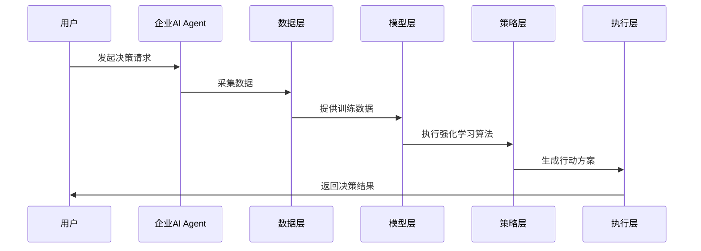

                 

### 第1章: 引言

#### 1.1 问题背景

随着数字化转型的浪潮席卷全球，企业面临着前所未有的数据挑战。海量数据生成和高速流动使得传统的人工决策方法逐渐显得力不从心。数据分析和预测任务的增加，不仅需要高效的计算能力，还要求系统能够自适应地调整策略，以应对不断变化的市场环境。此时，人工智能（AI）作为企业数字化转型的关键驱动力，得到了越来越多的关注。

在企业中，AI Agent作为一个自主决策的实体，可以模拟人类行为，通过学习环境中的反馈进行持续优化。AI Agent的目标是提高企业的运营效率、降低成本、提升客户满意度。然而，实现这一目标并非易事。AI Agent需要具备适应性强、自主学习和持续优化的能力，这就要求我们探索更为先进的人工智能技术，其中，强化学习（Reinforcement Learning，RL）成为了重要的研究方向。

强化学习是一种让智能体通过与环境的交互来学习最优策略的方法。在强化学习中，智能体通过选择动作来获得奖励或惩罚，并不断调整其行为策略以最大化长期奖励。这种方法在解决动态和不确定性环境中的决策问题具有显著优势，如自动驾驶、智能客服、供应链优化等。

#### 1.2 问题解决

强化学习在AI Agent中的应用，为解决企业面临的复杂决策问题提供了一条新的路径。通过强化学习，AI Agent能够不断优化其决策策略，从而在动态和不确定的环境中实现持续的性能提升。具体来说，强化学习在AI Agent中的应用具有以下几个关键方面：

1. **自主决策与适应能力**：强化学习允许AI Agent通过与环境交互来自主学习决策策略，这使得系统能够适应不断变化的环境条件。
   
2. **连续学习与优化**：强化学习算法能够根据实时反馈不断调整策略，从而实现持续的性能优化。这种能力在企业运营中尤为重要，因为市场环境和业务需求往往会随时间变化。

3. **优化复杂决策**：强化学习能够处理高维决策空间和复杂的约束条件，这对于优化如供应链管理、生产调度、客户关系管理等关键业务流程具有重要意义。

4. **提高效率与降低成本**：通过自动化的决策过程，企业可以减少人为错误，提高运营效率，进而降低运营成本。

#### 1.3 边界与外延

虽然强化学习在AI Agent中的应用潜力巨大，但也存在一些需要考虑的边界与外延问题：

1. **数据质量与隐私**：强化学习依赖于大量的历史数据进行训练，数据的质量直接影响模型的性能。此外，如何处理敏感数据的隐私保护也是一个重要问题。

2. **算法稳定性与可靠性**：强化学习算法在实际应用中可能会遇到收敛速度慢、稳定性差等问题，这需要通过算法优化和系统设计来加以解决。

3. **模型解释性**：虽然强化学习能够实现高效的决策，但其内部机制往往较为复杂，导致模型的可解释性较差。如何提高模型的可解释性，使得企业能够理解和信任AI Agent的决策，是亟待解决的问题。

#### 1.4 概念结构与核心要素组成

为了更好地理解强化学习在企业AI Agent中的应用，我们需要明确以下几个核心概念和要素：

1. **强化学习原理**：了解强化学习的基础概念、算法类型和数学模型。
   
2. **企业AI Agent**：明确AI Agent的定义、功能、架构和设计原则。

3. **算法集成与实现**：探讨如何将强化学习算法与企业AI Agent进行集成，实现自主学习和持续优化。

4. **应用案例**：通过具体案例展示强化学习在企业AI Agent中的应用效果和实现过程。

5. **挑战与对策**：分析强化学习在企业AI Agent应用中面临的挑战，并提出相应的解决策略。

6. **最佳实践**：总结成功案例中的最佳实践，为企业的实际应用提供指导。

在本章中，我们将逐步深入这些核心概念和要素，为后续章节的内容奠定基础。接下来，我们将详细介绍强化学习的基本概念和算法，为企业AI Agent的强化学习应用提供理论支持。

### 第2章: 强化学习基本概念

#### 2.1 强化学习原理

强化学习（Reinforcement Learning，RL）是一种机器学习范式，旨在通过智能体（Agent）与环境（Environment）的交互来学习最优行为策略。智能体在给定环境中，通过选择动作（Action）来获取奖励（Reward），并不断调整其行为策略以最大化长期奖励。

强化学习的核心思想是通过试错来学习最优策略。智能体在每一次决策中，都会根据当前状态（State）选择一个动作，然后根据动作的结果获得奖励，并更新对环境的理解。通过多次迭代，智能体逐渐学习到能够使自身获得最大奖励的行为策略。

强化学习的基本概念包括：

1. **状态（State）**：系统当前所处的状况。
2. **动作（Action）**：智能体在某一状态下可以采取的行为。
3. **奖励（Reward）**：智能体执行动作后获得的即时反馈，用于评价动作的好坏。
4. **策略（Policy）**：智能体在特定状态下选择动作的策略，通常表示为概率分布。
5. **价值函数（Value Function）**：预测在特定状态下采取特定动作的长期奖励。
6. **模型（Model）**：对环境的建模，包括状态转移概率和奖励函数。

强化学习的目标是最小化期望损失函数，即最大化累积奖励。常见的损失函数有：
$$
L(\theta) = \sum_{i=1}^N \rho_i(\theta) - \theta
$$
其中，$\theta$ 是策略参数，$\rho_i(\theta)$ 是在第 $i$ 次交互中获得的奖励。

强化学习分为两种类型：

1. **有模型（Model-Based）**：智能体同时学习状态转移概率和奖励函数，以指导其决策。
2. **无模型（Model-Free）**：智能体仅通过与环境交互来学习策略，不依赖于对环境的建模。

#### 2.2 强化学习算法对比

强化学习算法种类繁多，每种算法都有其独特的特点和应用场景。以下是一些常见的强化学习算法及其对比：

1. **Q-Learning**：Q-Learning是一种模型-free的强化学习算法，通过更新Q值（即状态-动作值函数）来学习最优策略。Q值表示在特定状态下采取特定动作的长期奖励。Q-Learning的更新公式如下：
   $$
   Q(s, a) \leftarrow Q(s, a) + \alpha [r + \gamma \max_{a'} Q(s', a') - Q(s, a)]
   $$
   其中，$\alpha$ 是学习率，$\gamma$ 是折扣因子。

2. **SARSA（On-Policy）**：SARSA是一种基于经验回归的强化学习算法，其策略不变，即当前策略就是经验回溯策略。SARSA的更新公式如下：
   $$
   Q(s, a) \leftarrow Q(s, a) + \alpha [r + \gamma Q(s', a')]
   $$

3. **Deep Q-Network (DQN)**：DQN是一种使用深度神经网络近似Q值的强化学习算法。DQN通过经验回放机制来减少样本偏差，并使用目标网络来稳定训练过程。DQN的更新公式与Q-Learning类似。

4. **Policy Gradient Methods**：Policy Gradient方法通过直接优化策略来学习，其目标是最小化策略损失函数：
   $$
   L(\pi) = -\sum_{s, a} \pi(a|s) \log \pi(a|s) r
   $$

5. **Actor-Critic Methods**：Actor-Critic方法结合了策略优化和价值评估，通过优化价值函数来稳定策略更新。常见的Actor-Critic算法包括REINFORCE、Trust Region Policy Optimization (TRPO)等。

#### 2.3 强化学习的数学模型和公式

强化学习的数学模型主要包括状态转移概率、奖励函数和价值函数。以下是一些基本的数学模型和公式：

1. **状态转移概率**：表示在给定当前状态和动作下，智能体转移到下一个状态的概率。通常表示为：
   $$
   P(s'|s, a) = \sum_{a'} \pi(a'|s') p(s'|s, a)
   $$
   其中，$\pi(a'|s')$ 是智能体在状态 $s'$ 下采取动作 $a'$ 的概率，$p(s'|s, a)$ 是环境状态转移概率。

2. **奖励函数**：表示在特定状态下采取特定动作后获得的即时奖励。通常表示为：
   $$
   R(s, a) = \sum_{s'} p(s'|s, a) r(s', a)
   $$
   其中，$r(s', a)$ 是在状态 $s'$ 下采取动作 $a$ 后获得的奖励。

3. **价值函数**：表示在特定状态下采取最优动作的长期奖励。分为状态价值函数 $V^*(s)$ 和动作价值函数 $Q^*(s, a)$：
   $$
   V^*(s) = \max_a Q^*(s, a)
   $$
   $$
   Q^*(s, a) = r(s, a) + \gamma \sum_{s'} P(s'|s, a) V^*(s')
   $$
   其中，$\gamma$ 是折扣因子，用于平衡当前奖励和未来奖励。

#### 2.4 强化学习算法的Mermaid流程图

为了更好地理解强化学习算法的流程，我们使用Mermaid流程图来表示以下几种常见算法：

1. **Q-Learning流程图**：
   ```mermaid
   graph TD
   A[初始化Q值表] --> B[选择动作]
   B --> C{动作是否最优?}
   C -->|是| D[更新Q值]
   C -->|否| E[获得奖励]
   E --> F[转移至下一状态]
   F --> B
   ```

2. **SARSA流程图**：
   ```mermaid
   graph TD
   A[初始化策略] --> B[选择动作]
   B --> C[执行动作]
   C --> D[获得奖励和下一状态]
   D --> E[更新策略]
   E --> F[重复执行动作]
   ```

3. **DQN流程图**：
   ```mermaid
   graph TD
   A[初始化网络和目标网络] --> B[选择动作]
   B --> C[执行动作]
   C --> D[获得奖励和状态]
   D --> E[更新网络]
   E --> F[更新目标网络]
   F --> A
   ```

4. **Policy Gradient流程图**：
   ```mermaid
   graph TD
   A[初始化策略网络] --> B[选择动作]
   B --> C[执行动作]
   C --> D[获得奖励和状态]
   D --> E[更新策略网络]
   E --> F[评估策略表现]
   F --> A
   ```

通过上述流程图，我们可以清晰地看到每种算法的基本步骤和逻辑关系。这些算法在企业AI Agent中的应用，将在后续章节中详细探讨。

### 第3章: 企业AI Agent的设计与实现

#### 3.1 企业AI Agent的定义与功能

企业AI Agent（Artificial Intelligence Agent）是一种基于人工智能技术的自动化决策实体，能够在企业运营过程中自主执行任务，并不断优化其行为策略。企业AI Agent的定义和功能如下：

**定义**：企业AI Agent是企业信息化系统中的一种智能实体，通过模拟人类决策者的思维过程，使用数据驱动的方式实现自动化的决策制定和执行。

**功能**：企业AI Agent具有以下几个核心功能：

1. **自主决策**：AI Agent能够根据实时数据和环境反馈，自主选择最优行动方案。
2. **持续学习**：AI Agent通过持续学习，不断优化其决策模型和策略，以适应不断变化的市场需求。
3. **优化效率**：AI Agent通过自动化的决策流程，提高企业运营效率，降低人力成本。
4. **风险控制**：AI Agent能够预测潜在风险，并提出相应的预防措施，帮助企业降低运营风险。
5. **数据分析**：AI Agent能够处理和分析海量数据，为企业的战略决策提供数据支持。

#### 3.2 企业AI Agent的设计原则

为了实现高效、稳定和可扩展的企业AI Agent，设计过程中需要遵循以下原则：

1. **模块化设计**：企业AI Agent应该采用模块化设计，每个模块具有独立的功能和接口，便于维护和升级。
2. **适应性**：AI Agent的设计应该具备良好的适应性，能够应对不同的业务场景和环境变化。
3. **可扩展性**：系统设计应该支持横向和纵向扩展，以适应企业规模的扩大和业务需求的增长。
4. **安全性**：AI Agent的设计应该充分考虑数据安全和隐私保护，确保企业数据的安全性和合规性。
5. **高效性**：AI Agent的设计应该注重计算效率和资源利用，以实现快速响应和低延迟。

#### 3.3 企业AI Agent的架构设计

企业AI Agent的架构设计应考虑系统的功能需求、性能要求和可维护性。以下是一个典型企业AI Agent的系统架构设计：

**系统架构设计**：

1. **数据层**：数据层是企业AI Agent的数据来源，包括企业内部的数据仓库、外部数据源和实时数据流。数据层负责数据的采集、存储和预处理。

2. **模型层**：模型层是AI Agent的核心，负责执行强化学习算法，包括状态编码、动作选择、奖励评估等。模型层通常采用深度学习框架（如TensorFlow、PyTorch）进行实现。

3. **策略层**：策略层根据模型层的输出，生成具体的行动方案。策略层的设计需要考虑不同业务场景下的具体策略和规则。

4. **执行层**：执行层负责将策略层的行动方案转化为实际操作，与企业的业务系统进行交互，执行决策结果。

**系统接口设计**：

1. **API接口**：系统提供统一的API接口，供外部系统调用AI Agent的功能，包括状态查询、决策请求和结果反馈等。

2. **消息队列**：系统使用消息队列（如RabbitMQ、Kafka）来实现异步通信，提高系统的可靠性和可扩展性。

3. **监控与管理**：系统设计监控模块，实时监控AI Agent的运行状态和性能指标，提供告警和故障恢复功能。

**系统交互Mermaid序列图**：

以下是一个简单的Mermaid序列图，展示了企业AI Agent的系统交互流程：



通过上述架构设计，企业AI Agent能够高效地处理复杂业务场景中的决策问题，并实现持续优化。

#### 3.4 企业AI Agent的实现方法

在实现企业AI Agent时，我们需要综合考虑强化学习算法的选择、系统的优化与调参、以及实际应用中的集成和部署。以下是一个详细的企业AI Agent实现方法：

**强化学习算法的选择**

选择合适的强化学习算法是企业AI Agent实现的关键。以下是一些常见的强化学习算法及其适用场景：

1. **Q-Learning**：适用于简单和确定性环境，如生产调度和资源分配问题。
2. **SARSA**：适用于有模型环境，需要策略不变的情况，如机器人路径规划。
3. **DQN**：适用于高维状态空间和连续动作空间的问题，如自动驾驶和游戏。
4. **Policy Gradient**：适用于策略优化问题，如智能推荐系统和财务交易策略。
5. **Actor-Critic**：适用于需要稳定策略优化和复杂价值评估的问题，如供应链管理和客户关系管理。

**系统的优化与调参**

优化和调参是提高企业AI Agent性能的重要步骤。以下是一些优化策略：

1. **数据预处理**：对输入数据进行标准化和去噪处理，提高算法的鲁棒性。
2. **经验回放**：使用经验回放机制，减少样本偏差，提高学习效率。
3. **目标网络**：对于DQN和Actor-Critic算法，使用目标网络来稳定训练过程。
4. **学习率调度**：动态调整学习率，避免过早收敛或过慢学习。
5. **奖励设计**：设计合理的奖励机制，以引导智能体学习到正确的策略。

**实际应用中的集成与部署**

实现企业AI Agent后，还需要考虑其在实际应用中的集成与部署。以下是一些关键步骤：

1. **环境搭建**：搭建适合算法训练和部署的环境，包括硬件配置和软件框架。
2. **接口定义**：定义与业务系统的接口，实现数据的输入输出和决策的执行。
3. **部署策略**：选择合适的部署策略，如云部署、边缘计算或混合部署。
4. **监控与维护**：建立监控机制，实时监控AI Agent的运行状态和性能指标，提供告警和故障恢复功能。
5. **持续优化**：通过用户反馈和数据更新，持续优化AI Agent的决策模型和策略。

通过上述实现方法，企业AI Agent能够有效地集成到企业的业务流程中，实现自动化决策和持续优化。在实际应用中，需要根据具体业务场景和需求，灵活调整算法和系统设计，以实现最佳效果。

### 第4章: 强化学习在AI Agent中的应用案例

#### 4.1 案例一：智能客服系统

**案例背景**：

随着企业服务水平的提高和客户需求的多样化，传统的客服系统已经难以满足高效的客户服务需求。智能客服系统作为一种基于人工智能技术的客服解决方案，能够24/7不间断地为用户提供服务，并提高客服效率和客户满意度。

**案例分析**：

智能客服系统通常包括自然语言处理（NLP）和强化学习两部分。NLP负责理解和生成自然语言，强化学习则负责决策策略的优化。

1. **状态表示**：智能客服系统的状态包括当前用户的问题、历史交互记录和客服知识库。
2. **动作表示**：动作包括回复用户的消息、提供相关文档链接、转接给人工客服等。
3. **奖励设计**：奖励取决于用户的满意度评价，如用户满意度高则给予正奖励，反之则给予负奖励。

**案例实现**：

以下是一个简单的智能客服系统实现步骤：

1. **数据收集**：收集用户交互数据，包括对话记录、用户反馈等。
2. **状态编码**：使用词嵌入技术对用户问题和历史记录进行编码。
3. **模型训练**：使用强化学习算法（如DQN）训练智能客服的决策模型，通过经验回放和目标网络提高模型稳定性。
4. **系统部署**：将训练好的模型部署到客服系统中，与用户实时交互。
5. **性能评估**：通过用户满意度调查和系统性能指标（如响应时间、问题解决率）评估智能客服系统效果。

**效果评估**：

通过实际应用，智能客服系统能够显著提高客户响应速度和问题解决率，客户满意度也得到了明显提升。同时，智能客服系统通过不断学习用户反馈，持续优化其服务策略，实现了自主优化和持续改进。

#### 4.2 案例二：智能供应链优化

**案例背景**：

现代供应链管理面临着复杂性和不确定性的挑战，如需求波动、库存管理、运输调度等。智能供应链优化通过人工智能技术，实现对供应链各环节的自动化管理和优化，提高供应链的灵活性和响应速度。

**案例分析**：

智能供应链优化通常包括需求预测、库存管理、运输调度和风险评估等模块。强化学习在供应链优化中的应用，主要体现在动态决策和持续优化上。

1. **状态表示**：状态包括当前库存水平、需求预测、运输路线等。
2. **动作表示**：动作包括调整库存水平、更改运输路线、采购订单等。
3. **奖励设计**：奖励取决于供应链的运营成本、库存准确度和客户满意度。

**案例实现**：

以下是一个智能供应链优化系统的实现步骤：

1. **数据收集**：收集供应链运营数据，包括库存记录、需求预测、运输记录等。
2. **状态编码**：使用深度学习技术对状态数据进行编码，如需求预测采用时间序列模型。
3. **模型训练**：使用强化学习算法（如Policy Gradient）训练供应链优化模型，通过多轮迭代优化策略。
4. **系统部署**：将训练好的模型部署到供应链系统中，实现自动化决策和实时优化。
5. **性能评估**：通过供应链绩效指标（如库存周转率、运输成本、客户满意度）评估系统效果。

**效果评估**：

智能供应链优化系统能够显著降低库存成本、提高运输效率和客户满意度。通过强化学习算法的持续学习，系统能够自适应市场需求变化，实现供应链的动态优化和高效运营。

#### 4.3 案例三：智能风险管理

**案例背景**：

在金融领域，风险管理是确保企业稳健运营的关键。智能风险管理通过人工智能技术，实现对风险因素的分析和预测，提供风险预警和决策支持。

**案例分析**：

智能风险管理通常包括风险识别、风险评估、风险预测和风险控制等模块。强化学习在风险管理中的应用，主要体现在实时决策和风险控制上。

1. **状态表示**：状态包括市场数据、公司财务状况、风险指标等。
2. **动作表示**：动作包括调整投资组合、采取风险控制措施等。
3. **奖励设计**：奖励取决于风险控制效果和市场表现，如风险降低、投资回报率提高等。

**案例实现**：

以下是一个智能风险管理系统的实现步骤：

1. **数据收集**：收集金融市场数据和公司财务数据，包括历史交易记录、市场波动、财务报表等。
2. **状态编码**：使用深度学习技术对状态数据进行编码，如使用时间序列模型进行风险预测。
3. **模型训练**：使用强化学习算法（如Actor-Critic）训练智能风险管理模型，通过模拟交易进行策略优化。
4. **系统部署**：将训练好的模型部署到风险管理系统中，实现实时风险监测和决策支持。
5. **性能评估**：通过投资回报率、风险降低率等指标评估系统效果。

**效果评估**：

智能风险管理系统能够提高风险识别和预测的准确性，降低潜在风险，提高投资组合的稳健性。通过强化学习算法的持续学习，系统能够自适应市场变化，实现风险管理的动态优化。

通过以上案例，我们可以看到强化学习在AI Agent中的应用不仅能够提升企业运营效率，还能为金融、供应链等领域提供智能决策支持，实现业务的持续优化和发展。

### 第5章: 强化学习在企业AI Agent中的应用挑战与对策

#### 5.1 应用挑战

尽管强化学习在企业AI Agent中的应用前景广阔，但实际应用过程中仍面临诸多挑战：

1. **数据质量与隐私保护**：
   - **挑战**：强化学习算法依赖于大量高质量的数据进行训练。然而，企业内部的数据往往存在质量问题，如数据缺失、噪声和重复等。此外，敏感数据的隐私保护也是一个重要问题，特别是在金融和医疗等行业。
   - **对策**：使用数据清洗和预处理技术，提高数据质量。在数据处理过程中，应用加密技术和隐私保护算法，如差分隐私（Differential Privacy），确保数据隐私。

2. **算法稳定性与可靠性**：
   - **挑战**：强化学习算法在实际应用中可能面临稳定性问题，如训练过程中的崩溃和过度拟合。算法的可靠性也受到算法复杂度、计算资源和时间成本的限制。
   - **对策**：采用多策略组合和算法优化技术，如经验回放（Experience Replay）和目标网络（Target Network），提高算法稳定性。此外，通过合理的算法设计和调参，确保算法在复杂环境中的可靠性。

3. **模型解释性**：
   - **挑战**：强化学习算法的内部机制复杂，导致模型的可解释性较差。企业决策者和用户往往需要理解AI Agent的决策过程，以提高信任度和接受度。
   - **对策**：开发可解释的强化学习算法，如基于规则的强化学习（Rule-based Reinforcement Learning）和可视化工具，展示算法的决策路径和关键因素。此外，通过解释性模型（如决策树、LIME等），帮助用户理解模型的决策逻辑。

#### 5.2 对策与解决方案

针对上述挑战，以下是一些具体的对策和解决方案：

1. **数据质量与隐私保护**：
   - **技术对策**：使用数据预处理技术，如数据清洗、去噪和标准化，提高数据质量。采用差分隐私和同态加密等隐私保护算法，确保数据处理过程中的数据隐私。
   - **解决方案**：建立数据治理机制，明确数据使用政策和隐私保护标准。应用联邦学习（Federated Learning）技术，在保持数据本地存储的同时，实现数据的安全共享和协同学习。

2. **算法稳定性与可靠性**：
   - **技术对策**：采用经验回放和目标网络等技术，提高算法的稳定性。通过动态调整学习率和折扣因子，优化算法性能。
   - **解决方案**：设计自适应算法，根据环境变化动态调整算法参数。使用多策略组合和算法优化技术，如梯度提升（Gradient Boosting）和神经网络架构搜索（Neural Architecture Search），提高算法的可靠性。

3. **模型解释性**：
   - **技术对策**：开发可解释的强化学习算法，如基于规则的强化学习和决策树等。应用可视化工具，如热图和决策路径图，展示模型的关键特征和决策过程。
   - **解决方案**：应用解释性模型，如局部可解释模型（LIME）和SHAP值，解释模型的预测结果和关键因素。建立用户反馈机制，通过用户交互和反馈，不断优化模型的可解释性和可信度。

通过上述对策和解决方案，企业AI Agent在强化学习应用中的挑战可以得到有效缓解，从而实现更加稳定、可靠和透明的决策支持。

### 第6章: 强化学习在企业AI Agent中的最佳实践

#### 6.1 最佳实践总结

在企业AI Agent中应用强化学习，需要结合具体的业务场景和技术背景，制定合理的设计和实现策略。以下是一些总结出的最佳实践：

1. **数据驱动**：充分利用企业内外部数据，进行数据清洗、预处理和特征提取，为强化学习算法提供高质量的数据输入。
2. **算法优化**：选择合适的强化学习算法，并对其进行调优，以适应不同业务场景的需求。可以采用多策略组合和算法优化技术，提高算法的稳定性和可靠性。
3. **模型解释性**：开发可解释的强化学习算法，并使用可视化工具和解释性模型，提高模型的可信度和用户接受度。
4. **持续学习**：通过实时数据更新和模型迭代，实现AI Agent的持续学习和优化，以应对动态和复杂的环境变化。
5. **安全性**：在设计过程中，确保数据安全和隐私保护，采用加密技术和隐私保护算法，如差分隐私，保障企业数据的安全性和合规性。
6. **监控与维护**：建立监控机制，实时监控AI Agent的运行状态和性能指标，提供告警和故障恢复功能，确保系统的稳定运行。

#### 6.2 注意事项

在应用强化学习进行企业AI Agent设计时，需要特别注意以下事项：

1. **业务需求理解**：充分理解企业业务需求，确保AI Agent的设计和实现能够真正解决实际问题，提升业务效率。
2. **算法选择**：根据具体业务场景选择合适的强化学习算法，避免盲目追求复杂算法而忽略实际应用效果。
3. **模型可解释性**：注重模型的可解释性，确保企业决策者和用户能够理解和信任AI Agent的决策过程。
4. **数据质量和隐私**：保证数据质量，采用适当的数据预处理和隐私保护技术，确保数据处理过程的合规性和安全性。
5. **算法稳定性**：通过合理的算法设计和调参，提高算法的稳定性和可靠性，避免因环境变化导致算法失效。
6. **持续优化**：定期对AI Agent进行性能评估和优化，根据业务需求和用户反馈，不断调整和改进模型。

#### 6.3 拓展阅读

为了深入了解强化学习在企业AI Agent中的应用，以下推荐一些相关书籍和论文：

1. **书籍**：
   - 《强化学习：原理与算法》（作者：理查德·萨顿）
   - 《智能决策与强化学习》（作者：徐宗本）
   - 《深度强化学习》（作者：大卫·银）

2. **论文**：
   - “Reinforcement Learning: A Survey” by Richard S. Sutton and Andrew G. Barto
   - “Deep Q-Networks” by Volodymyr Mnih et al.
   - “Algorithms for Reinforcement Learning” by Csaba Szepesvari

这些书籍和论文提供了丰富的理论知识和实际应用案例，有助于进一步深化对强化学习和企业AI Agent的理解。

### 总结

强化学习在企业AI Agent中的应用，为企业提供了强大的自动化决策和持续优化能力。通过最佳实践和注意事项的指导，企业能够更好地实现强化学习的应用，提升业务效率和竞争力。希望本文能为读者提供有价值的参考，推动强化学习在企业AI Agent领域的深入研究和应用。

### 作者

**作者：AI天才研究院/AI Genius Institute & 禅与计算机程序设计艺术 /Zen And The Art of Computer Programming** 

AI天才研究院致力于推动人工智能领域的研究与应用，旨在培养下一代AI科学家和工程师。同时，作者还以其深厚的计算机科学背景和哲学思想，在《禅与计算机程序设计艺术》一书中，展示了如何将哲学思维融入编程实践，为读者提供了独特的视角和方法。希望通过本文，读者能够更好地理解强化学习在企业AI Agent中的应用，推动人工智能技术的创新发展。

