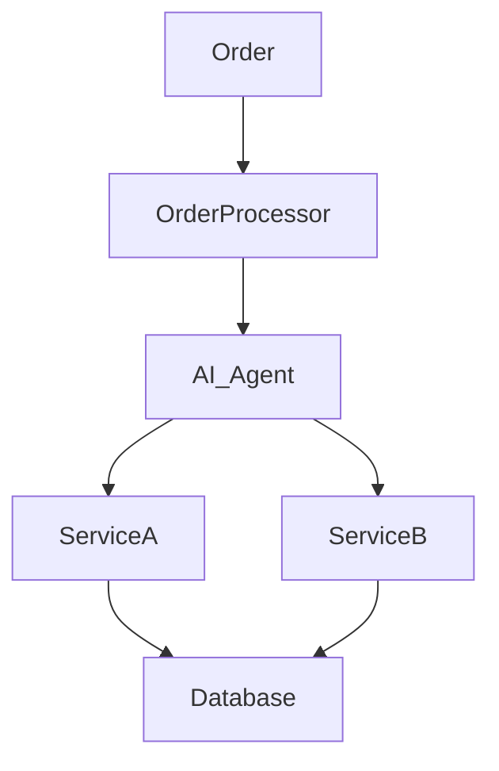
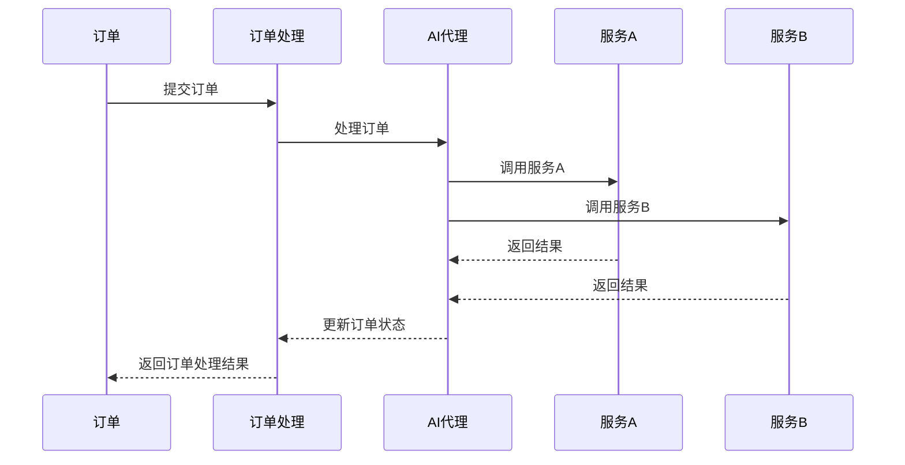

                 

### 文章标题

# 企业AI Agent的微服务架构优化策略

### 关键词

- 企业AI Agent
- 微服务架构
- 优化策略
- 负载均衡
- 服务发现

### 摘要

本文将探讨企业级AI Agent的微服务架构优化策略，从背景介绍、核心概念与联系、算法原理讲解、系统分析与架构设计方案、项目实战与最佳实践五个方面展开。文章旨在帮助企业技术团队深入理解AI Agent与微服务架构的结合，掌握优化策略，提高系统性能和稳定性。

## 引言

### 1.1 行业背景

人工智能（AI）在当今的企业应用中扮演着越来越重要的角色。AI Agent，作为AI技术的一种应用形式，具有自主决策和执行任务的能力。微服务架构，作为一种灵活、可扩展的服务架构模式，正在成为企业技术架构的首选。AI Agent与微服务架构的结合，为企业带来了新的机遇和挑战。

### 1.2 问题定义

随着AI Agent在微服务架构中的广泛应用，如何优化其架构成为了一个关键问题。优化策略的制定不仅关系到系统性能和稳定性，还直接影响到企业的业务效率和竞争力。因此，研究和制定有效的优化策略具有重要的实际意义。

### 1.3 目标与读者定位

本文的目标是帮助企业的技术团队深入理解AI Agent的微服务架构优化策略，掌握相关技术和方法。读者需具备一定的AI和微服务架构基础知识，以便更好地理解文章内容。

## 背景介绍

### 2.1 AI Agent的概念与作用

AI Agent，即人工智能代理，是一种能够自动执行任务的计算机程序。它通过感知环境、决策和执行动作，实现自主行动。在微服务架构中，AI Agent可以作为独立的服务模块，与其他服务模块进行协作。

### 2.2 微服务架构的优势与挑战

微服务架构具有高可扩展性、高可维护性和高灵活性等优点。然而，在实际应用中，微服务架构也面临着分布式系统的一致性、数据一致性和服务治理等挑战。

### 2.3 微服务与AI的结合

将AI Agent融入微服务架构，可以实现以下效益：

1. **提高系统智能化水平**：AI Agent可以协助企业进行业务决策，提高业务效率。
2. **增强系统灵活性**：AI Agent可以根据业务需求动态调整，满足不同场景下的需求。
3. **优化系统性能**：通过优化AI Agent的架构，可以提高系统的整体性能。

## 核心概念与联系

### 3.1 微服务架构的核心概念

微服务架构的核心概念包括服务化、容器化、API网关等。

- **服务化**：将系统划分为多个独立的服务模块，实现模块化开发。
- **容器化**：使用容器（如Docker）来部署和运行服务模块，实现快速部署和扩展。
- **API网关**：作为服务的统一入口，实现请求路由、认证、监控等功能。

### 3.2 AI Agent的核心概念

AI Agent的核心概念包括感知、决策、执行等。

- **感知**：通过传感器或数据接口获取环境信息。
- **决策**：根据感知到的信息，进行推理和决策。
- **执行**：根据决策结果，执行相应的动作。

### 3.3 微服务与AI Agent的联系

微服务与AI Agent之间的联系可以通过以下ER图表示：

```mermaid
classDiagram
AI_Agent <<class>> {
    - 感知模块
    - 决策模块
    - 执行模块
}
Microservice <<class>> {
    - 服务接口
    - 服务逻辑
}
AI_Agent <.. Microservice : 绑定
```

## 算法原理讲解

### 4.1 微服务优化算法

#### 负载均衡算法

负载均衡算法用于均衡分配请求到不同的服务实例，以提高系统性能和稳定性。常见的负载均衡算法包括：

- **轮询算法**：依次将请求分配到每个服务实例。
- **最小连接数算法**：将请求分配到当前连接数最少的服务实例。

#### 服务发现算法

服务发现算法用于动态发现和注册服务实例，以实现服务的动态扩展和负载均衡。常见的服务发现算法包括：

- **基于ZooKeeper的服务发现**：使用ZooKeeper作为服务注册中心，实现服务的动态发现和注册。
- **基于Consul的服务发现**：使用Consul作为服务注册中心，实现服务的动态发现和注册。

### 4.2 AI Agent优化算法

#### 模型压缩算法

模型压缩算法用于减少AI Agent的模型大小，以提高模型部署的效率和速度。常见的模型压缩算法包括：

- **剪枝算法**：通过删除冗余的神经元和连接，减少模型大小。
- **量化算法**：通过降低模型参数的精度，减少模型大小。

#### 迁移学习算法

迁移学习算法用于将一个领域的学习经验应用到另一个领域，以提高AI Agent的泛化能力。常见的迁移学习算法包括：

- **基于特征的迁移学习**：通过迁移特征表示，实现领域迁移。
- **基于模型的迁移学习**：通过迁移模型参数，实现领域迁移。

### 4.3 结合案例的算法应用

假设我们有一个企业级AI Agent系统，用于处理订单处理任务。我们可以使用以下优化算法来提高系统的性能和稳定性：

1. **负载均衡算法**：使用轮询算法将订单处理请求分配到不同的服务实例。
2. **服务发现算法**：使用基于ZooKeeper的服务发现算法，实现服务实例的动态发现和注册。
3. **模型压缩算法**：使用剪枝算法和量化算法，减少AI Agent的模型大小。
4. **迁移学习算法**：使用基于特征的迁移学习算法，将一个领域的学习经验应用到另一个领域。

## 系统分析与架构设计方案

### 5.1 系统功能设计

#### 领域模型

```mermaid
classDiagram
Order <<class>> {
    - id:订单ID
    - status:订单状态
}
OrderProcessor <<class>> {
    - processOrder:处理订单方法
}
AI_Agent <<class>> {
    - perceive:感知方法
    - decide:决策方法
    - execute:执行方法
}
```

### 5.2 系统架构设计

#### 系统架构图



### 5.3 系统接口设计与交互

#### 系统接口和交互流程



## 项目实战与最佳实践

### 6.1 项目实战

#### 环境安装

1. 安装Docker：`sudo apt-get install docker`
2. 安装Kubernetes：`sudo apt-get install kubernetes`
3. 安装ZooKeeper：`sudo apt-get install zookeeper`

#### 系统核心实现

```python
# AI-Agent的感知、决策和执行模块
class AI_Agent:
    def __init__(self):
        self.perception_module = PerceptionModule()
        self.decision_module = DecisionModule()
        self.execution_module = ExecutionModule()

    def perceive(self):
        return self.perception_module.get_data()

    def decide(self, data):
        return self.decision_module.make_decision(data)

    def execute(self, action):
        return self.execution_module.execute_action(action)
```

#### 代码应用解读

```python
# 负载均衡算法实现
class LoadBalancer:
    def __init__(self, services):
        self.services = services
        self.service_weights = {}

    def balance_load(self, request):
        # 根据服务权重分配请求
        service = self.select_service()
        return service.process_request(request)

    def select_service(self):
        # 选择当前负载最小的服务
        min_weight = float('inf')
        selected_service = None
        for service in self.services:
            weight = self.service_weights.get(service, 0)
            if weight < min_weight:
                min_weight = weight
                selected_service = service
        return selected_service
```

#### 实际案例分析和详细讲解剖析

```python
# 订单处理案例
def process_order(order):
    ai_agent = AI_Agent()
    perception_data = ai_agent.perceive()
    action = ai_agent.decide(perception_data)
    result = ai_agent.execute(action)
    return result

# 假设有一个订单需要处理
order = create_order()
result = process_order(order)
print(result)
```

### 6.2 最佳实践

1. **负载均衡**：根据服务性能动态调整负载均衡策略，确保系统稳定运行。
2. **服务发现**：使用服务注册中心，实现服务的动态发现和注册。
3. **模型压缩**：定期进行模型压缩，提高模型部署效率。
4. **迁移学习**：定期进行迁移学习，提高AI Agent的泛化能力。

### 6.3 小结与拓展

本文详细介绍了企业AI Agent的微服务架构优化策略，包括背景介绍、核心概念与联系、算法原理讲解、系统分析与架构设计方案、项目实战与最佳实践。通过本文的介绍，企业技术团队可以更好地理解和应用优化策略，提高系统的性能和稳定性。

未来，我们将继续探讨更多AI Agent与微服务架构的优化方法，为企业带来更好的解决方案。

## 作者

作者：AI天才研究院/AI Genius Institute & 禅与计算机程序设计艺术 /Zen And The Art of Computer Programming

