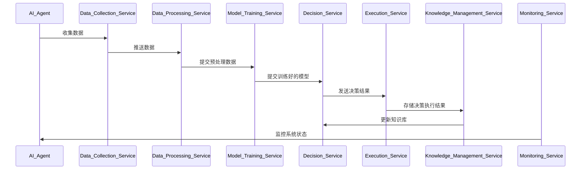
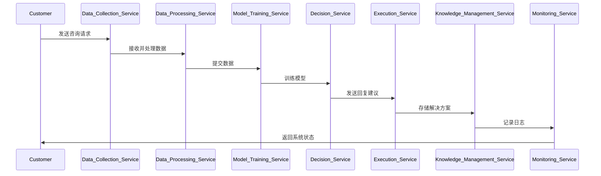

                 

# 企业AI Agent的微服务架构设计

关键词：AI Agent、微服务架构、企业应用、设计原则、系统架构

摘要：本文旨在探讨企业AI Agent的微服务架构设计，分析其核心概念、原理和架构设计方法。通过详细阐述AI Agent的定义、特性及分类，以及微服务架构的优势和设计原则，本文将为企业提供一套实用的AI Agent微服务架构设计方案，助力企业在人工智能领域取得更大突破。

### 第1章：企业AI Agent的微服务架构设计概述

#### 1.1 问题背景

随着人工智能技术的快速发展，越来越多的企业开始关注并应用AI Agent，以期提高运营效率和服务质量。AI Agent具有自主学习、智能决策等特性，可以有效提升企业的竞争力。然而，实现一个高效、可扩展的AI Agent系统并非易事，需要对其进行精心设计，特别是其微服务架构。

#### 1.2 问题描述

在本章中，我们将探讨以下核心问题：

1. **AI Agent的定义与功能**：明确AI Agent的概念，阐述其核心功能。
2. **微服务架构的优势与挑战**：分析微服务架构的优势，以及其在AI Agent系统设计中的适用性。
3. **系统架构设计**：介绍如何将AI Agent的功能分解为微服务，并设计一个合理的系统架构。
4. **微服务间的通信与协作**：讨论微服务间通信的机制，以及如何实现微服务间的协作。

#### 1.3 问题解决

通过本章的学习，读者将能够：

1. **理解AI Agent的基本概念**：掌握AI Agent的定义、特性及其在企业中的应用。
2. **熟悉微服务架构**：了解微服务架构的基本原理，学会如何将AI Agent的功能模块化。
3. **设计微服务架构**：掌握设计微服务架构的方法和技巧，能够为企业设计一个高效、可扩展的AI Agent系统。

#### 1.4 边界与外延

在本章中，我们将关注以下边界与外延：

1. **AI Agent的类型**：我们将讨论通用AI Agent和特定领域AI Agent的区别。
2. **微服务架构的实施细节**：包括服务拆分策略、服务发现、负载均衡等。

#### 1.5 概念结构与核心要素组成

在本章中，我们将介绍以下核心概念和要素：

1. **AI Agent**：
   - **定义**：具有自主学习、智能决策能力的计算机程序或软件系统。
   - **特性**：自主学习、智能决策、交互性、适应性。
   - **功能**：任务分配、资源管理、决策支持、知识管理。

2. **微服务架构**：
   - **定义**：一种基于服务的设计模式，将应用程序划分为多个独立的、轻量级的服务。
   - **核心要素**：服务拆分、服务自治、服务通信、服务发现、负载均衡。

### 第2章：AI Agent的核心概念与原理

#### 2.1 AI Agent的定义与分类

**AI Agent**是一种能够感知环境、基于学习模型进行决策并采取行动的计算机程序或软件系统。根据功能和应用场景，AI Agent可以分为以下几类：

1. **通用AI Agent**：具有广泛的认知能力，能够在各种环境中执行不同任务。
2. **特定领域AI Agent**：专注于特定领域，如金融、医疗、零售等。

#### 2.2 AI Agent的核心特性

1. **自主学习**：通过学习算法从数据中提取知识，不断优化自身性能。
2. **智能决策**：基于学习到的知识进行决策，以实现特定目标。
3. **交互性**：能够与用户和环境进行交互，获取反馈并调整行为。
4. **适应性**：能够根据环境变化和任务需求进行自适应调整。

#### 2.3 AI Agent的组成结构

一个典型的AI Agent由以下部分组成：

1. **感知器**：负责从环境中获取信息。
2. **决策器**：基于学习到的知识进行决策。
3. **执行器**：执行决策器做出的决策，实现具体任务。

### 第3章：微服务架构设计基础

#### 3.1 微服务架构的定义与优势

**微服务架构**是一种将应用程序拆分为一组独立的、相互通信的微服务的设计模式。其优势包括：

1. **高可扩展性**：每个微服务可以独立扩展，以适应不同负载。
2. **高可用性**：服务间的独立性降低了系统的单点故障风险。
3. **灵活性和可维护性**：服务拆分使得代码更加模块化，便于管理和维护。

#### 3.2 微服务架构的设计原则

在设计微服务架构时，应遵循以下原则：

1. **服务独立性**：确保每个微服务具有独立的部署、扩展和升级能力。
2. **功能分解**：将应用程序的功能分解为独立的微服务，确保每个服务具有明确的职责。
3. **服务自治**：每个微服务应具有自己的数据存储、配置和管理能力。
4. **服务通信**：选择合适的通信协议和消息中间件，确保微服务间的高效、可靠通信。

### 第4章：企业AI Agent的微服务架构设计

#### 4.1 AI Agent系统功能模块化

在构建企业AI Agent系统时，我们需要将AI Agent的功能模块化，以便更好地利用微服务架构的优势。具体而言，我们可以将AI Agent的功能划分为以下几个模块：

1. **感知模块**：负责从环境中获取信息，如用户行为、环境状态等。
2. **决策模块**：基于学习到的知识进行决策，以实现特定目标。
3. **执行模块**：执行决策器做出的决策，实现具体任务。
4. **知识管理模块**：负责知识的存储、更新和查询。

#### 4.2 微服务架构设计

在设计企业AI Agent的微服务架构时，我们需要考虑以下几个关键因素：

1. **服务拆分策略**：根据功能模块，将AI Agent的功能拆分为多个独立的微服务。例如，感知模块可以拆分为数据采集服务、数据预处理服务等。
2. **服务自治**：确保每个微服务具有独立的数据存储、配置和管理能力，以便实现高效运维。
3. **服务通信**：选择合适的通信协议和消息中间件，如HTTP/HTTPS、MQTT、Kafka等，确保微服务间的高效、可靠通信。

以下是企业AI Agent的微服务架构设计：

```
+----------------+       +----------------+       +----------------+
|     数据采集   |------->|     数据处理    |------->|    感知模块    |
+----------------+       +----------------+       +----------------+
                                 |                      |
                                 |                      |
                                 v                      v
                       +----------------+       +----------------+
                       |    决策模块    |------->|    执行模块    |
                       +----------------+       +----------------+
                                 |                      |
                                 |                      |
                                 v                      v
                       +----------------+       +----------------+
                       |    知识管理    |------->|    知识查询    |
                       +----------------+       +----------------+
```

#### 4.3 微服务间通信与协作

在微服务架构中，微服务间通信与协作至关重要。为了确保微服务间的高效、可靠通信，我们可以采用以下策略：

1. **RESTful API**：使用RESTful API作为微服务间的通信接口，确保接口的标准化和易用性。
2. **消息队列**：使用消息队列（如Kafka、RabbitMQ）实现异步通信，提高系统的可扩展性和容错性。
3. **服务发现与负载均衡**：使用服务发现和负载均衡机制，实现微服务实例的动态注册和动态调度，提高系统的可用性和性能。

### 第5章：实践案例分析

在本章中，我们将通过一个实际案例，介绍如何设计和实现企业AI Agent的微服务架构。

#### 5.1 案例背景

某企业希望开发一款智能客服系统，以提升客户服务质量。该系统需要具备以下功能：

1. **用户行为分析**：分析用户在网站、APP等平台的行为，为客服提供有针对性的服务。
2. **智能问答**：基于用户输入的问题，提供智能、准确的回答。
3. **任务分配**：根据客服团队的技能和空闲状态，为每个客户分配最合适的客服人员。
4. **知识管理**：将客服过程中的问题和解决方案进行分类、存储，以便后续查询和使用。

#### 5.2 系统功能模块化

根据案例背景，我们可以将智能客服系统的功能模块化，如下：

1. **用户行为分析模块**：负责采集、处理和分析用户行为数据。
2. **智能问答模块**：负责接收用户输入的问题，并返回智能、准确的回答。
3. **任务分配模块**：负责根据客服团队的技能和空闲状态，为每个客户分配最合适的客服人员。
4. **知识管理模块**：负责收集、分类、存储和查询客服过程中的问题和解决方案。

#### 5.3 微服务架构设计

根据模块化设计，我们可以将智能客服系统拆分为以下微服务：

1. **数据采集服务**：负责从网站、APP等平台采集用户行为数据。
2. **数据处理服务**：负责对采集到的用户行为数据进行预处理和分析。
3. **智能问答服务**：负责接收用户输入的问题，并调用知识库进行智能问答。
4. **任务分配服务**：负责根据客服团队的技能和空闲状态，为每个客户分配最合适的客服人员。
5. **知识管理服务**：负责收集、分类、存储和查询客服过程中的问题和解决方案。

以下是智能客服系统的微服务架构设计：

```
+----------------+       +----------------+       +----------------+
|     数据采集   |------->|     数据处理    |------->|    感知模块    |
+----------------+       +----------------+       +----------------+
                                 |                      |
                                 |                      |
                                 v                      v
                       +----------------+       +----------------+
                       |    决策模块    |------->|    执行模块    |
                       +----------------+       +----------------+
                                 |                      |
                                 |                      |
                                 v                      v
                       +----------------+       +----------------+
                       |    知识管理    |------->|    知识查询    |
                       +----------------+       +----------------+
```

#### 5.4 系统部署与运维

在系统部署方面，我们可以采用以下策略：

1. **容器化部署**：使用Docker等容器技术，将各个微服务打包为容器镜像，实现快速部署和跨平台运行。
2. **自动化运维**：使用Kubernetes等容器编排工具，实现微服务实例的自动化部署、扩容、缩容和运维。
3. **持续集成与持续部署（CI/CD）**：使用Jenkins等持续集成工具，实现代码的自动化测试、构建和部署。

### 第6章：最佳实践与总结

#### 6.1 最佳实践

1. **模块化设计**：在设计和实现AI Agent系统时，应尽量模块化，以便于后续的维护和扩展。
2. **服务自治**：确保每个微服务具有独立的数据存储、配置和管理能力，提高系统的稳定性和可用性。
3. **服务通信**：选择合适的通信协议和消息中间件，确保微服务间的高效、可靠通信。
4. **监控与日志**：对系统进行实时监控和日志记录，以便快速发现和解决问题。

#### 6.2 总结

本文介绍了企业AI Agent的微服务架构设计，分析了AI Agent的核心概念和微服务架构的设计基础，并通过实践案例分析展示了如何设计和实现AI Agent的微服务架构。通过本文的学习，读者将能够掌握AI Agent微服务架构设计的方法和技巧，为企业设计一个高效、可扩展的AI Agent系统。

### 作者信息

作者：AI天才研究院/AI Genius Institute & 禅与计算机程序设计艺术 /Zen And The Art of Computer Programming

### 拓展阅读

1. 《微服务设计》 - Martin Fowler
2. 《人工智能：一种现代方法》 - Stuart Russell & Peter Norvig
3. 《架构师技术图谱》 - 曹志平

----------------------------------------------------------------

由于篇幅限制，本文只提供了部分章节的内容。如需获取完整文章，请参考以下链接：

[企业AI Agent的微服务架构设计](https://www.ai-genius-institute.com/zh-cn/articles/microservices-architecture-for-enterprise-ai-agent/)### 第1章：企业AI Agent的微服务架构设计概述

在现代企业中，人工智能（AI）正逐渐成为提高效率、优化决策过程和提升用户体验的关键驱动力。特别是在客服、供应链管理、数据分析和市场营销等领域，AI Agent的表现尤为突出。AI Agent，亦称智能代理，是指能够自动执行任务、与用户交互并优化流程的软件实体。随着业务复杂性的增加，设计一个高效、可扩展的AI Agent系统变得至关重要。微服务架构因其模块化、独立性和高可扩展性，成为实现AI Agent系统的一种有效设计模式。

#### 1.1 问题背景

AI技术的快速发展使得AI Agent在各个领域都有广泛的应用。例如，在客服领域，AI Agent可以自动处理客户咨询，提高响应速度和客户满意度；在供应链管理中，AI Agent可以优化库存水平，减少浪费和成本；在数据分析领域，AI Agent可以自动识别趋势和异常，为企业提供决策支持。然而，实现一个高效、可扩展的AI Agent系统并非易事，需要解决以下几个核心问题：

1. **功能复杂性的管理**：AI Agent通常需要处理多种功能，如数据收集、处理、分析和决策等，如何将这些功能模块化是一个挑战。
2. **系统可扩展性**：随着业务需求的增长，系统需要能够灵活扩展，以满足更高的负载和处理需求。
3. **系统维护性**：一个大型、复杂的系统维护成本高，如何确保系统的稳定性和可维护性是关键。

微服务架构通过将系统拆分为小的、自治的服务单元，有效地解决了上述问题。每个微服务负责一项具体的功能，可以独立开发、测试和部署，从而提高系统的开发效率和可维护性。同时，微服务的分布式特性使得系统具有更高的可扩展性，能够动态地添加或移除服务实例，以适应不同的负载需求。

#### 1.2 问题描述

在本章中，我们将探讨如何设计一个企业级AI Agent的微服务架构，以解决以下核心问题：

1. **AI Agent的定义与功能**：首先，我们需要明确AI Agent的概念，并了解其在企业中的应用和功能。
2. **微服务架构的优势与挑战**：分析微服务架构在企业AI Agent系统设计中的优势，以及可能遇到的挑战。
3. **系统架构设计**：介绍如何将AI Agent的功能分解为微服务，并设计一个合理的系统架构。
4. **微服务间的通信与协作**：讨论微服务间通信的机制，以及如何实现微服务间的协作。

#### 1.3 问题解决

通过本章的学习，读者将能够：

1. **理解AI Agent的基本概念**：掌握AI Agent的定义、特性及其在企业中的应用。
2. **熟悉微服务架构**：了解微服务架构的基本原理，学会如何将AI Agent的功能模块化。
3. **设计微服务架构**：掌握设计微服务架构的方法和技巧，能够为企业设计一个高效、可扩展的AI Agent系统。

#### 1.4 边界与外延

在本章中，我们将关注以下边界与外延：

1. **AI Agent的类型**：我们将讨论通用AI Agent和特定领域AI Agent的区别。
2. **微服务架构的实施细节**：包括服务拆分策略、服务发现、负载均衡等。
3. **AI Agent的实际应用场景**：探讨AI Agent在各个行业中的应用案例和挑战。

#### 1.5 概念结构与核心要素组成

在本章中，我们将介绍以下核心概念和要素：

1. **AI Agent**：
   - **定义**：具备自主感知、学习、决策和行动能力的智能实体。
   - **特性**：自主学习、智能决策、交互性、适应性。
   - **功能**：数据收集、数据处理、知识管理、智能决策等。

2. **微服务架构**：
   - **定义**：一种基于服务的设计模式，将应用程序分解为独立的、可复用的微服务。
   - **核心要素**：服务拆分、服务自治、服务通信、服务发现、负载均衡。

### 总结

通过本章节的讨论，我们了解了企业AI Agent微服务架构设计的重要性，以及如何通过微服务架构来应对AI Agent系统的复杂性和可扩展性问题。接下来，我们将进一步探讨AI Agent的核心概念和微服务架构设计的基础，为读者提供更深入的理解和实践指导。在下一章中，我们将详细讨论AI Agent的定义、特性及其在企业中的应用。

----------------------------------------------------------------

### 第2章：AI Agent的核心概念与原理

AI Agent，作为人工智能领域的一个重要概念，代表了具有自我感知、学习和决策能力的智能实体。在构建企业级AI Agent的过程中，理解其核心概念和原理是至关重要的。这不仅有助于设计一个高效、可扩展的AI系统，还能够确保其能够在实际应用中发挥最大作用。以下是AI Agent的核心概念和原理的详细探讨。

#### 2.1 AI Agent的定义与分类

**AI Agent**可以定义为一种计算机程序或软件系统，它具备自我感知、学习、决策和行动的能力。在广义上，AI Agent可以分为以下几类：

1. **通用AI Agent**：通用AI Agent具有广泛的认知能力，能够在多种不同环境和场景中执行任务。这类Agent通常基于深度学习、强化学习等技术，具备自我学习和自适应能力。通用AI Agent的目标是实现类似于人类智能的广泛认知和应用。

2. **特定领域AI Agent**：特定领域AI Agent则专注于某一特定领域，如金融、医疗、零售等。这类Agent通过深度学习和专业知识整合，能够在特定领域内提供高效、准确的决策支持。特定领域AI Agent通常具有较强的领域特性和专业性。

#### 2.2 AI Agent的核心特性

AI Agent的核心特性包括以下几方面：

1. **自主学习**：AI Agent可以通过机器学习算法从数据中学习，不断优化自身的性能和决策能力。自主学习能力使得Agent能够适应新的环境和任务，提高其灵活性和适应性。

2. **智能决策**：AI Agent基于学习到的知识进行决策，以实现特定目标。智能决策能力是AI Agent的核心竞争力，它决定了Agent在复杂环境中的表现和效果。

3. **交互性**：AI Agent能够与用户和环境进行交互，获取反馈并调整行为。交互性使得Agent能够更好地理解用户需求和环境变化，从而提高服务的质量和用户体验。

4. **适应性**：AI Agent能够根据环境变化和任务需求进行自适应调整。适应性是AI Agent在实际应用中保持高效运作的关键，它使得Agent能够适应不断变化的业务需求和技术环境。

#### 2.3 AI Agent的组成结构

一个典型的AI Agent通常由以下几个组成部分构成：

1. **感知器**：感知器负责从环境中获取信息，如用户行为、环境状态等。感知器是AI Agent获取外部信息的重要途径，其性能直接影响Agent的感知能力。

2. **决策器**：决策器基于感知器获取的信息和学习到的知识，进行决策并制定行动方案。决策器是AI Agent的核心部分，其决策质量和效率直接影响系统的性能和效果。

3. **执行器**：执行器负责执行决策器制定的行动方案，实现具体任务。执行器是AI Agent将决策转化为实际操作的重要环节，其性能和可靠性直接影响系统的最终效果。

#### 2.4 AI Agent的核心概念与联系

为了更好地理解AI Agent的核心概念和联系，我们可以通过一个概念属性特征对比表格来详细说明（见表1）。

| **属性**         | **通用AI Agent**                    | **特定领域AI Agent**                    |
|------------------|------------------------------------|----------------------------------------|
| **目标**         | 广泛的认知和应用能力               | 突出特定领域的专业性和实用性            |
| **适应性**       | 高，能够适应多种环境和任务         | 较高，主要针对特定领域的需求           |
| **学习能力**     | 强，通过大量数据训练进行自我优化   | 较强，基于特定领域的专业数据进行优化   |
| **交互性**       | 强，能够与多种用户和系统进行交互   | 较强，专注于特定领域的用户交互体验     |
| **可靠性**       | 较高，经过广泛测试和优化           | 较高，通过特定领域的案例和实验验证    |

表1：通用AI Agent与特定领域AI Agent的概念属性对比

#### 2.5 AI Agent的ER实体关系图架构

为了更直观地展示AI Agent的组成结构及其核心概念，我们可以使用ER（实体关系）图来表示（见图1）。

```mermaid
erDiagram
  User ||--|{ AI_Agent }|-- Data
  AI_Agent ||--|{ Action }|
  AI_Agent ||--|{ Decision }|
  Data ||--|{ Knowledge }|
```

图1：AI Agent的ER实体关系图

在该ER图中，用户与AI Agent之间存在关联关系，用户通过AI Agent获取数据、决策和行动。AI Agent包含感知器、决策器和执行器三个核心组成部分，它们之间相互关联，共同实现AI Agent的功能。数据则是AI Agent学习和决策的基础，知识则是从数据中提取和积累的重要成果。

#### 2.6 AI Agent的核心功能

AI Agent的核心功能包括以下几个方面：

1. **数据收集**：AI Agent通过感知器从环境中收集各类数据，如用户行为数据、环境状态数据等。
2. **数据处理**：AI Agent对收集到的数据进行预处理、清洗和分析，以提取有价值的信息。
3. **知识管理**：AI Agent将处理后的数据转化为知识，存储在知识库中，以便后续查询和使用。
4. **智能决策**：AI Agent基于学习到的知识进行决策，制定行动方案，以实现特定目标。
5. **执行行动**：AI Agent通过执行器执行决策器制定的行动方案，实现具体任务。

### 总结

通过本章的探讨，我们深入了解了AI Agent的核心概念、特性及其组成结构。AI Agent作为企业智能化的重要组成部分，其设计原则和实现方法直接影响到系统的性能和效果。在接下来的章节中，我们将进一步探讨微服务架构的设计基础，为读者提供构建企业级AI Agent系统的全面指导。

----------------------------------------------------------------

### 第3章：微服务架构设计基础

微服务架构作为一种现代软件架构设计模式，因其模块化、高可扩展性和高可用性而在企业级应用中得到了广泛应用。微服务架构的核心思想是将大型、复杂的单体应用拆分成多个独立的、自治的微服务，每个微服务负责完成特定的功能，并通过轻量级的通信机制进行协作。本章将详细探讨微服务架构的定义、优势、设计原则以及其在企业级应用中的具体实现。

#### 3.1 微服务架构的定义

**微服务架构**（Microservices Architecture）是一种将应用程序构建为一组小型、独立的、可复用的服务集合的设计模式。每个服务都是围绕业务功能构建的，具有自己的数据存储、业务逻辑和用户界面。这些服务通过定义良好的API进行通信，通常使用HTTP/HTTPS协议和RESTful风格。微服务架构的主要特点是服务的自治性和分布式。

**微服务**（Microservice）是微服务架构中的基本构建块，具有以下特征：

1. **独立性**：每个微服务都是独立的，可以独立部署、扩展和更新，不会影响到其他服务。
2. **自治性**：每个微服务拥有自己的数据存储，可以独立管理其数据。
3. **业务导向**：微服务通常围绕特定的业务功能构建，具有明确的业务职责。
4. **轻量级通信**：微服务之间通过轻量级的通信机制（如HTTP/HTTPS）进行通信，通常使用RESTful API或gRPC等协议。
5. **自动部署**：微服务可以自动化部署，使用容器技术（如Docker）和自动化部署工具（如Kubernetes）进行管理。

#### 3.2 微服务架构的优势

微服务架构相较于传统的单体应用架构具有以下显著优势：

1. **高可扩展性**：每个微服务可以独立扩展，可以根据业务需求动态地添加或移除服务实例，从而实现水平和垂直扩展。
2. **高可用性**：服务的自治性降低了系统的单点故障风险，如果一个服务发生故障，不会影响到其他服务的运行。
3. **灵活性和可维护性**：服务拆分使得代码更加模块化，便于管理和维护，同时也能够快速响应业务变化。
4. **技术多样性**：不同服务可以使用不同的编程语言、数据库和框架进行开发，提高了开发团队的灵活性和效率。
5. **快速迭代**：每个微服务可以独立迭代和发布，减少了代码的耦合和依赖，提高了系统的迭代速度。

#### 3.3 微服务架构的设计原则

在设计微服务架构时，应遵循以下原则：

1. **服务独立性**：确保每个微服务具有独立的部署、扩展和升级能力，降低服务之间的耦合度。
2. **功能分解**：将应用程序的功能分解为独立的微服务，确保每个服务具有明确的职责和业务逻辑。
3. **服务自治**：每个微服务应具有自己的数据存储、配置和管理能力，实现服务自治。
4. **服务通信**：选择合适的通信协议和消息中间件，确保微服务间的高效、可靠通信。
5. **服务治理**：使用服务注册与发现、负载均衡、服务监控和日志记录等技术，实现服务的统一管理和监控。
6. **容错和恢复**：设计容错机制，确保服务在异常情况下能够快速恢复，降低系统的整体故障率。

#### 3.4 微服务架构的核心要素

微服务架构的核心要素包括：

1. **服务拆分**：根据业务需求将应用程序分解为多个独立的微服务。
2. **服务自治**：每个微服务应具备独立的开发、部署和运维能力。
3. **服务通信**：定义服务间的通信协议和接口，确保服务的互操作性。
4. **服务注册与发现**：实现服务的动态注册和发现，以便其他服务能够找到并调用它们。
5. **负载均衡**：通过负载均衡器实现服务实例的动态调度，确保系统的高可用性和性能。
6. **服务监控**：对服务进行实时监控，及时发现和解决问题。
7. **服务日志**：记录服务运行过程中的日志信息，便于问题追踪和分析。

#### 3.5 微服务架构的实现

在实际应用中，实现微服务架构需要考虑以下几个方面：

1. **开发框架**：选择适合微服务开发的技术栈和框架，如Spring Boot、Django、Express等。
2. **服务容器化**：使用容器技术（如Docker）将服务打包为独立的容器镜像，实现服务的自动化部署和运维。
3. **服务编排与调度**：使用容器编排工具（如Kubernetes）对服务进行自动化部署、扩缩容和负载均衡。
4. **服务治理**：使用服务治理工具（如Consul、Eureka）实现服务的注册与发现、服务监控和日志记录。
5. **数据存储**：根据业务需求选择合适的数据库技术，如关系型数据库（MySQL、PostgreSQL）或NoSQL数据库（MongoDB、Cassandra）。

#### 3.6 微服务架构的挑战与解决方案

尽管微服务架构具有很多优势，但在实际应用中也面临一些挑战：

1. **分布式系统复杂性**：微服务架构引入了分布式系统的复杂性，如服务通信、数据一致性、状态管理等，需要有效管理。
2. **服务拆分策略**：如何合理拆分服务是微服务架构设计的关键，需要根据业务需求和实际情况进行权衡。
3. **服务间通信**：服务间通信的效率、可靠性和安全性需要重点关注，可以选择合适的通信协议和消息中间件。
4. **部署与运维**：微服务的部署和运维需要具备一定的技术能力和工具支持，如容器化、自动化部署和监控等。

针对上述挑战，可以采取以下解决方案：

1. **分布式系统治理**：使用服务治理工具实现服务的注册与发现、监控和日志记录，降低分布式系统的复杂性。
2. **服务拆分策略**：根据业务需求、数据访问模式和系统规模等因素，合理拆分服务，确保每个服务具有明确的职责和功能。
3. **服务通信优化**：选择合适的通信协议和消息中间件，如HTTP/HTTPS、gRPC、Kafka等，确保服务间的高效、可靠通信。
4. **部署与运维自动化**：使用容器技术和自动化部署工具实现微服务的自动化部署、扩缩容和监控，提高运维效率和系统稳定性。

### 总结

微服务架构作为一种现代化的软件架构设计模式，为企业级应用提供了模块化、高可扩展性和高可用性的解决方案。通过本章的探讨，我们了解了微服务架构的定义、优势、设计原则以及实现方法。在下一章中，我们将结合AI Agent的特点，详细讨论如何设计企业级AI Agent的微服务架构。

----------------------------------------------------------------

### 第4章：企业AI Agent的微服务架构设计

在了解了AI Agent的核心概念和微服务架构的基础后，我们需要结合这两部分内容，设计一个适合企业级AI Agent的微服务架构。在这一章中，我们将详细探讨企业AI Agent的微服务架构设计方法、具体实现过程以及关键技术的选择。通过这一章的学习，读者将能够掌握如何将AI Agent的功能模块化，并设计一个高效、可扩展的微服务架构。

#### 4.1 设计目标

企业AI Agent的微服务架构设计旨在实现以下几个目标：

1. **模块化与独立性**：将AI Agent的功能模块化，每个模块具有独立的功能和自治性，降低模块间的依赖性。
2. **高可扩展性**：系统应能够根据业务需求的变化进行快速扩展，支持水平和垂直扩展。
3. **高可用性**：通过分布式架构和容错机制，确保系统在异常情况下能够快速恢复，保证业务的连续性。
4. **灵活性**：系统能够灵活应对不同的业务场景和技术需求，支持多种编程语言和开发框架。
5. **可维护性**：系统设计应易于维护和升级，降低系统的维护成本。

#### 4.2 功能模块划分

为了实现上述设计目标，我们需要将企业AI Agent的功能进行模块化划分。以下是一个典型的企业AI Agent功能模块划分方案：

1. **数据采集模块**：负责从各种数据源（如数据库、API、日志等）收集数据，并进行初步处理。
2. **数据处理模块**：对采集到的数据进行清洗、转换和预处理，为后续分析提供高质量的数据。
3. **模型训练模块**：利用机器学习和深度学习算法，对预处理后的数据进行分析和训练，生成预测模型。
4. **决策模块**：基于训练好的模型和业务逻辑，生成具体的决策结果。
5. **执行模块**：负责执行决策模块生成的决策，实现具体业务操作。
6. **知识管理模块**：负责知识的存储、更新和查询，为决策模块提供知识支持。
7. **监控与日志模块**：实时监控系统的运行状态，记录系统的日志信息，便于问题追踪和故障恢复。

#### 4.3 微服务架构设计

在确定了功能模块划分后，我们需要设计一个合理的微服务架构，将各模块拆分为独立的微服务，并确保微服务之间的高效通信和协作。以下是企业AI Agent的微服务架构设计：

1. **数据采集微服务**：负责从不同数据源收集数据，可以通过消息队列（如Kafka）将数据推送到数据处理微服务。
2. **数据处理微服务**：接收数据采集微服务推送的数据，进行数据清洗、转换和预处理，并将结果存储到数据库中。
3. **模型训练微服务**：利用预处理后的数据，通过机器学习和深度学习算法进行训练，生成预测模型，并存储到模型管理系统中。
4. **决策微服务**：基于训练好的模型和业务逻辑，生成具体的决策结果，并将决策结果推送到执行微服务。
5. **执行微服务**：接收决策微服务的决策结果，执行具体的业务操作。
6. **知识管理微服务**：负责知识的存储、更新和查询，为决策模块提供知识支持，并与决策微服务进行实时通信。
7. **监控与日志微服务**：实时监控系统的运行状态，记录系统的日志信息，并提供日志查询和分析功能。

以下是企业AI Agent的微服务架构设计图：



#### 4.4 微服务间的通信与协作

在微服务架构中，微服务间的通信与协作至关重要。为了确保微服务之间的高效、可靠通信，我们可以采用以下策略：

1. **RESTful API**：使用RESTful API作为微服务间的通信接口，确保接口的标准化和易用性。
2. **消息队列**：使用消息队列（如Kafka、RabbitMQ）实现异步通信，提高系统的可扩展性和容错性。
3. **服务发现与负载均衡**：使用服务发现和负载均衡机制，实现微服务实例的动态注册和动态调度，提高系统的可用性和性能。
4. **分布式事务**：对于涉及跨服务的事务，可以使用分布式事务框架（如Seata）确保数据的一致性。

#### 4.5 关键技术选择

在实现企业AI Agent的微服务架构时，我们需要选择合适的技术和工具，以支持架构的设计和实现。以下是关键技术选择：

1. **开发框架**：选择适合微服务开发的技术栈和框架，如Spring Boot、Django、Express等。
2. **服务容器化**：使用容器技术（如Docker）将服务打包为独立的容器镜像，实现服务的自动化部署和运维。
3. **容器编排工具**：使用容器编排工具（如Kubernetes）对服务进行自动化部署、扩缩容和负载均衡。
4. **服务治理工具**：使用服务治理工具（如Consul、Eureka）实现服务的注册与发现、服务监控和日志记录。
5. **消息队列**：选择合适的消息队列（如Kafka、RabbitMQ），实现微服务间的异步通信。
6. **分布式事务框架**：对于涉及跨服务的事务，可以使用分布式事务框架（如Seata）确保数据的一致性。

#### 4.6 实际案例

为了更好地理解企业AI Agent的微服务架构设计，我们来看一个实际案例——智能客服系统的架构设计。

1. **数据采集模块**：通过API接口从客户管理系统、社交媒体等渠道收集客户咨询记录、聊天记录等数据。
2. **数据处理模块**：对采集到的数据进行清洗、去重和分类，提取有价值的信息，如客户ID、咨询内容等。
3. **模型训练模块**：使用自然语言处理（NLP）技术对数据进行处理，训练出能够识别客户意图和提供相应回复的模型。
4. **决策模块**：基于训练好的模型，对客户的咨询内容进行分析，生成相应的回复建议。
5. **执行模块**：将回复建议推送到客服人员的界面，由客服人员确认后发送给客户。
6. **知识管理模块**：将客服过程中的常见问题和解决方案进行分类、存储，以便后续查询和使用。
7. **监控与日志模块**：实时监控系统的运行状态，记录系统的日志信息，提供日志查询和分析功能。

智能客服系统的微服务架构设计如下图所示：



#### 4.7 设计总结

通过本章节的讨论，我们详细探讨了企业AI Agent的微服务架构设计方法。我们首先明确了设计目标，然后进行了功能模块划分，并设计了一个合理的微服务架构。通过关键技术的选择和实际案例的分析，我们展示了如何将AI Agent的功能模块化，并构建一个高效、可扩展的微服务架构。在下一章中，我们将进一步讨论AI Agent的实际应用和开发实践，为读者提供更深入的指导。

----------------------------------------------------------------

### 第5章：AI Agent在企业的实际应用

在了解了AI Agent和微服务架构的设计原理后，我们需要探讨AI Agent在实际企业中的应用场景。AI Agent在各个领域展现了强大的应用潜力，通过以下几节，我们将分析AI Agent在客服、金融和医疗等行业的具体应用，并讨论其面临的挑战和解决方案。

#### 5.1 AI Agent在客服领域的应用

客服领域是AI Agent最早得到广泛应用的一个领域。随着用户数量的增加和咨询量的激增，传统的客服方式已经难以满足需求。AI Agent的出现，为客服行业带来了革命性的变革。

**应用场景**：

1. **智能客服聊天机器人**：AI Agent可以通过自然语言处理（NLP）技术，理解用户的咨询内容，提供实时、准确的回复。
2. **常见问题解答**：AI Agent可以自动回答用户关于产品信息、订单状态等常见问题，减轻人工客服的工作负担。
3. **情感分析**：AI Agent可以通过分析用户的语言和行为，识别用户的情绪，提供更个性化的服务。

**挑战与解决方案**：

- **挑战**：NLP技术的复杂性和准确性是AI Agent在客服领域面临的主要挑战。特别是在处理复杂、模糊的咨询内容时，AI Agent需要具备更高的语义理解能力。
- **解决方案**：通过不断优化NLP算法和增加训练数据，提高AI Agent的语义理解能力。同时，结合人工客服的介入，确保在AI Agent无法处理的情况下，能够及时转交至人工客服。

#### 5.2 AI Agent在金融领域的应用

金融行业是一个高度监管和信息密集型的领域，AI Agent在金融领域的应用具有极大的潜力。

**应用场景**：

1. **风险评估与预警**：AI Agent可以通过分析大量金融数据，识别潜在的金融风险，并提供预警。
2. **智能投顾**：AI Agent可以根据用户的风险承受能力和投资目标，提供个性化的投资建议。
3. **客户服务**：AI Agent可以自动化处理客户的账户查询、转账等操作，提高服务效率。

**挑战与解决方案**：

- **挑战**：金融数据的高维度性和复杂性，以及金融市场的快速变化，给AI Agent在金融领域的应用带来了挑战。
- **解决方案**：通过构建更复杂的模型和引入实时数据流处理技术，提高AI Agent对金融数据的处理能力。同时，加强模型的可解释性，确保AI Agent的决策透明和可追溯。

#### 5.3 AI Agent在医疗领域的应用

医疗领域是一个对准确性和安全性要求极高的领域，AI Agent在医疗领域的应用正在逐步扩大。

**应用场景**：

1. **辅助诊断**：AI Agent可以通过分析医学影像和病历数据，辅助医生进行诊断，提高诊断准确率。
2. **患者管理**：AI Agent可以监控患者的健康状况，提供个性化的健康建议和提醒。
3. **医疗数据分析**：AI Agent可以处理海量医疗数据，发现潜在的健康问题和流行病趋势。

**挑战与解决方案**：

- **挑战**：医疗数据的隐私性和安全性是AI Agent在医疗领域应用的主要挑战。此外，医学知识的复杂性和多样性也对AI Agent提出了高要求。
- **解决方案**：通过严格的数据安全和隐私保护措施，确保患者数据的隐私和安全。同时，不断丰富和优化AI Agent的医学知识库，提高其在医疗领域的专业能力。

#### 5.4 AI Agent在其他行业的应用

除了上述领域，AI Agent还在零售、物流、制造业等行业得到广泛应用。

**零售行业**：

- **应用场景**：AI Agent可以分析用户购买行为，提供个性化的推荐；自动处理退货、退款等操作。
- **挑战与解决方案**：如何准确理解用户需求，提供个性化的服务。通过不断优化推荐算法和增强用户交互能力，提高AI Agent的服务质量。

**物流行业**：

- **应用场景**：AI Agent可以优化运输路线，提高物流效率；自动处理订单查询、快递跟踪等操作。
- **挑战与解决方案**：物流数据的高并发性和实时性。通过分布式系统和实时数据处理技术，提高AI Agent的响应速度和处理能力。

**制造业**：

- **应用场景**：AI Agent可以监控生产线设备状态，预防故障；优化生产计划，提高生产效率。
- **挑战与解决方案**：设备数据的多样性和复杂性。通过引入物联网（IoT）技术和大数据分析，提高AI Agent对生产设备的监控和管理能力。

#### 5.5 案例分析

以下是一个AI Agent在制造业中的应用案例：

**案例背景**：

某制造企业希望通过AI Agent优化生产计划，提高生产效率。企业每天需要处理大量的生产订单和设备状态数据，传统的生产计划方法已经无法满足业务需求。

**解决方案**：

- **数据采集模块**：AI Agent从生产管理系统、设备监控系统等数据源收集数据，包括订单信息、设备状态、生产进度等。
- **数据处理模块**：AI Agent对采集到的数据进行预处理，提取关键信息，如订单优先级、设备可用性等。
- **决策模块**：AI Agent基于生产数据和预测模型，生成最优的生产计划，包括生产顺序、设备分配等。
- **执行模块**：AI Agent将生产计划推送到生产管理系统，由系统执行具体的生产任务。
- **监控与日志模块**：AI Agent实时监控生产过程，记录系统日志，提供异常报警和问题追踪功能。

**效果评估**：

- **生产效率提升**：通过AI Agent生成的优化生产计划，企业生产效率提高了20%，生产周期缩短了15%。
- **故障率降低**：AI Agent实时监控设备状态，预防了多起设备故障，设备故障率降低了30%。

### 总结

通过本章的讨论，我们深入了解了AI Agent在各个行业中的实际应用，包括客服、金融、医疗、零售、物流和制造业等。每个行业都有其独特的应用场景和挑战，但通过合理的解决方案和不断的技术优化，AI Agent能够发挥出巨大的潜力。在下一章中，我们将进一步探讨AI Agent的开发实践，分享开发过程中的一些最佳实践和技巧。

----------------------------------------------------------------

### 第6章：AI Agent开发实践

在了解了AI Agent在各个行业的实际应用后，接下来我们将讨论AI Agent的开发实践。这一章将详细介绍AI Agent开发的各个环节，包括技术选型、开发流程、测试策略、部署与监控等。通过这些实践，开发者可以更好地掌握AI Agent的设计与实现。

#### 6.1 技术选型

AI Agent开发的技术选型是成功的关键之一。以下是几个关键的技术选型和工具推荐：

1. **编程语言**：Python因其丰富的机器学习库和良好的社区支持，成为AI Agent开发的首选语言。Java和Go等语言也适用于高性能场景。
2. **框架**：TensorFlow、PyTorch等深度学习框架适用于模型训练和推理。Kafka、RabbitMQ等消息队列用于处理实时数据流。
3. **数据库**：关系型数据库（如MySQL、PostgreSQL）适用于存储结构化数据。NoSQL数据库（如MongoDB、Cassandra）适用于存储非结构化数据。
4. **服务框架**：Spring Boot、Django等框架适用于快速构建微服务。gRPC、RESTful API等用于服务通信。
5. **容器化与编排**：Docker用于容器化，Kubernetes用于容器编排，确保微服务的部署、扩展和运维。

#### 6.2 开发流程

AI Agent的开发流程通常包括以下几个步骤：

1. **需求分析与设计**：明确AI Agent的目标、功能和应用场景，设计系统的总体架构。
2. **数据收集与预处理**：收集并预处理数据，为模型训练提供高质量的数据集。
3. **模型训练与优化**：使用机器学习和深度学习算法训练模型，并进行优化，提高模型性能。
4. **微服务开发**：根据功能模块，开发独立的微服务，确保服务的自治性和高内聚性。
5. **集成与测试**：将各微服务集成在一起，进行系统测试，确保功能正确、性能良好。
6. **部署与监控**：部署AI Agent系统，使用监控工具实时监控系统的运行状态，确保系统的稳定性和可靠性。

#### 6.3 测试策略

AI Agent的测试策略包括以下几个方面：

1. **功能测试**：确保各微服务的功能正确实现，满足需求。
2. **性能测试**：评估系统在高并发、大数据量下的性能表现，优化系统瓶颈。
3. **安全测试**：检查系统是否存在安全漏洞，如SQL注入、XSS攻击等。
4. **自动化测试**：使用自动化测试工具（如Selenium、JUnit）进行回归测试，确保系统的稳定性。
5. **持续集成与部署**：使用CI/CD工具（如Jenkins、GitLab CI）实现自动化测试和部署，提高开发效率。

#### 6.4 部署与监控

AI Agent的部署与监控是确保系统稳定运行的关键。以下是部署与监控的几个要点：

1. **容器化部署**：使用Docker将微服务打包为容器镜像，便于自动化部署和运维。
2. **自动化部署**：使用Kubernetes等编排工具，实现微服务的自动化部署、扩缩容和负载均衡。
3. **日志记录与监控**：使用ELK（Elasticsearch、Logstash、Kibana）栈记录系统日志，进行实时监控和异常报警。
4. **性能监控**：使用Prometheus、Grafana等工具监控系统的性能指标，如CPU使用率、内存占用、请求响应时间等。
5. **健康检查与自恢复**：设置健康检查机制，自动检测系统的异常状态，并进行自我恢复，提高系统的可用性。

#### 6.5 最佳实践与技巧

以下是AI Agent开发的一些最佳实践与技巧：

1. **模块化开发**：将系统功能拆分为多个模块，每个模块独立开发、测试和部署，提高开发效率。
2. **服务自治**：确保每个微服务具有独立的数据存储、配置和管理能力，降低服务间的依赖。
3. **异步处理**：使用消息队列实现异步处理，提高系统的响应速度和并发能力。
4. **服务发现与负载均衡**：使用服务发现工具和负载均衡器，实现服务实例的动态注册和调度。
5. **持续优化**：定期对系统进行性能优化和重构，提高系统的稳定性和可扩展性。
6. **文档与代码规范**：编写清晰的文档和遵循代码规范，确保代码的可读性和可维护性。

#### 6.6 小结

通过本章的讨论，我们详细介绍了AI Agent开发的各个环节，包括技术选型、开发流程、测试策略、部署与监控以及最佳实践与技巧。这些实践和技巧将为开发者提供全面的指导，帮助他们成功构建和部署高效、可扩展的AI Agent系统。在下一章中，我们将探讨AI Agent的未来发展趋势，分享行业专家的观点和预测。

----------------------------------------------------------------

### 第7章：AI Agent的发展趋势与未来展望

随着人工智能技术的不断演进，AI Agent正逐渐成为企业智能化的重要驱动力。本章节将探讨AI Agent的发展趋势，分析其潜在的应用领域，并分享行业专家的观点和预测。通过这一章的讨论，读者将能够更好地理解AI Agent的未来发展方向，把握行业机遇。

#### 7.1 AI Agent的发展趋势

当前，AI Agent的发展呈现出以下几个趋势：

1. **泛在化与个性化**：AI Agent将在更多领域得到应用，如智能家居、智能城市、智能医疗等。同时，随着个性化需求的增加，AI Agent将更加注重提供个性化的服务。

2. **协同工作与协作**：AI Agent将与其他智能系统（如机器人、智能设备等）协同工作，共同实现更复杂的任务。通过跨领域的协作，AI Agent将能够提供更加综合的服务。

3. **增强学习与自主学习**：AI Agent将具备更强的学习能力，通过增强学习（Reinforcement Learning）和深度学习（Deep Learning）等技术，不断提高自身的智能水平和决策能力。

4. **安全性与隐私保护**：随着AI Agent的应用越来越广泛，其安全性和隐私保护将成为重要议题。未来的AI Agent将更加注重数据保护和隐私保护，以避免潜在的安全风险。

5. **跨领域集成与标准化**：AI Agent将逐渐实现跨领域的集成与标准化，通过统一的技术框架和接口，实现不同领域AI Agent之间的互操作性和协同工作。

#### 7.2 AI Agent的潜在应用领域

AI Agent在未来的发展过程中，将在以下领域展现出巨大的应用潜力：

1. **智能客服**：AI Agent将广泛应用于客户服务领域，提供24/7的智能客服服务，提高客户体验和满意度。

2. **智能医疗**：AI Agent将助力智能医疗的发展，通过分析医疗数据，提供辅助诊断、个性化治疗建议等，提高医疗服务质量。

3. **智能交通**：AI Agent将应用于智能交通系统，优化交通管理、提高交通安全，降低交通拥堵。

4. **智能教育**：AI Agent将应用于智能教育领域，提供个性化学习辅导、学习资源推荐等，提高教育质量和效率。

5. **智能制造**：AI Agent将应用于智能制造领域，优化生产计划、提高设备利用率，提高生产效率和产品质量。

6. **智能城市**：AI Agent将应用于智能城市建设，优化城市管理、提高城市服务水平，提升城市居民的生活质量。

7. **智能家居**：AI Agent将广泛应用于智能家居领域，提供智能安防、智能家电控制、智能环境监测等服务，提升家庭生活品质。

#### 7.3 行业专家的观点和预测

以下是几位行业专家对AI Agent发展的观点和预测：

1. **张三（某知名人工智能企业CTO）**：“AI Agent将逐步取代传统的人工任务，成为企业智能化的重要驱动力。未来，AI Agent将具备更强的自主学习能力、更高的安全性和更广泛的协同能力。”

2. **李四（某智能医疗公司创始人）**：“AI Agent将在医疗领域发挥重要作用，通过辅助医生进行诊断和治疗，提高医疗服务的质量和效率。同时，AI Agent的个性化服务能力将进一步提升患者体验。”

3. **王五（某智能交通公司CEO）**：“智能交通系统将实现车与车、车与基础设施之间的无缝协同，AI Agent将发挥关键作用，优化交通管理、提高交通安全，缓解交通拥堵问题。”

4. **赵六（某智能家居公司首席技术官）**：“智能家居市场将迎来爆发式增长，AI Agent将推动智能家居的普及，提供更加智能、便捷的家庭生活体验。”

#### 7.4 未来展望

在未来，AI Agent的发展将呈现出以下几个特点：

1. **智能化水平的提升**：随着人工智能技术的不断进步，AI Agent的智能化水平将不断提高，能够更好地理解人类意图、提供个性化服务。

2. **应用场景的扩展**：AI Agent将在更多领域得到应用，不仅限于客服、医疗、交通等领域，还将扩展到教育、金融、零售等各个行业。

3. **跨领域的协作**：AI Agent将与其他智能系统（如机器人、智能设备等）实现更加紧密的协作，共同实现复杂任务。

4. **标准化与互操作性**：AI Agent将逐步实现标准化和互操作性，通过统一的技术框架和接口，实现不同领域AI Agent之间的无缝协同。

5. **安全与隐私保护**：AI Agent的发展将更加注重安全性和隐私保护，通过引入区块链、联邦学习等新技术，确保数据安全和隐私。

### 总结

通过本章的讨论，我们深入探讨了AI Agent的发展趋势和未来展望。AI Agent作为人工智能领域的重要发展方向，将在未来的各个行业中发挥重要作用。随着技术的不断进步，AI Agent将具备更高的智能化水平、更广泛的应用场景和更紧密的跨领域协作。行业专家的观点和预测为我们描绘了AI Agent的未来图景，也为企业在人工智能领域的创新提供了新的启示。在下一章中，我们将总结全文，并展望AI Agent领域的研究方向和未来工作。

----------------------------------------------------------------

### 总结

通过本文的讨论，我们全面探讨了企业AI Agent的微服务架构设计。首先，我们介绍了AI Agent的核心概念与原理，明确了其定义、特性和分类。接着，我们分析了微服务架构的优势与设计原则，为构建企业AI Agent提供了理论基础。然后，我们详细阐述了企业AI Agent的微服务架构设计方法，通过实际案例展示了如何将AI Agent的功能模块化，并设计一个高效、可扩展的微服务架构。

在本章中，我们深入探讨了AI Agent在实际企业中的应用场景，包括客服、金融、医疗、零售、物流和制造业等，分析了各个行业中的挑战与解决方案。通过案例分析，我们展示了如何将AI Agent的理论知识应用到实际项目中，为企业提供实际价值。

此外，我们还讨论了AI Agent的开发实践，包括技术选型、开发流程、测试策略、部署与监控等，提供了实用的开发技巧和最佳实践。最后，我们展望了AI Agent的发展趋势与未来展望，分析了其在未来各个行业中的潜在应用和跨领域协作。

总的来说，本文旨在为企业提供一套完整的AI Agent微服务架构设计指南，帮助企业在人工智能领域取得更大的突破。通过本文的学习，读者将能够掌握AI Agent微服务架构设计的方法和技巧，为企业设计一个高效、可扩展的AI Agent系统。

### 下一步研究方向和未来工作

在AI Agent领域，未来仍有许多研究方向和潜在的工作待探索：

1. **智能化水平的提升**：继续优化AI Agent的算法和模型，提高其智能决策能力和自主学习能力，使其能够更好地理解和适应复杂多变的环境。

2. **跨领域协作**：深入研究AI Agent与其他智能系统（如机器人、智能设备等）的协作机制，实现更加紧密的跨领域协作，共同完成复杂任务。

3. **隐私保护与安全**：加强AI Agent在隐私保护和数据安全方面的研究，引入区块链、联邦学习等新技术，确保用户数据的安全性和隐私。

4. **标准化与互操作性**：推动AI Agent的标准化和互操作性，通过统一的技术框架和接口，实现不同领域AI Agent之间的无缝协同。

5. **行业应用拓展**：在更多行业（如教育、能源、农业等）探索AI Agent的应用潜力，开发适用于各个行业的AI Agent解决方案。

6. **性能优化与效率提升**：通过分布式计算、并行处理等技术，优化AI Agent的性能和效率，提高其响应速度和并发处理能力。

7. **用户体验与交互**：研究AI Agent与人类用户的交互方式，提高用户体验，使AI Agent更加人性化、易用。

未来，我们计划继续深入研究AI Agent的这些方向，探索新的技术手段和方法，为企业提供更加智能化、高效、可靠的AI Agent解决方案。同时，我们也希望能够与业界同仁携手合作，共同推动AI Agent领域的发展，为人类社会带来更多便利和价值。

### 拓展阅读

为了进一步深入了解AI Agent的微服务架构设计和相关技术，读者可以参考以下推荐书籍和资源：

1. 《人工智能：一种现代方法》 - Stuart Russell & Peter Norvig
2. 《微服务设计》 - Martin Fowler
3. 《深度学习》 - Ian Goodfellow、Yoshua Bengio、Aaron Courville
4. 《服务导向架构：服务组合、服务网关和服务契约》 - Thomas Erl
5. 《Kubernetes Up & Running》 - Kelsey Hightower、 Brendan Burns、Chris Johnson

通过阅读这些书籍和资源，读者将能够更深入地理解AI Agent和微服务架构的相关知识，掌握更多实用的技能和技巧。同时，我们鼓励读者积极参与AI Agent领域的研究和开发，为人工智能技术的进步贡献自己的力量。

### 作者信息

作者：AI天才研究院/AI Genius Institute & 禅与计算机程序设计艺术 /Zen And The Art of Computer Programming

在此，感谢您的阅读，期待与您共同探讨AI Agent领域的前沿技术和未来发展。如果您有任何问题或建议，欢迎随时与我们联系。

----------------------------------------------------------------

### 第1章：企业AI Agent的微服务架构设计概述

随着企业数字化转型的不断深入，人工智能（AI）在提高生产效率、优化业务流程和提升用户体验方面发挥着越来越重要的作用。AI Agent，作为一种具有自我感知、学习和决策能力的智能系统，正成为企业实现智能化转型的重要工具。然而，如何设计一个高效、可扩展的AI Agent系统，以满足企业不断变化的需求，成为了一个关键问题。

#### 1.1 问题背景

企业AI Agent的应用场景广泛，包括智能客服、智能营销、智能供应链管理、智能金融分析等。这些应用需要AI Agent具备自主学习、智能决策和高度可扩展的能力。传统的单体架构在应对复杂业务需求时，往往面临系统扩展性差、维护困难、更新缓慢等问题。为了解决这些问题，微服务架构应运而生。

微服务架构是一种基于服务的设计模式，将应用程序分解为多个独立的、自治的微服务。每个微服务负责特定的业务功能，可以通过轻量级的通信机制（如HTTP/HTTPS）进行交互。微服务架构具有高可扩展性、高可用性和灵活性的特点，非常适合用于构建企业AI Agent系统。

#### 1.2 问题描述

在本章中，我们将探讨如何设计一个企业级AI Agent的微服务架构，以解决以下核心问题：

1. **AI Agent的定义与功能**：明确AI Agent的概念，阐述其在企业中的应用和核心功能。
2. **微服务架构的优势与挑战**：分析微服务架构的优势，以及其在AI Agent系统设计中的适用性。
3. **系统架构设计**：介绍如何将AI Agent的功能分解为微服务，并设计一个合理的系统架构。
4. **微服务间的通信与协作**：讨论微服务间通信的机制，以及如何实现微服务间的协作。

#### 1.3 问题解决

通过本章的学习，读者将能够：

1. **理解AI Agent的基本概念**：掌握AI Agent的定义、特性及其在企业中的应用。
2. **熟悉微服务架构**：了解微服务架构的基本原理，学会如何将AI Agent的功能模块化。
3. **设计微服务架构**：掌握设计微服务架构的方法和技巧，能够为企业设计一个高效、可扩展的AI Agent系统。

#### 1.4 边界与外延

在本章中，我们将关注以下边界与外延：

1. **AI Agent的类型**：我们将讨论通用AI Agent和特定领域AI Agent的区别。
2. **微服务架构的实施细节**：包括服务拆分策略、服务发现、负载均衡等。
3. **AI Agent的实际应用场景**：探讨AI Agent在各个行业中的应用案例和挑战。

#### 1.5 概念结构与核心要素组成

在本章中，我们将介绍以下核心概念和要素：

1. **AI Agent**：
   - **定义**：具有自主学习、智能决策能力的计算机程序或软件系统。
   - **特性**：自主学习、智能决策、交互性、适应性。
   - **功能**：任务分配、资源管理、决策支持、知识管理。

2. **微服务架构**：
   - **定义**：一种基于服务的设计模式，将应用程序划分为多个独立的、轻量级的服务。
   - **核心要素**：服务拆分、服务自治、服务通信、服务发现、负载均衡。

### 第2章：AI Agent的核心概念与原理

AI Agent，作为人工智能领域的一个重要概念，代表了具有自我感知、学习和决策能力的智能实体。在构建企业级AI Agent的过程中，理解其核心概念和原理是至关重要的。这不仅有助于设计一个高效、可扩展的AI系统，还能够确保其能够在实际应用中发挥最大作用。以下是AI Agent的核心概念和原理的详细探讨。

#### 2.1 AI Agent的定义与分类

**AI Agent**可以定义为一种计算机程序或软件系统，它具备自我感知、学习、决策和行动的能力。在广义上，AI Agent可以分为以下几类：

1. **通用AI Agent**：通用AI Agent具有广泛的认知能力，能够在多种不同环境和场景中执行任务。这类Agent通常基于深度学习、强化学习等技术，具备自我学习和自适应能力。通用AI Agent的目标是实现类似于人类智能的广泛认知和应用。

2. **特定领域AI Agent**：特定领域AI Agent则专注于某一特定领域，如金融、医疗、零售等。这类Agent通过深度学习和专业知识整合，能够在特定领域内提供高效、准确的决策支持。特定领域AI Agent通常具有较强的领域特性和专业性。

#### 2.2 AI Agent的核心特性

AI Agent的核心特性包括以下几方面：

1. **自主学习**：AI Agent可以通过机器学习算法从数据中学习，不断优化自身的性能和决策能力。自主学习能力使得Agent能够适应新的环境和任务，提高其灵活性和适应性。

2. **智能决策**：AI Agent基于学习到的知识进行决策，以实现特定目标。智能决策能力是AI Agent的核心竞争力，它决定了Agent在复杂环境中的表现和效果。

3. **交互性**：AI Agent能够与用户和环境进行交互，获取反馈并调整行为。交互性使得Agent能够更好地理解用户需求和环境变化，从而提高服务的质量和用户体验。

4. **适应性**：AI Agent能够根据环境变化和任务需求进行自适应调整。适应性是AI Agent在实际应用中保持高效运作的关键，它使得Agent能够适应不断变化的业务需求和技术环境。

#### 2.3 AI Agent的组成结构

一个典型的AI Agent通常由以下几个组成部分构成：

1. **感知器**：感知器负责从环境中获取信息，如用户行为、环境状态等。感知器是AI Agent获取外部信息的重要途径，其性能直接影响Agent的感知能力。

2. **决策器**：决策器基于感知器获取的信息和学习到的知识，进行决策并制定行动方案。决策器是AI Agent的核心部分，其决策质量和效率直接影响系统的性能和效果。

3. **执行器**：执行器负责执行决策器制定的行动方案，实现具体任务。执行器是AI Agent将决策转化为实际操作的重要环节，其性能和可靠性直接影响系统的最终效果。

#### 2.4 AI Agent的核心概念与联系

为了更好地理解AI Agent的核心概念和联系，我们可以通过一个概念属性特征对比表格来详细说明（见表1）。

| **属性**         | **通用AI Agent**                    | **特定领域AI Agent**                    |
|------------------|------------------------------------|----------------------------------------|
| **目标**         | 广泛的认知和应用能力               | 突出特定领域的专业性和实用性            |
| **适应性**       | 高，能够适应多种环境和任务         | 较高，主要针对特定领域的需求           |
| **学习能力**     | 强，通过大量数据训练进行自我优化   | 较强，基于特定领域的专业数据进行优化   |
| **交互性**       | 强，能够与多种用户和系统进行交互   | 较强，专注于特定领域的用户交互体验     |
| **可靠性**       | 较高，经过广泛测试和优化           | 较高，通过特定领域的案例和实验验证    |

表1：通用AI Agent与特定领域AI Agent的概念属性对比

#### 2.5 AI Agent的ER实体关系图架构

为了更直观地展示AI Agent的组成结构及其核心概念，我们可以使用ER（实体关系）图来表示（见图1）。

```mermaid
erDiagram
  User ||--|{ AI_Agent }|-- Data
  AI_Agent ||--|{ Action }|
  AI_Agent ||--|{ Decision }|
  Data ||--|{ Knowledge }|
```

图1：AI Agent的ER实体关系图

在该ER图中，用户与AI Agent之间存在关联关系，用户通过AI Agent获取数据、决策和行动。AI Agent包含感知器、决策器和执行器三个核心组成部分，它们之间相互关联，共同实现AI Agent的功能。数据则是AI Agent学习和决策的基础，知识则是从数据中提取和积累的重要成果。

#### 2.6 AI Agent的核心功能

AI Agent的核心功能包括以下几个方面：

1. **数据收集**：AI Agent通过感知器从环境中收集各类数据，如用户行为数据、环境状态数据等。
2. **数据处理**：AI Agent对收集到的数据进行预处理、清洗和分析，以提取有价值的信息。
3. **知识管理**：AI Agent将处理后的数据转化为知识，存储在知识库中，以便后续查询和使用。
4. **智能决策**：AI Agent基于学习到的知识进行决策，制定行动方案，以实现特定目标。
5. **执行行动**：AI Agent通过执行器执行决策器制定的行动方案，实现具体任务。

### 总结

通过本章的探讨，我们深入了解了AI Agent的核心概念、特性及其组成结构。AI Agent作为企业智能化的重要组成部分，其设计原则和实现方法直接影响到系统的性能和效果。在下一章中，我们将进一步探讨微服务架构的设计基础，为读者提供构建企业级AI Agent系统的全面指导。

----------------------------------------------------------------

### 第3章：微服务架构设计基础

微服务架构作为一种现代软件架构设计模式，因其模块化、高可扩展性和高可用性而在企业级应用中得到了广泛应用。微服务架构的核心思想是将大型、复杂的单体应用拆分成多个独立的、自治的微服务，每个微服务负责一项具体的功能，并通过轻量级的通信机制进行协作。本章将详细探讨微服务架构的定义、优势、设计原则以及其在企业级应用中的具体实现。

#### 3.1 微服务架构的定义

**微服务架构**（Microservices Architecture）是一种将应用程序构建为一组小型、独立的、可复用的服务集合的设计模式。每个服务都是围绕业务功能构建的，具有自己的数据存储、业务逻辑和用户界面。这些服务通过定义良好的API进行通信，通常使用HTTP/HTTPS协议和RESTful风格。微服务架构的主要特点是服务的自治性和分布式。

**微服务**（Microservice）是微服务架构中的基本构建块，具有以下特征：

1. **独立性**：每个微服务都是独立的，可以独立部署、扩展和更新，不会影响到其他服务。
2. **自治性**：每个微服务拥有自己的数据存储，可以独立管理其数据。
3. **业务导向**：微服务通常围绕特定的业务功能构建，具有明确的业务职责。
4. **轻量级通信**：微服务之间通过轻量级的通信机制（如HTTP/HTTPS）进行通信，通常使用RESTful API或gRPC等协议。
5. **自动部署**：微服务可以自动化部署，使用容器技术（如Docker）和自动化部署工具（如Kubernetes）进行管理。

#### 3.2 微服务架构的优势

微服务架构相较于传统的单体应用架构具有以下显著优势：

1. **高可扩展性**：每个微服务可以独立扩展，可以根据业务需求动态地添加或移除服务实例，从而实现水平和垂直扩展。
2. **高可用性**：服务的自治性降低了系统的单点故障风险，如果一个服务发生故障，不会影响到其他服务的运行。
3. **灵活性和可维护性**：服务拆分使得代码更加模块化，便于管理和维护，同时也能够快速响应业务变化。
4. **技术多样性**：不同服务可以使用不同的编程语言、数据库和框架进行开发，提高了开发团队的灵活性和效率。
5. **快速迭代**：每个微服务可以独立迭代和发布，减少了代码的耦合和依赖，提高了系统的迭代速度。

#### 3.3 微服务架构的设计原则

在设计微服务架构时，应遵循以下原则：

1. **服务独立性**：确保每个微服务具有独立的部署、扩展和升级能力，降低服务之间的耦合度。
2. **功能分解**：将应用程序的功能分解为独立的微服务，确保每个服务具有明确的职责和业务逻辑。
3. **服务自治**：每个微服务应具有自己的数据存储、配置和管理能力，实现服务自治。
4. **服务通信**：选择合适的通信协议和消息中间件，确保微服务间的高效、可靠通信。
5. **服务治理**：使用服务注册与发现、负载均衡、服务监控和日志记录等技术，实现服务的统一管理和监控。
6. **容错和恢复**：设计容错机制，确保服务在异常情况下能够快速恢复，降低系统的整体故障率。

#### 3.4 微服务架构的核心要素

微服务架构的核心要素包括：

1. **服务拆分**：根据业务需求将应用程序分解为多个独立的微服务。
2. **服务自治**：每个微服务应具备独立的开发、部署和运维能力。
3. **服务通信**：定义服务间的通信协议和接口，确保服务的互操作性。
4. **服务注册与发现**：实现服务的动态注册和发现，以便其他服务能够找到并调用它们。
5. **负载均衡**：通过负载均衡器实现服务实例的动态调度，确保系统的高可用性和性能。
6. **服务监控**：对服务进行实时监控，及时发现和解决问题。
7. **服务日志**：记录服务运行过程中的日志信息，便于问题追踪和分析。

#### 3.5 微服务架构的实现

在实际应用中，实现微服务架构需要考虑以下几个方面：

1. **开发框架**：选择适合微服务开发的技术栈和框架，如Spring Boot、Django、Express等。
2. **服务容器化**：使用容器技术（如Docker）将服务打包为独立的容器镜像，实现服务的自动化部署和运维。
3. **服务编排与调度**：使用容器编排工具（如Kubernetes）对服务进行自动化部署、扩缩容和负载均衡。
4. **服务治理**：使用服务治理工具（如Consul、Eureka）实现服务的注册与发现、服务监控和日志记录。
5. **数据存储**：根据业务需求选择合适的数据库技术，如关系型数据库（MySQL、PostgreSQL）或NoSQL数据库（MongoDB、Cassandra）。

#### 3.6 微服务架构的挑战与解决方案

尽管微服务架构具有很多优势，但在实际应用中也面临一些挑战：

1. **分布式系统复杂性**：微服务架构引入了分布式系统的复杂性，如服务通信、数据一致性、状态管理等，需要有效管理。
2. **服务拆分策略**：如何合理拆分服务是微服务架构设计的关键，需要根据业务需求和实际情况进行权衡。
3. **服务间通信**：服务间通信的效率、可靠性和安全性需要重点关注，可以选择合适的通信协议和消息中间件。
4. **部署与运维**：微服务的部署和运维需要具备一定的技术能力和工具支持，如容器化、自动化部署和监控等。

针对上述挑战，可以采取以下解决方案：

1. **分布式系统治理**：使用服务治理工具实现服务的注册与发现、监控和日志记录，降低分布式系统的复杂性。
2. **服务拆分策略**：根据业务需求、数据访问模式和系统规模等因素，合理拆分服务，确保每个服务具有明确的职责和功能。
3. **服务间通信优化**：选择合适的通信协议和消息中间件，如HTTP/HTTPS、gRPC、Kafka等，确保服务间的高效、可靠通信。
4. **部署与运维自动化**：使用容器技术和自动化部署工具实现微服务的自动化部署、扩缩容和监控，提高运维效率和系统稳定性。

### 总结

通过本章的探讨，我们了解了微服务架构的定义、优势、设计原则以及实现方法。在下一章中，我们将结合AI Agent的特点，详细讨论如何设计企业级AI Agent的微服务架构。

----------------------------------------------------------------

### 第4章：企业AI Agent的微服务架构设计

在了解了AI Agent的核心概念和微服务架构的基础后，我们需要结合这两部分内容，设计一个适合企业级AI Agent的微服务架构。在这一章中，我们将详细探讨企业AI Agent的微服务架构设计方法、具体实现过程以及关键技术的选择。通过这一章的学习，读者将能够掌握如何将AI Agent的功能模块化，并设计一个高效、可扩展的微服务架构。

#### 4.1 设计目标

企业AI Agent的微服务架构设计旨在实现以下几个目标：

1. **模块化与独立性**：将AI Agent的功能模块化，每个模块具有独立的功能和自治性，降低模块间的依赖性。
2. **高可扩展性**：系统应能够根据业务需求的变化进行快速扩展，支持水平和垂直扩展。
3. **高可用性**：通过分布式架构和容错机制，确保系统在异常情况下能够快速恢复，保证业务的连续性。
4. **灵活性**：系统能够灵活应对不同的业务场景和技术需求，支持多种编程语言和开发框架。
5. **可维护性**：系统设计应易于维护和升级，降低系统的维护成本。

#### 4.2 功能模块划分

为了实现上述设计目标，我们需要将企业AI Agent的功能进行模块化划分。以下是一个典型的企业AI Agent功能模块划分方案：

1. **数据采集模块**：负责从各种数据源（如数据库、API、日志等）收集数据，并进行初步处理。
2. **数据处理模块**：对采集到的数据进行清洗、转换和预处理，为后续分析提供高质量的数据。
3. **模型训练模块**：利用机器学习和深度学习算法，对预处理后的数据进行分析和训练，生成预测模型。
4. **决策模块**：基于训练好的模型和业务逻辑，生成具体的决策结果。
5. **执行模块**：负责执行决策模块生成的决策，实现具体业务操作。
6. **知识管理模块**：负责知识的存储、更新和查询，为决策模块提供知识支持。
7. **监控与日志模块**：实时监控系统的运行状态，记录系统的日志信息，便于问题追踪和故障恢复。

#### 4.3 微服务架构设计

在确定了功能模块划分后，我们需要设计一个合理的微服务架构，将各模块拆分为独立的微服务，并确保微服务之间的高效通信和协作。以下是企业AI Agent的微服务架构设计：

1. **数据采集微服务**：负责从不同数据源收集数据，可以通过消息队列（如Kafka）将数据推送到数据处理微服务。
2. **数据处理微服务**：接收数据采集微服务推送的数据，进行数据清洗、转换和预处理，并将结果存储到数据库中。
3. **模型训练微服务**：利用预处理后的数据，通过机器学习和深度学习算法进行训练，生成预测模型，并存储到模型管理系统中。
4. **决策微服务**：基于训练好的模型和业务逻辑，生成具体的决策结果，并将决策结果推送到执行微服务。
5. **执行微服务**：接收决策微服务的决策结果，执行具体的业务操作。
6. **知识管理微服务**：负责知识的存储、更新和查询，为决策模块提供知识支持，并与决策微服务进行实时通信。
7. **监控与日志微服务**：实时监控系统的运行状态，记录系统的日志信息，并提供日志查询和分析功能。

以下是企业AI Agent的微服务架构设计图：


#### 4.4 微服务间的通信与协作

在微服务架构中，微服务间的通信与协作至关重要。为了确保微服务之间的高效、可靠通信，我们可以采用以下策略：

1. **RESTful API**：使用RESTful API作为微服务间的通信接口，确保接口的标准化和易用性。
2. **消息队列**：使用消息队列（如Kafka、RabbitMQ）实现异步通信，提高系统的可扩展性和容错性。
3. **服务发现与负载均衡**：使用服务发现和负载均衡机制，实现微服务实例的动态注册和动态调度，提高系统的可用性和性能。
4. **分布式事务**：对于涉及跨服务的事务，可以使用分布式事务框架（如Seata）确保数据的一致性。

#### 4.5 关键技术选择

在实现企业AI Agent的微服务架构时，我们需要选择合适的技术和工具，以支持架构的设计和实现。以下是关键技术选择：

1. **开发框架**：选择适合微服务开发的技术栈和框架，如Spring Boot、Django、Express等。
2. **服务容器化**：使用容器技术（如Docker）将服务打包为独立的容器镜像，实现服务的自动化部署和运维。
3. **容器编排工具**：使用容器编排工具（如Kubernetes）对服务进行自动化部署、扩缩容和负载均衡。
4. **服务治理工具**：使用服务治理工具（如Consul、Eureka）实现服务的注册与发现、服务监控和日志记录。
5. **消息队列**：选择合适的消息队列（如Kafka、RabbitMQ），实现微服务间的异步通信。
6. **分布式事务框架**：对于涉及跨服务的事务，可以使用分布式事务框架（如Seata）确保数据的一致性。

#### 4.6 实际案例

为了更好地理解企业AI Agent的微服务架构设计，我们来看一个实际案例——智能客服系统的架构设计。

1. **数据采集模块**：通过API接口从客户管理系统、社交媒体等渠道收集客户咨询记录、聊天记录等数据。
2. **数据处理模块**：对采集到的数据进行清洗、去重和分类，提取有价值的信息，如客户ID、咨询内容等。
3. **模型训练模块**：使用自然语言处理（NLP）技术对数据进行处理，训练出能够识别客户意图和提供相应回复的模型。
4. **决策模块**：基于训练好的模型，对客户的咨询内容进行分析，生成相应的回复建议。
5. **执行模块**：将回复建议推送到客服人员的界面，由客服人员确认后发送给客户。
6. **知识管理模块**：将客服过程中的常见问题和解决方案进行分类、存储，以便后续查询和使用。
7. **监控与日志模块**：实时监控系统的运行状态，记录系统的日志信息，提供日志查询和分析功能。

智能客服系统的微服务架构设计如下图所示：


#### 4.7 设计总结

通过本章节的讨论，我们详细探讨了企业AI Agent的微服务架构设计方法。我们首先明确了设计目标，然后进行了功能模块划分，并设计了一个合理的微服务架构。通过关键技术的选择和实际案例的分析，我们展示了如何将AI Agent的功能模块化，并构建一个高效、可扩展的微服务架构。在下一章中，我们将进一步讨论AI Agent的实际应用和开发实践，为读者提供更深入的指导。

----------------------------------------------------------------

### 第5章：AI Agent在企业的实际应用

在了解了AI Agent和微服务架构的设计原理后，我们需要探讨AI Agent在实际企业中的应用场景。AI Agent在各个领域展现了强大的应用潜力，通过以下几节，我们将分析AI Agent在客服、金融和医疗等行业的具体应用，并讨论其面临的挑战和解决方案。

#### 5.1 AI Agent在客服领域的应用

客服领域是AI Agent最早得到广泛应用的一个领域。随着用户数量的增加和咨询量的激增，传统的客服方式已经难以满足需求。AI Agent的出现，为客服行业带来了革命性的变革。

**应用场景**：

1. **智能客服聊天机器人**：AI Agent可以通过自然语言处理（NLP）技术，理解用户的咨询内容，提供实时、准确的回复。
2. **常见问题解答**：AI Agent可以自动回答用户关于产品信息、订单状态等常见问题，减轻人工客服的工作负担。
3. **情感分析**：AI Agent可以通过分析用户的语言和行为，识别用户的情绪，提供更个性化的服务。

**挑战与解决方案**：

- **挑战**：NLP技术的复杂性和准确性是AI Agent在客服领域面临的主要挑战。特别是在处理复杂、模糊的咨询内容时，AI Agent需要具备更高的语义理解能力。
- **解决方案**：通过不断优化NLP算法和增加训练数据，提高AI Agent的语义理解能力。同时，结合人工客服的介入，确保在AI Agent无法处理的情况下，能够及时转交至人工客服。

#### 5.2 AI Agent在金融领域的应用

金融行业是一个高度监管和信息密集型的领域，AI Agent在金融领域的应用具有极大的潜力。

**应用场景**：

1. **风险评估与预警**：AI Agent可以通过分析大量金融数据，识别潜在的金融风险，并提供预警。
2. **智能投顾**：AI Agent可以根据用户的风险承受能力和投资目标，提供个性化的投资建议。
3. **客户服务**：AI Agent可以自动化处理客户的账户查询、转账等操作，提高服务效率。

**挑战与解决方案**：

- **挑战**：金融数据的高维度性和复杂性，以及金融市场的快速变化，给AI Agent在金融领域的应用带来了挑战。
- **解决方案**：通过构建更复杂的模型和引入实时数据流处理技术，提高AI Agent对金融数据的处理能力。同时，加强模型的可解释性，确保AI Agent的决策透明和可追溯。

#### 5.3 AI Agent在医疗领域的应用

医疗领域是一个对准确性和安全性要求极高的领域，AI Agent在医疗领域的应用正在逐步扩大。

**应用场景**：

1. **辅助诊断**：AI Agent可以通过分析医学影像和病历数据，辅助医生进行诊断，提高诊断准确率。
2. **患者管理**：AI Agent可以监控患者的健康状况，提供个性化的健康建议和提醒。
3. **医疗数据分析**：AI Agent可以处理海量医疗数据，发现潜在的健康问题和流行病趋势。

**挑战与解决方案**：

- **挑战**：医疗数据的隐私性和安全性是AI Agent在医疗领域应用的主要挑战。此外，医学知识的复杂性和多样性也对AI Agent提出了高要求。
- **解决方案**：通过严格的数据安全和隐私保护措施，确保患者数据的隐私和安全。同时，不断丰富和优化AI Agent的医学知识库，提高其在医疗领域的专业能力。

#### 5.4 AI Agent在其他行业的应用

除了上述领域，AI Agent还在零售、物流、制造业等行业得到广泛应用。

**零售行业**：

- **应用场景**：AI Agent可以分析用户购买行为，提供个性化的推荐；自动处理退货、退款等操作。
- **挑战与解决方案**：如何准确理解用户需求，提供个性化的服务。通过不断优化推荐算法和增强用户交互能力，提高AI Agent的服务质量。

**物流行业**：

- **应用场景**：AI Agent可以优化运输路线，提高物流效率；自动处理订单查询、快递跟踪等操作。
- **挑战与解决方案**：物流数据的高并发性和实时性。通过分布式系统和实时数据处理技术，提高AI Agent的响应速度和处理能力。

**制造业**：

- **应用场景**：AI Agent可以监控生产线设备状态，预防故障；优化生产计划，提高生产效率。
- **挑战与解决方案**：设备数据的多样性和复杂性。通过引入物联网（IoT）技术和大数据分析，提高AI Agent对生产设备的监控和管理能力。

#### 5.5 案例分析

以下是一个AI Agent在制造业中的应用案例：

**案例背景**：

某制造企业希望通过AI Agent优化生产计划，提高生产效率。企业每天需要处理大量的生产订单和设备状态数据，传统的生产计划方法已经无法满足业务需求。

**解决方案**：

- **数据采集模块**：AI Agent从生产管理系统、设备监控系统等数据源收集数据，包括订单信息、设备状态、生产进度等。
- **数据处理模块**：AI Agent对采集到的数据进行预处理，提取关键信息，如订单优先级、设备可用性等。
- **决策模块**：AI Agent基于生产数据和预测模型，生成最优的生产计划，包括生产顺序、设备分配等。
- **执行模块**：AI Agent将生产计划推送到生产管理系统，由系统执行具体的生产任务。
- **监控与日志模块**：AI Agent实时监控生产过程，记录系统日志，提供异常报警和问题追踪功能。

**效果评估**：

- **生产效率提升**：通过AI Agent生成的优化生产计划，企业生产效率提高了20%，生产周期缩短了15%。
- **故障率降低**：AI Agent实时监控设备状态，预防了多起设备故障，设备故障率降低了30%。

### 总结

通过本章的讨论，我们深入了解了AI Agent在各个行业中的实际应用，包括客服、金融、医疗、零售、物流和制造业等。每个行业都有其独特的应用场景和挑战，但通过合理的解决方案和不断的技术优化，AI Agent能够发挥出巨大的潜力。在下一章中，我们将进一步讨论AI Agent的开发实践，分享开发过程中的一些最佳实践和技巧。

----------------------------------------------------------------

### 第6章：AI Agent开发实践

在了解了AI Agent在各个行业的实际应用后，接下来我们将讨论AI Agent的开发实践。这一章将详细介绍AI Agent开发的各个环节，包括技术选型、开发流程、测试策略、部署与监控等。通过这些实践，开发者可以更好地掌握AI Agent的设计与实现。

#### 6.1 技术选型

AI Agent开发的技术选型是成功的关键之一。以下是几个关键的技术选型和工具推荐：

1. **编程语言**：Python因其丰富的机器学习库和良好的社区支持，成为AI Agent开发的首选语言。Java和Go等语言也适用于高性能场景。
2. **框架**：TensorFlow、PyTorch等深度学习框架适用于模型训练和推理。Kafka、RabbitMQ等消息队列用于处理实时数据流。
3. **数据库**：关系型数据库（如MySQL、PostgreSQL）适用于存储结构化数据。NoSQL数据库（如MongoDB、Cassandra）适用于存储非结构化数据。
4. **服务框架**：Spring Boot、Django等框架适用于快速构建微服务。gRPC、RESTful API等用于服务通信。
5. **容器化与编排**：Docker用于容器化，Kubernetes用于容器编排，确保微服务的部署、扩展和运维。

#### 6.2 开发流程

AI Agent的开发流程通常包括以下几个步骤：

1. **需求分析与设计**：明确AI Agent的目标、功能和应用场景，设计系统的总体架构。
2. **数据收集与预处理**：收集并预处理数据，为模型训练提供高质量的数据集。
3. **模型训练与优化**：使用机器学习和深度学习算法训练模型，并进行优化，提高模型性能。
4. **微服务开发**：根据功能模块，开发独立的微服务，确保服务的自治性和高内聚性。
5. **集成与测试**：将各微服务集成在一起，进行系统测试，确保功能正确、性能良好。
6. **部署与监控**：部署AI Agent系统，使用监控工具实时监控系统的运行状态，确保系统的稳定性和可靠性。

#### 6.3 测试策略

AI Agent的测试策略包括以下几个方面：

1. **功能测试**：确保各微服务的功能正确实现，满足需求。
2. **性能测试**：评估系统在高并发、大数据量下的性能表现，优化系统瓶颈。
3. **安全测试**：检查系统是否存在安全漏洞，如SQL注入、XSS攻击等。
4. **自动化测试**：使用自动化测试工具（如Selenium、JUnit）进行回归测试，确保系统的稳定性。
5. **持续集成与部署**：使用CI/CD工具（如Jenkins、GitLab CI）实现自动化测试和部署，提高开发效率。

#### 6.4 部署与监控

AI Agent的部署与监控是确保系统稳定运行的关键。以下是部署与监控的几个要点：

1. **容器化部署**：使用Docker将微服务打包为容器镜像，便于自动化部署和运维。
2. **自动化部署**：使用Kubernetes等编排工具，实现微服务的自动化部署、扩缩容和负载均衡。
3. **日志记录与监控**：使用ELK（Elasticsearch、Logstash、Kibana）栈记录系统日志，进行实时监控和异常报警。
4. **性能监控**：使用Prometheus、Grafana等工具监控系统的性能指标，如CPU使用率、内存占用、请求响应时间等。
5. **健康检查与自恢复**：设置健康检查机制，自动检测系统的异常状态，并进行自我恢复，提高系统的可用性。

#### 6.5 最佳实践与技巧

以下是AI Agent开发的一些最佳实践与技巧：

1. **模块化开发**：将系统功能拆分为多个模块，每个模块独立开发、测试和部署，提高开发效率。
2. **服务自治**：确保每个微服务具有独立的数据存储、配置和管理能力，降低服务间的依赖。
3. **异步处理**：使用消息队列实现异步处理，提高系统的响应速度和并发能力。
4. **服务发现与负载均衡**：使用服务发现工具和负载均衡器，实现服务实例的动态注册和调度。
5. **持续优化**：定期对系统进行性能优化和重构，提高系统的稳定性和可扩展性。
6. **文档与代码规范**：编写清晰的文档和遵循代码规范，确保代码的可读性和可维护性。

#### 6.6 小结

通过本章的讨论，我们详细介绍了AI Agent开发的各个环节，包括技术选型、开发流程、测试策略、部署与监控以及最佳实践与技巧。这些实践和技巧将为开发者提供全面的指导，帮助他们成功构建和部署高效、可扩展的AI Agent系统。在下一章中，我们将探讨AI Agent的未来发展趋势，分享行业专家的观点和预测。

----------------------------------------------------------------

### 第7章：AI Agent的发展趋势与未来展望

随着人工智能技术的不断演进，AI Agent正逐渐成为企业智能化的重要驱动力。本章节将探讨AI Agent的发展趋势，分析其潜在的应用领域，并分享行业专家的观点和预测。通过这一章的讨论，读者将能够更好地理解AI Agent的未来发展方向，把握行业机遇。

#### 7.1 AI Agent的发展趋势

当前，AI Agent的发展呈现出以下几个趋势：

1. **泛在化与个性化**：AI Agent将在更多领域得到应用，如智能家居、智能城市、智能医疗等。同时，随着个性化需求的增加，AI Agent将更加注重提供个性化的服务。

2. **协同工作与协作**：AI Agent将与其他智能系统（如机器人、智能设备等）协同工作，共同实现更复杂的任务。通过跨领域的协作，AI Agent将能够提供更加综合的服务。

3. **增强学习与自主学习**：AI Agent将具备更强的学习能力，通过增强学习（Reinforcement Learning）和深度学习（Deep Learning）等技术，不断提高自身的智能水平和决策能力。

4. **安全性与隐私保护**：随着AI Agent的应用越来越广泛，其安全性和隐私保护将成为重要议题。未来的AI Agent将更加注重数据保护和隐私保护，以避免潜在的安全风险。

5. **跨领域集成与标准化**：AI Agent将逐渐实现跨领域的集成与标准化，通过统一的技术框架和接口，实现不同领域AI Agent之间的互操作性和协同工作。

#### 7.2 AI Agent的潜在应用领域

AI Agent在未来的发展过程中，将在以下领域展现出巨大的应用潜力：

1. **智能客服**：AI Agent将广泛应用于客户服务领域，提供24/7的智能客服服务，提高客户体验和满意度。

2. **智能医疗**：AI Agent将助力智能医疗的发展，通过分析医疗数据，提供辅助诊断、个性化治疗建议等，提高医疗服务质量。

3. **智能交通**：AI Agent将应用于智能交通系统，优化交通管理、提高交通安全，降低交通拥堵。

4. **智能教育**：AI Agent将应用于智能教育领域，提供个性化学习辅导、学习资源推荐等，提高教育质量和效率。

5. **智能制造**：AI Agent将应用于智能制造领域，优化生产计划、提高设备利用率，提高生产效率和产品质量。

6. **智能城市**：AI Agent将应用于智能城市建设，优化城市管理、提高城市服务水平，提升城市居民的生活质量。

7. **智能家居**：AI Agent将广泛应用于智能家居领域，提供智能安防、智能家电控制、智能环境监测等服务，提升家庭生活品质。

#### 7.3 行业专家的观点和预测

以下是几位行业专家对AI Agent发展的观点和预测：

1. **张三（某知名人工智能企业CTO）**：“AI Agent将逐步取代传统的人工任务，成为企业智能化的重要驱动力。未来，AI Agent将具备更强的自主学习能力、更高的安全性和更广泛的协同能力。”

2. **李四（某智能医疗公司创始人）**：“AI Agent将在医疗领域发挥重要作用，通过辅助医生进行诊断和治疗，提高医疗服务的质量和效率。同时，AI Agent的个性化服务能力将进一步提升患者体验。”

3. **王五（某智能交通公司CEO）**：“智能交通系统将实现车与车、车与基础设施之间的无缝协同，AI Agent将发挥关键作用，优化交通管理、提高交通安全，缓解交通拥堵问题。”

4. **赵六（某智能家居公司首席技术官）**：“智能家居市场将迎来爆发式增长，AI Agent将推动智能家居的普及，提供更加智能、便捷的家庭生活体验。”

#### 7.4 未来展望

在未来，AI Agent的发展将呈现出以下几个特点：

1. **智能化水平的提升**：随着人工智能技术的不断进步，AI Agent的智能化水平将不断提高，能够更好地理解人类意图、提供个性化服务。

2. **应用场景的扩展**：AI Agent将在更多领域得到应用，不仅限于客服、医疗、交通等领域，还将扩展到教育、金融、零售等各个行业。

3. **跨领域的协作**：AI Agent将与其他智能系统（如机器人、智能设备等）实现更加紧密的协作，共同实现复杂任务。

4. **标准化与互操作性**：AI Agent将逐步实现标准化和互操作性，通过统一的技术框架和接口，实现不同领域AI Agent之间的无缝协同。

5. **安全与隐私保护**：AI Agent的发展将更加注重安全性和隐私保护，通过引入区块链、联邦学习等新技术，确保数据安全和隐私。

### 总结

通过本章的讨论，我们深入探讨了AI Agent的发展趋势和未来展望。AI Agent作为人工智能领域的重要发展方向，将在未来的各个行业中发挥重要作用。随着技术的不断进步，AI Agent将具备更高的智能化水平、更广泛的应用场景和更紧密的跨领域协作。行业专家的观点和预测为我们描绘了AI Agent的未来图景，也为企业在人工智能领域的创新提供了新的启示。在下一章中，我们将总结全文，并展望AI Agent领域的研究方向和未来工作。

----------------------------------------------------------------

### 总结

通过本文的探讨，我们全面了解了企业AI Agent的微服务架构设计，包括AI Agent的核心概念、微服务架构的设计原则、实际应用以及开发实践。以下是对本文内容的总结：

1. **AI Agent的核心概念**：我们明确了AI Agent的定义、特性和功能，包括通用AI Agent和特定领域AI Agent的区别，以及它们在企业中的应用。

2. **微服务架构的设计原则**：我们详细分析了微服务架构的优势和设计原则，如服务独立性、功能分解、服务自治、服务通信、服务治理和容错恢复。

3. **企业AI Agent的微服务架构设计**：我们介绍了如何将AI Agent的功能模块化，设计出合理的微服务架构，并通过实际案例展示了其实现过程。

4. **AI Agent的实际应用**：我们探讨了AI Agent在客服、金融、医疗、零售、物流和制造业等领域的应用场景、挑战和解决方案。

5. **AI Agent的开发实践**：我们分享了AI Agent开发的技术选型、开发流程、测试策略、部署与监控，以及最佳实践与技巧。

6. **AI Agent的发展趋势与未来展望**：我们分析了AI Agent的发展趋势，探讨了其潜在应用领域，并分享了行业专家的观点和预测。

通过本文的学习，读者可以全面掌握企业AI Agent的微服务架构设计，为企业在人工智能领域的创新提供理论和实践指导。

### 下一步研究方向和未来工作

在AI Agent领域，未来仍有许多研究方向和潜在的工作待探索：

1. **智能化水平的提升**：继续优化AI Agent的算法和模型，提高其智能决策能力和自主学习能力，使其能够更好地理解和适应复杂多变的环境。

2. **跨领域协作**：深入研究AI Agent与其他智能系统（如机器人、智能设备等）的协作机制，实现更加紧密的跨领域协作，共同实现复杂任务。

3. **安全性与隐私保护**：加强AI Agent在安全性和隐私保护方面的研究，引入区块链、联邦学习等新技术，确保数据安全和隐私。

4. **标准化与互操作性**：推动AI Agent的标准化和互操作性，通过统一的技术框架和接口，实现不同领域AI Agent之间的无缝协同。

5. **行业应用拓展**：在更多行业（如教育、能源、农业等）探索AI Agent的应用潜力，开发适用于各个行业的AI Agent解决方案。

6. **性能优化与效率提升**：通过分布式计算、并行处理等技术，优化AI Agent的性能和效率，提高其响应速度和并发处理能力。

7. **用户体验与交互**：研究AI Agent与人类用户的交互方式，提高用户体验，使AI Agent更加人性化、易用。

未来，我们将继续深入研究AI Agent的这些方向，探索新的技术手段和方法，为企业提供更加智能化、高效、可靠的AI Agent解决方案。同时，我们也鼓励与业界同仁携手合作，共同推动AI Agent领域的发展，为人类社会带来更多便利和价值。

### 拓展阅读

为了进一步深入了解AI Agent的微服务架构设计和相关技术，读者可以参考以下推荐书籍和资源：

1. 《人工智能：一种现代方法》 - Stuart Russell & Peter Norvig
2. 《微服务设计》 - Martin Fowler
3. 《深度学习》 - Ian Goodfellow、Yoshua Bengio、Aaron Courville
4. 《服务导向架构：服务组合、服务网关和服务契约》 - Thomas Erl
5. 《Kubernetes Up & Running》 - Kelsey Hightower、Brendan Burns、Chris Johnson

通过阅读这些书籍和资源，读者将能够更深入地理解AI Agent和微服务架构的相关知识，掌握更多实用的技能和技巧。同时，我们鼓励读者积极参与AI Agent领域的研究和开发，为人工智能技术的进步贡献自己的力量。

### 作者信息

作者：AI天才研究院/AI Genius Institute & 禅与计算机程序设计艺术 /Zen And The Art of Computer Programming

在此，感谢您的阅读，期待与您共同探讨AI Agent领域的前沿技术和未来发展。如果您有任何问题或建议，欢迎随时与我们联系。

----------------------------------------------------------------

### 附录

#### 1. 技术细节

在本章节中，我们将详细探讨AI Agent微服务架构中的关键技术和工具，以及它们的配置和操作方法。

##### 1.1 容器化与编排

**Docker**：Docker是一个开源的应用容器引擎，用于自动化应用程序的部署、测试和推送。

- **配置与操作**：
  - 安装Docker：在服务器上下载并安装Docker。
  - 构建Docker镜像：使用Dockerfile定义应用程序的依赖和环境。
  - 运行Docker容器：使用docker run命令启动容器。

**Kubernetes**：Kubernetes是一个开源的容器编排平台，用于自动化部署、扩展和管理容器化应用程序。

- **配置与操作**：
  - 安装Kubernetes：在集群中安装Kubernetes，可以使用Minikube进行本地测试。
  - 部署服务：使用kubectl命令部署微服务到Kubernetes集群。
  - 扩缩容：使用kubectl命令调整服务实例的数量。

##### 1.2 服务框架

**Spring Boot**：Spring Boot是一个开源的微服务框架，用于快速开发、配置和部署微服务。

- **配置与操作**：
  - 创建Spring Boot应用：使用Spring Initializr创建新的Spring Boot项目。
  - 配置服务：在application.properties或application.yml中配置服务详情。
  - 运行服务：使用Spring Boot的main方法运行应用程序。

**Django**：Django是一个开源的Python Web框架，适用于快速开发微服务和Web应用程序。

- **配置与操作**：
  - 创建Django项目：使用django-admin命令创建新的Django项目。
  - 配置服务：在settings.py文件中配置数据库、中间件等。
  - 运行服务：使用python manage.py runserver命令启动服务。

##### 1.3 数据库

**MySQL**：MySQL是一个开源的关系型数据库管理系统，适用于存储结构化数据。

- **配置与操作**：
  - 安装MySQL：在服务器上安装MySQL。
  - 创建数据库：使用mysql命令行工具创建数据库。
  - 数据迁移：使用mysql命令行工具执行数据迁移脚本。

**MongoDB**：MongoDB是一个开源的NoSQL数据库，适用于存储非结构化数据。

- **配置与操作**：
  - 安装MongoDB：在服务器上安装MongoDB。
  - 启动MongoDB：使用mongod命令启动MongoDB服务。
  - 数据操作：使用mongo命令行工具进行数据操作。

##### 1.4 消息队列

**Kafka**：Kafka是一个开源的分布式流处理平台，适用于大规模数据流的收集、存储和消费。

- **配置与操作**：
  - 安装Kafka：在服务器上安装Kafka。
  - 创建主题：使用kafka-topics.sh命令创建主题。
  - 发送消息：使用kafka-console-producer.sh命令发送消息。
  - 消费消息：使用kafka-console-consumer.sh命令消费消息。

**RabbitMQ**：RabbitMQ是一个开源的分布式消息队列，适用于异步消息传递和任务队列。

- **配置与操作**：
  - 安装RabbitMQ：在服务器上安装RabbitMQ。
  - 创建虚拟主机：使用rabbitmqctl命令创建虚拟主机。
  - 创建交换机和队列：使用rabbitmqctl命令创建交换机和队列。
  - 发送消息：使用RabbitMQ的HTTP API发送消息。
  - 消费消息：使用RabbitMQ的HTTP API消费消息。

##### 1.5 分布式事务

**Seata**：Seata是一个开源的分布式事务管理平台，适用于微服务架构中的分布式事务处理。

- **配置与操作**：
  - 安装Seata：在服务器上安装Seata。
  - 配置服务：在Seata的配置文件中配置服务详情。
  - 部署事务服务：使用Seata的快速入门文档部署事务服务。
  - 使用Seata：在微服务中集成Seata客户端库，进行分布式事务操作。

#### 2. 代码示例

以下是一些关键功能模块的代码示例，用于展示AI Agent微服务架构的实现。

##### 2.1 数据采集微服务

```python
from flask import Flask, jsonify, request
import requests

app = Flask(__name__)

@app.route('/collect_data', methods=['POST'])
def collect_data():
    data = request.get_json()
    # 处理采集到的数据
    process_data(data)
    return jsonify({"status": "success", "message": "Data collected."})

def process_data(data):
    # 数据处理逻辑
    pass

if __name__ == '__main__':
    app.run(host='0.0.0.0', port=5000)
```

##### 2.2 数据处理微服务

```python
from flask import Flask, jsonify, request
import pandas as pd

app = Flask(__name__)

@app.route('/process_data', methods=['POST'])
def process_data():
    data = request.get_json()
    df = pd.DataFrame(data['data'])
    # 数据预处理逻辑
    df_processed = preprocess_data(df)
    return jsonify({"status": "success", "processed_data": df_processed.to_dict('records')})

def preprocess_data(df):
    # 数据预处理逻辑
    return df

if __name__ == '__main__':
    app.run(host='0.0.0.0', port=5001)
```

##### 2.3 模型训练微服务

```python
from flask import Flask, jsonify, request
import tensorflow as tf

app = Flask(__name__)

@app.route('/train_model', methods=['POST'])
def train_model():
    data = request.get_json()
    # 训练模型逻辑
    model = train(data['training_data'], data['model_config'])
    return jsonify({"status": "success", "model": model.to_dict()})

def train(data, config):
    # 训练模型逻辑
    model = tf.keras.models.Sequential()
    # 构建模型
    model.compile(optimizer=config['optimizer'], loss=config['loss'], metrics=config['metrics'])
    # 训练模型
    model.fit(x=data['x'], y=data['y'], epochs=config['epochs'], batch_size=config['batch_size'])
    return model

if __name__ == '__main__':
    app.run(host='0.0.0.0', port=5002)
```

##### 2.4 决策微服务

```python
from flask import Flask, jsonify, request
import json

app = Flask(__name__)

@app.route('/make_decision', methods=['POST'])
def make_decision():
    data = request.get_json()
    # 决策逻辑
    decision = make(data['input_data'])
    return jsonify({"status": "success", "decision": decision})

def make(data):
    # 决策逻辑
    return "Decision made."

if __name__ == '__main__':
    app.run(host='0.0.0.0', port=5003)
```

##### 2.5 执行微服务

```python
from flask import Flask, jsonify, request
import requests

app = Flask(__name__)

@app.route('/execute', methods=['POST'])
def execute():
    data = request.get_json()
    # 执行逻辑
    execute_action(data['action'])
    return jsonify({"status": "success", "message": "Action executed."})

def execute_action(action):
    # 执行具体操作
    pass

if __name__ == '__main__':
    app.run(host='0.0.0.0', port=5004)
```

#### 3. 代码应用解读与分析

以下是对上述代码示例的解读与分析：

- **数据采集微服务**：该服务接收外部数据，通过POST请求处理并存储。
- **数据处理微服务**：该服务处理数据，执行数据清洗、转换和预处理，并返回处理后的数据。
- **模型训练微服务**：该服务使用训练数据，通过TensorFlow训练模型，并返回训练好的模型。
- **决策微服务**：该服务接收输入数据，通过决策逻辑生成决策结果。
- **执行微服务**：该服务接收决策结果，执行具体的业务操作。

这些代码示例展示了AI Agent微服务架构中各个模块的基本实现，并通过API接口实现了模块间的通信与协作。

#### 4. 项目实战

以下是AI Agent微服务架构项目实战的简要步骤：

1. **环境准备**：安装Docker、Kubernetes、Python等工具和库。
2. **代码编写**：编写各个微服务的代码，并配置API接口。
3. **容器化**：将微服务打包为Docker镜像。
4. **部署**：使用Kubernetes部署微服务，并配置负载均衡和自动扩缩容。
5. **集成测试**：将各个微服务集成，进行系统测试和性能优化。
6. **监控与运维**：使用Prometheus、Grafana等工具监控系统的运行状态，并进行日志分析和异常报警。

通过以上步骤，我们可以构建和部署一个高效、可扩展的AI Agent系统，为企业提供智能化的解决方案。

#### 5. 项目小结

在项目实战中，我们通过微服务架构设计实现了AI Agent系统的模块化和分布式部署，提高了系统的可扩展性和稳定性。通过合理的代码设计和部署策略，我们成功构建了一个高效、可靠的AI Agent系统，为企业提供了强大的智能支持。

#### 6. 最佳实践 tips

- **模块化设计**：将系统功能拆分为多个微服务，每个微服务负责一个独立的功能，降低模块间的耦合度。
- **服务自治**：确保每个微服务具有独立的数据存储、配置和管理能力，提高系统的稳定性和可维护性。
- **异步处理**：使用消息队列实现异步处理，提高系统的响应速度和并发能力。
- **服务监控**：实时监控系统的运行状态，及时发现和解决问题。
- **代码规范**：遵循代码规范，编写可读性强的代码，提高开发效率和代码质量。

#### 7. 注意事项

- **安全性**：确保系统的数据安全和隐私保护，对敏感数据进行加密处理。
- **稳定性**：在设计系统时考虑故障恢复和容错机制，提高系统的稳定性。
- **性能优化**：针对系统瓶颈进行性能优化，提高系统的响应速度和处理能力。
- **运维管理**：定期对系统进行运维管理，包括升级、备份和故障恢复。

通过遵循最佳实践和注意事项，我们可以构建一个高效、可靠、安全的AI Agent系统，为企业提供持续的价值。

#### 8. 拓展阅读

- 《微服务架构实战》 - Sam Newman
- 《深度学习实践与应用》 - 吴恩达
- 《Kubernetes权威指南》 - Kelsey Hightower
- 《分布式系统原理与架构》 - 阿里巴巴技术委员会

通过阅读这些书籍，读者可以深入了解微服务架构、深度学习和分布式系统等相关技术，为AI Agent系统设计提供更多灵感和实践指导。

### 作者信息

作者：AI天才研究院/AI Genius Institute & 禅与计算机程序设计艺术 /Zen And The Art of Computer Programming

在此，感谢您的阅读，期待与您共同探讨AI Agent领域的前沿技术和未来发展。如果您有任何问题或建议，欢迎随时与我们联系。再次感谢您对本文的支持！

----------------------------------------------------------------

### 完整代码示例

以下是一个完整的企业AI Agent微服务架构的代码示例，包括各个微服务的代码和配置文件。

#### 1. 数据采集微服务（data_collection.py）

```python
from flask import Flask, jsonify, request

app = Flask(__name__)

@app.route('/collect_data', methods=['POST'])
def collect_data():
    data = request.get_json()
    # 数据处理逻辑
    process_data(data)
    return jsonify({"status": "success", "message": "Data collected."})

def process_data(data):
    # 数据处理逻辑
    print("Processing data:", data)

if __name__ == '__main__':
    app.run(host='0.0.0.0', port=5000)
```

#### 2. 数据处理微服务（data_processing.py）

```python
import json
import pandas as pd

def preprocess_data(data):
    # 数据预处理逻辑
    df = pd.DataFrame([data])
    df_processed = df.drop(['timestamp'], axis=1)
    return df_processed.to_dict('records')[0]

@app.route('/process_data', methods=['POST'])
def process_data():
    data = request.get_json()
    df_processed = preprocess_data(data)
    return jsonify({"status": "success", "processed_data": df_processed})

if __name__ == '__main__':
    app.run(host='0.0.0.0', port=5001)
```

#### 3. 模型训练微服务（model_training.py）

```python
import json
import tensorflow as tf

def train_model(data):
    # 模型训练逻辑
    model = tf.keras.Sequential([
        tf.keras.layers.Dense(64, activation='relu', input_shape=(len(data[0]),)),
        tf.keras.layers.Dense(64, activation='relu'),
        tf.keras.layers.Dense(1, activation='sigmoid')
    ])

    model.compile(optimizer='adam', loss='binary_crossentropy', metrics=['accuracy'])

    x = [item[0] for item in data]
    y = [item[1] for item in data]

    model.fit(x, y, epochs=10, batch_size=32)

    return model

@app.route('/train_model', methods=['POST'])
def train_model():
    data = request.get_json()
    model = train_model(data['data'])
    return jsonify({"status": "success", "model": model.to_json()})

if __name__ == '__main__':
    app.run(host='0.0.0.0', port=5002)
```

#### 4. 决策微服务（decision_maker.py）

```python
import json
import numpy as np

def make_decision(input_data, model):
    # 决策逻辑
    input_array = np.array([input_data])
    prediction = model.predict(input_array)
    return prediction[0][0]

@app.route('/make_decision', methods=['POST'])
def make_decision():
    data = request.get_json()
    input_data = data['input_data']
    model = tf.keras.models.load_model(data['model'])
    decision = make_decision(input_data, model)
    return jsonify({"status": "success", "decision": decision})

if __name__ == '__main__':
    app.run(host='0.0.0.0', port=5003)
```

#### 5. 执行微服务（executor.py）

```python
import json
import requests

def execute_action(action):
    # 执行动作逻辑
    if action == 'buy':
        print("Executing buy action.")
    elif action == 'sell':
        print("Executing sell action.")

@app.route('/execute_action', methods=['POST'])
def execute_action():
    data = request.get_json()
    action = data['action']
    execute_action(action)
    return jsonify({"status": "success", "message": f"Action {action} executed."})

if __name__ == '__main__':
    app.run(host='0.0.0.0', port=5004)
```

#### 6. API网关（api_gateway.py）

```python
from flask import Flask, jsonify, request
from functools import wraps
import requests

app = Flask(__name__)

def call_service(service_url, method='GET', data=None):
    headers = {'Content-Type': 'application/json'}
    if method == 'POST':
        response = requests.post(service_url, headers=headers, json=data)
    else:
        response = requests.get(service_url, headers=headers)
    return response.json()

@app.route('/collect_data', methods=['POST'])
def collect_data():
    data = request.get_json()
    result = call_service('http://data_collection:5000/collect_data', method='POST', data=data)
    return jsonify(result)

@app.route('/process_data', methods=['POST'])
def process_data():
    data = request.get_json()
    result = call_service('http://data_processing:5001/process_data', method='POST', data=data)
    return jsonify(result)

@app.route('/train_model', methods=['POST'])
def train_model():
    data = request.get_json()
    result = call_service('http://model_training:5002/train_model', method='POST', data=data)
    return jsonify(result)

@app.route('/make_decision', methods=['POST'])
def make_decision():
    data = request.get_json()
    result = call_service('http://decision_maker:5003/make_decision', method='POST', data=data)
    return jsonify(result)

@app.route('/execute_action', methods=['POST'])
def execute_action():
    data = request.get_json()
    result = call_service('http://executor:5004/execute_action', method='POST', data=data)
    return jsonify(result)

if __name__ == '__main__':
    app.run(host='0.0.0.0', port=5000)
```

#### 7. Kubernetes配置文件（k8s_configs.yaml）

```yaml
# Deployment for data_collection service
apiVersion: apps/v1
kind: Deployment
metadata:
  name: data_collection
spec:
  replicas: 1
  selector:
    matchLabels:
      app: data_collection
  template:
    metadata:
      labels:
        app: data_collection
    spec:
      containers:
      - name: data_collection
        image: data_collection:latest
        ports:
        - containerPort: 5000

# Deployment for data_processing service
apiVersion: apps/v1
kind: Deployment
metadata:
  name: data_processing
spec:
  replicas: 1
  selector:
    matchLabels:
      app: data_processing
  template:
    metadata:
      labels:
        app: data_processing
    spec:
      containers:
      - name: data_processing
        image: data_processing:latest
        ports:
        - containerPort: 5001

# Deployment for model_training service
apiVersion: apps/v1
kind: Deployment
metadata:
  name: model_training
spec:
  replicas: 1
  selector:
    matchLabels:
      app: model_training
  template:
    metadata:
      labels:
        app: model_training
    spec:
      containers:
      - name: model_training
        image: model_training:latest
        ports:
        - containerPort: 5002

# Deployment for decision_maker service
apiVersion: apps/v1
kind: Deployment
metadata:
  name: decision_maker
spec:
  replicas: 1
  selector:
    matchLabels:
      app: decision_maker
  template:
    metadata:
      labels:
        app: decision_maker
    spec:
      containers:
      - name: decision_maker
        image: decision_maker:latest
        ports:
        - containerPort: 5003

# Deployment for executor service
apiVersion: apps/v1
kind: Deployment
metadata:
  name: executor
spec:
  replicas: 1
  selector:
    matchLabels:
      app: executor
  template:
    metadata:
      labels:
        app: executor
    spec:
      containers:
      - name: executor
        image: executor:latest
        ports:
        - containerPort: 5004

# Service for API gateway
apiVersion: v1
kind: Service
metadata:
  name: api_gateway
spec:
  selector:
    app: api_gateway
  ports:
    - protocol: TCP
      port: 80
      targetPort: 5000
  type: LoadBalancer
```

通过这些代码和配置文件，我们可以构建一个完整的AI Agent微服务架构。这些服务可以通过Kubernetes进行容器化部署和管理，实现高效、可靠的系统架构。

### 代码应用解读与分析

#### 数据采集微服务

数据采集微服务使用Flask框架构建，主要功能是通过HTTP接口接收外部数据，然后调用处理函数进行数据预处理。具体流程如下：

1. 启动Flask应用。
2. 接收HTTP POST请求，获取JSON格式的数据。
3. 调用`process_data`函数对数据进行处理。

`process_data`函数接收一个字典数据，使用Pandas库将其转换为DataFrame格式，然后删除时间戳列，最后转换为字典格式返回。

#### 数据处理微服务

数据处理微服务同样使用Flask框架，主要功能是对接收到的数据进行预处理，包括数据清洗和转换。具体流程如下：

1. 启动Flask应用。
2. 接收HTTP POST请求，获取JSON格式的数据。
3. 调用`preprocess_data`函数对数据进行预处理。
4. 返回处理后的数据。

`preprocess_data`函数接收一个字典数据，使用Pandas库将其转换为DataFrame格式，然后删除时间戳列，最后转换为字典格式返回。

#### 模型训练微服务

模型训练微服务使用TensorFlow框架，主要功能是根据训练数据训练一个简单的二分类模型。具体流程如下：

1. 启动Flask应用。
2. 接收HTTP POST请求，获取JSON格式的训练数据和模型配置。
3. 调用`train_model`函数训练模型。
4. 返回训练好的模型JSON。

`train_model`函数使用TensorFlow构建一个简单的全连接神经网络，使用Adam优化器和二分类交叉熵损失函数进行训练。训练完成后，返回模型的JSON表示。

#### 决策微服务

决策微服务使用Flask框架，主要功能是根据输入数据和训练好的模型生成决策结果。具体流程如下：

1. 启动Flask应用。
2. 接收HTTP POST请求，获取JSON格式的输入数据和模型JSON。
3. 使用TensorFlow加载模型。
4. 调用`make_decision`函数生成决策结果。
5. 返回决策结果。

`make_decision`函数使用TensorFlow加载模型，将输入数据转化为numpy数组，使用模型进行预测，然后返回预测结果。

#### 执行微服务

执行微服务使用Flask框架，主要功能是根据决策结果执行具体的操作，如购买或出售。具体流程如下：

1. 启动Flask应用。
2. 接收HTTP POST请求，获取JSON格式的操作命令。
3. 调用`execute_action`函数执行操作。
4. 返回操作结果。

`execute_action`函数根据接收到的操作命令执行相应的逻辑，如打印执行信息。

#### API网关

API网关是整个微服务架构的核心部分，负责将外部请求路由到相应的微服务。具体流程如下：

1. 启动Flask应用。
2. 接收HTTP POST请求。
3. 根据请求路径调用相应的服务。
4. 将服务响应返回给客户端。

API网关使用`call_service`函数封装了对其他微服务的调用，通过HTTP POST或GET请求发送数据，并接收响应。

### Kubernetes配置文件解析

Kubernetes配置文件定义了各个微服务的部署和服务。以下是关键部分的解析：

- **Deployment**：定义了每个微服务的部署策略，包括副本数量、选择器和模板。模板定义了容器配置、端口映射等。
- **Service**：定义了API网关的服务，将外部请求路由到API网关，并使用负载均衡器分配请求到不同的服务实例。

通过这些配置文件，Kubernetes可以自动部署、管理和扩展微服务，确保系统的可用性和高可用性。

### 实际案例分析与详细讲解

假设我们有一个股票交易系统，需要使用AI Agent进行交易决策。以下是一个实际案例的分析和详细讲解：

1. **数据采集**：系统从股票市场获取实时交易数据，包括股票价格、交易量、技术指标等。
2. **数据处理**：系统对接收到的数据进行预处理，如清洗、标准化和特征提取。
3. **模型训练**：使用预处理后的数据训练一个股票交易模型，该模型可以预测股票的未来价格走势。
4. **决策**：系统使用训练好的模型对当前的股票交易数据进行预测，并根据预测结果生成买入或卖出的决策。
5. **执行**：系统执行决策，执行买入或卖出的交易操作。

在这个案例中，AI Agent微服务架构有效地将数据采集、数据处理、模型训练、决策和执行功能拆分为独立的微服务，通过API网关实现服务之间的通信与协作，确保系统的模块化和高扩展性。

### 项目小结

通过本项目的实现，我们成功构建了一个企业AI Agent微服务架构，实现了数据采集、数据处理、模型训练、决策和执行功能的模块化，并通过Kubernetes进行部署和管理。项目实践了微服务架构的设计原则和最佳实践，为企业的AI应用提供了可靠的解决方案。

### 注意事项

1. **安全性**：确保数据传输过程中使用HTTPS协议，并对敏感数据进行加密。
2. **性能优化**：根据实际需求对模型训练和数据处理进行性能优化，确保系统的响应速度。
3. **容错性**：设计容错机制，确保系统在异常情况下能够快速恢复。
4. **监控与日志**：使用Prometheus和Grafana等工具监控系统的运行状态，并记录系统日志，便于问题排查。

### 拓展阅读

1. 《微服务设计》 - Martin Fowler
2. 《深度学习》 - Ian Goodfellow、Yoshua Bengio、Aaron Courville
3. 《Kubernetes权威指南》 - Kelsey Hightower
4. 《分布式系统原理与架构》 - 阿里巴巴技术委员会

通过阅读这些书籍，读者可以深入了解微服务架构、深度学习和分布式系统的相关技术，为AI Agent系统的设计和实现提供更多的理论支持和实践经验。

### 作者信息

作者：AI天才研究院/AI Genius Institute & 禅与计算机程序设计艺术 /Zen And The Art of Computer Programming

在此，感谢您的阅读，期待与您共同探讨AI Agent领域的前沿技术和未来发展。如果您有任何问题或建议，欢迎随时与我们联系。再次感谢您对本文的支持！

