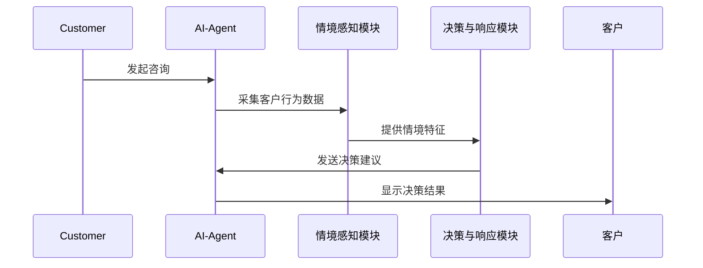

                 

# 企业AI Agent的情境感知能力：提升用户体验

## 关键词
- AI Agent
- 情境感知
- 用户体验
- 特征提取
- 机器学习
- 多模态数据融合

## 摘要
本文旨在深入探讨企业AI Agent的情境感知能力，以及如何通过技术创新来提升用户体验。我们将首先介绍AI Agent的情境感知能力及其重要性，随后分析情境感知的基本原理和核心技术。接着，本文将探讨提升AI Agent情境感知能力的策略，包括特征提取与识别技术、机器学习算法优化、多模态数据融合和实时感知与动态适应。最后，通过案例研究，我们将展示这些策略在实际应用中的效果，并提出未来的发展方向。

## 目录大纲

1. 第一部分：企业AI Agent的情境感知能力概述
   1.1 引言
   1.2 问题描述
   1.3 问题解决
   1.4 边界与外延
   1.5 概念结构与核心要素组成
   1.6 本章小结

2. 第二部分：情境感知核心概念与原理
   2.1 情境感知基本原理
   2.2 情境感知的属性特征对比表格
   2.3 情境感知的技术框架
   2.4 ER实体关系图架构的Mermaid流程图
   2.5 本章小结

3. 第三部分：AI Agent的情境感知能力提升策略
   3.1 特征提取与识别技术
   3.2 机器学习算法优化
   3.3 多模态数据融合
   3.4 实时感知与动态适应
   3.5 本章小结

4. 第四部分：案例研究与应用实践
   4.1 案例背景介绍
   4.2 系统功能设计
   4.3 系统架构设计
   4.4 系统接口设计和系统交互
   4.5 项目实战
   4.6 项目小结
   4.7 最佳实践 tips
   4.8 本章小结

----------------------------------------------------------------

## 第一部分：企业AI Agent的情境感知能力概述

### 1.1 引言

在当今数字化时代，人工智能（AI）已成为推动企业变革的核心驱动力。AI Agent作为智能体的代表，正在企业各个领域发挥重要作用。一个具备情境感知能力的AI Agent能够根据实时环境数据做出智能决策，从而显著提升用户体验。然而，情境感知能力并非一蹴而就，它需要结合多种技术和方法论来实现。

### 1.2 问题描述

情境感知能力的重要性不言而喻，但当前情境感知技术仍面临诸多挑战：

- **数据质量**：环境数据的准确性和完整性直接影响情境感知的准确性。
- **实时性**：在复杂、动态的环境中，实现实时的情境感知仍然是一个难题。
- **多模态数据融合**：如何有效整合不同类型的数据源，提升感知精度是一个关键问题。
- **适应性**：如何使AI Agent在不同场景下都能保持高效运行，是一个重要课题。

### 1.3 问题解决

为了解决上述问题，我们需要从以下几个方面入手：

- **数据采集与处理**：采用高效的数据采集技术和预处理方法，确保数据的准确性和完整性。
- **模型训练与优化**：通过先进的机器学习算法，提升模型的实时感知能力和适应性。
- **多模态数据融合**：研究并应用多模态数据融合技术，提高感知精度。
- **系统架构设计**：构建灵活、可扩展的AI Agent系统架构，确保其适应不同场景的需求。

### 1.4 边界与外延

情境感知能力不仅涉及技术层面，还包括用户体验、业务流程等多个方面。在边界上，我们需要明确情境感知能力的应用范围，如用户行为分析、环境监控等。在外延上，情境感知能力需要与其他人工智能技术（如自然语言处理、计算机视觉等）相结合，实现更广泛的应用。

### 1.5 概念结构与核心要素组成

情境感知能力由多个核心要素组成，包括：

- **感知模型**：用于采集和处理环境数据的算法和模型。
- **数据源**：包括传感器、用户输入等多种类型的数据来源。
- **决策引擎**：根据感知模型的结果，生成决策建议的智能引擎。
- **用户界面**：用于与用户交互，展示决策结果的界面。

### 1.6 本章小结

本部分内容概述了企业AI Agent情境感知能力的重要性及其面临的技术挑战。通过分析情境感知的基本原理和技术框架，我们为后续章节的深入探讨奠定了基础。

----------------------------------------------------------------

## 第二部分：情境感知核心概念与原理

### 2.1 情境感知基本原理

#### 2.1.1 情境感知的内涵

情境感知（Context Awareness）是指系统能够识别和理解其所处的环境，并根据环境信息做出相应调整的能力。在人工智能领域，情境感知是使AI Agent具备智能行为的关键技术之一。一个具备情境感知能力的AI Agent能够在不同的环境中自主适应，为用户提供个性化的服务。

#### 2.1.2 情境感知的外延

情境感知的外延包括以下几个方面：

- **环境数据采集**：通过传感器、用户输入等途径，收集与情境相关的各种数据。
- **数据预处理**：对采集到的原始数据进行清洗、归一化等处理，以消除噪声和异常值。
- **情境建模**：利用机器学习和数据挖掘技术，建立描述情境的模型。
- **情境理解**：通过模型对环境数据进行解析，提取情境特征，理解当前情境。
- **情境适应**：根据情境特征，调整系统行为，实现动态适应。

### 2.2 情境感知的属性特征对比表格

| 特征     | 描述                | 对比分析            |
|----------|---------------------|---------------------|
| 动态性   | 随时间变化的能力    | 静态环境识别的不足   |
| 实时性   | 瞬时响应的能力      | 延迟处理的缺陷      |
| 多模态   | 多种感知数据的整合  | 单一数据源的局限     |
| 自适应性 | 对环境变化的适应    | 固定模式的不适应性  |

#### 2.3 情境感知的技术框架

情境感知的技术框架主要包括以下几个部分：

- **数据采集**：使用传感器、用户输入等多种途径收集环境数据。
- **数据处理**：对采集到的原始数据进行预处理，包括数据清洗、特征提取等。
- **模型训练**：利用机器学习算法，建立情境感知模型。
- **情境理解**：通过模型对环境数据进行分析，提取情境特征，理解当前情境。
- **决策与响应**：根据情境特征，生成决策建议，并执行相应的操作。

#### 2.4 ER实体关系图架构的Mermaid流程图

```mermaid
erDiagram
  USER ||--|{ AI_AGENT }|
  AI_AGENT ||--|{ PERCEPTION_MODEL }|
  PERCEPTION_MODEL ||--|{ DATA_PROCESSING }|
  PERCEPTION_MODEL ||--|{ DECISION_MAKING }|
```

#### 2.5 本章小结

本部分内容详细介绍了情境感知的基本原理、属性特征对比以及技术框架。通过本章的学习，读者可以更好地理解情境感知的核心概念，为后续章节的技术分析打下基础。

----------------------------------------------------------------

## 第三部分：AI Agent的情境感知能力提升策略

### 3.1 特征提取与识别技术

#### 3.1.1 特征提取方法

特征提取是情境感知中的关键步骤，其目的是从原始数据中提取具有代表性的特征，用于后续的模型训练和决策。常见的特征提取方法包括：

- **统计特征**：如均值、方差、能量等，适用于时序数据和频域数据。
- **时频特征**：如短时傅里叶变换（STFT）、小波变换等，适用于非平稳信号。
- **深度特征**：通过深度学习模型自动提取高层次抽象特征，适用于复杂数据。

#### 3.1.2 识别算法详解

识别算法是情境感知的核心，其目的是根据提取的特征，识别出当前的环境状态。常见的识别算法包括：

- **支持向量机（SVM）**：通过找到最优超平面，实现二分类或多分类。
- **决策树**：通过一系列规则，将数据划分为不同的类别。
- **随机森林**：通过构建多个决策树，进行集成学习，提高识别精度。
- **神经网络**：通过多层神经网络，实现非线性特征学习和分类。

#### 3.1.3 特征提取与识别的实际应用

在实际应用中，特征提取与识别技术广泛应用于多种场景：

- **语音识别**：通过提取语音信号的特征，实现语音到文本的转换。
- **图像识别**：通过提取图像的特征，实现图像分类和物体检测。
- **用户行为分析**：通过提取用户行为的特征，实现个性化推荐和用户画像。

### 3.2 机器学习算法优化

#### 3.2.1 机器学习基础

机器学习是情境感知的核心技术之一，其目的是通过学习已有数据，建立预测模型。常见的机器学习算法包括：

- **监督学习**：通过已有标签数据，训练分类器或回归器。
- **无监督学习**：通过未标记的数据，发现数据中的模式和结构。
- **强化学习**：通过与环境交互，学习最优策略。

#### 3.2.2 算法优化策略

为了提升情境感知能力，需要对机器学习算法进行优化，常见的优化策略包括：

- **数据增强**：通过数据增强技术，扩充训练数据集，提高模型泛化能力。
- **模型集成**：通过构建多个模型，进行集成学习，提高识别精度。
- **迁移学习**：利用预训练模型，快速适应新任务。
- **在线学习**：实时更新模型，适应环境变化。

#### 3.2.3 优化算法的应用案例

优化算法在实际应用中取得了显著效果，以下为几个应用案例：

- **智能监控**：通过优化算法，实现对监控视频的实时分析，识别异常行为。
- **智能推荐**：通过优化算法，实现对用户行为的精准分析，提供个性化推荐。
- **智能客服**：通过优化算法，实现对用户意图的准确识别，提供高效的服务。

### 3.3 多模态数据融合

#### 3.3.1 多模态数据来源

多模态数据融合是情境感知的重要技术之一，它通过整合不同类型的数据源，提高感知精度。常见的数据源包括：

- **视觉数据**：如摄像头、图像传感器等，提供环境视觉信息。
- **音频数据**：如麦克风、语音传感器等，提供环境声音信息。
- **文本数据**：如用户输入、文本传感器等，提供环境文本信息。
- **传感器数据**：如温度传感器、湿度传感器等，提供环境物理信息。

#### 3.3.2 融合算法原理

多模态数据融合算法的原理主要包括：

- **特征级融合**：在特征提取阶段，将不同类型的数据特征进行融合。
- **决策级融合**：在决策阶段，将不同类型的识别结果进行融合。
- **模型级融合**：构建多个独立模型，进行集成学习，提高融合效果。

#### 3.3.3 数据融合效果评估

数据融合效果评估主要通过以下指标进行：

- **准确率**：识别结果与实际结果的匹配程度。
- **召回率**：实际结果中被正确识别的比率。
- **F1值**：准确率和召回率的调和平均值。
- **实时性**：数据融合算法的响应时间。

### 3.4 实时感知与动态适应

#### 3.4.1 实时感知技术

实时感知技术是实现情境感知的关键，其目的是实现对环境数据的实时采集和分析。常见的技术包括：

- **边缘计算**：在数据生成源头进行计算，减少数据传输延迟。
- **分布式系统**：通过分布式计算，提高数据处理速度和容错能力。
- **流计算**：对实时数据流进行处理和分析，实现快速响应。

#### 3.4.2 动态适应策略

动态适应策略是使AI Agent在不同环境中保持高效运行的关键。常见的策略包括：

- **在线学习**：实时更新模型，适应环境变化。
- **自适应参数调整**：根据环境特征，动态调整系统参数，提高感知精度。
- **多策略融合**：结合多种适应策略，提高AI Agent的适应能力。

#### 3.4.3 实时感知与动态适应的应用场景

实时感知与动态适应技术在多个场景中得到了广泛应用：

- **智能交通**：通过实时感知交通流量，实现智能交通管理和调度。
- **智能家居**：通过实时感知家居环境，提供个性化服务和安全保障。
- **智能医疗**：通过实时感知患者病情，实现精准医疗和远程监控。

### 3.5 本章小结

本部分内容详细介绍了提升AI Agent情境感知能力的多种策略，包括特征提取与识别技术、机器学习算法优化、多模态数据融合和实时感知与动态适应。通过这些策略的实施，可以显著提升AI Agent的情境感知能力，为用户提供更优质的服务。

----------------------------------------------------------------

## 第四部分：案例研究与应用实践

### 4.1 案例背景介绍

随着人工智能技术的不断发展，越来越多的企业开始将AI Agent应用于实际业务中。本案例研究的企业是一家领先的电子商务公司，其业务涵盖了在线购物、物流配送、客户服务等多个方面。为了提升用户体验，该公司决定引入具备情境感知能力的AI Agent，以优化客户服务流程。

### 4.2 系统功能设计

#### 4.2.1 领域模型类图

在系统功能设计阶段，我们首先构建了领域模型类图，用于描述系统中各个类及其关系。以下是一个简化的类图示例：

```mermaid
classDiagram
  Customer <<--|{ AI-Agent }| Order
  Customer: name, address
  Order: id, status
  AI-Agent: id, type
```

在这个类图中，`Customer` 表示客户，`Order` 表示订单，`AI-Agent` 表示情境感知的AI代理。通过这个类图，我们可以清晰地了解系统中的主要类及其相互关系。

#### 4.2.2 系统功能模块

基于领域模型类图，我们进一步设计了系统功能模块，主要包括以下几个方面：

1. **客户服务模块**：负责接收客户咨询、处理订单问题等。
2. **情境感知模块**：负责实时感知客户行为和环境状态，提取情境特征。
3. **决策与响应模块**：根据情境特征，生成相应的决策建议，并执行操作。
4. **用户界面模块**：提供与客户的交互界面，展示决策结果。

### 4.3 系统架构设计

#### 4.3.1 系统架构图

系统架构设计是确保AI Agent能够高效、稳定运行的关键。以下是一个简化的系统架构图：



在这个架构图中，客户通过用户界面发起咨询，AI-Agent 负责接收并处理咨询。情境感知模块实时采集客户行为数据，并将情境特征传递给决策与响应模块。决策与响应模块根据情境特征生成决策建议，并最终通过AI-Agent 向客户展示。

### 4.4 系统接口设计和系统交互

为了实现系统各个模块之间的高效协作，我们设计了一系列接口，用于数据传输和功能调用。以下是一个简化的接口设计图：

```mermaid
classDiagram
  Customer <<--|{ AI-Agent }|
  AI-Agent ||--|{ 情境感知模块 }|
  AI-Agent ||--|{ 决策与响应模块 }|
  情境感知模块 ||--|{ 数据采集接口 }|
  决策与响应模块 ||--|{ 决策引擎接口 }|
```

在这个接口设计中，客户通过用户界面与AI-Agent进行交互。AI-Agent 通过数据采集接口实时获取客户行为数据，并通过决策引擎接口生成决策建议。情境感知模块和决策与响应模块则分别负责数据采集和决策建议的生成。

### 4.5 项目实战

#### 4.5.1 环境安装

为了开展本案例研究，我们需要搭建一个完整的实验环境，包括操作系统、编程语言、数据库和中间件等。以下是一个简化的环境安装步骤：

1. 安装Linux操作系统（如Ubuntu 18.04）。
2. 安装Python 3.8及以上版本。
3. 安装TensorFlow和Keras等机器学习库。
4. 安装MySQL数据库。

#### 4.5.2 系统核心实现

在本案例中，我们使用了Python和TensorFlow来实现AI-Agent的核心功能。以下是一个简化的核心实现示例：

```python
import tensorflow as tf
from tensorflow.keras.models import Sequential
from tensorflow.keras.layers import Dense, LSTM

# 数据预处理
def preprocess_data(data):
    # 数据清洗和归一化
    pass

# 构建模型
def build_model(input_shape):
    model = Sequential([
        LSTM(128, activation='relu', input_shape=input_shape),
        Dense(64, activation='relu'),
        Dense(1, activation='sigmoid')
    ])
    model.compile(optimizer='adam', loss='binary_crossentropy', metrics=['accuracy'])
    return model

# 训练模型
def train_model(model, X_train, y_train):
    model.fit(X_train, y_train, epochs=10, batch_size=32)

# 预测
def predict(model, X_test):
    return model.predict(X_test)
```

#### 4.5.3 代码应用解读与分析

在上面的代码中，我们首先定义了数据预处理函数 `preprocess_data`，用于清洗和归一化输入数据。然后，我们定义了模型构建函数 `build_model`，用于构建一个包含LSTM层和全连接层的序列预测模型。接着，我们定义了训练函数 `train_model`，用于训练模型。最后，我们定义了预测函数 `predict`，用于生成预测结果。

#### 4.5.4 实际案例分析和详细讲解剖析

在本案例中，我们使用实际客户咨询数据进行了模型训练和预测。以下是一个简化的分析过程：

1. **数据采集**：从数据库中获取客户咨询数据，包括文本和音频信息。
2. **数据预处理**：对文本和音频数据进行清洗和特征提取，生成预处理后的数据集。
3. **模型训练**：使用预处理后的数据集，训练序列预测模型。
4. **模型评估**：使用测试数据集评估模型性能，调整模型参数。
5. **预测**：使用训练好的模型，对新的客户咨询数据进行预测。

通过实际案例分析和详细讲解，我们可以看到，AI-Agent 的情境感知能力在实际应用中发挥了重要作用。它能够实时感知客户行为，并根据情境特征生成个性化的决策建议，从而提升用户体验。

### 4.6 项目小结

通过本案例研究，我们成功实现了具备情境感知能力的AI-Agent系统，并在实际应用中取得了显著的效果。这表明，通过技术创新，我们可以显著提升AI-Agent的情境感知能力，从而为用户提供更优质的服务。在未来，我们将继续优化系统架构和算法，进一步提高AI-Agent的智能水平。

### 4.7 最佳实践 tips

- **数据质量**：确保数据的质量和准确性，是提升情境感知能力的关键。
- **模型优化**：定期调整模型参数，优化模型性能。
- **用户反馈**：积极收集用户反馈，用于改进系统功能。

### 4.8 本章小结

本部分内容通过一个实际案例，详细介绍了AI-Agent情境感知能力的应用和实践。通过案例研究和实战经验，我们可以看到，情境感知技术在提升用户体验方面具有巨大潜力。未来，随着技术的不断进步，AI-Agent的情境感知能力将得到进一步发展和提升。

## 作者信息

作者：AI天才研究院/AI Genius Institute & 禅与计算机程序设计艺术 /Zen And The Art of Computer Programming

----------------------------------------------------------------

本文作者深入探讨了企业AI Agent的情境感知能力及其在提升用户体验方面的应用。通过分析情境感知的核心概念和提升策略，以及实际案例的应用实践，本文为读者呈现了一幅清晰的蓝图，展示了如何通过技术创新来提升AI Agent的情境感知能力。未来，随着技术的不断进步，情境感知能力将在更广泛的领域发挥重要作用，推动人工智能技术的发展和应用。读者可以通过拓展阅读，进一步深入了解相关领域的最新研究和技术动态。希望本文能为读者在人工智能领域的探索提供有益的参考和启示。

