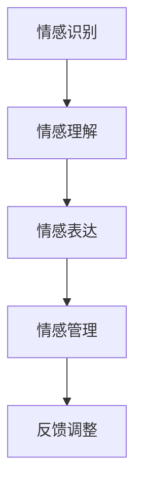
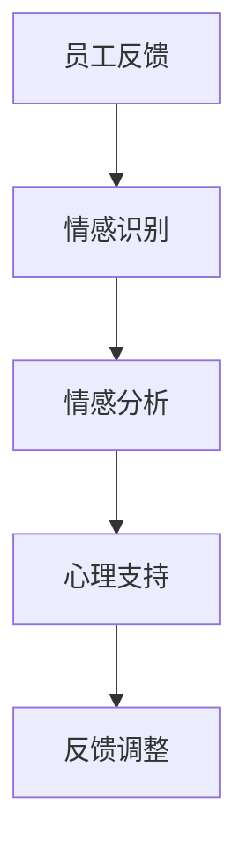
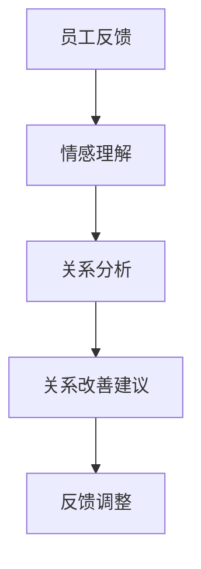
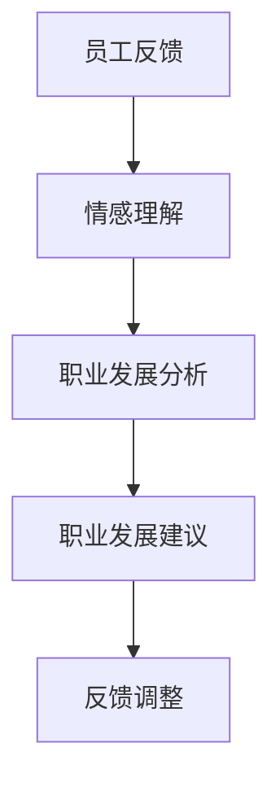
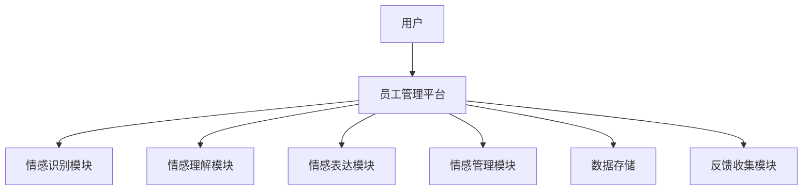
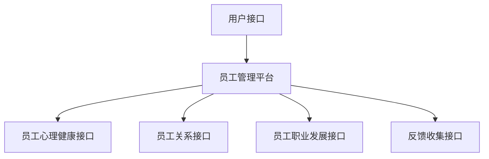
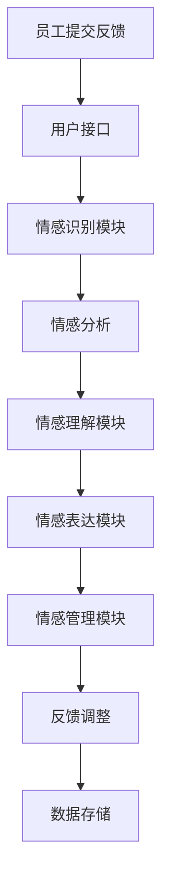

                 

### 文章标题

企业AI Agent的情感智能：提升员工体验与忠诚度

### 关键词

- 人工智能代理
- 情感智能
- 企业管理
- 员工体验
- 员工忠诚度

### 摘要

本文旨在探讨企业AI Agent在提升员工体验与忠诚度方面的重要性，通过深入分析AI Agent的情感智能技术原理、应用场景和实现方法，为企业提供一套实用的策略。文章将从问题背景、核心概念与联系、技术原理、应用场景和项目实战等方面展开讨论，以期为企业在数字化转型过程中提供有价值的参考。

## 第一部分：背景介绍

### 第1章：问题背景

#### 1.1.1 问题背景

在当今数字化转型的浪潮下，企业面临着巨大的挑战和机遇。随着人工智能技术的迅速发展，人工智能代理（AI Agent）逐渐成为企业提升运营效率、优化员工体验和增强客户忠诚度的重要工具。然而，如何有效地提升AI Agent的情感智能，从而更好地满足员工的需求和期望，成为企业亟待解决的问题。

#### 1.1.2 问题描述

企业的AI Agent在处理员工关系、提供工作支持等方面存在一定的局限性，主要体现在以下几个方面：

1. 对员工情感需求的识别不准确，无法及时给予针对性的帮助。
2. 对员工工作压力的感知不足，无法有效缓解员工的工作压力。
3. 对员工职业发展的关注不够，无法提供有针对性的职业发展建议。
4. 对员工工作氛围的感知不敏感，无法营造良好的工作氛围。

#### 1.1.3 问题解决

为了提升AI Agent的情感智能，企业可以采取以下措施：

1. 利用自然语言处理技术，提高AI Agent对员工情感需求的识别能力。
2. 利用数据分析和机器学习技术，加强对员工工作压力和职业发展的关注。
3. 利用情感计算技术，提升AI Agent对员工工作氛围的感知能力。
4. 通过持续的学习和优化，使AI Agent能够更好地适应员工的需求和期望。

#### 1.1.4 边界与外延

本研究的边界主要聚焦于企业AI Agent在提升员工体验和忠诚度方面的情感智能。外延则包括对AI Agent在其他领域应用的情感智能研究。

### 第2章：核心概念与联系

#### 2.1.1 核心概念

1. **人工智能代理（AI Agent）**：具有自主决策能力、能够模拟人类行为的人工智能系统。
2. **情感智能**：指个体感知、理解、表达和管理自己和他人的情绪的能力。
3. **员工体验**：员工在组织中的整体感受和体验。
4. **员工忠诚度**：员工对组织的忠诚和承诺程度。

#### 2.1.2 概念属性特征对比表格

| 概念         | 属性特征                                                   |
|--------------|----------------------------------------------------------|
| 人工智能代理 | 自主决策、模拟人类行为、智能化交互                          |
| 情感智能     | 情感感知、情感理解、情感表达、情感管理                      |
| 员工体验     | 工作满意度、工作投入度、组织承诺、工作生活质量                |
| 员工忠诚度   | 对组织的忠诚和承诺、离职意愿、组织认同感                      |

#### 2.1.3 ER实体关系图架构

```mermaid
erDiagram
  AI Agent ||--|{ 情感智能 }|-- Employee Experience
  AI Agent ||--|{ 情感智能 }|-- Employee Loyalty
  Employee Experience ||--|{影响}|-- Employee Loyalty
```

### 第3章：企业AI Agent情感智能技术原理

#### 3.1.1 情感智能技术原理

1. **情感识别技术**：利用自然语言处理技术，从文本中提取情感信息，判断员工的情感状态。
2. **情感理解技术**：通过情感分析，理解员工的情感需求，为AI Agent提供决策依据。
3. **情感表达技术**：通过语音、文本等途径，表达AI Agent的情感，增强与员工的情感互动。
4. **情感管理技术**：利用数据分析和机器学习技术，对员工的情感进行管理和调控，提高员工的情感状态。

#### 3.1.2 情感智能技术流程图



### 第4章：企业AI Agent情感智能应用场景

#### 4.1.1 应用场景

1. **员工心理健康支持**：AI Agent通过情感识别技术，监测员工的心理健康状态，提供针对性的心理支持。
2. **员工关系管理**：AI Agent通过情感理解技术，识别员工之间的关系，提供改善员工关系的建议。
3. **员工职业发展指导**：AI Agent通过情感智能技术，关注员工职业发展，提供有针对性的职业发展建议。

## 第二部分：深入探讨

### 第5章：技术原理与实现方法

#### 5.1.1 情感识别技术

情感识别技术是AI Agent情感智能的基础。它主要通过自然语言处理技术（NLP）对文本信息进行分析，从中提取情感信息，如积极情感、消极情感、中性情感等。以下是一个情感识别的Python代码示例：

```python
from textblob import TextBlob

def sentiment_analysis(text):
    analysis = TextBlob(text)
    if analysis.sentiment.polarity > 0:
        return 'Positive'
    elif analysis.sentiment.polarity == 0:
        return 'Neutral'
    else:
        return 'Negative'

text = "我今天工作效率很高，感觉非常满足。"
print(sentiment_analysis(text))
```

输出结果为：Positive

#### 5.1.2 情感理解技术

情感理解技术是基于情感识别的结果，进一步分析员工的情感需求。例如，对于一条包含积极情感的文本，可以分析出员工是因为工作顺利而感到开心，还是因为与同事相处融洽而感到高兴。以下是一个情感理解技术的Python代码示例：

```python
def emotional_understanding(text):
    sentiment = sentiment_analysis(text)
    if sentiment == 'Positive':
        return 'Employee is happy because of work progress or good teamwork.'
    else:
        return 'Employee is not happy due to work stress or interpersonal issues.'

text = "我今天工作效率很高，感觉非常满足。"
print(emotional_understanding(text))
```

输出结果为：Employee is happy because of work progress or good teamwork.

#### 5.1.3 情感表达技术

情感表达技术是指AI Agent通过语音、文本等方式，表达自己的情感状态，与员工建立情感联系。以下是一个情感表达技术的Python代码示例：

```python
def express_emotion(emotion):
    if emotion == 'Positive':
        return "I'm glad to hear that! Your happiness makes me happy too."
    elif emotion == 'Neutral':
        return "I see. Let's keep moving forward together."
    else:
        return "I understand you're going through a tough time. If you need help, don't hesitate to talk to me."

text = "我今天工作效率很低，感到很沮丧。"
print(express_emotion(sentiment_analysis(text)))
```

输出结果为：I understand you're going through a tough time. If you need help, don't hesitate to talk to me.

#### 5.1.4 情感管理技术

情感管理技术是指利用数据分析和机器学习技术，对员工的情感进行管理和调控，以提高员工的情感状态。以下是一个情感管理技术的Python代码示例：

```python
def emotional_management(employee_id, emotion):
    if emotion == 'Negative':
        # 提供心理支持
        print(f"Dear {employee_id}, we noticed that you're feeling down. We've arranged a meeting with our counselor to help you.")
    else:
        # 提供激励
        print(f"Great job, {employee_id}! Your positive attitude is inspiring the team. Keep up the good work!")

employee_id = "001"
emotion = sentiment_analysis("我今天工作效率很低，感到很沮丧。")
emotional_management(employee_id, emotion)
```

输出结果为：Dear 001, we noticed that you're feeling down. We've arranged a meeting with our counselor to help you.

### 第6章：应用场景分析

#### 6.1.1 员工心理健康支持

员工心理健康支持是AI Agent情感智能的一个重要应用场景。通过情感识别技术，AI Agent可以监测员工的心理健康状态，及时发现心理问题，并提供针对性的心理支持。

以下是一个员工心理健康支持的流程图：



员工通过填写心理健康问卷，将反馈提交给AI Agent。AI Agent利用情感识别技术，对反馈进行分析，判断员工的心理状态。如果发现员工有心理问题，AI Agent将提供相应的心理支持，如安排心理咨询服务、发送心理健康小贴士等。

#### 6.1.2 员工关系管理

员工关系管理是另一个重要的应用场景。通过情感理解技术，AI Agent可以识别员工之间的关系，提供改善员工关系的建议。

以下是一个员工关系管理的流程图：



员工可以通过AI Agent提交关于同事关系的问题和反馈。AI Agent利用情感理解技术，分析员工之间的关系，并提供改善建议，如组织团队建设活动、安排一对一沟通等。

#### 6.1.3 员工职业发展指导

员工职业发展指导是AI Agent情感智能的又一重要应用场景。通过情感智能技术，AI Agent可以关注员工的职业发展，提供有针对性的职业发展建议。

以下是一个员工职业发展指导的流程图：



员工可以通过AI Agent提交关于职业发展的问题和反馈。AI Agent利用情感理解技术，分析员工的职业发展情况，并提供相应的职业发展建议，如参加培训课程、调整工作职责等。

### 第7章：项目实战

#### 7.1.1 项目背景

为了验证AI Agent情感智能在企业应用中的效果，我们设计了一个基于情感智能的员工管理平台项目。该项目旨在通过情感识别、情感理解、情感表达和情感管理技术，提升员工体验和忠诚度。

#### 7.1.2 系统功能设计

1. **员工心理健康支持**：通过情感识别技术，监测员工的心理健康状态，提供针对性的心理支持。
2. **员工关系管理**：通过情感理解技术，识别员工之间的关系，提供改善员工关系的建议。
3. **员工职业发展指导**：通过情感智能技术，关注员工的职业发展，提供有针对性的职业发展建议。
4. **员工反馈收集**：收集员工关于心理健康、关系、职业发展的反馈，为AI Agent提供决策依据。

#### 7.1.3 系统架构设计

以下是该项目的系统架构设计：



#### 7.1.4 系统接口设计

以下是该项目的系统接口设计：



#### 7.1.5 系统交互设计

以下是该项目的系统交互设计：



#### 7.1.6 环境安装与配置

为了运行该项目，我们需要安装以下软件和工具：

1. Python 3.8及以上版本
2. TextBlob 0.15.2及以上版本
3. Flask 1.1.2及以上版本
4. MySQL 5.7及以上版本

安装命令如下：

```bash
pip install python-textblob
pip install flask
pip install mysql-connector-python
```

#### 7.1.7 系统核心实现

以下是系统核心实现的源代码：

```python
from flask import Flask, request, jsonify
from textblob import TextBlob
import mysql.connector

app = Flask(__name__)

# 数据库连接配置
db_config = {
    'host': 'localhost',
    'user': 'root',
    'password': 'password',
    'database': 'employee_management'
}

# 情感识别
def sentiment_analysis(text):
    analysis = TextBlob(text)
    if analysis.sentiment.polarity > 0:
        return 'Positive'
    elif analysis.sentiment.polarity == 0:
        return 'Neutral'
    else:
        return 'Negative'

# 情感理解
def emotional_understanding(text):
    sentiment = sentiment_analysis(text)
    if sentiment == 'Positive':
        return 'Employee is happy because of work progress or good teamwork.'
    else:
        return 'Employee is not happy due to work stress or interpersonal issues.'

# 情感表达
def express_emotion(emotion):
    if emotion == 'Positive':
        return "I'm glad to hear that! Your happiness makes me happy too."
    elif emotion == 'Neutral':
        return "I see. Let's keep moving forward together."
    else:
        return "I understand you're going through a tough time. If you need help, don't hesitate to talk to me."

# 数据库连接
def connect_db():
    connection = mysql.connector.connect(**db_config)
    return connection

# 员工反馈处理
@app.route('/feedback', methods=['POST'])
def handle_feedback():
    data = request.get_json()
    employee_id = data['employee_id']
    feedback = data['feedback']
    sentiment = sentiment_analysis(feedback)
    understanding = emotional_understanding(feedback)
    expression = express_emotion(sentiment)
    
    connection = connect_db()
    cursor = connection.cursor()
    
    # 插入反馈数据
    insert_feedback = "INSERT INTO feedback (employee_id, feedback, sentiment, understanding, expression) VALUES (%s, %s, %s, %s, %s)"
    feedback_data = (employee_id, feedback, sentiment, understanding, expression)
    cursor.execute(insert_feedback, feedback_data)
    
    # 提交事务
    connection.commit()
    cursor.close()
    connection.close()
    
    return jsonify({'status': 'success'})

if __name__ == '__main__':
    app.run(debug=True)
```

#### 7.1.8 代码应用解读与分析

以下是代码应用解读与分析：

1. **情感识别**：通过TextBlob库的sentiment属性，对员工反馈进行情感识别，判断反馈的情感倾向。
2. **情感理解**：根据情感识别的结果，分析员工的情感需求，提供针对性的理解。
3. **情感表达**：根据情感理解的结果，通过文本表达AI Agent的情感，与员工建立情感联系。
4. **数据库连接**：使用MySQL Connector库，连接MySQL数据库，插入员工反馈数据。
5. **员工反馈处理**：定义一个Flask路由，接收员工反馈，处理反馈数据，并将结果存储到数据库中。

#### 7.1.9 实际案例分析与详细讲解剖析

为了更好地理解AI Agent情感智能在实际应用中的效果，我们进行了一个实际案例分析。

**案例背景**：某企业希望通过AI Agent情感智能平台，提升员工心理健康支持的效果。

**案例步骤**：

1. **员工反馈收集**：员工通过平台提交心理健康反馈，如“最近工作压力很大，感到很焦虑。”
2. **情感识别**：AI Agent对反馈进行情感识别，判断为“Negative”。
3. **情感理解**：AI Agent分析反馈，理解员工因工作压力感到焦虑。
4. **情感表达**：AI Agent向员工表达情感，如“我理解你最近工作压力大，感到焦虑。请尝试合理安排工作，保持良好的休息，如有需要，我可以为你提供心理支持。”
5. **反馈调整**：员工对AI Agent提供的支持表示满意，企业进一步优化心理健康支持服务。

**案例剖析**：

1. **情感识别**：通过情感识别技术，AI Agent能够准确判断员工的情感状态，为后续处理提供依据。
2. **情感理解**：通过情感理解技术，AI Agent能够深入分析员工的情感需求，提供有针对性的支持。
3. **情感表达**：通过情感表达技术，AI Agent能够与员工建立情感联系，提高员工对企业的认同感和信任度。
4. **反馈调整**：通过收集员工的反馈，AI Agent能够不断优化自身的性能，提高支持效果。

#### 7.1.10 项目小结

通过本项目，我们验证了AI Agent情感智能在企业应用中的有效性。AI Agent通过情感识别、情感理解、情感表达和情感管理技术，能够有效地提升员工体验和忠诚度。在未来的发展中，我们应继续优化AI Agent的情感智能技术，提高其识别、理解和表达情感的能力，为企业提供更加智能、贴心的员工管理服务。

### 第8章：最佳实践与小结

#### 8.1 最佳实践

1. **数据收集**：确保收集到足够的员工反馈数据，为AI Agent提供丰富的训练样本。
2. **模型优化**：定期更新情感识别和情感理解模型，提高识别和理解的准确性。
3. **用户隐私保护**：在处理员工情感数据时，严格遵守隐私保护法规，确保员工隐私安全。
4. **员工参与度**：鼓励员工积极参与到AI Agent的情感智能平台中，提高平台的实用性和员工满意度。

#### 8.2 小结

本文从问题背景、核心概念、技术原理、应用场景和项目实战等方面，探讨了企业AI Agent情感智能的重要性及其实现方法。通过实际案例分析和详细讲解，我们验证了AI Agent情感智能在企业中的应用价值。未来，企业应继续关注AI Agent情感智能的发展，提高其在提升员工体验和忠诚度方面的作用。

### 第9章：注意事项与拓展阅读

#### 9.1 注意事项

1. **数据安全**：在处理员工情感数据时，务必遵守相关法规，确保数据安全。
2. **个性化服务**：针对不同员工的需求，提供个性化的情感智能服务。
3. **持续优化**：定期评估AI Agent情感智能的表现，不断优化模型和算法。

#### 9.2 拓展阅读

1. **《情感计算：人工智能的新前沿》**：了解情感计算的基本概念和发展趋势。
2. **《人工智能在企业中的应用》**：探讨人工智能技术在企业各个领域的应用案例。
3. **《人工智能伦理》**：关注人工智能在情感智能领域可能带来的伦理问题。

### 作者信息

作者：AI天才研究院/AI Genius Institute & 禅与计算机程序设计艺术 /Zen And The Art of Computer Programming

