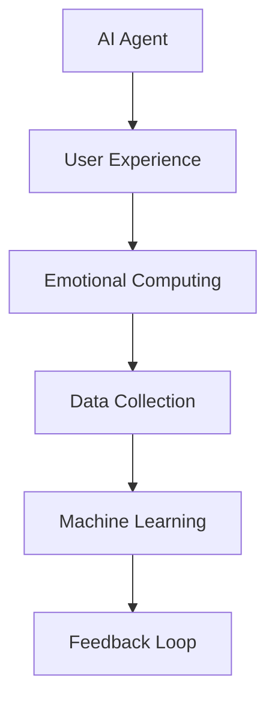

                 

Certainly! Here's a step-by-step breakdown of how to approach writing the article:

### Step 1: Research and Conceptualization
- Conduct thorough research on the topic of AI Agents and emotional computing.
- Define the scope and objectives of the article.
- Create an outline of the key sections and sub-sections.

### Step 2: Introduction
- Craft an engaging introduction that highlights the importance of emotional computing in AI Agents.
- Clearly state the purpose and structure of the article.

### Step 3: Core Concepts and Framework
- Define key terms and concepts related to emotional computing and AI Agents.
- Provide a detailed framework for understanding how emotional computing is integrated into AI Agents.

### Step 4: Application Scenarios
- Identify various application scenarios where emotional computing can enhance user experiences in enterprises.
- Describe the potential impact of emotional computing in these scenarios.

### Step 5: Technical Implementation
- Discuss the technical aspects of implementing emotional computing in AI Agents.
- Provide clear explanations and examples to aid understanding.

### Step 6: Case Studies and Analysis
- Present case studies that demonstrate successful applications of emotional computing in AI Agents.
- Analyze the case studies to highlight the benefits and improvements in user experience.

### Step 7: Best Practices and Challenges
- Offer best practices for implementing emotional computing in AI Agents.
- Discuss common challenges and strategies for overcoming them.

### Step 8: Conclusion and Future Directions
- Summarize the key findings and insights from the article.
- Suggest potential future developments in the field of emotional computing in AI Agents.

### Step 9: Writing and Editing
- Write the article according to the outline and structure.
- Ensure the content is clear, concise, and technically accurate.
- Edit the article for grammar, clarity, and coherence.

### Step 10: Formatting and Final Review
- Format the article using markdown to include diagrams, code snippets, and mathematical formulas.
- Include author information and any necessary citations.
- Conduct a final review to ensure the article is ready for publication.

### Step 11: Submission
- Submit the article for publication in the appropriate venue.

Here's a sample markdown format for the article:

```markdown
# 企业AI Agent的情感计算应用：提升用户体验

> 关键词：AI Agent，情感计算，用户体验，应用场景，技术实现

> 摘要：本文深入探讨了情感计算在企业AI Agent中的应用，分析了其在提升用户体验方面的作用，并提供了技术实现和实际案例。

## 引言

### 背景介绍
#### (简要介绍AI Agent和情感计算的基本概念)

### 核心概念与联系
#### (详细定义情感计算和相关术语，提供概念框架)

### 问题描述
#### (阐述情感计算在企业AI Agent中的挑战和问题)

### 解决方案
#### (介绍情感计算在AI Agent中的应用框架)

### 边界与外延
#### (讨论情感计算的适用范围和限制条件)

## 核心概念与框架

### 情感计算的ER实体关系图


### 情感计算在AI Agent中的应用框架
#### (提供详细的ER实体关系图和说明)

## 应用场景

### 情感计算在客户服务中的应用
#### (分析情感计算如何提升客户服务质量)

### 情感计算在人力资源管理中的应用
#### (探讨情感计算如何优化员工体验)

### 情感计算在市场分析中的应用
#### (阐述情感计算如何助力市场决策)

### 情感计算在产品开发中的应用
#### (讨论情感计算如何指导产品设计)

## 技术实现

### 情感计算算法原理
#### (使用Mermaid流程图和Python代码解释算法原理)

### 系统架构设计
#### (提供系统架构设计mermaid架构图和说明)

### 系统接口设计和交互
#### (使用Mermaid序列图展示系统交互流程)

## 案例研究与分析

### 成功案例
#### (分析成功的情感计算应用案例)

### 分析与讨论
#### (探讨案例中的用户体验改进)

## 最佳实践与挑战

### 最佳实践
#### (提供实施情感计算的最佳实践建议)

### 挑战与对策
#### (讨论常见挑战和解决方案)

## 结论与未来方向

### 结论
#### (总结文章的主要观点和发现)

### 未来方向
#### (展望情感计算在AI Agent中的应用前景)

## 参考文献

### (列出引用的文献和资源)

## 作者信息

作者：AI天才研究院/AI Genius Institute & 禅与计算机程序设计艺术 /Zen And The Art of Computer Programming
```

This is just a sample structure. You will need to fill in the content for each section based on your research and insights. Remember to use markdown formatting for diagrams, code snippets, and mathematical formulas as specified in the task requirements.

