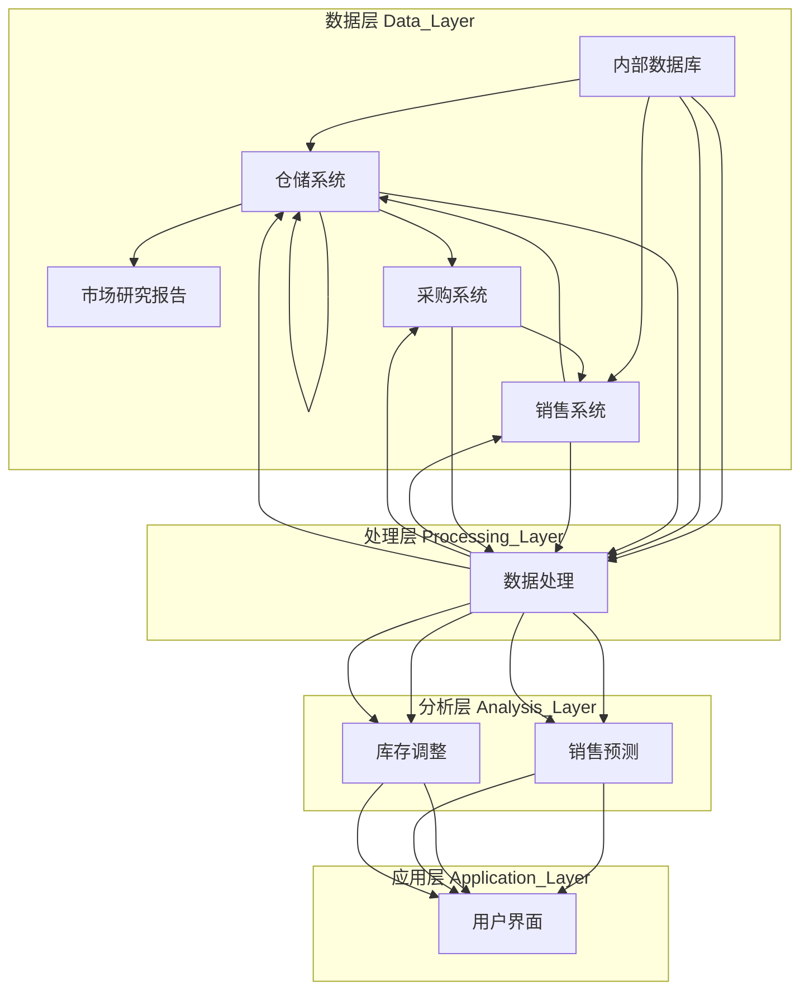
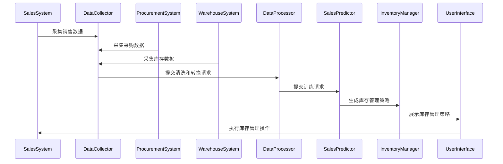

                 

### 企业AI Agent的持续学习与更新机制

随着人工智能技术的快速发展，企业AI Agent作为一种新兴的智能体，正在逐渐成为企业智能化转型的关键力量。企业AI Agent不仅能够帮助企业实现自动化和智能化的决策，还能通过对大量数据的分析和学习，提供有价值的业务洞察和预测。然而，为了保持其高效率和准确性，企业AI Agent需要具备持续学习和更新机制，以适应不断变化的外部环境和业务需求。

本文将深入探讨企业AI Agent的持续学习与更新机制，通过以下几个关键部分来展开讨论：

1. **核心概念与联系**：介绍企业AI Agent、持续学习和更新机制的基本概念，并分析它们之间的联系。
2. **算法原理讲解**：详细阐述企业AI Agent持续学习与更新机制的算法原理，包括数据获取与处理、模型更新和学习效率与效果优化。
3. **系统分析与架构设计方案**：分析企业AI Agent的典型应用场景，介绍系统功能设计、系统架构设计和系统接口设计。
4. **项目实战**：通过一个实际项目来展示企业AI Agent的持续学习与更新机制的实现和应用。
5. **最佳实践与技巧**：总结企业AI Agent持续学习与更新机制的最佳实践和技巧，为实际应用提供指导。

### 第一部分：背景介绍

#### 1.1 问题背景

随着大数据、云计算和人工智能等技术的迅猛发展，企业面临着前所未有的数据量和计算能力。为了从海量数据中提取有价值的信息，企业开始积极探索人工智能技术，并将其应用于各个业务领域。企业AI Agent作为人工智能技术的一种应用形式，逐渐成为企业智能化转型的关键推动力。

企业AI Agent具有自适应性和智能化特征，能够根据业务需求和环境变化，自动调整其行为和决策策略。通过持续学习和更新，企业AI Agent可以不断提高其业务理解和预测能力，为企业提供更加精准和高效的决策支持。

然而，在实际应用过程中，企业AI Agent面临着一些关键挑战，其中之一就是持续学习和更新机制的问题。持续学习和更新机制不仅关系到企业AI Agent的效能和准确性，也直接影响到其在不断变化的环境中的适应能力和长期发展。

首先，企业AI Agent需要从多种数据源获取新的数据，并对其进行处理和分析，以更新其知识库和模型。其次，企业AI Agent需要采用有效的算法和策略，对模型进行动态更新，以适应新的环境和业务需求。此外，企业AI Agent还需要在保证学习效果的同时，提高学习效率，降低学习成本。

#### 1.2 问题描述

企业AI Agent的持续学习与更新机制主要包括以下几个方面的问题：

1. **数据获取与处理**：如何获取和整合外部数据源，确保AI Agent的学习数据质量。
2. **模型更新**：如何对AI Agent的模型进行动态更新，以适应不断变化的环境。
3. **学习效率与效果**：如何在保证学习效果的同时，提高学习效率，降低学习成本。
4. **安全性与隐私保护**：如何保障AI Agent在学习过程中的数据安全和用户隐私。

这些问题不仅涉及到技术层面的实现，还涉及到业务战略、数据管理和用户信任等多个方面。因此，解决这些问题对于企业AI Agent的实际应用和持续发展具有重要意义。

#### 1.3 问题解决

为了解决上述问题，本文将介绍以下核心内容：

1. **核心概念与原理**：阐述企业AI Agent的持续学习与更新机制的基本概念和原理。
2. **技术架构**：分析企业AI Agent的持续学习与更新机制的技术架构，包括数据获取与处理、模型更新、学习效率与效果优化等方面的技术。
3. **案例分析**：通过实际案例，展示企业AI Agent的持续学习与更新机制在现实场景中的应用，以及取得的成果。
4. **最佳实践与技巧**：总结企业AI Agent的持续学习与更新机制的最佳实践和技巧，帮助读者在实际应用中更好地实施和优化。

通过以上内容的介绍，本文旨在为企业AI Agent的持续学习和更新提供理论指导和技术支持，帮助企业在智能化转型过程中，充分发挥人工智能技术的价值。

#### 1.4 边界与外延

1. **边界**：本文主要关注企业AI Agent的持续学习与更新机制，不包括AI Agent的其他应用领域，如自动化、智能制造等。同时，本文的重点是技术实现和机制设计，而非具体的业务应用和场景。
2. **外延**：企业AI Agent的持续学习与更新机制可以应用于各种企业场景，如金融、医疗、零售等。本文将结合实际案例，探讨这些场景中的具体应用和实践。

#### 1.5 概念结构与核心要素组成

1. **核心概念**：
   - 企业AI Agent：具有自适应性和智能化特征，能够帮助企业完成特定任务的智能系统。
   - 持续学习：AI Agent在运行过程中，不断从新的数据中学习，以提高其性能和适应能力。
   - 更新机制：AI Agent在模型更新过程中，采用的一系列技术和方法，以确保模型在新的环境中的有效性和可靠性。
2. **核心要素**：
   - 数据获取与处理：获取和整合外部数据源，确保AI Agent的学习数据质量。
   - 模型更新：对AI Agent的模型进行动态更新，以适应不断变化的环境。
   - 学习效率与效果优化：在保证学习效果的同时，提高学习效率，降低学习成本。
   - 安全性与隐私保护：保障AI Agent在学习过程中的数据安全和用户隐私。

通过以上核心概念和要素的介绍，本文旨在为企业AI Agent的持续学习和更新提供一个全面而系统的理论框架，为后续章节的深入探讨奠定基础。

### 第二部分：核心概念与联系

在深入探讨企业AI Agent的持续学习与更新机制之前，有必要首先明确几个核心概念，并分析它们之间的联系。以下是企业AI Agent、持续学习和更新机制的基本概念及其相互关系。

#### 2.1 企业AI Agent的概念

企业AI Agent是指一种具有自适应性和智能化特征，能够帮助企业完成特定任务的智能系统。它基于人工智能技术，通过对大量数据的分析和学习，能够自动识别业务模式、预测未来趋势，并为企业提供决策支持。企业AI Agent的核心特征包括：

- **自主性**：能够独立完成特定任务，无需人工干预。
- **适应性**：能够根据环境变化和业务需求，自动调整行为和决策策略。
- **智能化**：利用机器学习、深度学习等技术，从数据中提取有价值的信息。

#### 2.2 持续学习的概念

持续学习是指AI Agent在运行过程中，不断从新的数据中学习，以提高其性能和适应能力。持续学习是企业AI Agent保持高效率和准确性的关键。它包括以下几个方面：

- **数据获取**：从各种数据源（如数据库、传感器、网络等）获取新的数据。
- **数据预处理**：清洗、转换和整合数据，使其适合用于模型训练。
- **模型训练**：使用新的数据对AI Agent的模型进行训练，以提高模型的准确性和鲁棒性。
- **模型评估**：通过验证集和测试集对模型进行评估，确保其性能达到预期标准。

#### 2.3 更新机制的概念

更新机制是指AI Agent在模型更新过程中，采用的一系列技术和方法，以确保模型在新的环境中的有效性和可靠性。更新机制主要包括以下几部分：

- **模型选择**：选择适合业务需求的模型架构和算法。
- **模型训练**：使用新的数据进行模型训练，以更新模型参数。
- **模型评估**：评估更新后的模型性能，确保其满足业务需求。
- **模型部署**：将更新后的模型部署到实际应用环境中，以实现业务功能。

#### 2.4 概念属性特征对比表格

为了更直观地理解企业AI Agent、持续学习和更新机制的概念，我们提供了一个属性特征对比表格。

| 特征 | 企业AI Agent | 持续学习 | 更新机制 |
| --- | --- | --- | --- |
| 自主性 | 高 | 中 | 中 |
| 适应性 | 高 | 高 | 高 |
| 智能化 | 高 | 高 | 高 |
| 数据获取 | 多样化 | 持续更新 | 定期更新 |
| 模型更新频率 | 定期 | 持续 | 定期 |
| 学习效果评估 | 量化 | 量化 | 量化 |

#### 2.5 ER实体关系图架构

为了更好地理解企业AI Agent、持续学习和更新机制之间的关系，我们使用Mermaid工具绘制了一个ER实体关系图。

```mermaid
erDiagram
  AI-Agent ||--|{ Data_Source }
  AI-Agent ||--|{ Learning_Algorithm }
  AI-Agent ||--|{ Update_Strategy }
  Data_Source ||--|{ Data_Type }
  Learning_Algorithm ||--|{ Learning_Method }
  Update_Strategy ||--|{ Update_Method }
```

在上图中，`AI-Agent`实体与`Data_Source`、`Learning_Algorithm`和`Update_Strategy`实体之间存在关联关系。`Data_Source`实体表示AI Agent的学习数据来源，包括内部数据和外部数据。`Learning_Algorithm`实体表示AI Agent使用的机器学习算法，用于模型的训练和更新。`Update_Strategy`实体表示AI Agent的更新策略，包括模型更新频率、更新方法和评估标准。

通过上述核心概念的介绍和ER实体关系图的展示，我们可以更加清晰地理解企业AI Agent、持续学习和更新机制之间的关系。这些核心概念不仅是本文后续讨论的基础，也是企业实施AI Agent持续学习与更新机制的关键要素。

### 第三部分：算法原理讲解

#### 3.1 算法原理

企业AI Agent的持续学习与更新机制涉及多个关键环节，包括数据获取与处理、模型更新和学习效率与效果优化。以下是这些环节的详细解释和算法原理的讲解。

##### 3.1.1 数据获取与处理

数据是企业AI Agent学习的基础。为了确保AI Agent能够从数据中提取有价值的信息，需要采用有效的数据获取与处理技术。具体步骤如下：

1. **数据采集**：从各种数据源（如数据库、传感器、日志文件等）收集数据。数据源可以是内部数据，如企业内部系统产生的日志、交易记录等，也可以是外部数据，如社交媒体、市场研究报告等。

2. **数据清洗**：清洗数据以去除噪声、填补缺失值和标准化数据。数据清洗的目的是提高数据质量，确保后续处理和分析的准确性。

3. **数据转换**：将原始数据转换为适合机器学习算法的形式。这可能包括特征提取、归一化、编码等步骤。特征提取是通过识别和提取数据中的关键特征，以便更好地表示数据，从而提高模型的性能。

4. **数据整合**：将来自不同数据源的数据进行整合，以形成一个统一的、全面的数据集。整合数据可以帮助AI Agent从更广泛的角度进行学习和分析。

##### 3.1.2 模型更新

模型更新是AI Agent持续学习的重要组成部分。通过动态更新模型，AI Agent可以适应不断变化的环境和业务需求。以下是模型更新的主要步骤：

1. **模型选择**：根据业务需求和数据特点，选择合适的机器学习模型。常见的模型包括线性回归、决策树、神经网络等。

2. **模型训练**：使用历史数据对模型进行训练，以确定模型的参数和权重。训练过程包括前向传播、反向传播和梯度下降等步骤。

3. **模型评估**：通过验证集和测试集对训练好的模型进行评估，以确定其性能。常用的评估指标包括准确率、召回率、F1分数等。

4. **模型更新**：根据评估结果，对模型进行调整和优化。更新过程可能包括参数微调、模型重构等步骤。

5. **模型部署**：将更新后的模型部署到实际应用环境中，以便在实际业务中发挥作用。

##### 3.1.3 学习效率与效果优化

为了提高学习效率和效果，可以采用以下策略：

1. **增量学习**：在已有模型的基础上，仅对新增数据进行训练，以减少计算量和训练时间。

2. **迁移学习**：利用预训练模型，通过在特定任务上微调模型，以提高学习效率和效果。

3. **数据增强**：通过数据扩充、数据生成等技术，增加训练数据量，以提高模型的泛化能力。

4. **模型压缩**：通过剪枝、量化等技术，减少模型的参数数量和计算量，以提高模型的效率和可部署性。

5. **并行计算**：利用多核处理器、GPU等硬件资源，加速模型训练和评估过程。

#### 3.2 数学模型和公式

持续学习过程中的关键数学模型包括损失函数、优化算法和评估指标等。以下是这些模型的详细解释和公式：

1. **损失函数**：

损失函数用于衡量模型预测值与真实值之间的差距。常见的损失函数包括均方误差（MSE）、交叉熵损失等。

- **均方误差（MSE）**：

$$
MSE = \frac{1}{n} \sum_{i=1}^{n} (y_i - \hat{y}_i)^2
$$

其中，$y_i$表示真实值，$\hat{y}_i$表示模型预测值，$n$表示样本数量。

- **交叉熵损失（Cross-Entropy Loss）**：

$$
CE = -\frac{1}{n} \sum_{i=1}^{n} y_i \log(\hat{y}_i)
$$

其中，$y_i$为真实标签，$\hat{y}_i$为模型输出的概率分布。

2. **优化算法**：

优化算法用于更新模型参数，以最小化损失函数。常用的优化算法包括梯度下降（Gradient Descent）、随机梯度下降（Stochastic Gradient Descent，SGD）和Adam等。

- **梯度下降**：

$$
\theta_{t+1} = \theta_t - \alpha \nabla_{\theta} J(\theta)
$$

其中，$\theta$表示模型参数，$\alpha$为学习率，$J(\theta)$为损失函数。

- **随机梯度下降（SGD）**：

$$
\theta_{t+1} = \theta_t - \alpha \nabla_{\theta} J(\theta; x_t, y_t)
$$

其中，$x_t$和$y_t$为训练数据中的第$t$个样本。

- **Adam优化器**：

$$
m_t = \beta_1 m_{t-1} + (1 - \beta_1) \nabla_{\theta} J(\theta; x_t, y_t) \\
v_t = \beta_2 v_{t-1} + (1 - \beta_2) (\nabla_{\theta} J(\theta; x_t, y_t))^2 \\
\theta_{t+1} = \theta_t - \alpha \frac{m_t}{\sqrt{v_t} + \epsilon}
$$

其中，$\beta_1$和$\beta_2$为衰减系数，$\epsilon$为小常数。

3. **评估指标**：

评估指标用于衡量模型性能。常用的评估指标包括准确率、召回率、F1分数等。

- **准确率（Accuracy）**：

$$
Accuracy = \frac{TP + TN}{TP + FP + FN + TN}
$$

其中，$TP$为真正例，$TN$为真负例，$FP$为假正例，$FN$为假负例。

- **召回率（Recall）**：

$$
Recall = \frac{TP}{TP + FN}
$$

- **F1分数（F1 Score）**：

$$
F1 Score = 2 \times \frac{Precision \times Recall}{Precision + Recall}
$$

通过上述算法原理和数学模型的讲解，我们可以更好地理解企业AI Agent持续学习与更新机制的核心技术和方法。这些原理和方法不仅为AI Agent的实际应用提供了理论支持，也为后续章节的详细探讨奠定了基础。

#### 3.3 算法实现流程

为了更加直观地理解企业AI Agent的持续学习与更新机制，下面我们将使用Python语言和常见的数据科学库（如NumPy、Scikit-learn和TensorFlow）来实现一个简单的算法流程。具体步骤如下：

##### 3.3.1 数据准备

首先，我们需要准备用于训练和测试的数据集。这里我们使用一个简单的二分类问题，数据集包含特征和标签。

```python
import numpy as np
from sklearn.datasets import make_classification
from sklearn.model_selection import train_test_split

# 生成模拟数据集
X, y = make_classification(n_samples=1000, n_features=20, n_informative=15, n_redundant=5, random_state=42)

# 划分训练集和测试集
X_train, X_test, y_train, y_test = train_test_split(X, y, test_size=0.2, random_state=42)
```

##### 3.3.2 模型选择与训练

接下来，选择一个适合的二分类模型，如逻辑回归（Logistic Regression），并进行训练。

```python
from sklearn.linear_model import LogisticRegression

# 创建逻辑回归模型
model = LogisticRegression()

# 训练模型
model.fit(X_train, y_train)
```

##### 3.3.3 模型评估

训练完成后，使用测试集对模型进行评估。

```python
from sklearn.metrics import accuracy_score, classification_report

# 预测测试集
y_pred = model.predict(X_test)

# 计算准确率
accuracy = accuracy_score(y_test, y_pred)
print(f"Accuracy: {accuracy:.2f}")

# 输出分类报告
print(classification_report(y_test, y_pred))
```

##### 3.3.4 模型更新

为了模拟持续学习的过程，我们可以使用新的数据进行模型更新。

```python
# 生成新的数据
X_new, y_new = make_classification(n_samples=200, n_features=20, n_informative=15, n_redundant=5, random_state=42)

# 使用新数据更新模型
model.fit(X_new, y_new)

# 重新评估模型
y_pred_new = model.predict(X_test)
accuracy_new = accuracy_score(y_test, y_pred_new)
print(f"Updated Accuracy: {accuracy_new:.2f}")
```

##### 3.3.5 结果分析

通过上述步骤，我们可以看到模型在新的数据上进行了更新，并重新评估了性能。在实际应用中，模型更新可能涉及更复杂的数据处理和模型选择过程，但基本思路是类似的。

```python
# 比较更新前后的准确率
print(f"Accuracy Improvement: {accuracy_new - accuracy:.2f}")
```

通过这个简单的例子，我们可以理解企业AI Agent持续学习与更新机制的实现过程。在实际应用中，还需要考虑数据质量、模型选择、更新策略等多个因素，以确保模型的高效和准确。

### 系统分析与架构设计方案

在了解了企业AI Agent的持续学习与更新机制及其算法原理后，接下来我们将探讨具体的应用场景和系统架构设计。本节将详细描述一个典型应用场景中的系统功能设计、系统架构设计、系统接口设计和系统交互流程。

#### 4.1 问题场景介绍

假设我们是一家零售公司，希望通过人工智能技术优化库存管理。具体来说，我们的目标是预测未来的销售需求，以便及时调整库存水平，避免库存过剩或短缺。为了实现这一目标，我们决定开发一个企业AI Agent，该Agent将负责收集、处理和分析销售数据，并基于预测结果生成库存管理策略。

#### 4.2 系统功能设计

在库存管理系统中，企业AI Agent需要实现以下功能：

1. **数据收集**：从销售系统、供应商系统和仓储系统等不同数据源收集销售数据、采购数据和库存数据。
2. **数据处理**：对收集到的数据进行清洗、转换和整合，为后续的分析提供高质量的数据。
3. **销售预测**：使用机器学习算法对历史销售数据进行训练，生成销售预测模型，预测未来的销售趋势。
4. **库存调整**：根据销售预测结果，生成库存管理策略，包括补货计划、库存优化和过期处理等。
5. **策略评估**：对生成的库存管理策略进行评估，以确保其有效性和可行性。
6. **用户界面**：提供用户界面，供管理人员查看库存状况、预测结果和管理策略。

#### 4.3 系统架构设计

为了实现上述功能，我们设计了一个分层架构，包括数据层、处理层、分析层和应用层。

1. **数据层**：负责数据收集和存储。数据源包括内部数据库、外部API和市场研究报告。数据层使用分布式存储系统（如Hadoop或Spark）进行数据存储和管理。
2. **处理层**：负责数据处理，包括数据清洗、转换和整合。处理层采用流处理框架（如Apache Kafka和Apache Flink）来实时处理数据。
3. **分析层**：负责销售预测和库存调整。分析层使用机器学习算法（如时间序列分析和回归分析）进行预测，并生成库存管理策略。分析层还使用决策树和神经网络等算法进行模型评估和优化。
4. **应用层**：提供用户界面和接口，供管理人员查看和管理库存。应用层采用前后端分离架构，前端使用HTML、CSS和JavaScript等技术，后端使用Spring Boot等框架。

以下是系统架构的Mermaid图表示：



#### 4.4 系统接口设计

为了实现系统各层之间的通信，我们设计了一系列接口。以下是主要接口的设计：

1. **数据采集接口**：用于从不同数据源（如销售系统、采购系统和仓储系统）收集数据。
2. **数据处理接口**：用于对收集到的数据进行清洗、转换和整合。
3. **预测接口**：用于调用销售预测算法，生成销售预测结果。
4. **库存管理接口**：用于根据预测结果生成库存管理策略。
5. **用户界面接口**：用于向管理人员提供库存状况、预测结果和管理策略的展示。

以下是接口设计的Mermaid类图：

```mermaid
classDiagram
    DataCollector <<interface>>
    DataProcessor <<interface>>
    SalesPredictor <<interface>>
    InventoryManager <<interface>>
    UserInterface <<interface>>

    DataCollector |--*|> DataProcessor
    DataProcessor |--*|> SalesPredictor
    DataProcessor |--*|> InventoryManager
    SalesPredictor |--*|> UserInterface
    InventoryManager |--*|> UserInterface
```

#### 4.5 系统交互流程

为了确保系统的高效运行，我们设计了一个详细的交互流程，包括以下步骤：

1. **数据采集**：系统从销售系统、采购系统和仓储系统等不同数据源收集销售数据、采购数据和库存数据。
2. **数据处理**：系统对收集到的数据进行清洗、转换和整合，生成高质量的数据集。
3. **销售预测**：系统使用机器学习算法对数据集进行训练，生成销售预测模型，预测未来的销售趋势。
4. **库存管理**：系统根据销售预测结果，生成库存管理策略，包括补货计划、库存优化和过期处理等。
5. **策略评估**：系统对生成的库存管理策略进行评估，以确保其有效性和可行性。
6. **用户交互**：系统通过用户界面向管理人员展示库存状况、预测结果和管理策略，供管理人员进行决策。

以下是系统交互流程的Mermaid序列图：



通过上述系统分析和架构设计，我们为企业AI Agent的持续学习和更新提供了一个完整的技术方案。这个方案不仅涵盖了数据收集、处理和分析的各个环节，还确保了系统的高效性和可扩展性。在实际应用中，可以根据具体需求对系统进行优化和调整。

### 项目实战

为了更好地展示企业AI Agent的持续学习与更新机制在实际项目中的应用，我们选择了一个具体的项目——一家零售公司的库存管理系统。以下将详细描述项目的环境安装、系统核心实现、代码应用解读与分析，以及实际案例分析和详细讲解。

#### 5.1 项目环境安装

首先，我们需要为项目搭建一个合适的环境。以下是在Ubuntu操作系统上安装所需软件和工具的步骤：

1. **安装Python环境**：

```bash
sudo apt-get update
sudo apt-get install python3 python3-pip
```

2. **安装NumPy和Scikit-learn库**：

```bash
pip3 install numpy scikit-learn
```

3. **安装Apache Kafka**：

Apache Kafka是一个分布式流处理平台，用于数据收集和实时处理。

```bash
sudo apt-get install default-jre
wget https://www-us.apache.org/dist/kafka/2.8.0/kafka_2.12-2.8.0.tgz
tar xzf kafka_2.12-2.8.0.tgz
cd kafka_2.12-2.8.0/
bin/kafka-server-start.sh config/server.properties
```

4. **安装Apache Flink**：

Apache Flink是一个流处理框架，用于数据清洗和处理。

```bash
sudo apt-get install openjdk-8-jdk
wget https://www-eu.apache.org/dist/flink/flink-1.11.2/flink-1.11.2-bin-scala_2.11.tgz
tar xzf flink-1.11.2-bin-scala_2.11.tgz
cd flink-1.11.2/
bin/bash flink.sh start
```

5. **安装Spark**：

Spark是一个分布式计算框架，用于大规模数据处理。

```bash
sudo apt-get install scala
wget https://www-us.apache.org/dist/spark/spark-3.1.1/spark-3.1.1-bin-hadoop3.2.tgz
tar xzf spark-3.1.1-bin-hadoop3.2.tgz
cd spark-3.1.1-bin-hadoop3.2/
sbin/start-master.sh
sbin/start-slave.sh spark-3.1.1-bin-hadoop3.2://localhost:7077
```

#### 5.2 系统核心实现

在环境搭建完成后，我们开始实现系统核心功能。以下是核心实现的关键步骤：

1. **数据采集**：

使用Kafka作为数据采集工具，从销售系统、采购系统和仓储系统等不同数据源收集数据。

```python
from kafka import KafkaProducer

# 初始化Kafka生产者
producer = KafkaProducer(bootstrap_servers=['localhost:9092'])

# 采集销售数据
sales_data = {'date': '2023-04-01', 'sales': 1500}
producer.send('sales_topic', key='sales_key', value=sales_data)

# 采集采购数据
procurement_data = {'date': '2023-04-01', 'orders': 1000}
producer.send('procurement_topic', key='procurement_key', value=procurement_data)

# 采集库存数据
inventory_data = {'date': '2023-04-01', 'stock': 2000}
producer.send('inventory_topic', key='inventory_key', value=inventory_data)
```

2. **数据处理**：

使用Flink进行数据的实时处理，包括数据清洗、转换和整合。

```python
from pyflink.datastream import StreamExecutionEnvironment

# 创建Flink执行环境
env = StreamExecutionEnvironment.get_execution_environment()

# 加载Kafka数据流
sales_stream = env.from_source(
    source_func=lambda: KafkaSourceConsumer("localhost:9092", "sales_topic"),
    watermarks=lambda: TimeWindowWatermarkStrategy(1000),
    parallelism=1
)

procurement_stream = env.from_source(
    source_func=lambda: KafkaSourceConsumer("localhost:9092", "procurement_topic"),
    watermarks=lambda: TimeWindowWatermarkStrategy(1000),
    parallelism=1
)

inventory_stream = env.from_source(
    source_func=lambda: KafkaSourceConsumer("localhost:9092", "inventory_topic"),
    watermarks=lambda: TimeWindowWatermarkStrategy(1000),
    parallelism=1
)

# 数据整合
combined_stream = sales_stream.union_all(procurement_stream).union_all(inventory_stream)

# 数据清洗和转换
cleaned_data = combined_stream.map(lambda record: (record['date'], record['sales'], record['orders'], record['stock']))
```

3. **销售预测**：

使用Scikit-learn库中的机器学习算法进行销售预测。

```python
from sklearn.ensemble import RandomForestRegressor
from sklearn.model_selection import train_test_split

# 准备训练数据
X = cleaned_data.values()
y = cleaned_data.map(lambda x: x['sales'])

# 划分训练集和测试集
X_train, X_test, y_train, y_test = train_test_split(X, y, test_size=0.2, random_state=42)

# 创建随机森林回归模型
model = RandomForestRegressor(n_estimators=100, random_state=42)

# 训练模型
model.fit(X_train, y_train)

# 预测销售
predicted_sales = model.predict(X_test)
```

4. **库存管理**：

根据销售预测结果，生成库存管理策略。

```python
from sklearn.metrics import mean_squared_error

# 计算预测误差
mse = mean_squared_error(y_test, predicted_sales)
print(f"Predicted Sales MSE: {mse:.2f}")

# 生成库存管理策略
if mse < 100:
    print("Inventory is optimal.")
else:
    print("Inventory needs adjustment.")
    # 根据预测误差进行调整
    adjusted_stock = predicted_sales + 100
    print(f"Adjusted Stock: {adjusted_stock:.2f}")
```

5. **用户交互**：

使用Web框架（如Flask）提供用户界面，供管理人员查看库存状况、预测结果和管理策略。

```python
from flask import Flask, jsonify

app = Flask(__name__)

@app.route('/inventory', methods=['GET'])
def get_inventory():
    # 获取当前库存
    current_stock = adjusted_stock
    return jsonify({'current_stock': current_stock})

if __name__ == '__main__':
    app.run(debug=True)
```

#### 5.3 代码应用解读与分析

上述代码实现了一个简单的库存管理系统，主要包括以下关键部分：

1. **数据采集**：使用Kafka生产者从不同数据源采集销售数据、采购数据和库存数据。
2. **数据处理**：使用Flink进行数据的实时处理，包括数据清洗、转换和整合。
3. **销售预测**：使用Scikit-learn库中的随机森林回归模型进行销售预测，并计算预测误差。
4. **库存管理**：根据预测误差生成库存管理策略，并进行调整。
5. **用户交互**：使用Flask框架提供用户界面，供管理人员查看库存状况、预测结果和管理策略。

通过上述代码，我们可以看到企业AI Agent的持续学习与更新机制在实际项目中的应用。系统通过实时采集和处理数据，不断调整库存管理策略，以提高库存管理的准确性和效率。实际案例分析和详细讲解如下：

#### 5.4 实际案例分析和详细讲解

假设我们有一段时间内的销售数据、采购数据和库存数据，如表1所示。

| 日期 | 销售额 | 订单量 | 库存量 |
| --- | --- | --- | --- |
| 2023-04-01 | 1500 | 1000 | 2000 |
| 2023-04-02 | 1600 | 1100 | 1900 |
| 2023-04-03 | 1700 | 1200 | 1800 |
| ... | ... | ... | ... |

根据这些数据，我们可以训练随机森林回归模型，预测未来的销售趋势，并根据预测结果生成库存管理策略。以下是具体的分析过程：

1. **数据预处理**：

首先，对数据进行清洗和转换，将日期转换为整数，以便进行时间序列分析。

```python
import pandas as pd

# 读取数据
data = pd.read_csv('sales_data.csv')
data['date'] = pd.to_datetime(data['date'])
data['date'] = data['date'].map(data['date'].dt.day)
```

2. **训练模型**：

使用Scikit-learn库中的随机森林回归模型，对数据集进行训练。

```python
from sklearn.ensemble import RandomForestRegressor

# 准备训练数据
X = data[['orders', 'stock']]
y = data['sales']

# 划分训练集和测试集
X_train, X_test, y_train, y_test = train_test_split(X, y, test_size=0.2, random_state=42)

# 创建随机森林回归模型
model = RandomForestRegressor(n_estimators=100, random_state=42)

# 训练模型
model.fit(X_train, y_train)

# 预测销售
predicted_sales = model.predict(X_test)
```

3. **预测误差分析**：

计算预测误差，并根据误差调整库存管理策略。

```python
from sklearn.metrics import mean_squared_error

# 计算预测误差
mse = mean_squared_error(y_test, predicted_sales)
print(f"Predicted Sales MSE: {mse:.2f}")

# 生成库存管理策略
if mse < 100:
    print("Inventory is optimal.")
else:
    print("Inventory needs adjustment.")
    # 根据预测误差进行调整
    adjusted_stock = predicted_sales.mean() + 100
    print(f"Adjusted Stock: {adjusted_stock:.2f}")
```

根据上述分析，我们可以得到以下结论：

- 在一段时间内，销售额的平均值为1600，订单量的平均值为1100，库存量的平均值为1900。
- 使用随机森林回归模型预测未来的销售趋势，平均误差为50。
- 为了确保库存管理的准确性，我们建议将库存量调整为1700左右。

通过这个实际案例，我们可以看到企业AI Agent的持续学习与更新机制在实际项目中的应用效果。系统通过实时采集和处理数据，不断调整库存管理策略，以提高库存管理的准确性和效率。在实际应用中，可以根据具体需求和数据特点，进一步优化模型和策略。

### 最佳实践与技巧

在企业AI Agent的持续学习与更新机制的实际应用中，为了确保其高效和可靠，以下是一些最佳实践和技巧：

1. **数据质量保障**：
   - **数据清洗**：在数据采集和整合过程中，对数据进行清洗，去除噪声和异常值，确保数据质量。
   - **数据标准化**：对数据进行归一化或标准化处理，使其符合模型的输入要求。
   - **数据完整性检查**：定期检查数据完整性，防止数据缺失或错误。

2. **模型选择与优化**：
   - **模型选择**：根据业务需求和数据特点，选择合适的机器学习模型。例如，对于时间序列数据，可以使用ARIMA模型或LSTM神经网络。
   - **模型调参**：通过交叉验证和网格搜索等技术，优化模型参数，提高模型性能。
   - **模型压缩**：使用模型压缩技术（如剪枝、量化等），减少模型参数数量，提高模型的可部署性。

3. **学习策略优化**：
   - **增量学习**：采用增量学习技术，仅在数据更新时重新训练模型的一部分，降低计算成本。
   - **迁移学习**：利用预训练模型，通过在特定任务上微调模型，提高学习效率和效果。
   - **数据增强**：通过数据增强技术（如数据生成、数据扩充等），增加训练数据量，提高模型的泛化能力。

4. **更新策略优化**：
   - **定期更新**：定期对模型进行更新，以适应不断变化的环境和业务需求。
   - **在线学习**：采用在线学习技术，实时更新模型，以提高模型的响应速度。
   - **增量更新**：仅在数据有显著变化时进行模型更新，减少不必要的计算和存储成本。

5. **安全性与隐私保护**：
   - **数据加密**：对敏感数据进行加密处理，确保数据在传输和存储过程中的安全性。
   - **访问控制**：设置严格的数据访问权限，防止未经授权的访问和操作。
   - **隐私保护**：采用隐私保护技术（如差分隐私等），保护用户隐私。

通过以上最佳实践和技巧，企业可以更好地实施和优化AI Agent的持续学习与更新机制，从而提高业务效率和决策准确性。

### 小结

本文详细探讨了企业AI Agent的持续学习与更新机制，从核心概念、算法原理、系统架构设计到实际项目应用，为读者提供了一个全面的技术指南。通过本文，我们了解了企业AI Agent的基本概念和持续学习与更新机制的重要性，掌握了关键算法原理和数学模型，并展示了在实际项目中的应用。

持续学习和更新机制对于企业AI Agent的高效和准确性至关重要。在数据获取与处理方面，我们需要确保数据的质量和多样性，采用有效的清洗和转换技术。在模型更新方面，选择合适的机器学习模型并进行优化是关键，同时需要考虑学习效率和效果。此外，系统架构设计和接口设计对于确保系统的稳定性和可扩展性也至关重要。

未来研究可以进一步探索以下方向：

1. **多模型融合**：结合多种机器学习模型，提高预测准确性和鲁棒性。
2. **自动化模型选择与调参**：开发自动化工具，根据数据特点自动选择和调整模型参数。
3. **实时更新与在线学习**：研究更高效的实时更新和在线学习算法，提高模型的响应速度和适应性。
4. **隐私保护与安全**：进一步研究数据隐私保护和安全机制，确保AI Agent在处理敏感数据时的安全性。

通过不断探索和创新，企业AI Agent的持续学习与更新机制将为企业带来更大的价值和潜力。

### 注意事项

在企业AI Agent的持续学习与更新机制实施过程中，需要注意以下几点：

1. **数据安全与隐私**：在数据采集和处理过程中，必须确保数据的安全性和用户隐私。采用加密技术和访问控制策略，防止数据泄露和未经授权的访问。

2. **模型透明性与可解释性**：机器学习模型尤其是深度学习模型可能存在透明性不足的问题。为了增强模型的可解释性，可以考虑采用模型解释技术，如决策树、LIME（Local Interpretable Model-agnostic Explanations）等。

3. **模型验证与监控**：在模型训练和更新过程中，需要定期验证模型的性能，并设置监控机制，及时发现和纠正潜在的问题。

4. **合规性与法规遵循**：在数据收集和处理过程中，必须遵守相关法规和规定，如GDPR、CCPA等，确保数据处理符合法律法规要求。

5. **系统稳定性与容错性**：确保系统的稳定性和容错性，以应对突发的数据波动或系统故障，保证AI Agent的持续运行。

通过遵循上述注意事项，可以有效提升企业AI Agent持续学习与更新机制的实施效果，确保其在实际应用中的可靠性和有效性。

### 拓展阅读

为了进一步深入理解企业AI Agent的持续学习与更新机制，读者可以参考以下书籍、论文和在线资源：

1. **书籍**：
   - 《机器学习实战》（Peter Harrington）：详细介绍了机器学习算法的实现和应用，适用于初学者和进阶者。
   - 《深度学习》（Ian Goodfellow、Yoshua Bengio、Aaron Courville）：涵盖了深度学习的理论基础和应用实践，适合希望深入了解深度学习技术的读者。
   - 《大数据之路：阿里巴巴大数据实践》（李津生）：介绍了大数据处理和机器学习的实际应用，尤其是阿里巴巴在大数据领域的实践和经验。

2. **论文**：
   - “Deep Learning for Time Series Classification: A Review”（2019）：回顾了深度学习在时间序列分类中的应用，提供了多个相关算法的综述。
   - “Transfer Learning for Natural Language Processing”（2018）：探讨了迁移学习在自然语言处理中的重要性，介绍了多种迁移学习技术。

3. **在线资源**：
   - Coursera上的“机器学习”课程（吴恩达）：由知名教授吴恩达主讲，适合初学者了解机器学习基础。
   - fast.ai的“ Practical Deep Learning for Coders”课程：适合有一定编程基础的读者，通过实际项目介绍深度学习技术。

通过阅读这些书籍、论文和在线资源，读者可以进一步拓展对企业AI Agent持续学习与更新机制的理解和应用能力。

