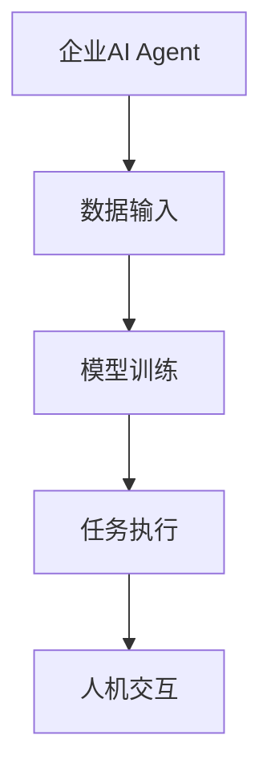

                 

### 企业AI Agent概述

企业AI Agent，即企业人工智能代理，是近年来在人工智能领域备受关注的新兴概念。它是一种智能化的软件实体，具备自主决策和执行任务的能力，旨在为企业提供高效、智能化的服务。企业AI Agent不仅能够处理大量的数据，还能够通过深度学习和自然语言处理等技术，实现智能化的人机交互。

#### 核心概念术语说明

- **企业AI Agent**：一种智能化的软件实体，能够自主地执行任务、处理数据，并提供智能化的服务。
- **自主决策**：企业AI Agent具备根据输入信息做出决策的能力，无需人工干预。
- **任务执行**：企业AI Agent能够根据任务需求，自动执行相应的操作。

#### 问题背景

随着大数据、云计算、物联网等技术的发展，企业面临着海量的数据分析和决策需求。传统的数据处理方式已经无法满足企业的需求，因此，企业AI Agent应运而生。它能够帮助企业自动化、智能化地处理数据，提高生产效率、降低运营成本。

#### 问题描述

企业AI Agent在企业中的应用场景广泛，包括但不限于以下几个方面：

1. **客户服务**：通过AI Agent，企业可以提供24/7的智能客服服务，提高客户满意度。
2. **供应链管理**：AI Agent可以优化供应链管理，提高物流效率，降低库存成本。
3. **人力资源**：AI Agent可以辅助招聘、培训和绩效评估，提高人力资源管理效率。
4. **财务管理**：AI Agent可以自动处理财务报表、分析财务数据，提供决策支持。

#### 问题解决

企业AI Agent通过以下方式解决企业面临的数据分析和决策问题：

1. **数据处理能力**：AI Agent能够高效地处理海量数据，提取有价值的信息。
2. **智能决策**：AI Agent通过深度学习和自然语言处理等技术，能够根据数据做出智能化决策。
3. **人机交互**：AI Agent具备自然语言处理能力，可以与用户进行智能对话，提供个性化服务。

#### 边界与外延

企业AI Agent的应用边界包括但不限于以下几个方面：

1. **行业应用**：不同行业的企业可以根据自身需求，开发相应的AI Agent。
2. **技术实现**：AI Agent的技术实现涉及多个领域，包括机器学习、自然语言处理、计算机视觉等。
3. **法律法规**：随着AI Agent的广泛应用，相关法律法规也在逐步完善，以规范其应用。

#### 概念结构与核心要素组成

企业AI Agent的概念结构主要包括以下几个核心要素：

1. **数据输入**：AI Agent需要大量的数据作为输入，以训练和优化模型。
2. **模型训练**：通过机器学习和深度学习技术，AI Agent可以不断优化模型，提高决策能力。
3. **任务执行**：AI Agent根据任务需求，自动执行相应的操作。
4. **人机交互**：AI Agent具备自然语言处理能力，可以与用户进行智能对话。

### **核心概念原理**

核心概念原理主要涉及以下几个方面：

1. **机器学习**：AI Agent通过机器学习技术，从数据中提取规律和模式。
2. **深度学习**：深度学习是机器学习的一种重要形式，适用于处理复杂的数据。
3. **自然语言处理**：自然语言处理技术使AI Agent能够理解和生成自然语言。

### **概念属性特征对比表格**

| 特征         | 机器学习 | 深度学习 | 自然语言处理 |
| ------------ | -------- | -------- | ------------ |
| 数据量需求   | 大量数据 | 大量数据 | 大量文本数据 |
| 模型复杂度   | 低至中等 | 中至高   | 中至高       |
| 应用场景     | 广泛     | 广泛     | 文本处理     |
| 技术实现难度 | 中等     | 高       | 高           |

### **ER实体关系图架构的Mermaid流程图**

通过上述分析，我们可以看到企业AI Agent在企业中的应用前景广阔，其核心概念原理、概念属性特征以及ER实体关系图都为我们理解这一概念提供了详细的解析。

### **企业AI Agent的组成与功能**

企业AI Agent的组成和功能是其实现智能化服务的关键。一个典型的企业AI Agent系统通常由以下几个核心组件构成：

1. **数据采集模块**：该模块负责从不同的数据源收集数据，如数据库、文件系统、传感器等。数据采集模块需要确保数据的完整性、准确性和实时性。

2. **数据处理模块**：数据处理模块对采集到的原始数据进行清洗、转换和整合，以适应AI模型的需求。这个模块通常包括数据预处理算法、特征工程和异常值处理等。

3. **机器学习模块**：机器学习模块是AI Agent的核心，它负责训练模型和优化算法。这个模块通常使用深度学习框架（如TensorFlow或PyTorch）来构建和训练模型。

4. **推理引擎**：推理引擎负责将训练好的模型应用于实际场景中，根据输入数据做出决策或预测。推理引擎需要高效且低延迟，以满足实时服务的需求。

5. **自然语言处理（NLP）模块**：NLP模块使AI Agent能够理解和生成自然语言，从而实现人机交互。这个模块通常包括语言模型、对话管理系统和语音识别技术等。

6. **用户接口**：用户接口是AI Agent与用户交互的界面，可以是命令行、图形用户界面或Web界面。用户接口的设计需要考虑用户体验和易用性。

#### **功能概述**

- **数据采集与处理**：企业AI Agent通过数据采集模块获取数据，然后利用数据处理模块对数据进行清洗和预处理，为后续的模型训练和推理提供高质量的数据。

- **模型训练与优化**：机器学习模块负责使用历史数据训练模型，并通过不断的迭代和优化，提高模型的准确性和泛化能力。

- **实时推理与决策**：推理引擎使用训练好的模型对实时输入的数据进行推理，生成决策或预测结果，并将其反馈给用户或执行相应的操作。

- **自然语言处理**：NLP模块使AI Agent能够理解用户的问题和指令，并生成自然、流畅的回复。

- **用户交互**：用户接口提供直观的用户体验，使用户能够方便地与AI Agent进行交互。

#### **组成部分与功能关系**

企业AI Agent的各个组成部分通过紧密协作，共同实现其功能。数据采集模块和数据处理模块共同确保了输入数据的质量，机器学习模块负责从数据中提取知识和模式，推理引擎则将这些知识应用于实际场景，NLP模块则实现了与用户的自然语言交互，用户接口则提供了便捷的用户操作方式。

通过这种协同工作机制，企业AI Agent能够为企业提供智能化、高效的服务，满足企业不断变化的需求。

### **企业AI Agent的发展背景与趋势**

企业AI Agent的发展背景可以追溯到人工智能技术的快速进步和应用的广泛推广。在过去的几十年中，人工智能从最初的理论研究逐渐走向实际应用，尤其是在机器学习、深度学习和自然语言处理等领域的突破，为AI Agent的发展奠定了坚实的基础。

#### **技术进步推动AI Agent崛起**

1. **机器学习与深度学习**：随着机器学习算法的进步，特别是深度学习技术的出现，AI Agent能够在复杂的环境中学习并做出智能化决策。深度神经网络能够处理大量数据，从图像识别、语音识别到自然语言处理，深度学习为AI Agent提供了强大的技术支撑。

2. **数据科学与大数据技术**：大数据技术的发展使得企业能够收集、存储和分析海量数据，这些数据为AI Agent的训练提供了丰富的素材，使得AI Agent能够更加精确地理解业务场景和用户需求。

3. **云计算与边缘计算**：云计算和边缘计算技术的发展，为企业AI Agent提供了强大的计算能力和灵活的部署方式。通过云计算平台，企业能够快速部署AI Agent，而边缘计算则使得AI Agent能够在本地进行实时推理，提高了响应速度和效率。

#### **应用场景的拓展**

企业AI Agent的应用场景正在不断拓展，从最初的客户服务、数据分析扩展到更多的领域：

1. **智能客服与客户关系管理（CRM）**：AI Agent在客户服务领域的应用已经非常成熟，通过智能客服系统，企业能够提供24/7的高效、个性化服务，提高客户满意度和忠诚度。

2. **智能供应链管理**：AI Agent可以优化供应链流程，提高库存管理效率，减少物流成本，为企业提供更精准的采购和配送计划。

3. **人力资源管理**：AI Agent可以辅助招聘、培训、绩效评估等人力资源管理工作，提高招聘效率和员工满意度。

4. **智能财务与风险管理**：AI Agent能够自动处理财务数据，提供财务分析和决策支持，降低企业风险。

5. **智能制造与运维**：在工业领域，AI Agent可以监控设备运行状态，预测设备故障，提高生产效率，减少设备停机时间。

#### **未来发展趋势**

未来，企业AI Agent的发展趋势将继续沿着技术进步和应用拓展两个方向演进：

1. **更加智能化与自主化**：随着技术的不断进步，AI Agent将变得更加智能化和自主化，能够处理更加复杂的任务，减少对人类操作的依赖。

2. **跨领域整合**：企业AI Agent将不再是单一领域的解决方案，而是能够跨领域整合，为企业提供全面、智能化的服务。

3. **个性化与定制化**：AI Agent将能够根据不同企业的需求和场景，提供更加个性化、定制化的服务，满足企业的多样化需求。

4. **安全性与合规性**：随着AI Agent在企业中的应用越来越广泛，其数据安全和合规性将成为关注的重点，企业和开发者需要确保AI Agent在提供服务的同

### **数据安全的重要性**

在当今数字化时代，数据已经成为企业最宝贵的资产之一。企业AI Agent作为智能化的数据处理工具，其核心依赖于大量的数据输入。因此，数据安全的重要性不言而喻。数据安全不仅关乎企业的商业利益，更关系到客户的隐私保护和法律法规的合规性。

#### **数据泄露的风险**

数据泄露是当前企业面临的最大威胁之一。一旦企业AI Agent存储或处理的数据泄露，不仅可能导致商业机密的丢失，还会严重损害企业的声誉和客户的信任。以下是一些常见的数据泄露风险：

1. **恶意攻击**：黑客或恶意软件可能会试图入侵企业的系统，窃取敏感数据。
2. **内部威胁**：内部员工的恶意行为或失误也可能导致数据泄露。
3. **系统漏洞**：系统漏洞和安全缺陷如果没有及时修补，可能导致数据泄露。

#### **数据篡改的风险**

数据篡改是一种更为隐蔽但同样危险的风险。一旦数据被篡改，其准确性和完整性将受到严重威胁，可能导致以下后果：

1. **决策失误**：篡改后的数据可能会导致企业做出错误的决策，造成经济损失。
2. **信任危机**：篡改数据可能会破坏客户对企业的信任，影响长期合作关系。
3. **法律风险**：篡改数据可能违反法律法规，导致企业面临法律诉讼和罚款。

#### **数据滥用的风险**

数据滥用是指未经授权使用或共享数据的行为，可能会对企业和客户带来严重危害：

1. **个人隐私泄露**：滥用客户数据可能导致个人隐私泄露，引发法律纠纷。
2. **商业机密泄露**：滥用企业内部数据可能导致商业机密的泄露，给企业带来巨大损失。
3. **恶意应用**：滥用数据可能被用于恶意目的，如欺诈、诈骗等。

#### **数据安全的法律法规**

随着数据安全问题的日益突出，各国政府纷纷出台了一系列法律法规来规范数据处理行为，确保数据安全。以下是一些主要的数据安全法律法规：

1. **欧盟通用数据保护条例（GDPR）**：GDPR是欧盟颁布的一项重要数据保护法规，对数据处理的合规性提出了严格的要求。
2. **加州消费者隐私法案（CCPA）**：CCPA是美国加州的一项隐私保护法规，对企业的数据收集、使用和共享行为进行了详细规定。
3. **中国的网络安全法**：中国网络安全法对网络运营者的数据安全责任和网络安全保护提出了明确要求。

企业AI Agent在数据处理过程中，必须严格遵守相关法律法规，确保数据安全，避免法律风险。

### **数据安全策略的核心原则**

为了确保企业AI Agent的数据安全，制定和实施有效的数据安全策略至关重要。一个全面的数据安全策略应遵循以下核心原则：

#### **保密性**

保密性是指确保数据在存储、传输和处理过程中不被未授权访问。实现保密性的主要手段包括：

1. **数据加密**：使用加密算法对敏感数据进行加密，确保数据在传输和存储过程中的安全性。
2. **访问控制**：通过权限管理和访问控制机制，限制对数据的访问，只有授权用户才能访问特定数据。

#### **完整性**

完整性确保数据在存储、传输和处理过程中不被未经授权的篡改或破坏。实现完整性的主要方法包括：

1. **数据完整性校验**：使用校验和或哈希函数对数据进行完整性校验，确保数据的完整性和一致性。
2. **数据备份**：定期进行数据备份，确保在数据丢失或损坏时能够恢复数据。

#### **可用性**

可用性确保数据在需要时能够被授权用户及时访问。实现可用性的主要方法包括：

1. **容灾备份**：建立容灾备份系统，确保在发生灾难时，数据能够快速恢复，保证系统的连续运行。
2. **负载均衡**：通过负载均衡技术，确保系统在高并发情况下能够稳定运行，提高数据的访问速度。

#### **法律法规合规性**

法律法规合规性要求企业在数据处理过程中遵守相关法律法规，确保数据安全。主要措施包括：

1. **数据保护政策**：制定并实施数据保护政策，明确数据收集、使用和共享的规定。
2. **合规审计**：定期进行合规审计，确保企业AI Agent的数据处理行为符合法律法规的要求。

#### **实现步骤**

为了有效实施数据安全策略，企业可以按照以下步骤进行：

1. **风险评估**：对企业AI Agent的数据处理流程进行全面的风险评估，识别潜在的安全威胁。
2. **策略制定**：根据风险评估结果，制定具体的数据安全策略，包括加密、访问控制、备份和合规性要求等。
3. **技术实施**：部署相应的安全技术和措施，如加密算法、访问控制机制、数据备份系统和合规审计工具等。
4. **培训与教育**：对员工进行数据安全培训，提高员工的数据安全意识和技能。
5. **监控与更新**：定期监控数据安全策略的执行情况，及时更新安全措施和技术。

通过遵循这些核心原则和实现步骤，企业可以构建一个全面、有效的数据安全策略，确保企业AI Agent的数据安全。

### **企业AI Agent的数据安全风险分析**

在企业AI Agent的运营过程中，数据安全风险是不可避免的挑战。为了确保数据的安全性和可靠性，必须对各种可能的风险进行深入分析，以便采取相应的预防措施。以下是企业AI Agent常见的数据安全风险及其分析：

#### **数据泄露风险**

数据泄露是企业AI Agent面临的最主要风险之一。数据泄露可能由多种原因导致，包括：

1. **网络攻击**：黑客通过钓鱼攻击、SQL注入等手段，非法获取企业AI Agent存储的数据。
2. **内部威胁**：内部员工未经授权访问或泄露敏感数据。
3. **系统漏洞**：企业AI Agent的系统漏洞和未及时修补的漏洞可能被黑客利用，进行数据窃取。

#### **数据篡改风险**

数据篡改是一种隐蔽且危险的数据安全风险。篡改风险可能来源于：

1. **恶意软件**：恶意软件可能潜入企业AI Agent系统，篡改数据。
2. **内部员工**：内部员工可能出于恶意目的篡改数据。
3. **系统漏洞**：系统漏洞可能被黑客利用，篡改数据。

#### **数据滥用风险**

数据滥用风险主要涉及未经授权使用或共享数据的行为。常见的数据滥用风险包括：

1. **非法访问**：未经授权的个人或组织访问企业AI Agent存储的数据。
2. **数据共享不当**：企业AI Agent中敏感数据未经授权被共享给第三方。
3. **数据商业化**：敏感数据被用于非法的商业活动。

#### **预防和应对措施**

为了有效预防和应对数据安全风险，企业可以采取以下措施：

1. **网络防护**：部署防火墙、入侵检测系统和加密技术，防止网络攻击和数据窃取。
2. **访问控制**：实施严格的访问控制策略，确保只有授权用户才能访问敏感数据。
3. **员工培训**：定期对员工进行数据安全培训，提高他们的安全意识和技能。
4. **系统更新和维护**：定期更新企业AI Agent的系统，修补漏洞，确保系统的安全性。
5. **数据备份**：定期备份数据，确保在数据泄露或篡改时能够迅速恢复。

通过全面的风险分析，企业可以更有效地识别和应对AI Agent的数据安全风险，确保数据的安全和可靠性。

### **数据加密技术**

数据加密是确保企业AI Agent数据安全的核心技术之一。它通过将数据转换成不可读的形式，只有在获得解密密钥的情况下才能恢复原始数据，从而有效防止未经授权的数据访问和泄露。以下将详细阐述数据加密的基本原理、常见的数据加密算法以及在实际应用中面临的挑战和解决方案。

#### **数据加密的基本原理**

数据加密的基本原理是将原始数据（明文）通过加密算法和密钥转换成加密后的数据（密文）。在解密过程中，密文通过相应的解密算法和密钥恢复为原始数据。加密算法通常分为对称加密和非对称加密。

- **对称加密**：对称加密算法使用相同的密钥进行加密和解密。最著名的对称加密算法是AES（Advanced Encryption Standard）。对称加密的优点是加密和解密速度快，适合处理大量数据。但缺点是密钥的分发和管理较为复杂。

- **非对称加密**：非对称加密算法使用一对密钥（公钥和私钥），公钥用于加密，私钥用于解密。著名的非对称加密算法包括RSA（Rivest-Shamir-Adleman）和ECC（Elliptic Curve Cryptography）。非对称加密的优点是解决了密钥分发的问题，但加密和解密速度相对较慢，适用于数据传输加密和密钥交换。

#### **常见的数据加密算法**

1. **AES（高级加密标准）**：AES是一种对称加密算法，支持128位、192位和256位密钥长度。它广泛应用于各种安全领域，包括企业AI Agent的数据加密。

2. **RSA**：RSA是一种非对称加密算法，以其创始人名字命名。RSA算法的安全性基于大素数分解的难度，广泛应用于数字签名和数据传输加密。

3. **ECC**：ECC是一种基于椭圆曲线数学的公钥加密算法，具有比RSA更高的安全性能和更小的密钥长度，适用于需要高安全性的场景。

4. **哈希函数**：哈希函数用于生成数据的数字摘要，确保数据的完整性和一致性。常用的哈希函数包括MD5、SHA-1和SHA-256等。虽然哈希函数本身不提供加密功能，但它们在加密系统中具有重要作用。

#### **数据加密在实际应用中的挑战与解决方案**

1. **密钥管理**：密钥是数据加密和解密的核心，但密钥的管理和保护至关重要。企业需要建立完善的密钥管理系统，确保密钥的安全存储、分发和更新。

   - **解决方案**：采用硬件安全模块（HSM）或加密管理服务（KMS）来管理密钥，确保密钥的安全性和完整性。

2. **加密性能**：加密和解密过程需要消耗计算资源，特别是在处理大量数据时，加密性能可能成为瓶颈。

   - **解决方案**：优化加密算法和硬件，采用并行计算和硬件加速技术来提高加密和解密的性能。

3. **密钥泄露风险**：即使加密算法再强大，如果密钥泄露，数据仍然可能被破解。

   - **解决方案**：定期更换密钥，采用多因素认证（MFA）来增强密钥的安全保护。

4. **法律合规性**：不同国家和地区对加密技术的使用有不同的法律法规要求，企业需要确保其加密策略符合当地法律法规。

   - **解决方案**：了解并遵守当地的数据保护法律法规，与法律专家合作确保加密策略的合规性。

通过理解和应对这些挑战，企业可以更有效地利用数据加密技术保护其AI Agent中的数据，确保数据的安全和隐私。

### **访问控制与身份验证**

在确保企业AI Agent数据安全的过程中，访问控制和身份验证是两个至关重要的技术手段。访问控制负责管理用户对数据的访问权限，而身份验证则确保用户身份的真实性。以下将详细阐述访问控制的基本概念、身份验证技术以及细粒度访问控制策略。

#### **访问控制的基本概念**

访问控制是指通过设置和实施一系列规则，限制和监控用户对系统资源的访问。其核心目标是确保只有授权用户能够在适当的权限下访问特定的数据或资源。

1. **访问控制模型**：常见的访问控制模型包括：

   - **自主访问控制（DAC）**：基于用户和资源的属性，用户可以自主决定对资源的访问权限。DAC的优点是灵活性高，但易受到恶意用户的干扰。
   - **强制访问控制（MAC）**：系统管理员定义资源的访问权限，用户只能按照系统规定的权限访问资源。MAC的优点是安全性高，但管理复杂。
   - **基于角色的访问控制（RBAC）**：用户被分配特定角色，角色拥有对资源的访问权限。RBAC简化了权限管理，提高了系统的可扩展性。

2. **访问控制策略**：访问控制策略包括以下几个方面：

   - **身份验证**：确认用户的身份，确保只有合法用户才能访问系统。
   - **权限分配**：根据用户身份和角色，分配适当的访问权限。
   - **访问审计**：记录和监控用户的访问行为，以便在出现安全事件时进行调查。

#### **身份验证技术**

身份验证是确保用户身份真实性的过程，常见的身份验证技术包括：

1. **密码验证**：用户通过输入密码来证明自己的身份，是最常见的身份验证方式。但密码容易泄露，安全性较低。

2. **双因素认证（2FA）**：用户在输入密码后，还需要通过第二重验证，如手机短信验证码、身份验证应用或生物识别技术，以提高安全性。

3. **生物识别**：通过指纹、面部识别、虹膜识别等生物特征进行身份验证，具有较高的安全性和便利性。

4. **智能卡/USB Key**：用户使用智能卡或USB Key进行身份验证，这种方式的优点是安全性强且不易丢失。

#### **细粒度访问控制**

细粒度访问控制是一种更为精细的访问控制策略，它允许管理员对用户访问权限进行更加精确的分配和管理。

1. **访问控制列表（ACL）**：ACL是一种细粒度的访问控制机制，为每个资源设置访问权限列表，明确指定哪些用户或用户组可以对资源进行何种操作。

2. **基于属性的访问控制（ABAC）**：ABAC根据用户的属性（如职位、部门等）和资源的属性（如类型、访问时间等）来决定访问权限。这种策略提供了极高的灵活性，可以适应复杂的访问控制需求。

3. **访问控制标签**：访问控制标签是一种用于标识和分类资源的安全属性。用户在访问资源时，系统会根据标签的属性决定访问权限。

通过实施访问控制和身份验证技术，企业AI Agent可以有效地保护数据安全，防止未经授权的访问和操作。

### **数据隐私保护**

在数字化时代，数据隐私保护已成为企业AI Agent面临的重要挑战之一。随着数据量的不断增加和应用的深入，如何确保数据在收集、处理和存储过程中不被泄露、滥用或误用，成为企业必须认真对待的问题。以下是关于数据隐私保护的需求、数据脱敏技术和隐私计算技术的详细阐述。

#### **数据隐私保护的需求**

数据隐私保护的需求源自多个方面，包括法律法规的要求、客户信任的保护以及企业自身的责任。

1. **法律法规的要求**：全球范围内，数据隐私保护的法律和法规日益严格。例如，欧盟的通用数据保护条例（GDPR）对数据隐私保护提出了严格的要求，要求企业在处理个人数据时必须获得明确、具体、明确的同意，并对数据泄露事件进行及时通知。

2. **客户信任的保护**：客户对企业的信任建立在对其个人信息安全的信心上。一旦发生数据泄露或滥用事件，不仅可能导致客户流失，还可能损害企业的声誉和业务。

3. **企业责任**：企业作为数据处理者，有责任确保数据的安全和隐私。这不仅是对客户的责任，也是对企业自身长期发展的考虑。

#### **数据脱敏技术**

数据脱敏是一种常见的隐私保护技术，通过将敏感数据替换为不可识别的虚构数据，降低数据泄露风险。以下是几种常见的数据脱敏技术：

1. **随机化**：随机化是将敏感数据替换为随机生成的数据，如将姓名替换为随机字符串，将电话号码替换为随机数字。

2. **掩码**：掩码是将敏感数据部分或全部隐藏起来，如将电话号码的前几位隐藏，只显示后几位。

3. **泛化**：泛化是将敏感数据的具体值替换为更泛化的值，如将具体地址替换为城市名称。

4. **同义替换**：同义替换是将敏感数据替换为具有相同意义但不具体的数据，如将个人收入替换为“中等收入”。

5. **加密**：加密是一种更高级的数据脱敏技术，通过加密算法将敏感数据转换为密文，确保即使在数据泄露的情况下也无法被理解。

#### **隐私计算技术**

隐私计算技术是一种在数据处理过程中保护数据隐私的新型技术，它允许在数据不离开本地环境的情况下进行计算和处理。以下是几种常见的隐私计算技术：

1. **同态加密**：同态加密允许对加密数据直接进行计算，而无需解密。这意味着在数据加密的状态下，可以直接进行数据的处理和分析。

2. **安全多方计算（MPC）**：安全多方计算是一种允许多个方在不共享原始数据的情况下共同计算数据的技术。MPC通过加密和分布式计算技术实现数据隐私保护。

3. **联邦学习**：联邦学习是一种分布式机器学习技术，允许不同的参与者共同训练模型，而无需共享原始数据。联邦学习通过聚合各方的模型更新来训练全局模型。

4. **差分隐私**：差分隐私是一种在数据分析中引入噪声，以保护数据隐私的技术。差分隐私通过在输出结果中引入随机噪声，确保单个数据点无法被推断出来。

通过数据脱敏和隐私计算技术，企业可以在确保数据隐私的前提下，充分发挥数据的价值，实现数据的合理利用。

### **数据安全审计与合规**

数据安全审计与合规是确保企业AI Agent数据安全策略有效实施的关键环节。通过对数据安全策略的执行情况进行审计和评估，企业可以及时发现和纠正安全隐患，确保数据的安全性和合规性。

#### **数据安全审计的作用**

1. **评估安全策略的有效性**：数据安全审计可以评估企业AI Agent的数据安全策略是否得到有效实施，包括加密、访问控制、备份和合规性要求等方面。
2. **发现潜在的安全威胁**：审计过程中，可以发现系统中存在的漏洞和潜在的安全威胁，为后续的安全改进提供依据。
3. **确保法律法规合规**：数据安全审计可以确保企业AI Agent的数据处理行为符合相关法律法规的要求，如GDPR、CCPA等，避免法律风险。

#### **数据安全合规的要求**

1. **数据保护政策**：企业应制定详细的数据保护政策，明确数据收集、使用、存储和共享的规定，确保数据处理的合规性。
2. **数据泄露通知**：在发生数据泄露事件时，企业应立即通知受影响的用户和相关监管机构，确保透明和及时的应对。
3. **员工培训**：定期对员工进行数据安全培训，提高员工的数据安全意识和技能，确保数据安全策略得到有效执行。

#### **数据安全审计的方法与工具**

1. **风险评估**：通过风险评估识别潜在的安全威胁和漏洞，为审计提供基础。
2. **合规性检查**：检查企业AI Agent的数据处理行为是否符合相关法律法规和内部数据保护政策。
3. **安全漏洞扫描**：使用安全漏洞扫描工具检查系统中的安全漏洞和配置问题。
4. **日志分析**：分析系统日志，发现异常行为和潜在的安全事件。
5. **第三方审计**：聘请第三方专业机构进行独立审计，确保审计结果的客观性和公正性。

通过数据安全审计与合规，企业可以确保AI Agent的数据安全策略得到有效实施，保障数据的保密性、完整性和可用性。

### **企业AI Agent数据安全最佳实践**

为了确保企业AI Agent的数据安全，制定并实施最佳实践是非常重要的。以下是一些具体的实施策略、技术实现与运维方法，以及实际案例分析和总结。

#### **实施策略**

1. **风险评估**：在实施数据安全策略前，首先进行全面的风险评估，识别潜在的安全威胁和漏洞，为数据安全策略的制定提供依据。

2. **数据分类**：根据数据的敏感程度，对数据分类并进行分级管理。敏感数据应采取更高的安全保护措施。

3. **多因素认证**：采用多因素认证（MFA）技术，增强用户身份验证的安全性，防止未经授权的访问。

4. **定期培训**：定期对员工进行数据安全培训，提高员工的安全意识和技能，确保数据安全策略得到有效执行。

5. **安全审计**：定期进行数据安全审计，检查数据安全策略的实施情况，及时发现和纠正安全隐患。

#### **技术实现与运维方法**

1. **加密技术**：使用高级加密标准（AES）或国密算法（SM9）对敏感数据进行加密，确保数据在存储和传输过程中的安全性。

2. **访问控制**：实施严格的访问控制策略，包括基于角色的访问控制（RBAC）和基于属性的访问控制（ABAC），确保只有授权用户才能访问特定数据。

3. **数据备份**：定期进行数据备份，确保在数据丢失或损坏时能够快速恢复。

4. **入侵检测和防护**：部署入侵检测系统（IDS）和入侵防护系统（IPS），实时监控并阻止恶意攻击。

5. **自动化运维**：采用自动化工具进行系统运维，提高运维效率，减少人为操作错误。

#### **实际案例分析与总结**

**案例1：某金融企业数据安全策略实施**

某金融企业在实施AI Agent数据安全策略时，采取了以下措施：

1. **风险评估**：对企业AI Agent的数据处理流程进行了全面的风险评估，识别出数据泄露、数据篡改和数据滥用等风险。

2. **数据分类**：对数据进行了严格分类，将敏感数据如客户信息、交易记录等分类为高敏感度数据。

3. **多因素认证**：采用多因素认证技术，确保用户身份验证的安全性。

4. **安全审计**：定期进行数据安全审计，检查安全策略的实施情况，发现并纠正潜在的安全漏洞。

通过这些措施，该金融企业成功降低了数据安全风险，提高了客户对数据的信任度。

**案例2：某制造企业数据安全策略实施**

某制造企业在实施AI Agent数据安全策略时，采取了以下措施：

1. **加密技术**：使用AES对生产数据进行了加密，确保数据在存储和传输过程中的安全性。

2. **访问控制**：实施基于角色的访问控制策略，确保只有授权人员才能访问特定的数据。

3. **数据备份**：定期进行数据备份，确保在数据丢失或损坏时能够快速恢复。

4. **自动化运维**：采用自动化工具进行系统运维，提高了运维效率，降低了人为操作错误。

通过这些措施，该制造企业提高了数据安全性和系统稳定性，降低了运维成本。

**总结**

通过上述实际案例可以看出，企业AI Agent数据安全最佳实践的实施可以有效提高数据安全性，降低风险。企业应根据自身业务特点和需求，制定合适的策略，并采取有效的技术手段进行实施和运维。只有持续进行风险评估和安全审计，才能确保数据安全策略的有效性和持续改进。

### **数据安全策略的未来发展趋势**

随着技术的不断进步和应用的深入，企业AI Agent的数据安全策略也正朝着更加智能化和全面化的方向发展。以下是数据安全策略未来可能的发展趋势：

#### **人工智能安全技术**

随着人工智能技术的发展，人工智能安全技术将成为数据安全策略的重要组成部分。通过利用深度学习、强化学习等先进的人工智能技术，可以开发出更加智能的入侵检测、恶意行为分析和数据泄露防护系统。这些系统可以实时监测和响应潜在的安全威胁，提高数据安全的防护能力。

#### **零信任架构**

零信任架构是一种新兴的安全理念，它强调任何内外部访问都必须经过严格的身份验证和权限检查。在未来，零信任架构将逐渐取代传统的边界防御模式，成为企业数据安全策略的核心。通过零信任架构，企业可以确保只有经过严格验证的用户和设备才能访问敏感数据，从而大幅降低数据泄露风险。

#### **分布式安全**

随着云计算和边缘计算的普及，数据的分布性越来越强。分布式安全策略将逐渐成为主流，它通过将安全控制分散到多个节点，实现更高效的数据保护。分布式安全技术包括分布式加密、分布式身份验证和分布式访问控制等，这些技术可以在分布式环境中提供更高的安全性和灵活性。

#### **数据隐私保护技术**

随着数据隐私保护需求的增加，数据隐私保护技术也将不断发展。未来，数据匿名化、差分隐私和联邦学习等隐私保护技术将在数据安全策略中发挥更大的作用。这些技术能够在确保数据隐私的前提下，实现数据的有效利用，为企业带来更多的商业价值。

#### **法律法规的进一步完善**

随着数据安全问题的日益突出，各国政府和国际组织对数据安全法规的重视程度也在不断提高。未来，数据安全法规将更加完善和严格，企业需要不断适应和遵守这些法规，确保其数据安全策略的合规性。同时，企业也需要与法律法规制定者保持紧密沟通，积极参与相关标准的制定，为数据安全的发展提供指导。

通过上述趋势，我们可以看到，未来的数据安全策略将更加注重技术手段的创新和法规的合规性，以应对日益复杂的安全威胁。企业需要紧跟这些趋势，不断更新和优化其数据安全策略，确保数据的安全和隐私。

### **总结与展望**

本文从多个角度深入探讨了企业AI Agent的数据安全策略，涵盖了其基本概念、发展背景、核心原则、安全风险分析、数据加密技术、访问控制与身份验证、数据隐私保护、安全审计与合规，以及最佳实践和未来发展趋势。企业AI Agent作为企业智能化转型的关键工具，其数据安全至关重要，不仅关乎企业的商业利益，更涉及客户隐私和法律法规的合规性。

为了构建一个全面、有效的数据安全策略，企业需要：

1. **加强数据安全意识培训**：定期对员工进行数据安全培训，提高他们的安全意识和技能。
2. **采用先进的安全技术**：充分利用数据加密、访问控制和多因素认证等安全技术，确保数据在存储、传输和处理过程中的安全性。
3. **实施全面的安全审计**：定期进行数据安全审计，及时发现和纠正安全隐患。
4. **遵守法律法规**：确保数据安全策略符合相关法律法规的要求。

未来，随着人工智能和区块链等新技术的不断发展，企业AI Agent的数据安全策略将面临新的挑战和机遇。我们期待能够看到更多创新技术的应用，以应对日益复杂的数据安全威胁，为企业提供更加智能、高效和可靠的数据安全解决方案。

### **最佳实践 tips**

1. **定期更新安全策略**：随着业务的发展和技术的进步，数据安全策略需要定期更新，确保其始终符合最新的安全需求。

2. **数据分类与分级**：根据数据的重要性，将数据分类并进行分级管理，采取相应的安全措施。

3. **多因素认证**：在关键系统中采用多因素认证（MFA），提高用户身份验证的安全性。

4. **安全审计与监控**：定期进行安全审计，使用安全监控工具实时监测潜在的安全威胁。

5. **员工培训与教育**：定期对员工进行数据安全培训，提高他们的安全意识和技能。

### **注意事项**

1. **数据备份与恢复**：确保定期进行数据备份，并制定数据恢复计划，以应对数据丢失或损坏的情况。

2. **安全漏洞修补**：及时修补系统漏洞，防止黑客利用漏洞进行攻击。

3. **访问日志记录**：记录访问日志，以便在发生安全事件时进行追溯和分析。

4. **法律法规合规性**：确保数据安全策略符合相关法律法规的要求，避免法律风险。

### **拓展阅读**

1. **《数据安全法》**：了解中国的数据安全法律法规，确保企业合规。
2. **《通用数据保护条例（GDPR）》**：了解欧盟的数据保护法规，为国际化企业提供参考。
3. **《人工智能安全与伦理》**：深入探讨人工智能在数据安全中的应用和伦理问题。
4. **《密码学原理与应用》**：学习密码学基础知识，掌握数据加密技术。

通过这些最佳实践、注意事项和拓展阅读，企业可以更好地构建和实施数据安全策略，确保企业AI Agent的数据安全。

### **作者信息**

**作者：AI天才研究院/AI Genius Institute & 禅与计算机程序设计艺术 /Zen And The Art of Computer Programming**

