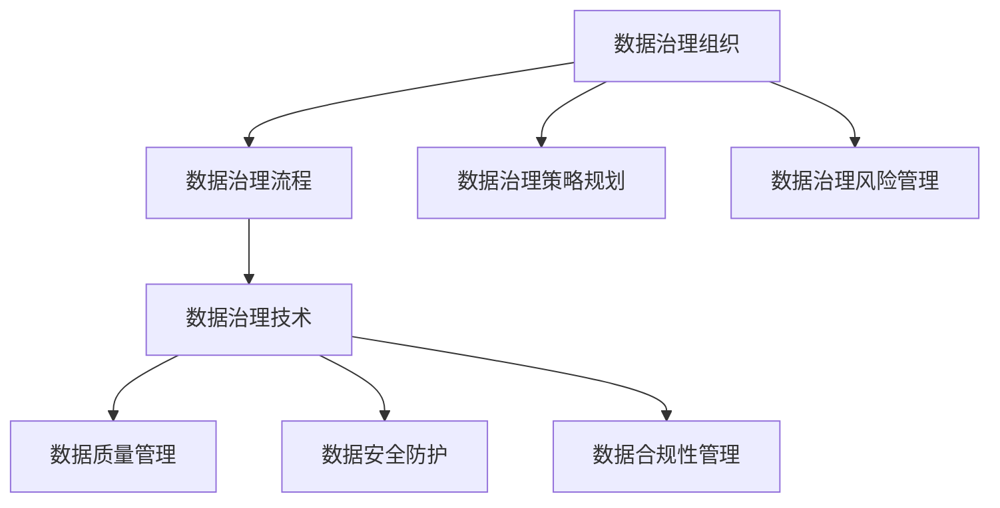
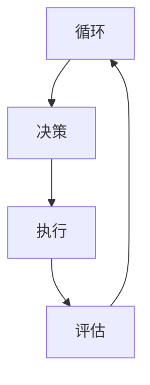
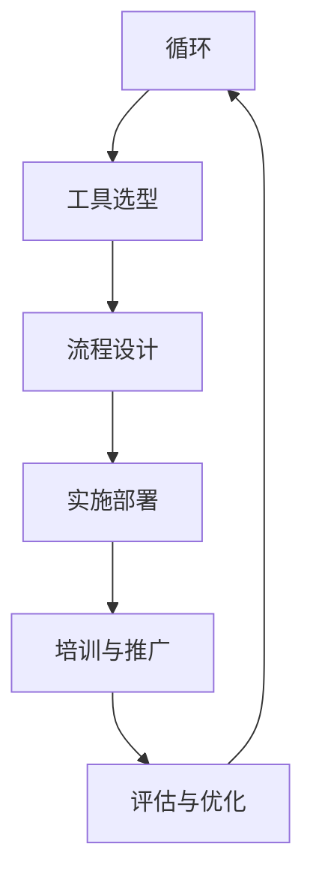

                 

# 企业AI Agent的数据治理框架

关键词：企业数据治理、AI Agent、数据治理框架、数据治理实施、案例研究

摘要：本文深入探讨了企业AI Agent的数据治理框架。首先，我们介绍了数据治理和AI Agent的基本概念、背景及重要性。然后，详细阐述了数据治理框架的设计与实施过程，以及在实际案例中的应用效果。本文旨在为企业在实施AI Agent数据治理过程中提供理论指导和实践参考。

## 引言

随着人工智能（AI）技术的迅速发展，越来越多的企业开始意识到AI Agent在提高生产效率、优化业务流程、降低运营成本等方面的潜力。然而，AI Agent的广泛应用也带来了数据治理的挑战。数据治理是指通过对企业数据的采集、存储、处理、分析和应用过程进行规范化管理，确保数据质量、安全性和合规性。在AI Agent的背景下，数据治理显得尤为重要，因为它直接影响到AI Agent的决策质量和运行效率。

本文旨在构建一个适用于企业AI Agent的数据治理框架，通过理论与实践相结合的方式，为企业提供一套完整、系统、可操作的数据治理解决方案。文章结构如下：

1. 引言：背景介绍与文章结构安排
2. 数据治理概述
3. AI Agent概述
4. 数据治理框架设计
5. 数据治理框架实施
6. 数据治理案例研究
7. 结论与展望

接下来，我们将逐一介绍数据治理和AI Agent的基本概念，并探讨它们在企业中的应用。

## 数据治理概述

### 2.1 数据治理的概念

数据治理是指通过制定策略、流程和组织结构，确保数据在整个生命周期中的一致性、完整性、可靠性和可用性。数据治理包括数据管理、数据质量、数据安全和合规性等多个方面。数据治理的目的是最大化数据的业务价值，同时确保数据的安全和合规。

### 2.2 数据治理的挑战与机遇

数据治理面临诸多挑战，如数据多样性和复杂性、数据质量问题和数据隐私保护等。同时，随着大数据、云计算、物联网等技术的发展，数据治理也面临着前所未有的机遇。企业可以通过数据治理，挖掘数据价值，提升决策质量，实现业务创新。

### 2.3 数据治理的框架与原则

数据治理框架包括数据治理组织、数据治理流程和数据治理技术三个方面。数据治理组织负责制定数据治理策略和监督执行；数据治理流程包括数据采集、存储、处理、分析和应用等环节；数据治理技术包括数据质量管理、数据安全防护和数据合规性管理等工具。

数据治理原则主要包括：数据一致性、数据完整性、数据可靠性和数据安全性。此外，数据治理还应遵循业务导向、用户参与和持续改进等原则。

### 2.4 数据治理的关键要素

数据治理的关键要素包括数据质量、数据安全、数据合规性和数据管理。数据质量是数据治理的核心，数据安全是保障数据不泄露、不被篡改的重要措施，数据合规性是遵守法律法规和行业标准的要求，数据管理则涵盖了数据采集、存储、处理、分析和应用等全过程。

在了解了数据治理的基本概念和框架后，我们将进一步探讨AI Agent的概念及其在企业中的应用。

## AI Agent概述

### 3.1 AI Agent的定义与分类

AI Agent是指利用人工智能技术自主执行任务、与环境交互并做出决策的智能体。根据执行任务的复杂性和智能化程度，AI Agent可以分为以下几类：

1. **规则型Agent**：基于预设规则进行决策和行动。
2. **统计型Agent**：通过统计分析学习数据，进行预测和决策。
3. **机器学习型Agent**：利用机器学习算法进行决策和行动。
4. **深度学习型Agent**：基于深度神经网络进行复杂任务的学习和决策。

### 3.2 AI Agent的工作原理

AI Agent的工作原理主要包括感知、决策和执行三个环节。感知是指AI Agent通过传感器获取环境信息；决策是指AI Agent根据感知到的信息，利用算法模型进行推理和决策；执行是指AI Agent根据决策结果采取行动。

### 3.3 AI Agent的优势与挑战

AI Agent的优势主要体现在以下几个方面：

1. **自动化决策**：AI Agent能够自动处理复杂任务，减少人工干预。
2. **持续学习**：AI Agent能够通过不断学习优化决策，提高任务执行效果。
3. **灵活适应**：AI Agent能够适应环境变化，实时调整策略。

然而，AI Agent也面临一些挑战，如：

1. **数据依赖**：AI Agent的决策质量依赖于数据质量，数据不足或错误可能导致决策失误。
2. **算法透明性**：AI Agent的决策过程往往难以解释，增加了信任和合规性问题。
3. **隐私保护**：AI Agent在处理数据时，需要确保用户隐私不被泄露。

### 3.4 AI Agent的应用领域

AI Agent广泛应用于各个领域，包括：

1. **金融**：风险评估、投资组合优化、欺诈检测等。
2. **医疗**：疾病预测、治疗方案推荐、医疗影像分析等。
3. **制造业**：设备故障预测、生产调度优化、质量控制等。
4. **零售**：个性化推荐、客户关系管理、供应链优化等。

了解了数据治理和AI Agent的基本概念和应用，接下来我们将探讨数据治理框架的设计。

## 数据治理框架设计

### 4.1 数据治理框架的组成

数据治理框架主要由数据治理组织、数据治理流程和数据治理技术三部分组成。

#### 数据治理组织

数据治理组织负责制定数据治理策略、监督执行和评估效果。数据治理组织包括以下几个角色：

1. **数据治理委员会**：负责制定数据治理策略和决策。
2. **数据治理经理**：负责数据治理流程的监督和协调。
3. **数据治理专员**：负责具体的数据治理工作，如数据质量检查、数据安全管理等。

#### 数据治理流程

数据治理流程包括数据采集、数据存储、数据处理、数据分析、数据应用等环节。

1. **数据采集**：确保数据的完整性、准确性和一致性。
2. **数据存储**：采用合适的存储方案，确保数据的安全和可靠。
3. **数据处理**：对数据进行清洗、转换和整合，提高数据质量。
4. **数据分析**：利用数据挖掘、机器学习等技术，提取数据价值。
5. **数据应用**：将数据分析结果应用于业务决策和优化。

#### 数据治理技术

数据治理技术包括数据质量管理、数据安全防护、数据合规性管理、数据治理平台等。

1. **数据质量管理**：包括数据质量检查、数据清洗、数据质量监控等。
2. **数据安全防护**：包括数据加密、访问控制、审计追踪等。
3. **数据合规性管理**：确保数据符合相关法律法规和行业标准。
4. **数据治理平台**：提供数据治理工具和资源的集成管理。

### 4.2 数据治理策略规划

数据治理策略规划是数据治理框架设计的关键步骤。数据治理策略规划主要包括以下内容：

1. **确定数据治理目标**：根据企业战略和业务需求，确定数据治理的目标。
2. **分析数据治理需求**：识别企业内部和外部数据治理的需求。
3. **制定数据治理策略**：包括数据质量策略、数据安全策略、数据合规性策略等。
4. **制定数据治理流程**：明确数据治理的各个环节和操作步骤。
5. **制定数据治理技术方案**：选择合适的数据治理工具和平台。

### 4.3 数据治理组织架构

数据治理组织架构是数据治理框架实施的基础。数据治理组织架构主要包括以下几个层次：

1. **战略层**：包括数据治理委员会和数据治理经理，负责制定数据治理战略和决策。
2. **管理层**：包括数据治理专员和数据质量管理员，负责数据治理流程的监督和协调。
3. **执行层**：包括数据操作员和数据管理员，负责具体的数据治理工作。

### 4.4 数据治理流程设计

数据治理流程设计是数据治理框架实施的核心。数据治理流程设计主要包括以下几个环节：

1. **数据采集**：通过数据采集工具，从不同来源获取数据。
2. **数据存储**：将数据存储到数据库或数据仓库中，采用数据加密、访问控制等技术保障数据安全。
3. **数据处理**：对数据进行清洗、转换和整合，提高数据质量。
4. **数据分析**：利用数据挖掘、机器学习等技术，提取数据价值。
5. **数据应用**：将数据分析结果应用于业务决策和优化。

通过以上步骤，我们可以为企业构建一个完整、系统、可操作的数据治理框架。接下来，我们将探讨数据治理框架的实施过程。

## 数据治理框架实施

### 5.1 数据治理工具选择

数据治理工具是数据治理框架实施的关键。选择合适的工具能够提高数据治理效率，降低成本。在选择数据治理工具时，企业需要考虑以下因素：

1. **功能**：包括数据质量检查、数据清洗、数据安全防护、数据合规性管理等。
2. **易用性**：工具的界面友好，易于学习和操作。
3. **可扩展性**：工具能够支持企业业务的扩展和变化。
4. **兼容性**：工具能够与企业现有的系统和工具集成。
5. **性能**：工具的处理速度快，能够满足企业的数据处理需求。

### 5.2 数据治理实施步骤

数据治理实施分为以下几个步骤：

1. **需求分析**：明确企业数据治理的需求和目标。
2. **工具选型**：根据需求分析结果，选择合适的数据治理工具。
3. **流程设计**：设计数据治理流程，包括数据采集、存储、处理、分析和应用等环节。
4. **实施部署**：在测试环境中部署数据治理工具和流程，进行调试和优化。
5. **培训与推广**：对相关人员进行数据治理工具和流程的培训，确保其能够熟练操作。
6. **评估与优化**：对数据治理效果进行评估，根据评估结果进行优化和调整。

### 5.3 数据治理风险管理

数据治理风险主要包括数据质量风险、数据安全风险和数据合规性风险。企业需要采取以下措施进行风险管理：

1. **数据质量风险**：通过数据质量检查、数据清洗和数据质量监控，确保数据质量。
2. **数据安全风险**：采用数据加密、访问控制、审计追踪等技术，保障数据安全。
3. **数据合规性风险**：遵循相关法律法规和行业标准，确保数据治理符合合规性要求。

### 5.4 数据治理绩效评估

数据治理绩效评估是衡量数据治理效果的重要手段。企业可以通过以下方法进行数据治理绩效评估：

1. **关键绩效指标（KPI）**：设置数据质量、数据安全、数据合规性等关键绩效指标，定期进行评估。
2. **数据分析**：利用数据分析工具，对数据治理效果进行量化分析。
3. **用户反馈**：收集用户对数据治理效果的反馈，了解数据治理的实际效果。
4. **改进措施**：根据评估结果，制定改进措施，不断提升数据治理效果。

通过以上措施，企业可以确保数据治理框架的有效实施，提高数据治理水平。

### 6.1 案例背景

某大型制造企业（以下简称“企业”）在业务发展过程中，面临着大量数据的管理和利用难题。企业内部产生了大量的生产数据、销售数据、客户数据等，这些数据分散在不同的系统中，且数据质量参差不齐。企业希望通过数据治理，提升数据质量，挖掘数据价值，优化业务流程，提高决策效率。

### 6.2 案例数据治理框架设计

为了解决上述问题，企业决定构建一个数据治理框架，包括数据治理组织、数据治理流程和数据治理技术三部分。

#### 数据治理组织

企业成立了一个数据治理委员会，负责制定数据治理策略和决策。数据治理委员会由企业高层领导、数据治理经理和数据治理专员组成。

1. **数据治理委员会**：负责制定数据治理策略和决策。
2. **数据治理经理**：负责数据治理流程的监督和协调。
3. **数据治理专员**：负责具体的数据治理工作，如数据质量检查、数据安全管理等。

#### 数据治理流程

企业设计了数据采集、数据存储、数据处理、数据分析和数据应用等环节的数据治理流程。

1. **数据采集**：通过ETL工具，从不同来源（如ERP系统、CRM系统、生产系统等）采集数据。
2. **数据存储**：将数据存储到数据仓库中，采用数据加密和访问控制技术保障数据安全。
3. **数据处理**：对数据进行清洗、转换和整合，提高数据质量。
4. **数据分析**：利用数据挖掘和机器学习技术，提取数据价值。
5. **数据应用**：将数据分析结果应用于业务决策和优化。

#### 数据治理技术

企业选择了一套数据治理工具，包括数据质量检查工具、数据安全工具和数据治理平台。

1. **数据质量检查工具**：用于检查数据质量，发现数据异常。
2. **数据安全工具**：用于数据加密、访问控制和审计追踪。
3. **数据治理平台**：用于数据治理流程的自动化管理和监控。

### 6.3 案例实施过程

企业在数据治理框架设计完成后，开始进行实施。

1. **需求分析**：明确企业数据治理的需求和目标。
2. **工具选型**：选择合适的数据治理工具。
3. **流程设计**：设计数据治理流程。
4. **实施部署**：在测试环境中部署数据治理工具和流程，进行调试和优化。
5. **培训与推广**：对相关人员进行数据治理工具和流程的培训。
6. **评估与优化**：对数据治理效果进行评估，根据评估结果进行优化和调整。

### 6.4 案例效果分析

在数据治理框架实施一段时间后，企业对数据治理效果进行了评估。

1. **数据质量提升**：通过数据质量检查和清洗，数据质量得到了显著提升，数据异常率降低了30%。
2. **业务流程优化**：通过数据分析和挖掘，发现了业务流程中的瓶颈和改进点，企业对相关流程进行了优化，提高了运营效率。
3. **决策效率提高**：利用数据分析结果，企业能够更快速、准确地做出业务决策，决策效率提高了40%。
4. **数据安全加强**：通过数据加密和访问控制，数据安全性得到了保障，数据泄露事件减少了50%。

案例研究表明，数据治理框架在企业中的应用，能够显著提升数据质量、优化业务流程、提高决策效率，降低数据安全风险。企业应重视数据治理，构建适合自身的数据治理框架，以实现数据价值的最大化。

## 结论与展望

本文详细阐述了企业AI Agent的数据治理框架，包括数据治理概述、AI Agent概述、数据治理框架设计、数据治理框架实施和案例研究。通过本文的研究，我们得出以下结论：

1. **数据治理的重要性**：数据治理是确保企业数据质量、安全性和合规性的关键，对企业的业务发展具有重要意义。
2. **AI Agent的优势**：AI Agent能够自动化决策、持续学习和灵活适应，为企业的业务流程优化和决策效率提升提供了有力支持。
3. **数据治理框架的有效性**：通过构建完整、系统、可操作的数据治理框架，企业能够实现数据质量的提升、业务流程的优化和决策效率的提高。

未来研究方向包括：

1. **数据治理技术的创新**：随着大数据、云计算、区块链等技术的发展，探索新的数据治理技术，提高数据治理效率和效果。
2. **数据治理框架的优化**：针对不同行业和企业特点，优化数据治理框架，提高其适用性和可操作性。
3. **数据治理与AI Agent的深度融合**：深入研究数据治理与AI Agent的协同机制，实现数据治理与AI Agent的深度融合，提升企业的智能化水平。

作者信息：

作者：AI天才研究院/AI Genius Institute & 禅与计算机程序设计艺术 /Zen And The Art of Computer Programming

感谢读者对本文的关注与支持，希望本文能为企业在实施AI Agent数据治理过程中提供有价值的参考和启示。

## 附录

### A. 数据治理术语解释

- **数据治理**：通过对企业数据的采集、存储、处理、分析和应用过程进行规范化管理，确保数据质量、安全性和合规性。
- **AI Agent**：利用人工智能技术自主执行任务、与环境交互并做出决策的智能体。
- **数据质量管理**：确保数据的一致性、完整性、可靠性和可用性。
- **数据安全防护**：采用技术手段保护数据不被未授权访问、篡改或泄露。
- **数据合规性管理**：确保数据治理过程符合相关法律法规和行业标准。

### B. 数据治理框架组件图

### C. AI Agent工作原理流程图

### D. 数据治理案例流程图

### E. 参考文献

1. GDPR（2016年）：通用数据保护条例，欧盟制定的关于数据保护的法律。
2. ISO/IEC 27001：国际标准化组织制定的数据安全标准。
3. AI Manifesto（2019年）：人工智能行业自律宣言，旨在促进人工智能的负责任和可持续开发。
4. McKinsey & Company（2020年）：人工智能在企业中的应用报告，分析了人工智能对企业的潜在影响和实施策略。
5. Gartner（2021年）：数据治理工具市场报告，评估了当前市场上的数据治理工具和解决方案。

以上参考文献为本文提供了理论依据和实践指导，感谢各位作者和研究机构的辛勤付出。

