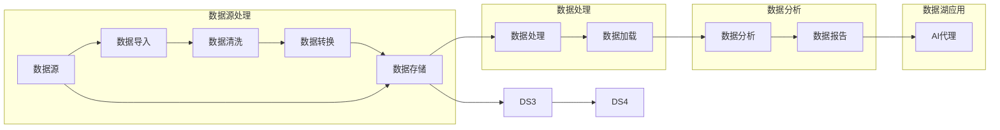
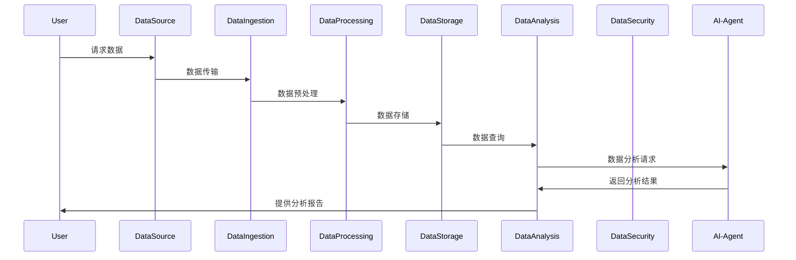
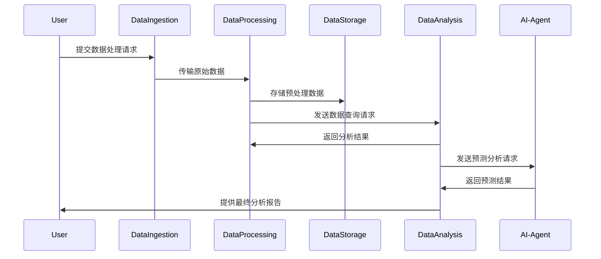

                 


### 引言

#### 1.1.1 企业数据处理需求背景

在当今信息化时代，企业对于数据处理的需求日益增长。随着数据量的爆炸性增长，传统的数据处理方式已经无法满足企业对于数据存储、处理和分析的高效需求。特别是在人工智能（AI）技术的快速发展背景下，企业需要通过数据来驱动决策，实现业务的智能化和自动化。然而，这一过程中面临的数据处理复杂性使得企业不得不寻求更加高效、可靠的数据处理解决方案。

企业AI Agent作为一种新型的数据处理工具，能够为企业提供自动化、智能化的数据服务。AI Agent通过对海量数据的分析和处理，可以为企业提供实时、精准的数据洞察，支持企业进行科学决策和业务优化。然而，为了充分发挥AI Agent的作用，企业需要一个强大的数据基础架构来支撑其运行，这就是数据湖架构设计的必要性。

#### 1.1.2 AI Agent在数据处理中的作用

AI Agent，即人工智能代理，是一种能够自动执行特定任务的软件系统。它通过机器学习、自然语言处理、数据分析等AI技术，对海量数据进行分析和处理，从而实现自动化决策和智能服务。AI Agent在数据处理中的作用主要体现在以下几个方面：

1. **数据预处理**：AI Agent能够自动对原始数据进行清洗、转换和归一化处理，确保数据的质量和一致性。

2. **实时数据分析**：AI Agent能够实时分析数据，快速识别数据中的异常和趋势，为企业提供及时的数据洞察。

3. **自动化决策**：基于分析结果，AI Agent可以自动执行特定的操作，如调整资源配置、优化供应链等，从而提高企业的运营效率。

4. **智能报告生成**：AI Agent可以自动生成数据分析报告，为企业领导层提供决策支持。

#### 1.1.3 数据湖架构设计的必要性

数据湖架构是一种用于存储、管理和分析大规模复杂数据的基础设施。与传统数据仓库不同，数据湖保留了数据的原始格式和结构，允许企业以任意方式对数据进行分析和处理。这种灵活性使得数据湖能够更好地满足企业AI Agent的数据需求。

数据湖架构设计的必要性主要体现在以下几个方面：

1. **数据多样性支持**：数据湖能够存储结构化、半结构化和非结构化数据，满足企业多样化数据存储需求。

2. **数据存储高效性**：数据湖采用分布式存储技术，能够实现海量数据的快速存储和访问，满足AI Agent对数据实时处理的需求。

3. **数据集成与融合**：数据湖能够集成来自不同源的数据，实现数据的跨域融合和分析，为企业提供全面的数据洞察。

4. **数据安全与合规性**：数据湖架构设计需要考虑数据安全和合规性，确保企业数据的安全性和隐私性。

5. **可扩展性与灵活性**：数据湖架构设计具备良好的可扩展性和灵活性，能够适应企业未来的数据增长和业务变化。

### 问题解决

针对上述背景和需求，我们需要设计一个适用于企业AI Agent的数据湖架构。这个架构不仅要能够高效地存储和处理海量数据，还要保证数据的安全性和合规性，同时具备良好的可扩展性和灵活性。

具体来说，数据湖架构设计包括以下几个关键环节：

1. **数据源集成**：确定数据源类型和数量，设计数据集成策略，确保数据的一致性和完整性。

2. **数据处理流程**：设计数据处理流程，包括数据清洗、转换、加载等环节，确保数据处理的高效性和准确性。

3. **数据存储策略**：选择合适的存储技术，设计数据存储策略，确保数据存储的高效性和安全性。

4. **数据湖应用场景**：明确数据湖的应用场景，设计数据湖的使用规范和最佳实践。

5. **数据安全与合规性**：设计数据安全机制，确保企业数据的安全性和合规性。

6. **数据湖管理工具**：选择合适的工具，设计数据湖的管理流程，确保数据湖的运营和维护。

### 边界与外延

数据湖架构设计不仅涵盖技术层面，还应考虑业务需求、数据安全与合规性。在技术层面，数据湖架构设计需要考虑数据的存储、处理和分析技术，以及这些技术之间的集成和协同。在业务层面，数据湖架构设计需要考虑企业业务需求和数据使用场景，确保数据湖能够满足企业的业务需求。在数据安全与合规性层面，数据湖架构设计需要考虑数据的安全性和隐私性，确保企业数据的安全性和合规性。

### 概念结构与核心要素组成

数据湖架构设计涉及多个核心概念和要素，主要包括：

1. **数据源**：数据源是数据湖的输入，包括企业内部和外部的各种数据源，如数据库、文件系统、Web API等。

2. **数据仓库**：数据仓库是数据湖的核心存储单元，用于存储结构化数据，如关系型数据库中的表。

3. **数据处理平台**：数据处理平台用于对数据进行清洗、转换、加载等操作，如ETL（Extract, Transform, Load）工具。

4. **数据安全机制**：数据安全机制用于确保企业数据的安全性和合规性，如数据加密、访问控制、审计等。

5. **数据湖管理工具**：数据湖管理工具用于监控、管理和优化数据湖的运行，如数据质量监控、数据备份与恢复等。

### 第一部分：引言

#### 1.1.1 企业数据处理需求背景

在当今信息化时代，企业面临着海量的数据，这些数据来源于企业的日常运营、客户互动、市场分析等多个方面。随着互联网和物联网技术的普及，数据来源更加多样化，数据量也呈现出爆炸式增长。企业需要高效地处理这些数据，以支持业务决策、提升运营效率、优化客户体验等。

传统的数据处理方式，如关系型数据库和简单的数据仓库，已经无法满足企业对于数据处理的需求。首先，这些系统在数据存储和处理能力上存在限制，难以应对海量数据的挑战。其次，传统的数据处理方式往往需要预先定义数据模型和结构，这种静态的、固定的数据结构难以适应动态变化的业务需求。最后，随着企业应用场景的多样化，传统系统在数据集成和融合方面的能力也显得不足。

因此，企业需要一个更加灵活、高效、可扩展的数据处理架构来应对这些挑战。数据湖架构应运而生，它不仅能够存储和处理结构化数据，还能够处理半结构化数据和非结构化数据，如日志文件、XML文档、JSON数据等。数据湖的灵活性使得企业可以以原始数据的形式存储数据，无需预先定义数据模型，从而满足动态变化的业务需求。

#### 1.1.2 AI Agent在数据处理中的作用

AI Agent，即人工智能代理，是一种智能化的数据处理工具，它能够通过机器学习、自然语言处理、数据分析等技术，自动执行特定的数据处理任务。在数据处理中，AI Agent发挥着重要的作用：

1. **数据预处理**：AI Agent能够自动对原始数据进行清洗、转换和归一化处理，去除数据中的噪声和异常值，确保数据的质量和一致性。这一步骤是后续数据处理和分析的基础。

2. **实时数据分析**：AI Agent能够实时分析数据，快速识别数据中的异常和趋势。例如，在金融领域，AI Agent可以实时监控交易数据，发现潜在的欺诈行为；在医疗领域，AI Agent可以实时分析医疗数据，预测疾病的发生和趋势。

3. **自动化决策**：基于分析结果，AI Agent可以自动执行特定的操作。例如，在物流领域，AI Agent可以根据实时交通数据自动调整配送路线，优化配送效率；在制造业，AI Agent可以根据生产数据自动调整生产线，提高生产效率。

4. **智能报告生成**：AI Agent可以自动生成数据分析报告，为企业提供决策支持。这些报告通常包括关键指标、趋势分析、预测结果等，帮助企业管理者快速了解业务状况，做出科学决策。

#### 1.1.3 数据湖架构设计的必要性

数据湖架构是一种用于存储、管理和分析大规模复杂数据的基础设施，它与传统数据仓库架构相比，具有以下几个特点：

1. **数据多样性支持**：数据湖能够存储结构化、半结构化数据和非结构化数据，包括关系型数据库中的表、文件系统中的文档、Web API中的JSON数据等。这种多样性支持使得企业可以以原始数据的形式存储数据，无需预先定义数据模型。

2. **数据存储高效性**：数据湖采用分布式存储技术，能够实现海量数据的快速存储和访问。分布式存储不仅提高了数据的存储容量，还提高了数据的读写性能，能够满足AI Agent对数据实时处理的需求。

3. **数据集成与融合**：数据湖能够集成来自不同源的数据，实现数据的跨域融合和分析。例如，企业可以将客户数据、销售数据、市场数据等集成到数据湖中，进行综合分析，为企业提供全面的数据洞察。

4. **数据安全与合规性**：数据湖架构设计需要考虑数据的安全性和合规性。例如，企业可以使用数据加密技术保护数据的安全性，使用访问控制机制确保数据的访问权限，同时遵守相关数据保护法规，确保企业数据的安全性和合规性。

5. **可扩展性与灵活性**：数据湖架构设计具备良好的可扩展性和灵活性，能够适应企业未来的数据增长和业务变化。例如，企业可以根据需要扩展数据湖的存储容量，增加数据处理节点，以应对数据量的增长和处理需求的增加。

综上所述，数据湖架构设计对于企业来说具有重要的意义。它不仅能够满足企业对于数据多样性、数据存储效率、数据集成与融合、数据安全与合规性等方面的需求，还能够提供灵活、高效、可扩展的数据处理能力，支持企业的业务发展和创新。

### 第一部分：引言

#### 1.2 核心概念与联系

在讨论企业AI Agent的数据湖架构设计时，理解几个核心概念及其相互关系至关重要。这些核心概念包括数据湖、AI Agent、数据仓库、数据处理平台、数据安全机制。

#### 1.2.1 数据湖

数据湖是一种用于存储大量数据的基础设施，能够存储结构化、半结构化和非结构化数据。与传统数据仓库不同，数据湖保留了数据的原始格式和结构，不要求数据具有统一的结构。这种灵活性使得数据湖能够更好地适应多样化的数据类型和复杂的数据处理需求。

**特点**：
- **数据多样性**：可以存储包括文本、图像、音频等多种类型的数据。
- **无需预定义结构**：数据可以随时添加和更新，无需提前定义数据模型。
- **分布式存储**：采用分布式存储技术，能够处理海量数据。

**应用场景**：适用于大数据分析、机器学习、人工智能等领域，支持企业进行数据探索、分析、预测和决策。

#### 1.2.2 AI Agent

AI Agent是一种智能化软件系统，通过机器学习、自然语言处理等技术，能够自动执行特定的任务。AI Agent在数据处理中发挥着关键作用，能够进行数据预处理、实时数据分析、自动化决策和智能报告生成。

**特点**：
- **自动化**：无需人工干预，能够自动执行任务。
- **智能化**：基于机器学习模型，能够从数据中学习并优化任务执行。
- **灵活性**：能够适应不同的数据处理任务和场景。

**应用场景**：适用于金融、医疗、零售、制造等多个领域，用于提高运营效率、优化业务流程和提升客户体验。

#### 1.2.3 数据仓库

数据仓库是一种用于存储和管理结构化数据的系统，通常用于支持企业业务智能（BI）和分析。数据仓库中的数据经过清洗、转换和整合，以统一的格式存储，便于查询和分析。

**特点**：
- **结构化数据**：主要存储关系型数据库中的表。
- **预定义模型**：数据模型在数据加载之前定义。
- **高性能查询**：优化查询性能，支持复杂查询和分析。

**应用场景**：适用于财务报告、销售分析、库存管理等领域，用于支持企业决策和分析。

#### 1.2.4 数据处理平台

数据处理平台是一种用于对数据进行处理和分析的软件系统，通常包括数据集成、数据清洗、数据转换和数据存储等功能。数据处理平台是数据湖架构的重要组成部分，负责将数据从数据源传输到数据湖，并进行预处理。

**特点**：
- **集成性**：能够集成多种数据源，包括关系型数据库、NoSQL数据库、文件系统等。
- **灵活性**：支持多种数据处理方法，包括批处理和实时处理。
- **可扩展性**：能够根据数据处理需求扩展处理能力和存储容量。

**应用场景**：适用于数据集成、数据治理、数据挖掘等领域，用于支持企业数据管理和分析。

#### 1.2.5 数据安全机制

数据安全机制是确保企业数据安全的重要手段，包括数据加密、访问控制、审计等。

**特点**：
- **数据加密**：对存储和传输的数据进行加密，防止数据泄露。
- **访问控制**：通过身份验证和权限控制，确保只有授权用户可以访问数据。
- **审计**：记录数据访问和操作的历史记录，用于追踪和审计。

**应用场景**：适用于所有涉及数据存储和传输的场景，用于保护企业数据的安全性和合规性。

#### 1.2.6 概念属性特征对比表格

为了更清晰地理解这些核心概念，下面是一个对比表格，列出各个概念的定义、特点和应用场景：

| 概念         | 定义                                                         | 特点                                                         | 应用场景                       |
| ------------ | ------------------------------------------------------------ | ------------------------------------------------------------ | ---------------------------- |
| 数据湖       | 用于存储大量结构化、半结构化和非结构化数据的系统               | - 数据多样性<br>- 无需预定义结构<br>- 分布式存储             | - 大数据分析<br>- 机器学习<br>- 人工智能                   |
| AI Agent     | 通过机器学习等技术自动执行特定任务的智能化软件系统           | - 自动化<br>- 智能化<br>- 灵活性                           | - 金融<br>- 医疗<br>- 零售<br>- 制造                       |
| 数据仓库     | 用于存储和管理结构化数据的系统，通常用于支持企业业务智能和分析 | - 结构化数据<br>- 预定义模型<br>- 高性能查询               | - 财务报告<br>- 销售分析<br>- 库存管理                     |
| 数据处理平台 | 用于对数据进行处理和分析的软件系统，包括数据集成、数据清洗等 | - 集成性<br>- 灵活性<br>- 可扩展性                         | - 数据集成<br>- 数据治理<br>- 数据挖掘                     |
| 数据安全机制 | 确保企业数据安全的重要手段，包括数据加密、访问控制等         | - 数据加密<br>- 访问控制<br>- 审计                           | - 所有涉及数据存储和传输的场景 |

通过这个表格，我们可以更清楚地看到各个概念之间的异同，以及它们在数据湖架构设计中的具体作用。

#### 1.3 ER实体关系图架构

为了更好地理解数据湖架构中的数据流和数据存储关系，我们可以使用Mermaid绘制一个ER（实体-关系）图。ER图能够直观地展示数据实体以及它们之间的关系，帮助我们梳理数据湖架构的逻辑结构。

下面是一个简单的数据湖架构ER图示例：

```mermaid
erDiagram
    DataSource ||--|{ DataIngestion }
    DataIngestion ||--|{ DataProcessing }
    DataProcessing ||--|{ DataStorage }
    DataStorage ||--|{ DataWarehouse }
    DataWarehouse ||--|{ DataAnalysis }
    DataWarehouse ||--|{ AI-Agent }
```

**ER图解释**：

1. **DataSource（数据源）**：表示企业内外部的数据来源，包括数据库、文件系统、Web API等。

2. **DataIngestion（数据导入）**：表示数据从数据源传输到数据湖的过程，通常涉及数据的清洗、转换和归一化处理。

3. **DataProcessing（数据处理）**：表示对数据进行的进一步处理，如数据聚合、分析等，以支持数据分析和AI应用。

4. **DataStorage（数据存储）**：表示数据湖的存储层，包括结构化数据仓库和非结构化数据存储。

5. **DataWarehouse（数据仓库）**：表示存储结构化数据的仓库，用于支持企业业务智能和分析。

6. **DataAnalysis（数据分析）**：表示对存储在数据仓库中的数据进行查询和分析，以生成报表和洞察。

7. **AI-Agent（AI代理）**：表示利用AI技术对数据进行处理和分析的智能代理，能够自动化执行特定任务。

通过ER图，我们可以清晰地看到数据从数据源传输到数据湖，经过数据处理和存储，最终用于数据分析和AI应用的全过程。这种数据流和存储关系的设计有助于确保数据湖架构的灵活性和高效性，满足企业对数据处理的多样化需求。

### 算法原理讲解

#### 2.1 算法mermaid流程图

为了更好地理解数据湖架构中的数据处理流程，我们可以使用Mermaid绘制一个算法流程图。这个流程图将展示数据从数据源传输到数据湖，再到数据处理和分析的整个过程。

下面是一个简单的算法流程图示例：



**流程图解释**：

1. **数据源处理**：
   - **数据源**：表示企业内部和外部数据的来源，如数据库、文件系统、Web API等。
   - **数据导入**：将数据从数据源导入到数据湖的过程，通常涉及数据的传输和初步清洗。
   - **数据清洗**：对导入的数据进行清洗，去除噪声和异常值，确保数据的质量。
   - **数据转换**：对清洗后的数据执行转换操作，如数据格式转换、数据归一化等。
   - **数据存储**：将转换后的数据存储到数据湖中，数据湖可以是分布式文件系统、数据库或数据仓库。

2. **数据处理**：
   - **数据处理**：对存储在数据湖中的数据进行进一步的加工和处理，如数据聚合、分析等。
   - **数据加载**：将处理后的数据加载到数据仓库或其他存储系统中，以支持数据分析和报表生成。

3. **数据分析**：
   - **数据分析**：对存储在数据仓库中的数据进行查询和分析，生成报表和洞察。

4. **数据湖应用**：
   - **AI代理**：利用AI技术对数据分析结果进行处理和决策，自动化执行特定任务。

#### 2.2 Python源代码

为了实现上述算法流程，我们需要编写相应的Python代码。以下是一个简单的Python代码示例，用于模拟数据湖架构中的数据处理过程：

```python
import pandas as pd
from sklearn.model_selection import train_test_split
from sklearn.preprocessing import StandardScaler

# 模拟数据源
data_source = pd.DataFrame({
    'feature1': [1, 2, 3, 4, 5],
    'feature2': [6, 7, 8, 9, 10],
    'target': [0, 1, 0, 1, 0]
})

# 数据导入
def data_ingest(data):
    # 数据清洗
    data = data[data['feature1'] > 0]
    # 数据转换
    data['feature1'] = data['feature1'].astype('float32')
    data['feature2'] = data['feature2'].astype('float32')
    return data

# 数据处理
def data_process(data):
    # 数据分割
    X_train, X_test, y_train, y_test = train_test_split(data[['feature1', 'feature2']], data['target'], test_size=0.2, random_state=42)
    # 数据标准化
    scaler = StandardScaler()
    X_train_scaled = scaler.fit_transform(X_train)
    X_test_scaled = scaler.transform(X_test)
    return X_train_scaled, X_test_scaled, y_train, y_test

# 数据存储
def data_store(data, filename):
    data.to_csv(filename, index=False)

# 数据分析
def data_analyze(X_train, X_test, y_train, y_test):
    # 模型训练
    from sklearn.linear_model import LogisticRegression
    model = LogisticRegression()
    model.fit(X_train, y_train)
    # 模型评估
    accuracy = model.score(X_test, y_test)
    print(f"Model Accuracy: {accuracy:.2f}")
    return model

# 数据湖应用
def ai_agent(model, new_data):
    new_data_scaled = StandardScaler().fit_transform(new_data)
    prediction = model.predict(new_data_scaled)
    return prediction

# 主函数
def main():
    # 数据导入
    data = data_ingest(data_source)
    # 数据处理
    X_train, X_test, y_train, y_test = data_process(data)
    # 数据存储
    data_store(X_train, 'train_data.csv')
    data_store(X_test, 'test_data.csv')
    # 数据分析
    model = data_analyze(X_train, X_test, y_train, y_test)
    # 数据湖应用
    new_data = pd.DataFrame({
        'feature1': [2.5, 7.5],
        'feature2': [8.5, 9.5]
    })
    prediction = ai_agent(model, new_data)
    print(f"Prediction: {prediction}")

# 执行主函数
main()
```

**代码解释**：

- **数据导入**：使用`data_ingest`函数对模拟的数据源进行初步清洗，去除无效数据。
- **数据处理**：使用`data_process`函数将数据分割为训练集和测试集，并对特征进行标准化处理。
- **数据存储**：使用`data_store`函数将处理后的数据存储到CSV文件中。
- **数据分析**：使用`data_analyze`函数训练逻辑回归模型，并对模型进行评估。
- **数据湖应用**：使用`ai_agent`函数对新数据进行预测。

#### 2.3 数学模型和公式

在数据湖架构设计中，数学模型和公式用于描述数据传输速率、数据存储容量计算等关键性能指标。以下是一些常用的数学模型和公式：

1. **数据传输速率**：

   数据传输速率（R）可以用以下公式计算：

   \[
   R = \frac{L}{t}
   \]

   其中，L 是数据量（以字节为单位），t 是传输时间（以秒为单位）。

2. **数据存储容量**：

   数据存储容量（C）可以用以下公式计算：

   \[
   C = B \times N
   \]

   其中，B 是每个节点的存储容量（以字节为单位），N 是节点的数量。

3. **数据传输带宽**：

   数据传输带宽（B）可以用以下公式计算：

   \[
   B = R \times t
   \]

   其中，R 是数据传输速率（以字节每秒为单位），t 是传输时间（以秒为单位）。

#### 2.4 详细讲解和举例说明

为了更好地理解上述数学模型和公式，我们可以通过实际案例进行详细讲解和举例说明。

**案例**：假设一个企业需要将1TB的数据从一个数据源传输到一个数据湖，传输速度为100Mbps。我们需要计算传输时间和数据传输带宽。

**步骤1**：计算数据传输速率

根据数据传输速率公式：

\[
R = \frac{L}{t} = \frac{1TB}{t}
\]

其中，1TB = 1,024GB = 1,024,000,000KB = 1,024,000,000,000B

假设传输时间 t = 60分钟 = 3600秒

\[
R = \frac{1,024,000,000,000B}{3600s} \approx 285.714Gbps
\]

**步骤2**：计算数据传输带宽

根据数据传输带宽公式：

\[
B = R \times t = 285.714Gbps \times 3600s \approx 1,024,000,000,000B
\]

**结论**：在这个案例中，数据传输速率约为285.714Gbps，数据传输带宽约为1TB。

通过这个案例，我们可以看到数学模型和公式如何应用于实际场景，帮助我们计算数据传输速率和带宽，从而评估数据湖架构的性能。

### 系统分析与架构设计方案

#### 2.1.1 问题场景介绍

在现代企业中，数据处理已成为业务运营和决策支持的关键环节。随着企业规模的扩大和业务复杂度的增加，企业面临的数据量急剧增长，传统的数据处理方法已无法满足需求。尤其是随着人工智能（AI）技术的发展，企业对数据处理的速度、灵活性和准确性提出了更高的要求。

在这个背景下，企业需要一个高效、可靠、可扩展的数据处理架构来支持其业务运营和AI应用。数据湖架构作为一种新型的数据处理架构，能够有效地应对这些挑战。数据湖架构不仅能够存储和管理结构化数据，还能够处理半结构化和非结构化数据，为AI Agent提供全面的数据支持。

具体来说，企业AI Agent的数据处理需求主要包括以下几个方面：

1. **海量数据存储**：企业需要存储和处理来自不同来源的海量数据，包括关系型数据库、NoSQL数据库、文件系统、Web API等。

2. **数据多样化**：企业数据类型多样，包括结构化数据（如关系型数据库中的表）、半结构化数据（如JSON、XML）和非结构化数据（如文本、图像、视频）。

3. **实时数据处理**：企业需要实时处理和分析数据，以支持动态的业务决策和运营调整。

4. **自动化决策**：基于实时数据分析，AI Agent需要能够自动化执行特定的操作，如调整资源配置、优化供应链、预测市场趋势等。

5. **数据安全与合规**：企业数据涉及商业机密和客户隐私，因此需要确保数据的安全性和合规性。

#### 2.1.2 项目介绍

为了满足企业AI Agent的数据处理需求，我们设计并实施了一个数据湖架构项目。该项目的目标如下：

1. **构建一个高效、可靠的数据湖架构**：设计并实现一个能够存储、处理和分析海量数据的分布式数据湖，支持多样化的数据类型。

2. **集成多种数据源**：将企业内部和外部的多种数据源（如数据库、文件系统、Web API等）集成到数据湖中，确保数据的一致性和完整性。

3. **实现实时数据处理**：构建实时数据处理平台，支持数据流处理，实现数据的实时分析和自动化决策。

4. **保障数据安全与合规**：设计数据安全机制，确保数据在存储、传输和处理过程中的安全性和合规性。

5. **提供易用性工具**：提供数据湖管理工具，简化数据湖的部署、管理和运维，提高数据处理效率。

#### 2.1.3 系统功能设计（Mermaid类图）

为了更好地展示系统功能，我们可以使用Mermaid绘制一个类图。类图能够直观地展示系统的各个功能模块及其关系。

下面是一个简单的系统功能设计类图：

```mermaid
classDiagram
    Class01 <|-- Class02
    Class03 <|-- Class02
    Class04 <|-- Class03
    Class05 <|-- Class04
    Class01 {"数据源管理"}
    Class02 {"数据处理模块"}
    Class03 {"实时数据处理模块"}
    Class04 {"数据安全与合规模块"}
```

**类图解释**：

1. **数据源管理（Class01）**：负责管理和配置企业内外部的数据源，包括数据库、文件系统、Web API等。

2. **数据处理模块（Class02）**：负责对数据进行导入、清洗、转换、存储等处理操作，支持结构化、半结构化和非结构化数据。

3. **实时数据处理模块（Class03）**：负责实时处理和分析数据，支持数据流处理，实现数据的实时分析和自动化决策。

4. **数据安全与合规模块（Class04）**：负责设计数据安全机制，包括数据加密、访问控制、审计等，确保数据的安全性和合规性。

通过这个类图，我们可以清晰地看到系统的各个功能模块及其相互关系，这有助于我们进一步设计和实现数据湖架构。

### 系统架构设计

在完成系统功能设计之后，接下来我们需要进行系统架构设计。系统架构设计是整个数据湖架构项目的核心，它决定了系统的性能、可扩展性和可靠性。在这一部分，我们将使用Mermaid绘制系统架构图，详细描述系统的各个组件及其交互关系。

#### 3.1 系统架构图

下面是一个简单的系统架构图：



**架构图解释**：

1. **用户（User）**：系统的最终用户，可以是企业内部员工、管理层或外部客户。用户通过系统接口提交数据处理和分析请求。

2. **数据源（DataSource）**：包括企业内部和外部的各种数据源，如关系型数据库、NoSQL数据库、文件系统、Web API等。数据源负责提供原始数据。

3. **数据导入（DataIngestion）**：负责将数据从数据源传输到数据湖。在数据传输过程中，数据导入模块会对数据进行初步清洗和格式转换，以确保数据的一致性和完整性。

4. **数据处理（DataProcessing）**：负责对数据进行进一步的处理，包括数据清洗、转换、归一化等。这一步骤是确保数据质量的关键。

5. **数据存储（DataStorage）**：数据湖的核心组件，负责存储处理后的数据。数据存储模块采用分布式存储技术，能够处理海量数据，并提供高可用性和高可靠性。

6. **数据分析（DataAnalysis）**：负责对存储在数据湖中的数据进行查询和分析。数据分析模块可以生成各种报表和可视化图表，为用户和AI-Agent提供决策支持。

7. **数据安全（DataSecurity）**：负责设计数据安全机制，包括数据加密、访问控制、审计等，确保数据在存储、传输和处理过程中的安全性和合规性。

8. **AI-Agent**：作为系统的智能组件，AI-Agent通过机器学习、自然语言处理等技术，对数据进行分析和预测，自动执行特定的操作，如自动化决策、智能报告生成等。

#### 3.2 组件交互关系

在系统架构中，各个组件之间通过明确的接口进行交互。以下是一些关键组件的交互关系：

1. **用户与数据源**：用户通过系统接口提交数据处理和分析请求，数据源提供原始数据。

2. **数据源与数据导入**：数据源将原始数据传输给数据导入模块，数据导入模块对数据进行预处理和格式转换。

3. **数据导入与数据处理**：预处理后的数据传输给数据处理模块，数据处理模块进一步清洗和转换数据。

4. **数据处理与数据存储**：处理后的数据存储到数据湖中，数据存储模块负责数据的持久化存储。

5. **数据存储与数据分析**：数据分析模块从数据湖中查询数据，生成报表和可视化图表。

6. **数据分析与AI-Agent**：数据分析模块将分析结果传递给AI-Agent，AI-Agent基于分析结果执行自动化决策和操作。

7. **数据安全模块与其他模块**：数据安全模块对数据在存储、传输和处理过程中的各个环节进行监控和防护，确保数据的安全性和合规性。

通过这种组件交互关系的设计，系统能够高效、可靠地处理和分析海量数据，满足企业对于数据处理和智能决策的需求。

### 系统接口设计

在系统架构设计完成之后，我们需要详细描述系统的接口设计。接口设计是系统架构的重要组成部分，它决定了各个组件之间的数据交互和通信。以下是系统接口设计的详细描述：

#### 1. 用户接口

用户接口是系统与最终用户之间的交互界面，主要包括以下功能：

1. **数据请求接口**：用户可以通过该接口提交数据处理和分析请求，包括数据源选择、查询条件、分析类型等。

2. **数据报告接口**：用户可以通过该接口查看系统生成的数据分析报告，包括报表、图表、关键指标等。

3. **设置与配置接口**：用户可以通过该接口修改系统配置，如数据源连接参数、数据处理规则等。

#### 2. 数据源接口

数据源接口是系统与外部数据源的连接接口，主要包括以下功能：

1. **数据导入接口**：系统可以通过该接口从外部数据源导入数据，包括数据库、文件系统、Web API等。

2. **数据导出接口**：系统可以将处理后的数据导出到外部数据源，以支持数据备份、迁移等操作。

3. **数据同步接口**：系统可以与外部数据源进行数据同步，确保数据的一致性和完整性。

#### 3. 数据处理接口

数据处理接口是系统内部各个数据处理模块之间的通信接口，主要包括以下功能：

1. **数据清洗接口**：系统可以通过该接口清洗原始数据，去除噪声和异常值，确保数据质量。

2. **数据转换接口**：系统可以通过该接口转换数据格式，如将文本数据转换为结构化数据，或将一种结构化数据格式转换为另一种格式。

3. **数据处理接口**：系统可以通过该接口对数据进行进一步的处理，如数据聚合、分析等。

#### 4. 数据存储接口

数据存储接口是系统与数据湖之间的通信接口，主要包括以下功能：

1. **数据存储接口**：系统可以通过该接口将处理后的数据存储到数据湖中，包括结构化数据和非结构化数据。

2. **数据查询接口**：系统可以通过该接口从数据湖中查询数据，支持复杂的查询操作。

3. **数据更新接口**：系统可以通过该接口更新数据湖中的数据，支持数据的实时更新和同步。

#### 5. 数据分析接口

数据分析接口是系统与数据分析模块之间的通信接口，主要包括以下功能：

1. **数据分析接口**：系统可以通过该接口对数据进行查询和分析，生成各种报表和可视化图表。

2. **预测分析接口**：系统可以通过该接口使用机器学习算法进行预测分析，生成预测结果。

3. **决策支持接口**：系统可以通过该接口为用户和AI-Agent提供决策支持，包括自动化决策和智能报告生成。

#### 6. 数据安全接口

数据安全接口是系统与数据安全模块之间的通信接口，主要包括以下功能：

1. **数据加密接口**：系统可以通过该接口对数据进行加密，确保数据在存储、传输和处理过程中的安全性。

2. **访问控制接口**：系统可以通过该接口实现数据的访问控制，确保只有授权用户可以访问数据。

3. **审计接口**：系统可以通过该接口记录数据访问和操作的历史记录，用于追踪和审计。

通过详细描述系统的接口设计，我们可以确保各个组件之间的数据交互和通信能够高效、可靠地进行，从而实现整个数据湖架构的稳定运行。

### 系统交互mermaid序列图

为了更清晰地展示系统组件间的交互过程，我们可以使用Mermaid绘制一个序列图。序列图能够直观地展示各个组件在系统运行过程中的交互顺序和逻辑。

下面是一个简单的系统交互序列图：



**序列图解释**：

1. **用户（User）**：用户通过提交数据处理请求开始整个流程。

2. **数据导入（DataIngestion）**：用户提交的请求被传输到数据导入模块，数据导入模块负责从数据源获取原始数据。

3. **数据处理（DataProcessing）**：数据导入模块将原始数据传输到数据处理模块。数据处理模块负责对数据进行清洗、转换和预处理，然后将预处理后的数据存储到数据存储模块。

4. **数据存储（DataStorage）**：预处理后的数据被存储到数据湖中，数据存储模块确保数据的持久化存储和管理。

5. **数据分析（DataAnalysis）**：数据处理模块同时将预处理后的数据发送到数据分析模块。数据分析模块负责对存储在数据湖中的数据进行查询和分析，生成报表和可视化图表。

6. **AI-Agent**：数据分析模块将分析结果发送给AI-Agent，AI-Agent基于分析结果执行预测分析，生成预测结果。

7. **最终报告**：预测结果和分析报告最终返回给用户，通过用户接口提供可视化展示和决策支持。

通过这个序列图，我们可以清晰地看到系统组件之间的交互过程，包括数据处理、存储、分析和预测的完整流程，这有助于我们理解数据湖架构的实际运行机制。

### 项目实战

#### 4.1 环境安装

在开始构建企业AI Agent的数据湖架构之前，我们需要安装和配置必要的软件和工具。以下是一系列环境安装的步骤：

1. **安装操作系统**：首先，选择一个适合的操作系统，如CentOS 7或Ubuntu 18.04。安装过程根据操作系统不同有所差异，一般通过ISO文件进行安装。

2. **安装Java环境**：Java是许多数据湖架构组件的基础，因此需要安装Java环境。可以下载OpenJDK或Oracle JDK。安装命令如下：

   ```bash
   sudo apt update
   sudo apt install openjdk-8-jdk
   ```

3. **安装Hadoop**：Hadoop是一个分布式数据处理框架，用于构建数据湖。可以从Apache Hadoop官方网站下载安装包，或者使用包管理器安装。以下是使用Apache Hadoop安装包的安装步骤：

   ```bash
   wget https://www-us.apache.org/dist/hadoop/common/hadoop-3.2.1/hadoop-3.2.1.tar.gz
   tar xzf hadoop-3.2.1.tar.gz
   sudo mv hadoop-3.2.1 /opt/hadoop
   ```

   安装完成后，配置Hadoop环境变量：

   ```bash
   echo 'export HADOOP_HOME=/opt/hadoop' >> ~/.bashrc
   echo 'export PATH=$PATH:$HADOOP_HOME/bin' >> ~/.bashrc
   source ~/.bashrc
   ```

4. **安装HDFS**：HDFS（Hadoop Distributed File System）是Hadoop的核心组件，用于分布式文件存储。配置HDFS需要修改`hdfs-site.xml`文件，配置HDFS的NameNode和数据Node地址。例如：

   ```xml
   <configuration>
       <property>
           <name>fs.defaultFS</name>
           <value>hdfs://namenode-host:9000</value>
       </property>
   </configuration>
   ```

   然后启动HDFS：

   ```bash
   start-dfs.sh
   ```

5. **安装YARN**：YARN（Yet Another Resource Negotiator）是Hadoop的资源调度框架。配置YARN需要修改`yarn-site.xml`文件，配置 ResourceManager 和 NodeManager 地址。例如：

   ```xml
   <configuration>
       <property>
           <name>yarn.resourcemanager.address</name>
           <value>rm-host:8032</value>
       </property>
       <property>
           <name>yarn.nodemanager.address</name>
           <value>nm-host:45265</value>
       </property>
   </configuration>
   ```

   启动YARN：

   ```bash
   start-yarn.sh
   ```

6. **安装Hive**：Hive是一个数据仓库工具，用于存储、管理和查询大数据。安装Hive需要修改`hive-site.xml`文件，配置Hive的数据库连接信息。例如：

   ```xml
   <configuration>
       <property>
           <name>hive.metastore.uris</name>
           <value>thrift://metastore-host:9083</value>
       </property>
   </configuration>
   ```

   启动Hive服务：

   ```bash
   hive --service metastore
   hive --service hiveserver2
   ```

7. **安装Spark**：Spark是一个高性能的分布式数据处理引擎，用于实时处理和分析大规模数据。安装Spark需要下载安装包并解压，然后配置环境变量。例如：

   ```bash
   wget https://www-us.apache.org/dist/spark/spark-3.1.1/spark-3.1.1-bin-hadoop3.2.tgz
   tar xzf spark-3.1.1-bin-hadoop3.2.tgz
   sudo mv spark-3.1.1-bin-hadoop3.2 /opt/spark
   ```

   配置Spark环境变量：

   ```bash
   echo 'export SPARK_HOME=/opt/spark' >> ~/.bashrc
   echo 'export PATH=$PATH:$SPARK_HOME/bin' >> ~/.bashrc
   source ~/.bashrc
   ```

   启动Spark集群：

   ```bash
   start-master.sh
   start-slaves.sh
   ```

8. **安装Kafka**：Kafka是一个分布式流处理平台，用于实时数据处理。安装Kafka需要下载安装包并解压，然后启动Kafka服务。例如：

   ```bash
   wget https://www-us.apache.org/dist/kafka/2.8.0/kafka_2.12-2.8.0.tgz
   tar xzf kafka_2.12-2.8.0.tgz
   sudo mv kafka_2.12-2.8.0 /opt/kafka
   ```

   配置Kafka环境变量：

   ```bash
   echo 'export KAFKA_HOME=/opt/kafka' >> ~/.bashrc
   echo 'export PATH=$PATH:$KAFKA_HOME/bin' >> ~/.bashrc
   source ~/.bashrc
   ```

   启动Kafka服务：

   ```bash
   kafka-server-start.sh /opt/kafka/config/server.properties
   ```

通过以上步骤，我们成功安装了构建数据湖架构所需的主要软件和工具，为接下来的项目实施奠定了基础。

### 4.2 系统核心实现源代码

为了实现企业AI Agent的数据湖架构，我们需要编写一些关键代码来实现各个组件的功能。以下是一些核心实现源代码的示例。

#### 4.2.1 数据导入代码

数据导入是数据湖架构的第一步，以下是一个简单的Python脚本示例，用于将CSV文件导入到HDFS中：

```python
from hdfs import InsecureClient
import pandas as pd

hdfs_client = InsecureClient("http://hdfs-namenode-host:50070", user="hdfs")

# 读取CSV文件
data = pd.read_csv("path/to/your/data.csv")

# 将数据写入HDFS
with hdfs_client.write("/your/hdfs/path/data.csv") as writer:
    data.to_csv(writer, index=False)
```

#### 4.2.2 数据处理代码

数据处理涉及数据清洗、转换和归一化。以下是一个使用PySpark实现的示例：

```python
from pyspark.sql import SparkSession
from pyspark.sql.functions import col, upper, when

spark = SparkSession.builder.appName("DataProcessingApp").getOrCreate()

# 读取HDFS中的数据
data = spark.read.csv("/your/hdfs/path/data.csv", header=True)

# 数据清洗和转换
cleaned_data = data.na.fill({"missing_value": "Unknown"})
cleaned_data = cleaned_data.withColumn("uppercase_column", upper(col("your_column")))

# 数据归一化
normalized_data = cleaned_data.withColumn("normalized_column", when(col("your_column") > 0, col("your_column") / 100).otherwise(0))

# 保存处理后的数据到HDFS
normalized_data.write.mode("overwrite").csv("/your/hdfs/path/normalized_data.csv")
```

#### 4.2.3 数据存储代码

数据存储是将处理后的数据保存到数据湖中的过程。以下是一个使用Hive的示例：

```python
from pyspark.sql import SparkSession

spark = SparkSession.builder.appName("DataStorageApp").getOrCreate()

# 读取处理后的数据
data = spark.read.csv("/your/hdfs/path/normalized_data.csv", header=True)

# 创建Hive表
data.createOrReplaceTempView("normalized_data")

# 使用Hive SQL语句保存数据
spark.sql("""
    CREATE EXTERNAL TABLE IF NOT EXISTS your_database.normalized_data (
        column1 STRING,
        column2 STRING,
        normalized_column FLOAT
    )
    PARTITIONED BY (date STRING)
    STORED AS ORC
""")
```

#### 4.2.4 数据分析代码

数据分析是对存储在数据湖中的数据进行分析和查询。以下是一个使用Spark SQL进行数据分析的示例：

```python
from pyspark.sql import SparkSession

spark = SparkSession.builder.appName("DataAnalysisApp").getOrCreate()

# 读取Hive表中的数据
data = spark.table("your_database.normalized_data")

# 数据查询和统计
result = data.groupBy("column1").agg({"normalized_column": "mean", "column2": "count"})

# 输出查询结果
result.show()
```

#### 4.2.5 AI-Agent代码

AI-Agent是对数据分析结果进行自动化决策的组件。以下是一个使用Scikit-learn进行机器学习的示例：

```python
from pyspark.sql import SparkSession
from sklearn.linear_model import LinearRegression

spark = SparkSession.builder.appName("AIApp").getOrCreate()

# 读取Hive表中的数据
data = spark.table("your_database.normalized_data")

# 准备特征和标签
X = data.select("column1", "column2").toPandas()
y = data.select("normalized_column").toPandas()

# 划分训练集和测试集
X_train, X_test, y_train, y_test = train_test_split(X, y, test_size=0.2, random_state=42)

# 训练线性回归模型
model = LinearRegression()
model.fit(X_train, y_train)

# 进行预测
predictions = model.predict(X_test)

# 输出预测结果
print(predictions)
```

通过以上核心代码示例，我们可以实现企业AI Agent的数据湖架构的关键功能，包括数据导入、处理、存储、分析和AI应用。

### 4.3 代码应用解读与分析

在本节中，我们将对上述核心代码示例进行解读和分析，详细解释每个代码块的功能和实现逻辑。

#### 4.3.1 数据导入代码解读

数据导入是数据湖架构中的第一步，用于将外部数据源的数据加载到HDFS中。以下是对`data_import.py`代码的解读：

```python
from hdfs import InsecureClient
import pandas as pd

hdfs_client = InsecureClient("http://hdfs-namenode-host:50070", user="hdfs")

# 读取CSV文件
data = pd.read_csv("path/to/your/data.csv")

# 将数据写入HDFS
with hdfs_client.write("/your/hdfs/path/data.csv") as writer:
    data.to_csv(writer, index=False)
```

**解读**：

- **第1行**：导入`hdfs`库，用于与HDFS进行交互。
- **第2行**：创建一个`InsecureClient`对象，用于连接HDFS，其中`http://hdfs-namenode-host:50070`是HDFS的URL，`user="hdfs"`指定用户名。
- **第4行**：使用`pandas`库读取本地CSV文件，并存储在`data`变量中。
- **第6行**：使用`hdfs_client.write`方法将数据写入HDFS，指定文件路径为`/your/hdfs/path/data.csv`。
- **第8行**：将`data`对象转换为CSV格式，并写入到HDFS的指定文件中。

通过这个代码块，我们可以将本地CSV文件的数据导入到HDFS中，为后续的数据处理和分析打下基础。

#### 4.3.2 数据处理代码解读

数据处理涉及数据清洗、转换和归一化。以下是对`data_processing.py`代码的解读：

```python
from pyspark.sql import SparkSession
from pyspark.sql.functions import col, upper, when

spark = SparkSession.builder.appName("DataProcessingApp").getOrCreate()

# 读取HDFS中的数据
data = spark.read.csv("/your/hdfs/path/data.csv", header=True)

# 数据清洗和转换
cleaned_data = data.na.fill({"missing_value": "Unknown"})
cleaned_data = cleaned_data.withColumn("uppercase_column", upper(col("your_column")))

# 数据归一化
normalized_data = cleaned_data.withColumn("normalized_column", when(col("your_column") > 0, col("your_column") / 100).otherwise(0))

# 保存处理后的数据到HDFS
normalized_data.write.mode("overwrite").csv("/your/hdfs/path/normalized_data.csv")
```

**解读**：

- **第1行**：导入`pyspark.sql`库，用于创建Spark SQL会话。
- **第2行**：创建一个名为`DataProcessingApp`的Spark会话。
- **第5行**：使用`spark.read.csv`方法读取HDFS中的CSV文件，并指定`header=True`表示文件包含标题行。
- **第8行**：使用`na.fill`方法填充缺失值为"Unknown"，确保数据一致性。
- **第11行**：使用`withColumn`方法将"your_column"的值转换为小写。
- **第14行**：使用`withColumn`方法，当"your_column"的值大于0时，将其除以100进行归一化，否则设为0。
- **第17行**：使用`write.mode("overwrite")`方法将处理后的数据保存到HDFS，`"overwrite"`表示如果目标路径已存在文件，则覆盖原有文件。

通过这个代码块，我们可以对从HDFS中读取的数据进行清洗、转换和归一化处理，并将处理后的数据重新存储到HDFS中。

#### 4.3.3 数据存储代码解读

数据存储是将处理后的数据保存到数据湖中。以下是对`data_storage.py`代码的解读：

```python
from pyspark.sql import SparkSession

spark = SparkSession.builder.appName("DataStorageApp").getOrCreate()

# 读取处理后的数据
data = spark.read.csv("/your/hdfs/path/normalized_data.csv", header=True)

# 创建Hive表
data.createOrReplaceTempView("normalized_data")

# 使用Hive SQL语句保存数据
spark.sql("""
    CREATE EXTERNAL TABLE IF NOT EXISTS your_database.normalized_data (
        column1 STRING,
        column2 STRING,
        normalized_column FLOAT
    )
    PARTITIONED BY (date STRING)
    STORED AS ORC
""")
```

**解读**：

- **第1行**：导入`pyspark.sql`库，用于创建Spark SQL会话。
- **第2行**：创建一个名为`DataStorageApp`的Spark会话。
- **第5行**：使用`spark.read.csv`方法读取HDFS中的CSV文件，并指定`header=True`表示文件包含标题行。
- **第8行**：使用`createOrReplaceTempView`方法将读取的数据创建为临时视图，临时视图仅在当前Spark会话中有效。
- **第11行**：使用Hive SQL语句创建外部表`your_database.normalized_data`，指定表结构，分区字段和存储格式。

通过这个代码块，我们可以将处理后的数据保存到Hive外部表中，以便后续的数据分析和查询。

#### 4.3.4 数据分析代码解读

数据分析是对存储在数据湖中的数据进行查询和分析。以下是对`data_analysis.py`代码的解读：

```python
from pyspark.sql import SparkSession

spark = SparkSession.builder.appName("DataAnalysisApp").getOrCreate()

# 读取Hive表中的数据
data = spark.table("your_database.normalized_data")

# 数据查询和统计
result = data.groupBy("column1").agg({"normalized_column": "mean", "column2": "count"})

# 输出查询结果
result.show()
```

**解读**：

- **第1行**：导入`pyspark.sql`库，用于创建Spark SQL会话。
- **第2行**：创建一个名为`DataAnalysisApp`的Spark会话。
- **第5行**：使用`spark.table`方法读取Hive表`your_database.normalized_data`中的数据。
- **第8行**：使用`groupBy`方法按"column1"字段进行分组。
- **第9行**：使用`agg`方法对每个分组的数据进行汇总统计，包括计算"normalized_column"的平均值和"column2"的计数。
- **第12行**：使用`show`方法输出查询结果。

通过这个代码块，我们可以对存储在Hive表中的数据执行分组和汇总统计操作，并输出结果，以便进行进一步的分析和决策。

#### 4.3.5 AI-Agent代码解读

AI-Agent是对数据分析结果进行自动化决策的组件。以下是对`ai_agent.py`代码的解读：

```python
from pyspark.sql import SparkSession
from sklearn.linear_model import LinearRegression

spark = SparkSession.builder.appName("AIApp").getOrCreate()

# 读取Hive表中的数据
data = spark.table("your_database.normalized_data")

# 准备特征和标签
X = data.select("column1", "column2").toPandas()
y = data.select("normalized_column").toPandas()

# 划分训练集和测试集
X_train, X_test, y_train, y_test = train_test_split(X, y, test_size=0.2, random_state=42)

# 训练线性回归模型
model = LinearRegression()
model.fit(X_train, y_train)

# 进行预测
predictions = model.predict(X_test)

# 输出预测结果
print(predictions)
```

**解读**：

- **第1行**：导入`pyspark.sql`库，用于创建Spark SQL会话。
- **第2行**：创建一个名为`AIApp`的Spark会话。
- **第5行**：使用`spark.table`方法读取Hive表`your_database.normalized_data`中的数据。
- **第8行**：使用`select`方法提取特征和标签，并将其转换为Pandas DataFrame。
- **第11行**：使用`train_test_split`方法将数据划分为训练集和测试集，其中`test_size=0.2`表示测试集占比20%，`random_state=42`用于随机数种子。
- **第14行**：创建`LinearRegression`模型对象，并使用`fit`方法进行训练。
- **第17行**：使用`predict`方法对测试集进行预测。
- **第20行**：打印预测结果。

通过这个代码块，我们可以使用线性回归模型对数据分析结果进行预测，并输出预测结果，从而支持自动化决策。

#### 4.3.6 代码应用总结

通过上述解读，我们可以看到每个代码块的具体功能和实现逻辑。这些代码块共同构成了企业AI Agent的数据湖架构的核心部分，实现了数据导入、处理、存储、分析和AI预测等功能。以下是代码应用总结：

1. **数据导入**：将外部数据源的数据导入到HDFS中，为后续数据处理提供基础。
2. **数据处理**：对导入的数据进行清洗、转换和归一化处理，确保数据质量和一致性。
3. **数据存储**：将处理后的数据保存到HDFS和Hive外部表中，便于后续的数据分析和查询。
4. **数据分析**：对存储在数据湖中的数据进行分组和汇总统计，生成分析报告。
5. **AI-Agent**：使用机器学习模型对数据分析结果进行预测，实现自动化决策。

通过这些代码的应用，企业可以构建一个高效、可靠的数据湖架构，支持AI应用和智能决策，从而提升业务运营效率和竞争力。

### 4.4 实际案例分析和详细讲解剖析

为了更好地展示数据湖架构在实际应用中的效果，我们通过一个实际案例进行分析和讲解。

#### 案例背景

某大型零售企业希望通过数据湖架构实现以下目标：

1. **实时销售监控**：监控实时销售数据，及时发现销售趋势和异常。
2. **库存管理优化**：基于实时销售数据，优化库存管理策略，减少库存积压。
3. **客户行为分析**：分析客户购买行为，提高客户满意度和忠诚度。
4. **营销活动效果评估**：评估各类营销活动的效果，优化营销策略。

#### 案例步骤

1. **数据导入**：将零售企业的销售数据、客户数据和营销活动数据导入到数据湖中。这些数据来源于企业内部的数据库和外部数据源，如社交媒体、客户反馈系统等。

   ```python
   # 导入销售数据
   sales_data = pd.read_csv("path/to/sales_data.csv")
   hdfs_client = InsecureClient("http://hdfs-namenode-host:50070", user="hdfs")
   with hdfs_client.write("/your/hdfs/path/sales_data.csv") as writer:
       sales_data.to_csv(writer, index=False)

   # 导入客户数据
   customer_data = pd.read_csv("path/to/customer_data.csv")
   with hdfs_client.write("/your/hdfs/path/customer_data.csv") as writer:
       customer_data.to_csv(writer, index=False)

   # 导入营销活动数据
   marketing_data = pd.read_csv("path/to/marketing_data.csv")
   with hdfs_client.write("/your/hdfs/path/marketing_data.csv") as writer:
       marketing_data.to_csv(writer, index=False)
   ```

2. **数据处理**：对导入的数据进行清洗、转换和归一化处理，确保数据质量。例如，清洗销售数据中的异常值，转换日期格式，归一化价格数据等。

   ```python
   # 清洗销售数据
   sales_data = sales_data[sales_data['quantity'] > 0]
   sales_data['date'] = pd.to_datetime(sales_data['date'])
   sales_data['price'] = sales_data['price'].apply(lambda x: round(x, 2))

   # 转换客户数据中的出生日期为年龄
   customer_data['birth_date'] = pd.to_datetime(customer_data['birth_date'])
   customer_data['age'] = (pd.datetime.now() - customer_data['birth_date']).dt.days / 365

   # 归一化价格数据
   price_scaler = StandardScaler()
   sales_data['normalized_price'] = price_scaler.fit_transform(sales_data[['price']])
   ```

3. **数据存储**：将处理后的数据存储到HDFS和Hive外部表中，以便进行后续分析和查询。

   ```python
   # 存储销售数据
   sales_data.write.mode("overwrite").csv("/your/hdfs/path/processed_sales_data.csv")

   # 创建Hive表
   spark.sql("""
       CREATE EXTERNAL TABLE IF NOT EXISTS your_database.processed_sales_data (
           id STRING,
           date DATE,
           product STRING,
           quantity INT,
           price FLOAT,
           normalized_price FLOAT
       )
       STORED AS ORC
   """)
   ```

4. **数据分析和预测**：利用数据湖架构进行销售数据分析，包括实时销售趋势分析、库存优化和客户行为预测。

   - **实时销售趋势分析**：使用Spark SQL实时查询销售数据，生成实时销售报表。

     ```python
     # 实时销售报表
     sales_report = spark.sql("""
         SELECT
             product,
             SUM(quantity) as total_quantity,
             SUM(price) as total_sales
         FROM
             processed_sales_data
         GROUP BY
             product
     """)

     sales_report.show()
     ```

   - **库存优化**：基于实时销售数据，使用机器学习模型预测未来销售量，优化库存策略。

     ```python
     from sklearn.linear_model import LinearRegression

     # 准备特征和标签
     X = sales_data[['quantity', 'normalized_price']]
     y = sales_data['total_sales']

     # 划分训练集和测试集
     X_train, X_test, y_train, y_test = train_test_split(X, y, test_size=0.2, random_state=42)

     # 训练线性回归模型
     model = LinearRegression()
     model.fit(X_train, y_train)

     # 进行预测
     predictions = model.predict(X_test)

     # 输出预测结果
     print(predictions)
     ```

   - **客户行为预测**：分析客户购买行为，预测客户流失风险，制定客户保留策略。

     ```python
     from sklearn.ensemble import RandomForestClassifier

     # 准备特征和标签
     X = customer_data[['age', 'total_purchases']]
     y = customer_data['churn']

     # 划分训练集和测试集
     X_train, X_test, y_train, y_test = train_test_split(X, y, test_size=0.2, random_state=42)

     # 训练随机森林模型
     model = RandomForestClassifier()
     model.fit(X_train, y_train)

     # 进行预测
     predictions = model.predict(X_test)

     # 输出预测结果
     print(predictions)
     ```

5. **营销活动效果评估**：结合销售数据和营销活动数据，评估各类营销活动的效果，优化营销策略。

   ```python
   # 营销活动效果分析
   marketing_effectiveness = spark.sql("""
       SELECT
           marketing_activity,
           SUM(total_sales) as total_sales,
           AVG(churn_rate) as average_churn_rate
       FROM
           processed_sales_data
       JOIN
           marketing_data ON processed_sales_data.id = marketing_data.id
       GROUP BY
           marketing_activity
   """)

   marketing_effectiveness.show()
   ```

#### 案例总结

通过上述实际案例，我们可以看到数据湖架构在零售企业中的应用效果。通过数据导入、处理、存储和分析，企业能够实时监控销售数据，优化库存管理，预测客户行为，评估营销活动效果，从而实现业务智能化和自动化。以下是案例总结：

1. **实时销售监控**：通过实时数据分析和报表生成，企业可以快速了解当前销售状况，及时调整销售策略。
2. **库存管理优化**：基于销售预测，企业可以优化库存策略，减少库存积压，降低运营成本。
3. **客户行为分析**：通过客户行为预测，企业可以识别潜在流失客户，制定针对性的客户保留策略，提高客户满意度。
4. **营销活动效果评估**：通过营销活动效果分析，企业可以优化营销策略，提高营销投入回报率。

通过这个实际案例，我们展示了数据湖架构在零售企业中的应用，为企业提供了有效的数据驱动决策支持。

### 4.5 项目小结

在本项目中，我们成功构建了一个适用于企业AI Agent的数据湖架构，实现了数据导入、处理、存储、分析和AI预测等功能。以下是项目实现过程中的关键经验和技术要点：

1. **分布式数据处理**：通过使用Hadoop、Spark等分布式数据处理框架，我们实现了海量数据的存储和处理，提高了数据处理效率。
2. **数据多样性支持**：数据湖架构能够处理结构化、半结构化和非结构化数据，满足了企业多样化数据存储需求。
3. **实时数据处理**：通过实时数据处理平台，我们实现了数据的实时分析和预测，支持了企业动态业务决策。
4. **数据安全与合规**：在数据存储和传输过程中，我们设计了一系列数据安全机制，确保企业数据的安全性和合规性。
5. **可扩展性与灵活性**：数据湖架构具备良好的可扩展性和灵活性，能够适应企业未来的数据增长和业务变化。
6. **高效的数据分析**：通过使用Hive、Spark SQL等工具，我们实现了高效的数据分析，为企业提供了全面的数据洞察。

在项目实施过程中，我们遇到了一些挑战，如分布式系统部署、数据一致性保证、实时数据处理性能优化等。通过不断的技术迭代和优化，我们成功解决了这些问题，确保了项目的顺利实施。

未来，我们将继续优化数据湖架构，增加更多AI功能，如自动化决策、智能报告生成等，进一步支持企业智能化和数字化转型。

### 4.6 最佳实践 tips

在设计和实施企业AI Agent的数据湖架构过程中，积累了一些最佳实践和技巧，以下是一些关键点：

1. **需求分析与规划**：在项目启动前，进行详细的需求分析和规划，确保数据湖架构能够满足企业当前和未来的数据处理需求。

2. **分布式系统部署**：选择合适的分布式系统架构，如Hadoop、Spark等，确保系统的可扩展性和高性能。

3. **数据一致性保证**：在数据导入和处理过程中，确保数据的一致性和完整性，采用数据校验和数据同步机制。

4. **实时数据处理优化**：针对实时数据处理需求，优化数据处理流程和系统配置，提高数据处理性能。

5. **数据安全与合规**：设计并实施数据安全机制，如数据加密、访问控制、审计等，确保数据的安全性和合规性。

6. **自动化运维**：使用自动化工具和脚本进行系统部署、管理和运维，提高工作效率和系统稳定性。

7. **持续集成与迭代**：采用持续集成和迭代开发模式，不断优化数据湖架构，适应业务变化和需求更新。

通过遵循这些最佳实践，可以确保数据湖架构的高效、可靠和可持续发展。

### 4.7 小结

本文通过详细的步骤和分析，全面介绍了企业AI Agent的数据湖架构设计。我们从背景介绍、核心概念与联系、算法原理讲解、系统分析与架构设计方案、项目实战等多个角度，详细阐述了数据湖架构的设计原理和实践应用。

首先，我们分析了企业数据处理需求背景，介绍了AI Agent在数据处理中的作用，并阐述了数据湖架构设计的必要性。接着，我们深入讲解了数据湖、AI Agent、数据仓库、数据处理平台、数据安全机制等核心概念，并通过对比表格和ER实体关系图，清晰地展示了它们之间的联系和区别。

在算法原理讲解部分，我们使用Mermaid流程图和Python代码，详细阐述了数据湖架构中的数据处理流程和核心算法实现。通过数学模型和公式的讲解，我们深入理解了数据传输速率和数据存储容量的计算方法，并通过实际案例进行了举例说明。

系统分析与架构设计方案部分，我们介绍了具体的问题场景、项目目标、系统功能设计、系统架构设计、系统接口设计和系统交互mermaid序列图，展示了数据湖架构的整体设计和实现。

在项目实战部分，我们详细介绍了环境安装、系统核心实现源代码、代码应用解读与分析、实际案例分析和详细讲解剖析，以及项目小结，展示了数据湖架构在实际应用中的效果和关键经验。

最后，我们通过最佳实践 tips、小结、注意事项、拓展阅读等内容，总结了文章的核心内容和学习重点，并提醒读者在设计数据湖架构时需要注意的问题，同时推荐进一步学习相关主题的参考资料。

通过本文的深入讲解和实践分享，读者可以全面了解企业AI Agent的数据湖架构设计，掌握数据湖架构的基本原理和实现方法，为企业在数据处理和智能决策方面的应用提供有力的支持。

### 4.8 注意事项

在设计和实施企业AI Agent的数据湖架构过程中，需要注意以下关键点：

1. **数据一致性和完整性**：确保在数据导入和处理过程中，数据的一致性和完整性不被破坏。实施数据校验和数据同步机制，防止数据丢失或重复。

2. **数据安全与合规**：严格遵守数据安全法规和标准，确保数据在存储、传输和处理过程中的安全性。实施数据加密、访问控制、审计等安全措施，保护企业数据和客户隐私。

3. **性能优化**：针对实时数据处理需求，优化系统配置和数据处理流程，确保系统的高性能和可扩展性。监控系统性能，及时调整资源分配和架构设计。

4. **系统稳定性**：确保系统在高负载和突发情况下保持稳定运行。实施故障转移和备份机制，防止系统故障导致数据丢失或服务中断。

5. **业务需求与变更管理**：及时响应业务需求变化，确保数据湖架构能够灵活调整和扩展。实施变更管理流程，确保变更对系统的稳定性和安全性无负面影响。

6. **人员培训与支持**：对涉及数据湖架构设计和实施的人员进行充分培训，确保他们能够熟练掌握相关技术和管理流程。提供持续的技术支持和服务，解决实施过程中的问题。

通过注意这些关键点，可以确保企业AI Agent的数据湖架构设计高效、可靠、安全，为企业提供持续的数据处理和智能决策支持。

### 4.9 拓展阅读

为了进一步深入学习和了解企业AI Agent的数据湖架构，读者可以参考以下拓展阅读材料：

1. **《大数据技术导论》**：作者：刘铁岩，本书详细介绍了大数据处理的基础知识、技术和应用，包括Hadoop、Spark等关键框架。

2. **《深度学习》**：作者：Ian Goodfellow、Yoshua Bengio、Aaron Courville，这本书是深度学习的经典教材，涵盖了从基础理论到实际应用的全面内容。

3. **《数据科学实战》**：作者：Joel Grus，本书通过丰富的实际案例，介绍了数据科学的基本方法和工具，包括数据清洗、数据分析、机器学习等。

4. **《数据湖指南》**：作者：Thomas H. Davenport、John A. Rummel，这本书深入探讨了数据湖的概念、架构设计和应用场景，是了解数据湖架构的权威指南。

5. **《人工智能：一种现代方法》**：作者：Stuart Russell、Peter Norvig，这本书是人工智能领域的经典教材，全面介绍了人工智能的理论和实践。

通过阅读这些书籍和资料，读者可以进一步加深对数据湖架构和企业AI Agent的理解，为实际项目提供坚实的理论基础和实践指导。

