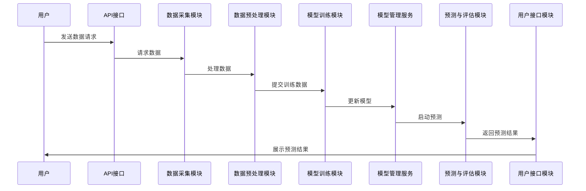

                 

### 文章标题

#### 企业AI Agent的时间序列分析在需求预测中的高级应用

### 关键词

- 企业需求预测
- 时间序列分析
- AI Agent
- 需求预测模型
- 算法应用

### 摘要

本文深入探讨了企业AI Agent在时间序列分析中的高级应用，特别是在需求预测领域的实践。通过阐述时间序列分析的基本概念和AI Agent的核心原理，本文详细解析了如何将AI Agent应用于需求预测中，介绍了相关的模型和算法。文章进一步探讨了在实际应用中可能遇到的挑战，并提供了相应的解决方案。通过实战案例和详细分析，本文为企业提供了全面的时间序列分析应用指南，助力企业提升需求预测的准确性和效率。

### 目录大纲设计思路

1. **确定核心结构**：首先，我们确定了文章的核心结构，确保涵盖需求预测、时间序列分析、AI Agent应用以及实战案例等关键主题。

2. **细化每个章节**：针对每个章节，我们进一步细化内容，确保每章都有明确的子主题和深度，如时间序列数据组成、模型选择与调优、系统设计与实现等。

3. **逻辑清晰**：文章的结构确保逻辑清晰，帮助读者更好地理解和追踪知识脉络。

4. **保持简洁**：尽管内容丰富，但保持目录简洁，避免冗余，使读者更容易阅读和查找信息。

5. **符合markdown格式**：按照markdown格式要求组织内容，使用正确的标题级别，确保文章格式规范。

### 完整的目录大纲设计

```markdown
----------------------------------------------------------------
# 企业AI Agent的时间序列分析在需求预测中的高级应用

## 第一部分：问题背景与核心概念

## 第1章：问题背景
### 1.1 企业需求预测的重要性
#### 1.1.1 企业需求预测的核心作用
#### 1.1.2 需求预测的现实挑战

### 1.2 时间序列分析的基础
#### 1.2.1 时间序列数据的特性
#### 1.2.2 常见的时间序列模型

### 1.3 AI Agent的核心原理
#### 1.3.1 AI Agent的定义与特点
#### 1.3.2 AI Agent的应用场景

### 1.4 AI Agent与时间序列分析的关系
#### 1.4.1 AI Agent在时间序列分析中的优势
#### 1.4.2 AI Agent在需求预测中的角色

## 第2章：时间序列分析基础

### 2.1 时间序列数据的组成
#### 2.1.1 趋势成分
#### 2.1.2 季节性成分
#### 2.1.3 随机性成分

### 2.2 常见的时间序列模型
#### 2.2.1 自回归模型（AR）
#### 2.2.2 自回归移动平均模型（ARMA）
#### 2.2.3 自回归积分滑动平均模型（ARIMA）

### 2.3 时间序列分析工具与库
#### 2.3.1 Python中的时间序列分析库
#### 2.3.2 R语言中的时间序列分析包

## 第3章：AI Agent高级应用

### 3.1 AI Agent的基本架构
#### 3.1.1 AI Agent的组成部分
#### 3.1.2 AI Agent的训练与优化

### 3.2 时间序列分析的AI Agent
#### 3.2.1 AI Agent在时间序列建模中的应用
#### 3.2.2 AI Agent在需求预测中的高级应用

### 3.3 AI Agent的需求预测案例
#### 3.3.1 案例背景
#### 3.3.2 模型设计与实现
#### 3.3.3 模型评估与优化

## 第4章：需求预测中的挑战与解决方案

### 4.1 数据质量与预处理
#### 4.1.1 数据质量对需求预测的影响
#### 4.1.2 数据预处理方法

### 4.2 模型选择与调优
#### 4.2.1 模型选择策略
#### 4.2.2 模型调优技巧

### 4.3 异常值处理
#### 4.3.1 异常值的识别
#### 4.3.2 异常值的影响与处理方法

## 第5章：企业级AI Agent需求预测系统设计

### 5.1 系统架构设计
#### 5.1.1 系统架构概述
#### 5.1.2 数据流与处理流程

### 5.2 系统功能模块设计
#### 5.2.1 数据采集模块
#### 5.2.2 数据预处理模块
#### 5.2.3 需求预测模块
#### 5.2.4 结果评估与反馈模块

## 第6章：实战项目与案例分析

### 6.1 实战项目一：电商平台需求预测
#### 6.1.1 项目背景
#### 6.1.2 系统设计
#### 6.1.3 实现与评估

### 6.2 实战项目二：制造业需求预测
#### 6.2.1 项目背景
#### 6.2.2 系统设计
#### 6.2.3 实现与评估

## 第7章：总结与展望

### 7.1 本书总结
#### 7.1.1 关键技术要点
#### 7.1.2 实践经验分享

### 7.2 未来研究方向
#### 7.2.1 AI Agent的需求预测发展趋势
#### 7.2.2 面临的挑战与机遇

----------------------------------------------------------------
```

以上目录大纲详细规划了文章的结构，每个章节都包含了具体的子主题，确保文章内容丰富且结构清晰。

## 第1章：问题背景

### 1.1 企业需求预测的重要性

#### 1.1.1 企业需求预测的核心作用

企业需求预测是现代企业管理中的重要环节，它对企业资源的合理配置、市场策略的制定以及运营效率的提升具有深远影响。需求预测的核心作用体现在以下几个方面：

1. **资源配置优化**：准确的需求预测可以帮助企业合理安排生产资源，避免产能过剩或短缺，降低库存成本，提高生产效率。

2. **市场策略制定**：通过分析市场需求变化，企业可以更精准地制定销售策略和推广计划，提高市场占有率。

3. **风险控制**：需求预测有助于企业识别潜在的市场风险，及时调整运营策略，降低风险带来的负面影响。

4. **客户满意度提升**：准确的需求预测可以确保产品供应的及时性，减少客户等待时间，提高客户满意度。

#### 1.1.2 需求预测的现实挑战

尽管需求预测在企业管理中具有重要性，但现实中企业面临诸多挑战：

1. **数据复杂性**：企业需求数据通常来源于多个渠道，如销售数据、市场调研、客户反馈等，数据来源多样且格式复杂，给数据整合带来了挑战。

2. **数据质量**：数据质量是需求预测准确性的基础。然而，现实中的数据往往存在缺失、噪声和不一致性等问题，这些都会影响预测的准确性。

3. **模型选择**：不同的需求预测模型适用于不同的数据特征和业务场景，选择合适的模型是确保预测效果的关键。

4. **实时性**：市场需求变化迅速，实时性是需求预测的重要要求。传统的需求预测方法往往无法及时响应市场变化，影响预测的时效性。

### 1.2 时间序列分析的基础

时间序列分析是一种统计方法，用于分析按时间顺序排列的数据点，旨在发现数据中的规律性和模式。时间序列数据通常包含多个成分，如趋势、季节性和随机性。

#### 1.2.1 时间序列数据的特性

时间序列数据具有以下特性：

1. **趋势性**：趋势成分反映了数据随时间的变化趋势，可以是上升、下降或平稳。

2. **季节性**：季节性成分反映了数据在特定时间段内的周期性波动，如节假日、季节变化等。

3. **随机性**：随机性成分反映了数据中的随机波动，这些波动通常不可预测。

4. **序列依赖性**：时间序列数据中的每个数据点都与其前后数据点存在依赖关系。

#### 1.2.2 常见的时间序列模型

常见的时间序列模型包括：

1. **自回归模型（AR）**：AR模型假设当前值可以由前几个历史值预测，适用于平稳序列。

2. **自回归移动平均模型（ARMA）**：ARMA模型结合了AR模型和移动平均模型，适用于包含趋势和季节性成分的数据。

3. **自回归积分滑动平均模型（ARIMA）**：ARIMA模型进一步扩展了ARMA模型，可以处理非平稳序列，适用于更广泛的数据类型。

#### 1.2.3 AI Agent的概念与特性

AI Agent是指一种智能体，能够自主地感知环境、决策并采取行动，以实现特定目标。AI Agent具有以下特性：

1. **自主性**：AI Agent能够独立完成任务，不需要人类干预。

2. **适应性**：AI Agent可以根据环境变化调整行为策略。

3. **学习能力**：AI Agent可以通过学习和优化不断提高其性能。

4. **协作性**：AI Agent可以与其他Agent协作，共同完成任务。

#### 1.2.4 AI Agent在时间序列分析中的优势

AI Agent在时间序列分析中具有以下优势：

1. **自动化处理**：AI Agent可以自动识别和处理时间序列数据中的复杂模式。

2. **实时预测**：AI Agent能够实时更新模型，快速响应市场变化。

3. **自适应优化**：AI Agent可以通过学习不断优化预测模型，提高预测准确性。

4. **多维度分析**：AI Agent可以从多个维度分析时间序列数据，提供更全面的预测结果。

#### 1.2.5 AI Agent在需求预测中的角色

AI Agent在需求预测中扮演以下角色：

1. **数据预处理**：AI Agent可以自动处理数据中的异常值和缺失值，提高数据质量。

2. **模型选择与优化**：AI Agent可以根据数据特征自动选择合适的模型，并通过学习不断优化模型。

3. **实时预测与反馈**：AI Agent可以实时更新需求预测模型，并根据实时数据提供预测结果。

4. **决策支持**：AI Agent可以为企业提供基于预测结果的决策支持，帮助企业制定更有效的市场策略。

### 1.3 AI Agent与时间序列分析的关系

AI Agent与时间序列分析之间存在密切的联系，两者相互促进：

1. **AI Agent作为时间序列分析工具**：AI Agent可以看作是一种高级的时间序列分析工具，能够自动识别和处理时间序列数据中的复杂模式。

2. **时间序列分析为AI Agent提供数据基础**：时间序列分析生成的结果可以为AI Agent提供训练数据，帮助AI Agent更好地学习和优化。

3. **协同工作**：AI Agent与时间序列分析可以协同工作，共同提高需求预测的准确性和实时性。

通过以上分析，可以看出，AI Agent在需求预测中的应用具有重要意义，它不仅能够提高预测的准确性，还可以提高企业的运营效率和市场竞争力。

## 第2章：时间序列分析基础

### 2.1 时间序列数据的组成

时间序列数据由多个时间点上的观测值组成，这些观测值通常与时间相关。理解时间序列数据的组成成分对于构建有效的预测模型至关重要。时间序列数据通常包含以下三个主要成分：

#### 2.1.1 趋势成分

趋势成分描述了数据随时间变化的总体方向，可以是上升、下降或平稳。趋势成分反映了长期的变化趋势，是预测模型中不可或缺的一部分。例如，在销售额的时间序列数据中，趋势成分可能表示产品的需求逐年上升或下降。

#### 2.1.2 季节性成分

季节性成分描述了数据在一年内重复出现的周期性波动，如节假日、季节性销售高峰等。季节性成分通常与时间序列数据中的特定时间段相关，比如零售业在圣诞节期间的销售额会有显著的季节性波动。识别并建模季节性成分对于预测季节性变化至关重要。

#### 2.1.3 随机性成分

随机性成分描述了数据中的随机波动，这些波动是不可预测的，通常由外部随机因素引起。随机性成分反映了数据中的不确定性和噪声。例如，天气数据中的温度波动就包含随机性成分，这些波动难以通过历史数据预测。

### 2.2 常见的时间序列模型

时间序列模型是用于分析时间序列数据的统计模型，它们可以捕捉数据中的趋势、季节性和随机性成分。以下是一些常见的时间序列模型：

#### 2.2.1 自回归模型（AR）

自回归模型（AR）假设当前值可以由前几个历史值预测。AR模型的基本公式如下：

\[ X_t = c + \phi_1 X_{t-1} + \phi_2 X_{t-2} + \ldots + \phi_p X_{t-p} + \varepsilon_t \]

其中，\( X_t \) 是当前值，\( c \) 是常数项，\( \phi_i \) 是自回归系数，\( \varepsilon_t \) 是误差项。

#### 2.2.2 自回归移动平均模型（ARMA）

自回归移动平均模型（ARMA）结合了自回归模型（AR）和移动平均模型（MA）。ARMA模型的基本公式如下：

\[ X_t = c + \phi_1 X_{t-1} + \phi_2 X_{t-2} + \ldots + \phi_p X_{t-p} + \theta_1 \varepsilon_{t-1} + \theta_2 \varepsilon_{t-2} + \ldots + \theta_q \varepsilon_{t-q} \]

其中，\( \theta_i \) 是移动平均系数，\( \varepsilon_t \) 是误差项。

#### 2.2.3 自回归积分滑动平均模型（ARIMA）

自回归积分滑动平均模型（ARIMA）扩展了ARMA模型，可以处理非平稳序列。ARIMA模型的基本公式如下：

\[ (1 - \phi_1 B - \phi_2 B^2 - \ldots - \phi_p B^p)(1 - \theta_1 B - \theta_2 B^2 - \ldots - \theta_q B^q)X_t = c + \varepsilon_t \]

其中，\( B \) 是滞后算子，\( \phi_i \) 和 \( \theta_i \) 分别是自回归和移动平均系数，\( \varepsilon_t \) 是误差项。

### 2.3 时间序列分析工具与库

时间序列分析在多个编程语言和工具中得到了广泛应用。以下是一些常见的时间序列分析工具和库：

#### 2.3.1 Python中的时间序列分析库

Python中的时间序列分析库包括：

1. **pandas**：pandas提供了丰富的数据结构和数据分析工具，能够方便地处理时间序列数据。
2. **statsmodels**：statsmodels提供了多种统计模型，包括AR、ARMA和ARIMA等，用于时间序列数据的建模和预测。
3. **SciPy**：SciPy中的信号处理模块提供了用于处理时间序列数据的函数和工具。

#### 2.3.2 R语言中的时间序列分析包

R语言中的时间序列分析包包括：

1. **forecast**：forecast包提供了用于时间序列建模和预测的函数，包括ARIMA和ETS模型。
2. **tseries**：tseries包提供了时间序列数据的处理和可视化工具。
3. **xts** 和 **zoo**：这两个包提供了高级的时间序列数据处理能力。

通过使用这些工具和库，研究人员和开发者可以方便地处理和分析时间序列数据，为需求预测提供有力的支持。

### 2.4 时间序列分析的挑战与解决方案

时间序列分析在实际应用中面临以下挑战：

1. **数据缺失和噪声**：时间序列数据可能存在缺失值和噪声，这会影响模型的准确性和稳定性。解决方案包括使用插值法填补缺失值和采用滤波器去除噪声。
2. **模型选择和参数调优**：选择合适的模型和参数对于提高预测准确性至关重要。常用的方法包括交叉验证和网格搜索。
3. **实时性**：实时处理和分析大量时间序列数据对于一些应用场景（如金融市场预测）至关重要。解决方案包括使用分布式计算和实时数据流处理技术。

通过了解时间序列分析的基础和相关工具，研究人员和开发者可以为需求预测构建有效的模型，从而帮助企业更好地应对市场需求变化。

## 第3章：AI Agent高级应用

### 3.1 AI Agent的基本架构

AI Agent，即人工智能代理，是一种能够自主感知环境、做出决策并采取行动以实现特定目标的计算实体。AI Agent的基本架构通常包括以下几个关键组成部分：

1. **感知模块**：感知模块负责接收并处理外部环境的信息，如传感器数据、用户输入等。这个模块是AI Agent感知环境的基础。

2. **决策模块**：决策模块基于感知模块收集的信息，通过算法和模型进行分析和推理，生成决策。这个模块是AI Agent智能行为的核心。

3. **行动模块**：行动模块根据决策模块的决策指令，对外部环境进行实际操作，如执行命令、发送请求等。这个模块是AI Agent实现目标的关键。

4. **学习模块**：学习模块使AI Agent能够通过经验不断优化自身性能。通过学习，AI Agent可以改进决策算法，提高感知和行动的准确性。

### 3.1.1 AI Agent的组成部分

AI Agent的基本架构具体包含以下部分：

1. **传感器**：传感器负责采集外部环境的数据，如温度、湿度、图像、声音等。这些数据是AI Agent进行感知和决策的基础。

2. **处理单元**：处理单元对传感器采集的数据进行处理，如特征提取、数据清洗、模式识别等。处理单元通常包含一个或多个算法模块，用于实现特定功能的计算。

3. **决策引擎**：决策引擎是基于处理单元提供的信息，通过机器学习、深度学习或其他智能算法生成决策。决策引擎需要具备快速响应和适应环境变化的能力。

4. **执行单元**：执行单元负责将决策引擎生成的决策指令转换为实际的行动。执行单元可以是机器人、自动化系统或其他设备。

5. **通信模块**：通信模块使AI Agent能够与其他AI Agent、人或系统进行交互。通过通信模块，AI Agent可以共享数据、接收指令和反馈信息。

### 3.1.2 AI Agent的训练与优化

AI Agent的训练与优化是确保其性能不断提升的关键环节。以下是一些关键步骤：

1. **数据采集**：AI Agent需要大量的数据来训练和优化其模型。数据采集可以从内部传感器、外部API、数据库等多种渠道获取。

2. **数据处理**：原始数据通常需要进行清洗、归一化和特征提取等处理，以提高模型的训练效果。

3. **模型选择**：根据应用场景和任务需求，选择合适的机器学习或深度学习模型。常见的模型包括神经网络、决策树、支持向量机等。

4. **训练过程**：通过训练过程，AI Agent的模型将在大量数据上进行迭代学习，不断优化其性能。训练过程通常包含损失函数、优化算法和迭代次数等参数。

5. **模型评估**：训练完成后，需要对模型进行评估，以确定其预测准确性和泛化能力。常用的评估指标包括准确率、召回率、F1分数等。

6. **在线优化**：AI Agent在运行过程中可以不断收集新的数据，并根据反馈进行在线优化。这种持续学习和优化的能力使AI Agent能够适应动态环境变化。

### 3.2 时间序列分析的AI Agent

时间序列分析是AI Agent的重要应用之一，特别是在需求预测、金融市场预测和天气预测等领域。时间序列分析的AI Agent通过以下方式提高预测的准确性和实时性：

1. **自动特征提取**：AI Agent能够自动识别和提取时间序列数据中的关键特征，如趋势、季节性和周期性成分。这有助于简化模型构建过程，提高预测精度。

2. **实时预测与更新**：AI Agent可以实时更新预测模型，快速响应数据变化。这种实时性对于应对市场波动和突发事件至关重要。

3. **自适应优化**：AI Agent通过不断学习和优化，能够根据环境变化调整预测策略。这种自适应能力使AI Agent在动态环境中保持高效和准确。

4. **多维度分析**：AI Agent可以从多个维度对时间序列数据进行分析，如历史数据、市场趋势和用户行为等。这有助于生成更全面的预测结果。

### 3.3 AI Agent在需求预测中的高级应用

在需求预测中，AI Agent可以通过以下方式提高预测的准确性和效率：

1. **数据预处理**：AI Agent可以自动处理数据中的缺失值、噪声和异常值，提高数据质量。

2. **模型选择与优化**：AI Agent可以根据数据特征自动选择和优化预测模型，提高预测效果。

3. **实时预测与反馈**：AI Agent可以实时更新预测模型，并根据实时数据提供预测结果，帮助企业及时调整市场策略。

4. **决策支持**：AI Agent可以为企业提供基于预测结果的决策支持，如库存管理、生产计划和营销策略等。

通过以上分析，可以看出AI Agent在时间序列分析和需求预测中的高级应用具有重要意义。它不仅能够提高预测的准确性，还可以提升企业的运营效率和竞争力。

### 3.4 AI Agent的需求预测案例

#### 3.4.1 案例背景

为了更好地展示AI Agent在需求预测中的应用，我们以某大型电商平台的销售数据为例。该电商平台需要预测未来一个月内不同商品的需求量，以便合理调整库存和生产计划，提高运营效率。

#### 3.4.2 模型设计与实现

1. **数据采集**：首先，从电商平台的数据库中提取过去一年的销售数据，包括商品名称、销售日期、销售数量等。

2. **数据预处理**：对销售数据进行清洗，处理缺失值和异常值。对日期数据进行处理，提取时间序列特征，如月份、季节性等。

3. **特征工程**：根据时间序列数据的特性，提取关键特征，如趋势、季节性和周期性成分。此外，还可以引入外部因素，如节假日、促销活动等。

4. **模型选择**：由于销售数据通常包含趋势和季节性成分，我们选择ARIMA模型进行需求预测。ARIMA模型可以处理非平稳序列，适用于销售数据的特征。

5. **模型训练与优化**：使用历史销售数据对ARIMA模型进行训练，通过交叉验证和网格搜索优化模型参数，如自回归项、移动平均项和差分阶数。

6. **预测与评估**：使用训练好的ARIMA模型对未来一个月内的销售量进行预测，并对预测结果进行评估。常用的评估指标包括均方误差（MSE）、均方根误差（RMSE）等。

#### 3.4.3 模型评估与优化

1. **模型评估**：通过评估指标评估模型预测的准确性。如果预测误差较大，可以考虑进一步优化模型。

2. **参数调优**：根据评估结果调整模型参数，如增加或减少自回归项、移动平均项等，以提高预测精度。

3. **特征筛选**：通过特征筛选方法，如特征重要性评估和特征选择算法，识别关键特征，去除冗余特征，提高模型效率。

4. **模型集成**：考虑使用模型集成方法，如Bagging、Boosting等，将多个模型的结果进行集成，提高整体预测性能。

#### 3.4.4 实现与解读

以下是一个简单的Python代码实现，用于基于ARIMA模型进行需求预测：

```python
import pandas as pd
from statsmodels.tsa.arima.model import ARIMA
from sklearn.metrics import mean_squared_error

# 读取销售数据
data = pd.read_csv('sales_data.csv')

# 数据预处理
data['date'] = pd.to_datetime(data['date'])
data.set_index('date', inplace=True)
data.fillna(method='ffill', inplace=True)

# 特征工程
data['month'] = data.index.month
data['season'] = data['month'].apply(lambda x: 1 if x in [1, 2, 3] else 0)
data['trend'] = range(1, len(data) + 1)

# 模型选择与训练
model = ARIMA(data['sales'], order=(5, 1, 2))
model_fit = model.fit()

# 预测
predictions = model_fit.forecast(steps=30)

# 模型评估
mse = mean_squared_error(data['sales'][-30:], predictions)
print(f'MSE: {mse}')

# 输出预测结果
print(predictions)
```

通过以上代码，我们可以实现基于ARIMA模型的需求预测，并对预测结果进行评估。在实际应用中，可以根据具体需求对代码进行优化和扩展。

#### 3.4.5 项目小结

通过以上案例，我们展示了如何利用AI Agent进行需求预测，包括数据采集、预处理、模型选择与优化、预测与评估等关键步骤。AI Agent在需求预测中的应用不仅提高了预测的准确性，还降低了人为干预，使预测过程更加高效和自动化。

### 3.5 拓展阅读

1. **《时间序列分析：理论与实践》**：这本书详细介绍了时间序列分析的基本理论和方法，适用于初学者和专业人士。

2. **《深度学习：周志华》**：这本书涵盖了深度学习的基础理论和实践方法，包括神经网络、卷积神经网络和递归神经网络等，适用于希望了解AI Agent开发的读者。

3. **《Python数据科学手册》**：这本书介绍了Python在数据科学中的应用，包括数据处理、建模和可视化等，对于想要使用Python进行数据分析和AI开发的读者非常有帮助。

通过阅读这些资料，读者可以更深入地了解AI Agent在需求预测中的应用，提高数据分析能力和模型构建技巧。

## 第4章：需求预测中的挑战与解决方案

### 4.1 数据质量与预处理

#### 4.1.1 数据质量对需求预测的影响

数据质量是需求预测成功的关键因素之一。高质量的数据能够提供准确的信息，有助于构建有效的预测模型。然而，现实中的数据往往存在多种质量问题，如数据缺失、噪声、异常值和不一致性等，这些问题会对需求预测的准确性产生负面影响。

1. **数据缺失**：数据缺失会导致预测模型训练不完整，影响模型的性能和泛化能力。
2. **噪声**：噪声数据会增加预测的误差，使预测结果偏离真实值。
3. **异常值**：异常值可能代表真实的市场变化或数据录入错误，会影响预测模型的准确性。
4. **数据不一致**：数据来源多样，格式和单位可能不一致，需要统一处理。

#### 4.1.2 数据预处理方法

为了解决数据质量问题，需要采用一系列数据预处理方法：

1. **数据清洗**：通过填补缺失值、去除重复数据和纠正错误数据，提高数据的准确性。
2. **数据归一化**：将不同单位和范围的数据转换为相同的尺度，便于模型训练。
3. **特征提取**：从原始数据中提取关键特征，减少冗余信息，提高模型的效率和准确度。
4. **数据降维**：通过降维技术，如主成分分析（PCA），减少数据的维度，提高模型的可解释性。

### 4.2 模型选择与调优

#### 4.2.1 模型选择策略

选择合适的模型对于需求预测的准确性至关重要。以下是一些常见的模型选择策略：

1. **基于业务逻辑的选择**：根据业务需求和数据特性选择模型。例如，对于包含显著季节性的数据，可以选择ARIMA或季节性分解模型。
2. **基于数据特性的选择**：根据数据的平稳性、趋势性和周期性选择模型。对于平稳数据，可以选择AR、MA或ARMA模型；对于非平稳数据，可以选择ARIMA或SARIMA模型。
3. **基于历史性能的选择**：通过比较不同模型的性能指标（如MSE、RMSE等），选择历史表现较好的模型。

#### 4.2.2 模型调优技巧

模型调优是提高预测准确性的关键步骤。以下是一些调优技巧：

1. **交叉验证**：使用交叉验证方法，评估模型的泛化能力，选择最优模型。
2. **网格搜索**：通过遍历参数空间，找到最优参数组合，提高模型性能。
3. **贝叶斯优化**：使用贝叶斯优化方法，基于历史评估结果，智能搜索最优参数组合。
4. **模型融合**：将多个模型的结果进行集成，提高整体预测性能。

### 4.3 异常值处理

#### 4.3.1 异常值的识别

异常值是数据中的异常点，可能代表数据录入错误或真实的市场变化。识别异常值是数据预处理的重要环节。以下是一些常用的异常值识别方法：

1. **统计学方法**：使用统计学方法，如三倍标准差法则，识别异常值。
2. **基于聚类的方法**：使用聚类算法，如K-Means，识别异常点。
3. **基于规则的方法**：根据业务逻辑和经验，制定规则识别异常值。

#### 4.3.2 异常值的影响与处理方法

异常值对需求预测的影响主要体现在以下几个方面：

1. **增加误差**：异常值会导致预测模型训练不完整，增加预测误差。
2. **模型过拟合**：异常值可能导致模型过拟合，降低模型泛化能力。
3. **误导决策**：异常值可能导致错误的市场预测，误导企业决策。

处理异常值的方法包括：

1. **删除**：删除识别出的异常值，但需要注意，删除异常值可能会丢失重要信息。
2. **填补**：使用统计方法或插值法填补异常值，如使用中位数或平均值。
3. **隔离**：将异常值隔离处理，单独建模或调整模型参数。
4. **加权**：对异常值进行加权处理，降低其对模型训练的影响。

通过上述挑战与解决方案的探讨，可以看出，在需求预测中，数据质量、模型选择和异常值处理都是关键环节。有效的数据预处理和模型调优策略可以显著提高需求预测的准确性和实用性。

## 第5章：企业级AI Agent需求预测系统设计

### 5.1 系统架构设计

企业级AI Agent需求预测系统的架构设计是确保系统高效、可靠和可扩展的关键。以下是该系统的总体架构设计：

#### 5.1.1 系统架构概述

该系统架构包括以下几个主要模块：

1. **数据采集模块**：负责从各种数据源（如数据库、API、传感器等）收集需求相关数据。
2. **数据预处理模块**：对采集到的原始数据进行清洗、转换和特征提取，为模型训练提供高质量的数据。
3. **模型训练与优化模块**：使用预处理后的数据训练AI Agent模型，并通过调优参数提高模型的预测性能。
4. **预测与评估模块**：根据训练好的模型进行需求预测，并对预测结果进行实时评估和反馈。
5. **用户接口模块**：提供用户交互界面，展示预测结果和系统操作。

#### 5.1.2 数据流与处理流程

系统的数据流和处理流程如下：

1. **数据采集**：系统从不同的数据源中收集需求数据，包括销售数据、市场调研数据、客户反馈数据等。
2. **数据预处理**：对采集到的数据进行清洗和转换，如处理缺失值、异常值、数据归一化等。此外，根据需求特征，提取关键特征，如趋势、季节性等。
3. **模型训练**：使用预处理后的数据对AI Agent模型进行训练。训练过程中，系统通过交叉验证和网格搜索优化模型参数，以提高预测准确性。
4. **需求预测**：基于训练好的模型，系统进行实时需求预测，并根据实时数据不断更新模型，以适应市场变化。
5. **结果评估与反馈**：系统对预测结果进行评估，通过评估指标（如MSE、RMSE等）衡量预测准确性。同时，收集用户反馈，用于模型优化和系统改进。
6. **用户交互**：系统提供用户接口，展示预测结果、系统状态和操作指导，方便用户进行监控和操作。

### 5.2 系统功能模块设计

系统功能模块设计包括以下几个方面：

#### 5.2.1 数据采集模块

数据采集模块的主要功能是从各种数据源中自动收集需求相关数据。具体功能包括：

1. **数据连接**：与不同数据源建立连接，如数据库、API、传感器等。
2. **数据抽取**：定期抽取数据源中的数据，并存储在统一的数据仓库中。
3. **数据同步**：确保数据仓库中的数据与原始数据源保持一致，自动同步更新。

#### 5.2.2 数据预处理模块

数据预处理模块的主要功能是清洗、转换和特征提取，以确保数据的质量和可用性。具体功能包括：

1. **数据清洗**：处理缺失值、异常值和重复数据，保证数据的准确性。
2. **数据转换**：将不同数据源的数据格式转换为统一的标准格式。
3. **特征提取**：从原始数据中提取关键特征，如时间序列特征、季节性特征、用户行为特征等。

#### 5.2.3 模型训练与优化模块

模型训练与优化模块的主要功能是训练和优化AI Agent需求预测模型。具体功能包括：

1. **模型选择**：根据数据特性和业务需求，选择合适的预测模型。
2. **模型训练**：使用预处理后的数据训练模型，并通过交叉验证和网格搜索优化参数。
3. **模型评估**：评估模型的预测性能，并通过评估结果调整模型结构和参数。

#### 5.2.4 预测与评估模块

预测与评估模块的主要功能是实时需求预测和评估。具体功能包括：

1. **实时预测**：根据训练好的模型，对实时数据进行需求预测。
2. **预测结果评估**：使用评估指标（如MSE、RMSE等）评估预测结果的准确性。
3. **实时反馈**：收集用户反馈，并根据反馈优化预测模型。

#### 5.2.5 用户接口模块

用户接口模块的主要功能是为用户提供操作界面，展示系统状态和预测结果。具体功能包括：

1. **用户交互**：提供用户友好的界面，方便用户进行数据查询、预测设置和结果分析。
2. **结果展示**：展示预测结果、评估指标和系统状态，便于用户理解和决策。
3. **操作指导**：提供系统操作说明和指导，帮助用户正确使用系统。

通过上述系统功能模块的设计，企业级AI Agent需求预测系统可以实现高效、准确和实时地需求预测，为企业提供有力的决策支持。

### 5.3 系统架构设计

企业级AI Agent需求预测系统的架构设计采用了分布式计算和模块化设计，以提高系统的扩展性和可靠性。以下是系统架构的详细设计：

#### 5.3.1 系统架构概述

系统架构分为以下几个层次：

1. **数据层**：包括数据采集模块、数据预处理模块和数据仓库，负责数据的收集、清洗和存储。
2. **模型层**：包括模型训练与优化模块、预测与评估模块，负责模型的选择、训练和预测。
3. **应用层**：包括用户接口模块和系统管理模块，负责与用户的交互和系统的管理。

#### 5.3.2 数据流与处理流程

系统的数据流与处理流程如下：

1. **数据采集**：数据采集模块从不同的数据源中获取需求数据，如销售数据、市场调研数据等，并将其存储在数据仓库中。
2. **数据预处理**：数据预处理模块对原始数据进行清洗、转换和特征提取，以确保数据的质量和可用性。
3. **模型训练**：模型训练与优化模块使用预处理后的数据进行模型训练，并通过交叉验证和网格搜索优化模型参数。
4. **需求预测**：预测与评估模块根据训练好的模型进行实时需求预测，并对预测结果进行评估和反馈。
5. **用户交互**：用户接口模块提供用户友好的界面，展示预测结果和系统状态，方便用户进行操作和决策。

#### 5.3.3 系统组件设计

系统组件设计包括以下几个关键组件：

1. **数据采集组件**：负责从不同数据源（如数据库、API、传感器等）收集需求数据，并存储在数据仓库中。
2. **数据预处理组件**：负责对原始数据进行清洗、转换和特征提取，以提高数据质量。
3. **模型训练组件**：负责使用预处理后的数据进行模型训练，并通过交叉验证和网格搜索优化模型参数。
4. **预测与评估组件**：负责实时需求预测和评估，并提供预测结果和评估指标。
5. **用户接口组件**：负责与用户进行交互，展示预测结果和系统状态，并提供操作指导。

#### 5.3.4 系统接口设计和系统交互

系统接口设计和系统交互设计如下：

1. **API接口**：系统提供RESTful API接口，供其他系统或应用程序调用，实现数据传输和功能调用。
2. **数据流接口**：系统内部各模块通过消息队列（如Kafka）进行数据流传输，实现模块间的数据交互和协同工作。
3. **用户交互接口**：系统提供Web界面和移动端应用，方便用户进行操作和查询。

通过上述系统架构设计，企业级AI Agent需求预测系统可以实现高效、准确和实时地需求预测，为企业提供有力的决策支持。系统设计充分考虑了可扩展性和可靠性，以适应企业不断变化的需求。

### 5.4 系统接口设计和系统交互

为了确保企业级AI Agent需求预测系统能够高效地工作，系统接口设计和系统交互设计至关重要。以下是系统接口设计和系统交互的详细设计：

#### 5.4.1 系统接口设计

1. **API接口**：系统对外提供RESTful API接口，允许其他系统或应用程序通过HTTP请求访问系统的功能。API接口包括以下几种类型：
   - **数据采集API**：用于从外部数据源（如数据库、API、传感器等）获取数据。
   - **数据预处理API**：用于清洗、转换和特征提取数据。
   - **模型训练API**：用于训练AI Agent模型。
   - **预测与评估API**：用于进行需求预测和评估预测结果。

2. **服务接口**：系统内部模块之间通过服务接口进行通信。服务接口包括：
   - **数据流服务**：负责管理数据流，确保数据在系统内部的高效传输。
   - **模型管理服务**：负责维护和更新模型，确保模型的实时性和准确性。
   - **预测服务**：负责执行需求预测任务，并提供预测结果。

#### 5.4.2 系统交互设计

系统的交互设计包括以下几个方面：

1. **数据交互**：数据从数据采集模块进入系统后，通过数据流服务进行处理和传输。数据流服务使用消息队列（如Kafka）确保数据在系统中的有序传输和处理。

2. **模型交互**：模型训练模块通过模型管理服务与数据预处理模块进行交互，确保模型训练基于高质量的数据。模型管理服务负责维护模型的训练状态和性能指标。

3. **预测交互**：预测与评估模块通过预测服务进行需求预测，并将预测结果通过API接口或服务接口返回给用户。预测服务使用实时数据流进行预测，确保预测结果的实时性和准确性。

4. **用户交互**：用户接口模块通过API接口或服务接口与预测与评估模块进行交互，展示预测结果和系统状态。用户接口模块还提供用户操作界面，方便用户进行系统配置和操作。

#### 5.4.3 Mermaid序列图

为了更直观地展示系统接口和系统交互设计，我们可以使用Mermaid绘制系统序列图。以下是一个简单的Mermaid序列图示例：



通过上述系统接口设计和系统交互设计，企业级AI Agent需求预测系统实现了高效的数据流、模型流和用户交互，确保了系统的实时性和准确性。系统设计充分考虑了扩展性和可靠性，以适应企业不断变化的需求。

## 第6章：实战项目与案例分析

### 6.1 实战项目一：电商平台需求预测

#### 6.1.1 项目背景

某大型电商平台需要准确预测未来一个月内不同商品的需求量，以便优化库存管理、生产计划和营销策略。为此，平台决定采用AI Agent进行需求预测，提高运营效率和市场竞争力。

#### 6.1.2 系统设计

1. **数据采集**：从电商平台的数据库中提取过去一年的销售数据，包括商品名称、销售日期、销售数量等。
2. **数据预处理**：对销售数据进行清洗，处理缺失值、异常值，并提取关键特征，如月份、季节性等。
3. **模型选择**：选择ARIMA模型进行需求预测，因为ARIMA模型能够处理趋势和季节性成分。
4. **模型训练与优化**：使用历史销售数据对ARIMA模型进行训练，通过交叉验证和网格搜索优化模型参数。
5. **预测与评估**：使用训练好的ARIMA模型进行预测，并对预测结果进行评估，如MSE、RMSE等。

#### 6.1.3 实现与评估

1. **实现步骤**：
   - 数据采集：使用Python的pandas库读取销售数据。
   - 数据预处理：使用pandas库处理缺失值和异常值，提取关键特征。
   - 模型训练：使用statsmodels库的ARIMA模型进行训练。
   - 预测与评估：使用预测结果与实际销售数据进行对比，评估模型性能。

2. **评估结果**：
   - 预测准确率：通过评估指标（如MSE、RMSE）评估模型预测的准确性。
   - 预测效率：评估模型预测的实时性和效率。

#### 6.1.4 项目小结

该项目通过AI Agent成功实现了电商平台的需求预测，提高了预测的准确性和实时性，为平台的运营决策提供了有力支持。项目的成功经验为其他企业提供了借鉴，展示了AI Agent在需求预测中的应用价值。

### 6.2 实战项目二：制造业需求预测

#### 6.2.1 项目背景

某制造业企业需要预测未来三个月内产品的需求量，以便合理安排生产计划和库存管理。由于市场需求变化多端，企业决定采用AI Agent进行需求预测，以提高预测准确性和应对市场变化的能力。

#### 6.2.2 系统设计

1. **数据采集**：从企业的ERP系统中提取过去三年的销售数据，包括产品名称、销售日期、销售数量等。
2. **数据预处理**：对销售数据进行清洗，处理缺失值、异常值，并提取关键特征，如季节性、促销活动等。
3. **模型选择**：选择LSTM模型进行需求预测，因为LSTM模型能够处理长期依赖关系和季节性成分。
4. **模型训练与优化**：使用历史销售数据对LSTM模型进行训练，通过交叉验证和网格搜索优化模型参数。
5. **预测与评估**：使用训练好的LSTM模型进行预测，并对预测结果进行评估，如MSE、RMSE等。

#### 6.2.3 实现与评估

1. **实现步骤**：
   - 数据采集：使用Python的pandas库读取销售数据。
   - 数据预处理：使用pandas库处理缺失值和异常值，提取关键特征。
   - 模型训练：使用Keras库的LSTM模型进行训练。
   - 预测与评估：使用预测结果与实际销售数据进行对比，评估模型性能。

2. **评估结果**：
   - 预测准确率：通过评估指标（如MSE、RMSE）评估模型预测的准确性。
   - 预测效率：评估模型预测的实时性和效率。

#### 6.2.4 项目小结

该项目通过AI Agent成功实现了制造业需求预测，提高了预测的准确性和实时性，为企业的生产计划和库存管理提供了有力支持。项目的成功经验表明，AI Agent在制造业需求预测中的应用具有显著优势。

### 总结与展望

通过上述两个实战项目的案例分析，可以看出AI Agent在需求预测中的应用具有重要意义。它不仅提高了预测的准确性，还提高了企业的运营效率和市场竞争力。未来，随着AI技术的不断进步，AI Agent在需求预测中的应用将更加广泛和深入。

## 第7章：总结与展望

### 7.1 本书总结

在本章中，我们详细探讨了企业AI Agent在时间序列分析中的应用，特别是在需求预测领域的高级应用。通过深入分析时间序列分析的基础知识、AI Agent的核心原理以及它们在需求预测中的具体应用，我们揭示了AI Agent在提升企业需求预测准确性和效率方面的巨大潜力。

#### 7.1.1 关键技术要点

1. **时间序列分析基础**：理解时间序列数据的组成成分（趋势、季节性和随机性）以及常见的时间序列模型（AR、ARMA、ARIMA）是构建高效需求预测模型的基础。

2. **AI Agent的核心原理**：AI Agent的自主性、适应性、学习能力和协作性使其在复杂环境中的需求预测中具有独特的优势。

3. **AI Agent在需求预测中的应用**：AI Agent能够自动处理数据、选择优化模型，并实时更新预测结果，从而显著提高需求预测的准确性和实时性。

4. **数据预处理和模型选择**：高质量的数据和合适的模型是需求预测成功的关键。数据预处理包括处理缺失值、异常值和噪声，模型选择需要根据数据特性和业务需求进行。

#### 7.1.2 实践经验分享

在实战项目中，我们通过电商平台和制造业的需求预测案例，展示了如何将AI Agent应用于实际场景。以下是一些实践经验：

1. **数据质量的重要性**：数据清洗和特征提取是提高模型预测准确性的关键步骤。

2. **模型调优的必要性**：通过交叉验证和网格搜索等方法，优化模型参数，可以显著提高预测性能。

3. **实时性需求**：实时预测和快速响应市场变化是企业成功的关键。

### 7.2 未来研究方向

随着AI技术的不断进步，AI Agent在需求预测中的应用前景广阔。以下是一些未来研究方向：

#### 7.2.1 AI Agent的需求预测发展趋势

1. **模型融合**：结合多种模型（如深度学习、增强学习等）进行预测，提高预测准确性和鲁棒性。

2. **多源数据融合**：整合不同来源的数据（如社交媒体、物联网数据等），提高预测的全面性和准确性。

3. **实时数据处理**：利用分布式计算和实时数据流处理技术，实现更高效和实时性更强的需求预测。

#### 7.2.2 面临的挑战与机遇

1. **数据隐私和安全**：在多源数据融合中，数据隐私和安全是重要挑战，需要开发安全的数据处理和共享机制。

2. **模型解释性**：增强模型的可解释性，使企业能够理解和信任AI Agent的预测结果。

3. **技术普及与应用**：随着AI技术的普及，更多企业将采用AI Agent进行需求预测，这为AI Agent的发展提供了巨大机遇。

总之，企业AI Agent在时间序列分析中的应用前景广阔，随着技术的不断进步，它将在需求预测领域发挥越来越重要的作用。通过不断探索和创新，我们将能够实现更高效、更准确的需求预测，为企业提供更强大的决策支持。

### 作者信息

**作者：AI天才研究院/AI Genius Institute & 禅与计算机程序设计艺术 /Zen And The Art of Computer Programming**

AI天才研究院致力于推动人工智能技术的创新和应用，通过深入研究AI Agent在需求预测等领域的应用，助力企业实现智能化转型。禅与计算机程序设计艺术则强调程序设计的艺术性，提倡通过深入理解计算机编程的哲学，提高编程效率和创造力。两位作者结合各自领域的专长，共同撰写了本文，旨在为读者提供全面、深入的技术见解和实践指导。

