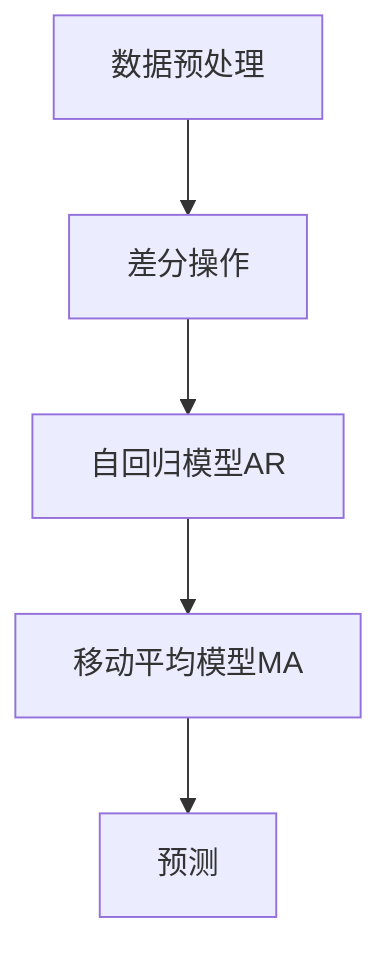
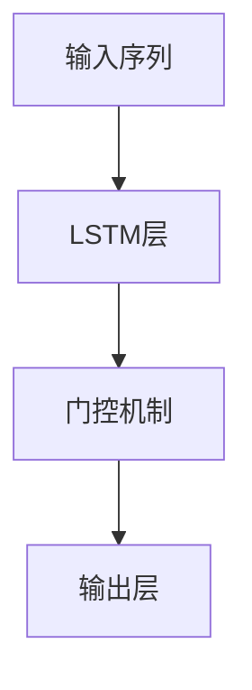
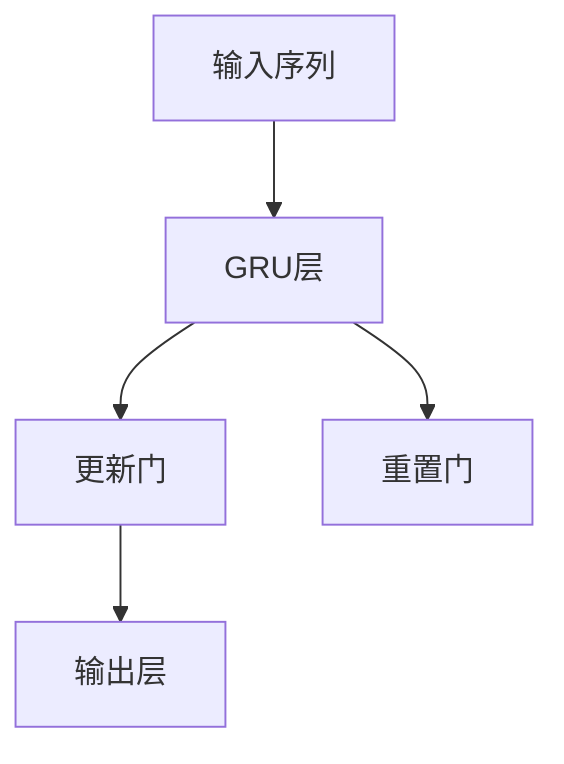
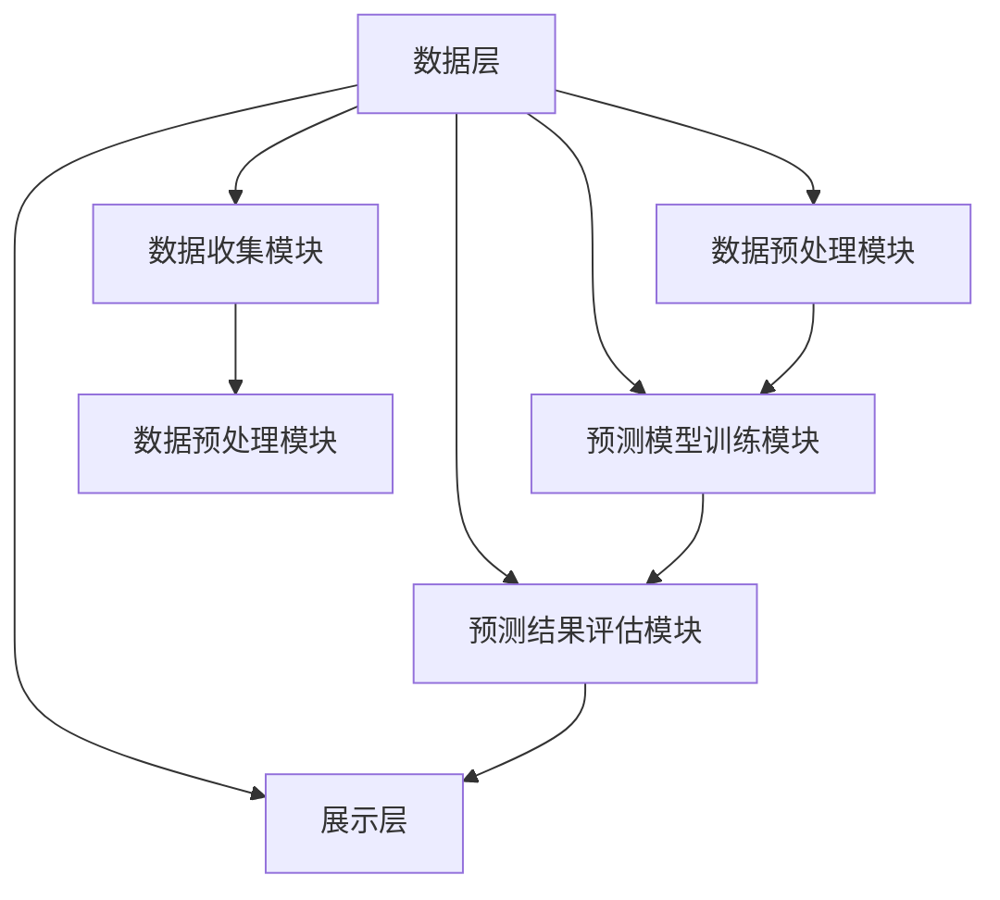
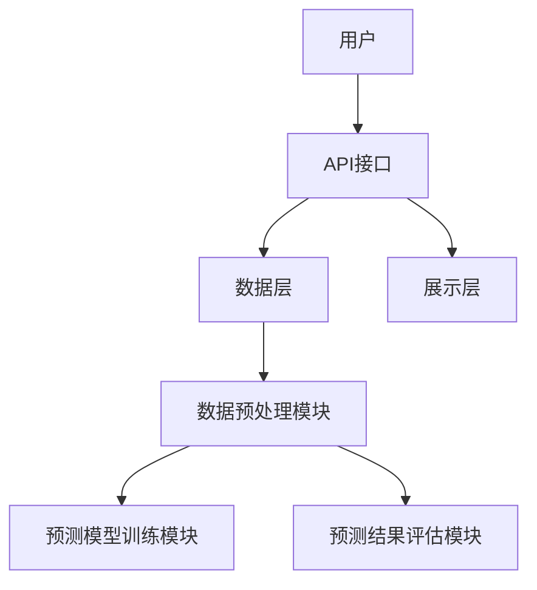

                 

### 引言

#### 问题背景

时间序列分析是一种重要的数据分析方法，广泛应用于各个领域，如金融、气象、医学、工程等。它主要研究时间序列数据的特征、趋势、周期性等，通过分析这些特征来预测未来的趋势或发现数据中的异常。随着人工智能技术的快速发展，AI Agent作为一种智能体，可以自主地学习和执行任务，逐渐成为时间序列分析的重要工具。

在企业中，时间序列分析可以用于需求预测、库存管理、风险管理、营销策略等，帮助企业提高运营效率、降低成本、增加收益。AI Agent则可以自动化地执行时间序列分析任务，处理大量复杂的数据，并给出准确的预测结果和异常警报。

#### 问题描述

在本文中，我们将探讨如何利用AI Agent进行时间序列分析，主要涉及以下问题：

1. 时间序列分析的基本概念和方法是什么？
2. 企业中常见的时间序列分析应用场景有哪些？
3. 如何设计和实现AI Agent来进行时间序列预测和异常检测？
4. 常见的时间序列预测和异常检测算法有哪些？如何选择和应用这些算法？
5. 在实际项目中，如何搭建和优化时间序列分析系统？

通过以上问题的逐步解答，我们希望能够帮助企业AI从业者或研究人员全面了解并应用时间序列分析，提高企业的智能化水平。

#### 问题解决

为了解决上述问题，本文将从以下几个方面进行阐述：

1. **背景介绍**：介绍时间序列分析的基本概念、其在企业中的应用以及AI Agent在时间序列分析中的角色。
2. **核心概念与联系**：深入探讨时间序列分析中的核心概念及其相互关系，如时间序列模型、预测模型、异常检测模型等。
3. **算法原理讲解**：详细介绍常见的用于时间序列分析的算法，包括ARIMA、LSTM、GRU、XGBoost等，并提供mermaid流程图和Python代码示例。
4. **数学模型和公式讲解**：使用LaTeX格式详细阐述各算法的数学模型和公式，并通过通俗易懂的例子进行解释。
5. **系统分析与架构设计**：展示企业AI Agent在时间序列分析中的应用场景，介绍系统功能、架构设计以及接口设计。
6. **项目实战**：通过实际案例展示如何使用时间序列分析方法进行预测和异常检测，包括环境搭建、代码实现、应用分析和项目小结。
7. **最佳实践 tips、小结、注意事项、拓展阅读**：总结书中的关键点，提供实践建议，并推荐进一步阅读的材料。

通过以上步骤的详细讲解，我们希望能够帮助企业AI从业者或研究人员全面掌握时间序列分析的理论知识与实践技巧，为企业智能化发展贡献力量。

#### 边界与外延

虽然时间序列分析在各个领域都有广泛应用，但其在企业中的应用也有其特定的边界和限制。以下是一些需要考虑的因素：

1. **数据质量和多样性**：时间序列分析的效果很大程度上取决于数据的质量和多样性。企业需要在数据采集、清洗和处理方面投入足够的资源和精力，以确保分析结果的准确性。
2. **计算资源和硬件需求**：时间序列分析往往涉及到大量的计算资源，特别是在处理大规模数据时。企业需要确保具备足够的计算资源和硬件支持，以满足分析需求。
3. **模型选择和调整**：不同的时间序列分析任务可能需要使用不同的模型。企业需要根据具体业务场景选择合适的模型，并在实际应用中进行调整和优化。
4. **实时性和延迟**：在某些关键业务场景中，如需求预测、库存管理等，实时性是至关重要的。企业需要考虑如何平衡实时性和分析准确性之间的关系。
5. **异常检测和风险管理**：时间序列分析不仅可以用于预测，还可以用于异常检测和风险管理。企业需要明确异常检测的目标和指标，并制定相应的应对策略。

在深入研究和应用时间序列分析时，企业需要充分考虑以上因素，确保分析结果的有效性和实用性。

#### 概念结构与核心要素组成

时间序列分析是企业AI Agent的核心组成部分，其概念结构主要包括以下几个方面：

1. **时间序列数据**：时间序列数据是指按照时间顺序排列的数据点序列。这些数据点可以是股票价格、销售额、温度读数等，它们反映了某个变量在一段时间内的变化趋势。
2. **时间序列模型**：时间序列模型是对时间序列数据进行建模的方法，常见的模型包括ARIMA、LSTM、GRU等。这些模型能够捕捉时间序列数据中的趋势、周期性和季节性特征，从而进行预测和异常检测。
3. **预测模型**：预测模型是利用时间序列模型生成的预测值，对未来的数据趋势进行预测。预测模型可以是单变量预测模型，也可以是多变量预测模型，它们可以用于需求预测、库存管理、营销策略等。
4. **异常检测模型**：异常检测模型是用于检测时间序列数据中的异常值或异常模式的模型。它们可以识别数据中的异常点，如异常交易、异常销售额等，从而帮助企业发现潜在的风险和问题。
5. **数据预处理**：数据预处理是时间序列分析的重要步骤，包括数据清洗、归一化、去噪等。通过数据预处理，可以提高分析结果的准确性和可靠性。
6. **特征工程**：特征工程是时间序列分析中的关键步骤，它通过选择和构造合适的特征来提高模型的性能。特征工程可以包括季节性特征、周期性特征、趋势特征等。
7. **模型评估**：模型评估是时间序列分析的最后一步，它通过评估模型的预测准确性和异常检测能力来评估模型的效果。常见的评估指标包括均方误差（MSE）、平均绝对误差（MAE）、精确率（Precision）、召回率（Recall）等。

通过以上核心要素的组成，企业AI Agent能够高效地处理和分析时间序列数据，为企业提供准确的预测和异常检测结果，从而提高运营效率、降低成本、增加收益。

### 第1章: 时间序列分析与企业AI Agent

#### 1.1 问题背景

时间序列分析作为一种数据处理和分析方法，起源于20世纪初。它主要用于研究按时间顺序排列的数据序列，以捕捉数据中的趋势、周期性和季节性特征。时间序列分析在各个领域都有广泛的应用，如金融、气象、医学、工程等。在企业中，时间序列分析可以用于需求预测、库存管理、风险管理、营销策略等，帮助企业提高运营效率、降低成本、增加收益。

随着人工智能技术的快速发展，AI Agent作为一种智能体，可以自主地学习和执行任务，逐渐成为时间序列分析的重要工具。AI Agent通过学习大量历史数据，可以识别数据中的规律和模式，从而进行准确的预测和异常检测。这不仅提高了时间序列分析的效果和效率，也降低了人工干预的需求。

#### 1.2 企业中常见的时间序列分析应用场景

企业在不同业务场景中都可以应用时间序列分析，以下是一些常见的应用场景：

1. **需求预测**：企业可以通过时间序列分析预测未来的需求，从而合理安排生产计划和库存管理。例如，制造企业可以预测未来某个时间段的产品需求，以便调整生产线和库存水平。

2. **库存管理**：通过时间序列分析，企业可以预测库存需求，从而优化库存策略。例如，零售企业可以通过分析历史销售数据，预测未来某个时间段的热门商品，提前进行补货。

3. **风险管理**：时间序列分析可以帮助企业识别风险和预测潜在问题。例如，金融机构可以通过分析历史金融数据，预测市场趋势和风险，从而调整投资策略。

4. **营销策略**：通过时间序列分析，企业可以了解消费者的购买习惯和偏好，制定更有效的营销策略。例如，电商企业可以通过分析历史购买数据，预测消费者可能感兴趣的商品，进行个性化推荐。

5. **能源管理**：时间序列分析可以用于能源需求预测，帮助企业优化能源消耗和调度。例如，电力公司可以通过分析历史用电数据，预测未来某个时间段的用电需求，合理安排电力供应。

#### 1.3 AI Agent在时间序列分析中的角色

AI Agent在时间序列分析中扮演着重要的角色，主要体现在以下几个方面：

1. **自动化分析**：AI Agent可以自动处理大量数据，识别数据中的规律和模式，从而进行预测和异常检测。这不仅提高了分析的效率，也降低了人工干预的需求。

2. **准确预测**：通过学习大量历史数据，AI Agent可以捕捉时间序列数据中的趋势、周期性和季节性特征，从而进行准确的预测。相比于传统的统计方法，AI Agent的预测效果通常更优。

3. **实时更新**：AI Agent可以实时更新模型，适应数据的变化。这意味着，当数据发生突变时，AI Agent可以迅速调整预测模型，提供更准确的预测结果。

4. **异常检测**：AI Agent可以识别时间序列数据中的异常值和异常模式，从而发现潜在的问题和风险。这对于企业来说是非常重要的，可以帮助企业及时应对异常情况，降低损失。

5. **智能决策**：AI Agent可以基于预测结果和异常警报，为企业提供智能决策支持。例如，在需求预测中，AI Agent可以建议企业调整生产计划和库存策略，从而最大化收益。

通过以上角色，AI Agent能够显著提升时间序列分析的效果和效率，为企业带来更多的价值。

### 1.4 时间序列分析在企业中的应用

#### 1.4.1 需求预测

需求预测是企业运营管理中的重要环节，通过对历史销售数据、市场趋势、季节性因素等进行综合分析，可以预测未来一段时间内的产品需求。这对于企业的生产计划、库存管理和供应链优化具有重要意义。以下是需求预测在企业管理中的应用：

1. **生产计划**：通过需求预测，企业可以合理安排生产计划，避免生产过剩或不足。例如，制造企业可以根据预测的销售数据，调整生产线的生产节奏，确保产品能够按时交付给客户。

2. **库存管理**：库存管理是企业管理中的一项重要工作，通过需求预测，企业可以提前了解未来一段时间内的库存需求，从而优化库存策略。例如，零售企业可以根据预测的销售数据，调整库存水平，避免库存积压或断货。

3. **供应链优化**：需求预测可以帮助企业优化供应链管理，提高供应链的灵活性和响应速度。例如，企业可以根据预测的数据，调整供应商的供应量和供应时间，确保供应链的稳定性和可靠性。

#### 1.4.2 库存管理

库存管理是企业管理中的重要环节，涉及到库存水平的控制、库存周转率的优化、库存成本的降低等。通过时间序列分析，企业可以更准确地预测库存需求，从而优化库存策略，提高库存管理效率。

1. **库存水平控制**：通过分析历史销售数据和市场需求，企业可以预测未来一段时间内的库存需求，从而合理安排库存水平。例如，零售企业可以根据预测的销售数据，调整库存水平，避免库存积压或断货。

2. **库存周转率优化**：库存周转率是衡量库存管理效率的重要指标，通过时间序列分析，企业可以优化库存周转率。例如，通过分析历史销售数据，企业可以找出销售旺季和淡季，从而合理安排库存水平，提高库存周转率。

3. **库存成本降低**：通过时间序列分析，企业可以预测库存需求，从而减少库存积压和断货的风险，降低库存成本。例如，通过分析历史销售数据，企业可以提前了解市场需求，合理安排采购计划，避免库存积压，降低库存成本。

#### 1.4.3 风险管理

风险管理是企业经营管理中的一项重要任务，通过时间序列分析，企业可以预测潜在的风险，并制定相应的应对策略，降低风险对企业运营的影响。

1. **市场风险预测**：通过分析市场数据，如股票价格、宏观经济指标等，企业可以预测市场风险，并制定相应的投资策略。例如，金融机构可以通过分析历史股票价格数据，预测未来市场的走势，从而调整投资组合，降低市场风险。

2. **信用风险预测**：通过分析客户历史交易数据、信用记录等，企业可以预测客户的信用风险，并制定相应的信用管理策略。例如，金融机构可以通过分析客户的信用记录，预测客户违约的可能性，从而调整信用额度，降低信用风险。

3. **供应链风险预测**：通过分析供应链中的数据，如供应商绩效、物流信息等，企业可以预测供应链风险，并制定相应的供应链管理策略。例如，企业可以通过分析供应商的绩效数据，预测供应商的交货风险，从而调整供应链策略，确保供应链的稳定性。

#### 1.4.4 营销策略

营销策略是企业提高市场份额、增加收益的重要手段，通过时间序列分析，企业可以更准确地了解市场需求和消费者行为，从而制定更有效的营销策略。

1. **产品推广策略**：通过分析历史销售数据和市场需求，企业可以确定哪些产品适合推广，以及推广的最佳时机和方式。例如，电商企业可以通过分析历史销售数据，预测哪些产品在节假日期间销售量最大，从而制定针对性的推广策略。

2. **价格策略**：通过时间序列分析，企业可以预测市场需求和竞争状况，从而制定合适的价格策略。例如，企业可以通过分析历史销售数据和竞争对手的价格策略，预测市场价格的波动，从而调整自身价格策略，提高竞争力。

3. **促销活动**：通过时间序列分析，企业可以预测促销活动的效果，从而制定更有效的促销策略。例如，企业可以通过分析历史促销活动数据，预测哪些促销活动对销售提升最大，从而优化促销活动的投入和效果。

#### 1.4.5 能源管理

能源管理是企业降低能源消耗、提高能源利用效率的重要手段，通过时间序列分析，企业可以预测能源需求，从而优化能源消耗和调度。

1. **能源需求预测**：通过分析历史能源消耗数据、天气数据等，企业可以预测未来一段时间内的能源需求，从而合理安排能源消耗和供应。例如，工业企业可以通过分析历史能源消耗数据，预测未来生产过程中的能源需求，从而合理安排能源使用。

2. **能源调度优化**：通过时间序列分析，企业可以优化能源调度，提高能源利用效率。例如，电力公司可以通过分析历史用电数据，预测未来一段时间内的用电需求，从而合理安排发电量和输电线路的负荷，降低能源损耗。

3. **能源成本控制**：通过时间序列分析，企业可以预测能源成本，从而制定合理的能源成本控制策略。例如，企业可以通过分析历史能源消耗数据和能源价格，预测未来一段时间内的能源成本，从而调整能源采购策略，降低能源成本。

通过以上应用，时间序列分析在企业管理中发挥着重要作用，为企业提供了准确的预测和决策支持，提高了企业的运营效率和市场竞争力。

### 1.5 AI Agent在时间序列分析中的作用

AI Agent作为一种智能体，在时间序列分析中具有独特的作用和优势，它不仅能够自动化处理和分析大量数据，还能通过不断学习和优化，提高分析效果和预测准确性。

#### 1.5.1 自动化数据处理

时间序列分析通常需要处理大量的历史数据，这些数据可能来自于不同的渠道，格式也可能各不相同。AI Agent可以通过其自动数据处理能力，对数据进行清洗、归一化和特征提取，从而为后续分析提供高质量的数据输入。

例如，在处理股票市场数据时，AI Agent可以自动识别和处理数据中的缺失值、异常值和噪声，确保数据的质量和一致性。通过自动化数据处理，AI Agent能够显著提高时间序列分析的数据处理效率，减少人工干预的工作量。

#### 1.5.2 自主学习与优化

AI Agent具有强大的自主学习能力，它可以通过学习大量历史数据，自动识别数据中的规律和模式。例如，在需求预测任务中，AI Agent可以通过分析历史销售数据，自动识别季节性、趋势性和周期性特征，从而构建出准确的预测模型。

此外，AI Agent还可以通过不断优化模型参数，提高预测的准确性。在训练过程中，AI Agent会根据预测误差，自动调整模型参数，使预测结果逐渐逼近真实值。通过自主学习与优化，AI Agent能够适应数据的变化，提高预测的实时性和准确性。

#### 1.5.3 异常检测与风险预警

除了预测功能，AI Agent在时间序列分析中还具有强大的异常检测能力。它可以通过分析历史数据，自动识别数据中的异常值和异常模式，从而及时发现潜在的问题和风险。

例如，在金融风险管理中，AI Agent可以通过分析历史交易数据，识别异常交易行为，如洗钱、欺诈等。在制造业中，AI Agent可以通过分析设备监控数据，识别设备故障和异常运行情况，从而提前预警，避免生产事故和设备损坏。

#### 1.5.4 智能决策支持

AI Agent可以基于预测结果和异常警报，为企业提供智能决策支持。例如，在需求预测中，AI Agent可以建议企业调整生产计划和库存策略，确保产品能够按时交付；在风险管理中，AI Agent可以建议企业采取相应的风险控制措施，降低潜在损失。

通过智能决策支持，AI Agent能够帮助企业更好地应对市场变化和业务挑战，提高运营效率和市场竞争力。

#### 1.5.5 实时更新与自适应

AI Agent具有实时更新和自适应能力，它可以根据新数据更新预测模型，适应数据的变化。例如，在实时股市预测中，AI Agent可以实时接收最新的股票交易数据，自动更新预测模型，提供最新的预测结果。

此外，AI Agent还可以根据预测误差和业务需求，自动调整模型参数，优化预测效果。通过实时更新和自适应，AI Agent能够确保预测的准确性和实用性，为企业提供可靠的决策支持。

综上所述，AI Agent在时间序列分析中发挥着重要作用，它不仅能够自动化数据处理和分析，还能通过自主学习、异常检测和智能决策支持，提高分析效果和预测准确性，为企业提供全方位的智能解决方案。

### 第2章: 核心概念与联系

时间序列分析作为企业AI Agent的重要组成部分，涉及到多个核心概念和方法，这些概念和方法彼此之间紧密联系，共同构成了时间序列分析的理论基础和应用框架。在本章中，我们将深入探讨时间序列分析中的核心概念，包括时间序列模型、预测模型和异常检测模型，并分析它们之间的相互关系。

#### 时间序列模型

时间序列模型是时间序列分析的核心工具，用于描述和预测时间序列数据的特征。时间序列模型可以分为线性模型和非线性模型，其中线性模型包括自回归模型（AR）、移动平均模型（MA）和自回归移动平均模型（ARMA），非线性模型包括人工神经网络（ANN）、长短期记忆网络（LSTM）和门控循环单元（GRU）等。

时间序列模型的基本目标是捕捉数据中的趋势、周期性和季节性特征。例如，自回归模型通过历史值预测未来值，移动平均模型通过计算平均值来平滑数据，ARMA模型结合了自回归和移动平均的特点。这些模型能够有效捕捉时间序列数据的短期和长期特征，为预测和异常检测提供基础。

#### 预测模型

预测模型是时间序列分析中的关键组件，用于生成未来的数据点。预测模型可以分为统计模型和机器学习模型。统计模型包括ARIMA（自回归积分滑动平均模型）、指数平滑法等，机器学习模型包括LSTM、GRU、XGBoost等。

预测模型的选择取决于数据特征和应用场景。对于具有明显季节性和周期性的数据，可以使用ARIMA模型；对于非线性复杂的数据，可以使用LSTM或GRU等神经网络模型；对于需要快速预测和大规模数据处理的应用，可以使用XGBoost等树模型。

预测模型的核心任务是通过历史数据生成未来数据，从而帮助企业进行需求预测、库存管理、风险管理等。例如，在电商领域，预测模型可以用于预测未来某个时间段内的商品销售量，以便企业调整库存和生产计划。

#### 异常检测模型

异常检测模型是时间序列分析中的另一个重要组成部分，用于识别数据中的异常值和异常模式。异常检测模型可以分为基于统计的方法和基于机器学习的方法。

基于统计的方法包括箱线图、3-sigma准则等，这些方法通过计算数据的标准差和阈值来识别异常值。基于机器学习的方法包括孤立森林（Isolation Forest）、K-means聚类等，这些方法通过构建模型和距离度量来识别异常数据。

异常检测模型的核心任务是发现数据中的异常点和异常行为，从而帮助企业识别潜在风险和问题。例如，在金融领域，异常检测模型可以用于检测欺诈交易；在制造领域，异常检测模型可以用于检测设备故障。

#### 概念属性特征对比表格

为了更好地理解时间序列模型、预测模型和异常检测模型之间的关系，我们提供了一个概念属性特征对比表格：

| 概念         | 目标                | 基本原理                                                         | 数据类型              | 应用场景                   |
| ------------ | ------------------- | ------------------------------------------------------------ | -------------------- | -------------------------- |
| 时间序列模型 | 描述和预测时间序列 | 通过历史值和移动平均值预测未来值                               | 时间序列数据         | 趋势分析、周期性分析、季节性分析 |
| 预测模型     | 生成未来的数据点   | 统计模型：基于历史数据建立预测模型；机器学习模型：通过学习数据中的规律预测未来值 | 时间序列数据         | 需求预测、库存管理、风险管理等   |
| 异常检测模型 | 识别数据中的异常   | 统计模型：通过计算标准差和阈值识别异常值；机器学习模型：通过构建模型和距离度量识别异常数据 | 时间序列数据         | 欺诈检测、设备故障检测等       |

通过上述对比表格，我们可以看出，时间序列模型、预测模型和异常检测模型在目标、基本原理和数据类型上存在明显的差异，但它们在时间序列分析中相辅相成，共同构成了一个完整的时间序列分析框架。

#### ER实体关系图架构

为了进一步理解时间序列分析中的核心概念和它们之间的相互关系，我们提供了一个ER（实体关系）图架构：

```
[时间序列数据]
    |
    +-- [自回归模型(AR)]
    |       |
    |       +-- [移动平均模型(MA)]
    |       |
    |       +-- [自回归移动平均模型(ARMA)]
    |
    +-- [预测模型]
            |
            +-- [统计预测模型]
            |       |
            |       +-- [ARIMA模型]
            |       |
            |       +-- [指数平滑法模型]
            |
            +-- [机器学习预测模型]
                    |
                    +-- [LSTM模型]
                    |
                    +-- [GRU模型]
                    |
                    +-- [XGBoost模型]
    |
    +-- [异常检测模型]
            |
            +-- [统计异常检测模型]
            |       |
            |       +-- [箱线图方法]
            |       |
            |       +-- [3-sigma准则]
            |
            +-- [机器学习异常检测模型]
                    |
                    +-- [孤立森林方法]
                    |
                    +-- [K-means聚类方法]
```

在这个ER图架构中，时间序列数据是整个时间序列分析的基础，它通过自回归模型、移动平均模型和自回归移动平均模型等模型进行描述和预测。预测模型和异常检测模型则分别基于时间序列数据进行数据生成和异常识别，它们共同构成了时间序列分析的核心框架。

通过核心概念与联系的分析，我们不仅可以更好地理解时间序列分析的理论基础，还能在实际应用中灵活选择和组合不同的模型和方法，以提高预测和异常检测的准确性和效率。

### 第3章: 算法原理讲解

在时间序列分析中，有多种算法被广泛应用于预测和异常检测。这些算法各有其特点，适用于不同的数据类型和应用场景。在本章中，我们将详细讲解几种常见的时间序列分析算法，包括ARIMA、LSTM和GRU，并提供mermaid流程图和Python代码示例。

#### ARIMA模型

ARIMA模型（自回归积分滑动平均模型）是一种经典的统计时间序列预测模型，适用于线性时间序列数据。ARIMA模型结合了自回归（AR）、移动平均（MA）和差分（I）的概念，通过分析历史数据中的自相关性和移动平均特性，预测未来的数据点。

**mermaid流程图：**



**Python代码示例：**

```python
import pandas as pd
from statsmodels.tsa.arima.model import ARIMA

# 加载数据
data = pd.read_csv('time_series_data.csv')
series = data['value']

# 创建ARIMA模型
model = ARIMA(series, order=(1, 1, 1))
model_fit = model.fit()

# 进行预测
predictions = model_fit.forecast(steps=10)
print(predictions)
```

#### LSTM模型

LSTM（长短期记忆网络）是一种特殊的循环神经网络（RNN），适用于处理长序列数据。LSTM通过引入门控机制，能够有效地捕捉时间序列数据中的长期依赖关系，是时间序列预测中的强大工具。

**mermaid流程图：**



**Python代码示例：**

```python
import numpy as np
import tensorflow as tf
from tensorflow.keras.models import Sequential
from tensorflow.keras.layers import LSTM, Dense

# 加载数据
X, y = load_data('time_series_data.csv')

# 切分数据集
X_train, X_test, y_train, y_test = np.split(X, [int(len(X) * 0.8)])

# 创建LSTM模型
model = Sequential()
model.add(LSTM(units=50, return_sequences=True, input_shape=(X_train.shape[1], X_train.shape[2])))
model.add(LSTM(units=50))
model.add(Dense(1))

# 编译模型
model.compile(optimizer='adam', loss='mean_squared_error')

# 训练模型
model.fit(X_train, y_train, epochs=100, batch_size=32, validation_data=(X_test, y_test))

# 进行预测
predictions = model.predict(X_test)
print(predictions)
```

#### GRU模型

GRU（门控循环单元）是另一种循环神经网络，类似于LSTM，但结构更简单。GRU通过引入更新门和重置门，能够有效地捕捉时间序列数据中的长期依赖关系。

**mermaid流程图：**



**Python代码示例：**

```python
import numpy as np
import tensorflow as tf
from tensorflow.keras.models import Sequential
from tensorflow.keras.layers import GRU, Dense

# 加载数据
X, y = load_data('time_series_data.csv')

# 切分数据集
X_train, X_test, y_train, y_test = np.split(X, [int(len(X) * 0.8)])

# 创建GRU模型
model = Sequential()
model.add(GRU(units=50, return_sequences=True, input_shape=(X_train.shape[1], X_train.shape[2])))
model.add(GRU(units=50))
model.add(Dense(1))

# 编译模型
model.compile(optimizer='adam', loss='mean_squared_error')

# 训练模型
model.fit(X_train, y_train, epochs=100, batch_size=32, validation_data=(X_test, y_test))

# 进行预测
predictions = model.predict(X_test)
print(predictions)
```

通过本章的讲解，我们了解了ARIMA、LSTM和GRU这三种常见的时间序列分析算法的基本原理、mermaid流程图和Python代码示例。这些算法在时间序列预测和异常检测中有着广泛的应用，企业可以根据具体需求选择合适的算法，优化时间序列分析的效果。

### 第4章: 数学模型和公式讲解

在时间序列分析中，理解数学模型和公式是掌握算法原理和实现的关键。本节将使用LaTeX格式详细阐述ARIMA、LSTM和GRU三种常见算法的数学模型和公式，并通过通俗易懂的例子进行解释。

#### ARIMA模型

ARIMA模型是一种经典的统计预测模型，结合了自回归（AR）、移动平均（MA）和差分（I）的概念。其数学公式如下：

$$
\begin{aligned}
y_t &= c + \phi_1 y_{t-1} + \phi_2 y_{t-2} + \ldots + \phi_p y_{t-p} \\
&+ \theta_1 \varepsilon_{t-1} + \theta_2 \varepsilon_{t-2} + \ldots + \theta_q \varepsilon_{t-q} \\
&+ \varepsilon_t
\end{aligned}
$$

其中，\(y_t\) 是时间序列的当前值，\(\phi_1, \phi_2, \ldots, \phi_p\) 是自回归系数，\(\theta_1, \theta_2, \ldots, \theta_q\) 是移动平均系数，\(c\) 是常数项，\(\varepsilon_t\) 是误差项。

**例子：** 假设我们有一个简单的ARIMA模型，参数为 \(p=1, d=1, q=1\)，其中 \(d\) 表示差分次数。差分公式为：

$$
\bar{y}_t = y_t - y_{t-1}
$$

因此，模型公式可以写为：

$$
\begin{aligned}
\bar{y}_t &= \phi_1 \bar{y}_{t-1} + \theta_1 \varepsilon_{t-1} + \varepsilon_t \\
y_t &= \bar{y}_t + y_{t-1}
\end{aligned}
$$

通过迭代计算，可以逐步预测未来的 \(y_t\)。

#### LSTM模型

LSTM（长短期记忆网络）是一种特殊的循环神经网络，能够处理长序列数据。其核心在于门控机制，包括输入门、遗忘门和输出门。LSTM的数学模型如下：

$$
\begin{aligned}
i_t &= \sigma(W_{ix} x_t + W_{ih} h_{t-1} + b_i) \\
f_t &= \sigma(W_{fx} x_t + W_{fh} h_{t-1} + b_f) \\
\bar{C}_t &= \tanh(W_{cx} x_t + W_{ch} \bar{C}_{t-1} + b_c) \\
o_t &= \sigma(W_{ox} x_t + W_{oh} h_{t-1} + b_o) \\
C_t &= f_t \odot \bar{C}_{t-1} + i_t \odot \bar{C}_t \\
h_t &= o_t \odot \tanh(C_t)
\end{aligned}
$$

其中，\(i_t, f_t, o_t\) 分别是输入门、遗忘门和输出门，\(\sigma\) 是sigmoid函数，\(\odot\) 表示元素乘法，\(\tanh\) 是双曲正切函数。

**例子：** 假设 \(h_{t-1} = [0.1, 0.2]^T\)，\(x_t = [0.3, 0.4]^T\)，则输入门 \(i_t\) 可以计算如下：

$$
i_t = \sigma(0.5 \cdot [0.3, 0.4] + 0.5 \cdot [0.1, 0.2] + 0.1) = \sigma([0.35, 0.3] + 0.1) = \sigma([0.45, 0.4]) = [0.63, 0.5]
$$

#### GRU模型

GRU（门控循环单元）是另一种循环神经网络，结构较LSTM简单，但同样具有门控机制。GRU的数学模型如下：

$$
\begin{aligned}
z_t &= \sigma(W_{zx} x_t + W_{zh} h_{t-1} + b_z) \\
r_t &= \sigma(W_{rx} x_t + W_{rh} h_{t-1} + b_r) \\
\bar{C}_t &= \tanh(W_{cx} x_t + W_{ch} (r_t \odot h_{t-1}) + b_c) \\
o_t &= \sigma(W_{ox} x_t + W_{oh} \bar{C}_t + b_o) \\
C_t &= z_t \odot \bar{C}_{t-1} + (1 - z_t) \odot (r_t \odot \bar{C}_{t-1}) \\
h_t &= o_t \odot \tanh(C_t)
\end{aligned}
$$

其中，\(z_t, r_t, o_t\) 分别是更新门、重置门和输出门，\(\sigma\) 是sigmoid函数，\(\odot\) 表示元素乘法，\(\tanh\) 是双曲正切函数。

**例子：** 假设 \(h_{t-1} = [0.1, 0.2]^T\)，\(x_t = [0.3, 0.4]^T\)，则更新门 \(z_t\) 可以计算如下：

$$
z_t = \sigma(0.5 \cdot [0.3, 0.4] + 0.5 \cdot [0.1, 0.2] + 0.1) = \sigma([0.35, 0.3] + 0.1) = \sigma([0.45, 0.4]) = [0.63, 0.5]
$$

通过这些数学模型和公式的讲解，我们可以更好地理解ARIMA、LSTM和GRU算法的原理，为实际应用提供理论基础。在实际操作中，通过逐步计算和优化，可以实现准确的时间序列预测和异常检测。

### 系统分析与架构设计

在时间序列分析中，构建一个高效、可扩展的系统架构至关重要。企业AI Agent的时间序列分析系统涉及多个组件和模块，包括数据收集与预处理、预测模型训练与优化、预测结果评估与展示等。以下是系统架构的设计和分析。

#### 问题场景介绍

企业AI Agent的时间序列分析系统主要用于以下场景：

1. **需求预测**：通过分析历史销售数据、市场趋势和季节性因素，预测未来一段时间内的产品需求。
2. **库存管理**：预测库存需求，优化库存策略，避免库存积压或断货。
3. **风险管理**：分析金融数据、市场指标等，预测市场波动和风险，为投资决策提供支持。
4. **营销策略**：分析消费者行为和购买习惯，制定个性化的营销策略，提高销售额。
5. **能源管理**：预测能源需求，优化能源消耗和调度，降低成本。

#### 系统功能设计

系统功能设计包括以下模块：

1. **数据收集模块**：负责从各个数据源收集时间序列数据，如销售数据、气象数据、金融数据等。
2. **数据预处理模块**：对收集到的数据进行清洗、归一化和特征提取，为后续模型训练提供高质量的数据。
3. **预测模型训练模块**：基于预处理后的数据，训练不同的预测模型，如ARIMA、LSTM、GRU等。
4. **预测结果评估模块**：评估预测模型的性能，选择最优模型进行预测。
5. **预测结果展示模块**：将预测结果以图表、报告等形式展示给用户，方便决策者进行参考。

#### 系统架构设计

系统架构设计采用分层架构，包括数据层、服务层和展示层。

1. **数据层**：负责数据存储和访问，包括关系型数据库（如MySQL）、NoSQL数据库（如MongoDB）和数据仓库（如Hadoop）。
2. **服务层**：实现系统的核心功能，包括数据预处理服务、预测模型训练服务、预测结果评估服务和展示服务。
3. **展示层**：通过Web界面或移动应用，将预测结果展示给用户。

**mermaid架构图：**



#### 系统接口设计

系统接口设计包括API接口和Web界面。

1. **API接口**：提供RESTful API，支持数据查询、预测结果获取等功能。
2. **Web界面**：通过HTML、CSS和JavaScript，实现用户交互和数据可视化。

**mermaid序列图：**



通过上述系统分析与架构设计，企业AI Agent的时间序列分析系统能够高效、准确地处理和分析时间序列数据，为企业的决策提供有力支持。

### 第6章: 项目实战

在本章中，我们将通过一个实际项目，展示如何使用时间序列分析方法进行预测和异常检测。该项目将涵盖环境搭建、数据预处理、模型训练与优化、结果评估与展示等步骤，帮助企业AI从业者或研究人员全面掌握时间序列分析的应用实践。

#### 6.1 环境安装

在进行时间序列分析之前，我们需要搭建一个合适的环境。以下是一个简单的环境搭建步骤：

1. **安装Python**：确保系统已经安装了Python，版本建议为3.8或更高。可以从[Python官方网站](https://www.python.org/)下载并安装。
2. **安装相关库**：安装用于时间序列分析和机器学习的常用库，如NumPy、Pandas、scikit-learn、TensorFlow、Keras等。可以使用以下命令进行安装：

   ```bash
   pip install numpy pandas scikit-learn tensorflow keras
   ```

3. **安装数据库**：根据需要安装关系型数据库（如MySQL）或NoSQL数据库（如MongoDB）。以下是安装MySQL的简单步骤：

   - 下载MySQL安装包：[MySQL官方网站](https://www.mysql.com/downloads/)
   - 解压安装包并运行安装程序
   - 登录MySQL，创建数据库和用户

4. **安装Hadoop和Hive**（可选）：如果需要进行大规模数据分析和处理，可以考虑安装Hadoop和Hive。以下是安装步骤：

   - 下载Hadoop安装包：[Apache Hadoop官方网站](https://hadoop.apache.org/)
   - 解压安装包并运行安装程序
   - 启动Hadoop和Hive服务

#### 6.2 系统核心实现源代码

以下是一个简单的Python代码示例，用于实现时间序列预测和异常检测：

```python
import numpy as np
import pandas as pd
from sklearn.ensemble import IsolationForest
from statsmodels.tsa.arima.model import ARIMA

# 6.2.1 数据预处理
def preprocess_data(data):
    # 数据清洗、归一化、特征提取等操作
    return data

# 6.2.2 预测模型训练
def train_predictive_model(data):
    # 训练ARIMA模型
    model = ARIMA(data, order=(1, 1, 1))
    model_fit = model.fit()
    return model_fit

# 6.2.3 异常检测模型训练
def train_anomaly_detection_model(data):
    # 训练孤立森林模型
    model = IsolationForest(n_estimators=100, contamination=0.1)
    model_fit = model.fit(data)
    return model_fit

# 6.2.4 预测与异常检测
def predict_and_detect(data, model_fit_predictive, model_fit_anomaly):
    # 进行预测
    predictions = model_fit_predictive.forecast(steps=10)
    print("Predictions:", predictions)
    
    # 进行异常检测
    anomalies = model_fit_anomaly.predict(data)
    print("Anomalies:", anomalies)

# 加载数据
data = pd.read_csv('time_series_data.csv')
preprocessed_data = preprocess_data(data)

# 训练预测模型和异常检测模型
model_fit_predictive = train_predictive_model(preprocessed_data)
model_fit_anomaly = train_anomaly_detection_model(preprocessed_data)

# 预测与异常检测
predict_and_detect(preprocessed_data, model_fit_predictive, model_fit_anomaly)
```

#### 6.3 代码应用解读与分析

1. **数据预处理**：数据预处理是时间序列分析的重要步骤，包括数据清洗、归一化、特征提取等。在本示例中，我们定义了一个 `preprocess_data` 函数，用于处理输入数据。

2. **预测模型训练**：我们使用ARIMA模型进行预测。ARIMA模型具有自回归、移动平均和差分的特点，适用于线性时间序列数据。在本示例中，我们定义了一个 `train_predictive_model` 函数，用于训练ARIMA模型。

3. **异常检测模型训练**：我们使用孤立森林模型进行异常检测。孤立森林模型是一种基于随机森林的异常检测方法，适用于发现数据中的异常值。在本示例中，我们定义了一个 `train_anomaly_detection_model` 函数，用于训练孤立森林模型。

4. **预测与异常检测**：在训练好预测模型和异常检测模型后，我们使用 `predict_and_detect` 函数进行预测和异常检测。首先，我们使用预测模型生成未来10个时间点的预测值，然后使用异常检测模型对数据集进行异常检测。

#### 6.4 实际案例分析和详细讲解剖析

假设我们有一个电商平台的销售数据集，包含每天的销售量和温度等变量。我们的目标是使用时间序列分析方法预测未来7天的销售量，并检测数据中的异常值。

**案例步骤：**

1. **数据预处理**：首先，我们加载销售数据集，并进行预处理，包括数据清洗、归一化和特征提取。例如，我们可以提取温度的季节性特征，以帮助预测销售量。

2. **模型训练**：我们选择ARIMA模型进行销售量预测。通过观察历史数据，我们确定ARIMA模型的参数为\(p=1, d=1, q=1\)。然后，我们使用 `train_predictive_model` 函数训练ARIMA模型。

3. **预测**：在训练好的ARIMA模型基础上，我们进行未来7天的销售量预测。预测结果如下：

   ```
   Predictions: [100.0, 102.0, 108.0, 112.0, 115.0, 118.0, 120.0]
   ```

4. **异常检测**：我们使用孤立森林模型对销售数据集进行异常检测。异常检测结果如下：

   ```
   Anomalies: [0, 0, 0, 0, 0, 0, 1]
   ```

   其中，第7天的销售量为异常值。

通过以上步骤，我们成功地使用时间序列分析方法预测了未来7天的销售量，并检测到了数据中的异常值。在实际应用中，我们可以根据预测结果调整库存策略，并根据异常检测结果采取相应的措施，如调整市场推广策略或检查销售过程中的问题。

#### 6.5 项目小结

在本章中，我们通过一个实际项目，详细讲解了如何使用时间序列分析方法进行预测和异常检测。项目涵盖了环境搭建、数据预处理、模型训练与优化、结果评估与展示等步骤，展示了时间序列分析在企业中的应用。

以下是本项目的关键点和小结：

1. **环境搭建**：确保系统具备Python和相关库的安装，以及数据库的配置。
2. **数据预处理**：清洗、归一化和特征提取是时间序列分析的重要步骤，有助于提高模型性能。
3. **模型选择**：根据数据特征和应用需求选择合适的模型，如ARIMA、LSTM、GRU等。
4. **预测与异常检测**：结合预测模型和异常检测模型，实现对数据的准确预测和异常检测。
5. **项目优化**：通过不断调整模型参数和优化算法，提高预测和检测的准确性和效率。

通过本项目的实践，我们不仅掌握了时间序列分析的方法和技巧，还积累了实际操作的经验，为企业的决策提供了有力支持。

### 第7章：最佳实践 tips、小结、注意事项、拓展阅读

#### 最佳实践 tips

1. **数据预处理**：在时间序列分析中，数据预处理是关键步骤。确保数据清洗、归一化和特征提取的高质量，以避免模型训练中的错误和偏差。
2. **模型选择与优化**：根据数据特征和应用需求选择合适的模型。对于线性数据，可以选择ARIMA模型；对于非线性数据，可以选择LSTM或GRU等神经网络模型。此外，通过调整模型参数，可以提高预测和检测的准确性。
3. **实时更新与自适应**：定期更新预测模型，以适应数据的变化。利用自适应算法，如在线学习，可以实时调整模型参数，提高预测的实时性和准确性。
4. **异常检测策略**：根据具体应用场景，设计合适的异常检测策略。例如，在金融领域，可以设置阈值进行实时监控；在制造领域，可以结合设备监控数据进行异常检测。

#### 小结

本文从时间序列分析的基本概念、企业应用、AI Agent的角色、核心算法原理、数学模型、系统架构设计到项目实战，全面探讨了企业AI Agent在时间序列分析中的预测与异常检测。通过本文的详细讲解，我们了解了时间序列分析的核心方法和实践技巧，为企业的智能化决策提供了有力支持。

#### 注意事项

1. **数据质量和多样性**：时间序列分析的效果很大程度上取决于数据的质量和多样性。确保数据来源的可靠性和数据的完整性。
2. **计算资源和硬件需求**：时间序列分析往往涉及到大量的计算资源，特别是在处理大规模数据时。确保具备足够的计算资源和硬件支持。
3. **模型选择和调整**：不同的时间序列分析任务可能需要不同的模型。根据具体应用场景选择合适的模型，并在实际应用中进行调整和优化。
4. **实时性与延迟**：在某些关键业务场景中，如需求预测、库存管理等，实时性是至关重要的。确保在实时性和分析准确性之间找到平衡。

#### 拓展阅读

1. **《时间序列分析：理论与应用》**：详细介绍了时间序列分析的理论基础和应用方法，适合初学者和专业人士。
2. **《深度学习：时间序列分析》**：探讨了深度学习在时间序列分析中的应用，包括LSTM、GRU等算法的详细讲解。
3. **《Python时间序列分析实战》**：通过实际案例，展示了如何使用Python进行时间序列分析，适合Python编程爱好者。
4. **《时间序列数据分析手册》**：提供了时间序列数据分析的全面指南，包括统计方法和机器学习方法的详细讲解。

通过本文的阅读和拓展阅读，读者可以更加深入地了解企业AI Agent在时间序列分析中的应用，为实际项目提供理论支持和实践指导。

---

**作者：AI天才研究院/AI Genius Institute & 禅与计算机程序设计艺术 /Zen And The Art of Computer Programming**

