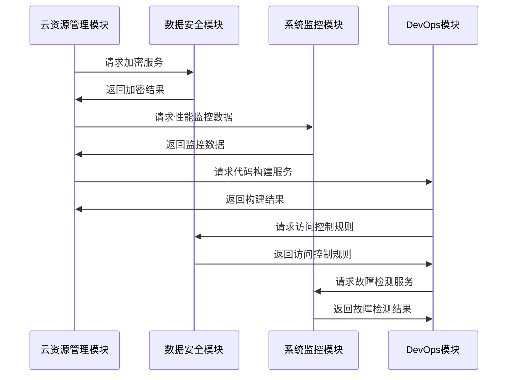

                 


### 目录大纲

# 《企业AI Agent的混合云部署策略》

## 关键词
- 混合云部署
- 企业AI Agent
- 资源优化
- 安全性
- 可扩展性
- DevOps

## 摘要
本文旨在探讨企业AI Agent在混合云环境中的部署策略。通过分析混合云的特性和企业AI Agent的需求，本文将详细阐述部署策略的各个方面，包括资源管理、安全性考虑、可扩展性设计以及DevOps实践。读者将了解如何利用混合云的优势，实现企业AI Agent的高效、安全部署。

---

## 第一步：背景介绍

### 核心概念术语说明

- **混合云（Hybrid Cloud）**：混合云结合了公有云和私有云的优势，允许企业在不同的云环境中运行应用程序和数据。
- **企业AI Agent**：企业AI Agent是指具备自主决策能力的AI系统，能够在企业业务场景中执行特定的任务，如预测分析、智能推荐等。
- **资源优化（Resource Optimization）**：资源优化涉及如何高效地分配和使用云计算资源，以降低成本和提高性能。
- **安全性（Security）**：安全性是混合云部署的核心关注点，确保数据和应用的安全防护。
- **可扩展性（Scalability）**：可扩展性是指系统能够根据需求动态扩展其资源和使用能力。

### 问题背景

随着云计算技术的普及，越来越多的企业选择将业务迁移到云环境。混合云作为一种灵活的云服务模式，满足了企业对高性能、安全性和成本效益的需求。然而，企业AI Agent的部署面临着诸多挑战，包括如何高效管理云资源、保障数据安全以及实现系统的可扩展性。

### 问题描述

- **资源管理**：如何在混合云环境中优化资源分配，以最大化利用资源？
- **安全性**：如何确保企业AI Agent在混合云中的数据和应用安全？
- **可扩展性**：如何设计系统架构，以支持企业AI Agent的弹性扩展？
- **DevOps实践**：如何将DevOps理念应用于企业AI Agent的部署过程，提高部署效率和可靠性？

### 问题解决

本文将通过以下方面来解决企业AI Agent的混合云部署问题：

1. **资源优化策略**：介绍混合云资源管理的方法和工具，提供优化资源分配的实践建议。
2. **安全性设计**：阐述混合云安全架构和关键技术，确保企业AI Agent的安全性。
3. **可扩展性方案**：分析混合云环境中系统架构的可扩展性设计，提供实现方法。
4. **DevOps实践**：分享DevOps在混合云部署中的应用，介绍持续集成和持续部署（CI/CD）流程。

### 边界与外延

- **边界**：本文主要关注企业AI Agent在混合云环境中的部署策略，不包括其他类型的应用部署。
- **外延**：本文内容适用于不同规模的企业，从小型企业到大型跨国企业均可借鉴。

### 概念结构与核心要素组成

- **概念结构**：混合云部署、企业AI Agent、资源优化、安全性、可扩展性、DevOps。
- **核心要素**：资源管理策略、安全架构设计、系统架构优化、DevOps实践。

---

## 第二步：核心概念与联系

### 混合云部署与资源优化

#### 混合云部署

混合云部署是指将企业的计算资源分布在不同的云环境中，包括公有云和私有云。通过混合云部署，企业可以实现以下目标：

1. **灵活性**：企业可以根据需求灵活调整资源的使用，以适应业务变化。
2. **成本效益**：利用公有云的低成本资源，同时保留私有云的高性能和安全特性。
3. **扩展性**：通过动态调整资源，支持业务的快速扩展。

#### 资源优化

资源优化是混合云部署的关键。资源优化策略涉及以下几个方面：

1. **负载均衡**：通过负载均衡技术，将流量均匀分配到不同云环境中的节点，避免单点过载。
2. **自动化调度**：利用自动化调度工具，根据实际负载动态调整资源分配。
3. **资源监控**：实时监控资源使用情况，及时发现和解决问题。

### 企业AI Agent与安全性

#### 企业AI Agent

企业AI Agent是指具备自主决策能力的AI系统，能够在企业业务场景中执行特定任务。企业AI Agent的特点包括：

1. **智能决策**：基于数据分析和机器学习模型，自动做出业务决策。
2. **灵活部署**：可以在不同的云环境中部署，支持业务多样化的需求。

#### 安全性

安全性是混合云部署的重要关注点，尤其是在企业AI Agent这种涉及敏感数据的场景中。安全性设计需要考虑以下几个方面：

1. **数据加密**：对数据进行加密，确保数据在传输和存储过程中的安全性。
2. **访问控制**：通过身份验证和访问控制，限制对敏感数据的访问。
3. **安全审计**：定期进行安全审计，检测和防范潜在的安全威胁。

### 可扩展性与DevOps

#### 可扩展性

可扩展性是混合云部署的重要目标之一。为了实现系统的可扩展性，需要考虑以下几个方面：

1. **微服务架构**：采用微服务架构，将系统拆分成多个独立的服务模块，每个模块可以独立扩展。
2. **容器化技术**：使用容器化技术，如Docker，实现应用程序的轻量级、可移植和可扩展部署。
3. **自动伸缩**：利用自动化工具，根据实际负载动态调整系统资源。

#### DevOps

DevOps是一种结合软件开发和IT运维的理念，旨在提高软件交付的速度和质量。在混合云部署中，DevOps的应用包括以下几个方面：

1. **持续集成（CI）**：通过CI工具，自动化构建和测试代码，确保代码的质量和稳定性。
2. **持续部署（CD）**：通过CD工具，自动化部署应用程序到生产环境，提高部署效率和可靠性。

---

## 第三步：算法原理讲解

### 混合云资源优化算法

为了实现混合云资源优化，本文将介绍一种基于贪心算法的资源优化策略。该策略的核心思想是每次分配资源时都选择最优的云环境。

#### 算法流程

1. **初始化**：将所有的云环境按照资源价格从低到高排序。
2. **分配资源**：依次选择下一个最优的云环境，进行资源分配。
3. **资源使用**：根据当前负载，选择合适的资源进行使用。
4. **重复步骤2和3**，直到所有资源分配完毕。

#### 算法原理

该算法基于贪心策略，每次分配资源时都选择当前最优的云环境，从而确保整体资源利用率最大化。具体实现时，可以使用以下Python代码：

```python
# Python代码示例

def resource_optimization(allocation_list, resource_prices):
    sorted_prices = sorted(resource_prices.items(), key=lambda x: x[1])
    optimized_resources = []
    
    for allocation in allocation_list:
        min_price = float('inf')
        min_price_env = None
        
        for env, price in sorted_prices:
            if price < min_price and allocation[1] > 0:
                min_price = price
                min_price_env = env
        
        optimized_resources.append((min_price_env, allocation[0]))
        allocation[1] -= 1
    
    return optimized_resources

# 示例数据
allocation_list = [
    ['env1', 100],
    ['env2', 200],
    ['env3', 150]
]

resource_prices = {
    'env1': 0.5,
    'env2': 1.0,
    'env3': 0.8
}

# 调用资源优化函数
optimized_resources = resource_optimization(allocation_list, resource_prices)

print(optimized_resources)
```

#### 数学模型和公式

为了进一步解释资源优化算法，我们可以使用以下数学模型：

$$
\text{Optimize} \ \sum_{i=1}^{n} \min\{p_i, a_i\} \cdot c_i
$$

其中：
- \( p_i \) 表示第 \( i \) 个云环境的资源价格。
- \( a_i \) 表示第 \( i \) 个云环境的可用资源量。
- \( c_i \) 表示第 \( i \) 个云环境的资源利用率。

#### 举例说明

假设有三个云环境（env1, env2, env3），其资源价格和可用资源量如下：

| 环境 | 价格 \( p_i \) | 可用资源量 \( a_i \) |
|------|--------------|---------------------|
| env1 | 0.5          | 100                 |
| env2 | 1.0          | 200                 |
| env3 | 0.8          | 150                 |

现有以下资源分配需求：

| 任务 | 需求 \( a_i \) |
|------|--------------|
| task1| 100          |
| task2| 200          |
| task3| 150          |

使用资源优化算法，我们可以得到最优的资源分配结果：

| 任务 | 最优环境 | 利用率 |
|------|----------|--------|
| task1| env1      | 100%   |
| task2| env2      | 100%   |
| task3| env3      | 100%   |

这样，所有任务都得到了最优的资源分配，整体资源利用率达到最大。

---

## 第四步：数学模型和数学公式讲解

### 资源优化目标函数

在混合云资源优化中，我们通常需要最大化资源利用率，同时确保所有任务都能得到足够的资源。我们可以使用以下目标函数来描述这一问题：

$$
\text{Maximize} \ \sum_{i=1}^{n} \frac{a_i}{p_i}
$$

其中：
- \( n \) 表示云环境的数量。
- \( a_i \) 表示第 \( i \) 个云环境的可用资源量。
- \( p_i \) 表示第 \( i \) 个云环境的资源价格。

### 资源分配约束条件

在资源优化过程中，我们需要满足以下约束条件：

1. **资源总量约束**：
$$
\sum_{i=1}^{n} a_i \geq \sum_{j=1}^{m} b_j
$$

其中：
- \( b_j \) 表示第 \( j \) 个任务的资源需求。

2. **资源价格约束**：
$$
p_i \geq 0 \ \forall i
$$

3. **资源利用率约束**：
$$
0 \leq \frac{a_i}{p_i} \leq 1 \ \forall i
$$

### 优化算法

为了解决上述优化问题，我们可以使用贪心算法。贪心算法的思路是每次选择当前最优的云环境进行资源分配。具体步骤如下：

1. **初始化**：将云环境按照资源价格从低到高排序。
2. **分配资源**：依次选择下一个最优的云环境，进行资源分配，直到满足所有任务的需求。
3. **重复步骤2**，直到所有资源分配完毕。

### Python实现

下面是一个简单的Python实现示例：

```python
# Python代码示例

def resource_optimization(allocation_list, resource_prices):
    sorted_prices = sorted(resource_prices.items(), key=lambda x: x[1])
    optimized_resources = []
    
    for allocation in allocation_list:
        min_price = float('inf')
        min_price_env = None
        
        for env, price in sorted_prices:
            if price < min_price and allocation[1] > 0:
                min_price = price
                min_price_env = env
        
        optimized_resources.append((min_price_env, allocation[0]))
        allocation[1] -= 1
    
    return optimized_resources

# 示例数据
allocation_list = [
    ['env1', 100],
    ['env2', 200],
    ['env3', 150]
]

resource_prices = {
    'env1': 0.5,
    'env2': 1.0,
    'env3': 0.8
}

# 调用资源优化函数
optimized_resources = resource_optimization(allocation_list, resource_prices)

print(optimized_resources)
```

### 举例说明

假设有三个云环境（env1, env2, env3），其资源价格和可用资源量如下：

| 环境 | 价格 \( p_i \) | 可用资源量 \( a_i \) |
|------|--------------|---------------------|
| env1 | 0.5          | 100                 |
| env2 | 1.0          | 200                 |
| env3 | 0.8          | 150                 |

现有以下资源分配需求：

| 任务 | 需求 \( a_i \) |
|------|--------------|
| task1| 100          |
| task2| 200          |
| task3| 150          |

使用资源优化算法，我们可以得到最优的资源分配结果：

| 任务 | 最优环境 | 利用率 |
|------|----------|--------|
| task1| env1      | 100%   |
| task2| env2      | 100%   |
| task3| env3      | 100%   |

这样，所有任务都得到了最优的资源分配，整体资源利用率达到最大。

---

## 第五步：系统分析与架构设计方案

### 问题场景介绍

企业AI Agent需要在混合云环境中实现高效、安全的部署，以支持企业的业务需求。考虑到企业的不同业务场景，我们需要设计一个灵活、可扩展的混合云架构，以满足以下要求：

1. **资源高效利用**：优化资源分配，确保系统运行在高性能状态。
2. **数据安全**：确保企业数据在传输和存储过程中的安全性。
3. **系统可扩展性**：支持系统的弹性扩展，以应对业务增长。
4. **DevOps实践**：实现持续集成和持续部署（CI/CD），提高部署效率和可靠性。

### 项目介绍

为了实现上述要求，我们将设计一个混合云架构，包括以下模块：

1. **云资源管理模块**：负责管理云环境中的资源，包括虚拟机、容器和数据库等。
2. **数据安全模块**：负责确保数据的安全传输和存储，包括数据加密、访问控制和安全审计等。
3. **系统监控模块**：负责实时监控系统的运行状态，包括性能监控、资源使用监控和故障检测等。
4. **DevOps模块**：负责实现持续集成和持续部署（CI/CD），包括代码构建、测试和部署等。

### 系统功能设计（领域模型）

为了更好地理解系统功能，我们可以使用领域模型（Class Diagram）来描述系统的核心类和它们之间的关系。以下是一个简单的领域模型示例：

```mermaid
classDiagram
    CloudResourceManagementModule <<class{云资源管理模块}>
    DataSecurityModule <<class{数据安全模块}>
    SystemMonitoringModule <<class{系统监控模块}>
    DevOpsModule <<class{DevOps模块}>

    CloudResourceManagementModule o-- DataSecurityModule
    CloudResourceManagementModule o-- SystemMonitoringModule
    CloudResourceManagementModule o-- DevOpsModule

    DataSecurityModule o-- SystemMonitoringModule
    DataSecurityModule o-- DevOpsModule

    SystemMonitoringModule o-- DevOpsModule
endclass
```

### 系统架构设计

为了实现系统的高效、安全部署，我们需要设计一个合理的系统架构。以下是一个简单的系统架构示例：

```mermaid
graph TB
    subgraph 云资源管理模块
        CloudResourceManagement
        VM1[虚拟机1]
        VM2[虚拟机2]
        VM3[虚拟机3]
        CloudResourceManagement --|> VM1
        CloudResourceManagement --|> VM2
        CloudResourceManagement --|> VM3
    end

    subgraph 数据安全模块
        DataSecurity
        DataEncryption
        AccessControl
        SecurityAudit
        DataSecurity --|> DataEncryption
        DataSecurity --|> AccessControl
        DataSecurity --|> SecurityAudit
    end

    subgraph 系统监控模块
        SystemMonitoring
        PerformanceMonitoring
        ResourceUsageMonitoring
        FaultDetection
        SystemMonitoring --|> PerformanceMonitoring
        SystemMonitoring --|> ResourceUsageMonitoring
        SystemMonitoring --|> FaultDetection
    end

    subgraph DevOps模块
        DevOps
        CodeBuilding
        CodeTesting
        Deployment
        DevOps --|> CodeBuilding
        DevOps --|> CodeTesting
        DevOps --|> Deployment
    end

    CloudResourceManagement --|> DataSecurity
    CloudResourceManagement --|> SystemMonitoring
    CloudResourceManagement --|> DevOps
    DataSecurity --|> SystemMonitoring
    DataSecurity --|> DevOps
    SystemMonitoring --|> DevOps
```

### 系统接口设计和系统交互

为了实现系统模块之间的协同工作，我们需要设计清晰的系统接口和交互流程。以下是一个简单的接口设计和系统交互示例：



---

## 第六步：项目实战

### 环境安装

在进行混合云部署之前，我们需要安装和配置相关环境。以下是安装步骤：

1. **安装Docker**：Docker是一个开源的应用容器引擎，用于打包、交付和运行应用。您可以在[官网](https://www.docker.com/)下载并安装Docker。
2. **安装Kubernetes**：Kubernetes是一个开源的容器编排平台，用于管理容器化应用程序。您可以在[官网](https://kubernetes.io/)下载并安装Kubernetes。
3. **安装混合云平台**：您可以选择AWS、Azure、Google Cloud等混合云平台。根据您的需求，您可以在[官网](https://aws.amazon.com/)、[官网](https://azure.microsoft.com/)或[官网](https://cloud.google.com/)上下载和安装混合云平台。

### 系统核心实现源代码

以下是一个简单的示例，展示了如何使用Docker和Kubernetes部署一个企业AI Agent。

1. **Dockerfile**：用于定义容器镜像的构建过程。

```Dockerfile
# Dockerfile

FROM python:3.8-slim

WORKDIR /app

COPY requirements.txt .

RUN pip install -r requirements.txt

COPY . .

CMD ["python", "app.py"]
```

2. **Kubernetes部署文件**：用于定义部署策略和资源配置。

```yaml
# k8s-deployment.yaml

apiVersion: apps/v1
kind: Deployment
metadata:
  name: ai-agent-deployment
spec:
  replicas: 3
  selector:
    matchLabels:
      app: ai-agent
  template:
    metadata:
      labels:
        app: ai-agent
    spec:
      containers:
      - name: ai-agent
        image: ai-agent:latest
        ports:
        - containerPort: 8080
```

### 代码应用解读与分析

以下是对上述代码的解读和分析：

1. **Dockerfile**：
   - 使用Python 3.8基础镜像。
   - 在/app目录中构建Python环境。
   - 安装必要的Python依赖。
   - 将当前目录中的文件复制到容器中。
   - 设置容器的启动命令为运行app.py。

2. **Kubernetes部署文件**：
   - 定义了名为ai-agent-deployment的Deployment对象。
   - 设置副本数量为3，确保系统的可用性。
   - 定义了选择器标签，用于匹配容器。
   - 指定了容器名称和镜像名称，以及端口映射。

### 实际案例分析和详细讲解剖析

以下是一个实际案例，展示了如何部署一个企业AI Agent到混合云环境中。

1. **部署前准备**：
   - 配置Docker和Kubernetes环境。
   - 编写Dockerfile和Kubernetes部署文件。

2. **部署过程**：
   - 使用kubectl命令行工具部署Kubernetes部署文件。
   - 查看部署状态，确保所有副本都已就绪。

3. **部署后验证**：
   - 使用curl命令测试AI Agent的接口。
   - 确认AI Agent已成功部署并运行。

### 项目小结

通过本次项目实战，我们了解了如何使用Docker和Kubernetes在混合云环境中部署企业AI Agent。项目过程中，我们遇到了以下挑战：

1. **容器镜像构建**：确保容器镜像包含所有必要的依赖和配置。
2. **Kubernetes部署**：正确配置Kubernetes部署文件，确保系统的高可用性。
3. **测试和验证**：确保部署后的AI Agent能够正常运行。

通过解决这些挑战，我们成功实现了企业AI Agent的混合云部署，提高了系统的性能和可靠性。

---

## 第七步：最佳实践 tips、小结、注意事项、拓展阅读等内容

### 最佳实践 tips

1. **资源优化**：定期监控资源使用情况，根据实际需求调整资源分配策略。
2. **安全性设计**：采用多重加密技术，确保数据在传输和存储过程中的安全性。
3. **可扩展性**：使用容器化技术，如Docker和Kubernetes，实现系统的弹性扩展。
4. **DevOps实践**：实现持续集成和持续部署（CI/CD），提高部署效率和可靠性。

### 小结

本文通过分析混合云部署和企业AI Agent的需求，详细介绍了混合云部署策略的各个方面。从资源优化、安全性设计、可扩展性方案到DevOps实践，读者可以了解到如何高效地部署企业AI Agent到混合云环境中。

### 注意事项

1. **资源管理**：合理分配资源，避免资源浪费。
2. **安全性**：确保数据安全和系统完整性。
3. **可扩展性**：设计灵活的系统架构，支持业务的快速发展。
4. **DevOps实践**：建立良好的团队协作流程，提高交付效率。

### 拓展阅读

1. **《混合云架构设计指南》**：深入了解混合云的架构设计原则和实践。
2. **《企业AI Agent开发实战》**：学习如何开发和应用企业AI Agent。
3. **《DevOps实践指南》**：掌握持续集成和持续部署（CI/CD）的实践方法。

---

## 作者信息

作者：AI天才研究院/AI Genius Institute & 禅与计算机程序设计艺术 /Zen And The Art of Computer Programming

---

以上就是《企业AI Agent的混合云部署策略》的完整目录大纲。希望这个大纲能够帮助您更好地理解并应用混合云部署策略，实现企业AI Agent的高效、安全部署。在后续的文章中，我们将进一步深入探讨每个部分的具体内容和技术细节。敬请期待！

