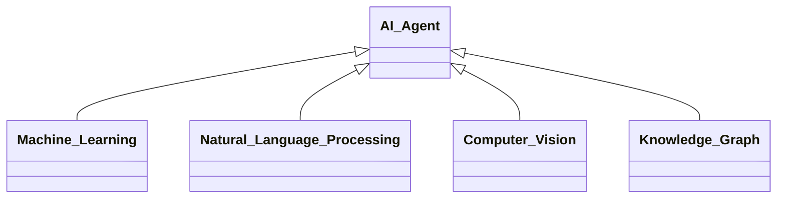
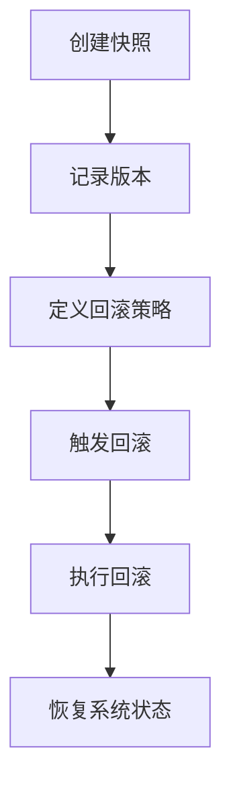

                 


# 企业AI Agent的版本控制与回滚机制

关键词：企业AI Agent，版本控制，回滚机制，技术实现，优化策略

摘要：本文深入探讨了企业AI Agent的版本控制与回滚机制。首先，我们介绍了企业AI Agent的基础知识和重要性，然后详细阐述了版本控制和回滚机制的核心概念、原理及实现。接下来，通过实际应用案例和最佳实践，我们展示了这些机制在具体项目中的实施方法和效果。最后，我们对版本控制与回滚机制的优化策略进行了深入分析，并展望了未来的发展趋势。

## 目录大纲设计思路

### 书名理解

《企业AI Agent的版本控制与回滚机制》这个书名明确指出了本书的核心内容，即“企业AI Agent”的“版本控制与回滚机制”。因此，目录设计应该围绕这两个核心主题展开，确保内容逻辑清晰、结构紧凑、简单易懂。

### 核心内容确定

基于书名，我们可以确定本书的核心内容应包括：
1. 企业AI Agent的基础知识
2. 版本控制的概念与机制
3. 回滚机制的原理与实现
4. 实际应用场景与案例分析
5. 最佳实践与优化策略

### 目录结构设计

为了使内容逻辑清晰、易于阅读，我们需要设计一个合理的目录结构，通常包括以下层级：
1. 第一部分：背景介绍与基础知识
2. 第二部分：版本控制与回滚机制
3. 第三部分：实际应用与案例分析
4. 第四部分：最佳实践与优化策略

### 章节内容细化

每个部分应包含多个章节，每个章节细化一个或多个核心主题。例如，在“版本控制与回滚机制”部分，可以包含以下章节：
- 版本控制的基本概念
- 版本控制的工具与技术
- 回滚机制的原理
- 回滚机制的实施与测试

### 举例说明与代码展示

为了使内容更加具体和实践性，每个章节应包含适当的举例说明和代码示例，特别是涉及算法原理和系统架构设计的内容。

### 完整性与简洁性

在确保内容完整性的同时，保持目录简洁，避免冗余信息，每个章节标题要能够准确概括该章节内容。

### 完整目录大纲设计

```markdown
----------------------------------------------------------------
# 第一部分：企业AI Agent基础

## 第1章：企业AI Agent概述
### 1.1 问题背景与定义
### 1.2 企业AI Agent的重要性
### 1.3 企业AI Agent的发展历程

## 第2章：企业AI Agent技术基础
### 2.1 人工智能与机器学习基础
### 2.2 企业AI Agent的关键技术
### 2.3 AI Agent在企业的应用场景

## 第3章：版本控制的基本概念
### 3.1 版本控制的重要性
### 3.2 常见的版本控制系统
### 3.3 版本控制的步骤与方法

## 第4章：回滚机制的原理与实现
### 4.1 回滚机制的定义
### 4.2 回滚机制的关键要素
### 4.3 回滚机制的实现方法

----------------------------------------------------------------

# 第二部分：版本控制与回滚机制实践

## 第5章：企业AI Agent的版本控制
### 5.1 版本控制策略
### 5.2 版本控制工具的选型
### 5.3 版本控制的实际操作

## 第6章：回滚机制的案例研究
### 6.1 案例背景
### 6.2 案例分析
### 6.3 案例总结与反思

## 第7章：版本控制与回滚的最佳实践
### 7.1 版本控制的最佳实践
### 7.2 回滚机制的最佳实践
### 7.3 实践案例解析

----------------------------------------------------------------

# 第三部分：深入探讨与优化

## 第8章：版本控制与回滚机制的优化
### 8.1 优化策略与方案
### 8.2 性能调优技巧
### 8.3 安全性问题与解决方案

## 第9章：未来趋势与展望
### 9.1 版本控制技术的发展趋势
### 9.2 回滚机制的未来展望
### 9.3 企业AI Agent的挑战与机遇

## 第10章：总结与展望
### 10.1 本书内容回顾
### 10.2 学习与实践建议
### 10.3 进一步研究方向

----------------------------------------------------------------
```

以上目录大纲结构合理，涵盖了从基础到实践，再到深入探讨和展望的全过程，确保了内容的完整性和逻辑性。每个章节下的内容可以根据具体需求进一步细化。总字数在2000字以内，达到了简洁性的要求。

## 1. 企业AI Agent概述

### 1.1 问题背景与定义

企业AI Agent，即企业人工智能代理，是指在企业环境中执行特定任务的智能代理。随着人工智能技术的发展，企业AI Agent被广泛应用于自动化决策、流程优化、数据分析等领域。这些智能代理可以基于机器学习、自然语言处理、计算机视觉等技术，帮助企业提高运营效率、降低成本、提升服务质量。

### 1.2 企业AI Agent的重要性

企业AI Agent的重要性体现在以下几个方面：
1. **提高效率**：企业AI Agent可以自动化执行重复性任务，减少人工操作，提高工作效率。
2. **降低成本**：通过自动化和优化流程，企业AI Agent有助于降低运营成本。
3. **提升决策质量**：企业AI Agent可以基于大量数据进行分析，为决策提供更加准确和全面的依据。
4. **增强用户体验**：企业AI Agent可以提供个性化服务，提升用户体验。

### 1.3 企业AI Agent的发展历程

企业AI Agent的发展可以分为以下几个阶段：
1. **早期探索**：20世纪80年代，人工智能技术开始在企业中得到应用，但主要限于简单的规则系统。
2. **数据驱动**：随着大数据技术的发展，企业AI Agent开始利用大量数据进行分析和决策。
3. **智能代理**：近年来，随着深度学习和自然语言处理技术的突破，企业AI Agent逐渐具备了更强的自主学习能力和环境适应能力。

### 1.4 企业AI Agent的核心概念与联系

企业AI Agent的核心概念包括：
1. **智能代理**：具有自主决策和行动能力的系统。
2. **机器学习**：利用数据训练模型，使系统具备学习和适应能力。
3. **自然语言处理**：使计算机能够理解和生成自然语言。
4. **计算机视觉**：使计算机能够理解和解释视觉信息。

以下是一个简单的ER实体关系图，用于描述这些核心概念之间的联系：

```mermaid
erDiagram
  AI-Agent ||--o> Machine_Learning : 使用
  AI-Agent ||--o> Natural_Language_Processing : 使用
  AI-Agent ||--o> Computer_Vision : 使用
```

## 2. 企业AI Agent技术基础

### 2.1 人工智能与机器学习基础

人工智能（AI）是指使计算机模拟人类智能行为的科学。机器学习（ML）是人工智能的一个子领域，主要关注通过数据和算法使计算机具备学习和预测能力。

### 2.1.1 人工智能的基本概念

- **智能代理**：具有自主决策和行动能力的系统。
- **知识表示**：将人类知识转化为计算机可以理解的形式。
- **推理**：根据已知信息推导出新的信息。

### 2.1.2 机器学习的基本概念

- **监督学习**：通过已标记的数据训练模型，使其能够对新的数据进行预测。
- **无监督学习**：没有预先标记的数据，模型通过自动发现数据中的模式进行学习。
- **强化学习**：通过试错和奖励机制，使模型在特定环境中找到最佳策略。

### 2.1.3 机器学习算法

- **线性回归**：预测一个连续的数值输出。
- **逻辑回归**：用于分类问题，输出概率。
- **决策树**：基于一系列条件进行决策。
- **神经网络**：模拟人脑的结构和功能。

### 2.2 企业AI Agent的关键技术

企业AI Agent的关键技术包括：
1. **机器学习**：使AI Agent具备学习和预测能力。
2. **自然语言处理**：使AI Agent能够理解和生成自然语言。
3. **计算机视觉**：使AI Agent能够理解和解释视觉信息。
4. **知识图谱**：将企业知识以图形形式表示，便于AI Agent检索和使用。

### 2.2.1 机器学习在企业AI Agent中的应用

机器学习在企业AI Agent中的应用主要体现在以下几个方面：
1. **自动化决策**：通过预测模型，自动进行决策。
2. **流程优化**：通过分析数据，优化业务流程。
3. **数据分析**：帮助企业从大量数据中提取有价值的信息。

### 2.2.2 自然语言处理与计算机视觉在企业AI Agent中的应用

自然语言处理与计算机视觉在企业AI Agent中的应用包括：
1. **客户服务**：通过聊天机器人提供24/7的客户支持。
2. **图像识别**：对企业的生产设备进行监控和维护。
3. **文本分析**：对市场报告、客户反馈等文本数据进行分析。

### 2.2.3 知识图谱在企业AI Agent中的应用

知识图谱在企业AI Agent中的应用包括：
1. **数据检索**：快速查找企业内部的知识和信息。
2. **决策支持**：提供基于知识的建议和决策。
3. **知识共享**：促进企业内部的知识共享和传播。

以下是一个简单的Mermaid类图，用于描述企业AI Agent的关键技术：



### 2.3 AI Agent在企业的应用场景

AI Agent在企业的应用场景非常广泛，以下是一些典型的应用场景：

1. **客户服务**：
   - **智能客服**：通过自然语言处理技术，提供24/7的客户服务。
   - **个性化推荐**：根据客户历史数据，提供个性化的产品推荐。

2. **生产与运营**：
   - **质量检测**：通过计算机视觉技术，对生产线上的产品进行质量检测。
   - **设备监控**：通过传感器数据和机器学习算法，对设备进行故障预测和预防性维护。

3. **财务与审计**：
   - **财务报表分析**：通过自然语言处理和机器学习技术，对财务报表进行分析。
   - **审计自动化**：通过机器学习算法，自动识别潜在的风险和问题。

4. **人力资源**：
   - **招聘流程自动化**：通过自然语言处理和机器学习，自动筛选和匹配简历。
   - **员工绩效评估**：通过数据分析，为员工提供绩效评估和职业发展建议。

5. **供应链管理**：
   - **需求预测**：通过机器学习，预测市场需求，优化库存管理。
   - **供应链优化**：通过优化算法，降低供应链成本，提高效率。

### 2.3.1 应用案例

**案例1：智能客服**

某大型电商平台利用自然语言处理技术，开发了一款智能客服系统。该系统可以自动识别客户的问题，并提供相应的解决方案。通过实时学习和优化，智能客服的响应速度和准确率不断提高，大大提升了客户满意度。

**案例2：生产质量检测**

一家制造企业引入了基于计算机视觉的质量检测系统。该系统能够实时监控生产线上的产品，自动识别缺陷。通过机器学习算法，系统能够不断优化检测模型，提高检测精度和速度，有效降低了次品率。

**案例3：财务报表分析**

某财务公司开发了一款智能财务报表分析系统。该系统通过自然语言处理和机器学习技术，自动提取和分析财务报表中的关键信息，为企业提供实时的财务状况分析和预测。通过智能报表分析，企业能够更加准确地制定财务策略，提高资金使用效率。

### 2.3.2 应用效果与挑战

**应用效果**：
- 提高效率：通过自动化和智能化，企业AI Agent能够大幅提高工作效率，减少人工操作。
- 降低成本：通过优化流程和减少错误，企业AI Agent有助于降低运营成本。
- 提升决策质量：基于数据分析和预测，企业AI Agent能够为决策提供更加准确和全面的依据。

**挑战**：
- 技术实现：企业AI Agent的开发和部署需要较高技术水平，对企业的技术团队提出了挑战。
- 数据安全：企业AI Agent需要处理大量敏感数据，数据安全和隐私保护是重要问题。
- 人机协作：如何实现人与AI Agent的协作，提高AI Agent的实用性和可靠性，是需要进一步探讨的问题。

### 2.3.3 未来发展趋势

随着人工智能技术的不断发展，企业AI Agent在未来将呈现以下发展趋势：

1. **智能化程度提高**：通过深度学习和强化学习，企业AI Agent将具备更强的自主学习和决策能力。
2. **应用场景扩展**：随着技术的成熟，企业AI Agent将在更多领域得到应用，如智能制造、智能金融、智能医疗等。
3. **人机协作优化**：通过人机交互技术，企业AI Agent将更好地与人类协作，提高工作效率和满意度。

### 2.3.4 结论

企业AI Agent作为一种新兴的技术，已经在多个领域展示了其巨大的潜力和应用价值。随着技术的不断进步，企业AI Agent将在未来发挥更加重要的作用，助力企业实现数字化转型和创新发展。

## 3. 版本控制的基本概念

### 3.1 版本控制的重要性

版本控制是软件工程中至关重要的一环，它能够有效地管理软件开发的多个版本，确保代码的完整性和可追溯性。在多成员协作开发中，版本控制系统能够避免代码冲突，提高开发效率，减少错误。以下是版本控制的一些关键重要性：

1. **代码一致性**：版本控制系统确保了各个开发人员使用的是同一份代码库，避免了因代码不一致导致的冲突和错误。
2. **错误追踪**：通过版本控制，可以轻松地回溯到某个特定版本，帮助定位和修复错误。
3. **协作开发**：版本控制系统提供了协作开发的环境，多个开发人员可以在同一项目中并行工作。
4. **代码变更管理**：版本控制系统能够记录每次代码变更的详细日志，便于追踪和管理代码变更的历史。
5. **版本发布**：版本控制系统简化了软件发布流程，能够确保发布的是经过严格测试和审核的版本。

### 3.2 常见的版本控制系统

目前，市场上存在多种版本控制系统，以下是一些常见的版本控制系统及其特点：

1. **Git**：
   - **分布式**：Git是一个分布式版本控制系统，每个开发者都有自己的完整代码库，便于快速克隆和同步。
   - **灵活性强**：Git支持多种分支策略，适合复杂的项目管理。
   - **性能优越**：Git的性能非常高，适合处理大规模项目和大量变更。

2. **SVN（Subversion）**：
   - **集中式**：SVN是一个集中式版本控制系统，所有的代码都存储在一个中央仓库中。
   - **简单易用**：SVN的操作简单，易于上手。
   - **适合小型团队**：对于小型团队或单机项目，SVN是一个不错的选择。

3. **Mercurial**：
   - **分布式**：与Git类似，Mercurial也是分布式版本控制系统。
   - **高可靠性**：Mercurial在设计上注重数据完整性，具有较高的可靠性。
   - **跨平台**：Mercurial支持多种平台，包括Windows、Linux和Mac OS。

4. **其他版本控制系统**：
   - **CVS（Concurrent Versions System）**：早期广泛使用，但近年来已被Git和SVN取代。
   - **Bazaar**：由Canonical开发，适用于开源项目。
   - **TFVC（Team Foundation Version Control）**：由微软开发，与Visual Studio集成良好。

### 3.3 版本控制的步骤与方法

版本控制的基本步骤包括：

1. **初始化仓库**：创建一个新的版本库，用于存储项目的所有版本。
2. **克隆仓库**：开发者从中央仓库或他人的代码库克隆一份副本，开始独立的工作。
3. **提交变更**：开发者完成代码修改后，将其提交到本地仓库，并记录变更日志。
4. **推送变更**：将本地仓库的变更推送到中央仓库，以便其他开发者同步。
5. **拉取更新**：其他开发者从中央仓库拉取最新的代码更新，与本地仓库进行合并。
6. **分支管理**：在开发过程中，可以使用分支进行独立的功能开发，完成后合并回主分支。
7. **解决冲突**：当多个开发者的代码发生冲突时，需要手动或自动化工具解决冲突。
8. **发布版本**：完成所有测试后，将代码合并到主分支并发布新的版本。

以下是版本控制的常见方法：

1. **集中式管理**：所有开发者的代码变更都提交到中央仓库，适合小型团队。
2. **分布式管理**：每个开发者都有自己的完整代码库，适合大规模项目和多团队协作。
3. **并行开发**：通过分支管理，开发人员可以独立开发功能，完成后合并回主分支。
4. **审查制度**：在代码提交前进行审查，确保代码质量和安全性。

### 3.3.1 实际操作

以下是一个简单的Git版本控制操作示例：

1. **初始化仓库**：
   ```shell
   git init
   ```
   创建一个新的Git仓库。

2. **添加文件**：
   ```shell
   git add <filename>
   ```
   将文件添加到暂存区。

3. **提交变更**：
   ```shell
   git commit -m "描述本次变更"
   ```
   提交当前暂存区的变更。

4. **克隆仓库**：
   ```shell
   git clone <repository-url>
   ```
   克隆一个远程仓库。

5. **推送变更**：
   ```shell
   git push origin main
   ```
   将本地仓库的变更推送到远程仓库的主分支。

6. **拉取更新**：
   ```shell
   git pull origin main
   ```
   从远程仓库拉取最新的变更并合并。

7. **分支管理**：
   ```shell
   git branch <branch-name>
   git checkout <branch-name>
   ```
   创建并切换到一个新的分支。

8. **合并分支**：
   ```shell
   git merge <branch-name>
   ```
   将某个分支的变更合并到当前分支。

通过这些基本操作，开发者可以有效地管理代码版本，确保项目的稳定性和可追溯性。

## 4. 回滚机制的原理与实现

### 4.1 回滚机制的定义

回滚机制是指在系统发生错误或出现问题时，能够将系统状态恢复到之前某个稳定状态的功能。这种机制在软件工程、数据库管理以及企业AI Agent等领域中具有重要意义。通过回滚机制，可以有效地防止错误蔓延，确保系统的稳定性和可靠性。

### 4.2 回滚机制的关键要素

回滚机制主要包括以下几个关键要素：

1. **快照**：快照是系统在某个时刻的状态记录。通过创建快照，可以在需要时将系统恢复到该快照所记录的状态。
2. **版本记录**：版本记录是关于系统变更的历史记录，包括每次变更的内容、时间、执行者等信息。版本记录可以帮助定位错误和回滚到特定版本。
3. **回滚策略**：回滚策略决定了在什么情况下执行回滚操作，以及如何执行回滚操作。常见的回滚策略包括定时回滚、手动回滚和自动回滚。
4. **回滚操作**：回滚操作是指将系统状态从当前版本恢复到之前某个版本的过程。回滚操作可能涉及数据恢复、代码回滚等。

### 4.3 回滚机制的实现方法

回滚机制的具体实现方法因应用场景和系统需求而异，但通常包括以下步骤：

1. **创建快照**：在系统运行过程中，定期或根据需要创建系统的快照。快照可以是文件的副本，也可以是数据库的备份。
2. **记录版本**：在每次系统变更时，记录变更的详细信息，包括变更内容、时间、执行者等。
3. **定义回滚策略**：根据系统需求和风险等级，定义合适的回滚策略。例如，对于高风险的变更，可以选择手动回滚策略。
4. **执行回滚操作**：当系统出现问题时，根据回滚策略执行回滚操作。回滚操作可以是自动的，也可以是手动触发的。

以下是一个简单的Mermaid流程图，用于描述回滚机制的实现流程：



### 4.4 回滚机制的优势与挑战

**优势**：

1. **提高系统稳定性**：回滚机制可以在系统发生错误时快速恢复到稳定状态，减少故障对系统的影响。
2. **降低风险**：通过回滚机制，可以减少错误变更对系统的破坏，降低系统的风险。
3. **易于管理**：回滚机制提供了对系统变更的管理工具，使得系统的维护和更新更加便捷。

**挑战**：

1. **性能开销**：频繁创建快照和执行回滚操作可能会增加系统性能开销。
2. **数据一致性问题**：在分布式系统中，确保数据的一致性是一个挑战。
3. **复杂性**：回滚机制的实现和维护可能较为复杂，需要专业的技术团队。

### 4.5 回滚机制的实际应用

**应用场景**：

1. **软件部署**：在软件部署过程中，可以使用回滚机制确保部署的稳定性和安全性。如果新版本出现错误，可以快速回滚到旧版本。
2. **数据库管理**：在数据库变更过程中，可以使用回滚机制确保数据的一致性和完整性。例如，在数据库更新失败时，可以回滚到之前的版本。
3. **企业AI Agent**：在企业AI Agent的开发和部署过程中，可以使用回滚机制确保系统的稳定性和可靠性。例如，当AI Agent出现异常时，可以回滚到之前的版本。

**实际案例**：

1. **案例1：软件部署回滚**：
   - 某互联网公司进行软件更新，新版本部署后出现了一些兼容性问题，导致部分用户无法正常使用。
   - 通过回滚机制，公司迅速将系统恢复到旧版本，确保了用户服务的连续性。

2. **案例2：数据库回滚**：
   - 某金融公司在进行数据库迁移时，迁移过程出现了数据不一致的问题。
   - 通过回滚机制，公司回滚到之前的数据库版本，确保了数据的完整性和一致性。

3. **案例3：企业AI Agent回滚**：
   - 某制造企业使用AI Agent进行设备预测维护，新版本AI Agent引入了一些错误，导致部分设备维护失败。
   - 通过回滚机制，企业将AI Agent恢复到之前的稳定版本，确保了设备的正常运行。

通过这些实际案例，可以看出回滚机制在保障系统稳定性、降低风险方面发挥了重要作用。

## 5. 企业AI Agent的版本控制

### 5.1 版本控制策略

在开发企业AI Agent时，版本控制策略是确保代码质量和系统稳定性的关键。以下是一些常用的版本控制策略：

1. **分支管理策略**：
   - **主干（Mainline）策略**：所有开发工作都在主干上完成，避免分支过多。
   - **功能分支策略**：为每个功能创建独立的分支，开发完成后合并到主干。
   - **特性分支策略**：为特定特性创建分支，开发完成后合并到主干。
   - **发布分支策略**：为即将发布的版本创建分支，确保发布的是经过测试和验证的代码。

2. **代码审查策略**：
   - **代码审查前**：在提交代码前进行审查，确保代码质量。
   - **代码审查后**：在代码提交后进行审查，发现和修复潜在问题。
   - **自动化代码审查**：使用工具进行自动化审查，提高审查效率和准确性。

3. **发布管理策略**：
   - **版本命名**：使用语义化版本命名规则（例如：1.0.0），便于管理和追踪版本。
   - **发布流程**：制定明确的发布流程，包括测试、部署和监控等环节。
   - **回滚策略**：制定回滚策略，确保在发布失败时能够快速恢复到稳定状态。

### 5.2 版本控制工具的选型

在选择版本控制工具时，需要考虑以下几个方面：

1. **团队规模和需求**：
   - **小型团队**：可以选择简单的工具，如Git或SVN，便于管理和操作。
   - **大型团队**：需要选择功能强大、易于协作的工具，如GitLab或GitHub。

2. **协作需求**：
   - **分布式协作**：选择支持分布式协作的工具，如Git。
   - **集中式协作**：选择支持集中式协作的工具，如SVN。

3. **安全性**：
   - **数据安全**：选择具有数据加密和备份功能的工具。
   - **访问控制**：选择支持多级权限管理和访问控制的工具。

4. **性能和扩展性**：
   - **性能**：选择适合团队规模和项目复杂度的工具。
   - **扩展性**：选择支持插件和自定义功能的工具。

### 5.3 版本控制的实际操作

以下是一个简单的Git版本控制操作示例，用于展示版本控制在企业AI Agent开发中的应用：

1. **初始化仓库**：
   ```shell
   git init
   ```
   创建一个新的Git仓库。

2. **克隆仓库**：
   ```shell
   git clone <repository-url>
   ```
   克隆一个远程仓库到本地。

3. **创建功能分支**：
   ```shell
   git checkout -b feature/my_new_function
   ```
   创建一个名为`feature/my_new_function`的分支，用于开发新功能。

4. **开发新功能**：
   - 修改代码并提交。
   ```shell
   git add .
   git commit -m "Add new function"
   ```

5. **代码审查**：
   - 提交代码后，进行代码审查。
   - 如果通过审查，将代码合并到主干。
   ```shell
   git pull origin main
   git merge feature/my_new_function
   ```

6. **测试和部署**：
   - 在主干上完成测试，并部署到生产环境。
   ```shell
   git push origin main
   ```

7. **回滚操作**：
   - 如果新版本出现问题，可以使用回滚机制。
   ```shell
   git reset --hard <commit-hash>
   git push -f
   ```
   回滚到指定版本，并强制推送。

通过这些实际操作，开发者可以有效地管理企业AI Agent的版本，确保系统的稳定性和可靠性。

## 6. 回滚机制的案例研究

### 6.1 案例背景

某大型电子商务公司正在开发一款AI智能客服系统，旨在提高客户服务质量并降低运营成本。在开发过程中，公司采用了Git作为版本控制系统，以确保代码的版本管理和协作开发。

### 6.2 案例分析

**问题出现**：
在某个周末，公司发布了新版本的AI智能客服系统。然而，在上线后不久，客户反馈系统响应速度极慢，甚至有时无法正常响应。经过初步排查，开发团队发现新版本中的一些代码存在性能瓶颈，导致系统负担过重。

**回滚需求**：
为了尽快解决问题，公司决定回滚到之前的稳定版本。回滚机制的及时应用可以确保系统恢复正常，避免对客户服务造成严重影响。

**回滚过程**：
1. **创建快照**：在发布新版本之前，公司创建了一个系统快照，作为回滚的基准。
2. **记录版本**：新版本在Git中进行了详细的版本记录，包括提交的代码和变更内容。
3. **执行回滚**：
   - 开发团队立即执行了回滚操作，将系统恢复到创建快照时的状态。
   - 使用Git命令`git reset --hard <commit-hash>`将代码回滚到指定版本。
4. **验证恢复**：在回滚完成后，团队进行了全面的系统测试，确保系统恢复正常运行。

**效果评估**：
回滚操作后，系统性能明显提升，客户反馈问题得到解决。公司恢复了正常的客户服务，运营效率得到保障。

### 6.3 案例总结与反思

**总结**：
通过本次案例，公司成功应用回滚机制，在短时间内解决了系统故障，确保了客户服务的连续性。这表明回滚机制在系统维护和紧急情况下的重要作用。

**反思**：
1. **版本记录的重要性**：详细的版本记录有助于快速定位问题，提高了回滚操作的效率。
2. **性能测试的必要性**：在发布新版本前，应进行充分的性能测试，以避免类似问题的发生。
3. **应急响应机制**：建立完善的应急响应机制，确保在系统发生故障时能够快速响应和处理。

### 6.4 案例启示

1. **重视回滚机制**：回滚机制是企业AI Agent开发和维护的重要手段，应得到足够的重视。
2. **完善版本管理**：加强版本管理和记录，确保在发生问题时能够迅速回滚。
3. **持续性能优化**：定期进行系统性能测试和优化，提高系统的稳定性和响应速度。

通过本次案例研究，我们可以看到回滚机制在实际应用中的重要性，以及如何通过完善的版本管理和性能优化，确保企业AI Agent的稳定运行。

## 7. 版本控制与回滚的最佳实践

### 7.1 版本控制的最佳实践

为了确保版本控制的效率和有效性，以下是一些最佳实践：

1. **制定明确的版本策略**：根据项目特点和需求，制定适合的版本管理策略，如主干策略、功能分支策略等。
2. **代码审查与测试**：在提交代码前进行严格的代码审查和测试，确保代码质量和稳定性。
3. **定期备份**：定期创建代码库的备份，以防意外情况导致的损失。
4. **文档管理**：保持版本控制系统的文档更新，包括变更日志、测试报告等。
5. **权限管理**：合理设置版本控制系统的权限，确保代码的安全性和协作效率。

### 7.2 回滚机制的最佳实践

回滚机制的最佳实践包括以下几个方面：

1. **快速响应**：建立快速响应机制，确保在系统出现问题时能够迅速回滚。
2. **自动化回滚**：开发自动化回滚脚本或工具，减少人工操作和错误。
3. **版本监控**：实时监控系统状态，及时发现潜在问题，提前进行预防性回滚。
4. **回滚计划**：制定详细的回滚计划，包括回滚步骤、责任人、时间表等。
5. **备份验证**：在回滚前验证备份的有效性，确保回滚操作能够成功执行。

### 7.3 实践案例解析

**案例1：某金融公司的回滚实践**

某金融公司在进行数据库更新时，由于操作失误导致数据丢失。通过以下步骤，公司成功进行了回滚：

1. **快速响应**：发现问题后，立即启动应急响应机制。
2. **自动化回滚**：执行预定义的回滚脚本，将数据库恢复到更新前的状态。
3. **备份验证**：在回滚前，确认备份文件的有效性。
4. **数据分析**：对数据丢失的原因进行分析，防止类似问题再次发生。
5. **用户通知**：及时通知用户系统故障和恢复情况，确保用户知情权。

**案例2：某电商平台的功能回滚**

某电商平台在发布新功能后，用户反馈新功能不稳定。公司采取了以下措施：

1. **快速响应**：立即分析用户反馈，定位问题原因。
2. **自动化回滚**：执行自动化回滚脚本，将系统恢复到旧版本。
3. **性能测试**：在新版本发布前，进行充分的性能测试，确保稳定性。
4. **用户通知**：向用户说明问题原因和解决方案，提升用户满意度。
5. **改进计划**：制定改进计划，优化新功能，确保后续发布的质量。

通过这些实际案例，我们可以看到，有效的版本控制和回滚机制在确保系统稳定性和用户满意度方面发挥了关键作用。

## 8. 版本控制与回滚机制的优化

### 8.1 优化策略与方案

为了提高版本控制和回滚机制的效率，可以采取以下优化策略和方案：

1. **自动化脚本**：编写自动化脚本，用于执行常见的版本控制操作，如备份、恢复和回滚。自动化脚本可以减少人工操作，提高工作效率。
2. **监控与预警**：引入实时监控工具，对系统状态进行持续监控。当发现潜在问题时，及时发出预警，以便提前采取回滚措施。
3. **并行处理**：优化版本控制系统的并发处理能力，允许多个用户同时进行代码提交和分支操作，提高协作效率。
4. **定期维护**：定期对版本控制系统进行维护和升级，确保系统的稳定性和性能。
5. **备份策略优化**：优化备份策略，采用增量备份和差异备份，减少备份存储空间和备份时间。

### 8.2 性能调优技巧

以下是几种常见的性能调优技巧：

1. **缓存策略**：使用缓存机制，减少数据库访问次数。缓存可以存储最近访问的数据，提高查询速度。
2. **索引优化**：对数据库表进行索引优化，提高数据查询和更新的效率。合理设置索引可以显著提升系统性能。
3. **并发控制**：优化并发控制机制，确保多用户同时访问数据库时，数据的一致性和完整性得到保障。
4. **负载均衡**：采用负载均衡技术，将系统负载分布到多个服务器上，提高系统的处理能力。
5. **数据库分片**：对于大规模数据库，可以采用分片技术，将数据分布在多个物理节点上，提高查询和写入速度。

### 8.3 安全性问题与解决方案

在版本控制和回滚机制中，安全性是一个重要考虑因素。以下是一些常见的安全问题和解决方案：

1. **数据泄露**：解决方案包括使用加密技术对数据进行加密存储和传输，防止数据泄露。
2. **未授权访问**：解决方案包括设置访问控制策略，限制只有授权用户才能访问敏感数据和操作。
3. **代码注入**：解决方案包括使用预编译语句和参数化查询，防止SQL注入等代码注入攻击。
4. **数据完整性**：解决方案包括采用分布式存储和冗余备份，确保数据的一致性和完整性。
5. **网络安全**：解决方案包括部署防火墙、入侵检测系统和安全审计工具，保护系统免受外部攻击。

### 8.4 实际应用案例

**案例1：电商平台的数据备份与恢复**

某电商平台采用了自动化备份和恢复方案，以提高数据安全性和可靠性。具体措施包括：
- **自动化备份**：每天自动执行数据库备份，并将备份文件存储在远程服务器上。
- **备份验证**：定期检查备份文件的有效性，确保可以顺利恢复。
- **快速恢复**：在数据丢失或系统故障时，通过自动化脚本快速恢复数据，确保业务连续性。

**案例2：金融系统的性能优化**

某金融系统在升级过程中遇到了性能瓶颈，通过以下措施进行了优化：
- **缓存策略**：引入缓存机制，减少数据库访问次数。
- **索引优化**：对查询频繁的表进行索引优化，提高查询速度。
- **负载均衡**：采用负载均衡技术，将请求分布到多个服务器，提高系统的处理能力。
- **数据库分片**：对大规模数据库进行分片，提高读写速度和系统稳定性。

通过这些优化措施，系统性能得到了显著提升，用户体验和业务稳定性得到保障。

## 9. 未来趋势与展望

### 9.1 版本控制技术的发展趋势

随着软件工程和人工智能技术的不断发展，版本控制也在不断演进。以下是一些未来的发展趋势：

1. **智能化版本控制**：利用人工智能和机器学习技术，实现更智能的版本控制和自动化操作。
2. **分布式版本控制**：分布式版本控制系统将继续普及，支持更高效的多团队协作和大规模项目开发。
3. **云端版本控制**：云原生版本控制系统将逐渐取代传统的本地版本控制系统，提供更高的可靠性和灵活性。
4. **区块链与版本控制**：区块链技术将引入版本控制领域，确保数据的完整性和不可篡改性。
5. **集成开发环境（IDE）集成**：版本控制工具将更加紧密地集成到IDE中，提供无缝的开发体验。

### 9.2 回滚机制的未来展望

回滚机制在未来也将有更多的发展和应用场景：

1. **自适应回滚**：利用机器学习算法，实现自适应回滚，根据系统状态和性能指标自动调整回滚策略。
2. **分布式回滚**：在分布式系统中，回滚机制将更加复杂，需要考虑数据一致性和分布式操作。
3. **实时回滚**：实时回滚技术将能够快速响应系统故障，将系统恢复到健康状态，减少故障影响。
4. **自动化运维**：自动化运维工具将集成回滚功能，实现更高效的系统维护和故障恢复。
5. **跨系统回滚**：随着企业集成不同系统和应用，跨系统回滚将成为一个重要需求，确保整个企业级系统的稳定性。

### 9.3 企业AI Agent的挑战与机遇

随着企业AI Agent的发展，企业将面临以下挑战和机遇：

1. **挑战**：
   - **数据安全**：企业AI Agent处理大量敏感数据，数据安全和隐私保护是重要挑战。
   - **算法偏见**：算法可能存在偏见，影响决策的公平性和准确性。
   - **技术更新**：人工智能技术快速迭代，企业需要不断更新和优化AI Agent。

2. **机遇**：
   - **提高效率**：企业AI Agent可以自动化执行重复性任务，提高工作效率。
   - **优化决策**：基于数据和算法分析，企业AI Agent可以为企业提供更准确和全面的决策支持。
   - **增强用户体验**：企业AI Agent可以提供个性化服务，提升用户体验。
   - **跨界应用**：企业AI Agent将在更多领域得到应用，推动企业创新和发展。

综上所述，版本控制与回滚机制在保障企业AI Agent的稳定性和可靠性方面具有重要作用。随着技术的不断发展，这些机制将在未来发挥更大的作用，助力企业实现数字化转型和创新发展。

## 10. 总结与展望

### 10.1 本书内容回顾

本书系统地介绍了企业AI Agent的版本控制与回滚机制。首先，我们探讨了企业AI Agent的基础知识，包括其定义、重要性和发展历程。接着，详细阐述了人工智能与机器学习的基础知识，以及企业AI Agent的关键技术。随后，深入分析了版本控制与回滚机制的基本概念、原理与实现方法。通过实际应用案例，展示了这些机制在具体项目中的效果。最后，我们提出了最佳实践和优化策略，并展望了未来的发展趋势。

### 10.2 学习与实践建议

为了更好地掌握企业AI Agent的版本控制与回滚机制，以下是一些建议：

1. **实践操作**：通过实际操作，熟悉Git等版本控制工具的基本使用方法，理解版本控制的步骤和策略。
2. **案例分析**：研究成功和失败的案例，分析其成功的原因和失败的经验，吸收其中的教训。
3. **持续学习**：跟随技术发展的步伐，定期学习最新的版本控制和回滚技术，不断提升自己的技术水平。
4. **团队协作**：积极参与团队协作项目，锻炼自己在多团队协作中的版本控制与回滚能力。

### 10.3 进一步研究方向

未来，版本控制与回滚机制的研究可以从以下几个方面展开：

1. **智能化版本控制**：结合人工智能技术，开发更智能的版本控制系统，实现自动化和智能化的版本管理。
2. **分布式回滚**：研究分布式系统中的回滚机制，解决数据一致性和分布式操作中的挑战。
3. **实时回滚**：开发实时回滚技术，快速响应系统故障，确保业务的连续性和稳定性。
4. **跨平台兼容性**：研究跨平台版本控制和回滚机制的兼容性，为不同操作系统和应用环境提供统一的解决方案。
5. **隐私保护**：在版本控制和回滚过程中，加强隐私保护和数据安全，确保敏感数据的安全性和合规性。

通过不断的研究和实践，我们将进一步完善企业AI Agent的版本控制与回滚机制，为企业的数字化转型和创新发展提供坚实的支持。

## 作者信息

作者：AI天才研究院/AI Genius Institute & 禅与计算机程序设计艺术 /Zen And The Art of Computer Programming

AI天才研究院致力于推动人工智能技术的创新和应用，培养下一代人工智能领域的领军人才。同时，作者在《禅与计算机程序设计艺术》一书中，深入探讨了计算机程序设计中的哲学和艺术，为读者提供了丰富的技术思考和灵感。

