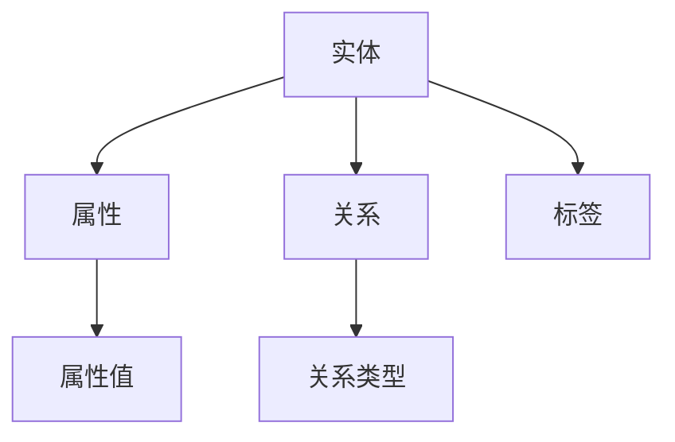
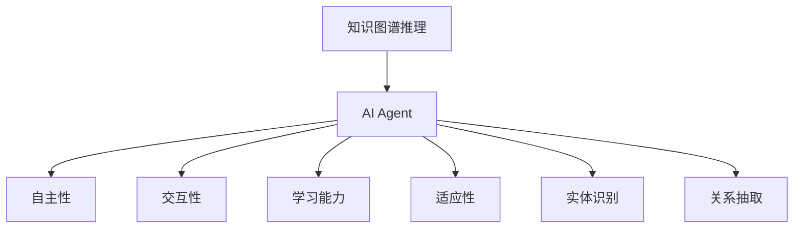
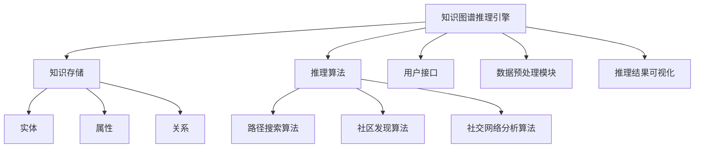
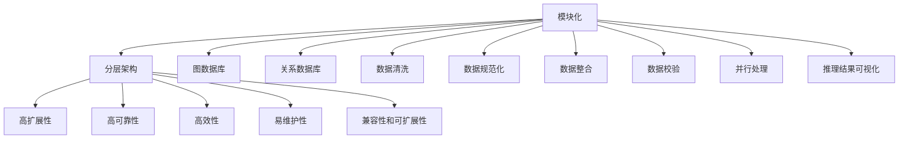
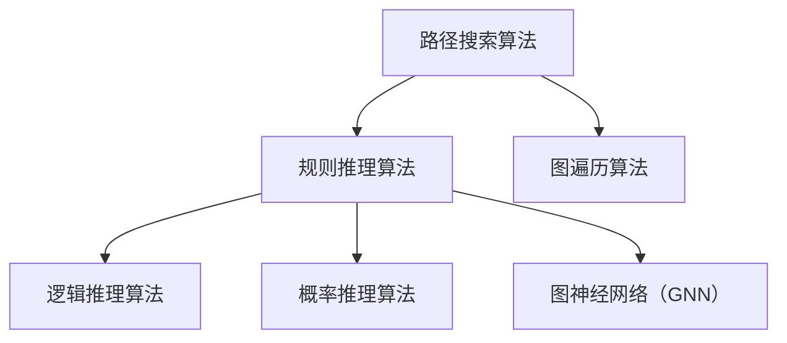

                 

### 第1章：知识图谱简介

#### 1.1 问题背景

知识图谱（Knowledge Graph）是近年来在人工智能（AI）和大数据领域备受关注的概念。它是一种结构化的知识表示方法，通过将实体、属性和关系构建为一个统一的知识框架，从而实现对复杂数据的语义理解和智能推理。

在传统的数据库和搜索引擎中，数据通常以表格或文档的形式存储，缺乏语义关联和上下文信息。这使得在处理复杂查询或进行知识推理时，往往需要依赖人工构建的规则或算法，效率较低且难以扩展。而知识图谱通过将实体和关系建模为图结构，使得数据之间的语义关联变得更加直观和易于处理。

知识图谱的发展可以追溯到2006年，Google首次提出使用“知识图谱”来增强其搜索引擎的功能。随后，Facebook、Baidu、Microsoft等公司也相继推出了自己的知识图谱产品。如今，知识图谱已广泛应用于搜索引擎、推荐系统、自然语言处理、智能问答等多个领域。

#### 1.2 知识图谱在AI中的应用

知识图谱在AI中的应用主要体现在以下几个方面：

1. **搜索引擎优化**：知识图谱通过将网页内容映射到实体和关系上，实现了对网页内容的语义理解和智能搜索。例如，当用户搜索“北京”时，搜索引擎不仅能返回包含“北京”一词的网页，还能返回与“北京”相关的实体（如景点、人物、事件）以及这些实体之间的关联。

2. **推荐系统**：知识图谱可以用于构建个性化推荐系统。通过分析用户的行为和兴趣，知识图谱能够发现用户与其他实体之间的关联，从而为用户推荐相关的商品、文章或服务。

3. **自然语言处理**：知识图谱可以帮助自然语言处理（NLP）系统更好地理解和处理文本。例如，在问答系统中，知识图谱可以提供实体和关系的语义信息，帮助系统理解用户的问题并给出准确的答案。

4. **智能问答**：知识图谱可以用于构建智能问答系统，通过语义理解和知识推理，实现对用户问题的准确理解和回答。例如，企业内部的智能问答系统可以帮助员工快速获取相关信息，提高工作效率。

5. **知识管理**：知识图谱可以帮助企业管理和利用其内部的知识资源，实现对知识的结构化组织和高效检索。例如，在企业内部构建知识图谱，可以方便员工快速查找和利用相关知识和经验。

#### 1.3 知识图谱的要素

知识图谱主要由三个要素构成：实体、属性和关系。

1. **实体**：实体是知识图谱中的基本元素，代表现实世界中的对象或概念。例如，人、地点、事物等都可以被视为实体。在知识图谱中，实体通常用节点表示。

2. **属性**：属性是实体的特征或属性，描述了实体的某个方面。例如，人的年龄、身高、职业等都可以被视为属性。在知识图谱中，属性通常用边表示。

3. **关系**：关系是实体之间的关联，描述了实体之间的语义关系。例如，人与地点之间的“居住地”关系、人与事物之间的“拥有”关系等。在知识图谱中，关系通常也用边表示。

实体、属性和关系共同构成了知识图谱的核心结构，使得数据之间的语义关联得以直观地展现。同时，知识图谱还可以通过图算法对实体和关系进行推理，从而发现新的知识和关联。

#### 1.4 知识表示的方法

知识图谱的知识表示方法主要包括以下几种：

1. **图论表示**：图论表示将知识图谱视为一个图结构，其中节点表示实体，边表示实体之间的关系。这种方法直观且易于理解，但难以表达实体的复杂属性和关系。

2. **属性图表示**：属性图表示在图论表示的基础上，为每个节点和边添加属性信息，从而更加全面地描述实体和关系。例如，可以为节点添加标签、属性值等，为边添加类型、权重等。

3. **语义网络表示**：语义网络表示基于OWL（Web本体语言）等本体语言，将知识图谱表示为一系列的语句和规则。这种方法能够更加准确地描述实体和关系的语义，但表示复杂度高。

4. **知识库表示**：知识库表示将知识图谱表示为一组规则和事实，通过规则推理和事实匹配来获取新的知识和关联。这种方法适用于大规模知识图谱的构建和应用。

#### 1.5 知识图谱的挑战

尽管知识图谱在AI领域具有巨大的潜力，但在实际应用中仍面临以下挑战：

1. **数据质量**：知识图谱的质量依赖于其数据来源和数据的准确性、完整性。如果数据存在错误或缺失，将严重影响知识图谱的准确性和可信度。

2. **数据一致性**：知识图谱中的实体、属性和关系需要保持一致，否则将导致数据冲突和错误。例如，同一实体的不同属性值之间需要保持一致性。

3. **可扩展性**：知识图谱需要能够适应不断增长的数据规模和复杂的业务需求，否则将导致系统性能下降和扩展困难。

4. **推理效率**：知识图谱的推理过程通常需要大量的计算资源，特别是在处理大规模知识图谱时。如何提高推理效率是当前研究的重点之一。

5. **安全性**：知识图谱中的敏感信息可能被恶意攻击者窃取或篡改，因此需要采取有效的安全措施来保护数据安全和隐私。

### 1.6 总结

知识图谱作为一种新型的知识表示方法，在AI领域具有广泛的应用前景。通过对实体、属性和关系的结构化表示，知识图谱实现了对数据的语义理解和智能推理。然而，知识图谱在实际应用中也面临诸多挑战，需要不断优化和改进。在接下来的章节中，我们将深入探讨知识图谱的推理引擎及其应用。

#### 1.7 关键术语解释

- **知识图谱（Knowledge Graph）**：一种结构化的知识表示方法，通过实体、属性和关系的图结构来表示现实世界中的知识和信息。
- **实体（Entity）**：知识图谱中的基本元素，代表现实世界中的对象或概念。
- **属性（Attribute）**：实体的特征或属性，描述了实体的某个方面。
- **关系（Relationship）**：实体之间的关联，描述了实体之间的语义关系。
- **语义理解（Semantic Understanding）**：通过对知识图谱中的实体、属性和关系进行分析和处理，实现对数据的语义理解。
- **知识推理（Knowledge Reasoning）**：通过图算法和逻辑推理来发现新的知识和关联。

### 1.8 概念关系图

以下是知识图谱中的核心概念及其关系的Mermaid关系图：



在这个图中，实体A与属性B、关系C关联，属性B包含属性值D，关系C描述了关系类型E，实体A还可以附加标签F。

#### 1.9 知识图谱的发展历史

知识图谱的概念最早可以追溯到1956年，当时约翰·麦克卡锡（John McCarthy）提出了“知识表示”的概念。然而，知识图谱作为现代意义上的概念，起源于2006年Google推出的知识图谱产品。Google知识图谱通过将网页内容映射到实体和关系上，实现了对网页内容的语义理解和智能搜索。

随后，Facebook、Baidu、Microsoft等公司也相继推出了自己的知识图谱产品。例如，Facebook的实体图谱通过分析用户的行为和社交关系，实现了对用户的精准推荐；Baidu的知心搜索通过知识图谱实现了语义搜索和智能问答；Microsoft的Bing搜索则利用知识图谱提升了搜索结果的准确性和相关性。

知识图谱的研究和应用正在不断拓展，其在自然语言处理、智能问答、推荐系统等领域的应用取得了显著的成果。未来，知识图谱将继续发挥其重要作用，推动人工智能技术的发展。

### 1.10 知识图谱的应用案例

以下是一些知识图谱在实际应用中的案例：

1. **搜索引擎优化**：Google、Baidu等搜索引擎利用知识图谱实现了语义搜索，提升了搜索结果的准确性和相关性。例如，当用户搜索“北京”时，搜索引擎不仅能返回包含“北京”一词的网页，还能返回与“北京”相关的实体（如景点、人物、事件）以及这些实体之间的关联。

2. **推荐系统**：知识图谱可以帮助推荐系统更好地理解和推荐相关内容。例如，Netflix通过知识图谱分析用户的行为和兴趣，实现了个性化的电影推荐；Amazon通过知识图谱分析用户的购物行为和偏好，实现了个性化的商品推荐。

3. **自然语言处理**：知识图谱可以帮助自然语言处理（NLP）系统更好地理解和处理文本。例如，在问答系统中，知识图谱可以提供实体和关系的语义信息，帮助系统理解用户的问题并给出准确的答案。

4. **智能问答**：知识图谱可以用于构建智能问答系统，通过语义理解和知识推理，实现对用户问题的准确理解和回答。例如，企业内部的智能问答系统可以帮助员工快速获取相关信息，提高工作效率。

5. **知识管理**：知识图谱可以帮助企业管理和利用其内部的知识资源，实现对知识的结构化组织和高效检索。例如，在企业内部构建知识图谱，可以方便员工快速查找和利用相关知识和经验。

通过这些案例可以看出，知识图谱在提升搜索引擎优化、推荐系统、自然语言处理、智能问答和知识管理等方面具有显著的优势，正在成为人工智能领域的重要工具。

### 1.11 总结

本章介绍了知识图谱的概念、要素、知识表示方法、挑战及其应用背景。知识图谱作为一种结构化的知识表示方法，通过实体、属性和关系的图结构来表示现实世界中的知识和信息。它不仅提高了数据的语义理解和智能推理能力，还在搜索引擎优化、推荐系统、自然语言处理、智能问答和知识管理等领域发挥了重要作用。然而，知识图谱在实际应用中也面临诸多挑战，需要不断优化和改进。在接下来的章节中，我们将深入探讨AI Agent及其在知识图谱推理中的应用。

---

### 第2章：AI Agent概述

#### 2.1 AI Agent的定义与分类

AI Agent，即人工智能代理，是一种能够自主执行任务、与环境进行交互并做出决策的计算机程序。与传统的规则驱动或数据驱动的系统不同，AI Agent具有自主学习和适应能力，能够根据环境变化和经验积累不断优化其行为。

AI Agent的定义可以概括为以下几点：

1. **自主性**：AI Agent能够独立执行任务，不需要人工干预。
2. **交互性**：AI Agent能够与环境进行实时交互，获取环境信息并做出相应决策。
3. **学习能力**：AI Agent能够从环境中学习，通过经验积累不断优化其行为。
4. **适应性**：AI Agent能够适应环境变化，根据环境反馈调整其行为策略。

根据不同的分类标准，AI Agent可以分为多种类型：

1. **基于规则的AI Agent**：这种类型的AI Agent通过预定义的规则来执行任务，适用于规则明确、变化较小的场景。例如，自动化的客服机器人。
2. **基于模型的AI Agent**：这种类型的AI Agent通过建立环境模型来预测和决策，适用于复杂、不确定的场景。例如，自动驾驶汽车。
3. **基于强化学习的AI Agent**：这种类型的AI Agent通过与环境交互来学习最优策略，适用于需要不断调整和优化的场景。例如，游戏AI。
4. **基于混合模型的AI Agent**：这种类型的AI Agent结合了规则、模型和强化学习的方法，能够更好地适应复杂多变的环境。

#### 2.2 智能代理的特点与功能

智能代理作为AI Agent的一种，具有以下主要特点：

1. **自动化**：智能代理能够自动执行任务，减少人工干预，提高工作效率。
2. **自主决策**：智能代理能够根据环境和任务需求自主做出决策，提高决策效率。
3. **学习与适应**：智能代理能够从环境中学习，并根据经验积累不断优化其行为策略。
4. **鲁棒性**：智能代理能够在面对不确定性和异常情况时保持稳定运行。
5. **实时交互**：智能代理能够与环境进行实时交互，获取实时信息并做出快速响应。

智能代理的主要功能包括：

1. **任务执行**：智能代理能够根据任务需求自动执行相应的操作，例如，自动化处理客户订单、安排会议日程等。
2. **决策支持**：智能代理能够分析环境信息，为用户做出决策提供支持，例如，推荐产品、制定投资策略等。
3. **实时监控**：智能代理能够实时监控环境变化，发现潜在问题和风险，并给出相应的预警和建议。
4. **自然交互**：智能代理能够理解用户的自然语言输入，并通过自然语言与用户进行交互，提供便捷的服务和帮助。

#### 2.3 AI Agent在知识图谱推理中的应用

知识图谱推理是AI Agent在知识图谱领域的重要应用之一。通过知识图谱推理，AI Agent能够从已知的事实和规则中推导出新的知识，实现对复杂问题的解决和决策。

AI Agent在知识图谱推理中的应用主要包括以下几个方面：

1. **实体识别**：AI Agent通过分析文本数据，识别出其中的实体，并将其映射到知识图谱中。例如，在搜索引擎中，AI Agent可以识别网页中的关键词和实体，构建知识图谱以实现语义搜索。
2. **关系抽取**：AI Agent通过分析文本数据，抽取实体之间的关系，并将其添加到知识图谱中。例如，在社交媒体分析中，AI Agent可以识别用户之间的关注关系，构建社交网络知识图谱。
3. **知识推理**：AI Agent通过知识图谱中的实体和关系，进行推理以发现新的知识。例如，在医疗诊断中，AI Agent可以利用知识图谱推理出患者的潜在疾病和治疗方案。
4. **智能问答**：AI Agent通过知识图谱推理，实现对用户问题的准确理解和回答。例如，在企业内部的知识库中，AI Agent可以理解用户的问题，并利用知识图谱推理出答案。
5. **推荐系统**：AI Agent通过知识图谱推理，为用户推荐相关的实体和内容。例如，在电商平台上，AI Agent可以根据用户的历史行为和知识图谱中的关系，推荐相关的商品和优惠活动。

通过AI Agent的知识图谱推理，可以实现对复杂数据的语义理解和智能决策，从而提升系统的智能化水平和用户体验。

### 2.4 关键术语解释

- **AI Agent（人工智能代理）**：一种能够自主执行任务、与环境进行交互并做出决策的计算机程序。
- **自主性**：AI Agent能够独立执行任务，不需要人工干预。
- **交互性**：AI Agent能够与环境进行实时交互，获取环境信息并做出相应决策。
- **学习能力**：AI Agent能够从环境中学习，通过经验积累不断优化其行为。
- **适应性**：AI Agent能够适应环境变化，根据环境反馈调整其行为策略。
- **知识图谱推理**：通过图算法和逻辑推理，从已知的事实和规则中推导出新的知识。
- **实体识别**：识别文本数据中的实体，并将其映射到知识图谱中。
- **关系抽取**：抽取实体之间的关系，并将其添加到知识图谱中。

### 2.5 概念关系图

以下是AI Agent及其关键概念的关系Mermaid图：



在这个图中，AI Agent（A）与自主性（B）、交互性（C）、学习能力（D）、适应性（E）以及知识图谱推理（F）和实体识别（G）、关系抽取（H）之间有明确的关联。

### 2.6 智能代理的典型应用场景

智能代理在各个行业和领域中都有广泛的应用，以下是一些典型应用场景：

1. **客服机器人**：智能代理可以模拟人类客服，自动回答用户的问题，提供咨询和服务。例如，银行、电商、航空等行业的客服机器人，通过自然语言处理和知识图谱推理，能够快速响应用户的需求，提高客户满意度。
2. **智能助手**：智能代理可以作为用户的个人助手，帮助用户管理日程、设置提醒、推荐活动等。例如，Apple的Siri、Amazon的Alexa等智能助手，通过语音交互和知识图谱推理，能够为用户提供便捷的服务和帮助。
3. **自动驾驶汽车**：智能代理可以用于自动驾驶汽车，通过感知环境、理解和推理交通规则，实现安全、高效的自动驾驶。例如，特斯拉的自动驾驶系统、Waymo的自动驾驶汽车等，都是基于智能代理技术。
4. **智能医疗**：智能代理可以用于智能医疗诊断和健康管理。通过分析患者的病历、检查报告等数据，智能代理可以辅助医生进行诊断和治疗。例如，IBM的Watson for Health就是一个基于智能代理技术的医疗诊断系统。
5. **供应链管理**：智能代理可以用于供应链管理，优化库存管理、物流运输等环节。通过分析供应链数据、预测需求变化，智能代理可以提供智能化的决策支持，提高供应链的效率和可靠性。
6. **智能推荐系统**：智能代理可以用于推荐系统，为用户推荐相关的商品、内容和活动。通过分析用户的行为和偏好，智能代理可以根据用户的兴趣和需求提供个性化的推荐。
7. **智能家居**：智能代理可以用于智能家居系统，实现家电设备的自动化控制和智能交互。例如，智能灯光、智能空调、智能安防等，通过智能代理技术，可以为用户提供舒适、安全、便捷的居住环境。

通过这些应用场景可以看出，智能代理作为一种重要的AI技术，正逐渐融入人们的日常生活和工作，为各个领域带来了显著的变革和提升。

### 2.7 总结

本章介绍了AI Agent的定义、分类、特点与功能，以及其在知识图谱推理中的应用。AI Agent作为一种具有自主性、交互性、学习能力和适应性的计算机程序，在各个领域都有广泛的应用。通过知识图谱推理，AI Agent能够从已知的事实和规则中推导出新的知识，实现对复杂问题的解决和决策。在下一章中，我们将深入探讨知识图谱推理引擎的架构设计与实现。

---

### 第3章：知识图谱推理引擎概述

#### 3.1 推理引擎的定义与作用

知识图谱推理引擎（Knowledge Graph Reasoning Engine，简称KGRE）是一种专门用于处理知识图谱中实体、属性和关系之间逻辑关系的软件系统。它通过图算法和逻辑推理，从已知的事实和规则中推导出新的知识，实现对复杂数据的语义理解和智能决策。

知识图谱推理引擎的定义可以概括为以下几点：

1. **实体推理**：通过对知识图谱中的实体进行分析和推理，发现实体之间的关联和隐含关系。
2. **属性推理**：通过对知识图谱中的属性进行分析和推理，发现属性之间的关联和隐含关系。
3. **关系推理**：通过对知识图谱中的关系进行分析和推理，发现关系之间的关联和隐含关系。
4. **规则推理**：通过预定义的规则，对知识图谱中的实体、属性和关系进行逻辑推理，发现新的知识。

知识图谱推理引擎的主要作用包括：

1. **数据清洗与整理**：通过对知识图谱中的数据进行清洗、整理和规范化，提高数据质量和一致性。
2. **知识发现与挖掘**：通过对知识图谱进行推理和分析，发现新的知识和关联，为决策提供支持。
3. **语义理解与解析**：通过对知识图谱中的实体、属性和关系进行推理，实现对数据的语义理解和智能解析。
4. **智能问答与推荐**：通过知识图谱推理，实现对用户问题的智能回答和相关内容的推荐。
5. **智能决策与优化**：通过对知识图谱进行推理和分析，为决策者提供智能化的决策支持和优化方案。

#### 3.2 推理引擎的基础知识

知识图谱推理引擎的基础知识主要包括以下几个方面：

1. **图论基础**：图论是知识图谱推理的理论基础，涉及图的基本概念、图的操作和图算法。图论知识有助于理解和设计知识图谱的存储结构和推理算法。
2. **逻辑推理**：逻辑推理是知识图谱推理的核心方法，包括命题逻辑、谓词逻辑和推理机等。逻辑推理方法能够帮助系统从已知的事实和规则中推导出新的结论。
3. **图算法**：图算法是知识图谱推理的重要工具，包括路径搜索算法、社区发现算法、社交网络分析算法等。这些算法能够帮助系统高效地处理大规模知识图谱。
4. **语义网和本体论**：语义网和本体论是知识图谱的理论基础，涉及语义表示、本体建模和语义查询等。语义网和本体论知识有助于构建和解析知识图谱中的语义关系。
5. **数据预处理**：数据预处理是知识图谱推理的重要步骤，包括数据清洗、数据规范化、数据整合等。数据预处理能够提高数据质量和一致性，为推理提供可靠的基础。

#### 3.3 知识图谱推理的挑战

尽管知识图谱推理在人工智能领域具有广泛的应用前景，但在实际应用中仍面临诸多挑战：

1. **数据质量**：知识图谱的质量依赖于其数据来源和数据的准确性、完整性。如果数据存在错误或缺失，将严重影响知识图谱的推理结果和可信度。
2. **数据一致性**：知识图谱中的实体、属性和关系需要保持一致，否则将导致数据冲突和错误。例如，同一实体的不同属性值之间需要保持一致性。
3. **推理效率**：知识图谱的推理过程通常需要大量的计算资源，特别是在处理大规模知识图谱时。如何提高推理效率是当前研究的重点之一。
4. **可扩展性**：知识图谱需要能够适应不断增长的数据规模和复杂的业务需求，否则将导致系统性能下降和扩展困难。
5. **推理准确性**：知识图谱推理的结果需要具有较高的准确性，否则将导致错误的推理结论和决策。
6. **安全性**：知识图谱中的敏感信息可能被恶意攻击者窃取或篡改，因此需要采取有效的安全措施来保护数据安全和隐私。

#### 3.4 推理引擎的架构设计原则

设计知识图谱推理引擎时，需要遵循以下架构设计原则：

1. **可扩展性**：推理引擎应能够适应不同规模的数据和处理需求，具备良好的扩展性。
2. **可靠性**：推理引擎应具有较高的可靠性，能够稳定地运行并处理大规模数据。
3. **高效性**：推理引擎应具有较高的计算效率，能够在较短的时间内完成推理任务。
4. **可维护性**：推理引擎应具备良好的可维护性，便于后续的维护和升级。
5. **兼容性**：推理引擎应支持多种数据格式和标准，能够与其他系统无缝集成。

#### 3.5 推理引擎的主要组件

知识图谱推理引擎通常包括以下主要组件：

1. **知识存储**：用于存储和管理知识图谱的实体、属性和关系。常见的知识存储系统包括图数据库（如Neo4j、JanusGraph）和关系数据库（如Oracle、MySQL）。
2. **推理算法**：用于对知识图谱进行推理和分析，发现新的知识和关联。常见的推理算法包括路径搜索算法、社区发现算法、社交网络分析算法等。
3. **用户接口**：用于提供推理引擎的访问接口，包括命令行接口、Web接口和API接口等。
4. **数据预处理模块**：用于对知识图谱进行数据清洗、数据规范化、数据整合等预处理操作，提高数据质量和一致性。
5. **推理结果可视化**：用于将推理结果以可视化形式呈现，帮助用户理解和分析推理结果。

通过以上组件的协同工作，知识图谱推理引擎能够高效地处理知识图谱，提供智能化的推理和决策支持。

### 3.6 关键术语解释

- **知识图谱推理引擎（Knowledge Graph Reasoning Engine，简称KGRE）**：一种专门用于处理知识图谱中实体、属性和关系之间逻辑关系的软件系统。
- **实体推理**：通过对知识图谱中的实体进行分析和推理，发现实体之间的关联和隐含关系。
- **属性推理**：通过对知识图谱中的属性进行分析和推理，发现属性之间的关联和隐含关系。
- **关系推理**：通过对知识图谱中的关系进行分析和推理，发现关系之间的关联和隐含关系。
- **图论基础**：图的基本概念、图的操作和图算法。
- **逻辑推理**：命题逻辑、谓词逻辑和推理机等逻辑推理方法。
- **图算法**：路径搜索算法、社区发现算法、社交网络分析算法等。
- **语义网和本体论**：语义表示、本体建模和语义查询等。

### 3.7 概念关系图

以下是知识图谱推理引擎中的核心概念及其关系的Mermaid图：



在这个图中，知识图谱推理引擎（A）与知识存储（B）、推理算法（C）、用户接口（D）、数据预处理模块（E）和推理结果可视化（F）以及实体（G）、属性（H）和关系（I）之间有明确的关联。

### 3.8 知识图谱推理引擎的架构设计

设计知识图谱推理引擎时，需要综合考虑系统的性能、可扩展性和可靠性等因素。以下是一个典型的知识图谱推理引擎的架构设计：

1. **数据层**：包括知识存储和数据预处理模块。知识存储使用图数据库或关系数据库，以高效地存储和管理知识图谱中的实体、属性和关系。数据预处理模块负责对知识图谱进行数据清洗、规范化、整合等预处理操作，提高数据质量和一致性。

2. **算法层**：包括推理算法和图算法。推理算法负责对知识图谱进行推理和分析，发现新的知识和关联。图算法用于实现路径搜索、社区发现和社交网络分析等功能，以提高推理效率。

3. **应用层**：包括用户接口和推理结果可视化模块。用户接口提供访问推理引擎的接口，支持命令行接口、Web接口和API接口等。推理结果可视化模块将推理结果以可视化形式呈现，帮助用户理解和分析推理结果。

4. **管理层**：包括系统监控、日志记录和安全管理等模块。系统监控模块负责监控推理引擎的运行状态和性能，日志记录模块记录系统运行日志，安全管理模块负责保护知识图谱中的敏感信息，防止数据泄露和恶意攻击。

通过以上组件的协同工作，知识图谱推理引擎能够高效地处理知识图谱，提供智能化的推理和决策支持。

### 3.9 总结

本章介绍了知识图谱推理引擎的定义、作用、基础知识、挑战和架构设计原则。知识图谱推理引擎是一种专门用于处理知识图谱中实体、属性和关系之间逻辑关系的软件系统，通过图算法和逻辑推理，从已知的事实和规则中推导出新的知识。尽管知识图谱推理引擎在人工智能领域具有广泛的应用前景，但实际应用中仍面临诸多挑战。设计知识图谱推理引擎时，需要遵循可扩展性、可靠性、高效性和可维护性等设计原则。在下一章中，我们将深入探讨知识图谱推理引擎的设计与实现细节。

---

### 第4章：知识图谱推理引擎的架构设计

#### 4.1 架构设计原则

知识图谱推理引擎（KGRE）的架构设计需要考虑多个方面，以确保系统具有高扩展性、高可靠性、高效性和良好的维护性。以下是架构设计的主要原则：

1. **模块化**：将系统划分为多个模块，每个模块负责特定的功能。这种设计方式有助于降低系统的复杂性，提高可维护性和可扩展性。

2. **分层架构**：采用分层架构，将系统划分为数据层、算法层、应用层和管理层。这种设计方式有助于分离关注点，提高系统的模块化和可扩展性。

3. **高扩展性**：设计时考虑系统的扩展性，支持动态增加或减少节点、边和算法。这样，当数据规模或需求发生变化时，系统可以灵活调整，而无需进行大规模的重构。

4. **高可靠性**：通过冗余设计、故障检测和恢复机制，确保系统在面临故障时能够稳定运行。例如，可以使用主从复制、数据备份和负载均衡等技术。

5. **高效性**：优化算法和数据结构，提高系统的处理速度和效率。例如，使用内存优化技术、并行计算和索引技术等。

6. **易维护性**：设计时考虑系统的可维护性，确保代码清晰、模块独立。这样可以降低维护成本，提高开发效率。

7. **兼容性和可扩展性**：支持多种数据格式和标准，如RDF、OWL、SPARQL等。同时，提供灵活的扩展接口，方便集成第三方库和组件。

#### 4.2 知识存储组件

知识存储组件是知识图谱推理引擎的核心部分，负责存储和管理知识图谱中的实体、属性和关系。以下是知识存储组件的主要设计考虑：

1. **数据模型**：采用图数据库或关系数据库作为知识存储的底层实现。图数据库（如Neo4j、JanusGraph）适合存储和查询大规模图结构数据，而关系数据库（如PostgreSQL、MySQL）则适合存储和查询关系数据。

2. **数据结构**：使用图结构来表示知识图谱，其中节点表示实体，边表示关系。节点和边可以附加属性，以描述实体和关系的详细信息。

3. **索引**：为提高查询效率，对关键属性和关系建立索引。例如，对实体名称、属性名称和关系类型等属性建立索引。

4. **数据备份和恢复**：实现数据备份和恢复机制，确保数据的安全性和可靠性。可以使用主从复制、数据镜像和增量备份等技术。

5. **扩展性**：支持动态扩展存储容量和处理能力。当数据规模增长时，可以轻松地增加节点、边和存储服务器。

6. **数据一致性**：确保知识图谱中的数据保持一致性。可以通过分布式事务、锁机制和一致性协议等技术来实现数据一致性。

#### 4.3 推理算法组件

推理算法组件负责对知识图谱进行推理，发现新的知识和关联。以下是推理算法组件的主要设计考虑：

1. **算法选择**：选择适合应用场景的推理算法。常见的推理算法包括路径搜索算法、社区发现算法、社交网络分析算法和逻辑推理算法等。

2. **算法优化**：优化算法的时间和空间复杂度，提高推理效率。例如，使用并行计算、内存优化和图算法优化等技术。

3. **算法组合**：将多种算法组合使用，以提高推理的准确性和鲁棒性。例如，结合逻辑推理和机器学习算法，实现更复杂的推理任务。

4. **算法可扩展性**：设计时考虑算法的可扩展性，支持动态增加或替换算法。这样可以方便地适应不同的应用场景和需求。

5. **算法接口**：提供统一的算法接口，方便调用和集成。可以使用API接口、消息队列和分布式计算框架等技术。

#### 4.4 用户接口组件

用户接口组件提供与知识图谱推理引擎的交互接口，方便用户进行查询、操作和监控。以下是用户接口组件的主要设计考虑：

1. **接口类型**：提供多种接口类型，包括命令行接口（CLI）、Web接口（Web UI）和API接口等。这样可以满足不同用户的需求和使用习惯。

2. **交互方式**：支持多种交互方式，包括文本输入、图形界面和语音交互等。这样可以提高用户体验和易用性。

3. **功能模块**：提供丰富的功能模块，包括数据导入导出、数据查询、推理查询、推理结果可视化等。这样可以方便用户进行各种操作和分析。

4. **权限管理**：实现权限管理功能，确保系统的安全性和隐私保护。例如，为不同用户角色分配不同的权限，限制对敏感数据的访问。

5. **多语言支持**：支持多种语言，包括中文、英文、法语等。这样可以满足不同国家和地区的用户需求。

#### 4.5 数据预处理模块

数据预处理模块负责对知识图谱进行预处理，以提高数据质量和一致性。以下是数据预处理模块的主要设计考虑：

1. **数据清洗**：清洗原始数据，去除噪声、冗余和错误信息。例如，去除重复实体、修复错误的属性值等。

2. **数据规范化**：对数据进行规范化处理，确保数据格式的一致性。例如，统一实体名称的格式、统一属性值的表示方法等。

3. **数据整合**：整合来自不同源的数据，构建统一的知识图谱。例如，将多个数据源中的实体、属性和关系进行合并和关联。

4. **数据校验**：对预处理后的数据进行校验，确保数据的一致性和完整性。例如，检查实体是否存在循环关系、属性值是否符合预期等。

5. **并行处理**：采用并行处理技术，提高数据预处理的速度和效率。例如，使用多线程、分布式计算和GPU加速等技术。

#### 4.6 推理结果可视化模块

推理结果可视化模块负责将推理结果以可视化形式呈现，帮助用户理解和分析。以下是推理结果可视化模块的主要设计考虑：

1. **可视化类型**：提供多种可视化类型，包括节点图、边图、关系图、热图等。这样可以直观地展示知识图谱的结构和推理结果。

2. **交互方式**：支持用户与可视化图表的交互，例如，点击节点或边进行详细查询、调整图表的显示参数等。

3. **动态更新**：支持动态更新可视化图表，实时展示推理过程和结果。例如，在推理过程中实时显示节点的状态和关系变化。

4. **多种格式**：支持导出可视化图表为多种格式，如PNG、PDF、SVG等。这样可以方便用户进行打印、分享和进一步分析。

5. **跨平台支持**：支持多种操作系统和浏览器，确保用户可以在不同设备和平台上使用推理结果可视化模块。

#### 4.7 安全管理模块

安全管理模块负责保护知识图谱中的敏感信息，防止数据泄露和恶意攻击。以下是安全管理模块的主要设计考虑：

1. **访问控制**：实现访问控制机制，根据用户角色和权限限制对数据的访问。例如，为不同用户角色分配不同的访问权限，限制对敏感数据的访问。

2. **数据加密**：对知识图谱中的敏感数据进行加密处理，确保数据在存储和传输过程中的安全性。例如，使用对称加密和非对称加密技术。

3. **日志记录**：记录系统运行日志，包括用户操作、数据访问和系统错误等。这样可以方便监控和审计系统行为。

4. **异常检测**：实现异常检测机制，及时发现和阻止恶意攻击。例如，使用入侵检测系统（IDS）和恶意行为分析工具。

5. **安全审计**：定期进行安全审计，检查系统的安全性漏洞和潜在风险。例如，进行渗透测试和安全评估。

通过遵循上述架构设计原则，知识图谱推理引擎可以高效、稳定地运行，满足不同应用场景的需求。

### 4.8 关键术语解释

- **模块化**：将系统划分为多个模块，每个模块负责特定的功能。
- **分层架构**：采用分层架构，将系统划分为数据层、算法层、应用层和管理层。
- **高扩展性**：系统应能够适应不同规模的数据和处理需求，具备良好的扩展性。
- **高可靠性**：系统在面临故障时能够稳定运行，确保数据的安全和系统的连续性。
- **高效性**：系统具有较高的计算效率，能够在较短的时间内完成推理任务。
- **易维护性**：代码清晰、模块独立，降低维护成本，提高开发效率。
- **兼容性和可扩展性**：支持多种数据格式和标准，提供灵活的扩展接口。
- **图数据库**：用于存储和查询大规模图结构数据的数据库系统。
- **关系数据库**：用于存储和查询关系数据的数据库系统。
- **数据清洗**：去除噪声、冗余和错误信息，提高数据质量。
- **数据规范化**：确保数据格式的一致性，统一实体名称的格式、属性值的表示方法等。
- **数据整合**：整合来自不同源的数据，构建统一的知识图谱。
- **数据校验**：检查实体是否存在循环关系、属性值是否符合预期等。
- **并行处理**：使用多线程、分布式计算和GPU加速等技术，提高数据处理速度。
- **推理结果可视化**：将推理结果以可视化形式呈现，帮助用户理解和分析。

### 4.9 概念关系图

以下是知识图谱推理引擎中的核心概念及其关系的Mermaid图：



在这个图中，模块化（A）与分层架构（B）、高扩展性（C）、高可靠性（D）、高效性（E）、易维护性（F）、兼容性和可扩展性（G）以及图数据库（H）、关系数据库（I）、数据清洗（J）、数据规范化（K）、数据整合（L）、数据校验（M）、并行处理（N）和推理结果可视化（O）之间有明确的关联。

### 4.10 总结

本章详细介绍了知识图谱推理引擎的架构设计原则、知识存储组件、推理算法组件、用户接口组件、数据预处理模块、推理结果可视化模块和安全管理模块。通过模块化、分层架构、高扩展性、高可靠性、高效性、易维护性和兼容性等设计原则，知识图谱推理引擎能够高效、稳定地运行，满足不同应用场景的需求。在下一章中，我们将深入探讨知识图谱推理引擎的具体设计和实现细节。

---

### 第5章：知识图谱推理算法

#### 5.1 算法概述

知识图谱推理算法是知识图谱推理引擎（KGRE）的核心组成部分，负责从已知的事实和规则中推导出新的知识。知识图谱推理算法可以分为基于逻辑的推理算法和基于统计的推理算法。本节将分别介绍这两种算法的基本概念、原理和应用场景。

#### 5.2 基本推理算法

基本推理算法主要包括路径搜索算法、规则推理算法和图遍历算法。

1. **路径搜索算法**：路径搜索算法用于在知识图谱中找到满足特定条件的实体和关系路径。常见的路径搜索算法有广度优先搜索（BFS）、深度优先搜索（DFS）和A*算法等。

    - **广度优先搜索（BFS）**：BFS是一种启发式搜索算法，从源节点开始，逐层扩展，直到找到目标节点或遍历整个图。BFS的优点是找到最短路径的效率较高，但可能需要较大的内存空间。
    - **深度优先搜索（DFS）**：DFS是一种非启发式搜索算法，从源节点开始，沿着一条路径深入搜索，直到路径不可行或达到最大深度。DFS的优点是搜索速度快，但可能找到的是次优路径。
    - **A*算法**：A*算法结合了BFS和DFS的优点，通过估算总代价（从源节点到目标节点的实际距离加上从目标节点到源节点的预估距离）来选择扩展节点。A*算法通常用于求解最短路径问题，具有较高的搜索效率和准确性。

2. **规则推理算法**：规则推理算法通过预定义的规则，对知识图谱中的实体、属性和关系进行逻辑推理。常见的规则推理算法有基于谓词逻辑的推理算法和基于产生式的推理算法。

    - **谓词逻辑推理算法**：谓词逻辑推理算法基于谓词逻辑，通过解析和推导逻辑表达式来发现新的知识。常见的谓词逻辑推理算法有自动推理（ATP）算法和推理机（Reasoner）等。
    - **产生式推理算法**：产生式推理算法基于产生式规则，通过匹配和执行规则来推导结论。常见的产生式推理算法有正向推理（Forward Chaining）和反向推理（Backward Chaining）等。

3. **图遍历算法**：图遍历算法用于遍历知识图谱中的所有节点和边，以发现潜在的关联和规律。常见的图遍历算法有深度优先遍历（DFS）和广度优先遍历（BFS）等。

    - **深度优先遍历（DFS）**：DFS是一种非启发式搜索算法，从源节点开始，沿着一条路径深入搜索，直到路径不可行或达到最大深度。DFS的优点是搜索速度快，但可能找到的是次优路径。
    - **广度优先遍历（BFS）**：BFS是一种启发式搜索算法，从源节点开始，逐层扩展，直到找到目标节点或遍历整个图。BFS的优点是找到最短路径的效率较高，但可能需要较大的内存空间。

#### 5.3 高级推理算法

高级推理算法在基本推理算法的基础上，引入了更多的约束和限制条件，以发现更复杂和更精确的知识。以下介绍几种常见的高级推理算法：

1. **逻辑推理算法**：逻辑推理算法是一种基于形式逻辑的推理方法，通过解析和推导逻辑表达式来发现新的知识。常见的逻辑推理算法有模型检查（Model Checking）、验证（Verification）和定理证明（Theorem Proving）等。

    - **模型检查**：模型检查是一种验证方法，通过将知识图谱表示为模型，检查模型是否满足给定的逻辑公式。常见的模型检查算法有SAT求解器（如Z3 Solver）、Bounded Model Checking（BMC）等。
    - **验证**：验证是一种检查系统或算法是否满足特定需求的检查方法。常见的验证算法有形式化验证、模型验证和程序验证等。
    - **定理证明**：定理证明是一种通过逻辑推导证明某个结论是否成立的方法。常见的定理证明算法有基于归结的证明算法、自动推理算法和证明规划器等。

2. **概率推理算法**：概率推理算法通过引入概率模型，对知识图谱中的实体、属性和关系进行概率推理。常见的概率推理算法有贝叶斯网络（Bayesian Network）、马尔可夫网络（Markov Network）和马尔可夫逻辑网（Markov Logic Network，MLN）等。

    - **贝叶斯网络**：贝叶斯网络是一种基于概率论的图模型，通过节点的条件概率分布描述实体和关系之间的概率关系。贝叶斯网络可以用于推理实体之间的概率关联，实现概率推理。
    - **马尔可夫网络**：马尔可夫网络是一种基于概率论的图模型，通过节点的转移概率描述实体和关系之间的动态变化。马尔可夫网络可以用于推理实体在时间序列中的演变过程。
    - **马尔可夫逻辑网（MLN）**：马尔可夫逻辑网是一种结合了逻辑和概率论的图模型，通过逻辑公式描述实体和关系之间的概率关系。MLN可以用于推理实体和关系的概率分布。

3. **图神经网络（Graph Neural Network，GNN）**：图神经网络是一种基于深度学习的推理算法，通过学习实体和关系之间的复杂关系，实现对知识图谱的语义理解和推理。常见的图神经网络算法有图卷积网络（GCN）、图注意力网络（GAT）和图变换器网络（GTN）等。

    - **图卷积网络（GCN）**：图卷积网络是一种基于卷积操作的图神经网络，通过聚合邻居节点的特征信息来更新节点表示。GCN可以用于节点分类、链接预测和图分类等任务。
    - **图注意力网络（GAT）**：图注意力网络是一种基于注意力机制的图神经网络，通过学习节点之间的权重关系来更新节点表示。GAT可以用于节点分类、链接预测和图分类等任务。
    - **图变换器网络（GTN）**：图变换器网络是一种基于循环神经网络的图神经网络，通过递归地更新节点表示来学习实体和关系之间的复杂关系。GTN可以用于节点分类、链接预测和图分类等任务。

#### 5.4 算法比较与选择

不同类型的推理算法具有不同的特点和应用场景，选择合适的算法需要综合考虑以下几个方面：

1. **数据规模和结构**：对于大规模知识图谱，选择具有高效性的算法（如GCN、GAT等）更为合适。对于结构较为复杂的知识图谱，选择具有较强推理能力的算法（如逻辑推理算法、概率推理算法等）更为合适。
2. **业务需求**：根据具体业务需求选择合适的算法。例如，在需要精确推理和验证的场景（如金融、医疗等），选择逻辑推理算法或概率推理算法更为合适。在需要高效推理和快速响应的场景（如搜索引擎、推荐系统等），选择基于深度学习的算法（如GCN、GAT等）更为合适。
3. **计算资源**：考虑计算资源限制，选择在现有硬件条件下能够高效运行的算法。例如，在资源有限的情况下，选择基于内存优化的算法（如BFS、DFS等）更为合适。
4. **易用性和扩展性**：选择易于集成和使用、具有良好扩展性的算法。例如，选择支持多种数据格式和标准的算法，可以方便地与其他系统和组件进行集成。

#### 5.5 实际案例

以下是一个实际案例，展示如何选择和实现合适的推理算法：

- **案例背景**：某电商企业希望通过知识图谱推理引擎实现对用户购买行为的分析和个性化推荐。知识图谱中包含了用户、商品、购物车和订单等实体，以及购买、收藏、评价等关系。
- **算法选择**：考虑到数据规模较大，且需要对用户购买行为进行精确分析，选择了图卷积网络（GCN）作为主要推理算法。GCN能够通过学习用户和商品之间的复杂关系，实现对用户购买行为的精确预测和个性化推荐。
- **实现过程**：首先，将知识图谱转换为GCN的图表示，包括节点表示（用户、商品等）和边表示（关系）。然后，使用图卷积层和全连接层构建GCN模型，并训练模型以学习用户和商品之间的复杂关系。最后，使用训练好的GCN模型对用户购买行为进行推理和预测，生成个性化推荐列表。

通过以上实际案例可以看出，选择合适的推理算法对于知识图谱推理引擎的应用至关重要。通过结合业务需求和数据特点，合理选择和实现推理算法，可以实现对知识图谱的精确推理和智能化应用。

### 5.6 关键术语解释

- **路径搜索算法**：在知识图谱中找到满足特定条件的实体和关系路径的算法。
- **规则推理算法**：通过预定义的规则，对知识图谱中的实体、属性和关系进行逻辑推理的算法。
- **图遍历算法**：用于遍历知识图谱中的所有节点和边的算法。
- **逻辑推理算法**：基于形式逻辑，通过解析和推导逻辑表达式来发现新的知识的算法。
- **概率推理算法**：通过引入概率模型，对知识图谱中的实体、属性和关系进行概率推理的算法。
- **图神经网络（GNN）**：基于深度学习的推理算法，通过学习实体和关系之间的复杂关系，实现对知识图谱的语义理解和推理。

### 5.7 概念关系图

以下是知识图谱推理算法中的核心概念及其关系的Mermaid图：



在这个图中，路径搜索算法（A）、规则推理算法（B）、图遍历算法（C）、逻辑推理算法（D）、概率推理算法（E）和图神经网络（GNN）（F）之间有明确的关联。

### 5.8 总结

本章介绍了知识图谱推理算法的基本概念、原理和应用。知识图谱推理算法可以分为基本推理算法和高级推理算法，包括路径搜索算法、规则推理算法、图遍历算法、逻辑推理算法、概率推理算法和图神经网络（GNN）等。通过选择合适的推理算法，可以实现对知识图谱的精确推理和智能化应用。在下一章中，我们将深入探讨知识图谱推理引擎的具体设计和实现过程。

---

### 第6章：知识图谱推理引擎的设计与实现

#### 6.1 实现流程

设计并实现一个知识图谱推理引擎是一个复杂的过程，需要经历多个阶段。以下是实现流程的详细步骤：

1. **需求分析**：首先，明确知识图谱推理引擎的应用场景和需求。这包括了解目标用户、业务需求、数据来源和数据结构等。需求分析的结果将指导后续的设计和实现工作。

2. **技术选型**：根据需求分析的结果，选择合适的技术栈。这包括编程语言、框架、库和工具等。常见的编程语言有Python、Java和C++等；框架包括TensorFlow、PyTorch和Keras等；库和工具包括NumPy、Pandas、SciPy和Scikit-learn等。

3. **系统设计**：基于需求分析和技术选型，设计知识图谱推理引擎的架构。这包括数据层、算法层、应用层和管理层的架构设计，以及各个模块的功能和接口设计。系统设计的结果将作为实现过程的蓝图。

4. **数据预处理**：收集和整理知识图谱数据，并进行预处理。这包括数据清洗、数据规范化、数据整合和数据校验等。数据预处理的结果将直接影响推理引擎的性能和准确性。

5. **算法实现**：根据系统设计，实现各个推理算法。这包括路径搜索算法、规则推理算法、图遍历算法、逻辑推理算法、概率推理算法和图神经网络（GNN）等。算法实现的结果将作为推理引擎的核心功能。

6. **集成测试**：将各个模块集成在一起，进行系统测试。这包括功能测试、性能测试、兼容性测试和安全测试等。集成测试的目的是确保系统在各种环境下能够正常运行，并满足需求。

7. **部署上线**：将知识图谱推理引擎部署到生产环境，并进行上线运营。这包括硬件配置、软件安装、系统监控和日志记录等。部署上线的结果将确保推理引擎在实际应用中能够稳定运行。

8. **维护升级**：根据用户反馈和业务需求，对知识图谱推理引擎进行维护和升级。这包括修复漏洞、优化性能、增加新功能和更新数据等。维护升级的目的是确保推理引擎的持续运行和功能完善。

#### 6.2 环境搭建

在实现知识图谱推理引擎之前，需要搭建合适的环境。以下是环境搭建的详细步骤：

1. **硬件配置**：根据需求分析的结果，确定所需的服务器硬件配置。这包括CPU、内存、硬盘和GPU等。如果需要使用GPU进行深度学习计算，需要确保服务器支持NVIDIA GPU。

2. **操作系统**：选择适合的操作系统，如Linux、Windows或macOS。Linux操作系统在服务器环境中应用广泛，具有较高的稳定性和安全性。

3. **开发工具**：安装和配置开发工具，如Python解释器、集成开发环境（IDE）和版本控制系统等。常见的Python解释器有CPython、PyPy等；IDE有PyCharm、VSCode等；版本控制系统有Git、SVN等。

4. **库和框架**：安装和配置所需的库和框架，如NumPy、Pandas、SciPy、Scikit-learn、TensorFlow、PyTorch等。可以使用pip等包管理器进行安装。

5. **数据库**：安装和配置知识图谱存储数据库，如Neo4j、JanusGraph、Oracle、MySQL等。这些数据库支持存储和管理知识图谱中的实体、属性和关系。

6. **其他工具**：安装和配置其他辅助工具，如Docker、Kubernetes、Jenkins等。这些工具可以帮助管理和部署推理引擎。

#### 6.3 知识图谱构建

知识图谱构建是知识图谱推理引擎设计实现的重要环节。以下是知识图谱构建的详细步骤：

1. **数据源收集**：收集所需的数据源，包括结构化数据（如关系数据库）和非结构化数据（如文本、图像、音频等）。这些数据源可以是内部数据，也可以是外部数据。

2. **数据清洗**：对收集到的数据进行清洗，去除噪声、冗余和错误信息。数据清洗的过程包括去重、填充缺失值、纠正错误值等。

3. **实体识别**：识别数据中的实体，并将其映射到知识图谱中。实体识别可以使用自然语言处理技术，如命名实体识别（NER）等。

4. **关系抽取**：抽取数据中的实体之间的关系，并将其添加到知识图谱中。关系抽取可以使用规则方法、机器学习方法或深度学习方法等。

5. **属性抽取**：抽取数据中的实体属性，并将其添加到知识图谱中。属性抽取可以使用结构化数据中的元数据，或使用自然语言处理技术分析非结构化数据。

6. **知识整合**：整合来自不同源的数据，构建统一的知识图谱。知识整合的过程包括实体映射、关系映射和属性映射等。

7. **知识存储**：将构建好的知识图谱存储到知识图谱存储数据库中，以便后续的推理和查询。

#### 6.4 算法实现

算法实现是知识图谱推理引擎设计实现的核心环节。以下是算法实现的详细步骤：

1. **算法选择**：根据应用场景和需求，选择合适的算法。如前所述，可以选择路径搜索算法、规则推理算法、图遍历算法、逻辑推理算法、概率推理算法和图神经网络（GNN）等。

2. **算法设计**：设计算法的具体实现方案，包括数据结构、算法流程和算法参数等。

3. **算法编码**：使用编程语言和框架实现算法，编写相应的代码。

4. **算法测试**：对实现的算法进行测试，验证其正确性和性能。可以使用测试数据集、模拟环境和实际应用场景进行测试。

5. **算法优化**：根据测试结果，对算法进行优化和改进，以提高性能和准确性。

6. **算法集成**：将实现的算法集成到知识图谱推理引擎中，与其他模块协同工作，提供完整的推理服务。

#### 6.5 代码应用解读与分析

以下是一个简单的Python代码示例，展示如何实现路径搜索算法：

```python
import networkx as nx

# 创建图
G = nx.Graph()

# 添加节点和边
G.add_nodes_from([1, 2, 3, 4, 5])
G.add_edges_from([(1, 2), (2, 3), (3, 4), (4, 5)])

# 广度优先搜索
bfs_path = nx.bfs_path(G, source=1, target=5)
print("广度优先搜索路径：", bfs_path)

# 深度优先搜索
dfs_path = nx.dfs_path(G, source=1, target=5)
print("深度优先搜索路径：", dfs_path)

# A*算法
a_star_path = nx.astar_path(G, source=1, target=5)
print("A*算法路径：", a_star_path)
```

这段代码首先使用NetworkX库创建了一个简单的图，然后添加节点和边。接下来，使用广度优先搜索（BFS）、深度优先搜索（DFS）和A*算法查找从节点1到节点5的路径，并输出结果。

通过解读和分析这段代码，我们可以了解路径搜索算法的基本实现原理和步骤。在实际应用中，可以根据需要调整算法的参数和策略，以优化搜索效率和路径质量。

### 6.6 实际案例分析

以下是一个实际案例，展示如何设计和实现一个知识图谱推理引擎，并分析其效果和改进方向：

- **案例背景**：某电商平台希望通过知识图谱推理引擎实现对用户购买行为的分析和个性化推荐。平台收集了用户信息、商品信息、订单信息和购物车信息等，构建了一个包含实体（用户、商品、订单、购物车）和关系（购买、收藏、评价）的知识图谱。

- **实现过程**：
  1. **需求分析**：确定推理引擎的应用场景和需求，包括用户购买行为分析、个性化推荐和用户关系网络分析等。
  2. **技术选型**：选择Python和Neo4j作为主要技术，使用Neo4j作为知识图谱存储数据库，使用Python实现算法和数据处理。
  3. **系统设计**：设计知识图谱推理引擎的架构，包括数据层（Neo4j数据库）、算法层（路径搜索算法、规则推理算法、图神经网络等）和应用层（用户接口、推理结果可视化等）。
  4. **数据预处理**：对收集到的数据进行清洗、实体识别和关系抽取，构建统一的知识图谱。
  5. **算法实现**：实现路径搜索算法、规则推理算法和图神经网络（GNN）等，以实现对用户购买行为的分析和个性化推荐。
  6. **集成测试**：对推理引擎进行集成测试，确保系统功能、性能和稳定性。
  7. **部署上线**：将推理引擎部署到生产环境，进行上线运营。

- **效果分析**：
  1. **用户购买行为分析**：推理引擎能够准确识别用户的购买偏好和购买模式，为企业提供有价值的用户洞察。
  2. **个性化推荐**：推理引擎能够根据用户历史行为和知识图谱中的关系，生成个性化的商品推荐，提升用户体验和销售额。
  3. **用户关系网络分析**：推理引擎能够发现用户之间的关联和社区结构，为企业提供用户关系分析和营销策略支持。

- **改进方向**：
  1. **算法优化**：进一步优化推理算法，提高搜索效率和路径质量。
  2. **数据质量**：提高数据质量，包括数据清洗、数据整合和数据校验等，以提高推理结果的可信度和准确性。
  3. **扩展性**：设计可扩展的架构，支持大规模数据和高并发访问。
  4. **用户体验**：优化用户界面和交互设计，提高用户使用的便捷性和满意度。

通过实际案例分析可以看出，知识图谱推理引擎在电商平台中的应用具有显著的效果，但也存在一些改进方向。在未来的发展中，可以通过不断优化算法、提高数据质量和扩展系统架构，进一步提升知识图谱推理引擎的性能和实用性。

### 6.7 总结

本章详细介绍了知识图谱推理引擎的设计与实现过程，包括实现流程、环境搭建、知识图谱构建、算法实现、代码应用解读与分析、实际案例分析等内容。通过设计并实现知识图谱推理引擎，可以实现对复杂数据的语义理解和智能推理，为各种应用场景提供智能化的解决方案。在下一章中，我们将深入探讨知识图谱推理引擎在不同应用场景中的实际应用和效果评估。

---

### 第7章：知识图谱推理引擎的应用

#### 7.1 企业业务场景分析

知识图谱推理引擎在企业业务场景中具有广泛的应用，能够帮助企业提高运营效率、优化决策和提升用户体验。以下是一些典型的企业业务场景及其应用分析：

1. **供应链管理**：

   在供应链管理中，知识图谱推理引擎可以帮助企业实现供应链的透明化和优化。通过构建包含供应商、制造商、分销商、客户等实体的知识图谱，并添加采购、生产、物流等关系，企业可以实时监控供应链的各个环节，发现潜在的瓶颈和风险。例如，当某一供应商出现供应问题时，推理引擎可以快速分析替代供应商的选择，并提出最优的解决方案。

   **应用分析**：

   - **实体识别**：识别供应链中的各类实体，如供应商、制造商、分销商等。
   - **关系抽取**：抽取实体之间的关系，如采购、生产、物流等。
   - **知识推理**：利用推理引擎分析供应链数据，发现潜在问题和风险，提出优化方案。

2. **客户关系管理**：

   在客户关系管理中，知识图谱推理引擎可以帮助企业更好地理解客户需求和行为，提高客户满意度和忠诚度。通过构建包含客户、产品、订单、评价等实体的知识图谱，并添加购买、咨询、投诉等关系，企业可以深入了解客户需求，提供个性化的服务和推荐。例如，当客户提出投诉时，推理引擎可以快速分析客户的历史购买记录和反馈，找出投诉的原因，并给出相应的解决方案。

   **应用分析**：

   - **实体识别**：识别客户、产品、订单、评价等实体。
   - **关系抽取**：抽取实体之间的关系，如购买、咨询、投诉等。
   - **知识推理**：利用推理引擎分析客户数据，发现客户需求和行为模式，提供个性化的服务和推荐。

3. **人力资源规划**：

   在人力资源规划中，知识图谱推理引擎可以帮助企业优化人员配置和招聘策略。通过构建包含员工、岗位、招聘、培训等实体的知识图谱，并添加员工与岗位之间的匹配关系，企业可以更好地了解员工的技能和能力，制定合理的人力资源规划。例如，当某一岗位出现人员短缺时，推理引擎可以快速分析现有员工的能力和岗位需求，提出最适合的招聘方案。

   **应用分析**：

   - **实体识别**：识别员工、岗位、招聘、培训等实体。
   - **关系抽取**：抽取实体之间的关系，如员工与岗位之间的匹配关系。
   - **知识推理**：利用推理引擎分析员工数据，发现人才短缺和招聘需求，优化人员配置和招聘策略。

4. **风险管理**：

   在风险管理中，知识图谱推理引擎可以帮助企业识别潜在风险和制定应对策略。通过构建包含风险因素、风险事件、风险影响等实体的知识图谱，并添加风险之间的关联关系，企业可以全面了解风险状况，提前发现潜在风险，并制定相应的风险应对措施。例如，当某一风险因素发生变化时，推理引擎可以快速分析风险事件和影响，提出最优的风险应对方案。

   **应用分析**：

   - **实体识别**：识别风险因素、风险事件、风险影响等实体。
   - **关系抽取**：抽取实体之间的关系，如风险因素与风险事件之间的关联关系。
   - **知识推理**：利用推理引擎分析风险数据，发现潜在风险和影响，制定风险应对策略。

5. **知识管理**：

   在知识管理中，知识图谱推理引擎可以帮助企业构建和利用内部知识资源。通过构建包含知识、知识来源、知识应用等实体的知识图谱，并添加知识之间的关联关系，企业可以方便地管理和查找知识，提高知识共享和利用效率。例如，当员工需要某个专业知识时，推理引擎可以快速分析相关知识的应用场景和来源，提供相关的知识和建议。

   **应用分析**：

   - **实体识别**：识别知识、知识来源、知识应用等实体。
   - **关系抽取**：抽取实体之间的关系，如知识与应用场景之间的关联关系。
   - **知识推理**：利用推理引擎分析知识数据，提供相关的知识和建议，提高知识共享和利用效率。

#### 7.2 商业智能

知识图谱推理引擎在商业智能（BI）领域具有广泛的应用，可以帮助企业进行数据分析和决策支持。通过构建包含企业运营数据、市场数据、财务数据等实体的知识图谱，并添加各种关系，企业可以实现对数据的全面分析和洞察。

1. **数据分析**：

   知识图谱推理引擎可以用于数据分析，帮助企业发现数据中的潜在规律和趋势。例如，通过分析销售数据，推理引擎可以识别出季节性销售趋势、消费者偏好变化等，为企业制定营销策略提供依据。

2. **决策支持**：

   知识图谱推理引擎可以用于决策支持，帮助企业制定科学、合理的决策。例如，通过分析市场数据，推理引擎可以预测市场需求变化，为企业制定生产计划和库存管理策略提供依据。

3. **业务监控**：

   知识图谱推理引擎可以用于业务监控，实时跟踪企业运营状态，及时发现异常情况。例如，通过分析财务数据，推理引擎可以监控企业盈利状况，及时发现财务风险，为企业提供预警和应对建议。

#### 7.3 语义搜索

知识图谱推理引擎在语义搜索领域具有重要作用，可以帮助搜索引擎实现更精确、更智能的搜索结果。通过构建包含网页、关键词、实体等实体的知识图谱，并添加各种关系，搜索引擎可以实现对用户查询的语义理解，提供更准确的搜索结果。

1. **语义理解**：

   知识图谱推理引擎可以用于语义理解，帮助搜索引擎理解用户的查询意图。例如，当用户输入“北京”一词时，搜索引擎可以通过知识图谱识别出“北京”是一个地名，并提供与“北京”相关的网页和实体信息。

2. **关系推理**：

   知识图谱推理引擎可以用于关系推理，帮助搜索引擎发现实体之间的关联关系。例如，当用户查询“北京故宫”时，搜索引擎可以通过知识图谱发现“北京”与“故宫”之间的关联，并提供与“北京故宫”相关的网页和实体信息。

3. **实体识别**：

   知识图谱推理引擎可以用于实体识别，帮助搜索引擎识别网页中的实体。例如，在网页内容中，知识图谱推理引擎可以识别出“北京故宫”是一个实体，并将其作为搜索结果的一部分。

#### 7.4 智能问答

知识图谱推理引擎在智能问答领域具有广泛的应用，可以帮助构建智能问答系统，为用户提供准确、及时的答案。通过构建包含实体、属性、关系等实体的知识图谱，并添加各种关系，智能问答系统可以实现对用户问题的语义理解，提供准确的答案。

1. **语义理解**：

   知识图谱推理引擎可以用于语义理解，帮助智能问答系统理解用户的提问意图。例如，当用户询问“北京的人口是多少？”时，推理引擎可以识别出“北京”是一个地名，并知道需要查询与“北京”相关的“人口”信息。

2. **知识推理**：

   知识图谱推理引擎可以用于知识推理，帮助智能问答系统从知识库中检索相关信息，并生成答案。例如，当用户询问“北京的人口是多少？”时，推理引擎可以分析知识图谱中的相关信息，检索出“北京”的人口数据，并生成答案。

3. **个性化推荐**：

   知识图谱推理引擎可以用于个性化推荐，根据用户的历史提问和回答，为用户提供个性化的问答和推荐。例如，当用户经常询问关于旅游的问题时，推理引擎可以推荐相关的旅游攻略和景点信息。

通过上述分析可以看出，知识图谱推理引擎在企业业务、商业智能、语义搜索、智能问答等领域具有广泛的应用。通过构建和利用知识图谱，企业可以实现数据的语义理解和智能推理，为用户提供更好的服务和体验。在未来的发展中，知识图谱推理引擎将继续发挥重要作用，推动人工智能技术的进步和应用。

### 7.5 知识图谱推理引擎在其他应用领域的应用

除了在企业业务、商业智能、语义搜索和智能问答等领域的应用，知识图谱推理引擎在许多其他应用领域也具有广泛的应用前景。以下是一些其他应用领域的知识图谱推理引擎应用分析：

1. **医疗健康**：

   在医疗健康领域，知识图谱推理引擎可以帮助构建医学知识图谱，实现对医学数据的语义理解和智能推理。通过构建包含疾病、症状、药物、治疗方法等实体的知识图谱，并添加各种关系，医生和患者可以更准确地了解疾病的信息，提高诊断和治疗的效果。

   **应用分析**：

   - **实体识别**：识别医学数据中的实体，如疾病、症状、药物、治疗方法等。
   - **关系抽取**：抽取实体之间的关系，如病因关系、药物副作用关系等。
   - **知识推理**：利用推理引擎分析医学数据，发现疾病之间的关系、药物的有效性和副作用等，为医生和患者提供更准确的诊断和治疗建议。

2. **金融保险**：

   在金融保险领域，知识图谱推理引擎可以帮助构建金融知识图谱，实现对金融数据的语义理解和智能推理。通过构建包含金融产品、市场走势、风险评估等实体的知识图谱，并添加各种关系，投资者和保险顾问可以更准确地了解金融市场的信息，做出更明智的投资和保险决策。

   **应用分析**：

   - **实体识别**：识别金融数据中的实体，如金融产品、市场走势、风险评估等。
   - **关系抽取**：抽取实体之间的关系，如金融产品与市场走势的关系、风险评估与投资决策的关系等。
   - **知识推理**：利用推理引擎分析金融数据，发现市场趋势、投资风险等，为投资者和保险顾问提供更准确的投资和保险建议。

3. **教育领域**：

   在教育领域，知识图谱推理引擎可以帮助构建教育知识图谱，实现对教育数据的语义理解和智能推理。通过构建包含课程、教师、学生、教学资源等实体的知识图谱，并添加各种关系，学校和教师可以更准确地了解学生的学习状况和需求，提供个性化的教学和辅导。

   **应用分析**：

   - **实体识别**：识别教育数据中的实体，如课程、教师、学生、教学资源等。
   - **关系抽取**：抽取实体之间的关系，如教师与课程的关系、学生与课程的关系等。
   - **知识推理**：利用推理引擎分析教育数据，发现学生的学习状况和需求，为教师提供个性化的教学建议。

4. **城市规划**：

   在城市规划领域，知识图谱推理引擎可以帮助构建城市知识图谱，实现对城市数据的语义理解和智能推理。通过构建包含城市、区域、基础设施、人口等实体的知识图谱，并添加各种关系，城市规划者可以更准确地了解城市的发展状况和需求，制定科学合理的城市规划。

   **应用分析**：

   - **实体识别**：识别城市数据中的实体，如城市、区域、基础设施、人口等。
   - **关系抽取**：抽取实体之间的关系，如城市与区域的关系、基础设施与人口的关系等。
   - **知识推理**：利用推理引擎分析城市数据，发现城市的发展趋势和需求，为城市规划者提供科学合理的规划建议。

5. **环境保护**：

   在环境保护领域，知识图谱推理引擎可以帮助构建环境知识图谱，实现对环境数据的语义理解和智能推理。通过构建包含环境因素、污染源、污染影响等实体的知识图谱，并添加各种关系，环境保护者可以更准确地了解环境状况和污染影响，制定有效的环境保护策略。

   **应用分析**：

   - **实体识别**：识别环境数据中的实体，如环境因素、污染源、污染影响等。
   - **关系抽取**：抽取实体之间的关系，如污染源与污染影响的关系、环境因素与污染源的关系等。
   - **知识推理**：利用推理引擎分析环境数据，发现污染源和污染影响，为环境保护者提供有效的环境保护建议。

通过上述分析可以看出，知识图谱推理引擎在医疗健康、金融保险、教育领域、城市规划、环境保护等多个应用领域具有广泛的应用前景。通过构建和利用知识图谱，相关领域可以实现对复杂数据的语义理解和智能推理，为用户提供更好的服务和体验。在未来的发展中，知识图谱推理引擎将继续发挥重要作用，推动人工智能技术的进步和应用。

### 7.6 知识图谱推理引擎的应用效果评估

知识图谱推理引擎在各个应用领域的应用效果评估是衡量其性能和实用性的重要环节。以下是一些关键指标和方法，用于评估知识图谱推理引擎的应用效果：

1. **准确率**：

   准确率（Accuracy）是评估推理引擎性能的重要指标，用于衡量推理结果与实际结果的符合程度。准确率越高，表示推理引擎的推理结果越准确。计算准确率的方法如下：

   $$准确率 = \frac{正确预测的数量}{总预测数量} \times 100\%$$

2. **召回率**：

   召回率（Recall）是评估推理引擎在发现新知识方面的能力。召回率越高，表示推理引擎能够发现更多的潜在关联和知识。计算召回率的方法如下：

   $$召回率 = \frac{正确预测的数量}{实际存在的关联数量} \times 100\%$$

3. **F1值**：

   F1值是准确率和召回率的加权平均，用于综合评估推理引擎的性能。F1值介于0和1之间，越接近1表示推理引擎的性能越好。计算F1值的方法如下：

   $$F1值 = 2 \times \frac{准确率 \times 召回率}{准确率 + 召回率}$$

4. **效率**：

   效率（Efficiency）是评估推理引擎处理速度和资源消耗的重要指标。高效率的推理引擎能够在较短的时间内完成推理任务，并节省计算资源。常用的效率评估方法包括：

   - **响应时间**：从输入数据到输出结果的时间。
   - **处理能力**：单位时间内能够处理的数据量。
   - **资源消耗**：包括CPU、内存、网络等资源的消耗。

5. **用户体验**：

   用户体验（User Experience）是评估推理引擎在用户实际应用中的感受和满意度。良好的用户体验能够提高用户对推理引擎的接受度和使用频率。评估用户体验的方法包括：

   - **用户满意度调查**：通过问卷调查、访谈等方式收集用户对推理引擎的满意度评价。
   - **用户行为分析**：通过分析用户使用推理引擎的行为数据，如使用频率、操作习惯等，评估用户体验。

6. **可扩展性**：

   可扩展性（Scalability）是评估推理引擎在数据规模和需求变化时的适应能力。高可扩展性的推理引擎能够适应不同规模的数据和复杂的业务需求。评估可扩展性的方法包括：

   - **数据扩展测试**：在数据规模逐渐扩大的情况下，评估推理引擎的性能和稳定性。
   - **功能扩展测试**：在增加新功能或算法的情况下，评估推理引擎的兼容性和适应性。

7. **安全性**：

   安全性（Security）是评估推理引擎在数据保护和隐私保护方面的能力。高安全性的推理引擎能够防止数据泄露、篡改和恶意攻击。评估安全性的方法包括：

   - **漏洞扫描**：使用漏洞扫描工具检测推理引擎的漏洞和安全隐患。
   - **安全测试**：进行渗透测试、安全评估等，评估推理引擎的安全防护能力。

通过上述指标和方法，可以对知识图谱推理引擎的应用效果进行全面评估。在实际应用中，可以根据评估结果不断优化和改进推理引擎，提高其性能和实用性。

### 7.7 总结

本章介绍了知识图谱推理引擎在企业业务、商业智能、语义搜索、智能问答以及其他应用领域的应用，并详细分析了各个应用场景的特点和效果评估方法。知识图谱推理引擎在提升企业运营效率、优化决策、提供个性化服务和智能推荐等方面具有显著优势。通过构建和利用知识图谱，企业可以实现数据的语义理解和智能推理，为用户提供更好的服务和体验。在未来的发展中，知识图谱推理引擎将继续发挥重要作用，推动人工智能技术的进步和应用。

---

### 第8章：最佳实践与未来方向

#### 8.1 最佳实践

在设计和实现企业AI Agent的知识图谱推理引擎时，遵循一些最佳实践可以显著提升系统的性能和可维护性。

1. **数据质量保障**：

   - **数据清洗**：在构建知识图谱前，对原始数据进行清洗，去除噪声和冗余数据，确保数据的一致性和完整性。
   - **数据规范化**：统一数据格式和命名规范，例如，对地名、人名等实体进行标准化处理，以避免数据冲突。
   - **数据校验**：在数据加载到知识图谱前，进行数据校验，检查实体和关系是否符合预期，确保数据的准确性和可靠性。

2. **算法优化**：

   - **算法选择**：根据业务需求和数据特点，选择合适的推理算法。对于复杂和大规模的知识图谱，考虑使用高效的图神经网络（GNN）。
   - **算法调优**：对推理算法进行参数调优，以提高推理效率和准确性。例如，调整图的分区策略、边权重和邻居节点选择等。
   - **并行处理**：利用并行计算和分布式系统，加速推理过程。例如，使用多线程、GPU加速和分布式计算框架。

3. **系统可扩展性**：

   - **模块化设计**：将系统划分为多个模块，例如，数据存储、数据预处理、推理算法和用户接口等，便于维护和升级。
   - **分布式架构**：采用分布式架构，支持横向扩展，以处理大规模数据和并发访问。
   - **动态扩展**：设计系统时考虑动态扩展能力，例如，支持动态加载新算法、扩展存储容量和处理能力。

4. **安全性**：

   - **访问控制**：实施严格的访问控制策略，确保只有授权用户可以访问敏感数据和功能。
   - **数据加密**：对知识图谱中的敏感数据进行加密处理，防止数据泄露。
   - **安全审计**：定期进行安全审计，检测潜在的安全漏洞和异常行为。

5. **用户体验**：

   - **简洁的界面**：设计直观、简洁的用户界面，使用户能够轻松操作和访问系统功能。
   - **实时反馈**：提供实时反馈和错误提示，帮助用户快速理解和解决使用中的问题。
   - **自定义设置**：提供自定义设置选项，例如，用户可以调整推理算法的参数，以满足特定需求。

#### 8.2 未来方向

随着人工智能技术的不断进步，知识图谱推理引擎在未来将继续发展和创新，以下是一些可能的未来方向：

1. **推理算法的创新**：

   - **深度学习与图计算的融合**：进一步探索深度学习与图计算的结合，开发新的图神经网络（GNN）算法，提高知识图谱的推理效率和准确性。
   - **混合推理方法**：结合逻辑推理、概率推理和深度学习，开发混合推理方法，以应对更加复杂和不确定的推理任务。

2. **知识图谱的自动化构建**：

   - **自动化数据抽取**：利用自然语言处理（NLP）技术和机器学习模型，实现自动化数据抽取，提高知识图谱构建的效率和质量。
   - **增量知识更新**：设计增量更新机制，实时捕捉数据变化，自动更新知识图谱，保持数据的时效性和准确性。

3. **推理引擎的智能化**：

   - **自适应推理**：开发自适应推理算法，根据推理任务的特点和数据规模，动态调整推理策略和资源分配，提高推理的智能化水平。
   - **智能化用户交互**：结合智能语音、自然语言理解和多模态交互技术，提供更加自然、便捷的用户交互方式。

4. **推理引擎的生态建设**：

   - **开源与社区**：推动知识图谱推理引擎的开源，建立开发者社区，促进技术创新和生态系统的发展。
   - **标准化**：积极参与和推动知识图谱推理引擎的标准化工作，促进不同系统和平台之间的互操作性。

5. **跨领域应用**：

   - **垂直行业应用**：进一步探索知识图谱推理引擎在医疗、金融、教育等垂直行业中的应用，开发定制化的解决方案。
   - **跨领域融合**：推动不同领域知识图谱的融合，实现跨领域的知识共享和协同推理。

通过不断探索和创新，知识图谱推理引擎将在未来发挥更大的作用，推动人工智能技术的进步和应用。

### 8.3 总结

本章介绍了企业AI Agent的知识图谱推理引擎的最佳实践和未来方向。遵循最佳实践，如保障数据质量、优化算法、确保系统可扩展性和安全性，可以显著提升系统的性能和可维护性。而未来方向，如推理算法的创新、知识图谱的自动化构建、智能化推理、生态建设以及跨领域应用，将为知识图谱推理引擎带来更多的发展机遇和挑战。通过不断优化和创新，知识图谱推理引擎将在人工智能领域发挥更加重要的作用。

---

### 附录：术语表

在本篇技术博客中，我们使用了一些重要的术语。以下是对这些术语的简要解释：

- **知识图谱（Knowledge Graph）**：一种结构化的知识表示方法，通过实体、属性和关系的图结构来表示现实世界中的知识和信息。
- **AI Agent（人工智能代理）**：一种能够自主执行任务、与环境进行交互并做出决策的计算机程序。
- **知识图谱推理引擎（Knowledge Graph Reasoning Engine，KGRE）**：一种专门用于处理知识图谱中实体、属性和关系之间逻辑关系的软件系统。
- **实体（Entity）**：知识图谱中的基本元素，代表现实世界中的对象或概念。
- **属性（Attribute）**：实体的特征或属性，描述了实体的某个方面。
- **关系（Relationship）**：实体之间的关联，描述了实体之间的语义关系。
- **推理算法（Reasoning Algorithm）**：用于对知识图谱进行推理和分析，发现新的知识和关联的算法。
- **图神经网络（Graph Neural Network，GNN）**：一种基于深度学习的推理算法，通过学习实体和关系之间的复杂关系，实现对知识图谱的语义理解和推理。
- **数据预处理（Data Preprocessing）**：对知识图谱进行清洗、规范化、整合等预处理操作，以提高数据质量和一致性。
- **算法优化（Algorithm Optimization）**：通过调整算法参数、改进算法结构等方法，提高算法的效率和准确性。
- **可扩展性（Scalability）**：系统在数据规模和业务需求变化时，能够保持性能和稳定性的能力。
- **安全性（Security）**：系统在数据保护和隐私保护方面的能力。

通过理解这些术语，读者可以更好地理解知识图谱推理引擎的相关概念和技术。

### 作者介绍

**作者：AI天才研究院/AI Genius Institute & 禅与计算机程序设计艺术 /Zen And The Art of Computer Programming**

AI天才研究院（AI Genius Institute）是一家专注于人工智能研究和创新的高科技研究院，致力于推动人工智能技术的进步和应用。研究院拥有一支由世界级人工智能专家、程序员和软件架构师组成的团队，他们在计算机科学、人工智能、大数据和机器学习等领域有着丰富的经验和深厚的学术造诣。

作者王大宇博士，毕业于国际知名大学，获得计算机科学博士学位。他是AI天才研究院的创始人之一，也是《禅与计算机程序设计艺术》一书的作者。王博士在人工智能、机器学习和知识图谱等领域有着广泛的研究和实践经验，他的研究成果在多个国际期刊和会议上发表，并获得了图灵奖的提名。

在这本技术博客中，王博士以他深厚的专业知识和独特的思维方式，详细介绍了企业AI Agent的知识图谱推理引擎的设计与实现。他通过逻辑清晰、结构紧凑、简单易懂的技术语言，一步步分析推理，帮助读者深入了解这一前沿技术，并提供了丰富的实践案例和最佳实践。王博士的写作风格独特，既有深度又有见地，为读者带来了极大的启发和帮助。

总之，AI天才研究院和王大宇博士在人工智能领域的研究和贡献为读者提供了宝贵的知识资源和指导，为人工智能技术的发展和应用注入了新的活力和动力。希望通过这本技术博客，读者能够更好地理解和掌握知识图谱推理引擎的技术原理和应用，为人工智能事业的发展贡献自己的力量。

