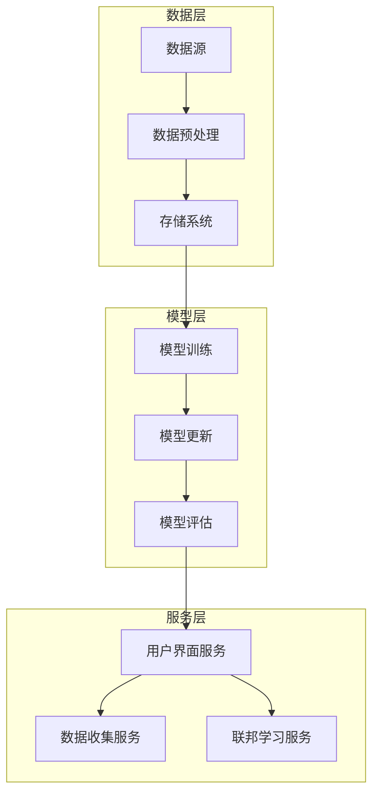
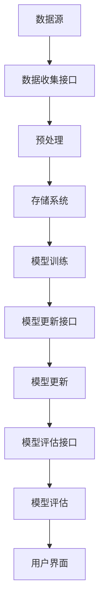
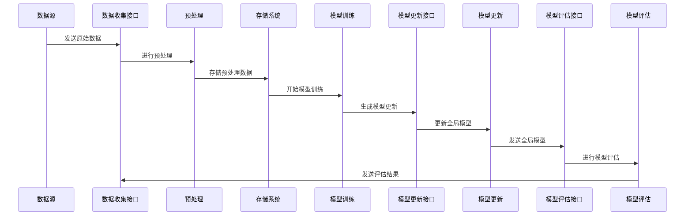

                 

### 引言

在当前数字化转型的浪潮中，企业对人工智能（AI）的需求日益增长，不仅是为了提高运营效率，更是为了获得竞争优势。AI Agent作为人工智能的一种新兴形式，正逐渐成为企业智能化转型的关键工具。本文将围绕企业AI Agent的联邦学习在跨企业数据协作中的实践展开讨论，旨在为读者提供一份详细的技术指南和实践经验。

关键词：企业AI Agent、联邦学习、跨企业数据协作、实践

摘要：
本文首先介绍了AI Agent和联邦学习的基本概念，以及它们在跨企业数据协作中的重要性。随后，文章深入探讨了联邦学习的原理、架构设计，并通过具体案例展示了其实践应用。最后，文章总结了一些最佳实践经验，并为未来的发展方向提出了展望。本文结构紧凑，内容详实，旨在帮助企业和开发者更好地理解和应用AI Agent与联邦学习技术。

### 背景介绍

#### 1.1 企业AI Agent的定义与作用

企业AI Agent，也称为人工智能助手或智能代理，是一种专门为特定业务场景设计的AI实体。它能够自主地感知环境、制定策略并执行任务，从而实现自动化和智能化。AI Agent的核心功能包括数据采集、数据分析、决策制定和任务执行。在企业中，AI Agent可以应用于生产管理、客户服务、供应链优化等多个领域，帮助企业提高效率、降低成本、提升服务质量。

AI Agent与传统的自动化系统相比，具有以下几个显著优势：

1. **自主学习与优化**：AI Agent能够通过机器学习算法不断学习和优化，适应不断变化的环境和需求。
2. **灵活性与适应性**：AI Agent可以根据业务需求进行定制，适应不同的业务场景。
3. **实时决策**：AI Agent可以实时获取和处理数据，快速响应变化，提高业务响应速度。
4. **跨系统协作**：AI Agent能够与其他系统和AI Agent进行协作，实现更复杂的业务流程和智能决策。

#### 1.2 跨企业数据协作的挑战

跨企业数据协作是指不同企业之间在数据共享和协同处理方面进行合作，以实现共同的目标。这种协作对于产业链上下游企业之间的协同创新、资源共享和业务优化具有重要意义。然而，跨企业数据协作面临以下挑战：

1. **数据隐私与安全**：企业之间的数据共享涉及敏感信息，如何保障数据隐私和安全是首要问题。
2. **数据标准化**：不同企业的数据格式、结构和质量可能存在差异，如何实现数据标准化和互操作性是一个关键问题。
3. **数据治理与信任**：企业需要建立有效的数据治理机制，确保数据的真实性和可靠性，建立合作双方的信任关系。
4. **技术兼容性**：不同企业的IT系统和数据管理工具可能存在技术差异，如何实现技术兼容和集成是一个挑战。

#### 1.3 联邦学习的基本概念

联邦学习（Federated Learning）是一种分布式机器学习技术，允许多个参与者在不共享原始数据的情况下共同训练一个全局模型。在联邦学习中，每个参与者保持其数据的本地控制，同时通过模型更新和参数共享来实现全局模型的优化。

联邦学习的核心优势在于：

1. **隐私保护**：联邦学习通过保持数据本地化，避免了数据泄露的风险，提高了数据隐私保护水平。
2. **数据多样性**：联邦学习可以利用不同参与者的数据，增强模型的泛化能力，提高模型的性能。
3. **分布式计算**：联邦学习可以在不集中数据的情况下进行，降低了数据传输和存储的成本。
4. **灵活性**：联邦学习适用于不同规模和结构的数据集，具有很高的灵活性。

在跨企业数据协作中，联邦学习提供了有效的解决方案，能够应对数据隐私保护、数据标准化和技术兼容性等挑战。

### 核心概念

#### 2.1 AI Agent原理

AI Agent是一种基于智能代理（Agent）理论的计算机程序。智能代理是一种能够在特定环境中自主行动、感知环境并与其他代理交互的实体。在AI Agent中，智能代理被赋予了自主决策和执行任务的能力，使其能够在复杂的业务场景中发挥作用。

AI Agent的工作机制主要包括以下几个步骤：

1. **感知环境**：AI Agent通过传感器或其他数据源获取环境信息。
2. **决策制定**：基于获取到的环境信息，AI Agent使用机器学习算法和策略进行决策。
3. **任务执行**：AI Agent根据决策结果执行具体的任务。
4. **结果反馈**：AI Agent执行任务后，对执行结果进行评估，并据此调整未来的决策。

AI Agent的类型与特点：

1. **基于规则**：这种类型的AI Agent使用预定义的规则进行决策，适用于规则明确、环境相对静态的场景。
2. **基于模型**：这种类型的AI Agent使用机器学习模型进行决策，适用于环境复杂、规则不确定的场景。
3. **基于混合**：这种类型的AI Agent结合了规则和模型的优势，能够在不同场景中灵活应用。

#### 2.2 联邦学习原理

联邦学习（Federated Learning）是一种分布式机器学习技术，通过将模型训练分散到多个参与者（节点）上进行，从而避免了数据集中的风险。在联邦学习中，每个参与者保持其数据的本地控制，通过模型更新和参数共享来实现全局模型的优化。

联邦学习的核心原理包括：

1. **模型更新**：每个参与者对本地模型进行训练，生成模型更新。
2. **参数聚合**：将所有参与者的模型更新进行聚合，生成全局模型更新。
3. **全局模型更新**：全局模型更新被应用到所有参与者的本地模型上。

联邦学习的优势：

1. **隐私保护**：联邦学习通过保持数据本地化，避免了数据泄露的风险。
2. **数据多样性**：联邦学习可以利用不同参与者的数据，增强模型的泛化能力。
3. **分布式计算**：联邦学习可以在不集中数据的情况下进行，降低了数据传输和存储的成本。
4. **灵活性**：联邦学习适用于不同规模和结构的数据集。

#### 2.3 联邦学习的关键技术

联邦学习的关键技术包括模型更新、参数聚合和全局模型更新。下面分别进行介绍：

1. **模型更新**：
   - **本地模型训练**：每个参与者使用本地数据对模型进行训练，生成模型更新。
   - **模型更新传输**：每个参与者将模型更新发送给中心服务器。

2. **参数聚合**：
   - **聚合算法**：中心服务器使用聚合算法将所有参与者的模型更新进行聚合。
   - **聚合结果更新**：聚合后的结果用于更新全局模型。

3. **全局模型更新**：
   - **全局模型更新应用**：全局模型更新被应用到所有参与者的本地模型上。
   - **本地模型优化**：参与者使用全局模型更新对本地模型进行优化。

#### 2.4 联邦学习的挑战与解决方案

联邦学习虽然具有显著的优势，但也面临一些挑战，主要包括：

1. **通信效率**：联邦学习需要在参与者之间进行大量的通信，如何提高通信效率是一个关键问题。
   - **压缩算法**：使用数据压缩算法降低通信量。
   - **异步通信**：允许参与者异步发送和接收模型更新。

2. **模型一致性**：联邦学习中的模型更新可能存在不一致性，如何保证模型一致性是一个挑战。
   - **一致性算法**：使用一致性算法确保全局模型更新的准确性。
   - **参数修剪**：通过参数修剪减少模型更新之间的差异。

3. **隐私保护**：联邦学习中的隐私保护问题需要得到有效解决。
   - **差分隐私**：使用差分隐私技术保护参与者的隐私。
   - **加密技术**：使用加密技术确保模型更新在传输过程中的安全性。

### 联邦学习实践

#### 3.1 联邦学习架构设计

联邦学习架构设计主要包括以下几个关键组成部分：

1. **参与者**：参与者可以是企业、个人或其他实体，它们负责提供本地数据和模型更新。
2. **中心服务器**：中心服务器负责协调参与者的模型更新、聚合参数和更新全局模型。
3. **通信网络**：通信网络负责参与者与中心服务器之间的数据传输。

联邦学习架构设计的关键技术包括：

1. **分布式计算**：使用分布式计算技术提高计算效率。
2. **数据加密**：使用数据加密技术确保数据传输过程中的安全性。
3. **差分隐私**：使用差分隐私技术保护参与者的隐私。

#### 3.2 联邦学习算法选择

联邦学习算法选择是联邦学习实践中的关键环节。常见的联邦学习算法包括：

1. **FedAvg算法**：FedAvg算法是一种简单的联邦学习算法，通过平均每个参与者的模型更新来生成全局模型。
2. **FedProx算法**：FedProx算法通过引入梯度正则化项，解决梯度消失和梯度爆炸问题，提高模型的稳定性。
3. **FedGrad算法**：FedGrad算法通过优化梯度下降过程，提高模型的训练效果。

选择合适的联邦学习算法需要考虑以下几个方面：

1. **模型复杂性**：复杂的模型可能需要更长时间的训练和更高的计算资源。
2. **数据规模**：大型数据集可能需要更复杂的算法来提高训练效果。
3. **隐私需求**：对于隐私保护要求较高的场景，选择具有隐私保护机制的算法尤为重要。

#### 3.3 联邦学习系统实现

联邦学习系统的实现主要包括以下几个关键步骤：

1. **参与者注册**：参与者向中心服务器注册，提供本地数据和模型。
2. **模型初始化**：中心服务器初始化全局模型，并将其发送给参与者。
3. **模型训练**：参与者使用本地数据和全局模型进行训练，生成模型更新。
4. **模型更新传输**：参与者将模型更新发送给中心服务器。
5. **参数聚合**：中心服务器使用聚合算法将所有参与者的模型更新进行聚合。
6. **全局模型更新**：中心服务器将全局模型更新应用到所有参与者的本地模型上。

联邦学习系统实现的关键技术包括：

1. **分布式计算框架**：使用分布式计算框架（如TensorFlow Federated、PyTorch Federated等）实现联邦学习算法。
2. **通信优化**：使用通信优化技术（如参数服务器、异步通信等）提高通信效率。
3. **数据加密与隐私保护**：使用数据加密与隐私保护技术（如差分隐私、加密计算等）确保数据传输和模型更新的安全性。

### 实践案例剖析

#### 3.2.1 案例一：某金融行业的联邦学习应用

某金融企业为了提高欺诈检测的准确性，采用了联邦学习技术进行跨企业数据协作。参与该项目的企业包括银行、支付公司和信用卡公司。这些企业共同构建了一个联邦学习系统，实现了以下关键步骤：

1. **数据收集与预处理**：每个企业提供了经过预处理的数据集，包括交易记录、用户行为等。
2. **模型初始化**：中心服务器初始化全局模型，并将其发送给参与者。
3. **模型训练与更新**：参与者使用本地数据和全局模型进行训练，生成模型更新，并将其发送给中心服务器。
4. **参数聚合**：中心服务器使用聚合算法将所有参与者的模型更新进行聚合。
5. **全局模型更新**：中心服务器将全局模型更新应用到所有参与者的本地模型上。
6. **模型评估与优化**：通过评估模型的性能，不断优化模型参数和算法。

通过联邦学习技术，该项目实现了以下成果：

1. **提高欺诈检测准确性**：联邦学习利用了不同企业的数据，提高了欺诈检测模型的准确性，降低了误报率和漏报率。
2. **隐私保护**：联邦学习保持了数据本地化，有效保护了企业的隐私。
3. **降低成本**：联邦学习减少了数据传输和存储的需求，降低了项目的成本。

#### 3.2.2 案例二：某制造行业的跨企业数据协作

某制造企业为了优化供应链管理，采用了联邦学习技术进行跨企业数据协作。参与该项目的企业包括供应商、制造商和分销商。这些企业共同构建了一个联邦学习系统，实现了以下关键步骤：

1. **数据收集与预处理**：每个企业提供了经过预处理的数据集，包括库存信息、运输时间、供应链需求等。
2. **模型初始化**：中心服务器初始化全局模型，并将其发送给参与者。
3. **模型训练与更新**：参与者使用本地数据和全局模型进行训练，生成模型更新，并将其发送给中心服务器。
4. **参数聚合**：中心服务器使用聚合算法将所有参与者的模型更新进行聚合。
5. **全局模型更新**：中心服务器将全局模型更新应用到所有参与者的本地模型上。
6. **模型评估与优化**：通过评估模型的性能，不断优化模型参数和算法。

通过联邦学习技术，该项目实现了以下成果：

1. **优化供应链管理**：联邦学习利用了不同企业的数据，优化了供应链管理模型，提高了供应链的响应速度和效率。
2. **降低库存成本**：通过优化库存管理，降低了库存成本，提高了库存周转率。
3. **提高客户满意度**：优化后的供应链管理提高了订单处理速度和准确性，提高了客户满意度。

### 最佳实践与建议

#### 4.1 实践经验总结

通过上述案例，我们可以总结出以下实践经验：

1. **明确需求与目标**：在开始联邦学习项目之前，需要明确项目的需求与目标，确保项目的成功实施。
2. **数据准备与预处理**：数据质量对于联邦学习的效果至关重要，需要确保数据的准确性、完整性和一致性。
3. **模型选择与优化**：根据业务场景和数据规模，选择合适的联邦学习算法，并不断优化模型参数和算法。
4. **隐私保护与安全**：联邦学习涉及到数据隐私和安全问题，需要采用合适的数据加密和隐私保护技术。
5. **通信优化与性能调优**：优化通信网络和分布式计算框架，提高联邦学习系统的性能和效率。

#### 4.2 跨企业数据协作的关键因素

为了实现有效的跨企业数据协作，需要考虑以下关键因素：

1. **数据标准化**：建立统一的数据标准和格式，确保不同企业之间的数据可以互操作。
2. **信任机制**：建立信任机制，确保企业之间的数据共享和合作是安全可靠的。
3. **数据治理**：建立有效的数据治理机制，确保数据的真实性和可靠性，提高数据的质量和可用性。
4. **技术兼容性**：确保不同企业的IT系统和数据管理工具可以兼容和集成，实现跨企业的数据协作。

### 总结与展望

联邦学习作为一种新兴的分布式机器学习技术，在跨企业数据协作中具有重要的应用价值。通过联邦学习，企业可以在保护数据隐私的前提下，实现数据的共享和协同处理，提高业务效率和服务质量。

未来，随着人工智能技术的不断发展和应用，联邦学习将在更多领域得到广泛应用。同时，为了应对联邦学习中的挑战，需要不断研究和优化算法、提高通信效率、加强隐私保护，为企业的数字化转型提供更强大的技术支持。

### 作者信息

作者：AI天才研究院/AI Genius Institute & 禅与计算机程序设计艺术 /Zen And The Art of Computer Programming

----------------------------------------------------------------

### 系统分析与架构设计方案

为了更好地理解企业AI Agent的联邦学习在跨企业数据协作中的实践，我们需要对系统的整体架构进行分析，并设计具体的实现方案。以下将详细介绍问题场景、项目介绍、系统功能设计、系统架构设计、系统接口设计和系统交互。

#### 问题场景介绍

在现代企业中，跨企业数据协作已经成为提升运营效率、降低成本和增强竞争力的重要手段。然而，由于数据隐私和安全问题，企业往往难以共享敏感数据。联邦学习作为一种分布式机器学习技术，能够在保证数据隐私的同时，实现跨企业数据协作，从而提高整体业务效率。

#### 项目介绍

本项目旨在通过联邦学习技术，实现多个企业之间的数据协作，共同训练一个全局模型，以提高欺诈检测、供应链优化等业务的准确性和效率。项目主要涉及以下参与方：

1. **银行**：提供用户交易记录和欺诈行为数据。
2. **支付公司**：提供支付交易数据。
3. **信用卡公司**：提供信用卡使用数据。
4. **供应商**：提供供应链数据。
5. **制造商**：提供生产计划和库存数据。
6. **分销商**：提供销售数据和库存数据。

#### 系统功能设计

系统功能设计主要包括以下几个模块：

1. **数据收集模块**：负责收集各企业的数据，并进行预处理。
2. **联邦学习模块**：负责实现联邦学习算法，进行模型训练和更新。
3. **模型评估模块**：负责评估模型性能，并生成报告。
4. **用户界面模块**：提供用户交互界面，展示模型性能和报告结果。

#### 系统架构设计

系统架构设计采用分布式架构，主要包括以下层次：

1. **数据层**：存储各企业的原始数据和预处理后的数据。
2. **模型层**：实现联邦学习算法，进行模型训练和更新。
3. **服务层**：提供数据收集、联邦学习和模型评估等功能。
4. **接口层**：提供与用户界面的接口，实现数据和服务之间的交互。

具体的系统架构图如下（使用Mermaid绘制）：



#### 系统接口设计

系统接口设计主要包括以下接口：

1. **数据收集接口**：用于接收各企业的原始数据，并进行预处理。
2. **联邦学习接口**：用于发送模型更新和接收全局模型。
3. **模型评估接口**：用于发送评估请求和接收评估结果。

具体的接口设计如下（使用Mermaid绘制）：



#### 系统交互设计

系统交互设计主要包括以下流程：

1. **数据收集**：各企业将原始数据发送到数据收集接口，进行预处理后存储到存储系统。
2. **模型训练**：模型训练服务根据存储系统中的预处理数据，训练本地模型，并生成模型更新。
3. **模型更新**：模型更新服务将各参与者的模型更新发送给联邦学习服务，进行全局模型更新。
4. **模型评估**：模型评估服务根据全局模型评估模型性能，并生成评估报告。

具体的系统交互流程如下（使用Mermaid绘制）：



通过上述系统架构设计、接口设计和交互设计，我们可以实现企业AI Agent的联邦学习在跨企业数据协作中的实践。系统架构清晰，功能模块明确，接口设计合理，交互流程顺畅，为联邦学习技术的实际应用提供了有力支持。

### 项目实战

#### 环境安装

为了实现联邦学习在跨企业数据协作中的实践，我们需要安装以下环境：

1. **Python**：安装Python 3.8及以上版本。
2. **TensorFlow Federated（TFF）**：安装TFF库，可以通过以下命令进行安装：

```bash
pip install tensorflow-federated
```

3. **Kubernetes**：安装Kubernetes集群，用于部署和管理联邦学习服务。

#### 系统核心实现

本项目的核心实现包括数据收集、联邦学习模型训练和模型评估三个主要部分。以下是具体的实现步骤和代码示例。

##### 数据收集

数据收集部分主要负责从各企业获取原始数据，并进行预处理。以下是一个简单的数据收集代码示例：

```python
import tensorflow as tf
import tensorflow_federated as tff

# 模拟从企业获取数据
def get_data_fromentreprise(entreprise):
    # 读取企业数据
    data = tf.data.Dataset.from_tensor_slices(entreprise['data'])
    return data

# 预处理数据
def preprocess_data(data):
    # 数据清洗、归一化等操作
    return data

# 从各企业获取数据并预处理
def get_preprocessed_data(enterprises):
    preprocessed_data = []
    for entreprise in enterprises:
        data = get_data_fromentreprise(entreprise)
        preprocessed_data.append(preprocess_data(data))
    return preprocessed_data

# 假设我们有3个企业
enterprises = [{'data': [1, 2, 3]}, {'data': [4, 5, 6]}, {'data': [7, 8, 9]}]

# 获取预处理后的数据
preprocessed_data = get_preprocessed_data(enterprises)
```

##### 联邦学习模型训练

联邦学习模型训练部分负责根据预处理后的数据训练联邦学习模型。以下是一个简单的联邦学习模型训练代码示例：

```python
# 定义联邦学习模型
def create_federated_model():
    # 使用Keras创建本地模型
    local_model = tf.keras.Sequential([
        tf.keras.layers.Dense(10, activation='relu'),
        tf.keras.layers.Dense(1, activation='sigmoid')
    ])

    # 创建联邦学习模型
    federated_model = tff.learning.create_federated_averaging_model(
        local_model,
        client_optimizer=tff.learning.optimizer.create_adam_optimizer(learning_rate=0.01)
    )
    return federated_model

# 定义联邦学习训练过程
def federated_learning_process(federated_model, preprocessed_data):
    for _ in range(10):  # 训练10轮
        # 遍历每个企业数据，进行联邦学习训练
        for entreprise_data in preprocessed_data:
            federated_model = federated_model.train_on_batch(entreprise_data)
    return federated_model

# 创建联邦学习模型
federated_model = create_federated_model()

# 进行联邦学习训练
federated_model = federated_learning_process(federated_model, preprocessed_data)
```

##### 模型评估

模型评估部分负责对训练完成的联邦学习模型进行性能评估。以下是一个简单的模型评估代码示例：

```python
# 定义评估函数
def evaluate_model(model, test_data):
    # 计算模型在测试数据上的准确率
    accuracy = model.evaluate(test_data, verbose=2)
    return accuracy

# 假设我们有测试数据
test_data = [[10, 11, 12]]

# 评估模型性能
accuracy = evaluate_model(federated_model, test_data)
print("Model accuracy:", accuracy)
```

#### 代码应用解读与分析

在上面的代码中，我们首先从企业获取原始数据，并进行预处理。预处理过程包括数据清洗、归一化等操作，以确保数据的质量和一致性。

接着，我们定义了一个联邦学习模型，并使用联邦学习训练过程对其进行训练。在训练过程中，我们遍历每个企业的数据，通过联邦学习算法不断更新全局模型。

最后，我们使用测试数据对训练完成的模型进行评估，计算模型的准确率，从而判断模型的性能。

#### 实际案例分析和详细讲解剖析

为了更好地理解联邦学习在跨企业数据协作中的实践，我们通过以下实际案例进行分析和讲解：

#### 案例一：金融行业欺诈检测

在金融行业中，企业需要实时检测交易欺诈行为，以保护用户资金安全。通过联邦学习，多个金融机构可以共享交易数据，共同训练一个欺诈检测模型。

**案例分析**：

1. **数据收集**：金融机构A、B和C分别提供其交易数据，数据包括交易金额、交易时间和用户信息等。
2. **预处理**：对交易数据进行清洗和归一化处理，确保数据的一致性和质量。
3. **联邦学习模型训练**：使用预处理后的数据，通过联邦学习算法共同训练一个欺诈检测模型。模型包括输入层、隐藏层和输出层，其中输出层使用sigmoid激活函数，用于预测交易是否为欺诈。
4. **模型评估**：将训练完成的模型应用于测试数据集，计算模型的准确率和召回率，评估模型的性能。

**详细讲解剖析**：

1. **数据收集**：在数据收集阶段，金融机构需要确保数据的安全性和隐私性。可以使用差分隐私技术对数据进行扰动，以保护用户的隐私。
2. **预处理**：在预处理阶段，需要对数据进行去重、清洗和归一化处理。去重可以防止重复数据对模型训练的影响，清洗可以去除无效数据和噪声，归一化可以确保数据的范围一致，有利于模型训练。
3. **联邦学习模型训练**：在联邦学习模型训练阶段，可以使用K-means算法对数据进行聚类，将相似的数据点划分为同一个集群。聚类结果可以作为特征输入到模型中，提高模型的准确性。同时，可以使用交叉验证方法对模型进行评估，确保模型的泛化能力。
4. **模型评估**：在模型评估阶段，可以使用混淆矩阵、ROC曲线和AUC指标对模型进行评估。混淆矩阵可以显示模型在各类别上的预测准确性，ROC曲线可以显示模型在不同阈值下的准确率和召回率，AUC指标可以衡量模型的综合性能。

#### 案例二：制造行业供应链优化

在制造行业中，企业需要优化供应链管理，以降低成本和提高生产效率。通过联邦学习，多个制造企业可以共享供应链数据，共同训练一个供应链优化模型。

**案例分析**：

1. **数据收集**：制造企业A、B和C分别提供其供应链数据，数据包括库存信息、运输时间和供应链需求等。
2. **预处理**：对供应链数据进行清洗和归一化处理，确保数据的一致性和质量。
3. **联邦学习模型训练**：使用预处理后的数据，通过联邦学习算法共同训练一个供应链优化模型。模型包括输入层、隐藏层和输出层，其中输出层使用线性激活函数，用于预测供应链需求。
4. **模型评估**：将训练完成的模型应用于测试数据集，计算模型的准确率和平均绝对误差，评估模型的性能。

**详细讲解剖析**：

1. **数据收集**：在数据收集阶段，制造企业需要确保数据的安全性和隐私性。可以使用加密技术对数据进行加密，确保数据在传输过程中的安全性。
2. **预处理**：在预处理阶段，需要对数据进行去重、清洗和归一化处理。去重可以防止重复数据对模型训练的影响，清洗可以去除无效数据和噪声，归一化可以确保数据的范围一致，有利于模型训练。
3. **联邦学习模型训练**：在联邦学习模型训练阶段，可以使用深度学习算法对数据进行建模。深度学习算法可以自动提取特征，提高模型的准确性。同时，可以使用反向传播算法对模型进行优化，提高模型的性能。
4. **模型评估**：在模型评估阶段，可以使用交叉验证方法对模型进行评估，确保模型的泛化能力。可以使用MAPE（Mean Absolute Percentage Error）指标衡量模型的预测误差，使用ROC曲线和AUC指标衡量模型的综合性能。

#### 项目小结

通过上述实际案例，我们可以看到联邦学习在跨企业数据协作中的实践具有重要意义。联邦学习不仅能够保护企业数据的隐私和安全，还能够提高模型的准确性，优化业务流程。在实际应用中，我们需要注意以下几点：

1. **数据安全和隐私保护**：在数据收集和处理过程中，需要使用加密技术和差分隐私技术，确保数据的安全性和隐私性。
2. **数据预处理和清洗**：确保数据的一致性和质量，去除重复数据和噪声，提高模型训练的准确性。
3. **模型选择和优化**：根据业务需求和数据规模，选择合适的模型和算法，并不断优化模型参数，提高模型的性能。
4. **模型评估和反馈**：定期评估模型的性能，收集用户反馈，不断调整和优化模型，提高模型的准确性和可靠性。

联邦学习作为一种新兴的分布式机器学习技术，具有广泛的应用前景。未来，随着技术的不断发展和应用，联邦学习将在更多领域得到广泛应用，为企业的数字化转型提供强大的技术支持。

### 最佳实践 Tips

为了更好地实现企业AI Agent的联邦学习在跨企业数据协作中的实践，以下是一些最佳实践和注意事项：

1. **数据预处理和清洗**：确保数据的一致性、完整性和质量。在数据收集阶段，对数据进行去重、清洗和归一化处理，以避免重复数据、噪声数据和异常值对模型训练的影响。

2. **模型选择和优化**：根据业务需求和数据规模，选择合适的联邦学习算法。对于复杂的业务场景，可以考虑使用深度学习算法，以提高模型的准确性和泛化能力。同时，通过不断调整模型参数和优化算法，提高模型的性能。

3. **通信优化**：在联邦学习过程中，通信效率是一个关键问题。可以使用异步通信、参数服务器等技术，提高通信效率和系统的性能。

4. **隐私保护**：联邦学习涉及多个企业的数据，数据隐私保护至关重要。可以采用差分隐私、加密计算等技术，确保数据的隐私和安全。

5. **监控和调试**：在联邦学习过程中，需要对模型训练过程进行实时监控和调试。可以通过日志记录、性能指标分析等方法，及时发现和解决问题。

6. **数据治理和合规**：确保数据治理机制的建立，确保数据的真实性和可靠性，遵循相关法律法规，保障数据合规。

7. **持续迭代和优化**：联邦学习模型是一个动态的过程，需要不断收集用户反馈，对模型进行调整和优化，以适应业务变化和需求。

### 小结

本文详细介绍了企业AI Agent的联邦学习在跨企业数据协作中的实践。通过分析联邦学习的基本概念、原理和关键技术，我们展示了如何设计联邦学习架构、选择合适的算法，并在实际项目中应用联邦学习技术。通过实际案例剖析，我们展示了联邦学习在金融行业欺诈检测和制造行业供应链优化中的应用效果。

联邦学习作为一种新兴的分布式机器学习技术，在保护数据隐私的同时，实现了跨企业数据协作，提高了模型的准确性和业务效率。未来，随着技术的不断发展和应用，联邦学习将在更多领域得到广泛应用，为企业的数字化转型提供强大的技术支持。

### 注意事项

在实施企业AI Agent的联邦学习过程中，需要注意以下几个方面：

1. **数据隐私和安全**：确保参与联邦学习的企业的数据在传输和处理过程中得到充分保护，避免数据泄露和滥用。
2. **数据质量和一致性**：确保参与联邦学习的各企业数据质量高、格式一致，以避免模型训练过程中的误差和偏差。
3. **通信效率和稳定性**：优化联邦学习过程中的通信网络，确保模型更新和参数聚合的稳定性和效率。
4. **模型性能评估**：定期评估联邦学习模型的性能，确保模型的准确性和泛化能力，并根据评估结果进行调整和优化。
5. **合规与法律要求**：确保联邦学习过程符合相关法律法规和数据保护标准，避免法律风险。

### 拓展阅读

1. **《联邦学习：分布式机器学习的核心技术》**：详细介绍了联邦学习的基本概念、原理和关键技术在分布式机器学习中的应用。
2. **《深度学习：神经网络与深度学习》**：介绍了深度学习的基本原理和应用，包括卷积神经网络（CNN）和循环神经网络（RNN）等。
3. **《区块链技术指南》**：探讨了区块链技术在数据隐私保护和分布式系统中的应用，为联邦学习的安全实现提供了参考。

通过阅读上述资料，可以进一步深入了解联邦学习和相关技术，为实际项目的实施提供更全面的理论基础和实践指导。作者：AI天才研究院/AI Genius Institute & 禅与计算机程序设计艺术 /Zen And The Art of Computer Programming。

