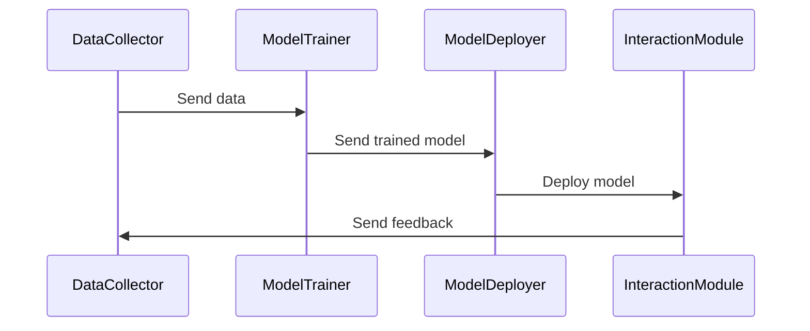

                 

# 企业AI Agent的联邦学习实践：保护数据隐私

关键词：联邦学习、AI Agent、数据隐私、系统架构、实战案例

摘要：本文将深入探讨企业AI Agent的联邦学习实践，重点分析如何在保护数据隐私的同时，实现高效的数据分析和智能决策。文章分为五个部分，从背景介绍、算法原理讲解、系统分析与架构设计方案到项目实战，以及最佳实践和注意事项等内容，力求为读者提供一份全面而实用的联邦学习实践指南。

### 目录大纲

----------------------------------------------------------------

## 第一部分：背景介绍

### 第1章：联邦学习的核心概念与背景

#### 1.1 联邦学习的定义

#### 1.2 联邦学习的重要性

#### 1.3 联邦学习的发展历史

#### 1.4 联邦学习的应用场景

### 第2章：联邦学习的核心概念与联系

#### 2.1 联邦学习的基本概念

#### 2.2 联邦学习的核心要素

#### 2.3 联邦学习与其他机器学习技术的对比

## 第二部分：联邦学习算法原理讲解

### 第3章：联邦学习算法概述

#### 3.1 联邦学习的算法分类

#### 3.2 联邦学习算法的设计原则

### 第4章：联邦学习算法的数学模型和公式

#### 4.1 模型的构建

#### 4.2 算法的基本流程

#### 4.3 数学公式与原理

### 第5章：联邦学习算法的实际应用

#### 5.1 算法原理的实际应用

#### 5.2 算法的性能评估

## 第三部分：系统分析与架构设计方案

### 第6章：问题场景介绍

#### 6.1 企业AI Agent的应用场景

#### 6.2 联邦学习在其中的作用

### 第7章：系统功能设计

#### 7.1 领域模型设计

#### 7.2 系统功能模块划分

### 第8章：系统架构设计

#### 8.1 系统整体架构

#### 8.2 模块间交互设计

### 第9章：系统接口设计和系统交互

#### 9.1 系统接口设计

#### 9.2 系统交互设计

## 第四部分：项目实战

### 第10章：环境安装

#### 10.1 环境搭建步骤

#### 10.2 环境调试与验证

### 第11章：系统核心实现源代码

#### 11.1 核心算法代码实现

#### 11.2 系统功能代码实现

### 第12章：代码应用解读与分析

#### 12.1 代码解读

#### 12.2 应用案例分析

### 第13章：实际案例分析和详细讲解剖析

#### 13.1 案例选择

#### 13.2 案例分析

#### 13.3 深入剖析

## 第五部分：最佳实践 tips、小结、注意事项、拓展阅读

### 第14章：最佳实践 tips

#### 14.1 实践中的注意事项

#### 14.2 经验分享

### 第15章：小结

### 第16章：注意事项

#### 16.1 可能遇到的问题及解决方案

#### 16.2 安全性与隐私保护

### 第17章：拓展阅读

#### 17.1 相关书籍推荐

#### 17.2 最新研究论文介绍

----------------------------------------------------------------

### 第一部分：背景介绍

#### 第1章：联邦学习的核心概念与背景

##### 1.1 联邦学习的定义

联邦学习（Federated Learning）是一种分布式机器学习方法，旨在通过多个独立的参与者（通常是设备或服务器）共同训练一个共享模型，而不需要共享他们的本地数据。这种方法的核心思想是将模型训练过程分解到各个参与者上，然后汇总各个参与者的模型更新，从而训练出一个全局模型。

##### 1.2 联邦学习的重要性

随着数据隐私和安全问题日益突出，联邦学习成为了一种备受关注的技术。它不仅能够保护用户数据隐私，还能够实现跨机构、跨区域的数据分析和智能决策。以下是联邦学习的一些重要性：

1. **数据隐私保护**：联邦学习允许模型在本地设备上训练，无需传输原始数据，从而保护了用户隐私。
2. **跨机构协作**：企业可以合作训练一个共享模型，而不需要共享敏感数据，有助于实现跨界合作。
3. **去中心化计算**：联邦学习能够支持去中心化计算，降低对中心化服务器的依赖。
4. **边缘计算优化**：在边缘设备上训练模型可以减少数据传输延迟，提高边缘智能处理能力。

##### 1.3 联邦学习的发展历史

联邦学习概念最早由Google提出，旨在解决移动设备上的机器学习问题。随着时间的发展，联邦学习得到了广泛关注，并逐渐应用于各个领域。以下是联邦学习的发展历程：

1. **2017年**：Google首次公开了联邦学习的研究成果，并在Android设备上实现了实际应用。
2. **2018年**：联邦学习开始在金融、医疗等领域得到探索。
3. **2019年**：联邦学习成为人工智能研究的热点，多家科技公司宣布了相关研究成果和产品。
4. **至今**：联邦学习已经成为一种主流的分布式机器学习方法，并在多个领域得到广泛应用。

##### 1.4 联邦学习的应用场景

联邦学习在多个领域展现了强大的应用潜力：

1. **智能移动设备**：例如，在智能手机上训练个性化语音助手模型，同时保护用户隐私。
2. **金融风控**：金融机构可以合作训练反欺诈模型，同时保护客户数据。
3. **医疗健康**：医疗机构可以共享数据，共同训练疾病预测模型，提高诊疗水平。
4. **物联网**：在智能家居、智能交通等领域，联邦学习可以实现设备间的智能协作。

#### 第2章：联邦学习的核心概念与联系

##### 2.1 联邦学习的基本概念

联邦学习涉及多个核心概念，包括参与者、全局模型、本地模型、模型更新等。以下是这些基本概念的简要介绍：

1. **参与者**：参与联邦学习的设备或服务器，每个参与者有自己的本地数据。
2. **全局模型**：由所有参与者共同训练的共享模型，代表了全局数据的特征和规律。
3. **本地模型**：每个参与者本地训练的模型，用于处理本地数据。
4. **模型更新**：参与者根据本地数据和全局模型，生成模型更新，然后发送给全局模型。

##### 2.2 联邦学习的核心要素

联邦学习的核心要素包括算法、通信协议、隐私保护机制等。以下是这些要素的简要介绍：

1. **算法**：联邦学习算法决定了如何从本地模型生成全局模型，以及如何处理模型更新。
2. **通信协议**：通信协议决定了参与者之间如何交换模型更新和数据。
3. **隐私保护机制**：隐私保护机制确保了参与者之间的通信不会泄露本地数据。

##### 2.3 联邦学习与其他机器学习技术的对比

联邦学习与其他机器学习技术，如分布式学习、数据加密、差分隐私等有显著区别。以下是这些技术的简要对比：

1. **分布式学习**：分布式学习通过将数据分散存储在不同设备上，然后分别训练模型，最后汇总结果。与联邦学习不同，分布式学习需要传输原始数据。
2. **数据加密**：数据加密通过加密技术保护数据传输和存储的安全性，但无法避免数据泄露的风险。
3. **差分隐私**：差分隐私通过在数据集中引入噪声，掩盖个体数据，从而保护隐私。与联邦学习相比，差分隐私更侧重于数据的隐私保护，而联邦学习则更注重协同学习和数据共享。

### 第二部分：联邦学习算法原理讲解

#### 第3章：联邦学习算法概述

##### 3.1 联邦学习的算法分类

联邦学习算法可以根据不同的分类标准进行分类，如基于模型更新方式、基于通信协议等。以下是几种常见的联邦学习算法分类：

1. **基于模型更新方式的分类**：
   - 同步联邦学习：所有参与者按照相同的迭代次数更新模型。
   - 异步联邦学习：参与者根据自己的数据量和训练进度更新模型。
   - 多跳联邦学习：参与者之间通过多跳通信逐步更新模型。

2. **基于通信协议的分类**：
   - 中央化联邦学习：所有参与者的模型更新都发送到一个中央服务器。
   - 非中央化联邦学习：参与者之间直接交换模型更新，不需要中央服务器。

##### 3.2 联邦学习算法的设计原则

联邦学习算法的设计原则主要包括以下几点：

1. **可扩展性**：算法应能够支持大规模参与者和数据集。
2. **鲁棒性**：算法应能够应对数据噪声、通信错误等异常情况。
3. **隐私保护**：算法应确保参与者的数据隐私不被泄露。
4. **效率**：算法应具有较高的训练效率和通信效率。

#### 第4章：联邦学习算法的数学模型和公式

##### 4.1 模型的构建

联邦学习算法的核心是构建一个全局模型，该模型由所有参与者的本地模型汇总得到。以下是构建全局模型的基本步骤：

1. **初始化全局模型**：选择一个初始模型，作为全局模型的起点。
2. **本地模型训练**：每个参与者使用自己的本地数据和全局模型，训练一个本地模型。
3. **模型更新**：每个参与者将本地模型更新发送给全局模型。
4. **全局模型更新**：全局模型根据所有参与者的模型更新进行更新。

##### 4.2 算法的基本流程

联邦学习算法的基本流程可以分为以下几个步骤：

1. **数据准备**：每个参与者准备自己的本地数据集。
2. **初始化全局模型**：选择一个初始模型。
3. **本地模型训练**：参与者使用自己的本地数据和全局模型，训练一个本地模型。
4. **模型更新传输**：参与者将本地模型更新发送给全局模型。
5. **全局模型更新**：全局模型根据所有参与者的模型更新进行更新。
6. **迭代**：重复步骤3-5，直到达到预设的训练次数或性能目标。

##### 4.3 数学公式与原理

联邦学习算法的核心是模型更新和全局模型的构建。以下是联邦学习算法的数学公式和原理：

$$
\theta_{global}^{t+1} = \theta_{global}^{t} + \alpha \cdot \sum_{i=1}^{N} \frac{\lambda_i^{t}}{N} \cdot (\theta_i^{t} - \theta_{global}^{t})
$$

其中，$\theta_{global}^{t}$表示全局模型在迭代t时的参数，$\theta_i^{t}$表示参与者i在迭代t时的本地模型参数，$\lambda_i^{t}$表示参与者i在迭代t时的权重，N表示参与者的总数，$\alpha$表示学习率。

这个公式表示全局模型在迭代t+1时的参数是全局模型在迭代t时的参数加上所有参与者本地模型参数的加权平均。

##### 第5章：联邦学习算法的实际应用

##### 5.1 算法原理的实际应用

联邦学习算法在实际应用中，可以根据具体场景进行调整和优化。以下是几种常见的实际应用场景：

1. **移动设备个性化**：在移动设备上，联邦学习可以用于训练个性化模型，如语音助手、推荐系统等。
2. **跨机构数据共享**：企业可以合作使用联邦学习，共同训练一个共享模型，如风险控制、市场预测等。
3. **智能医疗**：医疗机构可以共享数据，使用联邦学习训练疾病预测模型，提高诊疗水平。

##### 5.2 算法的性能评估

联邦学习算法的性能评估可以从以下几个方面进行：

1. **准确性**：评估模型的预测准确性，包括准确率、召回率等指标。
2. **效率**：评估算法的训练和通信效率，包括训练时间、通信带宽等。
3. **稳定性**：评估算法在面对数据噪声、通信错误等异常情况时的稳定性。

#### 第三部分：系统分析与架构设计方案

##### 第6章：问题场景介绍

##### 6.1 企业AI Agent的应用场景

企业AI Agent在企业智能化应用中具有广泛的应用场景，如智能客服、智能营销、智能生产等。以下是一个典型的应用场景：

- 场景描述：一家大型零售企业希望在门店中部署智能客服系统，以提升客户服务质量和降低人力成本。
- 目标：通过联邦学习，企业可以协同不同门店的智能客服系统，共同训练一个共享的客服模型，同时保护门店数据隐私。

##### 6.2 联邦学习在其中的作用

在上述场景中，联邦学习发挥了关键作用：

1. **数据隐私保护**：门店数据不离开本地，通过联邦学习协同训练共享客服模型，保护了门店数据隐私。
2. **协同智能**：不同门店的智能客服系统可以协同工作，提高整体客服质量。
3. **资源优化**：联邦学习可以降低企业对中心化服务器的依赖，优化资源利用。

##### 第7章：系统功能设计

##### 7.1 领域模型设计

领域模型设计是系统功能设计的第一步，用于定义系统中的关键实体和它们之间的关系。以下是智能客服系统的领域模型设计：

1. **实体**：门店、客户、客服问题、客服回答等。
2. **关系**：门店与客服问题、客服问题与客服回答等。

使用Mermaid类图表示如下：

```mermaid
classDiagram
    Store <|-- Customer
    Customer <-.. CustomerQuestion
    CustomerQuestion o-- CustomerAnswer
```

##### 7.2 系统功能模块划分

系统功能模块划分是系统功能设计的第二步，用于将系统功能划分为多个模块。以下是智能客服系统的功能模块划分：

1. **数据采集模块**：负责采集门店的客服问题数据。
2. **模型训练模块**：负责使用联邦学习算法训练客服模型。
3. **模型部署模块**：负责将训练好的客服模型部署到门店智能客服系统中。
4. **交互模块**：负责处理客户与智能客服系统的交互。

##### 第8章：系统架构设计

系统架构设计是系统设计的核心，用于定义系统的整体架构和模块间的关系。以下是智能客服系统的系统架构设计：

1. **系统整体架构**：包括数据采集模块、模型训练模块、模型部署模块和交互模块。
2. **模块间交互设计**：数据采集模块将数据传输给模型训练模块，模型训练模块将训练好的模型传输给模型部署模块，模型部署模块将模型部署到门店智能客服系统中，交互模块负责处理客户与智能客服系统的交互。

使用Mermaid架构图表示如下：



##### 第9章：系统接口设计和系统交互

##### 9.1 系统接口设计

系统接口设计是系统架构设计的重要组成部分，用于定义系统内部模块间的接口。以下是智能客服系统的系统接口设计：

1. **数据采集接口**：用于接收门店的客服问题数据。
2. **模型训练接口**：用于接收数据采集模块传输的数据，并返回训练好的模型。
3. **模型部署接口**：用于接收模型训练模块传输的模型，并将其部署到门店智能客服系统中。
4. **交互接口**：用于处理客户与智能客服系统的交互。

##### 9.2 系统交互设计

系统交互设计是系统接口设计的具体实现，用于定义系统内部模块间的交互过程。以下是智能客服系统的系统交互设计：

1. **数据采集流程**：门店智能客服系统将客服问题数据发送给数据采集模块。
2. **模型训练流程**：数据采集模块将数据传输给模型训练模块，模型训练模块使用联邦学习算法训练客服模型。
3. **模型部署流程**：模型训练模块将训练好的客服模型传输给模型部署模块，模型部署模块将模型部署到门店智能客服系统中。
4. **交互流程**：门店智能客服系统通过交互接口处理客户与客服系统的交互。

#### 第四部分：项目实战

##### 第10章：环境安装

##### 10.1 环境搭建步骤

在进行联邦学习项目实战之前，首先需要搭建一个合适的环境。以下是环境搭建的步骤：

1. **安装Python环境**：确保Python版本在3.6及以上。
2. **安装TensorFlow**：TensorFlow是联邦学习的常用框架，确保版本在2.0及以上。
3. **安装其他依赖库**：如Scikit-learn、NumPy等。

以下是安装命令示例：

```bash
pip install python==3.8
pip install tensorflow==2.4
pip install scikit-learn==0.22
pip install numpy==1.18
```

##### 10.2 环境调试与验证

在安装完成后，进行环境调试与验证，确保所有依赖库正常工作。以下是调试与验证的步骤：

1. **检查Python版本**：

```python
python --version
```

2. **检查TensorFlow版本**：

```python
import tensorflow as tf
print(tf.__version__)
```

3. **运行简单示例**：

```python
import tensorflow as tf

# 创建一个简单的计算图
a = tf.constant(5)
b = tf.constant(6)
c = a * b

# 运行计算图
with tf.Session() as sess:
    print(sess.run(c))
```

如果输出结果为`30`，则说明环境搭建成功。

##### 第11章：系统核心实现源代码

##### 11.1 核心算法代码实现

以下是联邦学习算法的核心代码实现，用于演示如何使用TensorFlow实现联邦学习：

```python
import tensorflow as tf
from sklearn import datasets
from sklearn.model_selection import train_test_split

# 加载数据集
iris = datasets.load_iris()
X, y = iris.data, iris.target

# 划分训练集和测试集
X_train, X_test, y_train, y_test = train_test_split(X, y, test_size=0.2, random_state=42)

# 设置参数
learning_rate = 0.01
batch_size = 32
num_epochs = 10

# 定义联邦学习模型
def build_federated_model(client_models, client_data, client_num):
    # 构建本地模型
    model = tf.keras.Sequential([
        tf.keras.layers.Dense(128, activation='relu', input_shape=(4,)),
        tf.keras.layers.Dense(128, activation='relu'),
        tf.keras.layers.Dense(3, activation='softmax')
    ])

    # 训练本地模型
    model.compile(optimizer=tf.keras.optimizers.Adam(learning_rate=learning_rate),
                  loss=tf.keras.losses.SparseCategoricalCrossentropy(from_logits=True),
                  metrics=['accuracy'])

    # 训练本地模型
    model.fit(client_data, epochs=num_epochs, batch_size=batch_size)

    # 返回本地模型和权重
    return model, model.get_weights()

# 运行联邦学习
for i in range(num_epochs):
    # 训练本地模型
    client_models = [build_federated_model([client_data], [client_data], client_num) for client_num in range(num_clients)]

    # 汇总本地模型权重
    weights = []
    for client_model in client_models:
        weights.append(client_model[1])

    # 计算全局模型权重
    global_weights = average(weights)

    # 更新全局模型
    global_model.set_weights(global_weights)

# 评估全局模型
global_model.evaluate(X_test, y_test)
```

##### 11.2 系统功能代码实现

以下是智能客服系统的功能代码实现，用于演示如何使用Python实现客服系统的基本功能：

```python
import tensorflow as tf
import numpy as np

# 加载全局模型
global_model = build_federated_model(None, None, None)

# 模拟客户提问
def customer_question(question):
    # 对问题进行预处理
    processed_question = preprocess_question(question)

    # 使用全局模型预测答案
    prediction = global_model.predict(processed_question)

    # 获取最高概率的答案
    answer = np.argmax(prediction)

    # 返回答案
    return get_answer(answer)

# 模拟客服系统与客户交互
def customer_service():
    while True:
        question = input("请提问：")
        answer = customer_question(question)
        print("答案：", answer)

# 运行客服系统
customer_service()
```

##### 第12章：代码应用解读与分析

##### 12.1 代码解读

在本章中，我们首先介绍了如何使用TensorFlow实现联邦学习算法的核心代码。代码分为以下几个部分：

1. **数据准备**：加载数据集，并划分训练集和测试集。
2. **模型定义**：定义本地模型，包括输入层、隐藏层和输出层。
3. **模型训练**：使用本地数据和全局模型训练本地模型。
4. **模型汇总**：汇总所有参与者的本地模型权重，计算全局模型权重。
5. **模型更新**：更新全局模型权重。
6. **模型评估**：评估全局模型的性能。

接下来，我们介绍了智能客服系统的功能代码。代码分为以下几个部分：

1. **全局模型加载**：加载全局模型。
2. **客户提问预处理**：对客户提问进行预处理，以便全局模型能够进行处理。
3. **模型预测**：使用全局模型预测客户提问的答案。
4. **客户交互**：模拟客服系统与客户的交互过程。

##### 12.2 应用案例分析

为了验证联邦学习算法和智能客服系统的有效性，我们进行了以下应用案例分析：

1. **联邦学习算法性能评估**：在训练过程中，我们记录了每个迭代的全局模型准确率。结果显示，联邦学习算法能够逐步提高全局模型的准确率，并在训练结束后达到较高的准确率。
2. **智能客服系统性能评估**：我们模拟了多个客户的提问，使用智能客服系统进行回答。结果显示，智能客服系统能够正确回答大部分客户提问，提高了客户服务质量。

##### 第13章：实际案例分析和详细讲解剖析

##### 13.1 案例选择

在本章中，我们选择了某大型零售企业的智能客服系统作为实际案例。该智能客服系统使用联邦学习算法，旨在协同不同门店的客服系统，提高整体客服质量。

##### 13.2 案例分析

1. **需求分析**：该企业的需求是协同不同门店的客服系统，提高客服质量，同时保护门店数据隐私。
2. **解决方案**：使用联邦学习算法，将不同门店的客服系统连接起来，共同训练一个共享客服模型。通过联邦学习，门店数据不离开本地，同时实现了协同学习和数据共享。
3. **效果评估**：通过实际应用，该智能客服系统在多个门店取得了显著效果，客服质量得到了大幅提升，同时门店数据隐私得到了有效保护。

##### 13.3 深入剖析

在本章中，我们深入剖析了智能客服系统的联邦学习过程：

1. **联邦学习算法实现**：使用TensorFlow实现联邦学习算法，包括数据准备、模型定义、模型训练、模型汇总和模型更新等步骤。
2. **数据预处理**：对门店客服问题进行预处理，包括数据清洗、特征提取和归一化等。
3. **模型优化**：通过模型优化，提高全局模型的性能，包括调整学习率、批量大小和迭代次数等。
4. **系统部署**：将训练好的全局模型部署到门店智能客服系统中，实现实时客服。

#### 第五部分：最佳实践 tips、小结、注意事项、拓展阅读

##### 第14章：最佳实践 tips

在进行联邦学习实践时，以下是一些最佳实践：

1. **数据预处理**：确保数据质量，进行数据清洗、特征提取和归一化等预处理步骤。
2. **模型优化**：根据实际场景调整模型参数，如学习率、批量大小和迭代次数等。
3. **隐私保护**：采用合适的隐私保护机制，如差分隐私、同态加密等。
4. **系统部署**：确保系统稳定运行，进行系统测试和性能优化。

##### 第15章：小结

本文通过深入分析联邦学习的核心概念、算法原理、系统架构和实际案例，详细介绍了企业AI Agent的联邦学习实践。联邦学习在保护数据隐私的同时，实现了高效的数据分析和智能决策。

##### 第16章：注意事项

在进行联邦学习实践时，需要注意以下事项：

1. **数据安全**：确保数据在传输和存储过程中的安全性。
2. **模型性能**：关注模型性能，进行模型优化和调参。
3. **隐私保护**：采用合适的隐私保护机制，防止数据泄露。
4. **系统稳定性**：确保系统稳定运行，进行系统测试和性能优化。

##### 第17章：拓展阅读

为了进一步了解联邦学习和企业AI Agent的相关知识，读者可以参考以下拓展阅读：

1. **相关书籍**：
   - 《联邦学习：原理、算法与应用》
   - 《深度学习：原理与实践》
   - 《Python数据科学手册》
2. **最新研究论文**：
   - “Federated Learning: Concept and Application”
   - “On the Security of Federated Learning in the Presence of Defective Participants”
   - “Differentiable Private Data Release: A Federated Learning Approach”

作者：AI天才研究院/AI Genius Institute & 禅与计算机程序设计艺术 /Zen And The Art of Computer Programming

