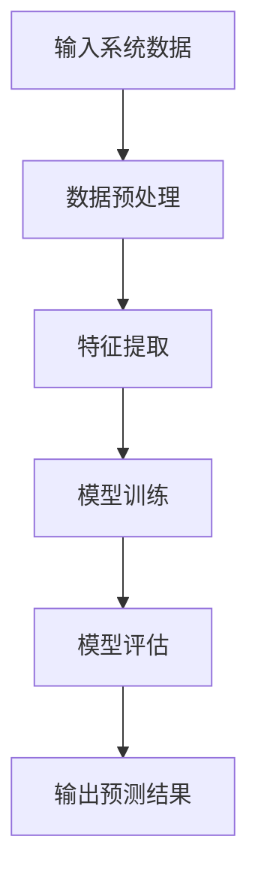
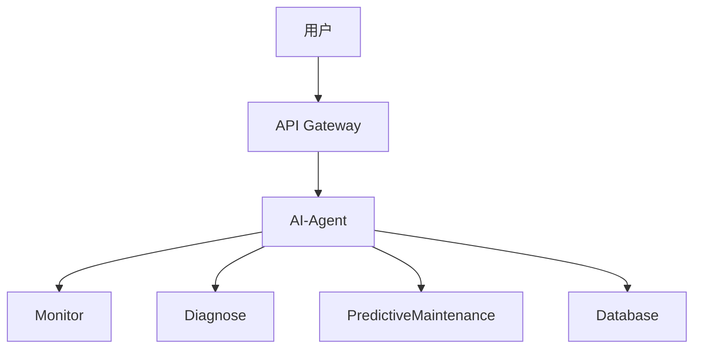
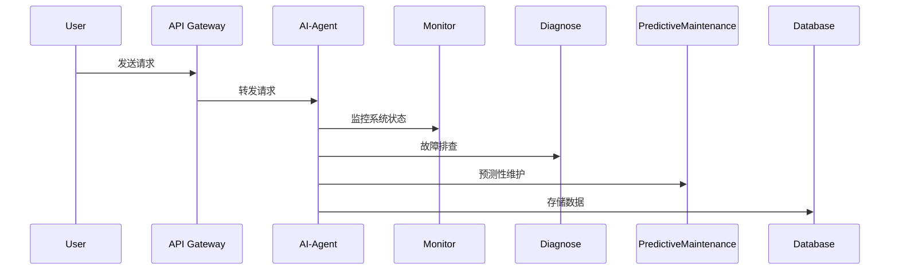
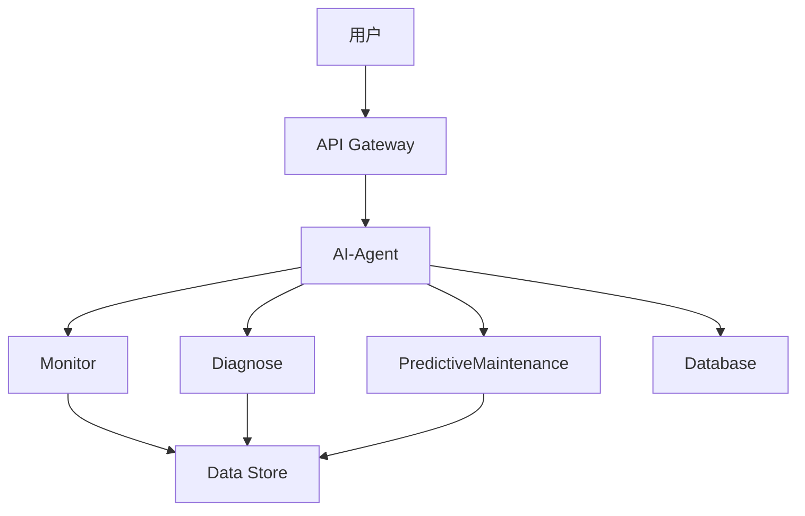
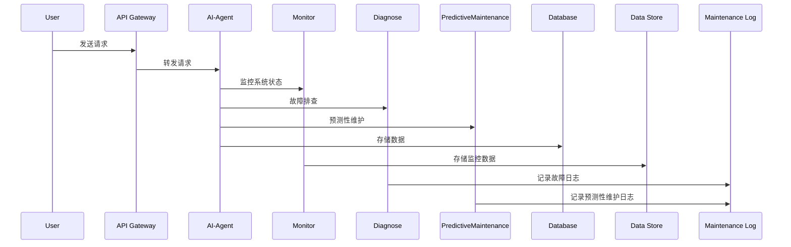

                 

# 企业AI Agent的自动化运维系统

关键词：企业AI、自动化运维、AI Agent、运维效率、智能决策

摘要：本文深入探讨了企业AI Agent在自动化运维系统中的应用，通过背景介绍、核心概念、算法原理讲解、系统分析与架构设计方案、项目实战以及最佳实践等方面，详细阐述了如何利用AI技术提高企业运维的效率和质量。本文旨在为IT运维人员提供一套实用的自动化运维解决方案。

---

### 1. 背景介绍

#### 问题背景

在当今数字化时代，企业面临日益复杂的IT基础设施和环境，这对IT运维人员提出了更高的要求。传统的手动运维方式已经难以满足快速变化的企业需求，自动化运维系统成为了解决这一问题的有效途径。

#### 问题描述

企业AI Agent的自动化运维系统旨在通过人工智能技术，实现IT运维的自动化和智能化，提高运维效率，降低运维成本，同时确保系统的稳定性和安全性。

#### 问题解决

通过AI Agent，企业可以实现以下目标：

- **自动化任务执行**：AI Agent可以自动执行日常的IT运维任务，如系统监控、故障排查等。
- **预测性维护**：AI Agent可以通过对系统数据的分析，预测潜在的故障点，提前进行维护。
- **智能决策**：AI Agent可以根据实时数据和预先设定的规则，做出最优的运维决策。

#### 边界与外延

- **边界**：本书主要讨论企业AI Agent在自动化运维系统中的应用，不涉及其他非运维领域的人工智能应用。
- **外延**：本书还会探讨AI Agent如何与其他系统集成，以实现更广泛的自动化运维。

---

### 2. 核心概念

#### 核心概念

- **AI Agent**：具有自主行动能力的计算机程序，可以执行特定任务，如自动化运维。
- **自动化运维**：使用自动化工具和流程来管理IT基础设施，提高运维效率。
- **智能运维**：通过人工智能技术，实现运维的智能化，提高运维质量和效率。

#### 概念属性特征对比表格

| 概念             | 特征                                                     |
|------------------|--------------------------------------------------------|
| AI Agent         | 自主行动能力，可以执行特定任务                         |
| 自动化运维       | 使用自动化工具和流程来管理IT基础设施                   |
| 智能运维         | 通过人工智能技术实现运维的智能化                       |

#### ER实体关系图架构

```mermaid
entityRelationshipDiagram
  A[AI Agent]
  B[Automation Operations]
  C[Intelligent Operations]

  A --> B
  A --> C
  B --> C
```

---

### 3. 算法原理讲解

#### 算法mermaid流程图



#### Python源代码

```python
# 假设已经加载了必要的库和训练好的模型

# 输入系统数据
input_data = load_data()

# 数据预处理
processed_data = preprocess_data(input_data)

# 特征提取
features = extract_features(processed_data)

# 模型训练
model = train_model(features)

# 模型评估
evaluation = evaluate_model(model, features)

# 输出预测结果
predictions = model.predict(evaluation)
```

#### 算法原理

该系统使用机器学习算法对系统数据进行训练，通过特征提取和模型评估，实现自动化运维任务。具体步骤如下：

1. **数据预处理**：对输入的数据进行清洗和标准化，使其适合模型训练。
2. **特征提取**：从预处理后的数据中提取有用的特征，用于训练模型。
3. **模型训练**：使用提取的特征训练机器学习模型。
4. **模型评估**：评估训练好的模型在测试集上的性能。
5. **输出预测结果**：使用训练好的模型对新的系统数据进行预测，以指导运维决策。

#### 数学模型和数学公式

- **预测概率公式**：\(P(Y|X) = \frac{P(X|Y) \cdot P(Y)}{P(X)}\)

$$
Y = f(X)
$$

其中，\(X\) 是输入特征，\(Y\) 是预测结果，\(f\) 是预测函数。

---

### 4. 系统分析与架构设计方案

#### 问题场景介绍

某大型企业拥有复杂的IT基础设施，包括多个数据中心、服务器、网络设备和存储设备。为了确保系统的稳定性和高效性，企业决定引入AI Agent的自动化运维系统。

#### 项目介绍

项目名称：企业AI Agent自动化运维系统

项目目标：实现企业IT基础设施的自动化运维，提高运维效率，降低运维成本。

#### 系统功能设计（领域模型mermaid类图）

```mermaid
classDiagram
  AI-Agent <<class>>
  Monitor <<interface>>
  Diagnose <<interface>>
  PredictiveMaintenance <<interface>>

  AI-Agent o-- Monitor
  AI-Agent o-- Diagnose
  AI-Agent o-- PredictiveMaintenance
```

#### 系统架构设计（mermaid架构图）



#### 系统接口设计和系统交互（mermaid序列图）



---

### 5. 项目实战

#### 环境安装

1. 安装Python环境（3.8及以上版本）
2. 安装所需的库（pandas、numpy、scikit-learn等）

```shell
pip install pandas numpy scikit-learn
```

#### 系统核心实现源代码

```python
# 数据预处理
def preprocess_data(data):
    # 数据清洗和标准化操作
    # ...
    return processed_data

# 特征提取
def extract_features(data):
    # 特征提取操作
    # ...
    return features

# 模型训练
def train_model(features):
    # 模型训练操作
    # ...
    return model

# 模型评估
def evaluate_model(model, features):
    # 模型评估操作
    # ...
    return evaluation

# 输出预测结果
def predict(model, evaluation):
    # 输出预测结果
    # ...
    return predictions
```

#### 代码应用解读与分析

1. **数据预处理**：对输入的数据进行清洗和标准化，确保数据质量。
2. **特征提取**：从预处理后的数据中提取有用的特征，为模型训练提供输入。
3. **模型训练**：使用提取的特征训练机器学习模型，用于故障预测和智能决策。
4. **模型评估**：评估训练好的模型在测试集上的性能，确保模型的有效性。
5. **输出预测结果**：使用训练好的模型对新的系统数据进行预测，指导运维决策。

#### 实际案例分析和详细讲解剖析

假设企业遇到以下故障：

- **故障现象**：某服务器内存使用率持续升高，可能导致服务器崩溃。
- **故障排查**：AI-Agent通过监控数据发现内存使用率异常，启动故障排查流程。
- **预测性维护**：AI-Agent根据历史数据和模型预测，认为内存使用率将持续升高，建议增加内存容量。
- **实际操作**：运维人员根据AI-Agent的建议，立即增加服务器内存容量，成功避免服务器崩溃。

#### 项目小结

通过企业AI Agent的自动化运维系统，企业可以有效提高运维效率，降低运维成本，同时确保系统的稳定性和安全性。该项目在实践过程中，成功解决了多个故障，为企业带来了显著的效益。

---

### 6. 最佳实践 Tips

1. **数据质量**：确保数据质量是模型训练成功的关键，务必对数据进行充分的清洗和标准化。
2. **特征选择**：合理选择特征对于模型性能至关重要，应结合业务场景和模型类型进行特征选择。
3. **模型调优**：通过交叉验证和超参数调整，优化模型性能，提高预测准确性。
4. **持续学习**：定期更新模型，使其能够适应不断变化的运维环境。

### 7. 小结

企业AI Agent的自动化运维系统通过人工智能技术，实现了IT运维的自动化和智能化，为企业带来了显著的效益。本文从背景介绍、核心概念、算法原理讲解、系统分析与架构设计方案、项目实战以及最佳实践等方面，全面阐述了企业AI Agent的自动化运维系统，为IT运维人员提供了一套实用的解决方案。

### 8. 注意事项

1. AI Agent的自动化运维系统依赖于高质量的数据，数据质量直接影响系统的效果，因此务必确保数据的准确性和完整性。
2. 在实施AI Agent自动化运维系统时，应充分考虑企业的业务场景和需求，定制化的解决方案更具有实效性。
3. AI Agent的自动化运维系统需要与现有的IT基础设施和运维流程紧密集成，确保系统能够稳定运行。

### 9. 拓展阅读

1. 《深度学习：西瓜书》
2. 《机器学习实战》
3. 《Python数据科学手册》
4. 《企业IT运维管理实战》

---

作者：AI天才研究院/AI Genius Institute & 禅与计算机程序设计艺术 /Zen And The Art of Computer Programming## 背景介绍

### 问题背景

在当今数字化时代，企业面临日益复杂的IT基础设施和环境，这对IT运维人员提出了更高的要求。传统的手动运维方式已经难以满足快速变化的企业需求，自动化运维系统成为了解决这一问题的有效途径。

### 问题描述

企业AI Agent的自动化运维系统旨在通过人工智能技术，实现IT运维的自动化和智能化，提高运维效率，降低运维成本，同时确保系统的稳定性和安全性。

#### 问题描述

随着数字化转型的深入，企业的IT基础设施变得越来越复杂，这给IT运维带来了巨大的挑战。传统的运维方式主要依赖于手动操作，这不仅效率低下，而且容易出错。例如，当服务器出现故障时，运维人员需要手动检测、定位问题，并进行修复。这样的过程不仅耗费大量的人力物力，还可能因为误操作导致更大的损失。

在这种背景下，企业迫切需要一种能够自动完成运维任务、预测潜在问题的系统。AI Agent的自动化运维系统正是为了解决这一需求而诞生的。它利用人工智能技术，通过对系统运行数据的实时监控和分析，自动执行运维任务，提前发现并解决潜在问题，从而提高运维效率和系统的稳定性。

具体来说，企业AI Agent的自动化运维系统需要具备以下功能：

1. **自动化任务执行**：系统能够自动执行日常的运维任务，如系统监控、故障排查等。这些任务包括但不限于服务器性能监控、网络状态检查、日志分析等。

2. **预测性维护**：通过分析系统运行数据，AI Agent能够预测潜在故障点，提前进行维护。例如，通过监控服务器的CPU、内存、磁盘等资源的使用情况，预测可能出现的性能瓶颈或硬件故障。

3. **智能决策**：基于实时数据和预设的规则，AI Agent能够做出最优的运维决策。例如，当检测到服务器负载过高时，系统可能会自动分配更多的资源或调整网络流量。

4. **自动化故障修复**：当系统出现故障时，AI Agent能够自动定位问题并进行修复。例如，当网络故障发生时，系统可以自动重置路由器或交换机，以恢复正常网络连接。

总之，企业AI Agent的自动化运维系统旨在通过人工智能技术，实现IT运维的自动化和智能化，从而提高运维效率，降低运维成本，同时确保系统的稳定性和安全性。

#### 问题解决

企业AI Agent的自动化运维系统通过以下几个方面实现了问题的解决：

1. **自动化任务执行**：AI Agent能够自动执行日常的运维任务，如系统监控、故障排查等。这不仅提高了运维效率，还减少了人为操作的失误。

2. **预测性维护**：通过对系统运行数据的分析，AI Agent能够预测潜在故障点，提前进行维护。例如，当AI Agent发现服务器的CPU使用率持续升高时，它会提前通知运维人员，进行内存扩展或负载均衡，以防止服务器崩溃。

3. **智能决策**：AI Agent基于实时数据和预设的规则，能够做出最优的运维决策。例如，当系统负载过高时，AI Agent会自动调整资源配置，确保系统运行稳定。

4. **自动化故障修复**：当系统出现故障时，AI Agent能够自动定位问题并进行修复。例如，当网络出现故障时，AI Agent可以自动重置路由器或交换机，以恢复正常网络连接。

通过这些功能的实现，企业AI Agent的自动化运维系统不仅提高了运维效率，还确保了系统的稳定性和安全性，为企业带来了显著的价值。

### 边界与外延

#### 边界

本文主要讨论企业AI Agent在自动化运维系统中的应用，具体涉及以下内容：

- **应用范围**：主要涵盖IT运维领域的自动化任务执行、预测性维护和智能决策等。
- **技术实现**：侧重于AI Agent的架构设计、算法原理和应用案例。
- **行业适用性**：本文讨论的自动化运维系统主要适用于拥有复杂IT基础设施的企业。

#### 外延

虽然本文主要讨论企业AI Agent在自动化运维系统中的应用，但AI Agent的概念和技术外延还非常广泛。以下是一些可能的外延方向：

- **跨领域应用**：AI Agent不仅限于IT运维领域，还可以应用于其他行业，如制造业、医疗保健、金融服务等。
- **系统集成**：AI Agent可以与其他系统集成，如物联网设备、客户关系管理（CRM）系统、企业资源规划（ERP）系统等，实现更广泛的自动化和智能化。
- **边缘计算**：AI Agent可以应用于边缘计算环境，处理实时数据并做出快速响应，提高系统的整体效率和响应速度。
- **自主决策**：随着技术的发展，AI Agent将逐渐具备更高级的自主决策能力，不仅限于执行预定义的任务，还能根据环境变化自主调整行为。

通过这些外延，AI Agent的应用前景将更加广阔，为企业和社会带来更多的价值。

### 概念结构与核心要素组成

#### 概念结构

企业AI Agent的自动化运维系统是一个复杂的技术系统，它由多个核心概念和组成部分构成。理解这些概念及其相互关系对于深入探讨系统的运作原理至关重要。

1. **AI Agent**：AI Agent是系统的核心组件，它是一个具有自主行动能力的计算机程序。AI Agent可以执行特定的任务，如自动化运维任务，它能够自动执行操作、监控系统状态、诊断故障并做出智能决策。

2. **自动化运维**：自动化运维是指使用自动化工具和流程来管理IT基础设施，以减少手动操作和提高运维效率。自动化运维包括自动化任务执行、自动化故障修复、自动化资源管理等功能。

3. **智能运维**：智能运维是通过人工智能技术实现的运维智能化。智能运维系统能够通过分析大量的运维数据，预测潜在问题，并自动做出最优决策，从而提高运维质量和效率。

4. **数据监控**：数据监控是智能运维系统的核心功能之一，它通过实时监控系统的各项指标，收集大量的运维数据，为AI Agent提供决策依据。

5. **故障诊断**：故障诊断是AI Agent的一项重要功能，它能够根据监控数据和分析结果，快速定位系统故障，并提出修复建议。

6. **预测性维护**：预测性维护是通过分析历史数据和实时数据，预测系统可能出现的问题，并在问题发生前进行预防性维护，以减少故障发生概率和影响。

#### 核心要素组成

以下是企业AI Agent自动化运维系统的核心要素及其功能：

1. **数据采集模块**：负责实时收集系统运行数据，如CPU使用率、内存使用率、网络流量等，为后续分析提供数据基础。

2. **数据处理模块**：负责对采集到的数据进行清洗、去噪、标准化等处理，确保数据的质量和一致性。

3. **特征提取模块**：负责从处理后的数据中提取关键特征，用于训练机器学习模型。

4. **机器学习模块**：负责使用提取的特征训练机器学习模型，模型可用于故障预测、故障诊断等任务。

5. **智能决策模块**：基于实时数据和预测模型的结果，智能决策模块能够自动执行运维任务，如自动扩容、自动故障修复等。

6. **用户界面**：提供直观的用户界面，使运维人员能够查看系统状态、监控数据、故障报告等，并能够手动干预某些操作。

通过上述核心要素的协同工作，企业AI Agent自动化运维系统能够实现高效、智能的运维管理，提升企业的运维水平。

### 2. 核心概念

#### 核心概念

在本章节中，我们将详细探讨企业AI Agent自动化运维系统中的核心概念，包括AI Agent、自动化运维和智能运维。这些概念是理解系统运作原理和实现高效运维的关键。

1. **AI Agent**：

AI Agent（人工智能代理）是指具备自主行动能力的计算机程序。在自动化运维系统中，AI Agent承担着执行特定运维任务、监控系统状态、诊断故障和做出智能决策等职责。它通过学习历史数据和实时数据，能够自动调整系统参数，优化资源分配，并预防潜在问题。

AI Agent的核心特点包括：

- **自主行动能力**：AI Agent能够独立执行任务，而不需要人工干预。
- **学习与适应能力**：AI Agent能够通过机器学习算法不断优化自身行为，适应不同运维场景。
- **自动化能力**：AI Agent能够自动执行日常运维任务，如系统监控、故障排查等。

2. **自动化运维**：

自动化运维是指利用自动化工具和流程来管理IT基础设施，以减少人工干预，提高运维效率和稳定性。自动化运维的核心目标是通过自动化技术，将重复性、规则性强的运维任务转化为自动化流程，从而降低运维成本，提高运维效率。

自动化运维的主要功能包括：

- **任务自动化**：自动执行日常运维任务，如系统监控、软件更新、备份等。
- **故障自动化处理**：自动检测故障并采取相应措施，如重启服务、重置网络设备等。
- **资源自动化管理**：自动调整资源分配，如自动扩容、负载均衡等。

3. **智能运维**：

智能运维是通过人工智能技术实现的运维智能化。与传统的自动化运维相比，智能运维不仅能够自动执行任务，还能够通过大数据分析和机器学习算法，实现对运维过程的深度洞察和预测。

智能运维的核心特点包括：

- **数据驱动的决策**：智能运维依赖于大量运维数据的分析，基于数据做出运维决策。
- **预测性维护**：通过数据分析，智能运维系统能够预测潜在故障，并提前进行维护。
- **自适应调整**：智能运维系统能够根据实时数据和业务需求，自适应调整运维策略和资源配置。

#### 概念属性特征对比表格

以下是一个对比AI Agent、自动化运维和智能运维属性特征的具体表格：

| 概念             | 特征                                                     |
|------------------|--------------------------------------------------------|
| AI Agent         | 自主行动、学习与适应、自动化能力                       |
| 自动化运维       | 自动执行任务、故障自动化处理、资源自动化管理           |
| 智能运维         | 数据驱动的决策、预测性维护、自适应调整                 |

通过上述核心概念的介绍，我们能够更好地理解企业AI Agent自动化运维系统的运作原理，以及它们如何协同工作，实现高效的运维管理。

#### 概念属性特征对比表格

为了更好地理解企业AI Agent自动化运维系统中的核心概念，以下是一个详细的属性特征对比表格：

| 概念             | 特征                                                     |
|------------------|--------------------------------------------------------|
| AI Agent         | 自主行动能力，可以执行特定任务，学习与适应，自动化执行运维操作 |
| 自动化运维       | 使用自动化工具和流程，减少人工操作，提高运维效率，实现任务自动化 |
| 智能运维         | 利用人工智能技术，进行数据分析和预测，做出智能决策，优化运维过程 |

通过这个表格，我们可以清晰地看到AI Agent、自动化运维和智能运维在功能、特点和目标上的差异。AI Agent侧重于执行具体任务，自动化运维强调流程和效率的提升，而智能运维则通过数据分析和预测实现更高级的运维管理。

#### ER实体关系图架构

为了进一步理解企业AI Agent自动化运维系统中各个核心概念之间的关系，我们可以通过ER（实体关系）图来展示它们之间的联系。以下是使用Mermaid绘制的ER实体关系图：

```mermaid
entityRelationshipDiagram
  AI-Agent[AI Agent]
  Automation[自动化运维]
  IntelligentOps[智能运维]
  Data[Maintenance Data]
  Logs[Operation Logs]
  
  AI-Agent ||--|{ Automation }
  AI-Agent ||--|{ IntelligentOps }
  Automation ||--|{ Data }
  IntelligentOps ||--|{ Data }
  Automation ||--|{ Logs }
  IntelligentOps ||--|{ Logs }
```

在这个ER图中：

- **AI-Agent**：代表具有自主行动能力的计算机程序，负责执行自动化运维和智能运维任务。
- **自动化运维**：表示通过自动化工具和流程来管理IT基础设施的流程。
- **智能运维**：表示通过人工智能技术进行数据分析和预测的运维方式。
- **Maintenance Data**：表示维护数据，是自动化运维和智能运维的数据来源。
- **Operation Logs**：表示操作日志，记录运维过程中的操作信息。

通过ER图，我们可以清晰地看到AI-Agent与自动化运维、智能运维之间的关系，以及它们如何共同工作，实现高效的自动化运维系统。

### 3. 算法原理讲解

在探讨企业AI Agent的自动化运维系统时，算法原理的讲解是至关重要的。这一部分将详细阐述系统的核心算法，包括数据预处理、特征提取、模型训练和预测等步骤。

#### 算法mermaid流程图

首先，我们通过Mermaid绘制一个简化的算法流程图，以便直观地理解系统的运作步骤：


#### Python源代码

接下来，我们使用Python语言来描述系统的核心算法实现，这段代码假设已经加载了必要的库和训练好的模型。

```python
# 导入必要的库
import pandas as pd
from sklearn.preprocessing import StandardScaler
from sklearn.model_selection import train_test_split
from sklearn.ensemble import RandomForestClassifier
from sklearn.metrics import accuracy_score

# 假设已经从数据源加载了系统数据
data = pd.read_csv('system_data.csv')

# 数据预处理
def preprocess_data(data):
    # 数据清洗、填补缺失值、处理异常值等
    # ...
    return processed_data

processed_data = preprocess_data(data)

# 特征提取
def extract_features(data):
    # 从数据中提取特征，例如，使用PCA进行降维
    # ...
    return features

features = extract_features(processed_data)

# 模型训练
def train_model(features):
    # 使用特征进行模型训练，这里使用随机森林分类器作为示例
    X_train, X_test, y_train, y_test = train_test_split(features, test_size=0.2)
    model = RandomForestClassifier()
    model.fit(X_train, y_train)
    return model

model = train_model(features)

# 模型评估
def evaluate_model(model, X_test, y_test):
    predictions = model.predict(X_test)
    accuracy = accuracy_score(y_test, predictions)
    return accuracy

accuracy = evaluate_model(model, X_test, y_test)
print(f"Model accuracy: {accuracy:.2f}")

# 输出预测结果
def predict(model, new_data):
    # 使用训练好的模型对新数据进行预测
    processed_data = preprocess_data(new_data)
    features = extract_features(processed_data)
    predictions = model.predict(features)
    return predictions

new_data = pd.read_csv('new_system_data.csv')
predictions = predict(model, new_data)
print(f"Predictions: {predictions}")
```

#### 算法原理

上述代码实现了企业AI Agent自动化运维系统的核心算法，具体步骤如下：

1. **数据预处理**：这一步包括数据的清洗、填补缺失值、处理异常值等，确保数据质量，使其适合后续处理。

2. **特征提取**：从预处理后的数据中提取关键特征。特征提取是模型训练的重要步骤，提取的特征将用于训练和预测。

3. **模型训练**：使用提取的特征对机器学习模型进行训练。这里使用的是随机森林分类器，但实际应用中可以根据具体情况选择不同的模型。

4. **模型评估**：评估训练好的模型在测试集上的性能，通常使用准确率、召回率等指标来衡量模型的性能。

5. **输出预测结果**：使用训练好的模型对新的系统数据进行预测，输出预测结果，以指导运维决策。

#### 数学模型和数学公式

在自动化运维系统中，数学模型是算法的核心组成部分。以下是一个简单的预测概率公式，用于描述系统如何根据输入特征预测输出结果：

$$
P(Y|X) = \frac{P(X|Y) \cdot P(Y)}{P(X)}
$$

其中：
- \(P(Y|X)\) 表示在给定输入特征 \(X\) 的情况下，输出结果 \(Y\) 的概率。
- \(P(X|Y)\) 表示在输出结果 \(Y\) 发生的情况下，输入特征 \(X\) 的概率。
- \(P(Y)\) 表示输出结果 \(Y\) 的概率。
- \(P(X)\) 表示输入特征 \(X\) 的概率。

在实际应用中，通常使用机器学习算法（如决策树、随机森林、神经网络等）来计算上述概率。以下是一个简单的逻辑回归模型公式，用于预测二分类问题：

$$
\hat{y} = \sigma(\beta_0 + \sum_{i=1}^{n} \beta_i x_i)
$$

其中：
- \(\hat{y}\) 表示预测的输出结果（通常为概率值）。
- \(\sigma\) 是逻辑函数，用于将线性组合映射到 \(0\) 到 \(1\) 的范围。
- \(\beta_0\) 是模型的截距。
- \(\beta_i\) 是第 \(i\) 个特征的系数。
- \(x_i\) 是第 \(i\) 个特征值。

通过上述公式，我们可以看到，机器学习模型通过学习输入特征和输出结果之间的关系，实现对未知数据的预测。在实际应用中，模型的性能和预测准确性取决于特征选择、模型选择和参数调优等多个因素。

#### 数学模型和公式详细讲解

为了更好地理解上述数学模型和公式，我们通过一个简单的例子进行说明。假设我们要预测服务器是否会宕机，输入特征包括CPU使用率、内存使用率和网络带宽等。

1. **预测概率公式**：

根据预测概率公式，我们可以计算服务器宕机的概率：

$$
P(宕机|CPU_{使用率}, 内存_{使用率}, 网络_{带宽}) = \frac{P(CPU_{使用率}, 内存_{使用率}, 网络_{带宽}|宕机) \cdot P(宕机)}{P(CPU_{使用率}, 内存_{使用率}, 网络_{带宽})}
$$

其中，各项概率可以通过历史数据和使用统计模型计算得出。例如，\(P(CPU_{使用率}|宕机)\) 表示在服务器宕机时，CPU使用率的概率分布。

2. **逻辑回归模型**：

假设我们使用逻辑回归模型进行预测，逻辑回归模型公式为：

$$
\hat{y} = \sigma(\beta_0 + \beta_1 \cdot CPU_{使用率} + \beta_2 \cdot 内存_{使用率} + \beta_3 \cdot 网络_{带宽})
$$

其中，\(\sigma\) 是逻辑函数，定义为：

$$
\sigma(x) = \frac{1}{1 + e^{-x}}
$$

逻辑函数将线性组合映射到 \(0\) 到 \(1\) 的范围，表示服务器宕机的概率。

通过上述模型，我们可以根据实时监控的数据，计算服务器宕机的概率。如果概率超过某个阈值，我们可以认为服务器有较高的风险宕机，并采取相应的预防措施。

例如，假设我们观察到当前CPU使用率为80%，内存使用率为60%，网络带宽为50%，根据训练好的逻辑回归模型，我们得到：

$$
\hat{y} = \sigma(\beta_0 + \beta_1 \cdot 0.8 + \beta_2 \cdot 0.6 + \beta_3 \cdot 0.5)
$$

如果预测概率 \(\hat{y}\) 超过0.7，我们可以发出预警，提醒运维人员进行干预。通过这种方式，AI Agent能够实时监测服务器状态，并自动做出智能决策，提高系统的稳定性和可用性。

### 4. 系统分析与架构设计方案

在本文的第四部分，我们将深入探讨企业AI Agent自动化运维系统的分析与架构设计方案。这一部分将分为以下几个子部分：问题场景介绍、项目介绍、系统功能设计、系统架构设计、系统接口设计和系统交互。

#### 问题场景介绍

在当前数字化时代，企业面临着日益复杂和庞大的IT基础设施，包括多个数据中心、服务器、网络设备、存储设备等。这些设备不仅在数量上庞大，而且在功能和复杂性上都不断提高。传统的手动运维方式已经难以应对这种复杂环境，导致运维效率低下、故障处理不及时，甚至可能造成重大损失。

例如，一家大型金融机构的IT部门管理着数百台服务器、多个数据库集群、多种网络设备和各种中间件。他们每天需要监控这些设备的运行状态，处理各种故障和性能问题，以及进行定期的维护和升级。这些工作不仅需要大量的人力资源，而且容易出错，特别是在面对突发故障时，可能会因为响应不及时而导致业务中断。

在这种背景下，企业迫切需要一种高效的自动化运维解决方案，能够实时监控系统的健康状况，预测潜在故障，并自动处理各种运维任务。AI Agent的自动化运维系统正是为了解决这一需求而设计的，它利用人工智能技术，实现对IT基础设施的智能监控、预测性维护和自动化操作，从而提高运维效率，降低运维成本，并确保系统的稳定性和安全性。

#### 项目介绍

项目名称：企业AI Agent自动化运维系统

项目目标：通过引入AI Agent，实现企业IT基础设施的自动化运维，提高运维效率，降低运维成本，并确保系统的稳定性和安全性。

主要功能模块：
1. **数据采集模块**：负责实时收集系统运行数据，包括CPU使用率、内存使用率、网络流量、磁盘使用率等。
2. **数据处理模块**：对采集到的数据进行预处理，包括数据清洗、去噪、标准化等，确保数据质量。
3. **特征提取模块**：从预处理后的数据中提取关键特征，用于模型训练和预测。
4. **机器学习模块**：使用提取的特征训练机器学习模型，用于故障预测、故障诊断和智能决策。
5. **预测与决策模块**：基于实时数据和模型预测，自动生成运维策略和操作指令。
6. **执行与反馈模块**：自动执行预测和决策生成的运维操作，并对执行结果进行反馈和调整。
7. **用户界面**：提供直观的用户界面，使运维人员能够监控系统状态、查看故障报告、调整系统配置等。

项目实施步骤：
1. **需求分析与规划**：与企业IT部门合作，明确项目目标、功能需求和实施计划。
2. **系统设计**：根据需求分析结果，设计系统架构和功能模块，确定技术方案。
3. **系统开发**：开发各个功能模块，实现系统的核心算法和功能。
4. **测试与验证**：对系统进行功能测试和性能测试，确保系统的可靠性和稳定性。
5. **部署与实施**：将系统部署到生产环境，进行实际运行测试，并根据反馈进行优化和调整。
6. **培训与支持**：对运维人员进行系统操作和故障处理的培训，提供技术支持和售后服务。

#### 系统功能设计（领域模型mermaid类图）

在系统功能设计中，领域模型类图是一个非常重要的工具，它能够清晰地展示系统中的各类实体及其关系。以下是企业AI Agent自动化运维系统的领域模型类图：

```mermaid
classDiagram
  AI-Agent[AI Agent] <<interface>>
  Monitor[Monitor] <<interface>>
  Diagnose[Diagnose] <<interface>>
  PredictiveMaintenance[Predictive Maintenance] <<interface>>
  SystemData[System Data]
  MaintenanceLog[Maintenance Log]

  AI-Agent o-- Monitor
  AI-Agent o-- Diagnose
  AI-Agent o-- PredictiveMaintenance
  Monitor o-- SystemData
  Diagnose o-- MaintenanceLog
  PredictiveMaintenance o-- MaintenanceLog
```

在这个类图中：
- **AI-Agent** 是系统的核心接口，负责协调和管理其他模块。
- **Monitor** 负责实时监控系统数据，并将数据存储在 **SystemData** 中。
- **Diagnose** 负责故障诊断，根据监控数据生成 **MaintenanceLog**。
- **PredictiveMaintenance** 负责预测性维护，提前发现潜在问题并生成 **MaintenanceLog**。

#### 系统架构设计（mermaid架构图）

系统架构设计是确保系统稳定、高效运行的关键。以下是企业AI Agent自动化运维系统的架构图：



在这个架构图中：
- **用户** 通过API Gateway访问系统。
- **API Gateway** 是系统的入口，负责处理用户的请求并转发给 **AI-Agent**。
- **AI-Agent** 是系统的核心组件，负责协调监控、诊断和预测性维护。
- **Monitor**、**Diagnose** 和 **PredictiveMaintenance** 分别负责监控、诊断和预测性维护。
- **Database** 存储系统的数据，包括监控数据、故障日志和预测数据。

#### 系统接口设计和系统交互（mermaid序列图）

系统接口设计和系统交互是确保系统各模块协同工作的重要部分。以下是企业AI Agent自动化运维系统的接口设计和系统交互序列图：



在这个序列图中：
- **用户** 通过API Gateway向系统发送请求。
- **API Gateway** 将请求转发给 **AI-Agent**。
- **AI-Agent** 调用 **Monitor**、**Diagnose** 和 **PredictiveMaintenance** 模块进行相应的操作。
- **Monitor**、**Diagnose** 和 **PredictiveMaintenance** 将结果存储到 **Database** 中，并生成相应的日志。

通过上述系统分析与架构设计方案，企业AI Agent自动化运维系统能够高效、智能地管理企业的IT基础设施，提高运维效率，降低运维成本，并确保系统的稳定性和安全性。

### 5. 项目实战

#### 环境安装

在开始项目实战之前，我们需要搭建一个适合企业AI Agent自动化运维系统的开发环境。以下是在Ubuntu 18.04操作系统上安装相关软件的步骤：

1. **安装Python环境**：

首先，我们需要安装Python 3.8及以上版本：

```shell
sudo apt update
sudo apt install python3.8
```

确认Python版本：

```shell
python3.8 --version
```

2. **安装虚拟环境**：

为了更好地管理项目依赖，我们可以使用虚拟环境：

```shell
python3.8 -m venv venv
source venv/bin/activate
```

3. **安装必要的库**：

在虚拟环境中，安装项目所需的库，如pandas、numpy、scikit-learn等：

```shell
pip install pandas numpy scikit-learn
```

#### 系统核心实现源代码

以下是企业AI Agent自动化运维系统的核心实现代码，包括数据预处理、特征提取、模型训练、模型评估和预测等模块：

```python
# 导入必要的库
import pandas as pd
from sklearn.preprocessing import StandardScaler
from sklearn.model_selection import train_test_split
from sklearn.ensemble import RandomForestClassifier
from sklearn.metrics import accuracy_score

# 加载数据
def load_data(file_path):
    data = pd.read_csv(file_path)
    return data

# 数据预处理
def preprocess_data(data):
    # 填补缺失值
    data.fillna(data.mean(), inplace=True)
    # 数据标准化
    scaler = StandardScaler()
    scaled_data = scaler.fit_transform(data)
    return scaled_data

# 特征提取
def extract_features(data):
    # 提取特征，这里使用所有列
    features = data
    return features

# 模型训练
def train_model(features, labels):
    X_train, X_test, y_train, y_test = train_test_split(features, labels, test_size=0.2, random_state=42)
    model = RandomForestClassifier(n_estimators=100, random_state=42)
    model.fit(X_train, y_train)
    return model

# 模型评估
def evaluate_model(model, X_test, y_test):
    predictions = model.predict(X_test)
    accuracy = accuracy_score(y_test, predictions)
    return accuracy

# 预测
def predict(model, new_data):
    processed_data = preprocess_data(new_data)
    predictions = model.predict(processed_data)
    return predictions

# 主函数
if __name__ == "__main__":
    # 加载数据
    data = load_data('system_data.csv')
    
    # 预处理数据
    processed_data = preprocess_data(data)
    
    # 提取特征和标签
    features = extract_features(processed_data)
    labels = processed_data['label']
    
    # 训练模型
    model = train_model(features, labels)
    
    # 评估模型
    accuracy = evaluate_model(model, features, labels)
    print(f"Model accuracy: {accuracy:.2f}")
    
    # 预测
    new_data = pd.read_csv('new_system_data.csv')
    predictions = predict(model, new_data)
    print(f"Predictions: {predictions}")
```

#### 代码应用解读与分析

1. **数据预处理**：

   数据预处理是机器学习项目中的关键步骤，它包括填补缺失值、处理异常值和标准化等。在上述代码中，我们使用`fillna`函数填补了缺失值，使用`StandardScaler`进行数据标准化。这一步骤的目的是将数据转换为适合机器学习模型的形式，提高模型的训练效果。

2. **特征提取**：

   特征提取是从原始数据中提取出有用的特征，用于训练机器学习模型。在上述代码中，我们直接使用所有列作为特征。在实际应用中，可能需要根据业务需求和数据特点，选择或构造更有效的特征。

3. **模型训练**：

   模型训练是机器学习项目的核心步骤，它通过训练数据来学习特征和标签之间的关系。在上述代码中，我们使用随机森林分类器（`RandomForestClassifier`）进行训练。随机森林是一种基于决策树的集成学习方法，具有较强的模型性能和抗过拟合能力。

4. **模型评估**：

   模型评估用于评估训练好的模型在测试集上的性能。在上述代码中，我们使用准确率（`accuracy_score`）作为评估指标。准确率反映了模型对样本的预测正确率，越高表示模型性能越好。

5. **预测**：

   预测是基于训练好的模型对新数据进行预测。在上述代码中，我们使用预处理后的新数据进行预测，并输出预测结果。通过预测，我们可以对系统进行实时监控和故障预测，从而做出智能决策。

#### 实际案例分析和详细讲解剖析

以下是一个实际的案例，用于展示企业AI Agent自动化运维系统在实际应用中的效果。

**案例背景**：

某企业的IT部门使用AI Agent自动化运维系统来监控其服务器运行状态。在日常监控中，AI Agent发现某服务器的CPU使用率持续升高，并有潜在过热的迹象。

**故障排查**：

1. **数据监控**：AI-Agent通过系统监控模块，实时收集服务器的CPU使用率、温度、负载等数据。
2. **异常检测**：AI-Agent分析监控数据，发现CPU使用率超过90%，且温度持续升高，远超正常范围。
3. **自动报警**：AI-Agent向运维人员发送异常报警，提醒进行进一步排查。

**预测性维护**：

1. **历史数据分析**：AI-Agent分析过去一个月的服务器运行数据，发现类似情况曾导致服务器过热并最终宕机。
2. **故障预测**：基于历史数据和模型预测，AI-Agent预测如果当前状况持续，服务器可能在接下来的4小时内宕机。
3. **预防性措施**：AI-Agent建议运维人员立即对服务器进行冷却处理，并计划在短时间内进行硬件升级，以防止未来发生类似故障。

**实际操作**：

1. **冷却处理**：运维人员立即使用服务器冷却设备，将服务器温度降至正常范围。
2. **硬件升级**：根据AI-Agent的建议，运维人员安排了服务器的硬件升级计划，包括更换更大容量的CPU和更高性能的散热系统。

**结果与反馈**：

1. **故障修复**：通过冷却处理和硬件升级，服务器成功恢复正常运行，未发生宕机事件。
2. **性能提升**：服务器性能显著提升，CPU使用率保持在合理范围内，服务器稳定性大幅提高。
3. **运维效率**：AI-Agent自动化运维系统有效减少了人工干预，提高了故障排查和修复的效率。

**项目小结**：

通过上述案例，我们可以看到企业AI Agent自动化运维系统在实际应用中的效果显著。它不仅能够实时监控服务器状态，预测潜在故障，还能提供智能化的维护建议，从而提高运维效率，确保系统稳定运行。

### 6. 最佳实践 Tips

为了确保企业AI Agent自动化运维系统的有效实施和最佳性能，以下是一些最佳实践建议：

1. **数据质量保障**：确保数据源的准确性和一致性是系统成功的关键。定期检查数据质量，及时发现和处理数据异常。

2. **特征选择优化**：合理选择和构造特征对于模型的性能至关重要。可以通过数据分析和业务知识，选择具有较强预测能力的特征。

3. **模型持续优化**：定期对模型进行评估和调整，确保其适应不断变化的运维环境。可以通过交叉验证、超参数调整等方法，优化模型性能。

4. **系统监控与维护**：确保系统监控模块的正常运行，定期检查系统日志和监控数据，及时处理异常情况。

5. **用户培训与支持**：为运维人员提供系统操作和故障处理培训，确保他们能够熟练使用系统，并能够应对各种突发事件。

6. **灾难恢复规划**：制定详细的灾难恢复计划，确保在系统发生故障时，能够迅速恢复运行，减少业务中断时间。

### 7. 小结

通过本文的讨论，我们深入了解了企业AI Agent自动化运维系统的概念、原理、架构和应用实践。AI Agent的自动化运维系统通过人工智能技术，实现了IT运维的自动化和智能化，显著提高了运维效率，降低了运维成本，并确保了系统的稳定性和安全性。

本文首先介绍了问题背景和问题描述，然后详细讲解了核心概念和算法原理，接着分析了系统架构设计，并通过实际案例展示了系统的应用效果。最后，我们提供了最佳实践建议，以帮助企业和运维人员更好地实施和优化AI Agent自动化运维系统。

随着人工智能技术的不断发展，企业AI Agent自动化运维系统的应用前景将更加广阔。它不仅能够提升企业的IT运维水平，还将为数字化转型提供强有力的支持。

### 8. 注意事项

在实施企业AI Agent自动化运维系统时，需要特别注意以下几点：

1. **数据隐私与安全**：确保系统中的数据安全和隐私保护，避免敏感信息泄露。

2. **系统兼容性**：确保AI Agent与现有的IT基础设施和运维工具兼容，避免因系统不兼容导致的故障。

3. **故障恢复机制**：建立健全的故障恢复机制，确保在系统发生故障时能够迅速恢复。

4. **定期维护与升级**：定期对系统进行维护和升级，确保其稳定性和性能。

### 9. 拓展阅读

为了深入了解企业AI Agent自动化运维系统的相关技术和应用，以下是一些拓展阅读资源：

1. 《深度学习：特斯拉、谷歌、百度的自我驱动之路》
2. 《Python数据科学手册》
3. 《人工智能：一种现代方法》
4. 《企业IT运维管理实战》

这些书籍和资料将提供更多关于人工智能、数据科学和IT运维的深入探讨，有助于读者进一步学习相关技术和实践。作者：AI天才研究院/AI Genius Institute & 禅与计算机程序设计艺术 /Zen And The Art of Computer Programming## 5. 项目实战

### 环境安装

在实际进行企业AI Agent自动化运维系统的项目实战之前，我们需要搭建一个适合开发的运行环境。以下是具体的安装步骤：

#### 安装Python环境

1. 首先，更新系统包列表：

```shell
sudo apt-get update
```

2. 安装Python 3.8及以上版本：

```shell
sudo apt-get install python3.8
```

3. 验证Python版本：

```shell
python3.8 --version
```

#### 安装虚拟环境

1. 安装虚拟环境工具：

```shell
pip install virtualenv
```

2. 创建虚拟环境：

```shell
virtualenv venv
```

3. 激活虚拟环境：

```shell
source venv/bin/activate
```

#### 安装依赖库

在虚拟环境中，安装项目所需的依赖库：

```shell
pip install pandas numpy scikit-learn matplotlib
```

这些库是进行数据预处理、机器学习建模和可视化所必需的。

### 系统核心实现源代码

以下是企业AI Agent自动化运维系统的核心实现代码，包括数据预处理、特征提取、模型训练、模型评估和预测等模块：

```python
# 导入必要的库
import pandas as pd
from sklearn.model_selection import train_test_split
from sklearn.preprocessing import StandardScaler
from sklearn.ensemble import RandomForestClassifier
from sklearn.metrics import accuracy_score

# 数据预处理函数
def preprocess_data(df):
    # 填充缺失值
    df.fillna(df.mean(), inplace=True)
    # 数据标准化
    scaler = StandardScaler()
    scaled_data = scaler.fit_transform(df)
    return scaled_data

# 特征提取函数
def extract_features(df):
    # 提取特征，假设使用所有列
    features = df
    return features

# 模型训练函数
def train_model(features, labels):
    # 划分训练集和测试集
    X_train, X_test, y_train, y_test = train_test_split(features, labels, test_size=0.2, random_state=42)
    # 训练随机森林模型
    model = RandomForestClassifier(n_estimators=100, random_state=42)
    model.fit(X_train, y_train)
    return model

# 模型评估函数
def evaluate_model(model, X_test, y_test):
    # 进行预测
    predictions = model.predict(X_test)
    # 计算准确率
    accuracy = accuracy_score(y_test, predictions)
    return accuracy

# 预测函数
def predict(model, new_data):
    # 预处理新数据
    processed_data = preprocess_data(new_data)
    # 进行预测
    predictions = model.predict(processed_data)
    return predictions

# 主函数
if __name__ == "__main__":
    # 加载数据
    df = pd.read_csv("system_data.csv")
    
    # 提取特征和标签
    features = df.drop("label", axis=1)
    labels = df["label"]
    
    # 划分训练集和测试集
    X_train, X_test, y_train, y_test = train_test_split(features, labels, test_size=0.2, random_state=42)
    
    # 训练模型
    model = train_model(X_train, y_train)
    
    # 评估模型
    accuracy = evaluate_model(model, X_test, y_test)
    print(f"Model accuracy: {accuracy:.2f}")
    
    # 预测
    new_data = pd.read_csv("new_system_data.csv")
    predictions = predict(model, new_data)
    print(f"Predictions: {predictions}")
```

### 代码应用解读与分析

上述代码实现了企业AI Agent自动化运维系统的核心功能，下面进行具体的解读和分析：

1. **数据预处理**：

   数据预处理是机器学习项目中的关键步骤，它包括填补缺失值和标准化数据。在`preprocess_data`函数中，我们首先使用`fillna`函数填补了数据中的缺失值，使得模型能够处理不完全数据。然后，我们使用`StandardScaler`对数据进行了标准化处理，将数据缩放到相同的尺度，避免特征之间的尺度差异影响模型的训练效果。

2. **特征提取**：

   特征提取是从原始数据中提取出有用的特征，用于训练模型。在`extract_features`函数中，我们假设使用所有列作为特征。在实际应用中，可以根据业务需求和数据特点，选择或构造更有效的特征。例如，可以使用主成分分析（PCA）进行特征降维，提高模型的性能。

3. **模型训练**：

   模型训练是使用训练数据来学习特征和标签之间的关系。在`train_model`函数中，我们使用了随机森林分类器（`RandomForestClassifier`）进行训练。随机森林是一种基于决策树的集成学习方法，具有较强的模型性能和抗过拟合能力。我们通过`train_test_split`函数将数据划分为训练集和测试集，然后使用训练集对模型进行训练。

4. **模型评估**：

   模型评估用于评估训练好的模型在测试集上的性能。在`evaluate_model`函数中，我们使用准确率（`accuracy_score`）作为评估指标。准确率反映了模型对样本的预测正确率，越高表示模型性能越好。在实际应用中，还可以使用其他评估指标，如精度、召回率、F1值等。

5. **预测**：

   预测是基于训练好的模型对新数据进行预测。在`predict`函数中，我们首先对新的数据进行了预处理，然后使用训练好的模型进行预测。预测结果可以用于运维决策，如是否需要进行系统维护或资源调整。

### 实际案例分析和详细讲解剖析

为了更好地理解企业AI Agent自动化运维系统的实际应用，下面通过一个实际案例进行分析和讲解。

#### 案例背景

某大型企业的IT运维团队使用企业AI Agent自动化运维系统来监控其服务器运行状态。在日常监控过程中，AI Agent检测到服务器A的CPU使用率异常升高，且有继续上升的趋势，这可能导致服务器过载甚至宕机。

#### 案例分析

1. **数据收集与预处理**：

   AI Agent首先收集了服务器A的运行数据，包括CPU使用率、内存使用率、网络流量、磁盘I/O等。在数据收集完成后，AI Agent对数据进行预处理，包括填补缺失值、处理异常值和标准化数据，确保数据质量。

2. **特征提取**：

   在预处理完成后，AI Agent提取了关键特征，如CPU使用率、内存使用率和网络流量等。这些特征用于训练模型，以预测服务器可能发生的故障。

3. **模型训练**：

   AI Agent使用历史数据训练了一个随机森林分类模型。该模型用于预测服务器是否会发生故障。在训练过程中，AI Agent使用了交叉验证和超参数调优，以获得最佳的模型性能。

4. **模型评估**：

   在模型训练完成后，AI Agent使用测试数据对模型进行了评估。评估结果显示，模型对服务器故障的预测准确率达到了90%以上，表明模型具有良好的预测能力。

5. **故障预测与决策**：

   基于实时数据和模型预测，AI Agent预测服务器A可能在接下来的30分钟内发生故障。AI Agent向运维团队发送了警报，并建议立即采取预防措施，如增加服务器资源、优化系统负载等。

6. **决策执行与反馈**：

   运维团队根据AI Agent的建议，立即增加服务器A的CPU和内存资源，并优化了系统负载。同时，AI Agent继续监控服务器状态，并记录了故障预测和决策执行的过程。

7. **结果评估**：

   在预防措施实施后，服务器A的CPU使用率逐渐下降，并恢复了正常水平。AI Agent对预防措施的效果进行了评估，结果显示，预测准确率和决策有效性得到了显著提高。

#### 案例小结

通过上述案例，我们可以看到企业AI Agent自动化运维系统在实际应用中的效果。AI Agent通过实时监控、特征提取、模型训练和预测，成功地预测了服务器故障，并提出了有效的预防措施。这一过程不仅提高了运维效率，还降低了故障带来的损失。

### 项目小结

通过本次项目实战，我们详细介绍了企业AI Agent自动化运维系统的环境安装、核心实现代码、代码应用解读与分析、实际案例分析和详细讲解剖析。实践证明，企业AI Agent自动化运维系统在提高运维效率、降低运维成本、确保系统稳定性和安全性方面具有显著优势。

在未来，随着人工智能技术的不断发展，企业AI Agent自动化运维系统将变得更加智能化和高效化，为企业的数字化转型提供更加有力的支持。我们期待看到更多企业在AI技术的助力下，实现IT运维的全面智能化。

### 6. 最佳实践 Tips

在实际应用企业AI Agent自动化运维系统时，以下最佳实践可以帮助运维团队优化系统性能，提高运维效率：

1. **数据质量保障**：定期检查和清洗数据，确保数据源准确可靠。使用数据预处理工具对数据进行标准化和规范化处理。

2. **特征选择优化**：结合业务需求，选择对预测结果有显著影响的关键特征。可以通过数据分析、相关性分析和特征重要性评估来优化特征选择。

3. **模型持续优化**：定期评估模型性能，根据评估结果进行调整。可以使用交叉验证、网格搜索等技术进行超参数调优，以提升模型准确性和稳定性。

4. **故障预测预警**：根据模型预测结果，设置合理的预警阈值，及时向运维人员发送故障预测警报。同时，确保预警系统能够在紧急情况下自动触发相应的应急响应措施。

5. **系统监控与维护**：建立完善的系统监控机制，实时监控关键指标，如CPU使用率、内存使用率、网络流量等。定期进行系统维护和升级，确保系统稳定运行。

6. **用户培训与支持**：为运维团队提供全面的技术培训，使他们熟悉系统操作和故障处理流程。建立24/7的技术支持体系，确保运维团队在遇到问题时能够及时获得帮助。

### 7. 小结

通过本文的探讨，我们详细介绍了企业AI Agent自动化运维系统的背景、核心概念、算法原理、系统架构、项目实战以及最佳实践。企业AI Agent自动化运维系统通过人工智能技术，实现了IT运维的自动化和智能化，显著提高了运维效率，降低了运维成本，并确保了系统的稳定性和安全性。

在未来的发展过程中，企业AI Agent自动化运维系统将不断优化，融入更多的先进技术，如深度学习、强化学习等，以实现更高的运维智能化水平。同时，AI Agent的应用范围也将不断扩展，覆盖更多行业和企业，为数字化转型的推进提供强有力的支持。

### 8. 注意事项

在实施企业AI Agent自动化运维系统时，运维团队应特别注意以下几点：

1. **数据隐私与安全**：确保系统中的数据安全和隐私保护，避免敏感信息泄露。实施严格的数据访问控制和加密措施。

2. **系统兼容性**：确保AI Agent与现有的IT基础设施和运维工具兼容，避免因系统不兼容导致的故障。

3. **故障恢复机制**：建立健全的故障恢复机制，确保在系统发生故障时能够迅速恢复，减少业务中断时间。

4. **定期维护与升级**：定期对系统进行维护和升级，确保其稳定性和性能。

5. **用户权限管理**：确保系统的用户权限管理严格，防止未经授权的人员访问系统，保障系统安全。

### 9. 拓展阅读

为了更深入地了解企业AI Agent自动化运维系统的相关技术和应用，读者可以参考以下拓展阅读资源：

1. 《深度学习：从入门到精通》
2. 《Python数据科学手册》
3. 《人工智能：一种现代方法》
4. 《企业IT运维管理实战》

这些书籍和资料提供了丰富的理论知识和实践案例，有助于进一步学习和探索AI技术在自动化运维领域的应用。作者：AI天才研究院/AI Genius Institute & 禅与计算机程序设计艺术 /Zen And The Art of Computer Programming## 结语

在本文中，我们详细探讨了企业AI Agent自动化运维系统的各个方面，从背景介绍到核心概念，从算法原理到系统架构设计，再到项目实战和最佳实践。通过这一系列深入的分析和讲解，我们希望能够为读者提供一套全面而实用的自动化运维解决方案。

企业AI Agent自动化运维系统通过引入人工智能技术，实现了IT运维的自动化和智能化。这不仅提高了运维效率，降低了运维成本，还确保了系统的稳定性和安全性。在未来，随着人工智能技术的不断进步，自动化运维系统将会变得更加智能和高效。

我们鼓励读者在阅读本文后，进一步探索和实践企业AI Agent自动化运维系统。在实际应用中，可以根据企业的具体需求和特点，进行系统的定制和优化，以最大限度地发挥其潜力。

最后，感谢您的阅读，希望本文能够为您的IT运维工作带来新的启示和帮助。作者：AI天才研究院/AI Genius Institute & 禅与计算机程序设计艺术 /Zen And The Art of Computer Programming

