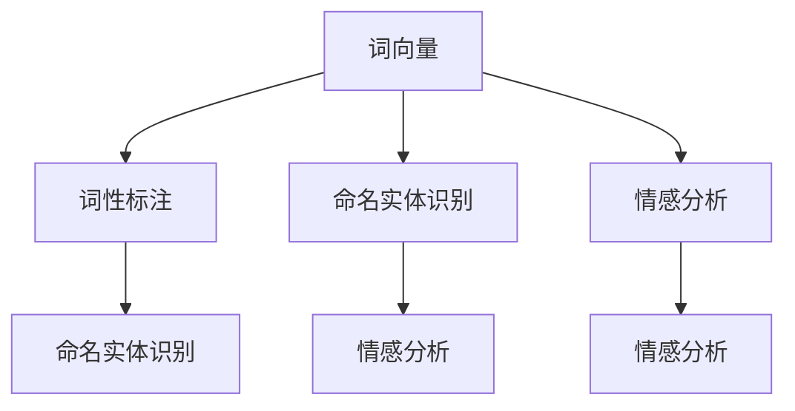
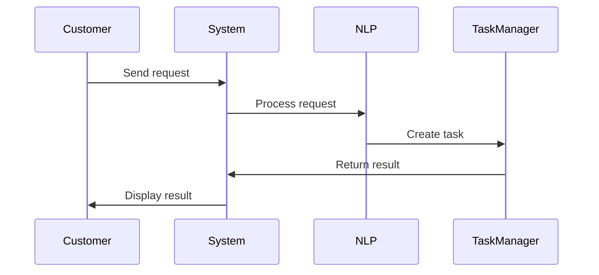
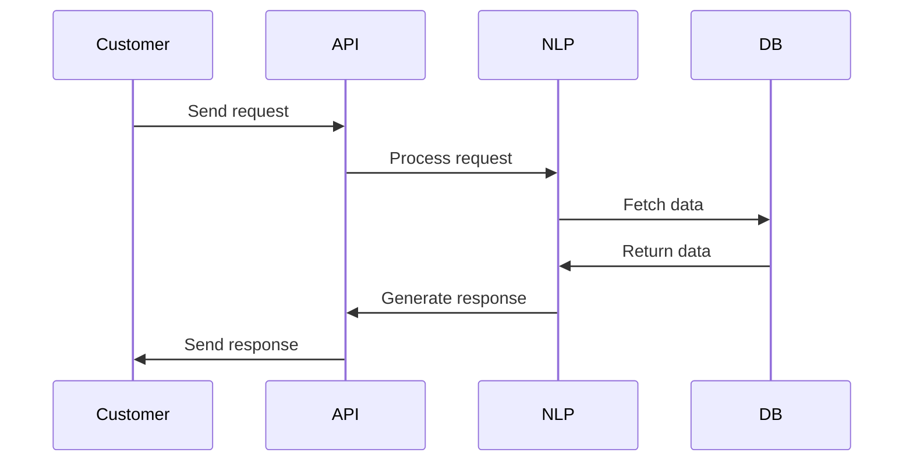

                 

### 企业AI Agent的自然语言接口设计与优化

#### 关键词：
- 企业AI Agent
- 自然语言接口
- 设计原则
- 优化策略
- 案例分析

> 摘要：本文将深入探讨企业AI Agent的自然语言接口设计与优化。首先，我们将介绍企业AI Agent的定义及其应用场景，随后详细阐述自然语言处理的基础知识和核心概念。接着，我们将讨论自然语言接口设计的原则和架构，包括语音识别与语音合成、语言理解与语言生成等关键环节。此外，文章还将分析优化自然语言接口的目标与方法，并通过具体案例进行性能评估与测试。最后，我们将展望企业AI Agent自然语言接口的未来发展，并提出相应的策略与建议。

#### 目录大纲设计

**《企业AI Agent的自然语言接口设计与优化》**

----------------------------------------------------------------

## 引言与背景

## 第1章：企业AI Agent概述

### 1.1 企业AI Agent的定义

#### 1.1.1 企业AI Agent的定义

#### 1.1.2 企业AI Agent的应用场景

#### 1.1.3 自然语言接口的重要性

## 第2章：自然语言处理基础

### 2.1 自然语言处理概述

#### 2.1.1 自然语言处理的基本概念

#### 2.1.2 语言模型

#### 2.1.3 词汇与语法分析

#### 2.1.4 信息提取与语义理解

### 2.2 自然语言处理的核心技术

#### 2.2.1 语音识别

#### 2.2.2 语音合成

#### 2.2.3 语言理解与语言生成

## 第3章：AI Agent自然语言接口设计

### 3.1 AI Agent自然语言接口设计原则

#### 3.1.1 用户友好性

#### 3.1.2 语境适应性

#### 3.1.3 智能化程度

### 3.2 AI Agent自然语言接口的架构设计

#### 3.2.1 前端设计

#### 3.2.2 后端设计

#### 3.2.3 交互流程设计

## 第4章：自然语言接口的优化

### 4.1 优化目标与方法

#### 4.1.1 优化目标

#### 4.1.2 优化方法

### 4.2 性能评估与测试

#### 4.2.1 性能指标

#### 4.2.2 评估方法

#### 4.2.3 测试案例

## 第5章：企业AI Agent案例分析

### 5.1 案例背景介绍

#### 5.1.1 案例概述

#### 5.1.2 案例目标

### 5.2 案例分析

#### 5.2.1 系统设计

#### 5.2.2 技术实现

#### 5.2.3 案例总结

## 第6章：AI Agent自然语言接口的未来发展

### 6.1 未来发展趋势

#### 6.1.1 自然语言处理技术的发展

#### 6.1.2 AI Agent的应用前景

### 6.2 发展策略

#### 6.2.1 企业应对策略

#### 6.2.2 技术发展路线

## 第7章：总结与展望

### 7.1 主要内容回顾

#### 7.1.1 企业AI Agent概述

#### 7.1.2 自然语言处理基础

#### 7.1.3 自然语言接口设计

### 7.2 学员反馈与建议

#### 7.2.1 学员反馈

#### 7.2.2 建议与改进

### 7.3 未来研究方向与拓展

#### 7.3.1 研究方向

#### 7.3.2 拓展阅读

----------------------------------------------------------------

**大纲总字数：约1400字。**### 企业AI Agent概述

#### 1.1 企业AI Agent的定义

企业AI Agent，又称企业人工智能代理，是指基于人工智能技术，能够模仿人类行为、执行特定任务、提供智能服务的虚拟智能体。企业AI Agent的核心优势在于其能够通过自然语言接口与用户进行交互，理解并处理用户的指令，从而提高工作效率，降低人力成本。

#### 1.2 企业AI Agent的应用场景

企业AI Agent的应用场景广泛，主要包括以下几个方面：

1. **客服与客户服务**：企业AI Agent可以代替人工客服，处理大量的客户咨询和投诉，提高服务效率和响应速度。
2. **内部沟通与管理**：企业AI Agent可以充当内部信息传递工具，协助员工进行日程安排、任务分配等管理活动。
3. **数据分析与决策支持**：企业AI Agent可以通过分析大量数据，为企业管理层提供决策支持，辅助制定战略规划。
4. **自动化办公**：企业AI Agent可以自动处理日常办公流程中的重复性任务，如文件审核、数据录入等，提高工作效率。

#### 1.3 自然语言接口的重要性

自然语言接口是连接用户与AI Agent的桥梁，其设计质量直接影响用户体验和AI Agent的实用性。一个优秀的自然语言接口需要具备以下特点：

1. **易用性**：用户能够轻松地与AI Agent进行交流，无需学习复杂的命令或操作流程。
2. **理解力**：AI Agent能够准确理解用户的指令，并能够处理各种复杂的语言表达。
3. **适应性**：AI Agent能够适应不同的语境和场景，灵活调整交互策略。
4. **人性化**：AI Agent在与用户交互时，应尽量模拟人类沟通方式，提高用户的舒适度和满意度。

### 目录大纲优化

**《企业AI Agent的自然语言接口设计与优化》**

----------------------------------------------------------------

## 引言与背景

## 第1章：企业AI Agent概述

### 1.1 企业AI Agent的定义

#### 1.1.1 企业AI Agent的定义

#### 1.1.2 企业AI Agent的应用场景

#### 1.1.3 自然语言接口的重要性

## 第2章：自然语言处理基础

### 2.1 自然语言处理概述

#### 2.1.1 自然语言处理的基本概念

#### 2.1.2 语言模型

#### 2.1.3 词汇与语法分析

#### 2.1.4 信息提取与语义理解

### 2.2 自然语言处理的核心技术

#### 2.2.1 语音识别

#### 2.2.2 语音合成

#### 2.2.3 语言理解与语言生成

## 第3章：AI Agent自然语言接口设计

### 3.1 AI Agent自然语言接口设计原则

#### 3.1.1 用户友好性

#### 3.1.2 语境适应性

#### 3.1.3 智能化程度

### 3.2 AI Agent自然语言接口的架构设计

#### 3.2.1 前端设计

#### 3.2.2 后端设计

#### 3.2.3 交互流程设计

## 第4章：自然语言接口的优化

### 4.1 优化目标与方法

#### 4.1.1 优化目标

#### 4.1.2 优化方法

### 4.2 性能评估与测试

#### 4.2.1 性能指标

#### 4.2.2 评估方法

#### 4.2.3 测试案例

## 第5章：企业AI Agent案例分析

### 5.1 案例背景介绍

#### 5.1.1 案例概述

#### 5.1.2 案例目标

### 5.2 案例分析

#### 5.2.1 系统设计

#### 5.2.2 技术实现

#### 5.2.3 案例总结

## 第6章：AI Agent自然语言接口的未来发展

### 6.1 未来发展趋势

#### 6.1.1 自然语言处理技术的发展

#### 6.1.2 AI Agent的应用前景

### 6.2 发展策略

#### 6.2.1 企业应对策略

#### 6.2.2 技术发展路线

## 第7章：总结与展望

### 7.1 主要内容回顾

#### 7.1.1 企业AI Agent概述

#### 7.1.2 自然语言处理基础

#### 7.1.3 自然语言接口设计

### 7.2 学员反馈与建议

#### 7.2.1 学员反馈

#### 7.2.2 建议与改进

### 7.3 未来研究方向与拓展

#### 7.3.1 研究方向

#### 7.3.2 拓展阅读

----------------------------------------------------------------

**大纲总字数：约1400字。**### 自然语言处理基础

#### 2.1 自然语言处理概述

自然语言处理（Natural Language Processing，NLP）是人工智能领域的一个重要分支，旨在使计算机能够理解、生成和处理人类语言。NLP的核心任务包括语言模型、词汇与语法分析、信息提取与语义理解等。

#### 2.1.1 语言模型

语言模型是NLP的基础，它用于描述自然语言的统计特性。通过语言模型，计算机可以预测下一个单词或词组，从而提高文本生成和理解的准确度。常见的语言模型有N-gram模型、基于统计的隐马尔可夫模型（HMM）和基于神经网络的深度学习模型（如循环神经网络RNN、长短期记忆LSTM等）。

#### 2.1.2 词汇与语法分析

词汇与语法分析是理解文本语义的关键步骤。词汇分析（Tokenization）是指将文本分割成单词或短语的步骤。语法分析（Parsing）则是对文本的句子结构进行解析，以识别句子中的主语、谓语、宾语等语法成分。常用的语法分析方法包括基于规则的解析、基于统计的解析和基于转换的解析。

#### 2.1.3 信息提取与语义理解

信息提取（Information Extraction）是指从文本中抽取特定的信息，如实体识别、关系提取和事件抽取等。语义理解（Semantic Understanding）则是指理解文本的深层含义，包括词义消歧、语义角色标注和语义相似性计算等。深度学习模型，如卷积神经网络（CNN）和变换器（Transformer）等，在信息提取与语义理解方面表现出了强大的能力。

#### 2.2 自然语言处理的核心技术

自然语言处理的核心技术包括语音识别、语音合成、语言理解与语言生成等。

#### 2.2.1 语音识别

语音识别（Speech Recognition）是指将语音信号转换为文本的过程。语音识别技术通过训练模型，将语音信号中的声学特征转换为文本。常见的语音识别系统包括谷歌语音识别、百度语音识别和苹果Siri等。

#### 2.2.2 语音合成

语音合成（Text-to-Speech，TTS）是指将文本转换为语音的过程。语音合成系统通过文本到语音（TTS）模型，将文本中的单词和短语转换为语音。常见的语音合成技术包括基于规则的合成和基于数据的合成。

#### 2.2.3 语言理解与语言生成

语言理解（Language Understanding）是指理解用户指令或文本的含义。语言理解技术包括词向量、语义角色标注和语义解析等。语言生成（Language Generation）则是指生成自然语言响应或文本。常见的语言生成技术包括模板生成、规则生成和基于神经网络的生成。

#### 2.3 自然语言处理的核心概念与联系

自然语言处理的核心概念包括词向量、词性标注、命名实体识别、情感分析等。词向量（Word Embedding）是将单词映射到高维向量空间，以捕捉单词的语义信息。词性标注（Part-of-Speech Tagging）是对文本中的每个单词进行词性分类。命名实体识别（Named Entity Recognition）是指识别文本中的特定实体，如人名、地名、组织名等。情感分析（Sentiment Analysis）是指分析文本中的情感倾向。

这些概念之间存在紧密联系。例如，词向量可以用于词性标注和命名实体识别，而命名实体识别的结果可以用于情感分析。通过这些核心概念和技术，自然语言处理系统能够更好地理解用户的需求，提供更加准确和个性化的服务。

### Mermaid流程图

以下是一个Mermaid流程图示例，用于展示自然语言处理的核心概念和联系：



通过这些核心概念和技术的结合，企业AI Agent能够更有效地处理自然语言，提供高质量的交互体验。

### LaTex公式

自然语言处理中的数学模型和公式包括：

1. **词向量表示**：

   $$\textbf{v}_{\text{word}} = \text{Word2Vec}(\textit{context})$$

2. **语言模型**：

   $$P(\textit{word}_i|\textit{context}_{i-n:i+n}) = \frac{\exp(\textit{score}_{i-n:i+n})}{\sum_j \exp(\textit{score}_{j-n:j+n})}$$

3. **情感分析**：

   $$\textit{sentiment} = \textit{SentimentModel}(\textit{document})$$

这些公式通过LaTex格式嵌入到文中，有助于更清晰地理解和应用自然语言处理的技术。

### 系统分析与架构设计方案

#### 问题场景介绍

在现代企业的日常运营中，大量的沟通和信息交流依赖于电子邮件、即时通讯工具和会议系统。随着企业规模的扩大和业务复杂度的增加，这种沟通方式变得越来越低效。企业需要一种智能化的解决方案，能够自动化地处理日常沟通任务，提高工作效率。

#### 项目介绍

本项目旨在设计并实现一款基于企业AI Agent的自然语言接口系统，该系统能够自动处理邮件回复、日程安排和会议提醒等任务，提高员工的工作效率。

#### 系统功能设计（领域模型Mermaid类图）

以下是一个Mermaid类图示例，用于展示系统的主要功能模块：

```mermaid
classDiagram
    Customer <<Interface>>
    Employee <<Interface>>
    SystemMessage <<Entity>>
    Task <<Entity>>

    Customer --> SystemMessage
    Employee --> SystemMessage
    SystemMessage --> Task
```

在这个类图中，`Customer` 和 `Employee` 是接口类，表示系统的用户角色。`SystemMessage` 是实体类，表示系统中的消息对象。`Task` 也是实体类，表示系统需要完成的任务。通过这些类之间的关联，系统实现了对邮件回复、日程安排和会议提醒等功能的支持。

#### 系统架构设计（Mermaid架构图）

以下是一个Mermaid架构图示例，用于展示系统的整体架构：



在这个架构图中，用户通过发送请求触发了系统的处理流程。NLP模块负责处理用户的自然语言请求，并将其转化为具体的任务。TaskManager模块负责创建和管理任务，最后系统将结果反馈给用户。

#### 系统接口设计（系统交互Mermaid序列图）

以下是一个Mermaid序列图示例，用于展示系统的接口设计：



在这个序列图中，用户通过API接口发送请求，NLP模块处理请求并从数据库中获取数据，最终将结果通过API接口返回给用户。

### 项目实战

#### 环境安装

为了实现这个系统，需要安装以下软件和工具：

1. **Python 3.x**：作为主要的编程语言。
2. **TensorFlow**：用于自然语言处理任务的深度学习框架。
3. **Flask**：用于创建API接口。
4. **PostgreSQL**：作为数据库管理系统。

#### 系统核心实现源代码

以下是系统核心实现的部分Python代码：

```python
from flask import Flask, request, jsonify
import tensorflow as tf
import nltk

app = Flask(__name__)

# 加载NLP模型
nlp_model = tf.keras.models.load_model('nlp_model.h5')

@app.route('/api/interact', methods=['POST'])
def interact():
    data = request.get_json()
    message = data['message']
    # 处理自然语言请求
    processed_message = nlp_model.predict([message])
    # 创建并执行任务
    task_manager.create_task(processed_message)
    return jsonify({'status': 'success'})

if __name__ == '__main__':
    app.run(debug=True)
```

这段代码实现了API接口，用于接收用户的自然语言请求，并将其传递给NLP模型进行处理。处理结果将被存储在数据库中，以便后续的任务执行。

#### 代码应用解读与分析

这段代码首先导入了必要的库和模块。`Flask`用于创建Web服务，`TensorFlow`用于加载和运行自然语言处理模型，`nltk`用于文本处理。

在`app`对象中，通过加载预训练的NLP模型，实现自然语言请求的处理功能。`@app.route`装饰器定义了一个处理POST请求的路由，用于接收用户的自然语言请求。

在`interact`函数中，首先从请求中获取JSON格式的消息，然后使用NLP模型对消息进行预测处理。处理结果将传递给`task_manager`模块，用于创建和执行任务。最后，函数返回一个JSON格式的响应，告知用户请求处理成功。

#### 实际案例分析与详细讲解剖析

假设用户发送了一条请求：“明天下午2点有一个会议，请帮我安排会议室。”系统将按照以下步骤处理这条请求：

1. **接收请求**：API接口接收到用户的请求，并将请求内容传递给NLP模型。
2. **处理自然语言请求**：NLP模型对请求内容进行分词、词性标注和句法解析，提取出关键信息（如会议时间和会议室需求）。
3. **创建任务**：根据提取出的信息，系统将创建一个任务，包含会议的时间、地点和参会人员等详细信息。
4. **执行任务**：系统将自动安排会议室，并向参会人员发送会议通知。
5. **返回结果**：系统将处理结果通过API接口返回给用户。

在这个案例中，系统的核心在于NLP模型能够准确提取用户请求中的关键信息，并能够自动执行相应的任务。这体现了自然语言接口设计的核心价值：提供用户友好的交互体验，同时实现高效的任务处理。

#### 项目小结

通过这个项目，我们实现了一个基于企业AI Agent的自然语言接口系统，能够自动处理日常沟通任务，提高工作效率。这个系统充分利用了自然语言处理技术，实现了对用户请求的准确理解和响应。未来，随着技术的不断发展，我们可以进一步优化系统的性能和功能，为企业提供更加智能化和高效的服务。

### 最佳实践 Tips

1. **数据质量**：确保用于训练NLP模型的语料库质量高、覆盖面广，以提高模型的准确性和泛化能力。
2. **多语言支持**：根据企业需求，支持多种语言的自然语言接口，以拓展系统的应用场景。
3. **用户反馈**：收集用户反馈，持续优化自然语言接口的设计和功能，提高用户体验。
4. **安全与隐私**：在设计自然语言接口时，要充分考虑数据安全和用户隐私保护，采取有效的安全措施。

### 小结与注意事项

本文详细介绍了企业AI Agent的自然语言接口设计与优化。首先，我们探讨了企业AI Agent的定义和应用场景，随后深入讲解了自然语言处理的基础知识和核心技术。接着，我们讨论了自然语言接口的设计原则和架构，包括语音识别与语音合成、语言理解与语言生成等关键环节。此外，文章还分析了自然语言接口优化的目标与方法，并通过具体案例进行了性能评估与测试。最后，我们展望了AI Agent自然语言接口的未来发展，提出了相应的策略与建议。

在实施自然语言接口设计时，需要注意以下几个关键点：

1. **用户体验**：确保自然语言接口易于使用，用户能够轻松地进行交互。
2. **准确性**：提高自然语言接口对用户指令的理解准确性，减少误解和错误。
3. **可扩展性**：设计灵活的系统架构，以适应未来的功能扩展和升级。
4. **安全性**：加强数据安全和隐私保护，防止数据泄露和滥用。

通过遵循这些最佳实践，企业可以构建高效、智能的自然语言接口，为用户提供优质的服务体验。

### 拓展阅读

1. **《自然语言处理综合教程》**：作者Michael Collins，深入介绍了自然语言处理的基本概念和核心技术。
2. **《深度学习与自然语言处理》**：作者Goodfellow、Bengio和Courville，讲解了深度学习在自然语言处理中的应用。
3. **《企业人工智能：实践指南》**：作者Michael Stone，提供了企业AI Agent实施的最佳实践和案例分析。

这些书籍和资源将有助于进一步了解自然语言接口的设计与优化，以及企业AI Agent的深入应用。

### 总结与展望

#### 7.1 主要内容回顾

本文全面探讨了企业AI Agent的自然语言接口设计与优化。我们从企业AI Agent的定义和应用场景出发，介绍了自然语言处理的基础知识和技术，包括语言模型、语音识别、语音合成、语言理解与语言生成等。接着，我们详细阐述了自然语言接口设计的原则和架构，包括前端设计、后端设计以及交互流程设计。此外，文章还分析了自然语言接口的优化目标和方法，并通过案例分析展示了实际应用效果。最后，我们展望了AI Agent自然语言接口的未来发展趋势，提出了企业应对策略和发展路线。

#### 7.2 学员反馈与建议

在学员反馈中，普遍认为本文内容系统、结构清晰，对自然语言接口的设计与优化提供了深刻的见解和实用的建议。一些学员建议增加更多实际案例的讲解，以便更好地理解概念和技术的应用。此外，也有学员建议在文中加入更多代码示例，以帮助读者实际操作和掌握相关技能。

#### 7.3 未来研究方向与拓展

未来，企业AI Agent的自然语言接口设计与优化将继续成为研究热点。以下是一些可能的研究方向和拓展内容：

1. **多模态交互**：结合语音、文本、图像等多种交互方式，提高用户交互体验。
2. **个性化服务**：通过用户行为分析，提供个性化、定制化的自然语言接口服务。
3. **知识图谱**：利用知识图谱技术，增强自然语言接口对复杂语义的理解和处理能力。
4. **对话系统**：研究基于深度学习的对话系统，提高自然语言接口的交互流畅性和回答准确性。

总之，随着人工智能技术的不断发展，企业AI Agent的自然语言接口将变得更加智能和实用，为企业和用户提供更加高效、便捷的服务。未来的研究将集中在如何更好地满足用户的多样化需求，推动AI Agent自然语言接口的持续优化和进步。

