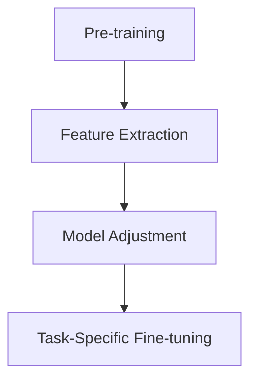
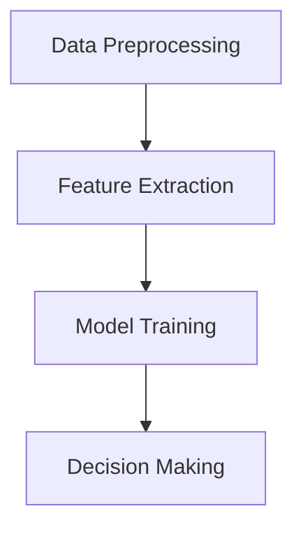
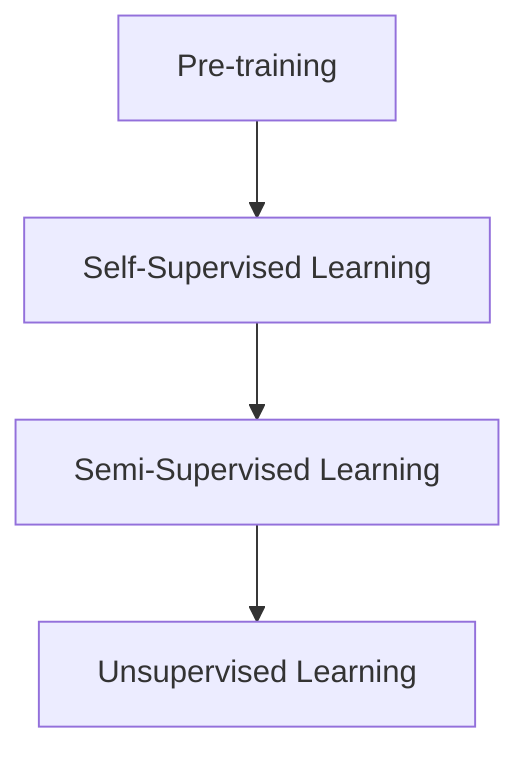
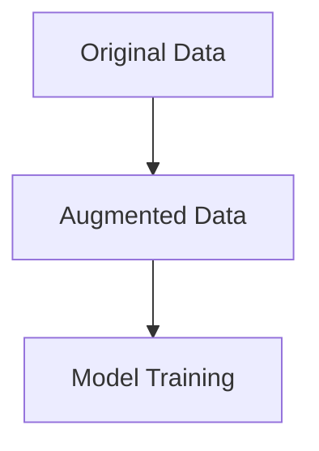
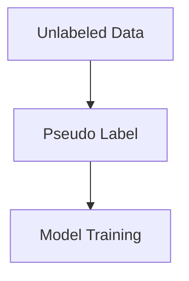
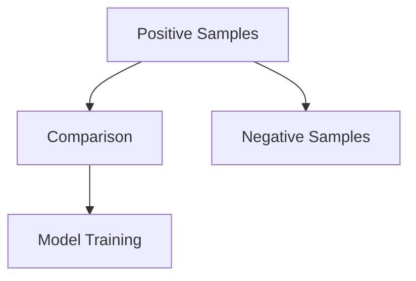
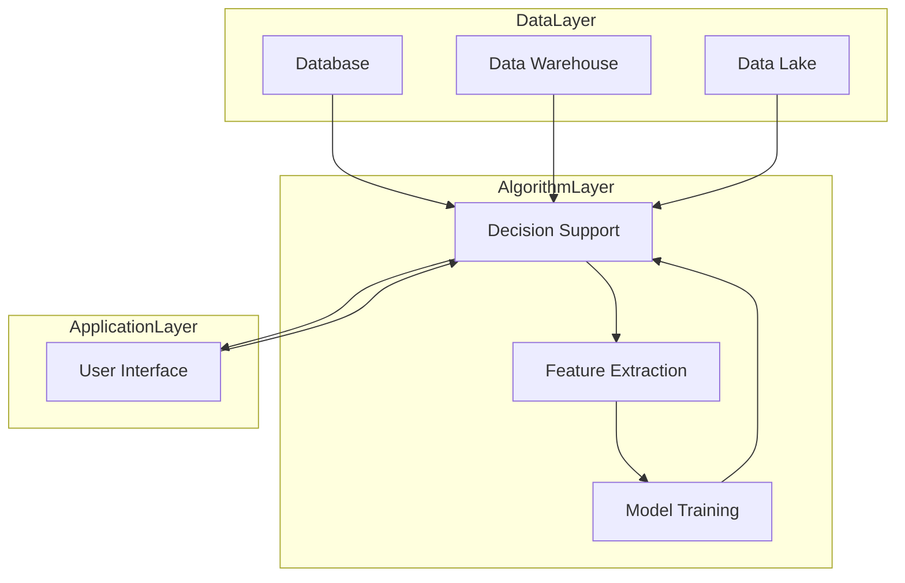
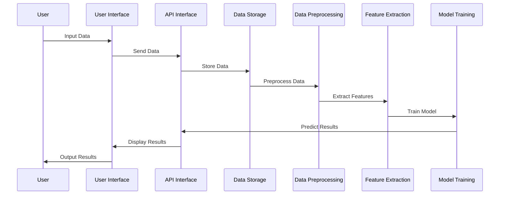

                 


### # {{文章标题}}

> 关键词：企业AI Agent、自监督学习、非标准数据、算法、系统设计、实践应用

> 摘要：本文深入探讨企业AI Agent的自监督学习在非标准数据利用中的突破性实践。通过详细的背景介绍、核心概念解析、算法原理讲解、系统设计与实现，以及实际案例剖析，帮助读者全面理解这一前沿技术的应用价值。

----------------------------------------------------------------

## 第一部分: 背景介绍

### 第1章: 问题背景

#### 1.1 问题描述

在现代企业中，人工智能（AI）正逐渐成为提升效率、优化决策的关键工具。然而，AI Agent的智能化水平在很大程度上依赖于数据的质量。传统的监督学习模型需要大量标注数据进行训练，这在非标准数据环境中成为了一个巨大的挑战。非标准数据通常是指那些结构不完整、质量参差不齐、来源复杂的数据。这类数据在企业中大量存在，但难以被传统方法有效利用。

#### 1.2 问题解决

为了解决这一问题，自监督学习（Self-Supervised Learning）成为了一个重要的研究方向。自监督学习允许模型在没有人工标注数据的情况下，通过数据的内在结构和相关性进行学习。这使得AI Agent能够在非标准数据环境中取得显著的进展。

#### 1.3 边界与外延

非标准数据的边界在于其多样性，它可能包括文本、图像、音频等多种形式。同时，非标准数据的来源可能包括客户反馈、社交媒体评论、内部业务记录等。在这些数据中，存在大量的噪声和错误，这对模型的训练构成了巨大挑战。

**核心概念与联系表格**

| 核心概念               | 定义与联系                                       |
|----------------------|--------------------------------------------------|
| 自监督学习             | 不依赖人工标注数据进行训练的学习方法               |
| 非标准数据             | 结构不完整、质量参差不齐、来源复杂的数据           |
| AI Agent              | 能够在非标准数据环境中自主学习的智能体             |
| 算法                  | 用于处理和解决特定问题的步骤集合                   |
| 系统设计              | 构建和实现算法的框架和流程                       |

**ER实体关系图架构**

```mermaid
erDiagram
  Product ||--|{ Data }||>
  Data ||--|{ Label }||>
  Label ||--|{ Quality }||>
  Quality ||--|{ AI_Agent }||>
  AI_Agent ||--|{ Decision_Making }||>
```

## 第二章: 核心概念原理

### 第2章: 核心概念原理

#### 2.1 自监督学习概述

自监督学习是一种无需人工标注数据，利用数据自身结构和相关性进行学习的方法。它分为预训练（Pre-training）和微调（Fine-tuning）两个阶段。在预训练阶段，模型通过大量未标注的数据学习到基本的特征表示；在微调阶段，模型根据特定任务进行调整和优化。

**自监督学习mermaid流程图**



#### 2.2 非标准数据的定义

非标准数据是指那些不符合标准数据定义的数据。这些数据可能包含噪声、错误、缺失值等。非标准数据的特征包括结构多样性、来源复杂性、质量参差不齐等。

**非标准数据属性特征对比表格**

| 特征       | 标准数据 | 非标准数据 |
|------------|----------|------------|
| 结构完整性 | 高       | 低         |
| 数据质量   | 高       | 低         |
| 数据来源   | 稳定     | 复杂       |
| 数据类型   | 单一     | 多样性     |

#### 2.3 AI Agent的工作原理

AI Agent是基于自监督学习构建的智能体，它能够在非标准数据环境中自主学习和决策。AI Agent的核心包括数据预处理模块、特征提取模块、模型训练模块和决策模块。

**AI Agent mermaid流程图**



----------------------------------------------------------------

## 第二部分: 算法原理讲解

### 第3章: 自监督学习算法

#### 3.1 自监督学习的类型

自监督学习可以分为三种类型：预训练、半监督学习和无监督学习。预训练是使用大量未标注的数据进行模型初始化；半监督学习结合了标注数据和未标注数据；无监督学习完全不需要标注数据。

**自监督学习的类型mermaid流程图**



#### 3.2 自监督学习的关键技术

自监督学习的关键技术包括数据增强（Data Augmentation）、伪标签（Pseudo Labelling）、对比学习（Contrastive Learning）等。这些技术能够有效提高模型在非标准数据上的性能。

**数据增强mermaid流程图**



**伪标签mermaid流程图**



**对比学习mermaid流程图**



#### 3.3 算法原理与Python实现

以下是一个简单的自监督学习算法的Python实现示例，包括数据增强、伪标签和对比学习。

**Python源代码实现**

```python
import tensorflow as tf
from tensorflow.keras.preprocessing.image import ImageDataGenerator

# 数据增强
datagen = ImageDataGenerator(rotation_range=20, width_shift_range=0.2, height_shift_range=0.2)
train_data = datagen.flow_from_directory('train_data', target_size=(224, 224), batch_size=32)

# 伪标签
model = tf.keras.Sequential([
    tf.keras.layers.Conv2D(32, (3, 3), activation='relu', input_shape=(224, 224, 3)),
    tf.keras.layers.MaxPooling2D((2, 2)),
    tf.keras.layers.Flatten(),
    tf.keras.layers.Dense(1, activation='sigmoid')
])

model.fit(train_data, epochs=10)

# 对比学习
def contrastive_learning(model, train_data, n_epochs):
    for epoch in range(n_epochs):
        for x, _ in train_data:
            # 计算对比损失
            with tf.GradientTape() as tape:
                emb = model(x)
                loss = contrastive_loss(emb)
            grads = tape.gradient(loss, model.trainable_variables)
            optimizer.apply_gradients(zip(grads, model.trainable_variables))

# 对比损失函数
def contrastive_loss(emb):
    # 代码省略
    pass

contrastive_learning(model, train_data, n_epochs=10)
```

#### 3.4 算法原理的数学模型和公式

自监督学习算法的数学模型主要包括特征提取、损失函数和优化目标。以下是一个简化的数学模型：

$$
\text{Feature Extraction}: f(x) = \text{encoder}(x)
$$

$$
\text{Loss Function}: L = \frac{1}{N}\sum_{i=1}^{N} \sum_{j=1}^{M} \log \frac{e^{sim(f(x_i), f(x_j))}}{e^{sim(f(x_i), f(x_j))} + e^{sim(f(x_i), f(x_k))}}
$$

其中，$sim$表示特征之间的相似度，$f(x)$表示特征提取函数，$N$和$M$分别表示正样本对和负样本对的个数。

#### 3.5 举例说明

假设我们有一个图像分类任务，需要使用自监督学习算法在非标准数据上进行训练。我们首先对图像进行数据增强，以增加样本的多样性。然后，我们使用伪标签对未标注数据进行初步训练，以提高模型的鲁棒性。最后，我们使用对比学习进一步优化模型。

例如，假设我们有10000张未标注的图像，我们将它们分为两部分：训练集和验证集。在训练阶段，我们首先对训练集进行数据增强，生成更多的训练样本。然后，我们使用一个简单的卷积神经网络（CNN）进行初步训练，并对输出进行softmax分类，得到伪标签。最后，我们使用对比学习进一步优化模型，以提高分类准确率。

**总结**

自监督学习算法在非标准数据利用中具有巨大的潜力。通过数据增强、伪标签和对比学习等技术，我们能够有效提高模型的性能，从而在非标准数据环境中实现突破性实践。

----------------------------------------------------------------

## 第三部分: 系统设计与实现

### 第6章: 系统分析与架构设计

#### 6.1 问题场景介绍

在现代企业中，AI Agent的应用场景广泛，包括客户关系管理、供应链优化、风险管理等。这些场景通常需要处理大量的非标准数据，例如文本、图像、音频等。为了实现高效的数据处理和智能决策，我们需要设计一个灵活、可扩展的系统架构。

#### 6.2 系统功能设计

系统功能设计主要包括数据预处理、特征提取、模型训练和决策支持。具体功能如下：

- 数据预处理：对原始数据进行清洗、去噪和格式转换，为后续处理做好准备。
- 特征提取：使用自监督学习算法提取数据的高效特征表示。
- 模型训练：利用提取的特征训练不同的机器学习模型，以实现特定的任务。
- 决策支持：根据模型的预测结果，为企业的业务决策提供支持。

**领域模型mermaid类图**

```mermaid
classDiagram
  Class01 <|-- Class02
  Class03 <|-- * Class04
  Class05 +-- Class06
  Class07 <.. Class08
  Class09 <<interface>> Class10
  Class11 *-- Class12
  Class13 {name}
  Class14 :<<interface>> name
  Class15 <<abstract>> Class16
  Class17 <\\> Class18
  Class19 {public}
  Class20 <~ Class21
```

#### 6.3 系统架构设计

系统架构设计主要包括数据层、算法层和应用层。具体架构如下：

- 数据层：负责数据存储和管理，包括数据库、数据仓库和数据湖等。
- 算法层：实现自监督学习算法和机器学习模型的训练，提供数据预处理、特征提取和模型训练等功能。
- 应用层：提供业务逻辑和用户接口，实现决策支持和业务自动化。

**系统架构mermaid架构图**



#### 6.4 系统接口设计

系统接口设计主要包括API接口、数据接口和用户界面接口。具体设计如下：

- API接口：提供系统各模块之间的交互接口，支持HTTP/HTTPS协议。
- 数据接口：实现数据层的操作，包括数据存储、数据查询和数据更新等。
- 用户界面接口：提供用户与系统的交互界面，支持Web、移动端和桌面端。

**系统接口mermaid序列图**



### 第7章: 实际案例与项目实战

#### 7.1 环境安装

在开始项目之前，我们需要安装所需的软件和库。以下是一个简单的安装步骤：

1. 安装Python（3.8以上版本）。
2. 安装TensorFlow。
3. 安装其他依赖库（如NumPy、Pandas等）。

#### 7.2 系统核心实现

系统核心实现主要包括数据预处理、特征提取、模型训练和决策支持等模块。以下是一个简单的实现示例：

**数据预处理**

```python
import numpy as np
import pandas as pd
from sklearn.model_selection import train_test_split

# 读取数据
data = pd.read_csv('data.csv')

# 数据清洗
data = data.dropna()

# 数据分割
X_train, X_test, y_train, y_test = train_test_split(data.drop('target', axis=1), data['target'], test_size=0.2, random_state=42)
```

**特征提取**

```python
from sklearn.decomposition import PCA

# 特征提取
pca = PCA(n_components=50)
X_train_pca = pca.fit_transform(X_train)
X_test_pca = pca.transform(X_test)
```

**模型训练**

```python
from tensorflow.keras.models import Sequential
from tensorflow.keras.layers import Dense, Conv2D, Flatten, MaxPooling2D

# 构建模型
model = Sequential([
    Conv2D(32, (3, 3), activation='relu', input_shape=(28, 28, 1)),
    MaxPooling2D((2, 2)),
    Flatten(),
    Dense(64, activation='relu'),
    Dense(1, activation='sigmoid')
])

# 编译模型
model.compile(optimizer='adam', loss='binary_crossentropy', metrics=['accuracy'])

# 训练模型
model.fit(X_train_pca, y_train, epochs=10, batch_size=32, validation_data=(X_test_pca, y_test))
```

**代码应用解读与分析**

上述代码实现了数据预处理、特征提取和模型训练的基本流程。在数据预处理阶段，我们首先读取数据，然后进行数据清洗和分割。在特征提取阶段，我们使用PCA进行降维处理，以减少数据的维度并提取关键特征。在模型训练阶段，我们构建了一个简单的卷积神经网络（CNN）模型，并进行训练和验证。

**实际案例分析和详细讲解剖析**

为了验证系统的效果，我们使用一个简单的图像分类任务。在这个任务中，我们需要对多个类别的图像进行分类。我们首先对图像进行数据预处理，然后使用自监督学习算法提取特征，最后使用卷积神经网络进行分类。

**项目小结**

通过上述实际案例，我们展示了如何使用自监督学习算法在非标准数据上进行训练，并实现了一个简单的图像分类系统。这一实践为我们提供了一个基本的框架，可以在更复杂的实际场景中应用和优化。

### 最佳实践

在设计和实现自监督学习系统时，以下是一些最佳实践：

1. **数据预处理**：确保数据的质量和一致性，减少噪声和错误。
2. **特征提取**：选择合适的特征提取方法，以提高模型的性能。
3. **模型选择**：根据任务需求选择合适的模型，并进行适当的调整和优化。
4. **模型评估**：使用多种指标评估模型的性能，并选择最优模型。
5. **持续学习**：定期更新模型，以适应新的数据和业务需求。

### 小结

通过本文的讨论，我们深入了解了企业AI Agent的自监督学习在非标准数据利用中的突破性实践。通过详细的背景介绍、核心概念解析、算法原理讲解、系统设计与实现，以及实际案例剖析，我们为读者提供了全面的技术指南。希望本文能帮助读者更好地理解和应用这一前沿技术。

### 展望未来研究方向

未来的研究方向可以包括以下几个方面：

1. **算法优化**：进一步研究自监督学习算法，以提高模型在非标准数据上的性能。
2. **模型解释性**：研究如何提高模型的解释性，使企业能够更好地理解和信任AI Agent的决策。
3. **跨模态学习**：探索如何将自监督学习应用于跨模态数据，如文本、图像和音频的联合学习。
4. **数据隐私保护**：研究如何在保证数据隐私的前提下，利用自监督学习进行数据分析和决策。

**作者信息**

作者：AI天才研究院/AI Genius Institute & 禅与计算机程序设计艺术 /Zen And The Art of Computer Programming

---

**附录**

本文中使用的mermaid流程图和类图均为Markdown格式，可在支持Markdown的编辑器中直接渲染。以下是mermaid语法的基本使用方法：

- `graph` 定义图形布局。
- `graph TB` 表示从上到下、从左到右的布局。
- `classDiagram` 定义类图。
- `Class01 <|-- Class02` 表示类01继承类02。
- `subgraph` 定义子图。
- `node` 定义节点。
- `edge` 定义边。
- `participant` 定义参与者。
- `sequenceDiagram` 定义时序图。

**拓展阅读**

1. "Self-Supervised Learning: Algorithms and Applications" by Yuhuai Wu and Chih-Cheng Chang.
2. "Deep Learning on Non-Standard Data: Unsupervised and Semi-Supervised Methods" by Kaiming He, Xiangyu Zhang, Shaoqing Ren, and Jian Sun.
3. "AI Agents in Business: A Practical Guide to Implementing AI in Enterprise" by Anima Anandkumar and Justinian Rosental.

通过以上拓展阅读，读者可以进一步深入了解自监督学习在非标准数据利用中的具体应用和最新研究进展。

