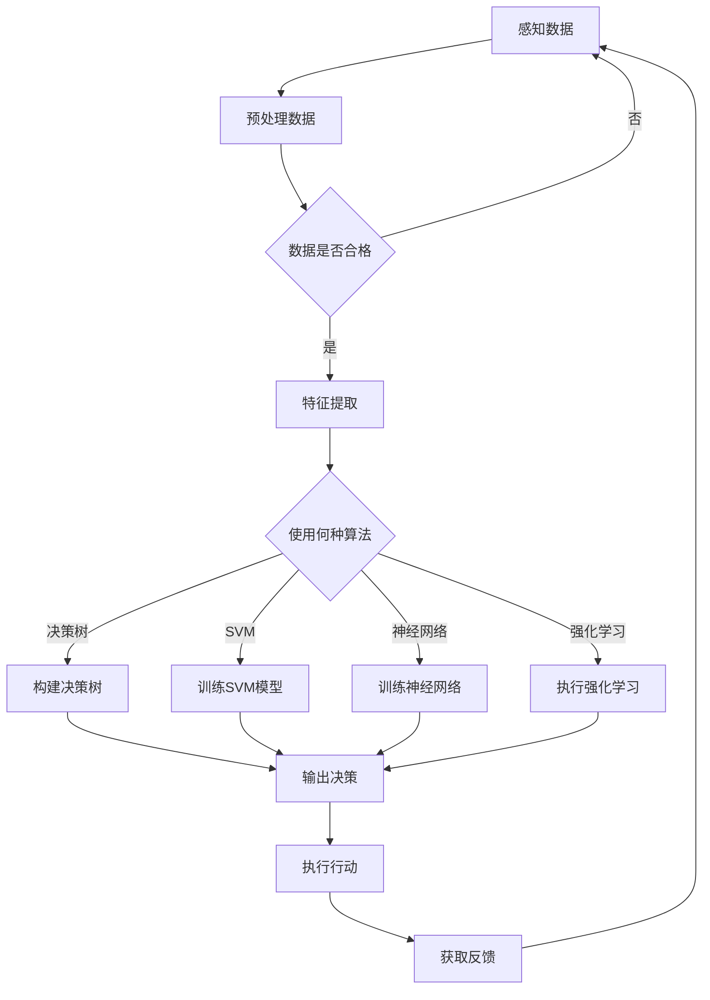

                 

### 引言与背景

在现代企业的运营中，跨部门协作是一个至关重要的环节。随着企业规模的不断扩大和业务复杂度的增加，各部门之间的沟通与协作变得越来越困难。传统的跨部门协作方式往往存在信息孤岛、沟通效率低下、任务流转不畅等问题，这不仅降低了工作效率，还可能影响企业的整体竞争力。

为了解决这些痛点，人工智能（AI）技术逐渐被引入到企业跨部门协作中。AI Agent，作为人工智能的一种应用形式，具有智能决策、自主学习、高效协同等特点，被广泛认为是提升企业跨部门协作效率的有效手段。

#### 问题背景

企业内部跨部门协作的痛点主要体现在以下几个方面：

1. **信息孤岛**：不同部门之间的数据系统往往是相互独立的，导致信息无法共享，协作效率低下。
2. **沟通不畅**：跨部门的沟通需要经过多层传递，容易出现信息失真或延迟，影响协作质量。
3. **任务流转复杂**：跨部门任务流转过程复杂，涉及多个环节和人员，容易出现错误或遗漏。
4. **缺乏协同机制**：现有协作机制往往缺乏统一的协调和调度，导致协作效果不佳。

#### AI Agent在跨部门协作中的应用潜力

AI Agent作为人工智能的实体代理，可以在以下几个方面改善企业的跨部门协作：

1. **智能决策**：AI Agent能够基于数据分析和预测，为决策者提供科学合理的建议，减少人为决策的盲目性。
2. **自动协调**：AI Agent能够自动处理跨部门之间的任务分配和协调，确保任务高效流转。
3. **优化沟通**：AI Agent能够实时监控和记录跨部门协作中的沟通内容，确保信息准确传达，减少沟通误差。
4. **学习与适应**：AI Agent能够不断学习协作过程中的最佳实践，优化自身行为，提高协作效率。

### 问题描述

跨部门协作中存在的问题主要包括信息孤岛、沟通不畅、任务流转复杂和缺乏协同机制等。这些问题导致了企业运营效率的下降，影响了业务的连续性和稳定性。

#### 问题解决

AI Agent作为解决方案，具备以下几个核心功能：

1. **数据整合**：AI Agent能够整合不同部门的数据系统，实现数据共享，打破信息孤岛。
2. **智能调度**：AI Agent能够根据任务需求和资源情况，自动进行任务调度和人员分配，优化任务流转。
3. **沟通助手**：AI Agent能够实时监控和记录跨部门协作中的沟通内容，确保信息准确传达，提高沟通效率。
4. **协同优化**：AI Agent能够基于协作数据，持续优化协作流程和机制，提高协作效率。

#### 跨部门协作中的AI Agent应用场景

AI Agent在跨部门协作中的应用场景非常广泛，以下是一些典型的应用场景：

1. **供应链管理**：AI Agent可以实时分析供应链数据，优化库存管理和物流调度，提高供应链的响应速度和灵活性。
2. **客户服务**：AI Agent可以协助处理客户咨询和投诉，快速响应客户需求，提高客户满意度。
3. **项目管理**：AI Agent可以监控项目进度，预测风险，为项目经理提供决策支持，确保项目按时完成。
4. **人力资源**：AI Agent可以协助进行招聘、培训和绩效评估，提高人力资源管理效率。

#### 边界与外延

AI Agent在跨部门协作中的功能是有边界的。它能够处理自动化和标准化程度较高的任务，但对于复杂和个性化的任务，仍然需要人的直接参与。同时，跨部门协作的范围和限制也需要根据企业的实际情况和业务需求来确定。

#### 概念结构与核心要素组成

AI Agent作为跨部门协作的核心要素，其基本概念和功能结构可以分为以下几个部分：

1. **数据层**：包括企业内部的各种数据源，如ERP系统、CRM系统等，以及AI Agent的数据处理和分析模块。
2. **算法层**：包括AI Agent的决策算法、预测算法等，用于处理和分析数据，提供智能化的决策支持。
3. **应用层**：包括AI Agent的具体应用场景和业务模块，如供应链管理、客户服务等。
4. **交互层**：包括AI Agent与用户的交互界面，如Web应用、移动应用等。

通过以上分析，我们可以看到，AI Agent在跨部门协作中具有巨大的应用潜力。然而，要实现其真正的价值，还需要在核心概念、应用场景和实现方法等方面进行深入研究和探索。

## 第一部分: 引言与背景

### 1.1 问题背景

在现代企业的运营中，跨部门协作是一个至关重要的环节。随着企业规模的不断扩大和业务复杂度的增加，各部门之间的沟通与协作变得越来越困难。传统的跨部门协作方式往往存在信息孤岛、沟通效率低下、任务流转不畅等问题，这不仅降低了工作效率，还可能影响企业的整体竞争力。

首先，企业内部跨部门协作的痛点主要体现在以下几个方面：

1. **信息孤岛**：不同部门之间的数据系统往往是相互独立的，导致信息无法共享，协作效率低下。例如，销售部门掌握的客户信息和市场动态无法及时传递给产品研发部门，导致产品研发与市场需求脱节。

2. **沟通不畅**：跨部门的沟通需要经过多层传递，容易出现信息失真或延迟，影响协作质量。例如，项目经理将任务分配给研发部门，但研发部门在执行过程中发现任务需求与预期不符，但由于沟通不畅，问题未能及时反馈，导致项目延期。

3. **任务流转复杂**：跨部门任务流转过程复杂，涉及多个环节和人员，容易出现错误或遗漏。例如，一个简单的采购任务可能需要经过采购部门、财务部门、仓储部门等多个环节，每个环节都需要多个人员的协同，容易导致任务流转中的瓶颈和延误。

4. **缺乏协同机制**：现有协作机制往往缺乏统一的协调和调度，导致协作效果不佳。例如，不同部门之间的任务分配和协调缺乏明确的规则和标准，导致任务执行过程中的混乱和冲突。

#### AI Agent在跨部门协作中的应用潜力

AI Agent作为人工智能的实体代理，具有智能决策、自主学习、高效协同等特点，被广泛认为是提升企业跨部门协作效率的有效手段。

首先，AI Agent可以解决信息孤岛问题。AI Agent能够整合不同部门的数据系统，实现数据的实时共享和互通。例如，销售部门的客户数据可以通过AI Agent实时传递给产品研发部门，帮助研发部门更好地了解市场需求，从而设计出更符合市场需求的的产品。

其次，AI Agent可以优化跨部门沟通。AI Agent可以实时监控和记录跨部门协作中的沟通内容，确保信息准确传达，减少沟通误差。例如，项目经理可以通过AI Agent与研发部门实时沟通任务需求，AI Agent可以自动记录沟通内容，避免信息传递过程中的失真和遗漏。

此外，AI Agent可以自动化跨部门任务的调度和分配。AI Agent可以根据任务需求和资源情况，自动进行任务调度和人员分配，优化任务流转。例如，采购部门可以通过AI Agent自动生成采购订单，并将订单信息实时传递给财务部门和仓储部门，实现采购任务的自动化和高效化。

最后，AI Agent可以优化跨部门协作的流程和机制。AI Agent可以基于协作数据，持续优化协作流程和机制，提高协作效率。例如，AI Agent可以通过分析跨部门协作中的数据，识别出协作流程中的瓶颈和问题，并提出优化建议，帮助企业持续改进协作机制。

### 1.2 问题描述

在跨部门协作中，企业面临的主要问题包括信息孤岛、沟通不畅、任务流转复杂和缺乏协同机制等。这些问题严重影响了企业的运营效率和业务连续性。

首先，信息孤岛问题是跨部门协作中的一个常见问题。由于各部门使用不同的信息系统和数据存储方式，导致数据无法实现共享，信息传递效率低下。例如，销售部门掌握的客户信息和市场动态无法及时传递给产品研发部门，导致产品研发与市场需求脱节。这不仅影响了产品的市场竞争力，也降低了企业的整体运营效率。

其次，沟通不畅是跨部门协作中的另一个重要问题。跨部门沟通往往需要经过多层传递，容易导致信息失真或延迟。例如，项目经理将任务分配给研发部门，但研发部门在执行过程中发现任务需求与预期不符，但由于沟通不畅，问题未能及时反馈，导致项目延期。此外，跨部门沟通还可能存在沟通渠道不明确、沟通内容不完整等问题，进一步影响了协作效率。

任务流转复杂也是跨部门协作中的一个突出问题。跨部门任务通常涉及多个环节和人员，每个环节都需要多个人员的协同。由于任务流转过程中的复杂性和不确定性，容易导致任务流转中的瓶颈和延误。例如，一个简单的采购任务可能需要经过采购部门、财务部门、仓储部门等多个环节，每个环节都需要多个人员的协同，容易导致任务流转中的混乱和延误。

最后，缺乏协同机制也是跨部门协作中面临的一个挑战。在传统的跨部门协作中，各部门之间的任务分配和协调往往缺乏明确的规则和标准，导致协作过程中的混乱和冲突。例如，不同部门之间的任务优先级不明确，可能导致关键任务得不到及时处理。此外，缺乏协同机制还可能导致资源浪费和效率低下，影响企业的整体运营效果。

### 1.3 问题解决

为了解决跨部门协作中的问题，引入AI Agent成为一种有效的解决方案。AI Agent作为一种智能实体代理，能够通过智能决策、自动协调、优化沟通等功能，提升企业跨部门协作的效率和效果。

首先，AI Agent可以解决信息孤岛问题。AI Agent能够整合不同部门的数据系统，实现数据的实时共享和互通。例如，销售部门的客户数据可以通过AI Agent实时传递给产品研发部门，帮助研发部门更好地了解市场需求，从而设计出更符合市场需求的的产品。同时，AI Agent还可以实现跨部门数据的统一存储和管理，避免数据冗余和重复建设，提高数据利用效率。

其次，AI Agent可以优化跨部门沟通。AI Agent可以实时监控和记录跨部门协作中的沟通内容，确保信息准确传达，减少沟通误差。例如，项目经理可以通过AI Agent与研发部门实时沟通任务需求，AI Agent可以自动记录沟通内容，避免信息传递过程中的失真和遗漏。此外，AI Agent还可以提供智能化的沟通分析，帮助相关部门更好地理解沟通内容，提高沟通效果。

此外，AI Agent可以自动化跨部门任务的调度和分配。AI Agent可以根据任务需求和资源情况，自动进行任务调度和人员分配，优化任务流转。例如，采购部门可以通过AI Agent自动生成采购订单，并将订单信息实时传递给财务部门和仓储部门，实现采购任务的自动化和高效化。通过AI Agent的智能调度，可以避免任务流转中的瓶颈和延误，提高任务完成的效率。

最后，AI Agent可以优化跨部门协作的流程和机制。AI Agent可以基于协作数据，持续优化协作流程和机制，提高协作效率。例如，AI Agent可以通过分析跨部门协作中的数据，识别出协作流程中的瓶颈和问题，并提出优化建议，帮助企业持续改进协作机制。通过AI Agent的智能优化，可以降低协作过程中的复杂性和不确定性，提高企业的整体运营效率。

### 1.4 边界与外延

虽然AI Agent在跨部门协作中具有广泛的应用潜力，但其功能是有边界的，并非万能。以下是对AI Agent功能边界和跨部门协作范围及限制的讨论：

#### AI Agent的功能边界

首先，AI Agent在跨部门协作中的功能主要依赖于其智能决策和自动协调能力。然而，AI Agent并不能完全替代人类的判断和决策。对于复杂、个性化或高度不确定的任务，AI Agent可能无法做出最优的决策。例如，在应对突发市场变化或紧急情况时，AI Agent可能无法像人类专家那样快速做出准确的决策。

其次，AI Agent的自动化能力虽然能够提高任务流转的效率，但并不能解决所有问题。AI Agent需要依赖高质量的输入数据和完善的算法模型才能有效工作。如果数据质量差或算法模型不完善，AI Agent可能无法正常运作，甚至可能导致错误的结果。

最后，AI Agent在跨部门协作中还需要与人类协作者进行有效沟通和协调。虽然AI Agent可以自动化处理一些任务，但复杂的跨部门协作往往需要人类的直接参与和决策。AI Agent需要具备与人类协作者互动的能力，以便在必要时提供支持或调整行为。

#### 跨部门协作的范围和限制

跨部门协作的范围取决于企业的组织结构和业务需求。以下是一些关键因素：

1. **组织结构**：跨部门协作的范围受企业组织结构的限制。例如，在高度集权的组织结构中，部门间的协作可能会受到严格的权限和流程限制。

2. **业务需求**：跨部门协作的范围也取决于企业的业务需求。例如，在供应链管理中，采购、生产、物流等部门的协作是必不可少的；而在研发项目中，研发部门与市场部门、销售部门的协作也非常重要。

3. **技术条件**：跨部门协作的范围还受制于企业的技术条件。例如，企业需要具备一定的IT基础设施和数据治理能力，才能实现跨部门数据的实时共享和互通。

4. **安全与隐私**：跨部门协作还需要考虑数据的安全和隐私问题。企业需要确保敏感数据在跨部门传输和使用过程中的安全性，以避免数据泄露和滥用。

#### 概念结构与核心要素组成

AI Agent作为跨部门协作的核心要素，其基本概念和功能结构可以分为以下几个部分：

1. **数据层**：包括企业内部的各种数据源，如ERP系统、CRM系统等，以及AI Agent的数据处理和分析模块。

2. **算法层**：包括AI Agent的决策算法、预测算法等，用于处理和分析数据，提供智能化的决策支持。

3. **应用层**：包括AI Agent的具体应用场景和业务模块，如供应链管理、客户服务等。

4. **交互层**：包括AI Agent与用户的交互界面，如Web应用、移动应用等。

通过以上分析，我们可以看到，AI Agent在跨部门协作中具有巨大的应用潜力。然而，要实现其真正的价值，还需要在核心概念、应用场景和实现方法等方面进行深入研究和探索。

## 第一部分: 引言与背景

### 1.1 问题背景

在现代企业的运营中，跨部门协作是一个至关重要的环节。随着企业规模的不断扩大和业务复杂度的增加，各部门之间的沟通与协作变得越来越困难。传统的跨部门协作方式往往存在信息孤岛、沟通效率低下、任务流转不畅等问题，这不仅降低了工作效率，还可能影响企业的整体竞争力。

#### 传统跨部门协作的痛点

1. **信息孤岛**：不同部门之间的数据系统往往是相互独立的，导致信息无法共享，协作效率低下。例如，销售部门的客户数据无法及时传递给产品研发部门，导致产品无法精准满足市场需求。

2. **沟通不畅**：跨部门的沟通需要经过多层传递，容易出现信息失真或延迟，影响协作质量。例如，项目经理将任务分配给研发部门，但研发部门在执行过程中发现任务需求与预期不符，但由于沟通不畅，问题未能及时反馈，导致项目延期。

3. **任务流转复杂**：跨部门任务流转过程复杂，涉及多个环节和人员，容易出现错误或遗漏。例如，一个简单的采购任务可能需要经过采购部门、财务部门、仓储部门等多个环节，每个环节都需要多个人员的协同，容易导致任务流转中的瓶颈和延误。

4. **缺乏协同机制**：现有协作机制往往缺乏统一的协调和调度，导致协作效果不佳。例如，不同部门之间的任务分配和协调缺乏明确的规则和标准，导致任务执行过程中的混乱和冲突。

#### AI Agent在跨部门协作中的应用潜力

AI Agent，作为人工智能的实体代理，具有智能决策、自主学习、高效协同等特点，被广泛认为是提升企业跨部门协作效率的有效手段。

1. **智能决策**：AI Agent能够基于数据分析和预测，为决策者提供科学合理的建议，减少人为决策的盲目性。例如，通过分析销售数据和市场动态，AI Agent可以预测市场需求，帮助产品研发部门制定更符合市场趋势的产品规划。

2. **自动协调**：AI Agent能够自动处理跨部门之间的任务分配和协调，确保任务高效流转。例如，采购部门可以通过AI Agent自动生成采购订单，并将订单信息实时传递给财务部门和仓储部门，实现采购任务的自动化和高效化。

3. **优化沟通**：AI Agent能够实时监控和记录跨部门协作中的沟通内容，确保信息准确传达，减少沟通误差。例如，项目经理可以通过AI Agent与研发部门实时沟通任务需求，AI Agent可以自动记录沟通内容，避免信息传递过程中的失真和遗漏。

4. **学习与适应**：AI Agent能够不断学习协作过程中的最佳实践，优化自身行为，提高协作效率。例如，通过分析历史协作数据，AI Agent可以识别出协作流程中的瓶颈和问题，并提出优化建议，帮助企业持续改进协作机制。

### 1.2 问题描述

在跨部门协作中，企业面临的主要问题包括信息孤岛、沟通不畅、任务流转复杂和缺乏协同机制等。这些问题严重影响了企业的运营效率和业务连续性。

1. **信息孤岛**：由于各部门使用不同的信息系统和数据存储方式，导致数据无法实现共享，协作效率低下。例如，销售部门的客户数据无法及时传递给产品研发部门，导致产品研发与市场需求脱节。

2. **沟通不畅**：跨部门沟通往往需要经过多层传递，容易出现信息失真或延迟。例如，项目经理将任务分配给研发部门，但研发部门在执行过程中发现任务需求与预期不符，但由于沟通不畅，问题未能及时反馈，导致项目延期。

3. **任务流转复杂**：跨部门任务流转过程复杂，涉及多个环节和人员，容易出现错误或遗漏。例如，一个简单的采购任务可能需要经过采购部门、财务部门、仓储部门等多个环节，每个环节都需要多个人员的协同，容易导致任务流转中的瓶颈和延误。

4. **缺乏协同机制**：现有协作机制往往缺乏统一的协调和调度，导致协作效果不佳。例如，不同部门之间的任务分配和协调缺乏明确的规则和标准，导致任务执行过程中的混乱和冲突。

### 1.3 问题解决

为了解决跨部门协作中的问题，引入AI Agent成为一种有效的解决方案。AI Agent作为一种智能实体代理，能够通过智能决策、自动协调、优化沟通等功能，提升企业跨部门协作的效率和效果。

1. **智能决策**：AI Agent能够基于数据分析和预测，为决策者提供科学合理的建议，减少人为决策的盲目性。例如，通过分析销售数据和市场动态，AI Agent可以预测市场需求，帮助产品研发部门制定更符合市场趋势的产品规划。

2. **自动协调**：AI Agent能够自动处理跨部门之间的任务分配和协调，确保任务高效流转。例如，采购部门可以通过AI Agent自动生成采购订单，并将订单信息实时传递给财务部门和仓储部门，实现采购任务的自动化和高效化。

3. **优化沟通**：AI Agent能够实时监控和记录跨部门协作中的沟通内容，确保信息准确传达，减少沟通误差。例如，项目经理可以通过AI Agent与研发部门实时沟通任务需求，AI Agent可以自动记录沟通内容，避免信息传递过程中的失真和遗漏。

4. **学习与适应**：AI Agent能够不断学习协作过程中的最佳实践，优化自身行为，提高协作效率。例如，通过分析历史协作数据，AI Agent可以识别出协作流程中的瓶颈和问题，并提出优化建议，帮助企业持续改进协作机制。

### 1.4 边界与外延

虽然AI Agent在跨部门协作中具有广泛的应用潜力，但其功能是有边界的，并非万能。以下是对AI Agent功能边界和跨部门协作范围及限制的讨论：

#### AI Agent的功能边界

1. **数据依赖性**：AI Agent的智能决策和自动协调功能高度依赖于输入数据的准确性和完整性。如果数据质量差或数据来源不统一，AI Agent的效能可能会受到影响。

2. **决策限制**：尽管AI Agent可以提供智能化的决策支持，但面对高度复杂和不确定的任务时，AI Agent可能无法像人类专家那样做出最优决策。例如，在应对突发市场变化或紧急情况时，AI Agent可能无法快速做出准确决策。

3. **交互限制**：AI Agent与人类协作者的互动依赖于语言理解和自然语言处理技术。尽管这些技术取得了显著进展，但AI Agent仍然难以完全理解复杂的语境和人类的情感表达。

#### 跨部门协作的范围和限制

1. **组织结构**：跨部门协作的范围受企业组织结构的限制。例如，在高度集权的组织结构中，部门间的协作可能会受到严格的权限和流程限制。

2. **业务需求**：跨部门协作的范围也取决于企业的业务需求。例如，在供应链管理中，采购、生产、物流等部门的协作是必不可少的；而在研发项目中，研发部门与市场部门、销售部门的协作也非常重要。

3. **技术条件**：跨部门协作的范围还受制于企业的技术条件。例如，企业需要具备一定的IT基础设施和数据治理能力，才能实现跨部门数据的实时共享和互通。

4. **安全与隐私**：跨部门协作还需要考虑数据的安全和隐私问题。企业需要确保敏感数据在跨部门传输和使用过程中的安全性，以避免数据泄露和滥用。

#### 概念结构与核心要素组成

AI Agent作为跨部门协作的核心要素，其基本概念和功能结构可以分为以下几个部分：

1. **数据层**：包括企业内部的各种数据源，如ERP系统、CRM系统等，以及AI Agent的数据处理和分析模块。

2. **算法层**：包括AI Agent的决策算法、预测算法等，用于处理和分析数据，提供智能化的决策支持。

3. **应用层**：包括AI Agent的具体应用场景和业务模块，如供应链管理、客户服务等。

4. **交互层**：包括AI Agent与用户的交互界面，如Web应用、移动应用等。

通过以上分析，我们可以看到，AI Agent在跨部门协作中具有巨大的应用潜力。然而，要实现其真正的价值，还需要在核心概念、应用场景和实现方法等方面进行深入研究和探索。

## 第二部分: AI Agent的核心概念

### 2.1 AI Agent的定义与特点

AI Agent，即人工智能代理，是一种模拟人类智能行为的计算机程序。它能够自主地执行任务、与外部环境进行交互，并具备一定程度的学习和适应能力。AI Agent的设计理念源自于智能体的概念，即具有独立思考和决策能力的实体。在计算机科学和人工智能领域，AI Agent被广泛研究并应用于各种场景。

#### AI Agent的定义

AI Agent可以定义为一种具有自主性、适应性、协作性和智能性的计算机程序。它能够通过感知、理解和决策等过程，实现与环境的交互和任务执行。具体来说，AI Agent通常包括以下几个核心组成部分：

1. **感知模块**：用于接收和解释外部环境的信息，如文本、图像、声音等。
2. **理解模块**：用于理解感知到的信息，并生成相应的内部表示。
3. **决策模块**：用于根据理解模块生成的信息进行决策，选择适当的行动。
4. **行动模块**：用于执行决策模块选定的行动，并对外部环境产生影响。

#### AI Agent的特点

AI Agent具有以下主要特点：

1. **自主性**：AI Agent能够在没有人类干预的情况下自主执行任务，这得益于其内置的感知、理解和决策机制。
2. **适应性**：AI Agent能够通过学习和适应环境变化，不断优化自身的行为和决策能力。
3. **协作性**：AI Agent可以与其他AI Agent或人类协作者协同工作，共同完成任务。
4. **智能性**：AI Agent具备智能化的决策能力，能够根据环境和任务需求，自主选择最佳行动方案。

### 2.2 AI Agent的组成与架构

AI Agent的组成和架构决定了其功能和行为。一个典型的AI Agent通常由以下几个核心部分组成：

1. **感知模块**：这是AI Agent的感官部分，用于接收和处理来自外部环境的数据。感知模块可以包括传感器、摄像头、麦克风等设备，以及相应的数据处理算法。

2. **理解模块**：理解模块负责解析和解释感知模块获取的数据。它通常包括自然语言处理（NLP）、图像识别、语音识别等技术，以帮助AI Agent理解其所在的环境和任务需求。

3. **决策模块**：决策模块是AI Agent的核心，它负责根据理解模块生成的信息进行推理和决策。决策模块可以基于规则、机器学习、深度学习等技术，选择最佳的行动方案。

4. **行动模块**：行动模块负责将决策模块选定的行动付诸实施。这可以包括执行物理动作、发送电子邮件、调用API接口等。

#### AI Agent的架构设计

AI Agent的架构设计通常包括以下几个层次：

1. **感知层**：这一层负责接收和处理来自环境的数据，如传感器数据、网络数据等。感知层需要使用相应的数据处理算法，确保数据的准确性和有效性。

2. **理解层**：理解层负责解析和解释感知层获取的数据，并将其转化为AI Agent可以理解的形式。理解层通常包含自然语言处理、图像识别、语音识别等技术。

3. **决策层**：决策层基于理解层提供的信息，使用机器学习、深度学习等技术进行推理和决策。决策层需要考虑任务目标、环境状态和资源限制等因素，选择最佳的行动方案。

4. **行动层**：行动层负责执行决策层选定的行动，并将结果反馈给环境。行动层通常涉及物理动作、API调用、网络通信等操作。

#### AI Agent的工作原理

AI Agent的工作原理可以概括为以下几个步骤：

1. **感知**：AI Agent通过感知模块获取环境数据，如用户输入、传感器数据等。
2. **理解**：理解模块解析感知模块获取的数据，并将其转化为内部表示。
3. **决策**：决策模块根据理解模块生成的信息，进行推理和决策，选择最佳行动方案。
4. **行动**：行动模块执行决策模块选定的行动，并对外部环境产生影响。
5. **反馈**：AI Agent根据行动结果和环境反馈，调整感知、理解和决策模块的行为，实现不断学习和优化。

### 2.3 AI Agent的核心算法

AI Agent的核心算法是实现其智能行为的关键。以下是一些常用的核心算法：

1. **决策树算法**：决策树算法是一种基于规则的方法，通过一系列条件判断，为AI Agent提供明确的决策路径。这种方法简单直观，适用于规则明确、任务结构化的场景。

2. **支持向量机（SVM）**：SVM是一种强大的机器学习算法，用于分类和回归任务。它通过构建一个最优超平面，将不同类别的数据分隔开来。SVM在处理高维数据时表现优异，适用于复杂决策场景。

3. **神经网络算法**：神经网络，尤其是深度学习，是AI Agent的核心算法之一。通过多层神经网络，AI Agent可以学习复杂的特征和模式，实现高度智能化的决策。常见的神经网络算法包括卷积神经网络（CNN）、循环神经网络（RNN）和长短时记忆网络（LSTM）等。

4. **强化学习算法**：强化学习是一种通过试错和奖励机制进行学习的方法。AI Agent通过不断尝试不同的行动方案，并根据奖励信号调整策略，实现自我优化。强化学习在需要长期规划和策略优化的场景中表现尤为突出。

### AI Agent的核心算法流程图

为了更好地理解AI Agent的核心算法，我们使用Mermaid流程图对其进行描述：



### 举例说明

为了更直观地理解AI Agent的核心算法，我们通过一个简单的例子进行说明。

假设一个企业内部的AI Agent负责监控办公环境中的温度和湿度。感知模块收集到的数据经过预处理后，被输入到一个神经网络模型中。神经网络模型通过学习历史数据，能够预测当前环境的最佳温度和湿度设置，并输出相应的决策。

1. **感知数据**：AI Agent通过传感器收集当前的温度和湿度数据。
2. **预处理数据**：对收集到的数据进行清洗和标准化处理，以便输入神经网络模型。
3. **特征提取**：神经网络模型从预处理后的数据中提取特征，如温度和湿度的变化趋势。
4. **决策**：基于提取的特征，神经网络模型输出当前环境的最佳温度和湿度设置。
5. **执行行动**：AI Agent根据决策结果，调整办公环境的温度和湿度。
6. **获取反馈**：AI Agent记录调整后的环境数据，并反馈给神经网络模型，用于后续的学习和优化。

通过这个简单的例子，我们可以看到AI Agent如何通过感知、理解、决策和行动等步骤，实现自主监控和调整办公环境。这一过程不仅展示了AI Agent的核心算法原理，也体现了其自主学习和优化能力。

### 总结

AI Agent作为跨部门协作的关键技术，具有智能决策、自动协调、优化沟通等特点。通过对AI Agent的定义、组成与架构、核心算法的详细分析，我们可以更好地理解其工作原理和应用潜力。在下一部分中，我们将进一步探讨AI Agent在跨部门协作中的应用场景和实现方法。

## 第三部分: 跨部门协作中的AI Agent应用

### 3.1 跨部门协作的需求分析

在跨部门协作中，企业面临的核心需求包括高效沟通、任务协调和资源共享等。AI Agent作为一种智能解决方案，能够满足这些需求，从而提升企业的协作效率和业务连续性。

首先，**高效沟通**是企业跨部门协作中的基本需求。不同部门之间的沟通往往涉及大量信息和细节，而传统的沟通方式如电子邮件、电话会议等，容易导致信息滞后和误传。AI Agent可以实时监控和记录跨部门协作中的沟通内容，确保信息准确传达，减少沟通误差。

其次，**任务协调**是跨部门协作中的关键需求。在复杂的企业运营中，跨部门的任务往往涉及多个环节和人员，任务的协调和分配需要高效的流程和机制。AI Agent可以通过智能调度和自动分配，优化任务的流转，减少任务流转中的瓶颈和延误。

最后，**资源共享**是提升跨部门协作效率的重要手段。企业内部各个部门往往拥有不同的资源，如人力资源、设备、资金等。通过AI Agent，可以实现跨部门资源的共享和优化配置，提高资源利用效率。

#### AI Agent在满足需求中的作用

AI Agent在满足企业跨部门协作需求中发挥着重要作用：

1. **高效沟通**：AI Agent通过实时监控和记录沟通内容，确保信息准确传达，提高沟通效率。同时，AI Agent还可以提供智能化的沟通分析，帮助相关部门更好地理解沟通内容，提高沟通效果。

2. **任务协调**：AI Agent可以通过智能调度和自动分配，优化任务的流转，减少任务流转中的瓶颈和延误。例如，在供应链管理中，AI Agent可以实时分析库存情况，自动生成采购订单，并将订单信息实时传递给财务部门和仓储部门，实现采购任务的自动化和高效化。

3. **资源共享**：AI Agent可以通过整合企业内部资源，实现跨部门资源的共享和优化配置。例如，人力资源部门可以通过AI Agent自动匹配员工技能和项目需求，实现人力资源的最优配置。

### 3.2 跨部门协作的AI Agent应用场景

AI Agent在跨部门协作中的应用场景非常广泛，以下是一些典型的应用场景：

#### 1. 供应链管理

在供应链管理中，AI Agent可以实时分析供应链数据，优化库存管理和物流调度，提高供应链的响应速度和灵活性。例如，AI Agent可以监控库存水平，预测需求变化，自动生成采购订单，并将订单信息实时传递给财务部门和仓储部门。通过智能调度和资源共享，AI Agent可以确保供应链各环节的高效运行。

#### 2. 客户服务

在客户服务领域，AI Agent可以协助处理客户咨询和投诉，快速响应客户需求，提高客户满意度。AI Agent可以实时监控客户服务数据，分析客户需求，自动生成服务方案，并将方案传递给相关部门。例如，在客户投诉处理中，AI Agent可以自动分配投诉任务，记录处理过程，确保投诉问题得到及时解决。

#### 3. 项目管理

在项目管理中，AI Agent可以监控项目进度，预测风险，为项目经理提供决策支持，确保项目按时完成。AI Agent可以通过分析项目数据，识别出潜在风险和瓶颈，并提出优化建议。例如，在项目任务分配中，AI Agent可以根据团队成员的技能和项目需求，自动分配任务，确保任务的高效完成。

#### 4. 人力资源管理

在人力资源管理中，AI Agent可以协助进行招聘、培训和绩效评估，提高人力资源管理效率。AI Agent可以通过分析招聘数据，自动匹配候选人，提高招聘效率。在培训和绩效评估方面，AI Agent可以实时记录员工的学习和绩效表现，提供个性化的培训建议和评估报告。

### 3.3 跨部门协作的AI Agent实施方法

#### 1. 需求分析

在实施AI Agent之前，需要对企业的跨部门协作需求进行详细分析，明确AI Agent需要解决的主要问题和应用场景。需求分析阶段可以通过访谈、问卷调查等方式，收集各部门的意见和建议，确保AI Agent的设计符合实际业务需求。

#### 2. 数据整合

实现AI Agent的关键在于数据的整合。企业需要确保各部门的数据系统能够无缝对接，实现数据的实时共享和互通。数据整合可以通过建立数据总线或数据湖等方式实现，确保AI Agent能够获取到准确和完整的输入数据。

#### 3. 算法模型设计

AI Agent的智能决策能力依赖于算法模型的设计。在算法模型设计阶段，需要根据具体的应用场景，选择合适的算法，如决策树、SVM、神经网络等。同时，需要设计算法的参数和超参数，确保算法模型的有效性和鲁棒性。

#### 4. 系统开发与测试

在系统开发阶段，需要根据需求分析和算法模型设计，开发AI Agent的核心功能模块，包括感知模块、理解模块、决策模块和行动模块。在开发过程中，需要进行详细的测试，确保系统的稳定性和可靠性。

#### 5. 系统部署与运维

系统开发完成后，需要进行部署和运维。在部署阶段，需要确保AI Agent能够在企业内部网络中稳定运行，并与其他系统无缝集成。在运维阶段，需要定期对系统进行监控和优化，确保AI Agent的高效运行。

#### 6. 培训与推广

在AI Agent实施过程中，需要对相关人员进行培训，确保他们能够熟练使用AI Agent，充分发挥其作用。同时，需要通过推广活动，提高员工对AI Agent的认知和接受度，促进其在实际业务中的应用。

### 总结

通过需求分析、数据整合、算法模型设计、系统开发与测试、系统部署与运维、培训与推广等步骤，企业可以有效地实施AI Agent，提升跨部门协作的效率和效果。在下一部分中，我们将进一步探讨AI Agent的设计与实现方法。

## 第三部分: 跨部门协作中的AI Agent应用

### 3.1 跨部门协作的需求分析

跨部门协作的需求主要集中在以下几个方面：

1. **高效沟通**：不同部门之间的信息传递需要快速、准确，以避免误解和延迟。传统方式如电子邮件、电话会议等在信息量大、流程复杂的情况下显得力不从心。

2. **任务协调**：跨部门协作中的任务往往涉及多个环节和多个人员的协同工作，需要一个智能的调度系统来优化任务的分配和执行流程。

3. **资源共享**：企业内部各部门可能拥有不同的资源，如人力资源、设备、资金等。有效的资源共享可以提高资源利用率，减少浪费。

4. **流程优化**：跨部门协作中的流程可能存在冗余或瓶颈，需要通过自动化和智能化手段进行优化，提高整体工作效率。

#### AI Agent在满足需求中的作用

AI Agent通过其智能决策、自主学习、高效协同等特性，能够有效地满足上述需求：

1. **高效沟通**：AI Agent可以实时监控和记录跨部门协作中的沟通内容，确保信息准确传达。同时，AI Agent可以提供智能化的沟通分析，帮助各部门更好地理解沟通内容，提高沟通效率。

2. **任务协调**：AI Agent可以通过智能调度和自动分配，优化任务的流转，减少任务流转中的瓶颈和延误。例如，在供应链管理中，AI Agent可以实时分析库存情况，自动生成采购订单，并将订单信息实时传递给财务部门和仓储部门。

3. **资源共享**：AI Agent可以通过整合企业内部资源，实现跨部门资源的共享和优化配置。例如，人力资源部门可以通过AI Agent自动匹配员工技能和项目需求，实现人力资源的最优配置。

4. **流程优化**：AI Agent可以基于协作数据，持续优化协作流程和机制，提高协作效率。通过分析历史协作数据，AI Agent可以识别出协作流程中的瓶颈和问题，并提出优化建议。

### 3.2 跨部门协作的AI Agent应用场景

AI Agent在跨部门协作中有多种应用场景，以下是一些典型的例子：

#### 1. 供应链管理

在供应链管理中，AI Agent可以监控供应链的各个环节，从采购到物流，优化库存管理，提高供应链的响应速度和灵活性。例如：

- **库存预测**：AI Agent可以通过分析历史销售数据和市场趋势，预测未来的库存需求，自动生成采购计划，避免库存过剩或短缺。
- **物流优化**：AI Agent可以根据订单数据和交通状况，自动安排最合适的运输路线和运输方式，减少物流成本和运输时间。
- **供应链可视化**：AI Agent可以通过可视化工具，实时展示供应链的状态和进度，帮助管理者随时掌握供应链的动态。

#### 2. 客户服务

在客户服务领域，AI Agent可以协助处理客户咨询和投诉，提高服务质量。例如：

- **智能客服**：AI Agent可以自动应答客户的常见问题，提供即时的解决方案，减轻人工客服的负担。
- **情感分析**：AI Agent可以通过情感分析技术，识别客户情绪，提供更加个性化的服务，提高客户满意度。
- **投诉处理**：AI Agent可以自动分配投诉任务，记录处理过程，确保投诉问题得到及时解决，并从历史数据中学习，优化投诉处理流程。

#### 3. 项目管理

在项目管理中，AI Agent可以监控项目进度，预测风险，提供决策支持。例如：

- **进度监控**：AI Agent可以实时跟踪项目的进展情况，识别出可能延误的任务，提醒项目经理及时调整计划。
- **风险预测**：AI Agent可以通过分析历史项目数据和当前项目状态，预测项目风险，并提供相应的风险应对策略。
- **资源调度**：AI Agent可以根据项目的需求和团队成员的技能，自动分配资源，确保项目的高效执行。

#### 4. 人力资源管理

在人力资源管理中，AI Agent可以协助进行招聘、培训和绩效评估，提高人力资源管理效率。例如：

- **招聘匹配**：AI Agent可以通过分析职位描述和求职者的简历，自动匹配最适合的候选人，提高招聘效率。
- **培训规划**：AI Agent可以根据员工的工作表现和技能需求，自动生成个性化的培训计划，提高培训效果。
- **绩效评估**：AI Agent可以通过分析员工的工作数据和绩效指标，自动生成绩效评估报告，提供客观、公正的评估结果。

### 3.3 跨部门协作的AI Agent实施方法

#### 1. 需求分析

实施AI Agent的第一步是进行需求分析，明确AI Agent需要解决的主要问题和目标。需求分析可以通过与各部门的访谈、问卷调查等方式进行，收集各部门的意见和建议，确保AI Agent的设计符合实际业务需求。

#### 2. 数据整合

AI Agent的有效运行依赖于数据的准确性和完整性。企业需要整合各部门的数据系统，实现数据的实时共享和互通。数据整合可以通过建立数据总线或数据湖等方式实现，确保AI Agent能够获取到准确和完整的输入数据。

#### 3. 算法模型设计

AI Agent的智能决策能力依赖于算法模型的设计。在算法模型设计阶段，需要根据具体的应用场景，选择合适的算法，如决策树、SVM、神经网络等。同时，需要设计算法的参数和超参数，确保算法模型的有效性和鲁棒性。

#### 4. 系统开发与测试

在系统开发阶段，需要根据需求分析和算法模型设计，开发AI Agent的核心功能模块，包括感知模块、理解模块、决策模块和行动模块。在开发过程中，需要进行详细的测试，确保系统的稳定性和可靠性。

#### 5. 系统部署与运维

系统开发完成后，需要进行部署和运维。在部署阶段，需要确保AI Agent能够在企业内部网络中稳定运行，并与其他系统无缝集成。在运维阶段，需要定期对系统进行监控和优化，确保AI Agent的高效运行。

#### 6. 培训与推广

在AI Agent实施过程中，需要对相关人员进行培训，确保他们能够熟练使用AI Agent，充分发挥其作用。同时，需要通过推广活动，提高员工对AI Agent的认知和接受度，促进其在实际业务中的应用。

### 总结

通过需求分析、数据整合、算法模型设计、系统开发与测试、系统部署与运维、培训与推广等步骤，企业可以有效地实施AI Agent，提升跨部门协作的效率和效果。在下一部分中，我们将进一步探讨AI Agent的具体设计与实现方法。

## 第四部分：跨部门协作的AI Agent设计与实现

### 4.1 跨部门协作的AI Agent设计

在设计AI Agent时，需要考虑其功能设计、用户界面设计以及系统架构设计等多个方面，以确保AI Agent能够高效地满足企业的跨部门协作需求。

#### 功能设计

AI Agent的功能设计是其实现跨部门协作的核心。以下是AI Agent的主要功能模块：

1. **感知模块**：用于接收和处理来自不同部门的数据，如ERP系统、CRM系统等。感知模块需要具备数据采集、清洗和预处理的能力。

2. **理解模块**：负责分析感知模块获取的数据，提取关键信息，并生成内部表示。理解模块可以采用自然语言处理（NLP）、图像识别等技术。

3. **决策模块**：基于理解模块生成的信息，进行推理和决策，选择最优的行动方案。决策模块可以采用机器学习、深度学习等算法。

4. **行动模块**：执行决策模块选定的行动，如发送电子邮件、更新数据库、生成报告等。行动模块需要与企业的其他系统进行集成。

5. **反馈模块**：记录AI Agent的行动结果，并收集环境反馈，用于后续的学习和优化。

#### 用户界面设计

用户界面设计是AI Agent与用户交互的重要环节。以下是用户界面设计的关键要素：

1. **可视化**：通过图表、仪表盘等可视化工具，实时展示AI Agent的运行状态和结果。

2. **交互性**：提供用户与AI Agent进行交互的接口，如输入查询、调整参数等。

3. **便捷性**：界面设计应简洁直观，方便用户快速操作和使用。

4. **个性化**：根据用户的需求和偏好，提供个性化的界面布局和功能。

#### 系统架构设计

AI Agent的系统架构设计决定了其性能和可扩展性。以下是AI Agent的系统架构设计：

1. **数据层**：包括数据采集、存储和管理系统，如数据库、数据仓库等。

2. **算法层**：包括机器学习模型、深度学习网络等，用于数据处理和分析。

3. **应用层**：包括AI Agent的具体功能模块，如感知模块、理解模块、决策模块、行动模块等。

4. **交互层**：包括用户界面、API接口等，用于AI Agent与用户和外部系统的交互。

5. **基础设施层**：包括服务器、网络、存储等基础设施，用于支持AI Agent的运行。

### 4.2 跨部门协作的AI Agent实现

在实现AI Agent时，需要考虑核心代码实现、测试与优化等多个方面，以确保AI Agent的功能稳定、性能高效。

#### 核心代码实现

以下是一个简单的AI Agent实现示例，包括感知、理解、决策和行动等核心模块：

```python
# 感知模块：接收和处理数据
def sense_data():
    # 采集数据
    data = collect_data()
    # 数据预处理
    processed_data = preprocess_data(data)
    return processed_data

# 理解模块：分析数据
def understand_data(data):
    # 数据分析
    insights = analyze_data(data)
    return insights

# 决策模块：基于理解数据做出决策
def make_decision(insights):
    # 决策算法
    decision = decision_algorithm(insights)
    return decision

# 行动模块：执行决策
def act(decision):
    # 执行决策
    execute_action(decision)
    return

# 主程序
def main():
    while True:
        data = sense_data()
        insights = understand_data(data)
        decision = make_decision(insights)
        act(decision)

if __name__ == "__main__":
    main()
```

#### 测试与优化

在实现AI Agent后，需要进行详细的测试与优化，以确保系统的稳定性和性能。以下是测试与优化的几个关键步骤：

1. **单元测试**：对AI Agent的各个功能模块进行单元测试，确保每个模块的功能正确。

2. **集成测试**：将AI Agent与企业的其他系统集成，进行集成测试，确保AI Agent与其他系统的无缝协作。

3. **性能测试**：对AI Agent的响应时间、处理能力等进行性能测试，优化系统性能。

4. **异常处理**：设计异常处理机制，确保AI Agent在异常情况下能够稳定运行。

5. **持续优化**：根据测试结果和用户反馈，不断优化AI Agent的功能和性能，提高其稳定性和可用性。

### 4.3 跨部门协作的AI Agent案例分析

以下是一个跨部门协作的AI Agent案例分析：

#### 案例背景

某大型企业希望提升其跨部门协作效率，特别关注供应链管理和客户服务两个领域。企业引入AI Agent，以实现智能化的任务调度、数据分析和客户服务。

#### 案例实施

1. **需求分析**：企业通过访谈和问卷调查，明确了AI Agent在供应链管理和客户服务中的具体需求。

2. **数据整合**：企业建立了统一的数据平台，整合了ERP系统、CRM系统和供应链管理系统，为AI Agent提供了实时、准确的数据输入。

3. **算法模型设计**：企业选择了机器学习和深度学习算法，设计了感知模块、理解模块、决策模块和行动模块，确保AI Agent能够智能地处理和分析数据。

4. **系统开发与测试**：企业开发了AI Agent的核心功能模块，并进行了详细的测试，确保系统的稳定性和可靠性。

5. **系统部署与运维**：AI Agent在企业内部网络中部署，并与其他系统无缝集成，确保其高效运行。

6. **培训与推广**：企业对相关人员进行培训，确保他们能够熟练使用AI Agent，并组织推广活动，提高员工对AI Agent的认知和接受度。

#### 案例效果

AI Agent的实施取得了显著的效果：

- **供应链管理**：AI Agent通过实时分析供应链数据，优化了库存管理和物流调度，提高了供应链的响应速度和灵活性。

- **客户服务**：AI Agent可以自动应答客户的咨询和投诉，提高了服务效率和质量。

- **任务协调**：AI Agent通过智能调度和自动分配，优化了任务的流转，减少了任务流转中的瓶颈和延误。

- **资源利用率**：AI Agent通过优化资源分配，提高了资源利用率，降低了成本。

### 案例中的问题和解决方案

在实施过程中，企业遇到了一些挑战：

1. **数据质量**：由于数据来源于不同的系统，数据质量参差不齐，影响了AI Agent的决策效果。

**解决方案**：企业通过数据清洗和标准化处理，提高了数据的准确性和一致性。

2. **算法性能**：AI Agent的算法模型在处理大规模数据时，性能有所下降。

**解决方案**：企业通过优化算法模型和硬件配置，提高了AI Agent的处理能力。

3. **用户接受度**：部分员工对AI Agent的使用存在疑虑，影响了其推广效果。

**解决方案**：企业通过培训、示范和反馈，提高了员工对AI Agent的接受度和使用意愿。

### 项目小结

通过该案例，我们可以看到，AI Agent在跨部门协作中具有巨大的应用潜力。尽管在实施过程中遇到了一些问题，但通过有效的解决方案，企业成功提升了跨部门协作的效率和效果。未来，企业可以继续优化AI Agent的功能和性能，进一步发挥其价值。

## 第四部分：跨部门协作的AI Agent设计与实现

### 4.1 跨部门协作的AI Agent设计

在设计跨部门协作的AI Agent时，我们需要从功能设计、用户界面设计和系统架构设计三个核心方面进行深入分析和详细规划。

#### 功能设计

AI Agent的核心功能是其实现跨部门协作的关键。以下是AI Agent的主要功能模块：

1. **感知模块**：负责接收和处理来自不同部门的数据。这包括从ERP系统、CRM系统、库存管理系统等多个数据源中提取数据，并进行初步的数据清洗和格式化。

2. **理解模块**：在感知模块获取的数据基础上，进行高级的数据分析和理解。这个模块需要利用自然语言处理（NLP）、图像识别和模式识别等技术，将原始数据转换为有用的信息。

3. **决策模块**：基于理解模块生成的信息，进行推理和决策。这个模块需要集成多种算法，如机器学习、深度学习和强化学习等，以生成最优的行动方案。

4. **行动模块**：执行决策模块选定的行动，如发送通知、生成报告、更新数据库等。这个模块需要与企业的其他系统进行集成，确保行动的顺利执行。

5. **反馈模块**：记录AI Agent的行动结果，并收集环境反馈，用于后续的学习和优化。这个模块确保AI Agent能够不断适应和改进，提高协作效果。

#### 用户界面设计

用户界面设计是AI Agent与用户交互的重要桥梁。以下是用户界面设计的关键要素：

1. **可视化**：通过直观的图表和仪表盘，展示AI Agent的运行状态、数据分析结果和决策建议。这有助于用户快速理解和操作AI Agent。

2. **交互性**：提供用户与AI Agent进行交互的接口，如输入查询、调整参数、提交反馈等。这确保用户能够灵活地与AI Agent互动，发挥其最大效用。

3. **便捷性**：界面设计应简洁直观，方便用户快速上手。例如，提供一键操作按钮和简洁的导航菜单。

4. **个性化**：根据用户的需求和偏好，提供个性化的界面布局和功能。例如，用户可以根据自己的角色和职责，自定义仪表盘的显示内容。

#### 系统架构设计

AI Agent的系统架构设计决定了其性能和可扩展性。以下是AI Agent的系统架构设计：

1. **数据层**：包括数据采集、存储和管理系统，如数据库、数据仓库、数据湖等。这一层确保AI Agent能够获取到准确和完整的数据输入。

2. **算法层**：包括机器学习模型、深度学习网络等。这一层负责数据处理和分析，为AI Agent提供智能化的决策支持。

3. **应用层**：包括AI Agent的具体功能模块，如感知模块、理解模块、决策模块、行动模块等。这一层实现AI Agent的核心功能。

4. **交互层**：包括用户界面、API接口等。这一层负责AI Agent与用户和外部系统的交互。

5. **基础设施层**：包括服务器、网络、存储等基础设施。这一层为AI Agent的运行提供必要的硬件支持。

### 4.2 跨部门协作的AI Agent实现

实现跨部门协作的AI Agent是一个复杂的过程，涉及多个技术环节。以下是实现AI Agent的主要步骤：

#### 核心代码实现

以下是实现AI Agent的一个简单示例，包括感知、理解、决策和行动等核心模块：

```python
# 感知模块：接收和处理数据
def sense_data():
    # 采集数据
    data = collect_data()
    # 数据预处理
    processed_data = preprocess_data(data)
    return processed_data

# 理解模块：分析数据
def understand_data(data):
    # 数据分析
    insights = analyze_data(data)
    return insights

# 决策模块：基于理解数据做出决策
def make_decision(insights):
    # 决策算法
    decision = decision_algorithm(insights)
    return decision

# 行动模块：执行决策
def act(decision):
    # 执行决策
    execute_action(decision)
    return

# 主程序
def main():
    while True:
        data = sense_data()
        insights = understand_data(data)
        decision = make_decision(insights)
        act(decision)

if __name__ == "__main__":
    main()
```

#### 测试与优化

在实现AI Agent后，需要进行详细的测试与优化，以确保系统的稳定性和性能。以下是测试与优化的几个关键步骤：

1. **单元测试**：对AI Agent的各个功能模块进行单元测试，确保每个模块的功能正确。

2. **集成测试**：将AI Agent与企业的其他系统集成，进行集成测试，确保AI Agent与其他系统的无缝协作。

3. **性能测试**：对AI Agent的响应时间、处理能力等进行性能测试，优化系统性能。

4. **异常处理**：设计异常处理机制，确保AI Agent在异常情况下能够稳定运行。

5. **持续优化**：根据测试结果和用户反馈，不断优化AI Agent的功能和性能，提高其稳定性和可用性。

### 4.3 跨部门协作的AI Agent案例分析

以下是一个实际的跨部门协作AI Agent案例，详细描述了案例的背景、实施过程、效果评估以及遇到的挑战和解决方案。

#### 案例背景

某大型制造企业面临跨部门协作效率低下的问题，特别是在供应链管理和客户服务领域。企业希望引入AI Agent，以实现自动化、智能化的任务调度和决策支持，从而提升整体运营效率。

#### 案例实施

1. **需求分析**：企业通过访谈和问卷调查，明确了AI Agent在供应链管理和客户服务中的具体需求。例如，自动生成采购订单、优化物流调度、自动处理客户投诉等。

2. **数据整合**：企业整合了ERP系统、CRM系统、库存管理系统等多个数据源，建立了统一的数据平台。数据平台确保了AI Agent能够获取到准确、完整的数据输入。

3. **算法模型设计**：企业选择了机器学习和深度学习算法，设计了感知模块、理解模块、决策模块和行动模块。算法模型能够智能地处理和分析数据，提供科学的决策支持。

4. **系统开发与测试**：企业开发了AI Agent的核心功能模块，并进行了详细的测试，确保系统的稳定性和可靠性。测试包括单元测试、集成测试和性能测试。

5. **系统部署与运维**：AI Agent在企业内部网络中部署，并与其他系统无缝集成。运维团队负责系统的日常监控和优化，确保AI Agent的高效运行。

6. **培训与推广**：企业对相关人员进行培训，确保他们能够熟练使用AI Agent，并组织推广活动，提高员工对AI Agent的认知和接受度。

#### 案例效果

AI Agent的实施取得了显著的效果：

- **供应链管理**：AI Agent通过实时分析供应链数据，优化了库存管理和物流调度，提高了供应链的响应速度和灵活性。

- **客户服务**：AI Agent可以自动应答客户的咨询和投诉，提高了服务效率和质量。

- **任务协调**：AI Agent通过智能调度和自动分配，优化了任务的流转，减少了任务流转中的瓶颈和延误。

- **资源利用率**：AI Agent通过优化资源分配，提高了资源利用率，降低了成本。

#### 案例中的问题和解决方案

在实施过程中，企业遇到了一些挑战：

1. **数据质量**：由于数据来源于不同的系统，数据质量参差不齐，影响了AI Agent的决策效果。

**解决方案**：企业通过数据清洗和标准化处理，提高了数据的准确性和一致性。

2. **算法性能**：AI Agent的算法模型在处理大规模数据时，性能有所下降。

**解决方案**：企业通过优化算法模型和硬件配置，提高了AI Agent的处理能力。

3. **用户接受度**：部分员工对AI Agent的使用存在疑虑，影响了其推广效果。

**解决方案**：企业通过培训、示范和反馈，提高了员工对AI Agent的接受度和使用意愿。

### 项目小结

通过该案例，我们可以看到，AI Agent在跨部门协作中具有巨大的应用潜力。尽管在实施过程中遇到了一些问题，但通过有效的解决方案，企业成功提升了跨部门协作的效率和效果。未来，企业可以继续优化AI Agent的功能和性能，进一步发挥其价值。

### 4.4 跨部门协作的AI Agent最佳实践

在跨部门协作中，AI Agent的最佳实践可以帮助企业最大限度地发挥其优势，提高协作效率和效果。以下是几条关键的最佳实践建议：

#### 1. 明确需求与目标

在引入AI Agent之前，企业需要明确AI Agent的具体需求和目标。这包括确定AI Agent需要解决的问题、期望实现的效果以及需要满足的业务需求。通过明确的需求与目标，可以确保AI Agent的设计和实现更加符合企业的实际需求。

#### 2. 数据整合与治理

AI Agent的有效运行高度依赖于数据的准确性、完整性和一致性。因此，企业需要建立统一的数据平台，整合来自不同部门的数据源，并进行数据清洗、标准化和治理。数据整合与治理是AI Agent成功的关键步骤，可以确保AI Agent获得高质量的数据输入。

#### 3. 持续优化与迭代

AI Agent的智能能力需要通过不断的优化和迭代来提升。企业应该建立反馈机制，收集用户对AI Agent的反馈，并根据反馈进行持续优化。此外，企业还可以定期更新AI Agent的算法模型和功能模块，以适应业务环境的变化。

#### 4. 强化员工培训与推广

AI Agent的成功应用离不开员工的接受和使用。企业需要提供全面的培训，帮助员工了解AI Agent的功能和操作方法。同时，通过推广活动，提高员工对AI Agent的认知和接受度，促进其在实际业务中的应用。

#### 5. 考虑安全与隐私保护

在跨部门协作中，数据的安全和隐私保护至关重要。企业需要确保AI Agent在处理数据时遵循严格的安全标准和隐私保护政策。例如，采用加密技术保护数据传输和存储，设置访问权限和审计日志，以防止数据泄露和滥用。

#### 6. 灵活调整与适应

AI Agent的设计应考虑灵活调整和适应不同业务场景和需求。企业可以通过模块化设计，方便地调整和替换AI Agent的组件，以适应不断变化的业务环境。此外，AI Agent的算法和决策策略也应具备一定的自适应能力，以应对不确定性和动态变化。

### 4.5 跨部门协作的AI Agent小结

在本部分中，我们详细探讨了跨部门协作AI Agent的设计与实现过程。通过明确需求与目标、数据整合与治理、持续优化与迭代、员工培训与推广、安全与隐私保护以及灵活调整与适应等关键步骤，企业可以有效地设计和实现高效的跨部门协作AI Agent。

AI Agent的成功应用不仅需要先进的技术支持，还需要企业的全面配合和持续投入。通过遵循最佳实践，企业可以最大限度地发挥AI Agent的优势，提升跨部门协作的效率和效果，为企业的可持续发展提供有力支持。

### 4.6 跨部门协作的AI Agent拓展阅读

为了进一步深入了解跨部门协作的AI Agent，以下是几本推荐的书籍和关键论文，供读者参考：

#### 书籍推荐

1. **《人工智能：一种现代的方法》**（作者：Stuart J. Russell & Peter Norvig）——这本书系统地介绍了人工智能的基本概念、技术和应用，对AI Agent的设计与实现提供了深刻的理论基础。

2. **《深度学习》**（作者：Ian Goodfellow、Yoshua Bengio和Aaron Courville）——这本书详细介绍了深度学习的基本原理、算法和应用，对AI Agent中使用的深度学习技术有详细的讲解。

3. **《企业智能：如何利用人工智能提升业务效率》**（作者：Peter Coffee）——这本书探讨了人工智能在企业中的实际应用，包括AI Agent在跨部门协作中的应用场景和最佳实践。

#### 论文推荐

1. **"AI Applications in Business: A Survey"**（作者：Mohammed Zaki和Mounir B. Eltoweissy）——这篇综述文章详细分析了AI在商业领域的应用，包括AI Agent在跨部门协作中的应用案例。

2. **"Agent-Based Models: Simulating Complexity in Business and Management"**（作者：Alois P. Heuer）——这篇论文探讨了基于代理的模型在商业和管理中的应用，为AI Agent的设计提供了理论支持。

3. **"Design and Implementation of Intelligent Agents for Collaborative Decision Making"**（作者：Shengyi Chen和Jianhua Zhang）——这篇论文详细介绍了AI Agent在协同决策中的应用，包括算法设计和实现方法。

通过阅读这些书籍和论文，读者可以更深入地了解AI Agent在跨部门协作中的应用，掌握相关技术和最佳实践，为实际项目提供有力支持。

