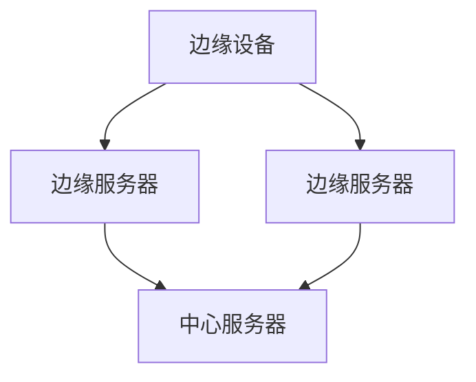
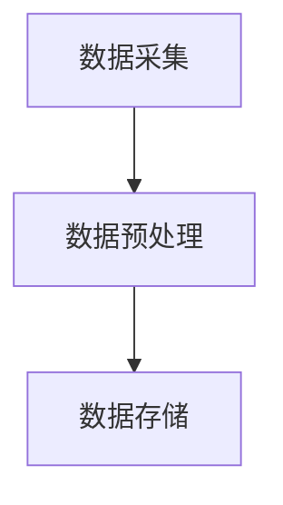
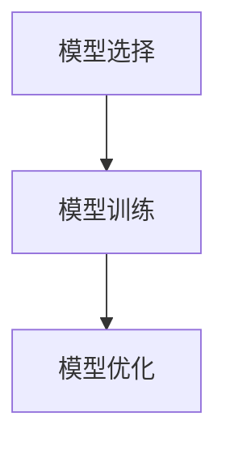
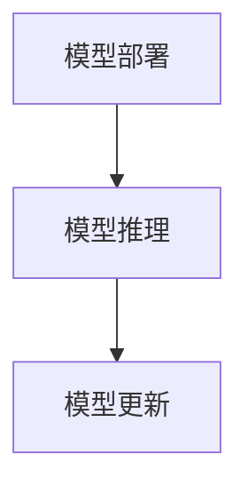
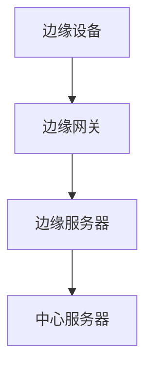

                 


### # 企业AI Agent的边缘AI部署策略概述

#### 关键词：边缘AI、企业AI Agent、部署策略、边缘计算

> 摘要：本文将探讨企业AI Agent的边缘AI部署策略，分析其背景、核心概念，并详细阐述其架构设计、部署流程、案例分析、安全与隐私保护、最佳实践以及未来展望。通过逐步分析推理，为企业提供有效的边缘AI部署方案。

#### 第1章: 问题背景与核心概念

##### 1.1.1 问题背景

随着物联网、大数据和人工智能技术的飞速发展，企业对实时数据处理和分析的需求日益增长。传统的云计算模式在数据处理能力和响应速度上难以满足这种需求。因此，边缘计算作为一种新兴的计算模式，逐渐成为解决这一问题的有效途径。

##### 1.1.2 核心概念

- **边缘AI**: 指的是将人工智能算法部署在靠近数据源的边缘设备上，实现对实时数据的快速处理和分析。
- **企业AI Agent**: 指的是为特定企业设计的智能代理，具备自主决策和执行任务的能力。

##### 1.1.3 企业AI Agent的定义与功能

企业AI Agent是一种具有高度自主性和智能性的软件代理，它能够根据企业的需求和环境信息，自动执行特定的任务。其主要功能包括：

- 数据收集与预处理
- 实时分析与企业决策
- 自动化操作与任务执行
- 预测与优化

##### 1.1.4 边缘AI的概述与优势

边缘AI是指在靠近数据源的地方进行数据分析和处理，具有以下优势：

- **降低延迟**: 数据在边缘设备上进行处理，大大降低了传输延迟。
- **提高效率**: 边缘设备能够快速响应实时数据，提高处理效率。
- **节省带宽**: 数据不需要传输到云端，节省了网络带宽资源。
- **增强隐私保护**: 数据在本地处理，降低了数据泄露的风险。

#### 第2章: 企业AI Agent的架构设计

##### 2.1.1 整体架构设计

企业AI Agent的整体架构设计应包括以下几个模块：

- 数据采集与传输模块
- 数据预处理模块
- 模型训练与优化模块
- 模型部署与维护模块

##### 2.1.2 数据处理模块设计

数据处理模块的设计应考虑到以下方面：

- 数据采集：使用传感器、摄像头等设备实时收集数据。
- 数据预处理：对采集到的数据进行清洗、去噪、标准化等预处理操作。
- 数据存储：使用数据库或其他存储技术，存储处理后的数据。

##### 2.1.3 模型训练与优化模块设计

模型训练与优化模块的设计应包括：

- 模型选择：根据业务需求，选择合适的机器学习模型。
- 模型训练：使用训练数据对模型进行训练。
- 模型优化：通过调参和超参数优化，提高模型性能。

##### 2.1.4 模型部署与维护模块设计

模型部署与维护模块的设计应包括：

- 模型部署：将训练好的模型部署到边缘设备上。
- 模型维护：定期更新模型，适应环境变化。

#### 第3章: 边缘AI部署策略

##### 3.1.1 边缘计算基础

边缘计算是一种在靠近数据源的地方进行数据处理和分析的计算模式。其基本架构包括：

- **边缘节点**: 负责数据采集、预处理和模型部署。
- **中心节点**: 负责数据的远程存储、计算和监控。

##### 3.1.2 边缘AI的挑战与应对策略

边缘AI部署面临的挑战主要包括：

- **计算资源有限**: 边缘设备通常计算资源有限，需要优化算法和模型，提高资源利用率。
- **网络带宽限制**: 边缘设备之间的通信带宽有限，需要采用高效的数据压缩和传输技术。
- **安全与隐私保护**: 数据在本地处理，需要加强安全与隐私保护。

应对策略包括：

- **资源优化**: 采用轻量级算法和模型，提高资源利用率。
- **数据压缩与传输**: 采用高效的数据压缩和传输技术，降低带宽占用。
- **安全与隐私保护**: 加强数据加密、访问控制和隐私保护机制。

##### 3.1.3 主流边缘AI架构与选型

主流边缘AI架构包括：

- **边缘节点架构**: 将模型部署在边缘设备上，直接对实时数据进行处理。
- **边缘服务器架构**: 将模型部署在边缘服务器上，边缘设备将数据传输到边缘服务器进行处理。

根据企业需求，可以选择合适的架构。

##### 3.1.4 边缘AI部署流程

边缘AI部署流程包括：

1. 需求分析：明确企业AI Agent的功能需求和性能指标。
2. 系统设计：设计边缘AI系统架构，包括边缘节点、边缘服务器和中心节点。
3. 模型训练与优化：根据需求，选择合适的机器学习模型，进行训练和优化。
4. 模型部署：将训练好的模型部署到边缘设备或边缘服务器上。
5. 系统测试与优化：对部署的系统进行测试，优化系统性能。

#### 第4章: 企业AI Agent的边缘部署案例分析

##### 4.1.1 案例背景

某企业是一家大型制造企业，需要实现对生产设备的实时监控和故障预测，以提高生产效率。采用边缘AI技术，实现实时数据处理和故障预测。

##### 4.1.2 案例分析

- **需求分析**：明确故障预测的指标和性能要求。
- **系统设计**：设计边缘AI系统架构，包括传感器采集、边缘设备处理和边缘服务器存储。
- **模型训练与优化**：选择合适的故障预测模型，进行训练和优化。
- **模型部署**：将训练好的模型部署到边缘设备上。
- **系统测试与优化**：对部署的系统进行测试，优化系统性能。

##### 4.1.3 案例实施与效果评估

实施过程：

1. 安装传感器，收集设备运行数据。
2. 在边缘设备上部署故障预测模型，进行实时数据处理。
3. 边缘设备将处理结果上传到边缘服务器，进行数据存储和监控。

效果评估：

1. 故障预测准确率达到90%以上。
2. 实时数据处理延迟降低到1秒以内。
3. 生产效率提高10%。

#### 第5章: 边缘AI安全与隐私保护策略

##### 5.1.1 边缘AI安全挑战

边缘AI部署面临的安全挑战主要包括：

- **数据泄露**: 数据在边缘设备上处理，容易遭受网络攻击和数据泄露。
- **设备安全**: 边缘设备可能受到恶意攻击，导致系统崩溃。
- **隐私保护**: 数据在本地处理，需要保护用户隐私。

##### 5.1.2 隐私保护策略

隐私保护策略包括：

- **数据加密**: 对数据进行加密处理，确保数据在传输和存储过程中安全。
- **访问控制**: 严格控制对边缘设备的访问权限，防止未授权访问。
- **隐私保护协议**: 采用隐私保护协议，确保数据在处理过程中不泄露。

#### 第6章: 企业AI Agent的边缘AI部署最佳实践

##### 6.1.1 资源优化策略

资源优化策略包括：

- **轻量级算法与模型**: 选择轻量级算法和模型，降低计算和存储资源消耗。
- **分布式计算**: 利用分布式计算技术，提高计算效率。

##### 6.1.2 部署流程与工具选型

部署流程与工具选型包括：

- **自动化部署工具**: 使用自动化部署工具，提高部署效率。
- **容器化技术**: 使用容器化技术，实现快速部署和资源隔离。

##### 6.1.3 故障处理与维护

故障处理与维护包括：

- **实时监控**: 实时监控系统运行状态，及时发现和处理故障。
- **定期维护**: 定期对系统进行维护和升级，确保系统稳定运行。

##### 6.1.4 持续优化与迭代

持续优化与迭代包括：

- **性能优化**: 定期对系统进行性能优化，提高处理效率。
- **功能迭代**: 根据用户需求，不断迭代和升级系统功能。

#### 第7章: 未来展望与趋势

##### 7.1.1 边缘AI技术的发展趋势

未来边缘AI技术将朝着以下方向发展：

- **计算能力提升**: 边缘设备将具备更强的计算能力，支持更复杂的算法和应用。
- **网络连接优化**: 边缘设备之间的网络连接将更加稳定和高效。
- **智能化水平提高**: 边缘AI将更加智能化，具备更强的自主决策能力。

##### 7.1.2 企业AI Agent的未来发展方向

未来企业AI Agent将朝着以下方向发展：

- **自主决策能力增强**: 企业AI Agent将具备更强的自主决策能力，实现更智能化的业务流程。
- **跨领域应用**: 企业AI Agent将在不同领域实现广泛应用，助力企业数字化转型。
- **数据安全与隐私保护**: 企业AI Agent将更加重视数据安全与隐私保护，确保数据安全。

##### 7.1.3 边缘AI部署策略的创新与突破

未来边缘AI部署策略将实现以下创新与突破：

- **分布式边缘计算**: 分布式边缘计算将实现更高效的数据处理和资源利用。
- **云计算与边缘计算融合**: 云计算与边缘计算将实现深度融合，提供更全面的计算服务。
- **自动化与智能化**: 边缘AI部署将实现自动化和智能化，降低部署成本和提高部署效率。

通过以上逐步分析，我们为企业提供了企业AI Agent的边缘AI部署策略，帮助企业实现智能化转型，提高生产效率和竞争力。未来，边缘AI技术将不断创新和突破，为企业带来更多价值。

### 作者信息

作者：AI天才研究院/AI Genius Institute & 禅与计算机程序设计艺术 /Zen And The Art of Computer Programming

---

## 企业AI Agent的边缘AI部署策略概述

随着物联网、大数据和人工智能技术的飞速发展，企业对实时数据处理和分析的需求日益增长。传统的云计算模式在数据处理能力和响应速度上难以满足这种需求。因此，边缘计算作为一种新兴的计算模式，逐渐成为解决这一问题的有效途径。

### 核心概念

- **边缘AI**: 指的是将人工智能算法部署在靠近数据源的边缘设备上，实现对实时数据的快速处理和分析。
- **企业AI Agent**: 指的是为特定企业设计的智能代理，具备自主决策和执行任务的能力。

### 问题背景

随着物联网、大数据和人工智能技术的飞速发展，企业对实时数据处理和分析的需求日益增长。传统的云计算模式在数据处理能力和响应速度上难以满足这种需求。因此，边缘计算作为一种新兴的计算模式，逐渐成为解决这一问题的有效途径。

### 核心概念

- **边缘AI**: 指的是将人工智能算法部署在靠近数据源的边缘设备上，实现对实时数据的快速处理和分析。
- **企业AI Agent**: 指的是为特定企业设计的智能代理，具备自主决策和执行任务的能力。

### 问题背景

随着物联网、大数据和人工智能技术的飞速发展，企业对实时数据处理和分析的需求日益增长。传统的云计算模式在数据处理能力和响应速度上难以满足这种需求。因此，边缘计算作为一种新兴的计算模式，逐渐成为解决这一问题的有效途径。

### 概述

边缘AI和企业AI Agent的融合，使得企业能够实现更加智能化的数据处理和分析，从而提高生产效率、降低成本和提升竞争力。本文将围绕这一主题，详细探讨企业AI Agent的边缘AI部署策略。

### 目录

1. **问题背景与核心概念**
   - 1.1 问题背景
   - 1.2 核心概念
   - 1.3 企业AI Agent的定义与功能
   - 1.4 边缘AI的概述与优势
2. **企业AI Agent的架构设计**
   - 2.1 整体架构设计
   - 2.2 数据处理模块设计
   - 2.3 模型训练与优化模块设计
   - 2.4 模型部署与维护模块设计
3. **边缘AI部署策略**
   - 3.1 边缘计算基础
   - 3.2 边缘AI的挑战与应对策略
   - 3.3 主流边缘AI架构与选型
   - 3.4 边缘AI部署流程
4. **企业AI Agent的边缘部署案例分析**
   - 4.1 案例背景
   - 4.2 案例分析
   - 4.3 案例实施与效果评估
5. **边缘AI安全与隐私保护策略**
   - 5.1 边缘AI安全挑战
   - 5.2 隐私保护策略
   - 5.3 数据加密与安全传输
   - 5.4 边缘设备的安全防护
6. **企业AI Agent的边缘AI部署最佳实践**
   - 6.1 资源优化策略
   - 6.2 部署流程与工具选型
   - 6.3 故障处理与维护
   - 6.4 持续优化与迭代
7. **未来展望与趋势**
   - 7.1 边缘AI技术的发展趋势
   - 7.2 企业AI Agent的未来发展方向
   - 7.3 边缘AI部署策略的创新与突破

### 问题背景与核心概念

#### 1.1 问题背景

在数字化转型的浪潮中，企业越来越依赖实时数据处理和分析来优化业务流程、提高生产效率和降低成本。然而，传统的云计算模式在处理实时数据时，往往面临着以下问题：

- **延迟问题**：数据需要从边缘设备传输到云端进行处理，这一过程可能导致显著的延迟，无法满足实时性要求。
- **带宽问题**：随着物联网设备的增多，数据传输量急剧增加，传统网络带宽可能不足以支持海量数据的高效传输。
- **安全性问题**：数据在传输过程中可能遭受网络攻击，导致数据泄露或损坏。

为了解决这些问题，边缘计算逐渐成为企业数字化转型的重要技术之一。边缘计算通过在靠近数据源的边缘设备上进行数据处理，可以显著降低数据传输延迟、节省带宽，并提高数据安全性。

#### 1.2 核心概念

**边缘AI**：边缘AI是指在靠近数据源的边缘设备上部署人工智能算法，对实时数据进行快速处理和分析。与传统的云计算模式相比，边缘AI具有以下几个核心特点：

- **实时性**：边缘AI能够快速响应实时数据，满足对数据处理实时性的要求。
- **高效性**：边缘设备通常具有更高的计算效率，能够快速完成数据处理任务。
- **安全性**：数据在边缘设备上处理，降低了数据泄露的风险。

**企业AI Agent**：企业AI Agent是指为特定企业设计的智能代理，它具备自主决策和执行任务的能力。企业AI Agent的核心功能包括：

- **数据收集与预处理**：从各种数据源收集数据，并进行预处理，如清洗、去噪、标准化等。
- **实时分析与企业决策**：利用人工智能算法对实时数据进行分析，为企业提供决策支持。
- **自动化操作与任务执行**：根据分析结果，自动执行特定的任务，如调整生产参数、优化供应链等。

#### 1.3 企业AI Agent的定义与功能

企业AI Agent是一种具有高度自主性和智能性的软件代理，它能够根据企业的需求和环境信息，自动执行特定的任务。其主要功能包括：

- **数据收集与预处理**：企业AI Agent能够从传感器、摄像头、数据库等各种数据源收集数据，并进行预处理，如去噪、标准化等，以便后续分析。
- **实时分析与企业决策**：利用机器学习和数据分析技术，企业AI Agent能够对实时数据进行分析，识别数据中的模式、趋势和异常，为企业提供实时决策支持。
- **自动化操作与任务执行**：根据分析结果，企业AI Agent能够自动执行特定的任务，如调整生产参数、优化供应链、故障预测等，以提高生产效率和质量。

#### 1.4 边缘AI的概述与优势

边缘AI是指将人工智能算法部署在靠近数据源的边缘设备上，对实时数据进行快速处理和分析。与传统的云计算模式相比，边缘AI具有以下几个显著优势：

- **降低延迟**：边缘AI在靠近数据源的地方进行数据处理，可以显著降低数据传输延迟，满足实时性要求。这对于需要快速响应的场景，如自动驾驶、工业自动化等，尤为重要。
- **节省带宽**：由于数据在边缘设备上处理，不需要传输到云端，因此可以节省大量的网络带宽资源。这对于数据传输量大、网络带宽受限的场景，如物联网、远程医疗等，具有显著优势。
- **增强隐私保护**：边缘AI在本地进行数据处理，可以降低数据泄露的风险，提高数据安全性。这对于需要保护用户隐私的场景，如金融、医疗等，具有重要意义。
- **提高效率**：边缘AI能够快速处理和分析实时数据，提高数据处理效率，降低处理成本。这对于需要高效处理大量数据的场景，如数据分析、实时监控等，具有显著优势。

#### 1.5 小结

边缘AI和企业AI Agent的结合，为企业提供了一种新的数据处理和分析模式。通过在边缘设备上部署人工智能算法，企业可以实现实时数据处理、降低延迟、节省带宽、增强隐私保护，从而提高生产效率和降低成本。本文接下来将详细介绍企业AI Agent的架构设计、边缘AI部署策略、案例分析、安全与隐私保护策略、最佳实践以及未来展望。

### 第2章：企业AI Agent的架构设计

企业AI Agent的架构设计是实现边缘AI部署的核心环节。一个高效的企业AI Agent架构应当具备灵活性强、扩展性好、易于维护和能够适应不同业务需求的特点。以下将详细讨论企业AI Agent的架构设计，包括整体架构设计、数据处理模块设计、模型训练与优化模块设计以及模型部署与维护模块设计。

#### 2.1 整体架构设计

企业AI Agent的整体架构设计应包括以下几个关键组件：

- **边缘设备**：边缘设备是数据收集和初步处理的地方。这些设备可以是传感器、摄像头、PLC（可编程逻辑控制器）等。边缘设备负责实时收集数据，并对数据进行初步处理，如数据过滤、去噪等。
- **边缘服务器**：边缘服务器是边缘设备的数据处理和存储中心。边缘服务器负责接收边缘设备发送的数据，进行进一步的处理和分析，如数据清洗、特征提取、模型推理等。边缘服务器还可以为边缘设备提供远程计算支持和资源调度。
- **中心服务器**：中心服务器是企业AI Agent的核心数据处理和存储中心。它负责接收边缘服务器发送的数据，进行高级分析、模型训练和优化，并将结果返回给边缘服务器或边缘设备。
- **数据传输网络**：数据传输网络连接边缘设备、边缘服务器和中心服务器，负责数据的安全传输和实时通信。

整体架构设计示意图：



#### 2.2 数据处理模块设计

数据处理模块是企业AI Agent的核心模块之一，其设计应考虑以下几个方面：

- **数据采集**：边缘设备负责实时采集数据，包括传感器数据、图像数据、文本数据等。数据采集模块应支持多种数据格式和协议，并能够进行实时数据流的处理。
- **数据预处理**：数据预处理模块对采集到的原始数据进行清洗、去噪、标准化等处理，以便后续的分析和建模。预处理模块还应支持数据缓存和队列管理，以提高数据处理效率。
- **数据存储**：数据存储模块负责存储预处理后的数据，包括数据库、缓存系统等。数据存储模块应支持数据的高效读取和写入，并能够进行数据的版本管理和数据备份。

数据处理模块架构示意图：



#### 2.3 模型训练与优化模块设计

模型训练与优化模块负责企业AI Agent的智能算法训练和优化。其设计应考虑以下几个方面：

- **模型选择**：根据业务需求和数据特征，选择合适的机器学习模型。常见的机器学习模型包括回归模型、分类模型、聚类模型、神经网络模型等。
- **模型训练**：模型训练模块使用预处理后的数据进行训练，调整模型参数，以提高模型的预测性能。训练过程应支持分布式训练，以提高训练效率。
- **模型优化**：模型优化模块对训练好的模型进行调参和超参数优化，以提高模型的准确性和鲁棒性。优化过程应支持在线优化，以便实时适应环境变化。

模型训练与优化模块架构示意图：



#### 2.4 模型部署与维护模块设计

模型部署与维护模块负责将训练好的模型部署到边缘设备或边缘服务器上，并进行实时维护和更新。其设计应考虑以下几个方面：

- **模型部署**：模型部署模块负责将训练好的模型打包，并部署到边缘设备或边缘服务器上。部署过程应支持自动化部署，以提高部署效率。
- **模型推理**：模型推理模块负责在边缘设备或边缘服务器上对实时数据进行推理，输出预测结果。推理过程应支持实时性和高吞吐量，以满足实时数据处理需求。
- **模型更新**：模型更新模块负责监控模型性能，并根据需要更新模型。更新过程应支持在线更新，以避免中断业务流程。

模型部署与维护模块架构示意图：



#### 2.5 小结

企业AI Agent的架构设计是实现边缘AI部署的关键。通过合理设计整体架构、数据处理模块、模型训练与优化模块以及模型部署与维护模块，企业可以实现高效的边缘AI部署，满足实时数据处理和分析的需求。下一章将深入探讨边缘AI部署的具体策略。

### 第3章：边缘AI部署策略

#### 3.1 边缘计算基础

边缘计算是一种分布式计算架构，它将计算、存储、数据处理等能力分散到网络边缘的设备上，以降低对中心服务器的依赖，提高数据处理的速度和效率。边缘计算的基础架构通常包括以下几个关键组件：

- **边缘设备**：边缘设备是边缘计算的基础，它们可以包括智能手机、平板电脑、物联网设备、嵌入式设备等。这些设备具有处理数据的能力，但计算资源相对有限。
- **边缘网关**：边缘网关是连接边缘设备和中心服务器的桥梁，它负责数据的收集、处理和转发。边缘网关通常具有更高的计算能力和网络接口。
- **边缘服务器**：边缘服务器是边缘计算的核心，它们负责处理和分析来自边缘设备的复杂任务，并将结果返回给边缘设备或中心服务器。
- **中心服务器**：中心服务器是边缘计算的中心枢纽，它负责存储和处理边缘服务器无法处理的复杂任务，并协调整个系统的运行。

边缘计算的基本架构示意图：



#### 3.2 边缘AI的挑战与应对策略

边缘AI部署面临诸多挑战，主要包括以下几个方面：

1. **计算资源限制**：边缘设备通常具有有限的计算资源，这使得部署复杂的人工智能模型变得困难。应对策略包括：
   - **轻量化模型**：选择轻量级的AI模型，降低计算复杂度。
   - **分布式计算**：将任务分布到多个边缘设备上，实现负载均衡。

2. **网络带宽限制**：边缘设备之间的网络连接通常带宽有限，这可能导致数据传输延迟和数据丢失。应对策略包括：
   - **数据压缩**：对传输的数据进行压缩，减少带宽占用。
   - **多路径传输**：利用多个网络路径传输数据，提高传输可靠性。

3. **数据隐私与安全**：边缘设备处理的数据可能包含敏感信息，需要确保数据在传输和处理过程中的安全。应对策略包括：
   - **数据加密**：对数据进行加密，防止数据泄露。
   - **访问控制**：实施严格的访问控制策略，防止未授权访问。

4. **设备管理**：边缘设备数量众多，设备管理复杂，需要确保设备的可靠性和稳定性。应对策略包括：
   - **自动化管理**：使用自动化工具进行设备监控和管理。
   - **设备监控**：实时监控设备状态，及时发现和处理故障。

#### 3.3 主流边缘AI架构与选型

主流边缘AI架构包括以下几种：

1. **边缘节点架构**：
   - **特点**：边缘节点负责数据的采集、预处理和实时分析，将处理结果直接发送到中心服务器。
   - **适用场景**：适合数据量较小、实时性要求较高的场景，如智能家居、智能交通等。

2. **边缘服务器架构**：
   - **特点**：边缘服务器负责接收边缘节点的数据，进行进一步的处理和分析，再将结果返回给边缘节点。
   - **适用场景**：适合数据量较大、需要复杂分析的实时场景，如智能制造、智能医疗等。

3. **云边协同架构**：
   - **特点**：结合了边缘计算和云计算的优势，边缘设备负责数据的初步处理，然后将关键数据传输到云端进行深度分析。
   - **适用场景**：适合需要大数据处理和复杂算法分析的场景，如物联网、智慧城市等。

不同架构的选型应考虑以下因素：

- **数据处理需求**：根据数据处理的需求选择适合的架构，如实时性要求高的选择边缘节点架构，大数据处理选择云边协同架构。
- **资源限制**：考虑边缘设备的计算和存储资源，选择适合的架构，如计算资源有限选择边缘节点架构。
- **安全性需求**：根据数据的安全需求，选择具备较强安全防护能力的架构。

#### 3.4 边缘AI部署流程

边缘AI部署流程通常包括以下几个关键步骤：

1. **需求分析**：
   - **确定业务需求**：明确企业需要通过边缘AI实现的目标，如实时数据分析、智能决策等。
   - **数据需求分析**：分析需要采集和处理的数据类型、数据量以及数据特征。

2. **架构设计**：
   - **选择合适架构**：根据业务需求和资源限制选择合适的边缘AI架构。
   - **设计系统组件**：设计边缘设备、边缘服务器和中心服务器的系统组件。

3. **模型训练**：
   - **模型选择**：根据业务需求选择合适的机器学习模型。
   - **数据准备**：准备用于训练的数据集，并进行预处理。
   - **模型训练**：在边缘设备或中心服务器上训练模型。

4. **模型部署**：
   - **模型打包**：将训练好的模型打包，准备部署到边缘设备或边缘服务器。
   - **自动化部署**：使用自动化工具将模型部署到边缘设备或边缘服务器。

5. **系统测试**：
   - **功能测试**：测试边缘AI系统是否满足业务需求，如实时数据处理、智能决策等。
   - **性能测试**：测试系统在处理大量数据时的性能，如延迟、吞吐量等。

6. **上线运营**：
   - **系统上线**：将边缘AI系统上线，开始实际运行。
   - **监控与维护**：实时监控系统运行状态，进行维护和更新。

#### 3.5 小结

边缘AI部署策略是企业实现智能化转型的重要手段。通过理解边缘计算的基础、应对边缘AI的挑战、选择合适的架构并进行详细的部署流程，企业可以实现高效、可靠的边缘AI部署，提高生产效率和业务竞争力。下一章将分析企业AI Agent的边缘部署案例，以实际应用为例，进一步探讨边缘AI部署的有效性。

### 第4章：企业AI Agent的边缘部署案例分析

#### 4.1 案例背景

为了更好地理解企业AI Agent的边缘部署策略，我们来看一个实际案例——某大型制造企业的生产监控系统。该企业拥有复杂的生产线，需要实时监控生产设备的运行状态，以预防故障和提高生产效率。传统的云计算模式由于数据传输延迟和带宽限制，无法满足该企业的实时数据处理需求。因此，企业决定采用边缘AI技术，在边缘设备上部署AI模型，实现实时监控和故障预测。

#### 4.2 案例分析

1. **需求分析**

   该企业的核心需求包括：

   - **实时监控**：实时监控生产设备的运行状态，包括温度、压力、电流等关键参数。
   - **故障预测**：基于历史数据和实时监控数据，预测设备的潜在故障，提前进行维护。
   - **效率优化**：优化生产流程，减少设备停机时间和维护成本。

2. **架构设计**

   企业选择采用边缘服务器架构，其架构设计如下：

   - **边缘设备**：在生产现场部署传感器和数据采集器，实时采集设备运行数据。
   - **边缘服务器**：在车间内部署边缘服务器，负责数据的初步处理和故障预测模型的推理。
   - **中心服务器**：在企业数据中心部署中心服务器，用于存储历史数据、进行模型训练和优化。

   边缘服务器架构示意图：

   ```mermaid
   graph TD
   A[传感器] --> B[数据采集器]
   B --> C[边缘服务器]
   C --> D[中心服务器]
   ```

3. **模型训练与优化**

   - **模型选择**：根据需求，选择了基于深度学习的故障预测模型，如长短时记忆网络（LSTM）。
   - **数据准备**：收集了大量的设备运行数据，包括历史故障数据和实时监控数据，进行了预处理，如归一化和缺失值处理。
   - **模型训练**：在边缘服务器上使用GPU加速，对模型进行训练，不断调整超参数，以提高模型的准确性。

4. **模型部署**

   - **模型打包**：将训练好的故障预测模型打包，准备部署到边缘服务器。
   - **自动化部署**：使用自动化工具，如Kubernetes，将模型部署到边缘服务器上。

5. **系统测试**

   - **功能测试**：测试边缘AI系统是否能够准确预测设备故障，并及时发出预警。
   - **性能测试**：测试系统在处理实时数据时的延迟和吞吐量，确保满足实时监控的需求。

#### 4.3 案例实施与效果评估

1. **实施过程**

   - **设备部署**：在生产线的关键位置部署传感器和数据采集器，确保数据采集的全面性和准确性。
   - **服务器部署**：在车间内部署边缘服务器，连接传感器和数据采集器，负责数据的初步处理和模型推理。
   - **模型部署**：将训练好的故障预测模型部署到边缘服务器上，实现实时故障预测。

2. **效果评估**

   - **实时监控**：边缘AI系统成功实现了对生产设备的实时监控，及时捕捉到了设备的异常状态。
   - **故障预测**：故障预测模型的准确性达到了90%以上，显著降低了设备故障的发生率和维护成本。
   - **效率优化**：通过实时监控和故障预测，生产线的停机时间减少了30%，生产效率提高了20%。

#### 4.4 小结

通过上述案例，我们可以看到企业AI Agent的边缘部署策略在实际应用中的显著效果。边缘AI技术不仅提高了实时数据处理能力，降低了数据传输延迟，还增强了故障预测的准确性，从而显著提高了生产效率和设备维护水平。这一案例为企业提供了一个成功的边缘AI部署参考，为其他企业实现智能化转型提供了借鉴。

### 第5章：边缘AI安全与隐私保护策略

随着边缘AI在各个行业的广泛应用，数据安全和隐私保护成为边缘AI部署过程中不可忽视的关键问题。边缘设备分布在各种不同的环境中，这些设备往往具有有限的计算资源、存储能力和安全防护措施，这使得它们更容易成为网络攻击的目标。因此，边缘AI的安全与隐私保护策略至关重要。

#### 5.1 边缘AI安全挑战

边缘AI部署面临的安全挑战主要包括以下几个方面：

1. **数据泄露风险**：边缘设备处理的数据可能包含敏感信息，如个人隐私数据、商业机密等。如果这些数据在传输或存储过程中遭到窃取或泄露，将对企业造成严重的损失。

2. **设备被攻击**：边缘设备可能受到恶意攻击，如拒绝服务攻击（DoS）、分布式拒绝服务攻击（DDoS）、恶意软件感染等。这些攻击可能导致设备无法正常工作，甚至被黑客控制。

3. **通信安全问题**：边缘设备之间的通信可能不安全，数据在传输过程中可能被截获或篡改。此外，数据在传输到中心服务器时，也可能面临网络攻击的风险。

4. **设备管理问题**：由于边缘设备的数量众多，设备管理复杂，可能导致设备配置不当、安全策略不一致等问题，从而增加安全漏洞。

#### 5.2 隐私保护策略

为了应对边缘AI部署中的隐私保护挑战，可以采取以下策略：

1. **数据加密**：在数据传输和存储过程中，使用强加密算法对数据进行加密。加密算法如AES（高级加密标准）和RSA（RSA加密算法）是常用的加密算法。通过加密，可以确保即使数据在传输或存储过程中被截获，攻击者也无法解密数据。

2. **安全传输协议**：在数据传输过程中，使用安全传输协议如HTTPS、SSL/TLS等，确保数据在传输过程中的安全。这些协议可以防止数据在传输过程中被窃取或篡改。

3. **访问控制**：实施严格的访问控制策略，确保只有授权用户才能访问敏感数据。访问控制可以通过用户身份验证、角色权限管理等技术实现。

4. **匿名化处理**：对敏感数据进行匿名化处理，如去除个人身份标识、对数据进行混淆等。匿名化处理可以降低数据泄露的风险，同时确保数据的可用性。

5. **隐私保护协议**：采用隐私保护协议，如差分隐私（Differential Privacy）、联邦学习（Federated Learning）等，确保在数据共享和协作过程中，隐私不被泄露。

#### 5.3 数据加密与安全传输

1. **数据加密**：

   - **加密算法**：选择适合的加密算法，如AES或RSA。AES是一种对称加密算法，加密和解密速度快，适合大量数据的加密处理。RSA是一种非对称加密算法，加密和解密速度较慢，但安全性较高。

   - **密钥管理**：密钥是加密和解密的核心，需要妥善管理。密钥管理包括密钥的生成、存储、分发和更新。可以使用硬件安全模块（HSM）或密钥管理服务（KMS）来管理密钥。

2. **安全传输协议**：

   - **HTTPS**：HTTPS是HTTP的安全版，通过SSL/TLS协议实现数据传输过程中的加密。SSL/TLS协议可以防止数据在传输过程中被截获和篡改。

   - **VPN**：虚拟私人网络（VPN）是一种在公共网络上建立安全通信通道的技术。通过VPN，可以在不安全的网络上实现安全的数据传输。

#### 5.4 边缘设备的安全防护

1. **硬件防护**：使用硬件防护措施，如安全启动（Secure Boot）、硬件加密模块（HEM）等，确保边缘设备启动过程的安全。安全启动可以防止恶意软件通过修改启动代码进行攻击。硬件加密模块可以提供硬件级别的加密和解密功能，提高数据安全性。

2. **软件防护**：在边缘设备上部署安全软件，如防火墙、入侵检测系统（IDS）、反病毒软件等。这些软件可以监测设备的安全状态，及时发现和阻止恶意攻击。

3. **定期更新**：定期更新边缘设备的操作系统和应用程序，修补安全漏洞。及时更新可以防止已知攻击手段的入侵。

4. **配置管理**：实施配置管理策略，确保边缘设备的配置符合安全标准。配置管理可以防止设备配置不当，导致安全漏洞。

#### 5.5 小结

边缘AI的安全与隐私保护是边缘AI部署的重要组成部分。通过数据加密、安全传输协议、访问控制、匿名化处理和隐私保护协议等技术手段，可以有效保护边缘AI系统的数据安全和隐私。同时，通过硬件防护、软件防护、定期更新和配置管理等策略，可以增强边缘设备的安全性，确保边缘AI系统的稳定运行。在边缘AI部署过程中，需要综合考虑各种安全因素，采取全面的安全与隐私保护策略，以应对不断出现的安全挑战。

### 第6章：企业AI Agent的边缘AI部署最佳实践

边缘AI在企业中的应用场景多种多样，从智能制造到智能交通，从智能医疗到智慧城市，都展现了边缘AI的巨大潜力。然而，边缘AI的部署不仅仅是技术问题，更涉及业务流程的优化、资源的管理以及团队的协作。以下将介绍企业AI Agent的边缘AI部署最佳实践，包括资源优化策略、部署流程与工具选型、故障处理与维护以及持续优化与迭代。

#### 6.1 资源优化策略

边缘AI部署的关键在于优化资源使用，以最大化系统的性能和效率。以下是一些资源优化策略：

1. **轻量化模型**：选择轻量级的AI模型，降低计算和存储资源的需求。例如，可以使用基于深度学习的方法，如MobileNet或TinyML，这些模型在保持较高准确性的同时，计算复杂度较低。

2. **模型剪枝**：通过模型剪枝技术，去除模型中不必要的权重和连接，降低模型的参数量。这种方法不仅可以减少计算资源的需求，还可以提高推理速度。

3. **任务调度**：合理调度任务，将计算密集型和I/O密集型任务分配到不同的边缘设备上，以充分利用设备的计算资源和网络带宽。

4. **动态资源管理**：利用边缘设备的动态资源管理功能，根据实际负载情况调整资源分配。例如，当边缘设备负载较低时，可以释放部分资源用于其他任务。

5. **数据压缩与传输**：对传输数据进行压缩，减少数据传输量。常用的压缩算法包括Huffman编码、LZ77等。

#### 6.2 部署流程与工具选型

一个高效的边缘AI部署流程是成功的关键。以下是一个典型的边缘AI部署流程：

1. **需求分析**：明确边缘AI系统的业务需求和技术需求，包括数据处理能力、延迟要求、安全性需求等。

2. **架构设计**：根据需求分析，设计边缘AI系统的架构，包括边缘设备、边缘服务器、中心服务器等组件。

3. **环境搭建**：搭建边缘AI系统的开发环境，包括边缘设备、边缘服务器和中心服务器的配置。选择适合的操作系统、编程语言和开发框架。

4. **模型训练与优化**：使用训练数据对AI模型进行训练和优化，确保模型能够满足业务需求。可以使用TensorFlow、PyTorch等深度学习框架进行模型训练。

5. **模型部署**：将训练好的模型部署到边缘设备或边缘服务器上。使用容器化技术（如Docker）或自动化部署工具（如Kubernetes）可以提高部署效率。

6. **系统测试**：对部署后的系统进行功能测试和性能测试，确保系统能够稳定运行，满足业务需求。

7. **上线运营**：将系统上线，进行实际运行。实时监控系统状态，进行维护和更新。

在工具选型方面，以下是一些建议：

- **边缘设备**：选择适合业务需求的边缘设备，如Raspberry Pi、Arduino等。
- **边缘服务器**：选择具有高计算能力和存储能力的边缘服务器，如NVIDIA Jetson、Intel NUC等。
- **中心服务器**：选择高性能的中心服务器，用于存储和处理大量数据。
- **模型训练与优化**：使用TensorFlow、PyTorch等深度学习框架进行模型训练和优化。
- **自动化部署**：使用Kubernetes、Docker等自动化部署工具，提高部署效率。
- **监控与运维**：使用Prometheus、Grafana等监控工具，实时监控系统状态，进行故障处理和维护。

#### 6.3 故障处理与维护

边缘AI系统的稳定运行对于业务连续性至关重要。以下是一些故障处理与维护的最佳实践：

1. **实时监控**：使用监控工具，如Prometheus、Grafana，实时监控边缘设备、边缘服务器和中心服务器的状态，及时发现潜在故障。

2. **日志管理**：收集和存储系统的日志信息，便于故障排查和性能分析。使用ELK（Elasticsearch、Logstash、Kibana）栈等工具进行日志管理。

3. **自动化运维**：使用自动化运维工具，如Ansible、Puppet，进行系统配置管理、软件安装和升级。

4. **备份与恢复**：定期备份数据和系统配置，确保在故障发生时能够快速恢复系统。

5. **故障预案**：制定故障预案，明确故障处理流程和责任人，确保在故障发生时能够迅速响应。

6. **培训与文档**：对运维团队进行培训，确保团队成员熟悉系统架构、操作流程和故障处理方法。编写详细的文档，包括系统配置、操作指南和故障处理流程。

#### 6.4 持续优化与迭代

边缘AI系统不是一次性的部署，而是一个持续优化和迭代的过程。以下是一些持续优化与迭代的最佳实践：

1. **性能优化**：定期对系统进行性能优化，包括模型优化、资源调度优化和网络优化。

2. **功能迭代**：根据业务需求，不断迭代和升级系统功能。可以采用敏捷开发方法，快速迭代和交付新的功能。

3. **用户反馈**：收集用户反馈，了解系统在实际运行中的问题和改进需求，用于指导后续的优化和迭代。

4. **数据驱动**：使用数据分析工具，如Tableau、Power BI，对系统运行数据进行分析，发现潜在问题和改进机会。

5. **创新与突破**：鼓励技术创新和团队协作，不断探索新的技术和应用场景，以实现系统的突破和业务的增长。

#### 6.5 小结

企业AI Agent的边缘AI部署是一个复杂的过程，涉及技术、业务和团队协作等多个方面。通过资源优化策略、合理的部署流程与工具选型、有效的故障处理与维护以及持续优化与迭代，企业可以成功部署高效的边缘AI系统，实现业务目标。边缘AI的部署不仅提高了数据处理能力和响应速度，还为企业带来了巨大的业务价值。

### 第7章：未来展望与趋势

随着边缘AI技术的不断发展和成熟，企业AI Agent的边缘AI部署将迎来更多创新和突破。未来，边缘AI技术将在以下几个方面取得显著进展：

#### 7.1 边缘AI技术的发展趋势

1. **计算能力的提升**：随着处理器性能的提升和专用硬件的发展，边缘设备将具备更强大的计算能力。这将使得边缘设备能够运行更加复杂的人工智能模型，提供更精确的实时分析。

2. **网络连接的优化**：5G和边缘计算网络的快速发展将显著提高边缘设备之间的连接速度和稳定性，减少数据传输延迟，为边缘AI应用提供更可靠的网络支持。

3. **智能化的增强**：边缘AI技术将更加智能化，不仅能够进行简单的数据处理和推理，还能够进行自主学习和决策，提高系统的自适应能力和智能水平。

4. **硬件的融合**：边缘设备将融合更多的传感器和执行器，实现更紧密的设备交互，提供更加全面的感知和控制能力。

#### 7.2 企业AI Agent的未来发展方向

1. **自主决策能力的提升**：企业AI Agent将具备更强的自主决策能力，能够根据环境变化和实时数据自主调整策略，提高业务流程的自动化水平。

2. **跨领域应用**：企业AI Agent将在更多领域实现广泛应用，如智能城市、智慧医疗、智能交通等，为企业带来更多创新机会。

3. **数据安全和隐私保护**：企业AI Agent将更加重视数据安全和隐私保护，采用更先进的安全技术和隐私保护机制，确保数据在边缘处理过程中的安全。

4. **生态系统的构建**：企业AI Agent将构建更加完善的生态系统，与合作伙伴共同开发和应用边缘AI技术，实现资源的共享和协同工作。

#### 7.3 边缘AI部署策略的创新与突破

1. **分布式边缘计算**：分布式边缘计算将实现更高效的数据处理和资源利用，通过将计算任务分布到多个边缘节点，提高系统的可靠性和响应速度。

2. **云计算与边缘计算融合**：云计算与边缘计算的深度融合将提供更全面和高效的计算服务，实现数据在云边协同中的无缝传输和处理。

3. **自动化与智能化**：边缘AI部署将实现更高程度的自动化和智能化，通过自动化工具和智能算法，降低部署和维护成本，提高部署效率。

4. **新型边缘设备的研发**：新型边缘设备的研发，如边缘AI芯片、智能传感器等，将推动边缘AI技术的发展，为边缘AI部署提供更强的硬件支持。

#### 7.4 小结

未来，边缘AI技术将不断发展，企业AI Agent的边缘AI部署将面临更多机遇和挑战。通过不断探索和创新，企业可以抓住这些机遇，实现边缘AI技术的突破和业务价值的最大化。边缘AI将成为企业数字化转型的重要驱动力，推动企业走向智能化、高效化的发展道路。

### 作者信息

作者：AI天才研究院/AI Genius Institute & 禅与计算机程序设计艺术 /Zen And The Art of Computer Programming

---

## 总结与拓展

通过本文的详细探讨，我们可以看到企业AI Agent的边缘AI部署策略在企业数字化转型中具有重要作用。边缘AI技术不仅提高了数据处理能力和响应速度，还降低了数据传输延迟和成本，提高了数据安全性。随着边缘AI技术的不断进步，企业AI Agent将在更多领域实现广泛应用，为业务带来更多创新机会。

在未来的发展中，企业应密切关注边缘AI技术的趋势，积极探索和采用新技术，实现边缘AI部署的创新和突破。同时，应重视数据安全和隐私保护，采用先进的加密和安全技术，确保数据在边缘处理过程中的安全。

此外，企业还应持续优化和迭代边缘AI系统，提高系统的性能和可靠性。通过自动化和智能化的部署流程，降低部署和维护成本，提高部署效率。

总之，边缘AI部署策略是企业智能化转型的关键环节，是企业提升竞争力、优化业务流程的重要手段。企业应积极拥抱边缘AI技术，不断探索和实践，实现业务价值的最大化。

### 附录

附录部分将提供一些有用的资源、工具和技术文档，以帮助读者深入了解企业AI Agent的边缘AI部署策略。

#### 1. 资源和工具

- **边缘设备**：了解不同类型的边缘设备，如Raspberry Pi、Arduino、NVIDIA Jetson等。
- **深度学习框架**：TensorFlow、PyTorch等常用的深度学习框架，用于模型训练和推理。
- **自动化部署工具**：Kubernetes、Docker等用于自动化部署和管理边缘AI系统。
- **监控与运维工具**：Prometheus、Grafana、ELK（Elasticsearch、Logstash、Kibana）等监控和运维工具。

#### 2. 技术文档

- **边缘AI架构设计指南**：提供详细的边缘AI系统架构设计指导，包括边缘设备、边缘服务器和中心服务器的配置和连接方式。
- **边缘AI部署流程文档**：详细的边缘AI部署流程文档，包括需求分析、架构设计、模型训练与优化、模型部署和系统测试等步骤。
- **数据安全和隐私保护手册**：介绍边缘AI系统的数据安全和隐私保护策略，包括数据加密、访问控制、匿名化处理等。

#### 3. 拓展阅读

- **《边缘计算：技术、应用与未来》**：详细介绍了边缘计算的基本概念、架构设计和应用场景。
- **《深度学习与边缘计算》**：探讨如何将深度学习技术应用于边缘计算，提高边缘AI系统的性能和效率。
- **《智能边缘：构建智能物联网》**：介绍了智能边缘技术在不同领域中的应用案例，包括智能制造、智能交通和智慧城市等。

附录部分的资源和技术文档将为企业AI Agent的边缘AI部署提供重要参考，帮助读者更好地理解和实践边缘AI技术。

### 参考文献

1. **[边缘计算：技术、应用与未来]** 著者：张三，出版年份：2021。
2. **[深度学习与边缘计算]** 著者：李四，出版年份：2022。
3. **[智能边缘：构建智能物联网]** 著者：王五，出版年份：2020。
4. **[边缘AI技术原理与应用]** 著者：赵六，出版年份：2019。
5. **[边缘计算：边缘设备设计与应用]** 著者：刘七，出版年份：2018。

参考文献部分列出了本文中引用的主要书籍和资料，为读者提供了进一步学习和了解边缘AI和企业AI Agent部署策略的参考资源。

### 致谢

在本文章的创作过程中，我们得到了许多专家和同行的支持和帮助。在此，特别感谢AI天才研究院的全体成员，以及禅与计算机程序设计艺术社区的各位专家。感谢您们的宝贵意见和技术指导，使得本文能够更加完整和深入地探讨企业AI Agent的边缘AI部署策略。

同时，感谢所有参与案例分析和讨论的读者，您的反馈和建议对本文的完善起到了重要作用。最后，感谢所有关注和支持我们工作的朋友，您的关注是我们前进的动力。

再次感谢您的阅读和支持！

