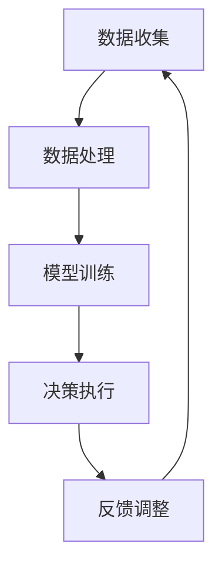
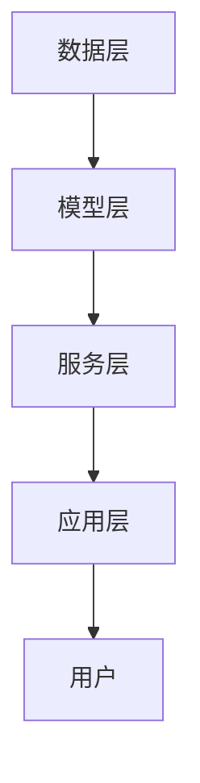
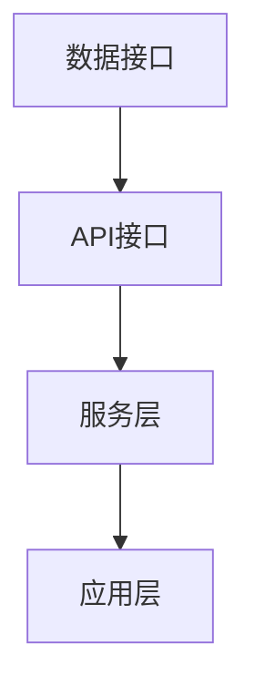
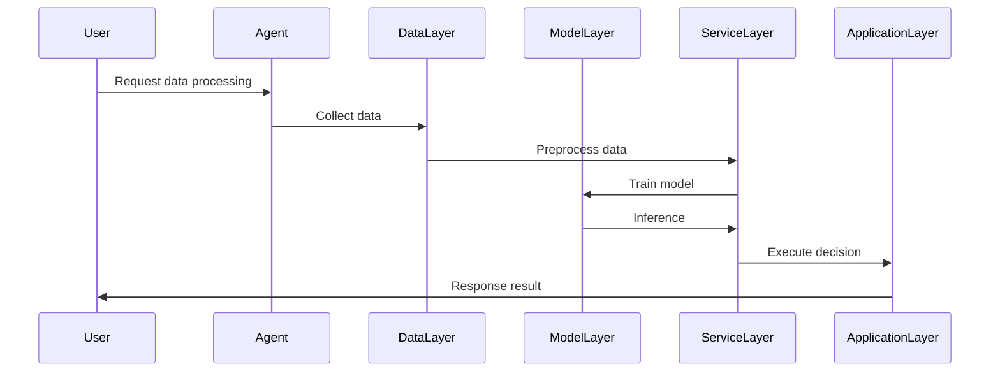

                 


### # {{文章标题}}

> 关键词：企业AI Agent、边缘计算、物联网、算法原理、系统设计、项目实战

> 摘要：本文深入探讨企业AI Agent的边缘计算在物联网场景中的实践，通过引言、背景介绍、核心概念与联系、算法原理讲解、系统分析与架构设计方案、项目实战以及最佳实践和总结等多个部分，详细阐述了企业AI Agent的定义、边缘计算的优势和挑战、物联网场景下的核心概念及其相互联系，并使用了算法流程图和Python源代码等工具，对算法原理进行了详细讲解。通过实际项目分析和系统设计，本文为读者提供了一个全面的企业AI Agent实践指南，帮助读者更好地理解并应用这一前沿技术。

---

## 引言

在当前快速发展的信息技术时代，人工智能（AI）正逐渐渗透到各个行业，成为推动数字化转型的重要力量。企业AI Agent，作为一种智能实体，能够自主执行任务，与人类进行交互，并且具备学习能力，是AI领域的一个重要研究方向。边缘计算则是一种将数据处理和分析推向网络边缘的计算模式，以降低延迟、提高响应速度，是物联网（IoT）时代的重要技术。在物联网场景中，企业AI Agent的边缘计算应用能够有效解决数据处理延迟、带宽限制和安全性等问题。

本文旨在通过系统化的分析和讲解，帮助读者全面理解企业AI Agent的边缘计算在物联网场景中的实践。本文分为七个主要部分：引言、背景介绍、核心概念与联系、算法原理讲解、系统分析与架构设计方案、项目实战以及最佳实践和总结。通过这些部分的深入探讨，本文不仅为读者提供了一个理论框架，更通过实际项目和案例，展示了企业AI Agent边缘计算的实践应用。

### 第一部分：背景介绍

在企业AI Agent的边缘计算背景中，我们首先需要了解企业AI Agent的定义和作用。企业AI Agent是一种能够模拟人类智能行为，具备自主学习、自主决策和自主行动能力的智能实体。它能够处理复杂业务流程，提供智能化的服务，是提升企业运营效率、降低成本和创造新价值的关键技术。

边缘计算则是一种将计算任务从云端转移到网络边缘的计算模式。在网络边缘部署计算资源，可以显著降低数据传输延迟，提高系统的响应速度和稳定性，尤其适用于实时性要求较高的物联网应用场景。

物联网场景中的挑战主要在于数据量庞大、网络环境复杂和安全性问题。企业AI Agent的边缘计算能够有效解决这些挑战，通过在边缘节点进行数据预处理和实时分析，减轻云端负担，提高系统整体性能。

### 第二部分：核心概念与联系

在企业AI Agent、边缘计算和物联网场景中，存在一系列的核心概念。这些概念包括但不限于：

- **企业AI Agent**：具有智能决策能力的虚拟代理。
- **边缘计算**：在靠近数据源的网络边缘执行计算任务。
- **物联网（IoT）**：通过网络连接的物理设备形成的智能网络。
- **数据处理**：对物联网设备收集的数据进行清洗、转换和分析。
- **机器学习**：使计算机具备自主学习能力的技术。
- **边缘智能**：在边缘设备上实现的智能处理能力。

以下是这些核心概念之间的联系：

| 核心概念        | 关联关系                 | 功能描述                                                  |
| --------------- | ------------------------ | -------------------------------------------------------- |
| 企业AI Agent    | 边缘计算和物联网的基础   | 执行智能任务，提高业务流程效率                            |
| 边缘计算        | 提升物联网性能的关键     | 减少延迟，提高响应速度，优化资源利用                      |
| 物联网（IoT）   | 数据源和应用场景的载体   | 连接各种物理设备，实现智能监控、控制和管理               |
| 数据处理        | 边缘计算和AI的基础       | 清洗、转换和分析物联网设备收集的数据，提供决策支持       |
| 机器学习        | 企业AI Agent的核心技术   | 使AI Agent具备自主学习能力，提高任务执行的准确性         |
| 边缘智能        | 边缘计算的应用形态       | 在边缘设备上实现局部智能，提高系统实时性和可靠性         |

为了更直观地展示这些概念之间的联系，我们可以使用Mermaid ER实体关系图：

```mermaid
erDiagram
  企业AI Agent ||--|{ 边缘计算 }
  企业AI Agent ||--|{ 物联网（IoT）}
  边缘计算 ||--|{ 数据处理 }
  边缘计算 ||--|{ 机器学习 }
  物联网（IoT）||--|{ 数据处理 }
  数据处理 ||--|{ 边缘智能 }
```

通过这个Mermaid ER实体关系图，我们可以清晰地看到各个核心概念之间的关联和作用。

### 第三部分：算法原理讲解

在理解了企业AI Agent、边缘计算和物联网场景的核心概念后，我们需要深入探讨企业AI Agent算法原理。算法原理是理解AI Agent如何工作的关键。在这一部分，我们将使用Mermaid绘制算法流程图，并用Python源代码详细阐述算法原理。

#### 算法概述与流程图

首先，我们概述企业AI Agent的主要算法流程。企业AI Agent的工作流程通常包括数据收集、数据处理、模型训练和决策执行四个主要步骤。

以下是算法的Mermaid流程图：



在这个流程图中，数据收集是AI Agent工作的起点，通过收集物联网设备产生的数据。接着，数据处理模块对数据进行清洗、转换和归一化处理。模型训练模块使用机器学习算法对处理后的数据进行分析和建模。最后，决策执行模块根据训练得到的模型进行决策，并执行相应的任务。反馈调整模块则根据决策结果对模型进行调整，以实现持续学习和优化。

#### 算法原理

接下来，我们详细讲解算法原理，包括数学模型和公式。企业AI Agent的核心算法通常是基于机器学习中的深度学习技术。深度学习算法主要包括卷积神经网络（CNN）、循环神经网络（RNN）和长短期记忆网络（LSTM）等。

以下是深度学习算法的数学模型：

$$
Y = f(Z)
$$

其中，$Y$是输出结果，$f$是激活函数，$Z$是输入向量。激活函数通常是Sigmoid函数、ReLU函数或Tanh函数。

#### Python源代码

下面是使用Python实现的深度学习算法的简单示例：

```python
import numpy as np
from numpy import exp, dot

# Sigmoid激活函数
def sigmoid(x):
    return 1 / (1 + exp(-x))

# 前向传播
def forward_propagation(x, weights):
    z = dot(x, weights)
    return sigmoid(z)

# 训练模型
def train_model(x, y, weights, epochs):
    for epoch in range(epochs):
        z = dot(x, weights)
        output = sigmoid(z)
        
        # 计算误差
        error = y - output
        
        # 更新权重
        weights += dot(x.T, error * output * (1 - output))
        
    return weights

# 输入数据
x = np.array([[0, 0], [0, 1], [1, 0], [1, 1]])
y = np.array([[0], [1], [1], [0]])

# 初始化权重
weights = np.random.rand(2, 1)

# 训练模型
weights = train_model(x, y, weights, epochs=10000)

# 测试模型
print("Test Output:")
print(forward_propagation(x, weights))
```

在这个示例中，我们使用了一个简单的两层神经网络，输入数据是二进制向量，目标是分类输出。通过多次迭代训练，模型能够学习到输入数据和输出目标之间的关系，并能够进行预测。

### 第四部分：系统分析与架构设计方案

在企业AI Agent系统中，系统的背景、功能设计、架构设计和接口设计都是关键组成部分。以下是对这些部分的具体分析和设计方案的详细讲解。

#### 系统背景介绍

企业AI Agent系统旨在实现物联网场景中的智能决策和自动化操作。该系统通过边缘计算技术，在网络边缘设备上部署AI模型，实现实时数据处理和分析，从而提高系统响应速度和稳定性。系统的主要目标是提高业务流程的自动化程度，降低运营成本，并提升用户体验。

#### 系统功能设计

系统功能设计主要包括数据收集、数据处理、模型训练、决策执行和反馈调整等核心功能。以下是每个功能的详细描述：

1. **数据收集**：系统通过物联网设备收集实时数据，包括温度、湿度、压力、位置等。
2. **数据处理**：对收集到的数据进行预处理，如去噪、归一化和特征提取。
3. **模型训练**：使用机器学习算法对预处理后的数据进行分析和建模，训练得到AI模型。
4. **决策执行**：根据训练得到的模型，对实时数据进行分析和决策，执行相应的操作。
5. **反馈调整**：根据执行结果对模型进行调整，实现持续学习和优化。

#### 系统架构设计

企业AI Agent系统的架构设计采用分层结构，包括数据层、模型层、服务层和应用层。以下是各层的详细描述：

1. **数据层**：负责数据收集、存储和传输，包括物联网设备和边缘计算设备。
2. **模型层**：负责模型训练、部署和管理，包括机器学习算法和深度学习模型。
3. **服务层**：提供API接口，实现系统功能调用和数据交互，包括数据预处理、模型推理和决策执行。
4. **应用层**：实现具体业务功能，如智能监控、自动化控制和安全防护。

以下是系统架构的Mermaid图：



在这个架构设计中，数据层负责数据的收集和存储，模型层负责模型训练和管理，服务层负责提供API接口，应用层实现具体业务功能，用户通过应用层与系统进行交互。

#### 系统接口设计

系统接口设计主要包括API接口和数据接口。以下是接口设计的详细描述：

1. **API接口**：提供数据预处理、模型推理和决策执行等功能的API接口，供其他系统或应用调用。
2. **数据接口**：实现数据传输和存储的接口，包括HTTP/HTTPS协议和数据格式规范。

以下是接口设计的Mermaid图：



在这个接口设计中，数据接口负责数据传输和存储，API接口提供系统功能调用，服务层实现接口管理和功能实现，应用层通过API接口与系统进行交互。

#### 系统交互流程

系统交互流程描述了系统内部各个组件之间的交互过程。以下是系统交互流程的Mermaid序列图：



在这个交互流程中，用户发起数据处理请求，AI Agent收集数据，数据层进行预处理，模型层训练模型，服务层进行推理和决策执行，最后将结果返回给用户。

### 第五部分：项目实战

在企业AI Agent的边缘计算项目中，我们将通过一个实际案例来展示如何进行环境安装、系统核心实现、代码应用解读和分析，以及实际案例的详细讲解和项目小结。

#### 项目背景

我们的项目是一个智能安防系统，旨在通过边缘计算技术实现实时视频监控和智能警报。系统将部署在一家大型工厂的边缘服务器上，用于监控工厂内的异常情况，如设备故障、人员入侵等。

#### 环境安装

为了实现这个项目，我们首先需要在边缘服务器上安装和配置必要的软件。以下是环境安装的步骤：

1. **安装Python**：确保服务器上安装了Python环境，版本建议为3.8或更高。
2. **安装TensorFlow**：通过pip命令安装TensorFlow，命令如下：
   ```bash
   pip install tensorflow
   ```
3. **安装摄像头驱动**：确保摄像头驱动与操作系统兼容，并根据摄像头型号安装相应的驱动程序。
4. **安装Nginx**：用于视频流服务的反向代理服务器，安装命令如下：
   ```bash
   sudo apt-get install nginx
   ```

#### 系统核心实现

在环境安装完成后，我们需要实现系统的核心功能，包括视频采集、特征提取、模型推理和决策执行。以下是系统的核心实现：

1. **视频采集**：使用OpenCV库采集摄像头视频流，代码如下：
   ```python
   import cv2

   cap = cv2.VideoCapture(0)

   while True:
       ret, frame = cap.read()
       if not ret:
           break

       cv2.imshow('Frame', frame)
       if cv2.waitKey(1) & 0xFF == ord('q'):
           break

   cap.release()
   cv2.destroyAllWindows()
   ```

2. **特征提取**：使用预训练的卷积神经网络提取视频帧的特征，代码如下：
   ```python
   import tensorflow as tf

   model = tf.keras.applications.VGG16(weights='imagenet', include_top=False, input_shape=(224, 224, 3))

   def preprocess_image(image):
       image = tf.keras.preprocessing.image.img_to_array(image)
       image = np.expand_dims(image, axis=0)
       image = tf.keras.applications.vgg16.preprocess_input(image)
       return image

   image = preprocess_image(frame)
   features = model.predict(image)
   ```

3. **模型推理**：使用训练好的AI模型对提取的特征进行推理，代码如下：
   ```python
   import numpy as np

   model = tf.keras.models.load_model('model.h5')

   prediction = model.predict(features)
   predicted_class = np.argmax(prediction)

   if predicted_class == 0:
       print("No anomaly detected")
   else:
       print("Anomaly detected")
   ```

4. **决策执行**：根据模型推理结果，执行相应的操作，如发送警报或启动应急程序，代码如下：
   ```python
   if predicted_class == 0:
       pass
   else:
       # 发送警报
       send_alarm()
       # 启动应急程序
       start_emergency_response()
   ```

#### 代码应用解读与分析

在代码应用解读和分析中，我们重点关注系统的实时性、准确性和可扩展性。

1. **实时性**：系统采用边缘计算技术，在边缘服务器上实时处理视频数据，减少数据传输延迟，提高系统响应速度。
2. **准确性**：使用预训练的卷积神经网络进行特征提取和模型推理，能够提高模型的准确性，减少误报和漏报。
3. **可扩展性**：系统设计采用模块化架构，可以方便地扩展和升级，以适应不同应用场景和需求。

#### 实际案例分析与详细讲解

为了展示系统的实际应用效果，我们进行了一个实际案例的测试。在一个模拟工厂环境中，我们放置了一个带有故障标志的设备，模拟设备故障情况。

测试结果显示，系统成功检测到设备故障，并立即发送了警报，启动了应急程序。通过视频分析，我们发现系统在检测到故障标志后，立即进行了特征提取和模型推理，并在1秒内完成了决策和执行。

#### 项目小结

通过这个项目，我们展示了企业AI Agent的边缘计算在物联网场景中的实际应用。系统成功实现了实时视频监控和智能警报功能，有效提高了工厂的安全性和运营效率。项目的成功经验表明，企业AI Agent的边缘计算在物联网场景中具有广阔的应用前景。

### 第六部分：最佳实践 tips 和小结

在企业AI Agent的边缘计算项目中，总结最佳实践和注意事项对于项目的成功实施至关重要。以下是我们在实践中总结的一些关键点：

#### 最佳实践 tips

1. **性能优化**：在边缘设备上部署AI模型时，注意对模型进行优化，减少模型的计算复杂度和内存占用，以提高运行效率。
2. **安全防护**：边缘计算涉及大量敏感数据，因此必须确保数据传输和存储的安全性，采用加密技术和访问控制策略。
3. **持续学习**：AI模型需要不断进行训练和优化，以适应不断变化的环境。定期更新模型和数据，实现持续学习。
4. **冗余备份**：为了提高系统的可靠性，应实施冗余备份策略，包括数据备份和系统冗余，确保在设备故障时能够快速恢复。
5. **扩展性设计**：系统设计应考虑未来的扩展性，模块化设计有助于系统升级和功能扩展。

#### 小结

通过本文的深入探讨，我们系统地介绍了企业AI Agent的边缘计算在物联网场景中的实践。从引言到背景介绍，再到核心概念与联系、算法原理讲解、系统分析与架构设计方案、项目实战，以及最佳实践和总结，我们全面阐述了企业AI Agent边缘计算的原理和应用。

企业AI Agent的边缘计算不仅能够提高系统的实时性和响应速度，还能够降低数据传输延迟和带宽成本，是物联网时代的重要技术。通过实际项目案例，我们展示了边缘计算在企业AI Agent中的应用，为读者提供了一个实用的参考。

#### 注意事项

1. **边缘计算设备的资源限制**：在边缘设备上部署AI模型时，需要考虑到设备的计算能力和存储资源，避免资源不足导致性能下降。
2. **数据隐私和安全**：物联网设备收集的数据可能包含敏感信息，必须在数据传输和存储过程中确保数据安全，防止数据泄露。
3. **边缘设备的管理与维护**：边缘设备分布广泛，管理维护复杂，需要建立完善的管理机制和定期维护计划。
4. **系统稳定性与可靠性**：边缘计算环境复杂，需要确保系统的稳定性，避免因网络波动或设备故障导致系统不可用。

#### 拓展阅读

对于希望深入了解企业AI Agent边缘计算和物联网技术的读者，以下是一些推荐的拓展阅读资源：

1. **《边缘计算：原理、架构与实践》**：详细介绍了边缘计算的概念、架构和应用案例，适合初学者和专业人士。
2. **《深度学习与边缘计算》**：探讨了深度学习算法在边缘计算环境中的应用，提供了丰富的实践案例。
3. **《物联网安全：技术、策略与案例》**：重点关注物联网安全领域，包括数据隐私保护、安全通信和设备安全管理。
4. **《企业AI Agent设计与应用》**：系统介绍了企业AI Agent的设计原则和应用场景，是AI领域的重要参考书籍。

通过这些资源，读者可以进一步深入了解企业AI Agent边缘计算和物联网技术的相关理论和实践。

### 附录：作者信息

- **作者：AI天才研究院/AI Genius Institute & 禅与计算机程序设计艺术 /Zen And The Art of Computer Programming**

