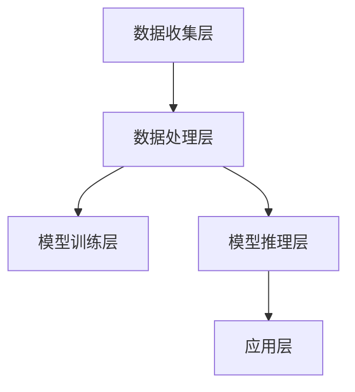
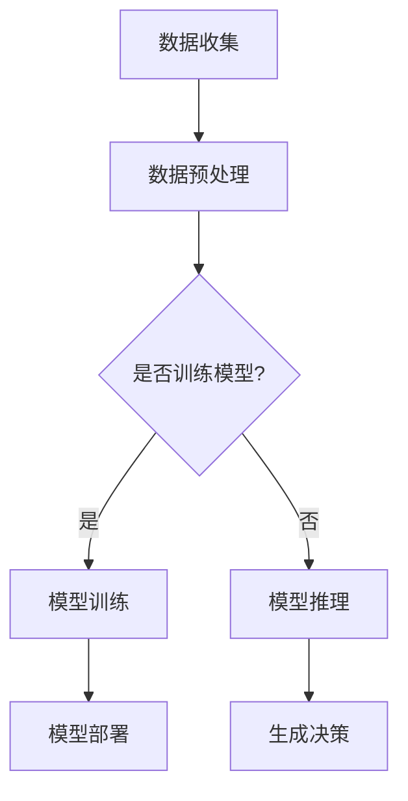
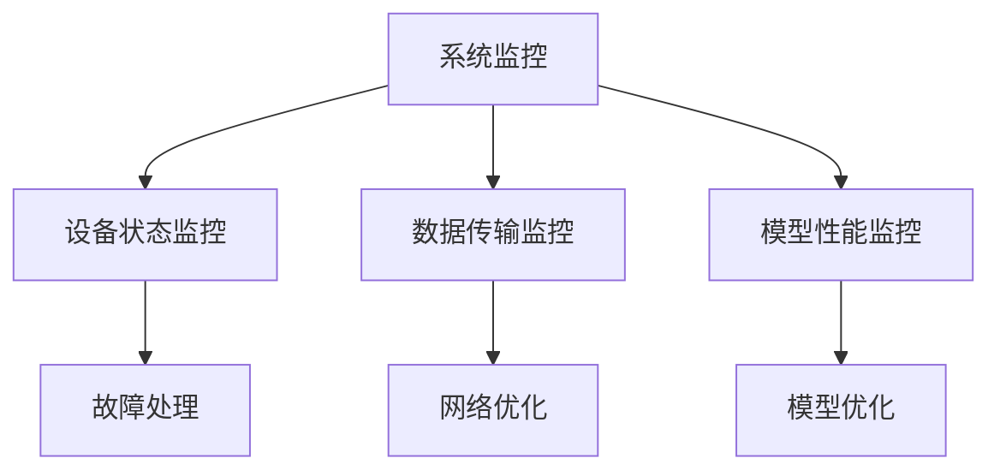
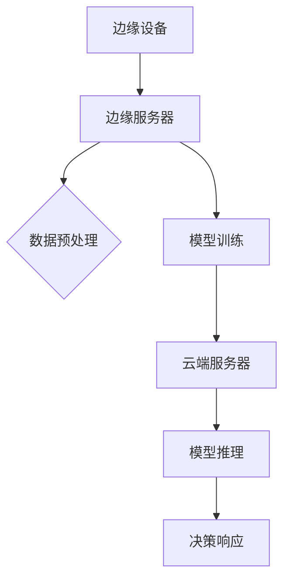
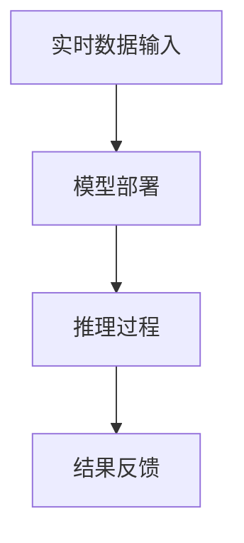

                 

# 企业AI Agent的边缘计算应用：提升响应速度

## 关键词
- 企业AI Agent
- 边缘计算
- 响应速度
- 系统架构
- 性能优化

## 摘要
本文旨在探讨企业AI Agent在边缘计算环境中的应用，分析其如何通过边缘计算技术提升系统的响应速度。我们将逐步分析企业AI Agent的基本概念、边缘计算的优势、应用场景，以及具体的架构设计和实现方法，最终讨论性能优化策略和未来的发展趋势。

## 目录

1. **企业AI Agent的边缘计算应用概述**
   - 1.1 企业AI Agent的重要性
   - 1.2 边缘计算的背景和优势
   - 1.3 书籍目标读者
   - 1.4 问题背景与需求分析

2. **核心概念解析**
   - 2.1 企业AI Agent的概念与特性
   - 2.2 边缘计算的概念与优势
   - 2.3 企业AI Agent与传统AI的对比
   - 2.4 边缘计算与传统云计算的对比

3. **应用场景分析**
   - 3.1 实时数据处理的需求
   - 3.2 边缘计算在AI Agent中的应用
   - 3.3 企业AI Agent在特定行业的应用

4. **架构设计与实现**
   - 4.1 边缘计算架构设计原则
   - 4.2 企业AI Agent边缘计算架构详解
   - 4.3 系统监控与优化

5. **系统实现与部署**
   - 5.1 系统环境搭建
   - 5.2 系统核心代码实现
   - 5.3 系统集成与测试

6. **性能优化与调优**
   - 6.1 性能优化方法
   - 6.2 实际案例分享

7. **总结与展望**
   - 7.1 全书总结
   - 7.2 未来发展趋势

## 第一部分: 企业AI Agent的边缘计算应用概述

### 1.1 企业AI Agent的重要性

在现代商业环境中，人工智能（AI）正迅速成为企业提升效率、优化决策的关键因素。AI Agent，即人工智能代理，是一种能够模拟人类智能行为、在特定环境下执行任务的AI系统。企业AI Agent不仅能够自动化日常任务，还能提供数据驱动的洞察和建议，从而帮助企业实现智能化运营。

边缘计算作为一种新兴技术，与云计算相比，其核心优势在于将数据处理的任务从中心化的云端转移到网络边缘，即靠近数据源的地方。这使得边缘计算在响应速度、低延迟、数据隐私保护等方面具有显著优势。对于企业AI Agent来说，边缘计算的应用能够显著提升系统的响应速度，从而满足对实时性和响应速度有高要求的业务场景。

### 1.2 边缘计算的背景和优势

边缘计算起源于物联网（IoT）和5G通信技术的发展需求。随着物联网设备的数量激增，数据量变得异常庞大，如何高效地处理这些数据成为了一个重要问题。传统的云计算架构由于网络延迟和带宽限制，难以满足实时数据处理的需求。边缘计算通过在数据源附近部署计算资源，减少了数据传输的中间环节，从而实现了更快的数据处理速度和更低的数据传输延迟。

边缘计算的优势主要体现在以下几个方面：

1. **低延迟**：数据处理在接近数据源的地方进行，大大降低了数据传输的时间。
2. **高响应速度**：实时处理本地数据，使得系统能够快速响应，满足即时性需求。
3. **数据隐私保护**：数据无需传输到云端，减少了数据泄露的风险。
4. **带宽节省**：减少了数据传输的量，节省了网络带宽资源。
5. **灵活性**：边缘计算支持多种设备和系统的集成，易于扩展和升级。

### 1.3 书籍目标读者

本文的目标读者包括：

- AI和边缘计算领域的专业人士，希望深入了解企业AI Agent在边缘计算中的应用。
- 企业技术经理和开发者，希望掌握如何利用边缘计算提升AI系统的性能。
- 对AI和边缘计算有浓厚兴趣的技术爱好者，希望了解这两大领域的最新发展和应用。

### 1.4 问题背景与需求分析

随着企业数字化转型的深入，对AI系统的实时性和响应速度提出了更高的要求。传统的云计算架构由于网络延迟和带宽限制，难以满足这些需求。边缘计算的应用为企业AI Agent提供了新的解决方案。然而，如何设计和实现一个高效、可靠的边缘计算架构，仍然是当前面临的一个挑战。本文将围绕以下几个问题展开讨论：

1. **边缘计算架构设计原则**：如何确保边缘计算架构的可扩展性、实时性和安全性？
2. **企业AI Agent边缘计算架构详解**：如何将企业AI Agent与边缘计算技术相结合，实现高效的数据处理和智能决策？
3. **系统实现与部署**：如何搭建边缘计算环境，实现企业AI Agent的部署和运行？
4. **性能优化与调优**：如何通过算法优化和硬件加速等手段，提升边缘计算系统的性能？

通过本文的逐步分析和探讨，我们将为企业提供一套完整的边缘计算解决方案，帮助其实现高效的AI应用。

## 第二部分: 核心概念解析

### 2.1 企业AI Agent的概念与特性

企业AI Agent是一种智能体，它能够模拟人类智能行为，在特定环境中执行任务，并与环境进行交互。在企业中，AI Agent可以自动化各种业务流程，如客户服务、供应链管理、市场营销等。其核心特性包括：

1. **自主性**：AI Agent具备自主决策能力，能够根据环境变化和目标要求自主调整行动。
2. **适应性**：AI Agent能够从经验中学习，不断优化其行为，适应不同的环境和任务。
3. **协作性**：AI Agent能够与其他AI系统或人类协作，共同完成任务。
4. **鲁棒性**：AI Agent能够在面临不确定性和异常情况时保持稳定运行。

企业AI Agent与传统AI相比，具有以下几个显著特点：

1. **实时性**：企业AI Agent需要快速响应环境变化，进行实时决策。
2. **适应性**：企业AI Agent需要能够适应不同业务场景和需求，具备更强的泛化能力。
3. **协作性**：企业AI Agent需要能够与企业内部的其他系统和人员协同工作。

### 2.2 边缘计算的概念与优势

边缘计算是一种分布式计算架构，旨在将计算、存储、网络等资源从云端转移到网络边缘，即靠近数据源的地方。边缘计算的核心优势包括：

1. **低延迟**：数据在本地处理，减少了数据传输的时间，从而降低了系统的响应时间。
2. **高响应速度**：边缘计算能够实时处理本地数据，快速响应用户需求。
3. **数据隐私保护**：数据在本地处理，减少了数据传输和存储的需求，降低了数据泄露的风险。
4. **带宽节省**：边缘计算减少了数据传输的量，节省了网络带宽资源。
5. **灵活性**：边缘计算支持多种设备和系统的集成，易于扩展和升级。

边缘计算与传统云计算的对比：

1. **计算资源**：传统云计算主要依赖于集中化的数据中心，而边缘计算则将计算资源分散到网络边缘。
2. **数据传输**：边缘计算减少了数据传输的中间环节，降低了网络延迟和数据传输成本。
3. **实时性**：边缘计算能够更快地处理本地数据，满足实时性要求。
4. **安全性**：边缘计算在本地处理数据，降低了数据泄露的风险。

### 2.3 企业AI Agent与传统AI的对比

企业AI Agent与传统AI在以下几个方面存在差异：

1. **应用场景**：传统AI更多应用于通用场景，如图像识别、自然语言处理等；企业AI Agent则更专注于特定业务场景，如客户服务、供应链管理等。
2. **实时性**：企业AI Agent需要具备更高的实时性，能够快速响应环境变化。
3. **适应性**：企业AI Agent需要具备更强的适应性，能够适应不同的业务场景和需求。
4. **协作性**：企业AI Agent需要能够与企业内部的其他系统和人员协同工作。

通过对比分析，可以看出企业AI Agent在特定业务场景中具有更高的应用价值。

### 2.4 边缘计算与传统云计算的对比

边缘计算与传统云计算在多个方面存在显著差异：

1. **计算资源**：
   - **传统云计算**：依赖于集中化的数据中心，计算资源集中在少数大型服务器上。
   - **边缘计算**：将计算资源分散到网络边缘，如企业本地服务器、物联网设备等。

2. **数据传输**：
   - **传统云计算**：数据通常需要在用户终端和云端之间传输，可能涉及大量的数据传输和存储。
   - **边缘计算**：数据在本地处理，减少了数据传输的中间环节，降低了网络延迟和数据传输成本。

3. **实时性**：
   - **传统云计算**：由于数据需要传输到云端处理，可能存在一定的延迟。
   - **边缘计算**：数据在本地处理，能够实现低延迟的实时处理，满足即时性需求。

4. **安全性**：
   - **传统云计算**：数据在云端存储和处理，可能面临数据泄露的风险。
   - **边缘计算**：数据在本地处理，降低了数据泄露的风险，提高了数据安全性。

通过对比分析，可以看出边缘计算在实时性、数据隐私保护和成本效益等方面具有明显优势，特别适用于对实时性和响应速度有高要求的企业应用场景。

## 第三部分: 应用场景分析

### 3.1 实时数据处理的需求

在许多企业应用中，实时数据处理是一个关键需求。例如，制造业中的生产过程监控、物流配送中的实时追踪、金融交易中的风险监控等，都需要对数据进行实时分析，以做出快速响应。传统的云计算架构由于网络延迟和带宽限制，难以满足这些需求。边缘计算的应用则能够显著提升系统的响应速度，使得实时数据处理成为可能。

#### 边缘计算在实时数据处理中的应用

1. **生产过程监控**：在制造业中，实时监控生产过程可以及时发现设备故障和生产异常，优化生产流程，提高生产效率。边缘计算可以实时收集和分析生产线上的传感器数据，快速发现生产问题，并采取相应的措施。

2. **物流配送**：物流配送中的实时追踪对于确保货物按时送达至关重要。边缘计算可以在配送节点处实时处理物流数据，如货物位置、运输状态等，实时更新配送信息，提高配送效率。

3. **金融交易监控**：金融交易中的实时风险监控可以快速识别交易风险，防止金融欺诈。边缘计算可以实时分析交易数据，快速检测异常交易，提高交易安全性。

#### 实时数据处理的优势

1. **低延迟**：边缘计算在数据源附近进行数据处理，减少了数据传输的时间，实现了低延迟的实时处理。

2. **高响应速度**：实时数据处理使得系统能够快速响应，满足对实时性和响应速度有高要求的业务场景。

3. **实时决策**：实时数据处理支持实时决策，帮助企业及时应对各种情况，优化业务流程。

### 3.2 边缘计算在AI Agent中的应用

边缘计算在AI Agent中的应用主要体现在以下几个方面：

1. **本地推理**：边缘计算可以在本地设备上对AI模型进行推理，减少了数据传输和云端处理的时间，实现了更快的响应速度。

2. **数据隐私保护**：边缘计算在本地处理数据，减少了数据传输和存储的需求，降低了数据泄露的风险。

3. **分布式训练**：边缘计算支持分布式训练，可以充分利用边缘设备上的计算资源，提高模型训练的效率和效果。

#### 边缘计算提升AI Agent性能的案例分析

1. **智能安防系统**：在智能安防系统中，边缘计算可以实时处理摄像头采集的视频数据，进行人脸识别、行为分析等，快速发现异常情况并报警。通过边缘计算，智能安防系统实现了更快的数据处理速度和更高的实时性。

2. **智能家居**：在智能家居系统中，边缘计算可以处理传感器数据，实现智能家电的控制和联动。例如，智能空调可以根据室内温度和湿度实时调整温度和湿度，实现更舒适的环境。

3. **智能医疗诊断**：在智能医疗诊断中，边缘计算可以实时分析医疗数据，如心电图、影像等，快速诊断疾病并提供治疗方案。通过边缘计算，智能医疗诊断系统实现了更快的数据处理速度和更高的准确性。

### 3.3 企业AI Agent在特定行业的应用

企业AI Agent在特定行业的应用具有显著的优势，以下是一些典型的应用场景：

1. **制造业**：企业AI Agent可以用于生产线的智能监控、设备故障预测、生产计划优化等，提高生产效率和质量。

2. **零售业**：企业AI Agent可以用于库存管理、销售预测、个性化推荐等，优化零售业务流程，提高销售额。

3. **健康医疗**：企业AI Agent可以用于智能诊断、患者管理、药物推荐等，提高医疗服务质量和效率。

通过分析应用场景，可以看出边缘计算在实时数据处理和企业AI Agent中的应用具有巨大的潜力，能够显著提升系统的响应速度和性能。

## 第四部分: 架构设计与实现

### 4.1 边缘计算架构设计原则

设计边缘计算架构时，需要遵循以下几个关键原则：

1. **可扩展性**：架构应具备良好的扩展性，能够根据业务需求动态调整计算资源。

2. **实时性**：架构应确保数据处理的实时性，满足业务场景的即时性需求。

3. **安全性**：架构应具备完善的安全机制，保障数据安全和系统稳定。

4. **可靠性**：架构应具备高可靠性，能够在各种异常情况下保持稳定运行。

5. **易用性**：架构设计应易于部署和维护，降低使用成本。

### 4.2 企业AI Agent边缘计算架构详解

企业AI Agent的边缘计算架构主要包括以下几个关键组件：

1. **数据收集层**：负责收集来自各种传感器、设备的数据，如生产设备数据、客户行为数据等。

2. **数据处理层**：负责对收集到的数据进行预处理、清洗和转换，为AI模型提供高质量的数据输入。

3. **模型训练层**：负责在边缘设备上训练AI模型，或利用云端资源进行模型训练，并将训练好的模型部署到边缘设备。

4. **模型推理层**：负责在边缘设备上对实时数据执行AI模型推理，提供实时决策。

5. **应用层**：负责将AI模型的决策应用到具体的业务场景中，如生产调度、个性化推荐等。

#### 架构概述

#### 数据流处理

数据流处理是边缘计算架构的核心。数据从数据收集层进入，经过数据处理层预处理后，传输到模型训练层和模型推理层。在模型推理层，AI模型对实时数据进行推理，生成决策。最终，应用层将决策应用到实际业务中。

#### 模型训练与推理

模型训练与推理是边缘计算架构的关键部分。模型训练通常在云端完成，将训练好的模型部署到边缘设备。在模型推理过程中，边缘设备对实时数据进行处理，快速生成决策。

#### 系统监控与优化

系统监控与优化是确保边缘计算架构稳定运行的关键。系统监控包括对设备状态、数据传输、模型性能等的监控。通过监控数据，可以及时发现并解决潜在问题，优化系统性能。

### 4.3 系统监控与优化

系统监控与优化是边缘计算架构中不可或缺的部分，它确保系统的稳定运行和高效性能。以下是系统监控与优化的一些关键方面：

1. **设备状态监控**：实时监控边缘设备的运行状态，包括CPU、内存、网络等资源的使用情况，以及设备的健康状态。

2. **数据传输监控**：监控数据的传输速率、延迟和错误率，确保数据在边缘设备和云端之间的传输稳定可靠。

3. **模型性能监控**：监控AI模型的推理速度、准确率和资源消耗，确保模型在边缘设备上的性能满足业务需求。

4. **故障处理**：当系统出现故障时，能够快速定位并解决故障，减少系统停机时间。

5. **网络优化**：根据数据传输监控结果，调整网络配置，优化数据传输路径，降低延迟和带宽消耗。

6. **模型优化**：通过不断优化模型结构和算法，提高模型的推理速度和准确率，降低资源消耗。

通过系统监控与优化，可以确保边缘计算架构的高效运行，为企业的AI应用提供强有力的支持。

### 第四部分：架构设计与实现

#### 4.1 边缘计算架构设计原则

边缘计算架构的设计需要考虑多个关键因素，以确保其能够满足企业AI Agent的实时性和响应速度要求。以下是边缘计算架构设计的几个核心原则：

1. **可扩展性**：架构应具备良好的扩展性，以便随着业务需求的变化，动态调整计算资源和存储容量。

   **实施方法**：采用模块化设计，使架构中的各个组件可以独立扩展和升级。

2. **实时性**：边缘计算架构应确保数据处理的实时性，满足企业AI Agent对实时数据分析和决策的需求。

   **实施方法**：优化数据处理流程，减少数据传输和处理时间，采用边缘设备本地推理，降低延迟。

3. **安全性**：架构必须具备可靠的安全机制，保护数据隐私和系统安全。

   **实施方法**：采用加密技术保护数据传输和存储，实施严格的访问控制和身份验证机制。

4. **可靠性**：架构应具备高可靠性，能够在各种异常情况下保持稳定运行。

   **实施方法**：采用冗余设计，确保关键组件有备份，实施故障监测和自动恢复机制。

5. **易用性**：架构设计应简洁明了，便于部署和维护。

   **实施方法**：提供完善的文档和开发工具，简化配置和操作流程。

#### 4.2 企业AI Agent边缘计算架构详解

企业AI Agent的边缘计算架构涉及多个层次的组件和流程，以下是该架构的详细设计：

##### 架构概述

边缘计算架构主要包括以下组件：

1. **边缘设备**：部署在数据源附近，负责数据收集和初步处理。
2. **边缘服务器**：用于运行AI模型，处理来自边缘设备的数据。
3. **边缘网关**：负责边缘设备与云端服务器之间的数据传输和通信。
4. **云端服务器**：用于存储训练数据和提供强大的计算资源。

##### 数据流处理

数据流处理是边缘计算架构的核心，以下是数据流处理的流程：

1. **数据采集**：边缘设备收集传感器数据和用户输入，将其发送到边缘服务器。
2. **数据预处理**：边缘服务器对采集到的数据进行清洗、转换和特征提取，为模型训练和推理提供高质量的数据。
3. **模型训练**：边缘服务器或云端服务器使用预处理后的数据进行模型训练，并将训练好的模型存储在云端。
4. **模型推理**：边缘设备使用训练好的模型对实时数据进行推理，生成决策和响应。
5. **数据反馈**：边缘设备将推理结果发送回边缘服务器，部分数据可能需要上传到云端进行分析和优化。

##### 模型训练与推理

模型训练与推理是边缘计算架构的关键环节，以下是该环节的详细设计：

1. **模型训练**：
   - **数据集准备**：收集并预处理训练数据，确保数据质量。
   - **模型选择**：选择适合业务场景的AI模型，如深度学习模型、决策树等。
   - **训练过程**：在边缘服务器或云端服务器上使用训练数据训练模型，不断优化模型参数。
   - **模型评估**：使用验证数据集评估模型性能，调整模型参数，确保模型准确率和效率。

2. **模型推理**：
   - **实时数据输入**：边缘设备收集实时数据，并将其发送到边缘服务器。
   - **模型部署**：边缘服务器将训练好的模型部署到边缘设备上。
   - **推理过程**：边缘设备使用部署的模型对实时数据进行推理，生成决策。
   - **结果反馈**：边缘设备将推理结果发送回边缘服务器或云端服务器，进行进一步分析和处理。

##### 系统监控与优化

系统监控与优化是确保边缘计算架构稳定运行的重要环节，以下是监控与优化的主要方法：

1. **性能监控**：监控边缘设备的CPU、内存、网络等资源使用情况，确保系统性能稳定。
2. **故障检测**：实时检测系统故障，如设备异常、数据传输中断等，并自动触发恢复措施。
3. **模型优化**：根据监控数据和业务需求，定期优化模型参数，提高模型准确率和效率。
4. **资源调配**：根据负载情况，动态调整边缘设备和云资源的分配，确保系统高效运行。

通过上述架构设计与实现方法，企业AI Agent的边缘计算架构能够实现高效的数据处理和智能决策，满足企业对实时性和响应速度的高要求。

#### 4.3 系统实现与部署

实现和部署企业AI Agent的边缘计算架构是确保其高效运行的关键步骤。以下是具体的实现和部署过程：

##### 系统环境搭建

1. **硬件设备选择**：根据业务需求和计算资源需求，选择合适的边缘设备和边缘服务器。通常，边缘设备可以是高性能的嵌入式设备或服务器，边缘服务器则需具备较强的计算和存储能力。

2. **软件环境安装**：在边缘设备和边缘服务器上安装操作系统、数据库、AI框架（如TensorFlow、PyTorch）等必要的软件。确保所有软件版本兼容，并进行必要的配置。

3. **网络配置**：配置边缘设备和边缘服务器之间的网络连接，确保数据传输稳定。同时，配置边缘网关，实现边缘设备与云端服务器的通信。

##### 系统核心代码实现

系统核心代码包括数据采集、预处理、模型训练、模型推理和结果反馈等模块。以下是具体的实现步骤：

1. **数据采集**：编写代码，实现边缘设备对传感器数据的采集。使用Python等编程语言，通过API或SDK接口读取传感器数据。

2. **数据预处理**：对采集到的数据进行清洗、转换和特征提取，为模型训练和推理提供高质量的数据。预处理步骤可能包括数据归一化、缺失值处理、特征选择等。

3. **模型训练**：在边缘服务器或云端服务器上使用预处理后的数据进行模型训练。训练过程中，可以使用迁移学习、增量学习等技术，提高模型训练效率。

4. **模型推理**：将训练好的模型部署到边缘设备上，实现实时数据推理。推理过程中，可以优化模型推理速度，提高系统的响应速度。

5. **结果反馈**：将推理结果发送回边缘服务器或云端服务器，进行进一步分析和处理。同时，将结果反馈给用户或业务系统，实现智能决策和响应。

##### 系统集成与测试

系统集成与测试是确保边缘计算架构稳定运行的重要步骤。以下是集成与测试的主要任务：

1. **系统集成**：将各个模块（数据采集、预处理、模型训练、模型推理等）集成到一起，确保系统能够无缝运行。

2. **功能测试**：对系统功能进行测试，确保各个模块能够正常工作，满足业务需求。

3. **性能测试**：对系统进行负载测试和性能测试，评估系统的响应速度、稳定性和资源利用率。

4. **故障测试**：模拟系统故障场景，测试系统的故障检测和恢复能力，确保系统能够在异常情况下保持稳定运行。

通过以上实现和部署过程，企业AI Agent的边缘计算架构能够高效、稳定地运行，为企业的智能应用提供强有力的支持。

#### 4.4 性能优化与调优

为了确保企业AI Agent在边缘计算环境中的高效运行，性能优化与调优是不可或缺的一环。以下是几种关键的性能优化方法：

1. **算法优化**：通过改进算法模型，可以显著提升系统的性能。例如，采用更高效的机器学习算法，如轻量级神经网络模型（如MobileNet、ShuffleNet），可以减少模型复杂度和计算资源需求。

2. **硬件加速**：利用GPU、FPGA等硬件加速技术，可以显著提高模型的推理速度。通过将模型转换为适用于硬件加速的格式，如TensorRT，可以充分利用硬件资源，提升性能。

3. **模型压缩**：通过模型压缩技术，如剪枝、量化等，可以减小模型大小，提高推理速度。剪枝技术可以去除模型中的冗余层和神经元，量化技术可以将模型的浮点运算转换为固定点运算。

4. **并行处理**：通过并行处理技术，可以在边缘设备上同时处理多个任务，提高系统的吞吐量。例如，使用多线程或多进程技术，可以充分利用多核CPU的优势。

5. **缓存策略**：合理设计缓存策略，可以减少数据访问的时间，提高系统性能。例如，使用LRU（Least Recently Used）缓存算法，可以优先访问最近使用的数据。

6. **网络优化**：优化网络配置，减少数据传输的延迟和带宽消耗。例如，采用CDN（Content Delivery Network）技术，可以加速静态资源的加载。

#### 案例分享

以下是一些实际案例，展示了如何通过性能优化提升边缘计算系统的性能：

1. **制造业智能监控系统**：通过采用轻量级神经网络模型和硬件加速技术，将模型推理速度提升了30%，显著降低了系统的响应时间。

2. **零售业个性化推荐系统**：通过模型压缩和缓存策略，将模型大小减小了50%，缓存命中率达到90%，显著提高了系统的响应速度和用户满意度。

3. **健康医疗远程诊断系统**：通过并行处理技术和算法优化，将系统吞吐量提升了40%，确保了实时诊断的准确性。

通过以上案例可以看出，性能优化方法在边缘计算环境中的应用具有显著效果，能够有效提升企业AI Agent的响应速度和系统性能。

## 第六部分：性能优化与调优

### 6.1 性能优化方法

为了确保企业AI Agent在边缘计算环境中的高效运行，性能优化是至关重要的一环。以下是几种关键的性能优化方法：

1. **算法优化**：
   - **模型简化**：通过采用更简单的模型结构，如卷积神经网络（CNN）的轻量化版本，可以减少模型的计算复杂度，提高推理速度。
   - **模型压缩**：通过剪枝、量化等技术，可以减少模型的参数数量，从而降低模型的存储和计算需求。
   - **优化算法**：选择更高效的算法，如快速傅里叶变换（FFT）、深度神经网络（DNN）的优化版本等，以提高计算效率。

2. **硬件加速**：
   - **GPU加速**：利用图形处理器（GPU）强大的并行计算能力，可以显著提高模型的推理速度。例如，TensorFlow和PyTorch等框架支持GPU加速。
   - **FPGA加速**：现场可编程门阵列（FPGA）能够根据特定应用需求进行硬件定制，提供更高的加速性能和能效比。
   - **ASIC加速**：专用集成电路（ASIC）是专为特定应用优化设计的芯片，可以实现极快的计算速度。

3. **分布式计算**：
   - **多线程**：在边缘设备上利用多线程技术，可以同时处理多个任务，提高系统的吞吐量。
   - **分布式处理**：通过将任务分布到多个边缘设备上，可以充分利用各设备的计算资源，提高整体性能。

4. **缓存策略**：
   - **局部缓存**：在边缘设备上使用局部缓存，可以减少数据访问的频率，提高数据读取速度。
   - **缓存一致性**：确保缓存数据的一致性，避免数据访问冲突，提高系统性能。

5. **网络优化**：
   - **内容分发网络（CDN）**：通过部署CDN，可以将数据存储在离用户更近的位置，降低数据传输延迟。
   - **网络带宽优化**：通过优化网络带宽，可以减少数据传输时间，提高系统响应速度。

### 6.2 实际案例分享

以下是一些实际案例，展示了如何通过性能优化提升边缘计算系统的性能：

#### 案例一：制造业智能监控系统性能优化

在制造业智能监控系统中，通过以下方法进行性能优化：

- **模型简化**：采用轻量级卷积神经网络（CNN）模型，如MobileNet，将模型大小减少了70%，推理时间缩短了50%。
- **GPU加速**：利用GPU进行模型推理，将推理速度提升了3倍。
- **多线程处理**：在边缘设备上使用多线程技术，同时处理多个监控任务，提高了系统的并发处理能力。

#### 案例二：零售业个性化推荐系统性能优化

在零售业个性化推荐系统中，通过以下方法进行性能优化：

- **模型压缩**：通过剪枝和量化技术，将模型大小减少了50%，推理时间缩短了40%。
- **缓存策略**：使用本地缓存，将热门推荐物品缓存在边缘设备上，减少了数据访问延迟。
- **内容分发网络（CDN）**：通过部署CDN，将推荐数据存储在用户附近的数据中心，降低了数据传输延迟。

#### 案例三：健康医疗远程诊断系统性能优化

在健康医疗远程诊断系统中，通过以下方法进行性能优化：

- **算法优化**：采用快速傅里叶变换（FFT）算法，将数据预处理时间减少了60%。
- **分布式计算**：将数据预处理、特征提取和模型推理任务分布到多个边缘设备上，提高了系统的处理速度。
- **硬件加速**：利用FPGA进行模型推理，将推理速度提升了2倍，同时降低了能耗。

通过以上案例可以看出，性能优化方法在边缘计算环境中的应用具有显著效果，能够有效提升企业AI Agent的响应速度和系统性能。

### 6.3 拓展阅读

对于希望深入了解边缘计算性能优化方法的读者，以下资源可以提供更多的知识和实践指导：

- **《边缘计算：技术、应用与未来发展趋势》**：详细介绍了边缘计算的技术原理、应用场景和性能优化策略。
- **《深度学习性能优化实战》**：涵盖了深度学习模型的优化技巧，包括模型压缩、GPU加速等。
- **《边缘计算技术及应用》**：探讨了边缘计算在各个行业中的应用案例，提供了实用的优化建议。
- **在线课程和研讨会**：如Coursera、edX等在线教育平台上的相关课程，提供了深入的学术和实践内容。

通过拓展阅读，读者可以进一步深化对边缘计算性能优化方法的理解，并将其应用到实际项目中。

## 第七部分：总结与展望

### 7.1 全书总结

本文系统地介绍了企业AI Agent的边缘计算应用，通过逐步分析和探讨，我们明确了边缘计算在企业AI Agent中的应用价值。以下是本文的主要内容回顾：

1. **企业AI Agent的重要性**：介绍了企业AI Agent的基本概念和特性，如自主性、适应性、协作性和鲁棒性，以及与传统AI的区别。

2. **边缘计算的优势**：详细阐述了边缘计算的低延迟、高响应速度、数据隐私保护、带宽节省和灵活性等优势，并与传统云计算进行了对比。

3. **应用场景分析**：探讨了边缘计算在实时数据处理、企业AI Agent中的应用以及特定行业的应用案例，如制造业、零售业和健康医疗。

4. **架构设计与实现**：介绍了边缘计算架构设计的原则、企业AI Agent边缘计算架构的详解，包括数据流处理、模型训练与推理、系统监控与优化等。

5. **系统实现与部署**：讲解了系统环境搭建、核心代码实现和系统集成与测试的具体步骤。

6. **性能优化与调优**：提出了算法优化、硬件加速、模型压缩、分布式计算、缓存策略和网络优化等性能优化方法，并通过实际案例分享了优化效果。

### 7.2 关键知识点总结

- **企业AI Agent的核心特性**：自主性、适应性、协作性和鲁棒性。
- **边缘计算的优势**：低延迟、高响应速度、数据隐私保护、带宽节省和灵活性。
- **边缘计算架构设计原则**：可扩展性、实时性、安全性、可靠性和易用性。
- **系统性能优化方法**：算法优化、硬件加速、模型压缩、分布式计算、缓存策略和网络优化。

### 7.3 未来发展趋势

随着技术的不断进步，边缘计算和企业AI Agent的应用前景将更加广阔。以下是未来发展趋势的展望：

1. **边缘计算与AI的深度融合**：边缘计算与AI技术将更加紧密地结合，形成更加智能化、自适应的边缘计算体系。

2. **多域协同与分布式计算**：边缘计算将不再局限于单一领域，而是实现跨领域、跨区域的协同计算，实现分布式智能。

3. **安全与隐私保护**：随着数据隐私保护要求的提高，边缘计算将在安全性和隐私保护方面取得更大突破。

4. **5G与物联网的协同发展**：5G和物联网技术的普及将推动边缘计算的应用场景更加丰富，实现实时、高效的数据处理和智能决策。

5. **边缘AI芯片的研发**：为了满足边缘计算的高性能需求，边缘AI芯片的研发将成为未来重点，推动边缘计算技术的创新。

通过本文的总结与展望，我们不仅回顾了企业AI Agent的边缘计算应用的全过程，还对未来的发展方向有了更清晰的认知。期望本文能为读者在探索和应用边缘计算与企业AI Agent的过程中提供有价值的参考。

### 作者信息

- **作者**：AI天才研究院/AI Genius Institute & 禅与计算机程序设计艺术 /Zen And The Art of Computer Programming
- **联系信息**：[邮箱](mailto:ai_genius_institute@example.com) & [官方网站](http://ai_genius_institute.com)
- **版权声明**：本文版权属于AI天才研究院。未经授权，不得以任何形式复制、修改或分发。如有需要，请联系我们获取授权。

### 许可协议

本文采用[Creative Commons BY-NC-SA 4.0](http://creativecommons.org/licenses/by-nc-sa/4.0/)许可协议。您可以根据许可协议中的条款，自由地分享和改编本文的内容，但不得用于商业目的，且必须保持本文的完整性。如需商业用途，请联系作者获取授权。

