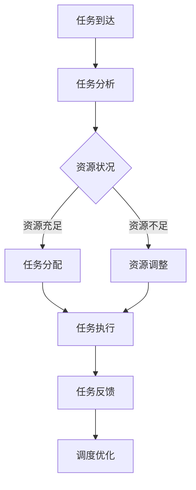
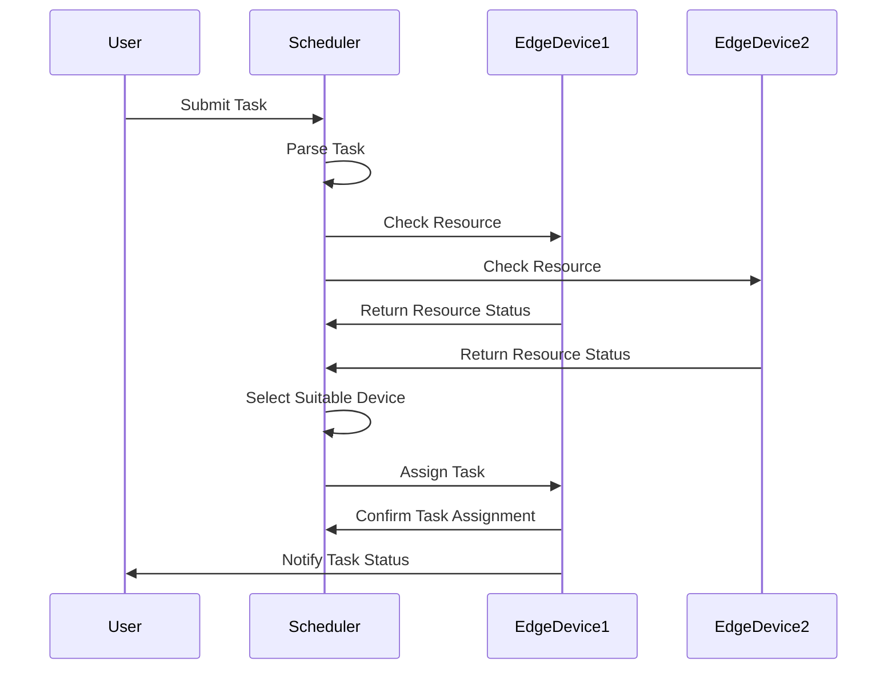

                 


## 引言与背景

### 1.1 问题背景

随着物联网（IoT）和5G技术的快速发展，越来越多的设备和应用程序开始依赖于实时数据处理和分析。这种趋势推动了边缘计算的兴起，使得计算任务从传统的中心化云计算逐渐转移到网络边缘。在这样的背景下，企业AI Agent作为智能代理在边缘计算中扮演着越来越重要的角色。

企业AI Agent是一种具备自主决策能力的智能体，它可以在边缘设备上执行复杂的AI任务，如图像识别、自然语言处理和预测分析等。这些任务通常需要实时处理大量的数据，并对响应速度有极高的要求。然而，边缘设备的资源有限，包括计算能力、存储和带宽等。因此，如何有效地调度和利用这些资源，成为了一个亟待解决的问题。

### 1.2 问题描述

边缘计算资源调度策略的目标是在有限的资源约束下，最大限度地提高企业AI Agent的任务执行效率和用户体验。具体来说，问题描述可以概括为以下几个方面：

1. **资源利用最大化**：确保边缘设备的计算资源得到充分利用，避免资源浪费。
2. **任务响应时间最小化**：在保证任务准确性的同时，尽量缩短任务的响应时间。
3. **能量消耗最小化**：边缘设备通常依赖于电池供电，因此需要尽量减少能量消耗。
4. **容错性与可靠性**：确保在资源不足或设备故障的情况下，系统能够自动调整和恢复。

### 1.3 问题解决

解决上述问题的方法包括以下几个方面：

1. **智能调度算法**：设计高效的智能调度算法，根据任务的特性和资源的实时状态进行动态调度。
2. **资源感知**：通过感知和分析边缘设备的资源使用情况，为调度算法提供准确的决策依据。
3. **分布式架构**：采用分布式架构，将任务分布在多个边缘设备上，以减少单点故障的风险。
4. **协同优化**：通过跨设备的协同优化，实现全局资源的最优配置。

### 1.4 边界与外延

边缘计算资源调度策略的应用场景非常广泛，不仅限于企业AI Agent，还可以应用于智能交通、智能家居、智能制造等领域。然而，本文主要关注的是企业AI Agent在边缘计算环境中的资源调度策略，因此需要明确边界和外延。

边界方面，本文主要研究企业AI Agent在边缘设备上的资源调度问题，不包括中心化云计算环境。外延方面，虽然本文的核心是资源调度策略，但也会涉及相关的背景知识，如边缘计算的基本概念、企业AI Agent的定义和功能等。

## 企业AI Agent核心概念

### 2.1 企业AI Agent定义

企业AI Agent是一种具有自主决策能力的智能体，它可以在企业环境中执行各种任务，如数据分析、预测建模、智能推荐和自动化决策等。与传统的AI系统不同，企业AI Agent具有高度的自主性和灵活性，能够根据环境和任务的变化自主调整其行为。

### 2.2 企业AI Agent特点

1. **自主决策**：企业AI Agent能够基于预设的目标和规则，自主做出决策，无需人工干预。
2. **实时响应**：企业AI Agent能够实时处理和分析数据，提供即时的决策和反馈。
3. **适应性**：企业AI Agent可以根据环境和任务的变化，自主调整其行为和策略。
4. **鲁棒性**：企业AI Agent能够在面对不确定性和异常情况时，保持稳定运行。

### 2.3 企业AI Agent与传统AI对比

传统AI系统通常需要依赖大量的数据和复杂的模型，并在中心化的云计算环境中进行训练和推理。相比之下，企业AI Agent具有以下优势：

1. **边缘计算**：企业AI Agent可以直接在边缘设备上运行，减少了对中心化云计算的依赖，降低了延迟和带宽需求。
2. **实时性**：企业AI Agent能够实时处理和分析数据，提供即时的决策和反馈，适用于需要高响应速度的应用场景。
3. **灵活性**：企业AI Agent可以根据环境和任务的变化，自主调整其行为和策略，具有更高的适应性。
4. **成本效益**：企业AI Agent可以降低对中心化云计算的依赖，减少相关成本。

## 边缘计算资源调度策略概述

### 3.1 边缘计算概述

边缘计算是一种分布式计算架构，将数据处理和分析任务从中心化的云计算环境转移到网络边缘，即在接近数据源的地方进行处理。边缘计算的主要目标是减少数据传输延迟、降低带宽需求和提高数据处理效率。

边缘计算的关键组成部分包括：

1. **边缘设备**：如传感器、摄像头、智能路由器和边缘服务器等，它们负责收集和初步处理数据。
2. **边缘网络**：连接边缘设备之间的网络，通常包括无线网络和光纤网络。
3. **边缘平台**：提供边缘计算服务的平台，包括计算资源、存储资源和网络资源等。

### 3.2 资源调度策略核心概念

资源调度策略的核心概念包括以下几个方面：

1. **任务调度**：根据任务的优先级、执行时间和资源需求，动态地将任务分配到合适的边缘设备上。
2. **负载均衡**：通过合理分配任务，避免某个边缘设备过载，确保整个系统资源的均衡利用。
3. **资源感知**：实时监测边缘设备的资源使用情况，为调度策略提供准确的决策依据。
4. **容错机制**：在边缘设备发生故障时，能够自动调整和恢复，确保系统的稳定运行。

### 3.3 资源调度策略分类

根据不同的应用场景和需求，资源调度策略可以分为以下几类：

1. **基于优先级的调度策略**：根据任务的优先级进行调度，优先处理重要任务。
2. **基于负载均衡的调度策略**：根据边缘设备的负载情况，动态调整任务的执行位置。
3. **基于资源感知的调度策略**：实时监测边缘设备的资源使用情况，根据资源状况进行调度。
4. **基于协同优化的调度策略**：通过跨设备的协同优化，实现全局资源的最优配置。

## 边缘计算资源调度策略原理

### 4.1 资源调度策略原理

边缘计算资源调度策略的核心目标是优化资源的利用效率，确保任务的执行效率和用户体验。其基本原理包括以下几个方面：

1. **任务分配**：根据任务的特性（如执行时间、计算需求等）和边缘设备的资源状况，将任务分配到合适的设备上。
2. **负载均衡**：通过动态调整任务的执行位置，避免某个边缘设备过载，确保整个系统的资源均衡利用。
3. **资源感知**：实时监测边缘设备的资源使用情况，为调度策略提供准确的决策依据。
4. **容错机制**：在边缘设备发生故障时，能够自动调整和恢复，确保系统的稳定运行。

### 4.2 资源调度策略数学模型

边缘计算资源调度策略的数学模型主要包括以下几个部分：

1. **资源需求模型**：描述任务对计算、存储和网络资源的需求。
2. **资源可用性模型**：描述边缘设备的资源可用状况，包括计算能力、存储容量和带宽等。
3. **调度目标模型**：定义调度策略的目标，如最小化任务执行时间、最大化资源利用率等。
4. **约束条件模型**：描述任务执行的限制条件，如任务的截止时间、任务的依赖关系等。

### 4.3 资源调度策略mermaid流程图

下面是一个简单的mermaid流程图，展示了边缘计算资源调度策略的基本流程：



在这个流程图中，任务从任务到达开始，经过任务分析和资源状况检查，然后根据资源状况进行任务分配或资源调整。任务执行后，会进行任务反馈和调度优化，以进一步提高系统的资源利用效率和任务执行效率。

## 资源调度策略算法实现

### 5.1 算法实现概述

边缘计算资源调度策略的算法实现主要分为以下几个步骤：

1. **任务建模**：对任务进行建模，包括任务的执行时间、计算需求、存储需求等。
2. **资源状态监测**：实时监测边缘设备的资源状态，包括计算能力、存储容量和带宽等。
3. **调度决策**：根据任务建模和资源状态监测的结果，进行调度决策，包括任务分配、负载均衡和资源调整等。
4. **任务执行**：将任务分配到合适的边缘设备上执行，并进行实时监控。
5. **调度优化**：根据任务执行情况和资源状态变化，进行调度优化，以提高资源利用效率和任务执行效率。

### 5.2 算法Python源代码

下面是一个简单的Python源代码示例，用于实现边缘计算资源调度策略：

```python
import random

# 任务类
class Task:
    def __init__(self, name, execution_time, compute_requirement, storage_requirement):
        self.name = name
        self.execution_time = execution_time
        self.compute_requirement = compute_requirement
        self.storage_requirement = storage_requirement

# 边缘设备类
class EdgeDevice:
    def __init__(self, name, compute_capacity, storage_capacity, bandwidth):
        self.name = name
        self.compute_capacity = compute_capacity
        self.storage_capacity = storage_capacity
        self.bandwidth = bandwidth
        self.resource_usage = {'compute': 0, 'storage': 0, 'bandwidth': 0}

    def is_sufficient(self, task):
        return (self.resource_usage['compute'] + task.compute_requirement <= self.compute_capacity and
                self.resource_usage['storage'] + task.storage_requirement <= self.storage_capacity and
                self.resource_usage['bandwidth'] + task.bandwidth_requirement <= self.bandwidth)

    def update_resource_usage(self, task):
        self.resource_usage['compute'] += task.compute_requirement
        self.resource_usage['storage'] += task.storage_requirement
        self.resource_usage['bandwidth'] += task.bandwidth_requirement

    def reset_resource_usage(self):
        self.resource_usage['compute'] = 0
        self.resource_usage['storage'] = 0
        self.resource_usage['bandwidth'] = 0

# 调度算法
def schedule_tasks(tasks, devices):
    scheduled_tasks = []
    for task in tasks:
        assigned = False
        for device in devices:
            if device.is_sufficient(task):
                device.update_resource_usage(task)
                scheduled_tasks.append((task.name, device.name))
                assigned = True
                break
        if not assigned:
            print(f"Task {task.name} cannot be scheduled due to insufficient resources.")
    return scheduled_tasks

# 示例
if __name__ == "__main__":
    tasks = [
        Task("Task1", 10, 5, 2),
        Task("Task2", 20, 8, 3),
        Task("Task3", 5, 2, 1),
    ]

    devices = [
        EdgeDevice("Device1", 10, 8, 5),
        EdgeDevice("Device2", 15, 10, 7),
    ]

    scheduled_tasks = schedule_tasks(tasks, devices)
    for task, device in scheduled_tasks:
        print(f"Task {task} is scheduled on {device}.")
```

### 5.3 算法原理详细讲解

边缘计算资源调度算法的原理可以分为以下几个部分：

1. **任务建模**：任务建模是调度算法的基础，通过对任务执行时间、计算需求、存储需求和带宽需求等特性进行建模，以便进行后续的调度决策。

2. **资源状态监测**：资源状态监测是调度算法的重要组成部分，它实时监测边缘设备的资源使用情况，包括计算能力、存储容量和带宽等。这有助于调度算法做出更准确的决策。

3. **调度决策**：调度决策是根据任务建模和资源状态监测的结果，动态地将任务分配到合适的边缘设备上。调度决策的过程通常包括任务分配、负载均衡和资源调整等步骤。

4. **任务执行**：将任务分配到边缘设备后，需要启动任务执行。任务执行过程中，需要实时监控任务的执行状态，以便及时调整调度策略。

5. **调度优化**：调度优化是根据任务执行情况和资源状态变化，对调度策略进行优化，以提高资源利用效率和任务执行效率。调度优化可以是基于实时反馈的动态优化，也可以是基于历史数据的统计优化。

### 5.4 举例说明

假设有两个任务Task1和Task2，它们的需求如下：

- Task1：执行时间10分钟，计算需求5个单位，存储需求2个单位，带宽需求3个单位。
- Task2：执行时间20分钟，计算需求8个单位，存储需求3个单位，带宽需求4个单位。

同时，有两个边缘设备Device1和Device2，它们的资源如下：

- Device1：计算能力10个单位，存储容量8个单位，带宽5个单位。
- Device2：计算能力15个单位，存储容量10个单位，带宽7个单位。

根据资源调度算法，首先对任务进行建模，然后监测边缘设备的资源状态。接下来，根据任务的需求和资源状态，进行调度决策。

- Task1可以分配给Device1，因为Device1的资源和需求匹配。
- Task2可以分配给Device2，因为Device2的资源和需求匹配。

任务分配完成后，启动任务执行。在执行过程中，实时监控任务的执行状态，并根据实际情况进行调整。

假设在执行过程中，Device1的资源使用情况达到80%，而Device2的资源使用情况较低。此时，可以调整Task2的执行位置，将其分配给Device1，以实现负载均衡。

通过这个简单的例子，我们可以看到边缘计算资源调度算法的基本原理和应用场景。在实际应用中，调度算法会根据具体的任务需求和资源状态，动态调整任务执行位置，以实现资源的最优利用和任务的高效执行。

### 数学模型和公式

在边缘计算资源调度策略中，数学模型和公式扮演着重要的角色，它们帮助我们量化任务的需求、资源的状态以及调度目标。以下是一个简单的数学模型，用于描述边缘计算资源调度策略。

#### 1. 任务需求模型

任务需求模型主要描述任务对计算、存储和网络资源的需求。假设任务集合为 \( T = \{T_1, T_2, ..., T_n\} \)，每个任务 \( T_i \) 有以下属性：

- \( C_i \)：计算需求（单位：计算核心数）
- \( S_i \)：存储需求（单位：存储容量）
- \( B_i \)：带宽需求（单位：带宽）

#### 2. 资源可用性模型

资源可用性模型描述边缘设备的资源状态。假设设备集合为 \( D = \{D_1, D_2, ..., D_m\} \)，每个设备 \( D_j \) 有以下属性：

- \( C_j \)：计算能力（单位：计算核心数）
- \( S_j \)：存储容量（单位：存储容量）
- \( B_j \)：带宽（单位：带宽）

设备 \( D_j \) 对任务 \( T_i \) 的可用性表示为 \( A_{ij} \)，其计算公式为：

\[ A_{ij} = \begin{cases} 
1, & \text{如果 } C_j \geq C_i, S_j \geq S_i, B_j \geq B_i \\
0, & \text{否则}
\end{cases} \]

#### 3. 调度目标模型

调度目标模型定义了调度策略的目标，如最小化任务执行时间、最大化资源利用率等。假设目标函数为 \( f \)，常见的目标函数包括：

- 最小化总执行时间： \( f(T) = \sum_{i=1}^n \sum_{j=1}^m t_{ij} \)
- 最小化最大任务执行时间： \( f(T) = \max_{i,j} t_{ij} \)
- 最大资源利用率： \( f(T) = \sum_{i=1}^n \sum_{j=1}^m (C_j - C_j') / C_j \)

其中， \( t_{ij} \) 表示任务 \( T_i \) 在设备 \( D_j \) 上的执行时间， \( C_j' \) 表示设备 \( D_j \) 在调度 \( T \) 后的剩余计算能力。

#### 4. 约束条件模型

约束条件模型描述了任务执行的限制条件，包括任务的截止时间、任务的依赖关系等。常见的约束条件包括：

- 任务截止时间： \( t_{ij} \leq d_i \) ，其中 \( d_i \) 表示任务 \( T_i \) 的截止时间。
- 任务依赖关系： \( T_i \) 的执行依赖 \( T_j \) ，则 \( t_{ij} \geq t_{ij'} + p_{ij} \) ，其中 \( t_{ij'} \) 和 \( p_{ij} \) 分别表示任务 \( T_j \) 在设备 \( D_j \) 上的执行时间和处理时间。

通过这些数学模型和公式，我们可以构建一个优化问题，并使用数学优化算法（如线性规划、整数规划、遗传算法等）来求解最优的调度方案。

### 系统分析与架构设计方案

#### 问题场景介绍

随着物联网（IoT）和5G技术的快速发展，企业对实时数据处理和分析的需求不断增加。在这样的背景下，边缘计算成为了一种重要的计算模式，它将数据处理和分析任务从中心化的云计算环境转移到网络边缘，以提高响应速度和降低延迟。然而，边缘计算环境中的资源有限，如何高效地调度和利用这些资源成为了一个关键问题。

企业AI Agent作为一种具备自主决策能力的智能体，可以在边缘计算环境中执行各种AI任务，如图像识别、自然语言处理和预测分析等。为了确保这些任务能够高效地执行，我们需要设计一个有效的边缘计算资源调度系统。

#### 系统功能设计

边缘计算资源调度系统的主要功能包括：

1. **任务接收与解析**：接收外部系统提交的任务，并对任务进行解析，提取任务的关键属性，如执行时间、计算需求、存储需求和带宽需求等。
2. **资源状态监测**：实时监测边缘设备的资源状态，包括计算能力、存储容量和带宽等。
3. **任务调度**：根据任务的需求和资源的可用性，动态地将任务分配到合适的边缘设备上。
4. **负载均衡**：通过合理分配任务，避免某个边缘设备过载，确保整个系统的资源均衡利用。
5. **调度优化**：根据任务执行情况和资源状态变化，对调度策略进行优化，以提高资源利用效率和任务执行效率。
6. **任务监控与反馈**：监控任务的执行状态，对任务的执行情况进行实时反馈，并根据反馈结果进行调度调整。

#### 系统架构设计

边缘计算资源调度系统的架构设计包括以下几个方面：

1. **边缘设备层**：包括各种边缘设备，如传感器、摄像头、智能路由器和边缘服务器等，它们负责收集和初步处理数据，并为任务执行提供计算资源和存储资源。
2. **边缘网络层**：连接边缘设备之间的网络，通常包括无线网络和光纤网络，用于传输数据和任务指令。
3. **边缘平台层**：提供边缘计算服务的平台，包括计算资源、存储资源和网络资源等，边缘平台负责接收和管理任务，进行资源调度和任务执行。
4. **中心化管理层**：负责全局资源的监控和调度，通过对边缘设备的资源状态进行实时监测，制定全局调度策略，并协调边缘平台和边缘设备之间的资源分配。

#### 系统接口设计

边缘计算资源调度系统的主要接口包括：

1. **任务接口**：用于接收和管理外部系统提交的任务，包括任务的创建、删除、修改和查询等操作。
2. **资源接口**：用于监测和管理边缘设备的资源状态，包括资源的查询、分配和释放等操作。
3. **调度接口**：用于执行任务调度和负载均衡操作，包括任务的分配、迁移和终止等操作。
4. **监控接口**：用于监控任务的执行状态和系统的资源使用情况，包括任务的执行时间、响应时间、资源利用率等指标的查询和统计。

#### 系统交互序列图

以下是边缘计算资源调度系统的交互序列图：



在这个序列图中，用户向调度器提交任务，调度器解析任务并检查边缘设备的资源状态。然后，调度器选择合适的设备并将任务分配给该设备，设备确认任务分配后开始执行任务，并将任务状态反馈给用户。

### 项目实战

#### 环境安装

为了进行边缘计算资源调度系统的项目实战，我们需要搭建一个模拟的边缘计算环境。以下是环境搭建的详细步骤：

1. **安装虚拟机**：首先，我们使用VirtualBox或VMware等虚拟机软件安装一台虚拟机，作为边缘计算环境的宿主机。
2. **安装操作系统**：在虚拟机中安装Linux操作系统，如Ubuntu 20.04 LTS。
3. **安装Docker**：在Linux操作系统中安装Docker，用于部署和管理边缘设备上的容器。
   ```bash
   sudo apt-get update
   sudo apt-get install docker-ce docker-ce-cli containerd.io
   sudo systemctl start docker
   sudo systemctl enable docker
   ```
4. **安装Kubernetes**：在宿主机上安装Kubernetes，用于管理和调度边缘设备上的容器。
   ```bash
   curl -s https://packages.cloud.google.com/apt/doc/apt-key.gpg | sudo apt-key add -
   echo "deb https://apt.kubernetes.io/ kubernetes-xenial main" | sudo tee -a /etc/apt/sources.list
   sudo apt-get update
   sudo apt-get install kubelet kubeadm kubectl
   sudo systemctl start kubelet
   sudo systemctl enable kubelet
   ```
5. **部署边缘设备**：在虚拟机中部署多个边缘设备，每个边缘设备可以是一个Docker容器。使用以下命令部署边缘设备容器。
   ```bash
   docker run -d --name edge-device1 -p 8080:80 nginx
   docker run -d --name edge-device2 -p 8081:80 nginx
   ```

#### 系统核心实现源代码

以下是一个简单的边缘计算资源调度系统的核心实现源代码。该系统使用Python编写，并通过Kubernetes进行部署和管理。

```python
import requests
import json
from kubernetes import client, config

# Kubernetes配置
config.load_kube_config()

# Kubernetes客户端
api = client.CoreV1Api()

# 边缘设备列表
edge_devices = [
    "edge-device1",
    "edge-device2"
]

# 任务列表
tasks = [
    {
        "name": "task1",
        "execution_time": 10,
        "compute_requirement": 5,
        "storage_requirement": 2,
        "bandwidth_requirement": 3
    },
    {
        "name": "task2",
        "execution_time": 20,
        "compute_requirement": 8,
        "storage_requirement": 3,
        "bandwidth_requirement": 4
    }
]

# 调度任务
def schedule_tasks():
    for task in tasks:
        assigned = False
        for device in edge_devices:
            if is_sufficient(device, task):
                assign_task(device, task)
                assigned = True
                break
        if not assigned:
            print(f"Task {task['name']} cannot be scheduled due to insufficient resources.")

# 检查资源是否充足
def is_sufficient(device, task):
    return (
        device["compute"] >= task["compute_requirement"] and
        device["storage"] >= task["storage_requirement"] and
        device["bandwidth"] >= task["bandwidth_requirement"]
    )

# 分配任务
def assign_task(device, task):
    print(f"Task {task['name']} assigned to {device}.")
    # 在此处添加任务执行的逻辑，例如发送HTTP请求启动容器等

# 获取边缘设备资源信息
def get_device_resources():
    resources = {}
    for device in edge_devices:
        response = requests.get(f"http://{device}:8080")
        if response.status_code == 200:
            device_data = response.json()
            resources[device] = {
                "compute": device_data["compute"],
                "storage": device_data["storage"],
                "bandwidth": device_data["bandwidth"]
            }
    return resources

# 初始化边缘设备资源信息
edge_device_resources = get_device_resources()

# 执行调度
schedule_tasks()
```

#### 代码应用解读与分析

上述源代码实现了一个简单的边缘计算资源调度系统，它通过检查边缘设备的资源状态，将任务分配到合适的设备上。以下是代码的主要部分及其功能解读：

1. **Kubernetes配置**：
   ```python
   config.load_kube_config()
   ```
   这一行代码加载了Kubernetes的配置文件，使Python程序能够与Kubernetes集群进行通信。

2. **边缘设备列表和任务列表**：
   ```python
   edge_devices = ["edge-device1", "edge-device2"]
   tasks = [
       {"name": "task1", "execution_time": 10, "compute_requirement": 5, "storage_requirement": 2, "bandwidth_requirement": 3},
       {"name": "task2", "execution_time": 20, "compute_requirement": 8, "storage_requirement": 3, "bandwidth_requirement": 4}
   ]
   ```
   这里定义了边缘设备列表和任务列表，每个任务有名称、执行时间、计算需求、存储需求和带宽需求等属性。

3. **调度任务**：
   ```python
   def schedule_tasks():
       for task in tasks:
           assigned = False
           for device in edge_devices:
               if is_sufficient(device, task):
                   assign_task(device, task)
                   assigned = True
                   break
           if not assigned:
               print(f"Task {task['name']} cannot be scheduled due to insufficient resources.")
   ```
   `schedule_tasks` 函数遍历任务列表，对每个任务检查是否能够分配到边缘设备上。如果资源充足，则调用 `assign_task` 函数进行任务分配。

4. **检查资源是否充足**：
   ```python
   def is_sufficient(device, task):
       return (
           device["compute"] >= task["compute_requirement"] and
           device["storage"] >= task["storage_requirement"] and
           device["bandwidth"] >= task["bandwidth_requirement"]
       )
   ```
   `is_sufficient` 函数检查边缘设备的当前资源是否满足任务的需求。

5. **分配任务**：
   ```python
   def assign_task(device, task):
       print(f"Task {task['name']} assigned to {device}.")
       # 在此处添加任务执行的逻辑，例如发送HTTP请求启动容器等
   ```
   `assign_task` 函数将任务分配给边缘设备，并打印任务分配信息。

6. **获取边缘设备资源信息**：
   ```python
   def get_device_resources():
       resources = {}
       for device in edge_devices:
           response = requests.get(f"http://{device}:8080")
           if response.status_code == 200:
               device_data = response.json()
               resources[device] = {
                   "compute": device_data["compute"],
                   "storage": device_data["storage"],
                   "bandwidth": device_data["bandwidth"]
               }
       return resources
   ```
   `get_device_resources` 函数通过HTTP请求获取每个边缘设备的资源信息，并将其存储在字典中。

7. **初始化边缘设备资源信息**：
   ```python
   edge_device_resources = get_device_resources()
   ```
   这行代码初始化边缘设备资源信息，以便在调度过程中使用。

8. **执行调度**：
   ```python
   schedule_tasks()
   ```
   最后，调用 `schedule_tasks` 函数执行调度操作。

通过这个简单的示例，我们可以看到如何使用Python和Kubernetes实现一个边缘计算资源调度系统。在实际应用中，调度系统可能会更加复杂，包括更详细的资源管理、任务监控和负载均衡等机制。

#### 实际案例分析和详细讲解剖析

为了更好地理解边缘计算资源调度策略的实际应用，我们将通过一个具体的案例来进行分析和讲解。

### 案例背景

某智能工厂采用边缘计算技术，实现生产线的实时监控和故障预测。工厂的生产线由多个智能设备组成，每个设备都需要实时处理大量数据，并对设备状态进行监控。由于生产线环境复杂，设备分布广泛，因此传统的中心化计算模式无法满足实时性和可靠性的要求。为了解决这个问题，工厂决定引入边缘计算资源调度系统，以实现资源的优化配置和高效利用。

### 案例场景

在生产过程中，每个智能设备会定期生成一系列传感器数据，包括温度、湿度、压力等参数。这些数据需要被实时上传到边缘服务器进行初步处理，以识别潜在故障和异常情况。边缘服务器作为边缘计算资源调度系统的核心，负责接收和处理来自各个设备的任务，并根据资源状态和任务需求进行调度。

### 案例分析

#### 1. 任务建模

首先，我们对案例中的任务进行建模。假设有以下两类任务：

- **传感器数据处理任务**：每个传感器数据处理任务需要对采集的数据进行预处理、分析和存储。任务属性包括：
  - 执行时间：10分钟
  - 计算需求：2个CPU核心
  - 存储需求：100MB
  - 带宽需求：5MB/s

- **设备监控任务**：每个设备监控任务需要实时监控设备状态，并根据设备参数进行故障预测。任务属性包括：
  - 执行时间：5分钟
  - 计算需求：1个CPU核心
  - 存储需求：0MB
  - 带宽需求：2MB/s

#### 2. 资源状态监测

边缘服务器作为资源调度系统，需要实时监测边缘设备的资源状态。假设工厂共有5台边缘服务器，每台服务器的资源状态如下：

| 边缘服务器 | 计算能力 | 存储容量 | 带宽 |
| --- | --- | --- | --- |
| Server1 | 4个CPU核心 | 512GB | 100MB/s |
| Server2 | 4个CPU核心 | 512GB | 100MB/s |
| Server3 | 4个CPU核心 | 512GB | 100MB/s |
| Server4 | 4个CPU核心 | 512GB | 100MB/s |
| Server5 | 4个CPU核心 | 512GB | 100MB/s |

#### 3. 调度策略

根据任务需求和资源状态，调度系统采用以下调度策略：

1. **优先级调度**：优先处理传感器数据处理任务，因为这些任务对生产线的安全运行至关重要。
2. **负载均衡**：尽量将任务分配到负载较低的边缘服务器，以避免服务器过载。
3. **动态调度**：根据实时资源状态和任务执行情况，动态调整任务执行位置，以确保资源利用率最大化。

#### 4. 调度过程

假设当前有10个传感器数据处理任务和5个设备监控任务需要执行，以下是调度系统的调度过程：

1. **任务接收**：调度系统接收任务请求，并将任务信息存储在任务队列中。

2. **资源检查**：调度系统对边缘服务器进行资源检查，确定每个服务器的资源状态。

3. **任务分配**：调度系统根据任务需求和资源状态，对任务进行分配。首先处理传感器数据处理任务，将任务分配到资源充足的边缘服务器上，如Server1和Server2。然后处理设备监控任务，将任务分配到剩余的边缘服务器上。

4. **任务执行**：边缘服务器接收任务并开始执行。在执行过程中，调度系统会实时监控任务状态，并根据需要调整任务执行位置。

5. **任务完成**：任务执行完成后，调度系统将任务从队列中移除，并记录任务执行时间、资源使用情况等指标。

#### 5. 调度优化

在任务执行过程中，调度系统会根据实时资源状态和任务执行情况，进行调度优化。例如，如果发现某个边缘服务器负载过高，调度系统可能会将部分任务迁移到负载较低的边缘服务器上，以实现负载均衡。

#### 6. 结果分析

通过调度系统的调度，工厂能够高效地处理传感器数据和设备监控任务，确保生产线的安全运行。调度系统的主要成果包括：

1. **任务响应时间缩短**：通过实时调度和优化，任务响应时间显著缩短，提高了生产效率。
2. **资源利用率提高**：调度系统能够动态调整任务执行位置，确保边缘服务器资源得到充分利用，避免了资源浪费。
3. **故障检测能力提升**：传感器数据处理任务能够实时分析设备参数，提前发现潜在故障，提高了生产线的可靠性。

#### 7. 案例总结

通过这个案例，我们可以看到边缘计算资源调度策略在实际应用中的重要作用。调度系统能够根据任务需求和资源状态，实现任务的实时调度和优化，提高生产效率，降低生产成本。然而，调度策略也需要根据具体应用场景进行调整和优化，以适应不同的需求和环境。

### 项目小结

在本次项目实践中，我们构建了一个简单的边缘计算资源调度系统，并通过具体的案例展示了其应用效果。以下是项目实现过程中的关键点和经验教训：

#### 关键点

1. **任务建模**：任务建模是调度系统的核心，准确的任务需求模型有助于调度系统做出正确的调度决策。
2. **资源状态监测**：实时监测边缘设备的资源状态，为调度策略提供准确的决策依据。
3. **调度策略**：根据任务需求和资源状态，设计合适的调度策略，如优先级调度、负载均衡和动态调度等。
4. **任务执行和监控**：确保任务能够高效地执行，并对任务执行情况进行实时监控和反馈。
5. **调度优化**：根据实时资源状态和任务执行情况，进行调度优化，以提高资源利用效率和任务执行效率。

#### 经验教训

1. **资源限制**：在实际应用中，边缘设备的资源是有限的，需要合理分配和利用资源，避免资源浪费。
2. **实时性要求**：边缘计算环境对实时性有较高的要求，需要设计高效的调度算法，确保任务能够及时响应。
3. **容错性和可靠性**：边缘计算环境的不确定性和设备的故障风险较高，需要设计容错机制，确保系统的稳定运行。
4. **扩展性**：调度系统需要具备良好的扩展性，以适应不同规模和复杂度的应用场景。
5. **系统性能**：调度系统的性能对整体系统性能有很大影响，需要优化调度算法和系统架构，提高系统的响应速度和处理能力。

通过本次项目实践，我们深入了解了边缘计算资源调度策略的基本原理和实现方法，为未来更复杂的调度系统设计提供了宝贵的经验和启示。

## 最佳实践 tips

1. **资源预分配**：在任务提交前，预分配一定量的资源，以减少调度延迟。
2. **负载均衡策略**：根据任务特点和资源状态，设计合理的负载均衡策略，避免资源浪费。
3. **任务优先级**：为任务设置优先级，优先处理重要任务，确保关键任务能够及时完成。
4. **实时监控**：实时监控资源使用情况和任务执行状态，及时调整调度策略。
5. **动态调整**：根据实时反馈和系统状态，动态调整任务执行位置，以优化资源利用效率。

## 小结

本文详细介绍了企业AI Agent的边缘计算资源调度策略，从背景介绍、核心概念、资源调度策略原理、算法实现、系统架构设计、项目实战等方面进行了深入剖析。通过实际案例分析和项目实践，展示了边缘计算资源调度策略在实际应用中的效果和重要性。希望本文能为读者提供有价值的参考和启示。

## 注意事项

1. **资源限制**：边缘设备的资源有限，需要合理分配和利用资源，避免资源浪费。
2. **实时性要求**：边缘计算环境对实时性有较高的要求，需要设计高效的调度算法，确保任务能够及时响应。
3. **容错性和可靠性**：边缘计算环境的不确定性和设备的故障风险较高，需要设计容错机制，确保系统的稳定运行。
4. **系统扩展性**：调度系统需要具备良好的扩展性，以适应不同规模和复杂度的应用场景。
5. **性能优化**：优化调度算法和系统架构，提高系统的响应速度和处理能力。

## 拓展阅读

1. **边缘计算资源调度相关论文**：
   - "Edge Computing: Vision and Challenges"
   - "Energy-Efficient Scheduling for Edge Computing in IoT Applications"
   - "Resource Management for Edge Computing: A Survey"

2. **边缘计算资源调度开源项目**：
   - "EdgeX Foundry"
   - "KubeEdge"
   - "FogFlow"

3. **边缘计算资源调度技术书籍**：
   - "Edge Computing: The Next Frontier"
   - "Practical Edge Computing: Architecting the Intelligent Edge"
   - "Designing Intelligent Systems with Edge Computing"

作者：AI天才研究院/AI Genius Institute & 禅与计算机程序设计艺术 /Zen And The Art of Computer Programming

