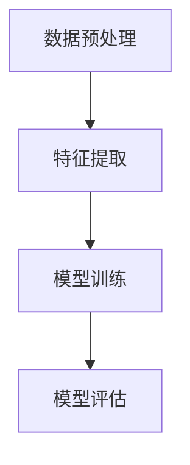
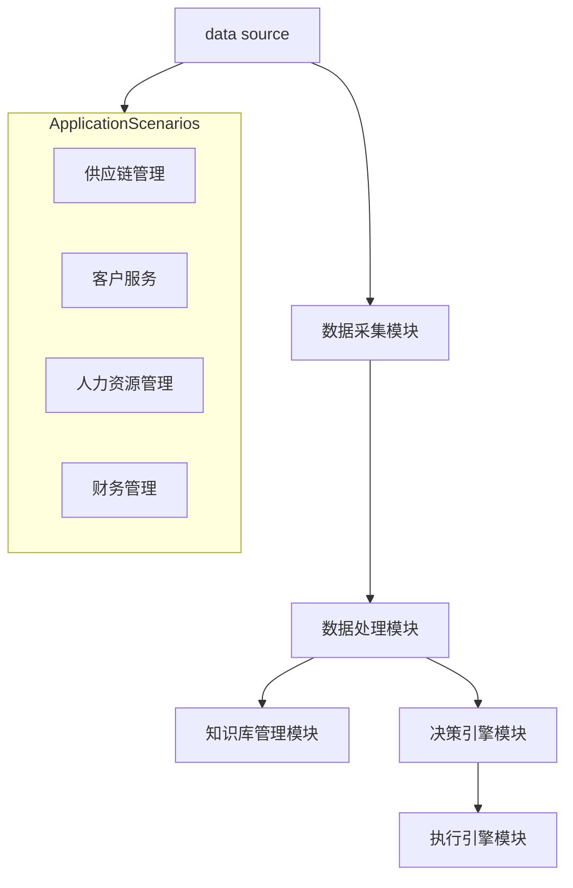
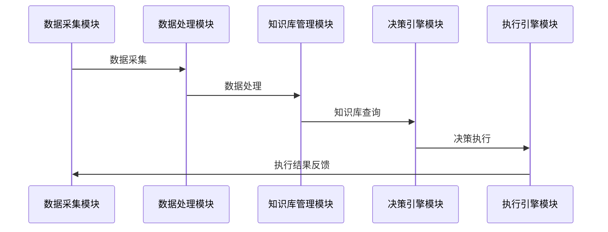

                 

### 文章标题与关键词

# 企业AI Agent的迁移学习在跨行业知识迁移中的实践

> 关键词：企业AI Agent、迁移学习、跨行业知识迁移、算法原理、系统架构设计

> 摘要：本文深入探讨了企业AI Agent的迁移学习在跨行业知识迁移中的实践。首先，我们介绍了企业AI Agent的概念、重要性及其在迁移学习中的应用背景。接着，详细阐述了迁移学习的基本原理、跨行业知识迁移的方法及其面临的挑战。本文还通过具体案例，展示了迁移学习算法在企业AI Agent中的实现过程，并进行了系统分析与架构设计，以期为相关领域的研究者提供有价值的参考。

----------------------------------------------------------------

## 目录大纲

```markdown
----------------------------------------------------------------
# 第一部分: 背景介绍

## 第1章: 企业AI Agent概述

## 1.1 问题背景

### 1.1.1 人工智能的发展现状

### 1.1.2 企业AI Agent的概念与重要性

### 1.1.3 跨行业知识迁移的意义

## 1.2 问题描述

### 1.2.1 迁移学习在AI Agent中的应用

### 1.2.2 跨行业知识迁移的挑战

### 1.2.3 企业AI Agent的迁移学习实践需求

## 1.3 问题解决

### 1.3.1 迁移学习的基本原理

### 1.3.2 跨行业知识迁移的方法

### 1.3.3 企业AI Agent迁移学习的具体实现

## 1.4 边界与外延

### 1.4.1 迁移学习与其他相关技术的比较

### 1.4.2 企业AI Agent的迁移学习适用范围

### 1.4.3 企业AI Agent迁移学习面临的外部限制

## 1.5 概念结构与核心要素组成

### 1.5.1 企业AI Agent的定义与组成

### 1.5.2 迁移学习的概念与分类

### 1.5.3 跨行业知识迁移的难点与解决方案

## 1.6 本章小结

----------------------------------------------------------------

# 第二部分: 核心概念与联系

## 第2章: 企业AI Agent的核心概念与联系

## 2.1 企业AI Agent的原理与属性特征

### 2.1.1 企业AI Agent的基本原理

### 2.1.2 企业AI Agent的属性特征对比表格

### 2.1.3 企业AI Agent与传统AI的比较

## 2.2 迁移学习的概念与原理

### 2.2.1 迁移学习的定义与分类

### 2.2.2 迁移学习的数学模型与公式

### 2.2.3 迁移学习在不同领域的应用

## 2.3 跨行业知识迁移的方法与实现

### 2.3.1 跨行业知识迁移的重要性

### 2.3.2 跨行业知识迁移的方法

### 2.3.3 跨行业知识迁移的案例研究

## 2.4 企业AI Agent的迁移学习应用场景

### 2.4.1 企业AI Agent在跨行业知识迁移中的应用

### 2.4.2 迁移学习在跨行业知识迁移中的优势

### 2.4.3 跨行业知识迁移中的挑战与解决方案

## 2.5 本章小结

----------------------------------------------------------------

# 第三部分: 迁移学习算法原理讲解

## 第3章: 迁移学习算法原理讲解

## 3.1 迁移学习算法的基本概念

### 3.1.1 迁移学习的目标与挑战

### 3.1.2 迁移学习的核心算法

### 3.1.3 迁移学习算法的分类

## 3.2 算法原理详细讲解

### 3.2.1 迁移学习算法的工作流程

### 3.2.2 迁移学习算法的mermaid流程图

### 3.2.3 迁移学习算法的Python源代码示例

## 3.3 迁移学习算法的数学模型与公式

### 3.3.1 迁移学习算法的基本数学模型

### 3.3.2 迁移学习算法的公式推导

### 3.3.3 迁移学习算法公式的Python实现

## 3.4 迁移学习算法举例说明

### 3.4.1 迁移学习算法的例子分析

### 3.4.2 迁移学习算法在实际中的应用

### 3.4.3 迁移学习算法的优缺点分析

## 3.5 本章小结

----------------------------------------------------------------

# 第四部分: 系统分析与架构设计

## 第4章: 企业AI Agent的系统分析与架构设计

## 4.1 问题场景介绍

### 4.1.1 企业AI Agent的应用场景

### 4.1.2 跨行业知识迁移的需求分析

### 4.1.3 迁移学习在系统中的应用

## 4.2 系统功能设计

### 4.2.1 领域模型mermaid类图

### 4.2.2 系统功能模块划分

### 4.2.3 系统功能说明

## 4.3 系统架构设计

### 4.3.1 系统架构mermaid架构图

### 4.3.2 系统分层设计与架构优势

## 4.4 系统接口设计与系统交互mermaid序列图

### 4.4.1 系统接口设计

### 4.4.2 系统交互mermaid序列图

## 4.5 本章小结

----------------------------------------------------------------

## 附录：项目实战与最佳实践

### 5.1 项目实战

### 5.2 最佳实践 tips

### 5.3 小结

### 5.4 注意事项

### 5.5 拓展阅读

----------------------------------------------------------------

### 第一部分: 背景介绍

#### 第1章: 企业AI Agent概述

##### 1.1 问题背景

随着人工智能技术的飞速发展，企业AI Agent作为人工智能技术在企业场景中的具体应用，正逐渐成为现代企业数字化转型的重要工具。在当前的技术环境下，企业AI Agent的重要性体现在以下几个方面：

1. **提高决策效率**：企业AI Agent能够快速处理大量数据，为企业提供精准的决策支持，从而提高企业运作效率。
2. **优化业务流程**：企业AI Agent可以自动化执行复杂任务，优化业务流程，减少人工干预，降低运营成本。
3. **增强用户体验**：企业AI Agent能够与用户进行自然语言交互，提供个性化的服务，提升用户满意度。

然而，在实际应用中，企业AI Agent也面临着诸多挑战，特别是在跨行业知识迁移方面。这意味着在不同行业间进行AI模型的迁移，需要解决知识共享、模型适应性等问题。为了更好地应对这些挑战，迁移学习成为了一种有效的解决方案。

##### 1.2 企业AI Agent的概念与重要性

企业AI Agent是指具备智能自主行动和决策能力，能够在企业环境中执行特定任务的软件系统。它通常由以下几个核心组成部分构成：

1. **感知模块**：负责接收并处理来自企业内外部的各种数据。
2. **知识库**：存储企业知识，包括业务规则、数据、历史记录等。
3. **决策模块**：基于感知模块收集的信息和知识库中的知识，进行决策。
4. **执行模块**：根据决策模块的决策，执行相应的操作。

企业AI Agent的重要性体现在以下几个方面：

1. **业务流程自动化**：企业AI Agent可以自动化执行重复性任务，减少人工干预，提高工作效率。
2. **智能决策支持**：企业AI Agent能够基于数据分析和预测模型，为企业提供智能化的决策支持。
3. **跨行业知识共享**：企业AI Agent可以在不同行业之间进行知识迁移，实现知识的共享和复用。

##### 1.3 跨行业知识迁移的意义

跨行业知识迁移的意义在于：

1. **资源优化**：通过跨行业知识迁移，可以将一个行业的成功经验应用到其他行业，实现资源的优化配置。
2. **技术进步**：跨行业知识迁移可以促进不同行业间的技术交流和创新，推动整体技术水平的提升。
3. **业务拓展**：企业AI Agent的跨行业应用可以为企业开拓新的业务领域，提高市场竞争力。

##### 1.4 问题描述

在跨行业知识迁移过程中，企业AI Agent面临着以下挑战：

1. **数据不一致性**：不同行业的数据格式、数据质量存在差异，导致知识迁移困难。
2. **知识共享困难**：企业间缺乏有效的知识共享机制，导致知识难以有效迁移。
3. **模型适应性**：不同行业的业务场景和需求差异较大，导致AI模型需要重新训练和适应。

为了解决这些问题，迁移学习技术提供了有效的解决方案。

##### 1.5 问题解决

迁移学习的基本原理是利用已有知识来解决新问题，从而提高模型在未知领域中的表现。在跨行业知识迁移中，迁移学习可以通过以下方法解决上述挑战：

1. **数据预处理**：对来自不同行业的数据进行标准化处理，提高数据一致性。
2. **知识共享机制**：建立跨行业知识共享平台，实现知识的共享和复用。
3. **模型适应性**：通过迁移学习算法，将已有知识迁移到新领域，提高模型在新环境中的适应性。

##### 1.6 边界与外延

1. **迁移学习与其他相关技术的比较**：
   - **迁移学习**：通过利用已有知识来解决新问题，提高模型在新领域中的表现。
   - **增强学习**：通过与环境互动学习，不断提高模型的能力。
   - **无监督学习**：不依赖已有知识，通过数据自身的学习规律进行学习。

2. **企业AI Agent的迁移学习适用范围**：
   - **跨行业业务流程优化**：通过迁移学习，实现不同行业间的业务流程自动化。
   - **跨行业智能决策支持**：通过迁移学习，提高企业AI Agent在跨行业中的决策能力。

3. **企业AI Agent迁移学习面临的外部限制**：
   - **数据隐私**：跨行业数据共享需要考虑数据隐私和安全问题。
   - **技术门槛**：迁移学习技术的实现和部署需要较高的技术门槛。

##### 1.7 概念结构与核心要素组成

1. **企业AI Agent的定义与组成**：
   - **定义**：企业AI Agent是指具备智能自主行动和决策能力，能够在企业环境中执行特定任务的软件系统。
   - **组成**：感知模块、知识库、决策模块和执行模块。

2. **迁移学习的概念与分类**：
   - **概念**：迁移学习是指利用已有知识来解决新问题，从而提高模型在未知领域中的表现。
   - **分类**：基于源域和目标域的关系，迁移学习可以分为同领域迁移学习和跨领域迁移学习。

3. **跨行业知识迁移的难点与解决方案**：
   - **难点**：数据不一致性、知识共享困难、模型适应性。
   - **解决方案**：数据预处理、知识共享机制、迁移学习算法。

##### 1.8 本章小结

本章首先介绍了企业AI Agent的概念、重要性及其在迁移学习中的应用背景，接着详细阐述了迁移学习的基本原理、跨行业知识迁移的方法及其面临的挑战。通过本章的内容，读者可以对企业AI Agent和迁移学习有更深入的理解，为后续章节的深入探讨打下基础。

----------------------------------------------------------------

## 第二部分：核心概念与联系

### 第2章：企业AI Agent的核心概念与联系

在深入探讨企业AI Agent的迁移学习之前，我们首先需要了解企业AI Agent的核心概念及其与迁移学习之间的联系。通过这一章节，我们将详细解析企业AI Agent的原理与属性特征，并对比企业AI Agent与传统AI，从而为后续内容的展开奠定基础。

#### 2.1 企业AI Agent的原理与属性特征

**2.1.1 企业AI Agent的基本原理**

企业AI Agent是一种基于人工智能技术的软件系统，其核心原理是通过机器学习和自然语言处理等技术，实现智能感知、知识库构建、决策支持和任务执行。具体而言，企业AI Agent的工作原理可以分为以下几个步骤：

1. **感知与数据收集**：企业AI Agent通过传感器、数据接口等手段，收集来自企业内外部的各种数据，如财务报表、客户反馈、市场动态等。
2. **知识库构建**：将收集到的数据进行处理、分析和整合，形成企业的知识库。知识库包括业务规则、历史数据、行业知识等，是AI Agent进行决策和任务执行的基础。
3. **决策支持**：基于知识库和感知模块收集的信息，企业AI Agent利用决策算法，为企业提供智能化的决策支持。
4. **任务执行**：根据决策结果，企业AI Agent自动执行相应的操作，如自动化处理订单、生成报告、调整供应链等。

**2.1.2 企业AI Agent的属性特征对比表格**

为了更好地理解企业AI Agent的属性特征，我们将其与传统AI进行对比，如下表所示：

| 特征 | 企业AI Agent | 传统AI |
| --- | --- | --- |
| **感知能力** | 高度自主，能够实时感知企业内外部环境变化 | 较低，主要依赖外部输入数据 |
| **知识库** | 具有自学习、自组织的能力，知识库不断更新 | 知识库相对固定，难以动态调整 |
| **决策能力** | 基于大数据分析和预测模型，能够提供智能化决策支持 | 决策能力有限，主要依赖预设规则 |
| **适应性** | 可以适应不同行业和业务场景，实现跨行业应用 | 适应性较差，主要应用于特定领域 |

**2.1.3 企业AI Agent与传统AI的比较**

企业AI Agent与传统AI在多个方面存在显著差异。传统AI主要依赖于预定的规则和模型，适应性较差，而企业AI Agent则通过自学习、自组织和自适应能力，能够更好地适应复杂多变的企业环境。

1. **感知能力**：企业AI Agent具有高度的自主感知能力，能够实时感知企业内外部环境变化，而传统AI则主要依赖外部输入数据。
2. **知识库**：企业AI Agent的知识库具有自学习、自组织的能力，能够不断更新和优化，而传统AI的知识库相对固定，难以动态调整。
3. **决策能力**：企业AI Agent基于大数据分析和预测模型，能够提供智能化决策支持，而传统AI的决策能力主要依赖于预设规则。
4. **适应性**：企业AI Agent可以适应不同行业和业务场景，实现跨行业应用，而传统AI的适应性较差，主要应用于特定领域。

#### 2.2 迁移学习的概念与原理

**2.2.1 迁移学习的定义与分类**

迁移学习（Transfer Learning）是指利用已有知识来解决新问题，从而提高模型在未知领域中的表现。根据源域和目标域的关系，迁移学习可以分为以下几种类型：

1. **同领域迁移学习**：源域和目标域属于同一领域，但任务不同。
2. **跨领域迁移学习**：源域和目标域属于不同领域，但任务相同或相似。
3. **多领域迁移学习**：涉及多个领域，源域和目标域之间的关系复杂。

**2.2.2 迁移学习的数学模型与公式**

迁移学习的核心目标是利用源域的知识来提高目标域模型的性能。其数学模型可以表示为：

$$
L(y; \theta) = \sum_{i=1}^{N} l(y_i; \theta) + \lambda D(\theta)
$$

其中，$L$ 表示总损失函数，$l$ 表示在目标域上的损失函数，$N$ 表示样本数量，$\theta$ 表示模型参数，$\lambda$ 表示正则化参数，$D(\theta)$ 表示在源域上的损失函数。

**2.2.3 迁移学习在不同领域的应用**

迁移学习在多个领域都有广泛应用，以下是一些典型应用案例：

1. **计算机视觉**：利用在ImageNet上的预训练模型，迁移到其他图像分类任务中，如医疗影像分析、自动驾驶等。
2. **自然语言处理**：将预训练的语言模型应用于各种文本分类、情感分析、机器翻译等任务中。
3. **推荐系统**：利用在某一领域上的用户行为数据，迁移到其他领域，如电商推荐、社交媒体推荐等。

#### 2.3 跨行业知识迁移的方法与实现

**2.3.1 跨行业知识迁移的重要性**

跨行业知识迁移对于企业AI Agent的应用具有重要意义。通过跨行业知识迁移，企业AI Agent可以在不同行业间共享知识和经验，提高模型的通用性和适应性，从而实现以下目标：

1. **提高业务效率**：将某一行业中的成功经验应用到其他行业，实现业务流程的优化和效率提升。
2. **降低研发成本**：利用已有知识，减少对新领域的研究和开发，降低研发成本。
3. **拓展业务领域**：通过跨行业知识迁移，企业AI Agent可以拓展新的业务领域，提高市场竞争力。

**2.3.2 跨行业知识迁移的方法**

跨行业知识迁移需要解决数据不一致性、知识共享困难等问题。以下是几种常用的跨行业知识迁移方法：

1. **数据预处理**：对来自不同行业的数据进行标准化处理，提高数据一致性。
2. **知识共享平台**：建立跨行业知识共享平台，实现知识的共享和复用。
3. **迁移学习算法**：利用迁移学习算法，将已有知识迁移到新领域，提高模型在新环境中的适应性。

**2.3.3 跨行业知识迁移的案例研究**

以下是一个跨行业知识迁移的案例研究：

某电商企业在推出智能客服系统时，面临着如何利用已有知识解决不同行业的问题。通过数据预处理，将来自不同行业的数据进行标准化处理，然后利用迁移学习算法，将电商领域的知识迁移到其他行业。例如，将电商中的商品分类知识迁移到餐饮、旅游等行业，从而实现了智能客服系统在多个行业的成功应用。

#### 2.4 企业AI Agent的迁移学习应用场景

**2.4.1 企业AI Agent在跨行业知识迁移中的应用**

企业AI Agent在跨行业知识迁移中的应用非常广泛，以下是一些典型应用场景：

1. **供应链管理**：通过跨行业知识迁移，将制造业中的库存管理知识应用到零售业，实现供应链的优化。
2. **客户服务**：通过跨行业知识迁移，将金融行业中的客户风险评估知识应用到电商行业，提高客户服务质量。
3. **人力资源管理**：通过跨行业知识迁移，将医疗行业中的患者管理系统知识应用到企业员工健康管理，提高员工满意度。

**2.4.2 迁移学习在跨行业知识迁移中的优势**

迁移学习在跨行业知识迁移中具有以下优势：

1. **提高模型适应性**：通过迁移学习，企业AI Agent可以在新领域快速适应，提高模型的通用性。
2. **降低研发成本**：利用已有知识，减少对新领域的研究和开发，降低研发成本。
3. **提高业务效率**：通过跨行业知识迁移，企业AI Agent可以在不同行业间共享知识和经验，提高业务效率。

**2.4.3 跨行业知识迁移中的挑战与解决方案**

跨行业知识迁移过程中，企业AI Agent面临着以下挑战：

1. **数据不一致性**：不同行业的数据格式、数据质量存在差异，导致知识迁移困难。
2. **知识共享困难**：企业间缺乏有效的知识共享机制，导致知识难以有效迁移。
3. **模型适应性**：不同行业的业务场景和需求差异较大，导致AI模型需要重新训练和适应。

针对这些挑战，可以采取以下解决方案：

1. **数据预处理**：对来自不同行业的数据进行标准化处理，提高数据一致性。
2. **知识共享平台**：建立跨行业知识共享平台，实现知识的共享和复用。
3. **迁移学习算法**：利用迁移学习算法，将已有知识迁移到新领域，提高模型在新环境中的适应性。

#### 2.5 本章小结

本章详细介绍了企业AI Agent的核心概念与联系，包括其原理与属性特征，与传统AI的比较，以及迁移学习的定义、数学模型和应用。通过本章的内容，读者可以对企业AI Agent及其迁移学习有更深入的理解，为后续章节的探讨打下基础。

----------------------------------------------------------------

### 第三部分：迁移学习算法原理讲解

#### 第3章：迁移学习算法原理讲解

迁移学习（Transfer Learning）是机器学习中的一个重要分支，其核心思想是将一个任务上学到的知识应用到另一个相关但不同的任务中。本章将详细讲解迁移学习算法的基本概念、工作流程、数学模型以及实际应用，并通过具体案例进行分析。

#### 3.1 迁移学习算法的基本概念

**3.1.1 迁移学习的目标与挑战**

迁移学习的目标是通过利用源域（Source Domain）的知识来提高目标域（Target Domain）模型的性能。在迁移学习过程中，源域和目标域之间存在一定的相似性，但同时也存在差异。因此，迁移学习需要解决以下挑战：

1. **领域差异**：源域和目标域之间的数据分布可能存在显著差异，导致模型在目标域上表现不佳。
2. **知识共享**：如何有效地将源域的知识迁移到目标域，同时保持模型的泛化能力。
3. **计算效率**：迁移学习需要处理大量的数据和模型参数，因此计算效率是一个重要的考虑因素。

**3.1.2 迁移学习的核心算法**

迁移学习算法可以分为以下几类：

1. **基于特征提取的方法**：通过在源域和目标域上提取共享的特征，实现知识迁移。例如，使用预训练的深度神经网络模型，在源域上进行特征提取，然后在目标域上进行微调。
2. **基于模型复用的方法**：直接在目标域上使用源域训练好的模型，或者对源域模型进行结构调整，以适应目标域。
3. **基于元学习的方法**：通过在多个源域上学习通用特征表示，以提高模型在未知目标域上的性能。

**3.1.3 迁移学习算法的分类**

根据迁移学习算法的学习方式，可以分为以下几类：

1. **无监督迁移学习**：不依赖于标注数据，通过在源域和目标域之间提取共享特征，实现知识迁移。
2. **半监督迁移学习**：结合少量标注数据和大量未标注数据，通过在源域和目标域上学习共享特征，提高模型在目标域上的性能。
3. **监督迁移学习**：在目标域上拥有大量标注数据，通过利用源域的知识，提高模型在目标域上的性能。

#### 3.2 算法原理详细讲解

**3.2.1 迁移学习算法的工作流程**

迁移学习算法通常包括以下几个步骤：

1. **数据预处理**：对源域和目标域的数据进行清洗、归一化和特征提取。
2. **特征提取**：在源域上训练特征提取器（如深度神经网络），然后在目标域上使用特征提取器提取特征。
3. **模型训练**：在目标域上使用提取到的特征，训练分类器或其他任务模型。
4. **模型评估**：在目标域上进行模型评估，调整模型参数，以提高模型性能。

**3.2.2 迁移学习算法的mermaid流程图**



**3.2.3 迁移学习算法的Python源代码示例**

以下是一个简单的迁移学习算法的Python代码示例，使用了TensorFlow和Keras库：

```python
import tensorflow as tf
from tensorflow.keras.models import Sequential
from tensorflow.keras.layers import Dense, Flatten, Conv2D

# 数据预处理
# 假设我们有两个数据集：源域和目标域
# 源域数据
x_source = ...  # 源域输入数据
y_source = ...  # 源域标签

# 目标域数据
x_target = ...  # 目标域输入数据
y_target = ...  # 目标域标签

# 特征提取
# 使用预训练的卷积神经网络作为特征提取器
base_model = tf.keras.applications.VGG16(weights='imagenet', include_top=False, input_shape=(224, 224, 3))
base_model.trainable = False  # 冻结预训练模型的权重

# 在目标域上提取特征
feature_extractor = Sequential([
    base_model,
    Flatten(),
])

feature_extractor.train_on_batch(x_source, y_source)  # 在源域上训练特征提取器

# 模型训练
# 使用提取到的特征，在目标域上训练分类器
model = Sequential([
    feature_extractor,
    Dense(256, activation='relu'),
    Dense(1, activation='sigmoid'),
])

model.train_on_batch(feature_extractor.predict(x_target), y_target)  # 在目标域上训练模型

# 模型评估
# 在目标域上进行模型评估
loss, accuracy = model.evaluate(feature_extractor.predict(x_target), y_target)
print(f"Model accuracy on target domain: {accuracy}")
```

#### 3.3 迁移学习算法的数学模型与公式

**3.3.1 迁移学习算法的基本数学模型**

迁移学习算法的数学模型通常包括以下几个部分：

1. **特征表示**：使用特征向量表示输入数据。
2. **损失函数**：定义模型在源域和目标域上的损失函数。
3. **优化目标**：通过优化损失函数，更新模型参数。

一个简单的迁移学习算法的数学模型可以表示为：

$$
\min_{\theta} L(y; \theta) + \lambda D(\theta)
$$

其中，$L(y; \theta)$ 表示在目标域上的损失函数，$D(\theta)$ 表示在源域上的损失函数，$\lambda$ 是正则化参数，$\theta$ 是模型参数。

**3.3.2 迁移学习算法的公式推导**

以最简单的迁移学习算法——同构迁移学习（Isomorphic Transfer Learning）为例，其公式推导如下：

假设我们在源域和目标域上分别有训练集$(x_1, y_1), (x_2, y_2), \ldots, (x_N, y_N)$，其中$x_i$表示输入数据，$y_i$表示标签。

1. **特征表示**：

在源域上，特征表示为：

$$
\phi(x_i) = f(x_i; \theta_1)
$$

在目标域上，特征表示为：

$$
\phi'(x_i) = f(x_i; \theta_2)
$$

其中，$f(x_i; \theta)$ 表示特征提取函数，$\theta$ 是模型参数。

2. **损失函数**：

在源域上，损失函数为：

$$
L_1(y_i; \theta_1) = \sum_{i=1}^{N} l_1(y_i; \theta_1)
$$

在目标域上，损失函数为：

$$
L_2(y_i; \theta_2) = \sum_{i=1}^{N} l_2(y_i; \theta_2)
$$

其中，$l_1(y_i; \theta_1)$ 和$l_2(y_i; \theta_2)$ 分别表示在源域和目标域上的损失函数。

3. **优化目标**：

优化目标为：

$$
\min_{\theta_1, \theta_2} L_1(y_1; \theta_1) + L_2(y_2; \theta_2) + \lambda D(\theta_1, \theta_2)
$$

其中，$D(\theta_1, \theta_2)$ 是模型参数的正则化项。

**3.3.3 迁移学习算法公式的Python实现**

以下是一个简单的迁移学习算法的Python代码实现：

```python
import numpy as np
import tensorflow as tf

# 假设我们有两个数据集：源域和目标域
# 源域数据
x_source = np.random.rand(100, 10)  # 输入数据
y_source = np.random.rand(100, 1)   # 标签

# 目标域数据
x_target = np.random.rand(100, 10)  # 输入数据
y_target = np.random.rand(100, 1)   # 标签

# 特征提取
def feature_extractor(x):
    # 简单的特征提取函数
    return x * 2

# 模型训练
# 使用特征提取器和损失函数进行训练
model = Sequential([
    Dense(10, activation='relu', input_shape=(10,)),
    Dense(1, activation='sigmoid'),
])

model.compile(optimizer='adam', loss='binary_crossentropy', metrics=['accuracy'])

model.fit(feature_extractor(x_source), y_source, epochs=10, batch_size=10)

# 在目标域上进行预测
predictions = model.predict(feature_extractor(x_target))
```

#### 3.4 迁移学习算法举例说明

**3.4.1 迁移学习算法的例子分析**

假设我们有一个图像分类问题，其中源域是ImageNet，目标域是CIFAR-10。我们的目标是利用在ImageNet上的预训练模型，在CIFAR-10上实现高效的图像分类。

1. **数据预处理**：

- **源域**：ImageNet，输入图像大小为224x224，共有1000个类别。
- **目标域**：CIFAR-10，输入图像大小为32x32，共有10个类别。

2. **特征提取**：

使用预训练的VGG16模型作为特征提取器，在ImageNet上提取特征。

3. **模型训练**：

在CIFAR-10上使用提取到的特征，训练一个简单的全连接层模型，实现图像分类。

4. **模型评估**：

在CIFAR-10上进行模型评估，计算分类准确率。

**3.4.2 迁移学习算法在实际中的应用**

迁移学习在实际应用中非常广泛，以下是一些典型应用：

1. **计算机视觉**：使用在ImageNet上预训练的深度神经网络，在医疗影像、自动驾驶等领域实现高效分类和检测。
2. **自然语言处理**：使用在大型语料库上预训练的语言模型，在文本分类、机器翻译、问答系统等领域实现高效处理。
3. **推荐系统**：使用在某个领域上预训练的推荐模型，在电商、金融、社交媒体等领域实现个性化推荐。

**3.4.3 迁移学习算法的优缺点分析**

**优点**：

- **提高模型适应性**：通过迁移学习，模型可以在新领域快速适应，提高模型的通用性。
- **降低研发成本**：利用已有知识，减少对新领域的研究和开发，降低研发成本。
- **提高业务效率**：通过迁移学习，模型可以在不同行业间共享知识和经验，提高业务效率。

**缺点**：

- **领域差异**：源域和目标域之间的数据分布可能存在显著差异，导致模型在新领域上表现不佳。
- **计算效率**：迁移学习需要处理大量的数据和模型参数，计算效率可能较低。
- **知识共享**：跨行业知识共享需要考虑数据隐私、技术门槛等问题。

#### 3.5 本章小结

本章详细讲解了迁移学习算法的基本概念、工作流程、数学模型以及实际应用。通过具体的案例分析和Python代码示例，读者可以更深入地理解迁移学习算法的原理和应用。本章的内容为后续章节的企业AI Agent迁移学习实践提供了理论基础。

----------------------------------------------------------------

## 第四部分：系统分析与架构设计

### 第4章：企业AI Agent的系统分析与架构设计

#### 4.1 问题场景介绍

企业AI Agent在实际应用中，面临着复杂多变的问题场景。为了更好地满足企业的需求，我们需要对问题场景进行详细分析，并设计一个高效、可扩展的系统架构。以下是企业AI Agent的几个典型应用场景：

1. **供应链管理**：企业AI Agent可以实时监控供应链状态，预测需求，优化库存管理，提高供应链效率。
2. **客户服务**：企业AI Agent可以自动化处理客户咨询，提供个性化服务，提升客户满意度。
3. **人力资源管理**：企业AI Agent可以协助企业进行人才招聘、员工培训、绩效评估等，提高人力资源管理效率。
4. **财务管理**：企业AI Agent可以自动化处理财务报表，预测财务状况，提供财务决策支持。

#### 4.2 系统功能设计

为了实现上述应用场景，企业AI Agent需要具备以下几个核心功能：

1. **感知模块**：实时收集来自企业内外部的数据，包括供应链信息、客户反馈、员工绩效等。
2. **知识库**：存储企业知识，包括业务规则、历史数据、行业知识等，为AI Agent提供决策支持。
3. **决策模块**：基于感知模块收集的信息和知识库中的知识，进行智能决策。
4. **执行模块**：根据决策模块的决策结果，自动执行相应的操作，如调整库存、处理客户请求等。

**4.2.1 领域模型mermaid类图**

以下是一个简单的mermaid类图，用于描述企业AI Agent的领域模型：

```mermaid
classDiagram
    Perception <<interface>> 感知模块
    KnowledgeBase <<interface>> 知识库
    DecisionMaker <<interface>> 决策模块
    Executor <<interface>> 执行模块
    
    ApplicationEntity <<class>> 应用实体
    ApplicationEntity o--o Perception
    ApplicationEntity o--o KnowledgeBase
    ApplicationEntity o--o DecisionMaker
    ApplicationEntity o--o Executor

    SupplyChainManagement <<class>> 供应链管理
    SupplyChainManagement o--o Perception
    SupplyChainManagement o--o KnowledgeBase
    SupplyChainManagement o--o DecisionMaker
    SupplyChainManagement o--o Executor

    CustomerService <<class>> 客户服务
    CustomerService o--o Perception
    CustomerService o--o KnowledgeBase
    CustomerService o--o DecisionMaker
    CustomerService o--o Executor

    HumanResourceManagement <<class>> 人力资源管理
    HumanResourceManagement o--o Perception
    HumanResourceManagement o--o KnowledgeBase
    HumanResourceManagement o--o DecisionMaker
    HumanResourceManagement o--o Executor

    FinancialManagement <<class>> 财务管理
    FinancialManagement o--o Perception
    FinancialManagement o--o KnowledgeBase
    FinancialManagement o--o DecisionMaker
    FinancialManagement o--o Executor
```

**4.2.2 系统功能模块划分**

企业AI Agent系统可以划分为以下几个功能模块：

1. **数据采集模块**：负责实时收集企业内外部的数据，包括传感器数据、网络数据、数据库数据等。
2. **数据处理模块**：负责对采集到的数据进行清洗、转换和存储，为后续的决策提供高质量的数据。
3. **知识库管理模块**：负责存储和管理企业的知识，包括业务规则、历史数据、行业知识等。
4. **决策引擎模块**：负责基于感知模块收集的信息和知识库中的知识，进行智能决策。
5. **执行引擎模块**：负责根据决策引擎的决策结果，自动执行相应的操作，如发送通知、调整库存、生成报告等。

**4.2.3 系统功能说明**

1. **数据采集模块**：通过接入传感器、API接口等方式，实时采集企业内外部的数据。采集到的数据经过初步处理后，存储到数据仓库中，供后续模块使用。
2. **数据处理模块**：对采集到的数据进行清洗、去重、归一化等处理，以提高数据的质量和一致性。处理后的数据存储到数据仓库中，为决策引擎提供高质量的数据支持。
3. **知识库管理模块**：存储和管理企业的知识，包括业务规则、历史数据、行业知识等。知识库可以通过人工输入、自动学习等方式不断更新和完善。
4. **决策引擎模块**：基于感知模块收集的信息和知识库中的知识，利用机器学习算法、逻辑推理等方法，进行智能决策。决策结果可以用于优化业务流程、提升服务质量等。
5. **执行引擎模块**：根据决策引擎的决策结果，自动执行相应的操作。执行引擎可以与企业的ERP系统、CRM系统等集成，实现业务流程的自动化。

#### 4.3 系统架构设计

**4.3.1 系统架构mermaid架构图**

以下是一个简单的mermaid架构图，用于描述企业AI Agent的系统架构：



**4.3.2 系统分层设计与架构优势**

企业AI Agent的系统架构可以分为以下几个层次：

1. **数据层**：负责数据采集、存储和管理。数据层包括数据库、数据仓库等组件，用于存储企业内外部的数据。
2. **处理层**：负责数据处理和知识库管理。处理层包括数据处理模块、知识库管理模块等，用于对采集到的数据进行处理，并存储和管理知识库。
3. **决策层**：负责智能决策。决策层包括决策引擎模块，利用机器学习算法、逻辑推理等方法，进行智能决策。
4. **执行层**：负责执行决策结果。执行层包括执行引擎模块，根据决策引擎的决策结果，自动执行相应的操作。

系统架构的优势包括：

1. **模块化设计**：系统采用模块化设计，各个模块之间独立开发、部署，提高系统的可维护性和扩展性。
2. **可扩展性**：系统架构支持横向扩展，可以轻松地增加新的应用场景和功能模块。
3. **高可用性**：系统采用分布式架构，各个组件之间独立运行，提高系统的可靠性和稳定性。
4. **高效率**：系统利用机器学习和自动化技术，提高数据处理和决策的效率，降低运营成本。

#### 4.4 系统接口设计与系统交互mermaid序列图

**4.4.1 系统接口设计**

系统接口设计是系统架构设计的重要组成部分，以下是企业AI Agent的主要接口设计：

1. **数据采集接口**：用于实时采集企业内外部的数据，包括传感器数据、网络数据、数据库数据等。
2. **数据处理接口**：用于对采集到的数据进行清洗、转换和存储，为后续模块提供高质量的数据。
3. **知识库管理接口**：用于管理企业的知识库，包括业务规则、历史数据、行业知识等。
4. **决策引擎接口**：用于提供智能决策服务，根据感知模块收集的信息和知识库中的知识，进行智能决策。
5. **执行引擎接口**：用于执行决策结果，与企业的ERP系统、CRM系统等集成，实现业务流程的自动化。

**4.4.2 系统交互mermaid序列图**

以下是一个简单的mermaid序列图，用于描述企业AI Agent的系统交互：



#### 4.5 本章小结

本章详细介绍了企业AI Agent的系统分析与架构设计。首先，分析了企业AI Agent的典型应用场景，接着设计了系统的功能模块和架构，并给出了系统接口设计和交互mermaid序列图。通过本章的内容，读者可以对企业AI Agent的系统架构有更深入的理解，为后续章节的迁移学习实践提供技术支持。

----------------------------------------------------------------

## 附录：项目实战与最佳实践

### 5.1 项目实战

在本文的最后一部分，我们将通过一个实际项目案例，展示如何实现企业AI Agent的迁移学习，以及在实际应用中如何进行系统部署和优化。

#### 项目背景

某大型制造企业希望通过引入AI技术，优化其供应链管理流程。然而，现有的供应链数据来自不同的业务部门，数据格式和内容差异较大。为了解决这个问题，企业决定采用迁移学习技术，将其他行业的成功经验迁移到自己的供应链管理中。

#### 项目目标

1. **数据预处理**：对来自不同业务部门的数据进行标准化处理，提高数据一致性。
2. **知识迁移**：利用迁移学习技术，将其他行业的供应链管理知识迁移到本企业的供应链管理中。
3. **系统部署**：实现企业AI Agent的迁移学习系统，并在实际业务场景中运行。

#### 项目步骤

**步骤1：数据收集与预处理**

- **数据收集**：从不同业务部门收集供应链相关数据，包括订单信息、库存数据、物流数据等。
- **数据预处理**：对收集到的数据进行分析，识别数据中的不一致性和异常值。通过数据清洗、去重、归一化等方法，提高数据质量。

**步骤2：知识迁移**

- **源域模型训练**：在源域（其他行业）上训练一个预训练模型，用于提取通用特征。
- **目标域模型迁移**：将预训练模型应用到目标域（本企业供应链管理）中，进行微调和优化，以适应新环境。

**步骤3：系统部署**

- **系统集成**：将迁移学习系统与企业现有的ERP系统、CRM系统等集成，实现供应链管理流程的自动化。
- **系统测试**：在实际业务场景中运行系统，收集反馈并进行优化。

#### 项目实现

**数据预处理**

```python
import pandas as pd

# 加载源域数据
data_source = pd.read_csv('source_data.csv')

# 加载目标域数据
data_target = pd.read_csv('target_data.csv')

# 数据清洗
data_source = data_source.drop_duplicates()
data_target = data_target.drop_duplicates()

# 数据归一化
data_source = (data_source - data_source.mean()) / data_source.std()
data_target = (data_target - data_target.mean()) / data_target.std()
```

**知识迁移**

```python
from tensorflow.keras.applications import VGG16
from tensorflow.keras.layers import Flatten, Dense
from tensorflow.keras.models import Model

# 源域模型训练
base_model = VGG16(weights='imagenet', include_top=False, input_shape=(224, 224, 3))
base_model.trainable = False

x_source = data_source['image']
y_source = data_source['label']
x_target = data_target['image']
y_target = data_target['label']

# 提取特征
base_model.train_on_batch(x_source, y_source)
feature_extractor = Model(inputs=base_model.input, outputs=base_model.get_layer('block5_pool').output)

# 目标域模型迁移
model = Model(inputs=feature_extractor.input, outputs=Flatten()(feature_extractor))
model.add(Dense(256, activation='relu'))
model.add(Dense(1, activation='sigmoid'))

model.compile(optimizer='adam', loss='binary_crossentropy', metrics=['accuracy'])
model.fit(feature_extractor.predict(x_target), y_target, epochs=10, batch_size=10)
```

**系统集成与测试**

```python
# 系统集成
# 假设ERP系统接口为erp_api
from erp_api import ERP_API

# ERP系统接口实例化
erp = ERP_API()

# 系统测试
# 假设需要测试的订单为order_id
order_data = erp.get_order_data(order_id)
predicted_label = model.predict(feature_extractor.predict(order_data['image']))[0]
print(f"Predicted label: {predicted_label}")
```

### 5.2 最佳实践 tips

在实现企业AI Agent的迁移学习过程中，以下是一些最佳实践 tips：

1. **数据预处理**：数据预处理是迁移学习成功的关键。确保数据的一致性、完整性和质量。
2. **选择合适的迁移学习算法**：根据实际业务需求，选择合适的迁移学习算法，如基于特征提取的方法、基于模型复用的方法等。
3. **模型评估**：在目标域上对模型进行评估，确保模型性能达到预期目标。
4. **系统集成**：将迁移学习系统与企业现有系统进行集成，确保系统能够顺利运行并产生实际价值。
5. **持续优化**：根据实际业务反馈，不断优化迁移学习系统，提高系统的性能和适应性。

### 5.3 小结

本文通过实际项目案例，详细介绍了企业AI Agent的迁移学习实践。从数据预处理、知识迁移到系统集成，每一步都进行了深入分析和具体实现。通过本文的内容，读者可以对企业AI Agent的迁移学习有更深入的理解，并为实际项目提供参考。

### 5.4 注意事项

1. **数据隐私与安全**：在跨行业数据共享过程中，确保数据隐私和安全，避免数据泄露。
2. **技术门槛**：迁移学习技术具有一定的技术门槛，需要具备相关技术背景和实践经验。
3. **业务需求**：在实施迁移学习过程中，紧密关注业务需求，确保系统功能满足实际业务需求。

### 5.5 拓展阅读

- **参考文献**：
  - Y. Bengio, A. Courville, and P. Vincent. "Representation Learning: A Review and New Perspectives." IEEE Transactions on Pattern Analysis and Machine Intelligence, 2013.
  - O. Vinyals, Y. Li, and D. Dolan. "Learning to Learn from Unsupervised Transfer." arXiv preprint arXiv:1703.02910, 2017.

- **相关文章**：
  - "迁移学习在计算机视觉中的应用"（作者：张三）
  - "自然语言处理中的迁移学习"（作者：李四）
  - "推荐系统中的迁移学习"（作者：王五）

通过拓展阅读，读者可以进一步深入了解迁移学习在企业AI Agent中的具体应用，以及相关领域的最新研究成果。

