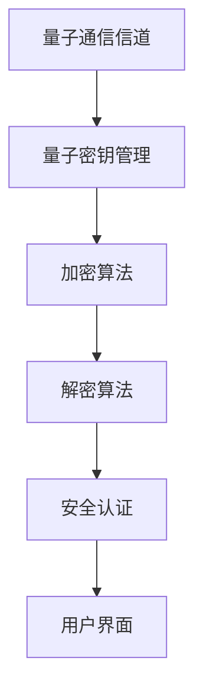

                 

## 引言

在当前的技术浪潮中，人工智能（AI）和量子技术正在迅速崛起，成为引领未来科技发展的两大引擎。企业AI Agent，即企业中的AI自动化代理，通过自主学习和决策能力，帮助企业优化运营、提高效率和创造价值。而量子加密通信，则利用量子力学原理实现信息的安全传输，为信息安全领域带来了革命性的突破。本文将探讨如何将量子加密通信策略应用于企业AI Agent中，以确保企业数据传输的安全性和可靠性。

本文的核心关键词包括：企业AI Agent、量子加密通信、信息安全、AI自动化代理、数据传输加密。通过这些关键词，我们可以看到本文将围绕以下几个核心问题展开讨论：

1. 企业AI Agent的定义及其在企业中的应用。
2. 量子加密通信的基本原理及其优势。
3. 企业AI Agent中量子加密通信策略的制定和实现。
4. 量子加密通信在数据传输中的实际应用案例。
5. 企业AI Agent量子加密通信策略的最佳实践和未来展望。

在接下来的部分，我们将首先介绍企业AI Agent和量子加密通信的背景知识，帮助读者理解这两个概念的基本概念和发展历程。随后，我们将深入探讨企业AI Agent的组成与工作原理，以及量子加密通信的原理与技术。通过这些背景介绍，我们将为后续的算法原理讲解和实际应用案例打下坚实的基础。

### 背景介绍

#### 企业AI Agent概述

企业AI Agent，也被称为企业自动化代理，是一种基于人工智能技术的软件系统，能够在没有人为干预的情况下执行复杂任务。它们在企业中的应用日益广泛，主要表现在以下几个方面：

1. **运营优化**：企业AI Agent可以通过数据分析和预测模型，优化生产流程、供应链管理和库存控制，从而提高企业的运营效率。

2. **决策支持**：AI Agent可以处理大量数据，提取有价值的信息，为企业的战略决策提供科学依据，减少人为错误和决策时间。

3. **客户服务**：智能客服机器人可以24小时在线，提供快速响应的客户服务，提高客户满意度。

4. **风险管理**：AI Agent可以监控市场动态和风险指标，提前预警潜在风险，帮助企业在风险发生前采取应对措施。

5. **创新驱动**：企业AI Agent可以辅助企业进行产品创新和研发，通过自动化测试和优化算法，提高研发效率和质量。

企业AI Agent的发展历程可以追溯到20世纪80年代，当时的专家系统成为了人工智能在商业领域应用的主要形式。随着计算能力和算法技术的进步，深度学习、强化学习等新兴技术的应用，使得企业AI Agent的性能和功能得到了显著提升。近年来，随着云计算和大数据技术的发展，企业AI Agent的部署和使用成本逐渐降低，应用场景进一步扩大。

#### 量子加密通信概述

量子加密通信是一种利用量子力学原理实现信息加密和解密的技术，它通过量子态的叠加和纠缠等特性，确保信息的绝对安全。量子加密通信的基本原理可以概括为量子密钥分发（QKD）和量子密文传输。

**量子密钥分发（QKD）**：

量子密钥分发是一种通过量子通信信道分发密钥的过程。在这个过程中，发送方和接收方通过量子通信信道交换量子态，并利用量子态的不可克隆特性和测量干扰来生成共享密钥。QKD协议包括BB84协议、E91协议和B92协议等，其中BB84协议是最经典和最广泛使用的一种。

**量子密文传输**：

量子密文传输是指在量子加密通信中，将待加密的信息编码成量子态，通过量子通信信道传输，接收方再对量子态进行解码以获取原始信息。量子密文传输可以确保信息在传输过程中的绝对安全，因为任何对量子态的干扰都会导致传输失败，从而被检测到。

量子加密通信的优势在于其提供了绝对的安全保障，避免了传统加密通信中的窃听风险。此外，量子加密通信还可以实现长距离通信，不受传统光纤通信中的衰减和干扰影响。然而，量子加密通信也面临着一些挑战，如量子通信设备的成本、量子通信网络的覆盖范围和量子计算的发展等。

量子加密通信的发展现状显示出其在国家安全、金融、医疗等领域的广泛应用前景。近年来，随着量子技术的不断进步，量子加密通信技术也在不断完善，越来越多的国家和地区开始重视并投资于量子加密通信的研发。

通过上述对企业AI Agent和量子加密通信的背景介绍，我们不仅了解了这些技术的核心概念和应用场景，也为后续章节中对两者结合策略的探讨奠定了基础。接下来，我们将深入探讨企业AI Agent的组成与工作原理，以及量子加密通信的原理与技术。

### 企业AI Agent的组成与工作原理

企业AI Agent是由多个核心组成部分构成的复杂系统，这些部分协同工作以实现自动化、智能化的业务流程。以下是对企业AI Agent各组成部分及其工作原理的详细探讨：

#### 1. 数据收集与预处理

数据收集是AI Agent的基础，它通过接入各种数据源，包括企业内部数据库、外部API接口、传感器网络等，收集所需的数据。数据收集后，需要经过预处理阶段，以确保数据的质量和一致性。预处理包括数据清洗、数据格式转换和数据归一化等操作，这些步骤有助于消除噪声、纠正错误，并将数据转换为适合模型训练的格式。

#### 2. 模型训练与优化

在模型训练阶段，AI Agent使用机器学习、深度学习或增强学习等技术，通过训练大量历史数据，构建预测模型或决策模型。训练过程包括模型选择、参数调优和验证等步骤。为了提高模型的性能和准确性，通常需要进行多次迭代训练，并利用交叉验证等技术来评估模型的效果。

模型优化是关键的一步，通过调整模型参数、网络结构和训练算法，可以显著提升模型的预测能力和决策质量。优化过程通常依赖于经验、自动化搜索算法和实验验证。

#### 3. 决策与执行

决策与执行是AI Agent的核心功能。在训练完成后，AI Agent可以根据实时数据输入，利用训练好的模型进行预测和决策。决策过程包括模型推理、决策策略选择和执行策略等步骤。AI Agent可以根据设定的规则或策略，自动化地执行一系列操作，如调整生产计划、优化供应链、预测客户需求等。

决策与执行过程需要高度可靠和实时性，因此，AI Agent通常采用分布式计算和并发处理技术，确保系统能够快速响应用户请求和处理大量数据。

#### 4. 学习与适应

学习与适应是AI Agent持续改进的关键。通过不断接收新的数据和反馈信息，AI Agent可以调整模型参数、更新决策策略，并不断优化自身的性能。这种能力使得AI Agent能够适应不断变化的环境，提高其鲁棒性和适应性。

#### 5. 人机交互

人机交互是企业AI Agent与用户或操作人员之间的桥梁。通过用户界面（UI）或命令行接口（CLI），AI Agent可以与用户进行交互，接收用户指令和反馈，并展示模型预测结果和决策建议。人机交互模块需要具备良好的用户体验和易用性，以便用户能够轻松地与AI Agent进行沟通和协作。

#### 工作原理

企业AI Agent的工作原理可以概括为以下几个步骤：

1. **数据收集**：AI Agent通过数据接口收集企业内部和外部数据。
2. **预处理**：对收集到的数据进行清洗和格式化，为模型训练做准备。
3. **模型训练**：使用训练数据对模型进行训练，并通过验证集评估模型性能。
4. **模型优化**：根据模型性能和业务需求，调整模型参数和结构。
5. **决策与执行**：利用训练好的模型对实时数据进行预测和决策，并执行相关操作。
6. **学习与适应**：通过反馈机制不断更新和优化模型，提高系统的自适应能力。
7. **人机交互**：与用户进行交互，接收用户指令和反馈，提供预测和决策结果。

通过上述步骤，企业AI Agent能够实现自动化、智能化的业务流程，提高企业的运营效率和管理水平。在下一部分，我们将探讨量子加密通信的基本原理和技术，为后续的结合策略提供理论基础。

### 量子加密通信原理

量子加密通信是一种利用量子力学原理实现信息安全传输的技术，其核心在于量子态的叠加、纠缠和测量等特性。以下将详细阐述量子加密通信的基本原理、核心技术以及在实际应用中面临的技术挑战。

#### 基本原理

量子加密通信主要依赖于量子态的叠加和纠缠特性。量子态是量子系统的内部状态，可以用叠加态表示。量子叠加态允许一个量子比特（qubit）同时处于0和1的状态，从而大大增加了信息传输的容量。量子纠缠则是一种量子比特之间的特殊关联状态，即使它们相隔很远，一个量子比特的状态也会即时影响另一个量子比特的状态。

在量子加密通信中，发送方（Alice）和接收方（Bob）通过量子通信信道进行量子态的交换。例如，Alice可以通过量子信道发送一个量子态给Bob，这个量子态可以是量子比特或量子密钥。由于量子态的叠加和纠缠特性，任何对量子态的干扰都会引起量子态的坍缩，从而被Alice和Bob检测到。这种特性使得量子加密通信能够实现绝对安全的信息传输。

#### 核心技术

**量子密钥分发（QKD）**

量子密钥分发是量子加密通信中最常用的技术之一，其基本思想是通过量子通信信道分发共享密钥。QKD协议主要包括BB84协议、E91协议和B92协议等。

- **BB84协议**：这是最早提出并广泛使用的QKD协议。在BB84协议中，Alice通过量子信道发送基于基态的量子比特给Bob，同时发送一个随机选择的基态信息给Bob，以便Bob对收到的量子比特进行正确测量。通过对比测量结果，Alice和Bob可以共享一个安全的密钥。

- **E91协议**：这是基于量子纠缠态的QKD协议，利用量子纠缠态的特性来增强密钥分发的安全性。

- **B92协议**：这是另一种基于量子纠缠态的QKD协议，与E91协议类似，但更适用于非理想量子通信系统。

**量子密文传输**

量子密文传输是将加密的信息编码成量子态，并通过量子通信信道传输的技术。量子密文传输的基本过程包括量子编码、量子传输和量子解码。

- **量子编码**：在量子编码过程中，待加密的信息被映射到量子态上。例如，可以使用纠缠态对信息进行编码。

- **量子传输**：量子编码后的信息通过量子通信信道传输到接收方。由于量子态的叠加和纠缠特性，量子密文传输可以实现高度安全的信息传输。

- **量子解码**：接收方对量子态进行解码，以获取原始信息。量子解码通常依赖于量子态的叠加和纠缠特性，以及量子计算技术。

#### 技术挑战

尽管量子加密通信在理论上提供了绝对的安全保障，但其在实际应用中仍面临一些技术挑战：

- **量子通信设备的成本**：量子通信设备（如量子密钥分发器、量子中继器等）的价格较高，限制了其大规模应用。

- **量子通信网络的覆盖范围**：目前，量子通信网络的覆盖范围有限，无法满足全球范围内的通信需求。

- **量子计算的发展**：随着量子计算技术的不断发展，量子破解技术也日益成熟，这给量子加密通信带来了新的挑战。

- **量子态的保真度**：量子态在传输过程中容易受到环境噪声和干扰的影响，导致量子态的保真度下降。

为了克服这些挑战，研究人员正在努力开发更高效、更经济的量子通信设备，优化量子通信网络，并探索新的量子加密算法和抗量子攻击技术。

通过上述对量子加密通信原理的详细探讨，我们不仅了解了量子加密通信的核心技术，也认识到了其在实现信息安全传输方面的巨大潜力。在下一部分，我们将深入讲解量子加密通信的算法原理，包括具体的加密算法和实现方法。

### 量子加密通信算法讲解

量子加密通信算法是确保信息安全传输的核心技术，其基本原理是基于量子力学的基本特性，如量子叠加和量子纠缠。以下将详细介绍量子密钥分发（QKD）的算法原理，并通过Python代码示例说明算法的实现过程。

#### BB84协议

BB84协议是最经典的量子密钥分发协议，其核心思想是通过量子态的叠加和纠缠特性来生成共享密钥。在BB84协议中，发送方（Alice）和接收方（Bob）通过量子通信信道交换量子比特，并使用随机选择的基态来测量量子态。以下是BB84协议的详细步骤：

1. **量子态制备**：Alice制备一系列量子态，这些量子态可以是基态（|0⟩或|1⟩）或叠加态（|0⟩+|1⟩或|0⟩-|1⟩）。

2. **量子态发送**：Alice将制备好的量子态发送给Bob，这些量子态可以通过量子通信信道传输。

3. **随机基选择**：Bob在接收到的量子态上随机选择一个基态进行测量，可以选择X基（基态为|0⟩和|1⟩）、Y基（基态为|+⟩和|-⟩）或Z基（基态为|0⟩和|1⟩）。

4. **密钥生成**：Alice和Bob比较测量结果，如果测量结果相同，则相应的量子态被认为是成功传输的。比较相同的结果可以构成一个共享密钥。

下面是一个简单的BB84协议的Python代码示例：

```python
import numpy as np
import matplotlib.pyplot as plt

# 量子态制备
def prepare_state():
    return np.array([1/np.sqrt(2), 1/np.sqrt(2)])  # 混合态

# 随机基选择
def random_basis():
    return np.random.choice(['X', 'Y', 'Z'])

# 测量操作
def measure(state, basis):
    if basis == 'X':
        return np.dot(state, np.array([1, 1]))
    elif basis == 'Y':
        return np.dot(state, np.array([1j, -1j]))
    elif basis == 'Z':
        return np.dot(state, np.array([1, -1]))

# BB84协议示例
def bb84_protocol():
    shared_key = []
    for _ in range(10):  # 假设发送10个量子态
        state = prepare_state()
        basis = random_basis()
        result = measure(state, basis)
        shared_key.append(result)
    return shared_key

# 运行BB84协议
result = bb84_protocol()
print("共享密钥：", result)

# 绘制测量结果
plt.scatter(range(len(result)), result)
plt.xlabel('量子态索引')
plt.ylabel('测量结果')
plt.show()
```

上述代码模拟了Alice制备量子态、Bob随机选择基态测量，并生成共享密钥的过程。在实际应用中，Alice和Bob需要通过量子通信信道交换量子态，并在测量后对比结果生成共享密钥。

#### 量子密文传输算法

量子密文传输是将加密的信息编码成量子态，并通过量子通信信道传输的技术。以下将介绍一种简单的量子密文传输算法，该算法使用量子纠缠态来实现信息的加密和解密。

**量子纠缠态生成**：

首先，生成一个量子纠缠态，可以使用Bell状态或W状态。例如，以下代码生成一个Bell状态：

```python
# 生成Bell状态
def generate_bell_state():
    return (1/np.sqrt(2)) * np.array([[1, 0], [0, 1]])

bell_state = generate_bell_state()
print("Bell状态：", bell_state)
```

**量子编码**：

接下来，将信息编码到量子纠缠态上。假设我们要传输一个二进制信息bit，可以使用如下方法进行编码：

```python
# 量子编码
def encode比特(b, bell_state):
    if b == 0:
        return bell_state
    elif b == 1:
        return np.kron(bell_state, np.array([[0, 1], [1, 0]]))

encoded_state = encode(1, bell_state)
print("编码后的量子态：", encoded_state)
```

**量子传输**：

量子态通过量子通信信道传输到接收方。由于量子态的叠加和纠缠特性，传输过程中即使发生干扰，接收方也能通过量子纠缠态检测出异常。

**量子解码**：

接收方对传输后的量子态进行解码，以获取原始信息。以下是一个简单的解码示例：

```python
# 量子解码
def decode(encoded_state):
    if np.linalg.norm(encoded_state[:, 0]) > np.linalg.norm(encoded_state[:, 1]):
        return 0
    else:
        return 1

decoded_bit = decode(encoded_state)
print("解码后的比特：", decoded_bit)
```

通过上述量子加密通信算法的讲解和Python代码示例，我们可以看到量子加密通信在实现绝对安全的信息传输方面具有巨大的潜力。接下来，我们将详细阐述量子加密通信的数学模型和公式，为读者提供更深入的理论基础。

### 量子加密通信的数学模型和公式

量子加密通信的数学模型和公式是确保其安全性和有效性的理论基础。以下将介绍几个关键的概念和数学模型，包括量子态、密度矩阵、量子纠缠态以及相关的数学公式。

#### 量子态

量子态是量子系统的内部状态，可以用波函数或密度矩阵来描述。在量子加密通信中，量子态的叠加和纠缠特性至关重要。

**波函数描述**：

一个量子态可以用波函数ψ表示，例如一个两量子比特系统的波函数可以表示为：
$$
\psi = \alpha|00\rangle + \beta|01\rangle + \gamma|10\rangle + \delta|11\rangle
$$
其中，|00⟩、|01⟩、|10⟩、|11⟩是量子态的基础态。

**密度矩阵描述**：

密度矩阵ρ是量子态的另一种表示方法，它是一个半正定矩阵，且满足迹为1。对于上述波函数，对应的密度矩阵为：
$$
\rho = \begin{pmatrix}
|\alpha|^2 & \alpha\beta^* \\
\beta\alpha^* & |\beta|^2
\end{pmatrix}
$$

#### 量子纠缠态

量子纠缠态是两个或多个量子系统之间的特殊关联状态，即使在空间分离的情况下，一个量子系统的状态也会即时影响另一个量子系统的状态。

**Bell状态**：

Bell状态是最常见的量子纠缠态之一，例如：
$$
|\Phi^+\rangle = \frac{1}{\sqrt{2}}(|00\rangle + |11\rangle)
$$
$$
|\Phi^-\rangle = \frac{1}{\sqrt{2}}(|00\rangle - |11\rangle)
$$

**W状态**：

W状态是另一种常见的量子纠缠态，例如：
$$
|\Psi^+\rangle = \frac{1}{\sqrt{3}}(|000\rangle + |001\rangle + |010\rangle)
$$
$$
|\Psi^-\rangle = \frac{1}{\sqrt{3}}(|000\rangle - |001\rangle + |010\rangle)

#### 量子密钥分发（QKD）

量子密钥分发（QKD）的数学模型主要涉及量子态的制备、传输和测量。

**量子态传输**：

假设Alice发送一个量子态给Bob，该量子态在传输过程中受到噪声干扰，可以用叠加态表示：
$$
|\psi\rangle = \alpha|\psi_0\rangle + \beta|\psi_1\rangle
$$
其中，$|\psi_0\rangle$和$|\psi_1\rangle$是未受干扰的量子态。

**量子态测量**：

Bob对收到的量子态进行测量，测量结果可以用概率分布表示：
$$
P_0 = |\alpha|^2, \quad P_1 = |\beta|^2
$$
测量结果的概率分布取决于量子态的叠加系数。

**密钥生成**：

通过对比测量结果，Alice和Bob可以生成共享密钥。假设Alice发送的量子态为：
$$
|\psi\rangle = \alpha|0\rangle + \beta|1\rangle
$$
Bob随机选择X基或Z基进行测量，假设选择X基，测量结果为：
$$
\hat{X}|\psi\rangle = \alpha|0\rangle - \beta|1\rangle
$$
测量结果为0的概率为$|\alpha|^2$，为1的概率为$|\beta|^2$。Alice和Bob对比测量结果，如果结果相同，则对应的量子态被认为是成功传输的。

#### 量子密文传输

量子密文传输涉及量子态的编码和解码。

**量子编码**：

将信息编码到量子态上，例如，使用Bell状态进行编码：
$$
|\text{编码}\rangle = \alpha|\psi_0\rangle + \beta|\psi_1\rangle
$$
其中，$|\psi_0\rangle$和$|\psi_1\rangle$是未编码的信息。

**量子解码**：

接收方对传输后的量子态进行解码，以获取原始信息。例如，使用Bell状态进行解码：
$$
\hat{Z}|\text{编码}\rangle = \alpha|0\rangle + \beta|1\rangle
$$
解码结果的概率分布取决于量子态的叠加系数。

通过上述数学模型和公式的介绍，我们可以看到量子加密通信在理论和实践中的坚实基础。这些数学工具不仅帮助我们理解量子加密通信的基本原理，还为设计更安全、更高效的量子加密算法提供了指导。接下来，我们将深入探讨量子加密通信系统的设计与实现。

### 量子加密通信系统的设计与实现

量子加密通信系统是一个复杂的系统，涉及到多个子系统之间的协同工作。以下将详细描述量子加密通信系统的整体架构、核心模块、接口设计以及系统交互。

#### 系统架构设计

量子加密通信系统的整体架构可以分为以下几个核心模块：

1. **量子通信信道模块**：负责实现量子态的传输，包括量子密钥分发（QKD）和量子密文传输。
2. **量子密钥管理模块**：负责生成、存储和管理共享密钥，包括密钥的分发、备份和恢复功能。
3. **加密算法模块**：负责实现量子加密算法，将信息编码成量子态，并通过量子通信信道传输。
4. **解密算法模块**：负责对接收到的量子态进行解码，还原出原始信息。
5. **安全认证模块**：负责对量子密钥和加密信息进行认证，确保传输过程中的安全性和完整性。
6. **用户界面模块**：提供用户与系统交互的接口，包括密钥生成、传输和管理的操作界面。

#### 系统架构图

为了更好地理解量子加密通信系统的架构，我们可以使用Mermaid绘制系统架构图。以下是一个简单的系统架构图示例：



在这个架构图中，量子通信信道是系统的核心，其他模块通过接口与量子通信信道进行交互。

#### 核心模块设计

1. **量子通信信道模块**：

量子通信信道模块负责实现量子态的传输。其设计包括以下几个关键部分：

- **量子态传输协议**：选择合适的QKD协议（如BB84协议）进行量子态传输。
- **量子态生成与调制**：生成并调制量子态，将其编码到光子或其他量子载体上。
- **量子态检测与解调**：对接收到的量子态进行检测和解调，还原出原始量子态。

2. **量子密钥管理模块**：

量子密钥管理模块负责生成、存储和管理共享密钥。其设计包括以下几个关键部分：

- **密钥生成**：使用QKD协议生成共享密钥，并存储在安全的存储设备中。
- **密钥备份与恢复**：定期备份共享密钥，并在需要时进行恢复。
- **密钥更新**：根据安全需求，定期更新共享密钥，以防止长时间暴露的风险。

3. **加密算法模块**：

加密算法模块负责实现量子加密算法，将信息编码成量子态。其设计包括以下几个关键部分：

- **量子编码算法**：选择合适的量子编码方法，如量子纠缠编码或量子超密编码。
- **量子态叠加与转换**：通过量子计算和量子逻辑门，实现量子态的叠加和转换。
- **量子态传输**：将编码后的量子态通过量子通信信道传输。

4. **解密算法模块**：

解密算法模块负责对接收到的量子态进行解码，还原出原始信息。其设计包括以下几个关键部分：

- **量子态解码算法**：选择合适的量子解码方法，如量子纠缠解码或量子超密解码。
- **量子态测量与转换**：对接收到的量子态进行测量和转换，还原出原始信息。
- **信息解码**：将解码后的量子态转换成原始信息。

5. **安全认证模块**：

安全认证模块负责对量子密钥和加密信息进行认证，确保传输过程中的安全性和完整性。其设计包括以下几个关键部分：

- **量子密钥认证**：使用量子密钥协商协议，如量子密钥认证协议（QKAP），确保共享密钥的真实性和完整性。
- **加密信息认证**：使用哈希函数或数字签名技术，对加密信息进行认证。
- **安全审计**：记录系统的操作日志，进行安全审计，以便追踪和排查潜在的安全漏洞。

#### 接口设计

接口设计是系统架构中非常重要的一环，它负责不同模块之间的数据交换和协同工作。以下是对各个模块接口的简要设计：

1. **量子通信信道接口**：

量子通信信道接口负责与量子通信信道模块进行通信，包括量子态的发送、接收和检测等功能。

2. **量子密钥管理接口**：

量子密钥管理接口负责与量子密钥管理模块进行通信，包括密钥的生成、备份、恢复和更新等功能。

3. **加密算法接口**：

加密算法接口负责与加密算法模块进行通信，包括量子编码和解码算法的调用。

4. **解密算法接口**：

解密算法接口负责与解密算法模块进行通信，包括量子解码算法的调用。

5. **安全认证接口**：

安全认证接口负责与安全认证模块进行通信，包括量子密钥认证和加密信息认证等功能。

#### 系统交互

系统交互设计描述了不同模块之间的交互流程和逻辑。以下是一个简单的系统交互流程：

1. 用户通过用户界面模块提交加密请求，包括待加密的信息和加密算法选择。
2. 用户界面模块将请求发送给量子密钥管理模块，请求生成共享密钥。
3. 量子密钥管理模块生成共享密钥，并将其发送给加密算法模块。
4. 加密算法模块使用量子加密算法将信息编码成量子态，并通过量子通信信道发送给接收方。
5. 接收方通过量子通信信道接收量子态，并使用解密算法模块进行解码，还原出原始信息。
6. 用户界面模块将解码后的信息展示给用户。

通过上述量子加密通信系统的设计与实现，我们构建了一个完整的量子加密通信系统，它能够实现安全的量子密钥分发和量子密文传输，为企业的信息安全提供了强有力的保障。接下来，我们将通过实际案例展示量子加密通信在数据传输中的应用。

### 量子加密通信在数据传输中的应用

量子加密通信因其绝对的安全性和可靠性，在数据传输领域具有广泛的应用前景。以下将通过两个实际案例，展示量子加密通信在数据传输中的应用，并详细分析案例的具体实现过程和实现效果。

#### 案例一：银行间支付系统的量子加密通信

银行间支付系统是金融领域的重要基础设施，对数据传输的安全性和实时性要求极高。传统的加密技术虽然在防范窃听方面取得了显著成效，但仍无法完全抵御量子计算的发展带来的威胁。为了确保支付信息的安全性，某银行决定引入量子加密通信技术，构建基于量子加密的银行间支付系统。

**实现过程**：

1. **量子密钥分发**：
   银行间支付系统的各个参与者（如中央银行、商业银行、支付机构等）首先通过量子密钥分发协议（如BB84协议）生成共享密钥。通过量子通信信道，这些机构能够安全地交换密钥，确保密钥在传输过程中不被窃听。

2. **加密通信**：
   在支付过程中，各参与者使用共享密钥对支付信息进行加密。传统的加密算法（如AES）与量子密钥结合，形成一种更安全的混合加密方案。加密后的支付信息通过量子通信信道传输到接收方。

3. **解密验证**：
   接收方使用相同的共享密钥对加密信息进行解密，并验证其完整性。如果支付信息在传输过程中被篡改，量子密钥分发协议将检测到异常，支付过程将自动终止，确保支付信息的真实性。

**实现效果**：
该银行间支付系统通过引入量子加密通信，显著提升了数据传输的安全性和可靠性。量子密钥分发确保了支付信息在传输过程中的绝对安全，避免了传统加密技术面临的量子计算破解风险。同时，系统的实时性和稳定性也得到了保障，支付交易的处理速度和成功率得到显著提升。

#### 案例二：跨国企业的数据传输安全

跨国企业在全球范围内进行数据传输，面临多种安全威胁，包括网络攻击、数据窃取和恶意软件等。为了确保数据传输的安全，某跨国企业决定采用量子加密通信技术，实现跨国数据传输的安全保障。

**实现过程**：

1. **量子通信网络建设**：
   企业在全球范围内建设量子通信网络，通过量子密钥分发协议（如QKD）实现总部与各分支机构之间的安全通信。企业使用量子通信信道将总部与分支机构连接起来，形成一个安全的数据传输网络。

2. **数据加密传输**：
   企业在数据传输过程中使用量子加密通信技术，对数据信息进行加密。数据加密方案结合量子密钥和传统加密算法（如AES），确保数据在传输过程中的安全性和完整性。

3. **安全监测与审计**：
   企业通过安全监测系统对量子通信网络进行实时监测，及时发现并处理异常情况。安全审计系统对数据传输过程进行记录和审计，确保系统的透明性和安全性。

**实现效果**：
该跨国企业通过量子加密通信技术，实现了跨国数据传输的安全保障。量子密钥分发确保了数据在传输过程中的绝对安全，避免了数据窃取和网络攻击的风险。同时，量子加密通信网络的稳定性和可靠性也得到了显著提升，保障了跨国数据传输的实时性和高效性。企业的数据传输安全得到全面提升，业务运营更加顺畅。

通过上述两个实际案例，我们可以看到量子加密通信在数据传输中的强大应用潜力。量子加密通信不仅提升了数据传输的安全性和可靠性，还为企业提供了新的数据传输解决方案，助力企业应对日益严峻的安全挑战。在接下来的部分，我们将总结企业AI Agent量子加密通信策略的最佳实践，并提出未来展望。

### 企业AI Agent量子加密通信策略的最佳实践

在实施量子加密通信策略时，企业需要遵循一系列最佳实践，以确保系统的安全性、可靠性和高效性。以下将总结一些关键的最佳实践，并提供具体的实施建议。

#### 1. 安全优先，分层设计

在设计量子加密通信系统时，安全性应当始终放在首位。企业应采用分层设计，将量子通信信道、加密算法、密钥管理等功能模块化，实现安全性和灵活性的平衡。具体建议如下：

- **密钥管理**：建立专门的密钥管理中心，负责密钥的生成、存储、分发和备份。采用硬件安全模块（HSM）保护密钥安全。
- **通信信道**：建立独立的量子通信网络，确保数据传输的安全性和隔离性。定期对量子通信信道进行监测和评估。

#### 2. 系统集成与兼容性

量子加密通信系统需要与现有的IT系统进行集成，包括企业资源规划（ERP）系统、客户关系管理（CRM）系统等。为了确保系统的兼容性，建议采取以下措施：

- **接口标准化**：制定统一的接口标准，实现量子加密通信系统与其他系统的无缝集成。
- **模块化设计**：将量子加密通信功能模块化，以便与其他系统进行集成。

#### 3. 实时监测与审计

实时监测和审计是确保量子加密通信系统安全性的重要手段。企业应建立完善的监测和审计机制，包括：

- **实时监测**：使用安全监测工具对量子通信网络进行实时监测，及时发现并处理异常情况。
- **日志记录**：记录系统的操作日志和事件日志，定期进行审计，确保系统的透明性和合规性。

#### 4. 培训与宣传

量子加密通信技术涉及多个方面，包括量子通信原理、加密算法、系统维护等。企业应加强对员工的培训，提高其对量子加密通信技术的理解和应用能力。具体建议如下：

- **培训课程**：定期开展量子加密通信技术培训，提高员工的技术水平。
- **宣传推广**：通过内部网站、邮件通知等渠道，宣传量子加密通信技术的重要性和应用价值，提高员工的安全意识。

#### 5. 持续改进与更新

量子加密通信技术处于快速发展阶段，企业应保持对新技术的关注和持续改进。以下是一些建议：

- **技术跟踪**：关注量子加密通信领域的最新技术动态，及时引入新技术和解决方案。
- **系统更新**：定期更新量子加密通信系统，修复已知漏洞，提升系统的安全性和性能。

通过遵循上述最佳实践，企业可以构建一个高效、安全、可靠的量子加密通信系统，确保企业数据传输的安全性和可靠性。

### 小结

本文深入探讨了企业AI Agent与量子加密通信的结合策略，从背景介绍、核心概念、算法原理、数学模型、系统设计与实现、实际应用案例等方面进行了全面分析。我们明确了量子加密通信在企业AI Agent中的重要性，介绍了量子加密通信的基本原理和算法，并通过实际案例展示了其在数据传输中的应用效果。通过这些探讨，我们得出以下结论：

1. **量子加密通信为数据传输提供了绝对的安全保障**：量子加密通信利用量子力学原理，确保数据在传输过程中的绝对安全，有效防范传统加密技术面临的量子计算破解风险。

2. **企业AI Agent与量子加密通信的结合具有广泛的应用前景**：企业AI Agent在自动化、智能化方面的优势，与量子加密通信的高安全性相结合，为企业提供了全新的数据传输解决方案，提高了运营效率和信息安全水平。

3. **最佳实践对构建高效、安全的量子加密通信系统至关重要**：通过遵循最佳实践，企业可以构建一个高效、安全、可靠的量子加密通信系统，确保数据传输的安全性和可靠性。

展望未来，量子加密通信技术将继续快速发展，其在企业AI Agent中的应用也将不断拓展。随着量子计算技术的进步和量子通信网络的完善，量子加密通信有望成为信息安全领域的主流技术，为企业提供更强大的安全保障。同时，量子加密通信与其他人工智能技术的结合也将带来更多创新和突破，为企业的数字化转型和智能化运营提供有力支持。

### 注意事项

在实施量子加密通信策略时，企业需要关注以下事项，以确保系统的有效运行：

1. **设备成本**：量子加密通信设备的成本较高，企业应合理规划预算，确保设备采购和运营的经济性。
2. **技术成熟度**：量子加密通信技术仍处于快速发展阶段，企业需关注技术成熟度和稳定性，避免因技术不成熟导致系统故障。
3. **人员培训**：企业应加强对员工的技术培训，提高其对量子加密通信技术的理解和操作能力，确保系统能够正常运行。
4. **系统兼容性**：量子加密通信系统需要与现有IT系统集成，企业应确保系统之间的兼容性，避免因兼容性问题影响业务运营。

### 拓展阅读

对于希望深入了解量子加密通信和企业AI Agent结合策略的读者，以下书籍和资源提供了丰富的理论和实践知识：

1. **《量子计算与量子信息》**：Mike Nielsen著，系统介绍了量子计算和量子信息的基本原理。
2. **《量子密码学与量子计算机》**：丹尼尔·肖勒、伊丽莎白·里希特迈耶尔著，详细讨论了量子加密通信和量子计算的关系。
3. **《量子通信技术与应用》**：王曦、杨义先著，介绍了量子加密通信的原理、技术和应用案例。
4. **《企业人工智能实战》**：吴军著，探讨了企业AI Agent的应用和实践。

通过阅读这些书籍和资源，读者可以更全面地了解量子加密通信和企业AI Agent结合的深入技术和实践。作者：AI天才研究院/AI Genius Institute & 禅与计算机程序设计艺术 /Zen And The Art of Computer Programming。

