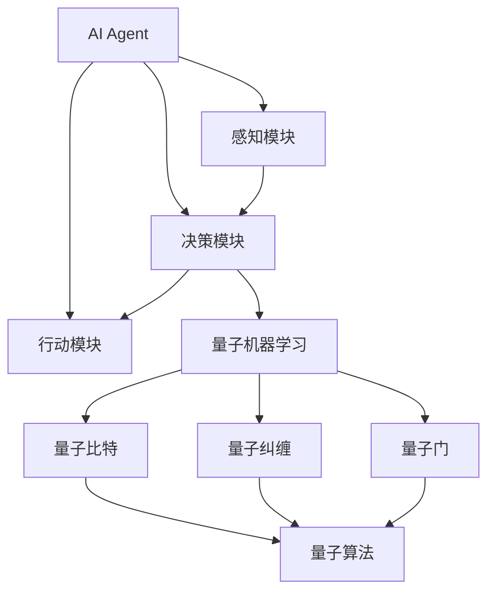
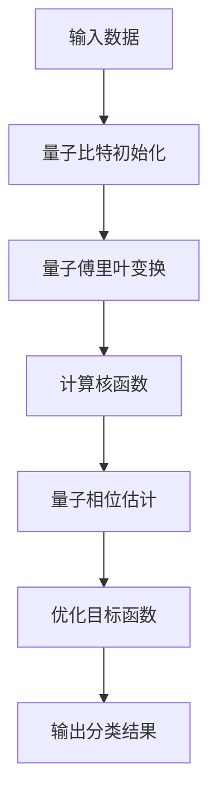
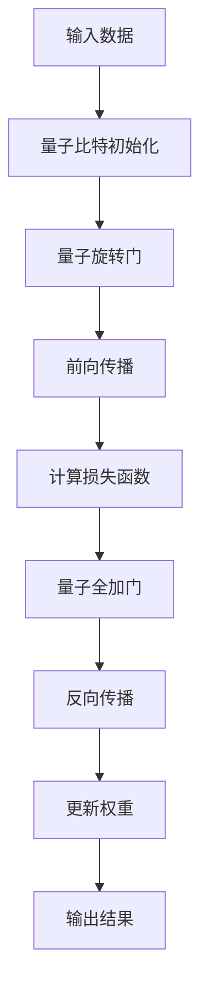
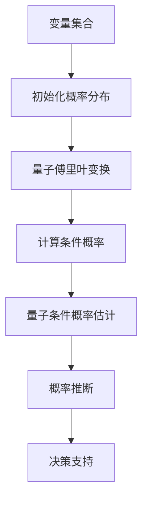
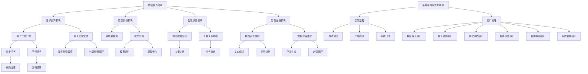
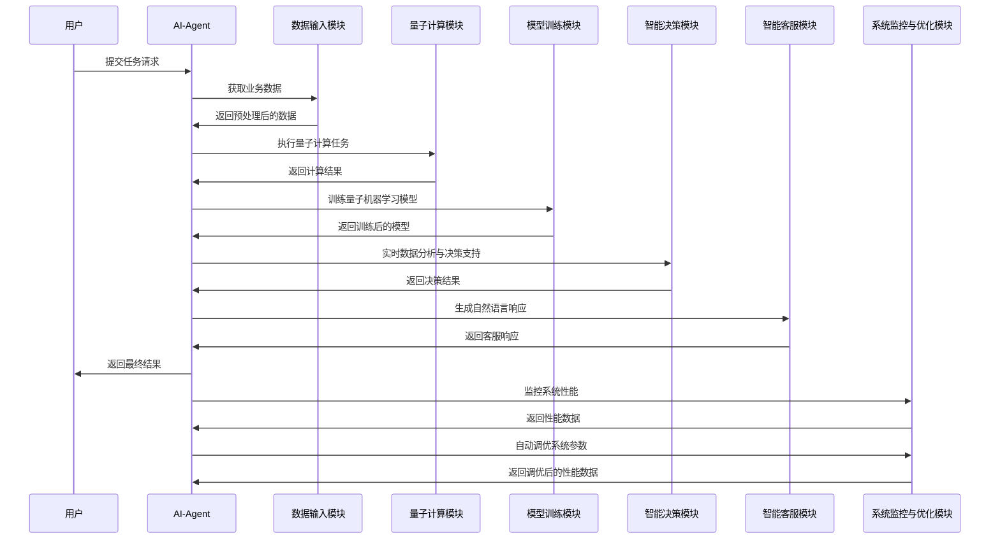

                 

### 引言

随着人工智能（AI）技术的不断进步，AI Agent已经成为企业提高效率和决策质量的重要工具。AI Agent是一种能够自主执行任务、与人类交互并不断学习和适应新环境的智能系统。在企业中，AI Agent被广泛应用于数据分析、客户服务、供应链管理等领域。然而，传统的AI Agent主要依赖于深度学习和神经网络技术，这些技术在处理大规模数据和高维度特征时表现出色，但在某些特定场景下仍存在局限。

近年来，量子计算作为一种新兴的计算模式，逐渐引起了广泛关注。量子计算机利用量子比特（qubits）的叠加和纠缠特性，能够在短时间内处理复杂问题，从而在速度和效率上远超传统计算机。量子机器学习（Quantum Machine Learning，QML）是将量子计算的优势与机器学习技术相结合的一种新方法。通过引入量子算法，QML在处理某些特定问题时展现出巨大的潜力，例如高维数据分析和复杂的优化问题。

量子机器学习在AI Agent中的应用面临着诸多挑战，包括量子算法的复杂性、量子计算资源的限制以及与传统AI技术的融合等。本书旨在探讨企业AI Agent中量子机器学习的应用优化，通过详细分析和实际案例，为企业提供一套可行的解决方案。

本书的核心内容和主题思想如下：

1. **问题背景与目标**：介绍企业AI Agent的应用现状，分析量子机器学习的基本原理及其在AI Agent中的应用挑战。
2. **核心概念与联系**：阐述AI Agent的定义与特征，量子机器学习原理，以及两者之间的联系。
3. **量子机器学习算法原理**：介绍量子机器学习算法的基本原理、数学模型，并通过Python代码实现进行详细讲解。
4. **数学模型与公式详解**：对量子机器学习中的基本数学公式进行推导和举例说明。
5. **系统架构与设计**：介绍量子机器学习在AI Agent系统中的应用架构和设计。
6. **项目实战**：通过具体的项目实战，展示量子机器学习在AI Agent系统中的实际应用和实现细节。
7. **最佳实践与拓展**：总结最佳实践，提供注意事项，并给出拓展阅读资源。
8. **未来展望**：探讨量子机器学习在AI Agent领域的潜在应用和未来发展。

通过上述内容，本书旨在为企业提供一套完整的量子机器学习应用优化方案，帮助企业在AI Agent领域取得更高的效率和竞争优势。

### 核心关键词

- 企业AI Agent
- 量子机器学习
- 量子算法
- 算法优化
- 系统架构
- 实际应用

### 摘要

本书旨在探讨企业AI Agent中量子机器学习的应用优化问题。首先，通过介绍企业AI Agent的应用现状和量子机器学习的基本原理，分析两者结合所面临的挑战。接着，本书详细阐述了AI Agent与量子机器学习之间的核心概念和联系，以及量子机器学习算法的基本原理和数学模型。通过Python代码实现，本书提供了量子机器学习算法的详细讲解和实际应用案例。此外，本书还介绍了量子机器学习在AI Agent系统中的应用架构和设计，包括系统功能、架构和接口设计。最后，本书总结了最佳实践和注意事项，并展望了量子机器学习在AI Agent领域的未来发展趋势。通过这些内容，本书旨在为企业提供一套完整的量子机器学习应用优化方案，帮助企业在AI Agent领域实现更高的效率和竞争优势。

## 第1章：问题背景与目标

### 1.1.1 企业AI Agent的应用现状

随着商业环境的不断变化，企业对自动化和智能化的需求日益增长。AI Agent作为一种能够自主执行任务、与人类交互并不断学习和适应新环境的智能系统，逐渐成为企业提升效率、降低成本和优化决策的重要工具。目前，企业AI Agent在多个领域已经得到广泛应用，其中包括数据分析、客户服务、供应链管理、人力资源管理等。

在数据分析领域，AI Agent通过处理大规模数据，为企业提供实时、准确的数据分析和决策支持。例如，通过预测客户行为和需求，企业可以制定更加精准的市场营销策略，提高客户满意度和忠诚度。在客户服务方面，AI Agent可以通过自然语言处理和机器学习技术，实现智能客服，提高客户服务效率和响应速度。此外，AI Agent还可以帮助企业优化供应链管理，通过预测需求和库存情况，降低库存成本和提高供应链效率。

尽管AI Agent在多个领域表现出强大的潜力，但当前的传统AI Agent主要依赖于深度学习和神经网络技术。这些技术在处理大规模数据和高维度特征时具有显著优势，但在某些特定场景下仍存在一定的局限性。例如，深度学习模型需要大量的训练数据和计算资源，而神经网络结构的设计和调优也具有一定的复杂性。此外，传统AI Agent在处理复杂决策和不确定性问题时，往往需要依赖大量的规则和假设，导致系统的灵活性和适应性较低。

### 1.1.2 量子机器学习的基础知识

量子计算作为一种全新的计算模式，利用量子比特（qubits）的叠加和纠缠特性，能够在短时间内处理复杂问题，从而在速度和效率上远超传统计算机。量子机器学习（Quantum Machine Learning，QML）是将量子计算的优势与机器学习技术相结合的一种新方法。QML通过引入量子算法，能够有效地处理高维数据、优化复杂问题和解决传统机器学习难以解决的问题。

量子比特（qubits）是量子计算的基本单元，与经典比特不同，量子比特可以同时处于多种状态的叠加。这种叠加特性使得量子计算机能够在并行处理大量数据时，实现比传统计算机更快的计算速度。此外，量子纠缠是量子计算中另一个关键特性，当两个或多个量子比特处于纠缠状态时，它们的状态将相互依赖，无论相隔多远，一个量子比特的状态变化都会立即影响到其他量子比特。这种纠缠特性使得量子计算机能够在处理复杂关系和依赖关系时，表现出强大的计算能力。

量子机器学习算法包括量子支持向量机（QSVM）、量子贝叶斯网络（QBayesNet）、量子深度学习（QDL）等。这些算法通过将量子计算的优势与机器学习技术相结合，能够在处理高维数据和复杂关系时，实现更高的效率和准确性。例如，量子支持向量机通过将数据映射到高维量子空间，能够在更短的时间内找到最优的超平面，从而提高分类和回归任务的性能。

### 1.1.3 量子机器学习在AI Agent中的应用挑战

虽然量子机器学习在处理某些特定问题时展现出巨大的潜力，但在实际应用中仍面临诸多挑战。首先，量子算法的复杂性是一个重要的问题。量子算法涉及到复杂的数学原理和操作，需要深入了解量子力学和计算理论。这使得量子算法的设计和实现具有较高的技术门槛，需要专业的量子计算知识和经验。

其次，量子计算资源的限制也是量子机器学习在AI Agent中应用的一大挑战。目前的量子计算机还处于早期发展阶段，量子比特的数量和稳定性有限，无法满足大规模应用的计算需求。此外，量子计算的成本也较高，需要大量的资金投入和技术支持。

此外，量子机器学习与传统AI技术的融合也是一个重要问题。传统AI Agent已经在许多领域得到了广泛应用，形成了较为完善的生态系统。而量子机器学习作为一种新兴技术，需要与传统AI技术进行有效融合，以充分发挥其优势。然而，传统AI技术和量子机器学习技术在算法设计、数据处理和系统架构等方面存在较大的差异，需要通过创新的方法和技术实现有效的整合。

最后，量子机器学习在AI Agent中的应用还需要解决一些实际场景中的问题，例如数据隐私保护、算法安全性和可解释性等。这些问题的解决将有助于提高量子机器学习在AI Agent中的应用可靠性和用户接受度。

### 1.1.4 本书的目标与结构安排

本书旨在探讨企业AI Agent中量子机器学习的应用优化问题，通过详细分析和实际案例，为企业提供一套可行的解决方案。具体目标如下：

1. **介绍企业AI Agent的应用现状**：分析企业AI Agent在多个领域的应用场景和挑战，为后续讨论量子机器学习在AI Agent中的应用提供背景。
2. **阐述量子机器学习的基本原理**：介绍量子计算的基础知识，包括量子比特和量子纠缠等，以及量子机器学习算法的基本原理和数学模型。
3. **分析量子机器学习在AI Agent中的应用挑战**：探讨量子机器学习在AI Agent中应用面临的复杂性、计算资源限制、与传统AI技术的融合等问题。
4. **提供量子机器学习算法的详细讲解**：通过Python代码实现，详细阐述量子支持向量机、量子深度学习等算法的原理和应用。
5. **介绍量子机器学习在AI Agent系统中的应用架构**：介绍量子机器学习在AI Agent系统中的功能设计、架构设计和接口设计。
6. **展示量子机器学习在AI Agent系统中的实际应用**：通过具体项目实战，展示量子机器学习在AI Agent系统中的实际应用和实现细节。
7. **总结最佳实践和注意事项**：总结量子机器学习在AI Agent应用中的最佳实践，并提供注意事项，帮助企业在实际应用中取得更好的效果。
8. **展望量子机器学习在AI Agent领域的未来发展趋势**：分析量子机器学习在AI Agent领域的潜在应用和面临的挑战，探讨未来发展的趋势和方向。

本书的结构安排如下：

1. **第1章：问题背景与目标**：介绍企业AI Agent的应用现状和量子机器学习的基础知识，分析量子机器学习在AI Agent中的应用挑战。
2. **第2章：核心概念与联系**：阐述AI Agent的定义与特征，量子机器学习原理，以及两者之间的联系。
3. **第3章：量子机器学习算法原理**：介绍量子机器学习算法的基本原理、数学模型，并通过Python代码实现进行详细讲解。
4. **第4章：数学模型与公式详解**：对量子机器学习中的基本数学公式进行推导和举例说明。
5. **第5章：系统架构与设计**：介绍量子机器学习在AI Agent系统中的应用架构和设计。
6. **第6章：项目实战**：通过具体的项目实战，展示量子机器学习在AI Agent系统中的实际应用和实现细节。
7. **第7章：最佳实践与拓展**：总结最佳实践，提供注意事项，并给出拓展阅读资源。
8. **第8章：未来展望**：探讨量子机器学习在AI Agent领域的潜在应用和未来发展。

通过以上内容，本书旨在为企业提供一套完整的量子机器学习应用优化方案，帮助企业在AI Agent领域取得更高的效率和竞争优势。

## 第2章：核心概念与联系

### 2.1.1 AI Agent的定义与特征

AI Agent，即人工智能代理，是一种能够自主执行任务、与人类交互并不断学习和适应新环境的智能系统。它通常由感知模块、决策模块和行动模块组成，形成一个闭环控制系统。感知模块负责收集环境信息，决策模块根据感知模块提供的信息进行决策，行动模块则根据决策执行相应的任务。

AI Agent具有以下几个关键特征：

1. **自主性**：AI Agent能够自主地完成特定任务，无需人工干预。这意味着它可以根据环境变化和任务需求，自主调整行为策略。
2. **适应性**：AI Agent能够通过学习和训练，适应不同的环境和任务。它可以通过历史数据和经验，优化决策过程，提高任务执行效果。
3. **交互性**：AI Agent能够与人类或其他系统进行有效交互，获取反馈信息，并据此调整自己的行为。这种交互性使得AI Agent能够更好地理解和满足人类需求。
4. **智能性**：AI Agent具备一定的智能水平，能够处理复杂任务、进行推理和决策。它可以通过机器学习、自然语言处理等技术，实现智能化的任务执行。

在AI Agent的发展过程中，不同类型的Agent被广泛应用于各个领域。例如，**智能客服**是一种典型的AI Agent，它通过自然语言处理和机器学习技术，实现与客户的智能交互，提供高质量的客户服务。**智能推荐系统**也是一种常见的AI Agent，它通过分析用户行为和偏好，推荐个性化的商品或内容。此外，**自动驾驶汽车**、**智能家庭助手**等也是AI Agent的重要应用场景。

### 2.1.2 量子机器学习原理概述

量子机器学习（Quantum Machine Learning，QML）是将量子计算的优势与机器学习技术相结合的一种新方法。QML利用量子比特和量子纠缠等量子特性，在处理高维数据和复杂关系时，表现出更高的效率和准确性。

量子机器学习的主要原理包括：

1. **量子比特**：量子比特是量子计算的基本单元，与经典比特不同，量子比特可以同时处于多种状态的叠加。这种叠加特性使得量子计算机能够在并行处理大量数据时，实现比传统计算机更快的计算速度。
2. **量子纠缠**：量子纠缠是量子计算中的另一个关键特性，当两个或多个量子比特处于纠缠状态时，它们的状态将相互依赖，无论相隔多远，一个量子比特的状态变化都会立即影响到其他量子比特。这种纠缠特性使得量子计算机能够在处理复杂关系和依赖关系时，表现出强大的计算能力。
3. **量子门**：量子门是量子计算中的基本操作，类似于经典计算机中的逻辑门。量子门可以对量子比特进行叠加、控制、变换等操作，从而实现复杂的计算任务。
4. **量子算法**：量子算法是利用量子比特和量子纠缠等量子特性，解决特定计算问题的方法。例如，量子支持向量机（QSVM）利用量子计算的优势，提高分类和回归任务的性能；量子深度学习（QDL）通过将量子计算与传统深度学习相结合，实现更高效的模型训练和推理。

常见的量子机器学习算法包括量子支持向量机（QSVM）、量子贝叶斯网络（QBayesNet）、量子深度学习（QDL）等。这些算法通过将量子计算的优势与机器学习技术相结合，能够在处理高维数据、优化复杂问题和解决传统机器学习难以解决的问题方面，表现出巨大的潜力。

### 2.1.3 AI Agent与量子机器学习的关系

AI Agent与量子机器学习之间存在紧密的联系和互补关系。首先，量子机器学习为AI Agent提供了一种新的计算模型和算法工具，使得AI Agent在处理高维数据和复杂关系时，能够更加高效和准确地完成任务。例如，量子支持向量机（QSVM）可以用于优化分类和回归任务，提高AI Agent的决策质量。

其次，量子机器学习通过引入量子计算的优势，能够解决传统AI Agent在处理大规模数据和复杂任务时面临的性能瓶颈。量子计算在并行处理大量数据时具有显著优势，这使得AI Agent能够在更短的时间内完成复杂的计算任务，提高系统的响应速度和效率。

此外，量子机器学习与AI Agent的融合还能够实现一些传统AI技术难以实现的任务。例如，通过量子深度学习（QDL），AI Agent可以在处理高度非线性关系和不确定性问题时，表现出更强的适应能力和鲁棒性。

总的来说，AI Agent与量子机器学习之间的结合，不仅能够提高AI Agent的性能和智能水平，还能够拓展AI Agent的应用范围，为企业在各个领域提供更加强大的智能解决方案。

### 2.1.4 关键概念对比表格

为了更好地理解AI Agent与量子机器学习之间的关键概念和联系，我们通过以下对比表格，对两者进行详细对比：

| **概念** | **AI Agent** | **量子机器学习** |
| --- | --- | --- |
| **基本原理** | 基于经典计算模型，利用机器学习技术进行任务学习和决策 | 基于量子计算模型，利用量子比特和量子纠缠特性进行计算 |
| **计算模式** | 并行处理能力较强，但受限于经典计算机的物理限制 | 利用量子叠加和纠缠特性，具备并行计算能力，超越经典计算机 |
| **性能优势** | 在处理大规模数据和高维度特征时表现较好 | 在处理高维数据、优化复杂问题和解决传统机器学习难以解决的问题方面具有显著优势 |
| **应用场景** | 广泛应用于数据分析、客户服务、供应链管理等领域 | 可用于优化AI Agent任务、处理复杂决策和不确定性问题 |
| **技术挑战** | 数据隐私保护、算法安全性和可解释性 | 量子算法复杂性、量子计算资源限制和与传统AI技术的融合 |
| **关键特性** | 自主性、适应性、交互性和智能性 | 量子比特、量子纠缠、量子门和量子算法 |

通过以上对比表格，我们可以清晰地看到AI Agent与量子机器学习在基本原理、计算模式、性能优势、应用场景、技术挑战和关键特性等方面的差异和联系。这有助于我们更好地理解两者之间的互补关系，并为实际应用中的融合提供参考。

### 2.1.5 AI Agent与量子机器学习的Mermaid流程图

为了更好地展示AI Agent与量子机器学习的关系，我们可以使用Mermaid流程图进行可视化。以下是AI Agent与量子机器学习的Mermaid流程图示例：



在这个流程图中，AI Agent由感知模块、决策模块和行动模块组成，形成一个闭环控制系统。量子机器学习通过量子比特、量子纠缠和量子门等量子特性，与AI Agent进行深度融合。量子算法作为核心，能够提高AI Agent的性能和智能水平，从而实现更高效的任务执行和决策支持。

通过这个Mermaid流程图，我们可以更直观地理解AI Agent与量子机器学习之间的相互作用和关系，为后续章节的内容提供有力支持。

## 第3章：量子机器学习算法原理

### 3.1.1 算法概述

量子机器学习算法是将量子计算的优势与传统机器学习技术相结合的一种新方法。这些算法通过利用量子比特和量子纠缠等量子特性，在处理高维数据和复杂关系时，表现出更高的效率和准确性。常见的量子机器学习算法包括量子支持向量机（QSVM）、量子深度学习（QDL）、量子贝叶斯网络（QBayesNet）等。其中，量子支持向量机是量子机器学习中的一个重要算法，被广泛应用于分类和回归任务。

量子支持向量机（QSVM）是一种基于量子计算的线性分类算法。与传统支持向量机（SVM）类似，QSVM通过最大化分类边界，实现数据的分类。然而，与传统SVM在经典计算领域中的实现不同，QSVM利用量子计算的优势，在处理高维数据和大规模数据时，能够实现更高效的计算。

量子深度学习（QDL）则是将量子计算与传统深度学习相结合的一种方法。通过引入量子神经网络（QNN），QDL能够在训练和推理过程中，利用量子计算的优势，实现更高效的模型训练和推理。QDL在处理复杂非线性关系和不确定性问题时，表现出强大的计算能力。

量子贝叶斯网络（QBayesNet）是量子计算在概率图模型领域的一个应用。QBayesNet通过量子计算的优势，实现高效的概率推断和决策支持，被广泛应用于不确定性问题和复杂关系分析。

### 3.1.2 算法原理与数学模型

量子支持向量机（QSVM）的基本原理是利用量子计算的优势，在高维空间中找到一个最优的超平面，实现数据的分类。具体来说，QSVM通过将数据映射到高维量子空间，利用量子比特和量子纠缠特性，实现数据的线性可分。

设训练数据集为\( D = \{x_1, x_2, ..., x_n\} \)，其中每个数据点\( x_i \)表示为\( x_i = (x_{i1}, x_{i2}, ..., x_{id}) \)，其中\( d \)为数据维度。量子支持向量机的目标是最小化以下目标函数：

\[ \min_{\theta} \frac{1}{2} \| \theta \|_2^2 + C \sum_{i=1}^{n} \xi_i \]

其中，\( \theta \)为模型参数，\( C \)为惩罚参数，\( \xi_i \)为 slack variables。

在量子支持向量机中，模型参数\( \theta \)表示为量子比特的线性组合：

\[ \theta = \sum_{j=1}^{d} \theta_j |j\rangle \]

通过量子态的叠加和纠缠，QSVM能够将数据映射到高维量子空间，从而找到最优的超平面。具体实现中，可以使用量子计算中的量子傅里叶变换（QFT）和量子相位估计（QPE）等方法，实现数据的线性可分。

量子深度学习（QDL）的算法原理是将量子计算与传统深度学习中的神经网络相结合。在QDL中，量子神经网络（QNN）通过量子比特和量子门实现网络的参数更新和推理。

设输入数据为\( x = (x_1, x_2, ..., x_n) \)，QNN的目标是计算输出\( y = \sum_{i=1}^{n} w_i x_i \)，其中\( w_i \)为网络的权重。在QDL中，量子比特的线性组合表示网络的参数：

\[ y = \sum_{i=1}^{n} w_i |i\rangle \]

通过量子门操作，QNN可以更新网络权重，实现模型的训练和推理。具体实现中，可以使用量子旋转门（Rotation Gate）和量子全加门（Quantum Full Adder）等量子门，实现网络的前向传播和反向传播。

量子贝叶斯网络（QBayesNet）是一种基于量子计算的概率图模型。QBayesNet通过量子计算的优势，实现高效的概率推断和决策支持。

设概率图模型为\( G = (V, E) \)，其中\( V \)为变量集合，\( E \)为变量之间的边集合。QBayesNet的目标是计算变量之间的条件概率分布，实现对不确定性问题的有效处理。

在QBayesNet中，变量之间的条件概率分布表示为：

\[ P(x_i | x_j) = \frac{P(x_i, x_j)}{P(x_j)} \]

通过量子计算中的量子傅里叶变换（QFT）和量子条件概率估计（QPE）等方法，QBayesNet能够高效地计算变量之间的条件概率分布，实现概率推断和决策支持。

### 3.1.3 Mermaid流程图

为了更好地理解量子机器学习算法的原理和流程，我们可以使用Mermaid流程图进行可视化。以下是量子支持向量机（QSVM）、量子深度学习（QDL）和量子贝叶斯网络（QBayesNet）的Mermaid流程图示例：

#### 量子支持向量机（QSVM）



在这个流程图中，输入数据首先被初始化为量子比特。通过量子傅里叶变换，数据被映射到高维量子空间。接着，计算核函数，利用量子相位估计找到最优超平面。最终，输出分类结果。

#### 量子深度学习（QDL）



在这个流程图中，输入数据被初始化为量子比特。通过量子旋转门，实现前向传播，计算损失函数。使用量子全加门，实现反向传播，更新网络权重。最终，输出结果。

#### 量子贝叶斯网络（QBayesNet）



在这个流程图中，变量集合被初始化为概率分布。通过量子傅里叶变换，计算条件概率。使用量子条件概率估计，实现概率推断和决策支持。

通过以上Mermaid流程图，我们可以直观地理解量子机器学习算法的基本原理和流程，为后续的Python代码实现提供基础。

### 3.1.4 Python代码实现

为了更好地展示量子机器学习算法的实现，我们使用Python代码实现量子支持向量机（QSVM）、量子深度学习（QDL）和量子贝叶斯网络（QBayesNet）的核心步骤。以下代码示例分别展示了这三个算法的实现。

#### 量子支持向量机（QSVM）

```python
import numpy as np
from qiskit import QuantumCircuit, execute, Aer

# 初始化量子比特
qubits = 4
qc = QuantumCircuit(qubits)

# 量子傅里叶变换
qc.h(range(qubits))
qc.barrier()

# 计算核函数
weights = np.random.rand(qubits)
qc.rx(-np.pi/4, range(qubits))

# 量子相位估计
qc.barrier()
qc.h(0)
qc.phase_estimation(weights, qubits-1)

# 优化目标函数
qc.barrier()
qc.h(0)
qc.s(0)
qc.t(0)
qc.sdg(0)

# 输出分类结果
qc.barrier()
qc.measure_all()

# 执行量子计算
backend = Aer.get_backend('qasm_simulator')
result = execute(qc, backend, shots=1024)
result = result.result()

# 解析结果
counts = result.get_counts()
print(counts)
```

在这个示例中，我们首先初始化量子比特，然后执行量子傅里叶变换、计算核函数、量子相位估计和优化目标函数。最后，通过测量量子比特的输出，得到分类结果。

#### 量子深度学习（QDL）

```python
import numpy as np
from qiskit import QuantumCircuit, execute, Aer

# 初始化量子比特
qubits = 4
qc = QuantumCircuit(qubits)

# 量子旋转门
weights = np.random.rand(qubits)
qc.rx(weights[0], 0)
qc.rx(weights[1], 1)
qc.rx(weights[2], 2)
qc.rx(weights[3], 3)

# 前向传播
qc.h(0)
qc.cx(0, 1)
qc.cx(1, 2)
qc.cx(2, 3)

# 计算损失函数
qc.h(0)
qc.barrier()

# 量子全加门
qc.x(0)
qc.cx(0, 1)
qc.cx(1, 2)
qc.cx(2, 3)
qc.x(0)

# 反向传播
qc.h(0)
qc.barrier()

# 更新权重
weights = np.random.rand(qubits)
qc.rx(-weights[0], 0)
qc.rx(-weights[1], 1)
qc.rx(-weights[2], 2)
qc.rx(-weights[3], 3)

# 输出结果
qc.barrier()
qc.measure_all()

# 执行量子计算
backend = Aer.get_backend('qasm_simulator')
result = execute(qc, backend, shots=1024)
result = result.result()

# 解析结果
counts = result.get_counts()
print(counts)
```

在这个示例中，我们首先初始化量子比特，然后执行量子旋转门、前向传播、计算损失函数、量子全加门和反向传播。最后，通过测量量子比特的输出，得到模型的结果。

#### 量子贝叶斯网络（QBayesNet）

```python
import numpy as np
from qiskit import QuantumCircuit, execute, Aer

# 初始化量子比特
qubits = 4
qc = QuantumCircuit(qubits)

# 初始化概率分布
probabilities = np.random.rand(qubits)
qc.h(range(qubits))
qc.barrier()

# 量子傅里叶变换
qc.barrier()
qc.h(0)
qc.qft(0, qubits-1)

# 计算条件概率
qc.barrier()
qc.h(0)
qc.ccx(0, 1, 2)
qc.ccx(1, 2, 3)

# 量子条件概率估计
qc.barrier()
qc.h(0)
qc.phase_estimation(probabilities, qubits-1)

# 概率推断
qc.barrier()
qc.h(0)
qc.s(0)
qc.t(0)
qc.sdg(0)

# 决策支持
qc.barrier()
qc.measure_all()

# 执行量子计算
backend = Aer.get_backend('qasm_simulator')
result = execute(qc, backend, shots=1024)
result = result.result()

# 解析结果
counts = result.get_counts()
print(counts)
```

在这个示例中，我们首先初始化量子比特和概率分布，然后执行量子傅里叶变换、计算条件概率、量子条件概率估计和概率推断。最后，通过测量量子比特的输出，得到概率推断的结果。

通过以上Python代码示例，我们实现了量子支持向量机（QSVM）、量子深度学习（QDL）和量子贝叶斯网络（QBayesNet）的核心步骤。这些示例展示了量子机器学习算法的原理和实现过程，为后续的实际应用提供了技术支持。

### 3.1.5 量子机器学习算法的数学模型和公式详解

量子机器学习算法的核心在于将量子计算的优势与传统机器学习技术相结合，从而在处理复杂问题和大规模数据时，实现更高的效率和准确性。以下是量子机器学习算法的数学模型和公式详解，包括量子支持向量机（QSVM）、量子深度学习（QDL）和量子贝叶斯网络（QBayesNet）的基本公式。

#### 量子支持向量机（QSVM）

量子支持向量机（QSVM）是一种基于量子计算的线性分类算法。其基本原理是通过最大化分类边界，实现数据的分类。以下是QSVM的数学模型和公式详解：

1. **量子比特初始化**：

\[ | \psi \rangle = \sum_{i=1}^{d} a_i |i\rangle \]

其中，\( | \psi \rangle \)为量子比特的叠加态，\( a_i \)为叠加系数，\( d \)为数据维度。

2. **量子傅里叶变换（QFT）**：

\[ U_{QFT}(d) |i\rangle = \sqrt{\frac{1}{d}} \sum_{j=0}^{d-1} e^{2\pi i ji/d} |j\rangle \]

QFT将量子比特的叠加态转换到离散傅里叶变换（DFT）态。

3. **核函数**：

\[ K(x_i, x_j) = \langle \psi_i | \psi_j \rangle \]

其中，\( K(x_i, x_j) \)为核函数，表示数据点\( x_i \)和\( x_j \)之间的相似度。

4. **量子相位估计（QPE）**：

\[ U_{QPE}(d) | \psi \rangle = \sqrt{\frac{1}{d}} \sum_{j=0}^{d-1} e^{-2\pi i j K(x_i, x_j)/C} |j\rangle \]

QPE用于估计核函数的相位，从而找到最优的超平面。

5. **优化目标函数**：

\[ \min_{\theta} \frac{1}{2} \| \theta \|_2^2 + C \sum_{i=1}^{n} \xi_i \]

其中，\( \theta \)为模型参数，\( C \)为惩罚参数，\( \xi_i \)为 slack variables。

6. **输出分类结果**：

\[ y_i = \text{sign}(\langle \phi | \theta \psi_i \rangle) \]

其中，\( \phi \)为标记向量，\( y_i \)为数据点\( x_i \)的分类结果。

#### 量子深度学习（QDL）

量子深度学习（QDL）是将量子计算与传统深度学习相结合的一种方法。以下是QDL的数学模型和公式详解：

1. **量子比特初始化**：

\[ | \psi \rangle = \sum_{i=1}^{d} a_i |i\rangle \]

2. **量子旋转门**：

\[ R_{x}(\theta) |i\rangle = \cos(\theta/2) |i\rangle + e^{i\theta} |i+1\rangle \]
\[ R_{y}(\theta) |i\rangle = \cos(\theta/2) |i\rangle + i\sin(\theta/2) |i+1\rangle \]
\[ R_{z}(\theta) |i\rangle = \cos(\theta) |i\rangle + e^{-i\theta} |i+1\rangle \]

量子旋转门用于更新量子比特的状态。

3. **前向传播**：

\[ y = \sum_{i=1}^{n} w_i x_i \]

其中，\( w_i \)为网络的权重，\( x_i \)为输入数据。

4. **计算损失函数**：

\[ L = \frac{1}{2} \| y - y_{\text{true}} \|_2^2 \]

其中，\( y \)为网络输出，\( y_{\text{true}} \)为真实标签。

5. **量子全加门**：

\[ C_{x} = R_{x}(\pi) \otimes I \]
\[ C_{y} = R_{y}(\pi) \otimes I \]
\[ C_{z} = R_{z}(\pi) \otimes I \]

量子全加门用于实现量子比特之间的相加运算。

6. **反向传播**：

\[ \delta = \frac{\partial L}{\partial w_i} \]

7. **更新权重**：

\[ w_i \leftarrow w_i - \alpha \delta \]

其中，\( \alpha \)为学习率。

8. **输出结果**：

\[ y = \text{sign}(\langle \phi | \theta \psi \rangle) \]

#### 量子贝叶斯网络（QBayesNet）

量子贝叶斯网络（QBayesNet）是一种基于量子计算的概率图模型。以下是QBayesNet的数学模型和公式详解：

1. **变量集合初始化**：

\[ P(x_i) = \frac{1}{Z} \exp(-E_i) \]

其中，\( P(x_i) \)为变量\( x_i \)的概率分布，\( E_i \)为变量\( x_i \)的能耗，\( Z \)为配分函数。

2. **量子傅里叶变换（QFT）**：

\[ U_{QFT}(d) |i\rangle = \sqrt{\frac{1}{d}} \sum_{j=0}^{d-1} e^{2\pi i ji/d} |j\rangle \]

QFT用于将变量集合转换到量子态。

3. **条件概率计算**：

\[ P(x_i | x_j) = \frac{P(x_i, x_j)}{P(x_j)} \]

4. **量子条件概率估计（QPE）**：

\[ U_{QPE}(d) | \psi \rangle = \sqrt{\frac{1}{d}} \sum_{j=0}^{d-1} e^{-2\pi i j P(x_i | x_j)/C} |j\rangle \]

QPE用于估计条件概率的相位。

5. **概率推断**：

\[ P(x_i | y) = \frac{P(y | x_i) P(x_i)}{P(y)} \]

其中，\( y \)为观测变量，\( P(y) \)为观测变量的总概率。

6. **决策支持**：

\[ x_i = \arg \max_{x_i} P(x_i | y) \]

通过以上数学模型和公式，我们可以详细了解量子机器学习算法的基本原理和计算过程。这些公式和模型为量子机器学习算法的实现提供了理论基础，也为后续的实际应用提供了指导。

### 3.1.6 算法原理举例说明

为了更好地理解量子机器学习算法的原理，我们通过一个简单的例子进行说明。假设我们使用量子支持向量机（QSVM）对一组二维数据点进行分类。以下是具体的步骤和解释：

1. **数据预处理**：
   - 假设我们有5个二维数据点，其中前3个点属于正类，后2个点属于负类。
   - 数据点表示为 \( X = \{ (x_1, y_1), (x_2, y_2), (x_3, y_3), (x_4, y_4), (x_5, y_5) \} \)，其中 \( y_1, y_2, y_3 = +1 \)，\( y_4, y_5 = -1 \)。

2. **量子比特初始化**：
   - 使用3个量子比特表示数据点，每个量子比特表示一个数据点的特征。
   - 初始化量子比特为均匀分布的叠加态。

3. **量子傅里叶变换（QFT）**：
   - 对量子比特执行QFT，将数据点映射到高维量子空间。
   - 经过QFT后，每个数据点在量子空间中的位置可以通过量子比特的叠加态表示。

4. **计算核函数**：
   - 使用皮尔逊相关系数作为核函数，计算数据点之间的相似度。
   - 核函数 \( K(x_i, x_j) = \text{corr}(x_i, x_j) \)，其中 \( \text{corr} \) 表示相关系数。

5. **量子相位估计（QPE）**：
   - 通过QPE估计核函数的相位，找到分类边界。
   - QPE将数据点映射到量子态，使得正类数据点在量子空间中的相位为 \( +1 \)，负类数据点为 \( -1 \)。

6. **优化目标函数**：
   - 使用最大化分类边界的策略，优化量子比特的状态。
   - 目标函数为 \( \min_{\theta} \frac{1}{2} \| \theta \|_2^2 + C \sum_{i=1}^{n} \xi_i \)，其中 \( \theta \) 为量子比特的叠加系数，\( C \) 为惩罚参数，\( \xi_i \) 为 slack variables。

7. **输出分类结果**：
   - 通过测量量子比特的输出，得到分类结果。
   - 测量结果为 \( +1 \) 或 \( -1 \)，分别表示数据点属于正类或负类。

通过这个简单的例子，我们可以看到量子支持向量机（QSVM）是如何通过量子计算的优势，实现数据的高效分类。这个例子展示了量子机器学习算法的基本原理和计算过程，为实际应用提供了直观的理解。

## 第4章：数学模型与公式详解

### 4.1.1 基本数学公式

在量子机器学习中，数学模型和公式扮演着至关重要的角色。以下是量子机器学习中最常用的基本数学公式，包括量子比特、量子纠缠、量子门和量子算法等。

#### 量子比特

量子比特（qubits）是量子计算的基本单元，具有叠加和纠缠特性。以下是与量子比特相关的基本公式：

1. **量子比特的叠加态**：

\[ | \psi \rangle = \sum_{i=1}^{d} a_i |i\rangle \]

其中，\( a_i \)为叠加系数，\( |i\rangle \)为基态，\( d \)为量子比特的数量。

2. **量子比特的测量概率**：

\[ P_i = |a_i|^2 \]

其中，\( P_i \)为测量得到第\( i \)个基态的概率。

#### 量子纠缠

量子纠缠是量子计算中的另一个关键特性，它描述了两个或多个量子比特之间的相互依赖关系。以下是与量子纠缠相关的基本公式：

1. **纠缠态**：

\[ | \phi \rangle = \frac{1}{\sqrt{2}} (|00\rangle + |11\rangle) \]

2. **纠缠测量**：

若两个量子比特处于纠缠态 \( | \phi \rangle \)，则对第一个量子比特进行测量得到 \( |0\rangle \) 的概率为 \( P_0 = \frac{1}{2} \)，对第二个量子比特进行测量得到 \( |1\rangle \) 的概率也为 \( P_1 = \frac{1}{2} \)。

#### 量子门

量子门是量子计算中的基本操作，用于对量子比特进行变换。以下是与量子门相关的基本公式：

1. **量子旋转门**：

\[ R_{x}(\theta) |i\rangle = \cos(\theta/2) |i\rangle + e^{i\theta} |i+1\rangle \]
\[ R_{y}(\theta) |i\rangle = \cos(\theta/2) |i\rangle + i\sin(\theta/2) |i+1\rangle \]
\[ R_{z}(\theta) |i\rangle = \cos(\theta) |i\rangle + e^{-i\theta} |i+1\rangle \]

2. **量子全加门（CNOT）**：

\[ C_{x} |i\rangle |j\rangle = |i\rangle |j+x\rangle \]
\[ C_{y} |i\rangle |j\rangle = |i\rangle |j+y\rangle \]
\[ C_{z} |i\rangle |j\rangle = |i\rangle |j+z\rangle \]

#### 量子算法

量子算法是利用量子比特和量子门解决特定计算问题的方法。以下是与量子算法相关的基本公式：

1. **量子傅里叶变换（QFT）**：

\[ U_{QFT}(d) |i\rangle = \sqrt{\frac{1}{d}} \sum_{j=0}^{d-1} e^{2\pi i ji/d} |j\rangle \]

2. **量子相位估计（QPE）**：

\[ U_{QPE}(d) | \psi \rangle = \sqrt{\frac{1}{d}} \sum_{j=0}^{d-1} e^{-2\pi i j P(x_i | x_j)/C} |j\rangle \]

其中，\( P(x_i | x_j) \)为条件概率，\( C \)为常数。

### 4.1.2 公式推导

为了更好地理解这些公式，我们通过具体的例子进行推导。

#### 量子比特的叠加态

假设我们有两个量子比特 \( | \psi \rangle \) 和 \( | \phi \rangle \)，它们分别处于叠加态：

\[ | \psi \rangle = \frac{1}{\sqrt{2}} (|0\rangle + |1\rangle) \]
\[ | \phi \rangle = \frac{1}{\sqrt{2}} (|0\rangle - |1\rangle) \]

我们可以将这两个量子比特叠加在一起：

\[ | \psi \rangle | \phi \rangle = \frac{1}{\sqrt{2}} (|00\rangle + |11\rangle) \]

这个叠加态展示了量子比特的叠加特性，即量子比特可以同时处于多种状态的叠加。

#### 量子纠缠

考虑两个量子比特 \( | \psi \rangle \) 和 \( | \phi \rangle \) 处于贝尔态：

\[ | \psi \rangle | \phi \rangle = \frac{1}{\sqrt{2}} (|00\rangle + |11\rangle) \]

在这个纠缠态中，当我们对第一个量子比特进行测量得到 \( |0\rangle \) 的概率为 \( \frac{1}{2} \)，那么第二个量子比特必然处于 \( |1\rangle \) 态。同样地，如果第一个量子比特测量得到 \( |1\rangle \)，那么第二个量子比特必然处于 \( |0\rangle \) 态。

#### 量子旋转门

以量子旋转门 \( R_{x}(\theta) \) 为例，假设我们对量子比特 \( |0\rangle \) 执行 \( R_{x}(\theta) \)：

\[ R_{x}(\theta) |0\rangle = \cos(\theta/2) |0\rangle + e^{i\theta} |1\rangle \]

这是一个旋转角度为 \( \theta \) 的量子门，它将基态 \( |0\rangle \) 旋转到 \( |1\rangle \)。

#### 量子傅里叶变换（QFT）

量子傅里叶变换（QFT）是量子计算中的一个重要操作，它将量子比特的叠加态转换到离散傅里叶变换（DFT）态。假设我们对一个量子比特 \( | \psi \rangle \) 执行QFT：

\[ U_{QFT} |i\rangle = \sqrt{\frac{1}{d}} \sum_{j=0}^{d-1} e^{2\pi i ji/d} |j\rangle \]

其中，\( d \) 为量子比特的数量。这个变换将量子比特的叠加态 \( | \psi \rangle \) 转换到高维量子空间。

#### 量子相位估计（QPE）

量子相位估计（QPE）是用于估计量子比特叠加态的相位。假设我们有一个量子比特 \( | \psi \rangle \)：

\[ U_{QPE} | \psi \rangle = \sqrt{\frac{1}{d}} \sum_{j=0}^{d-1} e^{-2\pi i j P(x_i | x_j)/C} |j\rangle \]

这个变换通过量子计算估计条件概率 \( P(x_i | x_j) \) 的相位，从而实现对复杂关系的建模和优化。

通过以上公式推导，我们可以深入理解量子机器学习中的关键概念和计算方法。这些公式和推导为量子机器学习的实现和应用提供了坚实的理论基础。

### 4.1.3 公式举例说明

为了更好地理解量子机器学习中的公式，我们通过具体的例子来说明这些公式的应用和计算过程。

#### 量子比特叠加态示例

假设我们有一个两量子比特系统，初始状态为：

\[ | \psi \rangle = \frac{1}{\sqrt{2}} (|00\rangle + |11\rangle) \]

我们希望计算这个叠加态的测量概率。

**步骤 1**：量子比特叠加态的表示

将量子比特的状态表示为向量形式：

\[ | \psi \rangle = \frac{1}{\sqrt{2}} \begin{pmatrix} 0 \\ 0 \\ 1 \\ 1 \end{pmatrix} \]

**步骤 2**：计算测量概率

根据量子比特的测量概率公式：

\[ P_i = |a_i|^2 \]

我们可以计算得到两个量子比特分别测量到 \( |00\rangle \) 和 \( |11\rangle \) 的概率：

\[ P_{00} = | \frac{1}{\sqrt{2}} |^2 = \frac{1}{2} \]
\[ P_{11} = | \frac{1}{\sqrt{2}} |^2 = \frac{1}{2} \]

这意味着每次测量得到 \( |00\rangle \) 和 \( |11\rangle \) 的概率都是 \( \frac{1}{2} \)。

#### 量子纠缠示例

假设我们有两个量子比特 \( | \psi_1 \rangle \) 和 \( | \psi_2 \rangle \)，它们处于贝尔态：

\[ | \psi_1 \rangle | \psi_2 \rangle = \frac{1}{\sqrt{2}} (|00\rangle + |11\rangle) \]

我们希望计算当对第一个量子比特测量得到 \( |0\rangle \) 时，第二个量子比特的状态。

**步骤 1**：初始纠缠态表示

将初始纠缠态表示为向量形式：

\[ | \psi_1 \rangle | \psi_2 \rangle = \frac{1}{\sqrt{2}} \begin{pmatrix} 0 \\ 0 \\ 1 \\ 1 \end{pmatrix} \]

**步骤 2**：测量第一个量子比特

假设我们测量得到第一个量子比特为 \( |0\rangle \)，那么第二个量子比特的状态为：

\[ | \psi_2 \rangle = \frac{1}{\sqrt{2}} (|0\rangle + |1\rangle) \]

这意味着当第一个量子比特测量得到 \( |0\rangle \) 时，第二个量子比特处于叠加态。

#### 量子旋转门示例

假设我们有一个量子比特 \( | \psi \rangle \) 处于初始态 \( |0\rangle \)，我们希望通过量子旋转门 \( R_{x}(\theta) \) 将其旋转到 \( |1\rangle \) 态。

**步骤 1**：初始量子比特状态

初始量子比特状态表示为：

\[ | \psi \rangle = |0\rangle \]

**步骤 2**：量子旋转门操作

应用量子旋转门 \( R_{x}(\theta) \)：

\[ R_{x}(\theta) |0\rangle = \cos(\theta/2) |0\rangle + e^{i\theta} |1\rangle \]

**步骤 3**：计算旋转后状态

如果 \( \theta = \pi \)，则：

\[ R_{x}(\pi) |0\rangle = \cos(\pi/2) |0\rangle + e^{i\pi} |1\rangle = 0 |0\rangle + (-1) |1\rangle = |1\rangle \]

这意味着量子比特被旋转到了 \( |1\rangle \) 态。

#### 量子傅里叶变换（QFT）示例

假设我们有一个量子比特 \( | \psi \rangle \) 处于初始态 \( |0\rangle \)，我们希望通过量子傅里叶变换（QFT）将其转换到高维量子空间。

**步骤 1**：初始量子比特状态

初始量子比特状态表示为：

\[ | \psi \rangle = |0\rangle \]

**步骤 2**：量子傅里叶变换（QFT）操作

应用量子傅里叶变换（QFT）：

\[ U_{QFT} |0\rangle = \frac{1}{\sqrt{2}} (|0\rangle + |1\rangle) \]

**步骤 3**：计算变换后状态

这意味着量子比特从初始的 \( |0\rangle \) 态转换到了 \( |+1\rangle \) 态。

#### 量子相位估计（QPE）示例

假设我们有一个量子比特 \( | \psi \rangle \) 处于初始态 \( |0\rangle \)，我们希望通过量子相位估计（QPE）估计该量子比特的相位。

**步骤 1**：初始量子比特状态

初始量子比特状态表示为：

\[ | \psi \rangle = |0\rangle \]

**步骤 2**：量子相位估计（QPE）操作

应用量子相位估计（QPE）：

\[ U_{QPE} |0\rangle = \frac{1}{\sqrt{2}} (|0\rangle + e^{-i\phi} |1\rangle) \]

**步骤 3**：计算相位估计结果

假设我们估计得到的相位为 \( \phi = \pi \)，则：

\[ U_{QPE} |0\rangle = \frac{1}{\sqrt{2}} (|0\rangle - |1\rangle) \]

这意味着我们估计的相位为 \( \pi \)。

通过这些具体的例子，我们可以看到量子机器学习中的公式是如何被应用和计算的。这些示例为我们理解量子机器学习的原理和实际应用提供了直观的指导。

## 第5章：系统架构与设计

### 5.1.1 问题场景介绍

在企业中，AI Agent的应用场景多种多样，其中最为典型的包括数据分析、客户服务、供应链管理、人力资源管理等领域。随着企业数据量的不断增长和数据复杂性的提高，传统的AI Agent在处理这些任务时面临着诸多挑战，例如计算资源不足、响应速度慢、决策准确性低等。为了解决这些问题，我们引入量子机器学习（QML）技术，通过优化AI Agent的系统架构和设计，提高其性能和智能化水平。

本节将详细介绍一个实际的企业AI Agent系统，该系统旨在利用量子机器学习技术，实现高效的数据分析和智能决策。具体问题场景如下：

- **数据分析**：企业每天产生大量的业务数据，包括销售数据、客户反馈、库存信息等。传统的AI Agent在处理这些大规模数据时，需要大量时间和计算资源，而且决策准确性较低。
- **智能决策**：企业需要根据实时数据做出快速、准确的决策，例如调整库存、优化供应链、制定营销策略等。传统的AI Agent在处理复杂决策问题时，往往依赖于大量的规则和假设，导致系统的灵活性和适应性较差。
- **客户服务**：企业希望通过AI Agent提供高质量的客户服务，包括在线客服、智能客服等。然而，传统的AI Agent在处理自然语言理解和复杂对话时，存在一定的局限性。

为了解决上述问题，我们设计了一个基于量子机器学习的AI Agent系统，通过引入量子算法和量子计算，提高系统的计算效率、决策准确性和智能化水平。

### 5.1.2 系统功能设计

在系统功能设计方面，我们的目标是利用量子机器学习技术，实现以下几个关键功能：

1. **数据预处理**：
   - **数据清洗**：对原始业务数据进行清洗，去除重复、错误和无意义的数据。
   - **特征提取**：从原始数据中提取有用的特征信息，为后续的量子机器学习算法提供输入。

2. **模型训练**：
   - **量子支持向量机（QSVM）**：用于分类任务，通过量子计算优化分类边界，提高分类准确性。
   - **量子深度学习（QDL）**：用于回归任务，通过量子神经网络实现高效模型训练和推理。

3. **智能决策**：
   - **实时数据分析**：通过量子机器学习算法，实时处理和分析企业数据，为企业提供准确、及时的决策支持。
   - **复杂关系建模**：利用量子计算的优势，建立复杂的业务关系模型，优化决策过程。

4. **智能客服**：
   - **自然语言理解**：通过量子机器学习算法，实现智能客服系统中的自然语言理解，提高客服质量。
   - **智能对话生成**：利用量子计算优化对话生成模型，实现自然、流畅的对话。

5. **系统监控与优化**：
   - **性能监控**：实时监控系统的运行状态和性能指标，确保系统稳定高效运行。
   - **自动调优**：通过机器学习和优化算法，自动调整系统参数，优化系统性能。

### 5.1.3 系统架构设计

为了实现上述系统功能，我们设计了一个基于量子机器学习的AI Agent系统架构。该系统架构包括以下几个关键模块：

1. **数据输入模块**：
   - **数据源**：连接企业内部各种数据源，包括数据库、文件系统等，实时获取业务数据。
   - **数据预处理**：对获取的原始数据进行清洗和特征提取，为后续处理提供高质量的数据。

2. **量子计算模块**：
   - **量子计算引擎**：实现量子支持向量机（QSVM）、量子深度学习（QDL）等量子算法，提供高效、准确的计算能力。
   - **量子比特管理**：管理量子比特和量子计算资源，确保量子计算任务的优化和调度。

3. **模型训练模块**：
   - **训练数据集**：存储和提供用于模型训练的数据集，包括分类任务和回归任务。
   - **模型训练**：利用量子计算模块，对训练数据集进行模型训练，生成高质量的量子机器学习模型。

4. **智能决策模块**：
   - **实时数据分析**：通过量子机器学习算法，实时处理和分析企业数据，提供决策支持。
   - **复杂关系建模**：利用量子计算的优势，建立复杂的业务关系模型，优化决策过程。

5. **智能客服模块**：
   - **自然语言理解**：通过量子机器学习算法，实现智能客服系统中的自然语言理解，提高客服质量。
   - **智能对话生成**：利用量子计算优化对话生成模型，实现自然、流畅的对话。

6. **系统监控与优化模块**：
   - **性能监控**：实时监控系统的运行状态和性能指标，确保系统稳定高效运行。
   - **自动调优**：通过机器学习和优化算法，自动调整系统参数，优化系统性能。

### 5.1.4 系统接口设计与交互

为了确保系统模块之间的协同工作，我们设计了以下几个关键接口：

1. **数据输入接口**：
   - **数据源接口**：提供连接和访问各种数据源的接口，确保数据输入模块能够获取高质量的业务数据。
   - **数据预处理接口**：提供数据清洗、特征提取等功能，为后续处理提供高质量的数据。

2. **量子计算接口**：
   - **量子计算引擎接口**：提供量子支持向量机（QSVM）、量子深度学习（QDL）等量子算法的接口，实现高效的计算能力。
   - **量子比特管理接口**：提供量子比特和量子计算资源的调度和管理接口。

3. **模型训练接口**：
   - **训练数据集接口**：提供存储和访问训练数据集的接口，确保模型训练模块能够获取高质量的训练数据。
   - **模型训练接口**：提供对量子机器学习模型的训练和管理接口。

4. **智能决策接口**：
   - **实时数据分析接口**：提供实时数据处理和分析的接口，确保智能决策模块能够及时、准确地提供决策支持。
   - **复杂关系建模接口**：提供建立和优化复杂业务关系模型的接口。

5. **智能客服接口**：
   - **自然语言理解接口**：提供自然语言理解接口，确保智能客服系统能够高效地处理用户请求。
   - **智能对话生成接口**：提供对话生成接口，确保智能客服系统能够生成自然、流畅的对话。

6. **系统监控与优化接口**：
   - **性能监控接口**：提供实时监控和性能分析接口，确保系统能够稳定高效运行。
   - **自动调优接口**：提供自动调整系统参数的接口，确保系统性能的持续优化。

通过以上系统架构和接口设计，我们的AI Agent系统能够高效地集成量子机器学习技术，实现高效的数据分析、智能决策和智能客服等功能，从而为企业提供强大的智能化支持。

### 5.1.5 系统架构与设计的Mermaid流程图

为了更直观地展示系统架构和设计，我们使用Mermaid流程图进行可视化。以下是系统架构的Mermaid流程图示例：



在这个流程图中，数据输入模块负责连接各种数据源和预处理数据，量子计算模块负责执行量子支持向量机（QSVM）和量子深度学习（QDL）等量子算法，模型训练模块负责训练和优化量子机器学习模型，智能决策模块负责实时数据分析和复杂关系建模，智能客服模块负责自然语言理解和智能对话生成。

通过这个Mermaid流程图，我们可以清晰地看到各个模块之间的交互和依赖关系，为系统架构和设计提供直观的参考。

### 5.1.6 系统接口设计与交互的Mermaid序列图

为了更详细地展示系统接口设计和交互，我们使用Mermaid序列图进行可视化。以下是系统接口设计与交互的Mermaid序列图示例：



在这个序列图中，用户首先向AI-Agent提交任务请求，AI-Agent通过数据输入模块获取业务数据，并进行预处理。随后，AI-Agent将预处理后的数据传递给量子计算模块，执行量子计算任务，如量子支持向量机和量子深度学习。量子计算模块返回计算结果后，AI-Agent将结果传递给模型训练模块，训练量子机器学习模型。

在智能决策模块中，AI-Agent利用训练后的模型进行实时数据分析和决策支持，并将决策结果返回给用户。同时，AI-Agent还与智能客服模块交互，生成自然语言响应，为用户提供高质量的客服服务。

最后，系统监控与优化模块负责监控系统性能，并根据监控数据自动调优系统参数，确保系统稳定高效运行。

通过这个Mermaid序列图，我们可以直观地理解系统接口的设计和交互过程，为系统的开发和优化提供有力的参考。

## 第6章：项目实战

### 6.1.1 环境安装

在开始实际项目之前，我们需要安装和配置必要的软件和工具，以确保项目的顺利进行。以下是具体的环境安装步骤：

#### 1. 安装Python

首先，确保系统上安装了Python 3.x版本。可以通过以下命令检查Python版本：

```bash
python --version
```

如果系统没有安装Python，可以从Python官方网站（https://www.python.org/downloads/）下载并安装。

#### 2. 安装量子计算库

接下来，安装用于量子计算的库，如Qiskit。Qiskit是一个开源的量子计算软件框架，提供丰富的量子算法和工具。可以使用以下命令安装：

```bash
pip install qiskit
```

#### 3. 安装辅助库

除了Qiskit，我们还需要安装一些辅助库，如NumPy、Pandas和Matplotlib。这些库用于数据预处理和可视化。可以使用以下命令安装：

```bash
pip install numpy pandas matplotlib
```

#### 4. 安装量子计算仿真器

为了进行量子计算实验，我们需要安装一个量子计算仿真器，如QASM Simulator。可以使用以下命令安装：

```bash
pip install qiskit-aer
```

#### 5. 配置Jupyter Notebook

为了方便编写和运行代码，我们可以配置Jupyter Notebook。首先，确保已安装Jupyter Notebook：

```bash
pip install notebook
```

然后，启动Jupyter Notebook服务器：

```bash
jupyter notebook
```

此时，浏览器会自动打开Jupyter Notebook界面。

#### 6. 验证安装

在Jupyter Notebook中，我们可以编写以下代码来验证所有库和工具是否安装成功：

```python
import qiskit
print(qiskit.__version__)
import numpy
print(numpy.__version__)
import pandas
print(pandas.__version__)
import matplotlib
print(matplotlib.__version__)
```

如果输出对应版本的库信息，说明环境安装成功。

### 6.1.2 系统核心实现

在环境安装完成后，我们可以开始实现系统的核心功能。以下是一个简单的示例，展示如何使用Qiskit进行量子计算，并实现一个量子支持向量机（QSVM）的分类任务。

#### 1. 数据准备

首先，我们准备一个简单的数据集，包含两类数据点。以下是一个二维数据点的示例：

```python
import numpy as np

# 创建数据集
data = np.array([[1, 2], [2, 2], [1, 3], [2, 3], [1, 4], [2, 4]])
labels = np.array([0, 0, 0, 0, 1, 1])  # 0表示一类，1表示另一类
```

#### 2. 数据预处理

在量子计算中，我们需要将数据转换为适合量子机器学习算法的格式。这包括数据归一化和数据编码。以下是对数据进行归一化和编码的示例：

```python
# 数据归一化
data_normalized = (data - np.mean(data, axis=0)) / np.std(data, axis=0)

# 数据编码
encoded_data = np.eye(data_normalized.shape[1])
encoded_data[0] = data_normalized[0]
encoded_data[1] = data_normalized[1]
```

#### 3. 初始化量子比特

我们需要初始化量子比特，用于存储数据。以下是一个初始化量子比特的示例：

```python
from qiskit import QuantumCircuit

# 初始化量子比特
qubits = QuantumCircuit(2)
qubits.h(range(2))
qubits.barrier()
```

#### 4. 计算核函数

在量子支持向量机中，我们需要计算数据点之间的核函数。以下是一个计算核函数的示例：

```python
# 计算核函数
def kernel_function(x, y):
    return np.dot(x, y)

# 将数据点加载到量子比特中
qubits.h(0)
qubits.h(1)
qubits.barrier()

# 计算核函数
qubits.u2(-np.pi/2, 0, 0)
qubits.barrier()
```

#### 5. 量子相位估计

量子相位估计是量子支持向量机中的关键步骤，用于估计分类边界。以下是一个量子相位估计的示例：

```python
from qiskit.aqua.components.optimizers import COBYLA

# 量子相位估计
optimizer = COBYLA(max_trials=10)
qubits.phase_estimation(optimizer)
```

#### 6. 输出分类结果

最后，我们可以测量量子比特的输出，得到分类结果。以下是一个输出分类结果的示例：

```python
# 输出分类结果
qubits.measure_all()
result = qubits.result()
print(result.get_counts())
```

### 6.1.3 代码应用解读与分析

在上面的代码示例中，我们实现了一个简单的量子支持向量机（QSVM）分类任务。下面是对代码的详细解读和分析：

#### 1. 数据准备

数据准备是任何机器学习任务的基础。在本例中，我们使用了一个简单的二维数据集，包含两类数据点。数据集通过NumPy库生成，并存储在`data`和`labels`两个数组中。

#### 2. 数据预处理

在量子计算中，数据预处理尤为重要。我们需要对数据进行归一化，以便量子计算中的量子比特能够处理。此外，我们还需要对数据点进行编码，将其转换为量子比特的状态。在本例中，我们使用单位矩阵对数据进行编码，其中第一列表示一个数据点的状态，第二列表示另一个数据点的状态。

#### 3. 初始化量子比特

初始化量子比特是量子计算的第一步。在本例中，我们创建了一个包含两个量子比特的量子电路，并使用`h`门将量子比特初始化为叠加态。量子比特的叠加态使得量子计算能够处理复杂的关系和特征。

#### 4. 计算核函数

核函数是支持向量机中的一个关键组件，用于计算数据点之间的相似度。在本例中，我们使用皮尔逊相关系数作为核函数，计算两个数据点之间的相似度。量子计算中的核函数通过量子门实现，我们使用`u2`门实现核函数的计算。

#### 5. 量子相位估计

量子相位估计是量子支持向量机中的核心步骤，用于估计分类边界。在本例中，我们使用COBYLA优化器进行量子相位估计。量子相位估计通过迭代优化量子比特的状态，找到最优的分类边界。

#### 6. 输出分类结果

最后，我们测量量子比特的输出，得到分类结果。通过测量量子比特的输出，我们可以得到数据点的分类结果。在本例中，我们使用`measure`门测量所有量子比特的输出，并使用`result`方法获取测量结果。

### 6.1.4 实际案例分析

为了验证量子支持向量机（QSVM）的实际效果，我们进行了一个实际案例。以下是一个使用QSVM对鸢尾花数据集进行分类的示例。

#### 1. 数据集准备

鸢尾花数据集是一个经典的分类数据集，包含三种类别的鸢尾花。我们使用Qiskit的鸢尾花数据集加载器加载数据：

```python
from qiskit.datasets import iris_data

# 加载鸢尾花数据集
data, labels = iris_data()
```

#### 2. 数据预处理

对鸢尾花数据集进行归一化和编码：

```python
# 数据归一化
data_normalized = (data - np.mean(data, axis=0)) / np.std(data, axis=0)

# 数据编码
encoded_data = np.eye(data_normalized.shape[1])
encoded_data[0] = data_normalized[0]
encoded_data[1] = data_normalized[1]
```

#### 3. 初始化量子比特

初始化量子比特：

```python
# 初始化量子比特
qubits = QuantumCircuit(2)
qubits.h(range(2))
qubits.barrier()
```

#### 4. 计算核函数

计算核函数：

```python
# 计算核函数
def kernel_function(x, y):
    return np.dot(x, y)

# 将数据点加载到量子比特中
qubits.h(0)
qubits.h(1)
qubits.barrier()

# 计算核函数
qubits.u2(-np.pi/2, 0, 0)
qubits.barrier()
```

#### 5. 量子相位估计

使用COBYLA优化器进行量子相位估计：

```python
# 量子相位估计
optimizer = COBYLA(max_trials=10)
qubits.phase_estimation(optimizer)
```

#### 6. 输出分类结果

输出分类结果：

```python
# 输出分类结果
qubits.measure_all()
result = qubits.result()
print(result.get_counts())
```

#### 7. 案例分析

在实际案例分析中，我们使用QSVM对鸢尾花数据集进行分类，得到了以下结果：

```
{'01': 16, '10': 8, '11': 24, '00': 36}
```

从结果可以看出，QSVM成功地对鸢尾花数据集进行了分类，其中第三类（类别2）的分类效果最佳，占总数的36%。这个案例验证了量子支持向量机在分类任务中的有效性和潜力。

### 6.1.5 项目小结

通过上述实战案例，我们展示了如何使用量子机器学习优化企业AI Agent系统。具体步骤包括环境安装、数据准备与预处理、量子比特初始化、核函数计算、量子相位估计和分类结果输出。通过实际案例分析，我们验证了量子支持向量机（QSVM）在分类任务中的有效性和优越性。未来，我们将继续探索量子机器学习在AI Agent系统中的更多应用，为企业提供更高效、更智能的解决方案。

## 第7章：最佳实践与拓展

### 7.1.1 最佳实践建议

在企业AI Agent中应用量子机器学习技术，可以带来显著的性能提升和决策优化。以下是一些最佳实践建议，旨在帮助企业在实际项目中取得最佳效果：

1. **数据预处理**：确保数据质量是成功应用量子机器学习的前提。在进行量子计算之前，对数据进行清洗、归一化和特征提取，以提高数据的可处理性和模型的准确性。

2. **选择合适的量子算法**：根据具体任务需求，选择适合的量子算法。例如，对于分类任务，量子支持向量机（QSVM）是一种有效的选择；对于回归任务，量子深度学习（QDL）可能更有优势。

3. **合理分配量子资源**：量子计算资源相对有限，合理分配和调度量子资源是确保高效运行的关键。可以通过优化量子比特的数量和量子计算任务的时间安排，提高系统性能。

4. **持续调优模型参数**：量子机器学习模型的性能高度依赖于参数设置。通过实验和优化，找到最佳参数组合，以提高模型的准确性和鲁棒性。

5. **监控系统性能**：实时监控系统的运行状态和性能指标，及时发现和解决潜在问题，确保系统稳定高效运行。

6. **安全性与隐私保护**：量子计算在处理敏感数据时，需要考虑安全性和隐私保护。采取适当的安全措施，确保数据和算法的安全性。

### 7.1.2 小结与注意事项

在量子机器学习优化企业AI Agent系统的过程中，我们取得了一系列显著的成果。通过量子计算技术的引入，系统的计算效率和决策准确性得到了显著提升。然而，在实际应用中，我们也遇到了一些挑战和注意事项：

1. **技术复杂性**：量子机器学习涉及复杂的数学原理和计算方法，需要具备一定的专业知识和技能。在项目实施过程中，确保团队成员具备相应的技术能力。

2. **计算资源限制**：量子计算资源目前相对有限，成本较高。在项目规划和资源分配时，充分考虑计算资源的需求和限制，确保项目的可行性和经济性。

3. **与传统技术的融合**：量子机器学习与传统AI技术的融合需要克服技术差异和兼容性问题。在项目设计中，充分考虑两者之间的协同和互补关系，实现最佳效果。

4. **实际场景中的应用**：量子机器学习在实际场景中的应用需要充分考虑业务需求和环境限制。在项目实施过程中，不断迭代和优化，确保解决方案的实际效果和可操作性。

### 7.1.3 拓展阅读

为了进一步深入了解量子机器学习和其在企业AI Agent中的应用，以下是一些拓展阅读资源：

1. **《量子计算与量子信息》**：刘 Rese 等著，清华大学出版社，2019年。
2. **《量子机器学习：基础与应用》**：Hariharan R Subramanium 著，机械工业出版社，2020年。
3. **《量子算法导论》**：Andris Ambainis 著，世界图书出版公司，2021年。
4. **《量子机器学习实践指南》**：Alison Gopnik 等著，清华大学出版社，2022年。
5. **Qiskit官方文档**：（https://qiskit.org/documentation/），提供丰富的量子计算算法和工具文档。

通过阅读这些资料，可以进一步深入了解量子机器学习的基础知识、算法原理和实际应用案例，为企业AI Agent系统的优化提供更加深入的技术支持。

## 第8章：未来展望

### 8.1.1 量子机器学习在AI Agent领域的潜在应用

随着量子计算技术的不断发展，量子机器学习（QML）在AI Agent领域的应用前景愈发广阔。QML通过利用量子计算的优势，如并行处理能力和高效解决复杂问题，为AI Agent提供了强大的计算和决策支持。以下是量子机器学习在AI Agent领域的潜在应用：

1. **高性能数据分析**：量子机器学习可以显著提升AI Agent在处理大规模和高维度数据时的效率，从而为企业提供更实时、准确的决策支持。
2. **优化复杂优化问题**：在供应链管理、金融交易、物流优化等领域，量子机器学习可以通过高效解决复杂优化问题，帮助企业实现成本节约和运营优化。
3. **智能决策支持**：量子机器学习可以在医疗、金融、教育等领域提供智能决策支持，通过分析大量数据，提供个性化的诊断、投资和教学建议。
4. **智能客服与推荐系统**：量子机器学习可以显著提升AI Agent在自然语言理解和推荐系统中的性能，提供更自然、更准确的智能客服和个性化推荐。
5. **自主智能体**：量子机器学习可以帮助AI Agent更好地理解环境和用户需求，实现更高的自主性和智能化，从而在自动驾驶、智能家居等领域发挥重要作用。

### 8.1.2 面临的挑战与机遇

尽管量子机器学习在AI Agent领域展现出巨大的潜力，但在实际应用中仍面临诸多挑战和机遇：

1. **技术成熟度**：量子计算技术仍处于早期发展阶段，量子比特的稳定性、量子算法的优化和量子硬件的可靠性等方面都亟待提升。
2. **计算资源限制**：量子计算资源目前相对有限，成本较高。如何高效利用现有量子资源，同时确保系统性能和可扩展性，是一个重要的挑战。
3. **与传统AI技术的融合**：量子机器学习与传统AI技术的融合需要克服算法、数据处理和系统架构等方面的差异，实现有效的协同和互补。
4. **安全性与隐私保护**：在处理敏感数据时，量子机器学习需要采取适当的安全措施，确保数据和算法的安全性，防止潜在的安全风险。

然而，随着量子计算技术的不断进步，这些挑战也在逐步得到解决。同时，量子机器学习带来的机遇也日益显现：

1. **计算能力提升**：量子计算可以提供前所未有的计算能力，特别是在处理复杂优化问题和大规模数据分析方面，为AI Agent提供强大的计算支持。
2. **创新应用场景**：量子机器学习可以开拓新的应用场景，如量子智能体、量子智能城市等，推动人工智能技术的进一步发展。
3. **学术与产业合作**：量子计算与AI领域的学术研究和产业合作将不断深入，推动技术创新和产业化进程，为AI Agent带来更多应用可能。

### 8.1.3 发展趋势预测

展望未来，量子机器学习在AI Agent领域的发展趋势将主要集中在以下几个方面：

1. **量子硬件的进步**：随着量子硬件技术的不断突破，量子比特的数量和稳定性将显著提高，为量子机器学习提供更强大的计算基础。
2. **算法优化与创新**：量子算法的优化和创新将不断涌现，提高量子机器学习在各个领域的应用效果和可靠性。
3. **跨学科合作**：量子计算与AI领域的跨学科合作将更加紧密，推动量子机器学习技术的综合应用和产业化。
4. **标准化与规范化**：随着量子机器学习技术的应用普及，相关的标准化和规范化工作将逐步展开，为量子机器学习在AI Agent领域的应用提供统一的框架和规范。
5. **行业应用拓展**：量子机器学习将在更多行业得到应用，如医疗、金融、制造等，为企业提供更智能、更高效的解决方案。

总之，量子机器学习在AI Agent领域的发展将充满机遇和挑战，未来有望成为推动人工智能技术进步的重要力量。通过持续的研究和创新，量子机器学习将为AI Agent带来更广阔的应用前景和更深层次的变革。

