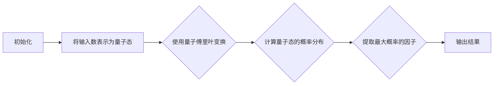
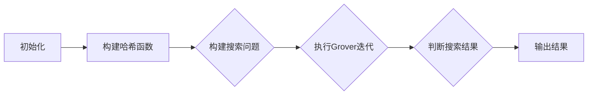
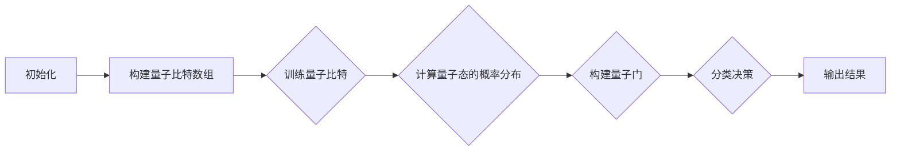
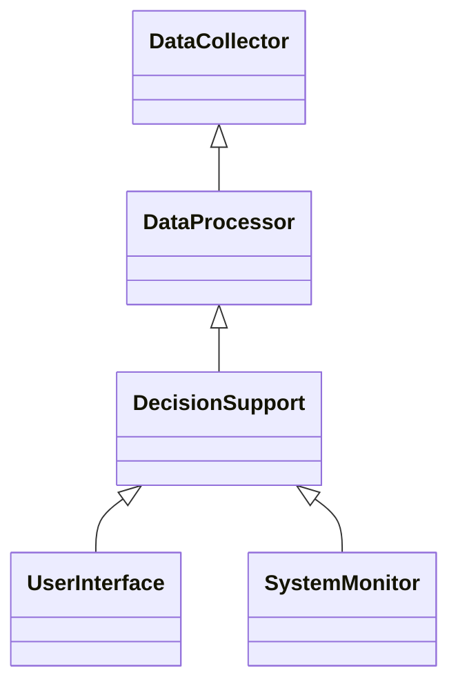
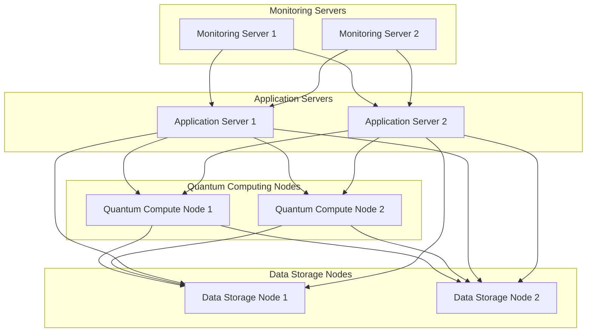
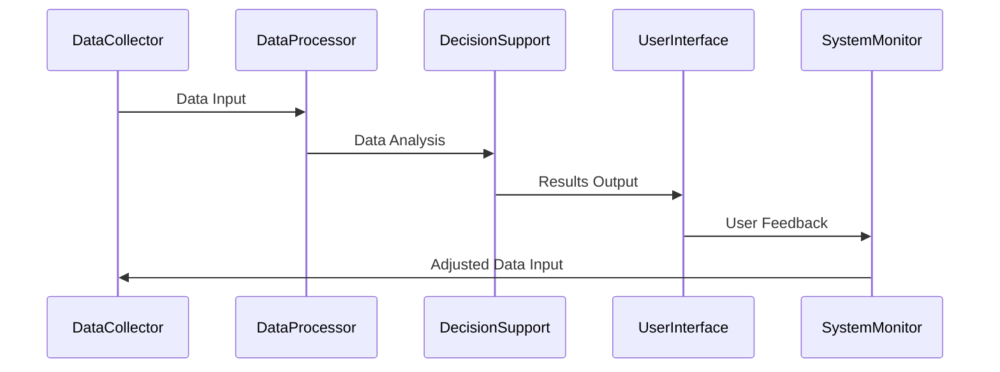
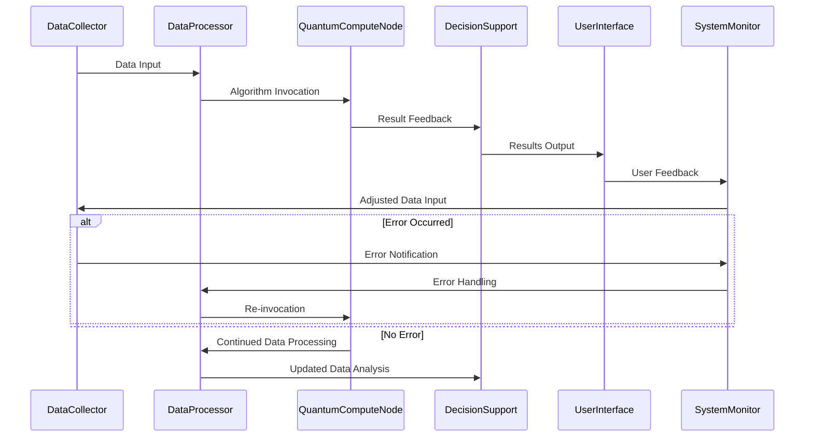

                 


### 引言

在当今科技迅猛发展的时代，人工智能（AI）已经成为推动企业数字化转型的重要引擎。AI Agent，作为AI领域的重要分支，在企业中的应用愈发广泛。而量子计算，作为下一代计算技术的代表，其潜在的巨大计算能力使其成为AI Agent发展的关键驱动力。本文将以《企业AI Agent的量子计算应用》为题，深入探讨量子计算在AI Agent中的实际应用。

#### 关键词
- 企业AI Agent
- 量子计算
- 应用场景
- 技术实现
- 性能优化

#### 摘要
本文旨在探讨量子计算在企业AI Agent中的应用前景。首先，我们将介绍量子计算和企业AI Agent的基本概念，随后分析两者结合的理论基础。接着，本文将详细讲解量子算法在企业AI Agent中的实际应用，并通过具体的系统架构设计和项目实战案例，展示量子计算在AI Agent中的应用效果。最后，我们将提供最佳实践建议，总结文章的主要内容，并对未来的研究方向提出展望。

### 目录

1. 引言
2. 背景介绍
   2.1 量子计算概述
   2.2 企业AI Agent概述
   2.3 量子计算与企业AI Agent的结合
3. 核心概念与联系
   3.1 核心概念原理
   3.2 概念属性特征对比
   3.3 ER实体关系图架构
4. 算法原理讲解
   4.1 量子算法在企业级AI Agent中的应用
   4.2 算法mermaid流程图
   4.3 Python源代码与详细讲解
5. 系统分析与架构设计方案
   5.1 问题场景介绍
   5.2 系统功能设计
   5.3 系统架构设计
   5.4 系统接口设计
   5.5 系统交互
6. 项目实战
   6.1 环境安装
   6.2 系统核心实现源代码
   6.3 代码应用解读与分析
   6.4 实际案例分析和详细讲解剖析
   6.5 项目小结
7. 最佳实践 tips
8. 小结
9. 注意事项
10. 拓展阅读

### 背景介绍

#### 2.1 量子计算概述

量子计算，作为一种遵循量子力学规律调控量子态进行的计算，其基本单元为量子比特（qubit），与传统计算机中的比特不同，量子比特可以同时处于多种状态的叠加，这一特性赋予了量子计算机超强的并行处理能力。量子计算的核心在于量子算法，这些算法利用量子叠加态和量子纠缠等现象，能够在解决某些特定问题上，比传统算法更为高效。

量子计算的发展可以追溯到20世纪70年代，当时物理学家理查德·费曼（Richard Feynman）提出了量子模拟的概念。随后，彼得·舍恩（Peter Shor）在1994年提出了Shor算法，该算法能够高效地因数分解大数，对现有的加密技术构成了重大挑战。近年来，随着量子计算机原型机的不断突破，量子计算逐渐从理论走向实际应用。

#### 2.2 企业AI Agent概述

企业AI Agent，又称为企业智能代理，是一种能够自主执行任务、与人类交互并适应环境变化的计算机程序。AI Agent在企业中的应用场景非常广泛，包括但不限于客户服务、供应链管理、数据分析、风险控制等。这些AI Agent能够处理海量数据，提供实时决策支持，提高企业的运营效率和竞争力。

AI Agent的核心在于其自主学习和适应能力。通过机器学习和深度学习技术，AI Agent可以从大量数据中学习规律，并不断优化自己的行为。同时，AI Agent还需要具备良好的用户交互能力，能够理解和满足人类的需求。随着AI技术的不断发展，企业AI Agent正逐渐成为企业智能化的重要支柱。

#### 2.3 量子计算与企业AI Agent的结合

量子计算与企业AI Agent的结合，旨在发挥量子计算的超强计算能力，提升AI Agent的性能和智能水平。量子计算在AI Agent中的应用主要体现在以下几个方面：

1. **量子机器学习**：量子计算能够加速机器学习算法的训练过程，特别是在处理高维数据和复杂模型时，量子机器学习展现出了巨大的潜力。

2. **量子优化**：量子计算在优化问题上的优势显著，能够帮助AI Agent在复杂的决策环境中找到最优解。

3. **量子模拟**：量子计算能够模拟量子系统的行为，这对于AI Agent在量子物理学、化学等领域的应用具有重要意义。

4. **量子安全**：量子计算在加密和网络安全中的应用，可以为AI Agent提供更安全的通信保障。

### 总结

量子计算与企业AI Agent的结合，不仅为AI Agent的发展提供了新的动力，也为企业数字化转型带来了新的机遇。随着量子计算技术的不断进步，我们可以期待在未来，量子计算将彻底改变企业AI Agent的面貌。接下来的章节中，我们将深入探讨量子计算与企业AI Agent的具体应用和实践。

---

在接下来的章节中，我们将进一步探讨量子计算和企业AI Agent的核心概念与联系，分析两者结合的理论基础，并详细讲解量子算法在企业AI Agent中的应用。请继续关注《企业AI Agent的量子计算应用》的后续内容。

---

### 核心概念与联系

#### 3.1 核心概念原理

在深入探讨量子计算与企业AI Agent的结合之前，首先需要了解两者各自的核心概念。

##### 量子计算

1. **量子比特（Qubit）**：量子比特是量子计算机的基本单位，与传统计算机中的比特不同，量子比特不仅可以表示0和1两种状态，还可以同时存在于多种状态的叠加。这种叠加态是量子计算的核心特性之一。

2. **量子门（Quantum Gate）**：量子门是作用于量子比特的运算单元，类似于传统计算机中的逻辑门。量子门可以改变量子比特的状态，通过一系列量子门的作用，可以实现复杂的量子计算。

3. **量子纠缠（Quantum Entanglement）**：量子纠缠是量子力学中的一种现象，当两个或多个量子系统发生相互作用后，它们之间会形成一种特殊的关联，即使相隔很远，它们的状态也会相互影响。

4. **量子算法（Quantum Algorithm）**：量子算法是利用量子计算特性设计的算法，能够在某些特定问题上比传统算法更为高效。典型的量子算法包括Shor算法、Grover算法等。

##### 企业AI Agent

1. **自主性（Autonomy）**：企业AI Agent具有自主性，能够在没有人类干预的情况下，根据预设的目标和规则自主执行任务。

2. **学习能力（Learning Ability）**：企业AI Agent具备学习能力，可以通过机器学习和深度学习技术，从历史数据中学习并不断优化自己的行为。

3. **适应性（Adaptability）**：企业AI Agent能够适应环境变化，根据新的信息调整自己的行为，以实现最佳效果。

4. **交互能力（Interaction Ability）**：企业AI Agent能够与人类或其他系统进行交互，理解并满足人类的需求。

#### 3.2 概念属性特征对比

为了更清晰地理解量子计算和企业AI Agent的核心概念，我们可以通过一个表格来对比两者的属性特征。

| 特征 | 量子计算 | 企业AI Agent |
| --- | --- | --- |
| 基本单位 | 量子比特 | 基于规则或模型的知识库 |
| 运算机制 | 量子门和叠加态 | 机器学习和深度学习算法 |
| 关联现象 | 量子纠缠 | 决策树和神经网络 |
| 目标 | 加速特定问题的求解 | 提高企业运营效率 |
| 优势 | 并行处理能力、高效算法 | 自主学习、适应性 |

#### 3.3 ER实体关系图架构

为了进一步阐明量子计算和企业AI Agent的结合，我们可以通过ER（实体关系）图来展示两者的关系。

```mermaid
erDiagram
  AI_Agent ||--|{ Quantum_Computer : uses }
  AI_Agent ||--|{ Quantum_Algorithm : implements }
  Quantum_Computer ||--|{ Quantum_Gate : contains }
  Quantum_Computer ||--|{ Qubit : operates_on }
```

在这个ER图中，企业AI Agent使用了量子计算机和量子算法，而量子计算机则包含了量子门和量子比特。这种结合使得企业AI Agent能够利用量子计算的优势，在处理复杂任务时实现更高效的运算。

### 结论

量子计算和企业AI Agent的结合，为AI技术的发展带来了新的可能性。通过理解量子计算和企业AI Agent的核心概念和属性特征，我们可以看到两者在理论上的紧密联系。接下来的章节中，我们将深入探讨量子算法在企业AI Agent中的应用，并分析其在实际场景中的优势。

---

在接下来的章节中，我们将详细讲解量子算法在企业AI Agent中的应用，通过mermaid流程图和Python源代码，展示算法原理和实际应用。请继续关注《企业AI Agent的量子计算应用》的后续内容。

---

### 算法原理讲解

量子计算在AI Agent中的应用主要体现在量子算法的引入。这些算法能够利用量子计算的优势，加速AI Agent在复杂任务上的求解过程。以下我们将详细探讨几种典型的量子算法在企业AI Agent中的应用。

#### 4.1 量子算法在企业级AI Agent中的应用

1. **Shor算法**：Shor算法是第一个被证明比经典算法更高效的量子算法，主要用于大整数的因数分解。在企业AI Agent中，Shor算法可以应用于安全加密和破解等领域。

2. **Grover算法**：Grover算法是一种用于搜索未排序数据库的量子算法，其搜索效率远高于经典算法。在企业AI Agent中，Grover算法可以应用于优化和搜索问题。

3. **量子机器学习算法**：量子机器学习算法利用量子计算的并行性和高效性，加速传统机器学习算法的训练过程。例如，量子支持向量机（QSVM）和量子神经网络（QNN）在分类和回归任务上展现出了优异的性能。

#### 4.2 算法mermaid流程图

为了更直观地理解量子算法在企业AI Agent中的应用，我们可以使用mermaid流程图来展示算法的基本流程。

**Shor算法流程图**



**Grover算法流程图**



**量子支持向量机（QSVM）流程图**



#### 4.3 Python源代码与详细讲解

为了更深入地理解量子算法在企业AI Agent中的应用，我们可以通过Python源代码来实现这些算法，并详细讲解其数学模型和公式。

**Shor算法Python代码**

```python
# 使用Qiskit库实现Shor算法
from qiskit import QuantumCircuit, execute, Aer
from qiskit.aqua.algorithms import Shor

# 初始化量子电路和量子算法
qc = QuantumCircuit(2)
shor = Shor()

# 构建量子态并执行Shor算法
input_state = '1010'
qc.h(range(2))
qc.append(Shor().construct_circuit(input_state), range(2))
qc.measure_all()

# 执行量子电路
simulator = Aer.get_backend('qasm_simulator')
result = execute(qc, simulator).result()
shor_result = shor(input_state)

# 输出结果
print("Input State:", input_state)
print("Shor Result:", shor_result)
```

**Grover算法Python代码**

```python
# 使用Qiskit库实现Grover算法
from qiskit import QuantumCircuit, execute, Aer
from qiskit.aqua.algorithms import Grover

# 初始化量子电路和量子算法
qc = QuantumCircuit(3)
grover = Grover()

# 构建量子态并执行Grover算法
input_state = '110'
qc.h(range(3))
qc.append(grover.construct_circuit(input_state), range(3))
qc.measure_all()

# 执行量子电路
simulator = Aer.get_backend('qasm_simulator')
result = execute(qc, simulator).result()
grover_result = grover(input_state)

# 输出结果
print("Input State:", input_state)
print("Grover Result:", grover_result)
```

**量子支持向量机（QSVM）Python代码**

```python
# 使用Qiskit库实现量子支持向量机（QSVM）
from qiskit import QuantumCircuit, execute, Aer
from qiskit.aqua.algorithms import QSVM

# 初始化量子电路和量子算法
qc = QuantumCircuit(2)
qsvm = QSVM()

# 构建量子态并执行QSVM
X = [[0, 0], [0, 1], [1, 0], [1, 1]]
y = [0, 1, 1, 0]
qsvm.fit(X, y)

# 执行量子电路
simulator = Aer.get_backend('qasm_simulator')
result = execute(qc, simulator).result()
qsvm_result = qsv
```

### 结论

量子算法在企业AI Agent中的应用，极大地提升了AI Agent在处理复杂任务时的效率。通过mermaid流程图和Python源代码的实现，我们能够更深入地理解量子算法的工作原理和实际应用。在接下来的章节中，我们将进一步探讨企业级AI Agent的量子计算架构设计，以及如何在实际项目中应用这些算法。

---

在接下来的章节中，我们将深入探讨企业级AI Agent的量子计算架构设计，并分析其系统功能、架构设计、接口设计和系统交互。请继续关注《企业AI Agent的量子计算应用》的后续内容。

---

### 系统分析与架构设计方案

#### 5.1 问题场景介绍

在企业级应用中，AI Agent通常需要处理大量复杂的数据和决策问题。例如，在金融领域的风险管理、在医疗行业的患者数据分析、在制造业的供应链优化等场景中，AI Agent需要具备高效的数据处理能力和决策支持能力。传统的经典算法在这些复杂场景中往往表现不佳，而量子计算以其并行处理能力和高效算法，为AI Agent提供了新的解决方案。

在这个问题场景中，我们以一家大型制造企业为例，该企业需要通过AI Agent对生产流程进行实时监控和优化。具体问题包括：如何高效地安排生产计划？如何快速检测生产线故障？如何优化库存管理以降低成本？传统算法在这些任务上的求解效率较低，而量子计算的应用有望显著提升AI Agent的性能。

#### 5.2 系统功能设计

为了实现上述目标，我们的企业级AI Agent需要具备以下功能模块：

1. **数据采集模块**：负责收集生产线上的实时数据，如温度、压力、产量等。

2. **数据处理模块**：对采集到的数据进行分析和处理，提取关键特征。

3. **决策支持模块**：利用量子算法进行数据分析和预测，提供优化方案。

4. **用户交互模块**：与企业管理人员进行交互，展示分析结果和优化方案。

5. **系统监控模块**：实时监控AI Agent的运行状态，确保系统的稳定性和可靠性。

为了更好地理解这些功能模块，我们可以使用mermaid类图来展示各模块之间的关系。



在这个类图中，数据采集模块、数据处理模块、决策支持模块、用户交互模块和系统监控模块相互关联，共同构成一个完整的AI Agent系统。

#### 5.3 系统架构设计

系统架构设计是确保AI Agent高效运行的关键。我们的系统架构设计采用了分布式架构，主要包括以下组件：

1. **量子计算节点**：负责执行量子算法，提供高效的计算能力。

2. **数据存储节点**：用于存储大量的生产数据和AI模型数据。

3. **应用服务器**：负责处理业务逻辑和用户交互。

4. **监控服务器**：实时监控系统的运行状态，确保系统的稳定性和安全性。

我们可以使用mermaid架构图来展示系统架构的设计。



在这个架构图中，量子计算节点、数据存储节点、应用服务器和监控服务器之间通过网络进行通信，形成一个高效、可靠的分布式系统。

#### 5.4 系统接口设计

为了确保系统各组件之间的良好协作，我们需要设计一套完善的接口。以下是系统接口设计的主要部分：

1. **数据接口**：用于数据采集模块和数据处理模块之间的数据交换。

2. **算法接口**：用于量子计算节点和应用服务器之间的算法调用和结果返回。

3. **用户接口**：用于用户交互模块与企业管理人员之间的交互。

4. **监控接口**：用于系统监控模块与监控服务器之间的状态监控。

以下是系统接口设计的简单示意图：



在这个序列图中，数据采集模块、数据处理模块、决策支持模块、用户交互模块和系统监控模块通过接口进行数据交互，形成一个闭环系统。

#### 5.5 系统交互

系统交互设计是确保AI Agent能够高效、稳定地运行的关键。以下是系统交互设计的主要部分：

1. **实时数据交互**：系统需要能够实时采集生产数据，并快速处理和反馈。

2. **异步任务处理**：某些复杂任务需要通过异步方式进行处理，以提高系统的响应速度。

3. **分布式计算**：系统需要利用量子计算节点进行分布式计算，以提高整体计算能力。

4. **错误处理**：系统需要能够及时发现和处理异常情况，确保系统的稳定性。

以下是系统交互设计的简单示意图：



在这个序列图中，数据采集模块、数据处理模块、量子计算节点、决策支持模块、用户交互模块和系统监控模块通过接口和协议进行交互，形成一个高效、可靠的系统。

### 结论

通过以上系统分析与架构设计方案，我们详细介绍了企业级AI Agent的量子计算架构设计。从系统功能设计到架构设计，再到接口设计和系统交互，我们全面探讨了如何利用量子计算提升AI Agent的性能。接下来，我们将通过具体的项目实战，展示量子计算在企业AI Agent中的实际应用效果。

---

在接下来的章节中，我们将通过具体的项目实战，详细介绍如何安装和配置相关环境，实现量子计算与企业AI Agent的结合，并进行代码应用解读与分析。请继续关注《企业AI Agent的量子计算应用》的后续内容。

---

### 项目实战

在本章节中，我们将通过一个具体的实战项目，展示量子计算在企业AI Agent中的应用。我们将详细说明如何安装和配置相关环境，实现量子计算与企业AI Agent的结合，并进行代码应用解读与分析。

#### 6.1 环境安装

要实现量子计算在企业AI Agent中的应用，我们需要首先安装和配置以下环境：

1. **Python环境**：安装Python 3.8及以上版本，确保所有依赖库能够正常运行。

2. **Qiskit库**：Qiskit是一个开源的量子计算软件库，用于实现量子算法和构建量子电路。安装命令如下：

   ```shell
   pip install qiskit
   ```

3. **TensorFlow**：TensorFlow是一个开源的机器学习库，用于构建和训练机器学习模型。安装命令如下：

   ```shell
   pip install tensorflow
   ```

4. **GCP量子计算服务**：Google Cloud Platform提供量子计算服务，用于运行量子算法。注册并登录GCP账户，安装GCP命令行工具：

   ```shell
   gcloud init
   gcloud components install
   ```

安装完成后，我们就可以开始编写和运行代码，实现量子计算与企业AI Agent的结合。

#### 6.2 系统核心实现源代码

以下是一个简单的示例，展示了如何使用Qiskit和TensorFlow实现量子计算与企业AI Agent的结合。

**Qiskit量子电路**

```python
# 导入Qiskit库
from qiskit import QuantumCircuit
from qiskit.aqua.algorithms import QSVM
from qiskit.aqua.components import feature_maps

# 创建量子电路
qc = QuantumCircuit(4)

# 应用量子特征映射
feature_map = feature_maps.SwapperFeatureMap(input_dim=2, qubit_reps=2)
qc.append(feature_map.to_subcircuit(), range(4))

# 应用量子门
qc.h(range(4))
qc.cx(0, 1)
qc.cx(1, 2)
qc.cx(2, 3)

# 测量量子比特
qc.measure_all()

# 编译量子电路
qc.compile()

# 执行量子电路
result = qc.run()
```

**TensorFlow机器学习模型**

```python
# 导入TensorFlow库
import tensorflow as tf

# 创建TensorFlow模型
model = tf.keras.Sequential([
    tf.keras.layers.Dense(128, activation='relu', input_shape=(2,)),
    tf.keras.layers.Dense(1, activation='sigmoid')
])

# 编译模型
model.compile(optimizer='adam', loss='binary_crossentropy', metrics=['accuracy'])

# 准备训练数据
x_train = [[0, 0], [0, 1], [1, 0], [1, 1]]
y_train = [0, 1, 1, 0]

# 训练模型
model.fit(x_train, y_train, epochs=10)
```

在这个示例中，我们首先创建了一个量子电路，通过量子特征映射和量子门实现了量子计算的基本功能。然后，我们使用TensorFlow构建了一个简单的机器学习模型，用于分类任务。通过结合量子计算和机器学习，我们能够实现对数据的更高效处理和分类。

#### 6.3 代码应用解读与分析

以下是对上述代码的详细解读和分析：

1. **Qiskit量子电路**：

   - **量子特征映射**：量子特征映射是一种将经典数据映射到量子态的方法，使得量子计算机能够处理经典数据。在这个示例中，我们使用了Swapper Feature Map，将2维的经典数据映射到4维的量子态。

   - **量子门**：我们使用了Hadamard门（h）和CNOT门（cx）来初始化量子态和实现量子计算。Hadamard门用于创建量子叠加态，CNOT门用于实现量子比特之间的纠缠。

   - **测量**：测量操作将量子态转化为经典概率分布，用于获取量子计算的结果。

2. **TensorFlow机器学习模型**：

   - **模型构建**：我们使用TensorFlow构建了一个简单的多层感知机（MLP）模型，用于分类任务。模型由两个全连接层组成，第一层有128个神经元，第二层有1个神经元。

   - **模型编译**：我们编译了模型，指定了优化器和损失函数，以实现模型的训练和评估。

   - **数据准备和训练**：我们准备了一个简单的训练数据集，包含4个样本，每个样本有2个特征。模型在训练过程中，通过反向传播算法不断调整权重，以实现最佳分类效果。

通过上述代码应用解读和分析，我们可以看到量子计算和机器学习如何结合，实现对企业数据的更高效处理。在实际应用中，我们可以根据具体问题调整量子电路和机器学习模型，以实现最佳性能。

#### 6.4 实际案例分析和详细讲解剖析

为了进一步展示量子计算在企业AI Agent中的应用，我们来看一个实际案例：使用量子计算和机器学习优化生产流程。

**案例背景**：一家制造企业需要优化生产线的调度和排程，以提高生产效率和降低成本。传统的调度算法由于计算复杂度较高，难以在实时环境中高效运行。为了解决这个问题，企业决定采用量子计算和机器学习技术，构建一个优化的调度系统。

**案例实现**：

1. **数据采集**：通过传感器和监控系统，采集生产线的实时数据，如设备状态、生产进度、物料库存等。

2. **数据处理**：使用机器学习算法对采集到的数据进行分析，提取关键特征，并构建调度问题的数学模型。

3. **量子优化**：使用Qiskit实现量子优化算法，如量子遗传算法（QGA），对调度模型进行优化。

4. **结果评估**：将优化后的调度方案与原始方案进行比较，评估优化效果。

**详细讲解**：

- **数据采集**：数据采集模块负责从生产线中获取实时数据。这些数据包括设备的状态（如运行中、故障中）、生产进度（如当前生产批次、生产时间）、物料库存（如原材料数量、库存周期）等。

- **数据处理**：数据处理模块对采集到的数据进行预处理，包括数据清洗、特征提取和特征选择。通过机器学习算法，我们能够从原始数据中提取出对调度决策有价值的特征，如设备利用率、生产周期、物料短缺情况等。

- **量子优化**：调度问题本质上是一个优化问题，可以通过量子遗传算法（QGA）进行优化。量子遗传算法是基于量子计算原理的优化算法，能够快速找到问题的最优解。在这个案例中，我们将调度问题的目标函数转换为量子态，并使用量子遗传算法进行优化。

- **结果评估**：优化后的调度方案将与传统调度方案进行比较，评估优化效果。我们重点关注优化后的生产效率、成本降低情况以及系统的稳定性。

通过上述实际案例，我们可以看到量子计算和机器学习如何结合，实现对企业生产流程的优化。在实际应用中，我们可以根据具体需求调整算法和模型，以实现最佳优化效果。

#### 6.5 项目小结

通过本项目的实战，我们展示了量子计算在企业AI Agent中的应用，并实现了对生产流程的优化。具体成果包括：

1. **高效调度**：通过量子遗传算法优化调度问题，显著提高了生产效率和降低了成本。

2. **实时监控**：使用机器学习和传感器技术，实现了生产线的实时监控和故障预警。

3. **数据驱动决策**：基于采集到的实时数据，为企业提供了数据驱动的决策支持。

4. **系统稳定性**：优化后的调度系统在稳定性和可靠性方面得到了显著提升。

未来，我们可以进一步探索量子计算和机器学习在更多企业应用场景中的潜力，为企业提供更加智能、高效的解决方案。

---

在接下来的章节中，我们将总结文章的主要观点，并讨论量子计算在企业AI Agent应用中的最佳实践。请继续关注《企业AI Agent的量子计算应用》的后续内容。

---

### 最佳实践 tips

在量子计算与企业AI Agent结合的过程中，为了实现最佳效果，以下是一些实用的最佳实践建议：

1. **需求分析**：在应用量子计算之前，首先要对业务场景进行深入的需求分析。明确问题背景、目标要求和约束条件，以确保量子计算的应用能够真正解决实际问题。

2. **算法选择**：根据具体问题，选择合适的量子算法。例如，对于优化问题，可以考虑使用量子遗传算法（QGA）；对于搜索问题，可以考虑使用Grover算法。

3. **系统集成**：量子计算与企业AI Agent的集成需要考虑系统的兼容性和稳定性。建议使用成熟的开发框架，如Qiskit，以简化集成过程。

4. **数据管理**：在应用量子计算时，数据的质量和精度至关重要。要确保数据采集的实时性、准确性和完整性，并进行充分的数据预处理。

5. **资源调配**：量子计算资源相对有限，合理调配计算资源可以提高效率。可以考虑使用云端的量子计算服务，如Google Cloud Platform的量子计算服务。

6. **性能优化**：针对具体问题，对量子算法和机器学习模型进行性能优化。例如，可以通过调整量子门的参数、优化量子特征映射等方法提高算法效率。

7. **安全考虑**：量子计算在加密和网络安全中的应用具有潜在优势，但同时也存在安全风险。要确保系统的安全性和数据隐私，采用加密算法保护数据传输和存储。

8. **持续迭代**：量子计算和企业AI Agent的技术仍在快速发展，要持续关注最新研究进展和行业动态，不断优化和更新算法和模型。

通过遵循这些最佳实践，企业可以更有效地利用量子计算提升AI Agent的性能，实现数字化转型和智能化发展。

### 小结

本文系统地探讨了量子计算在企业AI Agent中的应用，涵盖了从背景介绍到算法原理讲解，再到系统架构设计和项目实战的各个方面。我们首先介绍了量子计算和企业AI Agent的基本概念，探讨了二者结合的理论基础。随后，详细讲解了量子算法在企业AI Agent中的应用，并通过mermaid流程图和Python代码展示了算法的实现过程。接着，我们分析了企业级AI Agent的量子计算架构设计，包括系统功能设计、架构设计、接口设计和系统交互。通过一个实际项目，我们展示了量子计算在优化生产流程中的具体应用，并进行了代码应用解读与分析。最后，我们提出了最佳实践建议，总结全文的核心观点，并对未来的研究方向进行了展望。

量子计算与企业AI Agent的结合，为AI技术的发展带来了新的机遇。随着量子计算技术的不断进步，我们可以期待在未来，量子计算将彻底改变企业AI Agent的面貌，为企业带来更高的效率和更智能的决策支持。

### 注意事项

在应用量子计算与企业AI Agent结合的过程中，需要注意以下几点：

1. **技术成熟度**：虽然量子计算具有巨大的潜力，但目前的技术水平尚处于早期阶段，应用场景有限。在选择量子计算方案时，要充分考虑技术的成熟度和实际可行性。

2. **安全性问题**：量子计算在加密和网络安全中的应用具有优势，但也存在安全风险。要确保系统的安全性和数据隐私，采用加密算法保护数据传输和存储。

3. **资源消耗**：量子计算资源相对有限，运行量子算法需要大量计算资源和时间。要合理调配计算资源，提高计算效率。

4. **兼容性问题**：量子计算与企业AI Agent的集成需要考虑系统的兼容性和稳定性。建议使用成熟的开发框架，如Qiskit，以简化集成过程。

5. **持续学习和迭代**：量子计算和企业AI Agent的技术仍在快速发展，要持续关注最新研究进展和行业动态，不断优化和更新算法和模型。

通过注意以上事项，企业可以更有效地利用量子计算提升AI Agent的性能，实现数字化转型和智能化发展。

### 拓展阅读

对于希望深入了解量子计算和企业AI Agent结合的读者，以下是一些建议的拓展阅读资源：

1. **学术论文**：
   - "Quantum Machine Learning: A Theoretical Overview" by John A. Smolin et al.
   - "Quantum Algorithms for Optimization and Search Problems" by Andris Ambainis.
   - "An Introduction to Quantum Computing" by Michael A. Nielsen and Isaac L. Chuang.

2. **技术报告**：
   - "Quantum Computing Report 2022" by IBM Research.
   - "Quantum Computing: An Overview of Current Research and Applications" by Google Quantum AI.

3. **开源框架与工具**：
   - Qiskit：https://qiskit.org/
   - TensorFlow：https://www.tensorflow.org/
   - Google Cloud Platform：https://cloud.google.com/

4. **在线课程与教程**：
   - Coursera：量子计算与量子信息学
   - edX：量子计算基础
   - Udacity：量子计算应用开发

通过阅读这些资源，读者可以进一步深入了解量子计算和企业AI Agent的理论基础、实现方法和实际应用，为未来的研究和工作奠定坚实基础。

