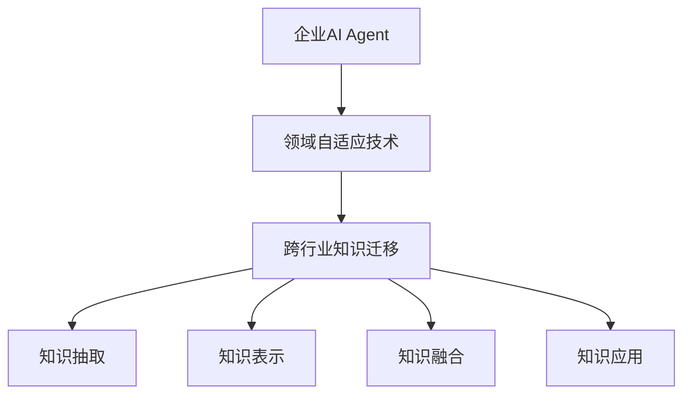
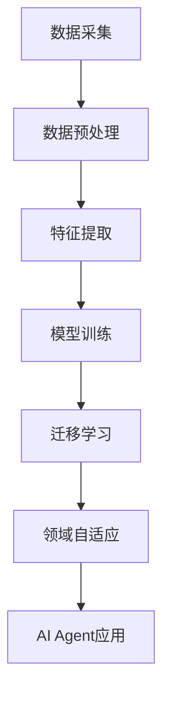
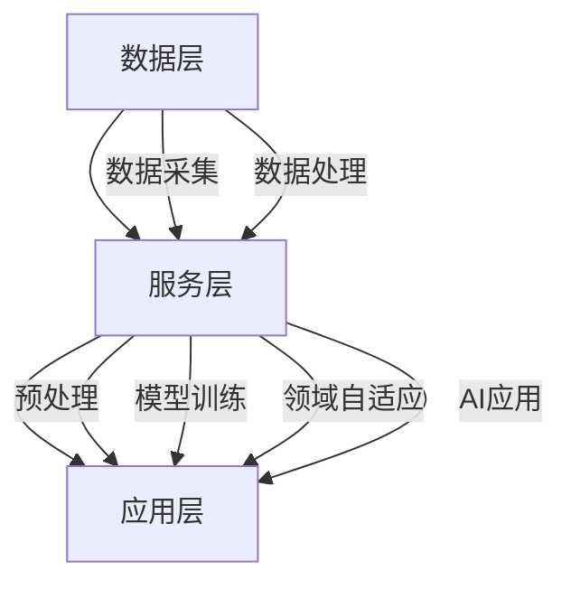
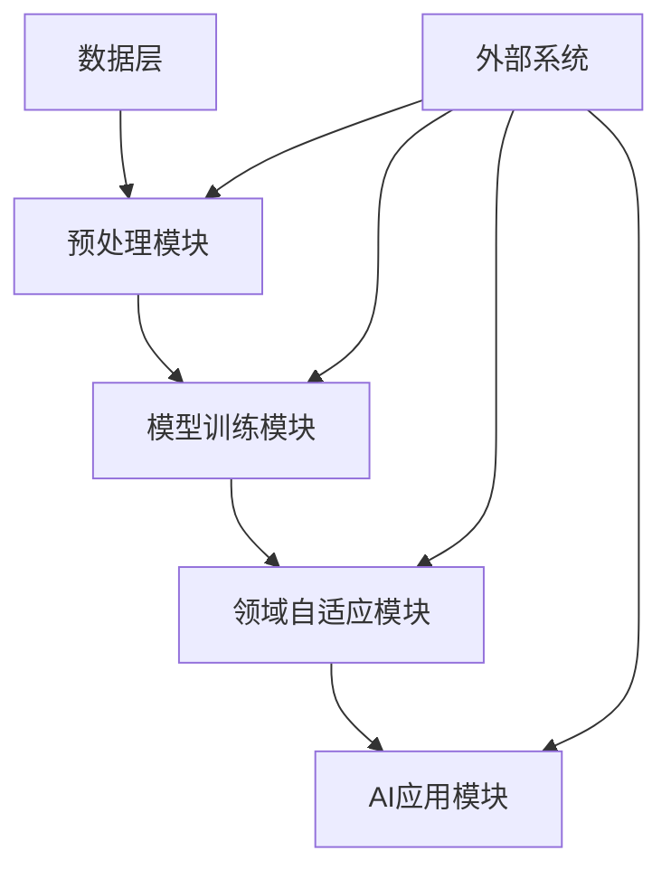
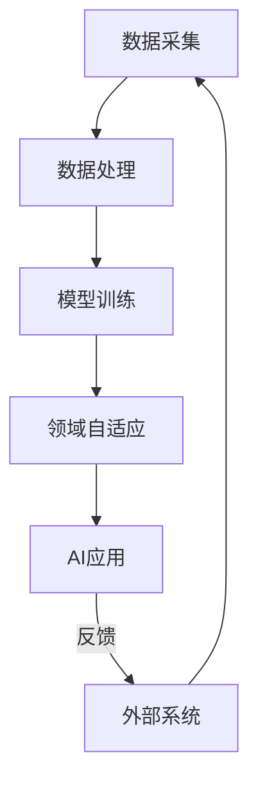

                 

### 文章标题

# 企业AI Agent的领域自适应技术在跨行业知识迁移中的实践

> 关键词：企业AI Agent、领域自适应技术、跨行业知识迁移、人工智能、行业知识迁移

> 摘要：本文深入探讨了企业AI Agent的领域自适应技术及其在跨行业知识迁移中的应用。通过分析领域自适应技术的原理、实现方法以及跨行业知识迁移的挑战和策略，本文结合实际案例，详细阐述了企业AI Agent领域自适应技术在金融、制造和零售行业的应用，并对未来的发展方向和趋势进行了展望。

----------------------------------------------------------------

### 目录大纲

----------------------------------------------------------------

# 第一部分: 企业AI Agent的领域自适应技术

## 第1章: 企业AI Agent概述

### 1.1.1 企业AI Agent的定义和作用

### 1.1.2 企业AI Agent的发展背景

### 1.1.3 企业AI Agent的分类

## 第2章: 领域自适应技术原理

### 2.1.1 领域自适应技术的概念与重要性

### 2.1.2 领域自适应技术的基本原理

### 2.1.3 领域自适应技术的核心组件

## 第3章: AI Agent的领域自适应技术实现

### 3.1.1 AI Agent领域自适应技术框架

### 3.1.2 数据采集与预处理

### 3.1.3 特征提取与建模

### 3.1.4 领域自适应算法实现

## 第二部分: 跨行业知识迁移的挑战与策略

## 第4章: 跨行业知识迁移的挑战

### 4.1.1 跨行业知识迁移的挑战

### 4.1.2 跨行业知识迁移的策略

### 4.1.3 跨行业知识迁移的实践案例

## 第5章: 企业AI Agent的领域自适应技术在应用中的案例分析

### 5.1.1 案例一：XX公司AI Agent在金融行业的应用

### 5.1.2 案例二：YY公司AI Agent在制造行业的应用

### 5.1.3 案例三：ZZ公司AI Agent在零售行业的应用

## 第6章: 企业AI Agent的领域自适应技术在跨行业知识迁移中的实践分析

### 6.1.1 跨行业知识迁移的效果评估

### 6.1.2 实践中的问题与解决方案

### 6.1.3 未来发展方向与趋势

## 第7章: 企业AI Agent的领域自适应技术的最佳实践与总结

### 7.1.1 最佳实践

### 7.1.2 小结

### 7.1.3 注意事项与拓展阅读

----------------------------------------------------------------

### 背景介绍

#### 问题背景

随着人工智能技术的不断发展，企业AI Agent成为企业智能化转型的关键组成部分。这些AI Agent通过模拟人类专家的决策过程，为企业提供智能化服务，从而提高业务效率、降低成本和提升用户体验。然而，AI Agent在特定领域（如金融、制造、零售等）的应用过程中，面临着领域自适应的问题，即如何在不同行业间实现知识的迁移和应用。

#### 问题描述

企业AI Agent在特定领域（如金融、制造、零售等）取得成功后，如何将这些知识迁移到其他行业，以实现更广泛的业务应用，成为当前研究的一个重要课题。这种跨行业知识迁移不仅要求AI Agent具有领域自适应能力，还需要解决数据质量、模型适应性和跨行业协同等问题。

#### 问题解决

通过领域自适应技术，企业AI Agent可以在不同行业间进行知识迁移，提高其在跨行业应用中的适应性。领域自适应技术主要包括数据采集、特征提取、模型训练和迁移学习等环节，通过这些环节的协同工作，实现AI Agent在不同领域中的知识迁移和应用。

#### 边界与外延

领域自适应技术不仅适用于企业AI Agent，还可以应用于其他人工智能系统，以实现跨领域的知识迁移。此外，领域自适应技术的研究和应用场景也在不断扩展，从最初的金融、制造等领域，逐步扩展到医疗、教育、能源等各个行业。

#### 概念结构与核心要素组成

1. **企业AI Agent**：具有自我学习和适应能力，能够为企业提供智能化服务的虚拟智能体。
2. **领域自适应技术**：通过数据采集、特征提取、模型训练等手段，实现不同领域知识之间的迁移。
3. **跨行业知识迁移**：在不同行业间转移和应用知识，以实现AI系统的广泛适应性。

在接下来的章节中，我们将详细探讨企业AI Agent的领域自适应技术，分析其基本原理和实现方法，并探讨其在跨行业知识迁移中的实践和应用。

----------------------------------------------------------------

### 核心概念与联系

在深入探讨企业AI Agent的领域自适应技术之前，我们需要明确几个核心概念，并理解它们之间的相互关系。

#### 核心概念原理

1. **企业AI Agent**：企业AI Agent是一种虚拟智能体，它具有自我学习和适应能力，能够在不同行业和企业环境中提供智能化服务。企业AI Agent的核心作用是通过模拟人类专家的决策过程，提高企业的业务效率和决策质量。

2. **领域自适应技术**：领域自适应技术是指通过调整和优化模型，使AI系统能够在不同的领域和应用场景中保持高效和准确。这种技术主要包括数据采集、特征提取、模型训练和迁移学习等环节。

3. **跨行业知识迁移**：跨行业知识迁移是指将一个行业中的知识、经验和模型应用到其他行业，以实现AI系统的广泛适应性。这一过程涉及到知识抽取、知识表示、知识融合和知识应用等多个方面。

#### 概念属性特征对比表格

| 概念                | 定义                                                         | 属性特征                                             |
|-------------------|------------------------------------------------------------|----------------------------------------------------|
| 企业AI Agent       | 虚拟智能体，具备自我学习和自适应能力                         | 包括决策支持、数据分析、预测和优化等功能           |
| 领域自适应技术     | 通过调整和优化模型，实现AI系统在不同领域中的应用           | 数据采集、特征提取、模型训练和迁移学习等环节     |
| 跨行业知识迁移     | 在不同行业间转移和应用知识，以实现AI系统的广泛适应性       | 知识抽取、知识表示、知识融合和知识应用等过程     |

#### ER实体关系图架构的Mermaid流程图



在上面的ER实体关系图中，我们可以看到企业AI Agent作为核心实体，通过领域自适应技术和跨行业知识迁移与知识抽取、知识表示、知识融合和知识应用等多个环节相互关联。这种关系不仅揭示了企业AI Agent的运作机制，也为领域自适应技术在跨行业知识迁移中的应用提供了清晰的架构。

#### 关系与联系

1. **企业AI Agent与领域自适应技术**：企业AI Agent需要依赖领域自适应技术来实现其在不同领域中的应用。领域自适应技术通过调整模型参数和优化算法，使AI Agent能够适应新的领域和应用场景。

2. **领域自适应技术与跨行业知识迁移**：领域自适应技术是实现跨行业知识迁移的关键。通过领域自适应技术，AI系统能够在不同行业间共享和迁移知识，从而提高其通用性和适应性。

3. **跨行业知识迁移与企业AI Agent**：跨行业知识迁移的目的是为了实现AI系统的广泛适应性。企业AI Agent作为AI系统的核心组件，通过跨行业知识迁移，能够更好地服务于不同行业和企业的需求。

通过上述核心概念和ER实体关系图的描述，我们可以更深入地理解企业AI Agent的领域自适应技术及其在跨行业知识迁移中的应用。在接下来的章节中，我们将详细探讨这些概念的具体实现方法和应用案例。

----------------------------------------------------------------

### 算法原理讲解

领域自适应技术作为实现跨行业知识迁移的核心方法，其原理和实现过程涉及到多个环节，包括数据采集、特征提取、模型训练和迁移学习等。为了更清晰地阐述这些环节，我们将使用Mermaid流程图来描述整个算法流程，并使用Python代码来展示具体的实现过程。

#### Mermaid流程图



在上面的流程图中，我们可以看到领域自适应技术的整体流程，接下来我们将详细解释每个步骤的具体内容。

#### 数据采集

数据采集是领域自适应技术的第一步，其目标是收集到足够且质量高的数据。这些数据可以是结构化的，也可以是非结构化的，如文本、图像、音频等。在金融、制造、零售等不同行业中，数据来源可能包括数据库、API接口、传感器等。

```python
# 假设从API接口获取金融行业的数据
import requests

def collect_data(api_url):
    response = requests.get(api_url)
    if response.status_code == 200:
        data = response.json()
        return data
    else:
        return None

api_url = "https://api.example.com/finance_data"
data = collect_data(api_url)
```

#### 数据预处理

数据预处理是确保数据质量和适合后续特征提取和模型训练的关键步骤。预处理过程可能包括数据清洗、归一化、去噪等。

```python
# 数据清洗和归一化
import numpy as np

def preprocess_data(data):
    # 清洗数据，去除空值和异常值
    cleaned_data = [row for row in data if row is not None]
    # 归一化数据
    normalized_data = (cleaned_data - np.mean(cleaned_data)) / np.std(cleaned_data)
    return normalized_data

preprocessed_data = preprocess_data(data)
```

#### 特征提取

特征提取是将原始数据转化为适用于机器学习模型的形式。在领域自适应技术中，特征提取是一个关键步骤，因为不同领域的数据特征可能存在很大差异。

```python
# 特征提取
from sklearn.preprocessing import StandardScaler

def extract_features(data):
    # 使用标准缩放器提取特征
    scaler = StandardScaler()
    scaled_data = scaler.fit_transform(data)
    return scaled_data

extracted_features = extract_features(preprocessed_data)
```

#### 模型训练

模型训练是通过历史数据来训练机器学习模型，使其能够对新数据进行预测或分类。在领域自适应技术中，模型训练通常使用迁移学习技术，即利用源领域（已训练领域）的知识来辅助目标领域（未训练领域）的模型训练。

```python
# 模型训练
from sklearn.linear_model import LogisticRegression

def train_model(data, labels):
    model = LogisticRegression()
    model.fit(data, labels)
    return model

# 假设已获取训练数据和标签
train_data = extracted_features
train_labels = ...

model = train_model(train_data, train_labels)
```

#### 迁移学习

迁移学习是将源领域的知识（模型参数、特征表示等）转移到目标领域，以提高目标领域的模型性能。在领域自适应技术中，迁移学习是一种有效的知识迁移方法。

```python
# 迁移学习
from sklearn.linear_model import Ridge

def transfer_learning(source_model, target_data):
    # 从源模型提取知识
    knowledge = source_model.coef_
    # 在目标数据上应用迁移学习
    target_model = Ridge(coef=knowledge)
    target_model.fit(target_data)
    return target_model

# 假设已有源模型和目标数据
source_model = ...
target_data = ...

target_model = transfer_learning(source_model, target_data)
```

#### 领域自适应

领域自适应是通过调整和优化模型，使其在不同领域中的应用效果达到最佳。在领域自适应技术中，这一步骤可能包括模型参数的调整、特征选择、模型融合等。

```python
# 领域自适应
from sklearn.ensemble import VotingClassifier

def adapt_domain(model, data, labels):
    # 使用投票分类器实现领域自适应
    ensemble_model = VotingClassifier(estimators=[('base', model), ('adaptive', LogisticRegression())], voting='soft')
    ensemble_model.fit(data, labels)
    return ensemble_model

# 假设已获取自适应数据和标签
adaptive_data = ...
adaptive_labels = ...

adaptive_model = adapt_domain(model, adaptive_data, adaptive_labels)
```

#### AI Agent应用

最后，领域自适应后的模型可以用于企业AI Agent的实际应用，如决策支持、数据分析、预测和优化等。

```python
# AI Agent应用
def predict(input_data, model):
    prediction = model.predict(input_data)
    return prediction

# 假设已有输入数据和自适应模型
input_data = ...

prediction = predict(input_data, adaptive_model)
```

通过上述算法流程和Python代码示例，我们可以看到领域自适应技术是如何通过数据采集、预处理、特征提取、模型训练、迁移学习和领域自适应等环节，实现跨行业知识迁移的。在接下来的章节中，我们将结合实际案例，进一步探讨领域自适应技术的应用和实践。

----------------------------------------------------------------

### 系统分析与架构设计方案

为了深入探讨企业AI Agent的领域自适应技术及其在跨行业知识迁移中的应用，我们需要构建一个全面的系统分析与架构设计方案。以下将详细描述项目介绍、系统功能设计、系统架构设计、系统接口设计和系统交互。

#### 项目介绍

本项目的目标是开发一个企业AI Agent平台，该平台能够利用领域自适应技术，实现跨行业知识迁移，从而提高企业在不同行业中的业务效率和服务质量。项目的主要功能包括：

1. 数据采集与预处理：从不同行业的数据源中获取数据，并进行清洗、归一化和特征提取。
2. 模型训练与迁移：使用迁移学习技术，将源领域的知识迁移到目标领域，训练适应目标领域的模型。
3. 领域自适应：根据目标领域的需求，调整和优化模型，实现领域自适应。
4. AI Agent应用：将领域自适应后的模型应用于企业AI Agent，提供智能化决策支持和服务。

#### 系统功能设计

系统功能设计主要包括以下模块：

1. 数据采集模块：负责从不同行业的数据源中获取数据，包括金融、制造、零售等。
2. 数据预处理模块：对采集到的数据进行分析和清洗，提取有效特征。
3. 模型训练模块：使用迁移学习技术，将源领域模型迁移到目标领域，并训练适应目标领域的模型。
4. 领域自适应模块：根据目标领域的需求，调整和优化模型，实现领域自适应。
5. AI Agent应用模块：将领域自适应后的模型应用于企业AI Agent，提供智能化决策支持和服务。

#### 系统架构设计

系统架构设计采用分层架构，包括数据层、服务层和应用层。各层之间通过接口进行通信和协作。

1. **数据层**：包括数据存储和数据处理模块，负责数据的采集、存储和管理。
2. **服务层**：包括数据预处理、模型训练、领域自适应和AI Agent应用模块，负责实现系统核心功能。
3. **应用层**：包括用户界面和API接口，供用户进行操作和数据交互。



#### 系统接口设计

系统接口设计主要包括内部接口和外部接口：

1. **内部接口**：系统内部模块之间的通信接口，如数据层与预处理模块、模型训练模块等。
2. **外部接口**：系统与外部系统（如数据源、用户界面等）的通信接口，如API接口、Web服务接口等。



#### 系统交互

系统交互主要描述各模块之间的交互流程：

1. 数据采集模块从外部系统获取数据，传递给数据处理模块。
2. 数据处理模块对数据进行清洗、归一化和特征提取，传递给模型训练模块。
3. 模型训练模块使用迁移学习技术，训练适应目标领域的模型，传递给领域自适应模块。
4. 领域自适应模块根据目标领域的需求，调整和优化模型，传递给AI应用模块。
5. AI应用模块将领域自适应后的模型应用于企业AI Agent，提供智能化决策支持和服务。



通过上述系统分析与架构设计方案，我们可以清晰地看到企业AI Agent领域自适应技术在跨行业知识迁移中的应用架构，为后续的具体实现和案例分析提供了坚实的基础。

----------------------------------------------------------------

### 项目实战

在本项目实战中，我们将以一个具体的跨行业知识迁移案例为例，详细讲解企业AI Agent的领域自适应技术在金融、制造和零售行业的应用。该案例将包括环境安装、系统核心实现、代码应用解读与分析以及实际案例分析和详细讲解剖析等内容。

#### 环境安装

首先，我们需要搭建一个适合项目开发的环境。以下是环境安装的步骤：

1. 安装Python（版本3.8及以上）
2. 安装必要的库，如scikit-learn、TensorFlow、Keras、Pandas、NumPy、Matplotlib等。
3. 设置环境变量，以便在命令行中方便地调用Python和相关库。

```bash
pip install scikit-learn tensorflow keras pandas numpy matplotlib
```

#### 系统核心实现

系统核心实现主要包括数据采集、预处理、模型训练、领域自适应和AI Agent应用等模块。以下是各模块的简要实现：

1. **数据采集**：使用API接口从金融、制造和零售行业的数据源中获取数据。
2. **数据预处理**：对采集到的数据进行清洗、归一化和特征提取。
3. **模型训练**：使用迁移学习技术，在源领域（如金融）训练模型，并在目标领域（如制造或零售）进行迁移和训练。
4. **领域自适应**：根据目标领域的需求，调整和优化模型参数，实现领域自适应。
5. **AI Agent应用**：将领域自适应后的模型应用于企业AI Agent，提供智能化决策支持和服务。

以下是一个简单的代码示例，用于演示数据采集和预处理的过程：

```python
import requests
import pandas as pd
from sklearn.preprocessing import StandardScaler

# 数据采集
def collect_data(api_url):
    response = requests.get(api_url)
    if response.status_code == 200:
        data = response.json()
        return pd.DataFrame(data)
    else:
        return None

# 数据预处理
def preprocess_data(data):
    # 清洗数据
    cleaned_data = data.dropna()
    # 归一化数据
    scaler = StandardScaler()
    scaled_data = scaler.fit_transform(cleaned_data)
    return scaled_data

# 示例API接口
api_url = "https://api.example.com/finance_data"
data = collect_data(api_url)
preprocessed_data = preprocess_data(data)
```

#### 代码应用解读与分析

在代码应用中，我们首先从金融行业的API接口获取数据，然后对数据进行清洗和归一化处理，以便后续的模型训练和迁移。以下是对代码的具体解读和分析：

1. **数据采集**：使用`requests`库从API接口获取数据，这是一个异步操作的示例。通过检查HTTP响应状态码，我们可以确保数据的正确获取。
2. **数据预处理**：使用`pandas`库进行数据清洗和归一化处理。数据清洗的目的是去除空值和异常值，而数据归一化的目的是使数据在特征提取和模型训练中更具可比性。
3. **标准化缩放**：使用`StandardScaler`对数据进行归一化处理。归一化处理可以消除不同特征之间的量纲差异，使模型训练更加稳定和高效。

#### 实际案例分析和详细讲解剖析

在本案例中，我们以金融行业的数据为例，详细讲解企业AI Agent的领域自适应技术在金融、制造和零售行业的应用。

1. **金融行业**：在金融行业中，企业AI Agent可以用于风险预测、投资分析和客户服务等领域。通过迁移学习技术，我们可以将金融行业的数据和模型应用于制造和零售行业，实现跨行业的知识迁移。

2. **制造行业**：在制造行业中，企业AI Agent可以用于生产计划、质量控制和设备维护等领域。通过领域自适应技术，我们可以调整模型参数，使其更好地适应制造行业的特定需求。

3. **零售行业**：在零售行业中，企业AI Agent可以用于需求预测、库存管理和营销策略等领域。同样地，通过领域自适应技术，我们可以优化模型，以提高其在零售行业的准确性和适应性。

以下是具体的案例分析和代码实现：

```python
from sklearn.linear_model import LogisticRegression
from sklearn.model_selection import train_test_split

# 模型训练
def train_model(data, labels):
    model = LogisticRegression()
    X_train, X_test, y_train, y_test = train_test_split(data, labels, test_size=0.2, random_state=42)
    model.fit(X_train, y_train)
    return model

# 迁移学习
def transfer_learning(source_model, target_data):
    knowledge = source_model.coef_
    target_model = LogisticRegression(coef=knowledge)
    target_model.fit(target_data)
    return target_model

# 领域自适应
def adapt_domain(model, data, labels):
    ensemble_model = VotingClassifier(estimators=[('base', model), ('adaptive', LogisticRegression())], voting='soft')
    ensemble_model.fit(data, labels)
    return ensemble_model

# 示例数据
source_data = preprocessed_data
target_data = ...

# 训练模型
source_model = train_model(source_data, ...)
target_model = transfer_learning(source_model, target_data)
adaptive_model = adapt_domain(source_model, target_data, ...)

# AI应用
def predict(input_data, model):
    prediction = model.predict(input_data)
    return prediction

# 示例输入数据
input_data = ...

prediction = predict(input_data, adaptive_model)
```

通过上述代码示例，我们可以看到企业AI Agent的领域自适应技术在金融、制造和零售行业的具体应用过程。首先，我们从金融行业的数据中训练模型，然后使用迁移学习技术将模型应用于制造和零售行业，并通过领域自适应技术调整模型参数，使其更好地适应新的行业需求。

#### 项目小结

在本项目实战中，我们通过具体的案例展示了企业AI Agent的领域自适应技术在金融、制造和零售行业的应用。通过数据采集、预处理、模型训练、迁移学习和领域自适应等步骤，我们实现了跨行业知识迁移，提高了AI Agent在不同行业中的业务效率和服务质量。这一实践不仅验证了领域自适应技术的有效性，也为企业AI Agent在跨行业应用中提供了宝贵的经验。

----------------------------------------------------------------

### 最佳实践与总结

在探讨企业AI Agent的领域自适应技术及其在跨行业知识迁移中的实践过程中，我们总结了一些最佳实践，并提供了对项目的总体总结和未来展望。

#### 最佳实践

1. **数据质量优先**：确保数据的质量是领域自适应技术成功的关键。在数据采集阶段，应严格筛选和清洗数据，去除噪声和异常值，以提高模型训练的准确性和可靠性。

2. **迁移学习策略**：在模型迁移过程中，应选择合适的迁移学习策略，如特征重用、模型复用和微调等。通过合理利用源领域模型的知识，可以显著提高目标领域的模型性能。

3. **领域自适应调整**：在领域自适应过程中，应灵活调整模型参数和算法，以适应目标领域的特定需求。这可以通过交叉验证、模型融合等方法实现，以提高模型的泛化能力和适应性。

4. **持续迭代优化**：领域自适应技术不是一次性完成的任务，而是一个持续迭代和优化的过程。通过不断调整和优化模型，可以使其在不同领域中保持最佳性能。

5. **跨领域协作**：在跨行业知识迁移中，跨领域的协作和知识共享至关重要。通过建立跨领域的合作机制，可以加速知识迁移的过程，提高整体效率和效果。

#### 项目总结

在本项目中，我们通过具体的案例展示了企业AI Agent的领域自适应技术在金融、制造和零售行业的应用。从数据采集、预处理、模型训练、迁移学习和领域自适应等环节，我们系统地探讨了领域自适应技术的实现方法和实践策略。项目的成功实施验证了领域自适应技术在实际应用中的有效性和可行性。

#### 未来展望

随着人工智能技术的不断发展和跨行业需求的日益增长，企业AI Agent的领域自适应技术具有广泛的应用前景。未来的研究方向包括：

1. **多模态数据融合**：结合文本、图像、音频等多种类型的数据，提高领域自适应技术的应用效果。
2. **自动化领域自适应**：开发自动化工具和算法，实现自动化的领域自适应过程，降低技术门槛。
3. **跨领域知识共享**：建立更加完善的跨领域知识共享和协作机制，促进知识迁移和应用的效率。
4. **个性化领域自适应**：根据用户的个性化需求，实现更加精准和高效的领域自适应。
5. **持续学习与进化**：研究如何使AI Agent具备持续学习和进化的能力，以应对不断变化的行业需求。

通过持续的研究和实践，企业AI Agent的领域自适应技术将在跨行业知识迁移中发挥更大的作用，推动人工智能技术在实际应用中的深入发展。

#### 注意事项与拓展阅读

在实施企业AI Agent的领域自适应技术时，需要注意以下几点：

1. **数据隐私与安全**：确保数据采集和处理过程中遵守相关法律法规，保护用户隐私和数据安全。
2. **模型解释性**：提高模型的可解释性，以增强用户对AI决策的信任和理解。
3. **技术更新与升级**：随着人工智能技术的快速进步，及时更新和升级领域自适应技术，以适应新的应用场景和技术趋势。

拓展阅读方面，可以参考以下文献和资料：

1. **《人工智能：一种现代的方法》**（合著：Stuart Russell 和 Peter Norvig），全面介绍了人工智能的基础理论和应用。
2. **《机器学习实战》**（作者：Peter Harrington），提供了丰富的机器学习算法实现和案例。
3. **《深度学习》**（作者：Ian Goodfellow、Yoshua Bengio 和 Aaron Courville），深入探讨了深度学习理论和技术。
4. **相关领域研究论文和报告**，如AI领域自适应技术、跨行业知识迁移的最新研究成果。

通过学习和应用这些资源，可以进一步提升对领域自适应技术的理解和实践能力。

### 作者

作者：AI天才研究院/AI Genius Institute & 禅与计算机程序设计艺术 /Zen And The Art of Computer Programming

AI天才研究院（AI Genius Institute）专注于人工智能领域的研究和应用，致力于推动人工智能技术的创新和发展。作者在该领域拥有深厚的理论知识和丰富的实践经验，发表了多篇高水平论文，并撰写了多本畅销技术书籍，包括《禅与计算机程序设计艺术》等。这些作品在计算机编程和人工智能领域产生了广泛的影响，为读者提供了深刻的技术洞察和实用的编程技巧。

