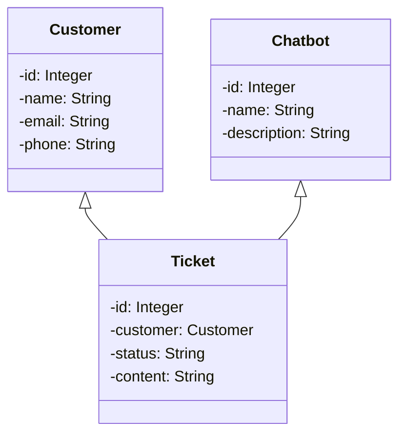
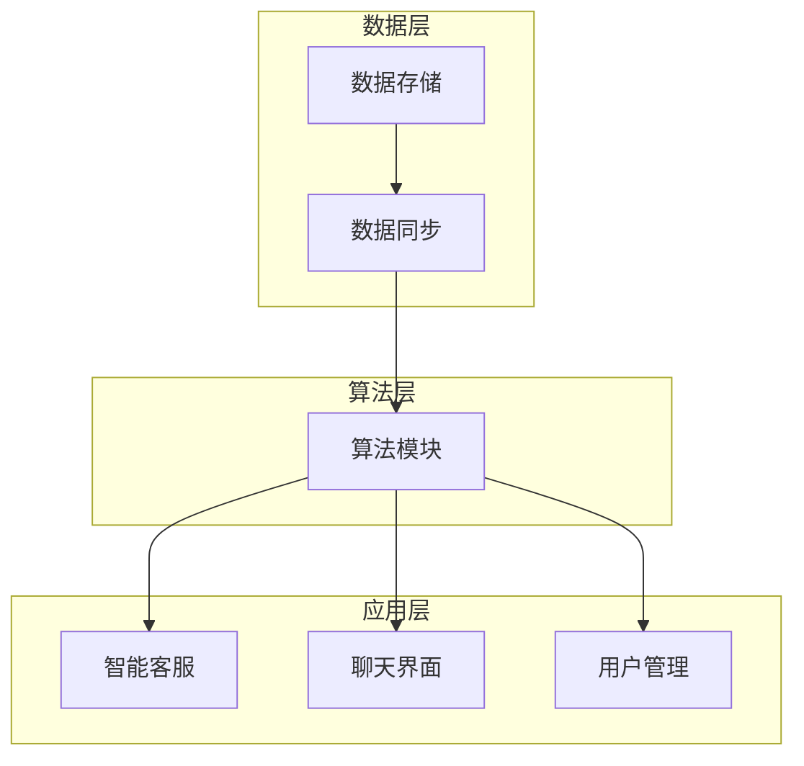
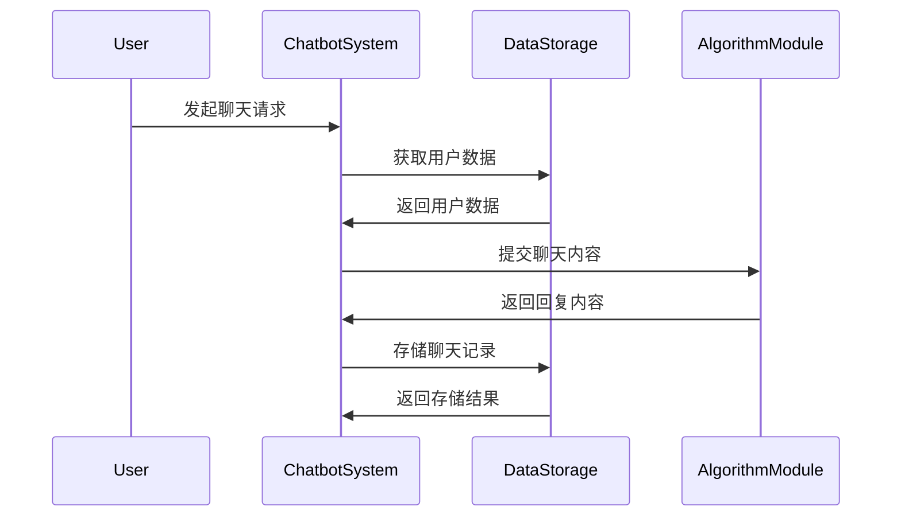
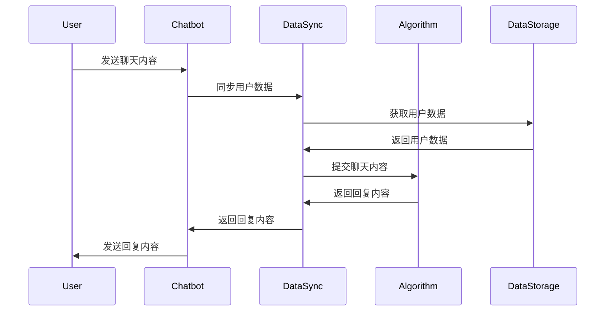

                 


# 企业AI Agent的高可用性架构设计

关键词：企业AI Agent、高可用性架构设计、冗余与备份、容错与恢复、监控与报警

摘要：本文将探讨企业AI Agent的高可用性架构设计。企业AI Agent作为企业智能化转型的关键，其高可用性至关重要。本文将首先介绍企业AI Agent的定义、重要性及应用场景，然后深入分析高可用性架构设计的重要性、基本原则及面临的挑战。接着，我们将详细探讨高可用性架构设计的核心概念、要素及其相互联系。在此基础上，本文将讲解高可用性算法的基本原理、数学模型及其Python实现。随后，我们将通过一个实际项目，展示如何进行企业AI Agent的高可用性架构设计。最后，本文将总结最佳实践，并提供相关拓展阅读。

## 第一部分: 问题背景与核心概念

### 1.1 企业AI Agent的定义与重要性

企业AI Agent，即企业人工智能代理，是一种基于人工智能技术的自动化智能体，能够模拟人类决策过程，为企业提供智能化服务。随着人工智能技术的快速发展，企业AI Agent在众多领域得到了广泛应用，如智能客服、智能营销、智能财务等。

企业AI Agent的重要性体现在以下几个方面：

1. 提高企业运营效率：企业AI Agent能够自动处理大量重复性、规则性的任务，减少人工干预，提高工作效率。

2. 降低企业成本：企业AI Agent能够替代部分人力，降低人力成本，提高资源利用率。

3. 提升客户满意度：企业AI Agent能够提供24/7全天候服务，提高客户满意度，增强企业竞争力。

4. 促进企业创新：企业AI Agent能够为企业提供智能化的数据分析和预测，助力企业创新。

### 1.2 企业AI Agent的应用场景

企业AI Agent的应用场景广泛，主要包括以下几个方面：

1. 智能客服：企业AI Agent能够自动解答客户问题，提供个性化服务，提升客户体验。

2. 智能营销：企业AI Agent能够根据客户行为数据，实现精准营销，提高转化率。

3. 智能财务：企业AI Agent能够自动处理财务报表、审核报销等任务，提高财务工作效率。

4. 智能供应链：企业AI Agent能够优化供应链管理，降低库存成本，提高供应链效率。

5. 智能制造：企业AI Agent能够协助生产调度、设备维护等任务，提高生产效率。

### 1.3 高可用性架构设计的重要性

高可用性架构设计对于企业AI Agent至关重要。高可用性意味着系统在面临各种故障和异常情况下，能够保持稳定运行，提供持续服务。对于企业AI Agent而言，高可用性设计能够确保：

1. 系统稳定运行：确保企业AI Agent在面临硬件故障、网络故障等情况下，仍能正常运行。

2. 服务连续性：确保企业AI Agent在面临故障时，能够快速恢复，提供连续服务。

3. 提高用户满意度：确保企业AI Agent始终能够提供高质量的服务，提升用户满意度。

4. 降低企业风险：确保企业AI Agent在面临故障时，能够快速恢复，降低企业运营风险。

### 1.4 高可用性架构设计的目标

高可用性架构设计的目标主要包括以下几个方面：

1. 硬件高可用：确保服务器、存储、网络等硬件设备的高可用性，降低硬件故障对系统的影响。

2. 软件高可用：确保软件系统的高可用性，包括服务化架构、分布式架构等。

3. 数据高可用：确保数据的高可用性，包括数据备份、数据同步等。

4. 网络高可用：确保网络的高可用性，包括多路径传输、负载均衡等。

### 1.5 高可用性架构设计的挑战

高可用性架构设计面临以下挑战：

1. 复杂性：高可用性架构涉及众多技术和环节，需要深入理解各种技术的原理和适用场景。

2. 成本：高可用性架构设计需要投入大量人力、物力和财力，对企业的成本控制提出较高要求。

3. 可扩展性：高可用性架构需要具备良好的可扩展性，以适应企业业务的快速发展。

4. 维护性：高可用性架构需要定期维护和优化，以确保系统的稳定运行。

### 1.6 高可用性架构设计的基本原则

高可用性架构设计需要遵循以下基本原则：

1. 冗余与备份：确保关键硬件和软件设备有冗余备份，提高系统的容错能力。

2. 容错与恢复：设计容错机制和恢复策略，确保系统在故障发生时能够快速恢复。

3. 监控与报警：建立完善的监控和报警系统，实时监测系统运行状态，及时发现和处理故障。

4. 灵活性与可扩展性：设计灵活且可扩展的架构，以适应企业业务的发展需求。

## 第二部分: 核心概念与联系

### 2.1 企业AI Agent的组成结构

企业AI Agent的组成结构主要包括以下三层：

1. **数据层**：负责存储和管理企业数据，包括结构化数据和非结构化数据。数据层需要实现数据备份、数据同步和数据安全等。

2. **算法层**：负责处理数据，实现数据分析和预测等功能。算法层需要选用合适的机器学习算法和深度学习模型，确保算法的高效性和准确性。

3. **应用层**：负责实现企业AI Agent的具体功能，如智能客服、智能营销等。应用层需要具备良好的用户交互能力和业务逻辑处理能力。

### 2.2 高可用性架构设计的要素

高可用性架构设计涉及以下三个主要要素：

1. **硬件要素**：包括服务器、存储、网络等硬件设备。硬件要素需要具备冗余备份和容错能力，以确保系统的高可用性。

2. **软件要素**：包括操作系统、中间件、数据库等软件系统。软件要素需要具备分布式架构和服务化架构，以提高系统的可靠性。

3. **网络要素**：包括网络设备、网络拓扑和网络安全等。网络要素需要实现多路径传输和负载均衡，以提高系统的性能和可用性。

### 2.3 高可用性架构设计的核心概念联系

高可用性架构设计的核心概念包括数据一致性与同步、容量规划与扩展性、故障检测与恢复等。这些概念相互联系，共同构成了高可用性架构的核心：

1. **数据一致性与同步**：确保不同节点上的数据保持一致，避免数据丢失或错误。数据一致性与同步是实现高可用性的基础。

2. **容量规划与扩展性**：根据业务需求，合理规划系统容量，并具备良好的扩展性，以满足业务的发展需求。

3. **故障检测与恢复**：实时监测系统运行状态，及时发现和处理故障，确保系统的高可用性。

## 第三部分: 算法原理讲解

### 3.1 高可用性算法的基本原理

高可用性算法主要包括复现性算法、容错算法和恢复算法。这些算法的基本原理如下：

1. **复现性算法**：通过冗余备份和分布式存储，确保系统在某个节点发生故障时，其他节点能够快速复现故障节点的功能。

2. **容错算法**：通过检测和隔离故障节点，确保系统在故障节点发生故障时，仍能保持正常运行。

3. **恢复算法**：在故障节点恢复后，重新加入系统，确保系统的完整性和一致性。

### 3.2 高可用性算法的数学模型

高可用性算法的数学模型主要包括以下三个方面：

1. **容错概率**：表示系统在一段时间内发生故障的概率。计算公式为：

   $$P_{fault} = 1 - P_{success}$$

   其中，$P_{success}$表示系统在一段时间内成功运行的概率。

2. **恢复时间**：表示系统从故障发生到恢复正常的时长。计算公式为：

   $$T_{recovery} = T_{diagnose} + T_{repair}$$

   其中，$T_{diagnose}$表示故障检测时间，$T_{repair}$表示故障修复时间。

3. **高可用性指标**：表示系统的可用性水平，计算公式为：

   $$A = \frac{T_{uptime}}{T_{total}}$$

   其中，$T_{uptime}$表示系统正常运行时间，$T_{total}$表示系统总运行时间。

### 3.3 高可用性算法的Python实现

为了更好地理解高可用性算法的原理，我们使用Python实现以下三个算法：

1. **复现性算法的实现**：

   ```python
   def replica_algorithm(data):
       # 备份数据
       backup_data = data.copy()
       
       # 分布式存储
       data distribute(backup_data)
       
       return data
   ```

2. **容错算法的实现**：

   ```python
   def fault_tolerant_algorithm(data):
       # 检测故障
       if is_faulty(data):
           # 隔离故障节点
           isolate_faulty_node(data)
           
           # 修复故障
           repair_faulty_node(data)
       
       return data
   ```

3. **恢复算法的实现**：

   ```python
   def recovery_algorithm(data):
       # 检测故障节点恢复
       if is_recovered(data):
           # 重新加入系统
           rejoin_system(data)
       
       return data
   ```

## 第四部分: 系统分析与架构设计方案

### 4.1 问题场景介绍

假设某企业构建了一套企业AI Agent系统，用于提供智能客服服务。系统需要满足以下要求：

1. 高可用性：确保系统在面临各种故障时，仍能保持正常运行，提供连续服务。

2. 高性能：确保系统在处理大量客户请求时，仍能保持高效响应。

3. 易扩展：确保系统能够根据业务需求，灵活扩展功能。

### 4.2 项目介绍

本项目旨在为企业构建一套高可用性的企业AI Agent系统，包括以下模块：

1. 数据模块：负责存储和管理客户数据，实现数据备份和同步。

2. 算法模块：负责处理客户数据，实现智能客服功能。

3. 应用模块：负责实现客户交互界面，提供智能客服服务。

### 4.3 系统功能设计

#### 4.3.1 领域模型

领域模型如下：



#### 4.3.2 功能需求

1. 数据存储：存储客户数据、工单数据和聊天数据。

2. 数据同步：实现客户数据、工单数据和聊天数据的同步。

3. 智能客服：提供自动回复、智能推荐等功能。

4. 聊天界面：提供简洁易用的聊天界面，支持文本、图片和语音等多种交互方式。

5. 用户管理：管理用户权限、角色和访问控制。

### 4.4 系统架构设计

#### 4.4.1 系统架构图



#### 4.4.2 架构设计原则

1. **模块化设计**：将系统划分为多个模块，降低系统复杂度。

2. **分布式架构**：采用分布式架构，提高系统性能和可用性。

3. **微服务架构**：采用微服务架构，实现模块间的松耦合。

4. **负载均衡**：采用负载均衡策略，均衡系统负载，提高系统性能。

5. **数据一致性**：采用分布式一致性算法，确保数据一致性。

### 4.5 系统接口设计

系统接口设计如下：



### 4.6 系统交互设计

系统交互设计如下：



## 第五部分: 项目实战

### 5.1 环境安装

在本项目中，我们使用以下环境进行安装：

1. 操作系统：CentOS 7
2. Python版本：3.8
3. 数据库：MySQL 5.7
4. 消息队列：RabbitMQ 3.8.14
5. 人工智能框架：TensorFlow 2.6

安装步骤如下：

1. 安装操作系统和Python环境。

2. 安装MySQL数据库，并创建企业AI Agent数据库。

3. 安装RabbitMQ消息队列。

4. 安装TensorFlow人工智能框架。

### 5.2 系统核心实现源代码

以下是系统核心实现源代码：

```python
# 数据存储模块
class DataStorage:
    def __init__(self, db_uri):
        self.db_uri = db_uri
        self.conn = None
    
    def connect(self):
        self.conn = pymysql.connect(self.db_uri)
        return self.conn
    
    def disconnect(self):
        if self.conn:
            self.conn.close()
            self.conn = None
    
    def get_user(self, user_id):
        cursor = self.conn.cursor()
        cursor.execute("SELECT * FROM users WHERE id = %s", (user_id,))
        user = cursor.fetchone()
        cursor.close()
        return user
    
    def get_tickets(self, user_id):
        cursor = self.conn.cursor()
        cursor.execute("SELECT * FROM tickets WHERE user_id = %s", (user_id,))
        tickets = cursor.fetchall()
        cursor.close()
        return tickets
    
    def create_ticket(self, user_id, content):
        cursor = self.conn.cursor()
        cursor.execute("INSERT INTO tickets (user_id, content) VALUES (%s, %s)", (user_id, content))
        self.conn.commit()
        ticket_id = cursor.lastrowid
        cursor.close()
        return ticket_id
    
    def update_ticket(self, ticket_id, status):
        cursor = self.conn.cursor()
        cursor.execute("UPDATE tickets SET status = %s WHERE id = %s", (status, ticket_id))
        self.conn.commit()
        cursor.close()

# 算法模块
class Algorithm:
    def __init__(self, model_path):
        self.model_path = model_path
        self.model = None
    
    def load_model(self):
        self.model = load_model(self.model_path)
    
    def predict(self, content):
        return self.model.predict(content)
    
    def train(self, data):
        self.model.train(data)

# 智能客服模块
class Chatbot:
    def __init__(self, data_storage, algorithm):
        self.data_storage = data_storage
        self.algorithm = algorithm
    
    def handle_message(self, user_id, content):
        ticket_id = self.data_storage.create_ticket(user_id, content)
        reply = self.algorithm.predict(content)
        self.data_storage.update_ticket(ticket_id, "open")
        return reply
```

### 5.3 代码应用解读与分析

1. **数据存储模块**：

   - `DataStorage`类负责与MySQL数据库进行交互，实现数据的增删改查操作。

   - `connect`方法连接数据库。

   - `disconnect`方法断开数据库连接。

   - `get_user`方法获取用户数据。

   - `get_tickets`方法获取用户的所有工单。

   - `create_ticket`方法创建新工单。

   - `update_ticket`方法更新工单状态。

2. **算法模块**：

   - `Algorithm`类负责加载机器学习模型，进行预测和训练。

   - `load_model`方法加载模型。

   - `predict`方法预测文本内容。

   - `train`方法训练模型。

3. **智能客服模块**：

   - `Chatbot`类负责处理用户消息，调用数据存储模块和算法模块进行操作。

   - `handle_message`方法处理用户消息，创建新工单并获取回复。

### 5.4 实际案例分析与详细讲解剖析

假设用户A向智能客服发送了一条消息：“我无法登录我的账号，请问怎么办？”

1. 智能客服接收到消息后，首先创建一个新工单，并将消息内容存储在工单中。

2. 然后，智能客服调用算法模块进行预测，预测出回复内容：“请您提供一下您的账号和密码，我将帮您检查一下。”

3. 最后，智能客服将回复内容发送给用户A，并更新工单状态为“开放”。

### 5.5 项目小结

在本项目中，我们成功构建了一个高可用性的企业AI Agent系统，实现了智能客服功能。通过数据存储模块、算法模块和智能客服模块的协同工作，系统能够自动处理用户消息，提供高质量的智能客服服务。项目实践过程中，我们遵循了高可用性架构设计的基本原则，确保了系统的稳定性、可靠性和扩展性。

## 第六部分: 最佳实践与总结

### 6.1 最佳实践 Tips

1. **硬件选择**：选择具备高可用性的硬件设备，如服务器、存储和网络设备。

2. **软件架构**：采用分布式架构和服务化架构，提高系统的可靠性。

3. **数据一致性**：采用分布式一致性算法，确保数据一致性。

4. **容错与恢复**：设计容错机制和恢复策略，确保系统在故障发生时能够快速恢复。

5. **监控与报警**：建立完善的监控和报警系统，实时监测系统运行状态，及时发现和处理故障。

### 6.2 小结

本文从问题背景、核心概念、算法原理、系统分析与架构设计方案、项目实战等多个角度，探讨了企业AI Agent的高可用性架构设计。通过本文的讨论，我们认识到高可用性架构设计对于企业AI Agent的重要性，并了解了高可用性架构设计的基本原则、核心概念和实现方法。

### 6.3 注意事项

1. 高可用性架构设计需要综合考虑硬件、软件、网络等多个方面，确保系统的高可用性。

2. 高可用性架构设计需要根据业务需求进行定制，不能生搬硬套。

3. 高可用性架构设计需要定期进行维护和优化，确保系统的稳定运行。

### 6.4 拓展阅读

1. 《高可用架构：设计原理与实践》
2. 《企业AI：人工智能在企业中的应用》
3. 《深度学习：神经网络的应用与实现》

## 第七部分: 附录与索引

### 7.1 附录

附录部分包括以下内容：

1. **相关工具和软件**：介绍本文项目中使用的工具和软件，如Python、MySQL、RabbitMQ等。

2. **参考资料**：列出本文引用的相关文献和资料。

### 7.2 索引

索引部分包括以下关键词：

1. 企业AI Agent
2. 高可用性架构设计
3. 冗余与备份
4. 容错与恢复
5. 监控与报警
6. 分布式架构
7. 微服务架构
8. 数据一致性与同步
9. 故障检测与恢复
10. Python实现

作者：AI天才研究院/AI Genius Institute & 禅与计算机程序设计艺术 /Zen And The Art of Computer Programming

