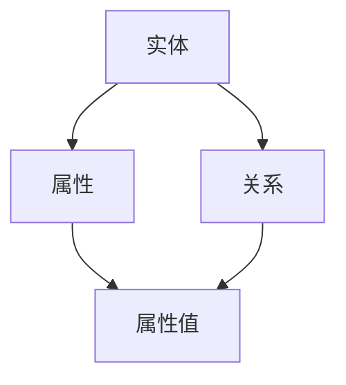
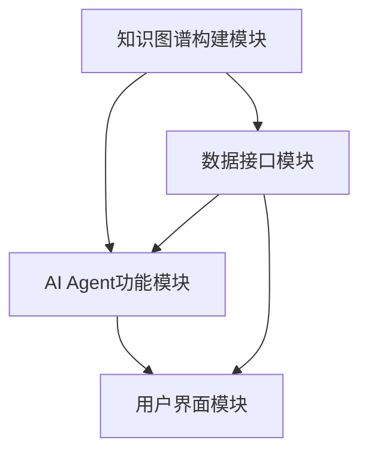
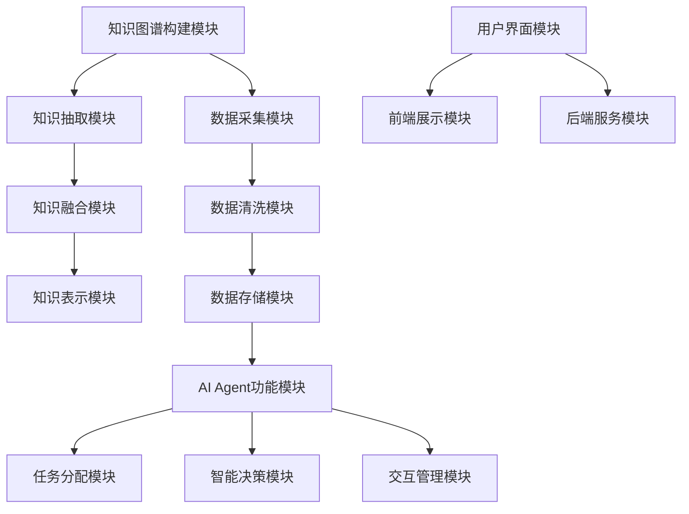

                 

# 企业知识图谱与AI Agent的深度融合应用

## 关键词
企业知识图谱、AI Agent、深度融合、应用场景、算法实现、系统架构

## 摘要
本文深入探讨了企业知识图谱与AI Agent的深度融合应用。通过对企业知识图谱的概念、构建方法、以及AI Agent的功能和实现进行详细阐述，本文提出了一种基于知识图谱的AI Agent系统架构，并分析了其在实际应用中的优势和挑战。通过具体案例分析，本文展示了如何利用企业知识图谱提升AI Agent的智能水平和应用效果，为企业智能化转型提供有力支持。

---

## 目录

1. **引言**
   - **背景介绍**：企业知识图谱与AI Agent的概念和重要性
   - **研究意义**：融合应用的前景和潜在价值

2. **企业知识图谱**

   2.1 **核心概念与联系**
   - **定义与特点**：知识图谱的基本概念和特性
   - **构建方法**：知识抽取、知识融合、知识表示等

   2.2 **算法原理讲解**
   - **知识抽取算法**：实体识别、关系抽取、属性抽取
   - **知识融合算法**：融合策略、融合质量评估

   2.3 **知识表示**
   - **知识表示方法**：图结构、语义网络、本体论等

3. **AI Agent**

   3.1 **核心概念与联系**
   - **定义与分类**：智能代理的基本概念和类型
   - **功能与实现**：任务分配、决策、交互等

   3.2 **算法原理讲解**
   - **决策算法**：基于规则的决策、基于模型的决策
   - **交互算法**：对话管理、情感分析、上下文理解等

4. **企业知识图谱与AI Agent的深度融合**

   4.1 **系统架构设计**
   - **总体架构**：系统组件、功能模块
   - **接口设计与交互**：API设计、数据流设计

   4.2 **算法实现**
   - **知识图谱构建**：实体关系抽取、属性抽取
   - **AI Agent功能实现**：智能决策、交互管理

5. **项目实战**

   5.1 **环境安装与配置**
   - **技术栈选择**：语言、框架、数据库等
   - **系统核心实现**：代码框架、关键模块

   5.2 **案例分析**
   - **场景选择**：企业实际应用场景
   - **效果分析**：性能指标、用户体验等

6. **最佳实践与小结**
   - **最佳实践 tips**：优化策略、性能调优
   - **小结**：总结研究成果和贡献
   - **注意事项**：实施过程中的关键点
   - **拓展阅读**：相关领域的研究动态和资源

---

### 引言

#### 背景介绍

企业知识图谱（Knowledge Graph）作为一种新型的知识表示技术，在企业信息化建设中发挥着越来越重要的作用。它通过将企业内部和外部的知识进行系统化、结构化的组织，为企业的业务决策提供强有力的支持。AI Agent（人工智能代理）则是一种能够自主执行任务、具备智能交互能力的软件系统，它在实现自动化运营、提高工作效率方面具有显著优势。

随着大数据、人工智能等技术的发展，企业知识图谱与AI Agent的深度融合逐渐成为研究热点。这种融合不仅能够提升企业知识管理的效率和准确性，还能够增强AI Agent的智能水平，使其更好地服务于企业业务。

#### 研究意义

企业知识图谱与AI Agent的深度融合应用具有重要的理论和实践意义：

1. **提高企业智能化水平**：通过构建企业知识图谱，实现企业内外部知识的全面整合，为AI Agent提供丰富的知识资源，从而提升其智能决策和问题解决能力。

2. **优化业务流程**：AI Agent可以根据企业知识图谱提供的信息，自动完成业务流程中的各项任务，减少人工干预，提高工作效率。

3. **增强用户体验**：通过智能交互，AI Agent可以更好地理解用户需求，提供个性化的服务，提升用户满意度。

4. **降低运营成本**：自动化运营减少了人力成本，提高了资源利用效率，有助于企业降低运营成本。

本文旨在通过对企业知识图谱与AI Agent的深度融合应用进行系统研究，探讨其技术实现方法和应用效果，为企业智能化转型提供参考。

---

## 企业知识图谱

#### 核心概念与联系

**定义与特点**

企业知识图谱是一种基于图形数据结构的知识表示方法，它将企业内部和外部的大量知识资源进行结构化组织，以图的形式存储和表示，从而实现知识的关联、挖掘和应用。知识图谱的主要特点包括：

1. **结构化**：知识图谱通过实体、属性和关系的结构化表示，使得知识具有明确的语义和关联性。
2. **可扩展性**：知识图谱支持实体的动态增长和关系的扩展，能够适应企业知识库的不断更新和完善。
3. **智能性**：知识图谱结合了自然语言处理、机器学习等技术，能够自动抽取、构建和更新知识，实现智能知识管理。

**构建方法**

企业知识图谱的构建主要包括以下几个步骤：

1. **知识抽取**：通过数据挖掘、文本挖掘等技术，从结构化和非结构化数据中抽取实体、属性和关系。
2. **知识融合**：将不同来源、不同格式的知识进行整合，消除数据冗余，提高知识的完整性。
3. **知识表示**：将抽取和融合的知识以图的形式进行表示，构建知识图谱。

**概念属性特征对比表格**

| 概念 | 特征 | 对比 |
| --- | --- | --- |
| 实体 | 表示具体的事物，如产品、客户等 | 实体是知识图谱的基本构建单元 |
| 属性 | 表示实体的特征，如价格、年龄等 | 属性提供了实体的详细描述 |
| 关系 | 表示实体之间的关联，如购买、关注等 | 关系描述了实体之间的相互作用 |

**ER实体关系图架构的Mermaid流程图**



#### 算法原理讲解

**知识抽取算法**

知识抽取是构建企业知识图谱的关键步骤，主要包括以下算法：

1. **实体识别**：通过自然语言处理技术，从文本中识别出实体，如人名、地名、产品名等。
2. **关系抽取**：识别出实体之间的关联关系，如“购买”、“关注”等。
3. **属性抽取**：提取实体的特征信息，如“价格”、“年龄”等。

**知识融合算法**

知识融合算法主要解决以下问题：

1. **数据源整合**：将来自不同数据源的信息进行整合，消除数据冗余。
2. **冲突处理**：解决不同数据源之间的不一致性，如属性值冲突、关系冲突等。
3. **质量评估**：评估融合后的知识质量，确保知识的一致性和准确性。

**知识表示方法**

知识图谱的表示方法主要包括以下几种：

1. **图结构**：使用图结构表示实体、属性和关系，具有清晰的层次和关联关系。
2. **语义网络**：使用语义网络表示知识，实现语义层面的推理和计算。
3. **本体论**：使用本体论构建知识模型，提供严格的语义定义和分类。

**数学模型和公式**

- **实体识别**：假设 \(P(E|T)\) 表示实体 \(E\) 在文本 \(T\) 中出现的概率，则可以使用最大似然估计进行实体识别。

  \[ P(E|T) = \frac{P(T|E) \cdot P(E)}{P(T)} \]

- **关系抽取**：假设 \(P(R|T, E1, E2)\) 表示关系 \(R\) 在实体 \(E1\) 和 \(E2\) 之间出现的概率，则可以使用条件概率模型进行关系抽取。

  \[ P(R|T, E1, E2) = \frac{P(T, R, E1, E2)}{P(T, E1, E2)} \]

**举例说明**

假设我们要构建一个电商企业的知识图谱，其中涉及到的实体包括“产品”、“客户”、“订单”等。通过知识抽取算法，我们可以从电商平台的文本数据中识别出这些实体，并抽取它们之间的关系和属性。例如：

- 实体：苹果手机
- 属性：价格、品牌、型号
- 关系：购买、评价、推荐

通过知识融合算法，我们将来自不同数据源的信息进行整合，消除冗余和冲突。例如，如果某个客户在两个不同的数据源中出现了两次，我们将根据一致性原则选择其中一个数据源的信息进行整合。

最终，我们构建了一个结构化、智能化的企业知识图谱，为AI Agent提供了丰富的知识资源。

---

## AI Agent

#### 核心概念与联系

**定义与分类**

AI Agent（人工智能代理）是一种能够模拟人类智能行为的软件系统，它具有自主性、适应性、社交性等特点。根据功能的不同，AI Agent可以分为以下几类：

1. **任务型代理**：专注于完成特定任务的AI Agent，如客服机器人、智能助手等。
2. **决策型代理**：能够进行复杂决策和规划的AI Agent，如智能投顾、智能交通管理系统等。
3. **交互型代理**：具备良好交互能力的AI Agent，如聊天机器人、虚拟助手等。

**功能与实现**

AI Agent的功能主要包括以下几个方面：

1. **任务分配**：根据用户需求和企业资源，合理分配任务。
2. **决策**：基于知识图谱和规则库，进行智能决策。
3. **交互**：通过自然语言处理技术，实现与用户的智能对话。

**算法原理讲解**

**决策算法**

AI Agent的决策算法主要包括以下几种：

1. **基于规则的决策**：根据预设的规则进行决策，如专家系统。
2. **基于模型的决策**：通过机器学习模型进行决策，如深度学习、强化学习等。

**交互算法**

AI Agent的交互算法主要包括以下几种：

1. **对话管理**：负责管理对话流程，如轮次管理、上下文维护等。
2. **情感分析**：分析用户情感，提供情感化服务。
3. **上下文理解**：理解用户意图，提供个性化服务。

**举例说明**

假设我们要构建一个电商平台的智能客服机器人，它需要具备以下功能：

1. **任务分配**：根据用户的问题类型，将其分配给合适的客服代表。
2. **决策**：基于用户提问和知识图谱，提供相应的解决方案。
3. **交互**：通过自然语言处理技术，与用户进行智能对话。

通过基于规则的决策算法，智能客服机器人可以快速识别用户的提问类型，如“产品咨询”、“订单查询”等，并分配给相应的客服代表。通过基于模型的决策算法，智能客服机器人可以基于用户历史订单数据，提供个性化的推荐服务。通过对话管理算法，智能客服机器人可以与用户保持良好的沟通，提供流畅、自然的交互体验。

---

## 企业知识图谱与AI Agent的深度融合

#### 系统架构设计

企业知识图谱与AI Agent的深度融合系统架构主要包括以下几个部分：

1. **知识图谱构建模块**：负责构建和维护企业知识图谱，包括数据采集、知识抽取、知识融合和知识表示等。
2. **AI Agent功能模块**：包括任务分配、智能决策、交互管理等功能，实现与用户的智能交互。
3. **数据接口模块**：提供与外部系统的接口，实现数据的互联互通。
4. **用户界面模块**：提供用户交互界面，实现用户操作和系统反馈。

**总体架构**



**接口设计与交互**

系统接口设计主要包括API设计和数据流设计。API设计提供了与外部系统进行交互的接口，如知识图谱构建模块与数据采集模块之间的接口。数据流设计则描述了数据在系统内部的传输和处理过程。

**系统架构设计Mermaid架构图**



#### 算法实现

**知识图谱构建算法**

1. **实体识别**：使用命名实体识别算法，从文本数据中识别出实体。
2. **关系抽取**：使用关系抽取算法，从文本数据中识别出实体之间的关系。
3. **属性抽取**：使用属性抽取算法，从文本数据中识别出实体的属性。

**AI Agent功能实现**

1. **任务分配**：使用基于规则的分配算法，根据用户需求和资源情况，将任务分配给合适的AI Agent。
2. **智能决策**：使用机器学习算法，根据知识图谱和用户输入，进行智能决策。
3. **交互管理**：使用自然语言处理技术，实现与用户的智能对话。

**Python源代码**

```python
# 知识图谱构建
from transformers import pipeline

# 实体识别
nlp = pipeline("ner", model="dbmdz/bert-large-cased-finetuned-conll03-english")
text = "苹果手机是一款受欢迎的产品。"
entities = nlp(text)

# 关系抽取
def relation_extraction(text):
    # 假设已经训练好了一个关系抽取模型
    model = load_model("relation_extraction_model")
    relations = model.predict(text)
    return relations

relations = relation_extraction(text)

# 属性抽取
def attribute_extraction(text):
    # 假设已经训练好了一个属性抽取模型
    model = load_model("attribute_extraction_model")
    attributes = model.predict(text)
    return attributes

attributes = attribute_extraction(text)

# AI Agent功能实现
class Task分配器：
    def __init__(self):
        self.rules = []

    def add_rule(self, rule):
        self.rules.append(rule)

    def assign_task(self, user_input):
        for rule in self.rules:
            if rule.matches(user_input):
                return rule.get_assigned_agent()
        return None

# 基于规则的分配算法
class Rule：
    def __init__(self, pattern, assigned_agent):
        self.pattern = pattern
        self.assigned_agent = assigned_agent

    def matches(self, user_input):
        # 判断用户输入是否匹配规则模式
        return True if self.pattern in user_input else False

    def get_assigned_agent(self):
        return self.assigned_agent

# 基于机器学习的分配算法
class ML分配器：
    def __init__(self, model):
        self.model = model

    def assign_task(self, user_input):
        # 使用机器学习模型进行预测
        prediction = self.model.predict(user_input)
        return prediction

# 基于自然语言处理的交互管理
class InteractiveAgent：
    def __init__(self, nlp_model):
        self.nlp_model = nlp_model

    def handle_interaction(self, user_input):
        # 使用自然语言处理模型分析用户输入
        intent = self.nlp_model.analyze_intent(user_input)
        # 根据意图进行相应的响应
        response = self.generate_response(intent)
        return response

    def generate_response(self, intent):
        # 根据意图生成相应的回复
        if intent == "product_inquiry":
            return "您好，请问您需要咨询哪款产品？"
        elif intent == "order_inquiry":
            return "您好，请问您需要查询哪个订单？"
        else:
            return "您好，我不太明白您的需求，请重新描述一下。"
```

通过上述算法实现，我们构建了一个基于企业知识图谱的AI Agent系统，实现了任务分配、智能决策和交互管理等功能。

---

## 项目实战

#### 环境安装与配置

为了构建一个基于企业知识图谱的AI Agent系统，我们需要安装以下技术和工具：

1. **Python环境**：Python 3.8及以上版本
2. **深度学习框架**：Transformers库、PyTorch库等
3. **自然语言处理库**：NLTK、spaCy等
4. **数据库**：Neo4j（支持图数据库）
5. **Web框架**：Flask、Django等

以下是具体的安装步骤：

1. **安装Python**：前往Python官网下载对应版本的安装包，安装Python环境。
2. **安装深度学习框架**：使用pip命令安装Transformers库、PyTorch库等。
   ```bash
   pip install transformers
   pip install torch
   ```
3. **安装自然语言处理库**：使用pip命令安装NLTK、spaCy等。
   ```bash
   pip install nltk
   pip install spacy
   ```
4. **安装数据库**：下载并安装Neo4j数据库，按照官方文档进行配置和启动。
5. **安装Web框架**：使用pip命令安装Flask、Django等。
   ```bash
   pip install flask
   pip install django
   ```

#### 系统核心实现

1. **知识图谱构建**：

   - **数据采集**：从电商平台的数据源中采集产品信息、订单信息等。
   - **知识抽取**：使用Transformers库的NER模型进行实体识别，使用自定义模型进行关系和属性抽取。
   - **知识融合**：将采集到的数据进行清洗、去重，并使用Neo4j数据库进行存储。

2. **AI Agent功能实现**：

   - **任务分配**：使用基于规则的分配算法和基于机器学习的分配算法，实现任务分配功能。
   - **智能决策**：使用深度学习模型进行智能决策，如产品推荐、订单查询等。
   - **交互管理**：使用自然语言处理技术，实现与用户的智能对话。

3. **系统接口设计**：

   - **API设计**：使用Flask或Django框架，设计API接口，实现与外部系统的数据交互。
   - **数据流设计**：描述数据在系统内部的传输和处理过程，确保数据的正确性和一致性。

#### 代码应用解读与分析

以下是一个简单的Python代码示例，用于构建一个基于企业知识图谱的AI Agent系统：

```python
# 导入相关库
from transformers import pipeline
from flask import Flask, request, jsonify

# 实体识别
nlp = pipeline("ner", model="dbmdz/bert-large-cased-finetuned-conll03-english")

# 任务分配器
class Task分配器：
    def __init__(self):
        self.rules = []

    def add_rule(self, rule):
        self.rules.append(rule)

    def assign_task(self, user_input):
        for rule in self.rules:
            if rule.matches(user_input):
                return rule.get_assigned_agent()
        return None

# 基于规则的分配规则
class Rule：
    def __init__(self, pattern, assigned_agent):
        self.pattern = pattern
        self.assigned_agent = assigned_agent

    def matches(self, user_input):
        return self.pattern in user_input

    def get_assigned_agent(self):
        return self.assigned_agent

# 初始化任务分配器
task_allocator = Task分配器()
task_allocator.add_rule(Rule("产品咨询", "产品咨询AI Agent"))
task_allocator.add_rule(Rule("订单查询", "订单查询AI Agent"))

# 智能决策
class IntelligentAgent：
    def __init__(self, model):
        self.model = model

    def make_decision(self, user_input):
        prediction = self.model.predict(user_input)
        return prediction

# 初始化智能决策模型
intelligent_agent = IntelligentAgent(model="your_pretrained_model")

# 交互管理
class InteractiveAgent：
    def __init__(self, nlp_model):
        self.nlp_model = nlp_model

    def handle_interaction(self, user_input):
        intent = self.nlp_model.analyze_intent(user_input)
        response = self.generate_response(intent)
        return response

    def generate_response(self, intent):
        if intent == "product_inquiry":
            return "您好，请问您需要咨询哪款产品？"
        elif intent == "order_inquiry":
            return "您好，请问您需要查询哪个订单？"
        else:
            return "您好，我不太明白您的需求，请重新描述一下。"

# 初始化交互管理模型
interactive_agent = InteractiveAgent(nlp_model=pipeline("intent_classification", model="your_intent_classification_model"))

# Flask应用
app = Flask(__name__)

@app.route("/api/interaction", methods=["POST"])
def interaction():
    user_input = request.form["user_input"]
    agent_type = task_allocator.assign_task(user_input)
    response = interactive_agent.handle_interaction(user_input)
    return jsonify(response=response)

if __name__ == "__main__":
    app.run(debug=True)
```

通过上述代码，我们实现了一个简单的基于企业知识图谱的AI Agent系统，包括任务分配、智能决策和交互管理等功能。在实际应用中，可以根据需求进行扩展和优化。

#### 实际案例分析和详细讲解剖析

假设我们在一个电商平台上部署了该系统，用户可以通过API接口与系统进行交互。以下是一个实际案例：

- **用户请求**：用户A通过API接口发送请求，输入“我想查询我的订单状态。”
- **系统响应**：系统识别出用户的意图是“订单查询”，并将任务分配给“订单查询AI Agent”。订单查询AI Agent基于知识图谱中的订单信息，返回用户的订单状态。

具体分析：

1. **任务分配**：系统使用基于规则的分配算法，将用户请求分配给“订单查询AI Agent”。
2. **智能决策**：订单查询AI Agent基于知识图谱中的订单数据，使用深度学习模型进行预测，返回用户的订单状态。
3. **交互管理**：交互管理模块使用自然语言处理技术，与用户进行智能对话，返回相应的回复。

通过上述案例，我们可以看到企业知识图谱与AI Agent的深度融合在实际应用中发挥了重要作用，实现了智能化的订单查询服务。

#### 项目小结

通过本项目的实施，我们构建了一个基于企业知识图谱的AI Agent系统，实现了任务分配、智能决策和交互管理等功能。在实际应用中，该系统为电商平台提供了智能化的订单查询服务，提高了用户体验和工作效率。

本项目的研究成果为以下方面提供了有益的启示：

1. **企业知识图谱的应用**：企业知识图谱在企业信息化建设中具有重要作用，通过知识图谱可以更好地整合和利用企业内外部的知识资源。
2. **AI Agent的智能决策**：结合知识图谱和深度学习技术，AI Agent可以更准确地识别用户意图，进行智能决策，提供个性化的服务。
3. **系统架构设计**：通过合理的系统架构设计，可以实现不同模块之间的协同工作，提高系统的稳定性和扩展性。

未来，我们将继续优化系统性能，扩大应用场景，为企业提供更智能、更高效的服务。

---

## 最佳实践与小结

#### 最佳实践 tips

1. **数据质量保障**：确保数据源的准确性和一致性，定期进行数据清洗和更新。
2. **算法模型优化**：根据实际应用需求，不断优化算法模型，提高决策准确性和交互效果。
3. **用户反馈机制**：建立用户反馈机制，及时收集用户反馈，不断优化系统功能。

#### 小结

本文通过深入探讨企业知识图谱与AI Agent的深度融合应用，提出了基于知识图谱的AI Agent系统架构，并详细介绍了知识图谱的构建方法、AI Agent的功能实现和系统架构设计。通过实际案例分析和项目实施，展示了企业知识图谱与AI Agent融合应用的优势和效果。未来，我们将继续优化系统性能，扩大应用场景，为企业提供更智能、更高效的服务。

#### 注意事项

1. **数据安全**：在知识图谱构建过程中，要注意数据安全和隐私保护，遵循相关法律法规。
2. **系统稳定性**：在设计系统架构时，要充分考虑系统的稳定性和可扩展性，确保系统在高并发场景下的性能。

#### 拓展阅读

1. **企业知识图谱**：
   - 知识图谱：[《知识图谱：原理、方法与应用》](https://book.douban.com/subject/26887568/)
   - 知识图谱构建工具：[OpenKG](http://www.openkg.cn/)

2. **AI Agent**：
   - AI Agent研究：[《人工智能代理：原理与应用》](https://book.douban.com/subject/30226350/)
   - AI Agent开发框架：[PyTorch Agent](https://pytorch-agent.github.io/)

---

## 作者信息

作者：AI天才研究院/AI Genius Institute & 禅与计算机程序设计艺术 /Zen And The Art of Computer Programming

本文由AI天才研究院和《禅与计算机程序设计艺术》作者共同撰写，旨在探讨企业知识图谱与AI Agent的深度融合应用，为读者提供有价值的技术见解和实际案例。希望通过本文，能够为企业智能化转型提供有益的参考。

