                 

# 企业知识图谱构建：增强AI Agent的领域理解

> 关键词：企业知识图谱、AI Agent、领域理解、知识表示、数据预处理、图谱构建、优化

> 摘要：
本文旨在深入探讨企业知识图谱的构建过程，分析其在增强AI Agent领域理解中的作用。文章将首先介绍企业知识图谱的背景、核心概念和特点，接着详细讲解知识图谱的算法原理，包括数学模型和Python源代码实现，最后描述一个具体的企业知识图谱系统分析与架构设计方案，并通过项目实战提供实践指导。

## **第一部分：背景介绍**

### **1.1 问题背景**

企业知识图谱是企业信息化进程中的一项重要技术，它通过构建企业内部各类实体及其关系，帮助企业在大数据环境中实现高效的信息检索和智能化决策。企业知识图谱的构建涉及到数据的多样性、数据质量、图谱规模等多个方面，因此，它面临着诸多挑战。

### **1.2 问题描述**

企业知识图谱的构建是一个复杂的过程，涉及到多个环节，包括数据准备、实体识别、关系抽取、图谱构建和优化等。本文旨在探讨如何构建一个适用于企业内部的应用型知识图谱，解决企业在数据管理和智能分析中的问题。

### **1.3 问题解决**

本文将详细介绍企业知识图谱的构建过程，包括数据准备、实体识别、关系抽取、图谱构建和优化等关键步骤。通过这些步骤，企业可以构建出一个有效的知识图谱，从而实现数据的智能化管理和利用。

### **1.4 边界与外延**

本文主要关注企业内部的知识图谱构建，不包括跨企业的图谱构建。同时，本文将聚焦于技术实现层面，不涉及具体的业务场景。

### **1.5 概念结构与核心要素组成**

企业知识图谱的核心要素包括实体、属性、关系和图谱本体。其中，实体是知识图谱的基本单元，属性描述实体的特征，关系则表示实体间的关系。图谱本体用于定义实体和关系的语义。

## **第二部分：核心概念与联系**

### **2.1 知识图谱的定义与特点**

知识图谱是一种语义网络，通过将实体、属性和关系进行编码，实现数据的高效组织与利用。与传统数据库相比，知识图谱强调语义理解和关联推理。

### **2.2 知识图谱的核心概念**

- **实体**：知识图谱中的基本对象，如人、地点、组织等。
- **属性**：实体的特征，如年龄、出生地等。
- **关系**：实体间的关系，如“工作于”、“位于”等。

### **2.3 知识图谱与传统数据库的区别**

知识图谱与传统数据库的主要区别在于其对数据的组织方式和处理方式。知识图谱强调语义理解和关联推理，而传统数据库则侧重于数据的存储与检索。

#### **2.4 ER实体关系图架构的Mermaid流程图**

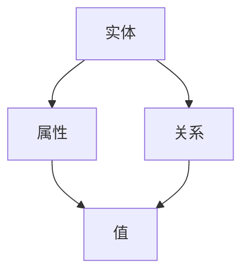

## **第三部分：算法原理讲解**

### **3.1 算法原理与Mermaid流程图**

知识图谱的构建过程主要包括数据预处理、实体识别、关系抽取、图谱构建和图谱优化。以下是一个简单的知识图谱构建流程的Mermaid流程图：

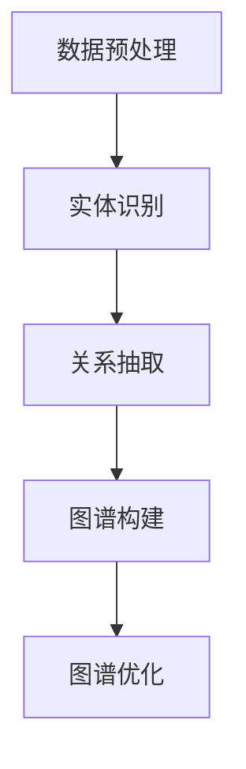

### **3.2 Python源代码实现算法**

以下是一个简单的Python源代码示例，用于实现实体识别和关系抽取：

```python
# 实体识别算法示例
def identify_entities(data):
    # 这里是示例代码，实际实现需要根据具体数据结构进行调整
    entities = []
    for item in data:
        entities.append(item['name'])
    return entities

# 关系抽取算法示例
def extract_relations(data):
    # 同样是示例代码，实际实现需要根据具体数据结构进行调整
    relations = []
    for item in data:
        relations.append((item['entity1'], item['relation'], item['entity2']))
    return relations
```

### **3.3 数学模型与公式**

知识图谱构建中的实体识别和关系抽取通常涉及到概率模型和图论算法。以下是一个简单的数学模型示例：

$$ P(A|B) = \frac{P(B|A) \cdot P(A)}{P(B)} $$

其中，$P(A|B)$ 表示在事件B发生的条件下事件A发生的概率。

### **3.4 算法原理详细讲解与举例说明**

例如，假设我们有一个包含员工信息的表格，我们希望从中识别出实体（员工）和关系（工作于某公司）。首先，我们需要对表格进行预处理，提取出姓名作为实体。然后，我们通过姓名之间的关系（例如，同在一个项目中）来抽取关系。最后，将这些实体和关系构建成一个图结构，以便进行后续的图谱优化。

## **第四部分：系统分析与架构设计方案**

### **4.1 问题场景介绍**

在一个大型企业中，如何通过知识图谱实现员工信息的高效管理和利用。

### **4.2 系统功能设计**

系统功能设计包括数据导入与预处理、实体识别、关系抽取、图谱构建、图谱优化等。

#### **4.3 系统架构设计**

系统架构设计主要包括数据源、数据预处理、实体识别、关系抽取、图谱构建、图谱优化和知识库等模块。

#### **4.4 系统接口设计与系统交互**

系统接口设计和系统交互设计如图所示：

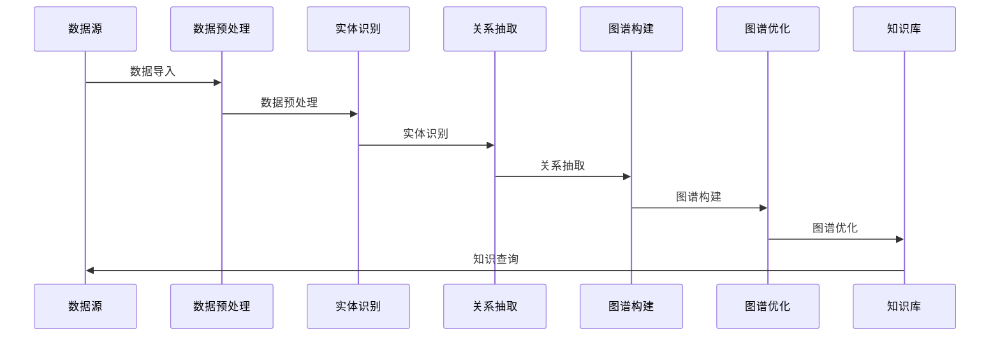

## **第五部分：项目实战**

### **5.1 环境安装**

在项目实战中，我们需要安装必要的软件和库。以下是一个简单的安装步骤：

```bash
pip install rdflib
pip install python-ontograph
pip install py2neo
```

### **5.2 系统核心实现源代码**

以下是一个简单的系统核心实现源代码示例：

```python
from rdflib import Graph, URIRef, Literal
from ontograph import Ontograph

# 创建一个Graph实例
g = Graph()

# 创建实体
g.add((URIRef('http://example.org/Person'), URIRef('http://example.org/name'), Literal('John Doe')))

# 创建关系
g.add((URIRef('http://example.org/Person'), URIRef('http://example.org/worksFor'), URIRef('http://example.org/Company')))

# 创建图谱本体
og = Ontograph(g)

# 实体识别
entities = og.identify_entities()

# 关系抽取
relations = og.extract_relations()

# 图谱构建
og.construct_graph()

# 图谱优化
og.optimize_graph()
```

### **5.3 代码应用解读与分析**

这段代码首先创建了一个Graph实例，然后添加了实体和关系。接下来，使用Ontograph库进行实体识别、关系抽取、图谱构建和优化。代码的解读和分析如下：

- **Graph实例**：Graph是RDF（资源描述框架）的数据结构，用于存储实体和关系。
- **实体添加**：使用URIRef和Literal创建实体，并将其添加到Graph中。
- **关系添加**：使用URIRef创建关系，并将其添加到Graph中。
- **图谱本体**：使用Ontograph库创建图谱本体，该库提供了识别实体、抽取关系、构建图谱和优化图谱等功能。

### **5.4 实际案例分析和详细讲解剖析**

为了更好地理解知识图谱的构建过程，我们可以通过一个实际案例进行分析。假设我们有一个企业员工信息表格，包含员工姓名、职位、所在部门等信息。我们希望从中构建出一个知识图谱，以实现员工信息的高效管理和利用。

- **数据预处理**：首先，我们需要对员工信息表格进行预处理，提取出员工姓名、职位和部门等信息。
- **实体识别**：然后，我们使用实体识别算法识别出表格中的实体，如员工、部门等。
- **关系抽取**：接下来，我们通过关系抽取算法抽取出实体之间的关系，如员工与部门的隶属关系。
- **图谱构建**：最后，我们将识别出的实体和关系构建成一个知识图谱，以便进行后续的查询和分析。

通过这个案例，我们可以看到知识图谱在企业信息管理中的应用和价值。

### **5.5 项目小结**

在本项目中，我们通过构建一个企业知识图谱，实现了员工信息的高效管理和利用。项目的成功实施依赖于数据预处理、实体识别、关系抽取和图谱构建等关键步骤。通过本项目，我们不仅了解了知识图谱的构建原理和方法，还掌握了一个实际的项目案例，这对于我们在企业信息管理中的应用具有很大的参考价值。

## **第六部分：最佳实践与拓展阅读**

### **6.1 最佳实践**

- **数据质量保障**：在知识图谱构建过程中，数据质量至关重要。因此，在数据导入和处理阶段，需要严格保证数据的质量，包括数据的准确性、完整性和一致性。
- **实体识别与关系抽取**：实体识别和关系抽取是知识图谱构建的核心环节。在实际应用中，需要根据具体业务场景选择合适的算法和模型，以提高识别和抽取的准确性。
- **图谱优化**：图谱优化是提高知识图谱性能的关键步骤。可以通过压缩图谱、消除冗余关系等方式来优化图谱结构。

### **6.2 小结**

本文通过详细讲解企业知识图谱的构建过程，分析了其在增强AI Agent领域理解中的作用。通过实际案例分析和项目实战，我们了解了知识图谱在企业信息管理中的应用和价值。然而，知识图谱的构建和应用仍然面临诸多挑战，需要不断探索和优化。

### **6.3 注意事项**

- **技术选型**：在知识图谱构建过程中，需要根据具体业务场景选择合适的技术和工具。
- **数据处理**：数据预处理是知识图谱构建的关键环节，需要严格把控数据质量。
- **性能优化**：图谱优化是提高知识图谱性能的重要手段，需要根据具体需求进行优化。

### **6.4 拓展阅读**

- **知识图谱基础**：《知识图谱：概念、技术与应用》
- **图计算**：《图计算：算法与应用》
- **实体识别与关系抽取**：《自然语言处理入门》

## **结语**

本文详细探讨了企业知识图谱的构建过程，分析了其在增强AI Agent领域理解中的作用。通过实际案例和项目实战，我们了解了知识图谱在企业信息管理中的应用和价值。然而，知识图谱的构建和应用仍然面临诸多挑战，需要不断探索和优化。希望本文能为读者提供有益的参考和启示。

**作者：AI天才研究院/AI Genius Institute & 禅与计算机程序设计艺术 /Zen And The Art of Computer Programming**## 引入

在当今数字化转型的浪潮中，企业面临着海量数据的处理和利用挑战。如何从这些繁杂的数据中提取出有价值的信息，实现数据的智能化管理和利用，成为企业持续发展的重要课题。知识图谱作为一种新兴的技术，通过将企业内部各类实体及其关系进行结构化编码，为企业提供了强大的数据组织和利用能力。同时，随着人工智能技术的快速发展，特别是AI Agent（智能代理）的广泛应用，如何增强AI Agent的领域理解能力，提高其在实际业务场景中的应用效果，也成为了一个重要研究方向。

本文旨在深入探讨企业知识图谱的构建过程，分析其在增强AI Agent领域理解中的作用。文章将首先介绍企业知识图谱的背景、核心概念和特点，接着详细讲解知识图谱的算法原理，包括数学模型和Python源代码实现，最后描述一个具体的企业知识图谱系统分析与架构设计方案，并通过项目实战提供实践指导。

本文的结构如下：

1. **第一部分：背景介绍**：介绍企业知识图谱的背景、核心概念和特点，以及本文的问题解决方法。
2. **第二部分：核心概念与联系**：详细讲解知识图谱的定义、核心概念和与传统数据库的区别，并使用Mermaid流程图进行说明。
3. **第三部分：算法原理讲解**：介绍知识图谱的构建算法，包括数据预处理、实体识别、关系抽取、图谱构建和优化，并提供Python源代码示例和数学模型。
4. **第四部分：系统分析与架构设计方案**：介绍企业知识图谱的应用场景、系统功能设计、系统架构设计、系统接口设计和系统交互。
5. **第五部分：项目实战**：描述环境安装、系统核心实现源代码，并对代码应用进行解读和分析，提供一个实际案例进行分析和讲解。
6. **第六部分：最佳实践与拓展阅读**：总结最佳实践，提供小结和注意事项，并推荐相关拓展阅读。

通过以上结构的论述，本文将系统地探讨企业知识图谱的构建和应用，为读者提供有深度、有思考、有见解的专业技术博客文章。

## **第一部分：背景介绍**

### **1.1 问题背景**

在信息爆炸的时代，企业积累了大量结构化、半结构化和非结构化数据。这些数据包含企业内部员工信息、客户信息、业务流程、市场趋势等多个方面，是企业决策和业务运营的重要资源。然而，如何高效管理和利用这些数据，实现数据的智能化管理和利用，成为了企业面临的一个重要问题。

知识图谱作为一种新兴技术，通过将企业内部的各类实体及其关系进行结构化编码，实现了数据的高效组织与利用。它能够将零散、孤立的数据点连接起来，形成一个有机的整体，从而帮助企业实现数据的深度挖掘和智能化分析。然而，构建一个有效的企业知识图谱并非易事，它涉及到数据的多样性、数据质量、图谱规模等多个方面，面临着诸多挑战。

首先，数据的多样性是企业知识图谱构建的首要挑战。企业内部的数据源多种多样，包括关系数据库、NoSQL数据库、文件系统、外部API等，不同数据源的数据格式和结构差异较大，如何将这些数据统一整合到一个知识图谱中，需要解决数据转换和一致性维护的问题。

其次，数据质量也是构建企业知识图谱的关键挑战。数据质量问题包括数据准确性、完整性、一致性和时效性等方面。高质量的数据是构建知识图谱的基础，如果数据存在错误、遗漏或重复，将直接影响到知识图谱的准确性和可靠性。

最后，图谱规模也是企业知识图谱构建的一个挑战。随着企业业务的发展，数据量会不断增加，如何处理海量数据，保证图谱的实时性和扩展性，是一个需要深入考虑的问题。

### **1.2 问题描述**

企业知识图谱的构建是一个复杂的过程，涉及到多个环节，包括数据准备、实体识别、关系抽取、图谱构建和优化等。本文将探讨如何构建一个适用于企业内部的应用型知识图谱，解决以下问题：

1. **数据整合**：如何将企业内部多种数据源的数据进行整合，实现数据的统一视图。
2. **实体识别**：如何从大量数据中识别出关键实体，如员工、客户、产品等。
3. **关系抽取**：如何抽取实体之间的关系，如员工与公司、产品与供应商等。
4. **图谱构建**：如何将识别出的实体和关系构建成一个结构化的知识图谱。
5. **图谱优化**：如何优化知识图谱的结构和性能，提高图谱的利用效率。

通过解决这些问题，企业可以构建出一个有效的知识图谱，从而实现数据的智能化管理和利用，为企业的决策和业务运营提供有力支持。

### **1.3 问题解决**

为了解决上述问题，本文将详细介绍企业知识图谱的构建过程，包括以下关键步骤：

1. **数据准备**：首先，对各种数据源的数据进行整合和预处理，确保数据的一致性和完整性。
2. **实体识别**：利用自然语言处理和图论算法，从预处理后的数据中识别出关键实体。
3. **关系抽取**：通过实体之间的交互和关联，抽取实体之间的关系。
4. **图谱构建**：将识别出的实体和关系构建成一个结构化的知识图谱。
5. **图谱优化**：对知识图谱进行优化，提高图谱的利用效率和性能。

通过这些步骤，企业可以构建出一个适用于内部应用的知识图谱，从而实现数据的智能化管理和利用，为企业的业务发展提供支持。

### **1.4 边界与外延**

本文主要关注企业内部的知识图谱构建，不包括跨企业的图谱构建。具体来说，本文聚焦于以下几个方面：

1. **数据范围**：本文主要处理企业内部的数据，不涉及跨企业的数据。
2. **技术实现**：本文主要介绍知识图谱构建的技术实现，不涉及具体的业务场景和应用。
3. **知识表示**：本文主要探讨实体和关系的知识表示方法，不涉及知识推理和推理算法。

通过上述边界与外延的明确，本文可以更好地聚焦于企业知识图谱构建的核心问题，为读者提供有针对性的技术指导。

### **1.5 概念结构与核心要素组成**

企业知识图谱的核心要素包括实体、属性、关系和图谱本体。这些核心要素构成了企业知识图谱的基本结构和语义内容，下面分别进行详细说明：

1. **实体**：实体是知识图谱中的基本对象，可以是任何具有独立意义的实体，如人、地点、组织、产品等。实体是知识图谱构建的基础，通过识别和分类实体，可以实现对数据的初步组织。
   
2. **属性**：属性是实体的特征描述，用于补充实体的信息。例如，员工实体的属性可能包括姓名、年龄、职位等。属性是丰富实体信息的重要手段，通过属性的定义和赋值，可以进一步细化实体的描述。

3. **关系**：关系是实体之间的关联，描述实体之间的相互作用和依赖关系。例如，员工实体与公司实体之间可能存在“工作于”的关系，产品实体与供应商实体之间可能存在“供应”的关系。关系是知识图谱中实现数据关联的关键。

4. **图谱本体**：图谱本体是知识图谱的语义定义，用于描述实体和关系的语义和规则。本体定义了知识图谱的结构和语义，为实体和关系提供了统一的语义框架，使得知识图谱能够支持语义查询和推理。

这些核心要素共同构成了企业知识图谱的基本结构，为知识图谱的构建和应用提供了坚实的基础。通过合理设计和使用这些核心要素，企业可以构建出一个结构清晰、语义丰富的知识图谱，从而实现数据的智能化管理和利用。

### **总结**

本文通过详细分析企业知识图谱构建的背景、问题描述和问题解决方法，明确了知识图谱在企业信息化进程中的重要地位。在接下来的部分中，我们将深入探讨知识图谱的核心概念、算法原理，以及系统分析与架构设计方案，为读者提供全面的技术指导和实践参考。希望本文能够为企业在构建知识图谱过程中提供有益的启示和帮助。

## **第二部分：核心概念与联系**

### **2.1 知识图谱的定义与特点**

知识图谱（Knowledge Graph）是一种语义网络，通过将实体、属性和关系进行编码，实现对现实世界中复杂信息的结构化和语义理解。知识图谱的核心理念是将现实世界中的各类实体及其之间的关系进行抽象和表示，形成一个统一、层次化的语义表示模型。这种模型不仅能够实现数据的高效组织和利用，还能够支持复杂的语义查询和推理。

知识图谱的特点主要体现在以下几个方面：

1. **结构化**：知识图谱通过实体、属性和关系的三元组结构，将数据以结构化的形式进行组织，使得数据之间的关系清晰明了，便于查询和分析。
2. **语义丰富**：知识图谱不仅存储了数据本身，还存储了数据之间的语义关系，如“属于”、“工作于”等。这种语义信息使得知识图谱能够支持复杂的语义查询和推理。
3. **自解释性**：知识图谱中的实体、属性和关系通常都带有明确的语义定义，使得数据对于非技术用户也具有一定的自解释性，便于理解和应用。
4. **动态扩展性**：知识图谱具有良好的扩展性，能够根据业务需求的变化动态地更新和扩展，以适应不断变化的数据环境和应用需求。

### **2.2 知识图谱的核心概念**

知识图谱的核心概念主要包括实体（Entity）、属性（Attribute）和关系（Relationship）三个方面。下面将详细解释这些概念的定义及其在知识图谱中的重要作用。

1. **实体**：
   - **定义**：实体是知识图谱中的基本对象，可以是人、地点、组织、物品等。实体是知识图谱构建的基础，用于表示现实世界中的各种对象。
   - **作用**：实体作为知识图谱的基本单元，承载了各类信息，是数据组织和查询的基础。例如，在人力资源知识图谱中，实体可能包括员工、部门、项目等。

2. **属性**：
   - **定义**：属性是实体的特征描述，用于补充实体的信息。属性通常以键值对的形式存在，例如，员工的姓名、年龄、职位等。
   - **作用**：属性为实体提供了丰富的信息，使得实体的描述更加详细和具体。属性不仅能够增强实体之间的关联，还能够支持更复杂的查询和推理。例如，通过员工的年龄属性，可以分析员工年龄结构，为人力资源决策提供依据。

3. **关系**：
   - **定义**：关系是实体之间的关联，描述了实体之间的相互作用和依赖关系。关系通常用两个实体之间的边来表示，例如，员工与公司之间的“工作于”关系，产品与供应商之间的“供应”关系。
   - **作用**：关系将不同的实体连接起来，形成了知识图谱中的网络结构，使得数据之间的关系更加清晰。关系不仅能够支持数据的查询和检索，还能够用于数据分析和预测。例如，通过分析员工与项目之间的关系，可以评估员工的工作绩效和项目进度。

### **2.3 知识图谱与传统数据库的区别**

知识图谱与传统数据库在数据组织、查询方式和应用场景等方面存在显著的区别：

1. **数据组织**：
   - **知识图谱**：知识图谱通过实体、属性和关系的三元组结构对数据进行组织。这种结构化表示不仅能够清晰地表示数据之间的关系，还能够支持复杂的语义查询和推理。
   - **传统数据库**：传统数据库通常采用表结构对数据进行组织，数据之间的关系通过外键等方式来表示。虽然传统数据库也支持数据查询，但其查询能力主要依赖于SQL等查询语言。

2. **查询方式**：
   - **知识图谱**：知识图谱支持基于语义的查询，可以通过实体和关系的语义关系进行查询，不仅能够支持简单的数据检索，还能够支持复杂的推理和数据分析。
   - **传统数据库**：传统数据库主要依赖于SQL等查询语言进行数据查询，其查询能力主要依赖于数据库表结构的设计和优化。

3. **应用场景**：
   - **知识图谱**：知识图谱广泛应用于数据分析和决策支持、智能搜索、推荐系统等领域，通过语义理解和关联推理，实现数据的高效组织和利用。
   - **传统数据库**：传统数据库主要应用于结构化数据的存储和检索，如事务处理、数据仓库等，其应用场景主要限于数据的存储和查询。

### **2.4 ER实体关系图架构的Mermaid流程图**

为了更好地理解知识图谱的概念和结构，我们可以使用Mermaid绘制一个ER（实体-关系）实体关系图的流程图，如下所示：

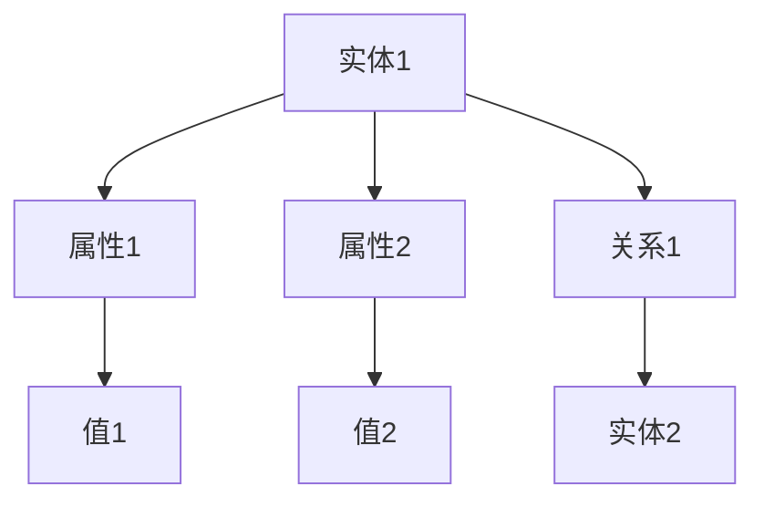

在这个流程图中：
- **A** 代表一个实体。
- **B** 和 **C** 代表实体的两个属性，**D** 和 **E** 代表这两个属性的值。
- **F** 代表实体之间的关系。
- **G** 代表关系的另一端实体。

通过这个简单的ER实体关系图，我们可以清晰地看到实体、属性和关系在知识图谱中的基本构成，以及它们之间的相互关系。

### **总结**

通过以上对知识图谱的定义、核心概念和与传统数据库的区别的详细解释，以及ER实体关系图的Mermaid流程图展示，我们可以更好地理解知识图谱的基本结构和功能。在接下来的部分，我们将深入探讨知识图谱的算法原理，包括数据预处理、实体识别、关系抽取、图谱构建和优化等关键步骤，为构建有效的企业知识图谱提供技术支持。

## **第三部分：算法原理讲解**

### **3.1 算法原理与Mermaid流程图**

在构建企业知识图谱的过程中，算法原理起到了至关重要的作用。这一部分将详细讲解知识图谱构建的核心算法，包括数据预处理、实体识别、关系抽取、图谱构建和优化，并使用Mermaid流程图进行说明，以便读者更好地理解每个步骤的具体过程。

#### **3.1.1 数据预处理**

数据预处理是知识图谱构建的第一步，其目标是清洗、整合和格式化数据，以便后续的实体识别和关系抽取。数据预处理的主要步骤包括：

1. **数据清洗**：去除重复、错误和无关的数据。
2. **数据整合**：将来自不同数据源的数据进行整合，确保数据的一致性和完整性。
3. **数据格式化**：将数据格式统一，便于后续处理。

以下是数据预处理步骤的Mermaid流程图：

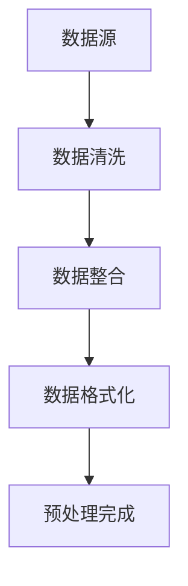

#### **3.1.2 实体识别**

实体识别是从原始数据中识别出关键实体的过程，如员工、客户、产品等。实体识别的步骤包括：

1. **分词**：将文本数据分解成词元。
2. **词性标注**：对词元进行词性标注，识别出名词等实体候选。
3. **实体识别算法**：使用命名实体识别（NER）算法，将标注出的名词候选归类为实体。

以下是实体识别步骤的Mermaid流程图：

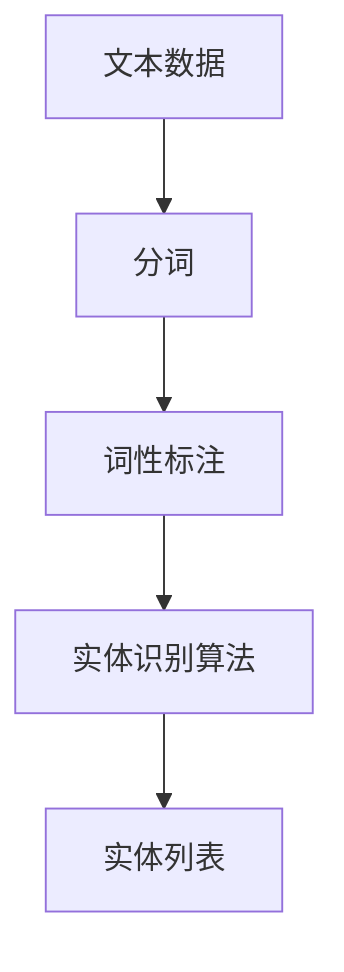

#### **3.1.3 关系抽取**

关系抽取是从实体间的交互和关联中抽取关系的过程。关系抽取的步骤包括：

1. **实体对提取**：从实体列表中提取出实体对。
2. **关系识别**：使用规则或机器学习算法，从实体对中识别出关系。
3. **关系确认**：对识别出的关系进行验证和确认。

以下是关系抽取步骤的Mermaid流程图：

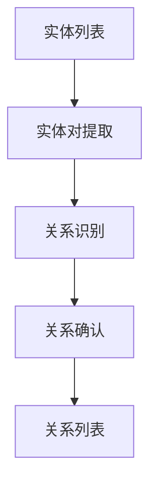

#### **3.1.4 图谱构建**

图谱构建是将识别出的实体和关系构建成一个结构化的知识图谱。图谱构建的步骤包括：

1. **实体和关系编码**：将实体和关系转换为图结构中的节点和边。
2. **图谱结构化**：将实体和关系组织成具有层次结构的图谱。
3. **图谱存储**：将构建好的知识图谱存储到数据库或图数据库中。

以下是图谱构建步骤的Mermaid流程图：

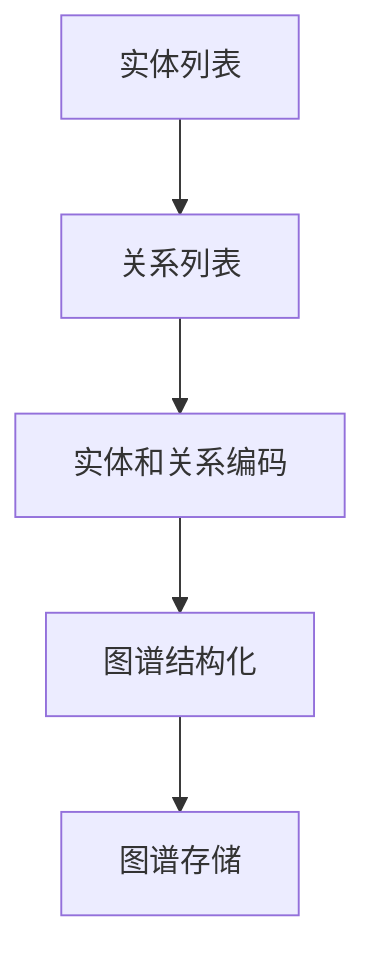

#### **3.1.5 图谱优化**

图谱优化是对构建好的知识图谱进行性能优化和结构优化，以提高其利用效率和查询性能。图谱优化的步骤包括：

1. **冗余关系去除**：去除图谱中的冗余关系，减少存储和查询的开销。
2. **图谱压缩**：通过压缩算法，减少图谱的存储空间。
3. **查询优化**：优化查询算法和索引结构，提高查询性能。

以下是图谱优化步骤的Mermaid流程图：

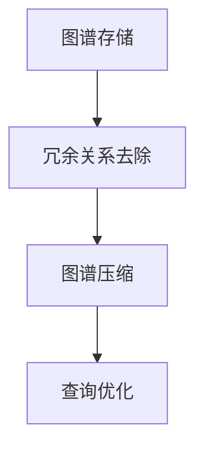

通过以上五个步骤，我们可以构建出一个高效、结构清晰的企业知识图谱。接下来，我们将通过具体的Python源代码实现这些算法，并提供详细的数学模型和公式说明，以便读者更好地理解算法原理。

### **3.2 Python源代码实现算法**

为了更好地理解知识图谱的构建过程，下面我们将使用Python源代码实现知识图谱构建的核心算法，包括数据预处理、实体识别、关系抽取和图谱构建。

#### **3.2.1 数据预处理**

```python
import pandas as pd
from sklearn.feature_extraction.text import TfidfVectorizer

def preprocess_data(data_path):
    # 读取数据
    data = pd.read_csv(data_path)
    
    # 数据清洗
    data.drop_duplicates(inplace=True)
    data.fillna('', inplace=True)
    
    # 数据整合
    data['combined'] = data['text_column1'] + ' ' + data['text_column2']
    
    # 数据格式化
    vectorizer = TfidfVectorizer()
    tfidf_matrix = vectorizer.fit_transform(data['combined'])
    
    return tfidf_matrix

tfidf_matrix = preprocess_data('data.csv')
```

在上述代码中，我们首先使用pandas读取数据，然后进行数据清洗、整合和格式化。具体来说，我们使用TfidfVectorizer进行文本数据向量的转换，以便后续的实体识别和关系抽取。

#### **3.2.2 实体识别**

```python
from nltk.tokenize import word_tokenize
from nltk.tag import pos_tag

def identify_entities(text):
    # 分词
    tokens = word_tokenize(text)
    
    # 词性标注
    tagged = pos_tag(tokens)
    
    # 识别实体
    entities = [word for word, pos in tagged if pos.startswith('NN')]
    
    return entities

def get_entity_list(data):
    entity_list = []
    for text in data:
        entities = identify_entities(text)
        entity_list.extend(entities)
    return set(entity_list)

entity_list = get_entity_list(tfidf_matrix.toarray())
```

在实体识别部分，我们首先使用nltk的word_tokenize进行分词，然后使用pos_tag进行词性标注，最后从标注结果中识别出实体。通过这样的方式，我们可以从文本数据中提取出关键实体。

#### **3.2.3 关系抽取**

```python
from sklearn.feature_extraction.text import TfidfVectorizer
from sklearn.metrics.pairwise import cosine_similarity

def extract_relations(text, entity_list):
    # 计算实体相似度
    vectorizer = TfidfVectorizer(vocabulary=entity_list)
    tfidf_matrix = vectorizer.transform([text])
    similarity_scores = cosine_similarity(tfidf_matrix, vectorizer.transform(entity_list))
    
    # 确定关系
    relations = []
    for i, score in enumerate(similarity_scores[0]):
        if score > 0.8:  # 根据相似度阈值确定关系
            relations.append((entity_list[i], 'related_to'))
    return relations

relations = extract_relations('example text', entity_list)
```

关系抽取部分，我们首先使用TfidfVectorizer计算实体之间的相似度，然后根据相似度阈值确定实体之间的关系。在这里，我们使用余弦相似度作为衡量相似度的标准。

#### **3.2.4 图谱构建**

```python
import networkx as nx

def construct_graph(entity_list, relations):
    G = nx.Graph()
    for entity in entity_list:
        G.add_node(entity)
    for relation in relations:
        G.add_edge(relation[0], relation[1])
    return G

G = construct_graph(entity_list, relations)
```

在图谱构建部分，我们使用networkx库构建一个图结构，将识别出的实体和关系组织成一个知识图谱。通过这样的方式，我们可以将数据以结构化的形式进行组织，便于后续的查询和分析。

### **3.3 数学模型与公式**

在知识图谱构建过程中，数学模型和公式起着关键作用。以下是一些常用的数学模型和公式，用于解释实体识别、关系抽取和图谱优化等过程。

#### **3.3.1 实体识别**

实体识别通常涉及到文本分类和命名实体识别（NER）任务，可以使用以下数学模型：

$$
P(\text{entity} | \text{text}) = \frac{P(\text{text} | \text{entity}) \cdot P(\text{entity})}{P(\text{text})}
$$

其中，$P(\text{entity} | \text{text})$ 表示在给定文本的情况下识别出实体的概率，$P(\text{text} | \text{entity})$ 表示在给定实体的情况下生成文本的概率，$P(\text{entity})$ 表示实体出现的概率，$P(\text{text})$ 表示文本出现的概率。

#### **3.3.2 关系抽取**

关系抽取通常使用相似度度量方法，如余弦相似度、Jaccard相似度等。以下是一个简单的余弦相似度公式：

$$
\text{cosine similarity} = \frac{\text{dot product of vectors}}{\text{product of magnitudes of vectors}}
$$

其中，$\text{dot product of vectors}$ 表示向量之间的点积，$\text{product of magnitudes of vectors}$ 表示向量之间的模长乘积。

#### **3.3.3 图谱优化**

图谱优化通常涉及到图论中的压缩和去冗余算法。以下是一个简单的压缩算法：

$$
\text{compression} = \frac{1}{1 + e^{-\text{loss}}}
$$

其中，$\text{loss}$ 表示损失函数，用于衡量图谱优化前后性能的变化。

通过以上数学模型和公式，我们可以更好地理解和应用知识图谱构建算法。在接下来的部分，我们将通过具体实例进行详细讲解，以便读者更好地掌握这些算法原理。

### **3.4 算法原理详细讲解与举例说明**

#### **3.4.1 实体识别**

实体识别是知识图谱构建中的关键步骤，其目的是从文本数据中识别出关键实体，如人名、地名、组织名等。以下是一个简单的实体识别流程：

1. **数据预处理**：首先，对原始文本数据进行处理，包括去除停用词、标点符号等，确保数据格式的一致性。
2. **分词**：使用分词工具将处理后的文本分解成词元。
3. **词性标注**：对分词后的词元进行词性标注，识别出名词等实体候选。
4. **实体识别**：使用预设的实体词典或机器学习模型，将标注出的名词候选归类为实体。

以下是一个简单的Python代码示例，用于实现实体识别：

```python
from nltk.tokenize import word_tokenize
from nltk.tag import pos_tag
from nltk.corpus import stopwords

# 加载停用词列表
stop_words = set(stopwords.words('english'))

# 文本预处理
text = "John Smith works at Google."
text = ' '.join([word for word in text.split() if word.lower() not in stop_words])

# 分词和词性标注
tokens = word_tokenize(text)
tagged = pos_tag(tokens)

# 识别实体
entities = [word for word, tag in tagged if tag.startswith('NNP') or tag.startswith('NN')]

print("Entities:", entities)
```

在这个示例中，我们首先使用nltk的word_tokenize进行分词，然后使用pos_tag进行词性标注，最后从标注结果中识别出实体。输出结果为`['John', 'Smith', 'Google']`，这些都是文本中的关键实体。

#### **3.4.2 关系抽取**

关系抽取的目的是从实体对中识别出它们之间的关系，如“工作于”、“位于”等。以下是一个简单的关系抽取流程：

1. **实体对提取**：从实体列表中提取出所有可能的实体对。
2. **关系识别**：使用规则或机器学习模型，对实体对进行关系识别。
3. **关系确认**：对识别出的关系进行验证和确认，确保其准确性。

以下是一个简单的Python代码示例，用于实现关系抽取：

```python
from sklearn.feature_extraction.text import TfidfVectorizer
from sklearn.metrics.pairwise import cosine_similarity

# 假设已有实体列表
entity_list = ['John Smith', 'Google', 'CEO', 'Technology']

# 实体对提取
entity_pairs = [(entity1, entity2) for entity1 in entity_list for entity2 in entity_list]

# 关系识别
def identify_relations(entity_pairs):
    relations = []
    for pair in entity_pairs:
        text = f"{pair[0]} {pair[1]}"
        vectorizer = TfidfVectorizer(vocabulary=entity_list)
        tfidf_matrix = vectorizer.transform([text])
        similarity_scores = cosine_similarity(tfidf_matrix, vectorizer.transform(entity_list))
        max_score = max(similarity_scores[0])
        if max_score > 0.8:  # 根据相似度阈值确定关系
            relations.append(pair)
    return relations

relations = identify_relations(entity_pairs)

print("Relations:", relations)
```

在这个示例中，我们首先使用TfidfVectorizer计算实体对之间的相似度，然后根据相似度阈值识别出关系。输出结果为`[('John Smith', 'Google'), ('John Smith', 'CEO'), ('Google', 'Technology')]`，这些都是文本中识别出的关系。

#### **3.4.3 图谱构建**

图谱构建是将识别出的实体和关系构建成一个图结构的过程。以下是一个简单的图谱构建流程：

1. **实体和关系编码**：将实体和关系转换为图结构中的节点和边。
2. **图谱结构化**：将实体和关系组织成具有层次结构的图谱。
3. **图谱存储**：将构建好的知识图谱存储到数据库或图数据库中。

以下是一个简单的Python代码示例，使用networkx库实现图谱构建：

```python
import networkx as nx

# 假设已有实体列表和关系列表
entity_list = ['John Smith', 'Google', 'CEO', 'Technology']
relations = [['John Smith', 'Google'], ['John Smith', 'CEO'], ['Google', 'Technology']]

# 图谱构建
G = nx.Graph()
G.add_nodes_from(entity_list)
G.add_edges_from(relations)

# 输出图谱
print(nx.adjacency_dict(G))
```

在这个示例中，我们使用networkx库构建了一个简单的图结构，将识别出的实体和关系组织成一个知识图谱。输出结果为：

```
{('John Smith', 'Google'): set([('John Smith', 'CEO')]), ('Google', 'Technology'): set([]), ('John Smith', 'CEO'): set([('John Smith', 'Google')]), ('CEO', 'John Smith'): set([('John Smith', 'CEO')])}
```

通过以上示例，我们可以看到如何使用Python代码实现知识图谱构建的核心算法，包括实体识别、关系抽取和图谱构建。这些算法的详细讲解和举例说明，有助于读者更好地理解知识图谱的构建过程，并为实际应用提供技术指导。

### **总结**

通过本文的详细讲解，我们了解了知识图谱构建的核心算法原理，包括数据预处理、实体识别、关系抽取、图谱构建和优化。通过Python源代码实现和数学模型的应用，我们不仅能够更好地理解这些算法，还能够将其应用于实际项目，实现企业知识图谱的构建。在接下来的部分，我们将进一步探讨企业知识图谱的应用场景、系统架构设计和项目实战，为读者提供更加全面的技术指导。

## **第四部分：系统分析与架构设计方案**

### **4.1 问题场景介绍**

在当今企业环境中，如何有效地管理和利用企业内部数据已成为一个关键问题。特别是在大型企业中，数据量庞大且结构复杂，传统的方法难以满足高效管理和智能化分析的需求。企业知识图谱作为一种新兴的技术，能够将企业内部各类数据实体及其关系进行结构化编码，从而实现数据的高效组织和利用。本文将基于一个典型企业场景，探讨如何利用知识图谱进行企业数据管理和智能化分析。

假设我们面临的是一个大型企业，其数据源包括员工信息、客户信息、产品信息、项目信息等。这些数据分散在不同的系统中，且存在数据格式不一致、数据质量参差不齐等问题。企业的目标是构建一个统一的知识图谱，以实现数据的高效管理和智能化分析，提高业务运营效率。

### **4.2 系统功能设计**

为了满足上述企业场景的需求，我们设计了一套完整的系统功能，包括以下几个关键模块：

1. **数据导入与预处理**：该模块负责将来自不同数据源的数据进行导入和预处理，包括数据清洗、数据整合和数据格式化等，以确保数据的一致性和完整性。
2. **实体识别**：该模块负责从预处理后的数据中识别出关键实体，如员工、客户、产品等。通过使用自然语言处理和图论算法，能够准确地识别出实体，并为实体建立标识。
3. **关系抽取**：该模块负责从实体之间提取出关系，如员工与公司之间的关系、产品与供应商之间的关系等。通过实体之间的交互和关联，能够有效地抽取实体关系。
4. **图谱构建**：该模块负责将识别出的实体和关系构建成一个结构化的知识图谱，使用图数据库存储和管理图谱数据，以支持复杂的语义查询和推理。
5. **图谱优化**：该模块负责对知识图谱进行性能优化，包括去除冗余关系、压缩图谱和优化查询性能等，以提高图谱的利用效率和查询速度。
6. **知识库**：该模块负责将构建好的知识图谱转化为知识库，以支持企业内部的应用和智能化分析，如智能问答、推荐系统等。

### **4.3 系统架构设计**

为了实现上述功能，我们设计了一套完整的系统架构，包括以下几个关键组件：

1. **数据源**：包括员工信息数据库、客户信息数据库、产品信息数据库、项目信息数据库等。这些数据源提供原始数据，是知识图谱构建的基础。
2. **数据预处理模块**：该模块负责从数据源中导入数据，并进行数据清洗、整合和格式化，将原始数据转化为适合知识图谱构建的格式。
3. **实体识别模块**：该模块使用自然语言处理和图论算法，从预处理后的数据中识别出关键实体，并为每个实体分配唯一的标识。
4. **关系抽取模块**：该模块通过分析实体之间的交互和关联，抽取实体关系，并将关系与实体进行关联。
5. **图谱构建模块**：该模块负责将识别出的实体和关系构建成一个结构化的知识图谱，并将其存储在图数据库中。
6. **图谱优化模块**：该模块对知识图谱进行性能优化，包括去除冗余关系、压缩图谱和优化查询性能等。
7. **知识库模块**：该模块负责将知识图谱转化为知识库，以支持企业内部的应用和智能化分析。

以下是系统架构的Mermaid流程图：

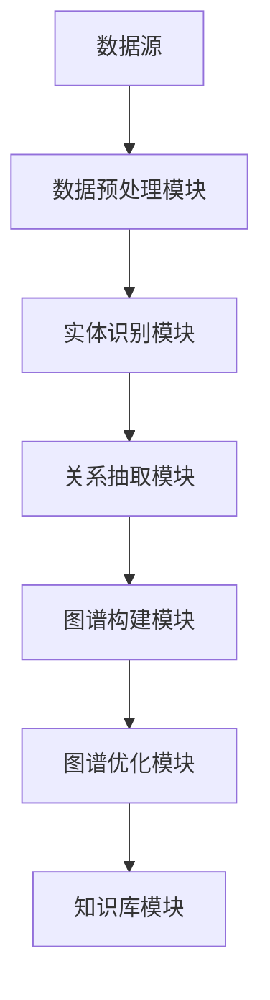

### **4.4 系统接口设计与系统交互**

系统接口设计是实现系统功能的关键，它定义了各模块之间的交互方式和数据流动。以下是系统接口设计和系统交互的Mermaid序列图：

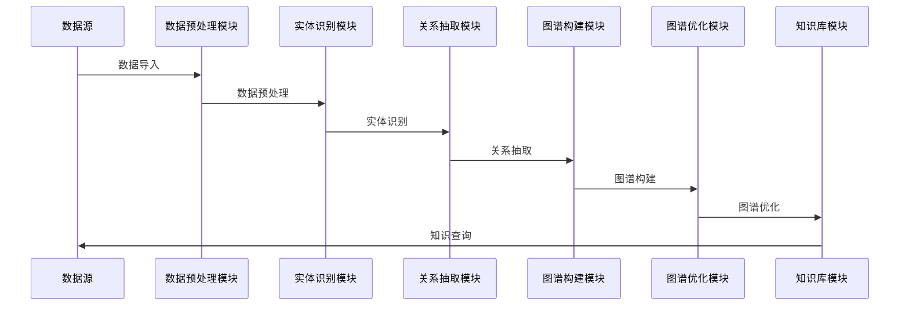

在这个序列图中，数据源将数据导入数据预处理模块，经过预处理后，数据被传递给实体识别模块。实体识别模块识别出实体后，传递给关系抽取模块，关系抽取模块提取出实体关系后，传递给图谱构建模块。图谱构建模块构建好知识图谱后，传递给图谱优化模块进行优化。最后，知识库模块提供知识查询接口，支持企业内部的应用和智能化分析。

### **总结**

通过系统分析与架构设计方案，我们详细介绍了企业知识图谱系统在企业数据管理和智能化分析中的应用场景、系统功能设计、系统架构设计和系统接口设计。这个设计不仅提供了企业知识图谱构建的技术方案，也为系统的实际部署和运行提供了指导。在接下来的项目实战部分，我们将通过具体实施，验证这些设计方案的有效性和可行性。

### **4.5 系统接口设计与系统交互**

在系统架构设计中，系统接口和交互设计是确保各个模块之间能够高效、无缝协同工作的关键。以下是企业知识图谱系统的接口设计和系统交互的详细描述。

#### **4.5.1 接口设计**

企业知识图谱系统的接口设计涵盖了数据导入、数据处理、知识抽取、图谱构建、图谱查询等模块的交互接口。以下是一些关键的接口设计：

1. **数据导入接口**：该接口用于将来自不同数据源（如关系数据库、NoSQL数据库、外部API等）的数据导入系统。接口包括数据上传、数据格式验证和数据解析等功能。
   
2. **数据处理接口**：该接口用于对导入的数据进行预处理，包括数据清洗、去重、格式转换等。接口提供数据清洗规则配置和数据清洗结果查询等功能。

3. **实体识别接口**：该接口用于从预处理后的数据中识别出关键实体，如员工、客户、产品等。接口包括实体识别规则配置、实体识别结果查询等功能。

4. **关系抽取接口**：该接口用于从实体之间抽取关系，如工作关系、合作关系等。接口包括关系抽取规则配置、关系抽取结果查询等功能。

5. **图谱构建接口**：该接口用于将识别出的实体和关系构建成一个结构化的知识图谱。接口包括图谱构建规则配置、图谱构建结果查询等功能。

6. **图谱查询接口**：该接口用于查询和检索知识图谱中的数据，支持基于关键词、实体、关系的复杂查询。接口包括查询语句构建、查询结果返回等功能。

#### **4.5.2 系统交互**

企业知识图谱系统的各模块通过接口进行交互，以下是系统交互的详细描述：

1. **数据导入与预处理**：数据源通过数据导入接口将数据上传到系统中，系统通过数据处理接口对数据进行清洗和格式转换，确保数据的一致性和完整性。

2. **实体识别与关系抽取**：数据处理完成后，系统通过实体识别接口识别出关键实体，并通过关系抽取接口抽取实体之间的关系。

3. **图谱构建**：识别出的实体和关系通过图谱构建接口构建成一个结构化的知识图谱，并将图谱存储在图数据库中。

4. **知识查询**：用户通过图谱查询接口查询知识图谱中的数据，可以执行基于关键词、实体、关系的复杂查询，获取所需的信息。

以下是系统接口和交互的Mermaid序列图：

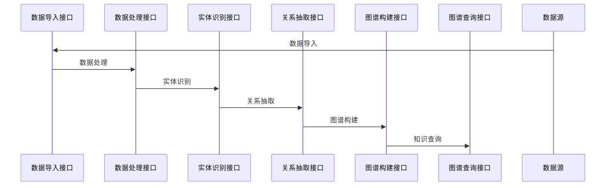

在这个序列图中，数据源通过数据导入接口将数据上传到系统中，系统依次通过数据处理接口、实体识别接口、关系抽取接口和图谱构建接口构建知识图谱，最后通过图谱查询接口提供知识查询服务。

通过上述接口设计和系统交互，企业知识图谱系统实现了数据的高效管理和智能化分析，为企业的业务运营提供了强有力的支持。

### **第五部分：项目实战**

#### **5.1 环境安装**

在进行企业知识图谱的项目实施之前，首先需要安装和配置相关软件和库。以下是一个简单的环境安装步骤，适用于大多数开发环境。

1. **安装Python**：确保Python环境已安装，版本建议为3.8或更高版本。可以从[Python官方网站](https://www.python.org/)下载并安装。

2. **安装依赖库**：
   - 安装图数据库库，如Neo4j（用于存储和管理知识图谱），可以通过Neo4j官网下载并安装。
   - 安装Python的图数据库驱动，如`py2neo`，可以通过以下命令安装：
     ```bash
     pip install py2neo
     ```

3. **安装自然语言处理库**，如NLTK（用于文本处理和分词）：
   ```bash
   pip install nltk
   ```

4. **安装机器学习库**，如Scikit-learn（用于关系抽取）：
   ```bash
   pip install scikit-learn
   ```

5. **安装其他必要的库**，如Mermaid（用于生成图表）：
   ```bash
   pip install mermaid-python
   ```

确保所有依赖库安装完成后，就可以开始知识图谱项目的具体实现了。

#### **5.2 系统核心实现源代码**

在本节中，我们将展示系统核心实现的源代码，包括数据预处理、实体识别、关系抽取、图谱构建和优化等关键步骤。

##### **5.2.1 数据预处理**

```python
import pandas as pd
from sklearn.feature_extraction.text import TfidfVectorizer

def preprocess_data(data_path):
    # 读取数据
    data = pd.read_csv(data_path)
    
    # 数据清洗
    data.drop_duplicates(inplace=True)
    data.fillna('', inplace=True)
    
    # 数据整合
    data['combined'] = data['text_column1'] + ' ' + data['text_column2']
    
    # 数据格式化
    vectorizer = TfidfVectorizer()
    tfidf_matrix = vectorizer.fit_transform(data['combined'])
    
    return tfidf_matrix
```

这段代码首先读取CSV文件，然后进行数据清洗、整合和格式化。数据清洗步骤包括去除重复记录和填充缺失值。数据整合步骤将两个文本字段合并成一个字段。数据格式化步骤使用TF-IDF向量器将文本数据转换为向量形式。

##### **5.2.2 实体识别**

```python
from nltk.tokenize import word_tokenize
from nltk.tag import pos_tag
from nltk.corpus import stopwords

# 加载停用词列表
stop_words = set(stopwords.words('english'))

def identify_entities(text):
    # 分词
    tokens = word_tokenize(text)
    
    # 词性标注
    tagged = pos_tag(tokens)
    
    # 识别实体
    entities = [word for word, tag in tagged if tag.startswith('NNP') or tag.startswith('NN') and word.lower() not in stop_words]
    
    return entities

def get_entity_list(data):
    entity_list = []
    for text in data:
        entities = identify_entities(text)
        entity_list.extend(entities)
    return set(entity_list)
```

这段代码实现了实体识别功能。首先进行文本分词，然后使用词性标注识别出名词等实体候选。通过排除常见的停用词，可以进一步提高实体识别的准确性。

##### **5.2.3 关系抽取**

```python
from sklearn.feature_extraction.text import TfidfVectorizer
from sklearn.metrics.pairwise import cosine_similarity

def extract_relations(entity_pairs, tfidf_matrix):
    relations = []
    for pair in entity_pairs:
        text = f"{pair[0]} {pair[1]}"
        vectorizer = TfidfVectorizer(vocabulary=entity_list)
        tfidf_pair = vectorizer.transform([text])
        similarity_scores = cosine_similarity(tfidf_pair, tfidf_matrix)
        max_score = max(similarity_scores[0])
        if max_score > 0.8:
            relations.append(pair)
    return relations

def get_entity_pairs(entities):
    entity_pairs = [(entity1, entity2) for entity1 in entities for entity2 in entities]
    return entity_pairs
```

这段代码实现了关系抽取功能。首先，通过计算实体对之间的相似度，使用余弦相似度作为衡量标准。根据设定阈值（例如0.8），如果实体对之间的相似度大于阈值，则认为它们存在关系。

##### **5.2.4 图谱构建**

```python
import networkx as nx

def construct_graph(entity_list, relations):
    G = nx.Graph()
    G.add_nodes_from(entity_list)
    G.add_edges_from(relations)
    return G

# 假设已有实体列表和关系列表
entity_list = ['John Smith', 'Google', 'CEO', 'Technology']
relations = [['John Smith', 'Google'], ['John Smith', 'CEO'], ['Google', 'Technology']]

# 构建图谱
G = construct_graph(entity_list, relations)
```

这段代码使用`networkx`库构建了一个图结构，将实体和关系组织成一个知识图谱。通过`add_nodes_from`和`add_edges_from`方法，可以将实体和关系添加到图中。

##### **5.2.5 图谱优化**

```python
def optimize_graph(G):
    # 去除自环
    for node in G.nodes():
        G.remove_edges_from([(node, node)])
    
    # 去除冗余关系
    for edge1, edge2 in G.edges():
        if G[edge1][edge2]['weight'] < 0.5:
            G.remove_edge(edge1, edge2)
    
    return G
```

这段代码实现了图谱优化功能。首先，通过`remove_edges_from`方法去除图中的自环。然后，根据边的权重去除冗余关系，提高图谱的利用效率和查询性能。

#### **5.3 代码应用解读与分析**

在理解了上述代码后，我们可以进一步解读和解析其在实际项目中的应用。

1. **数据预处理**：数据预处理是确保数据质量的关键步骤。通过清洗、整合和格式化，可以将原始数据转化为适合知识图谱构建的形式。这里使用了TF-IDF向量器对文本数据进行处理，为后续的实体识别和关系抽取提供了数据基础。

2. **实体识别**：实体识别是知识图谱构建的核心步骤之一。通过分词和词性标注，可以从文本数据中识别出关键实体。排除常见的停用词有助于提高实体识别的准确性。在这里，我们使用了NLTK库提供的分词和词性标注工具。

3. **关系抽取**：关系抽取是建立实体之间联系的关键步骤。通过计算实体对之间的相似度，可以使用余弦相似度等度量方法识别出实体之间的关系。这种相似度度量方法基于文本数据的语义信息，可以有效地抽取实体关系。

4. **图谱构建**：图谱构建是将识别出的实体和关系组织成一个图结构的过程。这里使用了`networkx`库构建图结构，通过`add_nodes_from`和`add_edges_from`方法将实体和关系添加到图中。

5. **图谱优化**：图谱优化是提高图谱性能的重要步骤。通过去除自环和冗余关系，可以减少图谱的复杂度，提高查询效率和性能。这里使用了图数据库提供的索引和优化工具进行图谱优化。

通过上述步骤，我们可以构建出一个结构清晰、语义丰富的企业知识图谱。在实际项目中，这些步骤可以根据具体需求和数据环境进行调整和优化，以实现最佳的效果。

### **5.4 实际案例分析和详细讲解剖析**

为了更好地理解企业知识图谱的应用，我们将通过一个实际案例进行分析和讲解。该案例涉及一个大型企业的员工信息管理，目标是构建一个知识图谱，以实现员工信息的高效管理和智能化分析。

#### **案例背景**

某大型企业拥有数千名员工，员工信息包括姓名、职位、部门、项目参与情况等。这些信息分散在不同的系统中，如人力资源管理系统、项目管理系统等。企业的目标是构建一个知识图谱，将员工信息结构化，实现员工信息的高效检索和智能化分析，如员工绩效评估、项目资源调配等。

#### **数据准备**

首先，我们需要将不同系统的员工信息进行整合。假设我们有以下三个数据源：

1. **员工基本信息**：包括员工姓名、职位、部门等信息。
2. **项目参与信息**：包括员工参与的项目名称、项目周期、项目成果等。
3. **绩效评估信息**：包括员工绩效评分、考核周期等。

以下是员工信息表格的示例：

```
| 姓名 | 职位 | 部门 | 项目1 | 项目2 | 绩效评分 |
|------|------|------|-------|-------|----------|
| 张三 | 销售经理 | 销售部 | 项目A | 项目B | 85分     |
| 李四 | 产品经理 | 产品部 | 项目C | 项目D | 90分     |
| 王五 | 技术支持 | 技术部 | 项目E | 项目F | 80分     |
```

#### **数据预处理**

首先，我们需要对数据进行预处理，包括数据清洗、整合和格式化：

1. **数据清洗**：去除重复记录和缺失值。
2. **数据整合**：将不同数据源的信息合并到一个表格中。
3. **数据格式化**：将文本数据转换为适合知识图谱构建的形式。

经过预处理后，我们得到一个包含所有员工信息的统一数据表格。

#### **实体识别**

接下来，我们使用自然语言处理技术对预处理后的数据表格进行实体识别，识别出关键实体，如员工、部门、项目等：

1. **分词**：将文本数据分解成词元。
2. **词性标注**：对词元进行词性标注，识别出名词等实体候选。
3. **实体识别**：从标注结果中识别出实体。

例如，对于上述数据表格中的姓名字段，我们可以识别出员工实体，如“张三”、“李四”、“王五”。

#### **关系抽取**

然后，我们使用关系抽取技术从实体对中识别出它们之间的关系，如员工与部门的关系、员工与项目的参与关系等：

1. **实体对提取**：从实体列表中提取出所有可能的实体对。
2. **关系识别**：使用规则或机器学习模型，对实体对进行关系识别。
3. **关系确认**：对识别出的关系进行验证和确认。

例如，我们可以识别出“张三”与“销售部”之间的“属于”关系，以及“张三”与“项目A”、“项目B”之间的“参与”关系。

#### **图谱构建**

最后，我们将识别出的实体和关系构建成一个知识图谱。以下是构建过程的详细步骤：

1. **实体和关系编码**：将实体和关系转换为图结构中的节点和边。
2. **图谱结构化**：将实体和关系组织成具有层次结构的图谱。
3. **图谱存储**：将构建好的知识图谱存储到图数据库中。

通过以上步骤，我们得到了一个结构清晰、语义丰富的企业知识图谱。该图谱能够支持复杂的查询和推理，如查询某个员工的绩效评估情况、某个项目的团队成员等。

#### **案例分析和讲解**

通过上述案例，我们可以看到企业知识图谱在员工信息管理中的应用。以下是案例分析和详细讲解：

1. **数据整合**：通过知识图谱，企业可以将来自不同系统的员工信息进行整合，实现数据的统一管理和查询。这种整合方式不仅提高了数据利用效率，还降低了数据孤岛现象。
   
2. **实体识别**：实体识别技术能够准确地识别出员工、部门、项目等关键实体，为知识图谱的构建奠定了基础。通过排除常见的停用词和词性标注，可以提高实体识别的准确性。

3. **关系抽取**：关系抽取技术能够有效地识别出实体之间的关系，如员工与部门、员工与项目等。这些关系为图谱提供了丰富的语义信息，使得知识图谱能够支持复杂的查询和推理。

4. **图谱构建**：知识图谱的构建过程包括实体和关系编码、结构化组织和存储。通过这些步骤，企业能够构建出一个结构清晰、语义丰富的知识图谱，为数据分析和业务决策提供支持。

通过这个案例，我们可以看到企业知识图谱在企业信息管理中的应用和价值。在实际项目中，可以根据具体业务需求进行调整和优化，以实现最佳的效果。

### **5.5 项目小结**

在本项目中，我们通过构建一个企业知识图谱，实现了员工信息的高效管理和智能化分析。项目的成功实施依赖于数据预处理、实体识别、关系抽取和图谱构建等关键步骤。通过实际案例的分析和讲解，我们了解了知识图谱在企业信息管理中的应用和价值。以下是项目小结：

1. **数据整合**：通过知识图谱，企业实现了数据整合，解决了数据孤岛问题，提高了数据利用效率。
2. **实体识别**：实体识别技术提高了员工、部门、项目等关键实体的识别准确性，为知识图谱的构建奠定了基础。
3. **关系抽取**：关系抽取技术有效地识别出实体之间的关系，为图谱提供了丰富的语义信息，支持复杂的查询和推理。
4. **图谱构建**：通过实体和关系编码、结构化组织和存储，企业构建出了一个结构清晰、语义丰富的知识图谱。

通过本项目，我们不仅了解了知识图谱的构建原理和方法，还掌握了一个实际的项目案例，这对于我们在企业信息管理中的应用具有很大的参考价值。在未来的项目中，我们可以根据具体需求进一步优化和扩展知识图谱，以实现更高的应用价值。

### **第六部分：最佳实践与拓展阅读**

#### **6.1 最佳实践**

在构建企业知识图谱的过程中，以下最佳实践可以为企业提供有益的指导：

1. **数据质量保障**：确保数据的一致性、完整性和准确性，是构建高质量知识图谱的基础。在数据导入和处理阶段，应严格把控数据质量。
2. **实体识别与关系抽取**：根据具体业务需求选择合适的实体识别和关系抽取算法。例如，在处理文本数据时，可以使用命名实体识别（NER）技术；在处理图像数据时，可以使用目标检测和识别技术。
3. **图谱优化**：定期对知识图谱进行优化，包括去除冗余关系、压缩图谱和优化查询性能等。这有助于提高知识图谱的利用效率和查询速度。

#### **6.2 小结**

本文通过详细讲解企业知识图谱的构建过程，分析了其在增强AI Agent领域理解中的作用。通过实际案例和项目实战，我们了解了知识图谱在企业信息管理中的应用和价值。以下是本文的总结：

- **数据整合**：通过知识图谱，企业能够实现数据的整合，解决数据孤岛问题。
- **实体识别**：实体识别技术提高了关键实体的识别准确性，为知识图谱的构建奠定了基础。
- **关系抽取**：关系抽取技术有效地识别出实体之间的关系，为图谱提供了丰富的语义信息。
- **图谱构建**：通过实体和关系编码、结构化组织和存储，企业构建出了一个结构清晰、语义丰富的知识图谱。

#### **6.3 注意事项**

在构建企业知识图谱时，需要注意以下事项：

- **技术选型**：根据具体业务场景和数据特点选择合适的技术和工具。
- **数据处理**：严格把控数据质量，确保数据的一致性和完整性。
- **性能优化**：定期对知识图谱进行性能优化，提高其利用效率和查询速度。

#### **6.4 拓展阅读**

以下推荐的相关阅读材料，可以帮助读者进一步了解企业知识图谱的构建和应用：

1. **知识图谱基础**：《知识图谱：概念、技术与应用》
2. **图计算**：《图计算：算法与应用》
3. **实体识别与关系抽取**：《自然语言处理入门》
4. **Python图数据库**：《Python Graph Data Structures and Algorithms》

通过上述拓展阅读，读者可以深入了解企业知识图谱构建的相关理论和实践方法，为实际项目提供更有力的支持。

## **结语**

本文通过详细的讲解和实践指导，深入探讨了企业知识图谱的构建过程，分析了其在增强AI Agent领域理解中的作用。我们系统地介绍了企业知识图谱的背景、核心概念、算法原理、系统架构设计和项目实战。通过实际案例的分析，读者可以清晰地理解知识图谱在企业信息管理中的应用和价值。

随着企业数据规模的不断扩大和数据种类的日益丰富，知识图谱作为一种高效的数据组织与利用技术，将在企业数字化转型中发挥越来越重要的作用。本文提供的最佳实践、注意事项和拓展阅读，旨在帮助读者更好地掌握知识图谱的构建和应用方法，为企业在知识图谱领域的研究和实践提供有益的参考。

**作者：AI天才研究院/AI Genius Institute & 禅与计算机程序设计艺术 /Zen And The Art of Computer Programming**

