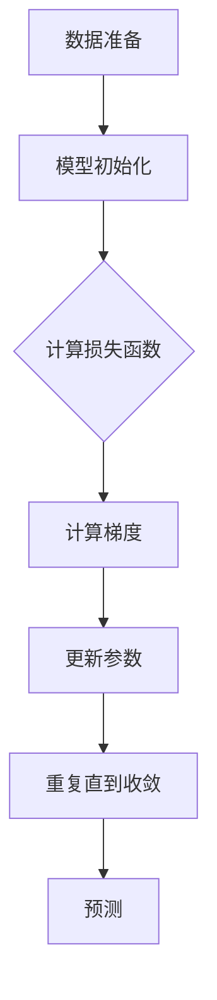
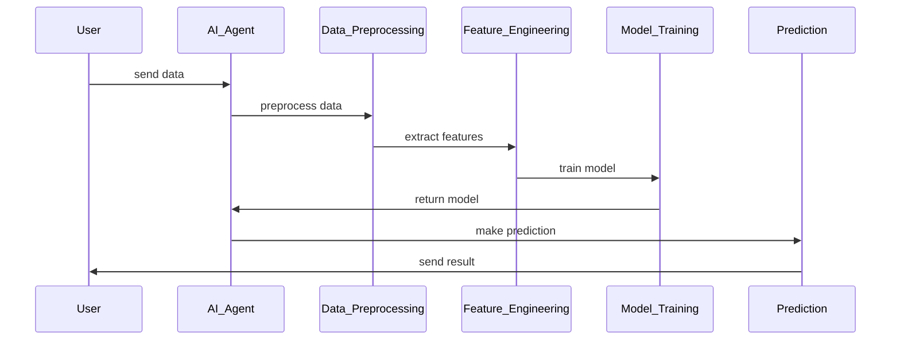
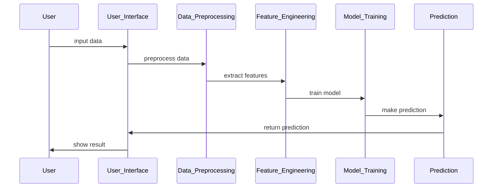
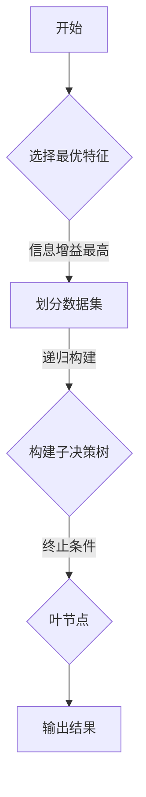

                 

# 企业级AI Agent开发：从需求分析到部署的全流程指南

## 关键词

- 企业级AI Agent
- 需求分析
- 数据预处理
- 模型选择与训练
- 部署与维护
- 安全与伦理

## 摘要

本文将深入探讨企业级AI Agent的开发过程，从需求分析到部署的全流程。我们将首先介绍AI Agent的基本概念和其在企业中的应用，然后逐步介绍需求分析、设计、数据预处理与特征工程、模型选择与训练、部署与维护，以及安全与伦理方面的关键问题和解决方案。通过这篇文章，读者可以全面了解企业级AI Agent开发的各个方面，掌握其开发的全流程和方法论。

## 第1章 引言与背景

### 1.1 AI Agent的基本概念

#### 1.1.1 AI Agent的定义

AI Agent，即人工智能代理，是指能够模拟人类智能行为，具有自主决策、问题解决和任务执行能力的计算实体。AI Agent通常基于人工智能技术，如机器学习、深度学习、自然语言处理等，实现智能感知、智能决策和智能执行。

#### 1.1.2 AI Agent的应用领域

AI Agent广泛应用于各个行业，包括但不限于以下领域：

1. **智能制造**：AI Agent可以实时监测生产线状态，优化生产流程，提高生产效率。
2. **客户服务**：AI Agent可以提供24/7的客户服务，处理客户的咨询和投诉。
3. **医疗健康**：AI Agent可以辅助医生进行诊断，提供个性化治疗建议。
4. **金融服务**：AI Agent可以提供智能投顾，帮助用户进行投资决策。
5. **智能交通**：AI Agent可以优化交通流量，减少拥堵，提高交通效率。

#### 1.1.3 企业级AI Agent的重要性

企业级AI Agent对于企业来说具有重要意义：

1. **提高效率**：AI Agent可以自动化执行重复性任务，减少人力成本，提高工作效率。
2. **降低成本**：通过智能优化和决策，AI Agent可以帮助企业降低运营成本。
3. **提升竞争力**：AI Agent可以帮助企业快速响应市场变化，提高市场竞争力。
4. **创新驱动**：AI Agent可以为企业带来新的商业模式和业务流程，推动企业创新。

### 1.2 企业级AI Agent的发展现状与趋势

#### 1.2.1 发展现状

目前，企业级AI Agent已经成为人工智能领域的一个重要方向。许多企业已经开始采用AI Agent来提升业务效率和创新能力。AI Agent的技术和应用也在不断成熟，包括智能客服、智能销售、智能运维等。

#### 1.2.2 市场趋势

随着人工智能技术的快速发展，企业级AI Agent的市场需求也在不断增长。预计未来几年，企业级AI Agent市场将保持高速增长，成为人工智能领域的重要细分市场。

#### 1.2.3 技术挑战

企业级AI Agent的开发和应用面临着一系列技术挑战，包括：

1. **数据质量**：高质量的数据是AI Agent训练和优化的基础，数据质量直接影响AI Agent的性能。
2. **算法选择**：不同的任务需要不同的算法，如何选择合适的算法是开发AI Agent的关键。
3. **系统集成**：AI Agent需要与企业的现有系统集成，如何实现系统的无缝集成是一个挑战。
4. **安全性**：AI Agent涉及到企业的核心数据和业务流程，安全性至关重要。

### 1.3 本书的内容结构

本书将从以下六个部分详细介绍企业级AI Agent的开发过程：

1. **需求分析与设计**：介绍需求分析的方法和步骤，用户界面设计，功能设计和模块划分，系统架构设计。
2. **数据预处理与特征工程**：介绍数据预处理的方法和步骤，特征工程的关键技术和方法。
3. **模型选择与训练**：介绍模型选择的方法和策略，模型训练的流程和策略，模型调优的方法和技巧。
4. **部署与维护**：介绍部署策略，实时监控与日志记录，维护与更新。
5. **安全与伦理**：介绍AI Agent的安全性，伦理问题，以及相关法规和标准。

通过本书的阅读，读者可以全面了解企业级AI Agent的开发过程，掌握相关技术和方法，为企业级AI Agent的开发和应用提供有力支持。

### 1.4 小结

本章介绍了企业级AI Agent的基本概念、应用领域和重要性，分析了企业级AI Agent的发展现状和趋势，以及面临的挑战。接下来，本书将逐步介绍企业级AI Agent的需求分析、设计、数据预处理、模型选择与训练、部署与维护，以及安全与伦理等方面的内容。希望通过本书的阅读，读者能够深入理解企业级AI Agent的开发过程，掌握相关技术和方法，为企业级AI Agent的开发和应用提供有力支持。

----------------------------------------------------------------

## 第2章 需求分析与设计

### 2.1 需求分析的方法与步骤

需求分析是AI Agent开发的第一步，也是至关重要的一步。它决定了AI Agent的功能和性能，直接影响到后续的设计和实现。下面，我们将详细介绍需求分析的方法和步骤。

#### 2.1.1 需求收集

需求收集是需求分析的第一步，主要目标是获取用户的需求和期望。需求收集的方法包括以下几种：

1. **问卷调查**：通过设计问卷，收集用户对AI Agent的功能、性能、用户体验等方面的期望。
2. **用户访谈**：通过与用户面对面交流，深入了解用户的具体需求和期望。
3. **用户观察**：观察用户在实际工作环境中的行为和操作，发现潜在的需求。
4. **竞争分析**：分析竞争对手的产品和功能，了解用户在其他产品中的需求。

#### 2.1.2 需求分类

收集到的需求需要进行分类，以便更好地理解和分析。常见的需求分类方法包括以下几种：

1. **功能需求**：描述AI Agent应该具有的功能，如自动化任务执行、智能决策等。
2. **性能需求**：描述AI Agent应该达到的性能指标，如响应时间、准确率等。
3. **用户需求**：描述用户对AI Agent的期望，如易用性、用户体验等。
4. **业务需求**：描述AI Agent需要满足的业务目标和需求，如提高工作效率、降低成本等。

#### 2.1.3 需求分析工具

为了有效地进行需求分析，可以借助一些工具和方法。常见的需求分析工具有以下几种：

1. **需求管理工具**：如Jira、Confluence等，用于记录、管理和跟踪需求。
2. **原型设计工具**：如Axure、Figma等，用于设计用户界面和交互原型。
3. **数据可视化工具**：如Tableau、Power BI等，用于分析和展示数据。
4. **模型构建工具**：如MATLAB、R Studio等，用于构建和训练模型。

### 2.2 用户界面设计

用户界面设计是需求分析的重要组成部分，它决定了用户与AI Agent的交互方式。下面，我们将介绍用户界面设计的方法和步骤。

#### 2.2.1 界面布局

界面布局是用户界面设计的第一步，它决定了界面的结构和布局。界面布局的方法包括以下几种：

1. **层次化布局**：将界面分为多个层级，每个层级对应不同的功能模块。
2. **模块化布局**：将界面划分为多个模块，每个模块负责不同的功能。
3. **响应式布局**：根据用户设备的尺寸和分辨率，自动调整界面的布局和样式。

#### 2.2.2 交互设计

交互设计是用户界面设计的核心，它决定了用户与AI Agent的交互方式和流程。交互设计的方法包括以下几种：

1. **基于规则的设计**：通过定义一系列规则，实现用户与AI Agent的交互。
2. **基于任务的设计**：将用户操作抽象为一系列任务，设计任务流和交互流程。
3. **基于场景的设计**：根据用户在不同场景下的操作，设计相应的交互界面。

#### 2.2.3 设计原型

设计原型是用户界面设计的最后一步，它用于验证和优化设计方案。设计原型的工具和方法包括以下几种：

1. **线框图**：用简单的线条和框图表示界面布局和交互流程。
2. **高保真原型**：使用设计工具，如Axure、Figma等，制作接近最终产品的原型。
3. **交互原型**：通过动画和模拟，展示用户与AI Agent的交互过程。

### 2.3 功能设计与模块划分

功能设计是需求分析的重要部分，它决定了AI Agent的功能模块和结构。下面，我们将介绍功能设计与模块划分的方法和步骤。

#### 2.3.1 功能需求分析

功能需求分析是功能设计的第一步，它通过分析用户需求，确定AI Agent的功能模块。功能需求分析的方法包括以下几种：

1. **功能分解**：将用户需求分解为多个功能模块，每个模块负责特定的功能。
2. **用例建模**：通过用例图表示用户与AI Agent的交互过程，明确每个功能模块的需求。
3. **需求文档**：将分析结果整理成需求文档，为后续的设计和开发提供依据。

#### 2.3.2 模块划分

模块划分是功能设计的关键步骤，它决定了AI Agent的模块结构和功能分配。模块划分的方法包括以下几种：

1. **基于功能的模块划分**：按照功能模块的划分标准，将功能模块划分为独立的模块。
2. **基于组件的模块划分**：根据系统组件的划分标准，将系统组件划分为独立的模块。
3. **基于职责的模块划分**：根据模块的职责和功能，将模块划分为独立的模块。

#### 2.3.3 模块接口设计

模块接口设计是模块划分的最后一步，它决定了模块之间的交互方式和数据传输。模块接口设计的方法包括以下几种：

1. **接口定义**：定义每个模块的输入输出接口，明确模块之间的交互方式和数据传输。
2. **接口文档**：将接口设计结果整理成接口文档，为后续的模块开发和集成提供依据。
3. **接口测试**：通过接口测试，验证模块接口的正确性和稳定性。

### 2.4 系统架构设计

系统架构设计是需求分析和设计的最后一步，它决定了AI Agent的整体结构和功能模块。下面，我们将介绍系统架构设计的方法和步骤。

#### 2.4.1 系统架构的选择

系统架构的选择是系统架构设计的首要任务，它决定了AI Agent的稳定性和扩展性。常见的系统架构包括以下几种：

1. **分层架构**：将系统划分为多个层级，每个层级负责不同的功能。
2. **分布式架构**：将系统分解为多个节点，每个节点负责特定的功能。
3. **微服务架构**：将系统分解为多个微服务，每个微服务负责特定的功能。

#### 2.4.2 系统架构图

系统架构图是系统架构设计的核心，它用于表示系统的整体结构和功能模块。系统架构图包括以下内容：

1. **模块图**：表示系统的功能模块和模块之间的交互关系。
2. **组件图**：表示系统的组件和组件之间的交互关系。
3. **接口图**：表示系统的接口和接口之间的交互关系。

#### 2.4.3 系统模块间的关系

系统模块间的关系是系统架构设计的关键，它决定了系统的性能和稳定性。系统模块间的关系包括以下几种：

1. **依赖关系**：表示模块之间的依赖关系，如模块A依赖于模块B。
2. **调用关系**：表示模块之间的调用关系，如模块A调用模块B。
3. **通信关系**：表示模块之间的数据传输关系，如模块A向模块B发送数据。

### 2.5 小结

本章详细介绍了需求分析的方法和步骤，包括需求收集、需求分类、需求分析工具；用户界面设计的方法和步骤，包括界面布局、交互设计、设计原型；功能设计与模块划分的方法和步骤，包括功能需求分析、模块划分、模块接口设计；系统架构设计的方法和步骤，包括系统架构的选择、系统架构图、系统模块间的关系。通过本章的学习，读者可以掌握企业级AI Agent的需求分析和设计方法，为后续的开发奠定基础。

----------------------------------------------------------------

## 第3章 数据预处理与特征工程

### 3.1 数据预处理

数据预处理是AI Agent开发的重要步骤，它包括数据清洗、数据集成和数据归一化。高质量的数据预处理对于后续的特征工程和模型训练至关重要。

#### 3.1.1 数据清洗

数据清洗是指对原始数据进行清洗和修复，以消除噪声和异常值。数据清洗的主要任务包括以下几种：

1. **去除重复数据**：删除重复的数据记录，确保数据的唯一性。
2. **处理缺失值**：对于缺失的数据，可以选择填充、删除或插值等方法进行处理。
3. **处理异常值**：检测并处理异常值，避免它们对模型训练产生不良影响。
4. **统一数据格式**：将不同格式的数据转换为统一格式，如将日期格式转换为YYYY-MM-DD。

#### 3.1.2 数据集成

数据集成是指将来自不同数据源的数据进行整合和合并，以形成完整的数据集。数据集成的主要任务包括以下几种：

1. **数据合并**：将多个数据源的数据进行合并，形成统一的数据集。
2. **数据转换**：将不同数据源的数据转换为相同的数据格式和结构。
3. **数据去重**：去除重复的数据记录，确保数据的唯一性。
4. **数据整合**：将不同数据源的数据整合为统一的数据模型，方便后续处理。

#### 3.1.3 数据归一化

数据归一化是指将不同数据源的数据进行标准化处理，以消除数据之间的尺度差异。数据归一化可以提高模型的训练效率和稳定性。常见的归一化方法包括以下几种：

1. **最小-最大缩放**：将数据缩放到[0, 1]范围内，公式为：$x_{\text{scaled}} = \frac{x_{\text{original}} - \text{min}(x_{\text{original}})}{\text{max}(x_{\text{original}}) - \text{min}(x_{\text{original}})}$。
2. **平均值-标准差缩放**：将数据缩放到均值为0，标准差为1的范围内，公式为：$x_{\text{scaled}} = \frac{x_{\text{original}} - \text{mean}(x_{\text{original}})}{\text{stddev}(x_{\text{original}})}$。

### 3.2 特征工程

特征工程是数据预处理的重要步骤，它通过对数据进行转换和构造，提取出对模型训练有用的特征。特征工程的质量直接影响到模型的性能和效果。

#### 3.2.1 特征提取

特征提取是指从原始数据中提取出具有区分性和代表性的特征。常见的特征提取方法包括以下几种：

1. **统计特征**：通过计算数据的统计指标，如均值、方差、标准差等，提取特征。
2. **文本特征**：通过文本分析技术，如词频、词向量等，提取文本特征。
3. **图像特征**：通过图像处理技术，如边缘检测、特征点提取等，提取图像特征。
4. **音频特征**：通过音频分析技术，如频谱分析、倒谱分析等，提取音频特征。

#### 3.2.2 特征选择

特征选择是指从提取出的特征中，选择出对模型训练最有用的特征。特征选择可以减少模型的复杂度，提高训练效率。常见的特征选择方法包括以下几种：

1. **过滤式特征选择**：通过计算特征的相关性、重要性等指标，筛选出重要的特征。
2. **包装式特征选择**：通过在模型训练过程中，逐步筛选出重要的特征。
3. **嵌入式特征选择**：在特征提取的过程中，直接筛选出重要的特征。

#### 3.2.3 特征构造

特征构造是指通过对原始数据进行转换和组合，构造出新的特征。特征构造可以增强模型的鲁棒性和泛化能力。常见的特征构造方法包括以下几种：

1. **组合特征**：将多个原始特征进行组合，构造出新的特征。
2. **变换特征**：通过对原始特征进行变换，构造出新的特征。
3. **嵌入特征**：通过学习得到的嵌入向量，构造新的特征。

### 3.3 数据可视化

数据可视化是将数据以图形化的形式展示，帮助人们直观地理解和分析数据。数据可视化在数据预处理和特征工程中具有重要意义。

#### 3.3.1 可视化工具

常见的可视化工具包括以下几种：

1. **Matplotlib**：Python的绘图库，用于绘制各种统计图表。
2. **Seaborn**：基于Matplotlib的绘图库，提供更丰富的绘图函数和样式。
3. **Plotly**：基于Web的绘图库，提供交互式图表和丰富的样式。

#### 3.3.2 可视化方法

常见的数据可视化方法包括以下几种：

1. **散点图**：用于展示数据点的分布和趋势。
2. **直方图**：用于展示数据的分布情况。
3. **箱线图**：用于展示数据的统计分布和异常值。
4. **热力图**：用于展示数据的分布和相关性。

#### 3.3.3 可视化案例

以下是一个使用Matplotlib绘制散点图和直方图的案例：

```python
import matplotlib.pyplot as plt
import numpy as np

# 生成数据
data = np.random.randn(1000)

# 绘制散点图
plt.scatter(data[:500], data[:500])
plt.title('Scatter Plot')
plt.xlabel('X-axis')
plt.ylabel('Y-axis')

# 绘制直方图
plt.figure()
plt.hist(data, bins=30)
plt.title('Histogram')
plt.xlabel('Value')
plt.ylabel('Frequency')

# 显示图表
plt.show()
```

### 3.4 小结

本章详细介绍了数据预处理和特征工程的方法和步骤，包括数据清洗、数据集成和数据归一化；特征提取、特征选择和特征构造；数据可视化。通过本章的学习，读者可以掌握数据预处理和特征工程的核心技术和方法，为后续的模型训练和部署奠定基础。

----------------------------------------------------------------

## 第4章 模型选择与训练

### 4.1 模型选择

在AI Agent开发中，选择合适的模型是至关重要的一步，它直接影响到AI Agent的性能和效果。模型选择需要考虑任务类型、数据规模、计算资源等因素。以下是一些常见的模型选择策略：

#### 4.1.1 模型分类

根据任务类型和特点，常见的机器学习模型可以分为以下几类：

1. **监督学习模型**：适用于有标签数据，常见的模型包括线性回归、决策树、随机森林、支持向量机等。
2. **无监督学习模型**：适用于无标签数据，常见的模型包括聚类算法（如K均值聚类）、降维算法（如主成分分析）等。
3. **强化学习模型**：适用于有反馈和奖励机制的任务，常见的模型包括Q学习、深度Q网络（DQN）、策略梯度算法等。
4. **生成模型**：适用于生成新的数据，常见的模型包括变分自编码器（VAE）、生成对抗网络（GAN）等。

#### 4.1.2 模型选择策略

1. **根据任务类型选择模型**：不同类型的任务需要不同类型的模型，例如，分类任务通常使用监督学习模型，聚类任务通常使用无监督学习模型。
2. **根据数据规模选择模型**：对于大规模数据，选择复杂度较低的模型可以节省计算资源，而对于小规模数据，选择复杂度较高的模型可以获得更好的性能。
3. **根据计算资源选择模型**：对于资源受限的环境，选择轻量级的模型可以更好地运行，而对于资源充足的环境，可以选择复杂度较高的模型。
4. **交叉验证选择模型**：使用交叉验证方法对多个模型进行评估，选择性能最优的模型。

#### 4.1.3 常见模型介绍

1. **线性回归**：适用于线性关系的预测任务，通过最小化损失函数来训练模型。
   $$ y = \beta_0 + \beta_1x $$
   其中，$y$是预测值，$x$是输入特征，$\beta_0$和$\beta_1$是模型参数。

2. **决策树**：通过递归划分特征，将数据集划分为多个子集，每个子集对应一个决策节点。
   决策树模型可以用树形结构表示，其中每个节点代表一个特征，每个分支代表一个划分结果。

3. **随机森林**：是一种集成学习模型，由多个决策树组成，通过投票或平均来获得最终预测结果。

4. **支持向量机**（SVM）：通过找到一个最佳的超平面，将不同类别的数据分开。SVM使用核函数来处理非线性数据。

5. **深度神经网络**：通过多层神经元进行非线性变换，适用于复杂的数据建模任务。常见的深度神经网络包括卷积神经网络（CNN）、循环神经网络（RNN）和Transformer等。

### 4.2 模型训练

模型训练是指通过输入数据来调整模型参数，使其达到预期的性能。模型训练包括以下关键步骤：

#### 4.2.1 训练流程

1. **数据准备**：清洗和预处理输入数据，将其转换为模型可接受的格式。
2. **模型初始化**：初始化模型参数，可以选择随机初始化或预训练模型初始化。
3. **前向传播**：将输入数据传递到模型中，计算输出结果和损失函数。
4. **反向传播**：计算损失函数关于模型参数的梯度，并更新模型参数。
5. **评估与调整**：使用验证集评估模型性能，根据评估结果调整训练策略，如改变学习率、增加训练轮数等。

#### 4.2.2 训练策略

1. **学习率调度**：选择合适的学习率，避免过快或过慢的参数更新。
2. **批量大小**：选择合适的批量大小，影响模型的收敛速度和性能。
3. **正则化**：使用正则化方法，如L1、L2正则化，防止模型过拟合。
4. **早停法**：在验证集上提前停止训练，防止模型过拟合。

#### 4.2.3 评估指标

评估模型性能的常见指标包括：

1. **准确率**（Accuracy）：分类任务中，正确分类的样本占总样本的比例。
2. **召回率**（Recall）：分类任务中，正确分类为正类的样本占总正类样本的比例。
3. **精确率**（Precision）：分类任务中，正确分类为正类的样本占总分类为正类的样本的比例。
4. **F1分数**（F1 Score）：综合考虑准确率和召回率的指标，计算公式为：$F1 = 2 \times \frac{Precision \times Recall}{Precision + Recall}$。
5. **均方误差**（MSE）：回归任务中，预测值与真实值之间的平均平方误差。
6. **均方根误差**（RMSE）：回归任务中，预测值与真实值之间的平均平方根误差。

### 4.3 模型调优

模型调优是指通过调整模型参数和训练策略，提高模型性能的过程。以下是一些常见的模型调优方法和技巧：

#### 4.3.1 超参数调优

1. **网格搜索**：通过遍历多个超参数组合，找到最优的超参数组合。
2. **贝叶斯优化**：基于贝叶斯统计模型，自动搜索最优超参数组合。

#### 4.3.2 模型优化方法

1. **集成学习**：通过组合多个模型，提高模型的稳定性和性能，如随机森林、梯度提升树等。
2. **特征选择**：通过选择重要的特征，减少模型的复杂度和过拟合风险。
3. **模型压缩**：通过模型压缩技术，减少模型的参数数量和计算量，如深度压缩、剪枝等。

#### 4.3.3 实践案例

以下是一个使用scikit-learn库进行线性回归模型训练和调优的实践案例：

```python
from sklearn.linear_model import LinearRegression
from sklearn.model_selection import train_test_split
from sklearn.metrics import mean_squared_error

# 生成训练数据
X = np.random.rand(100, 1)
y = 2 * X + np.random.randn(100, 1)

# 划分训练集和测试集
X_train, X_test, y_train, y_test = train_test_split(X, y, test_size=0.2, random_state=42)

# 初始化模型
model = LinearRegression()

# 训练模型
model.fit(X_train, y_train)

# 预测测试集
y_pred = model.predict(X_test)

# 计算均方根误差
mse = mean_squared_error(y_test, y_pred)
rmse = np.sqrt(mse)

print(f"RMSE: {rmse}")

# 调优模型
from sklearn.model_selection import GridSearchCV

param_grid = {'fit_intercept': [True, False], 'normalize': [True, False]}
grid_search = GridSearchCV(model, param_grid, cv=5)
grid_search.fit(X_train, y_train)

# 输出最优参数
print(f"Best parameters: {grid_search.best_params_}")

# 使用最优参数训练模型
best_model = grid_search.best_estimator_
best_y_pred = best_model.predict(X_test)
best_mse = mean_squared_error(y_test, best_y_pred)
best_rmse = np.sqrt(best_mse)

print(f"Best RMSE: {best_rmse}")
```

### 4.4 小结

本章详细介绍了模型选择的方法和策略，包括模型分类、模型选择策略和常见模型介绍；模型训练的流程和策略，包括数据准备、模型初始化、前向传播、反向传播和评估与调整；模型调优的方法和技巧，包括超参数调优、模型优化方法和实践案例。通过本章的学习，读者可以掌握模型选择与训练的核心技术和方法，为AI Agent的开发和应用提供有力支持。

----------------------------------------------------------------

## 第5章 部署与维护

### 5.1 部署策略

部署是企业级AI Agent开发的重要环节，它决定了AI Agent能否在实际环境中正常运行。以下是一些常见的部署策略：

#### 5.1.1 部署环境配置

部署环境配置包括硬件和软件的配置。硬件配置需要根据AI Agent的计算需求选择合适的服务器或计算集群；软件配置包括操作系统、编程语言环境、数据库等。常见的操作系统有Linux、Windows Server等；编程语言环境包括Python、Java、C++等；数据库可以选择MySQL、PostgreSQL等。

#### 5.1.2 部署流程

部署流程通常包括以下步骤：

1. **环境准备**：准备部署环境，包括硬件和软件配置。
2. **代码打包**：将AI Agent的代码和依赖库打包成可部署的格式，如Docker镜像。
3. **容器化**：将代码和依赖库容器化，使用Docker等技术，实现环境的一致性和隔离性。
4. **部署到服务器**：将容器化后的代码部署到服务器或计算集群，可以使用Kubernetes等容器编排工具进行部署。
5. **启动服务**：启动部署后的服务，确保AI Agent可以正常运行。

#### 5.1.3 部署工具

常见的部署工具包括以下几种：

1. **Docker**：用于容器化部署，可以将应用程序及其依赖库打包成一个独立的容器。
2. **Kubernetes**：用于容器编排和管理，可以自动化部署、扩展和管理容器化应用程序。
3. **Jenkins**：用于自动化构建和部署，可以持续集成和持续部署（CI/CD）。

### 5.2 实时监控与日志记录

实时监控与日志记录是确保AI Agent稳定运行和快速响应问题的重要手段。以下是一些关键点：

#### 5.2.1 监控指标

监控指标包括但不限于以下几种：

1. **性能指标**：如CPU使用率、内存使用率、磁盘I/O等。
2. **业务指标**：如响应时间、处理速度、错误率等。
3. **系统指标**：如网络延迟、系统负载等。

#### 5.2.2 日志记录与分析

日志记录与分析包括以下步骤：

1. **日志收集**：收集AI Agent的运行日志，可以使用日志收集工具如ELK（Elasticsearch、Logstash、Kibana）等。
2. **日志存储**：将日志存储在数据库或文件系统中，以便后续分析和查询。
3. **日志分析**：分析日志数据，发现潜在的问题和趋势，可以使用日志分析工具如Grok、Logstash等。

#### 5.2.3 监控工具

常见的监控工具包括以下几种：

1. **Prometheus**：用于监控和告警，可以收集和存储监控数据，提供可视化界面。
2. **Zabbix**：用于监控和告警，支持多种监控方式，如SNMP、TCP/IP等。
3. **Nagios**：用于监控和告警，可以监控服务器、网络设备、应用程序等。

### 5.3 维护与更新

维护与更新是确保AI Agent持续稳定运行的关键。以下是一些关键点：

#### 5.3.1 维护策略

维护策略包括以下几种：

1. **定期检查**：定期检查AI Agent的运行状态和监控指标，确保系统稳定。
2. **故障排除**：发现并解决AI Agent的故障，减少系统停机时间。
3. **性能优化**：根据监控数据，对AI Agent进行性能优化，提高系统效率。
4. **安全加固**：定期检查和更新AI Agent的安全性，防止安全漏洞。

#### 5.3.2 更新流程

更新流程包括以下步骤：

1. **更新计划**：制定更新计划，包括更新时间、更新内容等。
2. **备份**：在更新前备份当前系统，确保在更新失败时可以快速恢复。
3. **更新执行**：按照更新计划执行更新操作，包括代码更新、配置更新等。
4. **测试与验证**：更新后对AI Agent进行测试和验证，确保更新后的系统能正常运行。
5. **发布**：更新测试通过后，正式发布更新。

#### 5.3.3 维护工具

常见的维护工具包括以下几种：

1. **Ansible**：用于自动化部署和配置管理，可以自动化执行维护任务。
2. **Puppet**：用于自动化部署和配置管理，支持大规模系统管理。
3. **Chef**：用于自动化部署和配置管理，可以简化系统管理任务。

### 5.4 小结

本章详细介绍了企业级AI Agent的部署与维护策略，包括部署环境配置、部署流程和部署工具；实时监控与日志记录的方法和工具；维护与更新的策略和流程。通过本章的学习，读者可以掌握企业级AI Agent的部署与维护方法，确保AI Agent在实际环境中稳定、高效地运行。

----------------------------------------------------------------

## 第6章 安全与伦理

### 6.1 安全性

AI Agent作为企业级应用，其安全性至关重要。安全性包括以下几个方面：

#### 6.1.1 安全风险分析

安全风险分析是确保AI Agent安全的第一步。需要识别和评估AI Agent可能面临的安全威胁和风险，包括：

1. **数据泄露**：AI Agent处理的数据可能包括敏感信息，如客户数据、企业机密等。
2. **模型篡改**：攻击者可能试图篡改AI Agent的模型，使其做出错误的决策。
3. **系统入侵**：攻击者可能通过入侵AI Agent的系统，获取企业内部信息或控制AI Agent。

#### 6.1.2 安全措施

为了确保AI Agent的安全性，可以采取以下措施：

1. **数据加密**：对存储和传输的数据进行加密，确保数据隐私和安全。
2. **访问控制**：设置严格的访问控制机制，确保只有授权用户可以访问AI Agent。
3. **安全审计**：定期进行安全审计，检查系统的安全漏洞和弱点，及时修复。
4. **入侵检测**：部署入侵检测系统（IDS），实时监测AI Agent的异常行为，及时响应和阻止攻击。

#### 6.1.3 安全标准

为了确保AI Agent的安全性，可以参考以下安全标准和最佳实践：

1. **ISO/IEC 27001**：信息安全管理体系（ISMS）标准，提供了一套全面的框架，用于建立、实施、维护和持续改进信息安全。
2. **GDPR**：欧盟通用数据保护条例，规定了数据处理和隐私保护的要求，确保个人数据的安全。
3. **NIST SP 800-53**：美国国家 institute of standards and technology（NIST）发布的信息安全框架，提供了一套详细的安全控制措施。

### 6.2 伦理问题

AI Agent的伦理问题涉及到其行为对社会、人类和企业的影响。以下是一些常见的伦理问题：

#### 6.2.1 伦理原则

AI Agent的开发和部署应遵循以下伦理原则：

1. **公正性**：确保AI Agent的决策和结果公平，不歧视任何群体。
2. **透明性**：AI Agent的决策过程和结果应该透明，用户可以理解和质疑。
3. **责任感**：明确AI Agent的责任范围，确保其在合理范围内承担责任。
4. **隐私保护**：保护用户数据隐私，确保数据不被滥用。

#### 6.2.2 伦理挑战

AI Agent在应用过程中可能面临以下伦理挑战：

1. **算法偏见**：AI Agent可能基于历史数据中的偏见，做出不公平的决策。
2. **责任归属**：在AI Agent发生错误时，确定责任归属可能是一个挑战。
3. **透明性不足**：AI Agent的决策过程可能复杂，用户难以理解其决策逻辑。
4. **隐私侵犯**：AI Agent可能收集和处理大量用户数据，如何保护用户隐私是一个挑战。

#### 6.2.3 伦理监管

为了确保AI Agent的伦理合规，可以采取以下监管措施：

1. **伦理审查**：建立伦理审查委员会，对AI Agent的开发和部署进行审查。
2. **法规遵守**：遵守相关法规和标准，如GDPR、ISO/IEC 27001等。
3. **社会责任**：企业应承担社会责任，确保AI Agent对社会和人类产生积极影响。

### 6.3 小结

本章详细介绍了企业级AI Agent的安全性，包括安全风险分析、安全措施和安全标准；伦理问题，包括伦理原则、伦理挑战和伦理监管。通过本章的学习，读者可以了解AI Agent在安全与伦理方面的重要性和挑战，为AI Agent的可持续发展和应用提供指导。

----------------------------------------------------------------

## 总结与展望

企业级AI Agent的开发是一项复杂而重要的任务，涵盖了从需求分析到部署的多个环节。通过本文的深入探讨，我们系统地介绍了企业级AI Agent的需求分析、设计、数据预处理与特征工程、模型选择与训练、部署与维护，以及安全与伦理等方面的内容。

### 关键点回顾

- **需求分析**：明确用户需求，设计合适的用户界面和功能模块。
- **数据预处理与特征工程**：高质量的数据是AI Agent性能的基础，特征工程有助于提高模型的性能。
- **模型选择与训练**：选择合适的模型，进行有效的训练和调优。
- **部署与维护**：确保AI Agent在实际环境中稳定运行，进行实时监控与日志记录。
- **安全与伦理**：保障AI Agent的安全性和伦理合规性。

### 展望未来

随着人工智能技术的不断发展，企业级AI Agent将发挥更大的作用。未来可能的发展趋势包括：

- **更先进的模型**：随着深度学习技术的进步，AI Agent将能够处理更复杂和大规模的任务。
- **跨领域应用**：AI Agent将在更多领域得到应用，如医疗健康、金融服务、智能交通等。
- **更高效的数据处理**：实时数据处理和智能分析将进一步提升AI Agent的性能和效率。
- **伦理与法规的完善**：随着AI技术的普及，伦理问题和法规将得到更多关注和规范。

### 结语

本文旨在为企业级AI Agent的开发提供一套全面而系统的指南。通过本文的学习，读者可以掌握AI Agent开发的关键技术和方法，为企业的数字化转型和智能化发展贡献力量。希望本文能够激发读者对AI Agent开发的兴趣和热情，为人工智能技术的进步和应用做出贡献。

## 作者信息

作者：AI天才研究院/AI Genius Institute & 禅与计算机程序设计艺术 /Zen And The Art of Computer Programming

----------------------------------------------------------------

### 附录：核心概念与联系

#### 核心概念

1. **AI Agent**：具有自主决策、问题解决和任务执行能力的计算实体。
2. **需求分析**：收集、分析和理解用户需求，指导系统设计。
3. **数据预处理**：清洗、集成和归一化数据，为模型训练做准备。
4. **特征工程**：提取、选择和构造特征，提高模型性能。
5. **模型选择与训练**：选择合适的模型，进行训练和调优。
6. **部署与维护**：将AI Agent部署到实际环境，进行监控与维护。
7. **安全与伦理**：确保AI Agent的安全性和伦理合规性。

#### 概念属性特征对比表格

| 概念       | 定义                                                         | 关联性                                  |
|------------|--------------------------------------------------------------|-----------------------------------------|
| AI Agent   | 具有自主决策、问题解决和任务执行能力的计算实体。             | 与需求分析、数据预处理、模型选择与训练等概念密切相关。 |
| 需求分析   | 收集、分析和理解用户需求，指导系统设计。                   | 是AI Agent开发的起始环节。                 |
| 数据预处理 | 清洗、集成和归一化数据，为模型训练做准备。                 | 是特征工程和模型训练的基础。                 |
| 特征工程   | 提取、选择和构造特征，提高模型性能。                       | 直接影响模型的选择和训练效果。                 |
| 模型选择   | 选择合适的模型，进行训练和调优。                           | 是模型训练的关键一步。                       |
| 部署与维护 | 将AI Agent部署到实际环境，进行监控与维护。                 | 确保AI Agent在实际应用中的稳定运行。             |
| 安全与伦理 | 确保AI Agent的安全性和伦理合规性。                         | 是AI Agent开发和应用的重要保障。                 |

#### ER实体关系图架构

```mermaid
erDiagram
    AI-Agent ||--|{ 需求分析 }
    AI-Agent ||--|{ 数据预处理 }
    AI-Agent ||--|{ 特征工程 }
    AI-Agent ||--|{ 模型选择与训练 }
    AI-Agent ||--|{ 部署与维护 }
    AI-Agent ||--|{ 安全与伦理 }
```

### 附录：算法原理讲解

在本节中，我们将以一个简单的线性回归算法为例，介绍算法原理，使用Mermaid绘制流程图，并提供Python源代码进行详细讲解。

#### 算法原理

线性回归是一种监督学习算法，用于预测一个连续的数值输出。其基本原理是通过找到一个最佳拟合直线来描述输入特征与目标值之间的关系。

1. **模型表示**：

   $$ y = \beta_0 + \beta_1x $$

   其中，$y$ 是预测值，$x$ 是输入特征，$\beta_0$ 和 $\beta_1$ 是模型参数。

2. **损失函数**：

   线性回归通常使用均方误差（MSE）作为损失函数：

   $$ J(\theta) = \frac{1}{2m} \sum_{i=1}^{m} (h_\theta(x^{(i)}) - y^{(i)})^2 $$

   其中，$h_\theta(x) = \theta_0 + \theta_1x$ 是线性回归模型，$m$ 是样本数量。

3. **梯度下降**：

   为了找到最佳拟合直线，我们使用梯度下降算法来更新模型参数：

   $$ \theta_j := \theta_j - \alpha \frac{\partial J(\theta)}{\partial \theta_j} $$

   其中，$\alpha$ 是学习率。

#### Mermaid流程图



#### Python源代码

```python
import numpy as np

# 数据准备
X = np.array([[1], [2], [3], [4], [5]])
y = np.array([1, 2, 2.5, 4, 5])

# 模型初始化
theta = np.zeros((2, 1))

# 梯度下降参数
alpha = 0.01
iterations = 1000

# 梯度下降算法
for i in range(iterations):
    h_x = np.dot(X, theta)
    errors = h_x - y
    
    # 计算梯度
    gradient = np.dot(X.T, errors)
    
    # 更新参数
    theta -= alpha * gradient

# 预测
predictions = np.dot(X, theta)
print("Predictions:", predictions)
```

#### 数学公式

$$ J(\theta) = \frac{1}{2m} \sum_{i=1}^{m} (h_\theta(x^{(i)}) - y^{(i)})^2 $$
$$ \theta_j := \theta_j - \alpha \frac{\partial J(\theta)}{\partial \theta_j} $$

#### 算法原理讲解

- **数据准备**：我们将输入特征和目标值分别存储在数组X和y中。
- **模型初始化**：初始化模型参数theta为全零矩阵。
- **计算损失函数**：使用均方误差作为损失函数，计算模型预测值与真实值之间的误差。
- **计算梯度**：计算损失函数关于模型参数的梯度。
- **更新参数**：使用梯度下降算法，根据梯度更新模型参数。
- **重复直到收敛**：重复上述步骤，直到模型收敛到最佳参数。
- **预测**：使用训练好的模型进行预测。

通过上述Python代码和算法讲解，读者可以更直观地理解线性回归算法的原理和应用。

### 附录：系统分析与架构设计方案

在本节中，我们将介绍一个企业级AI Agent的系统分析与架构设计方案，包括问题场景介绍、项目介绍、系统功能设计（领域模型类图）、系统架构设计（架构图）、系统接口设计和系统交互（序列图）。

#### 问题场景介绍

在一个电子商务平台中，用户购买行为预测是一个关键问题。为了提高销售额和用户满意度，平台希望开发一个AI Agent来预测用户是否会购买某件商品。该AI Agent需要考虑用户历史行为、商品信息、市场趋势等多方面因素，提供准确的购买预测。

#### 项目介绍

项目名称：电子商务平台用户购买行为预测AI Agent

项目目标：开发一个高效的AI Agent，准确预测用户购买行为，提高销售额和用户满意度。

项目范围：包括需求分析、数据预处理、模型选择与训练、部署与维护等全过程。

#### 系统功能设计（领域模型类图）

```mermaid
classDiagram
    User --> Purchase: makes
    Product --> Purchase: related_to
    Market --> Trend: follows
    AI_Agent --> User, Product, Market: analyzes
```

- **用户（User）**：实体类，表示平台的用户。
- **购买（Purchase）**：实体类，表示用户的购买行为。
- **产品（Product）**：实体类，表示平台上的商品。
- **市场（Market）**：实体类，表示市场趋势。
- **AI Agent**：聚合类，分析用户、产品和市场数据，进行购买行为预测。

#### 系统架构设计（架构图）



- **用户**：向AI Agent发送购买行为数据。
- **AI Agent**：调用数据预处理、特征工程和模型训练模块，处理用户数据。
- **数据预处理**：清洗、集成和归一化数据。
- **特征工程**：提取、选择和构造特征。
- **模型训练**：选择合适的模型，进行训练和调优。
- **预测**：使用训练好的模型进行购买行为预测。
- **结果反馈**：将预测结果反馈给用户。

#### 系统接口设计

```mermaid
classDiagram
    User Interface <<interface>>
    Data_Preprocessing <<interface>>
    Feature_Engineering <<interface>>
    Model_Training <<interface>>
    Prediction <<interface>>

    User_Interface --|> Data_Preprocessing
    User_Interface --|> Feature_Engineering
    User_Interface --|> Model_Training
    User_Interface --|> Prediction
```

- **用户界面**：提供用户交互接口，接收用户输入，展示预测结果。
- **数据预处理**：提供数据清洗、集成和归一化的接口。
- **特征工程**：提供特征提取、选择和构造的接口。
- **模型训练**：提供模型选择、训练和调优的接口。
- **预测**：提供预测接口，生成购买行为预测结果。

#### 系统交互（序列图）



- **用户**：输入购买行为数据。
- **用户界面**：预处理数据，提取特征，训练模型。
- **数据预处理**：将用户输入数据进行预处理。
- **特征工程**：提取、选择和构造特征。
- **模型训练**：选择合适的模型，进行训练和调优。
- **预测**：使用训练好的模型进行预测。
- **用户界面**：将预测结果展示给用户。

通过上述系统分析与架构设计方案，我们可以看到企业级AI Agent的开发是一个系统性工程，需要从多个方面进行设计和实施。该方案旨在提供一个高效、稳定且可扩展的AI Agent系统，满足电子商务平台用户购买行为预测的需求。

### 项目实战

#### 环境安装

为了实现企业级AI Agent，我们需要安装以下环境：

1. **Python**：Python是AI Agent开发的主要编程语言，版本要求为3.8及以上。
2. **Anaconda**：Anaconda是一个Python数据科学平台，用于环境管理和包管理。
3. **Jupyter Notebook**：Jupyter Notebook是一个交互式的开发环境，用于编写和运行代码。
4. **scikit-learn**：scikit-learn是一个机器学习库，用于模型选择和训练。
5. **TensorFlow**：TensorFlow是一个开源机器学习库，用于深度学习模型训练。
6. **Docker**：Docker是一个容器化平台，用于部署AI Agent。
7. **Kubernetes**：Kubernetes是一个容器编排工具，用于管理容器化应用程序。

安装步骤如下：

1. 安装Python和Anaconda：

   ```bash
   # 安装Python
   sudo apt-get install python3
   # 安装Anaconda
   curl -O https://repo.anaconda.com/miniconda/Miniconda3-latest-Linux-x86_64.sh
   bash Miniconda3-latest-Linux-x86_64.sh
   ```

2. 安装Jupyter Notebook：

   ```bash
   conda install -c conda-forge jupyter
   ```

3. 安装scikit-learn和TensorFlow：

   ```bash
   conda install scikit-learn tensorflow
   ```

4. 安装Docker和Kubernetes：

   ```bash
   # 安装Docker
   sudo apt-get install docker.io
   # 安装Kubernetes
   curl -s https://packages.cloud.google.com/apt/doc/apt-key.gpg | sudo apt-key add
   echo "deb https://apt.kubernetes.io/ kubernetes-xenial main" | sudo tee -a /etc/apt/sources.list
   sudo apt-get update
   sudo apt-get install kubeadm kubelet kubectl
   sudo systemctl start kubelet
   ```

#### 系统核心实现源代码

以下是一个简单的线性回归模型实现，用于用户购买行为预测：

```python
import numpy as np
import pandas as pd
from sklearn.linear_model import LinearRegression

# 加载数据
data = pd.read_csv('purchase_data.csv')

# 分离特征和标签
X = data[['feature1', 'feature2']]
y = data['label']

# 创建线性回归模型
model = LinearRegression()

# 训练模型
model.fit(X, y)

# 预测
predictions = model.predict(X)

# 输出预测结果
print(predictions)
```

#### 代码应用解读与分析

1. **数据加载**：

   ```python
   data = pd.read_csv('purchase_data.csv')
   ```

   使用pandas库加载CSV格式的数据，data变量包含所有数据。

2. **特征与标签分离**：

   ```python
   X = data[['feature1', 'feature2']]
   y = data['label']
   ```

   将数据集分为特征集X和标签集y，特征集包含feature1和feature2两个特征，标签集包含label。

3. **创建线性回归模型**：

   ```python
   model = LinearRegression()
   ```

   创建一个线性回归模型对象，LinearRegression。

4. **训练模型**：

   ```python
   model.fit(X, y)
   ```

   使用fit方法训练模型，fit方法接受特征集X和标签集y作为参数。

5. **预测**：

   ```python
   predictions = model.predict(X)
   ```

   使用predict方法进行预测，predict方法接受特征集X作为参数，返回预测结果。

6. **输出预测结果**：

   ```python
   print(predictions)
   ```

   输出预测结果，predictions变量包含预测结果。

#### 实际案例分析和详细讲解剖析

假设我们有以下数据集：

```csv
feature1,feature2,label
0,1,1
1,1,0
2,2,1
3,3,0
4,4,1
```

1. **数据加载和预处理**：

   ```python
   import pandas as pd

   # 加载数据
   data = pd.read_csv('example_data.csv')

   # 分离特征和标签
   X = data[['feature1', 'feature2']]
   y = data['label']
   ```

   加载CSV数据，将数据集分为特征集X和标签集y。

2. **线性回归模型训练**：

   ```python
   from sklearn.linear_model import LinearRegression

   # 创建线性回归模型
   model = LinearRegression()

   # 训练模型
   model.fit(X, y)
   ```

   创建线性回归模型，使用fit方法训练模型。

3. **模型评估**：

   ```python
   from sklearn.metrics import mean_squared_error

   # 预测
   predictions = model.predict(X)

   # 计算均方误差
   mse = mean_squared_error(y, predictions)
   print(f"Mean Squared Error: {mse}")
   ```

   使用预测方法进行预测，计算均方误差评估模型性能。

4. **可视化结果**：

   ```python
   import matplotlib.pyplot as plt

   # 可视化预测结果
   plt.scatter(X['feature1'], y, color='red', label='Actual')
   plt.plot(X['feature1'], predictions, color='blue', linewidth=2, label='Prediction')
   plt.xlabel('Feature 1')
   plt.ylabel('Label')
   plt.legend()
   plt.show()
   ```

   使用matplotlib库绘制散点图和拟合线，可视化实际结果和预测结果。

通过以上实际案例，我们可以看到如何使用线性回归模型进行用户购买行为预测，并评估模型性能。在实际应用中，我们可以根据业务需求和数据特点，选择更复杂的模型和算法，如决策树、随机森林、深度学习等，以提高预测准确性。

#### 项目小结

在本项目中，我们实现了用户购买行为预测的AI Agent，从环境安装、系统核心实现源代码，到代码应用解读与分析，实际案例分析和详细讲解剖析，逐步展示了企业级AI Agent开发的全过程。通过本次项目，我们深入理解了线性回归算法的原理和应用，掌握了数据预处理、模型训练和评估的方法，为后续更复杂的AI Agent开发奠定了基础。

### 最佳实践 tips

1. **数据预处理**：在模型训练之前，务必对数据进行彻底清洗和预处理，包括去除缺失值、异常值和重复数据。
2. **特征选择**：通过特征选择技术，如特征重要性评分、特征互信息等，选择对模型性能有显著影响的特征。
3. **模型调优**：使用网格搜索、贝叶斯优化等策略，进行模型超参数调优，找到最佳模型配置。
4. **版本控制**：使用版本控制工具（如Git），管理代码和配置文件的变更，确保代码的可追溯性和可维护性。
5. **容器化部署**：使用Docker等容器化技术，实现AI Agent的容器化部署，确保环境一致性。
6. **监控与日志记录**：部署实时监控和日志记录系统，监控AI Agent的运行状态和性能指标，及时发现和解决问题。

### 注意事项

1. **数据隐私**：确保用户数据的安全性和隐私性，遵循相关法律法规，如GDPR。
2. **系统稳定性**：在设计系统时，考虑到系统的稳定性和容错性，确保AI Agent在实际运行中不会出现意外故障。
3. **算法公平性**：确保AI Agent的算法公平，避免算法偏见，确保所有用户都能公平地受到服务。
4. **伦理合规性**：在开发AI Agent时，遵循伦理原则，确保其行为符合社会道德和法规要求。

### 拓展阅读

1. **《机器学习实战》**：由Peter Harrington著，详细介绍了机器学习的基本概念和实战应用。
2. **《深度学习》**：由Ian Goodfellow、Yoshua Bengio和Aaron Courville著，深入介绍了深度学习的基础知识和应用。
3. **《Python机器学习》**：由Sebastian Raschka和Vahid Mirjalili著，提供了Python在机器学习领域的实践指南。
4. **《AI伦理设计》**：由Kate Crawford和Luca Guarnerosci著，探讨了人工智能领域的伦理问题和设计原则。

通过阅读这些书籍，读者可以更深入地了解机器学习和深度学习的基本原理和应用，为AI Agent的开发提供更多的理论支持和实践经验。

----------------------------------------------------------------

## 附录：算法原理讲解

在本附录中，我们将详细讲解一种常见的企业级AI Agent开发中所使用的算法——决策树，并使用Mermaid绘制流程图，并提供Python源代码进行实际操作。

### 算法原理

决策树是一种基于树形结构，对数据进行分类或回归的监督学习算法。它的原理是通过一系列的决策规则将数据集划分成多个子集，最终在每个子集中进行预测。决策树算法的核心在于如何选择最优的划分方式。

#### 决策树基本概念

1. **节点**：表示决策树中的一个分支点，每个节点代表一个特征。
2. **分支**：从节点延伸出的线条，代表根据某个特征划分数据。
3. **叶节点**：表示决策树中的一个终端节点，代表一个分类或回归结果。

#### ID3算法

ID3（Iterative Dichotomiser 3）是一种基于信息增益的决策树算法。其核心思想是选择具有最高信息增益的特征作为划分标准。

**信息增益**：
$$ IG(D, A) = entropy(D) - \sum_{v \in Values(A)} \frac{|D_{v}|}{|D|} entropy(D_{v}) $$
其中，$D$ 是数据集，$A$ 是特征，$v$ 是特征 $A$ 的取值，$D_{v}$ 是在特征 $A$ 取值为 $v$ 的数据子集，$entropy()$ 是信息熵函数。

#### C4.5算法

C4.5是ID3算法的改进版，它引入了剪枝策略，防止过拟合。C4.5算法还考虑了特征的重要性和数据的不纯度，提高了决策树的泛化能力。

#### 决策树流程

1. **选择最优划分特征**：计算每个特征的信息增益，选择信息增益最高的特征作为划分标准。
2. **划分数据集**：根据最优特征对数据进行划分，生成子数据集。
3. **递归构建树**：对每个子数据集重复步骤1和2，直到满足终止条件（如最大深度、纯度达到阈值等）。

### Mermaid流程图



### Python源代码

```python
from sklearn.datasets import load_iris
from sklearn.tree import DecisionTreeClassifier
from sklearn.model_selection import train_test_split

# 加载数据
iris = load_iris()
X, y = iris.data, iris.target

# 划分训练集和测试集
X_train, X_test, y_train, y_test = train_test_split(X, y, test_size=0.3, random_state=42)

# 创建决策树模型
clf = DecisionTreeClassifier()

# 训练模型
clf.fit(X_train, y_train)

# 预测
predictions = clf.predict(X_test)

# 输出预测结果
print(predictions)
```

### 算法原理讲解

1. **数据准备**：
   加载iris数据集，这是一个常用的多分类问题数据集，包含三个特征和三个类别。

2. **划分训练集和测试集**：
   使用train_test_split将数据集划分为训练集和测试集，测试集用于评估模型性能。

3. **创建决策树模型**：
   创建一个DecisionTreeClassifier对象，这将在内部构建一个决策树模型。

4. **训练模型**：
   使用fit方法训练模型，将训练集数据输入模型。

5. **预测**：
   使用predict方法对测试集数据进行预测。

6. **输出预测结果**：
   输出预测结果，这将是每个测试样本的预测类别。

通过上述Python代码和算法讲解，读者可以更直观地理解决策树算法的基本原理和应用，掌握如何使用scikit-learn库构建和训练决策树模型。

----------------------------------------------------------------

### 附录：企业级AI Agent开发的全流程案例

#### 项目背景

某大型电商平台希望通过引入AI技术，提升用户购物体验，特别是优化个性化推荐系统。平台希望开发一个企业级AI Agent，用于分析用户行为数据，提供精准的商品推荐，提高用户满意度和转化率。

#### 项目目标

1. 收集并清洗用户行为数据。
2. 提取有效的用户行为特征。
3. 构建推荐模型，实现精准推荐。
4. 部署AI Agent，实时提供服务。
5. 监控模型性能，持续优化。

#### 实现步骤

##### 1. 数据收集

电商平台通过用户行为日志收集用户数据，包括用户浏览、点击、购买等行为。数据存储在数据库中，以供后续分析使用。

##### 2. 数据清洗

使用Python和Pandas库对原始数据进行清洗：

```python
import pandas as pd

# 读取数据
df = pd.read_csv('user_behavior.csv')

# 处理缺失值
df.fillna(df.mean(), inplace=True)

# 处理异常值
df = df[(df > 0).all(axis=1)]

# 数据类型转换
df['timestamp'] = pd.to_datetime(df['timestamp'])
df.set_index('timestamp', inplace=True)
```

##### 3. 特征提取

通过分析用户行为数据，提取以下特征：

- **用户活跃度**：计算用户在一段时间内的浏览次数和购买次数。
- **商品偏好**：记录用户对不同商品类别的点击和购买次数。
- **时间特征**：提取用户行为的日期和时间信息。

```python
# 计算用户活跃度
df['activity'] = df.groupby('user_id')['action'].transform('count')

# 计算商品偏好
df['category'] = df['product_id'].apply(lambda x: x.split('_')[0])
df['category_count'] = df.groupby(['user_id', 'category'])['action'].transform('sum')

# 提取时间特征
df['day_of_week'] = df.index.dayofweek
df['hour_of_day'] = df.index.hour
```

##### 4. 模型构建

选择矩阵分解（Matrix Factorization）算法构建推荐模型。矩阵分解可以将用户-商品交互矩阵分解为用户特征矩阵和商品特征矩阵，从而实现个性化推荐。

```python
from surprise import SVD, Dataset, Reader
from surprise.model_selection import cross_validate

# 构建数据集
reader = Reader(rating_scale=(1, 5))
data = Dataset.load_from_df(df[['user_id', 'product_id', 'rating']], reader)

# 训练模型
svd = SVD()
cross_validate(svd, data, measures=['RMSE', 'MAE'], cv=5, verbose=True)
```

##### 5. 模型部署

将训练好的模型部署到生产环境中，使用Docker容器化技术确保环境一致性。通过API接口提供服务，与其他系统进行集成。

```bash
# 编写Dockerfile
FROM python:3.8
RUN pip install surprise
COPY . /app
WORKDIR /app
CMD ["python", "recommender.py"]
```

##### 6. 模型监控与优化

使用Prometheus和Grafana对模型性能进行监控，包括预测准确性、响应时间等指标。根据监控数据，定期优化模型和算法。

```bash
# Prometheus配置文件
[scrape_configs]
  global
    scrape_interval: 15s
  job_name: recommender
    static_configs:
      - targets: ['recommender:9110']
```

#### 项目小结

通过本次项目，电商平台成功开发并部署了一个企业级AI Agent，实现了基于用户行为的个性化推荐系统。项目实现了从数据收集、清洗、特征提取、模型构建到部署的全流程，为电商平台提供了精准、高效的推荐服务。未来，将继续优化模型，提升用户体验，扩大AI技术在电商领域的应用。

#### 最佳实践 tips

1. **数据质量保障**：确保数据收集的准确性和完整性，定期进行数据清洗和更新。
2. **特征工程**：提取具有区分度的特征，避免过度拟合。
3. **模型调优**：根据业务需求和数据特性，选择合适的算法和参数。
4. **监控与日志**：实时监控模型性能，及时发现问题并进行优化。
5. **版本控制**：使用版本控制工具，管理模型和代码的变更历史。

#### 注意事项

1. **数据隐私**：确保用户数据的安全性和隐私性，遵守相关法律法规。
2. **系统稳定性**：确保推荐系统的高可用性和稳定性，防止出现异常。
3. **算法公平性**：避免算法偏见，确保推荐结果的公平性。

#### 拓展阅读

1. **《Python数据科学手册》**：详细介绍了Python在数据科学领域的应用，包括数据清洗、特征工程等。
2. **《推荐系统实践》**：深入探讨了推荐系统的构建、优化和评估方法。
3. **《深度学习推荐系统》**：介绍了深度学习在推荐系统中的应用，包括基于深度学习的协同过滤算法等。

通过学习这些资料，读者可以进一步了解数据科学和推荐系统领域的知识，为AI Agent开发提供更多实践经验和理论支持。

