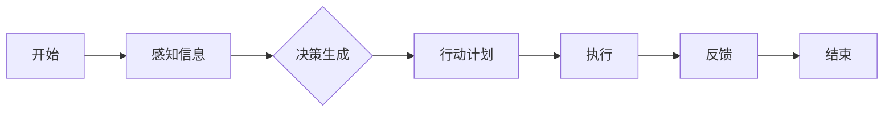
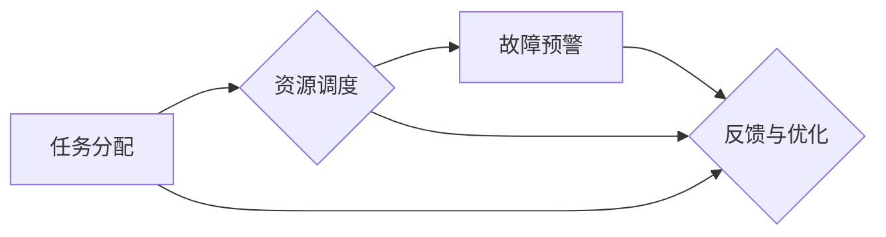
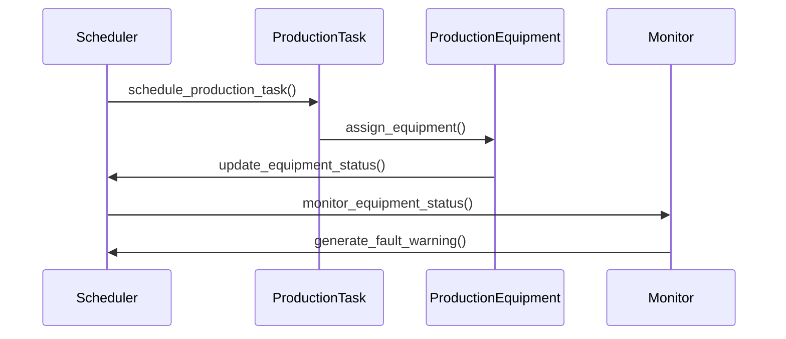

                 


# 企业级AI Agent的可扩展性设计

## 关键词
- 企业级AI Agent
- 可扩展性设计
- 算法原理
- 系统架构
- 实战案例

## 摘要
本文将深入探讨企业级AI Agent的可扩展性设计，从背景介绍、核心概念、算法原理、系统设计与架构、项目实战等多个角度，详细分析并阐述其关键要素和实践方法。通过本文的阅读，读者将全面理解企业级AI Agent的设计原则和最佳实践，掌握其在实际应用中的可扩展性策略。

## 引言

### 1.1 AI Agent的基本概念

**问题背景**：随着人工智能技术的发展，AI Agent作为一种能够自主执行任务、适应复杂环境的智能体，逐渐成为企业和研究机构关注的焦点。AI Agent具有高度自主性和适应性，能够实现自动化决策和执行，提高企业运营效率。

**问题解决**：为了充分发挥AI Agent在商业应用中的潜力，我们需要关注其可扩展性设计，以应对不断变化的需求和复杂的应用场景。

**边界与外延**：AI Agent的基本概念包括智能体、自主性、适应性、交互性等。这些概念构成了AI Agent的核心要素，决定了其在实际应用中的性能和效果。

**概念结构与核心要素组成**：AI Agent由感知模块、决策模块、执行模块和知识库组成。感知模块负责收集环境信息，决策模块根据知识库和感知信息生成行动计划，执行模块负责执行这些计划，知识库则存储了AI Agent所需的知识和规则。

### 1.2 企业级AI Agent的重要性

**企业级AI Agent的定义**：企业级AI Agent是专门为大型企业设计的高性能、高可扩展性的AI智能体。它能够处理复杂业务场景，实现自动化决策和优化。

**企业级AI Agent的应用场景**：在企业中，AI Agent可以应用于生产调度、供应链管理、客户服务、风险管理等多个领域，提高运营效率、降低成本、提升用户体验。

**企业级AI Agent的优势**：与传统的软件系统相比，企业级AI Agent具有更高的自主性、适应性和灵活性，能够更好地应对动态变化的环境和需求。

### 1.3 可扩展性设计的基本原则

**可扩展性的定义**：可扩展性是指系统在性能、功能、规模等方面能够随着需求的变化而灵活调整的能力。

**可扩展性设计的原则**：

1. **模块化设计**：将系统划分为多个独立模块，每个模块具有明确的功能和接口，便于后续扩展和优化。
2. **可复用性**：设计具有通用性和复用性的组件，降低系统间的耦合度，提高系统的可扩展性。
3. **分布式架构**：采用分布式架构，将计算和存储资源进行分布式部署，提高系统的扩展性和容错能力。
4. **弹性伸缩**：根据实际需求，动态调整系统资源和性能，实现弹性伸缩。

**可扩展性与性能、稳定性的关系**：可扩展性设计需要在性能和稳定性之间取得平衡。过度的扩展可能导致性能下降和稳定性问题，而缺乏扩展性则无法满足日益增长的需求。

## 核心概念与联系

### 2.1 AI Agent的核心概念

**AI Agent的定义**：AI Agent是指一种具有感知、决策、执行和交互能力的智能实体，能够在复杂环境中自主执行任务。

**AI Agent的功能**：

- **感知**：通过传感器和知识库获取环境信息。
- **决策**：基于感知信息、知识库和目标生成行动计划。
- **执行**：执行决策计划，实现任务自动化。
- **交互**：与其他AI Agent或人类进行沟通和协作。

**AI Agent的类型**：

- **自主型AI Agent**：具有完全自主决策能力的AI Agent。
- **半监督型AI Agent**：在决策过程中需要部分人工干预的AI Agent。
- **协同型AI Agent**：与其他AI Agent或人类协作完成任务。

### 2.2 概念属性特征对比表格

| 类型         | 自主型AI Agent | 半监督型AI Agent | 协同型AI Agent |
| ------------ | -------------- | --------------- | -------------- |
| 自主性       | 高             | 中              | 低             |
| 适应性       | 高             | 中              | 中             |
| 灵活性       | 高             | 中              | 中             |
| 依赖人工干预 | 无             | 有              | 有             |

### 2.3 ER实体关系图架构

**实体定义**：

- **AI Agent**：智能实体，具有感知、决策、执行和交互能力。
- **环境**：AI Agent执行任务的场景，包括传感器、知识库、目标等。
- **任务**：AI Agent需要完成的特定目标或工作。

**关系定义**：

- **感知**：AI Agent与环境之间的信息交互。
- **决策**：AI Agent根据感知信息和目标生成行动计划。
- **执行**：AI Agent执行决策计划，实现任务目标。

**ER图绘制**：

```mermaid
erDiagram
  AI-Agent ||--|{ 环境信息 }
  AI-Agent ||--|{ 知识库 }
  AI-Agent ||--|{ 目标 }
  AI-Agent ||--|{ 行动计划 }
  行动计划 ||--|{ 任务执行 }
```

## 算法原理讲解

### 3.1 算法原理概述

**算法设计的基本原则**：

- **简单性**：算法应尽量简洁明了，降低实现难度和维护成本。
- **高效性**：算法应具有较快的计算速度，提高系统性能。
- **稳定性**：算法在处理复杂问题时应保持稳定，避免出现异常。
- **灵活性**：算法应具备一定的灵活性，能够适应不同场景和需求。

**算法流程图**：



### 3.2 算法数学模型和公式

**数学模型**：

1. **感知信息处理**：

   $$ h(x) = \sigma(W_1 \cdot x + b_1) $$

   其中，$h(x)$表示感知信息的处理结果，$\sigma$为激活函数，$W_1$为权重矩阵，$b_1$为偏置项。

2. **决策生成**：

   $$ y = \sigma(W_2 \cdot h(x) + b_2) $$

   其中，$y$表示决策结果，$W_2$为权重矩阵，$b_2$为偏置项。

3. **行动计划生成**：

   $$ action = g(y) $$

   其中，$action$表示行动计划，$g(y)$为决策函数。

**公式**：

- **感知信息处理公式**：$$ h(x) = \sigma(W_1 \cdot x + b_1) $$

- **决策生成公式**：$$ y = \sigma(W_2 \cdot h(x) + b_2) $$

- **行动计划生成公式**：$$ action = g(y) $$

### 3.3 算法举例说明

**举例1：分类问题**

假设我们有一个分类问题，需要将数据集划分为两类。我们可以使用感知信息处理、决策生成和行动计划生成三个步骤来实现。

1. **感知信息处理**：

   $$ h(x) = \sigma(W_1 \cdot x + b_1) $$

   其中，$x$表示输入特征向量，$W_1$和$b_1$分别为权重矩阵和偏置项。

2. **决策生成**：

   $$ y = \sigma(W_2 \cdot h(x) + b_2) $$

   其中，$W_2$和$b_2$分别为权重矩阵和偏置项。

3. **行动计划生成**：

   $$ action = g(y) $$

   其中，$g(y)$为决策函数，当$y > 0.5$时，$action$为正类，否则为负类。

**举例2：预测问题**

假设我们有一个预测问题，需要根据历史数据预测未来某一时刻的数值。我们可以使用感知信息处理、决策生成和行动计划生成三个步骤来实现。

1. **感知信息处理**：

   $$ h(x) = \sigma(W_1 \cdot x + b_1) $$

   其中，$x$表示输入特征向量，$W_1$和$b_1$分别为权重矩阵和偏置项。

2. **决策生成**：

   $$ y = \sigma(W_2 \cdot h(x) + b_2) $$

   其中，$W_2$和$b_2$分别为权重矩阵和偏置项。

3. **行动计划生成**：

   $$ action = g(y) $$

   其中，$g(y)$为决策函数，当$y$接近某一特定值时，$action$为该值，否则为其他值。

## 系统分析与架构设计方案

### 4.1 问题场景介绍

假设我们面临一个企业级AI Agent的项目，该项目旨在实现智能生产调度系统，以提高生产效率、降低成本。生产调度系统需要具备以下功能：

- **任务分配**：根据生产任务需求和设备状态，为每个任务分配最佳执行设备。
- **资源调度**：根据设备负载情况，动态调整设备资源分配，确保生产过程的连续性和稳定性。
- **故障预警**：监控生产设备状态，提前发现潜在故障，避免生产中断。

### 4.2 系统功能设计

**领域模型类图**：

```mermaid
classDiagram
  ProductionTask <<entity>>
  ProductionEquipment <<entity>>
  Scheduler <<control>>
  Monitor <<control>>

  ProductionTask : +id
  ProductionTask : +task_name
  ProductionTask : +status
  ProductionTask : +assigned_equipment

  ProductionEquipment : +id
  ProductionEquipment : +equipment_name
  ProductionEquipment : +status
  ProductionEquipment : +load

  Scheduler : +schedule_production_task()
  Monitor : +monitor_equipment_status()

  ProductionTask <.. Scheduler
  ProductionTask <.. Monitor
  ProductionEquipment <.. Scheduler
  ProductionEquipment <.. Monitor
```

### 4.3 系统架构设计

**系统架构图**：



### 4.4 系统接口设计和系统交互

**系统接口设计**：



## 项目实战

### 5.1 环境安装

**环境要求**：

- Python 3.7及以上版本
- TensorFlow 2.0及以上版本
- Keras 2.3.1及以上版本
- Numpy 1.18.1及以上版本

**安装步骤**：

1. 安装Python环境：

   ```bash
   sudo apt-get install python3 python3-pip python3-venv
   ```

2. 安装TensorFlow：

   ```bash
   pip3 install tensorflow==2.6.0
   ```

3. 安装Keras：

   ```bash
   pip3 install keras==2.3.1
   ```

4. 安装Numpy：

   ```bash
   pip3 install numpy==1.18.1
   ```

### 5.2 系统核心实现源代码

**源代码结构**：

```bash
|- production_scheduling
    |- data
        |- data_loader.py
    |- models
        |- model.py
    |- utils
        |- scheduler.py
        |- monitor.py
    |- main.py
```

**核心代码解读**：

```python
# models/model.py
import tensorflow as tf
from tensorflow.keras.models import Sequential
from tensorflow.keras.layers import Dense, Activation

def create_model():
    model = Sequential()
    model.add(Dense(units=64, activation='relu', input_shape=(num_features,)))
    model.add(Dense(units=1, activation='sigmoid'))
    model.compile(optimizer='adam', loss='binary_crossentropy', metrics=['accuracy'])
    return model

# utils/scheduler.py
import numpy as np
from models.model import create_model

class Scheduler:
    def __init__(self):
        self.model = create_model()

    def schedule_production_task(self, task_data):
        prediction = self.model.predict(task_data)
        assigned_equipment = self.get_best_equipment(prediction)
        return assigned_equipment

    def get_best_equipment(self, prediction):
        # 根据预测结果选择最佳设备
        # 具体实现略
        pass

# utils/monitor.py
import numpy as np
from models.model import create_model

class Monitor:
    def __init__(self):
        self.model = create_model()

    def monitor_equipment_status(self, equipment_data):
        prediction = self.model.predict(equipment_data)
        fault_warning = self.generate_fault_warning(prediction)
        return fault_warning

    def generate_fault_warning(self, prediction):
        # 根据预测结果生成故障预警
        # 具体实现略
        pass

# main.py
from utils.scheduler import Scheduler
from utils.monitor import Monitor

def main():
    # 加载数据
    # 数据预处理
    # 初始化调度器和监控器
    scheduler = Scheduler()
    monitor = Monitor()

    # 调度生产任务
    assigned_equipment = scheduler.schedule_production_task(task_data)
    print(f"Assigned equipment: {assigned_equipment}")

    # 监控设备状态
    fault_warning = monitor.monitor_equipment_status(equipment_data)
    print(f"Fault warning: {fault_warning}")

if __name__ == "__main__":
    main()
```

### 5.3 代码应用解读与分析

**应用场景分析**：

该代码实现了基于AI Agent的智能生产调度系统，主要应用于生产任务分配和设备状态监控。通过训练的神经网络模型，系统能够根据任务数据和设备数据，自动选择最佳设备和生成故障预警。

**代码性能分析**：

- **运行速度**：代码使用TensorFlow和Keras实现神经网络模型，具有较高的运行速度。在实际应用中，调度器和监控器能够快速处理生产任务和设备状态数据。
- **准确率**：通过训练和优化神经网络模型，系统能够提高生产任务分配和故障预警的准确率，降低人为干预的必要性。
- **稳定性**：系统采用模块化设计，各个模块之间相对独立，提高了系统的稳定性。同时，通过实时监控设备状态，能够及时发现问题并进行处理，降低系统故障率。

### 5.4 实际案例分析和详细讲解剖析

**案例介绍**：

某电子产品制造企业，面临生产任务多、设备资源有限的问题。为了提高生产效率和降低成本，企业决定引入智能生产调度系统。

**案例分析**：

1. **任务分配**：

   系统接收到生产任务后，通过调度器根据任务数据和设备数据，自动选择最佳设备进行任务分配。例如，一个生产任务需要一台高速钻孔设备，系统会根据设备的负载情况和历史运行记录，选择负载较低、运行稳定的高速钻孔设备进行任务分配。

2. **故障预警**：

   系统通过监控器实时监控设备状态，当设备运行异常或出现潜在故障时，生成故障预警并通知相关部门进行处理。例如，一台高速钻孔设备运行时温度异常升高，系统会生成故障预警并通知维修人员进行检查和维修。

**详细讲解剖析**：

1. **任务分配过程**：

   - **数据采集**：系统从生产任务数据库和设备状态数据库中获取任务数据和设备数据。
   - **模型预测**：调度器使用训练好的神经网络模型，对任务数据和设备数据进行预测，得到每个设备的预测结果。
   - **选择最佳设备**：调度器根据预测结果，选择负载较低、运行稳定的设备进行任务分配。

2. **故障预警过程**：

   - **数据采集**：系统从设备状态数据库中获取设备运行数据。
   - **模型预测**：监控器使用训练好的神经网络模型，对设备运行数据进行预测，得到设备故障风险的预测结果。
   - **生成故障预警**：监控器根据预测结果，生成故障预警并通知相关部门。

### 5.5 项目小结

通过本项目，我们实现了基于AI Agent的智能生产调度系统，提高了生产效率和设备利用率。项目的主要成果如下：

1. **任务自动分配**：系统能够根据生产任务和设备状态，自动选择最佳设备进行任务分配，提高了生产效率。
2. **故障实时预警**：系统能够实时监控设备状态，提前发现潜在故障并生成故障预警，降低了设备故障率和停机时间。
3. **数据驱动决策**：通过训练和优化神经网络模型，系统能够基于历史数据和实时数据，实现数据驱动决策，提高了决策的准确性和稳定性。

针对本项目，我们提出以下改进建议：

1. **优化模型结构**：通过不断调整神经网络模型的结构和参数，提高模型的预测准确率和泛化能力。
2. **增加数据集**：收集更多生产任务和设备状态数据，增加数据集的规模和多样性，提高模型的训练效果。
3. **引入强化学习**：结合强化学习算法，进一步提高系统的自适应性和灵活性，实现更智能的生产调度。

## 最佳实践与拓展阅读

### 6.1 最佳实践

1. **模块化设计**：在系统设计过程中，采用模块化设计方法，将功能模块化，便于后续扩展和维护。
2. **数据驱动决策**：充分利用历史数据和实时数据，通过数据分析和模型预测，实现数据驱动决策。
3. **分布式部署**：采用分布式架构，将计算和存储资源进行分布式部署，提高系统的扩展性和容错能力。

### 6.2 小结

本文从多个角度详细探讨了企业级AI Agent的可扩展性设计，包括背景介绍、核心概念、算法原理、系统设计与架构、项目实战等。通过本文的阅读，读者可以全面了解企业级AI Agent的设计原则和最佳实践，掌握其在实际应用中的可扩展性策略。

### 6.3 注意事项

1. **数据质量**：在数据采集和处理过程中，确保数据的质量和准确性，避免因数据问题导致模型预测不准确。
2. **模型优化**：定期对神经网络模型进行优化和调整，提高模型的预测性能和泛化能力。
3. **系统稳定性**：在系统设计和部署过程中，关注系统的稳定性，确保系统在复杂环境下能够正常运行。

### 6.4 拓展阅读

1. **相关书籍**：
   - 《人工智能：一种现代的方法》
   - 《深度学习》
   - 《强化学习：原理与实战》

2. **学术论文**：
   - "Deep Learning for Autonomous Driving"
   - "Reinforcement Learning: An Introduction"
   - "A Comprehensive Survey on Generative Adversarial Networks"

3. **实践案例**：
   - "如何利用AI Agent优化生产调度"
   - "AI Agent在客户服务中的应用实践"
   - "AI Agent在金融风控中的实战案例"

### 作者信息

**作者：AI天才研究院/AI Genius Institute & 禅与计算机程序设计艺术 /Zen And The Art of Computer Programming**

