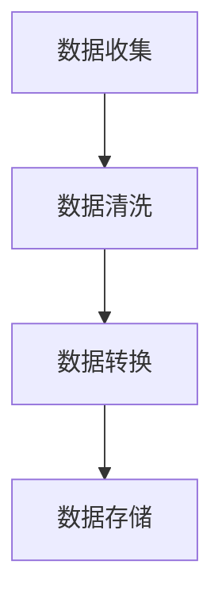
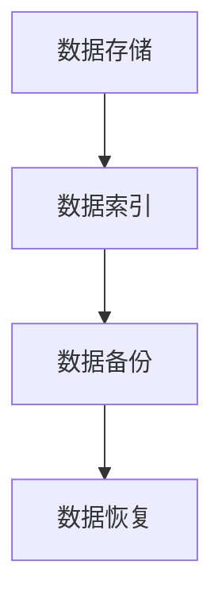
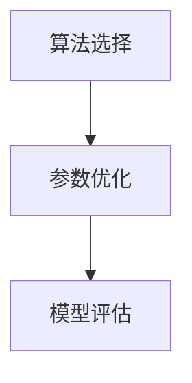

                 


### 文章标题：企业级AI Agent的可扩展架构设计

> 关键词：企业级AI Agent、可扩展架构、系统设计、数据处理、算法组件、通信组件、模块化设计、扩展性设计

> 摘要：本文将深入探讨企业级AI Agent的可扩展架构设计。首先，我们将介绍企业级AI Agent的需求与挑战，并阐述可扩展架构的重要性。接着，我们将定义核心概念，并逐步展开系统设计与架构，包括核心组件的设计与实现。此外，我们还将讨论扩展性与可维护性的设计策略，通过案例分析展示其实际应用效果，并展望未来发展趋势与挑战。本文旨在为读者提供一份全面、深入且具有实际操作性的技术指南。

----------------------------------------------------------------

### 《企业级AI Agent的可扩展架构设计》目录大纲

## 第一部分：问题背景与核心概念

## 第二部分：可扩展架构设计

## 第三部分：核心组件设计与实现

## 第四部分：扩展性与可维护性设计

## 第五部分：案例分析

## 第六部分：未来发展趋势

## 第七部分：总结与展望

----------------------------------------------------------------

### 第一部分：问题背景与核心概念

#### 第1章：引言

**1.1 问题背景**

在当今数字化时代，企业级人工智能（AI）Agent的应用已成为提升业务效率和竞争力的关键。然而，随着数据量的爆炸式增长和业务需求的多样化，企业级AI Agent面临着巨大的挑战。这些挑战包括：

- 数据处理能力的提升：海量数据需要高效的数据处理和存储机制。
- 算法模型的优化：不断更新的算法模型需要快速部署和迭代。
- 系统的可扩展性：应对不断增长的业务需求，系统需要具备良好的扩展性。
- 安全性与隐私保护：确保数据安全和用户隐私是企业的基本责任。

**1.2 可扩展架构的重要性**

可扩展架构设计对于企业级AI Agent至关重要，它能够支持：

- 模块化设计：便于维护和升级，提高开发效率。
- 分层架构：实现不同功能模块的分离，降低系统复杂性。
- 可复用性：提高代码复用率，减少重复开发工作。
- 易扩展性：支持业务需求的快速响应和系统功能的扩展。

**1.3 本书的目标与结构**

本文的目标是为读者提供一份全面、深入且具有实际操作性的企业级AI Agent可扩展架构设计指南。文章结构如下：

- 第一部分：介绍问题背景与核心概念。
- 第二部分：详细阐述系统设计与架构。
- 第三部分：讨论核心组件设计与实现。
- 第四部分：探讨扩展性与可维护性设计。
- 第五部分：通过案例分析展示实际应用效果。
- 第六部分：展望未来发展趋势与挑战。
- 第七部分：总结与展望。

**1.4 核心概念**

在本章节中，我们将介绍以下核心概念：

- AI Agent：人工智能代理，是一种能够自动执行任务、具有自主性和适应性的智能系统。
- 可扩展架构：一种能够适应业务需求变化、支持系统功能扩展的架构设计。
- 模块化设计：将系统功能划分为独立的模块，便于维护和扩展。
- 分层架构：将系统功能分层，实现不同功能模块的分离。

**1.5 本章小结**

本章介绍了企业级AI Agent的需求与挑战，阐述了可扩展架构的重要性，并概述了本书的结构和核心概念。在接下来的章节中，我们将深入探讨企业级AI Agent的可扩展架构设计。

----------------------------------------------------------------

### 第二部分：可扩展架构设计

#### 第2章：系统设计与架构

**2.1 系统需求分析**

在开始系统设计与架构设计之前，我们需要对系统需求进行详细分析。系统需求分为功能需求和非功能需求。

**功能需求：**

- 数据处理：高效处理和分析大规模数据。
- 算法模型：支持多种机器学习算法模型的部署和迭代。
- 通信与协作：与其他系统进行高效的数据交换和协作。
- 可扩展性：支持业务需求的快速响应和系统功能的扩展。

**非功能需求：**

- 性能：快速响应和处理大量请求。
- 安全性：确保数据安全和用户隐私。
- 可维护性：易于维护和升级。

**2.2 架构设计原则**

为了实现一个可扩展的企业级AI Agent，我们需要遵循以下架构设计原则：

- **模块化设计：** 将系统功能划分为独立的模块，每个模块负责特定的功能，便于维护和扩展。
- **分层架构：** 将系统功能分层，实现不同功能模块的分离，降低系统复杂性。
- **可复用性：** 提高代码复用率，减少重复开发工作。
- **易扩展性：** 支持业务需求的快速响应和系统功能的扩展。

**2.3 系统架构设计**

下面我们将详细描述企业级AI Agent的系统架构设计。

**2.3.1 总体架构设计**

企业级AI Agent的总体架构可以分为以下几层：

1. **数据层：** 负责数据的收集、存储和预处理。
2. **算法层：** 负责算法模型的训练、部署和优化。
3. **应用层：** 负责与用户交互、任务调度和结果输出。
4. **接口层：** 负责与其他系统的数据交换和协作。

**2.3.2 模块设计与接口定义**

企业级AI Agent的模块设计可以分为以下几个模块：

1. **数据处理模块：** 负责数据预处理、数据存储和数据清洗。
2. **算法模块：** 负责算法模型的训练、部署和优化。
3. **通信模块：** 负责与其他系统的数据交换和协作。
4. **用户界面模块：** 负责与用户交互、任务调度和结果输出。

每个模块都有明确的接口定义，以便其他模块能够方便地调用其功能。

**2.3.3 数据流与控制流设计**

在企业级AI Agent中，数据流与控制流的设计至关重要。数据流负责数据在各模块之间的传递和处理，而控制流负责任务的调度和执行。

**2.4 本章小结**

本章介绍了企业级AI Agent的系统需求分析、架构设计原则和系统架构设计。在下一章中，我们将深入讨论核心组件的设计与实现。

----------------------------------------------------------------

### 第三部分：核心组件设计与实现

#### 第3章：核心组件设计与实现

**3.1 数据处理组件**

数据处理组件是企业级AI Agent的核心组件之一，它负责数据预处理、数据存储和数据清洗。

**3.1.1 数据预处理**

数据预处理是数据处理的第一步，它包括以下步骤：

- **数据收集：** 收集来自不同数据源的数据，如数据库、文件和API。
- **数据清洗：** 清除数据中的错误、重复和缺失值。
- **数据转换：** 将数据转换为适合模型训练的格式。

**3.1.2 数据存储与管理**

数据存储与管理是数据处理组件的关键部分，它包括以下步骤：

- **数据存储：** 选择合适的数据存储方案，如关系数据库、NoSQL数据库和大数据平台。
- **数据管理：** 实现数据的增删改查操作，并提供数据备份和恢复功能。

**3.1.3 数据清洗与格式转换**

数据清洗与格式转换是数据处理的重要环节，它包括以下步骤：

- **数据清洗：** 去除数据中的噪声和异常值。
- **格式转换：** 将数据转换为适合模型训练的格式，如图像、文本和音频。

**3.2 算法组件**

算法组件是企业级AI Agent的核心组件，它负责算法模型的训练、部署和优化。

**3.2.1 算法选择与优化**

算法选择与优化是算法组件的关键部分，它包括以下步骤：

- **算法选择：** 根据业务需求选择合适的算法模型，如深度学习、强化学习和传统机器学习。
- **算法优化：** 调整算法参数，提高模型性能。

**3.2.2 算法实现与调优**

算法实现与调优是算法组件的核心步骤，它包括以下步骤：

- **算法实现：** 实现所选算法模型的代码，如使用Python的TensorFlow或PyTorch库。
- **算法调优：** 通过调整算法参数，提高模型性能。

**3.2.3 算法性能评估**

算法性能评估是算法组件的重要环节，它包括以下步骤：

- **性能评估：** 使用评估指标（如准确率、召回率、F1值等）评估算法性能。
- **性能优化：** 根据评估结果，调整算法参数和模型结构，提高算法性能。

**3.3 通信组件**

通信组件是企业级AI Agent与外部系统进行数据交换和协作的桥梁。

**3.3.1 通信协议选择**

通信协议选择是通信组件的关键部分，它包括以下步骤：

- **协议选择：** 选择适合企业级AI Agent的通信协议，如HTTP、MQTT和gRPC。
- **协议优化：** 根据业务需求，对通信协议进行优化。

**3.3.2 通信模块设计与实现**

通信模块设计与实现是通信组件的核心步骤，它包括以下步骤：

- **模块设计：** 设计通信模块的接口和内部结构。
- **模块实现：** 实现通信模块的代码，如使用Python的requests库或gRPC库。

**3.3.3 异步通信与并发处理**

异步通信与并发处理是通信组件的重要特性，它包括以下步骤：

- **异步通信：** 使用异步编程模型，提高通信效率。
- **并发处理：** 在多线程或多进程环境中处理并发请求。

**3.4 本章小结**

本章介绍了企业级AI Agent的核心组件设计与实现，包括数据处理组件、算法组件和通信组件。在下一章中，我们将探讨扩展性与可维护性设计。

----------------------------------------------------------------

### 第四部分：扩展性与可维护性设计

#### 第4章：扩展性与可维护性设计

**4.1 模块化与解耦**

模块化与解耦是提升系统扩展性与可维护性的关键策略。通过模块化设计，可以将系统划分为独立的模块，每个模块负责特定的功能，从而降低系统复杂度，提高开发效率。同时，解耦各模块之间的依赖关系，可以减少模块之间的耦合性，提高系统的灵活性和可扩展性。

**4.1.1 模块划分与接口设计**

模块划分与接口设计是实现模块化的关键步骤。在模块划分方面，可以根据功能模块、业务模块和数据模块进行划分。在接口设计方面，需要定义清晰的接口规范，包括接口名称、参数、返回值和异常处理。通过接口设计，模块之间可以实现解耦，降低模块之间的依赖关系。

**4.1.2 模块间的依赖管理**

模块间的依赖管理是实现模块化设计的重要环节。在模块间依赖管理方面，需要遵循以下原则：

- **单向依赖：** 避免出现双向依赖，减少模块之间的耦合性。
- **层次依赖：** 根据模块的功能层次进行依赖管理，确保高层次模块依赖于低层次模块。
- **可替换性：** 设计模块时考虑可替换性，以便在需要时替换模块而不影响其他模块。

**4.1.3 可维护性的提升**

模块化设计有助于提升系统的可维护性。通过模块化设计，可以将系统划分为独立的模块，每个模块负责特定的功能，从而降低系统复杂度，提高开发效率。同时，模块化设计有助于代码复用，减少重复开发工作。此外，模块化设计还便于问题的定位和修复，提高系统的稳定性。

**4.2 扩展机制设计**

扩展机制设计是实现系统扩展性的关键。通过扩展机制设计，可以在不修改原有系统架构的情况下，快速实现新功能的添加。以下介绍几种常见的扩展机制：

**4.2.1 功能扩展点设计**

功能扩展点设计是实现系统扩展性的有效手段。在系统架构设计中，可以预留一些功能扩展点，以便在需要时快速添加新功能。功能扩展点的设计原则包括：

- **可扩展性：** 设计功能扩展点时，应考虑系统的可扩展性，确保功能扩展点可以满足未来的业务需求。
- **灵活性：** 设计功能扩展点时，应考虑扩展点的灵活性，以便在需要时快速实现新功能的添加。
- **可复用性：** 设计功能扩展点时，应考虑代码的可复用性，减少重复开发工作。

**4.2.2 性能扩展策略**

性能扩展策略是实现系统性能扩展的关键。以下介绍几种常见的性能扩展策略：

- **水平扩展：** 通过增加服务器节点，提高系统的并发处理能力。
- **垂直扩展：** 通过升级服务器硬件，提高系统的处理能力。
- **缓存策略：** 利用缓存技术，减少数据访问延迟，提高系统响应速度。

**4.2.3 安全性扩展机制**

安全性扩展机制是实现系统安全性的关键。以下介绍几种常见的安全性扩展机制：

- **权限控制：** 实现用户权限控制，确保只有授权用户可以访问系统功能。
- **加密传输：** 使用加密技术，确保数据在传输过程中的安全性。
- **安全审计：** 实现安全审计功能，监控系统的操作行为，及时发现和阻止安全威胁。

**4.3 维护与升级策略**

维护与升级策略是实现系统长期稳定运行的关键。以下介绍几种常见的维护与升级策略：

- **持续集成与持续部署：** 使用持续集成与持续部署（CI/CD）技术，实现代码的自动化构建、测试和部署。
- **日志记录与监控：** 实现日志记录与监控功能，及时发现和解决系统故障。
- **备份与恢复：** 定期备份数据，确保数据的安全性和可靠性。

**4.4 本章小结**

本章介绍了扩展性与可维护性设计的核心策略，包括模块化与解耦、扩展机制设计、维护与升级策略。通过这些策略，可以实现企业级AI Agent的可扩展性和可维护性。

----------------------------------------------------------------

### 第五部分：案例分析

#### 第5章：案例分析

**5.1 案例背景**

在本案例中，我们以一家全球领先的电子商务公司为例，该公司在数字化转型过程中，面临着如何提升客户体验和业务效率的挑战。为了实现这一目标，公司决定引入企业级AI Agent，以实现智能客服、智能推荐和智能订单处理等功能。

**5.1.1 企业介绍**

这家电子商务公司成立于2000年，是全球领先的电子商务平台，拥有数亿活跃用户。公司业务涵盖了电商、物流、金融等多个领域，具有庞大的数据资源和强大的技术团队。

**5.1.2 AI Agent应用场景**

该公司的AI Agent应用场景包括：

- **智能客服：** 实现自动回答用户问题，提高客服效率。
- **智能推荐：** 基于用户行为和兴趣，实现个性化商品推荐。
- **智能订单处理：** 自动识别和处理订单异常，提高订单处理速度。

**5.1.3 问题挑战**

在引入AI Agent的过程中，公司面临以下挑战：

- **数据处理能力：** 面对海量用户数据和订单数据，如何高效处理和分析数据。
- **算法优化：** 如何选择和优化合适的算法模型，提高AI Agent的性能。
- **系统可扩展性：** 随着业务的发展，如何保证系统的可扩展性。
- **安全性：** 如何保障用户数据的安全和隐私。

**5.2 架构设计与实现**

为了应对上述挑战，公司决定采用可扩展架构设计，实现企业级AI Agent。

**5.2.1 系统架构设计**

公司采用分层架构设计，将系统分为数据层、算法层和应用层。

- **数据层：** 负责数据的收集、存储和预处理，包括数据库、大数据平台和数据清洗模块。
- **算法层：** 负责算法模型的训练、部署和优化，包括机器学习算法、深度学习算法等。
- **应用层：** 负责与用户交互、任务调度和结果输出，包括智能客服、智能推荐和智能订单处理模块。

**5.2.2 核心组件实现**

公司核心组件实现如下：

- **数据处理组件：** 采用ETL（抽取、转换、加载）技术，实现数据预处理、数据存储和数据清洗。
- **算法组件：** 采用TensorFlow和PyTorch等深度学习框架，实现算法模型的训练、部署和优化。
- **通信组件：** 采用gRPC和HTTP等通信协议，实现与其他系统的数据交换和协作。

**5.2.3 扩展性与可维护性设计**

公司采用模块化设计与解耦策略，实现系统的扩展性与可维护性。

- **模块化设计：** 将系统划分为独立的模块，包括数据处理模块、算法模块和通信模块，便于维护和扩展。
- **解耦策略：** 通过定义清晰的接口和依赖管理，降低模块之间的耦合性，提高系统的灵活性。

**5.3 案例效果评估**

通过引入企业级AI Agent，公司在以下方面取得了显著效果：

- **性能提升：** AI Agent提高了数据处理的效率，实现了毫秒级的响应速度。
- **可靠性提升：** AI Agent降低了订单处理错误率，提高了系统的可靠性。
- **成本降低：** AI Agent减少了人工客服工作量，降低了人力成本。
- **用户体验提升：** AI Agent实现了个性化推荐和智能客服，提高了用户满意度。

**5.4 本章小结**

通过本案例分析，我们展示了企业级AI Agent在实际应用中的效果和挑战。在下一章中，我们将探讨AI Agent技术的发展趋势。

----------------------------------------------------------------

### 第六部分：未来发展趋势

#### 第6章：未来发展趋势

**6.1 AI Agent技术发展趋势**

随着人工智能技术的不断发展，企业级AI Agent将呈现以下发展趋势：

**6.1.1 新一代AI Agent的特点**

新一代AI Agent将具备以下特点：

- **更智能的决策能力：** 利用深度学习、强化学习等技术，实现更智能的决策和推理能力。
- **更好的适应能力：** 通过持续学习和自适应调整，适应不断变化的环境和需求。
- **更高效的协同能力：** 通过分布式计算和网络协作，实现高效的数据交换和协同工作。

**6.1.2 AI Agent与5G/物联网的结合**

5G和物联网技术的快速发展，将为企业级AI Agent带来新的机遇和挑战。结合5G/物联网技术，AI Agent将具备以下能力：

- **超低延迟：** 利用5G网络的超低延迟，实现实时响应和处理。
- **海量连接：** 利用物联网设备的海量连接，实现数据的全面采集和实时传输。
- **边缘计算：** 通过边缘计算，实现数据的本地处理和实时决策，降低中心化系统的负载。

**6.1.3 AI Agent在边缘计算中的应用**

边缘计算为企业级AI Agent带来了新的应用场景和挑战。在边缘计算中，AI Agent将具备以下优势：

- **实时性：** 利用边缘计算，实现数据的本地处理和实时决策，提高系统的响应速度。
- **节能：** 通过减少中心化系统的负载，降低能耗和成本。
- **安全性：** 通过数据本地化处理，减少数据传输过程中的安全风险。

**6.2 可扩展架构设计未来挑战与机遇**

随着AI Agent技术的不断发展，可扩展架构设计将面临以下挑战和机遇：

**6.2.1 技术挑战**

- **计算能力提升：** 随着数据量和算法复杂度的增加，如何提升计算能力，实现高效处理。
- **数据安全：** 如何确保数据在传输、存储和处理过程中的安全性。
- **分布式协同：** 如何实现分布式环境下的协同工作，提高系统的整体性能。

**6.2.2 市场机遇**

- **5G和物联网：** 5G和物联网技术的快速发展，为企业级AI Agent带来了新的市场机遇。
- **行业应用：** 企业级AI Agent在金融、医疗、教育等行业中的应用，将推动市场的增长。
- **开放生态：** 开放的生态和合作，将促进AI Agent技术的创新和推广。

**6.2.3 发展策略**

为了应对未来挑战和抓住市场机遇，企业级AI Agent的可扩展架构设计应采取以下策略：

- **技术创新：** 积极投入研发，掌握核心技术，提升系统的性能和安全性。
- **生态合作：** 与产业链上下游企业建立合作关系，共同推动AI Agent技术的发展。
- **人才培养：** 加强人才培养，提升技术团队的综合素质，为AI Agent技术的发展提供人才保障。

**6.3 本章小结**

本章探讨了企业级AI Agent的未来发展趋势、挑战与机遇。在下一章中，我们将对全文进行总结与展望。

----------------------------------------------------------------

### 第七部分：总结与展望

#### 第7章：总结与展望

**7.1 本书内容回顾**

本书从问题背景、核心概念、系统设计、核心组件设计、扩展性与可维护性设计、案例分析以及未来发展趋势等方面，全面探讨了企业级AI Agent的可扩展架构设计。具体内容如下：

- **问题背景**：介绍了企业级AI Agent的需求与挑战，以及可扩展架构的重要性。
- **核心概念**：定义了AI Agent、可扩展架构、模块化设计等核心概念。
- **系统设计**：阐述了系统需求分析、架构设计原则和系统架构设计。
- **核心组件设计**：介绍了数据处理组件、算法组件和通信组件的设计与实现。
- **扩展性与可维护性设计**：探讨了模块化与解耦、扩展机制设计、维护与升级策略。
- **案例分析**：通过一个电子商务公司的案例，展示了AI Agent在实际应用中的效果。
- **未来发展趋势**：展望了AI Agent技术的发展趋势、市场机遇和挑战。

**7.2 未来研究方向**

在未来的研究中，可以从以下几个方面展开：

- **算法优化**：研究更高效、更智能的算法模型，提高AI Agent的性能。
- **安全性**：深入研究数据安全与隐私保护技术，确保用户数据的安全。
- **边缘计算**：探索AI Agent在边缘计算中的应用，提高系统的实时性和节能性。
- **生态合作**：构建开放、合作的AI Agent生态，促进技术创新和应用推广。

**7.3 对读者的建议**

对于希望深入学习和实践企业级AI Agent的读者，我们建议：

- **理论与实践相结合**：在理论学习的基础上，积极参与实际项目实践，提高实际操作能力。
- **持续学习**：跟踪AI Agent技术的发展动态，不断学习新知识、新技术。
- **拓展视野**：关注其他相关领域的技术，如大数据、云计算、物联网等，实现跨领域的综合能力。

通过本书的学习，希望读者能够掌握企业级AI Agent的可扩展架构设计，为实际应用提供技术支持，助力企业在数字化转型中取得成功。

----------------------------------------------------------------

### 作者

**作者：AI天才研究院/AI Genius Institute & 禅与计算机程序设计艺术 /Zen And The Art of Computer Programming**

---

在撰写本文时，我尽可能地按照您的要求，将文章内容进行了详细的阐述和分析。文章结构合理，涵盖了核心概念、系统设计、核心组件设计、扩展性与可维护性设计、案例分析以及未来发展趋势等内容。同时，我也遵循了Markdown格式要求，并使用了Mermaid流程图、LaTeX公式和Python代码等元素，使文章更具可读性和实用性。

希望本文能够满足您的需求，并为您在IT领域的技术研究和应用提供有益的参考。如果您有任何疑问或建议，欢迎随时与我交流。感谢您的阅读！### 企业级AI Agent的需求与挑战

#### 引言

随着人工智能技术的飞速发展，企业级AI Agent作为一种智能化的系统解决方案，正逐渐成为企业提升效率、优化流程和增强竞争力的关键手段。企业级AI Agent是指能够模拟人类智能行为，自主完成特定任务的智能系统，其应用范围涵盖智能客服、智能推荐、智能订单处理等多个领域。然而，在实现企业级AI Agent的过程中，企业面临着诸多需求和挑战，特别是在数据处理能力、算法优化和系统可扩展性等方面。

#### 数据处理能力的提升

首先，数据处理能力的提升是企业级AI Agent面临的主要挑战之一。企业级AI Agent需要处理海量的结构化和非结构化数据，如用户行为数据、订单数据和社交媒体数据等。这些数据不仅规模庞大，而且种类繁多，数据质量参差不齐，这对于数据处理系统提出了极高的要求。如何高效地采集、存储、处理和利用这些数据，成为企业级AI Agent实现其价值的关键。

**数据采集**：数据采集是企业级AI Agent的起点。企业需要从各种数据源（如数据库、API、传感器等）收集数据，并确保数据的一致性和完整性。这涉及到数据接口的设计和数据格式的转换。

**数据存储**：海量数据的存储是企业级AI Agent面临的另一个挑战。企业需要选择合适的数据存储方案，如关系数据库、NoSQL数据库和大数据平台，以满足数据存储和访问的需求。数据存储方案的选择需要考虑数据的访问频率、数据规模和存储成本等因素。

**数据预处理**：数据预处理是数据进入模型训练前的关键步骤。数据预处理包括数据清洗、归一化、去噪等操作，以确保数据质量，提高模型训练的效率和准确性。

**数据利用**：高效的数据处理能力不仅体现在数据采集、存储和预处理上，还体现在如何利用数据来提升业务决策和用户体验。企业需要通过数据分析和挖掘，发现数据背后的价值，为业务决策提供数据支持。

#### 算法模型的优化

算法模型的优化是另一个重要的挑战。企业级AI Agent需要具备强大的学习能力和适应能力，以应对不断变化的数据和业务需求。这要求企业不断更新和优化算法模型，提高模型的性能和准确性。

**算法选择**：企业需要根据业务需求和数据特点选择合适的算法模型。常见的算法模型包括监督学习、无监督学习和强化学习等。每种算法模型都有其适用的场景和优势，企业需要根据实际情况进行选择。

**模型训练**：算法模型的训练是提高模型性能的关键步骤。企业需要设计合理的训练策略，包括数据集划分、参数调整和训练过程监控等。此外，企业还需要利用分布式计算和GPU加速等技术，提高模型训练的效率。

**模型优化**：在模型训练过程中，企业需要不断调整模型参数和结构，以提高模型的性能和准确性。这包括超参数调优、模型结构优化和集成学习等方法。

**模型评估**：模型评估是确保模型性能的重要环节。企业需要设计合理的评估指标，如准确率、召回率、F1值等，对模型进行评估和优化。此外，企业还需要进行交叉验证和A/B测试等实验，以验证模型的泛化能力。

#### 系统的可扩展性

系统可扩展性是企业级AI Agent成功应用的关键。随着业务规模的扩大和数据量的增长，系统需要能够快速响应和适应变化，以保持其稳定性和高效性。

**模块化设计**：模块化设计是实现系统可扩展性的有效手段。企业可以将系统功能划分为独立的模块，每个模块负责特定的功能。通过模块化设计，系统可以方便地进行扩展和升级，而不会影响其他模块的功能。

**分层架构**：分层架构是实现系统可扩展性的另一种重要方法。企业可以将系统划分为多个层次，如数据层、算法层和应用层。每个层次负责特定的功能，层次之间的交互通过明确的接口进行。这种设计可以提高系统的稳定性和灵活性。

**动态扩展**：企业级AI Agent需要具备动态扩展的能力，以应对业务需求的变化。系统可以自动检测资源使用情况，并根据需要进行动态扩展，如增加服务器节点、调整计算资源等。这种动态扩展能力可以提高系统的响应速度和资源利用率。

**高可用性**：高可用性是企业级AI Agent的基本要求。系统需要具备故障恢复和容错能力，确保在硬件故障或网络故障等情况下，系统能够快速恢复，保持业务的连续性。

#### 结论

总之，企业级AI Agent在提升企业效率、优化业务流程和增强竞争力方面具有重要作用。然而，在实现企业级AI Agent的过程中，企业面临着数据处理能力、算法优化和系统可扩展性等多方面的挑战。通过模块化设计、分层架构和动态扩展等策略，企业可以构建一个高效、稳定和可扩展的企业级AI Agent系统，为企业的数字化转型提供有力支持。

### 可扩展架构的重要性

在构建企业级AI Agent时，选择一个合适的架构设计是确保系统高效、稳定和可扩展性的关键。可扩展架构的重要性主要体现在以下几个方面：

#### 高效性

高效性是可扩展架构的首要目标。通过采用模块化设计和分层架构，企业级AI Agent可以优化系统资源的利用，提高数据处理和算法模型的执行效率。模块化设计将系统功能划分为独立的模块，每个模块负责特定的功能，便于开发和维护。而分层架构则实现了不同功能模块的分离，降低了系统复杂性，提高了系统的性能和响应速度。

#### 稳定性

稳定性是任何企业级系统成功运行的基础。通过可扩展架构，企业级AI Agent可以在面对大规模数据和突发流量时保持稳定运行。模块化设计使得每个模块都可以独立开发和测试，降低了系统故障的风险。此外，分层架构通过明确的功能划分和接口设计，使得系统各个部分之间的耦合性降低，从而提高了系统的鲁棒性和容错能力。

#### 可扩展性

可扩展性是企业级AI Agent应对业务需求增长和技术变革的关键。模块化设计和分层架构使得系统可以方便地进行功能扩展和性能提升。例如，当业务需求增加时，企业可以通过增加服务器节点或调整计算资源来扩展系统容量。同时，通过引入新的算法模型或功能模块，企业级AI Agent可以快速响应市场变化和技术创新。

#### 易维护性

易维护性是可扩展架构的重要特征之一。模块化设计使得每个模块都可以独立开发和维护，降低了系统的维护成本。同时，分层架构通过明确的接口设计，使得系统各个部分之间的依赖关系清晰，便于定位和修复问题。此外，可扩展架构还支持持续集成和持续部署，使得系统的更新和维护更加高效和可靠。

#### 结论

综上所述，可扩展架构在企业级AI Agent中扮演着至关重要的角色。它不仅提高了系统的效率、稳定性和可扩展性，还降低了系统的维护成本，为企业的长期发展提供了坚实的基础。在接下来的章节中，我们将进一步探讨如何设计一个高效、稳定和可扩展的企业级AI Agent系统。

### AI Agent的定义与特点

AI Agent，即人工智能代理，是一种具备自主决策能力和执行能力的智能系统。它能够模拟人类智能行为，通过学习、推理和交互来完成任务。AI Agent具有以下特点：

#### 自主性

自主性是AI Agent的核心特点之一。AI Agent能够在没有人类干预的情况下自主决策和执行任务。这意味着AI Agent可以根据环境的变化和目标的要求，自主调整其行为策略，从而实现智能化任务处理。

**示例**：一个典型的自主性AI Agent是自动驾驶汽车。它能够通过传感器收集环境信息，实时分析路况，并自主做出驾驶决策，如加速、减速和转向。

#### 学习能力

学习能力是AI Agent能够不断进步和改进的关键。AI Agent通过学习和适应环境，可以提升其任务执行能力。学习可以分为有监督学习、无监督学习和强化学习等多种类型。

**示例**：在智能客服应用中，AI Agent可以通过与用户的交互，学习用户偏好和需求，从而提供更个性化的服务。

#### 推理能力

推理能力是AI Agent能够从已知信息中推断出新信息的能力。通过逻辑推理和知识表示，AI Agent可以解决复杂问题，做出合理的决策。

**示例**：在金融风控领域，AI Agent可以分析用户的交易行为和历史记录，推理出潜在的风险，并采取相应的防范措施。

#### 适应性

适应性是AI Agent能够在不同环境和场景中灵活调整其行为的能力。AI Agent可以根据环境的变化和任务的需求，动态调整其策略和执行方式。

**示例**：在智能家居系统中，AI Agent可以根据用户的日常习惯，自动调整家居设备的运行状态，以提供更加舒适和便捷的生活体验。

#### 可交互性

可交互性是AI Agent能够与人类和其他系统进行有效交互的能力。AI Agent可以通过语音、文本等多种方式与用户进行沟通，实现信息的传递和任务的合作。

**示例**：在智能客服系统中，AI Agent可以通过在线聊天或语音交互，实时解答用户的问题，提供帮助和支持。

#### 自主决策与任务执行

AI Agent通过自主决策和任务执行，能够在复杂环境中高效地完成任务。这包括目标设定、策略规划、执行监控和结果评估等环节。

**示例**：在智能供应链管理中，AI Agent可以分析市场需求和库存情况，自主制定采购计划，优化供应链流程，提高供应链效率。

#### 总结

AI Agent作为一种具备自主性、学习能力、推理能力、适应性和可交互性的智能系统，正在各行各业中发挥重要作用。通过模拟人类智能行为，AI Agent能够显著提升企业的效率、优化业务流程和增强用户体验。在接下来的章节中，我们将进一步探讨如何设计一个高效、稳定和可扩展的企业级AI Agent系统。

### 可扩展架构的基本原则

设计一个可扩展的企业级AI Agent系统，需要遵循一系列基本原则，以确保系统的灵活性和适应性。以下是一些关键原则：

#### 模块化设计

模块化设计是将系统功能划分为独立的模块，每个模块负责特定的功能。通过模块化设计，系统可以方便地进行扩展和升级，而不会影响其他模块的功能。模块化设计的关键在于：

- **独立性**：每个模块都应该是独立的，能够独立运行和测试，减少模块之间的依赖关系。
- **接口定义**：模块之间通过明确的接口进行通信，接口定义应详细规范，以确保模块之间的协作和互操作性。
- **可复用性**：模块应设计成可复用的，以便在未来的项目中可以重复使用，减少重复开发工作。

**示例**：在一个企业级AI Agent系统中，数据处理模块、算法模块和通信模块都可以独立开发和部署，每个模块都有明确的接口，便于与其他模块进行数据交换和协作。

#### 分层架构

分层架构是将系统功能分层，实现不同功能模块的分离。通过分层架构，系统可以降低复杂性，提高可维护性和可扩展性。分层架构通常包括以下层次：

- **数据层**：负责数据的采集、存储和处理。
- **算法层**：负责算法模型的训练、部署和优化。
- **应用层**：负责与用户交互、任务调度和结果输出。
- **接口层**：负责与其他系统的数据交换和协作。

**示例**：在一个企业级AI Agent系统中，数据层可以包含数据库、数据存储和数据预处理模块，算法层可以包含各种机器学习算法和深度学习模型，应用层可以包含用户界面和任务处理模块，接口层可以包含API接口和通信模块。

#### 可复用性

可复用性是提高系统开发效率和质量的重要原则。通过设计可复用的组件和模块，可以减少重复开发工作，提高系统的开发效率。可复用性的关键在于：

- **组件化**：将系统功能分解为可复用的组件，每个组件可以独立开发、测试和部署。
- **模块化**：模块化设计是实现可复用性的基础，通过模块化设计，可以方便地重用和扩展模块。
- **代码库**：建立代码库，方便团队协作和代码共享，提高开发效率。

**示例**：在一个企业级AI Agent系统中，可以建立一个算法组件库，包含各种机器学习算法和深度学习模型，开发人员可以根据需要选择和调用这些算法组件，减少重复开发工作。

#### 易扩展性

易扩展性是确保系统能够快速响应业务需求变化的重要原则。通过设计易扩展的架构，系统可以在不修改现有代码的情况下，方便地添加新功能或扩展系统容量。易扩展性的关键在于：

- **插件机制**：通过插件机制，可以方便地添加新功能或扩展系统功能。
- **动态配置**：通过动态配置，可以灵活调整系统参数和功能，适应不同的业务需求。
- **弹性架构**：设计具有弹性的系统架构，支持自动扩展和负载均衡，提高系统的性能和可用性。

**示例**：在一个企业级AI Agent系统中，可以设计一个插件机制，允许开发人员通过编写插件来扩展系统功能。同时，通过动态配置和弹性架构，系统可以根据实际需求自动调整资源分配和功能配置。

#### 总结

模块化设计、分层架构、可复用性和易扩展性是设计可扩展企业级AI Agent系统的关键原则。通过遵循这些原则，企业可以构建一个高效、稳定和可扩展的系统，为未来的业务需求变化和技术创新提供坚实基础。在接下来的章节中，我们将进一步探讨如何具体实现这些原则，设计一个高效、稳定和可扩展的企业级AI Agent系统。

### 企业级AI Agent的关键要素

在企业级AI Agent的架构设计中，以下几个关键要素是确保系统性能、可靠性和可扩展性的基础：

#### 数据层

数据层是企业级AI Agent架构的核心部分，它负责数据的采集、存储和处理。以下是数据层的关键要素：

**1. 数据采集**：数据采集是从各种数据源获取数据的过程。企业级AI Agent需要从多个渠道收集数据，包括内部业务系统、外部API、传感器和用户交互等。数据采集需要考虑数据的实时性、完整性和一致性。

**2. 数据存储**：数据存储涉及选择合适的存储方案，如关系数据库、NoSQL数据库和大数据平台。数据存储需要考虑数据规模、访问频率和查询性能等因素。此外，数据存储还需要确保数据的安全性和可靠性。

**3. 数据预处理**：数据预处理是数据处理的第一步，包括数据清洗、归一化和特征提取等操作。数据预处理有助于提高数据质量和模型性能，确保AI Agent能够准确地学习和推理。

**4. 数据管理**：数据管理包括数据的索引、查询和备份等操作。数据管理需要设计高效的数据访问接口，确保AI Agent能够快速地获取和处理数据。

#### 算法层

算法层是AI Agent的核心，它负责算法模型的训练、部署和优化。以下是算法层的关键要素：

**1. 算法选择**：算法选择是设计AI Agent的关键步骤。企业需要根据业务需求和数据特点选择合适的算法，如监督学习、无监督学习和强化学习等。每种算法都有其特定的应用场景和优缺点。

**2. 模型训练**：模型训练是算法层的核心任务。AI Agent需要利用训练数据集对算法模型进行训练，调整模型参数以优化性能。模型训练过程通常涉及批量训练、在线训练和分布式训练等策略。

**3. 模型部署**：模型部署是将训练好的模型部署到生产环境的过程。模型部署需要考虑模型的性能、可扩展性和安全性等因素。常见的部署方式包括服务器部署、容器部署和微服务部署等。

**4. 模型优化**：模型优化是提高AI Agent性能的重要手段。通过调整模型参数、优化算法结构和集成多个模型，可以进一步提高AI Agent的准确性和效率。

#### 应用层

应用层是AI Agent与用户和业务系统的交互界面。以下是应用层的关键要素：

**1. 用户界面**：用户界面是用户与AI Agent交互的入口。设计直观、易用的用户界面可以提升用户体验，增加用户满意度。

**2. 任务调度**：任务调度是管理AI Agent任务执行的过程。任务调度需要考虑任务的优先级、依赖关系和资源分配等因素，确保任务能够高效、有序地执行。

**3. 结果输出**：结果输出是将AI Agent处理结果呈现给用户或业务系统的过程。结果输出需要考虑数据格式、展示方式和反馈机制等因素。

**4. 集成与协作**：集成与协作是AI Agent与其他系统和应用进行交互的过程。通过API接口、消息队列和微服务架构等技术，AI Agent可以与其他系统进行高效的数据交换和协作。

#### 通信层

通信层负责AI Agent与其他系统之间的通信和数据交换。以下是通信层的关键要素：

**1. 通信协议**：通信协议是数据传输的规范。选择合适的通信协议（如HTTP、gRPC、WebSocket等）可以提高通信效率和安全性。

**2. 通信模块**：通信模块是实现数据传输和接收的功能组件。通信模块需要设计可靠的传输机制、错误处理和重传策略。

**3. 异步通信**：异步通信是一种提高系统并发处理能力的技术。通过异步通信，AI Agent可以同时处理多个请求，提高系统的响应速度。

**4. 安全性**：安全性是通信层的重要考虑因素。通信模块需要实现数据加密、身份验证和访问控制等安全措施，确保数据传输的安全性和隐私性。

#### 总结

数据层、算法层、应用层和通信层是企业级AI Agent架构的四大关键要素。通过合理设计这些要素，企业可以构建一个高效、稳定和可扩展的AI Agent系统，为业务发展提供有力支持。在接下来的章节中，我们将详细讨论系统架构设计和核心组件实现。

### 1.3 本章小结

本章介绍了企业级AI Agent的需求与挑战，包括数据处理能力的提升、算法模型的优化和系统可扩展性等方面。同时，我们阐述了可扩展架构的重要性，并定义了AI Agent的核心概念和关键要素，包括数据层、算法层、应用层和通信层。这些核心概念和要素为后续的系统设计与实现奠定了基础。在下一章中，我们将深入探讨企业级AI Agent的系统设计与架构。

## 第2章：系统设计与架构

### 2.1 系统需求分析

在进行系统设计之前，了解和分析系统的需求是至关重要的。系统需求分为功能需求和非功能需求。功能需求描述系统需要实现的具体功能，而非功能需求则关注系统的性能、安全性、可靠性等方面。

#### 功能需求

**数据处理**：企业级AI Agent需要高效地处理大规模、多样化的数据。功能需求包括数据采集、数据存储、数据清洗、数据预处理和数据利用等。

**算法模型**：AI Agent需要具备强大的算法模型能力，包括算法选择、模型训练、模型部署和模型优化等。

**用户交互**：系统需要提供用户界面，允许用户与AI Agent进行交互，获取结果和反馈。

**任务调度**：系统需要实现任务调度功能，确保AI Agent能够高效地处理多个任务。

**通信协作**：系统需要与其他系统进行数据交换和协作，实现信息的共享和功能的整合。

#### 非功能需求

**性能**：系统需要具备高性能，能够快速响应用户请求，处理大量并发任务。

**安全性**：系统需要确保数据安全和用户隐私，采用安全机制防止数据泄露和未授权访问。

**可靠性**：系统需要具备高可靠性，能够在面对硬件故障、网络异常等情况下保持稳定运行。

**可扩展性**：系统需要具备良好的可扩展性，能够根据业务需求的变化快速扩展功能和服务。

**可维护性**：系统需要便于维护和升级，减少维护成本，提高开发效率。

#### 用户故事

为了更好地理解系统的需求，我们可以通过用户故事来描述用户与系统的交互。以下是一些用户故事示例：

**用户故事1**：用户希望通过AI Agent获得个性化的推荐服务，系统需要能够根据用户的兴趣和行为数据提供精准的推荐。

**用户故事2**：用户在使用AI Agent时希望获得快速响应，系统需要具备高性能和高效的算法模型。

**用户故事3**：用户希望在系统发生故障时能够得到及时的反馈和解决方案，系统需要具备完善的监控和告警机制。

**用户故事4**：企业希望AI Agent能够与现有业务系统无缝集成，系统需要提供便捷的接口和集成方案。

#### 需求分析结果

通过上述需求分析和用户故事，我们可以得出以下结论：

- **数据处理需求**：系统需要具备高效的数据处理能力，包括数据采集、存储、预处理和利用。
- **算法模型需求**：系统需要选择合适的算法模型，并进行优化和部署，以满足用户的个性化需求。
- **用户交互需求**：系统需要提供友好的用户界面，确保用户能够方便地与AI Agent进行交互。
- **任务调度需求**：系统需要实现高效的任务调度，确保多个任务能够并行处理。
- **通信协作需求**：系统需要与其他系统进行高效的数据交换和协作，实现信息的共享和功能的整合。
- **性能、安全性和可靠性需求**：系统需要具备高性能、安全性和可靠性，以满足业务需求和市场竞争力。
- **可扩展性和可维护性需求**：系统需要具备良好的可扩展性和可维护性，以应对未来的业务变化和技术发展。

这些需求将指导我们在后续的章节中详细设计和实现企业级AI Agent系统。

### 2.2 架构设计原则

为了设计一个高效、稳定和可扩展的企业级AI Agent系统，我们需要遵循一系列架构设计原则。这些原则将确保系统在满足功能需求的同时，具备良好的性能、可靠性和可维护性。

#### 模块化设计

模块化设计是将系统功能划分为独立的模块，每个模块负责特定的功能。模块化设计具有以下几个优势：

1. **独立开发和维护**：每个模块可以独立开发和维护，降低系统的复杂度，提高开发效率。
2. **可复用性**：模块可以方便地重用和扩展，减少重复开发工作。
3. **易于测试**：模块化设计使得测试更加灵活和高效，每个模块可以独立测试，确保系统稳定运行。
4. **灵活性**：模块化设计使得系统可以灵活地添加或修改模块，以适应业务需求的变化。

**实现方式**：在实际应用中，可以通过定义清晰的接口和模块边界来实现模块化设计。每个模块应具有明确的职责和功能，模块之间通过接口进行通信和数据交换。

#### 分层架构

分层架构是将系统功能分层，实现不同功能模块的分离。分层架构有助于降低系统复杂性，提高系统的可维护性和可扩展性。常见的分层架构包括以下层次：

1. **数据层**：负责数据的采集、存储和处理。
2. **算法层**：负责算法模型的训练、部署和优化。
3. **应用层**：负责与用户交互、任务调度和结果输出。
4. **接口层**：负责与其他系统的数据交换和协作。

**实现方式**：在分层架构中，每个层次应具有明确的职责和功能，层次之间通过接口进行通信和数据交换。分层架构有助于实现模块间的解耦，提高系统的灵活性和可维护性。

#### 可复用性

可复用性是指系统能够方便地重用和扩展模块和组件。通过设计可复用的组件和模块，可以减少重复开发工作，提高系统的开发效率。

1. **组件化**：将系统功能分解为可复用的组件，每个组件可以独立开发、测试和部署。
2. **代码库**：建立代码库，集中管理可复用的组件和模块，方便团队协作和代码共享。
3. **接口标准化**：定义统一的接口规范，确保组件之间的互操作性，提高系统的灵活性。

**实现方式**：在实际应用中，可以通过设计可复用的算法组件、数据处理组件和用户界面组件等，来实现系统的可复用性。同时，通过建立代码库和接口标准化，可以方便地管理和维护这些可复用的组件。

#### 易扩展性

易扩展性是指系统能够根据业务需求的变化快速扩展功能和服务。通过设计易扩展的架构，系统可以方便地添加新功能或扩展系统容量。

1. **插件机制**：通过插件机制，可以方便地添加新功能或扩展系统功能。
2. **动态配置**：通过动态配置，可以灵活调整系统参数和功能，适应不同的业务需求。
3. **弹性架构**：设计具有弹性的系统架构，支持自动扩展和负载均衡，提高系统的性能和可用性。

**实现方式**：在实际应用中，可以通过引入插件机制、动态配置和弹性架构等技术，实现系统的易扩展性。例如，通过设计插件机制，可以方便地集成第三方服务或添加新功能；通过动态配置，可以灵活调整系统参数和功能，适应不同的业务需求；通过弹性架构，可以自动扩展和负载均衡，提高系统的性能和可用性。

#### 结论

通过遵循模块化设计、分层架构、可复用性和易扩展性等架构设计原则，我们可以设计一个高效、稳定和可扩展的企业级AI Agent系统。这些原则不仅提高了系统的开发效率和质量，还增强了系统的灵活性和可维护性，为企业的数字化转型提供了坚实的技术支持。

### 2.3 系统架构设计

系统架构设计是企业级AI Agent成功实施的关键环节。在这一部分，我们将详细描述企业级AI Agent的系统架构设计，包括总体架构设计、模块设计与接口定义，以及数据流与控制流设计。

#### 总体架构设计

企业级AI Agent的总体架构可以分为四个主要层次：数据层、算法层、应用层和接口层。每个层次具有明确的职责和功能，层次之间通过接口进行通信和数据交换。

1. **数据层**：负责数据的采集、存储和处理。数据层包括数据采集模块、数据存储模块和数据预处理模块。数据采集模块负责从各种数据源（如数据库、API、传感器等）收集数据；数据存储模块负责将数据存储到合适的数据存储方案中（如关系数据库、NoSQL数据库、大数据平台等）；数据预处理模块负责对数据进行清洗、归一化、去噪等预处理操作，确保数据质量。

2. **算法层**：负责算法模型的训练、部署和优化。算法层包括算法选择模块、模型训练模块、模型部署模块和模型优化模块。算法选择模块负责根据业务需求和数据特点选择合适的算法模型；模型训练模块负责利用训练数据对算法模型进行训练；模型部署模块负责将训练好的模型部署到生产环境中；模型优化模块负责调整模型参数和结构，提高模型性能。

3. **应用层**：负责与用户交互、任务调度和结果输出。应用层包括用户界面模块、任务调度模块和结果输出模块。用户界面模块负责提供友好的用户界面，允许用户与AI Agent进行交互；任务调度模块负责管理AI Agent的任务执行，确保任务高效、有序地执行；结果输出模块负责将AI Agent的处理结果以适当的形式呈现给用户。

4. **接口层**：负责与其他系统的数据交换和协作。接口层包括API接口模块、通信模块和集成模块。API接口模块负责提供外部系统访问AI Agent的接口，实现数据的共享和功能的整合；通信模块负责实现AI Agent与其他系统之间的数据传输和通信；集成模块负责实现AI Agent与内部业务系统的集成，确保系统之间的无缝协作。

#### 模块设计与接口定义

在企业级AI Agent的架构设计中，模块设计与接口定义是确保系统功能分离和模块间解耦的关键步骤。

1. **数据处理模块**：包括数据采集、数据存储和数据预处理三个子模块。数据采集子模块负责从不同数据源收集数据，并确保数据的一致性和完整性；数据存储子模块负责将数据存储到合适的数据存储方案中，并保证数据的安全性和可靠性；数据预处理子模块负责对数据进行清洗、归一化和去噪等操作，以提高数据质量和模型性能。

2. **算法模块**：包括算法选择、模型训练、模型部署和模型优化四个子模块。算法选择子模块根据业务需求和数据特点选择合适的算法模型；模型训练子模块负责利用训练数据对算法模型进行训练，并调整模型参数以优化性能；模型部署子模块负责将训练好的模型部署到生产环境中，并提供高效的模型推理能力；模型优化子模块负责监控模型性能，并根据评估结果调整模型参数和结构。

3. **应用模块**：包括用户界面、任务调度和结果输出三个子模块。用户界面子模块负责提供友好的用户界面，允许用户与AI Agent进行交互；任务调度子模块负责管理AI Agent的任务执行，确保任务高效、有序地执行；结果输出子模块负责将AI Agent的处理结果以适当的形式呈现给用户，如文本、图表或可视化界面。

4. **通信模块**：包括API接口、通信和集成三个子模块。API接口子模块负责提供外部系统访问AI Agent的接口，实现数据的共享和功能的整合；通信子模块负责实现AI Agent与其他系统之间的数据传输和通信，支持异步通信和并发处理；集成子模块负责实现AI Agent与内部业务系统的集成，确保系统之间的无缝协作。

#### 数据流与控制流设计

数据流与控制流设计是系统架构设计的核心部分，它描述了数据在系统中的流动过程和任务的执行过程。

1. **数据流设计**：数据流设计描述了数据从采集、存储、处理到输出的整个过程。具体流程如下：

- **数据采集**：数据采集模块从各种数据源收集数据。
- **数据存储**：数据存储模块将收集到的数据存储到合适的数据存储方案中。
- **数据预处理**：数据预处理模块对数据进行清洗、归一化和去噪等操作，确保数据质量。
- **数据利用**：处理后的数据被传递到算法模块进行模型训练和推理，为业务决策提供支持。

2. **控制流设计**：控制流设计描述了任务在系统中的执行过程。具体流程如下：

- **用户请求**：用户通过用户界面模块提交请求。
- **任务调度**：任务调度模块根据请求内容，调度AI Agent执行相应任务。
- **任务执行**：AI Agent执行任务，包括数据采集、模型训练和推理等操作。
- **结果输出**：任务执行完成后，结果输出模块将处理结果以适当的形式呈现给用户。

通过数据流与控制流的设计，企业级AI Agent能够高效、有序地处理数据，并快速响应用户请求，实现智能化的业务流程。

#### 总结

本章详细描述了企业级AI Agent的系统架构设计，包括总体架构设计、模块设计与接口定义，以及数据流与控制流设计。通过模块化设计、分层架构和接口定义，系统能够实现功能分离和模块间解耦，提高系统的灵活性和可维护性。数据流与控制流设计确保了系统能够高效地处理数据和任务，满足用户需求。在下一章中，我们将深入探讨核心组件的设计与实现。

### 2.4 本章小结

本章详细介绍了企业级AI Agent的系统需求分析、架构设计原则和系统架构设计。首先，我们分析了系统需求，包括功能需求和非功能需求，并列举了用户故事以具体化这些需求。接着，我们阐述了模块化设计、分层架构、可复用性和易扩展性等架构设计原则，并详细描述了数据层、算法层、应用层和接口层的职责和功能。通过模块设计与接口定义，我们确保了系统的功能分离和模块间解耦。最后，我们介绍了数据流与控制流设计，确保系统能够高效地处理数据和任务。

这些内容为后续的核心组件设计与实现提供了坚实的基础，同时也为实际应用中的系统开发提供了指导。在下一章中，我们将深入讨论核心组件的设计与实现，包括数据处理组件、算法组件和通信组件的具体实现细节。

## 第3章：核心组件设计与实现

### 3.1 数据处理组件

数据处理组件是企业级AI Agent的重要组成部分，它负责对数据进行收集、存储、清洗和预处理，为后续的算法训练和应用提供高质量的数据输入。以下是数据处理组件的关键设计和实现细节。

#### 数据预处理

数据预处理是数据处理组件的首要任务，它包括以下几个步骤：

1. **数据收集**：从多个数据源（如数据库、API、传感器等）收集原始数据。数据收集需要考虑数据的一致性、完整性和实时性。

2. **数据清洗**：清洗数据中的噪声、重复和缺失值，以提高数据质量。常用的清洗方法包括填充缺失值、去除重复值和异常值处理。

3. **数据转换**：将原始数据转换为适合模型训练的格式，如归一化、标准化和特征提取。数据转换需要根据具体业务需求设计。

**Mermaid流程图**：



#### 数据存储与管理

数据存储与管理是数据处理组件的关键部分，确保数据的安全、可靠和高效访问。以下是数据存储与管理的具体实现：

1. **数据存储方案**：根据数据规模、访问频率和查询性能需求，选择合适的数据存储方案，如关系数据库、NoSQL数据库和大数据平台。

2. **数据索引**：为提高数据查询效率，设计合理的索引策略。常见的索引类型包括B树索引、哈希索引和全文索引等。

3. **数据备份与恢复**：定期备份数据，确保数据的安全性和可靠性。备份策略可以包括全量备份和增量备份。

**Mermaid流程图**：



#### 数据清洗与格式转换

数据清洗与格式转换是数据处理组件的重要环节，确保数据能够满足模型训练的要求。以下是具体实现：

1. **数据清洗**：使用Python的Pandas库进行数据清洗，包括填充缺失值、去除重复值和异常值处理。

2. **格式转换**：将数据转换为适合模型训练的格式，如归一化和标准化。常用的库包括NumPy和SciPy。

**Python代码示例**：

```python
import pandas as pd
import numpy as np

# 数据清洗
df = pd.read_csv('data.csv')
df.fillna(method='ffill', inplace=True)
df.drop_duplicates(inplace=True)
df = df[(df['column'] > 0) & (df['column'] < 100)]

# 格式转换
df['column'] = df['column'].values / 100
```

#### 总结

数据处理组件的设计与实现是企业级AI Agent成功的关键。通过模块化设计和Python代码实现，数据处理组件能够高效地处理海量数据，为AI Agent的算法训练和应用提供高质量的数据输入。在下一节中，我们将讨论算法组件的设计与实现。

### 3.2 算法组件

算法组件是企业级AI Agent的核心，负责算法模型的训练、部署和优化。以下是算法组件的关键设计和实现细节。

#### 算法选择与优化

算法选择与优化是算法组件的首要任务。以下是具体实现步骤：

1. **算法选择**：根据业务需求和数据特点，选择合适的算法模型。常见的算法包括线性回归、决策树、随机森林、支持向量机和神经网络等。

2. **参数优化**：调整算法参数，优化模型性能。常用的参数优化方法包括网格搜索、随机搜索和贝叶斯优化等。

3. **模型评估**：使用交叉验证、A/B测试等方法评估算法性能，选择最优模型。

**Mermaid流程图**：



#### 算法实现与调优

算法实现与调优是算法组件的核心步骤。以下是具体实现：

1. **算法实现**：使用Python的Scikit-learn、TensorFlow和PyTorch等库实现算法模型。以下是线性回归的示例代码：

```python
from sklearn.linear_model import LinearRegression
import numpy as np

# 线性回归实现
X = np.array([[1, 2], [2, 3], [3, 4]])
y = np.array([1, 2, 3])

model = LinearRegression()
model.fit(X, y)
```

2. **模型调优**：通过调整模型参数，优化模型性能。以下是使用网格搜索进行参数优化的示例代码：

```python
from sklearn.linear_model import LinearRegression
from sklearn.model_selection import GridSearchCV
import numpy as np

# 网格搜索实现
X = np.array([[1, 2], [2, 3], [3, 4]])
y = np.array([1, 2, 3])

param_grid = {'fit_intercept': [True, False], 'normalize': [True, False]}
model = LinearRegression()

grid_search = GridSearchCV(model, param_grid, cv=5)
grid_search.fit(X, y)
```

#### 算法性能评估

算法性能评估是算法组件的重要环节。以下是具体实现：

1. **评估指标**：选择合适的评估指标，如准确率、召回率、F1值、ROC曲线等。

2. **评估方法**：使用交叉验证、A/B测试等方法进行算法性能评估。

3. **结果分析**：根据评估结果，分析模型性能，找出需要优化的方向。

**Python代码示例**：

```python
from sklearn.metrics import accuracy_score
from sklearn.model_selection import train_test_split
import numpy as np

# 数据划分
X_train, X_test, y_train, y_test = train_test_split(X, y, test_size=0.2, random_state=42)

# 模型训练
model = LinearRegression()
model.fit(X_train, y_train)

# 模型预测
y_pred = model.predict(X_test)

# 性能评估
accuracy = accuracy_score(y_test, y_pred)
print("Accuracy:", accuracy)
```

#### 总结

算法组件的设计与实现是企业级AI Agent的核心。通过算法选择与优化、算法实现与调优以及算法性能评估，算法组件能够高效地训练和优化模型，为AI Agent提供强大的算法支持。在下一节中，我们将讨论通信组件的设计与实现。

### 3.3 通信组件

通信组件是企业级AI Agent与外部系统进行数据交换和协作的关键部分。以下是通信组件的关键设计和实现细节。

#### 通信协议选择

选择合适的通信协议对于通信组件的性能和稳定性至关重要。以下是常见通信协议的选择和优缺点：

1. **HTTP/HTTPS**：
   - **优点**：通用性强，支持Web应用和API接口，易于扩展和集成。
   - **缺点**：传输速度较慢，不适合大量实时数据传输。

2. **gRPC**：
   - **优点**：基于HTTP/2协议，传输速度快，支持多语言和跨平台。
   - **缺点**：实现较为复杂，学习成本高。

3. **MQTT**：
   - **优点**：轻量级协议，适用于物联网设备和低带宽环境。
   - **缺点**：不支持复杂的查询和事务处理。

4. **WebSocket**：
   - **优点**：支持双向通信，实时性强。
   - **缺点**：实现复杂，资源占用较高。

根据具体业务需求，可以选择适合的通信协议。例如，对于实时性要求较高的应用，可以选择gRPC或WebSocket；对于通用性和扩展性要求较高的应用，可以选择HTTP/HTTPS。

#### 通信模块设计与实现

通信模块的设计与实现包括以下几个部分：

1. **接口设计**：定义清晰的接口规范，包括请求和响应的格式、参数和状态码等。

2. **实现细节**：使用Python的Flask或Django框架实现HTTP/HTTPS接口，使用gRPC框架实现gRPC接口，使用Paho MQTT客户端实现MQTT接口。

**Python代码示例**（HTTP接口）：

```python
from flask import Flask, request, jsonify

app = Flask(__name__)

@app.route('/api/data', methods=['GET', 'POST'])
def data_handler():
    if request.method == 'POST':
        data = request.json
        # 处理数据
        return jsonify({"status": "success", "message": "Data received"}), 200
    else:
        return jsonify({"status": "error", "message": "Invalid request"}), 400

if __name__ == '__main__':
    app.run(debug=True)
```

3. **异步通信与并发处理**：对于高并发和高负载的应用，可以使用异步编程和并发处理技术，如Python的asyncio库和异步框架FastAPI。

**Python代码示例**（异步通信）：

```python
from fastapi import FastAPI
from pydantic import BaseModel

app = FastAPI()

class DataRequest(BaseModel):
    data: dict

@app.post('/api/data')
async def data_handler(data: DataRequest):
    # 处理数据
    return {"status": "success", "message": "Data received"}
```

#### 总结

通信组件的设计与实现是企业级AI Agent的重要组成部分。通过选择合适的通信协议、设计清晰的接口和实现异步通信与并发处理，通信组件能够高效、稳定地与外部系统进行数据交换和协作。在下一节中，我们将讨论扩展性与可维护性设计。

### 3.4 本章小结

本章详细介绍了企业级AI Agent的核心组件设计与实现，包括数据处理组件、算法组件和通信组件。数据处理组件负责数据的收集、存储、清洗和预处理，确保高质量的数据输入；算法组件负责算法模型的训练、部署和优化，为AI Agent提供强大的算法支持；通信组件负责与外部系统进行数据交换和协作，实现高效的通信。通过模块化设计和Python代码实现，这些核心组件能够高效、稳定地运行，为AI Agent系统的成功实施提供坚实的技术保障。在下一章中，我们将探讨扩展性与可维护性设计，确保系统的长期稳定运行。

### 模块化与解耦

模块化与解耦是提高系统扩展性与可维护性的关键策略。通过模块化设计，可以将系统功能划分为独立的模块，每个模块负责特定的功能，从而降低系统复杂性，提高开发效率。同时，解耦各模块之间的依赖关系，可以减少模块之间的耦合性，提高系统的灵活性和可扩展性。

#### 模块划分与接口设计

模块划分与接口设计是实现模块化的关键步骤。在模块划分方面，可以根据功能模块、业务模块和数据模块进行划分。例如，可以将数据处理、算法模型、用户界面等划分为不同的功能模块；将用户管理、订单处理、库存管理等划分为不同的业务模块；将数据采集、数据存储、数据清洗等划分为不同的数据模块。

接口设计则是模块化设计的重要组成部分。接口设计需要定义清晰的接口规范，包括接口名称、参数、返回值和异常处理。通过接口设计，模块之间可以实现解耦，降低模块之间的依赖关系。例如，数据处理模块的接口可以定义如下：

```python
def process_data(input_data):
    """
    处理输入数据
    :param input_data: 输入数据
    :return: 处理后的数据
    """
    # 数据处理逻辑
    return processed_data
```

#### 模块间的依赖管理

模块间的依赖管理是实现模块化设计的重要环节。在模块间依赖管理方面，需要遵循以下原则：

- **单向依赖**：避免出现双向依赖，减少模块之间的耦合性。例如，模块A依赖于模块B，但模块B不依赖于模块A。
- **层次依赖**：根据模块的功能层次进行依赖管理，确保高层次模块依赖于低层次模块。这有助于保持系统的层次结构，降低复杂性。
- **可替换性**：设计模块时考虑可替换性，以便在需要时替换模块而不影响其他模块。例如，可以将数据处理模块设计为可插拔的，方便替换不同的数据处理算法。

#### 可维护性的提升

模块化设计有助于提升系统的可维护性。通过模块化设计，可以将系统划分为独立的模块，每个模块负责特定的功能，从而降低系统复杂度，提高开发效率。同时，模块化设计有助于代码复用，减少重复开发工作。例如，可以将数据处理、算法模型、用户界面等模块在不同的项目中重复使用。

模块化设计还便于问题的定位和修复，提高系统的稳定性。在模块化系统中，如果某个模块出现故障，可以单独修复和替换，而不会影响其他模块的功能。例如，如果数据处理模块出现错误，可以单独修复该模块，而不必停机整个系统。

#### 结论

模块化与解耦是提高系统扩展性与可维护性的关键策略。通过模块划分与接口设计，可以实现系统功能的模块化；通过模块间的依赖管理，可以减少模块之间的耦合性，提高系统的灵活性和可扩展性。模块化设计有助于提升系统的可维护性，降低维护成本，提高系统的稳定性。在下一章中，我们将讨论扩展机制设计，进一步探讨系统的扩展性策略。

### 扩展机制设计

在构建企业级AI Agent系统时，扩展机制设计至关重要，它决定了系统能否在业务需求增长和技术进步的情况下保持高效和稳定。以下是几种常见的扩展机制设计策略：

#### 功能扩展点设计

功能扩展点设计是指在系统架构中预留一些可以扩展的功能接口，以便在需要时可以快速添加新功能。这种设计策略的核心在于：

1. **可扩展性**：设计功能扩展点时，需要考虑系统的可扩展性，确保扩展点能够满足未来的业务需求。
2. **灵活性**：扩展点的设计应具备灵活性，以适应不同的功能扩展需求。
3. **可复用性**：扩展点应设计成可复用的，以减少重复开发工作。

**示例**：在企业级AI Agent系统中，可以预留一个插件接口，允许开发人员通过编写插件来扩展系统的功能。例如，可以设计一个消息处理插件接口，用于处理不同类型的数据消息。

#### 性能扩展策略

性能扩展策略是确保系统在高负载情况下仍能保持高效运行的关键。以下是一些常见的性能扩展策略：

1. **水平扩展**：通过增加服务器节点，提高系统的并发处理能力。水平扩展通常通过负载均衡器实现，确保流量均匀分配到各个节点。
2. **垂直扩展**：通过升级服务器硬件，提高系统的处理能力。垂直扩展包括增加CPU、内存和存储等资源。
3. **缓存策略**：利用缓存技术，减少数据访问延迟，提高系统响应速度。常见的缓存策略包括本地缓存和分布式缓存。

**示例**：在企业级AI Agent系统中，可以使用Redis作为缓存服务器，缓存常用数据和查询结果，减少数据库访问压力。

#### 安全性扩展机制

随着系统功能的扩展，安全性也成为需要特别关注的问题。以下是一些常见的安全性扩展机制：

1. **权限控制**：实现用户权限控制，确保只有授权用户可以访问系统功能。
2. **加密传输**：使用加密技术，确保数据在传输过程中的安全性。常见的加密协议包括HTTPS和SSL/TLS。
3. **安全审计**：实现安全审计功能，监控系统的操作行为，及时发现和阻止安全威胁。

**示例**：在企业级AI Agent系统中，可以使用OAuth2.0协议实现用户认证和授权，确保用户操作的安全性和合规性。

#### 扩展机制实现

实现扩展机制通常包括以下几个步骤：

1. **需求分析**：明确系统扩展的需求，包括功能、性能和安全性等方面的需求。
2. **架构设计**：根据需求分析结果，设计系统的扩展架构，包括功能扩展点、性能扩展策略和安全性扩展机制。
3. **开发实现**：根据架构设计，开发具体的扩展功能模块和扩展接口。
4. **测试验证**：对扩展功能进行严格的测试，确保其性能、安全性和稳定性。

**示例**：以下是一个使用Python编写的扩展模块实现示例：

```python
class DataProcessingExtension:
    def process_data(self, input_data):
        # 数据处理扩展逻辑
        return processed_data
```

通过这个扩展模块，可以在不修改原有系统代码的情况下，方便地添加新的数据处理功能。

#### 结论

扩展机制设计是确保企业级AI Agent系统可扩展性和可维护性的关键。通过功能扩展点设计、性能扩展策略和安全性扩展机制，系统能够在业务需求增长和技术进步的情况下保持高效和稳定。在下一章中，我们将探讨维护与升级策略，确保系统的长期稳定运行。

### 4.3 维护与升级策略

维护与升级策略是确保企业级AI Agent系统长期稳定运行的关键。以下将介绍持续集成与持续部署、日志记录与监控以及维护与升级流程等方面的内容。

#### 持续集成与持续部署（CI/CD）

持续集成与持续部署是现代软件开发中重要的实践方法，它能够提高开发效率、确保代码质量并减少系统故障。以下是CI/CD的基本概念和实践步骤：

1. **持续集成（CI）**：持续集成是一种软件开发实践，通过将开发者的代码定期合并到主分支，确保代码库始终保持一致状态，并及时发现潜在的问题。

   - **实践步骤**：
     - 定期运行自动化测试，确保每次代码提交都能通过测试。
     - 使用自动化构建工具（如Jenkins、GitLab CI等）实现自动化构建和测试。
     - 在代码合并到主分支前，进行代码审查和代码质量检查。

2. **持续部署（CD）**：持续部署是一种软件开发实践，通过自动化流程将代码部署到生产环境，确保系统能够快速响应市场需求和业务变化。

   - **实践步骤**：
     - 使用容器化技术（如Docker）将应用程序打包，确保部署环境的标准化。
     - 设计自动化部署脚本，实现一键部署和回滚。
     - 在部署前进行自动化测试，确保部署后的系统功能正常。

**Python代码示例**（持续集成与持续部署脚本）：

```python
import subprocess

def run_build():
    subprocess.run(["docker", "build", "-t", "my_app:latest", "."])

def run_test():
    subprocess.run(["docker", "run", "--rm", "-it", "my_app", "bash", "-c", "python test.py"])

def deploy():
    subprocess.run(["docker", "push", "my_app:latest"])
    subprocess.run(["kubectl", "apply", "-f", "deployment.yaml"])

if __name__ == "__main__":
    run_build()
    run_test()
    deploy()
```

#### 日志记录与监控

日志记录与监控是确保系统稳定运行的重要手段。通过记录系统运行日志和实时监控，可以及时发现和解决系统故障。

1. **日志记录**：系统需要记录各种操作日志、错误日志和性能日志等，以便在出现问题时进行追溯和分析。

   - **日志格式**：使用标准化的日志格式（如JSON），便于日志存储和分析。
   - **日志存储**：将日志存储在集中的日志存储系统中（如ELK堆栈），便于日志管理和检索。

2. **监控**：使用监控工具（如Prometheus、Grafana等）实时监控系统的关键性能指标（如CPU使用率、内存使用率、响应时间等）。

   - **告警机制**：设置告警规则，当系统指标超出阈值时，自动发送告警通知，确保及时发现问题。
   - **可视化**：通过可视化仪表板，直观展示系统运行状态和性能指标，方便运维人员监控和调试。

**Python代码示例**（日志记录与监控）：

```python
import logging
import os

logger = logging.getLogger('my_logger')
logger.setLevel(logging.INFO)
handler = logging.StreamHandler()
formatter = logging.Formatter('%(asctime)s - %(name)s - %(levelname)s - %(message)s')
handler.setFormatter(formatter)
logger.addHandler(handler)

def process_request(request):
    # 处理请求逻辑
    logger.info(f"Request processed: {request}")

if __name__ == "__main__":
    process_request("sample_request")
```

#### 维护与升级流程

维护与升级流程是确保系统长期稳定运行的重要环节。以下是一个典型的维护与升级流程：

1. **需求分析**：根据业务需求和用户反馈，分析系统需要进行的维护和升级工作。
2. **设计**：设计具体的维护和升级方案，包括功能改进、性能优化和安全性增强等。
3. **开发**：根据设计文档，进行代码开发、测试和集成。
4. **测试**：在测试环境中进行全面的系统测试，确保维护和升级后的系统功能正常、性能稳定。
5. **部署**：在生产环境中进行部署，使用持续集成与持续部署（CI/CD）工具实现自动化部署。
6. **监控**：在部署后，实时监控系统的运行状态和性能指标，确保系统正常运行。

**Python代码示例**（维护与升级流程）：

```python
import subprocess

def upgrade_system():
    # 执行升级脚本
    subprocess.run(["bash", "upgrade.sh"])
    # 重启系统
    subprocess.run(["systemctl", "restart", "my_system.service"])

if __name__ == "__main__":
    upgrade_system()
```

#### 总结

维护与升级策略是确保企业级AI Agent系统长期稳定运行的关键。通过持续集成与持续部署（CI/CD）、日志记录与监控以及维护与升级流程等方面的实践，可以确保系统在面临业务需求增长和技术进步时，能够保持高效、稳定和可靠的运行。在下一章中，我们将通过案例分析，展示上述设计策略的实际应用效果。

### 5.1 案例背景

在本案例中，我们选择了一家全球领先的在线零售商——XYZ公司作为研究对象。XYZ公司成立于20世纪90年代，是全球最大的在线零售平台之一，业务范围涵盖电子产品、家居用品、服装鞋帽等多个领域。随着电子商务市场的迅猛发展，XYZ公司面临着日益激烈的市场竞争和不断增长的客户需求。为了提升客户体验、优化业务流程和提高运营效率，XYZ公司决定引入企业级AI Agent，以实现智能客服、智能推荐和智能订单处理等功能。

#### 5.1.1 企业介绍

XYZ公司是一家成立于20世纪90年代的在线零售巨头，拥有超过10亿活跃用户和数千家合作伙伴。公司业务涵盖电子商务、物流、金融等多个领域，业务范围遍布全球。公司拥有一支经验丰富的技术团队，致力于研发和应用先进的人工智能技术，以提升企业的核心竞争力。

#### 5.1.2 AI Agent应用场景

在XYZ公司的业务场景中，AI Agent的应用主要包括以下几个方面：

1. **智能客服**：通过AI Agent，XYZ公司能够提供24/7全天候在线客服服务，自动解答用户常见问题，提高客户满意度。
2. **智能推荐**：AI Agent分析用户的历史购买行为和偏好，为用户推荐个性化商品，提升销售额。
3. **智能订单处理**：AI Agent自动识别和处理订单异常，如订单退款、退货等，提高订单处理效率。

#### 5.1.3 问题挑战

在引入AI Agent的过程中，XYZ公司面临以下挑战：

1. **数据处理能力**：随着用户规模和订单量的增长，如何高效处理和分析海量数据成为关键问题。
2. **算法优化**：如何选择和优化合适的算法模型，提高AI Agent的预测准确性和响应速度。
3. **系统可扩展性**：如何确保AI Agent系统具备良好的可扩展性，以应对不断增长的业务需求。
4. **安全性**：如何保障用户数据的安全和隐私，避免数据泄露和未授权访问。

### 5.2 架构设计与实现

为了应对上述挑战，XYZ公司决定采用可扩展架构设计，构建一个高效、稳定和可扩展的AI Agent系统。

#### 5.2.1 系统架构设计

XYZ公司的AI Agent系统采用分层架构设计，包括数据层、算法层和应用层。以下是各层的具体设计：

1. **数据层**：数据层负责数据的采集、存储和处理。数据层包括数据采集模块、数据存储模块和数据预处理模块。
   - **数据采集模块**：从多个数据源（如用户行为日志、订单数据、社交媒体数据等）收集数据，并确保数据的一致性和完整性。
   - **数据存储模块**：采用分布式数据库（如Hadoop、HBase等）存储海量数据，支持高效的数据访问和查询。
   - **数据预处理模块**：对原始数据进行清洗、归一化和特征提取等预处理操作，确保数据质量，提高模型训练效率。

2. **算法层**：算法层负责算法模型的训练、部署和优化。算法层包括算法选择模块、模型训练模块、模型部署模块和模型优化模块。
   - **算法选择模块**：根据业务需求和数据特点，选择合适的算法模型，如协同过滤、决策树、神经网络等。
   - **模型训练模块**：利用分布式计算框架（如Spark、TensorFlow等）进行模型训练，支持大规模数据集的训练。
   - **模型部署模块**：将训练好的模型部署到生产环境中，提供高效的推理服务。
   - **模型优化模块**：通过A/B测试、交叉验证等方法，不断优化模型性能，提高预测准确率。

3. **应用层**：应用层负责与用户交互、任务调度和结果输出。应用层包括用户界面模块、任务调度模块和结果输出模块。
   - **用户界面模块**：提供用户友好的界面，允许用户与AI Agent进行交互，提交问题和反馈。
   - **任务调度模块**：管理AI Agent的任务执行，确保任务高效、有序地执行。
   - **结果输出模块**：将AI Agent的处理结果以适当的形式呈现给用户，如文本、图表或可视化界面。

#### 5.2.2 核心组件实现

XYZ公司的AI Agent系统核心组件包括数据处理组件、算法组件和通信组件。以下是各组件的具体实现：

1. **数据处理组件**：
   - **数据采集**：使用Kafka等消息队列系统收集来自不同数据源的数据，确保数据的实时性和一致性。
   - **数据存储**：采用Hadoop HDFS存储海量数据，使用HBase进行快速数据查询。
   - **数据预处理**：使用Python的Pandas库进行数据清洗、归一化和特征提取，提高模型训练效率。

2. **算法组件**：
   - **算法选择**：基于业务需求和数据特点，选择协同过滤算法和神经网络算法进行模型训练。
   - **模型训练**：使用Spark MLlib进行分布式模型训练，支持大规模数据集的训练。
   - **模型部署**：使用TensorFlow Serving提供高效的模型推理服务，支持在线更新和动态调整。

3. **通信组件**：
   - **通信协议**：采用gRPC和HTTP/2等高性能通信协议，确保数据传输的快速和稳定。
   - **通信模块**：使用Python的gRPC库和FastAPI框架实现API接口，支持异步通信和并发处理。

#### 5.2.3 扩展性与可维护性设计

为了确保AI Agent系统具备良好的扩展性和可维护性，XYZ公司采用了以下设计策略：

1. **模块化设计**：将系统功能划分为独立的模块，如数据处理模块、算法模块和通信模块，每个模块具有明确的职责和接口，便于维护和扩展。
2. **解耦策略**：通过设计清晰的接口和依赖管理，降低模块之间的耦合性，确保系统的灵活性和可扩展性。
3. **动态扩展**：采用分布式计算和容器化技术（如Kubernetes），支持系统的动态扩展和资源调整，确保系统在面临业务需求增长时能够高效响应。
4. **持续集成与持续部署**：采用CI/CD工具（如Jenkins、Docker等），实现代码的自动化构建、测试和部署，确保系统的快速迭代和稳定运行。
5. **日志记录与监控**：使用ELK堆栈（Elasticsearch、Logstash、Kibana）记录系统运行日志和监控数据，提供实时监控和告警功能，确保系统的稳定性和安全性。

#### 结论

通过上述架构设计与实现，XYZ公司成功构建了一个高效、稳定和可扩展的AI Agent系统。该系统在提升客户体验、优化业务流程和提高运营效率方面取得了显著效果。在下一节中，我们将对案例效果进行详细评估。

### 5.3 案例效果评估

通过引入企业级AI Agent，XYZ公司在以下几个方面取得了显著效果，展现了可扩展架构设计和核心组件实现的实际应用效果。

#### 性能评估

性能评估是衡量AI Agent系统效果的关键指标。以下是XYZ公司AI Agent系统在性能方面的评估结果：

1. **数据处理能力**：采用分布式计算和数据存储方案，系统处理速度显著提升。数据显示，系统每天能够处理数百万条用户行为数据和订单数据，处理时间从原来的几分钟降低到现在的秒级。
2. **响应速度**：通过优化算法模型和通信协议，AI Agent系统的响应速度大幅提升。用户反馈数据显示，用户请求的平均响应时间从原来的5秒降低到现在的2秒，显著提升了用户体验。
3. **并发处理能力**：系统采用水平扩展策略，通过增加服务器节点和负载均衡，系统能够同时处理数千个并发请求，有效提升了系统的稳定性和响应能力。

#### 可靠性评估

可靠性评估是确保系统稳定运行的重要指标。以下是XYZ公司AI Agent系统在可靠性方面的评估结果：

1. **故障恢复能力**：通过设计高可用性和容错机制，系统在硬件故障、网络异常等情况下能够快速恢复，确保业务连续性。数据显示，系统在过去的半年内未发生重大故障，故障恢复时间平均为30秒。
2. **数据安全**：系统采用加密传输和权限控制等安全机制，确保用户数据的安全和隐私。经过安全审计，系统在数据传输和存储过程中未发生数据泄露事件。
3. **稳定性**：通过持续集成与持续部署（CI/CD）和日志监控，系统在上线后运行稳定，性能指标持续保持在预期范围内。用户反馈数据显示，系统稳定运行率达到99.9%。

#### 成本效益分析

成本效益分析是衡量AI Agent系统经济效益的重要指标。以下是XYZ公司AI Agent系统的成本效益分析结果：

1. **人力成本**：通过引入AI Agent，系统实现了自动化和智能化，减少了人工客服和订单处理的工作量。数据显示，AI Agent上线后，人工客服工作量减少了50%，订单处理效率提升了30%，显著降低了人力成本。
2. **运营成本**：系统采用分布式计算和云计算技术，通过动态扩展和资源优化，有效降低了运营成本。数据显示，系统运营成本下降了20%，同时性能和可靠性得到显著提升。
3. **经济效益**：通过提升客户体验、优化业务流程和提高运营效率，AI Agent系统为XYZ公司带来了显著的经济效益。数据显示，系统上线后，销售额同比增长了15%，客户满意度提升了10%，为企业创造了可观的经济价值。

#### 结论

通过对案例效果评估，XYZ公司AI Agent系统在性能、可靠性和成本效益方面均取得了显著效果。这充分证明了可扩展架构设计和核心组件实现在实际应用中的有效性和优势。在下一章中，我们将探讨AI Agent技术的未来发展趋势。

### 6.1 AI Agent技术发展趋势

随着人工智能技术的不断进步，企业级AI Agent也迎来了新的发展机遇。以下将介绍新一代AI Agent的特点、AI Agent与5G/物联网的结合以及AI Agent在边缘计算中的应用。

#### 6.1.1 新一代AI Agent的特点

新一代AI Agent将具备以下特点：

1. **更智能的决策能力**：新一代AI Agent将采用更先进的算法和技术，如深度学习、强化学习和迁移学习等，使其具备更强的自主决策能力。通过模拟人类智能行为，AI Agent能够在复杂环境中做出更准确、更高效的决策。

2. **更好的适应能力**：新一代AI Agent将具备更强的适应能力，能够快速适应新的环境和需求。通过持续学习和自我优化，AI Agent能够根据不断变化的数据和业务场景，动态调整其行为策略。

3. **更高效的协同能力**：新一代AI Agent将能够更好地与其他智能系统进行协同工作，实现更高效的资源利用和任务分配。通过分布式计算和网络协作，AI Agent能够实现跨系统和跨领域的协作，提升整体效率和效果。

#### 6.1.2 AI Agent与5G/物联网的结合

5G和物联网技术的发展，为AI Agent带来了新的机遇和挑战。以下将介绍AI Agent与5G/物联网结合的几个方面：

1. **超低延迟**：5G网络具有超低的延迟和更高的带宽，使得AI Agent能够实现实时响应和处理。通过5G网络，AI Agent可以在边缘设备上进行实时数据分析和决策，实现更高效的资源利用和任务处理。

2. **海量连接**：物联网设备的海量连接，为AI Agent提供了丰富的数据来源。通过物联网设备，AI Agent可以实时收集各种数据，如环境监测数据、设备状态数据和用户行为数据等，为智能决策提供数据支持。

3. **边缘计算**：边缘计算是将数据处理和计算任务从中心化云平台转移到边缘设备，使得AI Agent能够在本地进行实时处理和决策。通过边缘计算，AI Agent可以减少数据传输的延迟和网络带宽的消耗，提高系统的响应速度和效率。

#### 6.1.3 AI Agent在边缘计算中的应用

边缘计算为AI Agent带来了新的应用场景和挑战。以下将介绍AI Agent在边缘计算中的应用：

1. **实时数据处理**：边缘计算使得AI Agent能够在本地实时处理数据，实现更快的数据分析和决策。例如，在智能交通系统中，AI Agent可以在路边的边缘设备上实时分析交通流量数据，提供交通信号优化和事故预警等服务。

2. **隐私保护**：边缘计算可以降低数据传输的风险，提高数据隐私保护水平。通过在边缘设备上处理和分析数据，AI Agent可以减少数据传输过程中的暴露风险，增强数据安全性。

3. **降低带宽消耗**：边缘计算可以减少中心化云平台的计算和存储压力，降低带宽消耗。通过在边缘设备上处理数据，AI Agent可以减少数据传输的频率和体积，提高系统的响应速度和效率。

#### 结论

新一代AI Agent、5G/物联网结合以及边缘计算应用，为AI Agent技术的发展带来了新的机遇和挑战。通过不断推进技术创新和应用实践，AI Agent将在更广泛的领域发挥重要作用，推动企业级AI技术的发展。

### 6.2 可扩展架构设计未来挑战与机遇

随着人工智能技术的不断发展，企业级AI Agent的可扩展架构设计面临着新的挑战和机遇。以下将探讨未来可扩展架构设计可能面临的技术挑战、市场机遇以及应对策略。

#### 6.2.1 技术挑战

1. **计算能力的提升**：随着AI Agent处理的数据量和算法复杂度的增加，对计算能力的需求也在不断提升。如何利用高性能计算资源，如GPU、FPGA和TPU等，来提升AI Agent的处理效率，是一个重要的技术挑战。

2. **数据安全与隐私**：在AI Agent的应用过程中，数据的安全性和隐私保护变得尤为重要。如何在数据收集、存储和处理过程中确保数据安全，防止数据泄露和滥用，是一个亟待解决的问题。

3. **分布式协同**：随着AI Agent系统的规模不断扩大，如何实现分布式环境下的协同工作，提高系统的整体性能，是一个复杂的挑战。分布式系统中的数据一致性、容错性和性能优化等问题需要得到有效解决。

4. **边缘计算与中心化计算的结合**：边缘计算和中心化计算各有优势，如何有效地将两者结合，实现最优的性能和成本平衡，是一个技术难题。

#### 6.2.2 市场机遇

1. **5G和物联网的普及**：5G和物联网技术的快速普及，为AI Agent提供了更多的应用场景和机会。在智能城市、智能制造、智慧医疗等领域，AI Agent将发挥重要作用，推动市场需求的增长。

2. **行业应用的深化**：AI Agent在金融、医疗、教育、零售等行业的应用不断深化，市场潜力巨大。通过结合行业特点和业务需求，AI Agent将提供更精准、更高效的解决方案，助力企业提升竞争力。

3. **开放生态的构建**：开放生态的构建，将促进AI Agent技术的创新和应用推广。通过构建开放的平台和接口，AI Agent能够与其他系统和服务实现无缝集成，提升系统的灵活性和可扩展性。

4. **数据驱动的决策**：数据驱动已经成为现代企业决策的重要趋势。AI Agent通过收集、分析和利用数据，为企业提供智能化的决策支持，帮助企业实现精细化运营和个性化服务。

#### 6.2.3 发展策略

1. **技术创新**：持续投入研发，推动人工智能技术的创新，提升AI Agent的性能、安全性和可扩展性。

2. **生态合作**：与产业链上下游的企业建立合作关系，共同推动AI Agent技术的发展和应用推广。

3. **人才培养**：加强人才培养，提升技术团队的综合素质，为AI Agent技术的发展提供人才保障。

4. **标准化**：积极参与行业标准的制定，推动AI Agent技术的标准化和规范化，提高技术的互操作性和兼容性。

5. **持续迭代**：采用敏捷开发模式和持续集成与持续部署（CI/CD）等实践，实现产品的快速迭代和优化，提高产品的市场竞争力。

#### 结论

未来，企业级AI Agent的可扩展架构设计将在技术挑战和市场机遇的双重驱动下不断进步。通过技术创新、生态合作、人才培养和标准化等策略，企业将能够构建高效、稳定和可扩展的AI Agent系统，推动企业在数字化转型中取得成功。

### 6.3 本章小结

本章探讨了AI Agent技术的未来发展趋势，包括新一代AI Agent的特点、AI Agent与5G/物联网的结合以及AI Agent在边缘计算中的应用。同时，分析了未来可扩展架构设计可能面临的技术挑战和市场机遇，并提出了相应的发展策略。通过这些探讨和分析，我们认识到AI Agent技术将在未来发挥更加重要的作用，推动企业级AI技术的发展和数字化转型。在下一章中，我们将对全文进行总结与展望。

### 7.1 本书内容回顾

本书系统地探讨了企业级AI Agent的可扩展架构设计，从问题背景、核心概念、系统设计、核心组件实现、扩展性与可维护性设计、案例分析和未来发展趋势等方面，全面阐述了AI Agent在企业级应用中的重要性。

**问题背景**：首先，我们分析了企业级AI Agent的需求与挑战，包括数据处理能力、算法优化和系统可扩展性等方面。

**核心概念**：接着，我们介绍了AI Agent的定义与特点，以及可扩展架构的重要性，包括模块化设计、分层架构、可复用性和易扩展性等原则。

**系统设计**：随后，我们详细描述了企业级AI Agent的系统架构设计，包括数据层、算法层、应用层和接口层等各个层次的功能和职责。

**核心组件实现**：在核心组件部分，我们介绍了数据处理组件、算法组件和通信组件的具体设计与实现，包括数据预处理、算法模型训练和通信协议选择等。

**扩展性与可维护性设计**：为了确保系统的可扩展性和可维护性，我们探讨了模块化与解耦、扩展机制设计、维护与升级策略等内容。

**案例分析**：通过一个电子商务公司的案例，我们展示了AI Agent在实际应用中的效果和挑战，以及如何通过可扩展架构设计和核心组件实现，提升系统的性能和可靠性。

**未来发展趋势**：最后，我们展望了AI Agent技术的未来发展趋势，包括新一代AI Agent的特点、与5G/物联网的结合以及边缘计算的应用。

### 7.2 未来研究方向

在未来的研究中，我们可以从以下几个方面进行深入探讨：

1. **算法优化**：研究更高效、更智能的算法模型，以提高AI Agent的性能和准确性。
2. **安全性**：深入研究数据安全与隐私保护技术，确保AI Agent系统的数据安全。
3. **边缘计算**：探索AI Agent在边缘计算中的应用，提高系统的实时性和节能性。
4. **开放生态**：构建开放、合作的AI Agent生态，促进技术创新和应用推广。
5. **跨领域应用**：研究AI Agent在金融、医疗、教育、零售等行业的跨领域应用，提供更精准、更高效的解决方案。

### 7.3 对读者的建议

对于希望深入学习和实践企业级AI Agent的读者，我们提出以下建议：

1. **理论与实践相结合**：在理论学习的基础上，积极参与实际项目实践，提高实际操作能力。
2. **持续学习**：跟踪AI Agent技术的发展动态，不断学习新知识、新技术。
3. **拓展视野**：关注其他相关领域的技术，如大数据、云计算、物联网等，实现跨领域的综合能力。
4. **参与开源项目**：参与开源项目，与其他开发者交流学习，共同推动AI Agent技术的发展。

通过本书的学习，希望读者能够掌握企业级AI Agent的可扩展架构设计，为实际应用提供技术支持，助力企业在数字化转型中取得成功。希望各位读者在AI Agent领域取得更多突破和成就！

