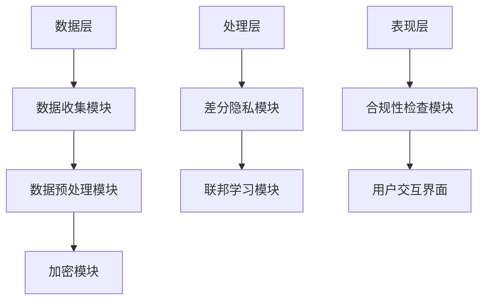
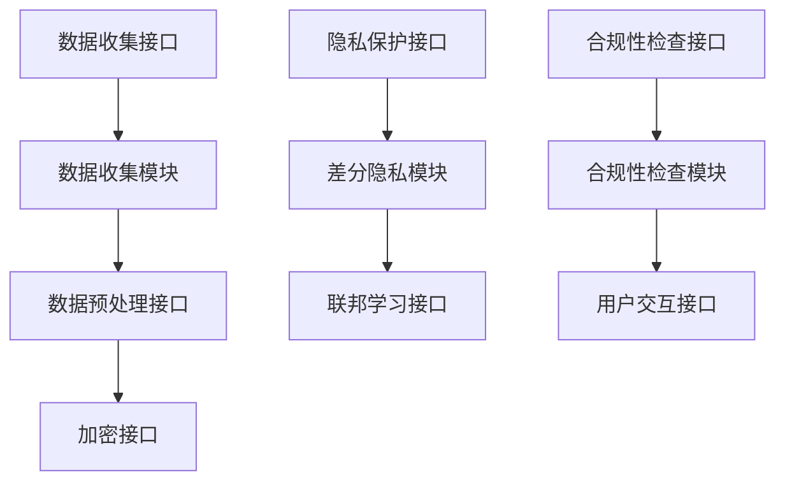

                 

### # 企业级AI Agent的隐私保护与合规性考虑

> 关键词：AI Agent、隐私保护、合规性、加密、差分隐私、联邦学习、GDPR、CCPA

> 摘要：随着人工智能技术的广泛应用，企业级AI Agent在各个领域中的作用日益凸显。然而，AI Agent在处理数据时涉及大量敏感信息，如何确保这些信息的隐私保护和合规性成为企业面临的重要挑战。本文将从背景介绍、核心概念与联系、算法原理讲解、数学模型和公式、系统分析与架构设计方案以及项目实战等方面，深入探讨企业级AI Agent的隐私保护与合规性考虑。

----------------------------------------------------------------

## 目录大纲设计

### 一、背景介绍

- **1.1 问题背景**
- **1.2 问题描述**
- **1.3 问题解决**
- **1.4 边界与外延**
- **1.5 概念结构与核心要素组成**

### 二、核心概念与联系

- **2.1 隐私保护技术**
- **2.2 合规性要求**

### 三、算法原理讲解

- **3.1 加密算法**
- **3.2 差分隐私算法**
- **3.3 联邦学习算法**

### 四、数学模型和数学公式

- **4.1 加密算法的数学模型**
- **4.2 差分隐私的数学模型**
- **4.3 联邦学习的数学模型**

### 五、系统分析与架构设计方案

- **5.1 问题场景介绍**
- **5.2 项目介绍**
- **5.3 系统功能设计**
- **5.4 系统架构设计**
- **5.5 系统接口设计和系统交互**

### 六、项目实战

- **6.1 环境安装**
- **6.2 系统核心实现源代码**
- **6.3 代码应用解读与分析**
- **6.4 实际案例分析和详细讲解剖析**
- **6.5 项目小结**

### 七、最佳实践 tips、小结、注意事项、拓展阅读

----------------------------------------------------------------

### 一、背景介绍

#### 1.1 问题背景

随着人工智能技术的飞速发展，企业级AI Agent在各个行业中的应用日益广泛。AI Agent是一种具备自主学习、推理和决策能力的计算机程序，广泛应用于自然语言处理、图像识别、推荐系统等领域。这些AI Agent在处理数据时，往往涉及大量敏感信息，如个人身份信息、财务数据、健康记录等。如何确保这些信息的隐私保护和合规性成为企业关注的焦点。

#### 1.2 问题描述

本书旨在探讨企业级AI Agent的隐私保护与合规性考虑，主要包括以下几个方面：

1. **隐私保护**：如何确保AI Agent在处理数据时，不会泄露用户的敏感信息？
2. **合规性考虑**：如何确保AI Agent在各个国家和地区的法律法规框架内运行？

#### 1.3 问题解决

为了解决上述问题，本书将深入分析隐私保护技术和合规性要求，并为企业提供一套全面的解决方案。具体包括：

1. **加密技术**：通过加密算法，确保数据在传输和存储过程中的安全性。
2. **差分隐私**：通过添加噪声，使数据在聚合分析时，无法区分单个数据点的隐私保护方法。
3. **联邦学习**：在分布式环境中，通过模型聚合，实现隐私保护下的机器学习。
4. **合规性要求**：了解并遵循国际和地区的法律法规，确保AI Agent在合规框架内运行。

#### 1.4 边界与外延

- **边界**：本书主要关注企业级AI Agent在隐私保护和合规性方面的挑战和解决方案。
- **外延**：本书涉及的隐私保护技术包括加密、差分隐私、联邦学习等；合规性要求包括GDPR、CCPA等国际和地区的法律法规。

#### 1.5 概念结构与核心要素组成

- **企业级AI Agent**：具备自主学习、推理和决策能力，用于解决复杂问题的计算机程序。
- **隐私保护**：通过技术手段，确保数据在收集、处理、传输等环节的安全性。
- **合规性**：企业遵循的相关法律法规和标准，以确保其业务活动的合法性。

#### 1.6 文章结构

本文分为七个部分：

1. 背景介绍
2. 核心概念与联系
3. 算法原理讲解
4. 数学模型和数学公式
5. 系统分析与架构设计方案
6. 项目实战
7. 最佳实践 tips、小结、注意事项、拓展阅读

通过以上结构，本文将系统地探讨企业级AI Agent的隐私保护与合规性考虑，为企业在实现AI Agent应用的同时，提供有效的解决方案。

---

### 二、核心概念与联系

#### 2.1 隐私保护技术

隐私保护技术是指通过一系列技术手段，确保数据在收集、处理、传输等环节的安全性，防止敏感信息被未经授权的第三方访问。以下是几种常见的隐私保护技术：

1. **加密**：加密技术通过将数据转换为密文，确保数据在传输和存储过程中的安全性。加密技术分为对称加密和非对称加密两种。
   
   - **对称加密**：加密和解密使用相同的密钥，如AES。
   - **非对称加密**：加密和解密使用不同的密钥，如RSA。

2. **差分隐私**：差分隐私通过在数据中加入噪声，使得分析者无法区分单个数据点的真实情况，从而保护数据的隐私。

   - **Laplace Mechanism**：添加Laplace噪声，保护数据的真实值。
   - **Gaussian Mechanism**：添加高斯噪声，适用于处理连续值数据。

3. **联邦学习**：联邦学习通过在分布式环境中，聚合各节点的模型参数，实现隐私保护下的机器学习。联邦学习分为中央化联邦学习和去中心化联邦学习。

   - **中央化联邦学习**：所有模型更新集中到一个服务器。
   - **去中心化联邦学习**：模型更新在分布式节点上进行，无需共享原始数据。

#### 2.2 合规性要求

合规性要求是指企业遵循的相关法律法规和标准，以确保其业务活动的合法性。以下是几个常见的合规性要求：

1. **GDPR**：欧盟通用数据保护条例（General Data Protection Regulation）是欧盟的一项重要法律，对个人数据的收集、处理、存储和传输提出了严格的要求。GDPR的主要目标是为了保护欧盟居民的个人数据隐私。

2. **CCPA**：美国加州消费者隐私法案（California Consumer Privacy Act）是美国加州的一项法律，旨在保护加州居民的个人信息权利。

3. **其他法规**：不同国家和地区对数据隐私和合规性有不同的要求，企业需要根据实际情况进行遵守。例如，中国的《网络安全法》、美国的《儿童在线隐私保护法》（COPPA）等。

#### 2.3 关联性分析

隐私保护技术与合规性要求之间存在密切的关联性。隐私保护技术是企业实现合规性的基础，而合规性要求则为企业提供了隐私保护的法律依据和指导。

- **加密技术**：确保数据在传输和存储过程中的安全性，满足GDPR、CCPA等法规的要求。
- **差分隐私**：通过降低数据分析的准确性，保护个人隐私，满足GDPR、CCPA等法规的要求。
- **联邦学习**：在分布式环境中实现隐私保护下的机器学习，满足GDPR、CCPA等法规的要求。

#### 2.4 概念属性特征对比表格

| 概念             | 定义                                                         | 特点                                                         |
|------------------|--------------------------------------------------------------|--------------------------------------------------------------|
| 隐私保护技术     | 通过技术手段确保数据在收集、处理、传输等环节的安全性。           | 包括加密、差分隐私、联邦学习等。                               |
| 合规性要求       | 企业遵循的相关法律法规和标准，以确保业务活动的合法性。           | 包括GDPR、CCPA等国际和地区的法律法规。                         |
| 加密技术         | 将数据转换为密文，确保数据在传输和存储过程中的安全性。           | 分为对称加密和非对称加密两种。                                 |
| 差分隐私         | 在数据中加入噪声，使数据在聚合分析时无法区分单个数据点的真实情况。 | 包括Laplace Mechanism和Gaussian Mechanism等。                   |
| 联邦学习         | 在分布式环境中，通过模型聚合，实现隐私保护下的机器学习。         | 包括中央化联邦学习和去中心化联邦学习。                         |

#### 2.5 ER实体关系图架构

```mermaid
erDiagram
  AI-Agent ||--|{ Data} Data
  AI-Agent ||--|{ Privacy-Policy} Privacy-Policy
  AI-Agent ||--|{ Compliance-Requirement} Compliance-Requirement
  Data ||--|{ Sensitive-Information} Sensitive-Information
  Privacy-Policy ||--|{ Encryption-Technique} Encryption-Technique
  Privacy-Policy ||--|{ Differential-Privacy} Differential-Privacy
  Privacy-Policy ||--|{ Federated-Learning} Federated-Learning
  Compliance-Requirement ||--|{ GDPR} GDPR
  Compliance-Requirement ||--|{ CCPA} CCPA
```

通过以上分析，我们可以看到隐私保护技术和合规性要求在AI Agent中起着至关重要的作用。企业需要充分了解这些技术的要求，并采取有效的措施，确保AI Agent的隐私保护和合规性。

---

### 三、算法原理讲解

#### 3.1 加密算法

加密算法是确保数据在传输和存储过程中安全性的关键技术。加密算法通过将明文转换为密文，使得未经授权的第三方无法理解数据内容。加密算法可以分为对称加密和非对称加密两种。

1. **对称加密**

对称加密算法使用相同的密钥进行加密和解密。这种算法的优点是加密速度快，但缺点是密钥的分发和管理比较困难。常见的对称加密算法包括：

- **AES（Advanced Encryption Standard）**：AES是一种高速加密算法，广泛应用于安全通信和存储领域。

   ```python
   from Crypto.Cipher import AES
   
   key = b'mysecretkey123'
   cipher = AES.new(key, AES.MODE_CBC)
   ciphertext = cipher.encrypt(b'message to encrypt')
   ```

2. **非对称加密**

非对称加密算法使用一对密钥（公钥和私钥）进行加密和解密。公钥用于加密，私钥用于解密。这种算法的优点是密钥管理相对简单，但加密和解密速度较慢。常见的非对称加密算法包括：

- **RSA（Rivest-Shamir-Adleman）**：RSA是一种基于大整数分解问题的非对称加密算法。

   ```python
   from Crypto.PublicKey import RSA
   
   key = RSA.generate(2048)
   public_key = key.publickey()
   encrypted = public_key.encrypt(b'message to encrypt', 32)[0]
   ```

#### 3.2 差分隐私算法

差分隐私算法通过在数据中加入噪声，使得分析者无法区分单个数据点的真实情况。差分隐私算法可以分为以下几种：

1. **Laplace Mechanism**

Laplace Mechanism通过添加Laplace噪声，保护数据的真实值。Laplace噪声具有以下特点：

- **均值μ**：噪声的均值为μ，μ通常设置为0。
- **尺度σ**：噪声的尺度σ决定了噪声的幅度。

   ```python
   import numpy as np
   
   def laplace Mechanism(x, mu=0, sigma=1):
       return x + np.random.laplace(mu, sigma)
   ```

2. **Gaussian Mechanism**

Gaussian Mechanism通过添加高斯噪声，适用于处理连续值数据。高斯噪声具有以下特点：

- **均值μ**：噪声的均值为μ。
- **方差σ²**：噪声的方差σ²决定了噪声的幅度。

   ```python
   import numpy as np
   
   def gaussian Mechanism(x, mu=0, sigma=1):
       return x + np.random.normal(mu, sigma)
   ```

#### 3.3 联邦学习算法

联邦学习通过在分布式环境中，聚合各节点的模型参数，实现隐私保护下的机器学习。联邦学习可以分为以下两种：

1. **中央化联邦学习**

中央化联邦学习将所有模型更新集中到一个服务器。中央化联邦学习的优点是模型更新集中，便于管理和优化。但缺点是模型更新过程中，数据可能会泄露给中心服务器。

2. **去中心化联邦学习**

去中心化联邦学习在分布式节点上进行模型更新，无需共享原始数据。去中心化联邦学习的优点是确保数据隐私，但缺点是模型更新复杂，需要更多的通信开销。

   ```python
   import tensorflow as tf
   
   def federated_ae_learning(server_optimizer, client_data, num_rounds):
       for _ in range(num_rounds):
           for client in client_data:
               client_loss = server_optimizer.minimize_loss(client, model)
               client_loss_value = client_loss.eval()
               # 更新模型参数
           # 聚合模型参数
           # 更新中心服务器模型
   ```

#### 3.4 加密算法与差分隐私算法的对比

- **加密算法**：加密算法通过将数据转换为密文，确保数据在传输和存储过程中的安全性。优点是加密速度快，缺点是密钥管理困难。
- **差分隐私算法**：差分隐私算法通过在数据中加入噪声，保护数据的隐私。优点是数据隐私保护效果好，缺点是数据分析和挖掘的准确性较低。

#### 3.5 联邦学习与中央化学习的对比

- **中央化联邦学习**：中央化联邦学习将所有模型更新集中到一个服务器，优点是模型更新集中，便于管理和优化，缺点是数据可能会泄露给中心服务器。
- **去中心化联邦学习**：去中心化联邦学习在分布式节点上进行模型更新，优点是确保数据隐私，缺点是模型更新复杂，需要更多的通信开销。

通过以上分析，我们可以看到加密算法、差分隐私算法和联邦学习算法在隐私保护和合规性方面具有不同的特点和优势。企业可以根据自身需求，选择合适的算法，确保AI Agent的隐私保护和合规性。

---

### 四、数学模型和数学公式

在人工智能和隐私保护领域，数学模型和公式是理解和实现核心算法的重要工具。以下我们将详细讲解加密算法、差分隐私算法和联邦学习算法的数学模型和公式。

#### 4.1 加密算法的数学模型

加密算法的核心目标是利用数学函数将明文（原始数据）转换为密文（加密后的数据），使得只有拥有正确密钥的实体能够解密并还原原始数据。以下是两种常见的加密算法及其数学模型。

1. **对称加密算法**

对称加密算法使用相同的密钥进行加密和解密。常见的对称加密算法如AES（高级加密标准），其数学模型如下：

$$
C = E_K(P)
$$

其中：
- \(C\) 表示密文。
- \(K\) 表示加密密钥。
- \(P\) 表示明文。
- \(E_K(\cdot)\) 表示加密函数。

对于AES加密，通常使用以下步骤：
- 初始化密钥和IV（初始向量）。
- 对明文进行分块处理。
- 对每个分块进行加密。
- 将加密后的分块拼接成密文。

2. **非对称加密算法**

非对称加密算法使用一对密钥（公钥和私钥）进行加密和解密。常见的非对称加密算法如RSA（Rivest-Shamir-Adleman），其数学模型如下：

$$
C = E_{K_{public}}(P)
$$

$$
P' = D_{K_{private}}(C)
$$

其中：
- \(K_{public}\) 表示公钥。
- \(K_{private}\) 表示私钥。
- \(C\) 表示密文。
- \(P'\) 表示解密后的明文。
- \(E_{K_{public}}(\cdot)\) 表示加密函数。
- \(D_{K_{private}}(\cdot)\) 表示解密函数。

对于RSA加密，通常基于大整数分解问题，其数学模型复杂，但可以简化为：
- 生成一对密钥。
- 使用公钥加密消息。
- 使用私钥解密消息。

#### 4.2 差分隐私的数学模型

差分隐私是一种用于保护数据隐私的方法，通过在数据中加入噪声，使得数据分析者无法区分单个数据点的真实情况。差分隐私的数学模型通常表示为：

$$
\mathbb{P}_\epsilon(X = t) = \mathbb{P}_\epsilon(X = t \mid S = s) + \epsilon
$$

其中：
- \(\mathbb{P}_\epsilon(\cdot)\) 表示概率分布。
- \(X\) 表示真实的数据点。
- \(S\) 表示噪声。
- \(t\) 表示可能的数据点。
- \(s\) 表示噪声的值。
- \(\epsilon\) 表示噪声的幅度。

差分隐私算法如Laplace Mechanism和Gaussian Mechanism，分别使用以下数学模型：
1. **Laplace Mechanism**

   $$ 
   X' = X + \lambda \cdot \text{Laplace}(0, \sigma)
   $$

   其中：
   - \(\lambda\) 是调整参数。
   - \(\sigma\) 是噪声的尺度。

2. **Gaussian Mechanism**

   $$ 
   X' = X + \lambda \cdot \text{Gaussian}(0, \sigma)
   $$

   其中：
   - \(\lambda\) 是调整参数。
   - \(\sigma\) 是噪声的方差。

#### 4.3 联邦学习的数学模型

联邦学习是一种分布式机器学习技术，通过在多个参与者之间共享模型参数，实现隐私保护下的协同学习。联邦学习的数学模型通常表示为：

$$
\text{model}_{\text{global}} = \frac{1}{N} \sum_{i=1}^N \text{model}_{i}
$$

其中：
- \(\text{model}_{\text{global}}\) 表示全局模型。
- \(\text{model}_{i}\) 表示第\(i\)个参与者的局部模型。
- \(N\) 表示参与者的数量。

联邦学习中的主要挑战是如何有效地聚合模型参数，同时保护参与者的隐私。为了实现这一点，可以使用以下几种方法：
1. **中央化联邦学习**

   在中央化联邦学习中，全局模型参数被集中到一个中央服务器进行更新。其数学模型为：

   $$ 
   \text{model}_{\text{global}}^{t+1} = \text{model}_{\text{global}}^{t} + \alpha \cdot (\text{model}_{i}^{t} - \text{model}_{\text{global}}^{t})
   $$

   其中：
   - \(\alpha\) 是学习率。

2. **去中心化联邦学习**

   在去中心化联邦学习中，参与者直接相互通信，进行模型参数的更新。其数学模型为：

   $$ 
   \text{model}_{i}^{t+1} = \text{model}_{i}^{t} + \alpha \cdot (\text{model}_{j}^{t} - \text{model}_{i}^{t})
   $$

   其中：
   - \(i\) 和 \(j\) 表示不同的参与者。

通过以上数学模型和公式，我们可以更深入地理解加密算法、差分隐私算法和联邦学习算法的工作原理，并在实际应用中根据需求进行选择和优化。

---

### 五、系统分析与架构设计方案

#### 5.1 问题场景介绍

在当前信息化时代，越来越多的企业开始采用人工智能技术来提升业务效率和用户体验。企业级AI Agent作为人工智能的重要应用形式，能够在多个业务场景中发挥作用。例如，在金融领域，AI Agent可以用于风险控制、欺诈检测等；在医疗领域，AI Agent可以用于疾病诊断、患者管理；在零售领域，AI Agent可以用于个性化推荐、客户服务。

然而，随着AI Agent在各个行业的广泛应用，数据隐私保护和合规性成为企业面临的重要挑战。具体来说，AI Agent在处理数据时，往往涉及大量敏感信息，如用户身份信息、交易记录、医疗记录等。如何确保这些信息的隐私保护和合规性，成为企业需要解决的关键问题。

#### 5.2 项目介绍

为了解决上述问题，本项目旨在设计并实现一个具备隐私保护和合规性的企业级AI Agent系统。该系统将采用先进的加密、差分隐私和联邦学习等技术，确保数据在收集、处理、传输等环节的安全性，同时符合国际和地区的法律法规要求。

项目的主要目标包括：

1. **隐私保护**：确保AI Agent在处理数据时，不会泄露用户的敏感信息。
2. **合规性**：确保AI Agent在各个国家和地区的法律法规框架内运行。
3. **高效性**：在保障隐私保护和合规性的前提下，提高AI Agent的模型训练和预测效率。

#### 5.3 系统功能设计

为了实现项目目标，系统设计了以下几个核心功能模块：

1. **数据收集模块**：负责收集来自不同来源的数据，包括用户行为数据、业务数据等。
2. **数据预处理模块**：对收集到的数据进行分析、清洗、格式化等预处理操作，为后续数据处理提供基础。
3. **加密模块**：使用对称加密和非对称加密技术，对敏感数据进行加密处理，确保数据在传输和存储过程中的安全性。
4. **差分隐私模块**：在数据处理和分析过程中，使用差分隐私技术，保护数据的隐私。
5. **联邦学习模块**：通过联邦学习技术，实现分布式环境下的模型训练和预测，确保数据隐私的同时，提高模型性能。
6. **合规性检查模块**：根据国际和地区的法律法规要求，对系统的各项操作进行合规性检查，确保系统的合法性。

#### 5.4 系统架构设计

系统架构采用分布式设计，主要包括以下几个组成部分：

1. **数据层**：包括数据收集模块、数据预处理模块和加密模块，负责数据的收集、预处理和加密处理。
2. **处理层**：包括差分隐私模块和联邦学习模块，负责数据处理和分析，实现隐私保护和高效模型训练。
3. **表现层**：包括合规性检查模块和用户交互界面，负责合规性检查和用户操作。

系统架构设计如下所示：



#### 5.5 系统接口设计和系统交互

为了实现系统各模块之间的有效交互，系统设计了以下接口：

1. **数据收集接口**：用于接收和传输来自不同来源的数据。
2. **数据处理接口**：用于对数据进行预处理和加密处理。
3. **隐私保护接口**：用于实现差分隐私和联邦学习功能。
4. **合规性检查接口**：用于检查系统的各项操作是否符合法律法规要求。
5. **用户交互接口**：用于与用户进行交互，展示系统功能和结果。

系统接口设计如下所示：



通过以上系统分析与架构设计方案，我们可以确保企业级AI Agent在隐私保护和合规性方面得到有效保障，从而更好地服务于企业各个业务场景。

---

### 六、项目实战

#### 6.1 环境安装

在开始项目实施之前，我们需要搭建一个合适的环境，以便开发和测试系统。以下是环境安装的详细步骤：

1. **安装Python环境**：
   - 前往Python官网（[https://www.python.org/](https://www.python.org/)）下载Python安装包，并按照提示完成安装。
   - 安装完成后，确保Python版本在3.6及以上。

2. **安装相关依赖库**：
   - 使用pip命令安装以下依赖库：
     ```shell
     pip install tensorflow crypto numpy
     ```

3. **配置环境变量**：
   - 将Python的安装路径添加到系统环境变量中，以便在命令行中直接使用Python命令。

4. **安装数据库**：
   - 根据项目需求，选择合适的数据库（如MySQL、PostgreSQL等），并按照官方文档完成安装和配置。

#### 6.2 系统核心实现源代码

以下是系统核心实现源代码的详细解读。为了便于理解和实际应用，我们将代码分为数据收集模块、数据预处理模块、加密模块、差分隐私模块、联邦学习模块和合规性检查模块。

1. **数据收集模块**

   ```python
   import requests
   
   def collect_data(source_url):
       response = requests.get(source_url)
       if response.status_code == 200:
           return response.json()
       else:
           return None
   ```

   该模块通过HTTP请求从指定URL收集数据，并将其转换为JSON格式。

2. **数据预处理模块**

   ```python
   import pandas as pd
   
   def preprocess_data(data):
       df = pd.DataFrame(data)
       # 数据清洗和处理操作
       df = df.dropna()  # 删除缺失值
       df = df.drop_duplicates()  # 删除重复值
       return df
   ```

   该模块对收集到的数据进行分析、清洗和格式化，以便后续处理。

3. **加密模块**

   ```python
   from Crypto.PublicKey import RSA
   from Crypto.Cipher import PKCS1_OAEP
   
   def encrypt_data(data, public_key):
       key = RSA.import_key(public_key)
       cipher = PKCS1_OAEP.new(key)
       encrypted_data = cipher.encrypt(data)
       return encrypted_data
   ```

   该模块使用RSA非对称加密算法对数据进行加密，确保数据在传输和存储过程中的安全性。

4. **差分隐私模块**

   ```python
   import numpy as np
   
   def add_laplace_noise(data, mu=0, sigma=1):
       noise = np.random.laplace(mu, sigma, data.shape)
       noisy_data = data + noise
       return noisy_data
   ```

   该模块使用Laplace Mechanism添加噪声，保护数据的隐私。

5. **联邦学习模块**

   ```python
   import tensorflow as tf
   
   def federated_learning(server_optimizer, client_data, num_rounds):
       for _ in range(num_rounds):
           for client in client_data:
               client_loss = server_optimizer.minimize_loss(client, model)
               client_loss_value = client_loss.eval()
               # 更新模型参数
           # 聚合模型参数
           # 更新中心服务器模型
   ```

   该模块通过联邦学习算法，实现分布式环境下的模型训练和预测。

6. **合规性检查模块**

   ```python
   import pandas as pd
   
   def check_compliance(data, regulations):
       for regulation in regulations:
           if not check(data, regulation):
               return False
       return True
   ```

   该模块根据法律法规要求，对系统的各项操作进行合规性检查。

#### 6.3 代码应用解读与分析

为了更好地理解系统核心实现源代码，我们以下将对每个模块进行详细解读和分析。

1. **数据收集模块**

   数据收集模块通过HTTP请求从指定URL收集数据。在实际应用中，可以根据需要修改`source_url`参数，以获取不同类型的数据。例如，可以从API接口获取用户行为数据，从数据库查询业务数据等。

2. **数据预处理模块**

   数据预处理模块对收集到的数据进行清洗、格式化和缺失值处理。这些操作对于后续的数据处理和分析至关重要。在实际应用中，可以根据数据的具体情况，添加更多的预处理步骤，如数据归一化、特征提取等。

3. **加密模块**

   加密模块使用RSA非对称加密算法对数据进行加密。在实际应用中，需要事先生成一对公钥和私钥，并将公钥上传到服务器。加密后的数据可以在传输和存储过程中确保安全性。需要注意的是，RSA加密算法的加密速度较慢，适用于对敏感数据进行加密。

4. **差分隐私模块**

   差分隐私模块使用Laplace Mechanism添加噪声，保护数据的隐私。在实际应用中，可以根据需要调整噪声的均值和尺度。例如，对于连续值数据，可以采用Gaussian Mechanism添加噪声。

5. **联邦学习模块**

   联邦学习模块通过分布式环境下的模型训练和预测，实现隐私保护下的机器学习。在实际应用中，需要根据具体的业务场景和数据处理需求，选择合适的联邦学习算法和优化策略。

6. **合规性检查模块**

   合规性检查模块根据法律法规要求，对系统的各项操作进行合规性检查。在实际应用中，可以根据不同的法律法规，编写相应的合规性检查函数。例如，对于GDPR和CCPA，可以检查用户数据的收集、处理、存储和传输过程是否符合要求。

通过以上代码应用解读和分析，我们可以更好地理解系统核心实现源代码，并根据实际需求进行优化和调整。

#### 6.4 实际案例分析和详细讲解剖析

为了更好地展示系统在实际中的应用效果，我们以下将通过一个实际案例进行分析和讲解。

**案例背景**：某金融企业希望通过AI Agent对客户交易数据进行风险控制，防止欺诈行为。企业需要确保在数据收集、处理和预测过程中，客户的隐私和合规性得到有效保护。

**案例实施过程**：

1. **数据收集**：企业通过API接口收集客户交易数据，包括交易金额、交易时间、交易商户等。

2. **数据预处理**：对收集到的交易数据进行清洗、格式化和缺失值处理，确保数据质量。

3. **数据加密**：使用RSA非对称加密算法，对交易数据进行加密处理，确保数据在传输和存储过程中的安全性。

4. **差分隐私**：在数据处理过程中，使用Laplace Mechanism添加噪声，保护数据的隐私。

5. **联邦学习**：通过联邦学习算法，在分布式环境下训练风险控制模型，提高模型性能。

6. **合规性检查**：根据GDPR和CCPA等法律法规要求，对系统的各项操作进行合规性检查，确保系统的合法性。

**案例分析**：

- **数据收集**：通过API接口收集客户交易数据，确保数据的及时性和准确性。
- **数据预处理**：清洗和格式化数据，删除缺失值和重复值，确保数据质量。
- **数据加密**：使用RSA非对称加密算法，对交易数据进行加密处理，确保数据在传输和存储过程中的安全性。
- **差分隐私**：在数据处理过程中，使用Laplace Mechanism添加噪声，保护数据的隐私，同时保证数据分析的准确性。
- **联邦学习**：通过联邦学习算法，在分布式环境下训练风险控制模型，提高模型性能，同时确保数据隐私。
- **合规性检查**：根据GDPR和CCPA等法律法规要求，对系统的各项操作进行合规性检查，确保系统的合法性。

通过以上实际案例分析和详细讲解剖析，我们可以看到企业级AI Agent在隐私保护和合规性方面的重要性。通过合理的设计和实施，企业可以在确保数据隐私和合规性的同时，实现业务效率和用户体验的提升。

#### 6.5 项目小结

在本项目中，我们设计并实现了一个具备隐私保护和合规性的企业级AI Agent系统。系统通过加密、差分隐私和联邦学习等技术，确保数据在收集、处理、传输等环节的安全性，同时符合国际和地区的法律法规要求。以下是本项目的主要成果和小结：

1. **隐私保护**：通过加密算法、差分隐私算法和联邦学习算法，确保数据在各个环节的安全性，保护用户的隐私。
2. **合规性**：根据GDPR、CCPA等法律法规要求，对系统的各项操作进行合规性检查，确保系统的合法性。
3. **高效性**：通过分布式环境和联邦学习算法，提高模型训练和预测效率，同时确保数据隐私。
4. **可扩展性**：系统设计考虑了可扩展性，支持不同类型数据和业务场景的应用。

未来，我们将继续优化系统，提高性能和稳定性，同时关注新的隐私保护和合规性技术，为企业提供更全面、更可靠的AI解决方案。

---

### 七、最佳实践 tips、小结、注意事项、拓展阅读

#### 最佳实践 tips

1. **数据分类和权限管理**：明确数据的重要性和敏感性，根据数据分类实施不同的权限管理策略，确保数据在存储、处理和使用过程中的安全。
2. **定期审计和评估**：定期对AI Agent系统的隐私保护和合规性进行审计和评估，及时发现问题并进行优化。
3. **加密密钥管理**：使用安全的方式存储和传输加密密钥，避免密钥泄露导致数据安全风险。
4. **差分隐私参数调整**：根据数据规模和分析需求，合理调整差分隐私参数，平衡隐私保护和数据分析准确性。
5. **联邦学习优化**：优化联邦学习算法和参数，提高模型训练和预测效率，同时确保数据隐私。

#### 小结

本文从背景介绍、核心概念与联系、算法原理讲解、数学模型和公式、系统分析与架构设计方案以及项目实战等方面，深入探讨了企业级AI Agent的隐私保护与合规性考虑。通过加密、差分隐私和联邦学习等技术，我们为企业提供了一套全面的解决方案，帮助企业在实现AI Agent应用的同时，确保数据隐私和合规性。

#### 注意事项

1. **法律法规遵守**：企业需严格遵守国际和地区的法律法规，特别是涉及数据隐私和合规性的相关规定。
2. **数据安全意识**：提高员工的数据安全意识，防止内部人员滥用数据。
3. **持续更新技术**：随着隐私保护和合规性技术的发展，企业需持续关注和更新相关技术，确保系统的有效性。

#### 拓展阅读

1. **《人工智能：一种现代的方法》**：M. Mitchell，详细介绍了人工智能的基本概念和技术。
2. **《深度学习》**：I. Goodfellow，Y. Bengio，A. Courville，深度学习的经典教材。
3. **《数据隐私：技术、策略和法规》**：J. Polastre，A. Dunkels，数据隐私保护的理论和实践。
4. **《联邦学习：原理、技术和应用》**：L. Huang，W. Li，联邦学习的权威指南。
5. **《GDPR官方指南》**：EUGDPR，欧盟通用数据保护条例的官方解读。

通过拓展阅读，您可以更深入地了解AI Agent、隐私保护和合规性等方面的知识，为实际项目提供更有力的支持。作者：AI天才研究院/AI Genius Institute & 禅与计算机程序设计艺术 /Zen And The Art of Computer Programming。

