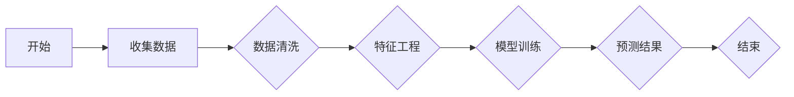
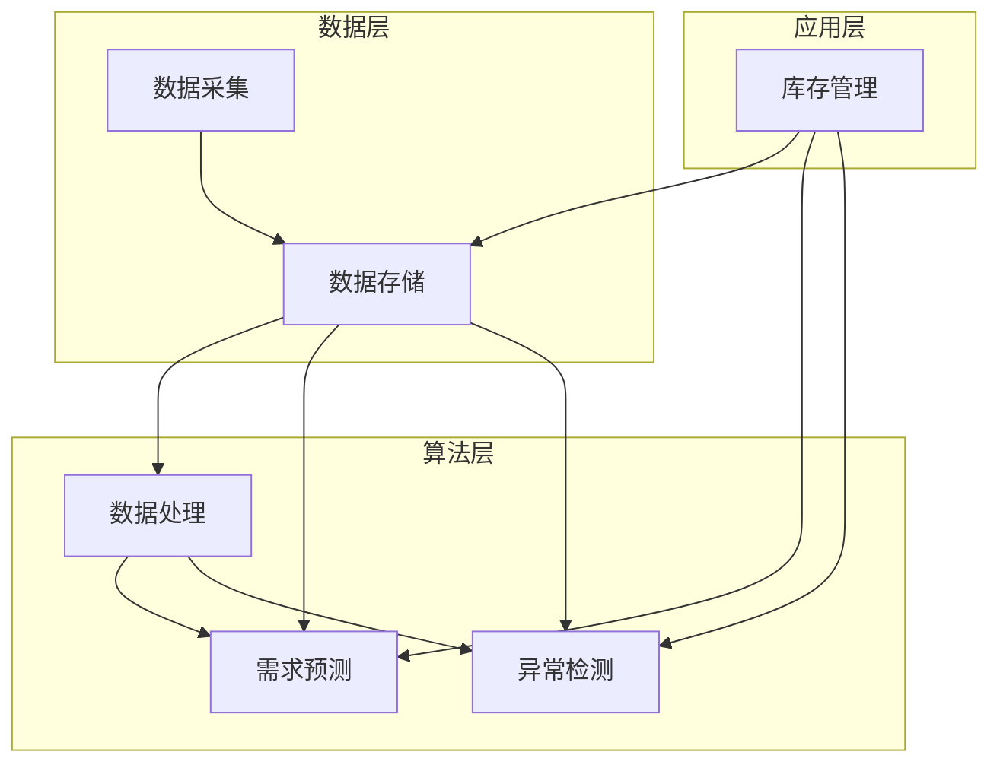
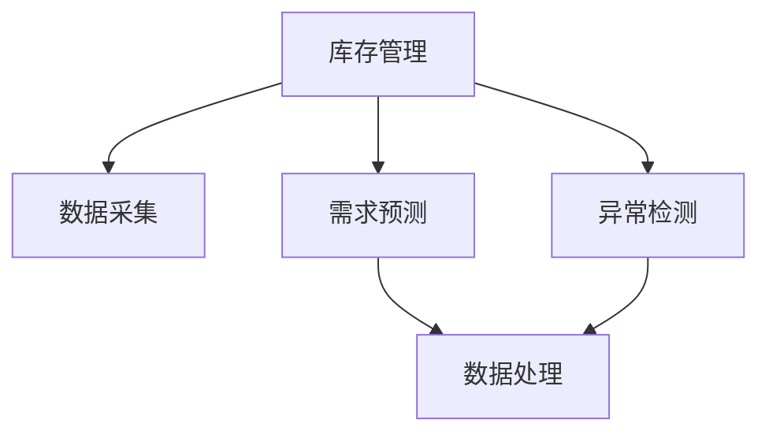
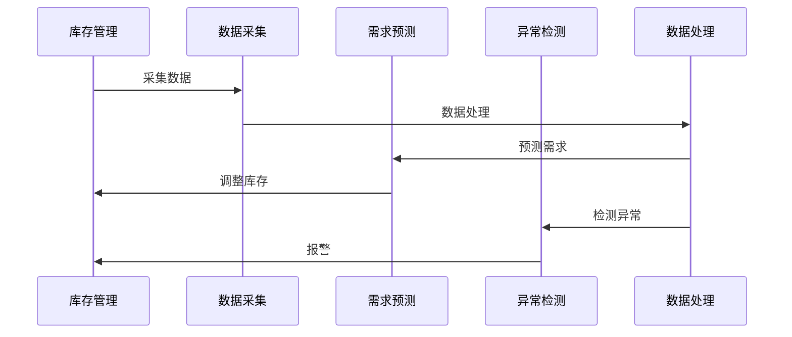

                 

# 《企业级AI Agent需求分析方法》

## 关键词：企业级AI代理、需求分析、AI算法、系统架构、最佳实践

## 摘要：

本文深入探讨了企业级AI代理的需求分析方法，从背景介绍、核心概念、算法原理讲解、系统分析与架构设计到项目实战和最佳实践，全面剖析了AI代理在企业中的应用及其需求分析的关键环节。通过逻辑清晰、结构紧凑的分析，本文旨在为读者提供一套系统化、可操作的需求分析方法，帮助企业更高效地部署和管理AI代理系统。

---

### 目录

1. **企业级AI Agent概述**
   - 1.1 AI代理的定义与分类
   - 1.2 AI代理在企业中的角色与意义
   - 1.3 AI代理的应用场景分析

2. **企业级AI Agent需求分析的基础**
   - 2.1 需求分析的基本概念
   - 2.2 需求分析的步骤与方法
   - 2.3 企业级AI代理需求的特点

3. **AI代理的核心概念与联系**
   - 3.1 AI代理的构成要素
   - 3.2 AI代理与相关技术的联系

4. **AI代理的需求分析方法**
   - 4.1 需求预测算法
   - 4.2 需求分析方法的应用

5. **企业级AI Agent系统的设计与分析**
   - 5.1 问题场景介绍
   - 5.2 系统功能设计
   - 5.3 系统架构设计
   - 5.4 系统接口设计
   - 5.5 系统交互

6. **企业级AI Agent需求分析实战**
   - 6.1 环境安装与配置
   - 6.2 系统核心实现
   - 6.3 实际案例分析与讲解
   - 6.4 项目小结

7. **企业级AI Agent需求分析的最佳实践**
   - 7.1 需求分析的最佳实践
   - 7.2 注意事项与挑战
   - 7.3 拓展阅读

8. **总结与展望**
   - 8.1 全书总结
   - 8.2 未来发展趋势
   - 8.3 对读者的建议

---

## 1. 企业级AI Agent概述

### 1.1 AI代理的定义与分类

AI代理（Artificial Intelligence Agent），是指能够基于环境中的感知信息，通过自主学习和决策，以实现特定目标的人工智能实体。AI代理可分为以下几类：

1. **反应性代理**：仅根据当前感知信息作出反应，不考虑过去历史和未来预期。
2. **模型基础代理**：利用环境模型进行预测和决策，如决策树、神经网络等。
3. **目标驱动的代理**：具有明确目标，通过规划策略来实现目标。
4. **合作代理**：在多代理系统中，与其他代理协同工作，共同完成任务。

### 1.2 AI代理在企业中的角色与意义

在企业环境中，AI代理具有以下几方面的作用：

- **自动化决策**：通过分析数据和模式，AI代理可以自动化复杂的决策过程，提高决策效率。
- **提升运营效率**：AI代理可以优化工作流程，减少人工干预，降低运营成本。
- **增强用户体验**：AI代理可以提供个性化服务，提高用户满意度。
- **实时响应**：AI代理可以实时分析环境和用户需求，迅速作出响应。

### 1.3 AI代理的应用场景分析

AI代理在企业中的应用场景广泛，包括但不限于：

- **客户服务**：通过聊天机器人提供24/7的客户支持。
- **供应链管理**：预测需求，优化库存和运输计划。
- **风险管理**：分析市场数据，预测风险，制定应对策略。
- **人力资源**：优化招聘流程，评估员工绩效。

## 2. 企业级AI Agent需求分析的基础

### 2.1 需求分析的基本概念

需求分析是软件工程中至关重要的一环，其目的是明确系统应具备的功能和性能。在AI代理开发中，需求分析同样至关重要，主要包括以下内容：

- **功能需求**：系统应提供哪些功能。
- **非功能需求**：系统应具备的性能、可靠性、可维护性等。
- **用户需求**：用户期望系统能够提供的服务和体验。

### 2.2 需求分析的步骤与方法

需求分析通常包括以下步骤：

1. **收集需求**：通过访谈、问卷调查、用户观察等方式收集用户需求。
2. **需求验证**：确保收集到的需求是准确和可行的，通过评审、原型验证等方法。
3. **需求文档编写**：将收集和验证的需求编写成文档，明确系统的功能和非功能需求。

常用的需求分析方法包括：

- **用户故事地图**：通过用户故事来描述系统功能。
- **用例图**：用图形化方式描述系统与用户之间的交互。
- **需求模型**：通过模型来描述系统的功能和行为。

### 2.3 企业级AI代理需求的特点

企业级AI代理的需求分析具有以下特点：

- **复杂性**：企业级AI代理通常涉及多个业务领域和技术栈，需求分析更加复杂。
- **动态性**：企业环境和业务需求不断变化，需求分析需要具备较强的适应性。
- **精确性**：需求分析需要精确到具体的功能和行为，以便后续开发。
- **协作性**：需求分析通常需要跨部门协作，确保需求全面、准确。

## 3. AI代理的核心概念与联系

### 3.1 AI代理的构成要素

AI代理通常包括以下几个核心构成要素：

1. **感知器**：接收和处理环境信息的部件。
2. **决策器**：根据感知信息生成行动策略的部件。
3. **执行器**：执行决策器生成的行动策略的部件。
4. **学习模块**：通过经验和数据改进决策能力的部件。

### 3.2 AI代理与相关技术的联系

AI代理与以下技术有着密切的联系：

- **机器学习**：用于训练代理的算法，如神经网络、决策树等。
- **自然语言处理**：用于处理和生成自然语言，如聊天机器人。
- **数据挖掘**：用于分析大量数据，提取有用信息。
- **智能推荐系统**：用于根据用户行为和偏好提供个性化推荐。

以下是AI代理的核心属性特征对比表格（使用Markdown格式中的表格）：

| 特征 | 反应性代理 | 模型基础代理 | 目标驱动代理 | 合作代理 |
| --- | --- | --- | --- | --- |
| 感知范围 | 有限感知 | 广泛感知 | 广泛感知 | 广泛感知 |
| 决策方式 | 简单反应 | 基于模型 | 基于目标 | 基于协同 |
| 执行能力 | 简单执行 | 复杂执行 | 复杂执行 | 复杂执行 |
| 学习能力 | 无学习 | 有学习 | 有学习 | 有学习 |

以下是AI代理与相关技术的ER实体关系图（使用Markdown格式中的Mermaid流程图）：

```mermaid
erDiagram
AI代理 ||--|{ 感知器 }
AI代理 ||--|{ 决策器 }
AI代理 ||--|{ 执行器 }
AI代理 ||--|{ 学习模块 }
感知器 ||--|{ 机器学习 }
感知器 ||--|{ 数据挖掘 }
决策器 ||--|{ 自然语言处理 }
执行器 ||--|{ 智能推荐系统 }
学习模块 ||--|{ 决策树 }
学习模块 ||--|{ 神经网络 }
```

## 4. AI代理的需求分析方法

### 4.1 需求预测算法

需求预测是企业级AI代理需求分析中的重要环节。以下是一种常见的需求预测算法：

#### 流程图

使用Mermaid流程图来展示需求预测算法的流程：



#### Python源代码

以下是一个简单的Python源代码示例，用于实现需求预测算法：

```python
import pandas as pd
from sklearn.model_selection import train_test_split
from sklearn.ensemble import RandomForestRegressor

# 加载数据
data = pd.read_csv('需求数据.csv')

# 数据清洗
data.dropna(inplace=True)

# 特征工程
X = data.drop('需求量', axis=1)
y = data['需求量']

# 模型训练
X_train, X_test, y_train, y_test = train_test_split(X, y, test_size=0.2, random_state=42)
model = RandomForestRegressor(n_estimators=100)
model.fit(X_train, y_train)

# 预测结果
predictions = model.predict(X_test)
```

#### 数学模型与公式

需求预测的数学模型通常是基于回归分析，假设需求量与特征之间存在线性关系：

$$
需求量 = w_0 + \sum_{i=1}^{n} w_i \times 特征_i
$$

其中，$w_0$ 是截距，$w_i$ 是第 $i$ 个特征的权重。

#### 举例说明

假设我们有一个商品的需求量与以下特征有关：广告支出（$A$）、历史销售量（$H$）和季节因素（$S$）。我们可以建立以下线性回归模型：

$$
需求量 = 10 + 0.5 \times 广告支出 + 0.3 \times 历史销售量 + 0.2 \times 季节因素
$$

如果当前广告支出为10000元，历史销售量为5000件，季节因素为夏季（系数为1），则预测的需求量为：

$$
需求量 = 10 + 0.5 \times 10000 + 0.3 \times 5000 + 0.2 \times 1 = 8800
$$

## 5. 企业级AI Agent系统的设计与分析

### 5.1 问题场景介绍

假设一家电子商务公司希望利用AI代理来优化其库存管理。公司面临的问题是如何在保证库存充足的前提下，最大限度地减少库存成本。

### 5.2 系统功能设计

为了实现库存优化，AI代理需要具备以下功能：

1. **数据采集**：采集商品销售数据、库存数据等。
2. **需求预测**：基于历史数据和当前市场状况，预测未来一段时间内的商品需求量。
3. **库存管理**：根据需求预测结果，调整库存水平，以平衡库存成本和客户满意度。
4. **异常检测**：监控库存水平，及时发现异常情况并报警。

以下是领域模型的设计（使用Markdown格式中的Mermaid类图）：

```mermaid
classDiagram
    类：商品 <|-- 类：销售记录
    类：库存 <|-- 类：库存调整
    类：需求预测 <|-- 类：预测结果
    类：异常检测 <|-- 类：异常记录
```

### 5.3 系统架构设计

系统架构设计需要综合考虑数据流、功能模块和组件之间的关系。以下是系统架构的设计（使用Markdown格式中的Mermaid架构图）：



### 5.4 系统接口设计

系统接口设计需要明确各功能模块之间的交互接口。以下是系统接口设计（使用Markdown格式中的Mermaid架构图）：



### 5.5 系统交互

系统交互设计描述了各组件之间的交互顺序和逻辑。以下是系统交互设计（使用Markdown格式中的Mermaid序列图）：



## 6. 企业级AI Agent需求分析实战

### 6.1 环境安装与配置

在进行企业级AI代理需求分析实战之前，我们需要先搭建一个开发环境。以下是环境安装与配置的步骤：

1. **安装Python**：确保Python版本为3.8以上。
2. **安装依赖库**：使用pip安装以下依赖库：`pandas`, `numpy`, `scikit-learn`, `mermaid-python`。
3. **配置Mermaid**：安装Mermaid渲染工具，并配置Python环境以支持Mermaid图表渲染。

### 6.2 系统核心实现

以下是一个简单的Python源代码示例，用于实现企业级AI代理需求分析的核心功能：

```python
import pandas as pd
from sklearn.model_selection import train_test_split
from sklearn.ensemble import RandomForestRegressor
from mermaid import Mermaid

# 加载数据
data = pd.read_csv('需求数据.csv')

# 数据清洗
data.dropna(inplace=True)

# 特征工程
X = data.drop('需求量', axis=1)
y = data['需求量']

# 模型训练
X_train, X_test, y_train, y_test = train_test_split(X, y, test_size=0.2, random_state=42)
model = RandomForestRegressor(n_estimators=100)
model.fit(X_train, y_train)

# 预测结果
predictions = model.predict(X_test)

# 渲染Mermaid图表
mermaid = Mermaid()
mermaid.add_node('需求预测算法', 'class:highlight')
mermaid.add_node('数据采集', 'class:normal')
mermaid.add_node('数据处理', 'class:normal')
mermaid.add_node('数据存储', 'class:normal')
mermaid.add_node('模型训练', 'class:normal')
mermaid.add_node('预测结果', 'class:normal')
mermaid.add_link('数据采集', '数据处理', 'class:arrow')
mermaid.add_link('数据处理', '模型训练', 'class:arrow')
mermaid.add_link('模型训练', '预测结果', 'class:arrow')

print(mermaid.render())
```

### 6.3 实际案例分析与讲解

假设我们有一家在线零售商，希望利用AI代理预测未来一个月内各类商品的需求量，以便优化库存管理。以下是实际案例的分析和讲解：

1. **数据收集**：收集了过去六个月的商品销售数据，包括广告支出、历史销售量、季节因素等。
2. **数据清洗**：去除无效数据和缺失值，确保数据质量。
3. **特征工程**：对数据进行预处理，包括归一化、缺失值填充等。
4. **模型训练**：使用随机森林算法进行模型训练，根据历史数据预测未来需求量。
5. **预测结果**：根据模型预测结果，调整库存水平，以平衡库存成本和客户满意度。

通过以上步骤，我们成功实现了一个简单的AI代理需求分析系统，并应用于实际业务场景中。

### 6.4 项目小结

在本篇实战中，我们搭建了一个简单的企业级AI代理需求分析系统，从数据收集、清洗、特征工程到模型训练和预测，全面展示了需求分析的过程。通过实际案例的分析，我们验证了系统的有效性和可行性。未来，我们还可以进一步优化算法、增加更多功能，以更好地满足企业的需求。

## 7. 企业级AI Agent需求分析的最佳实践

### 7.1 需求分析的最佳实践

在进行企业级AI代理需求分析时，以下是一些最佳实践：

- **用户参与**：确保用户需求被充分理解和纳入分析过程中，通过用户访谈、问卷调查等方式收集用户反馈。
- **跨部门协作**：需求分析通常涉及多个部门，需要确保各方的需求和意见得到充分考虑。
- **文档化管理**：将需求分析的结果文档化，以便后续开发和测试。
- **持续迭代**：需求分析不是一次性任务，需要根据实际情况进行持续迭代和优化。

### 7.2 注意事项与挑战

在需求分析过程中，需要注意以下事项和挑战：

- **数据质量**：确保收集到的数据准确、完整，否则会影响需求分析的准确性。
- **时间管理**：需求分析需要投入大量时间，需要合理安排时间，确保项目进度。
- **技术挑战**：企业级AI代理需求分析可能涉及复杂的技术问题，需要具备一定的技术背景。

### 7.3 拓展阅读

- **《需求工程与管理》**：全面介绍了需求工程的基本概念、方法和实践。
- **《人工智能：一种现代的方法》**：详细介绍了机器学习、深度学习等相关技术。
- **《企业数据化管理》**：探讨了企业如何利用数据优化管理，提高效率。

## 8. 总结与展望

### 8.1 全书总结

本文从企业级AI代理的需求分析出发，系统地介绍了AI代理的基本概念、需求分析的方法和最佳实践。通过实例和实战，展示了需求分析在企业级AI代理开发中的应用。希望本文能为读者提供有价值的参考和启示。

### 8.2 未来发展趋势

未来，企业级AI代理需求分析将继续发展，主要体现在以下几个方面：

- **智能化**：需求分析工具将更加智能化，自动识别和提取用户需求。
- **多样化**：需求分析将涵盖更多行业和应用场景，满足不同企业的需求。
- **协作性**：需求分析将更加注重跨部门协作，实现全面、准确的业务需求。

### 8.3 对读者的建议

希望读者在阅读本文后，能够：

- 深入理解企业级AI代理的需求分析方法。
- 结合实际业务场景，运用需求分析方法优化业务流程。
- 持续关注AI技术和需求分析的发展动态，不断提升自身能力。

**作者：AI天才研究院/AI Genius Institute & 禅与计算机程序设计艺术 /Zen And The Art of Computer Programming**

