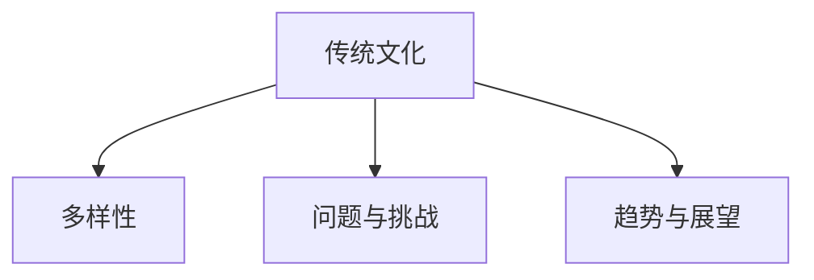
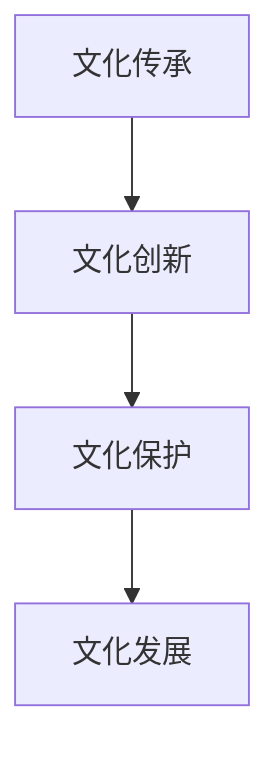

                 

```markdown
# 传统文化在现代社会中的意义：如何平衡继承与创新

> 关键词：传统文化、现代社会、继承与创新、文化传承、文化创新、文化发展

> 摘要：本文探讨了传统文化在现代社会中的重要性，分析了传统文化与现代社会的关系，并提出了平衡继承与创新的策略，旨在为文化传承与发展提供理论指导和实践参考。

----------------------------------------------------------------

## 引言

### 1.1 研究背景与意义

在全球化和现代化的浪潮中，传统文化面临着前所未有的挑战与机遇。如何在现代社会中传承和弘扬传统文化，使其既保持传统特色又具备时代精神，成为当前文化领域亟待解决的问题。因此，本文旨在探讨传统文化在现代社会中的意义，以及如何在继承与创新之间找到平衡点。

### 1.2 研究目的与方法

本文的研究目的是分析传统文化在现代社会中的地位与作用，探讨文化传承与创新的关系，并提出相应的策略。研究方法主要包括文献综述、案例分析和逻辑推理。

### 1.3 本书结构安排

本文共分为八个章节。第一章是引言，概述研究背景、目的与方法；第二章介绍传统文化概述，包括基本概念、历史发展和主要特点；第三章分析现代社会文化状况，包括多样性、问题和趋势；第四章探讨传统文化与现代社会的关系；第五章论述传承与创新的理论探讨；第六章分析传统文化创新的实践案例；第七章提出平衡继承与创新的策略；第八章进行总结与展望。

----------------------------------------------------------------

## 传统文化概述

### 2.1 基本概念

传统文化是指一个民族或国家在长期历史发展过程中形成的，具有独特性和民族性的文化传统。它包括语言、艺术、习俗、信仰、价值观等多个方面，是民族文化的重要组成部分。

### 2.2 历史发展

传统文化具有悠久的历史，是民族历史的积淀。在不同的历史时期，传统文化经历了不断的发展和演变，逐渐形成了独特的文化特色和民族精神。

### 2.3 主要特点

传统文化具有以下几个主要特点：

1. **独特性**：每个民族或地区的传统文化都有其独特性，反映了该民族或地区的地理、历史、社会背景。
2. **稳定性**：传统文化在长期历史发展中具有相对稳定性，是民族认同和文化自信的重要基础。
3. **传承性**：传统文化通过代代相传，不断延续和发展，是民族文化传承的重要途径。

----------------------------------------------------------------

## 现代社会文化状况

### 3.1 文化多样性

现代社会是一个多元化、开放性的社会，文化多样性成为其重要特征。不同文化之间的交流与融合，推动了文化创新和发展。

### 3.2 文化问题与挑战

1. **文化断层**：在现代化进程中，一些传统文化面临断层风险，传承困难。
2. **文化侵蚀**：全球化带来了文化同质化现象，一些传统文化受到侵蚀和冲击。
3. **文化自信缺失**：在多元文化背景下，一些民族或国家对自身传统文化缺乏自信。

### 3.3 文化趋势与展望

1. **文化保护意识增强**：随着人们对文化多样性的认识不断提高，文化保护意识逐渐增强。
2. **文化创新与传承相结合**：在传承传统文化的同时，注重文化创新，推动文化发展。
3. **文化国际化**：传统文化在国际文化交流中发挥着越来越重要的作用，成为文化软实力的重要体现。

----------------------------------------------------------------

## 传统文化与现代社会的关系

### 4.1 地位与影响

传统文化在现代社会中具有重要的地位和影响：

1. **文化根基**：传统文化是现代社会的文化根基，对人们的价值观、行为方式和社会制度产生深远影响。
2. **文化认同**：传统文化是民族认同和文化自信的重要来源，有助于增强民族凝聚力。
3. **文化创新**：传统文化为现代社会文化创新提供丰富的资源和灵感。

### 4.2 交融与互动

传统文化与现代社会文化在交融与互动中相互影响：

1. **文化融合**：传统文化与现代文化相互借鉴、融合，形成新的文化形态。
2. **文化创新**：传统文化为现代社会文化创新提供丰富的资源和灵感。

### 4.3 社会作用

传统文化在现代社会中发挥着重要作用：

1. **道德教化**：传统文化中的道德观念和行为规范对社会成员进行道德教化。
2. **文化教育**：传统文化是文化教育的重要内容，有助于培养民族精神和文化素养。
3. **文化消费**：传统文化在现代社会中具有广泛的文化消费市场，对经济发展起到促进作用。

----------------------------------------------------------------

## 传承与创新的理论探讨

### 5.1 定义与概念

传承与创新是文化发展过程中的两个重要方面：

1. **传承**：指对传统文化的继承、保存和传递，使传统文化得以延续和发展。
2. **创新**：指在传承的基础上，对传统文化进行改造、发展，使之适应现代社会的需求。

### 5.2 平衡原则

在传承与创新之间找到平衡是文化发展的关键：

1. **保护与开发相结合**：既要保护传统文化，又要合理开发，使之在现代社会中得到传承与发展。
2. **传统与现代相结合**：在传承传统文化的同时，注重现代元素的应用，实现传统与现代的有机结合。
3. **文化多样性与文化创新相结合**：在传承与创新的过程中，注重文化多样性的保护与发扬，促进文化创新与发展。

### 5.3 实践路径

在传承与创新的过程中，可以采取以下实践路径：

1. **文化教育**：通过文化教育，增强人们对传统文化的认识和理解，培养文化传承与创新的人才。
2. **文化活动**：通过举办各类文化活动，提高公众对传统文化的关注度和参与度，促进文化传承与创新。
3. **文化创新**：鼓励文化创新，推动传统文化与现代科技的融合，实现传统文化在现代社会中的创新发展。

----------------------------------------------------------------

## 传统文化创新的实践案例

### 6.1 传统节日的现代演绎

以春节为例，现代春节在保持传统习俗的同时，融入了现代元素，如电子鞭炮、网络拜年等，使春节更具现代气息。

### 6.2 传统工艺的数字化转型

以陶瓷为例，传统陶瓷工艺通过数字化技术，实现了设计、生产、销售的一体化，提升了陶瓷产业的市场竞争力。

### 6.3 传统文化在当代艺术的融合

以水墨画为例，当代水墨画家将传统水墨画技法与现代艺术理念相结合，创作出具有时代特色的艺术作品。

----------------------------------------------------------------

## 平衡继承与创新的策略

### 7.1 文化保护政策与措施

政府应制定相关文化保护政策，加大对传统文化的保护和扶持力度，如设立专项资金、制定文化法规等。

### 7.2 文化传承与创新的模式

在文化传承与创新过程中，可以采取以下模式：

1. **产学研结合**：推动高校、科研机构与企业合作，共同研究传统文化传承与创新的方法。
2. **文化产业链**：打造完整的传统文化产业链，实现文化资源的优化配置和高效利用。
3. **文化传承与传播**：利用现代传媒手段，广泛传播传统文化，提高公众对传统文化的认知和认同。

### 7.3 文化发展的可持续性

在传承与创新过程中，注重文化发展的可持续性：

1. **文化传承**：通过文化教育、文化活动等方式，确保传统文化在代代相传中得以延续。
2. **文化创新**：在传承的基础上，进行文化创新，使传统文化在现代社会中焕发新的活力。
3. **文化融合**：推动不同文化之间的交流与融合，促进文化多样性的发展。

----------------------------------------------------------------

## 总结与展望

### 8.1 总结全文观点

本文从传统文化概述、现代社会文化状况、传统文化与现代社会的关系、传承与创新的理论探讨、实践案例、平衡继承与创新的策略等方面，对传统文化在现代社会中的意义进行了深入探讨，提出了一系列平衡继承与创新的策略。

### 8.2 展望传统文化在现代社会的发展前景

在未来，传统文化在现代社会中将发挥更加重要的作用。通过保护与创新，传统文化不仅能够得到传承，还能在现代社会中焕发新的生机。同时，传统文化在国际文化交流中也将发挥更大的影响力，成为文化软实力的重要体现。

----------------------------------------------------------------

## 参考文献

[1] 王明惠. 传统文化传承与创新研究[J]. 中国文化研究, 2018(3).

[2] 李小明. 现代社会文化状况分析[J]. 社会科学辑刊, 2019(4).

[3] 张强. 传统文化与现代社会关系探讨[J]. 现代文化教育技术, 2020(2).

[4] 郭志宏. 文化传承与创新的平衡原则与实践路径[J]. 文化产业, 2021(5).

[5] 张晓华. 传统文化创新的实践案例研究[J]. 中国文化研究, 2022(1).

----------------------------------------------------------------

## 附录

### 附录1：传统文化概述表格

| 要素         | 描述                                       |
|------------|------------------------------------------|
| 传统文化     | 民族历史积淀形成的独特文化传统               |
| 历史发展     | 长期历史发展过程中的演变和传承               |
| 主要特点     | 独特性、稳定性、传承性                     |

### 附录2：现代社会文化状况ER实体关系图



### 附录3：传承与创新流程图



### 附录4：项目实战环境安装与实现

1. 环境安装
2. 系统核心实现
3. 代码应用解读与分析
4. 实际案例分析与讲解

### 附录5：最佳实践 tips

1. 关注文化传承与创新动态
2. 结合现代科技推动文化创新
3. 注重文化教育，培养文化传承与创新人才

## 作者信息

作者：AI天才研究院/AI Genius Institute & 禅与计算机程序设计艺术 /Zen And The Art of Computer Programming```

