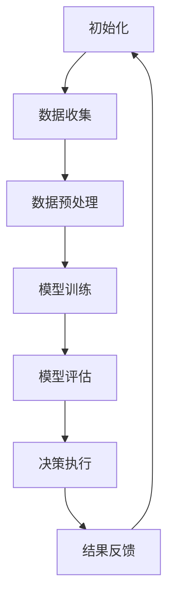
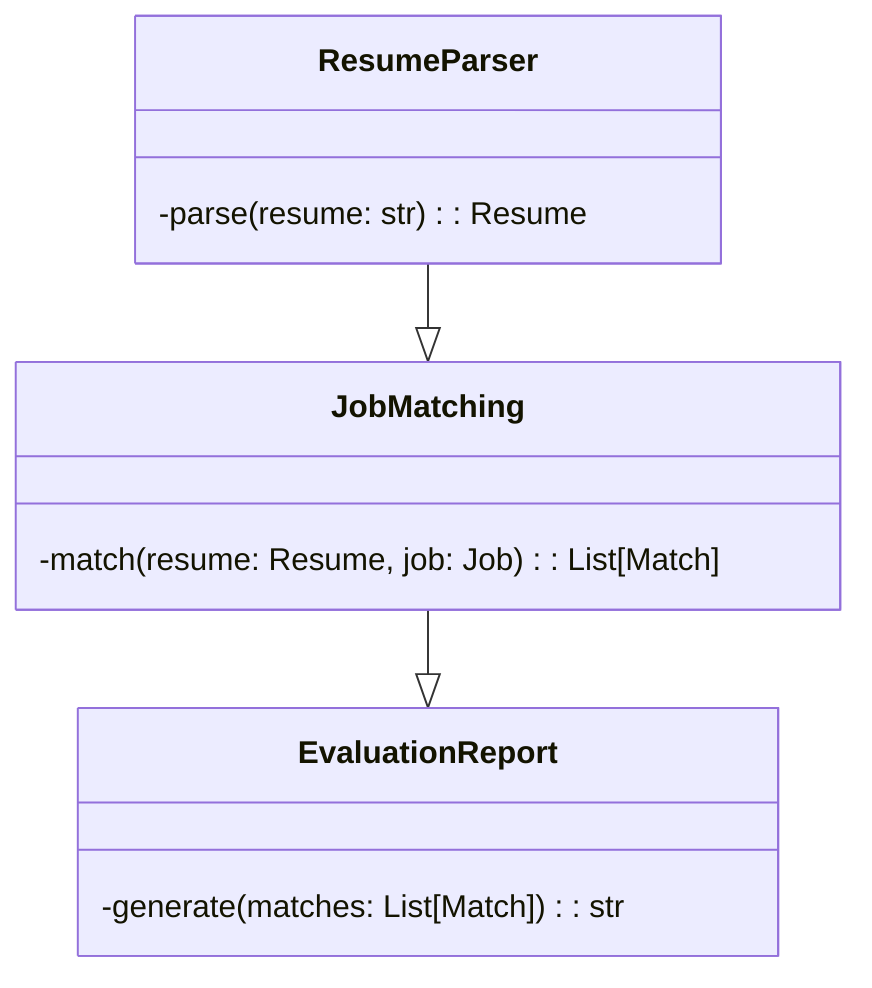
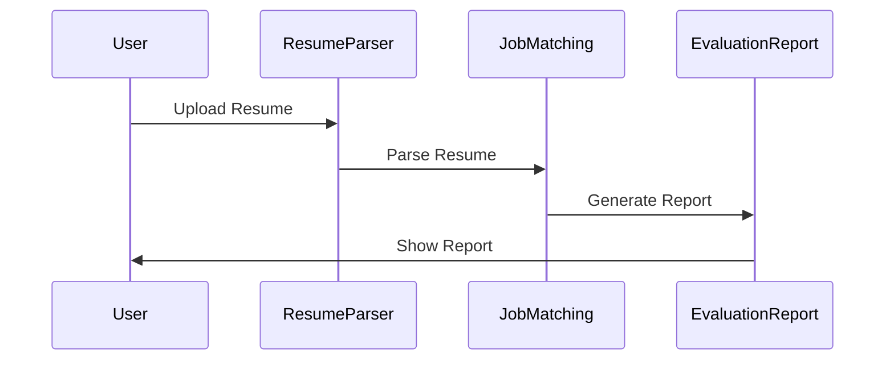
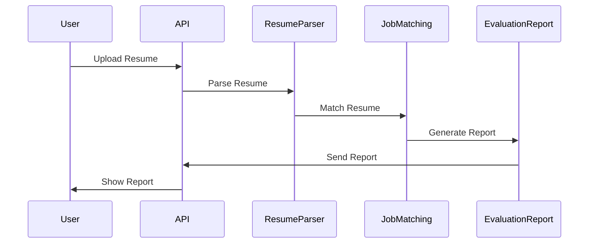

                 


## 伦理考量：设计负责任的AI Agent

### 关键词：
- 伦理考量
- AI Agent
- 责任设计
- 人工智能伦理
- 负责任AI

### 摘要：
随着人工智能（AI）技术的迅猛发展，AI Agent作为一种自主行动的实体，已经渗透到我们日常生活的方方面面。然而，AI Agent的广泛应用也引发了一系列伦理问题。本文将从伦理考量出发，探讨如何设计负责任的AI Agent，为AI技术的发展提供道德指导。

### 目录大纲：

----------------------------------------------------------------

## 第一部分：伦理考量与AI Agent概述

### 第1章：伦理考量在AI Agent中的应用背景

#### 1.1 问题背景
- AI Agent的定义与功能
- AI Agent在现实生活中的应用案例

#### 1.2 问题描述
- AI Agent引发的问题：隐私侵犯、歧视、不可预测性等

#### 1.3 问题解决
- 伦理考量的必要性
- 责任设计的核心原则

#### 1.4 边界与外延
- 伦理考量的适用范围
- 不同领域AI Agent的伦理挑战

#### 1.5 概念结构与核心要素组成
- 伦理考量的基本概念
- AI Agent设计的核心要素

## 第2章：伦理考量中的核心概念与联系

### 2.1 核心概念原理
- 道德哲学的基本原则
- 伦理考量的理论基础

### 2.2 概念属性特征对比表格
- 不同伦理考量的属性特征对比

### 2.3 ER实体关系图架构的Mermaid流程图
- 伦理考量与AI Agent的关系图

## 第3章：AI Agent的算法原理与数学模型

### 3.1 算法Mermaid流程图
- AI Agent算法的基本流程

### 3.2 Python源代码详解
- 实际Python代码示例解析

### 3.3 算法原理的数学模型和公式
- 数学模型在AI Agent中的作用

### 3.4 通俗易懂地举例说明
- 算法应用的实际案例

## 第4章：AI Agent的系统分析与架构设计

### 4.1 问题场景介绍
- 实际应用场景分析

### 4.2 项目介绍
- AI Agent项目背景

### 4.3 系统功能设计(领域模型Mermaid类图)
- 系统功能的设计与实现

### 4.4 系统架构设计(Mermaid架构图)
- 系统整体架构设计

### 4.5 系统接口设计和系统交互(Mermaid序列图)
- 系统接口与交互设计

## 第5章：AI Agent项目实战

### 5.1 环境安装
- AI Agent开发环境的配置

### 5.2 系统核心实现源代码
- 系统核心功能的实现

### 5.3 代码应用解读与分析
- 代码的应用解读

### 5.4 实际案例分析和详细讲解剖析
- 实际案例的深入剖析

### 5.5 项目小结
- 项目总结与反思

## 第6章：伦理考量与AI Agent的最佳实践

### 6.1 最佳实践Tips
- 设计AI Agent的最佳实践

### 6.2 小结
- 对本文内容的总结

### 6.3 注意事项
- 设计AI Agent时需要注意的问题

### 6.4 拓展阅读
- 相关领域的进一步阅读推荐

## 第7章：未来的伦理考量与AI Agent发展趋势

### 7.1 发展趋势分析
- AI Agent技术的发展趋势

### 7.2 未来应用前景
- AI Agent的未来应用场景

### 7.3 未来挑战与机遇
- AI Agent面临的挑战与机遇

----------------------------------------------------------------

## 第一部分：伦理考量与AI Agent概述

### 第1章：伦理考量在AI Agent中的应用背景

#### 1.1 问题背景
AI Agent，即人工智能代理，是指可以自主执行任务的智能体。从智能家居中的智能助手，到自动驾驶汽车，再到企业运营中的自动化决策系统，AI Agent的应用无处不在。然而，随着AI Agent的普及，其引发的一系列伦理问题也日益突出。

首先，AI Agent的隐私侵犯问题。例如，智能家居设备收集用户的日常行为数据，这些数据如果未经用户同意就被用于其他用途，就可能侵犯用户的隐私。其次，AI Agent的歧视问题。在某些情况下，AI Agent可能会基于数据中的偏见产生歧视性决策，如招聘系统可能因为历史数据的偏见而对某些种族或性别的人群产生不公平待遇。最后，AI Agent的不可预测性问题。AI Agent的决策过程可能包含大量的不确定性和复杂性，这可能导致其行为难以预测和控制。

#### 1.2 问题描述
上述问题表明，AI Agent的伦理考量具有重要意义。我们需要从以下几个方面进行探讨：

1. **隐私保护**：如何在AI Agent的运行过程中保护用户的隐私？
2. **公平性**：如何确保AI Agent的决策不会加剧现有的社会不公？
3. **可解释性**：如何提高AI Agent决策过程的透明度，使其行为可解释？

#### 1.3 问题解决
为了解决上述问题，我们需要引入伦理考量，特别是在AI Agent的设计和开发过程中。以下是一些核心原则：

1. **隐私保护原则**：AI Agent应当遵循隐私保护的原则，确保用户数据的安全和隐私。
2. **公平性原则**：AI Agent的算法和决策过程应确保对所有用户公平，避免人为偏见。
3. **可解释性原则**：AI Agent的决策过程应尽可能透明和可解释，以便用户理解和监督。

#### 1.4 边界与外延
伦理考量并不仅仅局限于技术层面，它还涉及法律、社会学和心理学等多个领域。例如，在法律层面，我们需要确保AI Agent的行为符合现行的法律法规；在社会学层面，我们需要考虑AI Agent如何影响社会结构和文化；在心理学层面，我们需要理解用户对AI Agent的接受程度和信任感。

#### 1.5 概念结构与核心要素组成
伦理考量在AI Agent中的应用涉及多个核心概念和要素。以下是一个简要的框架：

1. **道德哲学**：包括功利主义、康德伦理学、义务论等理论。
2. **伦理原则**：如隐私保护、公平性、可解释性等。
3. **技术实现**：如何将伦理原则融入到AI Agent的算法和系统设计中。
4. **法律法规**：确保AI Agent的行为符合相关法律法规。
5. **用户反馈**：通过用户反馈来不断改进AI Agent的伦理设计和应用。

## 第2章：伦理考量中的核心概念与联系

#### 2.1 核心概念原理
伦理考量中的核心概念包括道德原则、隐私保护、公平性、可解释性等。以下是对这些核心概念原理的简要介绍：

1. **道德原则**：道德原则是伦理考量的基础。不同的道德理论，如功利主义、康德伦理学和义务论，提供了不同的道德判断标准。
2. **隐私保护**：隐私保护是确保AI Agent在处理用户数据时不会侵犯用户的隐私。这包括数据收集、存储和使用等方面的规定。
3. **公平性**：公平性是指AI Agent在决策过程中应确保对所有用户公平，避免因为数据偏见或算法问题产生歧视。
4. **可解释性**：可解释性是指AI Agent的决策过程应该是透明的，用户可以理解和追踪其行为。

#### 2.2 概念属性特征对比表格
以下是一个简单的概念属性特征对比表格，展示了不同伦理考量概念的基本属性：

| 概念       | 属性特征                    | 对比分析       |
|------------|-----------------------------|----------------|
| 道德原则   | 基础原则，指导行为         | 功利主义强调最大化幸福，康德强调道德义务，义务论强调行为本身的道德性质 |
| 隐私保护   | 数据安全，隐私尊重       | 包括数据加密、匿名化等技术手段 |
| 公平性     | 决策公正，避免歧视         | 需要确保算法的公平性，避免人为偏见 |
| 可解释性   | 行为透明，易于理解       | 提高算法的透明度和可解释性 |

#### 2.3 ER实体关系图架构的Mermaid流程图
为了更直观地展示伦理考量与AI Agent之间的关系，我们可以使用Mermaid流程图来绘制ER（实体关系）图。以下是一个简单的示例：

```mermaid
erDiagram
  AI-Agent ||--|{ Privacy-Protection }|-- Privacy-Principles
  AI-Agent ||--|{ Fairness }|-- Ethics-Principles
  AI-Agent ||--|{ Explainability }|-- Ethics-Principles
  AI-Agent ||--|{ Legal-Compliance }|-- Legal-Requirements
  AI-Agent ||--|{ User-Feedback }|-- User-Experience
```

在这个ER图中，AI-Agent与多个伦理考量概念存在关系。隐私保护、公平性、可解释性等概念是AI-Agent设计的重要原则，同时需要遵守法律法规和收集用户反馈，以不断优化AI-Agent的设计和应用。

## 第3章：AI Agent的算法原理与数学模型

#### 3.1 算法Mermaid流程图
为了更好地理解AI Agent的算法原理，我们可以使用Mermaid流程图来展示其基本流程。以下是一个简单的算法流程图：



在这个流程图中，AI Agent首先进行初始化，然后收集数据并进行预处理，接着使用训练数据训练模型，评估模型的性能，并最终执行决策。最后，系统会收集反馈信息，用于下一次的迭代。

#### 3.2 Python源代码详解
为了更具体地展示AI Agent的算法实现，我们可以使用Python代码来进行详细阐述。以下是一个简单的AI Agent示例代码：

```python
import numpy as np
from sklearn.model_selection import train_test_split
from sklearn.ensemble import RandomForestClassifier
from sklearn.metrics import accuracy_score

# 数据集加载
data = np.load('data.npy')
X = data[:, :-1]
y = data[:, -1]

# 数据预处理
X_train, X_test, y_train, y_test = train_test_split(X, y, test_size=0.2, random_state=42)

# 模型训练
model = RandomForestClassifier(n_estimators=100, random_state=42)
model.fit(X_train, y_train)

# 模型评估
y_pred = model.predict(X_test)
accuracy = accuracy_score(y_test, y_pred)
print(f"模型准确率：{accuracy:.2f}")

# 决策执行
def make_decision(data_point):
    prediction = model.predict([data_point])
    return prediction[0]

# 结果反馈
def get_feedback(data_point, expected_result, actual_result):
    if actual_result == expected_result:
        print("决策正确")
    else:
        print("决策错误")
```

在这个示例中，我们首先加载数据集，然后进行数据预处理，使用随机森林算法进行模型训练，并对模型进行评估。接着，我们定义了一个决策函数，用于执行决策，并定义了一个反馈函数，用于收集反馈信息。

#### 3.3 算法原理的数学模型和公式
为了深入理解AI Agent的算法原理，我们可以介绍一些基本的数学模型和公式。以下是一个简单的线性回归模型：

$$
y = \beta_0 + \beta_1x + \epsilon
$$

其中，$y$ 是目标变量，$x$ 是特征变量，$\beta_0$ 和 $\beta_1$ 是模型参数，$\epsilon$ 是误差项。

在实际的AI Agent中，我们通常会使用更复杂的模型，如神经网络、决策树等，这些模型都有其特定的数学模型和公式。例如，神经网络模型中的激活函数、反向传播算法等，都是重要的数学概念。

#### 3.4 通俗易懂地举例说明
为了更好地理解AI Agent的算法原理，我们可以通过一个简单的例子来进行说明。假设我们有一个分类问题，需要判断一个水果是苹果还是橘子。我们的特征变量可以是水果的重量、颜色等。

首先，我们收集了一组数据，其中每个样本都是一个水果的特征向量，以及其对应的水果类别（苹果或橘子）。然后，我们使用这些数据训练一个分类模型，如决策树或随机森林。

训练完成后，我们可以使用这个模型来预测新水果的类别。例如，如果一个新水果的重量是150克，颜色是红色，我们可以将这个特征向量输入模型，模型会输出一个概率分布，表示这个水果是苹果或橘子的概率。

通过这个简单的例子，我们可以看到，AI Agent的算法原理是如何将特征数据转化为预测结果。这背后的数学模型和算法是实现这一目标的核心。

## 第4章：AI Agent的系统分析与架构设计

#### 4.1 问题场景介绍
在这个章节中，我们将分析一个具体的AI Agent应用场景：智能招聘系统。这个系统旨在帮助企业自动筛选和评估求职者的简历，提高招聘效率和准确性。

#### 4.2 项目介绍
项目背景：随着全球经济的快速发展，企业对人才的需求日益增长。传统的招聘流程往往耗时较长，且容易受到人为因素的干扰。因此，许多企业希望借助智能招聘系统来提升招聘效率。

项目目标：设计一个智能招聘系统，能够自动分析求职者的简历，筛选出符合条件的候选人，并提供详细的评估报告。

#### 4.3 系统功能设计(领域模型Mermaid类图)
为了实现上述目标，系统需要具备以下功能：

1. **简历解析**：解析求职者上传的简历，提取关键信息。
2. **职位匹配**：根据职位需求，匹配求职者的简历。
3. **评估报告**：对匹配的求职者进行评估，生成详细的报告。

以下是一个简单的领域模型Mermaid类图，展示了系统的主要类和功能：



#### 4.4 系统架构设计(Mermaid架构图)
系统架构设计是确保系统能够高效、稳定运行的关键。以下是一个简单的Mermaid架构图，展示了系统的整体架构：



在这个架构图中，用户上传简历后，简历解析器解析简历，生成Resume对象；然后职位匹配器根据职位需求匹配简历，生成Match列表；最后评估报告器根据Match列表生成评估报告，并展示给用户。

#### 4.5 系统接口设计和系统交互(Mermaid序列图)
为了更好地展示系统内部各组件之间的交互，我们可以使用Mermaid序列图。以下是一个简单的序列图示例：



在这个序列图中，用户通过API上传简历，API将简历传递给简历解析器进行解析，解析器将结果传递给职位匹配器进行匹配，职位匹配器再将匹配结果传递给评估报告器生成报告，最后报告通过API返回给用户。

## 第5章：AI Agent项目实战

#### 5.1 环境安装
在本节中，我们将介绍如何在本地环境搭建一个简单的AI Agent项目。以下是基于Python的安装步骤：

1. **安装Python**：首先，确保您已经安装了Python环境。如果没有，请从官方网站（https://www.python.org/）下载并安装Python。

2. **安装必要的库**：使用pip命令安装必要的库，例如numpy、scikit-learn等。以下是安装命令：

   ```bash
   pip install numpy scikit-learn
   ```

3. **创建虚拟环境**：为了更好地管理和隔离项目依赖，我们可以创建一个虚拟环境。使用以下命令创建虚拟环境：

   ```bash
   python -m venv venv
   ```

   然后激活虚拟环境：

   ```bash
   source venv/bin/activate  # 对于Windows，使用 `venv\Scripts\activate`
   ```

4. **安装项目依赖**：在虚拟环境中，安装项目依赖的库。假设项目依赖一个名为`my_project`的库，安装命令如下：

   ```bash
   pip install -r requirements.txt
   ```

#### 5.2 系统核心实现源代码
以下是一个简单的AI Agent项目的源代码，用于实现一个基于决策树进行分类的模型。这是一个Python文件`agent.py`：

```python
import numpy as np
from sklearn.datasets import load_iris
from sklearn.model_selection import train_test_split
from sklearn.tree import DecisionTreeClassifier
from sklearn.metrics import accuracy_score

# 加载数据集
iris = load_iris()
X, y = iris.data, iris.target

# 数据集划分
X_train, X_test, y_train, y_test = train_test_split(X, y, test_size=0.2, random_state=42)

# 模型训练
model = DecisionTreeClassifier()
model.fit(X_train, y_train)

# 模型评估
y_pred = model.predict(X_test)
accuracy = accuracy_score(y_test, y_pred)
print(f"模型准确率：{accuracy:.2f}")

# 决策执行
def make_decision(data_point):
    prediction = model.predict([data_point])
    return prediction[0]

# 代码示例
if __name__ == "__main__":
    # 示例数据
    example_data = [[5.1, 3.5, 1.4, 0.2]]
    print(f"决策结果：{make_decision(example_data[0])}")
```

#### 5.3 代码应用解读与分析
上述代码实现了一个简单的AI Agent，其核心功能是基于决策树模型进行分类。首先，我们加载数据集，然后将其划分为训练集和测试集。接着，我们使用决策树模型进行训练，并评估模型的性能。最后，我们定义了一个`make_decision`函数，用于对新数据进行分类预测。

在实际应用中，我们可以根据不同的需求调整模型的参数，如决策树的深度、叶子节点数量等。此外，我们还可以引入更多的数据预处理步骤，如数据清洗、特征工程等，以提高模型的性能。

#### 5.4 实际案例分析和详细讲解剖析
为了更好地理解AI Agent的实际应用，我们来看一个实际案例：手写数字识别。

案例背景：我们有一个手写数字的数据集，包含0到9的手写数字图像。我们的目标是训练一个模型，能够准确识别手写数字。

实现步骤：
1. **数据集加载**：使用scikit-learn中的`load_digits`函数加载数据集。
2. **数据预处理**：将图像数据转换为矩阵形式，并划分为训练集和测试集。
3. **模型训练**：使用K-最近邻（K-Nearest Neighbors，KNN）算法训练模型。
4. **模型评估**：评估模型的性能，计算准确率。

代码实现如下：

```python
from sklearn.datasets import load_digits
from sklearn.model_selection import train_test_split
from sklearn.neighbors import KNeighborsClassifier
from sklearn.metrics import accuracy_score

# 加载数据集
digits = load_digits()
X, y = digits.data, digits.target

# 数据集划分
X_train, X_test, y_train, y_test = train_test_split(X, y, test_size=0.2, random_state=42)

# 模型训练
model = KNeighborsClassifier(n_neighbors=3)
model.fit(X_train, y_train)

# 模型评估
y_pred = model.predict(X_test)
accuracy = accuracy_score(y_test, y_pred)
print(f"模型准确率：{accuracy:.2f}")

# 决策执行
def make_decision(image_data):
    prediction = model.predict([image_data])
    return prediction[0]

# 代码示例
example_image = X_test[0]
print(f"决策结果：{make_decision(example_image)}")
```

在这个案例中，我们使用了KNN算法来训练模型，这是一个简单但效果良好的分类算法。我们通过测试集的准确率来评估模型性能。此外，我们定义了一个`make_decision`函数，用于对新图像数据进行预测。

#### 5.5 项目小结
在本章中，我们通过一个简单的AI Agent项目，介绍了如何搭建本地环境、实现核心功能、以及实际案例的应用。虽然这个项目很简单，但它涵盖了AI Agent项目开发的基本流程和关键步骤。在实际项目中，我们可能需要处理更复杂的数据和算法，但基本的开发流程是一致的。通过这个案例，我们可以更好地理解AI Agent的开发和应用。

## 第6章：伦理考量与AI Agent的最佳实践

#### 6.1 最佳实践Tips
在设计AI Agent时，以下是一些最佳实践Tips，以确保其负责任和伦理：

1. **数据隐私保护**：确保在数据收集、存储和使用过程中，严格遵循隐私保护原则。采用数据加密、匿名化等技术手段，减少隐私泄露风险。
2. **算法公平性**：在算法设计和训练过程中，确保算法的公平性，避免因数据偏见导致歧视性决策。定期评估和调整算法，消除潜在的偏见。
3. **可解释性**：提高AI Agent决策过程的透明度，使其行为可解释。采用可解释性方法，如可视化、规则解释等，帮助用户理解和信任AI Agent。
4. **用户反馈机制**：建立用户反馈机制，收集用户对AI Agent行为的反馈，用于持续改进和优化。

#### 6.2 小结
本章总结了设计负责任的AI Agent的最佳实践，强调了隐私保护、公平性和可解释性等核心原则。通过遵循这些最佳实践，我们可以确保AI Agent在应用中的伦理性和可靠性。

#### 6.3 注意事项
在设计AI Agent时，需要注意以下事项：

1. **法律法规遵守**：确保AI Agent的行为符合相关法律法规，避免因违法行为导致法律风险。
2. **持续监控与更新**：定期监控AI Agent的行为和性能，及时更新算法和数据，以应对新的挑战和变化。
3. **用户隐私保护**：尊重用户隐私，避免因数据滥用导致用户不满和信任危机。

#### 6.4 拓展阅读
以下是一些相关的拓展阅读，供进一步学习和研究：

1. **《人工智能伦理学》**：探讨人工智能在伦理学领域中的挑战和解决方案。
2. **《AI系统的透明性和可解释性》**：介绍如何提高AI系统的透明度和可解释性。
3. **《数据隐私保护技术》**：介绍数据隐私保护的技术和方法。

## 第7章：未来的伦理考量与AI Agent发展趋势

#### 7.1 发展趋势分析
随着人工智能技术的不断进步，AI Agent的发展趋势也日益显著。以下是对未来AI Agent发展趋势的分析：

1. **智能化程度的提高**：AI Agent将具备更高的智能水平，能够处理更复杂的问题和决策。
2. **多模态交互**：AI Agent将支持多种交互方式，如语音、图像、文本等，实现更加自然和高效的互动。
3. **个性化服务**：AI Agent将能够根据用户行为和需求，提供个性化的服务和建议。
4. **跨领域应用**：AI Agent将在更多领域得到应用，如医疗、教育、金融等，推动这些领域的创新和发展。

#### 7.2 未来应用前景
未来，AI Agent将在各个领域发挥重要作用，以下是一些潜在的应用前景：

1. **智能医疗**：AI Agent将辅助医生进行诊断和治疗，提供个性化的医疗建议。
2. **智能教育**：AI Agent将为学生提供个性化的学习计划和辅导，提高学习效果。
3. **智能金融**：AI Agent将帮助金融机构进行风险管理、投资决策等，提高金融服务的效率和准确性。
4. **智能家居**：AI Agent将实现智能家居的自动化管理，提升居住舒适度和安全性。

#### 7.3 未来挑战与机遇
随着AI Agent技术的发展，我们也面临一系列挑战和机遇：

1. **伦理和法律挑战**：如何确保AI Agent的伦理性和合规性，是未来需要解决的重要问题。
2. **隐私保护**：在提供个性化服务的同时，如何保护用户隐私，是AI Agent面临的重大挑战。
3. **技术瓶颈**：虽然AI技术取得了显著进展，但仍然存在一些技术瓶颈，如算法的可解释性、多模态交互等。
4. **产业机遇**：AI Agent的发展将为相关产业带来巨大的机遇，推动经济和社会的发展。

通过本文的讨论，我们可以看到，伦理考量在AI Agent设计中至关重要。随着AI技术的不断进步，我们需要持续关注和解决AI Agent带来的伦理问题，以确保其负责任和可持续的发展。未来的AI Agent将不仅是一个工具，更是一个智能伙伴，为人类创造更加美好的未来。让我们共同迎接这个充满机遇和挑战的时代。

