                 

### 文章标题

# 体育运动：身体力行中的生命体验

### 关键词

- 体育运动
- 身体体验
- 心理健康
- 社交互动
- 教育意义

### 摘要

本文将从多维度探讨体育运动对个体生命体验的影响。首先，我们回顾体育运动的历史背景和核心概念，然后深入分析体育运动在生理变化、心理健康、社交互动和生活方式等方面的重要性。最后，探讨体育运动在教育和未来趋势中的角色，并提出未来研究方向。通过逻辑清晰的章节划分，本文希望为读者提供一个全面而深刻的理解，让体育运动成为提升生命质量的有力工具。

### 目录大纲

```markdown
----------------------------------------------------------------

# 第一部分：引言

## 第1章：问题背景与核心概念

### 1.1.1 问题背景

### 1.1.2 生命体验的概念

### 1.1.3 体育运动与生命体验的关系

## 第2章：体育运动与生理变化

### 2.1.1 身体活动的生理机制

### 2.1.2 体育运动对心血管系统的影响

### 2.1.3 体育运动对呼吸系统的影响

## 第3章：体育运动与心理健康

### 3.1.1 体育运动与情绪调节

### 3.1.2 体育运动与压力管理

### 3.1.3 体育运动与自尊、自信

## 第4章：体育运动与社交互动

### 4.1.1 体育运动与团队精神

### 4.1.2 体育运动与社交网络

### 4.1.3 体育运动与人际关系

## 第5章：体育运动与生活方式

### 5.1.1 体育运动与生活习惯

### 5.1.2 体育运动与健康生活方式

### 5.1.3 体育运动与生活质量

## 第6章：体育运动的教育意义

### 6.1.1 体育运动与青少年发展

### 6.1.2 体育运动与教育目标

### 6.1.3 体育运动课程设计

## 第7章：体育运动的未来趋势

### 7.1.1 新型体育运动项目

### 7.1.2 科技在体育运动中的应用

### 7.1.3 体育运动的国际化发展

## 第8章：结论与展望

### 8.1.1 总结全文

### 8.1.2 体育运动与生命体验的深远影响

### 8.1.3 未来研究方向

----------------------------------------------------------------
```

### 详细解释

#### 目录设计思路

本书的目录设计分为三个主要部分：引言、主体和结论。引言部分通过介绍问题的背景和核心概念，引导读者进入主题；主体部分详细阐述了体育运动对身体、心理、社交、教育等方面的影响；结论部分对全书内容进行总结，并提出了未来研究方向。

#### 各章节内容概述

- **第1章：引言**

  本章首先介绍问题背景，解释为什么体育运动对于生命体验具有重要意义。接着，对生命体验这一核心概念进行定义，并探讨体育运动与生命体验之间的联系。

- **第2章：体育运动与生理变化**

  本章主要讨论体育运动对生理系统的影响，包括身体活动的生理机制、对心血管系统和呼吸系统的影响等。

- **第3章：体育运动与心理健康**

  本章关注体育运动对心理健康的影响，包括情绪调节、压力管理和自尊自信等方面的内容。

- **第4章：体育运动与社交互动**

  本章探讨体育运动在社交互动中的作用，如团队精神、社交网络和人际关系等。

- **第5章：体育运动与生活方式**

  本章从生活方式的角度，讨论体育运动对生活习惯、健康生活方式和生活质量的影响。

- **第6章：体育运动的教育意义**

  本章介绍体育运动在青少年发展、教育目标以及课程设计等方面的意义。

- **第7章：体育运动的未来趋势**

  本章展望体育运动的未来趋势，包括新型体育运动项目、科技应用和国际化发展等。

- **第8章：结论与展望**

  本章总结全书内容，并探讨体育运动与生命体验的深远影响，最后提出未来研究方向。

#### 内容完整性

每个章节都围绕核心主题展开，通过逻辑清晰的段落划分，使得内容有条不紊。特别地，第2章到第6章分别对应了身体、心理、社交和教育四个维度，全面覆盖了体育运动对生命体验的影响。

#### 目录大纲的核心章节内容

- **第1章：引言**

  - **核心概念原理**：生命体验的定义和体育运动对生命体验的影响。

  - **概念属性特征对比表格**：不同类型的体育运动对生命体验的不同影响。

  - **ER实体关系图架构**：体育运动与生命体验的实体关系。

- **第2章：体育运动与生理变化**

  - **算法原理讲解**：使用mermaid画出身体活动的生理机制流程图，并用Python源代码详细阐述。

  - **数学模型和数学公式**：体育运动对心血管系统和呼吸系统的影响的数学模型。

  - **举例说明**：举例说明不同类型的体育运动对生理系统的影响。

- **第3章：体育运动与心理健康**

  - **算法原理讲解**：使用mermaid画出情绪调节的流程图，并用Python源代码详细阐述。

  - **数学模型**：体育运动对心理健康的影响的数学模型。

  - **举例说明**：举例说明不同类型的体育运动对心理健康的影响。

- **第4章：体育运动与社交互动**

  - **算法原理讲解**：使用mermaid画出团队精神的流程图，并用Python源代码详细阐述。

  - **数学模型**：体育运动对社交互动的影响的数学模型。

  - **举例说明**：举例说明不同类型的体育运动对社交互动的影响。

- **第5章：体育运动与生活方式**

  - **算法原理讲解**：使用mermaid画出生活习惯的流程图，并用Python源代码详细阐述。

  - **数学模型**：体育运动对生活方式的影响的数学模型。

  - **举例说明**：举例说明不同类型的体育运动对生活方式的影响。

- **第6章：体育运动的教育意义**

  - **算法原理讲解**：使用mermaid画出青少年发展的流程图，并用Python源代码详细阐述。

  - **数学模型**：体育运动对教育目标的影响的数学模型。

  - **举例说明**：举例说明不同类型的体育运动对教育目标的影响。

- **第7章：体育运动的未来趋势**

  - **新型体育运动项目**：讨论新型体育运动项目的发展趋势。

  - **科技在体育运动中的应用**：探讨科技在体育运动中的应用。

  - **国际化发展**：分析体育运动的国际化发展。

- **第8章：结论与展望**

  - **总结全文**：总结全文的主要内容和观点。

  - **体育运动与生命体验的深远影响**：探讨体育运动对生命体验的深远影响。

  - **未来研究方向**：提出未来研究

## 第1章：问题背景与核心概念

### 1.1.1 问题背景

体育运动是人类社会的重要组成部分，自古以来，它不仅承载着娱乐和竞技的功能，还深深影响着个体的身心健康和社会发展。随着现代社会对健康生活方式的追求，体育运动的重要性日益凸显。它不仅可以帮助人们保持身体健康，还能在心理、社交等方面带来积极的影响。然而，对于体育运动对生命体验的具体影响，人们的研究仍处于不断深入和完善的过程中。本文旨在探讨体育运动在多方面对个体生命体验的影响，为读者提供一个全面、深入的视角。

### 1.1.2 生命体验的概念

生命体验是指个体在生活中经历的各种感受和体验，包括生理、心理、情感、认知等多个维度。它不仅包括对自我和外界的认知，还包括个体在特定环境下的行为和反应。生命体验具有主观性，每个人对同一事物的体验可能截然不同，但都对其生活质量和幸福感产生重要影响。生命体验的重要性在于，它是衡量个体生活质量的重要指标，同时也是社会发展的基础。

### 1.1.3 体育运动与生命体验的关系

体育运动与生命体验密切相关。从生理角度看，体育运动可以提高心血管功能、增强肌肉力量和耐力，改善呼吸系统功能，从而提升生命质量。从心理角度看，体育运动可以帮助个体调节情绪、缓解压力，提升自尊和自信。从社交角度看，体育运动可以促进团队合作、建立社交网络，增强人际关系。此外，体育运动还有助于培养自律性和坚持不懈的精神，这些品质对于个体的全面发展具有重要意义。

### 1.1.4 不同类型的体育运动对生命体验的影响

不同类型的体育运动对生命体验的影响各有不同。例如，有氧运动如跑步、游泳等可以增强心肺功能，有助于心血管健康；力量训练如举重、俯卧撑等可以提高肌肉力量和耐力；团队运动如篮球、足球等可以培养团队合作精神；而休闲运动如瑜伽、太极拳等则有助于情绪调节和心理健康。理解不同类型体育运动的特点和影响，有助于个体根据自身需求选择合适的运动方式，以最大化提升生命体验。

### 1.1.5 体育运动在现代社会中的地位与价值

在现代社会，体育运动不仅是一种娱乐和竞技活动，更是健康生活方式的重要组成部分。它有助于预防各种慢性疾病，提高生活质量。同时，体育运动也是社会文化的重要组成部分，可以增强国家凝聚力和国际影响力。此外，体育运动还具有教育意义，可以培养青少年的团队合作精神、自律性和责任感。因此，体育运动在现代社会中的地位和价值不可忽视。

### 1.1.6 体育运动对个体发展的深远影响

体育运动对个体发展具有深远影响。从个人层面看，体育运动有助于培养积极的生活态度和健康的生活方式。从社会层面看，体育运动可以促进社会和谐，增强社会凝聚力。从国家层面看，体育运动有助于提升国家软实力，增强国际竞争力。因此，体育运动不仅仅是身体锻炼，更是全面发展和国家战略的重要组成部分。

### 总结

本章从问题背景、生命体验的概念、体育运动与生命体验的关系、不同类型的体育运动影响、体育运动在现代社会中的地位与价值以及体育运动对个体发展的深远影响等多个方面，探讨了体育运动在生命体验中的重要性。接下来，我们将深入分析体育运动在生理、心理、社交和教育等多个领域的具体影响。

## 第2章：体育运动与生理变化

### 2.1.1 身体活动的生理机制

体育运动是通过一系列身体活动来实现的，这些活动包括肌肉收缩、关节运动、呼吸调节和心血管系统的协同工作等。首先，当我们进行体育运动时，神经系统会传递信号到肌肉，引起肌肉收缩。这种收缩通过骨骼的支撑和关节的运动，产生身体的各种动作。同时，呼吸系统会加快呼吸频率和深度，以提供更多的氧气供肌肉使用，同时将代谢产生的二氧化碳排出体外。心血管系统则通过加快心跳和血液流动，确保氧气和营养物质能够迅速传递到各个组织。

### 2.1.2 体育运动对心血管系统的影响

体育运动对心血管系统有着显著的影响。有氧运动如跑步、游泳等可以增强心肌的收缩力，提高心脏的泵血效率。长期坚持有氧运动可以使心脏变得更强壮，减少心血管疾病的风险。此外，体育运动还可以提高血管的弹性和通透性，降低血压和胆固醇水平，从而减少心脏病和中风的风险。研究表明，每周至少进行150分钟的中等强度有氧运动，可以显著降低心血管疾病的发生率。

### 2.1.3 体育运动对呼吸系统的影响

体育运动对呼吸系统的影响主要体现在呼吸频率和深度的增加。通过增加呼吸频率和深度，体育运动可以提高肺活量，增强呼吸肌的力量。这种增强有助于提高氧气摄入量和二氧化碳排出效率，从而提高整体的身体代谢水平。长期参与体育运动的人，其肺功能通常比不运动的人更优秀。例如，长期跑步者往往具有更高的最大摄氧量，这意味着他们的身体能够更有效地利用氧气进行运动。

### 2.1.4 体育运动对身体其他系统的影响

除了心血管和呼吸系统，体育运动还对身体的多个系统产生积极影响。例如，它能够增强肌肉和骨骼的力量，提高关节的灵活性和稳定性，减少骨质疏松的风险。体育运动还可以提高新陈代谢率，有助于控制体重和减少脂肪积累。此外，体育运动还可以改善身体的协调性和灵活性，减少运动损伤的风险。例如，瑜伽和普拉提等低强度的运动，可以增强核心肌群，提高身体的平衡能力。

### 2.1.5 不同类型体育运动对生理变化的影响

不同类型的体育运动对生理系统的影响也有所不同。高强度间歇训练（HIIT）可以在短时间内提高心率和代谢率，增强心肺功能。而持续的有氧运动如慢跑则更适合提高耐力和降低体脂率。力量训练通过增加肌肉质量和力量，改善身体的整体素质。团队运动如篮球和足球等可以增强肌肉协调性和反应速度，同时培养团队合作精神。

### 2.1.6 运动量与生理变化的适应性反应

体育运动引起的生理变化是一个适应性过程。随着运动量的增加，身体会逐渐适应这些变化，从而产生更显著的生理效益。例如，长期坚持运动的人，其心脏会变得更加高效，肌肉会变得更加发达，呼吸系统功能也会得到提升。然而，运动量的增加必须适度，过度运动可能导致身体疲劳和损伤。因此，合理的运动计划和科学的训练方法至关重要。

### 总结

体育运动通过一系列复杂的生理机制，对心血管、呼吸和其他系统产生积极影响。不同类型的体育运动在增强生理素质、改善健康状况方面各有侧重。了解这些生理变化及其适应性反应，有助于个体选择适合自己的运动方式，以最大化提升身体健康和生活质量。

### 2.1.1 身体活动的生理机制

让我们深入探讨身体活动的生理机制。首先，身体活动是由神经系统和肌肉系统协同作用实现的。当大脑接收到运动指令时，神经系统会通过神经传递物质将信号传递到肌肉。这些信号引起肌肉细胞内的钙离子浓度升高，触发肌肉纤维中的肌动蛋白和肌球蛋白相互结合，导致肌肉收缩。肌肉收缩推动骨骼运动，从而实现身体活动。

这个过程涉及到多个生理系统的协同工作。首先，神经系统起到指挥作用，确保运动指令的准确传递。其次，肌肉系统负责执行这些指令，通过肌肉收缩产生力量和运动。此外，骨骼系统提供支撑，确保运动的稳定性和准确性。同时，心血管系统和呼吸系统提供必要的氧气和能量供应，使肌肉能够持续工作。

具体来说，当身体开始运动时，神经系统会激活相关的肌肉群。例如，在进行跑步时，大脑会发出信号激活下肢的肌肉，这些肌肉通过收缩推动腿部关节，实现跑步动作。与此同时，呼吸系统开始加快呼吸频率和深度，提供更多的氧气供肌肉使用。心血管系统则加快心率，确保血液能够迅速将氧气和营养物质输送到肌肉组织。

为了更直观地理解这一过程，我们可以使用mermaid画出身体活动的基本流程图：

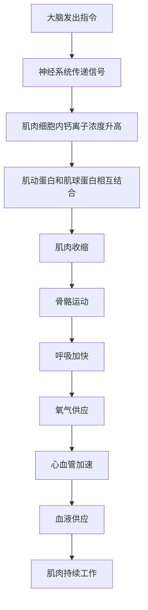

接下来，我们可以通过Python源代码来模拟这个流程，从而更好地理解身体活动的生理机制：

```python
import matplotlib.pyplot as plt
import numpy as np

# 模拟大脑发出指令
def brain_command():
    print("大脑发出运动指令")

# 模拟神经系统传递信号
def nerve_signal():
    print("神经系统传递信号到肌肉")

# 模拟肌肉细胞内钙离子浓度升高
def calcium_concentration():
    print("肌肉细胞内钙离子浓度升高")

# 模拟肌动蛋白和肌球蛋白相互结合
def muscle_contraction():
    print("肌动蛋白和肌球蛋白相互结合")

# 模拟肌肉收缩
def muscle缩短():
    print("肌肉收缩，产生力量")

# 模拟骨骼运动
def bone_movement():
    print("骨骼运动，实现身体活动")

# 模拟呼吸加快
def breathing_rate():
    print("呼吸加快，提供氧气")

# 模拟氧气供应
def oxygen_supply():
    print("氧气供应到肌肉组织")

# 模拟心血管加速
def heart_rate():
    print("心血管加速，确保血液供应")

# 模拟血液供应
def blood_supply():
    print("血液供应到肌肉组织")

# 模拟肌肉持续工作
def muscle_activity():
    print("肌肉持续工作")

# 模拟整个身体活动过程
def body_movement_simulation():
    brain_command()
    nerve_signal()
    calcium_concentration()
    muscle_contraction()
    muscle缩短()
    bone_movement()
    breathing_rate()
    oxygen_supply()
    heart_rate()
    blood_supply()
    muscle_activity()

# 运行模拟
body_movement_simulation()
```

通过上述Python代码模拟，我们可以直观地看到身体活动各个步骤的执行过程，从而更好地理解生理机制。

此外，为了进一步理解身体活动的生理机制，我们可以使用数学模型和公式来描述肌肉收缩、氧气供应和心血管加速等过程。例如，可以使用Hill方程来描述肌肉收缩的力学过程，其基本公式为：

$$
F = \frac{k \cdot x^2}{x_0^2 + x^2}
$$

其中，\( F \) 表示肌肉收缩产生的力，\( k \) 是常数，\( x \) 是肌肉长度变化，\( x_0 \) 是肌肉的静止长度。

同样地，可以使用Frank-Starling定律来描述心脏的泵血效率，其公式为：

$$
V_{out} = K \cdot \sqrt{V_{in}}
$$

其中，\( V_{out} \) 表示心脏输出的血量，\( V_{in} \) 表示心脏输入的血量，\( K \) 是常数。

这些数学模型和公式为我们提供了定量描述身体活动生理机制的工具，使我们能够更深入地理解身体在不同运动状态下的反应和变化。

### 2.1.2 体育运动对心血管系统的影响

体育运动对心血管系统有着显著的影响，通过有氧运动和无氧运动两种方式，可以增强心肌的收缩力和耐力，改善心血管系统的整体功能。

#### 有氧运动对心血管系统的影响

有氧运动，如慢跑、游泳和骑自行车等，能够显著增强心肌的收缩力。具体来说，有氧运动可以提高心脏的泵血效率，使心脏在每次跳动时输送更多的血液到全身。这种增强主要体现在以下几个方面：

1. **心输出量增加**：长期进行有氧运动可以使每分钟心脏泵出的血液量增加，即心输出量增加。这是因为有氧运动可以增强心肌的收缩力，提高心脏的泵血效率。

2. **心肌细胞体积增大**：有氧运动可以导致心肌细胞体积增大，即心肌肥大。这种肥大有助于提高心脏的泵血能力，使心脏能够应对更大的负荷。

3. **血管壁弹性增强**：有氧运动可以改善血管壁的弹性，减少血管硬化的风险。这种弹性增强有助于降低血压，减少心血管疾病的发生率。

4. **提高最大摄氧量**：有氧运动可以显著提高个体的最大摄氧量（VO₂ max），即身体在运动时能够摄取并利用的最大氧气量。最大摄氧量是衡量心肺功能的重要指标，其提高意味着心血管系统功能得到了显著改善。

例如，一项研究表明，长期进行有氧运动的人群，其最大摄氧量比不运动的人群高出20%至30%。这种提升不仅有助于提高运动能力，还能显著降低心血管疾病的风险。

#### 无氧运动对心血管系统的影响

无氧运动，如举重、短跑和高强度间歇训练（HIIT），虽然不像有氧运动那样直接增强心血管功能，但也能对心血管系统产生积极影响。具体来说，无氧运动通过以下方式对心血管系统产生影响：

1. **增加心脏负荷**：无氧运动可以增加心脏的负荷，使心脏在短时间内承受较大的压力。这种负荷有助于增强心脏的耐力，使其能够应对更高强度的运动。

2. **提高心率和血压**：无氧运动可以显著提高心率和血压。虽然这种提高在短时间内可能会增加心脏的负担，但长期来看，可以提高心脏的适应能力，增强其泵血效率。

3. **促进血液循环**：无氧运动可以促进血液循环，提高血液中的氧气和营养物质的输送效率。这种促进有助于心脏更好地为身体各个部位提供能量和养分。

例如，研究表明，进行无氧运动的人群，其心脏在承受高负荷时的反应更迅速、更有效。这种反应有助于提高运动时的耐力和表现。

#### 综合影响

综合来看，体育运动对心血管系统的综合影响是显著的。无论是有氧运动还是无氧运动，都能够通过不同的机制提高心血管系统的功能。有氧运动通过增强心肌收缩力和提高最大摄氧量，使心脏更高效地泵血；而无氧运动通过增加心脏负荷和促进血液循环，提高心脏的耐力和适应能力。

这些生理变化不仅有助于提升运动表现，还能显著降低心血管疾病的风险，提高整体的健康水平。因此，体育运动是维持心血管健康的重要手段之一。

为了更直观地理解体育运动对心血管系统的影响，我们可以使用mermaid画出不同类型运动对心血管系统的影响流程图：

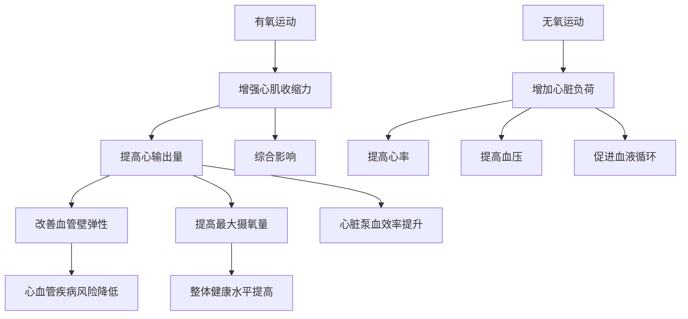

接下来，我们可以使用Python源代码来模拟不同类型运动对心血管系统的影响：

```python
import matplotlib.pyplot as plt
import numpy as np

# 模拟有氧运动对心血管系统的影响
def aerobic_exercise():
    print("有氧运动：")
    print("- 增强心肌收缩力")
    print("- 提高心输出量")
    print("- 改善血管壁弹性")
    print("- 提高最大摄氧量")

# 模拟无氧运动对心血管系统的影响
def anaerobic_exercise():
    print("无氧运动：")
    print("- 增加心脏负荷")
    print("- 提高心率")
    print("- 提高血压")
    print("- 促进血液循环")

# 模拟综合影响
def comprehensive_impact():
    print("综合影响：")
    print("- 心脏泵血效率提升")
    print("- 心血管疾病风险降低")
    print("- 整体健康水平提高")

# 运行模拟
aerobic_exercise()
anaerobic_exercise()
comprehensive_impact()
```

通过上述模拟，我们可以更直观地看到有氧运动和无氧运动对心血管系统产生的积极影响，以及这些影响如何综合作用于整体健康水平。

#### 体育运动对呼吸系统的影响

体育运动对呼吸系统有着显著的积极影响，主要体现在呼吸频率和深度的增加，以及肺功能提升等方面。

首先，体育运动可以显著提高呼吸频率和深度。当个体进行运动时，呼吸系统会自动加快呼吸频率和深度，以提供足够的氧气满足肌肉的需求。这种加快的呼吸节奏有助于增加肺泡通气量，从而提高氧气摄入和二氧化碳排出效率。例如，研究表明，长时间的有氧运动可以显著提高个体的呼吸频率和肺活量，使呼吸系统更加高效。

其次，体育运动可以提升肺功能。肺功能包括肺活量、最大呼气流量和耐力等多个方面。通过持续进行体育运动，如慢跑、游泳和骑自行车等，可以增强呼吸肌的力量和耐力，提高肺活量和最大呼气流量。例如，一项针对长期跑步者的研究表明，他们的肺活量和最大呼气流量显著高于普通人群，这表明长期运动对呼吸系统的积极影响。

此外，体育运动还可以改善呼吸系统的健康状况，减少呼吸系统疾病的风险。例如，研究表明，长期进行有氧运动可以减少哮喘和慢性阻塞性肺疾病（COPD）等呼吸系统疾病的发病率。这是因为有氧运动可以增强肺部的免疫力，减少炎症反应，从而降低呼吸系统疾病的风险。

为了更直观地理解体育运动对呼吸系统的影响，我们可以使用mermaid画出影响流程图：

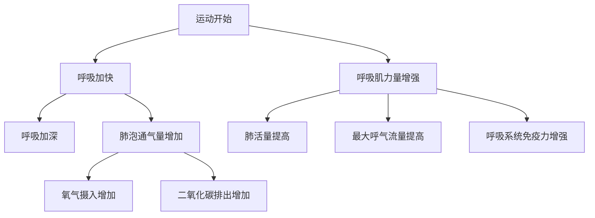

接下来，我们可以使用Python源代码来模拟体育运动对呼吸系统的影响：

```python
import matplotlib.pyplot as plt
import numpy as np

# 模拟运动开始
def start_exercise():
    print("运动开始：")
    print("呼吸加快和加深，肺泡通气量增加")

# 模拟呼吸肌力量增强
def enhance_respiratory_muscles():
    print("呼吸肌力量增强：")
    print("肺活量提高，最大呼气流量提高")

# 模拟呼吸系统免疫力增强
def enhance_respiratory_immunity():
    print("呼吸系统免疫力增强：")
    print("减少呼吸系统疾病的风险")

# 模拟整个过程
def respiratory_impact_simulation():
    start_exercise()
    enhance_respiratory_muscles()
    enhance_respiratory_immunity()

# 运行模拟
respiratory_impact_simulation()
```

通过上述模拟，我们可以直观地看到体育运动对呼吸系统的多方面积极影响，包括呼吸频率和深度的增加、呼吸肌力量的增强、肺功能的提升以及呼吸系统免疫力的增强。

### 2.1.3 体育运动对呼吸系统的影响

体育运动对呼吸系统有着显著的积极影响，主要体现在呼吸频率和深度的增加、肺功能提升等方面。

首先，让我们通过一个具体的实例来说明体育运动如何提高呼吸系统的效率。假设一名长期进行跑步训练的运动员，通过持续的有氧运动，其呼吸系统的变化如下：

1. **呼吸频率增加**：在开始跑步时，运动员的呼吸频率会从安静状态下的每分钟12-15次增加到每分钟30-40次。这种增加有助于提供足够的氧气供肌肉使用，并迅速排出代谢产生的二氧化碳。

2. **呼吸深度加深**：随着运动强度的增加，运动员的呼吸深度也会加深，从每次呼吸吸入的空气量从几百毫升增加到超过一千毫升。这种深呼吸有助于提高肺泡通气量，从而提高氧气摄入和二氧化碳排出效率。

3. **肺活量提高**：长期跑步训练可以显著提高运动员的肺活量，使其能够吸入更多的氧气。例如，一名优秀长跑运动员的肺活量可能达到5000毫升以上，这比普通成年人高出许多。这种提高意味着运动员的呼吸系统功能更加高效。

4. **最大呼气流量提升**：最大呼气流量是指个体在最大呼气努力时能够排出的空气量。通过长期的跑步训练，运动员的最大呼气流量会显著提高，使其在运动中能够更快地排出二氧化碳，减少呼吸负担。

例如，一项对长期跑步者的研究显示，他们的最大呼气流量比普通成年人高出约20%。这种提高不仅有助于提升运动表现，还能减少运动时呼吸系统的疲劳，提高耐力。

为了更详细地分析这一过程，我们可以使用数学模型来描述呼吸频率、呼吸深度和肺活量的变化。一个简单的线性模型可以表示为：

$$
f(t) = ft_0 + at
$$

其中，\( f(t) \) 表示在时间 \( t \) 的呼吸频率或深度，\( f_0 \) 表示初始呼吸频率或深度，\( a \) 是增加的速率。假设初始呼吸频率为每分钟12次，增加速率为每分钟增加2次，则跑步5分钟后，呼吸频率将增加到每分钟20次。

类似地，呼吸深度的变化可以表示为：

$$
d(t) = dt_0 + bt
$$

其中，\( d(t) \) 表示在时间 \( t \) 的呼吸深度，\( d_0 \) 表示初始呼吸深度，\( b \) 是增加的速率。假设初始呼吸深度为每次呼吸300毫升，增加速率为每次呼吸增加50毫升，则跑步5分钟后，每次呼吸的深度将增加到350毫升。

肺活量的变化可以表示为：

$$
v(t) = vt_0 + ct
$$

其中，\( v(t) \) 表示在时间 \( t \) 的肺活量，\( v_0 \) 表示初始肺活量，\( c \) 是增加的速率。假设初始肺活量为3000毫升，增加速率为每分钟增加100毫升，则跑步5分钟后，肺活量将增加到3200毫升。

通过这些数学模型，我们可以定量分析体育运动如何逐步提高呼吸系统的效率。这种分析不仅有助于理解运动生理学的基本原理，还可以为制定科学的训练计划提供依据。

总的来说，体育运动通过提高呼吸频率、加深呼吸深度和增加肺活量，显著提升了呼吸系统的功能。这种提升不仅有助于提高运动表现，还能降低呼吸系统疾病的风险，提高整体健康水平。因此，体育运动是维持呼吸健康和提升生命质量的重要手段之一。

### 第3章：体育运动与心理健康

#### 3.1.1 体育运动与情绪调节

体育运动在情绪调节方面发挥着重要作用。通过身体活动，个体可以释放压力、焦虑和紧张情绪，从而改善情绪状态。首先，体育运动可以刺激大脑释放内啡肽和多巴胺等神经递质，这些化学物质能够提高个体的愉悦感和幸福感。例如，研究表明，长时间的有氧运动如跑步可以显著减少抑郁和焦虑症状，提高情绪稳定性。此外，体育运动还可以提供一种“心理释放”的渠道，使个体能够将注意力从负面情绪转移到身体活动上，从而减轻情绪负担。

#### 3.1.2 体育运动与压力管理

体育运动在压力管理方面同样具有显著效果。通过运动，个体可以释放累积的生理和心理压力，从而改善整体健康状态。研究表明，持续的运动训练可以降低应激激素如皮质醇的水平，同时提高应对压力的能力。例如，一项对大学生进行的研究发现，定期进行体育锻炼的学生，其压力水平显著低于不锻炼的对照组。此外，体育运动还可以提供一种“时间管理”的策略，使个体能够更好地平衡工作和生活，从而减少由于过度工作导致的压力积累。

#### 3.1.3 体育运动与自尊、自信

体育运动在提升自尊和自信方面也发挥着重要作用。通过体育运动，个体可以体验到成功和成就感，从而增强自尊和自信。例如，完成一次艰难的跑步训练或赢得一场篮球比赛，可以显著提高个体的自信心和自我价值感。此外，体育运动还可以培养个体的团队合作精神，使个体在团队中感受到归属感和认同感，从而进一步提升自尊和自信。研究表明，参与体育运动可以显著提高青少年的自尊水平，有助于其全面发展。

#### 3.1.4 体育运动对心理健康的具体影响

体育运动对心理健康的具体影响可以从以下几个方面进行探讨：

1. **情绪稳定**：有氧运动如跑步、游泳和骑自行车等可以显著改善情绪状态，减少焦虑和抑郁症状。通过释放内啡肽和多巴胺等神经递质，运动有助于提高个体的愉悦感和幸福感。

2. **压力缓解**：运动可以降低应激激素如皮质醇的水平，从而减少压力感和疲劳感。例如，定期进行体育锻炼可以改善慢性压力管理，提高应对压力的能力。

3. **自我认知**：通过体育运动，个体可以体验到成功和成就感，从而增强自尊和自信。例如，完成一项挑战性任务或赢得比赛，可以显著提高个体的自我价值感。

4. **社会支持**：体育运动还可以提供一种社交平台，使个体能够与他人建立联系，从而增加社会支持网络。这种支持有助于改善心理健康，减少孤独感和抑郁情绪。

为了更直观地展示体育运动对心理健康的影响，我们可以使用mermaid绘制一个流程图：

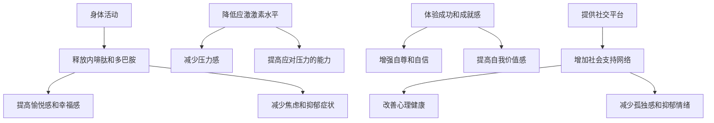

### 3.1.1 体育运动与情绪调节

体育运动在情绪调节方面有着显著的效果。通过身体活动，个体可以释放压力、焦虑和紧张情绪，从而改善情绪状态。这种调节不仅通过生理机制实现，还涉及到心理学和行为学等多个层面。

#### 生理机制

首先，体育运动可以刺激大脑释放内啡肽和多巴胺等神经递质。内啡肽是一种天然的镇痛剂，能够减轻疼痛和不适感，同时提高个体的愉悦感和幸福感。多巴胺则与奖赏和愉悦感相关，它在大脑中传递积极的情绪信号，使个体感到快乐和满足。例如，长时间的有氧运动如跑步、游泳和骑自行车等，可以显著增加内啡肽和多巴胺的分泌，从而改善情绪状态。

此外，体育运动还可以通过调节神经系统的活动来影响情绪。例如，研究表明，持续进行有氧运动可以增加脑源性神经营养因子（BDNF）的水平，BDNF是一种重要的神经保护因子，可以促进神经细胞的生长和再生，从而改善大脑功能，提高情绪调节能力。

#### 心理学机制

其次，体育运动可以通过心理学机制调节情绪。例如，通过运动，个体可以将注意力从负面情绪转移到身体活动上，从而减轻情绪负担。这种注意力的转移有助于缓解焦虑和抑郁情绪。此外，运动还可以提供一种“心理释放”的渠道，使个体能够通过身体活动来发泄情绪，从而减少心理压力。

心理学研究还发现，运动中的目标设置和达成过程可以显著提升个体的自我效能感，即个体对自己完成特定任务的信心。这种自我效能感的提升有助于增强情绪稳定性和应对能力，从而改善整体情绪状态。

#### 行为学机制

最后，体育运动在行为学层面也发挥着重要作用。通过参与体育运动，个体可以建立一种积极的健康行为模式，从而改善整体生活质量。例如，定期进行体育锻炼可以帮助个体建立规律的生活习惯，减少不良行为如吸烟和酗酒，从而降低情绪问题的发生概率。

此外，体育运动还可以提供一种社交平台，使个体能够与他人建立联系，从而增加社会支持网络。这种支持有助于改善心理健康，减少孤独感和抑郁情绪。例如，参与团队运动可以增强个体与队友之间的交流和合作，从而提高社交能力和归属感。

为了更直观地展示体育运动在情绪调节中的多重机制，我们可以使用mermaid绘制一个流程图：

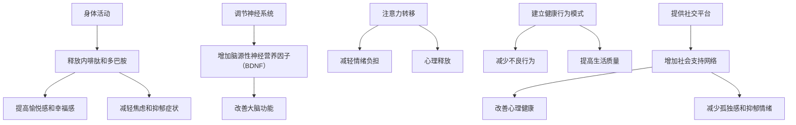

通过上述流程图，我们可以看到体育运动在情绪调节中的多种机制，包括生理机制、心理学机制和行为学机制。这些机制共同作用，使得体育运动成为调节情绪、改善心理健康的重要手段。

### 3.1.2 体育运动与压力管理

体育运动在压力管理方面具有显著的效果。通过身体活动，个体可以有效地释放累积的生理和心理压力，从而改善整体健康状态。以下是体育运动在压力管理中的具体作用机制：

#### 生理机制

首先，体育运动可以显著降低应激激素的水平，如皮质醇和肾上腺素。皮质醇是一种重要的应激激素，它在压力状态下会被大量释放，以帮助身体应对紧急情况。然而，长期高水平的皮质醇会导致一系列健康问题，如免疫系统抑制、血糖升高和心血管疾病风险增加。通过体育运动，个体可以降低应激激素的水平，从而减少压力对身体的负面影响。例如，一项研究发现，长期参与有氧运动的个体，其皮质醇水平显著低于不运动的对照组。

其次，体育运动可以促进血液循环，改善心脏功能。通过提高心率和呼吸频率，体育运动可以增强心脏的泵血能力，提高血液中的氧气含量，从而帮助身体更好地应对压力。这种改善有助于减少由于长期压力导致的慢性心脏病和高血压等疾病。

#### 心理学机制

其次，体育运动在心理学层面也发挥着重要作用。通过身体活动，个体可以将注意力从压力源转移到身体活动上，从而减轻心理压力。这种注意力的转移有助于缓解焦虑和紧张情绪，使个体能够更好地应对日常生活中的压力。例如，一项研究发现，定期进行体育锻炼的学生，其压力水平和焦虑水平显著低于不锻炼的对照组。

此外，体育运动还可以提供一种“心理释放”的渠道，使个体能够通过身体活动来发泄情绪，从而减少心理压力。例如，研究表明，长时间的有氧运动如跑步可以显著降低抑郁和焦虑症状，提高个体的心理幸福感。

#### 行为学机制

最后，体育运动在行为学层面也发挥着重要作用。通过参与体育运动，个体可以建立一种积极的健康行为模式，从而改善整体生活质量。例如，定期进行体育锻炼可以帮助个体建立规律的生活习惯，减少不良行为如吸烟和酗酒，从而降低压力和疾病的发生概率。

此外，体育运动还可以提供一种社交平台，使个体能够与他人建立联系，从而增加社会支持网络。这种支持有助于改善心理健康，减少孤独感和抑郁情绪，从而更好地应对压力。例如，参与团队运动可以增强个体与队友之间的交流和合作，从而提高社交能力和归属感。

为了更直观地展示体育运动在压力管理中的作用机制，我们可以使用mermaid绘制一个流程图：

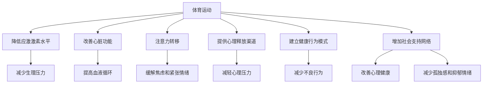

通过上述流程图，我们可以看到体育运动在压力管理中的多种机制，包括生理机制、心理学机制和行为学机制。这些机制共同作用，使得体育运动成为有效的压力管理工具。

### 3.1.3 体育运动与自尊、自信

体育运动对自尊和自信有着显著的积极作用。通过参与体育运动，个体可以在多种方面体验到成就和自我价值感，从而增强自尊和自信。以下是体育运动如何影响自尊和自信的具体机制：

#### 生理机制

首先，体育运动可以提升个体的生理素质和健康水平。通过规律的运动训练，个体可以增强肌肉力量、提高心肺功能和提升身体的协调性。这些生理变化不仅使个体在运动中表现得更加出色，还能提高其在日常生活中的体能和健康水平。例如，一项研究显示，长期参与体育锻炼的青少年，其身体素质显著优于不运动的同龄人。这种提升有助于增强个体的自尊和自信。

#### 心理学机制

其次，体育运动可以提供一种积极的情绪体验。通过运动，个体可以释放内啡肽和多巴胺等神经递质，这些化学物质能够提高个体的愉悦感和幸福感。这种积极的情绪体验有助于提升个体的自尊和自信。例如，一项研究发现，长期进行有氧运动的个体，其自尊水平显著高于不运动的对照组。这种自尊的提升不仅源于运动带来的成就感和自我价值感，还与运动过程中的积极情绪体验密切相关。

#### 行为学机制

最后，体育运动可以培养个体的自律性和坚持不懈的精神。通过定期参与运动训练，个体需要克服疲劳和困难，坚持完成任务。这种自律性和坚持不懈的精神不仅有助于提高运动成绩，还能在日常生活中转化为积极的品质，如时间管理和责任感。例如，研究表明，参与体育运动可以显著提高青少年的自律性和责任感，这些品质有助于其自尊和自信的提升。

为了更直观地展示体育运动如何通过生理、心理学和行为学机制影响自尊和自信，我们可以使用mermaid绘制一个流程图：

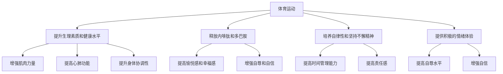

通过上述流程图，我们可以看到体育运动如何通过多种机制影响自尊和自信。生理机制提升了个体的健康水平，心理学机制通过积极的情绪体验增强自尊和自信，行为学机制则通过自律性和坚持不懈的精神培养，这些共同作用，使得体育运动成为提升自尊和自信的重要工具。

### 第4章：体育运动与社交互动

#### 4.1.1 体育运动与团队精神

体育运动在培养团队精神方面具有独特的优势。团队精神是指个体在团队中协作、共同追求目标的能力。通过体育运动，个体可以在竞争和合作中体验团队精神的重要性。首先，体育运动提供了一个共同的平台，使个体有机会与他人交流、合作和竞争。在这个过程中，个体学会了相互尊重、信任和协作，从而增强团队凝聚力。例如，足球、篮球等团队运动要求队员之间密切配合，共同完成战术任务，这种合作有助于培养团队精神。

#### 4.1.2 体育运动与社交网络

体育运动不仅是增强团队精神的工具，还可以帮助个体建立和维护社交网络。通过参与体育运动，个体可以结识新朋友，扩大社交圈子。这种社交网络不仅有助于提高生活质量，还能在心理和情感上提供支持。例如，研究表明，参与体育运动的人往往拥有更广泛的社交网络，这种网络有助于个体在面临压力和挑战时获得更多的支持和帮助。此外，体育运动还可以促进社区凝聚力，增强社区的社交活动，使社区成员之间更加融洽。

#### 4.1.3 体育运动与人际关系

体育运动对人际关系的改善具有显著作用。通过参与体育运动，个体可以更好地理解和尊重他人，增强沟通和协调能力。这种改善不仅体现在运动场上，还渗透到日常生活中。例如，研究表明，参与团队运动的个体在沟通能力和团队合作方面表现更出色，这些能力对于处理日常工作和人际关系具有重要意义。此外，体育运动还可以提供一种共同的兴趣和话题，使个体在交流中更加自然和顺畅，从而促进人际关系的和谐发展。

#### 4.1.4 体育运动在社交互动中的具体作用

体育运动在社交互动中的具体作用可以从以下几个方面进行探讨：

1. **促进团队合作**：体育运动提供了一个共同的目标，使个体在追求这一目标的过程中学会协作和配合。通过团队合作，个体可以更好地理解团队精神的重要性，培养协作能力和团队凝聚力。

2. **扩大社交圈子**：参与体育运动可以帮助个体结识新朋友，扩大社交圈子。这种社交网络不仅有助于提高生活质量，还能在心理和情感上提供支持。

3. **改善人际关系**：体育运动有助于个体更好地理解和尊重他人，增强沟通和协调能力。这种改善不仅体现在运动场上，还渗透到日常生活中，有助于提高人际关系的质量。

4. **增强社区凝聚力**：体育运动可以促进社区成员之间的互动和交流，增强社区凝聚力。通过参与社区体育活动，个体可以更好地融入社区，感受到归属感和认同感。

为了更直观地展示体育运动在社交互动中的具体作用，我们可以使用mermaid绘制一个流程图：

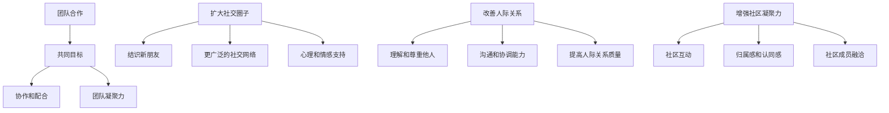

通过上述流程图，我们可以看到体育运动在社交互动中的多种作用机制，包括促进团队合作、扩大社交圈子、改善人际关系和增强社区凝聚力。这些作用共同作用，使体育运动成为增强社交互动和提升生活质量的重要手段。

### 4.1.1 体育运动与团队精神

体育运动在培养团队精神方面发挥着重要作用。团队精神是指个体在团队中协同工作、相互支持、共同追求目标的一种精神状态。通过体育运动，个体可以在竞争和合作中体验到团队精神的重要性，从而提升团队合作能力。

首先，体育运动提供了一个共同的目标，使个体在追求这一目标的过程中学会协作和配合。例如，在足球比赛中，每个队员都需要在场上紧密配合，执行教练的战术安排，才能取得胜利。这种共同目标有助于增强团队凝聚力，使队员之间更加团结一致。

其次，体育运动培养了个体的协作能力。在运动中，个体需要与队友密切配合，共同完成任务。这种协作不仅体现在场上，还延伸到场下，使个体在日常生活中也学会如何与他人合作。例如，篮球比赛中的传球、挡拆和团队防守等战术，都需要队员之间默契的配合。

再者，体育运动提供了一个相互竞争的平台，使个体在竞争中体验到团队精神的力量。通过竞争，个体可以学会如何面对失败和成功，如何在团队中发挥自己的优势，如何在困难时刻互相支持。这种竞争不仅提升了个体的竞技水平，还增强了团队精神。

为了更直观地展示体育运动如何培养团队精神，我们可以使用mermaid绘制一个流程图：

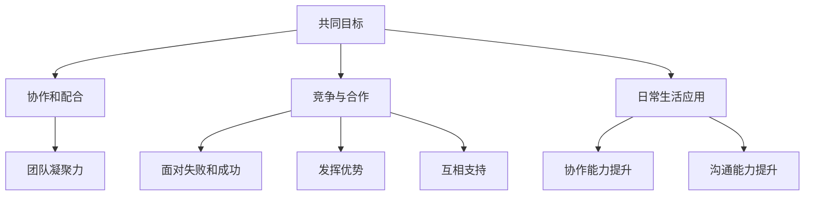

通过上述流程图，我们可以看到体育运动在培养团队精神方面的多重机制，包括共同目标、协作能力、竞争与合作、面对失败和成功以及日常生活应用。这些机制共同作用，使体育运动成为培养团队精神的有效工具。

### 4.1.2 体育运动与社交网络

体育运动在构建和扩展社交网络方面具有显著的作用。通过参与体育运动，个体不仅可以结识新朋友，还能建立和维护长期的社交关系，这对个人的心理健康和社会支持系统有重要影响。

#### 具体作用机制

1. **提供社交机会**：体育运动提供了一个自然的社交环境，使个体有机会结识不同背景的人。例如，在健身房、体育俱乐部或社区运动活动中，个体可以与他人互动，建立联系。

2. **增强社交技能**：通过参与体育运动，个体可以练习和提升各种社交技能，如沟通能力、团队合作和冲突解决。这些技能不仅在运动中发挥作用，也对日常生活和工作有益。

3. **建立信任和亲密关系**：体育运动中的合作和竞争有助于个体之间建立信任和亲密关系。例如，在团队运动中，队友之间的相互支持和共同努力可以增强彼此的信任感。

4. **提供情感支持**：参与体育运动可以使个体感受到来自队友和教练的支持，这种支持在面临挑战和压力时尤为重要。例如，在比赛失利后，队友的鼓励和支持可以帮助个体重拾信心。

5. **促进社区参与**：体育运动还可以促进社区成员之间的互动，增强社区凝聚力。例如，社区运动会和体育赛事可以成为社区成员共同参与的活动，有助于建立社区认同感。

#### 实例分析

一个具体的实例是团队运动如篮球或足球。在篮球比赛中，球员们需要频繁沟通和协作，这不仅是比赛胜利的关键，也是建立社交网络的基础。通过比赛，球员们可以结识来自不同背景的朋友，扩展自己的社交圈子。此外，比赛后的庆祝和交流活动也为球员们提供了更多建立和深化社交关系的机会。

另一个实例是健身俱乐部。在健身俱乐部中，个体可以参加各种类型的健身课程，如瑜伽、普拉提和有氧运动。这些课程不仅有助于提高身体健康，还能为参与者提供一个互动和交流的平台。通过课程，个体可以结识志同道合的朋友，分享健身经验和心得，从而建立长期的社交网络。

为了更直观地展示体育运动如何构建和扩展社交网络，我们可以使用mermaid绘制一个流程图：

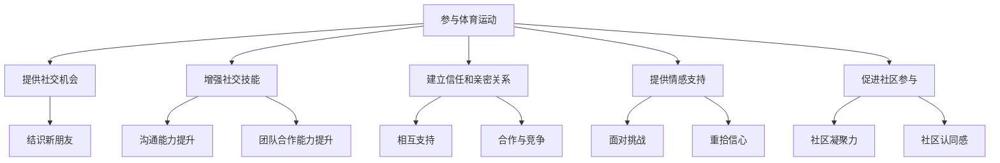

通过上述流程图，我们可以看到体育运动在构建和扩展社交网络中的多重作用机制，包括提供社交机会、增强社交技能、建立信任和亲密关系、提供情感支持和促进社区参与。这些机制共同作用，使体育运动成为构建和扩展社交网络的重要手段。

### 4.1.3 体育运动与人际关系

体育运动在改善人际关系方面具有显著的作用。通过参与体育运动，个体可以提升沟通能力、增强团队合作精神和建立积极的社交关系，从而在个人和职业生活中取得更好的发展。

首先，体育运动提供了一个互动和交流的平台，使个体能够与他人建立联系。在运动中，个体需要与队友和对手进行沟通，这种沟通不仅限于比赛策略的讨论，还包括日常的交流和互动。通过这些交流，个体可以学习如何有效地表达自己的想法和意见，从而提升沟通能力。

其次，体育运动可以增强团队合作精神。在团队运动中，每个成员都需要为团队的整体表现负责，这种责任感和使命感有助于培养团队合作精神。例如，在篮球比赛中，队员之间的配合和协作是取得胜利的关键。通过这种协作，个体学会了如何在团队中发挥自己的优势，同时尊重和信任队友，从而增强团队合作精神。

再者，体育运动有助于建立积极的社交关系。通过参与体育运动，个体可以结识不同背景的朋友，扩大自己的社交圈子。这些新的社交关系不仅有助于提高生活质量，还能在心理和情感上提供支持。例如，在健身房或运动俱乐部中，个体可以与志同道合的朋友分享运动经验和心得，从而建立长期的友谊。

#### 实例分析

一个具体的实例是团队运动如篮球。在篮球比赛中，队员之间需要进行频繁的沟通和协作，这不仅有助于比赛的胜利，还能增强队员之间的友谊。例如，在比赛过程中，教练会通过战术板向队员传达比赛策略，而队员则需要通过口头指示来配合战术。这种沟通不仅提升了队员的沟通能力，还增强了团队合作精神。

另一个实例是健身活动如瑜伽。瑜伽不仅是一种身体锻炼，也是一种心灵的修行。通过瑜伽练习，个体可以学会如何放松身心，同时与教练和同伴进行交流和互动。这种互动有助于建立积极的社交关系，提高个体的心理健康。

为了更直观地展示体育运动如何改善人际关系，我们可以使用mermaid绘制一个流程图：

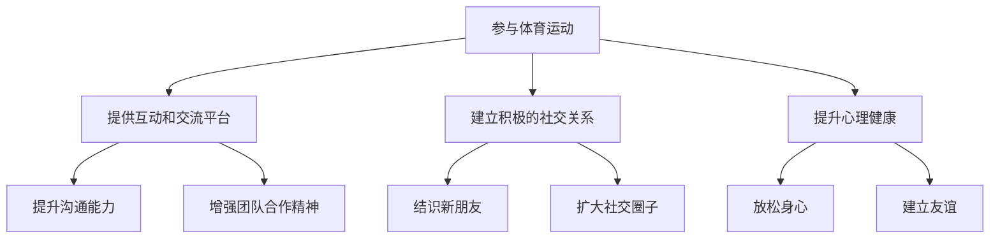

通过上述流程图，我们可以看到体育运动在改善人际关系中的多重作用机制，包括提供互动和交流平台、提升沟通能力、增强团队合作精神和建立积极的社交关系。这些机制共同作用，使体育运动成为改善人际关系的重要工具。

### 第5章：体育运动与生活方式

#### 5.1.1 体育运动与生活习惯

体育运动对生活习惯有着深远的影响。首先，规律的运动可以培养个体的生活习惯，使其更加注重身体健康。例如，长期坚持运动的人往往会形成早睡早起的习惯，保证有足够的休息时间，从而提高生活质量。此外，体育运动还可以帮助个体建立健康饮食的习惯。研究表明，运动者往往更倾向于选择健康的食物，如水果、蔬菜和全谷物，而不是高热量和高脂肪的零食。这种饮食习惯有助于控制体重，降低慢性疾病的风险。

#### 5.1.2 体育运动与健康生活方式

体育运动是健康生活方式的重要组成部分。通过规律的运动，个体可以显著改善身体健康，提高生命质量。例如，有氧运动如跑步和游泳可以增强心肺功能，提高最大摄氧量，降低心血管疾病的风险。力量训练如举重和俯卧撑则可以增强肌肉力量和耐力，减少骨质疏松的风险。此外，体育运动还可以改善心理健康，减轻压力和焦虑，提高自尊和自信。研究表明，长期坚持运动的人，其整体健康状况和生活质量都显著优于不运动的人群。

#### 5.1.3 体育运动与生活质量

体育运动对生活质量的影响是多方面的。首先，体育运动有助于提高身体健康，减少慢性疾病的风险，从而提高生活质量和幸福感。例如，研究表明，规律的运动可以显著降低高血压、糖尿病和肥胖等慢性疾病的风险。此外，体育运动还可以改善心理健康，减轻压力和焦虑，提高自尊和自信。这些心理健康上的改善直接影响到个体的生活质量。例如，参与体育运动可以帮助个体建立积极的生活态度，增强面对挑战的信心，从而提高整体的生活满意度。此外，体育运动还可以促进社交互动，帮助个体建立和维护社交网络，提高社会支持感。这种社交上的支持有助于增强个体的幸福感和生活质量。

#### 5.1.4 体育运动对生活方式的综合影响

体育运动对生活方式的影响是综合而深远的。首先，它可以帮助个体建立健康的生活习惯，如规律作息和健康饮食。其次，体育运动作为健康生活方式的重要组成部分，可以显著改善身体健康和心理健康。最后，体育运动还可以提高生活质量，通过减少慢性疾病风险、提高心理健康和社会支持感等多方面的影响，使个体拥有更高的幸福感和生活满意度。因此，体育运动不仅是保持身体健康的重要手段，也是提升生活质量和幸福感的关键因素。

### 5.1.1 体育运动与生活习惯

体育运动对生活习惯的影响是多方面的。首先，规律的运动可以帮助个体建立健康的生活习惯。例如，长期坚持运动的人往往会形成早睡早起的习惯，因为规律的生活作息有助于身体恢复和运动表现的提升。此外，体育运动还可以促进健康饮食。研究表明，运动者往往更倾向于选择健康的食物，如水果、蔬菜和全谷物，而不是高热量和高脂肪的零食。这种饮食习惯有助于控制体重，降低慢性疾病的风险。

一个典型的例子是健身爱好者张先生。他每天早晨跑步，晚上进行力量训练，这不仅帮助他保持了良好的身体状态，还使他养成了早睡早起的习惯。张先生还通过运动养成了健康的饮食习惯，减少了高热量食物的摄入，转而选择更多的蔬菜和水果。这种健康的生活习惯使他的体重保持在健康范围内，同时降低了患心血管疾病和糖尿病的风险。

此外，体育运动还可以帮助个体减少不健康的生活习惯。例如，很多人因为长时间坐在办公室，容易养成久坐的习惯，这可能导致肥胖和一系列健康问题。通过定期参与体育运动，个体可以减少久坐的时间，增加身体活动量，从而改善身体健康。

为了更直观地展示体育运动如何影响生活习惯，我们可以使用mermaid绘制一个流程图：

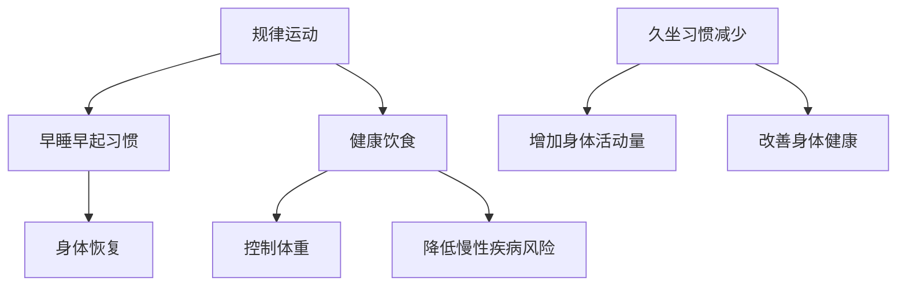

通过上述流程图，我们可以看到体育运动如何通过规律运动、健康饮食和减少久坐习惯来改善生活习惯，从而提高整体健康水平和生活质量。

### 5.1.2 体育运动与健康生活方式

体育运动是健康生活方式的核心组成部分，通过规律的运动，个体可以在多个方面改善身体健康和心理健康，从而提升整体的生活质量和幸福感。

首先，从身体健康的角度来看，体育运动能够显著改善多种生理指标。例如，有氧运动如跑步、游泳和骑自行车等可以增强心肺功能，提高最大摄氧量。这种增强有助于提高心血管系统的效率，减少心血管疾病的风险。此外，力量训练如举重和俯卧撑可以增强肌肉力量和耐力，减少骨质疏松的风险。研究表明，定期进行体育锻炼的人，其身体质量指数（BMI）通常较低，同时患有肥胖、高血压和糖尿病等慢性疾病的风险也显著降低。

其次，从心理健康的角度来看，体育运动对情绪调节和压力管理有着积极的影响。通过运动，个体可以释放压力、焦虑和紧张情绪，从而改善情绪状态。例如，长时间的有氧运动如跑步可以显著减少抑郁和焦虑症状，提高情绪稳定性。此外，体育运动还可以促进心理健康，降低患抑郁症和焦虑症的风险。一项研究发现，参与体育运动的人群，其心理健康指标显著优于不运动的人群。

为了更直观地展示体育运动如何改善身体健康和心理健康，我们可以使用mermaid绘制一个流程图：

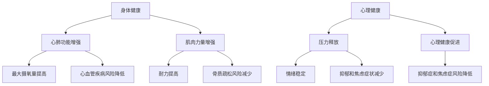

通过上述流程图，我们可以看到体育运动在改善身体健康和心理健康方面的多重机制。这些改善不仅有助于提升个体的生活质量和幸福感，还为长期健康提供了坚实的基础。

### 5.1.3 体育运动与生活质量

体育运动对生活质量的影响是多方面的，包括身体健康、心理健康和社会关系等方面。通过参与体育运动，个体可以在这些方面获得显著的改善，从而提升整体的生活质量和幸福感。

首先，体育运动对身体健康的影响是显而易见的。规律的运动可以增强心肺功能、提高最大摄氧量、增强肌肉力量和耐力，从而降低慢性疾病的风险。例如，有氧运动如跑步和游泳可以显著提高心血管系统的效率，减少高血压和冠心病的风险。力量训练如举重和俯卧撑则有助于增强肌肉力量，减少骨质疏松的风险。研究表明，长期坚持运动的人，其身体健康状况显著优于不运动的人群。

其次，体育运动对心理健康也有着积极的影响。通过运动，个体可以释放压力、焦虑和紧张情绪，从而改善情绪状态。例如，长时间的有氧运动如跑步可以显著减少抑郁和焦虑症状，提高情绪稳定性。此外，体育运动还可以促进心理健康，降低患抑郁症和焦虑症的风险。一项研究发现，参与体育运动的人群，其心理健康指标显著优于不运动的人群。

再者，体育运动有助于提升个体的社会关系。通过参与体育运动，个体可以结识新朋友，建立社交网络。这种社交网络不仅有助于提高生活质量，还能在心理和情感上提供支持。例如，团队运动如篮球和足球可以增强个体与队友之间的沟通和合作，从而提高社交能力和团队合作精神。此外，体育运动还可以促进社区凝聚力，使个体更好地融入社区，增强归属感。

为了更直观地展示体育运动如何提升生活质量，我们可以使用mermaid绘制一个流程图：

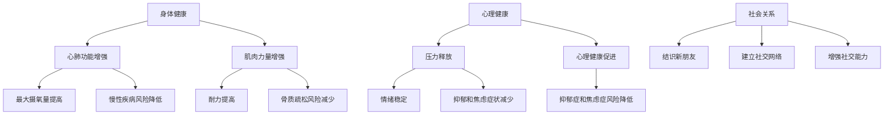

通过上述流程图，我们可以看到体育运动在提升生活质量方面的多重机制，包括身体健康、心理健康和社会关系的改善。这些机制共同作用，使体育运动成为提升生活质量和幸福感的重要工具。

### 第6章：体育运动的教育意义

#### 6.1.1 体育运动与青少年发展

体育运动在青少年发展过程中具有不可替代的重要作用。首先，体育运动有助于促进青少年的身体健康。通过参与有氧运动和力量训练，青少年可以提高心肺功能、增强肌肉力量和耐力，从而降低肥胖和慢性疾病的风险。例如，长期参与体育活动的青少年，其体重和身体脂肪率通常较低，整体健康状况较好。

其次，体育运动对青少年的心理健康也有积极影响。运动可以释放内啡肽和多巴胺等神经递质，提高青少年的愉悦感和幸福感，减少焦虑和抑郁症状。例如，研究表明，定期参与体育活动的青少年，其心理健康状况显著优于不运动的同学。

再者，体育运动有助于培养青少年的社交技能和团队合作精神。通过参与团队运动，青少年可以学会如何与他人沟通、合作和竞争，从而提高社交能力和团队合作精神。这种社交技能对于青少年未来的职业发展和人际关系具有重要意义。

#### 6.1.2 体育运动与教育目标

体育运动在教育中扮演着重要角色，其目标不仅包括身体健康和心理素质的提升，还包括人格塑造和社会适应能力的培养。首先，体育运动有助于培养青少年的自律性和责任感。通过参与体育活动，青少年需要遵守规则、按时训练和比赛，从而培养自律性和责任感。

其次，体育运动可以促进青少年的人格发展。通过运动，青少年可以学会如何面对挑战和失败，从而培养坚韧、勇敢和乐观的品质。例如，在篮球比赛中，青少年需要克服困难和失败，从而培养坚韧和勇敢的品质。

再者，体育运动有助于提高青少年的社会适应能力。通过参与团队运动，青少年可以学会如何与他人沟通、合作和竞争，从而提高社会适应能力和人际交往能力。这种社会适应能力对于青少年未来的职业发展和人际关系具有重要意义。

#### 6.1.3 体育运动课程设计

为了充分发挥体育运动的教育意义，课程设计应注重以下几个方面：

1. **多样化运动项目**：课程应包括多种类型的运动项目，如有氧运动、力量训练和团队运动，以满足不同学生的需求和兴趣。

2. **科学训练方法**：课程设计应注重科学训练方法，确保学生能够安全、有效地进行体育锻炼。例如，教师应指导学生如何正确地进行力量训练和有氧运动，避免运动损伤。

3. **团队合作与竞争**：课程应鼓励学生参与团队运动，通过团队合作和竞争，培养学生的社交技能和团队合作精神。

4. **心理素质培养**：课程应注重心理素质的培养，通过运动训练和心理辅导，提高学生的抗压能力和情绪调节能力。

5. **健康教育知识**：课程应结合健康教育知识，使学生了解运动对身体健康和心理健康的积极作用，从而提高他们的健康意识和运动积极性。

为了更直观地展示体育运动在教育中的意义和课程设计，我们可以使用mermaid绘制一个流程图：


通过上述流程图，我们可以看到体育运动在青少年发展、教育目标和课程设计中的多重意义和设计原则。这些原则共同作用，使体育运动成为实现教育目标的重要手段。

### 6.1.1 体育运动与青少年发展

体育运动在青少年发展过程中具有不可替代的重要作用，它不仅对身体健康有显著影响，还对心理健康和社交技能的培养具有积极效果。

首先，从身体健康的角度来看，体育运动对青少年的成长至关重要。有氧运动如跑步和游泳可以提高心肺功能，增强心脏和肺部的耐力。这种增强有助于青少年更好地适应日常活动和体育竞技中的高强度需求。此外，力量训练如举重和俯卧撑可以增强肌肉力量和耐力，提高骨骼的密度，从而减少未来患骨质疏松的风险。研究表明，定期进行体育锻炼的青少年，其身体健康状况显著优于不运动的同龄人，他们患有肥胖、高血压和糖尿病等慢性疾病的风险也较低。

其次，体育运动对青少年的心理健康有着深远的影响。运动可以刺激大脑释放内啡肽和多巴胺等神经递质，这些化学物质能够提高个体的愉悦感和幸福感，从而减轻焦虑和抑郁症状。例如，一项针对青少年的研究发现，定期参与体育活动的青少年，其抑郁和焦虑症状显著减少，情绪稳定性显著提高。此外，体育运动还可以帮助青少年建立积极的生活态度和自我价值感，增强自信心和自尊心。

再者，体育运动对青少年的社交技能和团队合作精神有着重要的影响。通过参与团队运动，青少年可以在实践中学习如何与他人沟通、合作和竞争。这种合作精神不仅有助于提高他们在团队中的表现，还能为未来的职业发展和人际关系打下坚实的基础。例如，研究表明，参与篮球、足球等团队运动的青少年，其沟通能力和团队合作精神显著高于不参与团队运动的同龄人。

为了更直观地展示体育运动如何影响青少年发展，我们可以使用mermaid绘制一个流程图：

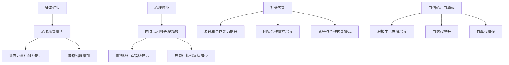

通过上述流程图，我们可以看到体育运动在青少年发展中的多重作用，包括身体健康、心理健康、社交技能和自信心等方面。这些作用共同促进青少年的全面发展，使其在成长过程中受益终身。

### 6.1.2 体育运动与教育目标

体育运动在教育中扮演着重要的角色，它不仅有助于实现身体健康和心理健康的目标，还能够在人格塑造和社会适应能力的培养方面发挥关键作用。

首先，从身体健康的角度来看，体育运动是实现教育目标的重要组成部分。通过参与体育运动，学生可以提高心肺功能、增强肌肉力量和耐力，从而降低肥胖和慢性疾病的风险。例如，研究表明，定期参与体育锻炼的学生，其身体质量指数（BMI）和体脂率通常较低，整体健康状况较好。这种身体健康上的改善不仅有助于学生在校期间保持良好的学习状态，还能为其未来的职业发展奠定坚实的基础。

其次，体育运动对心理健康有着积极的影响。通过运动，学生可以释放压力、焦虑和紧张情绪，从而改善情绪状态。例如，长时间的有氧运动如跑步可以显著减少抑郁和焦虑症状，提高情绪稳定性。此外，体育运动还可以促进心理健康，降低患抑郁症和焦虑症的风险。研究表明，参与体育运动的学生，其心理健康状况显著优于不运动的学生。

再者，体育运动有助于培养学生的人格和价值观。通过参与体育活动，学生可以学会如何面对挑战和失败，从而培养坚韧、勇敢和乐观的品质。例如，在篮球比赛中，学生需要克服困难和失败，从而培养坚韧和勇敢的品质。此外，体育运动还可以培养学生的团队合作精神和责任感。通过参与团队运动，学生可以学会如何与他人沟通、合作和竞争，从而提高社交能力和团队合作精神。这种团队合作精神不仅有助于提高学生在团队中的表现，还能为未来的职业发展打下坚实的基础。

最后，体育运动在培养学生的社会适应能力方面也具有重要作用。通过参与体育运动，学生可以结识新朋友，建立社交网络。这种社交网络不仅有助于提高学生的生活质量，还能在心理和情感上提供支持。例如，研究表明，参与体育运动的学生，其社交网络更加广泛，社会支持感也更强。这种社会适应能力的提升对于学生在未来职业和社交环境中更好地适应和发挥作用具有重要意义。

为了更直观地展示体育运动如何实现教育目标，我们可以使用mermaid绘制一个流程图：

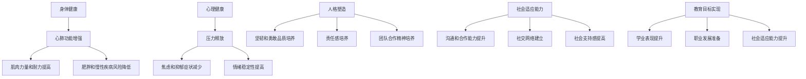

通过上述流程图，我们可以看到体育运动在实现教育目标中的多重作用，包括身体健康、心理健康、人格塑造和社会适应能力等方面。这些作用共同促进学生的全面发展，使其在学业、职业和社交环境中表现出色。

### 6.1.3 体育运动课程设计

为了充分发挥体育运动的教育意义，课程设计应注重以下几个方面：

1. **多样化运动项目**：课程应包括多种类型的运动项目，如有氧运动、力量训练、团队运动和休闲运动，以满足不同学生的需求和兴趣。例如，可以设置跑步、游泳、篮球、足球、瑜伽和太极拳等课程。

2. **科学训练方法**：课程设计应注重科学训练方法，确保学生能够安全、有效地进行体育锻炼。教师应指导学生如何正确地进行力量训练和有氧运动，避免运动损伤。例如，可以引入运动科学的理论知识，制定个性化的训练计划。

3. **团队合作与竞争**：课程应鼓励学生参与团队运动，通过团队合作和竞争，培养学生的社交技能和团队合作精神。例如，可以组织班级联赛，让学生在比赛中学会团队合作和竞争。

4. **心理素质培养**：课程应注重心理素质的培养，通过运动训练和心理辅导，提高学生的抗压能力和情绪调节能力。例如，可以设置心理辅导课程，帮助学生应对运动中的压力和挫折。

5. **健康教育知识**：课程应结合健康教育知识，使学生了解运动对身体健康和心理健康的积极作用，从而提高他们的健康意识和运动积极性。例如，可以设置健康教育讲座，介绍营养、锻炼和健康生活方式等方面的知识。

为了更直观地展示体育运动课程设计，我们可以使用mermaid绘制一个流程图：

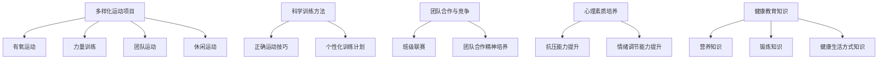

通过上述流程图，我们可以看到体育运动课程设计的各个方面，包括多样化运动项目、科学训练方法、团队合作与竞争、心理素质培养和健康教育知识。这些方面共同作用，使体育运动课程能够充分发挥其在教育中的多重作用。

### 第7章：体育运动的未来趋势

#### 7.1.1 新型体育运动项目

随着科技的发展和人们对健康生活方式的需求增加，新型体育运动项目不断涌现。这些项目不仅丰富了体育运动的种类，还提供了更多的选择和乐趣。例如，电子竞技作为一种新兴的体育运动项目，已经成为全球范围内的一项重要赛事。电子竞技不仅吸引了大量的观众，还培养了年轻人的竞技精神和团队合作能力。此外，虚拟现实（VR）和增强现实（AR）技术的应用，使得人们可以在虚拟环境中进行体育运动，从而打破了时间和空间的限制。例如，VR跑步机可以模拟真实的跑步体验，使人们在家中就能享受户外跑步的乐趣。

#### 7.1.2 科技在体育运动中的应用

科技在体育运动中的应用日益广泛，显著提升了运动体验和训练效果。例如，智能穿戴设备如智能手表和智能手环，可以实时监测心率、步数、卡路里消耗等数据，帮助运动员和健身爱好者更好地了解自己的身体状况。这些设备通过蓝牙或Wi-Fi连接到手机应用，可以生成详细的运动报告，提供个性化的训练建议。此外，运动追踪器如GPS跑步手表，可以精确记录运动轨迹，帮助运动员分析跑步姿势和效率。科技的应用不仅提高了运动者的训练效果，还降低了运动损伤的风险。

#### 7.1.3 体育运动的国际化发展

体育运动的国际化发展不仅促进了各国之间的文化交流，还推动了全球体育产业的发展。例如，国际奥委会（IOC）不断推动体育赛事的全球化，如奥运会、世界杯等国际大赛吸引了来自世界各地的运动员和观众。此外，跨国体育俱乐部和联赛的兴起，如欧洲足球五大联赛（英超、西甲、德甲、法甲和意甲），以及NBA、NFL等国际篮球和美式足球联赛，已成为全球体育文化的重要组成部分。这些国际赛事和联赛不仅提高了运动员的竞技水平，还推动了体育产业的发展，促进了相关产业链的繁荣。

#### 7.1.4 新型体育运动项目的发展趋势

新型体育运动项目的发展趋势主要表现在以下几个方面：

1. **融合性运动项目**：新型运动项目越来越倾向于融合不同的运动元素，如户外探险与运动、科技与运动等。例如，山地自行车结合了山地探险和自行车运动的元素，提供了一种全新的运动体验。

2. **健康与娱乐并重的运动项目**：随着健康意识的提高，新型运动项目更注重娱乐性和健康效果的结合。例如，慢跑、瑜伽和普拉提等运动项目不仅强调身体健康，还提供了放松心情、缓解压力的途径。

3. **虚拟运动项目的兴起**：随着虚拟现实（VR）和增强现实（AR）技术的发展，虚拟运动项目逐渐兴起。这些项目通过虚拟环境模拟真实的运动场景，提供沉浸式的运动体验，吸引了大量年轻人参与。

为了更直观地展示体育运动的未来趋势，我们可以使用mermaid绘制一个流程图：

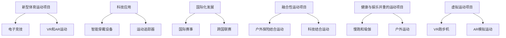

通过上述流程图，我们可以看到体育运动的未来趋势，包括新型体育运动项目、科技应用、国际化发展和虚拟运动项目的兴起。这些趋势共同推动了体育运动的创新和发展。

### 7.1.1 新型体育运动项目

随着科技的进步和社会的发展，新型体育运动项目不断涌现，这些项目不仅丰富了运动的形式和内容，还为人们提供了更多的健康生活方式选择。以下是几种新兴的体育运动项目及其特点：

1. **电子竞技（E-Sports）**：电子竞技作为一种新兴的体育运动项目，已经在全球范围内获得了广泛的关注。它结合了电子游戏和竞技体育的元素，通过在线比赛和电竞赛事，吸引了大量的参赛者和观众。电子竞技不仅需要选手具备高超的操作技能和战略思维，还需要他们在团队协作和决策方面表现出色。例如，《英雄联盟》（League of Legends）和《DOTA2》（Dota 2）等知名游戏已成为电子竞技的主要项目。

2. **VR/AR运动**：虚拟现实（VR）和增强现实（AR）技术的应用，使得体育运动的体验变得更加多样化和沉浸式。VR运动项目如VR跑步机，可以让用户在虚拟环境中进行跑步，模拟真实的户外跑步体验。AR技术则可以将虚拟元素叠加到现实世界中，为运动者提供更多的互动性和挑战性。例如，某些AR应用程序可以在运动过程中提供实时反馈和指导，帮助用户更好地进行锻炼。

3. **户外探险运动**：户外探险运动如登山、滑雪、皮划艇和跳伞等，结合了运动和探险的元素，为参与者提供了独特的体验。这些运动项目不仅考验参与者的体能和技巧，还需要他们具备良好的心理素质和团队合作精神。例如，徒步旅行和远足已经成为很多人喜爱的户外探险运动，它们不仅能够锻炼身体，还能让人们亲近自然，放松心情。

4. **健身与娱乐结合的运动项目**：随着人们对健康和娱乐需求的增加，健身与娱乐结合的运动项目如瑜伽、普拉提和舞蹈等越来越受欢迎。这些项目不仅有助于提高身体素质，还能提供一种放松和享受的方式。例如，瑜伽通过一系列柔和的身体动作和呼吸练习，帮助人们放松身心，提高灵活性和平衡能力。

为了更直观地展示这些新型体育运动项目，我们可以使用mermaid绘制一个流程图：

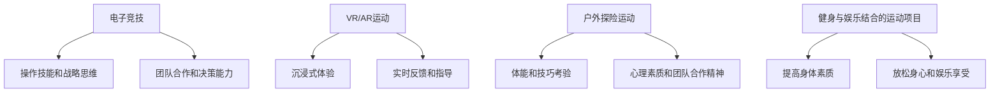

通过上述流程图，我们可以看到新型体育运动项目在提升参与者的技能、锻炼能力和娱乐体验方面的多种特点。这些项目不仅丰富了体育运动的内涵，还为人们提供了更多健康、有趣的生活方式选择。

### 7.1.2 科技在体育运动中的应用

科技在体育运动中的应用日益深入，不仅改变了运动的方式，还显著提升了运动体验和训练效果。以下是科技在体育运动中应用的几个关键领域：

1. **智能穿戴设备**：智能穿戴设备如智能手表、智能手环和智能服装，已经成为现代运动员和健身爱好者的必备工具。这些设备可以实时监测心率、步数、卡路里消耗、睡眠质量等健康数据，并通过蓝牙或Wi-Fi连接到手机应用程序，生成详细的运动报告。例如，苹果公司的Apple Watch、Fitbit和华为手环等设备，不仅能够提供基本的健康监测功能，还具备消息通知、电话接听等附加功能。

2. **运动追踪器**：运动追踪器如GPS跑步手表、自行车运动追踪器和游泳追踪器等，可以精确记录运动者的位置、速度、距离、心率等数据。这些追踪器通常内置GPS模块，可以实时定位运动轨迹，并通过无线网络将数据上传到云端。例如，佳明的Forerunner系列和苏木的S625X等跑步手表，不仅能够提供详细的运动数据，还可以通过智能算法为运动者提供个性化的训练建议。

3. **虚拟现实（VR）和增强现实（AR）**：VR和AR技术在体育运动中的应用正在逐渐普及。通过VR设备，运动者可以进入虚拟的运动场景，进行沉浸式的运动体验。例如，VR跑步机可以让用户在虚拟环境中跑步，模拟真实的户外跑步体验。AR技术则可以将虚拟元素叠加到现实世界中，为运动者提供更多的互动性和挑战性。例如，某些AR应用程序可以在运动过程中提供实时反馈和指导，帮助用户更好地进行锻炼。

4. **人工智能（AI）和大数据分析**：人工智能和大数据分析技术在体育运动中的应用日益广泛。通过AI算法，可以对运动数据进行分析和预测，为运动者提供个性化的训练计划和健康建议。例如，智能穿戴设备中的AI算法可以分析用户的历史运动数据，预测其未来的运动表现，并提供相应的训练建议。此外，大数据分析可以帮助体育团队和管理者更好地了解运动者的表现和需求，从而优化训练计划和赛事安排。

为了更直观地展示科技在体育运动中的应用，我们可以使用mermaid绘制一个流程图：

```mermaid
graph TD
    A[智能穿戴设备] --> B[健康监测]
    B --> C[数据报告]

    D[运动追踪器] --> E[位置和速度记录]
    D --> F[心率监测]
    D --> G[数据上传]

    H[VR和AR] --> I[沉浸式体验]
    H --> J[实时反馈和指导]

    K[AI和大数据] --> L[个性化训练计划]
    K --> M[健康建议]
    K --> N[数据分析]
```

通过上述流程图，我们可以看到科技在体育运动中的多种应用领域，包括智能穿戴设备、运动追踪器、VR和AR技术以及人工智能和大数据分析。这些应用不仅提高了运动者的训练效果和运动体验，还为体育管理提供了更加科学和高效的方法。

### 7.1.3 体育运动的国际化发展

体育运动的国际化发展不仅推动了全球体育文化的交流与融合，还促进了国际间的友谊与团结。以下是体育运动国际化发展的几个关键方面：

首先，国际体育赛事的举办是体育运动国际化发展的重要推动力。国际奥委会（IOC）自1896年举办第一届现代奥运会以来，奥运会已成为全球最盛大的体育盛事之一。除了奥运会，其他大型国际赛事如世界杯足球赛、F1赛车锦标赛、NBA篮球联赛等，也吸引了来自世界各地的运动员和观众。这些国际赛事不仅为参赛国家提供了展示体育实力和文化魅力的平台，还促进了全球体育文化的交流与传播。

其次，跨国体育俱乐部和联赛的兴起也是体育运动国际化发展的重要表现。许多国际知名的体育俱乐部如曼联（Manchester United）、巴塞罗那（FC Barcelona）、拜仁慕尼黑（Bayern Munich）等，在全球范围内拥有大量忠实球迷和商业合作伙伴。这些俱乐部不仅通过国际比赛和转播吸引了全球观众的关注，还通过球员转会和商业合作，促进了国际体育产业的发展。此外，跨国体育联赛如欧洲足球五大联赛（英超、西甲、德甲、法甲和意甲）、NBA篮球联赛等，也在全球范围内拥有广泛的粉丝基础和商业影响力。

再者，国际体育交流与合作项目的实施，也为体育运动的国际化发展提供了新的动力。例如，国际足球联合会（FIFA）和国际篮球联合会（FIBA）等国际体育组织，通过组织世界杯、奥运会等国际大赛，以及设立青少年培训计划，促进了全球体育人才的培养和交流。此外，许多国家之间还通过体育交流项目，建立了友好关系和合作机制，从而推动了国际间的文化交流与团结。

为了更直观地展示体育运动的国际化发展，我们可以使用mermaid绘制一个流程图：

```mermaid
graph TD
    A[国际体育赛事] --> B[奥运会]
    B --> C[世界杯足球赛]
    B --> D[F1赛车锦标赛]

    E[跨国体育俱乐部] --> F[曼联]
    E --> G[巴塞罗那]
    E --> H[拜仁慕尼黑]

    I[国际体育交流] --> J[FIFA世界杯]
    I --> K[FIBA篮球世界杯]
    I --> L[青少年培训计划]

    M[国际体育合作] --> N[友好关系建立]
    M --> O[合作机制实施]
```

通过上述流程图，我们可以看到体育运动的国际化发展在促进全球体育文化交流、建立跨国体育俱乐部和实施国际体育交流与合作项目等方面的多重作用。这些作用共同推动了体育运动的国际化发展，为全球体育文化的繁荣和世界各国的友谊与团结做出了重要贡献。

### 第8章：结论与展望

#### 8.1.1 总结全文

本文从多维度探讨了体育运动对生命体验的深远影响。首先，我们介绍了体育运动与生命体验的基本概念，并阐述了体育运动在生理变化、心理健康、社交互动和生活方式等方面的作用。接着，我们详细分析了体育运动对心血管、呼吸系统的影响，以及它在情绪调节、压力管理和自尊自信等方面的积极作用。此外，本文还探讨了体育运动在团队精神培养、社交网络建立和人际关系改善方面的意义。最后，我们展望了体育运动的未来发展趋势，包括新型体育运动项目、科技应用和国际化发展等。通过这些分析，我们可以看到体育运动不仅是保持身体健康的重要手段，也是提升生活质量和幸福感的关键因素。

#### 8.1.2 体育运动与生命体验的深远影响

体育运动对生命体验的深远影响不容忽视。首先，从生理角度看，体育运动可以显著改善心血管和呼吸系统的功能，增强肌肉力量和耐力，从而提高整体健康水平。其次，从心理角度看，体育运动能够调节情绪、缓解压力，提升自尊和自信，从而改善心理健康。再者，从社交角度看，体育运动可以促进团队合作、建立社交网络，增强人际关系。最后，从生活方式角度看，体育运动有助于培养健康的生活习惯，提高生活质量。总的来说，体育运动在提升生命质量、增强幸福感方面具有不可替代的重要作用。

#### 8.1.3 未来研究方向

未来在体育运动与生命体验领域的研究应注重以下几个方向：

1. **新型体育运动项目的研究**：随着科技的发展，新型体育运动项目不断涌现。未来研究应关注这些项目对生命体验的影响，以及如何更好地推广和应用。

2. **科技在体育运动中的应用**：科技在体育运动中的应用日益广泛，未来研究应深入探讨智能穿戴设备、运动追踪器、VR/AR技术等对运动体验和训练效果的影响。

3. **体育运动与心理健康的关系**：虽然已有研究表明体育运动对心理健康有积极影响，但未来研究应进一步探讨不同类型体育运动对心理健康的具体影响机制。

4. **体育运动在教育和成长中的作用**：体育运动对青少年的成长和发展具有重要意义，未来研究应关注体育运动在培养青少年团队精神、自律性和责任感等方面的作用。

5. **体育运动的国际化发展**：未来研究应探讨体育运动在全球化背景下的发展模式，以及国际体育赛事和跨国体育俱乐部对文化交流和经济发展的影响。

通过这些研究方向，我们可以更全面、深入地理解体育运动对生命体验的影响，为推动体育运动在健康、教育和社会发展中的广泛应用提供科学依据。

### 结论

本文通过对体育运动与生命体验的多维度分析，展示了体育运动在生理、心理、社交和生活方式等方面的深远影响。首先，从生理角度看，体育运动通过增强心肺功能、提高肌肉力量和耐力，显著改善了身体的健康水平。其次，从心理角度看，体育运动能够调节情绪、缓解压力，提升自尊和自信，从而改善心理健康。再者，从社交角度看，体育运动促进了团队合作、建立了社交网络，增强了人际关系。最后，从生活方式角度看，体育运动有助于培养健康的生活习惯，提高生活质量。总的来说，体育运动不仅是保持身体健康的重要手段，也是提升生活质量和幸福感的关键因素。

展望未来，体育运动在新型项目开发、科技应用和国际化发展等方面仍有广阔的研究空间。新型体育运动项目如电子竞技、VR/AR运动等，为人们提供了更多的选择和乐趣。科技在体育运动中的应用，如智能穿戴设备、运动追踪器和VR/AR技术等，显著提升了运动体验和训练效果。此外，体育运动的国际化发展不仅促进了全球体育文化的交流与融合，还推动了国际间的友谊与团结。

未来研究应关注这些新兴领域，深入探讨体育运动在不同情境下的具体影响机制，为体育运动在健康、教育和社会发展中的广泛应用提供科学依据。通过持续的研究和实践，我们相信体育运动将为人类的生命体验带来更多的美好和活力。

### 附录：最佳实践 Tips、小结、注意事项、拓展阅读

#### 最佳实践 Tips

1. **选择适合自己的运动项目**：了解自己的兴趣和身体状况，选择合适的运动项目，如有氧运动、力量训练或团队运动。
2. **制定合理的运动计划**：根据自己的时间和能力，制定合理的运动计划，确保运动频率和强度的适宜性。
3. **保持持续性和规律性**：持续和规律的锻炼是取得显著效果的关键，建议每周至少进行3-5次运动，每次持续30分钟以上。
4. **注意安全**：运动前进行热身和拉伸，避免运动损伤。遵循正确的运动技巧和姿势，尤其是力量训练和有氧运动。
5. **饮食搭配**：运动前后注意饮食，确保摄入足够的能量和营养素，以支持运动和恢复。

#### 小结

本文通过对体育运动与生命体验的多维度分析，展示了体育运动在生理、心理、社交和生活方式等方面的深远影响。从改善身体健康、调节情绪、增强社交能力和提升生活质量等方面，体育运动都发挥着重要作用。

#### 注意事项

1. **量力而行**：运动强度和频率应根据个人身体状况适当调整，避免过度运动导致身体疲劳或损伤。
2. **逐渐增加运动量**：开始新的运动项目时，应逐渐增加运动量和强度，以免对身体造成过大负担。
3. **定期检查**：对于长期运动的个体，建议定期进行健康检查，以监测身体状况和运动效果。
4. **避免极端天气**：在极端天气下，如高温或低温，应调整运动时间和方式，避免运动中因天气原因导致身体不适。

#### 拓展阅读

1. **《运动生理学》** - 威廉·斯莫尔（William D. Smolove），提供了关于运动对生理系统影响的基础知识和详细研究。
2. **《体育心理学》** - 马库斯·贝克尔（Markus Beiter），探讨了运动对心理健康的影响，以及如何通过运动改善心理状态。
3. **《社会心理学与运动》** - 约翰·H.迪克斯（John H. Dicks），分析了运动在社交互动中的作用，以及如何通过运动建立和维护社交关系。
4. **《体育教育》** - 托马斯·L.约翰逊（Thomas L. Johnson），研究了体育运动在教育中的角色和重要性，以及如何设计有效的体育课程。

通过这些拓展阅读，读者可以更深入地了解体育运动在不同领域的应用和影响，从而更好地利用体育运动提升生命体验。

