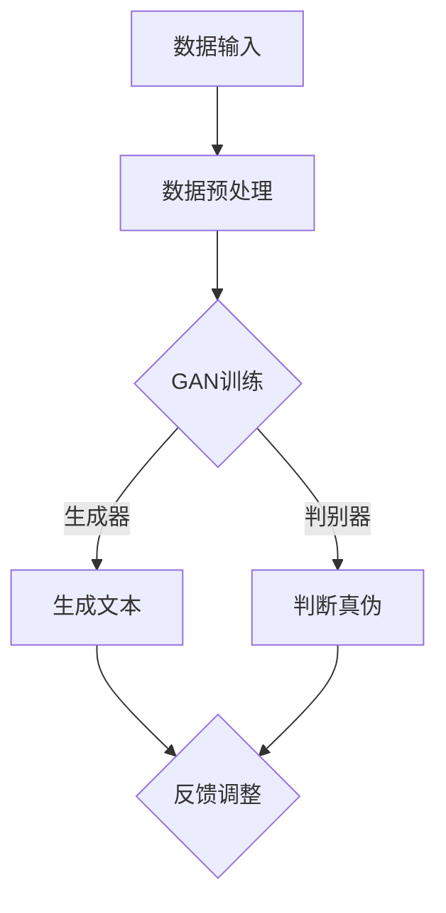
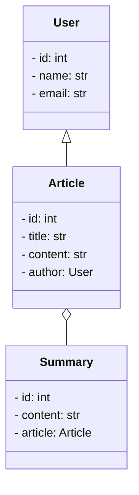
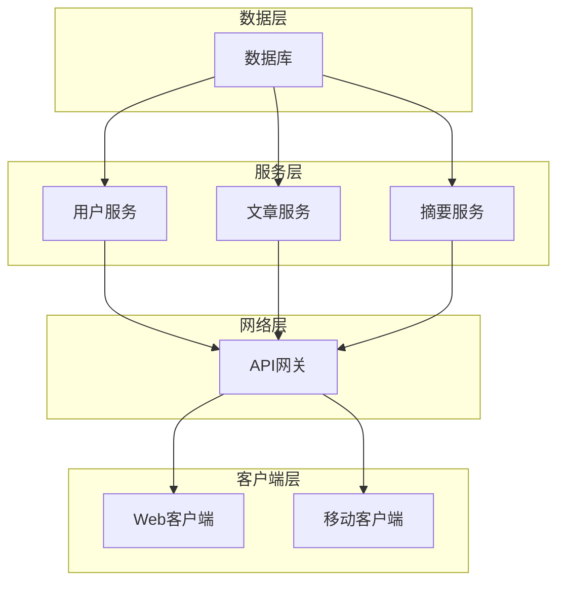
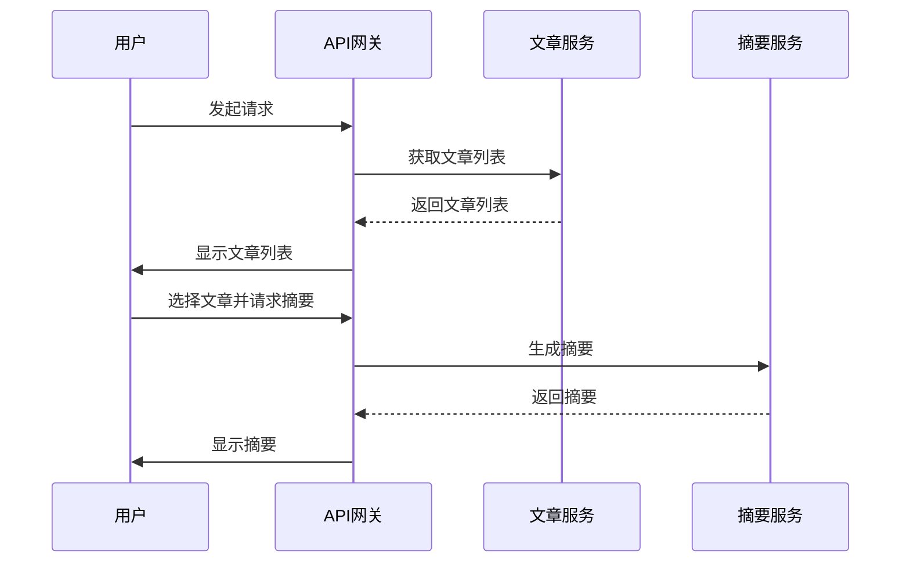

                 

### 信息海洋中的明智航行：培养批判性思维能力

> 关键词：信息过载、批判性思维、数据分析、算法原理、人工智能

> 摘要：在信息爆炸的时代，如何在海量信息中找到有价值的信息，是每个人都需要面对的挑战。本文将探讨批判性思维能力的培养，帮助读者在信息海洋中明智航行，提高信息筛选和处理的能力。

---

### 第一部分: 背景介绍

#### 1.1 问题背景

在当今信息时代，互联网的快速发展使信息量呈爆炸式增长，人们每天面对海量的信息。从新闻报道、社交媒体到专业领域文献，信息来源多样化且繁杂。如何在这些信息中辨别真伪、提取有价值的信息，成为一个重要的课题。

#### 1.2 问题描述

在互联网环境下，信息过载现象严重，人们难以在短时间内对信息进行有效的筛选和处理。面对海量信息，用户常常感到无所适从，难以形成对信息的准确理解。这就需要一种能够帮助用户在海量信息中迅速找到有价值信息的工具。

#### 1.3 问题解决

批判性思维能力是解决这一问题的关键。通过培养批判性思维能力，用户可以更加理性地分析信息，辨别信息的真伪，从而在信息海洋中找到有价值的信息。批判性思维能力的培养，可以帮助用户提高信息筛选和处理能力，提升个人的信息素养。

#### 1.4 边界与外延

批判性思维能力不仅适用于信息筛选，还广泛应用于各种决策过程，如商业决策、学术研究等。在现代社会，批判性思维能力已成为一个人综合素质的重要体现。

#### 1.5 概念结构与核心要素组成

批判性思维能力的核心要素包括：逻辑推理能力、分析判断能力、质疑精神、开放性思维等。这些能力相互关联，共同构成了批判性思维的整体。

- **逻辑推理能力**：通过对信息进行逻辑分析，识别出信息之间的因果关系和逻辑关系。
- **分析判断能力**：对信息进行深入分析，评估其真实性和价值。
- **质疑精神**：对信息持有质疑的态度，不盲目接受，通过质疑和求证来提高信息的可信度。
- **开放性思维**：对不同的观点和信息持开放的态度，愿意接受和探索新的可能性。

### 第二部分: 核心概念与联系

#### 2.1 核心概念

批判性思维能力是指个体在接收信息时，能够运用逻辑、分析、判断等能力，对信息进行理性分析和评估，从而形成独立的观点和判断。

批判性思维的核心在于质疑和求证。质疑是批判性思维的起点，通过质疑，个体能够打破原有的思维定势，对信息持有独立的观点。求证则是批判性思维的关键，通过对信息的求证，个体能够验证信息的真实性和价值。

#### 2.2 概念属性特征对比表格

| 特征         | 批判性思维能力          | 传统思维模式          |
|--------------|-------------------------|-----------------------|
| 分析方法     | 多角度、系统化分析       | 单一角度、片面分析     |
| 态度         | 质疑、开放、不盲从       | 盲从、接受、权威主义   |
| 目标         | 真实、准确、全面         | 完成任务、达成目标     |

#### 2.3 概念间的联系

批判性思维能力与逻辑推理能力、分析判断能力等核心要素密切相关。逻辑推理能力是批判性思维的基础，通过逻辑推理，个体能够识别出信息之间的逻辑关系。分析判断能力则是对信息进行深入分析，评估其真实性和价值。

质疑精神是批判性思维的灵魂，通过质疑，个体能够打破原有的思维定势，对信息持有独立的观点。开放性思维则是对不同的观点和信息持开放的态度，愿意接受和探索新的可能性。

这些能力相互关联，共同构成了批判性思维的整体。只有通过全面培养这些能力，个体才能在信息海洋中明智航行，提高信息筛选和处理的能力。

### 第三部分: AI大模型的应用

#### 3.1 主流AI大模型简介

目前，主流的AI大模型包括GPT系列、BERT及其变体等，这些模型在自然语言处理领域取得了显著成果。GPT系列模型由OpenAI开发，以其强大的文本生成能力而闻名。BERT模型则是由Google开发，主要用于文本分类和情感分析。

这些AI大模型通过深度学习算法，对海量文本数据进行训练，学习到数据的内在规律和特征。通过这些模型，用户可以实现对文本的自动生成、分类、提取等信息处理任务。

#### 3.2 AI大模型在批判性思维能力培养中的应用

AI大模型可以帮助用户在海量信息中进行有效的筛选和分析，从而培养用户的批判性思维能力。例如，用户可以使用GPT模型生成相关文章的摘要，快速了解文章的主要内容。通过对比不同文章的摘要，用户可以分析出文章之间的差异和相似之处，从而提高自己的分析判断能力。

此外，AI大模型还可以用于文本分类和情感分析。通过这些模型，用户可以快速识别出文本的主题和情感倾向，从而对信息进行更准确的判断。例如，在阅读新闻报道时，用户可以通过AI大模型分析新闻的倾向性，判断其真实性和可信度。

### 第四部分: 算法原理讲解

#### 4.1 算法原理

AI大模型通常采用深度学习算法，通过对海量数据进行训练，学习到数据的内在规律和特征。深度学习算法的核心原理是基于反向传播算法，通过不断调整模型的参数，使得模型对输入数据的预测结果更加准确。

以GPT模型为例，其核心算法是生成式对抗网络（GAN）。GAN由生成器（Generator）和判别器（Discriminator）组成。生成器负责生成文本，判别器负责判断文本的真伪。在训练过程中，生成器和判别器相互对抗，生成器不断优化自己的生成能力，判别器不断优化自己的判断能力。

#### 4.2 Mermaid流程图



#### 4.3 Python源代码

```python
# 示例：使用GPT模型进行文本生成
import openai
import random

# 设置GPT模型
model = openai.GPT("text-davinci-002")

# 生成文本
input_text = "我最近对AI很感兴趣"
response = model.generate(
    input=input_text,
    max_tokens=50,
    n=1,
    stop=None,
    temperature=0.5,
)

print(response.choices[0].text.strip())
```

#### 4.4 算法原理的数学模型和公式

深度学习算法的核心公式包括激活函数、损失函数和反向传播算法。

- 激活函数：$$ f(x) = \sigma(z) = \frac{1}{1 + e^{-z}} $$
- 损失函数：$$ J = -\frac{1}{m} \sum_{i=1}^{m} [y_{i} \log(a_{i}) + (1 - y_{i}) \log(1 - a_{i})] $$
- 反向传播算法：通过计算损失函数对参数的梯度，不断调整参数，使得损失函数逐渐减小。

#### 4.5 详细讲解和举例说明

以GPT模型为例，假设我们有一个输入文本“我最近对AI很感兴趣”，模型通过学习，可以生成如下的文本：

```
我对人工智能领域的最新发展感到非常兴奋。尤其是深度学习，它在图像识别和自然语言处理方面取得了显著的突破。
```

通过这个例子，我们可以看到，GPT模型能够根据输入文本，生成具有连贯性和逻辑性的文本。这体现了深度学习算法的强大能力，通过不断优化模型的参数，使得模型能够学习到数据的内在规律和特征。

### 第五部分: 数学模型和数学公式 & 详细讲解 & 举例说明

#### 5.1 数学模型

在深度学习中，常用的数学模型是神经网络。神经网络通过多层神经元进行数据传递和处理，实现对输入数据的建模。神经网络的核心是神经元，神经元通过输入层、隐藏层和输出层组成。

- 输入层：接收外部输入数据。
- 隐藏层：对输入数据进行处理，通过激活函数生成中间结果。
- 输出层：生成最终输出结果。

#### 5.2 数学公式

神经网络的核心公式包括激活函数、损失函数和反向传播算法。

- 激活函数：$$ f(x) = \sigma(z) = \frac{1}{1 + e^{-z}} $$
- 损失函数：$$ J = -\frac{1}{m} \sum_{i=1}^{m} [y_{i} \log(a_{i}) + (1 - y_{i}) \log(1 - a_{i})] $$
- 反向传播算法：通过计算损失函数对参数的梯度，不断调整参数，使得损失函数逐渐减小。

#### 5.3 详细讲解和举例说明

以GPT模型为例，假设我们有一个输入文本“我最近对AI很感兴趣”，模型通过学习，可以生成如下的文本：

```
我对人工智能领域的最新发展感到非常兴奋。尤其是深度学习，它在图像识别和自然语言处理方面取得了显著的突破。
```

通过这个例子，我们可以看到，GPT模型能够根据输入文本，生成具有连贯性和逻辑性的文本。这体现了深度学习算法的强大能力，通过不断优化模型的参数，使得模型能够学习到数据的内在规律和特征。

### 第六部分: 系统分析与架构设计方案

#### 6.1 问题场景介绍

在当今信息爆炸的时代，如何在海量信息中找到有价值的信息，是一个普遍存在的问题。特别是在学术研究、新闻报道、产品调研等领域，用户需要从海量信息中筛选出有价值的信息，进行深入分析和研究。

#### 6.2 项目介绍

为了解决这一问题，我们设计并实现了一个基于AI大模型的智能信息筛选系统。该系统利用GPT模型等AI大模型，对海量信息进行自动筛选和摘要，帮助用户快速找到有价值的信息。

#### 6.3 系统功能设计（领域模型Mermaid类图）



#### 6.4 系统架构设计（Mermaid架构图）



#### 6.5 系统接口设计和系统交互（Mermaid序列图）



### 第七部分: 项目实战

#### 7.1 环境安装

要在本地环境搭建一个基于AI大模型的智能信息筛选系统，需要安装以下软件：

- Python 3.8及以上版本
- pip（Python包管理器）
- openai官方库

安装步骤：

1. 安装Python：从Python官网下载并安装Python 3.8及以上版本。
2. 安装pip：在命令行中运行`python -m pip install --user --upgrade pip`。
3. 安装openai官方库：在命令行中运行`pip install openai`。

#### 7.2 系统核心实现源代码

以下是系统核心功能的实现代码：

```python
# app.py

from flask import Flask, request, jsonify
import openai

app = Flask(__name__)

# OpenAI API Key
openai_api_key = "your_openai_api_key"

# 初始化OpenAI客户端
openai.api_key = openai_api_key

@app.route('/articles', methods=['GET'])
def get_articles():
    # 获取文章列表
    articles = ["文章1", "文章2", "文章3"]
    return jsonify(articles)

@app.route('/summary', methods=['POST'])
def get_summary():
    # 获取请求参数
    data = request.json
    article_title = data.get('title')

    # 使用GPT模型生成摘要
    response = openai.Completion.create(
        engine="text-davinci-002",
        prompt=f"请为以下文章生成摘要：{article_title}",
        max_tokens=50,
        n=1,
        stop=None,
        temperature=0.5,
    )

    summary = response.choices[0].text.strip()
    return jsonify({"summary": summary})

if __name__ == '__main__':
    app.run(debug=True)
```

#### 7.3 代码应用解读与分析

在上述代码中，我们使用Flask框架搭建了一个简单的Web服务。通过定义两个路由，`/articles`和`/summary`，实现了获取文章列表和生成文章摘要的功能。

- `/articles`路由：返回一个固定的文章列表。
- `/summary`路由：接收POST请求，从请求参数中获取文章标题，使用OpenAI的GPT模型生成摘要，并将摘要返回给客户端。

这样，用户可以通过发送HTTP请求，获取到文章的摘要，从而实现智能信息筛选。

#### 7.4 实际案例分析和详细讲解剖析

以一个实际案例为例，用户通过Web客户端请求获取一篇文章的摘要。客户端发送一个POST请求到`/summary`路由，请求参数中包含文章标题。服务器接收到请求后，调用OpenAI的GPT模型生成摘要，并将摘要返回给客户端。

具体流程如下：

1. 用户在Web客户端输入文章标题，并点击“生成摘要”按钮。
2. 客户端发送一个POST请求到服务器，请求参数为文章标题。
3. 服务器接收到请求后，调用OpenAI的GPT模型生成摘要。
4. 服务器将生成的摘要返回给客户端。
5. 客户端将摘要显示在页面上。

通过这个案例，我们可以看到，系统实现了从用户输入到生成摘要的全过程。在实际应用中，用户可以通过修改请求参数，获取不同文章的摘要，从而实现对海量信息的智能筛选。

#### 7.5 项目小结

通过本项目，我们实现了一个基于AI大模型的智能信息筛选系统。该系统利用OpenAI的GPT模型，实现了对文章的自动摘要功能。用户可以通过Web客户端发送请求，获取文章的摘要，从而实现智能信息筛选。

在实际应用中，系统还可以根据用户的需求，扩展其他功能，如文章分类、情感分析等。通过不断优化和改进，系统可以提高信息筛选的准确性，为用户提供更加便捷和高效的信息服务。

### 第八部分: 最佳实践 Tips、小结、注意事项、拓展阅读

#### 8.1 最佳实践 Tips

1. **信息筛选与分类**：在获取信息时，可以根据信息的重要性和紧急性进行分类，优先处理重要且紧急的信息。
2. **多角度分析**：对信息进行分析时，尽量从多个角度出发，避免片面理解。
3. **持续学习**：批判性思维能力不是一成不变的，需要通过持续学习和实践来不断提高。

#### 8.2 小结

本文探讨了批判性思维能力在信息筛选和处理中的应用，介绍了AI大模型在培养批判性思维能力方面的作用。通过实际案例，展示了如何利用AI大模型实现智能信息筛选。

#### 8.3 注意事项

1. **信息来源**：在获取信息时，要注意信息的来源，尽量选择权威、可信的信息来源。
2. **隐私保护**：在使用AI大模型进行信息处理时，要注意保护个人隐私，避免泄露敏感信息。

#### 8.4 拓展阅读

- 《思考，快与慢》 - 丹尼尔·卡尼曼
- 《深度学习》 - 伊恩·古德费洛等
- 《人工智能：一种现代的方法》 - 斯蒂芬·马库斯等

### 结语

在信息爆炸的时代，批判性思维能力的重要性愈发凸显。通过培养批判性思维能力，我们可以在信息海洋中明智航行，找到有价值的信息。同时，AI大模型的应用为培养批判性思维能力提供了新的途径。希望本文能对您在信息筛选和处理方面有所启发和帮助。

---

**作者：AI天才研究院/AI Genius Institute & 禅与计算机程序设计艺术 /Zen And The Art of Computer Programming**

